# 哈佛CS50-AI ｜ Python人工智能入门(2020·完整版) - P22：L6- 自然语言处理 3 (信息抽取，词网，word2vec) - ShowMeAI - BV1AQ4y1y7wy

现在我们不关心顺序，当我们进入语义世界时。我们确实开始关心这些词的实际含义！

这些词如何相互关联，特别是我们如何从文本中提取信息。信息抽取就是从我们的文档中提取知识，弄清楚给定一大堆文本，我们能否自动化AI的过程。

查看这些文件，提取出什么。

这些文件中有用或相关的知识是，因此让我们看一个例子。我将给你两个来自新闻文章的样本，上面是《哈佛商业评论》的新闻文章样本，关于Facebook，下面是《商业内幕》的文章示例。

关于亚马逊的2018年信息。

这里有一些信息，我们可能希望AI能够提取。关于这些公司的知识，我们可能想要提取，特别是我想提取的数据，比如我想知道公司的成立时间，但我想知道Facebook是在。

在2004年成立，1994年成立的重要信息，我对此非常关心。我该如何从文本中提取这些信息？我如何理解这段文字并弄清楚所有内容？好吧，Facebook是在2004年成立的，我可以寻找模板或。

这种模式出现在多个不同文档中，给我对这种知识的含义有一些理解。我们会注意到这两段之间的一个共同模式，就是这种表达：“Facebook是在2004年成立的，”然后下面是“亚马逊是在。”

成立于1994年，而这两个模板最终为我们提供了一种提取信息的机制，即当公司在年份成立时，逗号。这个！

能告诉我们某个公司成立时间的信息，因为如果我们让AI在网上搜索，让它查看一大堆论文或文章，并找到这种模式：“在blank成立于blank，”，那么我们的AI可以合理地得出结论。

这将是某个公司的名称，而这将是该公司成立的年份。例如，可能不是完美的，但至少这是一个好的启发式方法。所以你可以想象，如果你想训练一个AI来查找信息，你可以给AI这样的模板，不仅提供。

现在的想法是，人工智能可以开始寻找模板，比如“当公司____成立于____”，但也可以给它类似“书籍____是由____编写的”的模板，例如，给它一些模板，让它在网络上搜索，查找与之匹配的文档。

好的，这里是公司和年份，但这当然需要我们编写这些模板，需要我们弄清楚这些信息的结构可能是什么样子的，而不同的网站显然会以不同的方式处理这种类型。

这种方法无法提取所有的信息，因为如果词语的顺序稍微不同，它就无法匹配特定的模板，但我们可以做的一件事是。！

我们可以将数据提供给人工智能，而不是给人工智能模板。我们可以告诉人工智能，比如说Facebook成立于2004年，亚马逊成立于1994年，然后让人工智能处理这两条信息，然后在网络上自由搜索。

在2004年，Facebook和1994年的亚马逊可以一起出现，它可以自行发现这些模板，它可以发现“当____成立于____”这种措辞往往将Facebook与2004年关联，将亚马逊与1994年关联，因此也许它会将其他公司与此类关系联系起来。

这最终成为一种自动化模板生成的方式，结果相当强大。我们现在就来看看我在模板目录中有一个名为公司（company）的CSV文件，这就是我将要提供给我的人工智能的所有数据。

这是亚马逊1994年和Facebook 2004年，而我将告诉我的人工智能去搜索文档语料库中的其他数据，这些对，比如其他的关系。我并没有告诉人工智能这是一家公司及其成立的日期，我只是提供亚马逊1994年和Facebook 2004年。

让人工智能做其余的工作，人工智能将会查看我的语料库，这是我的文档语料库，它将找到像在《商业内幕》中的句子，比如“亚马逊成立于2004年”，这种措辞将会类似于。

如果找到匹配，它就能够识别出这样的信息，比如《哈佛商业评论》的一个故事，其中有句子“Facebook成立于2004年”，它将会在其他许多文档中寻找类似的模式，以提取这种信息。！

如果我继续运行，我会进入模板。我会说Python搜索PI，我将要。查找公司目录中像CSV那样的数据，里面包含了我提前策划的一大堆新闻文章。这里是我得到的关于谷歌的内容。

1998年苹果 976 微软 1975等等，沃尔玛1962年，例如这些。都是与我们之前能够找到的相同模板相匹配的数据。它是如何找到这些的呢？很可能是因为如果我们查看像是，福布斯文章的例子，它有一个。

像“沃尔玛成立于1962年”的短语，它能够。识别这些类型的模式并，从中提取信息。现在，当然，我已经提前策划了所有这些故事，以确保。能够匹配的数据，而实际上并不总是。

当你看到与成立年份相关的公司时，必须以这个确切的格式出现。但如果你给人工智能足够的数据，比如互联网上的所有文本数据，并且让人工智能爬行互联网。寻找信息，它可以非常可靠或以某种概率尝试。

并提取信息，你，这些类型的模板能够。生成有趣的知识感知，而它学习的知识越多，。它能够构建的新模板就越多，寻找在其他地方出现的构造。让我们来看另一个例子。

然后我会向你展示总统的CSV，其中我有两位总统和他们的就职日期：乔治·华盛顿1789年，巴拉克·奥巴马2009年，例如，我。还将给我们的人工智能一个语料库，里面只包含一份文件。即美国总统名单的维基百科文章。

例如，仅仅是关于的信息。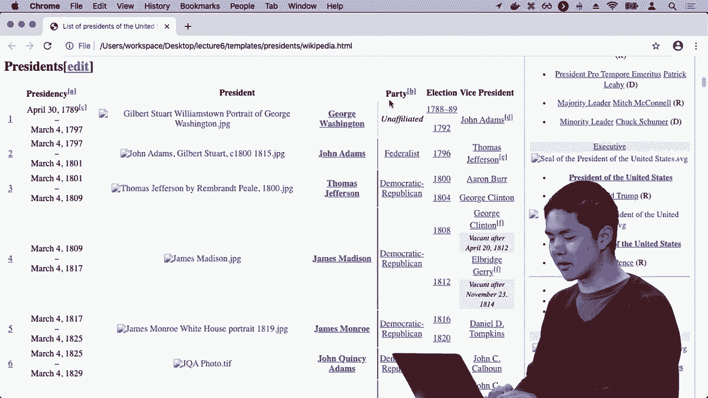

总统，我想从这个网页上的原始HTML文档提取关于总统的信息，因此。 我可以说搜索总统的CSV。总统，我得到的是一大堆关于总统的数据，和他们可能的就职年份，通过寻找与巴拉克·奥巴马2009年匹配的模式。

例如，寻找这些类型的模式，给我们一些线索，了解这个故事。大致是关于什么的，这里是另一个。

例如，如果我打开奥运会内部，这里是奥运会主页的抓取版本，其中有关于。各种不同奥运会的信息，也许我。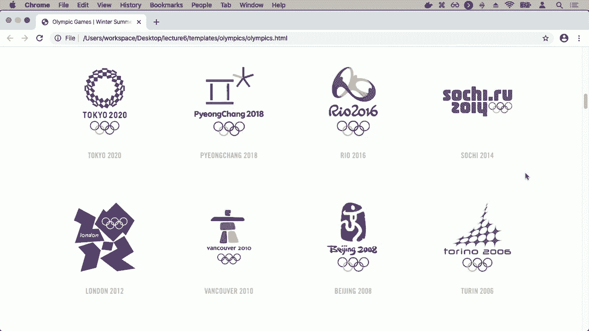

想要从这个特定页面提取奥运会地点和年份。好吧，我可以用完全相同的算法来做到这一点，我只是说。好吧，这里有两个奥运会以及它们的地点。

它们的位置信息，比如2012年伦敦，比如让我运行这个Python搜索，查看奥运会的CSV，查看所有奥运数据集，现在我得到一些信息返回，虽然这些信息并不完全完美。

有几个例子显然不太正确，因为我的模板可能太笼统，比如可能在寻找某个广泛类别的事物，而某些奇怪的事情恰好捕捉到了这个特定模板，因此你可以想象添加规则来尝试使。

这个过程更加智能，确保左侧的东西只是一个年份，例如，进行其他各种分析，但纯粹只是基于某些数据，我们能够提取一些有趣的信息。使用某些算法，所有搜索实际上就是在进行数据的提取。

数据语料库，找到与之匹配的模板，这里我正在过滤，只查看恰好匹配的前两个模板，然后使用这些模板从我能够访问的数据中提取结果，能够寻找我关心的所有信息，而这最终将会。

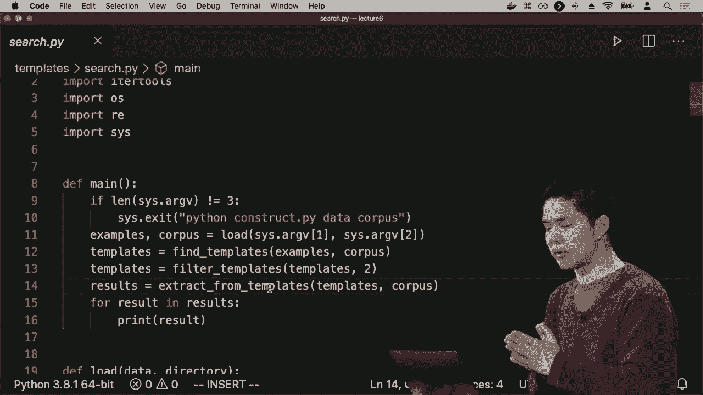

帮我打印出这些结果，以找出匹配项。因此，信息提取是另一个强大的工具，旨在提取信息，但当然它仅在非常有限的上下文中有效。它只在我能够找到完全相似的模板时有效。

这样做是为了得出某种结果。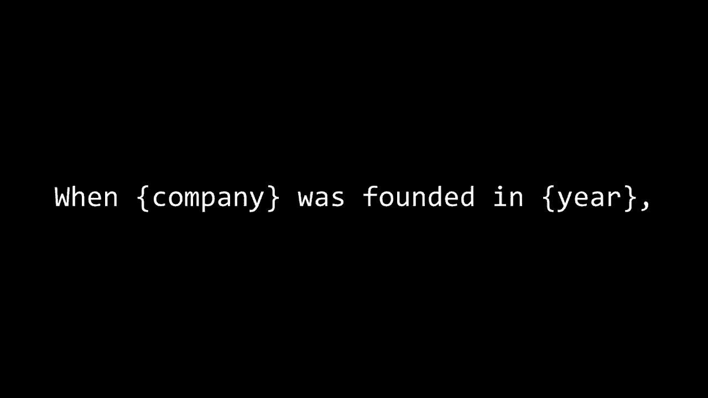

匹配能够将其连接到某对数据的，这家公司成立于这一年。我想做的是开始考虑词语的语义，并设想一些定义所有词语的方式，能够将字典中的所有词关联起来。

彼此之间，因为这最终是必要的，如果我们希望我们的人工智能能够沟通，我们需要某种表示来表达词语的含义，而一个著名的数据集叫做词网（WordNet）。词网是人类策划的，研究人员共同策划了一个。

一大堆词语及其定义。

它们的各种不同含义，因为一个词可能有多个不同的意思，以及这些词之间的关系。

彼此相关，因此我们的意思是，我可以向你展示一个词网的例子，词网内置于NLTK中，使用NLTK你可以下载并访问词网，所以让我进入词网，并运行词网，提取一个词的信息，比如“城市”这个词，去查看它的印象。

返回的信息是，我关于城市的信息，结果发现，城市有三种不同的感知，根据WordNet有三种不同的含义，这其实就像一本字典，每种感知都有其对应的含义，定义由人提供。

例如，一个单词所属的类别，一个城市是一种市政类型，城市是一种行政区，这让我能够将单词与其他单词关联起来。因此，WordNet的一个优势是能够将一个单词与我们可能感兴趣的其他相关单词连接起来。

例如，如果我再做一个例子，试试“房子”这个词。我输入“房子”，看看我能得到什么，好的，房子是一种建筑，房子在某种程度上与家庭单位相关。因此，你可能想象出这些不同的关联方式。

这是一个建筑和居住地，研究人员已经整理了这些不同单词之间的关系，以说明。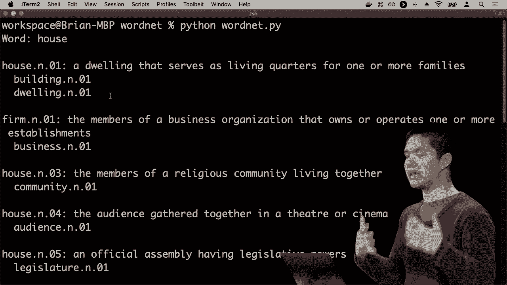

比如说，房子是一种建筑，房子是一种居住地。但这种方法虽然在能够将单词关联起来时非常有帮助，但随着语言的变化以及各种变化的思考，它并不特别适用。

单词之间可能存在的不同关系。这一单词表示的挑战最终变得困难，但我们所做的就是定义一个单词，就像一句话那样，解释这个单词的意思。但我们真正希望以某种方式表示一个单词的意义。

我们希望我们的人工智能能够以某种方式，随时利用这些信息做有用的事情。我们希望我们的人工智能能够看懂文本，并真正理解这些文本的含义，将文本和单词与相似的单词关联起来，并理解单词之间的关系，我们希望有某种方式让计算机能够表示。

我们在整个课程中多次看到的信息是，当我们希望我们的人工智能表示某些东西时，使用数字来表示可能是有帮助的。我们看到，我们可以将游戏中的效用（如胜利、失败或平局）表示为数字1。

负数、一、二、零，我们已经看到了其他方式，可以将数据转换为特征向量，其中我们有一堆数字表示某些特定的数据。如果我们想将单词输入到神经网络中，例如能够给定一些描述房子的内容。

将这个句子翻译成另一个句子，或者能够用神经网络对单个词进行有趣的分类，我们需要某种词的表示，仅仅是通过向量的方式来表示两个词。我们该如何做到呢？我们如何将词转换成向量？

我们可以用来表示这些词含义的一种方法是，如果我有四个词，我想编码“他写了一本书”。我可以说，让“他”是这个向量`1 0 0 0`，写是`0 1 0 0`，而“书”则是`0 0 0 1`。实际上，我所拥有的就是这样的表示。

这被称为**独热表示**或**独热编码**，它是一种含义表示，其中的含义。

这是一个只在一个位置有1，其他位置全是0的向量。1的位置告诉我这个词的含义，在第一个位置的1意味着“他”，在第二个位置的1意味着“写”，字典中的每个词都会被分配一个这样的表示。

只需在向量中分配一个位置，那个位置对这个词为1，其他词为0。现在我有了不同词的表示，这就是所谓的**独热表示**。那么，这种方法有什么缺点呢？为什么这并不一定是一个好的方法呢？

我只创建了足够的向量来表示字典中的四个词。如果你想象一个包含50,000个词的字典，我可能想表示的这些向量会变得异常庞大，这些是50,000维的向量，用来表示50,000个词的词汇。

后面的“写”有一大堆零，这不是一个特别易于处理的方式，如果我必须处理长度为50,000的向量。另一个问题是，我希望这些向量在某种程度上能够表示它们之间的含义。

如果我有句子“他写了一本书”和“他创作了一部小说”，我可以从中提取有用的信息。这里“写”和“创作”将是两个完全不同的向量，而“书”和“小说”在我的向量空间中也会是两个完全不同的向量，它们之间没有任何关系。

这两个词只是位于不同的位置，而我真正希望的是“写”和“创作”有相似的向量表示，“书”和“小说”的向量表示也应该相似，因为它们是含义相关的词。

理想情况下，我希望当我将它们放入向量形式并用向量来表示含义时，这些向量彼此之间也应相似。因此，与其使用这种独热表示，即通过给一个词一个在某个位置为1的向量来表示其含义，

在特定位置，我们将要做的事情是一个有点奇怪的事情，第一次看到时会觉得陌生，这就是我们要称之为的分布式表示，我们将用一大堆不同的值来表示一个词的意义，而不仅仅是一个值和其余的零。

一大堆数值，比如他写了一本书，可能是一个大的向量，也许有50维，也许有100维，但肯定不会是数万维，每个值都是一个数字。写了一本书的想法是用这些。

向量表示，我希望“写作”和“作者”这两个词的向量表示非常接近，它们之间的距离不会太远，书和小说的向量表示也是如此。因此，这将是许多统计机器学习的目标。

自然语言处理的方法就是使用这些词的向量表示，但我们究竟该如何定义一个词呢？它就像是一串串数字，那么谈论一个词的意义到底是什么意思呢？对此，著名的。

回答这个问题的引用来自20世纪50年代的英国语言学家J.R. Firth，他说：“你将通过……了解一个词。”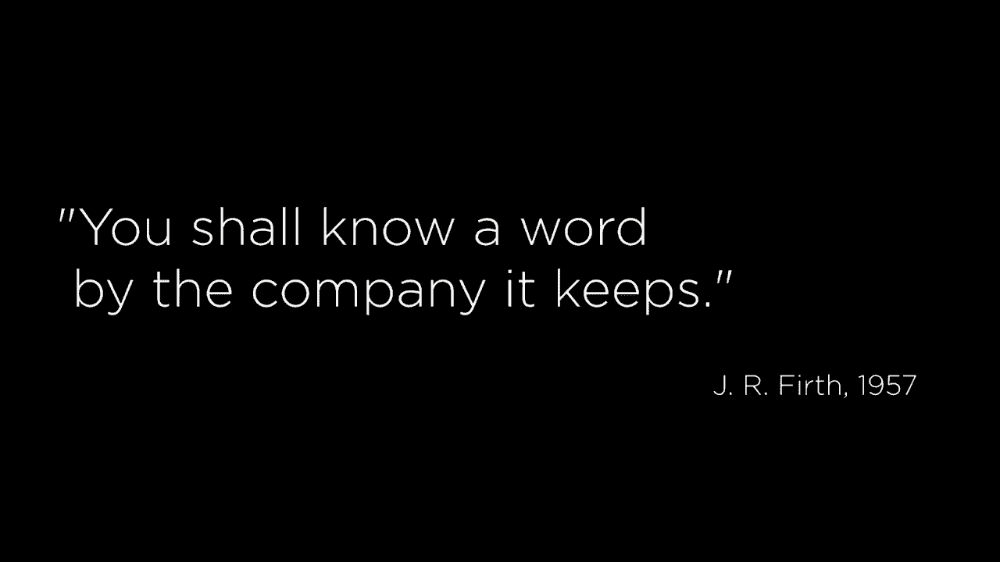

你可以通过与之相伴的词来了解一个词的意义，我们的意思是，定义一个词的方式就是根据那些出现在它周围的词来确定这个词的意义，如果我有这样一个句子。

他吃什么的空白处需要填的词。

你可能想象，在英语中，填补空白的词可能是像早餐、午餐或晚餐这样的词，这些就是填入那个空白的词。因此，如果我们想定义午餐或晚餐的意义，可以通过它们周围出现的词来定义。

如果一个词在特定上下文中出现，而另一个词恰好在非常相似的上下文中出现，那么这两个词就有关系。

它们可能彼此相关，可能具有相似的意义，这就是。

一个被称为“词向量”的算法的基础思想是生成词向量的模型，你给“词向量”一个文档语料库，也就是一大堆文本，而“词向量”将为每个词生成向量，有多种方法可以做到这一点，一种常见的方法是。

通过被称为Skip-gram架构的方法，该架构基本上使用神经网络预测上下文单词，给定一个目标单词，因此，给定一个单词，如“午餐”，使用神经网络尝试预测给定单词“午餐”周围将出现哪些单词，这就是我们可能表示的方式。

对于这样一个大型神经网络，我们为每个单词设置一个输入单元，每个单词在这个神经网络中都有一个节点，目标是使用这个节点网络来预测给定目标单词的上下文单词，比如“午餐”，我能否预测其他单词出现的概率。

比如说在上下文中相隔一个单词或两个单词的情况，如果你给AI这个神经网络大量的单词数据，以及单词在上下文中出现的情况，你可以训练一个神经网络来进行这个计算，能够预测给定的目标单词。

我能否预测那些上下文单词最终应该是什么，并且将使用我们所讨论的相同方法，从上下文单词反向传播误差通过这个神经网络，得到的结果是如果我们只使用一个单层的隐藏节点。

每个单词，我得到的，比如说从这个单词，我得到五条边，每条边都有一个权重对应于这五个隐藏节点，换句话说，我得到了五个数字，然后有效地表示这个特定的目标单词，以及我在这里选择的隐藏节点数量。

在这里的中间层，我可以选择可能有50个隐藏节点或100个隐藏节点，然后对于每个目标单词，我将有50个不同的值或100个不同的值，这些值我们可以有效地视为该单词的新向量表示。

这里的基本思想是，如果两个单词相似，它们在相似的上下文中出现。换句话说，使用这些相同的目标单词，我想预测相似的上下文，那么这些向量中的值我选择的这些向量，这些边的权重的数值可能。

因为对于出现在相似上下文中的两个不同单词，我希望计算出的这些值最终非常相似，因此，最终你可以高层次地想象，这个单词的Tyvek训练方法将会做什么。

给定一堆单词，最初我们随机初始化这些权重，选择随机权重，随着训练神经网络，我们会调整这些权重，调整每个单词的向量表示，使得在某种上下文窗口中，逐渐出现的单词。

相似的上下文彼此靠近，而在不同上下文中出现的单词则相距较远。

我希望能得到像`breakfast`、`lunch`和`dinner`这样的词的向量表示，它们彼此相似，而像`book`、`memoir`和`novel`这样的词也是彼此相似的。因此，使用这个算法，我们能够处理一组数据并进行训练。

我们训练这台计算机，训练这个神经网络，以便找出哪些向量、哪些数字序列将代表这些单词。这是一个有点奇怪的概念，想象一个单词仅用一堆数字表示，但我们马上就会看到它的强大之处。

这真的很有趣，所以我们继续进入`vectors`，我将打开`vectors.py`，现在我打开的是`words.txt`，这是一个预训练模型，我已经运行过Word2Vec，它已经为每个可能的单词给了我一堆向量，我只想取50个。

我们将它们保存到一个名为`words`的字典中，然后我还定义了一些函数，比如`distance`和`closest words`，这些函数将告诉我某个特定单词的最接近单词，以及`closest word`函数，它只会给我一个最接近的单词。

例如，现在让我尝试做这件事，让我打开Python解释器并说点什么。像是从`vectors`中导入`star`，也就是从`vectors`中导入所有内容，现在让我们看看一些单词的含义，比如`city`这个词。

`city`这个词，这些数字究竟代表什么并不重要，但这就是我的计算机如何表示`city`这个词的含义。然后是像`house`这样的不同单词，这里是`house`的向量表示，仅仅是一堆数字。

这在某种程度上编码了`house`这个词的含义。那我如何获取这个想法呢？一种衡量其优劣的方法是查看不同单词之间的距离。在向量上下文中，定义距离的方式有很多种，常见的方式是使用。

被称为余弦距离，它与测量向量之间的角度有关。简而言之，它只是测量这两个向量之间的距离。所以如果我取一个词，比如`book`，它与自己之间的距离有多远？`book`与`book`的距离是多少？

这就是零，`book`这个词与它自己之间的距离为零。但我们来看看`book`这个词与像`breakfast`这样的词有多远。我们可以说，一个是很远的，零是很近的。好吧，`book`与`breakfast`的距离大约是0.64，似乎相距很远，但现在让我们尝试。

计算单词之间的距离，比如“书”和“小说”这两个词，例如这两个词彼此更接近，点三四，单词“书”的向量表示比“早餐”的向量表示更接近单词“小说”的向量表示。

我可以做同样的事情，比如比较“早餐”和“午餐”，例如这两个词更加接近，它们之间有更加相似的关系。所以现在看起来我们有一些表示单词的方式，使用向量来表示一个单词，使我们能够。

能够说出像是相似的单词，最终在它们之间会有一个小距离，而这证明了在代表单词的意义时，可以用它们与其他单词的关系来表示，这是非常强大的，我也可以给你展示，我有一个函数。

叫做“最近单词”，基本上只需获取一堆单词并获取与其最接近的单词，所以让我获取最接近的单词，比如“书”，例如，也许我获取大约十个最近的单词，我们将自己限制为十个，而单词“书”显然与它自己最接近。

还与像“书”和“论文”、“回忆录”、“论文”、“中篇小说”、“选集”等密切相关。为什么这些单词我能够让计算机接近呢？因为基于这个算法训练的语料库，向量就像玫瑰一样，基于在类似上下文中出现的单词。

单词“书”在类似的上下文中出现，类似的其他单词也类似于“回忆录”和“论文”，例如，如果我做一些事情，比如获取与“城市”最接近的单词，你最终会得到“城市”、“镇”、“乡镇”、“村庄”，这些单词恰好出现在与“城市”相似的上下文中。

现在有趣的是，因为这些是向量，我们可以对它们进行数学运算。我们可以计算不同单词之间的关系，所以我可以。

比如说，好吧，如果我有“男人”和“国王”，这两个是不同的向量，而这是一个著名的。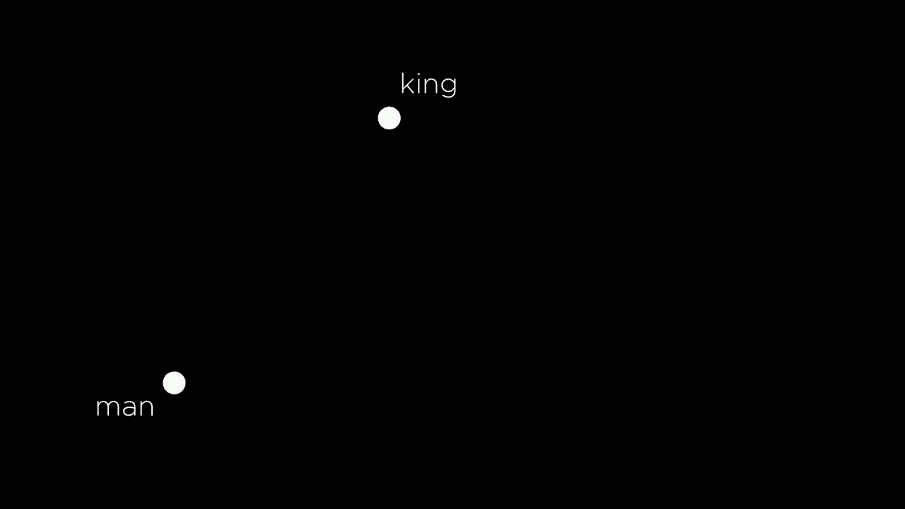

例子来自单词“Tyvek”，你知道，我可以将这两个向量相减，这里这条线，这里的距离又是另一个。

表示像“国王 - 男人”的向量，现在从一个单词中减去另一个单词，这在向量的世界里通常是没有意义的，不过你可以取某个向量，某个数字序列来进行减法。

其他数字序列并获得新的向量，得到新的数字序列，而这个新的数字序列实际上将告诉我，从“男人”到“国王”需要做什么，这两个单词之间的关系是什么，而这就是某种向量。

描述了如何从“男人”到“国王”，然后我们可以再取。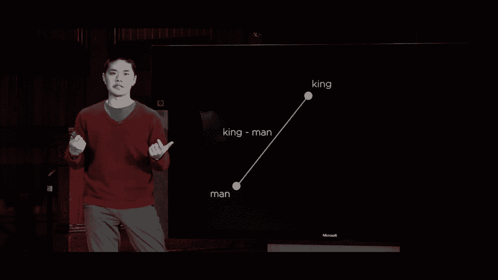

这个值并将其添加到另一个向量中，你可能会想象，“女人”这个词例如，是在这个空间的某个地方存在的另一个向量，如果我采取这个相同的思路“国王 - 男人”，然后添加“女人”，我们会发现什么。

这里有一个有趣的问题，我们可以很容易地回答，因为我拥有所有这些事物的向量表示。我可以说，让我们回去看看“男人”这个词的表示。这里是“男人”的向量表示，让我们看看它的表示。

“国王”这个词的表示，这里是“国王”的表示，我可以将这些从“国王”减去“男人”，进入这个数组，很多值，所以“国王 - 男人”现在在某种数值向量格式中表示了“国王”和“男人”之间的关系。那么，如果我添加“女人”到这个值，比如说，是什么将我们从。

“男人”到“国王”，继续应用同样的向量到“女人”的向量表示，这给了我们这个向量，现在出于好奇，让我们取这个表达，找出与这个表达最接近的单词，惊人的是我们得到的是。

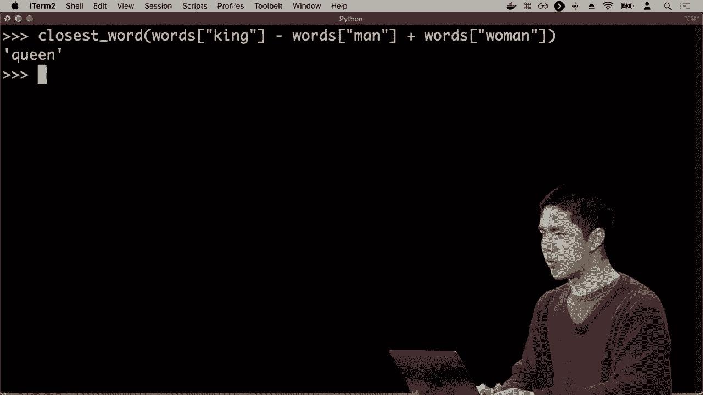

我们得到的“女王”这个词，似乎在你测量“男人”和“国王”之间的不同距离时，这个数字表示了“男人”与“国王”的关系。

将“国王”和“男人”的相同概念添加到单词的向量表示中。“女人”得到的结果是，我们得到了接近于单词“女王”的向量表示，因为这种距离以某种方式编码了这两个单词之间的关系，当你通过这个算法运行时。

它并不是被编程来做这个，但如果你试着找出如何根据上下文词来预测单词，你会得到能够基于所提供信息生成类似SAT类比的向量，这里有更多的例子，我们可以说，好吧，让我们找出。

巴黎和法国之间的距离是什么，所以巴黎和法国是单词，各自都有向量表示，那么这是巴黎和法国之间的距离的向量表示，像是从法国到巴黎的距离。让我继续将“英国”的向量表示添加到这里。

因此，这是巴黎 - 法国加上英格兰的向量表示，朋友和巴黎之间的距离作为向量，添加英格兰向量，让我们找到最接近的词，结果是伦敦。你进行这种关系。

法国和巴黎，继续添加英格兰向量，最接近的向量是伦敦的向量，我们可以进行更多的例子。我可以说，让我们取“教师”的向量表示，并减去“学校”的向量表示，那么。

我们所剩下的是，从“学校”到“教师”的关系，并将该向量应用于“医院”这个词，看看最接近的词是什么，结果发现最接近的词是“护士”。让我们再试几个例子，比如“拉面”的最接近词，减去与日本的最接近词。

日本和拉面之间的关系，添加“美国”这个词，猜测一下结果是什么，结果是你得到了“卷饼”作为关系，如果你进行减法和加法，这就是答案！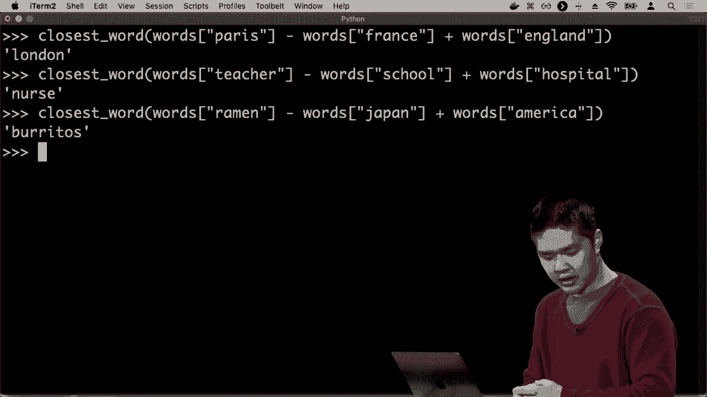

结果会引出非常有趣的类比，这些类比存在于这两个词之间。如果你将所有这些词映射到一个向量空间，你可以得到一些相当有趣的结果，这种表示词的想法。

将词作为向量来处理是极其有用和强大的，尤其是当我们想进行与自然语言相关的统计工作时，可以不仅仅将词表示为其字符，而是将其表示为数字，这些数字能够传达某种意义。

单词本身与其他单词之间的关系以某种方式关联起来，这些工具使我们能够在自然语言这个领域中工作，处理语言的句法和语义很棘手，但我们确实。

这只是一些基本思想的开始，这些思想支撑着许多自然语言处理的能力，比如从文本中提取信息，从中获取某种意义，生成句子，可能通过了解语法，或者仅仅通过观察。

基于其他先前出现的单词，计算哪些单词可能会出现的概率，最后能够将词转化为某种分布式表示，将词表示为数字，并利用这些数字传达某种信息。

对这些词汇的意义也是如此，因此这是在人工智能这个更广泛主题下的另一个话题。回顾一下我们所经历的，我们开始我们的讨论时谈论的是搜索世界，尝试解决问题。

类似于井字棋，通过寻找解决方案，探索我们各种不同的可能性，并查看我们可以应用哪些算法，以有效地尝试搜索空间。我们研究了一些简单的算法，然后研究了我们可以对这些算法进行的优化。

最终，这些都服务于让我们的AI了解世界的尝试，这也是我们今天讨论的很多内容，试图从文本信息中提取知识，具备从中提取信息的能力。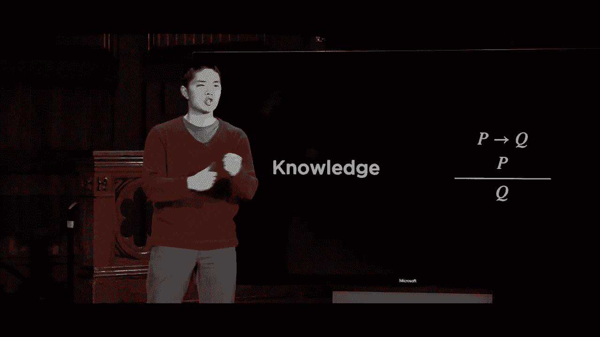

根据这些信息得出结论，如果我知道这两个。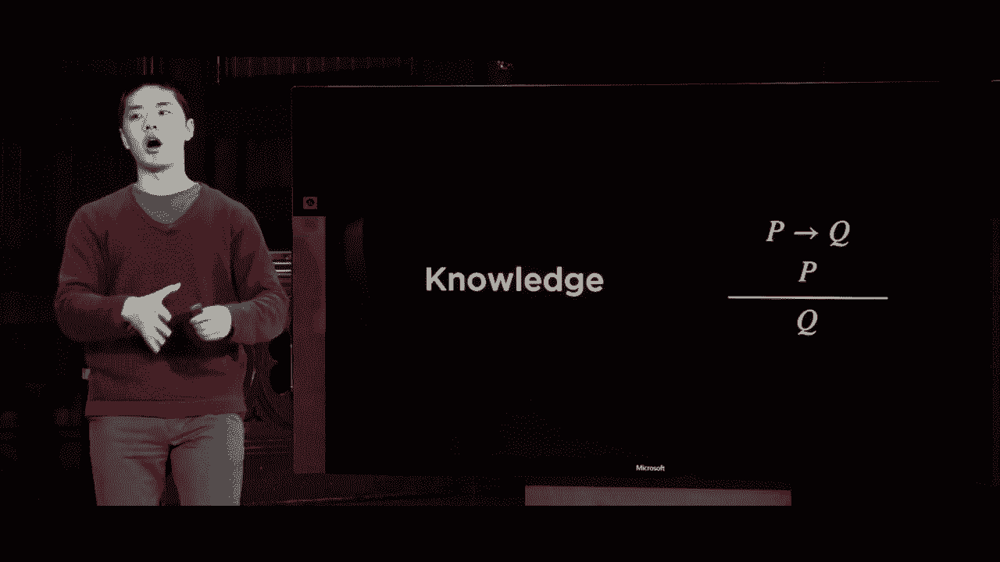

也许我可以得出第三个结论，那就是与不确定性相关的词汇。如果我们对某事没有确切的了解，我们能否预测某事，并找出某事的概率？今天我们再次看到这一点，试图预测一条推文或。

无论消息是积极情绪还是消极情绪，试图得出这样的结论。然后我们研究了优化，寻找局部的。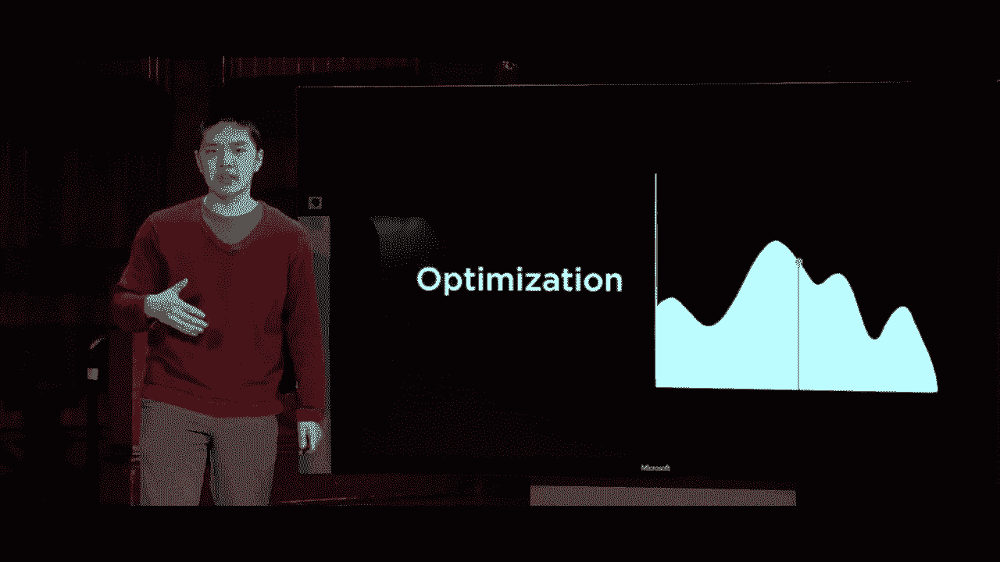

全局或局部最大值或最小值，这一点一次又一次地出现。尤其是在最近的神经网络背景下，神经网络实际上是一种优化问题，我们试图最小化基于我们神经网络权重设置的总损失。

基于我们所选择的词汇向量表示，这最终帮助我们能够解决与学习相关的问题，具备从大量数据中提取模式的能力，而不是告诉AI该做什么，让AI从数据中学习。

让它自己去发现什么使收件箱消息与垃圾邮件不同，让它找出伪钞与真钞之间的区别，并能够进行这样的分析。我们使用的一个重要工具是神经网络，这些结构使我们能够关联事物。

通过训练这些神经网络将输入转化为输出，以学习某种函数，将我们从某个输入映射到某个输出，最终形成另一种人工智能语言模型，以便与我们的AI进行沟通。最后，今天我们探讨了一些AI可以使用的方法。

开始与我们沟通，探索人工智能如何开始理解语言的语法和语义，以便能够生成句子，预测关于书面或口头语言（如英语）所写文本的内容，并能够做到这一点。

这里有一个有趣的分析，同时在积极研究中还有更多的内容，这些研究正在人工智能的各个领域进行。我们实际上只见到了人工智能所能提供的开始，所以我希望你喜欢这次探索人工智能的世界。

非常感谢Python课程的教学人员和制作团队，让这门课成为可能，这是一段介绍。
