# 哈佛CS50-AI ｜ Python人工智能入门(2020·完整版) - P3：L0- 搜索算法 2 (广度优先搜索，贪心搜索，A＊算法) - ShowMeAI - BV1AQ4y1y7wy

另外，深度优先搜索只是我们可以使用的多种搜索选项之一，事实证明还有另一种算法叫做广度优先搜索，它的行为与深度优先搜索非常相似，只是一个区别是它不会总是探索搜索树中最深的节点，像深度优先搜索那样。

广度优先搜索总是会探索边界中最浅的节点，这意味着什么呢？这意味着我们不会像深度优先搜索那样使用栈，后者最近添加到边界的项目是我们下一个要探索的，而在广度优先搜索中。

我们会使用队列，队列是一种先进先出的数据类型，我们添加到边界的第一个项目将是我们首先要探索的，而它们有效地形成一条线或队列，越早到达边界的项目，越早被探索。我说这对相同的情况意味着什么。

精确的问题是找到从A到E的路径。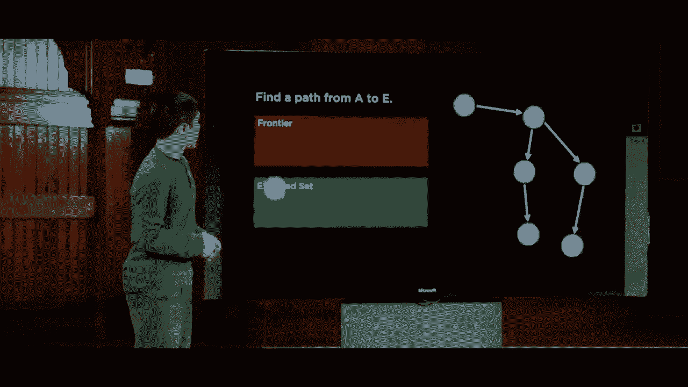

我们将从之前的情况开始，然后继续探索A，问从A我们可以到哪里，从A我们可以到B，跟之前一样。从B我们可以到C和D，因此C和D被添加到边界，但这次我们用D的方式将C添加到边界，因此我们会探索。

首先探索C，然后从C出发，我们可以到达E。所以E被添加到边界，但因为D在E之前已经被探索，我们接下来会看D。因此我们会探索D，问从D出发我们能到哪里，我们可以到F，然后我们才说，好吧，现在我们可以到E了，那么这又有什么呢？

广度优先搜索或BFS是这样开始的，我们在这里看C和D，然后我们看E。实际上，我们是在从初始状态向外看一层，然后是两层，只有在那之后才是离初始状态三层的东西，这与深度优先搜索不同，后者只是。

我们深入搜索树，直到遇到死胡同，然后最终不得不回退，因此现在有两种不同的搜索算法，我们可以应用它们来尝试解决一个问题，让我们看看这些在实践中是如何运作的，比如迷宫求解。

这是一个迷宫的示例，这些空单元格代表我们的代理可以移动的地方，而这些深色的灰色单元格代表代理无法通过的墙，最终我们的代理，我们的AI将尝试找到一种方法，从位置A通过一些动作序列到达位置B。

这些动作是左右上下，深度优先搜索会在这里做什么？

在这种情况下，深度优先搜索将只沿着一条路径前进，如果它到达一个岔路口，有多个不同的选项，深度优先搜索在这种情况下将选择其中一条，它并没有真正的偏好，但它将继续跟随这条路径，直到遇到死胡同，当它到达死胡同时。

深度优先搜索有效地回到最后的决策点，尝试另一条路径，完全耗尽这整条路径，当它意识到目标不在这里时，它将注意力转向这条路径，它会尽可能深入，当它遇到死胡同时，它会退回，然后尝试这条另一条路径，继续深入。

可能沿着某条特定路径向下，当它意识到这是个死胡同时，它会退回去，最终找到通向目标的道路，也许你运气不错，也许你之前做了不同的选择，但最终这就是深度优先搜索的工作方式，它会一直跟随直到结束。

它会退回并寻找不同的解决方案，因此你可能合理地问，这个算法是否总是会工作，是否总是能够找到从初始状态到目标的路径，结果是只要我们的迷宫是有限的，只要方块数量是有限的。

如果我们可以在可以移动的空间中，那么是的，深度优先搜索将找到解决方案，因为最终它将探索一切，如果迷宫恰好是无限的，并且存在无限状态空间，在某些类型的问题中确实存在，那么情况会稍微不同，但只要我们的迷宫。

我们有有限的方块，我们将要找到一个解决方案，但下一个问题是，是否会是一个好的解决方案，是我们能找到的最优解，答案并不一定，让我们看一下这个迷宫的例子，我们又在试图找到从。

从A到B，你会注意到这里有多个可能的解决方案，我们可以沿这条路走，或者向上走以从A到B，现在如果我们运气好，深度优先搜索会选择这条路，顺利到达B，但并没有理由说明深度优先搜索会选择上走还是。

向右移动这是一种任意的决策点，因为两者都会被添加到边界，最终如果我们运气不好，深度优先搜索可能会选择先探索这条路径，因为此时它只是一个随机选择，它会不断探索。

最终找到目标的这条特定路径，其实是有更好的路径存在，存在一个更优的解决方案，使用更少的步骤假设！

我们根据需要采取的步骤数量来衡量解决方案的成本，因此深度优先搜索如果。

如果我们运气不好，可能最终找不到最佳解决方案，而更好的解决方案。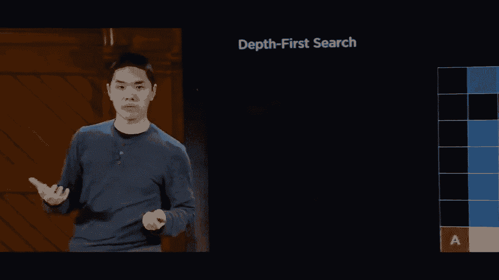

是可用的，所以如果这是深度优先搜索（DFS），那么。

广度优先搜索（BFS）如何比较，在这个特定的情况下它将如何工作，算法在视觉上将会有很大的不同，因为BFS首先查看较浅的节点，想法是BFS将首先查看离初始节点一步远的所有节点。

状态查看这里和这里，例如就像是这两个节点。紧挨着这个初始状态，那么它将探索离这个状态两步远的节点，查看这个状态和那个状态，例如，然后它将探索离这个状态三步远的节点，而深度优先搜索（DFS）。

只选择了一条路径并继续，另一方面，广度优先搜索则选择了探索所有可能的路径。几乎同时在它们之间反弹，深入探索每一条路径，但确保探索较浅的路径或较近的路径。

更接近初始状态，所以我们将继续遵循这个模式，查看远处的事物，查看五步远的事物，查看六步远的事物，直到最终到达目标，在这种情况下，确实我们必须探索一些最终。

没有带我们到任何地方，但我们找到的通往目标的路径是最优路径，这是我们到达目标的最短方式，因此。

在更大的迷宫中可能发生什么，嗯，让我们看看这样的情况，广度优先搜索将如何表现，广度优先搜索再次会继续跟随状态，直到它收到一个决策点，它可以向左或向右，而深度优先搜索则选择一个并继续。

一直跟随直到它遇到死胡同，另一方面，BFS将探索两个节点，它会查看这个节点，然后这个节点，并查看这个节点，然后那个节点，依此类推，当它在这里遇到一个决策点时，而不是选择左边一个或右边两个并探索那条路径，它将再次探索两个。

交替在它们之间，越来越深入，我们将在这里探索，然后也许在这里和这里，然后继续前进，慢慢探索这里，你可以在视觉上看到越来越远，一旦我们到达这个决策点，我们将向上和向下探索，直到最终我们到达，并且你会注意到是的。

广度优先搜索（BFS）确实找到了我们的路径，从A到B，遵循这个特定的路径，但它需要探索许多状态才能做到这一点，因此我们看到DFS和BFS之间有一些权衡，在DFS中，可能有些情况下与广度优先方法相比会节省内存。

在这种情况下，广度优先搜索必须探索很多状态，但这可能并不总是这样，所以现在，让我们实际上将注意力转向一些代码，看看我们可以实际编写的代码，以实现深度优先搜索或广度优先搜索。

解决迷宫的上下文，例如，所以我将前往我的终端，而我在迷宫管道内部拥有的是相同的迷宫求解思想的实现，我定义了一个名为节点的类，在这种情况下，它跟踪状态、父状态，换句话说，状态之前的状态和。

在这种情况下，我们没有跟踪路径成本，因为我们可以在找到从初始状态到目标的路径后计算路径成本。此外，我定义了一个名为栈的类前沿，如果不熟悉类，类是我定义一种方式的方式。

在Python中生成对象，它指的是面向对象编程的理念，这里的想法是我想创建一个能够存储我所有前沿数据的对象，我希望在该对象上有可以用来操纵的函数，通常称为方法。

对象中的方法，所以如果你对语法不熟悉，这里发生的事情是我有一个函数，最初创建一个前沿，我将使用列表来表示，最初我的前沿用空列表表示，开始时前沿中没有任何东西，我有一个添加函数可以添加某物。

通过将其附加到列表的末尾，我有一个函数。该函数检查前沿是否包含特定状态，我有一个空的，如果前沿为空，那就意味着，前沿的长度为0，然后。我有一个从前沿中移除某物的函数，我不能从前沿中移除。

如果前沿为空，我不能从前沿中移除某物，所以我首先检查这一点。但是如果前沿不为空，请记住，我将前沿实现为一个栈，即后进先出数据结构，这意味着我最后添加到前沿的。

我应该从这个前沿中移除的项目，所以你会看到我已移除列表的最后一个项目，如果你用负一索引Python列表，这会得到列表中的最后一个项目，因为零是第一个项目，负一则可以循环到列表的最后一个项目。

我们给该节点，我们称其为节点，我们在第28行更新前沿，以说继续移除你刚刚从前沿中移除的节点，然后我们将节点作为结果返回，所以这个类实际上实现了前沿的理念，它给了我一种将某物添加到一个。

前沿和从前沿中移除某物的方法是栈，我还为好措施实现了同一事物的替代版本，称为队列前沿，括号中你会看到它继承自栈前沿，意味着它将执行栈所做的所有操作。

前沿是这样的，除了我们从前沿移除节点的方式会稍微不同，我们将从列表的开头移除，而不是从栈中通常从末尾移除。`self.frontier[0]`将为我获取前沿中的第一个节点。

被添加的那个将是我们在队列中的返回项。接下来，我有一个名为`Mae ism`的类定义。这将处理获取一个序列，类似迷宫的文本文件并找出如何解决它，因此它将以文本文件作为输入。

例如，结果看起来像这样，其中我们看到代表墙壁的哈希标记。我有字符`A`表示起始位置，字符`B`表示结束位置，你可以查看解析这个文本文件的代码。现在这部分不太有趣，更有趣的是。

这一部分是解决函数，这个函数将弄清楚如何从点A到点B。在这里，我们看到的实现与刚才看到的完全相同，我们将跟踪探索的状态数量，以便稍后报告这些数据。

从表示起始状态的节点开始，我以栈前沿开始。在这种情况下，考虑到我将前沿视为栈，你可能想象我在这里使用的算法是深度优先搜索，因为深度优先搜索或DFS使用栈作为其数据。

结构，最初这个前沿将仅包含起始状态。我们初始化一个探索集合，最初为空，我们还没有探索过任何东西，现在这是我们的循环，重复某事的概念。

我们看到的功能的实现，如果前沿确实为空，我们将抛出一个异常或Python错误，表示抱歉，这个问题没有解决方案。否则，我们将继续从前沿移除一个节点，通过调用`frontier.remove()`来更新状态。

我们探索的状态数量，因为现在我们探索了一个额外的状态。所以我们说`self.numb_explored += 1`，将1添加到我们探索的状态数量中。一旦我们从前沿移除一个节点，请记住，下一步是检查它是否是目标，进行目标测试，在迷宫的情况下。

检查目标是相对简单的。我会查看节点的状态是否等于目标。在我设置迷宫时，我设定了一个叫做目标的值，这是迷宫的一个属性，因此我可以检查节点是否实际是目标。

我逐步搞清楚为了达到这个目标我采取了什么行动。如何做到这一点呢？回想一下，每个节点存储它的父节点，即到达此节点所经过的节点，以及为此使用的动作。因此，我可以创建一个循环，持续查看。

查看每个节点的父节点，并记录所有父节点之间的动作，以便从父节点到当前节点。因此，这个循环将持续查找所有父节点，直到我们回到初始状态，其父节点`node dot parent`等于None。

在这个过程中，我将构建出我所遵循的所有动作的列表，以及所有属于这个解决方案的单元格的列表，但我会反转它们，因为我是在从目标返回到初始状态时构建动作序列。

从目标到初始状态，但我想反转它们以获得从初始状态到目标的动作序列，这最终将是解决方案。因此，所有这些发生在当前状态等于目标时，否则如果它不是目标。

我将这个状态添加到已探索集合中，表示我已经探索了这个状态，未来如果再遇到就不需要再回去，然后这段逻辑实现了将邻居添加到边界的想法。我会查看我的所有邻居，并实现一个叫做邻居的函数。

请查看每一个邻居，我会检查这个状态是否已经在边界内，或者是否已经在已探索集合中。如果不在这两个集合中，我将添加这个新子节点到边界中，因此这里有相当多的语法，但关键是。

这里的重点不是要理解所有内容。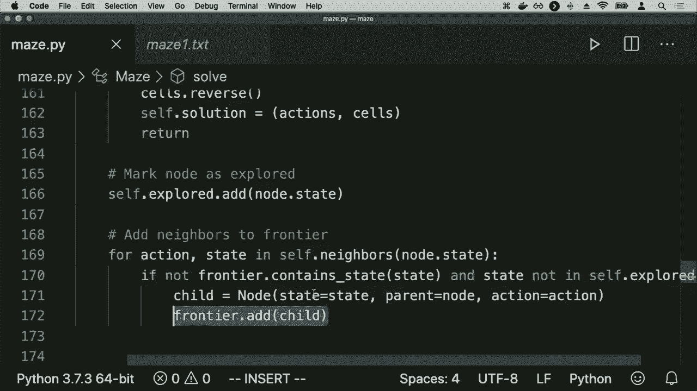

语法的细微差别，所以请随意仔细查看这个文件，了解它的工作原理。但关键是看到这是同样伪代码的实现，正如我们在屏幕上描述的那样，当时我们查看了可能的步骤。

为了解决这种搜索问题，我们现在来看看实际操作。我将运行`maze spy on maze one dot text`作为示例，下面是迷宫最初的打印输出，之后是解决后的结果。

探索了11个状态才能做到这一点，我们找到了一条从A到B的路径，而在这个程序中我刚好生成了。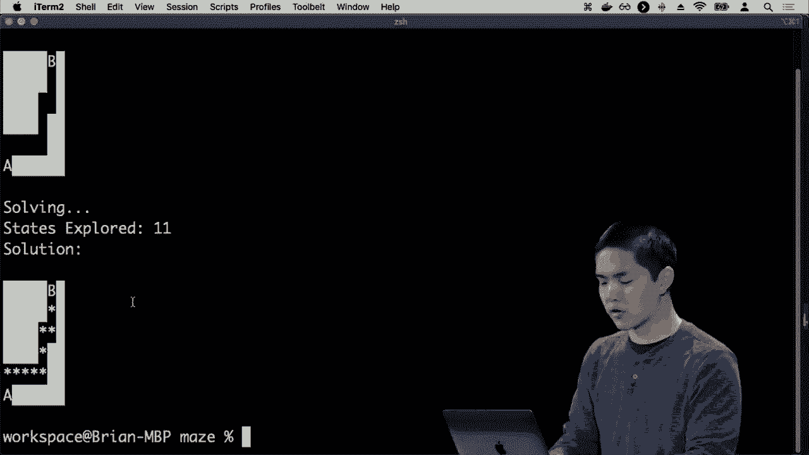

好的，所以我可以打开由这个程序生成的 maze dot PNG，它向你展示了。黑暗中的位置，较深的颜色是墙，红色是初始状态，绿色是目标，黄色是经过的路径，我们找到了一条从。

初始状态到目标，但现在让我们看看一个更复杂的迷宫。看看可能会发生什么，接下来我们看 maze to dot text，我们现在。这里有一个更大的迷宫，从A到B，但现在你会想象深度优先搜索可能不会那么幸运，可能不会在第一次就找到目标。

尝试一下，你可能需要沿着一条路径，然后回溯并探索其他东西。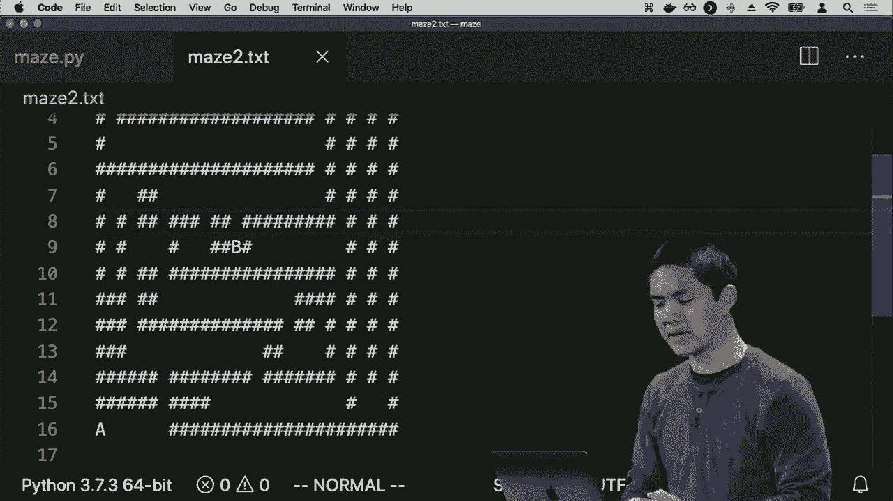

这个，我们运行Python maze da pie of maze two，文本这次尝试另一个迷宫，现在深度优先搜索能够在这里找到解决方案，如所示。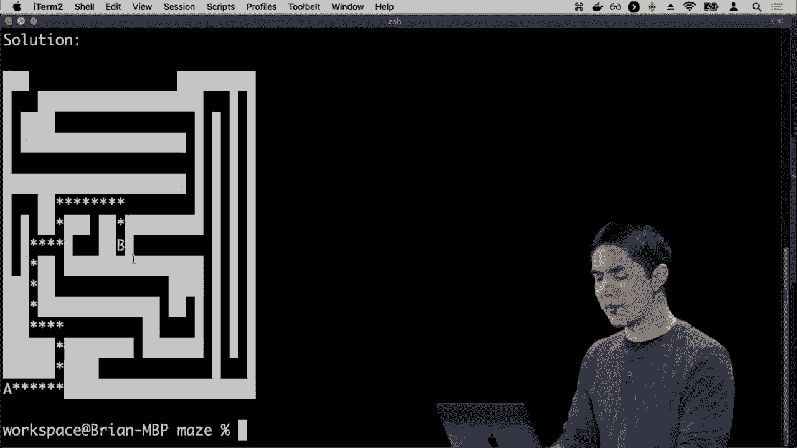

星星是一种从A到B的方式，我们可以通过打开这个迷宫以视觉方式表示。这个迷宫看起来是这样的，黄色高亮的是从初始状态到目标找到的路径，但我们必须探索多少个状态才能找到这条路径呢？回想一下在。

我的程序一直在跟踪这个。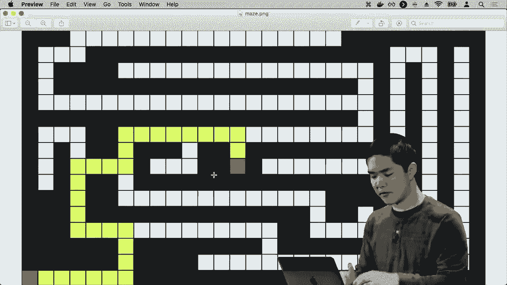

到目前为止，我们探索的状态数量，所以我可以回到终端，看看，好的，为了解决这个问题，我们必须探索399个状态。

不同的状态，事实上，如果我对程序做一个小的修改，并告诉程序在最后当我们输出这个图像时，我添加了一个参数。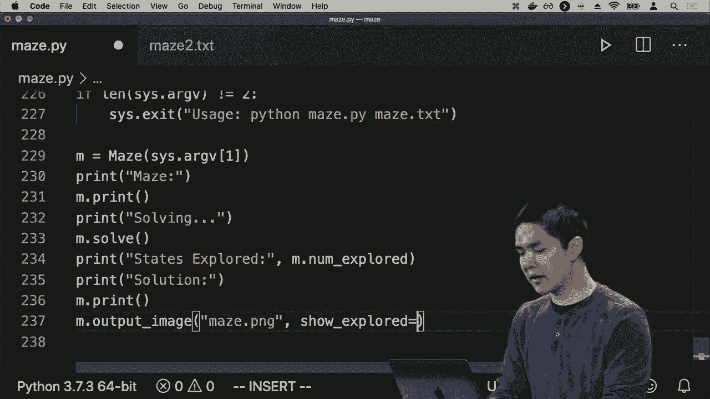

称为 show explored，如果我将 show explored 设置为 true 并重新运行这个。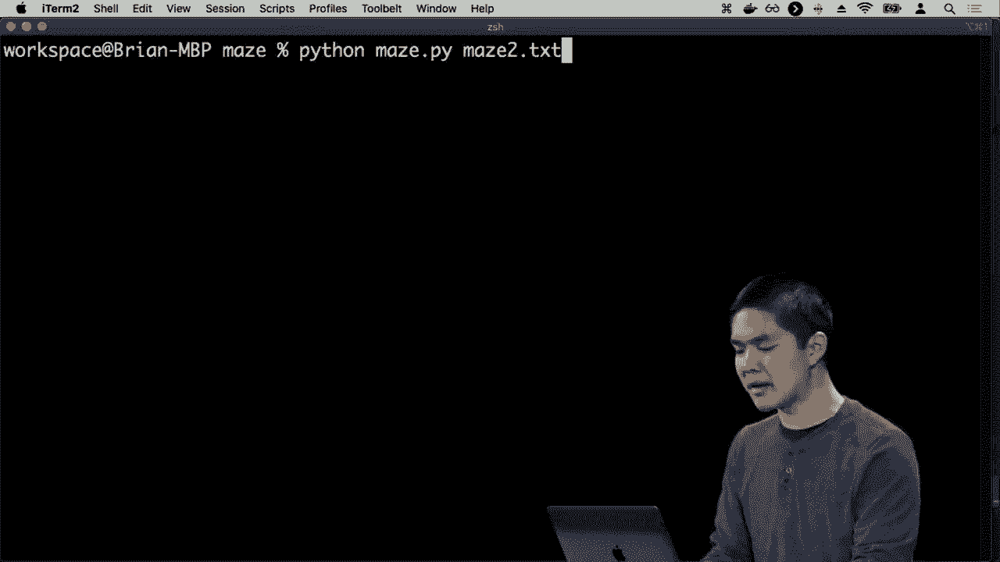

程序Python可能停止运行在 maze 2 上，然后我打开迷宫，结果是。

你会看到这里用红色高亮的是所有必须探索的状态，以便从初始状态到达目标，深度优先搜索（DFS）。没有立即找到目标，它选择首先探索这个方向，当它探索这个方向时，它必须遵循每一个。

所有可能的路径一直到最后，甚至这个长而曲折的路径。为了意识到，你知道，这是死胡同，程序需要在走这个方向后回溯，它一定是走了这个方向，幸运的是没有选择这条路径，但也不幸地。

这里探索了这个方向，探索了一堆不必要的状态，接着又探索了图的上半部分，实际上也没有必要这样做。因此，总的来说，深度优先搜索并没有表现得很理想，可能探索了更多的状态。

找到一个最优解决方案是通往目标的最佳路径，但为此需要探索的状态数量，以及我必须采取的步骤数量，都要高得多。所以让我们比较一下，如果宽度优先搜索（BFS）在这个完全相同的迷宫中会怎么做。

DFS和BFS的算法是相同的，唯一的区别是我们用什么数据结构来表示前沿。在DFS中，我使用的是后进先出（LIFO）的栈作为前沿，而在BFS中，我使用的是先进先出（FIFO）的队列，首先加入前沿的就是第一个被探索的。

删除这些后，我将返回终端，在同一个迷宫上重新运行这个程序，现在你会看到我们需要探索的状态数量只有77……。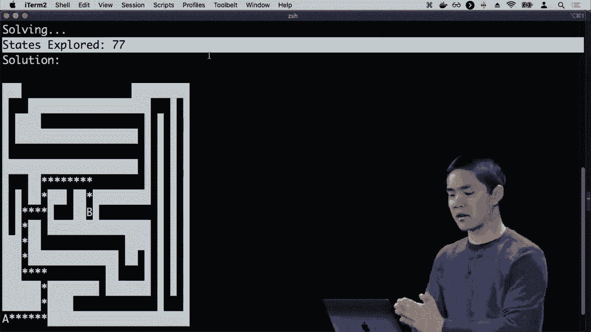

相比之下，当我们使用深度优先搜索时，几乎有400个状态，而我们可以看到……。

这就是我们可以看到，如果我们打开maze.png，重新查看时，黄色高亮部分是宽度优先搜索找到的解决方案，巧合的是，它也是深度优先搜索找到的解决方案。它们都找到了最佳解决方案，但注意所有未探索的白色单元格。

为了到达金子，所需探索的状态大大减少，因为宽度优先搜索（BFS）操作得较为浅显，它在探索离初始状态较近的东西，而不去探索更远的东西。所以如果目标不太远，那么宽度优先搜索……。

搜索实际上可以非常有效地在一个迷宫中进行，就像这样。在这个例子中，BFS和DFS最终找到了相同的解决方案，但这并不总是如此。实际上，让我们再看一个例子，例如迷宫3。

在迷宫3中，你可以从A到B有多种方式，这是一个相对较小的迷宫，但让我们看看如果我使用……。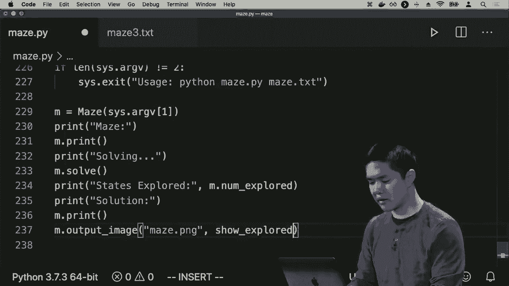

关闭显示已探索状态，这样我们只看到解决方案。如果我使用BFS来解决迷宫3……。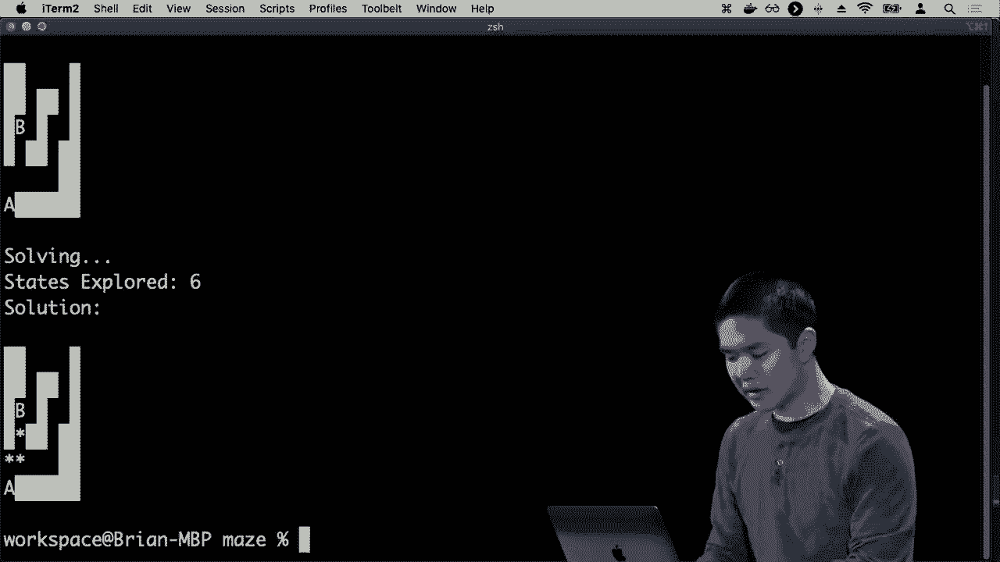

然后我们找到一个解决方案，如果我打开迷宫，这里就是我们找到的解决方案，它是最优的，只需四步就能从初始状态到达目标。但如果我们尝试……。

使用深度优先搜索或DFS，然而我会再次回到我的队列边界，队列边界意味着我们正在使用广度优先搜索。

我会把它改为栈边界，这意味着现在我们将使用深度优先搜索，我会重新运行Python，也许我会，现在你会看到我们。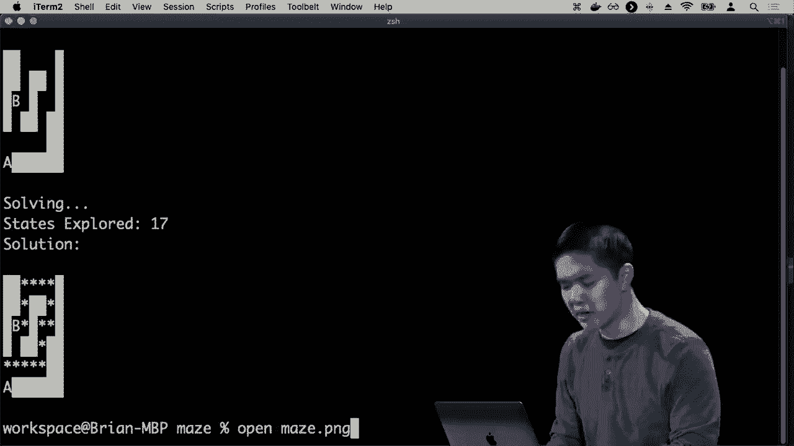

找到了解决方案，但这并不是**最优**解决方案，这反而是我们的算法所找到的，也许深度优先搜索能找到解决方案，这有可能，但并不**保证**如果我们正好选择了这个状态，而不是那个状态，那么深度优先搜索就会这样。

搜索可能找到一条更长的路径，从初始状态到目标，所以我们在这里看到一些权衡，深度优先搜索可能找不到**最优**解决方案，因此到那个时候，看起来广度优先搜索是相当不错的，这是否是我们能做的**最好**的选择，它将找到**最优**解。

解决方案，我们不必担心可能会找到一条比实际存在的解决方案更长的路径的情况，目标距离初始状态很远，我们可能需要走很多步才能到达。

为了从初始状态到达目标，最后发生的事情是这个算法广度优先搜索基本上探索了整个图，必须通过整个迷宫才能找到从初始状态到目标状态的路径。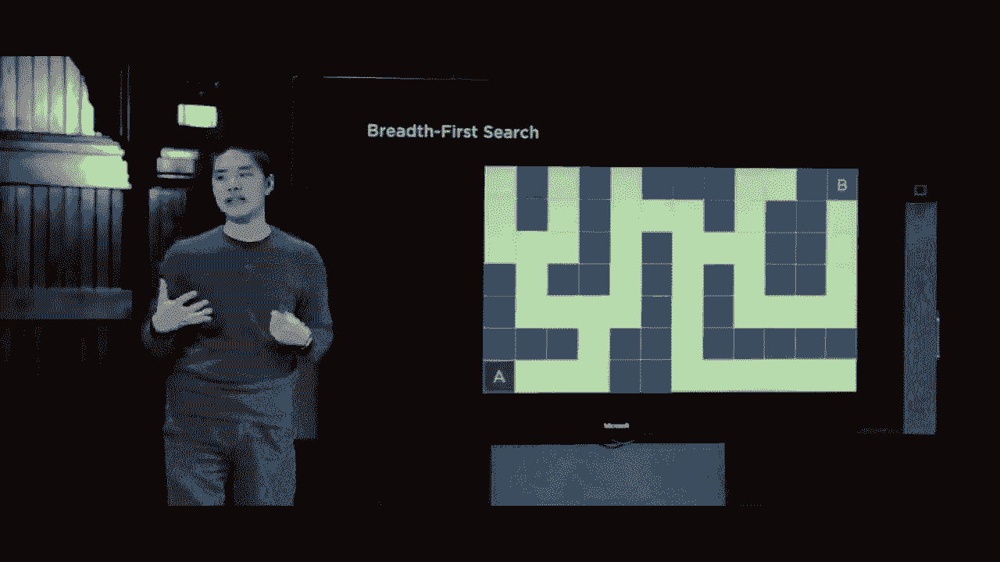

我们**最终**希望的是我们的算法更智能，那么在这种情况下，什么是使我们的算法更智能呢？让我们回顾一下广度优先搜索可能能够做出不同决策的地方，并考虑人类直觉。

这个过程就像人类在解决迷宫时可能做的那样，这与广度优先搜索**最终**选择的方式不同，广度优先搜索的第一个决策点正是在这里，它进行了五步，最后到达了一个分岔路口，可以选择左转或右转。

在这最初的几步中没有选择，每个状态只能采取一个动作，因此搜索算法做了唯一能做的事情，就是继续跟随那个状态直到下一个状态，但这一点是事情变得有些不同的时候。

有趣的是，深度优先搜索这个我们看到的第一种搜索算法选择了一条路径并穷尽那条路径，看看那条路上是否有目标，如果没有，那么就尝试另一条路。广度优先搜索，你知道的，让我们先探索那些浅层的、靠近我们的东西，先看看左右。

然后左转再右转，交替我们的选择，希望能找到附近的东西，但最终使人类陷入困境的原因是当面临这样的选择：往左还是往。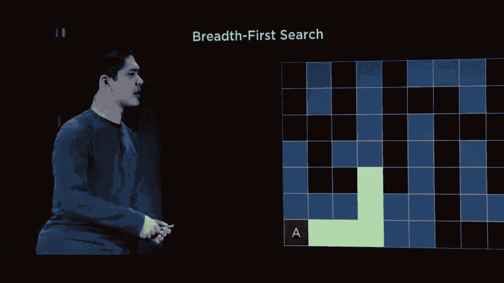

对于人类来说，视觉上可能会看到，我正试图到达B状态，B在那里，往右走似乎更接近目标，感觉上往右走应该比往左走更好，因为我正在朝目标迈进。

当然，为了达到这个目标，我在这里做了一些假设，我假设我们可以将这个网格表示为一个二维网格，我知道所有的坐标，我知道A在坐标(0, 0)，B在其他坐标对上。

我可以计算出是的，往这个方向走更接近目标，这可能是某些类型搜索问题的合理假设，但在其他情况下可能不是。不过，现在我们假设我知道我当前的坐标对。

我希望在这种情况下有一个稍微更聪明的算法，它能够知道我应该朝目标前进。这可能是这样做的方式，因为在迷宫中，沿坐标方向移动。

目标通常，虽然并不总是，是一个好事，所以在这里我们区分两种不同类型的搜索算法：无信息搜索和有信息搜索。无信息搜索算法是像DFS和BFS这样的算法，这两种算法都是我们刚刚看到的搜索策略。

不使用任何特定于问题的知识来解决问题，DFS和BFS并不在意迷宫的结构或迷宫的任何情况。它们只是查看可用的动作，并从这些动作中选择，而不管当前位置。

无论是迷宫还是其他问题，解决方案或它试图解决问题的方法在根本上都是相同的。我们现在要看看的是对无信息搜索的改进，我们将看看有信息搜索。有信息搜索将是搜索策略。

利用特定于问题的知识来更好地找到解决方案，在迷宫这个问题中，特定知识是如果我在一个地理上更靠近目标的方格中，这比在一个地理上更远的方格中要好。

只能通过思考这个问题并推理出对我们的 AI 代理有帮助的知识来了解。不同类型的知情搜索中，首先我们将关注一种叫做贪婪的搜索算法。

最佳优先搜索贪婪最佳优先搜索，通常缩写为 G BFS，是一种搜索算法，它不会像深度优先搜索那样扩展最深的节点，也不会像广度优先搜索那样扩展最浅的节点，而是始终扩展它认为离目标最近的节点。

我们无法确定它是否是离目标最近的，因为如果我们知道什么是最接近目标的，那我们早就有解决方案了。如果我们了解什么接近目标，我们只需按照这些步骤从初始位置到达解决方案，但如果…… 

我们不知道解决方案的意思，也就是说，我们并不确切知道什么是最接近目标的。相反，我们可以使用一种估算方法，称为启发式，就是估计我们是否接近目标。

我们将使用一个常规称为 H(n) 的启发式函数，它接受状态输入并返回我们与目标的接近程度的估算。那么，在解决迷宫算法的情况下，这个启发式函数是什么样子的呢？

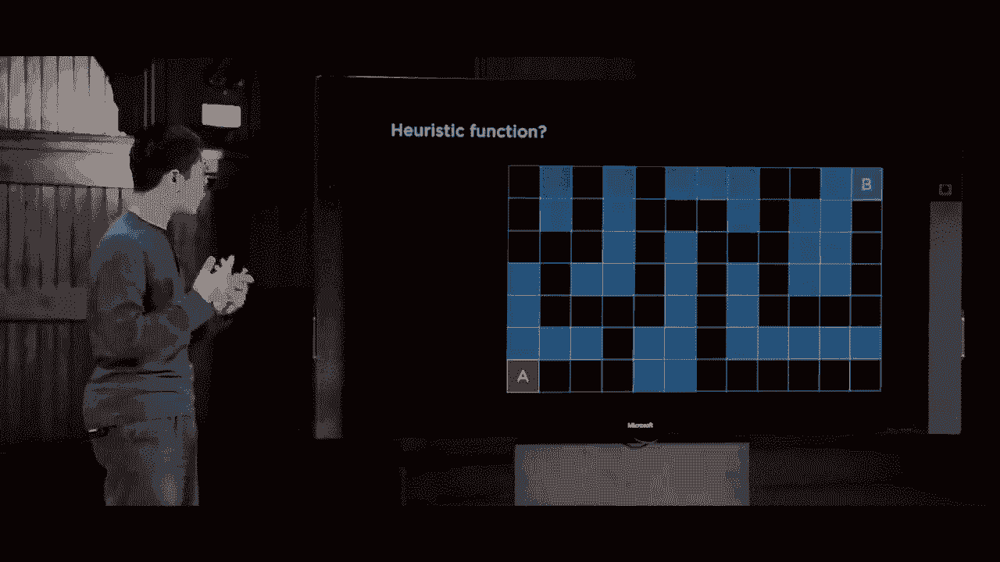

启发式函数需要回答一个问题：在这两个单元 C 和 D 之间，哪个更好？如果我试图找到到目标的路，我宁愿在什么地方。任何人类可能都能看出 D 看起来更好，即使迷宫很……

复杂的问题，如果你没有考虑到所有的墙，D 可能会更好。

为什么更好呢？因为如果你忽略墙壁，假装墙壁暂时不存在，放松一下问题，那么 D 就在坐标对的意义上更接近这个目标，走的步骤更少。

相比于 C 到达目标需要采取的步骤，即使你忽略墙壁，只要你知道 C 的 XY 坐标和目标的 XY 坐标，同样也知道 D 的 XY 坐标，你可以地理上计算 D，忽略墙壁，看起来 D 更好，这就是…… 

我们将使用的启发式函数是曼哈顿距离，这是一种特定类型的启发式，其中启发式是垂直和水平方向上的方格数量，然后从左到右，所以不允许对角线移动，只能向上、向右、向左或向下。

我需要多少步才能从这些单元格到达目标。事实证明，D更近，只需要六步就能到达目标，这里忽略墙壁，我们稍微放宽了问题，我们只关心数学运算。

要从每个X值中减去彼此，再从每个Y值中减去彼此。我们估计我们离目标有多远，D比C更接近目标，所以现在我们有了一种选择要从前沿移除哪个节点的方法，在我们算法的每个阶段，我们都会进行。

从前沿移除一个节点时，我们将探索具有此启发式函数最小值的节点，如果它到目标的曼哈顿距离最小。那么，这实际上会是什么样子呢？让我先给这个图标标上标签，把这个迷宫标记为。

这个启发式函数的值。

从任何这些单元格的曼哈顿距离值来看。例如，从这个单元格，我们距离目标是1，从这个单元格，我们距离目标是2，3，4，而这里是5，因为我们需要向右走一步，然后从这里向上走四步，曼哈顿距离。

距离是2，实际上我们将不得不走更长的路径，但我们还不知道，启发式。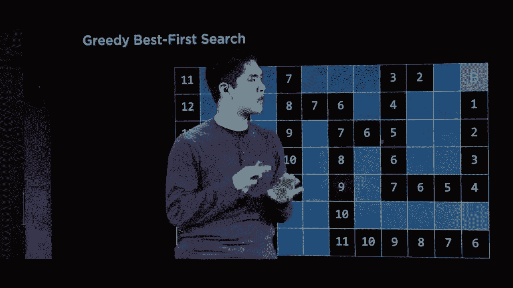

是一种简单的方法来估算我们离目标有多远，也许我们的启发式过于乐观，它认为我们只需两步，而实际上考虑到墙壁时可能需要更多步骤。因此，重要的是启发式并不能保证。

步骤的估计是一种尝试去逼近，通常情况下，看起来离目标更近的方格具有更小的启发式函数值，而远离目标的方格则更大。因此，使用贪心最佳优先搜索，这可能是什么呢？

算法表现得很好，对于这前五步，我们没有太多选择，我们从初始状态A开始，表示我们必须探索这五个状态，但现在我们有了一个决策点，我们可以选择向左或向右。

随便选择，因为这只是取决于你把这两个节点放入前沿的顺序，而我们没有指定你将它们放入前沿的顺序，只是取出它们的顺序。我们可以看看13和11，发现这个方格离目标的距离是11，根据我们的启发式。

根据我们的估计，这个估计我们认为距离目标是13。所以在这两个选项之间，我宁愿选择11。我宁愿距离目标有11步，所以我会向右走，我们能够做出明智的决定，因为我们对这个有更多了解。

所以这个问题是，我们继续跟随10、9、8，在两个7之间，我们没有太多方法来了解，所以我们必须做一个任意的选择，也许我们选择错了，但没关系，因为我们仍然可以说，好吧，让我们试试这个7，我们说7、6，我们必须做出这个选择。

尽管这增加了启发式函数的值，但现在我们在6和8之间有另一个决策点，而在这两个值之间，我们还在考虑13，但这在6、8和13之间要高得多。好吧，6是最小的值，所以我们更愿意选择6。

做出明智的决定，选择向右走可能比向下走要好。因此我们转向这条路，走到5，现在我们发现一个决策点，我们实际上可能不想做出这个决策，但不幸的是，在这里没有太多的选择，我们看到4和6，4。

看起来更接近目标，它在上升，而目标在更高的地方。所以我们最终选择了那条路线，尽管最终导致我们走进了死胡同，但没关系，因为我们仍然可以说，好吧，现在让我们试试6，然后跟随这条路线，最终带我们到达目标。

贪婪最佳优先搜索可能会通过说，每当我们在多个节点之间做决策时，让我们探索h(n)值最小的节点来接近这个问题。这个启发式函数是估算我需要走多远，而正好是这样。

在这种情况下，我们在需要探索的状态数量上做得更好，比起BFS所需的数量。BFS探索了整个这个区域和那个区域，但我们通过利用这个启发式，即关于我们离目标有多近的知识，能够消除那些。

这个想法的估计看起来好多了，所以我们难道不总是更倾向于使用这样的算法而不是广度优先搜索这样的算法吗？也许需要考虑的一件事是，我们需要提出一个好的启发式。启发式的好坏将影响这个算法的表现。

提出一个好的启发式方法往往是具有挑战性的，但另一个需要考虑的问题是，像我们之前两种算法一样，问这个算法是否最优，它是否总是能找到从初始状态到目标的最短路径。为了解答这个问题，我们来看看。

暂时看看这个例子。我们尝试从A到B，并且我已标注每个单元格与目标的曼哈顿距离，也就是你需要从该格到目标旅行的平方数。

想一想，贪婪最佳优先搜索总是选择最小数字，是否能找到最优解？什么是最短的解决方案？这个算法会找到吗？重要的是要意识到，在这里我们估计离目标有12步，我们有两个选择。

在左侧，我们估计离目标有13步，或者我们可以向上走，估计离目标有11步。在这两者之间，贪婪最佳优先搜索会说11看起来比13更好，因此贪婪最佳优先搜索最终会找到这条通往目标的路径。

结果是这条路径并不最优，有一种方法可以用更少的步骤到达目标，而实际上就是这条路，尽管此时选择了两个中我们估计为最差的选项。

这就是我们所说的贪婪算法，它在此决策点上做出了最佳决定。看起来在这里比去13更好，但从大局来看，这不一定是最优的。它可能会找到一个解决方案，而实际上还有更好的解决方案。

我们希望有一种解决这个问题的方法，我们喜欢这种能够估计我们与目标之间距离的启发式，这帮助我们做出更好的决策，消除搜索整个状态空间的需要。

我们希望修改算法，以实现最优性，使其能够是最优的。那么实现这一点的方法是什么？直觉是什么？让我们看看这个初始问题，贪婪最佳优先搜索给我们找到了这个长路径，原因在于它并不理想。

这是因为启发式数字下降得很低，但后来又开始回升，回升到8、9、10、11，直到12。那么我们该如何改进这个算法呢？我们可能意识到，如果我们一直走下去。

通过这条路径，最终我们走到12，花费了很多步，谁知道那有多少步，只是为了到达这个12。作为替代，我们可以选择只需六步，就能更快到达12，所以看起来不太好，但确实需要的步骤少得多。

为了到达这个13我花了六步，而到达这个12则需要更多的步骤。虽然贪婪的最佳优先搜索说哦，12比13更好，所以选择12，但我们可能会更智能地说，如果我能更快到达一个看似需要稍长时间的地方，我宁愿选择后者。

我们将把这个总体思路编码成一个更正式的算法，称为A*搜索。A*搜索将通过不仅考虑启发式，还考虑到达目标的时间来解决这个问题。

这是我到达任何特定状态所需的步数，因此区分在于贪婪的最佳优先搜索。如果我现在在一个状态中，我唯一关心的是我与目标之间的估计距离，即启发式值，而A*搜索将考虑两条信息。

考虑到我估计自己离目标有多远，同时也考虑我为了到达这里还需走多远，因为这与我们将要使用的搜索算法相关，它通过扩展具有最低G(n)+h(n)值的节点来进行。H(n)就是我们刚才提到的那个启发式。

这将根据问题而有所不同，但G(n)将是到达节点的成本，也就是在这种情况下到达我当前位置所需的步数。那么这个搜索算法在实际中看起来是什么样的呢？让我们再看一下，我们有相同的迷宫，我已经标记好了它们。

使用它们的曼哈顿距离，这个值是H(n)值，即对每个方格距离目标的启发式估计，但现在当我们开始探索状态时，我们不仅关心这个启发式值，还关心G(n)，我到达那里所需的步数。

你知道，需要将这两个数字相加。那么在这第一步中，假设我已经走了一步，现在我估计距离目标还有16步。因此这里的总值是17。然后我再走一步，我现在走了两步，估计自己距离目标还有15步。

总值仍然是17，现在我已经走了三步，估计距离目标还有14步，依此类推，四步时估计为13，五步时估计为12，现在这是一个决策点，我可能距离目标六步，启发式值为13，总共为19。

或者我可能距离目标还有六步，启发式值为11，总估计为17。因此在19和17之间，我宁愿选择17，也就是6加11。到目前为止与之前没有什么不同，我们仍然选择这个选项，因为它看起来更好，我继续选择。

这个选项看起来更好，但在这里事情变得有点不同。我可能距离目标有十五步，估计距离为六，所以15加6，总值为21。或者我可能距离目标有六步，因为这是五步。

这里距离目标有六步，总值为十三，作为我的估计，所以六加十三是十九。在这里，我们会评估G(n)加H(n)为十九，六加十三，而这里是15加六或21，因此直觉上是19小于21，但最终的想法是我。

在减少步数的情况下，走到十三步比走到六步要好，因为这意味着我为了到达那里必须走更多的步数，可能有更好的路径。因此我们现在将探索这条路线，如果我们再走一步，这是七步加14是二十一。

在这两者之间，结果有点难以预测，我们可能会最终探索那个。不管怎样，随着这些数字在启发式中的增大，启发式值开始变小，你会发现实际上会继续沿着这条路径探索，你可以计算一下。

在每个决策点，A*搜索将基于我到达当前位置所需的步数之和，以及我估计离目标有多远来做出选择。因此我们必须探索一些状态，实际上找到的最佳解决方案是我们从中获取的最快方法。

从初始状态到目标，事实证明A*是一个在某些条件下的最佳搜索算法。这些条件是H(n)，我的启发式需要是可接纳的。启发式可接纳意味着它永远不会高估真实成本H(n)。

总是需要在我离目标有多远上，要么精确到位，要么低估。所以我们之前看到的例子中，启发式值远小于实际成本，这是完全可以的，但启发式值绝不能高估，绝不能认为。

我离目标实际上更远，而与此同时，H(n)也需要一致性。那么在数学上，一致性意味着对于每个节点，我们称之为n+后继，即我之后的节点，我称之为n'，在此步骤的成本为C。

n的启发式值需要小于或等于n'的启发式值加上成本，因此这有很多数学，但用言语来说，这最终意味着如果我现在在这个状态，离目标的启发式值不应该超过。

我接替者的启发式价值，接下来我可以去的地方，以及这将花费我多少。仅仅从一步迈向下一步，所以这只是确保我的启发式在我可能采取的所有步骤之间是一致的，只要这一点成立，那么A*搜索就是。

这将为我找到一个最优解决方案，这也是解决这些搜索问题的挑战所在。有时，A*搜索是一个已知算法，你可以相对容易地编写代码，但选择启发式可能是有趣的挑战，启发式越好。

启发式越好，我就能在更少的状态中解决问题。我需要确保启发式满足这些特定约束，所以总的来说，这些是一些可能有效的搜索算法，当然还有许多其他算法。

例如，A*确实有使用大量内存的倾向。因此，存在替代方法，最终使用比此版本A*更少的内存，还有其他搜索算法也针对其他情况进行了优化，但到目前为止我们只讨论了。

我一直在研究搜索算法，其中有一个代理，比如我正在尝试寻找一个问题的解决方案，我正在试图通过迷宫导航，我正在尝试解决15拼图，我正在尝试。
