# 哈佛CS50-AI ｜ Python人工智能入门(2020·完整版) - P4：L0- 搜索算法 3 (极大极小算法，剪枝，深度限制) - ShowMeAI - BV1AQ4y1y7wy

从点A到点B寻找驾驶方向有时会进入搜索状态。情况是这样的！

在这种对抗情境中，我是一个试图做出智能决策的代理，而有另一个人正在对抗我，有着相反的目标。换句话说，我试图成功，而另一个人希望我失败，这种情况在游戏中非常常见。

就像井字棋一样，我们有一个3x3的网格，X和O轮流在这些方格中写下X或O，目标是如果你是X玩家，得到三个连续的X，或者如果你是O玩家，得到三个连续的O，计算机在玩游戏时变得相当出色。

井字棋非常简单，但更复杂的游戏又是怎样的呢？那么，智能决策在游戏中会是什么样子呢？！

游戏的初步移动可能是X在中间，而O会下棋。！

那么，在这种情况下，智能的X应该如何移动呢？最终结果是有几种可能性，但如果AI以最佳方式玩这个游戏，那么AI可能会选择上右方的位置，因为此时O的目标与X相反。

试图赢得游戏，目标是在这里获得三个连续的棋子，而O则试图阻止这个目标。因此，O会在这里下棋来阻挡，但现在X可以做出一个相当聪明的移动，X可以进行这样的移动，现在X有两个可能的方式赢得游戏。

游戏的目标是在这里横向得到三个连续的棋子，或者X可以通过纵向得到三个连续的棋子来赢得游戏，因此O的下一步移动无关紧要。例如，O可以在这里下棋来阻挡横向的三个连续棋子，但随后X将赢得游戏。

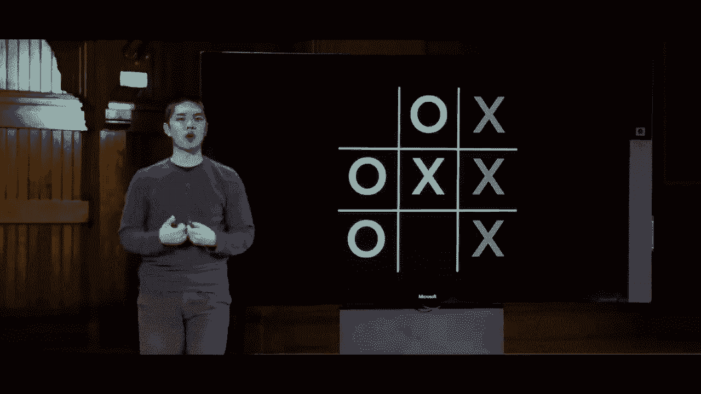

游戏的目标是纵向得到三个连续的棋子，因此需要有相当的能力，以便计算机能够解决问题。这在精神上与我们目前所看到的问题相似，棋盘的状态和从一个动作到下一个动作的某种转变。

这与传统搜索问题不同，因为这现在是一个对抗性搜索问题。我是一个玩家，试图找到最佳移动，但我知道有对手在阻止我。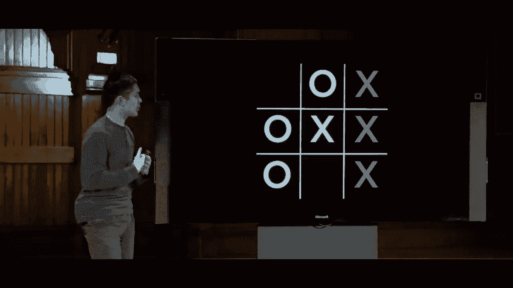

因此，我们需要某种算法来处理这种对抗性类型的情况！

我们要查看的搜索情况和算法是一个叫做 minimax 的算法，它在这些确定性游戏中效果很好，其中有两个玩家，它也可以适用于其他类型的游戏，但我们现在将关注我先走一步，然后我的对手再走一步的游戏。

我在试图赢，而我的对手也在试图赢，换句话说，我的对手在努力让我输。那么我们需要什么才能让这个算法运行良好呢？每当我们尝试将这种人类概念转化为计算机时，就像是玩游戏、赢和输，我们想要的是。

将其翻译为计算机可以理解的术语，最终计算机只是理解数字。所以我们想要某种方式将井字棋游戏转化为数值形式，以便计算机可以理解，计算机通常不理解。

这种算法虽然不能直接判断输赢，但能理解大小的概念。所以我们想要的是白色的财富，我所做的是。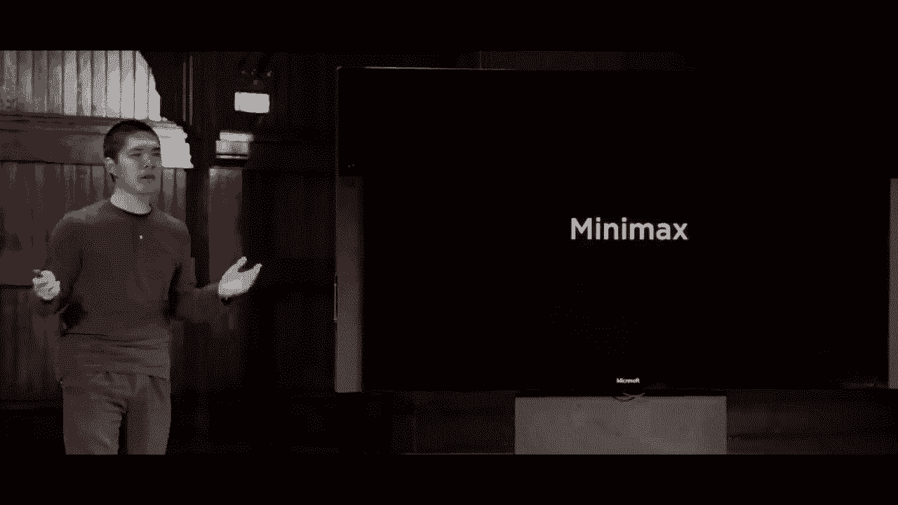

我们可能会考虑井字棋游戏的所有可能展开方式，并给每一种方式分配一个值或效用。在井字棋游戏以及许多类型的游戏中，可能的结果有三种：O 赢、X 赢或无人获胜。因此，玩家 1 胜、玩家 2 胜或无人获胜。

现在，让我们给这些可能结果赋予不同的值：O 胜利的值为负 1，无人获胜的值为 0，X 胜利的值为 1。这样我们就为这三种可能的结果分配了数字。

我们有两个玩家，X 玩家和 O 玩家，我们将把 X 玩家称为最大化玩家，把 O 玩家称为最小化玩家，原因在于，在 minimax 算法中，最大化玩家（在这种情况下是 X）旨在最大化分数。

可能的分数选项为负，1 0 和 1 X 想要最大化分数。这意味着如果可能，X 希望在这种情况下赢得比赛，我们给它一个分数为 1，但如果这不可能，X 需要在这两个选项之间选择：负 1，表示获胜，或 0，表示无人获胜。

胜利时，X 宁愿无人获胜，分数为 0，而不是负 1 O 胜利。因此，赢、输和平局的概念在数学上被简化为尝试最大化分数的想法，X 玩家总是希望分数更大，而反过来，最小化玩家则希望。

O 的目标是最小化分数，O 玩家希望分数尽可能小。所以现在我们已经将这个 X 和 O 的游戏，以及赢和输，转变为某种数学模型，X 正在尝试最大化分数，O 正在尝试最小化分数。现在让我们看一下所有的可能性。

游戏的各个部分，我们需要将其编码到AI中，以便。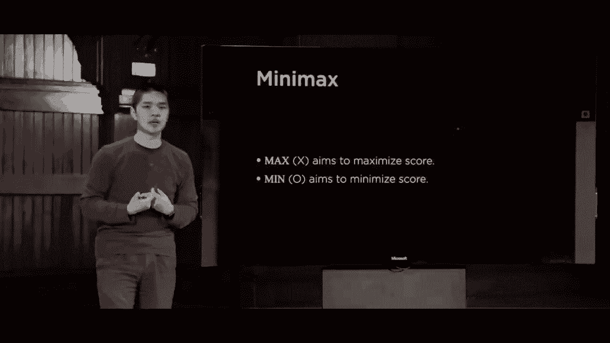

AI可以玩像井字棋这样的游戏，因此游戏需要一些东西，我们需要某种初始状态，在这种情况下我们称之为s0。这就是游戏开始的方式，比如一个空的井字棋棋盘。例如。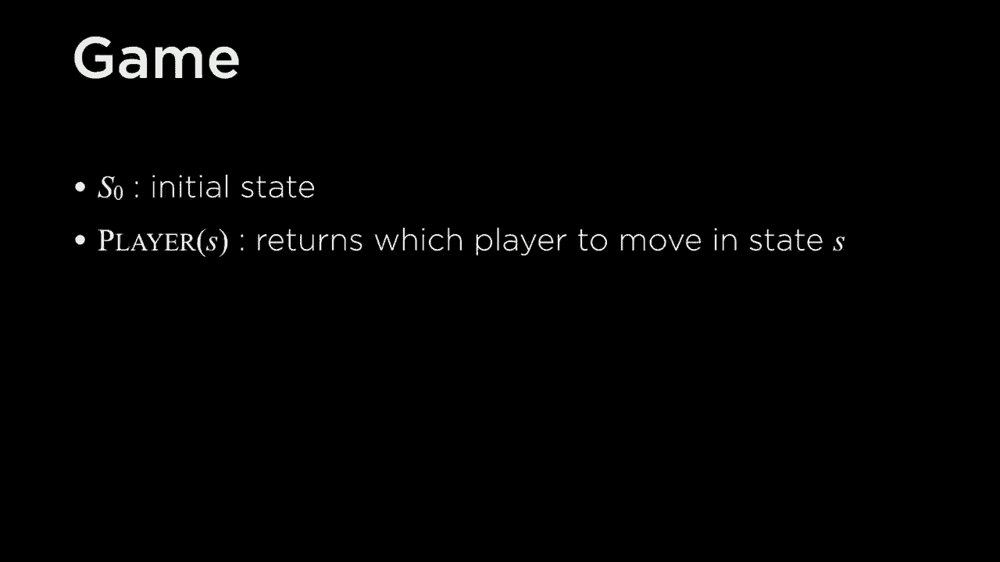

我们还需要一个名为玩家的函数，玩家函数将以状态作为输入，这里用s表示，玩家函数的输出将是轮到哪个玩家。我们需要能够将一个井字棋棋盘传递给计算机，通过一个函数运行它，然后。

函数告诉我们轮到谁了，我们需要一些可以采取的行动的概念。稍后我们会看到这些例子，我们需要一个与之前相同的转换模型。如果我有一个状态并采取一个行动，我需要知道作为结果会发生什么，我需要某种方式来了解何时。

游戏结束，因此这等同于一种目标测试，但我需要一些终端测试，以检查一个状态是否是终端状态，终端状态意味着游戏结束。在经典的井字棋游戏中，终端状态意味着某人已经三连胜，或者所有方块都被填满。

井字棋棋盘被填满，这两种条件使其成为终端状态。在棋类游戏中，终端状态可能是当出现将死或如果将军不再可能时，这就成为终端状态。最后，我们还需要一个效用函数，接受一个状态。

并为那个终端状态提供一个数值，如果X赢得游戏，则该值为1，如果O赢得游戏，则该值为负1。如果没有人赢得游戏，则该值为0。让我们逐一查看这些，在初始状态下，我们可以简单地表示为。

井字棋作为空的游戏棋盘，这是我们开始的地方，是我们开始搜索的起点。我将以视觉方式表示这些，但你可以想象这实际上就像一个数组或一个。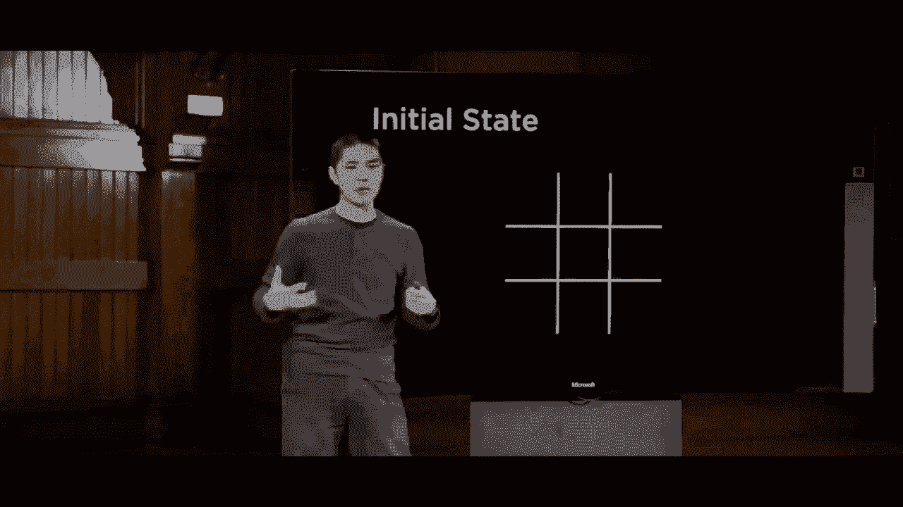

二维数组中包含所有可能的方块，我们还需要一个玩家函数，它同样接受一个状态并告诉我们轮到谁，假设X先走。如果我有一个空的棋盘，那么我的玩家函数是。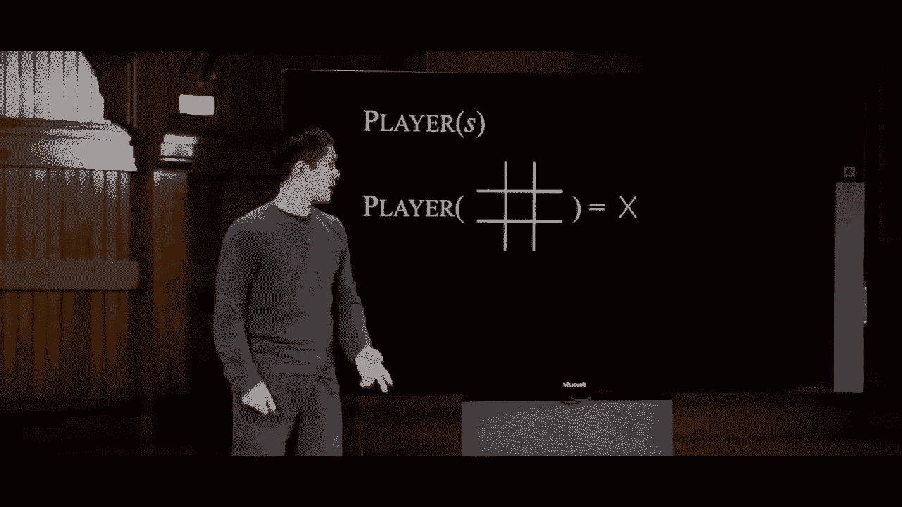

将返回X，如果我有一个棋盘，其中X已经移动，那么我的玩家函数将返回O。玩家函数接受一个井字棋棋盘并告诉我们下一个轮到谁。接下来，我们将考虑动作函数。动作函数就像在经典搜索中那样，接受一个状态并给出。

所有可能的行动集合，我们可以在该状态下采取的行动，所以让我们想象在一个看起来像这样的棋盘上总是轮到我们行动。当我们将其传入行动函数时会发生什么，因此行动函数以游戏状态作为输入，输出是一组可能的。

行动是一组我可以在左上角移动，或者我可以在底部中间移动，这就是我在这个特定状态开始时的两个可能行动选择。和之前一样，当我们有状态和行动时，我们需要某种转移模型来告诉我们，当我们在此状态下采取此行动时会发生什么。

表明我们得到的新状态是什么，这里我们使用结果函数来定义，结果函数接受状态作为输入以及一个行动，当我们将结果函数应用于这个状态时，假设让 O 在左上角下棋，我们得到的新状态是这个结果状态，其中 O 在左上角。

这对懂得如何玩井字棋的人来说似乎显而易见，当然你会在左上角下棋，那是你得到的棋盘，但所有这些信息都需要编码到井字棋中，直到你告诉 AI 井字棋的规则是如何工作的，这个函数定义允许我们。

告诉 AI 这个游戏是如何实际运作的，以及行动如何真正影响游戏。 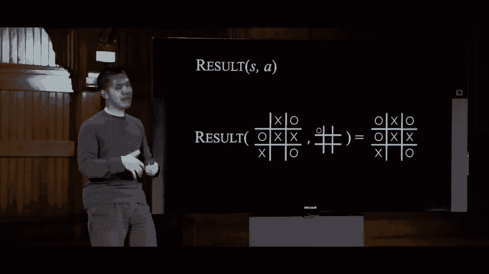

游戏的结果，因此 AI 需要知道游戏是如何运作的，AI 还需要知道游戏何时结束，这通过定义一个称为终止的函数来实现，该函数以状态 `s` 为输入，如果我们考虑一个尚未结束的游戏，传入终止函数的输出为假，游戏尚未结束，但。

如果我们考虑一个已经结束的游戏，因为 X 在对角线上已经连成三连，那么传入终止函数的输出将为真，因为游戏实际上已经结束，最后我们告诉 AI 游戏的运作方式，包括可以采取的行动以及当你采取行动时会发生什么。

按照我们告诉 AI 的步骤进行操作，游戏现在结束了，我们需要告诉 AI 每个状态的价值，我们通过定义这个效用函数来实现，它接受一个状态 `s` 并告诉我们该状态的得分或效用。

1 而如果 X 再次获胜，那么效用为负 1，AI 需要知道每个终止状态的效用，即游戏已结束时该状态的效用，因此我可以给你一个像这样的棋盘，其中游戏实际上已经结束，我询问 AI 这个状态的价值。

这可以实现，所以状态的价值是 1，但事情变得有趣的是，如果游戏还没有结束，假设一个像这样的游戏棋盘。我们处于游戏中间，轮到我们采取行动，那么我们怎么知道总是轮到我们行动呢？我们可以通过计算玩家来判断。

我们可以说，玩家的状态传递给O的答案，所以我们知道现在是他们的回合。这个棋盘的价值是什么？我应该采取什么行动？这将取决于我们必须进行一些计算，而这就是minimax算法真正发挥作用的地方。

X正试图最大化得分，这意味着O正试图最小化得分。我们希望最小化最终游戏的总值，因为这个游戏尚未结束，我们还不清楚这个棋盘的价值。我们需要进行一些计算。

为了弄清楚这一点，我们该如何进行计算呢？为此，我们将考虑就像在经典搜索中一样，下一步可能会采取哪些动作，以及这些动作会把我们带到什么状态。结果发现，在这个位置只有两个开放的方格。

这意味着只有两个开放位置，O可以出手，O可以选择在左上角出手，或者在下中间出手。Minimax不知道哪一个移动更好，所以它会考虑两个选项，但现在我们需要考虑。

现在进入同样的情况，我有两个游戏棋盘，它们都还没有结束。接下来会发生什么？在这个意义上，minimax可以称为递归算法，它将重复相同的过程，虽然现在是从相反的角度来看，就好像我现在是。

如果我是O玩家，我会站在对手的角度，考虑如果我是X玩家在这个位置，我的对手会怎么做？那么会发生什么呢？

我的对手，X玩家，正试图最大化得分，而我作为O玩家则在尽力最小化得分。因此，X正试图找到最大可能的值！

从这个棋盘位置来看，X只有一个选择，X将会在这里出手，他们会得到三连。在这种情况下，X赢得比赛的棋盘价值是1，如果X赢得比赛，那么这个棋盘的价值就是1。

从这个位置来看，如果这个状态只能导致这个状态，这是唯一的选择，而这个状态的价值是1，那么对手玩家可以从这个棋盘获得的最大可能值也是1。从这里，唯一能得到的就是一个价值为1的游戏棋盘，所以这个棋盘也有这个价值。

现在我们考虑这个局面，X需要进行一个移动，X唯一可以选择的移动是在左上角，所以X会走到那里。在这个游戏中没有人获胜，没有人连续三次，所以这个棋盘的价值是零，没有人赢。

相同的逻辑，如果从这个棋盘位置，我们唯一能到达的地方是一个价值为零的棋盘，那么这个状态也必须有一个价值为零。现在来了选择的部分，作为O玩家的我现在知道，如果我做出这个选择，移动到左上方。

导致一个价值为1的游戏，假设每个人都以最优方式进行游戏。如果我选择中下方，选择这条分叉，将导致一个价值为0的游戏板，我有两个选项可以选择，1和0，我需要做出选择，作为最小玩家我会。

我更倾向于选择价值最小的选项，因此每当一个玩家有多个选择时，最小玩家将选择价值最小的选项，而最大玩家将选择在1和0之间的最大值，0更小，意味着我宁愿平局也不愿输掉游戏。

游戏板上将显示这个游戏的价值为0，因为如果我在最优情况下，我会选择这条分叉，我会在这里放置我的O来阻止X三个一排，X会在左上角移动，游戏将结束，而没有人会赢得游戏。所以，这就是现在的最小最大逻辑。

考虑所有我可以采取的可能选项，以及我可以采取的所有行动，然后将自己置于对手的选择中。我决定现在要进行的移动，通过考虑我对手下一轮会做什么移动来决定，并且为了做到这一点，我还考虑了我在之后的回合会做什么移动。

继续进行，直到我一直走到游戏结束，达到这些所谓的终端状态。实际上，在这个决策点，我作为O玩家正在决定的事情，可能只是我对手X玩家在我之前所用的逻辑的一部分。

它将是某个更大树的一部分，在这种情况下，X需要选择三个不同的选项来做出决策。离游戏结束越远，这棵树就必须越深，因为这棵树的每个层级。

这将对应我进行的一次移动，或者说是我对手采取的行动，以决定发生什么。实际上，如果我在这个位置是X玩家，并且我递归地进行逻辑运算，我会发现我有三个选择，其中一个会导致一个结果。

如果我在这里进行游戏，并且如果每个人都以最优方式进行游戏，结果将是平局。如果我在这里玩，我总会赢，或者在这里，我作为X玩家可以赢得胜利，在0和负1以及1之间，我宁愿选择一个价值为1的棋盘，因为那样。

我能获得的最大值，因此这个棋盘也将具有一个最大值。这个树可以变得非常非常深，尤其是随着游戏开始有越来越多的走法。这一逻辑不仅适用于井字棋，也适用于任何这些类型的游戏，在这些游戏中，我先走一步，然后对手再走一步。

最终我们有这些对抗性的目标，我们可以将图示简化为看起来像这样的图，这更抽象地表现了。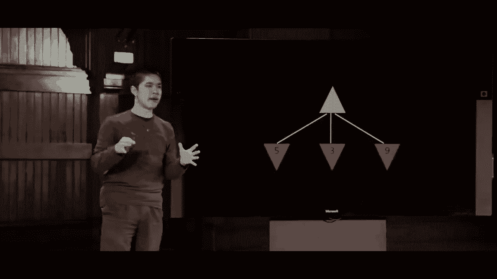

这是**极小极大树**，其中每个状态都在这里，但我不再表示它们。这就像井字棋的棋盘，这仅仅表示一些通用的游戏，可能是井字棋，也可能是其他完全不同的游戏。所有这些指向上的绿色箭头代表一个。

在**最大化状态**中，我希望得分尽可能大，而所有这些指向下方的红色箭头则是**最小化状态**，在这里玩家是**最小化玩家**，他们试图让得分尽可能小。因此，如果你想象在这种情况下，我是**最大化玩家**，这个玩家在这里。

我有三个选择，一个选择给我得分五，一个选择给我得分三，还有一个选择给我得分九。那么在这三种选择中，我最好的选择是选择这个九，它是最大化我所有三种选择的得分。

这给这个状态一个值为九，因为在我的三个选择中，这是我能获得的最佳选择，所以这是我的决策。现在你可以想象这就像离游戏结束还有一步，但你也可以问一个合理的问题。

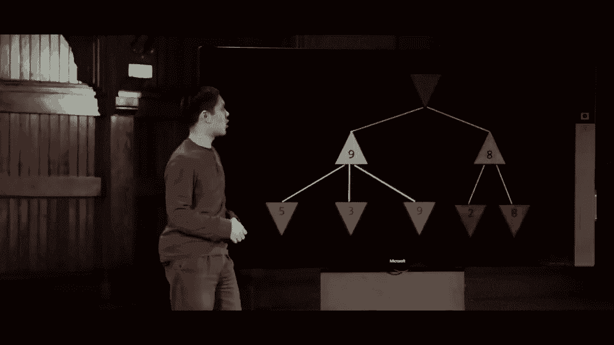

我的对手在游戏结束前两步可能会做什么呢？我的对手是**最小化玩家**，他们试图让得分尽可能小。想象一下，如果他们必须选择一个选择会发生什么。一种选择引导我们进入这个状态，而我，作为**最大化玩家**，将会选择。

对于九，我能获得的最大得分，而一则引导我们进入这个状态，作为**最大化玩家**我会选择八，而这就是我能获得的最大得分。现在**最小化玩家**被迫在9和8之间选择，将会选择尽可能小的得分，在这种情况下是8。

然后这个过程将如何展开，但在这种情况下**最小化玩家**会考虑他们的两个选择，以及因此产生的所有选项。所以这现在是一个**极小极大**的整体图景。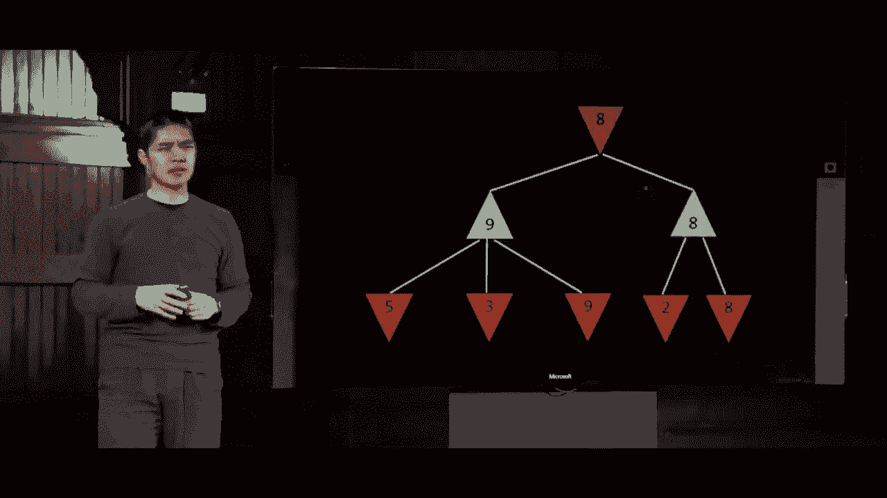

算法看起来是这样的，现在我们尝试用一点伪代码将其形式化。那么在**极小极大算法**中究竟发生了什么呢？在给定状态s的情况下，我们需要决定。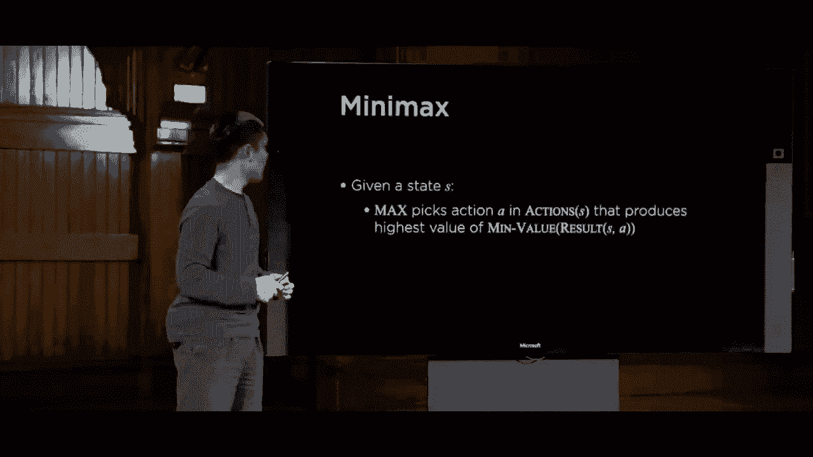

如果轮到最大化的玩家，最大化的玩家将选择在我们之前提到的行动集合中一个行动a，回忆一下，行动是一个函数，它接受一个状态并给我返回所有可能的行动，它告诉我所有可能的移动，最大化的玩家将会。

特别是选择在行动集合中能够给我最高的最小值结果的行动a，这意味着我想选择能够让我在所有行动中获得最高分的选项a，但这个分数究竟是什么，我需要知道我的。

最小化的玩家会怎么做，如果他们试图最小化所得到状态的值，我们需要考虑在我采取这个行动后，哪个状态会产生，以及当最小化的玩家试图最小化那个状态的值时会发生什么。我考虑了所有我的可能选项，并在考虑之后。

对于我所有可能的选项，我选择了价值最高的行动a，类似地，最小化的玩家也会这样做，但他们是反向思考，他们会考虑如果轮到他们，他们可以采取的所有可能的行动，并选择具有最小可能值的行动a。

所有的选项，以及他们如何知道所有选项中最小的可能值是通过考虑最大化的玩家会做什么，问一下将这个行动应用于当前状态的结果，然后最大化的玩家会尝试做什么，最大化的玩家会为此计算出什么值。

那个特定状态使每个人的决策都基于试图估计对方会做什么，现在我们需要将注意力转向这两个函数：最大值和最小值，如何实际计算一个状态的值，如果你试图最大化它的价值，又该如何操作。

如果你试图最小化价值，计算一个状态的值，如果你能做到这一点，那么我们就拥有这个最小最大算法的完整实现。让我们尝试一下，试着实现这个最大值函数，它接受一个状态并返回作为输出的值，如果我试图最大化。

关于状态的值，我可以首先检查游戏是否结束，因为如果游戏结束，换句话说，如果状态是终局状态，那么这很简单，我已经有这个效用函数，它告诉我棋盘的值，如果游戏结束，我只需检查，比如说x是否获胜。

赢了是平局吗？这个效用函数只知道状态的值，更棘手的是，如果游戏没有结束，因为那样我需要进行递归推理，思考我的对手在下一步会做什么，我想计算这个状态的值。

状态的值尽可能高，我会在一个名为V的变量中跟踪这个值。如果我想让值尽可能高，我需要给V一个初始值，最初我会将其设定为尽可能低，因为我不知道可用的选项是什么。

一开始，我会将V设为负无穷，这似乎有点奇怪，但这里的想法是我希望初始值尽可能低，因为在考虑我的行动时，我总是会尝试做得比V更好。如果我将V设为负无穷，我知道我总能做得更好。

所以现在我考虑我的行动，这将是某种循环，对于状态中的每个行动，回忆一下，actions是一个函数，它接受我的状态并给我所有可能的行动。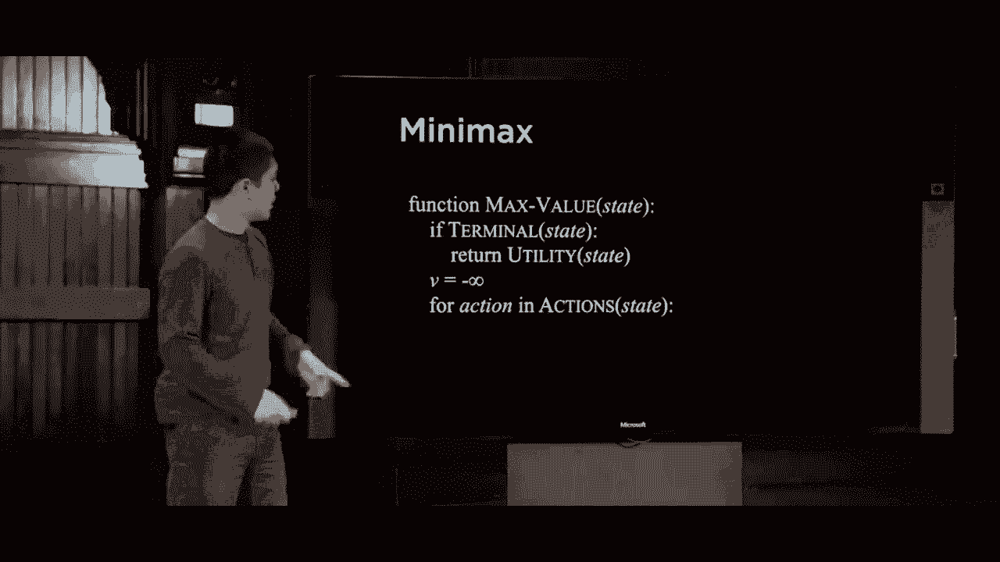

因此，对于每一个行动，我想将其与V进行比较，并说好的，V将等于V和这个表达式中的最大值。那么这个表达式是什么呢？首先，它是获取在该状态中采取行动的结果，然后获取该结果的最小值，换句话说，假设我想找出。

从这个状态来看，最小玩家能做的最好选择是什么，如果他们想要尽量减少分数，那么无论结果的分数是多少，都要将这个最小值与我当前的最佳值进行比较，然后选择这两者中的最大值，因为我正在尝试。

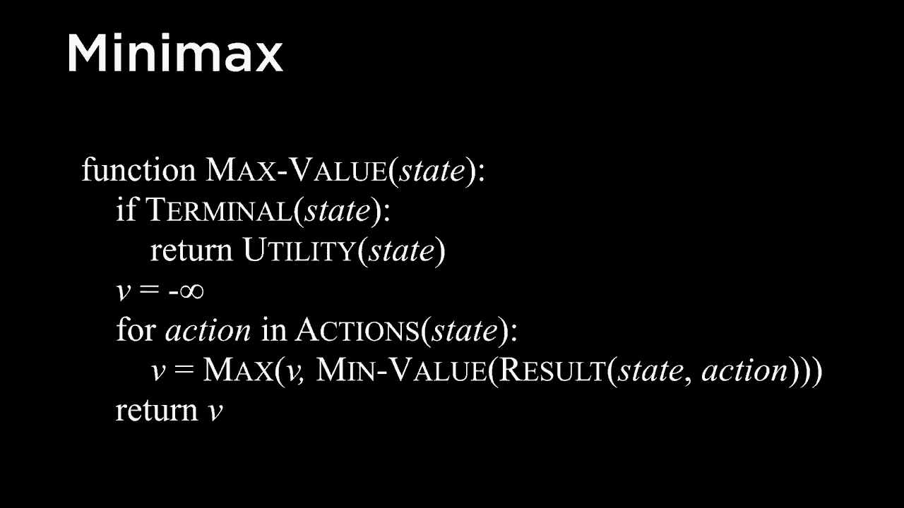

简而言之，这三行代码所做的就是遍历我所有可能的行动，问这个问题：在我的对手尝试在这整个循环之后做什么的情况下，我如何最大化分数。最终我可以通过返回来得到那个特定状态的值。

对于最小玩家来说，正好与此相反，逻辑相同，只不过是反过来计算一个状态的最小值，首先我们检查它是否是一个终止状态，如果是，就返回效用，否则我们将尝试尽量减少该状态的值，考虑到我所有可能的行动，因此我需要一个。

V的初始值是状态的值，最初我将其设定为正无穷，因为我知道它总能得到小于正无穷的东西。因此，通过从V等于正无穷开始，我确保我找到的第一个行动。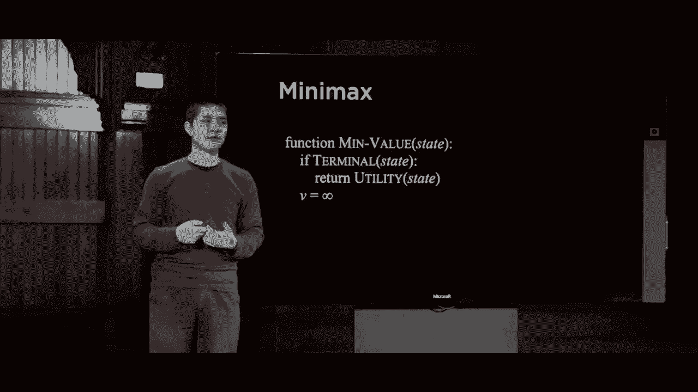

这个值将小于V的值，然后我做同样的事情，遍历我所有可能的行动，对于每个结果，当最大玩家做出决策时，让我们取最小值和当前值e。因此，经过一切，我得到可能的最小值。

最后返回的V的值。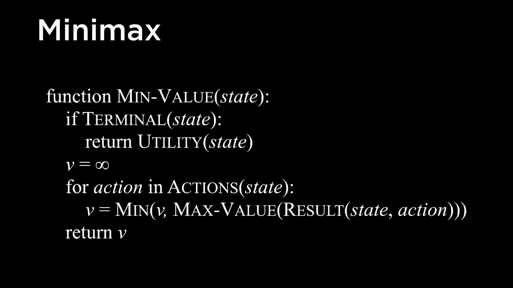

用户实际上是伪代码，用于最小最大算法，这就是我们如何处理一个游戏并通过递归使用这些最大值和最小值函数来确定最佳移动，最大值调用最小值，最小值再调用最大值，来回进行，直到我们达到终端状态。

在这个点上，我们的算法可以简单地返回那个特定状态的效用，你可能会想象，这将开始变成一个漫长的过程，尤其是随着游戏开始变得更复杂，我们开始添加更多的动作和更多的可能选项，以及可能持续更长时间的游戏。

所以接下来的问题是，我们可以在这里进行什么样的优化，我们如何能够更好地使用更少的空间或更少的时间来解决这种问题，我们将查看几种可能的优化，但对于一种，我们将再次回顾这个例子。

这些向上和向下的箭头，让我们想象我现在是最大玩家，这个绿色箭头我试图让得分尽可能高，这是一场简单的游戏，我只需进行两个动作，我选择这三种选项之一，然后我的对手也选择这三种选项之一。

我做出什么移动，因此我们得到了某个值，让我们看看我进行这些计算的顺序，并弄清楚是否有任何优化可以对这个计算过程进行改进，我必须逐个查看这些状态，所以假设我从左边开始。

说好，现在我将考虑我的对手最小玩家会尝试做什么。好吧，最小玩家会查看他们的三个可能的行动，并查看它们的值，因为这些都是终端状态，它们是游戏的结束，所以他们会看到这个节点的值是四，值是八。

值为五，而最小玩家会说好吧，在这三个选项中，八和五，我会选择最小的那个，我会选择四。因此这个状态现在的值是四，然后作为最大玩家的我说好吧，如果我选择这个行动，它将有一个值为四，这是我所能得到的最好结果。

由于最小玩家会试图最小化我的得分，那么如果我选择这个选项，我们将接下来探索这个，接下来探索如果我选择这个行动，最小玩家将会说好吧，最小玩家有的三个选项是九、三和七。

所以三是在九和七中是最小的，因此我们可以说这个状态的值是三，所以现在作为最大玩家的我已经探索了我的三个选项中的两个，我知道我的一个选项将至少保证我得分四，而我的一个选项将保证我得分三，而现在我。

让我考虑我的第三个选项，想想这里会发生什么，采用完全相同的逻辑。最小化玩家会查看这三个状态：2、4和6，最小可能的选项是2，因此最小化玩家想要2，而我作为最大化玩家已经通过向下看两层深来计算了所有信息。

通过查看所有这些节点，我现在可以说，在4、3和2之间，你知道我宁愿选择前者，因为如果我选择这个选项，如果我的对手最佳游戏，他们会试图让我达到4，但这就是我能做到的最好了。我不能保证更高的得分，因为如果我选择其中一个。

2个选项，我可能会得到3，或者得到2，确实在这里是9，这是所有分数中最高的，所以我可能会想说，你知道吗？也许我应该选择这个选项，因为我可能会得到9，但如果最小化玩家聪明地在玩，他们会考虑我的对手对此的反应。

最佳的动作和他们在做选择时所拥有的每一个可能选项。我会留下3，而如果我能以最佳方式进行游戏，我本可以确保获得4，这就是我作为一个迷你最大化玩家所使用的逻辑，试图从那个节点最大化我的得分，但这反过来了。

他们花了我相当多的计算时间才能弄清楚这一点，我必须理清所有这些节点才能得出这个结论，这对于一个相当简单的游戏来说，我有三个选择，而我的对手有三个选择，然后游戏结束。所以我想做的是想出一些方法。

为了优化这个，也许我不需要进行所有这些计算就能得出结论，你知道吗？这个向左的动作是我能做的最好选择。让我们再试一次，试着在做这件事情时更加聪明，所以我首先以完全相同的方式开始。

我最初不知道该怎么做，因此我只需考虑其中一个选项，想想最小化玩家可能会怎么做。最小化玩家有8和5的三个选项，而在这三个选项中，最小化玩家认为4是他们能做的最好选择，因为他们想要尽量减少得分。现在我，作为最大化玩家，会考虑我的第二个选项。

那么最小化玩家会怎么做呢？最小化玩家会从那个状态查看他们的选项，我会说，好的，9是一个选项，3也是一个选项。如果我从这个初始状态进行数学计算，进行所有这些计算，当我。

看到3时，这对我来说应该立即是一个红色警告，因为当我在这个状态下看到3时，我知道这个状态的值最多为3。它将是3或者低于3，即使我还没有查看这个最后的动作，甚至是几个后续动作，如果还有更多的话。

我可以有效地剪除这个叶子节点，并且在这里可以采取的行动，我怎么知道这一点呢？我知道最小玩家将试图将我的得分降低，如果他们看到一个3，唯一能使这个值不等于3的，就是我尚未查看的剩余状态小于3，这意味着没有办法。

值不能超过3，因为最小玩家已经能保证得分为3，并且他们正在努力将我的得分降低。那么这告诉我什么呢？这告诉我如果我选择这个行动，我的得分将是3，或者如果运气不好，甚至可能低于3，但我已经知道这个行动将。

保证我得到4。因此，考虑到我知道这个行动保证我得分为4，而这个行动意味着我不能得到超过3的得分，如果我试图最大化我的选择，那就没有必要考虑这个三角形。这里没有任何值，任何数字能改变我在这之间的想法。

我总是会有两个选择，一个是让我得到4的路径，另一个是让我得到3的路径，前提是我的对手以最佳策略进行游戏。这对于我未来考虑的所有状态都是成立的，但如果我看一下最小玩家可能会做的事情，如果我看到这个状态是一个。

2，我知道这个状态至多是2，因为这个值如果不等于2，就必须有其中一个剩余状态小于2，因此最小玩家会选择那个状态，而不是这个。因此，即使不考虑这些剩余状态，作为最大化玩家的我也能知道，选择。

然后选择这两个路径中的任一个都不如右边的那个，因为这个路径不能优于3，那个路径不能优于2，因此在这种情况下，这是我能做到的最好选择。为了做这个，我现在可以说这个状态的值是4。因此，为了进行这种类型的计算，我会认为。

需要更多的记账，随时跟踪事情，跟踪我能做的最好和最坏的事情，对于每一个状态，我会说，好吧，如果我已经知道我能得到4，那么如果我考虑的最佳结果是。

从树中剪除任何低于它的值，因此这个方法，这种最小化的优化称为阿尔法-贝塔剪枝，阿尔法和贝塔代表这两个值，你必须跟踪你目前为止能做到的最好结果。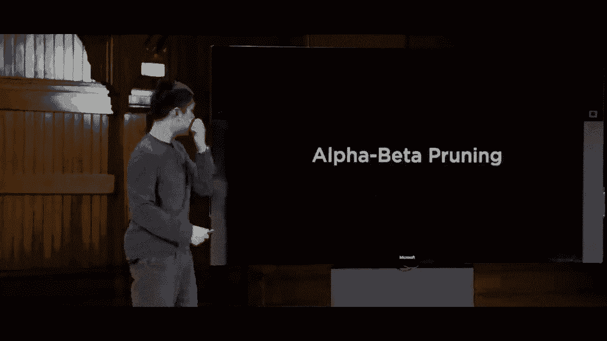

到目前为止你能做的最糟糕的事情，因此剪枝的理念是，如果我有一个很长很深的搜索树，如果我不需要搜索所有内容，我可能会更高效地搜索它。如果我能删除一些节点，以优化我查看整个搜索空间的方式，那么阿尔法-贝塔。

剪枝确实可以为我们节省很多时间，在搜索过程中通过提高搜索效率，但即便如此，当游戏变得更复杂时，这仍然不是很好。幸运的是，井字棋是一个相对简单的游戏，我们或许可以合理地问，究竟有多少种。

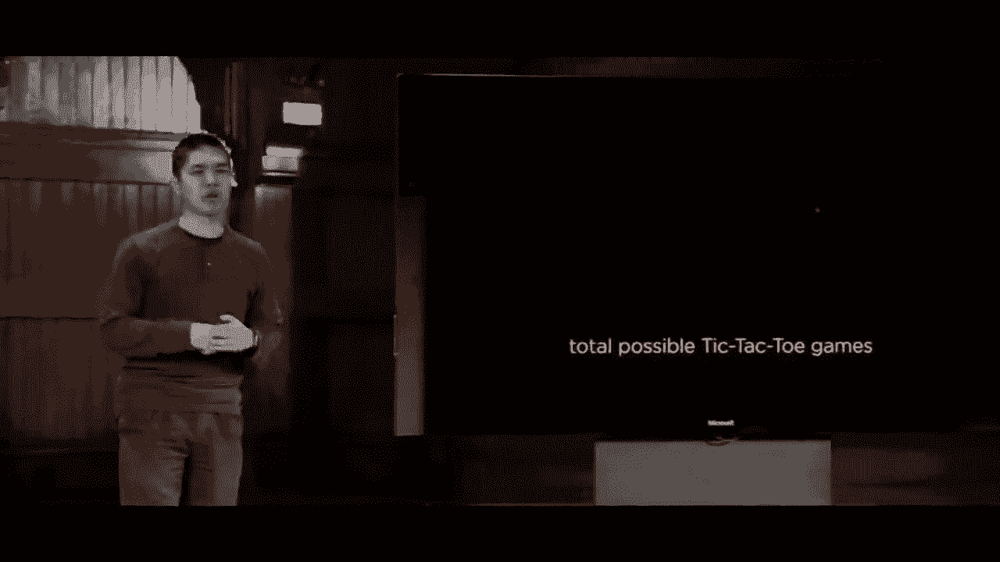

总共有多少可能的井字棋游戏呢？你可以考虑一下，尝试估算在任何特定时刻，有多少步骤。有多少步长，游戏持续多长时间。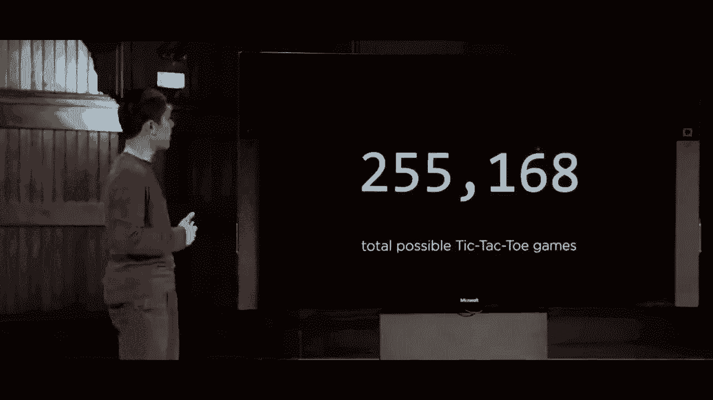

结果是，约有二十五万可能的井字棋游戏可以进行，但与更复杂的游戏相比，比如国际象棋，棋子更多，移动更多，游戏持续时间更长，有多少呢？

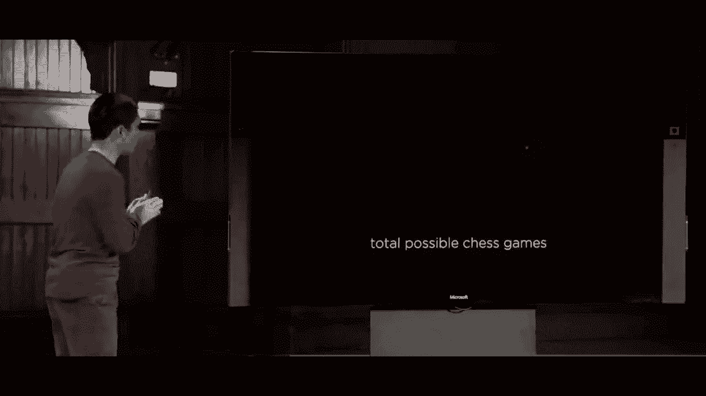

总共有多少可能的国际象棋游戏呢？结果是，仅仅经过四步，每位白方选手四步，黑方选手四步。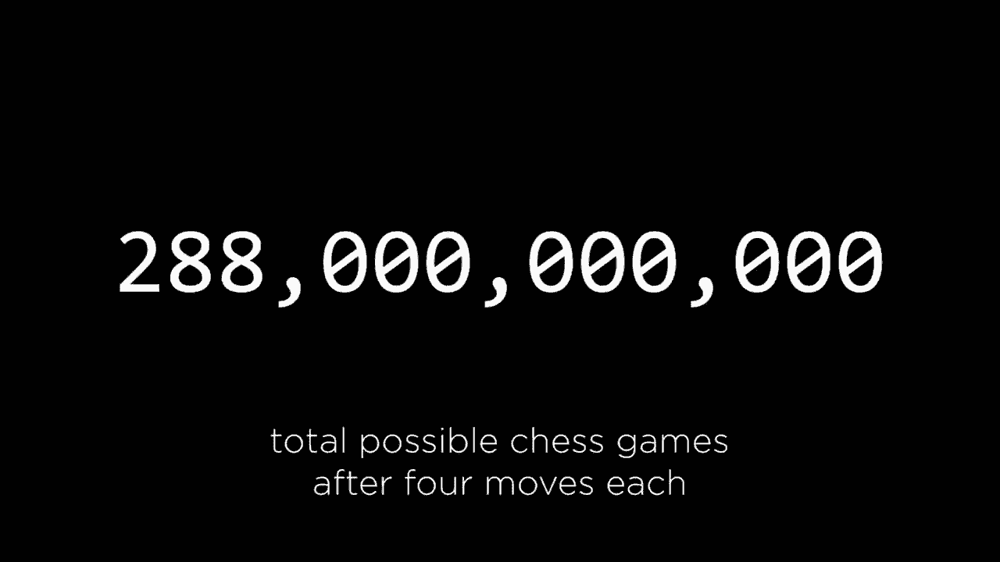

从这种情况下，可能会有2880亿种可能的国际象棋游戏。仅仅在四步之后，进一步分析整个国际象棋游戏，会有多少种可能的国际象棋游戏呢？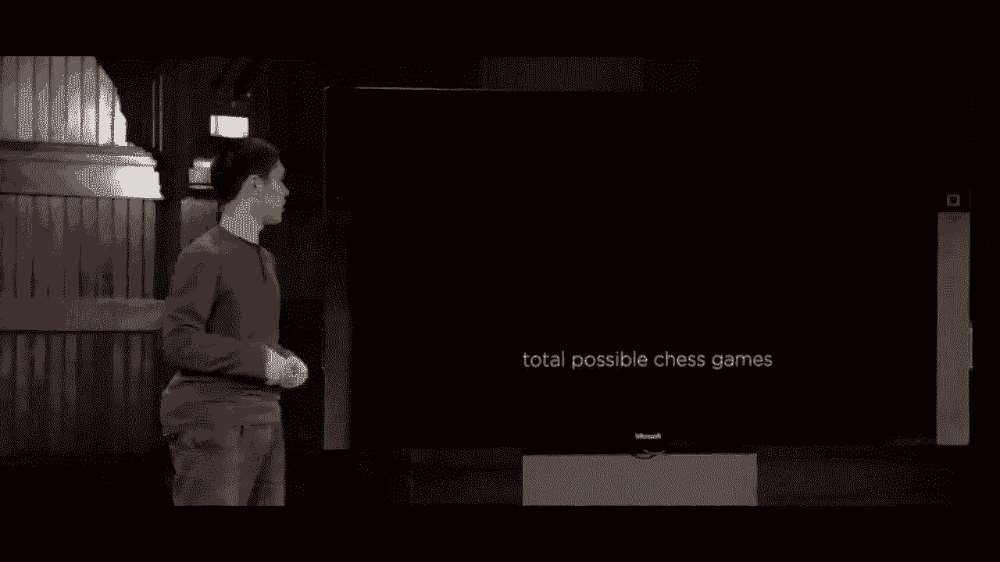

因此，可能会有超过十的二十九次方的国际象棋游戏，远比任何可能被考虑的国际象棋游戏要多。这对极小化算法来说是一个相当大的问题，因为极小化算法从初始状态开始，考虑所有可能的动作和所有可能的。

之后的所有行动，直到我们到达游戏结束。如果计算机需要查看如此多的状态，这将是一个问题，这远远超过了任何计算机在合理时间内能够做到的。那么我们该如何解决这个问题，而不是层层深入，每一步都往前走，直到游戏结束呢？

对于计算机来说，遍历所有这些状态是完全无法处理的，我们需要一些更好的方法，结果显示这种更好的方法通常采取一种称为深度的方法。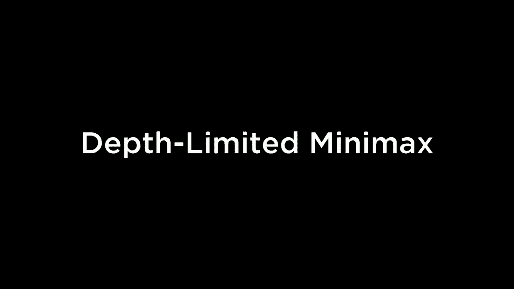

限制的极小化算法，通常极小化算法是深度无限的，我们只需不断进行下去。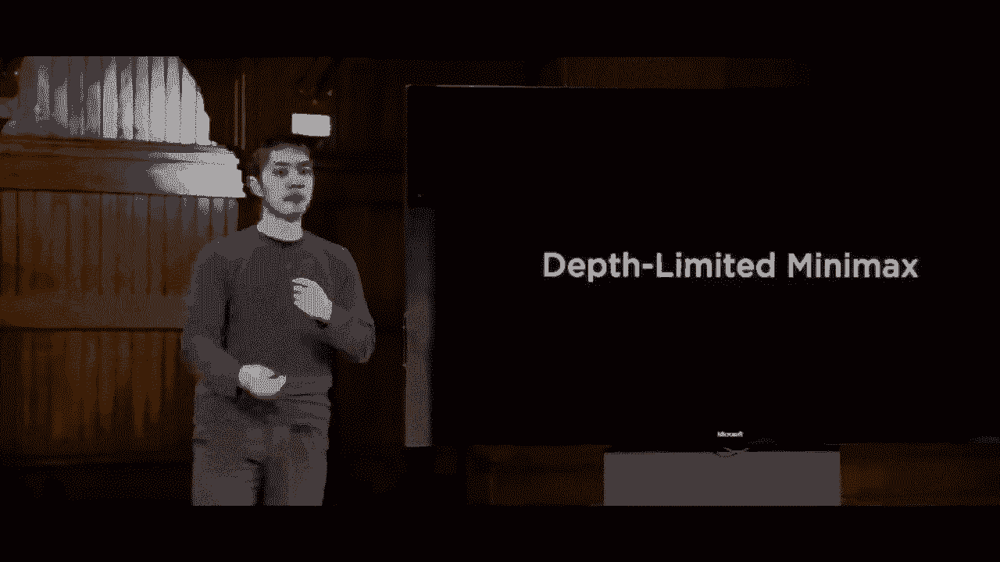

深度有限的极小化算法会说，你知道吗，在某个步数之后，也许我会看十步前。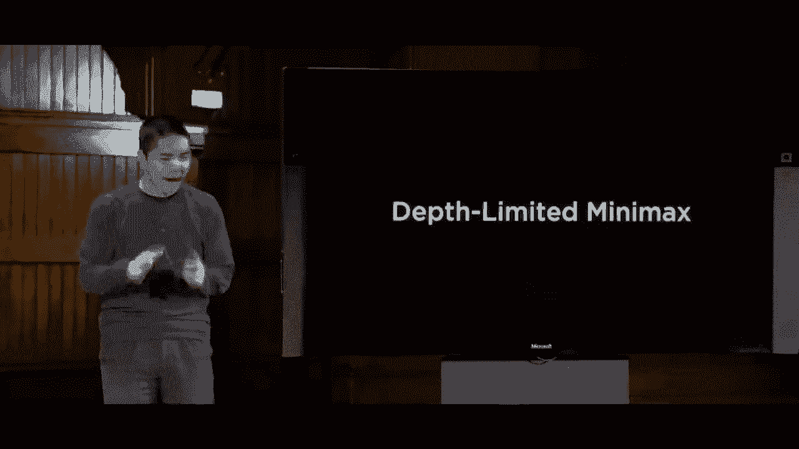

也许我会看十二步之后，但到那时我会停止，不再考虑可能的额外步骤。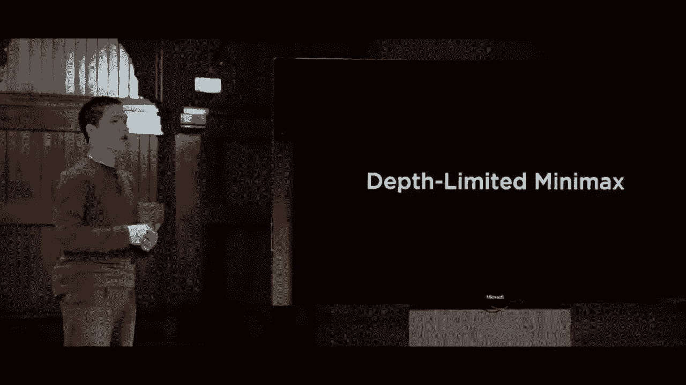

在计算上，考虑所有可能的选项是不可行的，所以我们在深入十或十二个棋步后，会遇到游戏尚未结束的情况，minimax仍然需要一种方法为棋盘或游戏状态分配分数，以确定其当前价值，这在游戏结束时很简单，但如果游戏还未结束，就不那么容易。

为此，我们需要为深度限制的minimax添加一个额外的特征，称为评估函数，它只是一个估计预期效用的函数。

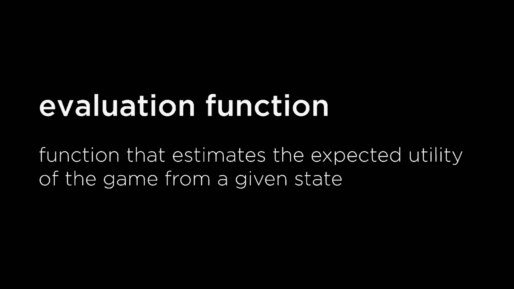

在一个游戏中，比如国际象棋，如果想象游戏值为1意味着白方胜利，而0表示平局，那么你可以想象0.8的分数意味着白方非常可能获胜，这当然不是绝对保证。你会有一个评估函数来估计游戏状态的好坏。

这取决于评估函数的质量，这最终将约束AI的能力。AI越擅长评估任何游戏状态的好坏，它在玩游戏时就会越出色。如果评估函数较差，则表现不佳。

作为对预期效用的估计，它会变得更复杂，因此想出这些评估函数会更加困难。在国际象棋中，你可能会根据你拥有的棋子数量与对手的棋子数量来编写评估函数，因为每个。

每个都有一个值，你的评估函数可能需要比这更复杂，以考虑其他可能出现的情况，还有许多其他的minimax变体以及添加其他特征，以帮助在这些更复杂的环境中表现更好。

在计算上不可行的情况下，我们无法探索所有可能的走法，因此需要弄清楚如何使用评估函数和其他技术，以便能够最终更好地玩这些游戏。但这现在是对这种对抗搜索的一种观察。

我们面临的问题是，在与某种对手对战时，这些搜索问题在整个人工智能领域中随处可见。今天我们讨论了更多经典的搜索问题，比如尝试找到从一个位置到另一个位置的方向。

但每当眼睛面临决策时，比如我现在该怎么做，以便做出理性或智能的行为，或者尝试玩游戏，像是想出该做什么棋步时，这些算法实际上会非常有用。

井字棋的解决方案相对简单，因为这是一个小型游戏，xkcd著名地制作了一部网络漫画，在其中他会告诉你确切的最佳动作。

无论你的对手做什么，这种情况在像跳棋或国际象棋这样的大型游戏中并不太可能，因为国际象棋对大多数计算机来说在计算上是不可解的，因此我们确实需要我们的AI变得更加智能。

它们如何聪明地处理这些问题，以及它们如何在这个环境中寻找解决方案，所以这就是我们对人工智能中搜索的探讨，下次我们将研究知识。

思考我们的AI是如何获取信息、推理这些信息并得出结论的。
