# 哈佛CS50-AI ｜ Python人工智能入门(2020·完整版) - P5：L1- 知识系统知识 1 (知识，逻辑) - ShowMeAI - BV1AQ4y1y7wy

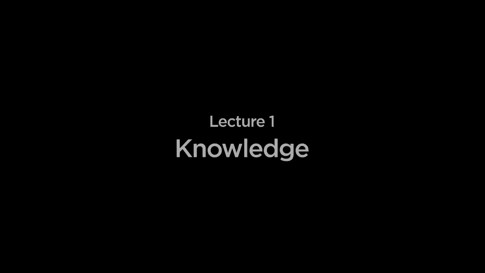

好的，欢迎大家回到《Python人工智能入门》的介绍。上次我们特别讨论了搜索问题，我们有人工智能代理。它们试图解决某种问题，在某种环境中采取行动，而这个环境就是。通过在游戏中进行移动或其他某种行动来采取行动。

尝试找出在哪里转弯，以获取从A点到B点的行车路线。这次我们将更普遍地关注知识这个概念。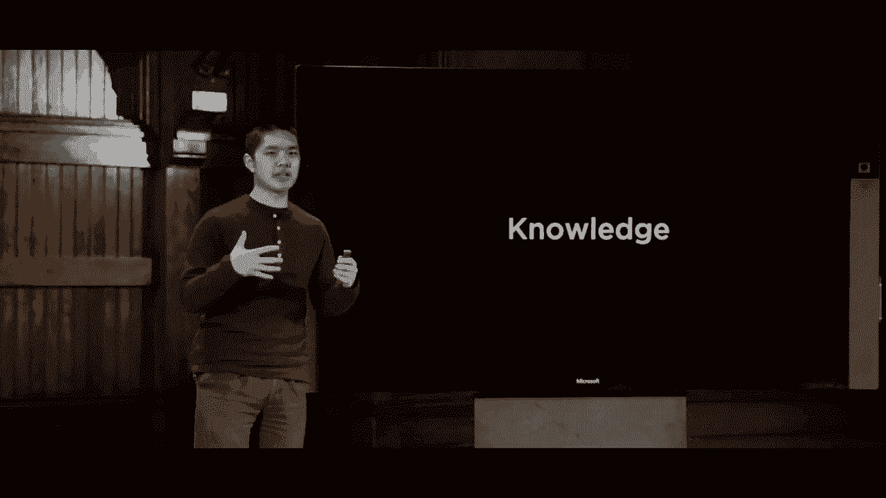

很多智能都是基于知识，特别是如果我们考虑到智能。人们知道信息，我们知道关于世界的事实，并利用这些已知的信息。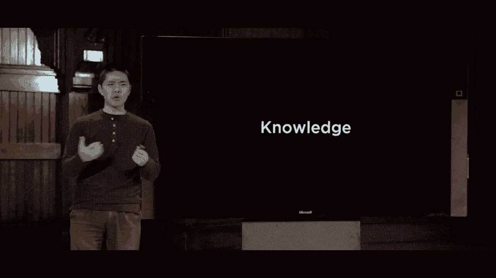

能够得出结论，推理我们所知道的信息。为了弄清楚如何做某事或得出其他信息，我们进行推理。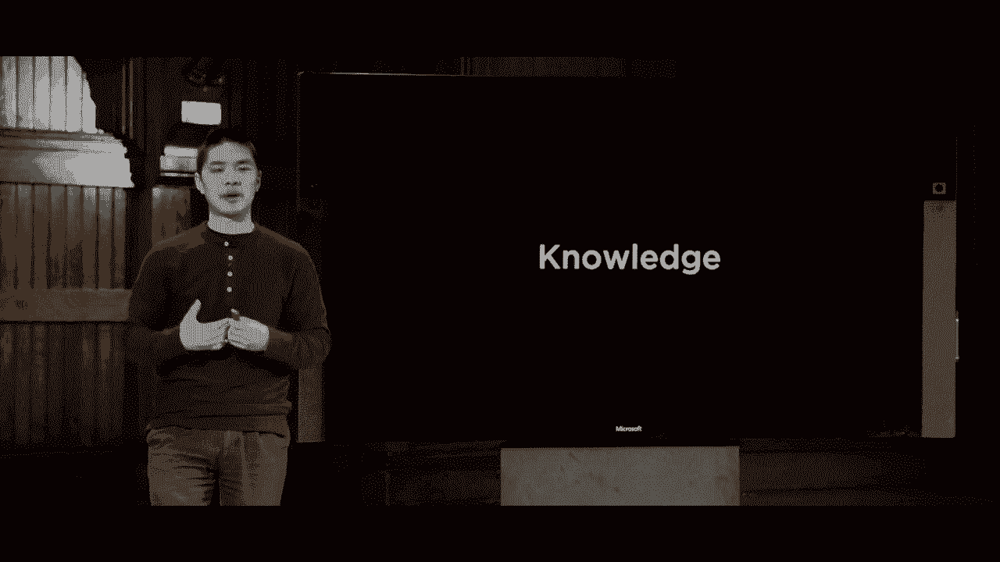

基于我们已经拥有的信息，我们希望现在关注的是。能够将知识这一概念进行推理并应用为想法。人工智能，尤其是我们将要构建的。被称为知识型代理，能够通过内部表示知识来推理和行动的代理。

在Rai内部，我对知道某事的含义有一定理解。理想情况下，某些算法或技术可以基于它们所知道的知识来使用，以解决问题，找出额外的信息。这在某种程度上是有帮助的，我们所说的基于知识的推理。

能够得出结论，让我们看一个来自《哈利·波特》世界的简单例子。我们拿出一句我们知道是真实的句子，假设今天下雨。哈利今天访问了海格，这是一个事实，我们可能知道的另一个事实是哈利今天访问了海格或邓布利多，但不是两者。

这告诉我们一些关于世界的信息：哈利访问了海格，但没有访问邓布利多。或者哈利访问了邓布利多，但没有访问海格，现在我们有第三条关于世界的信息。哈利访问了邓布利多，我们现在有三条信息，三个事实在知识库中。我们所知道的信息，现在我们作为人类可以尝试推理并根据这些信息进行分析。

我们可以开始得出什么额外信息，看看这最后两条陈述。哈利要么拜访了海格，要么邓布利多，不能同时拜访，而我们知道佩里今天拜访了邓布利多。基于这两条陈述的结合，我们可以合理得出结论，你知道的。哈利今天一定没有去拜访海格。

你可以得出这个结论，哈利今天没有去看足球。事实证明，我们甚至可以做得更好，获取更多信息。我查看了这个第一条陈述并进行推理。第一条陈述说如果没有下雨，哈利今天就去拜访了海格。

这意味着在所有没有下雨的情况下，我们知道哈利拜访了海格。如果我们现在也知道，哈利没有拜访海格，这就告诉我们一些关于我们最初思考的前提的信息。特别是，骨盆，今天确实下雨了，因为我们可以推理如果没有下雨。哈利就会去拜访海格，我们确实知道，哈利今天没有去海格那里，这种推理。

一种逻辑推理的方式，我们基于我们所知道的信息使用逻辑。以便获取信息，并得出结论。今天我们讨论的重点就是这个，我们如何。让人工智能，逻辑，培根执行，同样的推理。

我们一直在进行的推理，有时我们在用人类语言进行推理，就像我刚才说的。用英语谈论这些句子并尝试推理它们之间的关系，当我们将注意力转向计算机并能够编码时，我们需要稍微正式一些。逻辑和真理与虚假的概念，在机器内部。

我们需要介绍几个术语，侄子符号。这将帮助我们推理逻辑的概念，在人工环境中。我们将从句子的概念开始。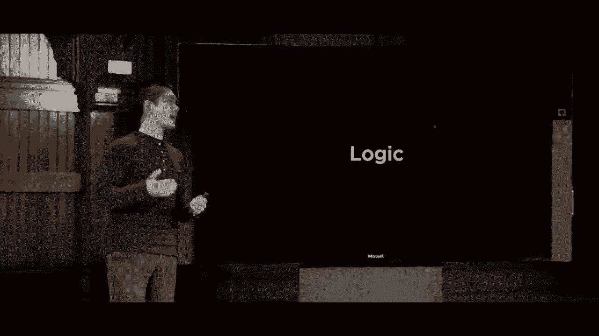

现在，像英语这样的自然语言中的句子只是。我正在说的某些内容，就像我现在所说的。在人工智能的背景下，句子。是对世界的断言，我们称之为知识表征。一种表示知识的方式，内部是哈金剧院。

等等，我们今天大部分时间都会花在对知识的推理上。通过一种称为命题的逻辑。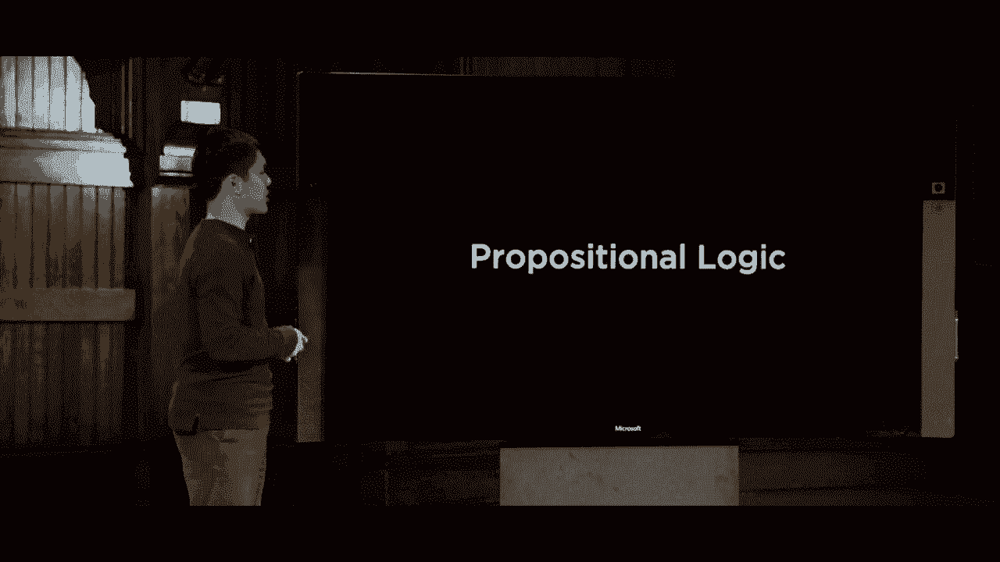

有多种不同类型的逻辑，其中一些将涉及到命题逻辑。基于关于世界的命题陈述，命题逻辑的开始。命题符号的定义。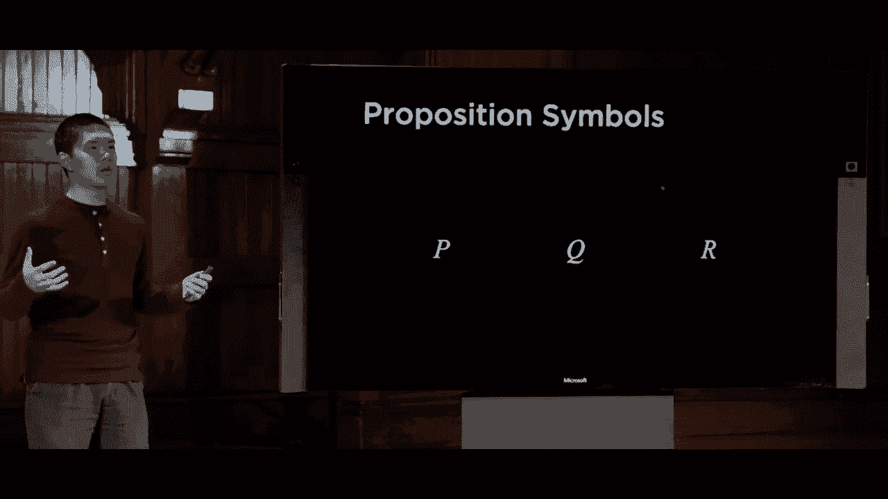

人们使用某些符号，通常是字母，比如P或Q，这些符号将代表某些概念。有趣的是，关于世界的一个句子，比如P代表“正在下雨”。Poppy将作为一个符号，代表这个概念，而Q可能代表“哈利今天拜访了海格”，这些命题符号代表一些句子。

关于世界，我们只是听到个别的关于世界的事实。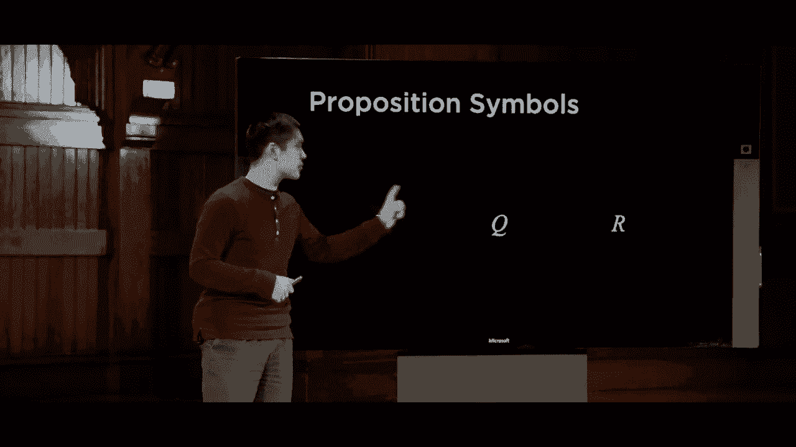

我希望能有某种方式将命题符号连接在一起，以便更复杂地推理。但在我们推理的世界中，可能还存在其他事实。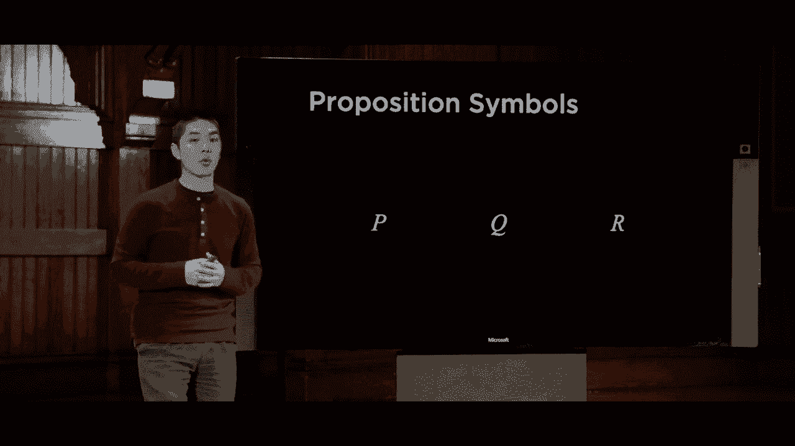

为了做到这一点，我们需要引入一些附加符号，通常被称为逻辑联结词。这些逻辑联结词有很多，我们今天关注的五个最重要的就是上面这五个。由逻辑符号表示的“非”，用这个符号表示。

这个概念被表示为一种倒V形，或者用V形的蕴涵表示，我们稍后会讨论这意味着什么。由箭头表示，双条件我们也会在稍后讨论其含义。这些是五种逻辑联结词，我们将重点关注的主要内容是，考虑计算机如何处理这些。

基于事实进行推理，但为了达到这个目的，我们需要查看这些逻辑联结词中的每一个，并建立对它们实际含义的理解。让我们开始吧。这不是简单的内容，我们将展示每一个逻辑连接词的情况。

我们将称之为“真值表”，这表明“非”这个词的含义。当我们将其附加到命题符号或我们的逻辑语言中的任何句子时，真值表便产生。这里是一个命题符号或其他句子的示例，如果是假的，那么“非p”就是真的。如果p是真的，那么“非p”，你可以想象将这个“非”符号放在某个命题逻辑句子前面。

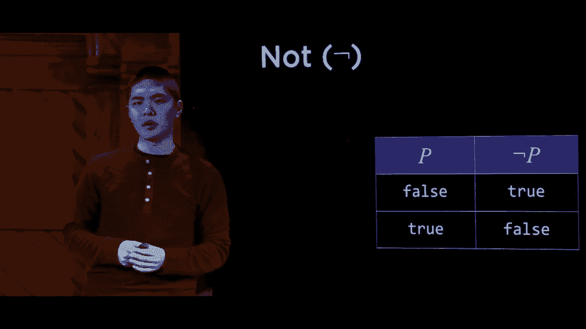

相反的，如果例如说“正在下雨”，那么“非”将代表这个想法，即“没有下雨”。如果p为假，意味着句子“正在下雨”，那么“非p”就代表“没有下雨”，因此这个句子是成立的。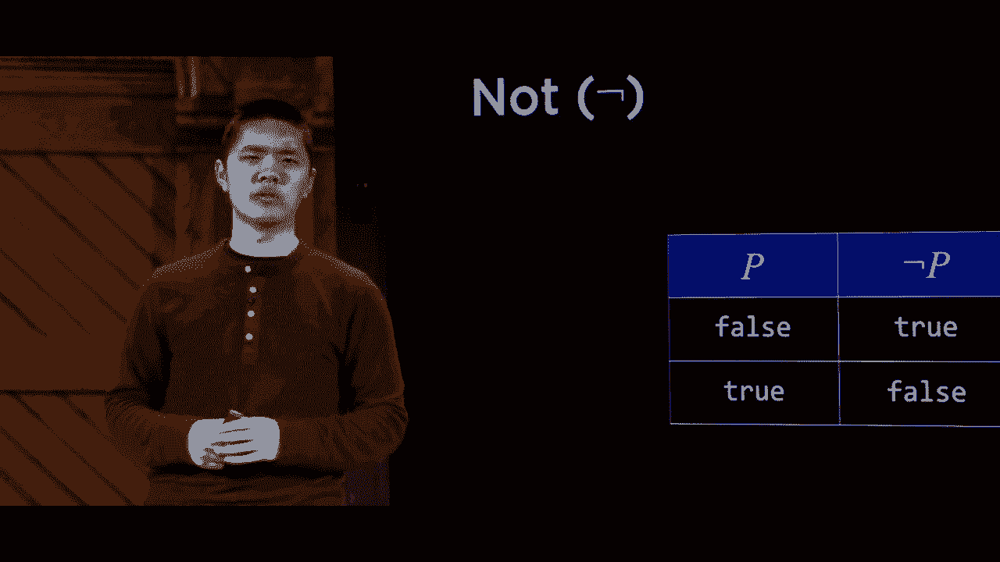

“非”可以想象为取反p中的内容。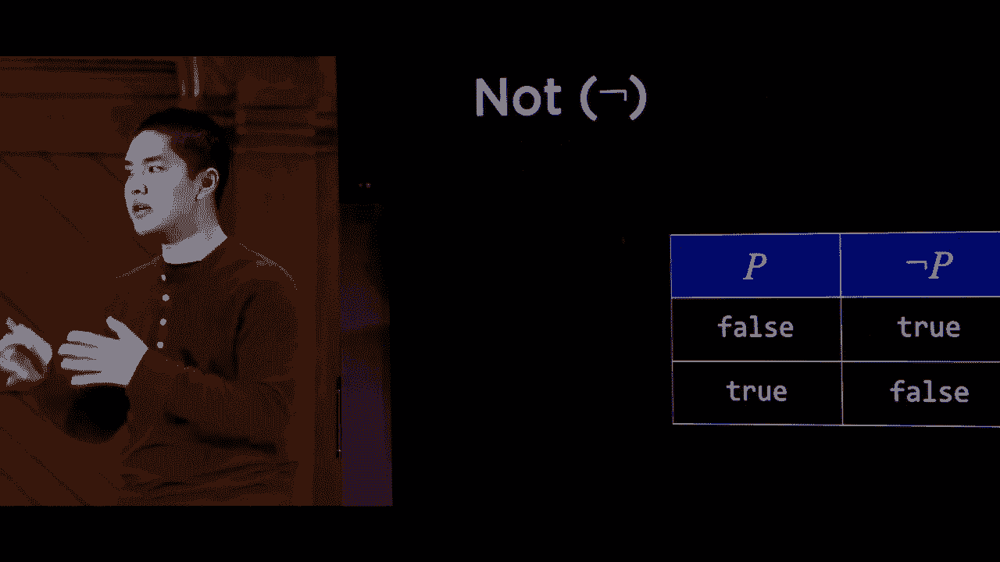

真实的，真正的，类似于英语中的“非”，即对后面的内容进行反转，意味着相反的意思。接下来，类似于英语的概念，用这个倒V形状来表示。在不是单一的论点的情况下，我们有p，也有“非p”。

然后我要结合两个不同的命题逻辑句子，所以我可能有一个句子p，另一个句子Q，我想把它们结合在一起，表示P和Q。对于p和q的含义，一般逻辑上，它意味着两个都是真，并且还包括。这就是当我们有两个变量p和Q时的真值表。

当我们有两个变量，每个变量可以处于两个可能状态时，真或假。这导致了2的平方或4种可能的真与假的组合。袭击者Incubus Falls，P为真时Incubus为假，P和Q都为真。这是P和Q可能的四种情况。

第五列这里的pnq告诉我们关于它实际含义的一点信息。Pnq，唯一的情况是P为真，PA恰好为真，Q也恰好为真，所有其他情况，B和Q都将评估为假。这与我们直觉相符，如果我说P和Q，可能意味着。

我期望P和Q，也可能与我们所指的这个“或”一致。由这个倒V形符号表示，或者。顾名思义，当其任意一个参数为真时，它就为真，只要P为真或Q为真。当P或Q为假时。

只有在它的两个操作都是假时，PS为假，Kiwi酱，P或Q将为假。但在所有其他情况下，至少有一个操作数为真。也许它们都是为真，那么P或Q将评估为真。这与大多数人可能使用这个词的方式基本一致。

或者在普通英语中说“或”的无辜性。有时我们可能会说“或”，而我们指的是“任意一个”，但不是两个。在这种情况下，它们只能是一个或另一个，重要的是要注意这个符号，这里的“或”。意味着P或Q，只要其中一个或两个都为真，这都是完全可以的。

任何“或”的评估也将为真，只有在所有操作都为假时，P或Q最终评估为假，逻辑上还有另一个符号。请注意排他“或”，它编码了排他性，即像一个或另一个，而不是两个。我们今天不打算关注这一点，每当我们谈论“或”时。

总是讨论在这种情况下的任意一个或两个，表格表示，现在不是“与”和“或”。接下来是我们可能称之为的蕴含，着迷于这个箭头符号。我们有p和Q，这个句子通常会读作P蕴含Q。P蕴含Q意味着，如果P为真，那么可以说“如果下雨”。

然后我会在室内，会议，如果下雨，意味着我会在室内，这是一个不合逻辑的句子。有些地方，这个真值表有时会有点棘手，显然如果P为真，而Q为真，结果是正确的，这肯定是有意义的。而且，当P为真而Q为假时，PM v Q为假，也是合乎逻辑的。

如果我对你说：“如果下雨，那么我会在室内”，而实际上正在下雨，但我并不在室内。那么看来我的原始陈述是不真实的，Pm5k，FPS为真。BenQ也必须为真，如果不是，那么这个陈述就是假的。不过值得注意的是，当p为……时，PS4，蕴含则完全不作任何声明。

如果我说类似“如果下雨，那么我会待在室内”，而事实证明并没有下雨。这并不意味着我没有陈述我是否会待在室内，*倒是*。这只意味着如果皮亚（Pia）说你必须是真的，50就不是真的。我们不能对Q是否成立做出任何声明，如果p是假的。

无论Q是否为假，它的真假都无关紧要。我们并没有对你做出任何声明，但我们仍然可以评估这个邀请。这个蕴含的唯一错误的方式是，如果p是真的，而结论是Q。我们会说，在这种情况下，不成立，就像你一样。

最后要讨论的连接是这个双条件。你可以将双条件视为一种双向的条件。最初当我说“如果下雨，那么我会待在室内”时，我并没有说明如果没有下雨会发生什么，也许我会待在室内，也许我会在户外。

这个双条件可以读作“即使是”，也只有在……时。我可以说：“如果下雨，那么我会待在室内，如果且仅如果它在下雨。”这意味着如果下雨，那么我会待在室内，而如果我待在室内，那么可以合理地得出结论。这个双条件仅在p和Q都为真时成立。

丹尼斯的双条件也为真p.m.5q，但反向也是成立的Q也为5p。因此。如果Pnq都为假，你仍然会说它为真，但在其他两种情况下，p如果且仅如果Q最终会评估为假。这里涉及许多真理和盐，这五个基本逻辑连接符将构成命题逻辑的核心语言。

我们将用来描述思想的语言。我们将用来推理这些思想的语言，以便进行推导。让我们来看一些需要了解的附加术语，以便尝试形成这种命题逻辑的语言。

写下一个实际上能够理解这种逻辑的人，接下来我们需要的就是关于什么是真实的概念。关于这个世界，我们有一堆命题符号p、Q、R，甚至其他的。我们需要某种方式来知道，世界上实际上什么是真实的，p是真的还是假的，Q是真的还是假的，等等。为此我们将引入模型的概念，它分配一个真值，真值要么是对的，要么是错的。

每个命题符号，否则它创建的我们可以称之为一个可能的世界。举个例子，如果我有两个命题符号，P表示下雨，Q表示今天是星期二。一个模型只需将这些符号取其真值，找到今天的真值，要么是真，要么是假。这是一个样本模型，这个模型，在这个可能的世界中，这是可能的。

PS4表示下雨，假设为假则表示不下雨。还有其他可能的世界或其他模型，也有一些模型中这两个变量都为真。N个变量，像这样的命题符号，要么为真，要么为假，在可能的模型数量中，每个可能的模型。

在我的模型中，可能的变量，要么是真的，要么是假的，如果我不知道任何信息。所以现在我有了这些符号，并且不能在我将要使用的连接符中使用这些符号。为了构建这些知识的部分，需要某种方式来表示。我们将允许Rai访问我们称之为的知识库。

你的知识库其实只是，代替句子，Rai，最近的海滩。命题逻辑中的一组句子，AI知道的事情，工作路线。我们可能会告诉Rai一些信息，关于它可能面临的情况，关于一个问题，发生在我身上试图解决的情况。

我们会将这些信息提供给AI，AI将会在其知识库中存储这些信息。接下来发生的是AI想利用知识库中的信息来得出关于世界其他部分的结论。这些结论是什么样子的。要理解这些结论，我们需要引入一个新的概念和一个新的符号。

这就是蕴涵的概念。所以，这里这句话带有这个双向转阀，使用希腊字母，这个是希腊字母阿尔法和希腊字母贝塔。读作：阿尔法，蕴涵，阿尔法和贝塔只是句子，命题逻辑。这意味着，阿尔法蕴涵贝塔，意味着在每个模型中。换句话说，在每一个可能的世界中，如果这个句子是真的，阿尔法就是真的。

在句子贝塔中也是真的，如果阿尔法蕴涵贝塔。意味着如果我知道阿尔法是真的，贝塔也必须是真的。如果我的阿尔法是这样的。我知道今天是1月的星期二，那么一个合理的贝塔可能是。我知道这是真的，因为在所有1月的星期二的世界中。

我确信它必须是1月，这是关于世界的第一个陈述或句子的定义。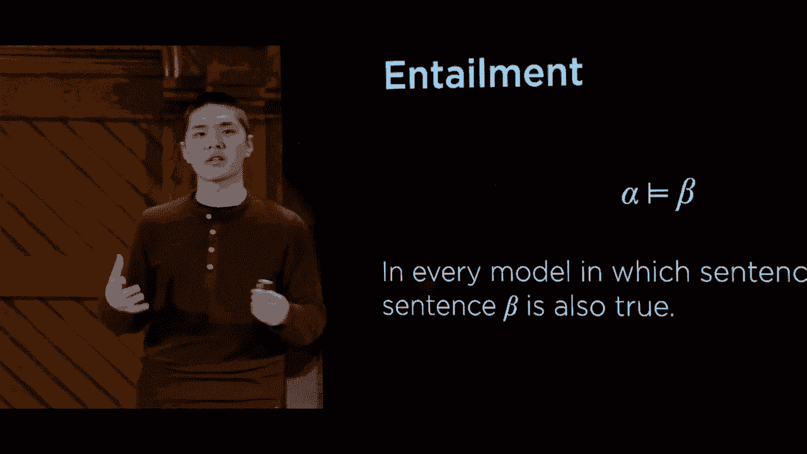

蕴涵，第二个陈述，我们可以合理地使用推理。基于第一个句子来推导出第二个句子。最终，这是蕴涵的概念，我们将尝试为计算机编码，我们希望Rai代理能够弄清楚可能的蕴涵是什么。

蒙特雷的眼睛能够处理这三句话。哈利没有去找海格，哈利去找了海格或邓布利多，但不能同时去。而哈利去找了邓布利多，仅凭这些信息，像Rai一样进行推理。或者通过使用这些三句话在知识库中得出结论。

我们可以在这里得出结论，1，哈利今天没有去阿格拉。我们可以推导出，今天是否下雨，这个过程称为推理。今天我们将专注于这个过程，推导新的句子。我给你这三句话，你将它们放入IIA的知识库中。

任何人工智能都能够使用某种推理算法来理解这两句句子。这就是我们定义的方式，让我们来看一下推理的例子，看看我们实际上是如何推理的。人类的理解，在我们采取更算法化的方法之前是相似的。我们将看到，有许多方法可以在人工智能中编码推理的概念。

我们实际上可以实现，所以将再次处理几个命题符号。

我将处理p、q和r，他是星期二，Kiwis是下雨。我们的陈述是哈利会去跑步，命题sandbothe，我们只是定义。还没有说明它们是否为真或假，只是在定义。现在我们将为自己或人工智能提供知识库，缩写为KB。

我们对世界的知识，陈述。在这里的括号只是用来表示前提，所以我们可以看到什么与什么关联。但你会这样读，和，不是，意味着把b逐步放入。这里是它是星期二，Q是下雨，不是它是不下雨。

这意味着哈利会去跑步，阅读这整个句子的自然语言释义。如果今天是星期二，并且没有下雨，那么哈利将去跑步。所以如果今天是星期二且没有下雨，那么哈利将去跑步。这些现在都在我们的知识库中，接下来想象我们的知识库还有其他两个信息。

p为真，今天是星期二，并且我们还有信息，非q。它不下雨，这个句子Q“下雨”恰好是假的。我们拥有的三句话中，没有关于p和非q蕴涵r的信息。利用这些信息，我们应该能够推导出一些推论，关键是非q。

仅在p和非q都为真时，整个表达式才为真。我们知道p为真，且我们知道非q为真，因此我们知道整个表达式为真。蕴涵的定义是，如果左侧的整个内容为真，那么右侧的内容也必须为真。

由此推导出的推理也必须是真的，哈利去跑步。我们知道这一点，利用我们知识库中的知识进行推理。
