# 哈佛CS50-AI ｜ Python人工智能入门(2020·完整版) - P6：L1- 知识系统知识 2 (推断，知识工程) - ShowMeAI - BV1AQ4y1y7wy

基于这个想法推理，因此这最终是我们可能认为某种推理算法的开始，这是一种我们可以用来试图判断是否能够得出某种结论的过程。而这些推理算法最终要回答的是。

关于蕴含的核心问题，给定对世界的一些查询，我们想了解世界的某些事情，我们将把这个查询称为 alpha。我们想问的使用这些推理算法的问题是，知识库 K 是否蕴含 alpha，换句话说，使用我们所知道的信息。

在我们的知识库中，我们可以得出结论，这个句子 alpha 是真的，这最终是我们希望做的。那么我们该如何做到这一点？我们该如何写一个算法，能够查看这个知识库并确定这个查询是否为真？

alpha 实际上为真，结果证明有几种不同的算法可以做到这一点，其中一种最简单的算法被称为模型检查。现在请记住，模型只是将我们语言中所有命题符号分配给真值真或假的某种赋值。

你可以将模型视为一个可能的世界，那里有许多可能的世界，其中不同的事情可能为真或假，我们可以枚举所有这些，而模型检查算法正是如此。那么我们的模型检查算法是如何工作的呢？如果我们想确定我们的。

知识库包含一些查询 alpha，那么我们将枚举所有。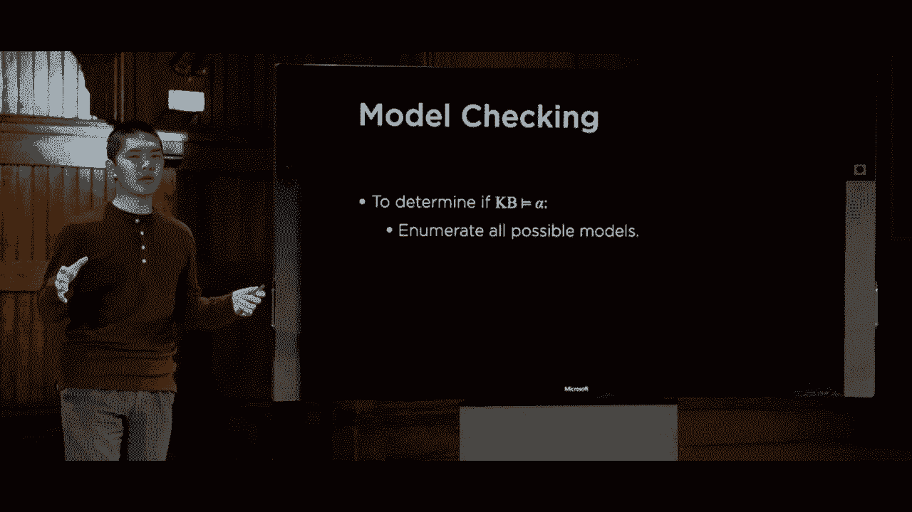

考虑所有可能的模型，换句话说，考虑我们变量的所有真和假的可能值，所有我们世界可能存在的状态。如果在每个模型中，知识库为真，alpha 也为真，那么我们知道知识库蕴含 alpha，所以，让我们仔细看看。

尝试理解这句话的实际含义，如果我们知道在每个模型中，换句话说，在每个可能的世界中，不管你给定的变量真值是什么，如果我们知道每当我们的知识为真时，所知的真实情况也是正确的，那么这个查询 alpha 也是真，那么。

理所当然，只要我们的知识库是真实的，那么 alpha 也必须为真，这将构成我们的模型的基础。我们将枚举所有可能的世界，问自己在知识库为真时 alpha 是否为真。

如果是这样，那么我们知道 alpha 为真，否则知识库并不蕴含 alpha。好的，这有点抽象，但让我们看看一个例子，试着将实际的命题符号应用到这个想法上，再次我们将使用相同的例子 P。

假设是星期二，Q 是下雨，R 是哈利将去跑步。我们的知识库包含这些信息，P 和非 Q 推导出 R。我们也知道 P 是星期二，且非 Q 不是下雨，我们的查询即我们想问的事情是，是否保证为真。

哈利将去跑步，因此第一步是列举所有可能的模型，我们有三个命题符号 P、Q 和 R。这意味着我们有二的三次方，即八个可能的模型，都是假。

可以为所有这些模型分配真和假，我们可能会询问在每一个模型中，知识库在这里是否为真，我们所知道的事情在哪些世界中，这个知识库可能适用。在哪个世界这个知识库为真。

我们知道 P，像我们知道今天是星期二，这意味着我们知道前四行中 P 为假，因此没有一个将为真或适用于这个特定知识库，在那些世界中我们的知识库不为真。同样，我们也知道非 Q，即我们知道它不。

比如在知识库中是下雨，所以在 Q 为真的任何这些模型中（例如这两个和这两个）都不会有效，因为我们知道 Q 为假。最后我们也知道 P 和非 Q 推导出 R，这意味着当 P 为真或这里的 P 为真，且 Q 为假，Q 为假时，这两个则 R 必须为真。

如果 P 为真，Q 为假，但 R 也是假，这并不满足这个推导。在这种情况下，推导并不成立。因此，我们可以说，对于我们的知识库，我们可以得出结论，在哪些可能的世界中我们的知识库为真，以及在那些可能的世界中。

我们的知识库是假的，结果发现只有一个可能的世界使我们的知识库实际上为真。在某些情况下，可能会有多个可能的世界使知识库为真，但在这种情况下，恰好只有一个可能的世界。

假 假 真 假 真 假 假 真 真等，总共有八种可能的方式可以明确说出我们的知识库情况，在这种情况下我们会查看查询，R 为真，作为结果我们可以得出结论。这就是模型检查的思想，列举所有可能的模型，并在这些模型中查看。

我们的知识库为真的查询是否也为真。现在我们来看看如何在编程语言（如 Python）中实现这一点，查看一些实际代码，以编码这个命题符号和逻辑及这些联接词，比如与和。

或者和不是一个蕴含，等等，看看这段代码实际可能是什么样子。所以我提前写了一个逻辑库，比我们今天需要担心的要详细得多，但重要的是我们有一个类来表示我们可能拥有的每种类型的逻辑符号或连接词。

所以我们只有一个逻辑符号的类，每个符号都将表示并存储该特定符号的某个名称。我们还有一个取反的类，它接受一个操作数，所以我们可能会说某个符号不是对的，或者某个其他句子不是真的，我们有。

1/4和1/4，等等，我将演示一下这是如何工作的。你可以稍后查看实际的逻辑图，但我会先调用这个文件 hairy pie，我们将存储有关这个哈利·波特世界的信息，例如，所以我将从我的逻辑模块中导入。

在这个库中，一切都是有序的，创建一个符号时，你使用大写字母 S。符号，我将创建一个表示下雨的符号，意味着正在下雨，例如。然后我会创建一个表示海格的符号，意味着哈利拜访了海格，这个符号的意义就是这样。这个符号意味着正在下雨，这个符号意味着哈利。

拜访海格，我将添加另一个符号，叫做邓布利多，表示哈利拜访了邓布利多。现在我想保存这些符号，以便稍后在进行逻辑分析时使用，所以我会将它们每一个保存到一个变量中，例如下雨、海格和邓布利多。

变量都在这里，现在我有了这些逻辑符号，我可以使用逻辑连接词将它们组合在一起。例如，如果我有一个句子像。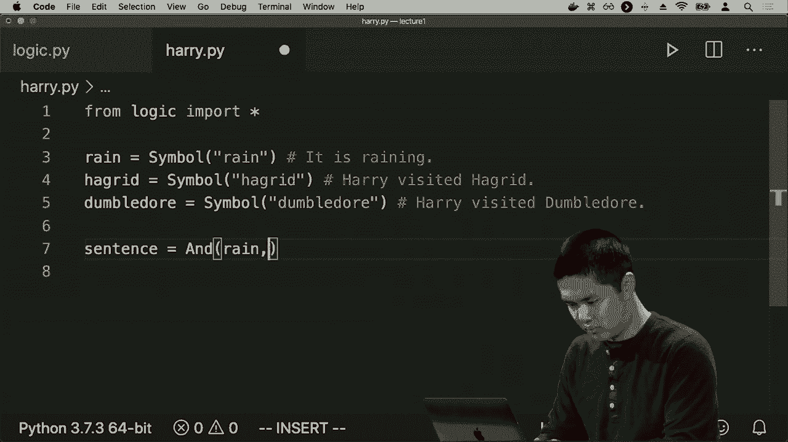

和下雨和海格，例如，这不一定是真实的，只是为了演示。我现在可以尝试打印出句子公式，这是一种函数，我写的这个函数接受一个句子，使用命题逻辑并简单地将其打印出来，这样我们程序员就可以现在看到它。

理解它实际上是如何工作的，所以如果我运行 Python Harry PI，我们将会。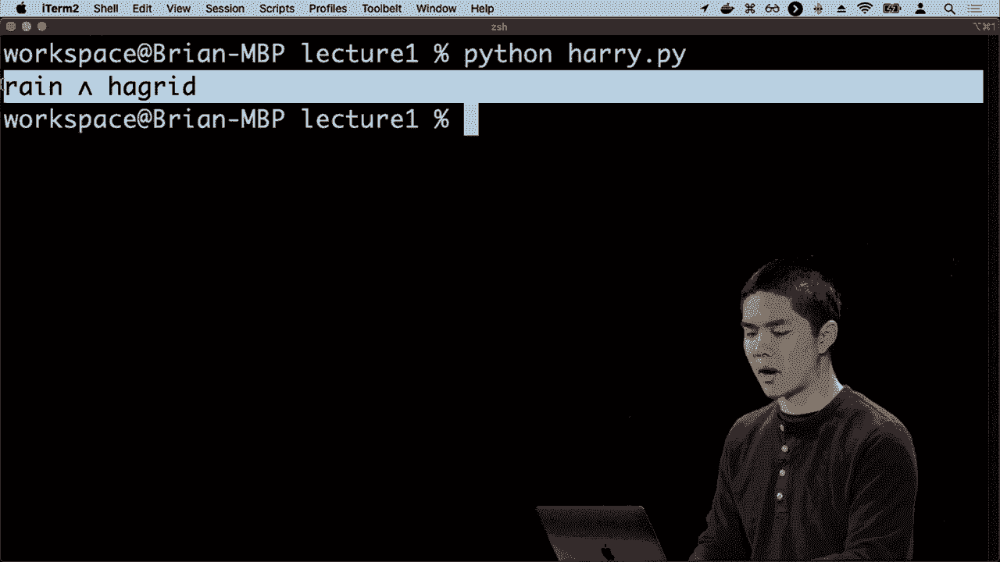

看到的是这个句子和命题逻辑下雨和海格，这是我们在 Python 程序中表示“和”的逻辑表示，其参数是下雨和海格，所以我们通过编码这个想法来表示下雨和海格，这在 Python 面向对象编程中是相当常见的。

你有许多不同的类，你传递参数给它们，以创建一个新的对象，例如，以表示这个想法。但现在我想做的是以某种方式编码我对这个世界的知识，以便从类的开始解决这个问题。

谈到试图弄清楚哈利拜访了谁，以及试图弄清楚。是否在下雨，或者没有下雨，那么我有什么知识我将。继续创建一个新的变量，叫做知识，我知道的是什么。我知道的第一句话是我们谈论的想法，如果它不是。

下雨那么哈利将拜访海格。那么，我如何编码它？我可以使用否定，然后是雨的符号。这里是我在说的。它没有下雨，现在，含义是，如果没有下雨。然后哈利拜访了海格，所以我将把它包裹在一个含义内，表示如果。

如果没有下雨，这个前提对于，含义，那么哈利拜访了海格。所以我在说，含义的前提是，天气没有下雨，如果没有。下雨，那么哈利拜访了海格，我可以打印出知识公式。看看那个想法的逻辑公式等价，所以我运行Python，哈利。

PI，这是我们看到的逻辑公式，结果是文本版本。我们之前查看的内容，如果没有下雨，那么。那意味着哈利拜访了海格，但我们还有额外的。信息可以获取，在这种情况下，我们还知道。

哈利要么拜访海格，要么邓布利多，那么我该怎么编码呢？这意味着在我的知识中，我真的有多个知识。信息在进行，我知道一件事和另一件事以及另一件事，所以我将继续。把我的所有知识用一个“与”包裹起来，并将事情转移到一个新的。

只是多做一点确认，但我知道，多个事情，所以我说知识。是多个不同句子的和。我知道多个不同的句子是真的。有一句我知道是真的。是这个含义，如果没有。下雨那么哈利拜访了海格，另一个我知道的。

真实的是，哈格里德或邓布利多，换句话说，或者，所以海格或邓布利多是真的，因为。 我知道哈利拜访了海格或，邓布利多，但我知道的不止这些。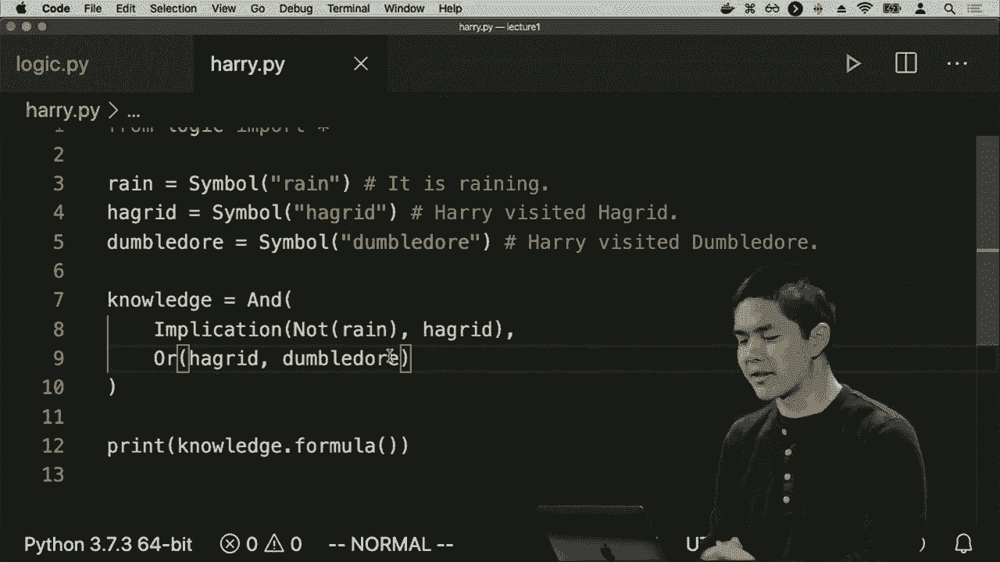

事实上，之前那个初始句子说哈利拜访了海格或。邓布利多，但不是两者，所以现在我想要一个。句子来编码的想法是哈利没有同时拜访海格和。邓布利多，哈利拜访海格和邓布利多的概念会这样表示，并且是海格和。

邓布利多，如果这不是真的，如果我，想说不是，那么我只需将。整个内容放在一个节点内，所以现在，这三行第八行表示，如果没有下雨，那么哈利拜访了，海格，第九行表示哈利拜访了。海格或邓布利多，第十行表示，海格没有或哈利没有拜访两者。

海格和邓布利多都不是，真的是这样，海格符号和邓布利多符号中只有一个可以是真的，最后我知道的最后一条信息是，哈利拜访了邓布利多，所以现在这些就是我所知道的知识点，一句和恩洛的。

句子还有另一个还有另一个，还有我。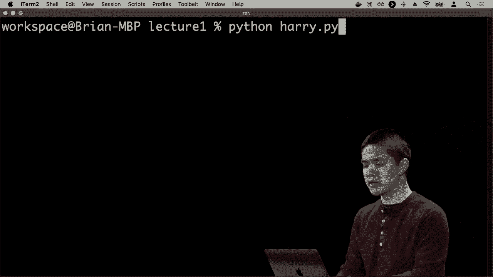

可以打印出我所知道的，只是为了更直观地看到，现在是我计算机内部正在使用这些不同的Python对象表示的信息的逻辑表示。再次查看逻辑π，如果你想了解它到底是如何工作的。

实现这一点，但不必太担心所有的细节，我们在这里说，如果没有下雨，那么哈利拜访了海格，我们说海格或邓布利多是真的，我们说海格和邓布利多不同时为真，也就是说它们不能都是真的。

是真的，我们也知道邓布利多是真的，所以这个长的逻辑句子代表我们的知识库，这是我们知道的事情，现在我们希望做的是使用模型检查来提出查询，问一个问题，比如基于这些信息，我知道现在是否在下雨吗。

我们作为人类能够通过逻辑推理，搞清楚基于这些句子，我们可以得出这个结论，也就是要弄清楚，是的，外面一定在下雨，但现在我们希望计算机也能做到这一点，所以让我们看看正在进行的模型检查算法。

按照我们刚刚在伪代码中绘制的相同模式来进行，因此我在逻辑π中定义了一个函数，你可以看看，叫做模型检查。模型检查需要两个参数，即我已经知道的知识和查询，目的是为了进行模型检查，我需要枚举所有。

对于所有可能的模型，我需要问自己，知识库是否为真，查询是否为真。所以我需要做的第一件事是以某种方式枚举所有可能的模型，这意味着对于所有存在的可能符号，我需要为它们赋予真和假，并查看。

不论它是否仍然成立，因此这是我们将要做到的方式。我们将开始，所以我在内部定义了另一个助手函数，稍后我们会讲到，但这个函数首先通过确定我处理的符号，获取知识和查询中的所有符号。

在这种情况下，我处理的符号是雨、海格和邓布利多，但根据问题的不同，可能还有其他符号。我们很快将看看一些示例，最终我们将需要一些额外的符号来表示问题，然后。

我们将运行这个检查所有功能，它是一个辅助功能，基本上会递归地调用自己，检查每种可能的命题符号配置。因此，我们从查看这个检查所有功能开始，我们该怎么做呢？如果没有符号，意味着如果我们已经完成了。

这是分配我们已经分配的所有符号，每个符号的值到目前为止我们还没有做到，但如果我们将来做到这一点，那么我们会检查在这个模型中知识是否为真。这一行的意思就是，如果我们使用模型的真值分配来评估知识的命题逻辑公式。

知识为真，如果知识为真，那么只有在查询为真的情况下我们才应该返回真，因为如果知识为真，我们希望查询也为真，以便存在蕴含关系。否则我们无法确定，否则不会有一个INT元素，如果有一种情况是。

我们知道我们的知识是真实的，但查询的内容恰好是错误的。因此这里这一行正在检查，在所有知识为真的世界中，查询也必须为真，否则我们可以直接返回真，因为如果知识不真实，那么我们就不在乎。

这与我们之前列举的表格是等价的，在所有知识库不真实的情况下，这七行中，我们并不关心我们的查询是否真实。我们只关心在知识库实际上真实时，查询是否为真。

正是这个绿色高亮的行，因此这个逻辑是通过那个语句编码的，此外，如果我们还没有分配符号，我们还没有看到任何东西，那么我们要做的第一件事就是弹出一个符号，我先复制符号，只是为了保存一个现有的副本。

我从剩余的符号中弹出一个符号，以便随机选择一个符号，并创建一个该符号为真的模型副本，再创建一个该符号为假的模型副本。因此，我现在有两个模型副本，一个符号为真，一个符号为假。

符号为假，我需要确保这个蕴含在这两个模型中都成立，因此我递归地在语句为真的模型上检查所有内容，并在语句为假的模型上检查所有内容。因此，你可以再次查看这个功能，试图了解这个逻辑究竟是如何工作的。

这是在工作，但实际上它正在递归调用这个检查所有的功能。并且在递归的每一层中，我们都在说让我们选择一个我们尚未分配的新符号，将其分配为真并将其分配为假，然后检查确保在两种情况下蕴含关系都成立。

因为最终我需要检查每一个可能的世界，我需要考虑每一种符号组合，并尝试每种真假组合，以便确定蕴含关系是否成立，这个函数是我们为你写的，但为了在复杂的代码中使用该函数。

我将写的是这样的，我想基于知识进行模型检查，然后提供第二个参数，查询是什么，我想问的事情是，在这种情况下我想问的是：外面下雨吗？模型检查同样需要两个参数，第一个参数是。

我知道的这一信息是这条知识，即一开始给我的这条信息，而第二个参数“下雨”则编码了查询的想法，我想问的是基于这个知识，我是否可以确定外面在下雨。

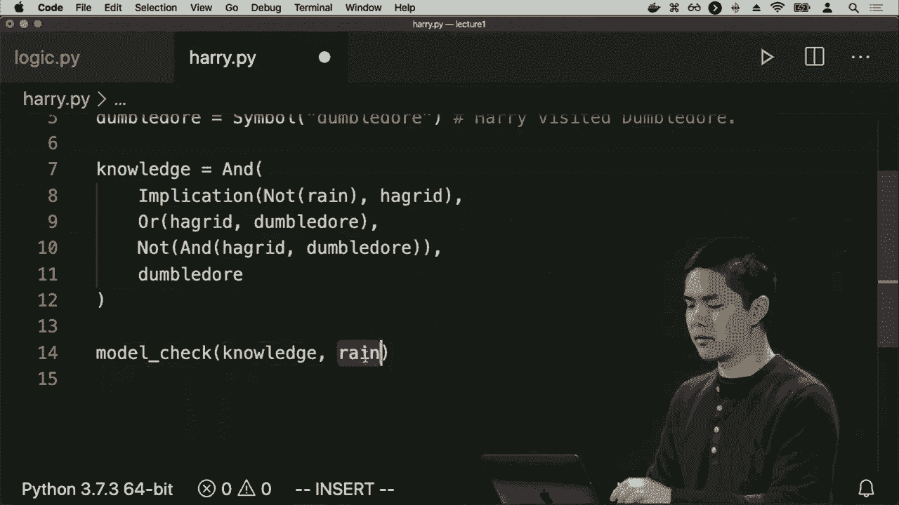

我可以尝试打印出结果，当我运行这个程序时，我看到答案是正确的，基于这些信息我可以。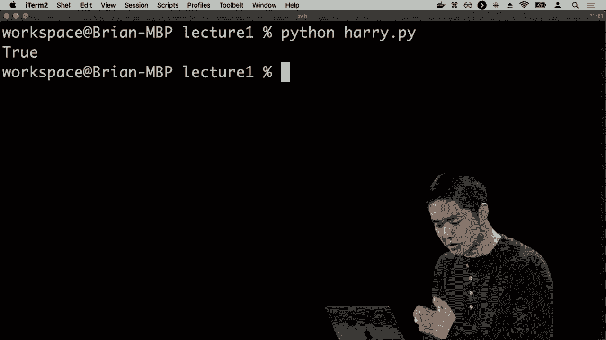

可以确凿地说外面在下雨，因为使用这个模型检查算法，我们能够检查在每一个知识为真的世界里，都是在下雨。换句话说，没有一个世界是这个知识为真而不下雨的，因此可以得出结论。

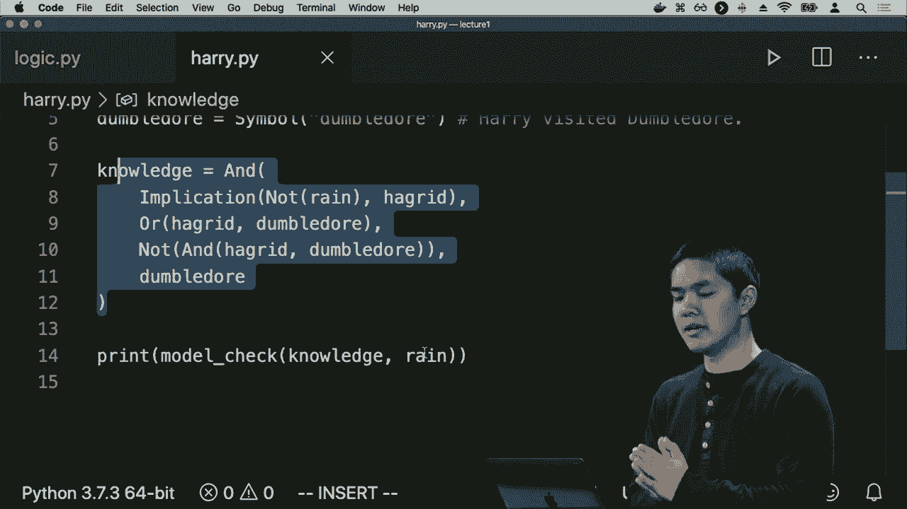

这实际上是在下雨，这种逻辑可以应用于许多不同类型的问题，如果面对一个可以使用某种逻辑推理来尝试解决的问题，你可能会考虑需要哪些命题符号来表示这些信息。

在命题逻辑中你可能会使用哪些语句来编码你所知道的信息，这个过程试图将一个问题转化为确定使用哪些命题符号来编码这个想法或如何逻辑地表示它，被称为知识工程。

工程师和人工智能工程师会把一个问题提炼成计算机能够理解的知识，如果我们能将任何一般性的问题，尤其是人类世界中的问题，转化为计算机能够解决的问题，使用任何数量的。

如果有不同的变量，那么我们可以利用能够执行模型检查或其他推理算法的计算机，实际解决这个问题。现在我们将来看两个或三个知识工程的实例，实践如何解决某个问题。

我们需要弄清楚如何应用逻辑符号，并使用逻辑公式来编码这个想法，我们将以在美国和英国非常流行的棋盘游戏**Clue**开始。在**Clue**游戏中，有许多不同的因素在发挥作用，但游戏的基本前提是，如果你从未玩过。

在这个游戏中，有许多不同的人，现在我们只用**穆斯塔德上校**、**普拉姆教授**和**斯卡雷特小姐**。游戏中有几个不同的房间，比如一个舞厅、一个厨房和一个图书馆，还有多种不同的武器：一把刀、一把左轮手枪和一个扳手，以及其中的三样，一人、一房间。

一种武器是解决谜题的关键，即凶手和他们所在的房间以及他们使用的武器。游戏开始时，所有这些卡片被随机洗牌，然后将三张卡片（一个人、一个房间和一种武器）放入一个密封的信封中。

我们不知道，并希望通过某种逻辑过程来弄清楚信封里是什么，哪一个人、哪个房间和哪种武器。我们通过查看这些卡片中的一些（而不是全部）来尝试弄清楚正在发生什么，因此这是一个非常。

这是一个流行的游戏，但现在我们尝试将其形式化，看看是否可以训练计算机通过逻辑推理来玩这个游戏。因此，我们将从思考最终需要的命题符号开始，再次记住，命题符号只是一些。

这个变量可以在世界中为真或为假，因此在这种情况下，命题符号实际上只是对应于信封里可能的每个东西。**穆斯塔德**的符号在这种情况下，如果**穆斯塔德上校**在信封里，则为真。

如果他是凶手，则信封里的符号为真，否则为假，**普拉姆教授**和**斯卡雷特小姐**也是如此，对于每个房间和每种武器，我们都有一个命题符号来表示这些想法。然后，使用这些命题符号，我们可以开始。

创建逻辑句子。创建。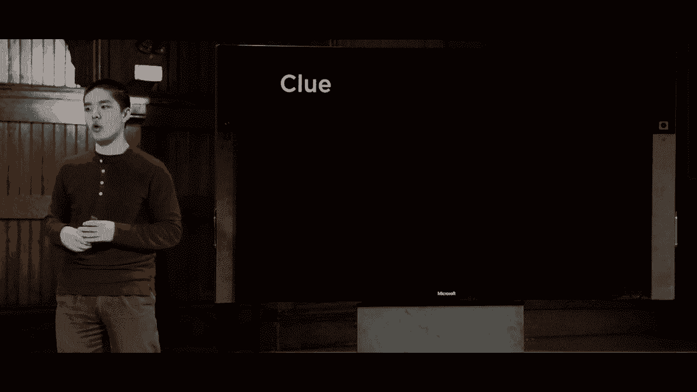

我们对世界的知识，比如我们知道某人是。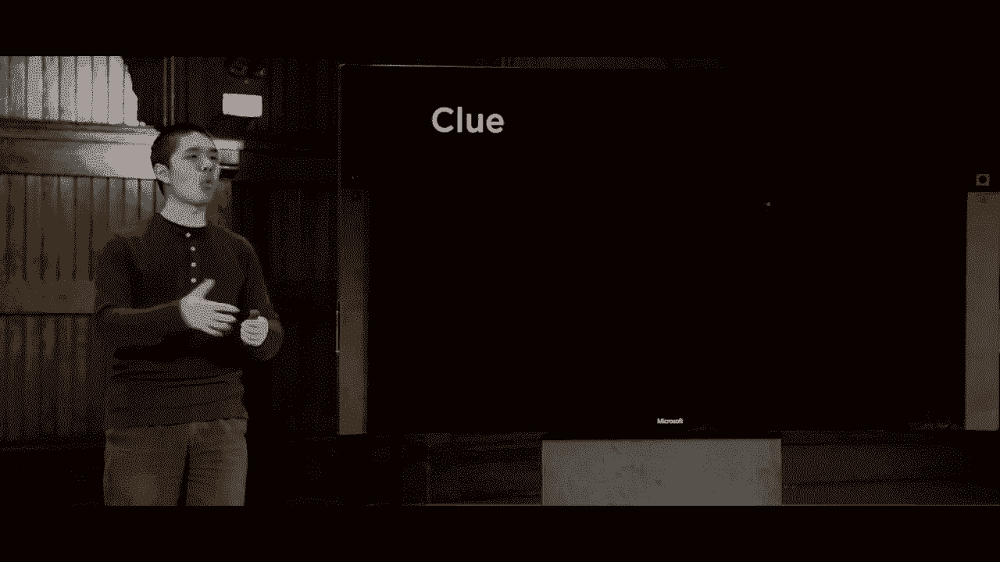

凶手是这三个人之一，实际上是凶手，我们该如何编码呢？我们不确定凶手是谁，但我们知道是第一个人、第二个人或第三个人，因此我可以说。像是**穆斯塔德**或**普拉姆**或**斯卡雷特**，这个知识。

编码这三个人之一。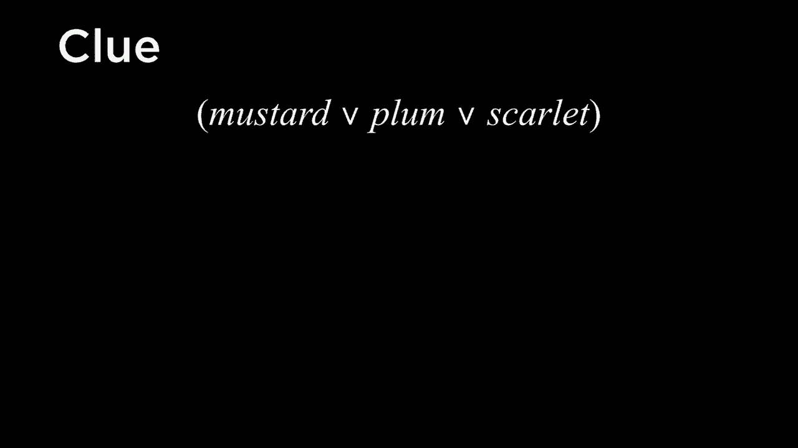

杀人案件，我们不知道是哪一件，但这三件事情中必须有一个是真的。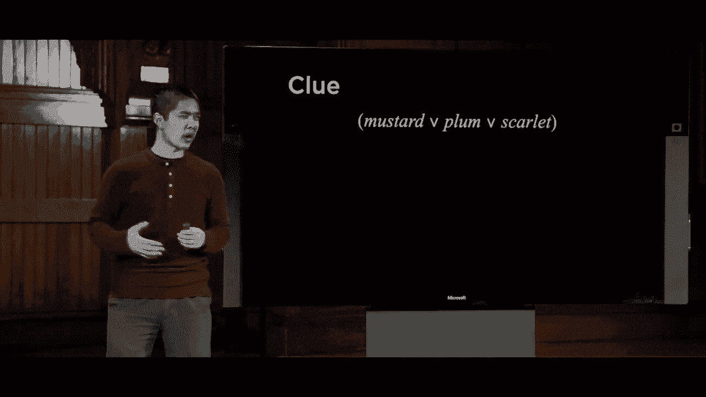

我们还知道其他什么信息呢？我们知道，比如说其中一个房间一定是罪行发生的信封里的房间，可能是在舞厅、厨房或图书馆。现在我们不知道是哪一个，但这是我们一开始就知道的知识，即其中一个。

这三种必须在信封里，同样我们可以对武器说同样的事情，武器可能是刀、手枪或扳手，其中一种武器一定是选择的武器，因此是信封中的武器。随着游戏的进行，游戏玩法通过。

人们会获得各种不同的卡片，利用这些卡片可以推导出信息。如果有人给你一张卡片，比如我手里有教授普朗姆的卡片，那么我知道教授普朗姆的卡片不能在信封里。我知道教授普朗姆不是罪犯，所以我知道一部分。

比如信息像不是普朗姆，我知道教授普朗姆一定是假的。这个命题符号不是真的，有时候我可能不确定某张特定的卡片是否在中间，但有时某人会做出猜测，我会知道三种可能性中至少有一种不是真的，比如有人。

我会猜测穆斯塔德上校在图书馆里，拿着手枪或类似的东西。如果是那样，可能会揭示出一张我看不到的卡片。但如果这是一张卡片，且它是穆斯塔德上校、手枪或图书馆之一，那么我知道至少有一个不能在中间，所以我知道。

这就像是说它不是穆斯塔德，或者它不是图书馆，或者它不是手枪。现在也许这些不全都是真，但我知道至少有一个穆斯塔德、图书馆和手枪必须是假的。所以这就是对《线索》游戏的命题逻辑表示，一种编码知识的方式。

我们知道，在这个游戏中，使用命题逻辑，计算机算法像是模型检查，我们刚才看到的实际上可以查看和理解。那么现在让我们来看一些代码，看看这个算法在实践中是如何工作的。好的，我将打开。

打开一个叫做 clue.dot.pi 的文件，我已经开始了。在这里，我定义了一些东西，我必须找到一些符号。注意，我有一个穆斯塔德上校的符号，一个教授普朗姆的符号，一个红衣小姐的符号，这些都放在这个列表中。

我有一个舞厅、厨房和图书馆的符号，放在房间列表中，然后我还有刀、手枪和扳手的符号，这些是我的武器。所以所有这些角色、房间和武器加在一起，这就是我的符号。现在我还有这个捷克知识函数。

而捷克知识函数的作用是它获取我的知识，并试图对我知道的事情得出结论，因此例如我们将遍历所有可能的符号，我们将检查我是否知道那个符号是真的，而一个符号可能是像**普拉姆教授**或者。

如果我知道在图书馆的那张卡片是真的，换句话说，我知道这张卡片必须在信封里，那么我将使用一个名为`C print`的函数打印出来，它可以用颜色打印东西，我将打印出“是”，并用绿色打印，以便我们清楚。

如果我们不确定这个符号是真的，也许我可以检查一下我是否确定这个符号不是真的，比如我知道它肯定不是**普拉姆教授**，我可以通过再次运行模型检查来做到这一点，这次检查我是否知道这个符号不是真的，如果我确定。

如果符号不是真的，而我不确定这个符号不是真的，因为我说“L如果不是模型检查”，这意味着我不确定这个符号是否是假的。那么我会继续在符号旁边打印出来，因为这个符号可能是真的，也可能不是真的，我其实并不知道，所以我的知识是什么。

实际上你有，好吧，让我们尝试现在来表示我的知识。我知道一些事情，所以我把它们放在N里，我知道三个人中必定有一个是罪犯，所以我知道或者是**芥末上校**、**普拉姆**、**猩红小姐**，这就是我编码的方式，表明它要么是**芥末上校**，要么是。

**普拉姆教授**或**猩红小姐**，我知道事情一定发生在一个房间里，所以我知道，或者是舞厅、厨房、图书馆，例如，我知道必定使用过其中一种武器，所以我知道，或者是刀、左轮枪、扳手。这可能是我最初的知识，我知道一定是一个。

我所知道的人一定是。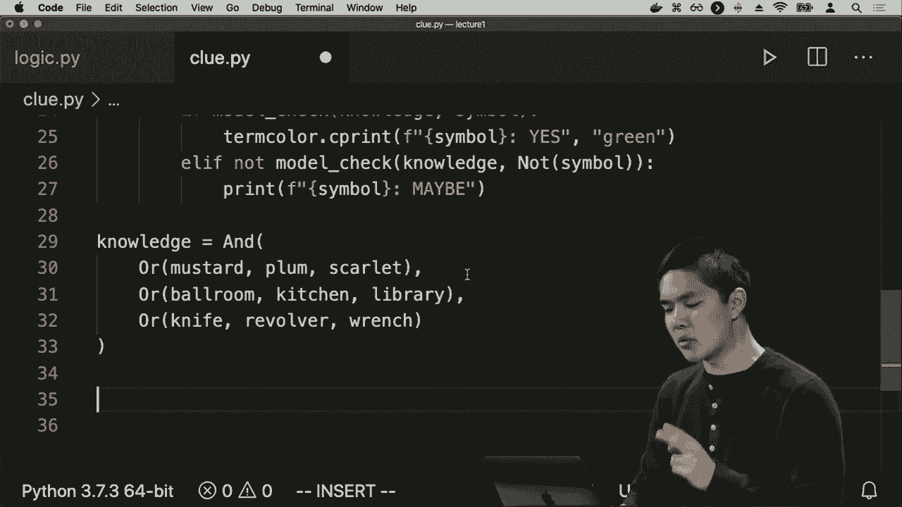

在其中一个房间里，我知道必定有一种武器，我可以通过打印出知识来看到这项知识的公式。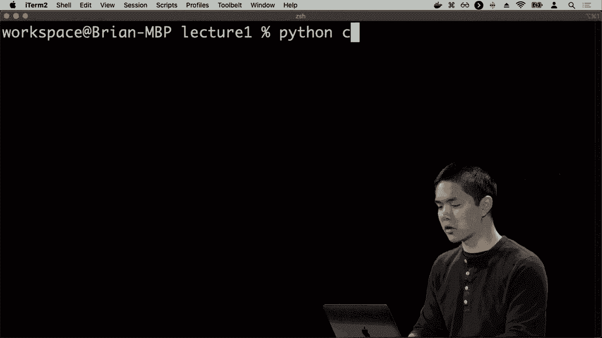

点公式，所以我将运行Python中的`clue.py`，现在这是我以逻辑格式知道的信息，我知道是**芥末上校**或**普拉姆教授**或**猩红小姐**，我知道是在舞厅、厨房或图书馆，并且我知道是刀、左轮枪或扳手，但我不知道更多。

除此之外，我不能真的得出任何明确的结论，实际上我们可以看到，如果我尝试并让我继续运行我现在的知识检查函数，让我们检查这个函数，我检查知识，或者说我刚刚写的这个函数，它会检查所有符号并尝试。

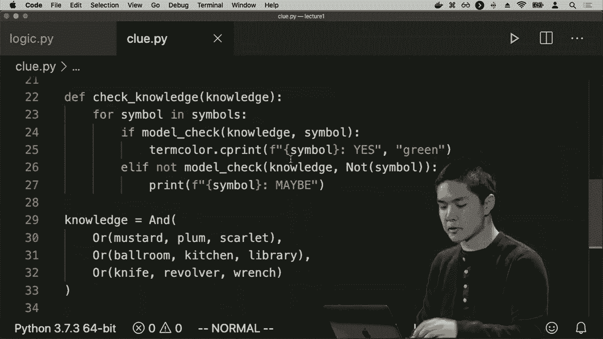

看看我能从任何符号中得出什么结论，所以我将去。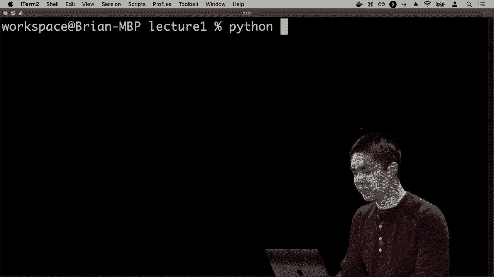

继续运行线索Pi，看看我知道的是什么，似乎我没有确切知道任何东西，我有所有三个人，或者可能是所有三个房间，或者可能是所有三种武器，或者我现在还不确切知道任何东西，但现在让我尝试添加一些额外的信息，看看。

额外的信息，额外的知识能否帮助我们在这个过程中逻辑推理。我们将提供信息，Rai将负责推理并找出能够得出什么结论，所以我从一些卡片开始，这些卡片，科伦。

例如，我知道芥末的卡片，芥末符号必须是错误的。换句话说，芥末不是那个，信封里不是罪犯，所以我可以说知识支持某种东西，叫做每一个，而在这个库中支持点ad，这是一种添加知识或额外信息的方式。

将逻辑句子与结束条款连接，所以我可以说知识添加不是芥末红。我恰好知道因为我有芥末卡，科伦·芥末不是嫌疑人，可能还有其他几张卡，也许我还有厨房的卡，所以我知道不是厨房，也许我还有另一张卡。

这表示它不是左轮手枪，所以我有三张卡，科伦·芥末、厨房和左轮手枪，我以这种方式将其编码到我的AI中，说它不是科伦·芥末，不是厨房。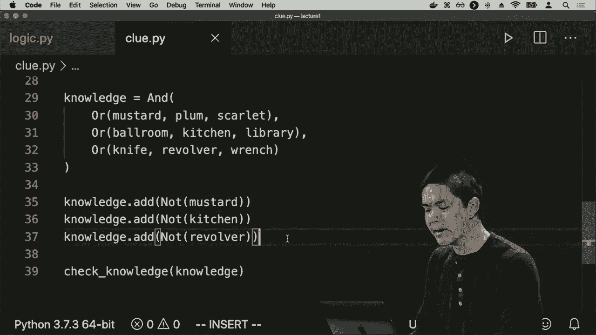

而且这不是左轮手枪，我知道这些是真的，所以现在当我重新运行线索时，我会看到我能够排除一些可能性。之前我不确定是刀还是左轮手枪还是扳手，刀可能是，左轮手枪可能是，扳手也可能是，现在我只剩下刀和。

在这两者之间我不知道是哪一个，它们都是可能的，但我已经能够排除左轮手枪，因为我知道那是错误的，因为我有左轮手枪卡，所以！

在这场游戏中可能会获取额外的信息，我们会通过向我们的知识集合或我们一直在构建的知识库中添加知识来表示这一点，所以如果我们额外得到了信息，某人做了一个猜测，比如密斯·斯卡雷特。

在图书馆里，有扳手，我们知道有一张卡片被揭示，这意味着那三张卡片中的一张，或者是密斯·斯卡雷特，或者是图书馆，或者是扳手，这三者中至少有一张不在信封里，所以我可以添加一些知识，可以说知识添加，我打算添加一个或的条款，因为我不。

我不确定究竟不是哪一个，但我知道其中一个不在信封里。所以，它不是**猩红**，也不是图书馆，并且可以支持多个论点，说明它也可能不是，至少其中一个需要是假的，但我不知道是哪个，也许有多个。

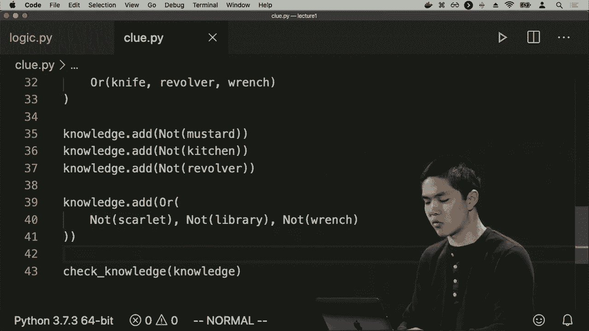

这只是一个假设，但至少我知道有一个需要成立，所以现在如果我重新运行推理，我实际上没有任何额外信息，暂时还没有什么可以确凿地说。我仍然知道也许是**普拉姆教授**，也许是**猩红小姐**。我还没有排除任何选项，但让我们设想一下我能得到更多的信息。

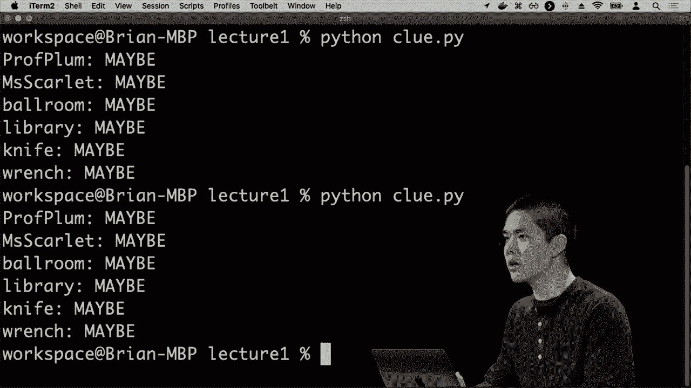

信息是，有人给我展示了**普拉姆教授**的卡片，例如，我说。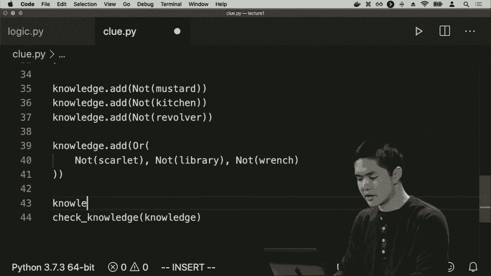

好吧，让我们回过头来，知识点排除**普拉姆**，所以我知道**普拉姆教授**的卡片不在中间，我重新运行推理，好的，现在我能得出一些结论。我已经能够排除**普拉姆教授**，唯一剩下的可能是**猩红小姐**。

**猩红小姐**，我知道，变量必须为真，我已经能够推断出这一点，基于我已有的信息。在舞厅、图书馆、刀和扳手之间，对于这两样，我仍然不确定。那么，让我们再添加一条信息，假设我知道这不是舞厅。

有人给我展示了舞厅的卡片，所以我知道这不是舞厅，这意味着在这个时候我应该能够。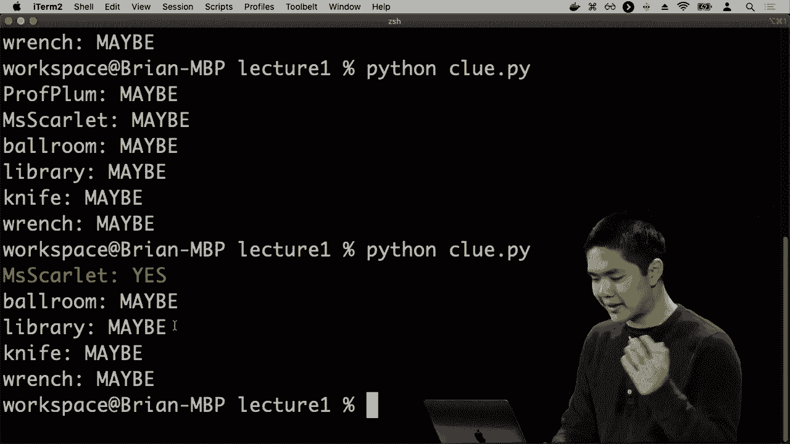

我们得出结论，它是图书馆，来看看。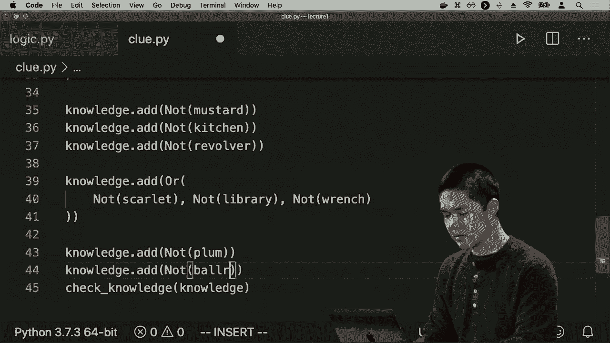

我会说知识点，排除舞厅，我们将继续运行。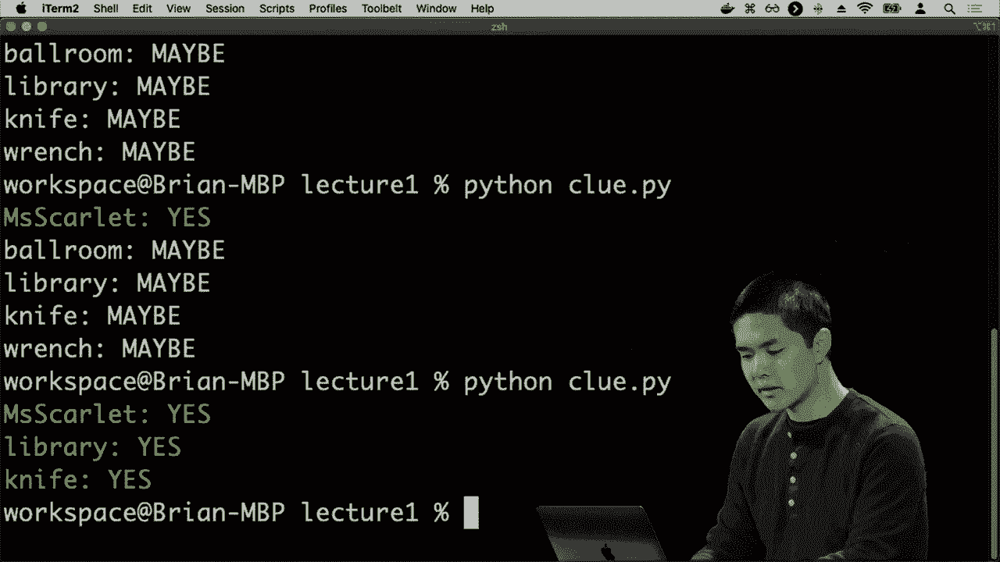

结果是，经过这一切，我不仅能得出结论，知道这是图书馆，我还知道武器是刀，这可能是一个推断，稍微复杂一点，我不会立刻意识到，但通过这个模型检查算法，AI能够做到。

得出这样的结论，我们可以确定**猩红小姐**在图书馆里，手里拿着刀，我们是怎么知道的呢？我们从这里的这个条件得知，它不是**猩红**，也不是。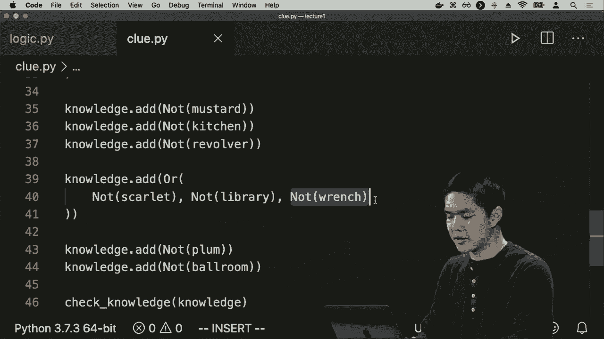

这不是图书馆，也不是扳手，鉴于我们知道是**猩红小姐**，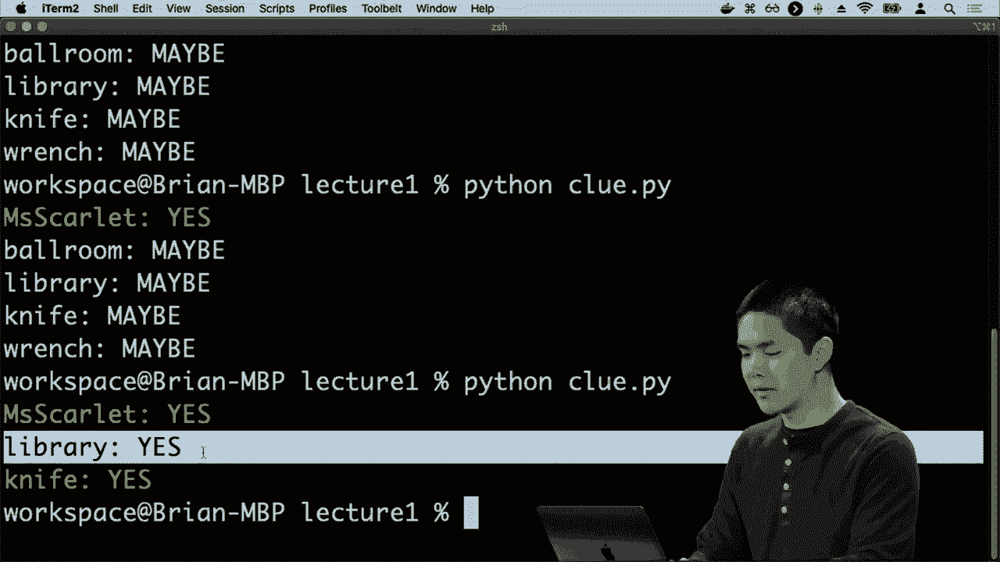

我们知道这是图书馆，那么武器唯一剩下的选项是，这不是扳手，这意味着它必须是刀，所以我们作为人类现在可以回过头来推理，尽管这可能并不。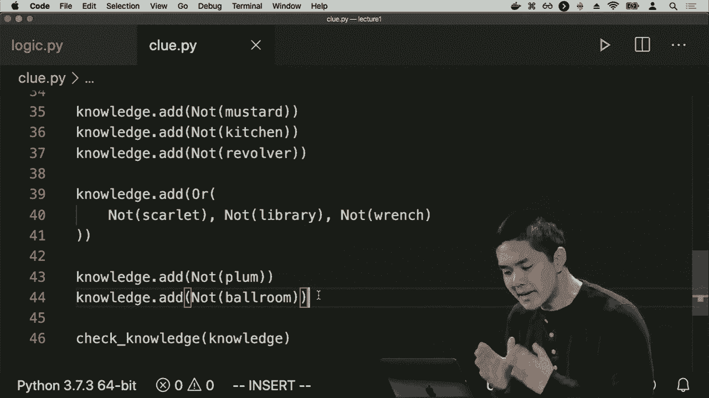

一目了然，这就是使用AI或某种算法来做这件事的优势之一，因为计算机可以穷尽所有可能性，试图弄清楚解决方案到底应该是什么，因此，能够以这种方式表示知识通常是有帮助的。

知识工程的某种情况，我们可以利用计算机来表示知识并根据这些知识得出结论。每当我们可以将某些东西转换为这样的命题逻辑符号时，这种方法可能会很有用，所以你可能对逻辑谜题有所了解。

你必须通过拼图来找出某些事情。这就是经典逻辑谜题的样子，像吉德罗伊、米奈娃、波莫娜和霍拉斯各自属于四个学院中的一个：格兰芬多、赫奇帕奇、拉文克劳和斯莱特林，然后我们有一些。

信息表明，吉德罗伊属于格兰芬多或拉文克劳，波莫娜不属于斯莱特林，而米奈娃属于格兰芬多。我们有一些信息，并且利用这些信息，我们需要能够得出一些关于每个人应该被分配到哪个学院的结论。

我们可以用完全相同的思路来尝试实现这个概念，因此我们需要一些命题符号，在这种情况下，命题符号会变得更加复杂，尽管我们稍后会看到一些让它变得更清晰的方法，但我们需要16个命题符号，每个代表一个。

每个命题符号要么为真，要么为假，因此吉德罗伊是否在格兰芬多要么为真，要么为假。他要么在格兰芬多，要么不在，同样吉德罗伊是否在赫奇帕奇也是如此。每个组合都是真或假。

我们为每一个可能的学院和人都能想出某种命题符号，利用这种类型的知识，我们可以开始思考关于这个谜题的逻辑句子。如果我们在考虑信息之前就知道。

考虑到我们可以思考前提。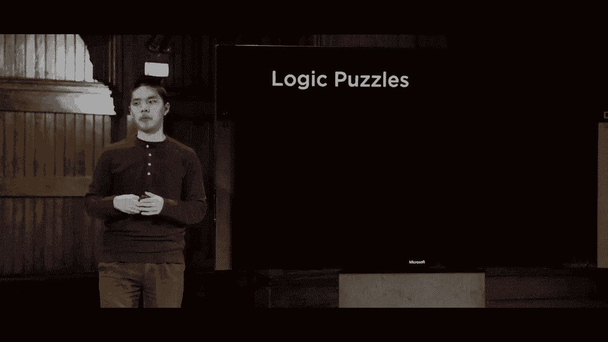

每个人都被分配到不同的学院，这告诉我们什么呢？它告诉我们像这样的句子，它告诉我们波莫娜在斯莱特林意味着波莫娜不在赫奇帕奇，如果波莫娜在斯莱特林，那么我们就知道波莫娜不在赫奇帕奇，我们对所有四个人和所有。

无论你选择哪个人，如果他们在一个学院，那么他们就不在另一个学院，因此我可能会有一整套这样的知识陈述。如果我们知道波莫娜在斯莱特林，那么我们就知道波莫娜不在赫奇帕奇。此外，我们还得到了每个人和学院的信息。

如果某人在不同的学院，那么我还有一些知识，类似于这样：米尔娜在拉文克劳，意味着吉尔德罗在拉文克劳。如果他们都在不同的学院，那么如果米尔娜在拉文克劳，那么我们知道吉尔德罗也不在拉文克劳，我还有很多这样的信息。

有类似的句子在表达其他人和其他学院的想法，除了这种形式的句子外，我还知道一些信息，比如吉尔德罗在格兰芬多或拉文克劳，这可以表示为吉尔德罗。

格兰芬多、联盟或拉文克劳，然后使用这些句子，我可以开始对这个世界进行一些推断。让我们看看这个例子的实现，我会继续实际尝试实施这个逻辑难题，看看我们能否找出答案，我会打开难题 pi。

我已经开始实现这种想法，我定义了一份人员列表和一份学院列表，到目前为止，我为每个人和每个学院创建了一个符号，这就是这个双重循环所做的，遍历所有人员，遍历所有学院，为每个创建一个新符号。

然后我添加了一些我知道的，关于每个人都属于一个学院的信息，所以我为每个人添加了信息，比如格兰芬多、赫奇帕奇、拉文克劳或斯莱特林，这四个选项中必有一个成立，每个人都属于一个学院。还有其他什么信息呢？

我知道每个人只属于一个学院，所以没有人属于多个学院。这是如何工作的呢？好吧，这对所有人都是成立的，所以我会遍历每个人，然后我需要遍历所有不同的学院配对。我的想法是，我想编码这个想法：如果米尔娜。

如果某人在格兰芬多，那么米尔娜就不能在拉文克劳，所以我会遍历所有的学院 h1，再遍历所有的学院 h2，只要它们不同 h1 不等于 h2，那么我就会将这条信息添加到我的知识库中。这就是所蕴含的逻辑，如果某人位于 h1，那么我知道。

他们不在学院 h2，所以这些行在编码这个概念：对于每个人，如果他们属于学院 1，那么他们不在学院 2。我们需要编码的另一个逻辑是，每个学院只能有一个人，换句话说，如果波莫娜在赫奇帕奇，那么其他人就不能在了。

也不允许在赫奇帕奇，逻辑是一样的，只是反向的。我遍历所有的学院，并遍历所有不同的人的配对，所以我会遍历一次人员，再遍历一次人员，只有在人员不同的情况下，p1 不等于 p2，我就会添加这个知识。

如果第一个人属于某个学院，则第二个人不属于同一个学院，因此这里我只是编码了代表问题约束的知识。我知道每个人都在不同的学院，我知道任何人只能属于一个学院，我现在可以。

我的知识，并尝试打印出我所知道的信息。所以我会打印出知识。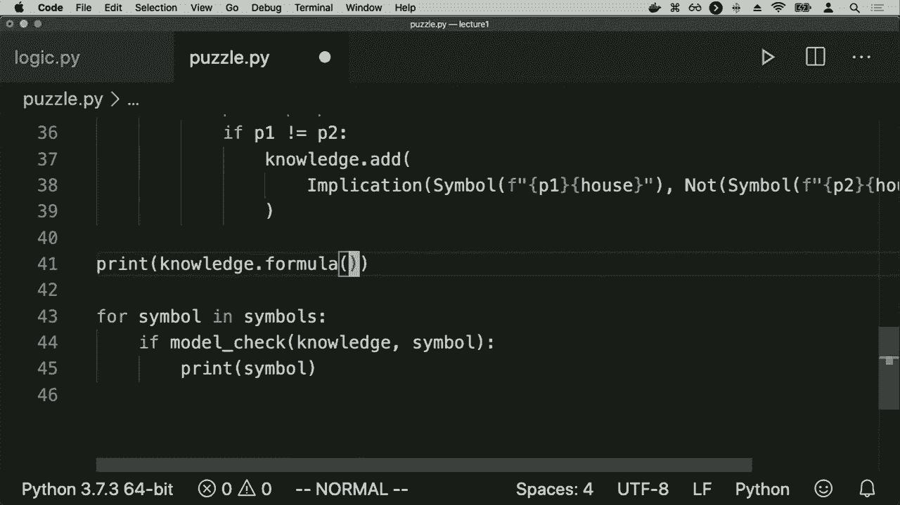

我们只需看看这个公式的实际应用，我暂时跳过这个，但我们一会儿会回来。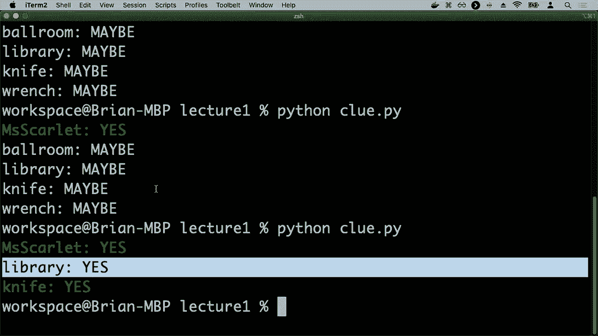

让我们通过运行Python puzzle pie打印出我知道的知识。这是很多信息，我必须滚动，因为有16个不同的变量在进行，但基本想法是如果我们滚动到最顶部，我看到我的初始信息，**吉尔德罗伊**要么在格兰芬多。

**吉尔达·罗伊斯**在赫奇帕奇，或者**吉尔达·罗伊斯**在拉文克劳，或者**吉尔达·罗伊斯**在斯莱特林，还有更多的信息，所以这相当混乱，比我们想要的要多，很快我们将看到使用逻辑以更好的方式表示这些，但现在我们可以说这些是。

我们正在处理的变量，现在我们想添加一些信息。所以我们要添加的信息是，**吉尔德罗伊**在格兰芬多还是在，拉文克劳，这些知识是被提供给我们的，所以我会说知识。点添加，我知道**吉尔德罗伊**要么在格兰芬多，要么在拉文克劳，这两个之一。

一些事情必须是真的，我也知道**波莫那**不在斯莱特林，所以我可以说知识不包含这个符号，不是**波莫那·斯莱特林**符号，然后我可以添加**米奈娃**在格兰芬多的知识，添加符号**米奈娃·格兰芬多**，所以这些是我知道的知识点，而这个循环。

在底部，循环遍历我的所有符号，检查知识是否推导出该符号，通过再次调用这个模型检查函数，如果我们知道该符号为真，我们就。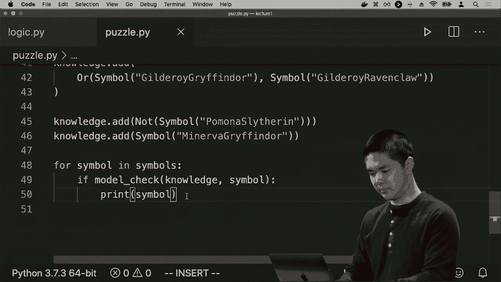

打印出符号，现在我可以运行Python puzzle PI，Python将为我解决这个难题，我们能够得出结论**吉尔德罗伊**属于拉文克劳，**波莫那**属于赫奇帕奇，**米奈娃**属于格兰芬多，**霍鲁斯**属于斯莱特林，仅仅通过将这些知识编码在计算机内。

在这种情况下，这很繁琐，因此我们能够得出结论，你可以想象这适用于许多不同的推理情况，因此不仅仅是这些情况，当我们试图处理**哈利·波特**角色时。

你是否玩过类似于“猜字游戏”的游戏，试图找出哪个。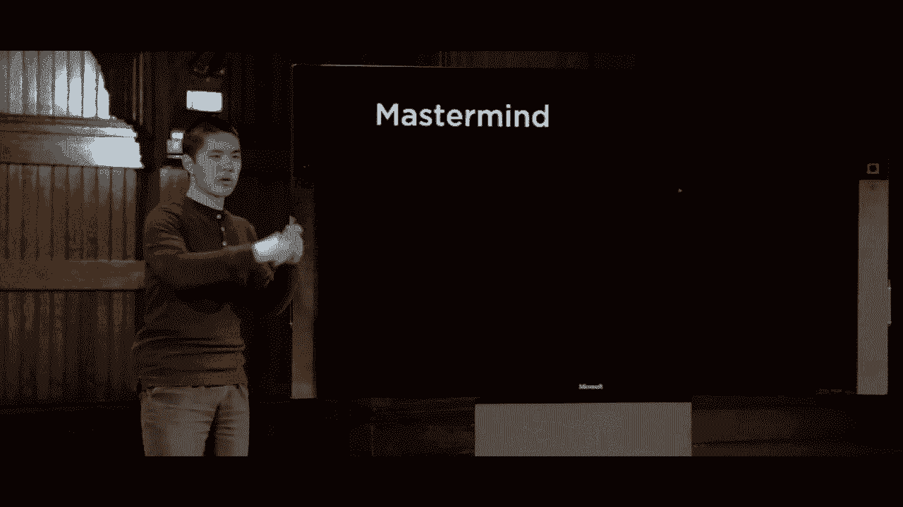

不同颜色的顺序进行，尝试对其进行预测。例如，我可以告诉你，让我们来玩一个。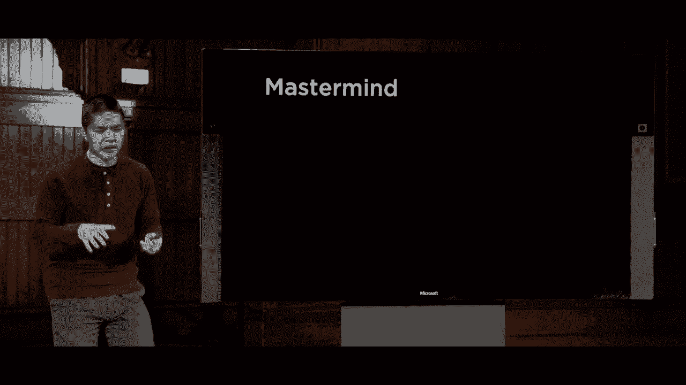

这是一个简化版的猜颜色游戏，其中有四种颜色：红色、蓝色、绿色和黄色，它们以某种顺序排列，但我不会告诉你什么顺序，你只需进行猜测，我会告诉你红色、蓝色、绿色和黄色中，有多少在正确的位置。

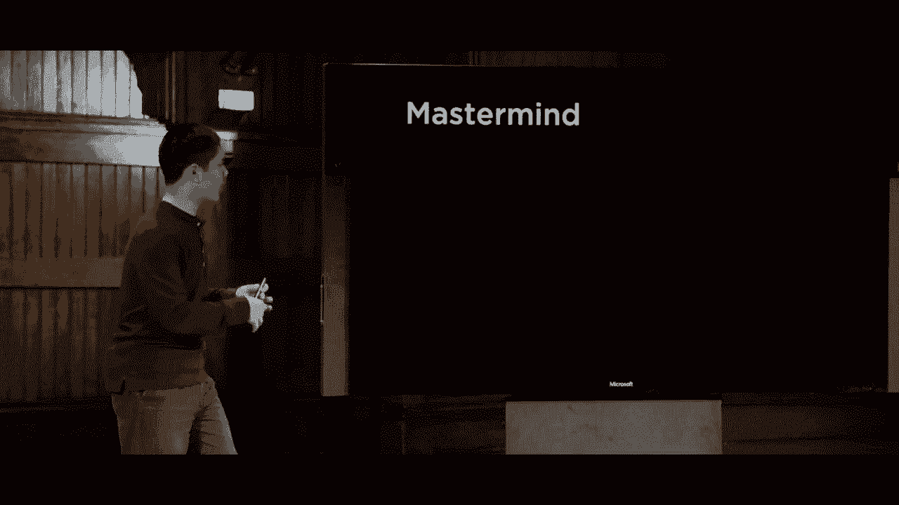

这个游戏的简化版本，你可能会猜测红色、蓝色、绿色和黄色。我会告诉你，比如这四个中有两个在正确的位置，而其他两个则。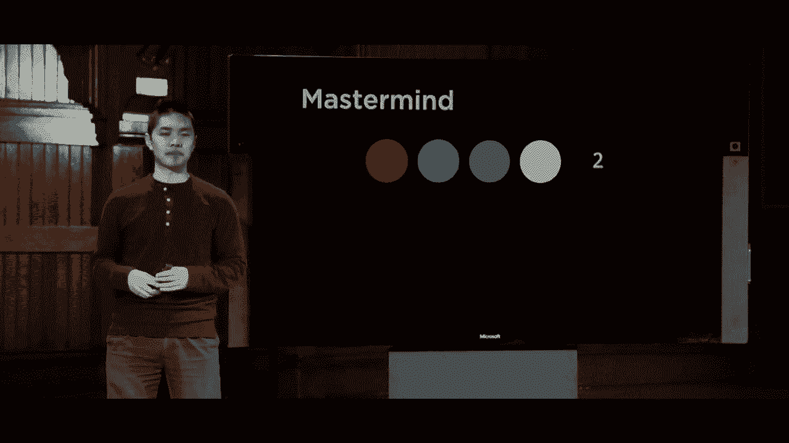

然后你可以合理地进行猜测，说好吧，让我们试试这个蓝色、红色、绿色和黄色，尝试交换其中两个，这一次也许我会告诉你，知道吗，所有这些都不在正确的位置。然后问题是，好的，这四种颜色的正确顺序是什么。

人类可以开始推理这一点，如果这些都不正确但其中两个是正确的，那么一定是因为我交换了红色和蓝色，这意味着这里的红色和蓝色必须是正确的，而绿色和黄色可能不正确。你可以开始这样做。

这种演绎推理，我们也可以等效地尝试将其编码到我们的计算机中，这将与我们刚才做的逻辑难题非常相似，所以我不会在这段代码上花太多时间，因为它相当相似，但我们还有很多。

一堆颜色和四个不同的位置，这些颜色可以放置在其中。然后我们还有一些额外的知识，我将所有这些编码。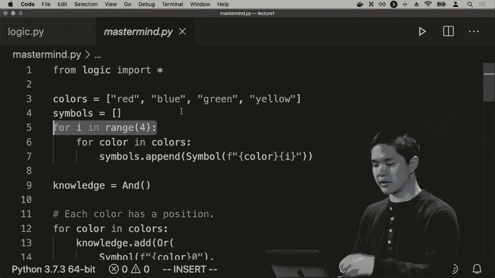

知识，你可以查看这段代码，并在自己的时间里研究，但我只是想展示，当我们。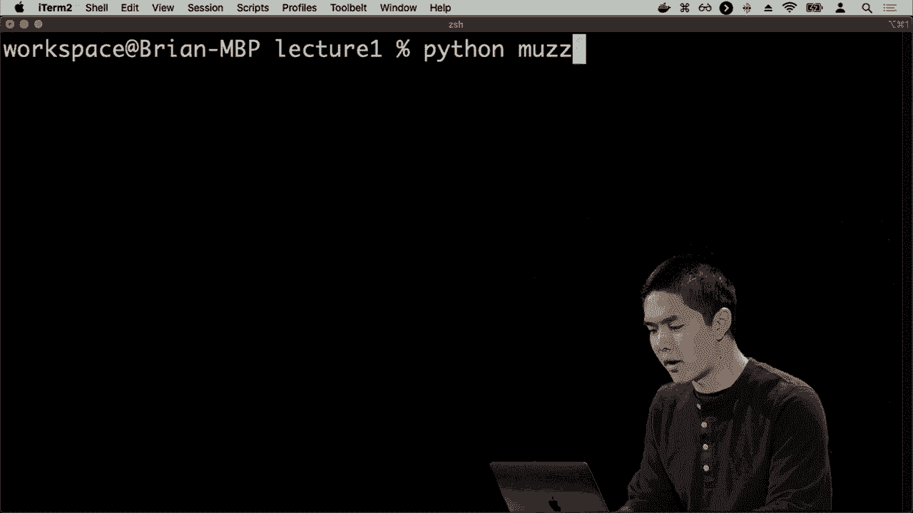

运行这段代码，运行Python mastermind PI，看看我们得到了什么。我们最终能够计算出红色在z行位置为0，蓝色在1。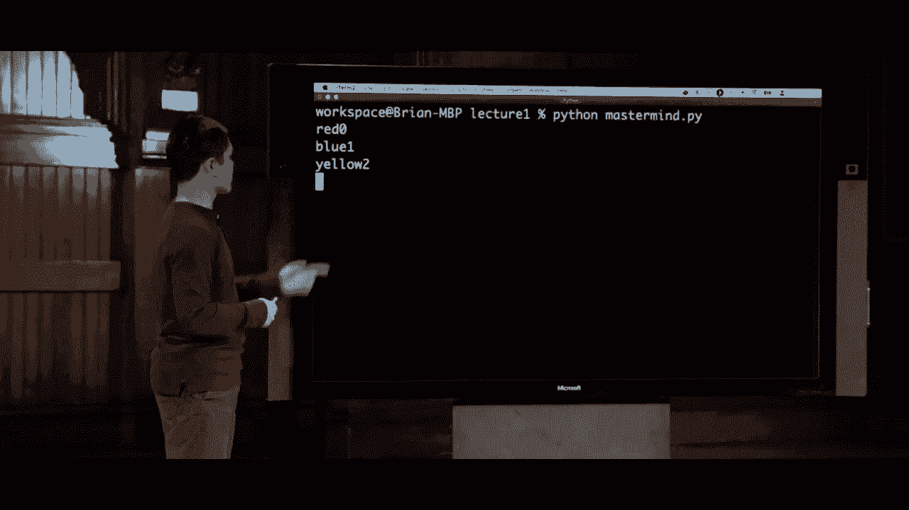

把黄色放在两个位置，把绿色放在三个位置，作为这些符号的排序。最终，你可能注意到这个过程花费了相当长的时间，实际上模型检查并不是一个特别高效的算法。为了进行模型。

检查是将我所有可能的不同变量列举出来，看看它们可能是什么。如果我有n个变量，我需要查看2的N次方个可能世界，以执行这个模型检查算法，这可能在特别是当我们。

开始接触越来越大规模的数据集，我们有许多更多的变量在此起作用，而我们只有相对较少的变量，因此这种方法实际上可以有效，但随着变量数量的增加，模型检查就会变得越来越不适合。

尝试解决这些问题，因此虽然对于类似于 mastermind 的结论，可能是可以接受的，确实这是正确的顺序，其中所有四个都是在正确的位置，我们想做的是想出一些更好的方法，以便能够进行推断，而不仅仅是列举所有可能性。

为了做到这一点，我们接下来将过渡到。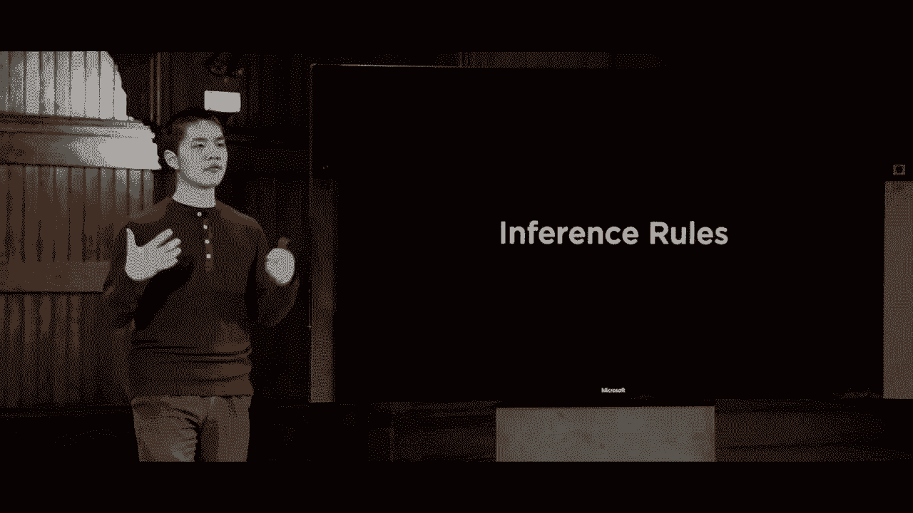
