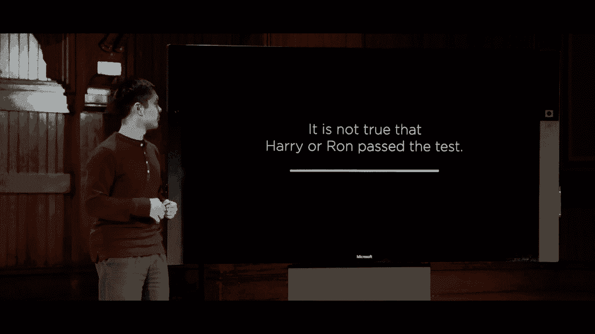
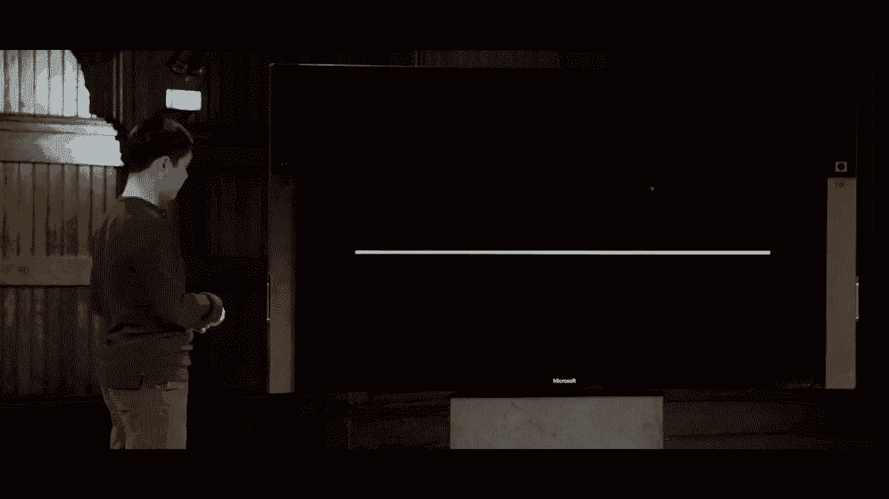
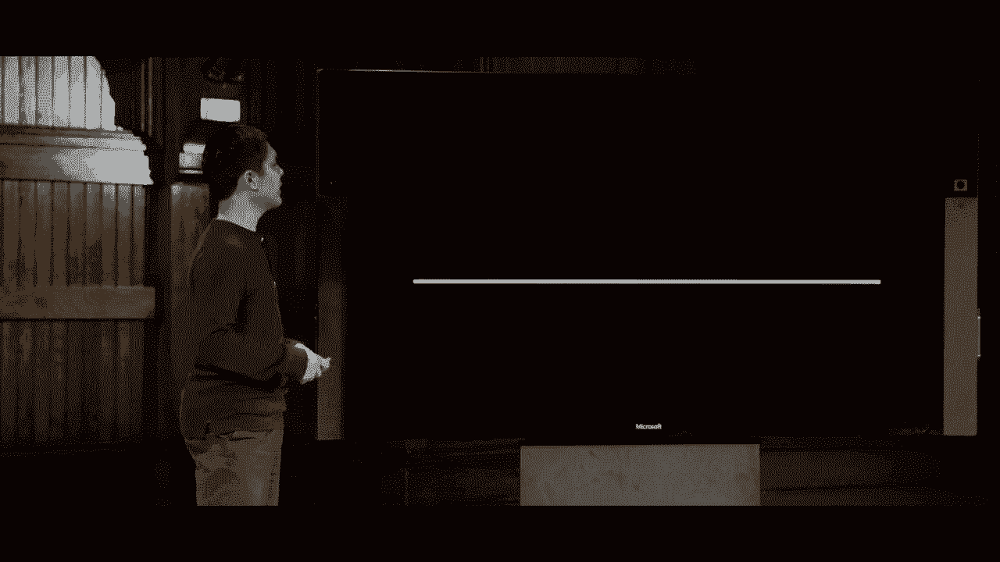
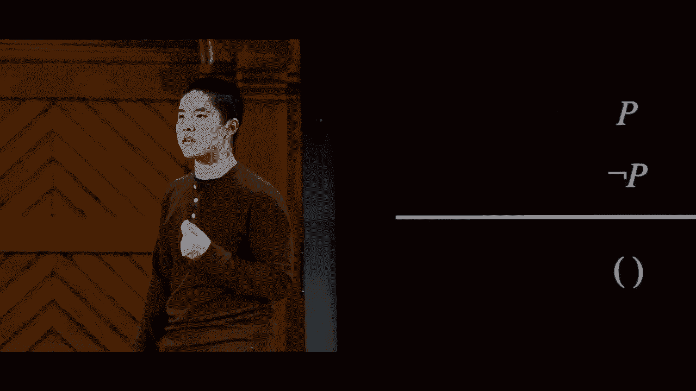
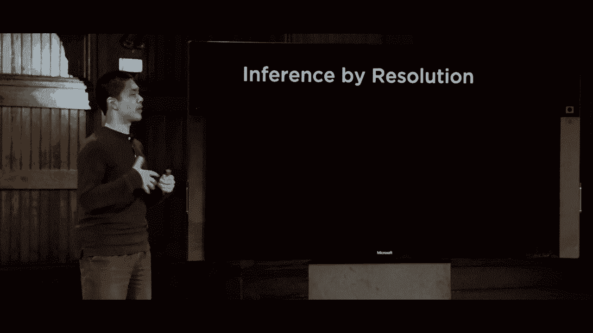
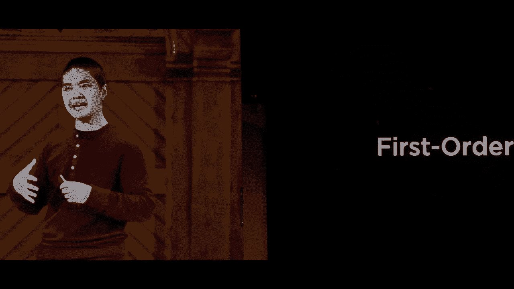
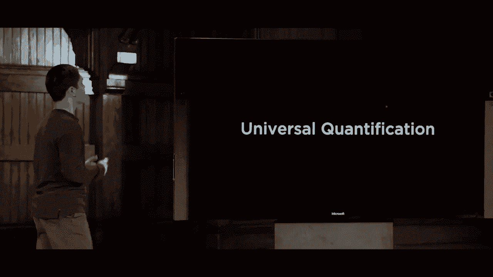
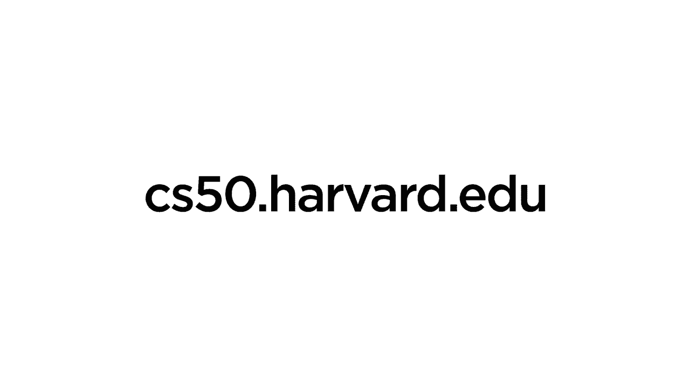

# [哈佛CS50-AI ｜ Python人工智能入门(2020·完整版) - P7：L1- 知识系统知识 3 (推断规则，解析)](https://example.org) - ShowMeAI - BV1AQ4y1y7wy

推断规则的想法是一种可以应用的规则，以将已经存在的知识转化为新的知识形式。我们构建推断规则的通用方式是通过在这里有一条水平线，线上的任何东西代表一个前提，即我们知道是真的，然后线下的任何东西就是我们在应用逻辑后能够得出的结论。

所以我们将通过首先用英语展示这些推断规则，然后将其翻译到命题世界来做一些这些推断规则。

逻辑，所以你可以看到这些推断规则实际上是什么样的。因此，比如说，假设我有两条信息，我知道，比如说如果下雨，那么哈里在里面，假设我也知道现在在下雨，那么我们中的大多数人可以合理地得出。

这条信息得出结论，哈里必须在里面。这条推断规则被称为**前件肯定**，在逻辑中更正式的表述是：如果我们知道alpha蕴含beta，换句话说，如果alpha为真，那么beta也为真，我们也知道alpha是真的，那么我们应该能够得出beta的结论。

也是真的，我们可以应用这个推断规则来获取这两条信息并生成这个新的信息。注意，这与模型检查的方法完全不同，后者的方法是查看所有可能的世界，看看在这些世界中什么是真实的。

在这里，我们并不处理任何特定的世界，而是处理我们知道的知识，以及基于这些知识我们能够得出的结论。我知道a蕴含b，而我知道a，结论是b，这似乎是一个相对明显的规则，但。

如果alpha为真，那么beta也为真，如果我们知道alpha，那么我们应该能够得出结论，beta也是真的，这对许多甚至所有的推断规则都适用，你应该能够查看它们并说，当然，这将是正确的，但把这些全部放在一起。

在一起弄清楚可以应用的推断规则的正确组合，这最终将使我们能够在我们的人工智能中生成有趣的知识，所以这是前件肯定，即如果我们知道alpha，我们知道alpha蕴含beta，那么我们可以。

让我们来看另一个例子，比较直接，比如哈里是罗恩和赫敏的朋友，根据这些信息，我们可以合理地得出哈里也是赫敏的朋友，这必须也是真的，这条推断规则被称为**与消除**。

如果我们有一个情况，其中 α 和 β 都为真。我有信息 α 和 β，那么仅 α 为真，或者仅 β 为真。但如果我知道两部分都为真，那么其中一部分也必须为真，这从人类的角度来看显而易见。

直觉，但计算机需要被告知这种信息才能应用推理规则。我们需要告诉计算机，这是一个可以应用的推理世界，以便计算机能够访问它，并能够使用它将信息从一种形式转换为另一种形式。

除此之外，让我们看一个推理规则的另一个例子。像“哈利没有通过测试”这句话有点棘手。我们再读一遍，“哈利没有通过测试”是错误的，或者说是假的。如果哈利没有通过测试的说法是假的。

那么唯一合理的结论是哈利通过了测试，因此这并不是一种消去，而是我们称之为双重否定消去。但如果我们在前提中有两个否定，那么我们可以将它们一起去掉，它们相互抵消，一个把真变为假，另一个。

一个把假变成真的，正式一点说，如果前提不是不是 α，那么我们可以得出的结论就是 α，我们可以说 α 为真。接下来我们再看几个这样的例子。

如果下雨，那么哈利在里面。我该如何重新表述这个呢？这个有点棘手，但如果我知道如果下雨，那么哈利在里面，那么我得出两个必须为真的结论，要么没有下雨，要么哈利在里面。

如果下雨，那么哈利在里面，这意味着如果我知道下雨，那么哈利必须在里面。那么还有什么其他可能的情况呢？如果哈利不在里面，那么我知道，肯定没有下雨，因此这两种情况必须成立：要么没有下雨，要么下雨，这样哈利就会在里面。

所以我能得出的结论是，要么没有下雨，要么下雨，因此哈利在里面。这是一种将如果-那么语句转换为或语句的方法，这被称为蕴含消去。这类似于我们一开始所做的。

关于哈利、海格和邓布利多的那几句话，更正式地说，这表示如果我有一个蕴含关系，α 蕴含 β，那么我可以得出结论，要么不是 α，要么是 β，因为只有两种可能：要么 α 为真，要么 α 不为真。

在这些可能性中，α不成立，但如果α成立，那么我们可以得出结论。所以，要么α不成立，要么α成立，此时β也成立。这是一种将蕴含转化为关于“或”的陈述的方式。

好吧，让我们举一个英语例子，比如“如果且仅如果哈利在里面，那么下雨”。这种“如果且仅如果”听起来像我们在命题逻辑中看到的双条件符号，这实际上意味着如果我们要翻译这个。

这意味着如果下雨，那么哈利在里面；如果哈利在里面，那么下雨。这种含义是双向的，这就是我们所说的双条件消去，我可以将双条件“A当且仅当B”翻译成类似“A蕴含B，且B蕴含A”。

许多推理规则是将使用某些符号的逻辑转化为不同的符号，将一个蕴含转化为“或”，或者将一个双条件转化为蕴含。另一个例子是：如果说“哈利和罗恩都未通过测试”。

如果哈利和罗恩都通过了测试，合理的结论是至少有一个人通过了测试，因此结论是：要么哈利没有通过，要么罗恩没有通过，或两者都没有通过。

这并不是排他性“或”，但如果确实不成立哈利和罗恩都通过了测试，那么要么哈利没有通过，要么罗恩没有通过，这种类型的法则就是德摩根法则，在逻辑中非常著名，意在说明我们可以将“且”转换为“或”。

这将“哈利和罗恩都通过了测试”转化为“或”，通过重新排列关系。如果不成立哈利和罗恩都通过测试，那么要么哈利没有通过，要么罗恩没有通过。我们更正式地框定这个逻辑是说，如果不成立。

对于α和β来说，如果α不成立，那么要么非α要么非β。我的思考方式是，如果你在一个“且”表达前有否定，那么你就向内移动否定，翻转“且”为“或”。

否定向内移动，最后翻转为“或”，所以我从“非A且B”变为“非A或非B”，而实际上，存在德摩根定律的反向情况，例如，如果我说“哈利或罗恩未通过测试”，这意味着两者都未通过。

他们通过了测试，那么我可以得出的结论是，哈利没有通过测试，而罗恩也没有通过测试。因此，在这种情况下，我们不是将与转变为或，而是将或转变为与，但想法是相同的，这再次是德摩根定律的另一个例子。

其工作原理是，如果我有非 A 或 B，那么这次相同的逻辑将适用。我将把否定移入文字，并且这次我将把或转换为与。因此，如果不是 A 或 B，这意味着 A 或 B 或 alpha 或 beta 不是正确的，那么我可以说非 alpha 和非 beta，将否定移入文字以使其成立。

这些就是德摩根定律，还有一些其他值得关注的推理规则，其中一个是以这种方式工作的分配律。所以如果我有 alpha 和 beta 或 gamma，那么与数学中一样，你可以使用分配律来分配操作数。

像加法和乘法一样，我可以在这里做类似的事情，我可以说，如果 alpha 和 beta 或 gamma，那么我可以说像 alpha 和 beta 或者 alpha 和 gamma 这样的内容，我已经能够在这个表达式中分配和分配这个符号。这是分配律的一个例子。

将分配律应用于逻辑，就像你会将乘法分配到某个东西的加法上一样。例如，这种方式也可以反过来使用，所以例如，如果我有 alpha 或 beta 和 gamma，我可以将或分配到整个表达式中，我可以说 alpha 或 beta 和。

alpha 或 gamma，因此分配律也以这种方式起作用，如果我想将或移入表达式中，这将是有帮助的。我们将很快看到一个示例，说明为什么我们可能真的关心这样做。好吧，所以现在我们已经看到了很多不同的推理规则。

现在的问题是，我们如何使用这些推理规则来尝试得出一些结论，实际上尝试证明关于蕴含的某些内容。在给定一些初始知识库的情况下，我们希望找到某种方法来证明一个查询是真实的。那么一种思考方式是回顾。

我们上次讨论的内容是关于搜索问题的回顾。搜索问题有某种初始状态，它们有可以从一个状态转换到另一个状态的动作，这些动作由转移模型定义，该模型告诉你如何从一个状态转移到另一个状态，我们也讨论了测试。

查看你是否达到目标，然后用某种路径成本函数来查看你知道你需要走多少步，或者你找到的解决方案有多昂贵。现在我们有这些推理规则，这些规则将一些命题逻辑中的句子集变换为新的命题逻辑句子集。

我们实际上可以将这些句子或这些句子的集合视为搜索问题中的状态，因此如果我们想证明某个查询是真的，证明某个逻辑定理是真的，我们可以将定理证明视为一种搜索问题。我可以说我们从某个初始状态开始，那个初始状态是。

我开始的知识库是我知道的所有句子的集合。可用的行动是什么呢？可用的行动是我在任何时候可以应用的推理规则。过渡模型告诉我，在我应用推理规则之后，这里是我所有的新知识集合。

这将是旧知识集合加上一些我能够得出的附加推理，这与我们上次看到的应用推理规则得出某种结论的方式是一样的。这个结论被添加到我们的知识库中，成为我们的过渡。

模型将编码目标测试。我们的目标测试就是检查我们是否已经证明了我们想要证明的陈述，如果我们试图证明的事情在我们的知识库中，路径成本函数我们试图最小化的可能是步骤数量。

我们需要使用的推理规则，所谓的步骤数量，也就是在我们的证明中。因此在这里，我们能够应用与上次看到的搜索问题相同的思路，去证明一些关于知识的事情，通过将我们的知识以我们能够。

我们可以将其理解为一个搜索问题，具有初始状态、行动和过渡模型。因此这展示了几个事情，其中之一是搜索问题的多功能性，它们可以是我们用来解决迷宫或弄清楚如何从A点到B点的相同类型的算法。

驾驶指示例如也可以用作一种定理证明方法，从某种起始知识库出发，尝试证明一些关于该知识的事情。因此，这再次是除了模型检查之外的第二种方法，来证明某些陈述为真，但事实证明还有更多。

另一种我们可以尝试应用推理的方法，我们现在将讨论这一点，这不是唯一的方法，但肯定是最常见的之一，称为**归结**。归结基于另一种我们将要看的推理规则，这是一个相当强大的推理规则，能够让我们证明任何事情。

这可以证明关于知识的事情。

基于这个基本思想，假设我知道要么罗恩在大餐厅，要么赫敏在图书馆，假设我还知道罗恩不在大餐厅。基于这两条信息，我能得出什么结论呢？我可以相当合理地得出赫敏必须。

在图书馆，我怎么知道的呢？因为这两个陈述，这两个我们称之为互补的文字，互补的文字彼此相反，似乎相互冲突。这句话告诉我们，要么罗恩在图书馆，所以如果我们知道罗恩不在。

与这个大礼堂相冲突，这意味着赫敏必须在图书馆，而我们可以将其框架为一个更一般的规则，称为单元分辨率规则，该规则表示如果我们有P或Q并且我们还知道非P，那么我们可以合理地得出结论Q，但如果P或Q为真，且我们。

知道P不是真的，唯一的可能性就是Q为真，而这被证明是一个相当强大的推理规则，因为它的作用部分在于我们可以迅速开始概括这个规则，这个Q在这里不需要仅仅是一个单一的命题符号，它可以是。

多个相互链接在一个单一的子句中，我们称之为子句，如果我有类似P或q1或q2或q3，依此类推，一直到QN。所以我有n个不同的其他变量，并且我有非P，那么当这两个互补时，会发生什么呢？是这两个子句解决了。

产生一个新子句，仅仅是q1或q2，一直到QN，或者参数的顺序实际上并不重要，P不需要是第一项，它可以在中间，但这里的想法是，如果我在一个子句中有P，在另一个子句中有非P，那么我知道。

剩下的这些东西之一必须为真，我已经解决了它们以产生一个新的子句，但事实证明我们甚至可以进一步概括这个想法，实际上，并展示我们在这个分辨率上可以拥有的更强大的能力。

规则，所以我们再举一个例子，假设我知道同样的信息，要么罗恩在大礼堂，要么赫敏在图书馆。而我知道的第二条信息是，罗恩不在大礼堂，或者哈利在睡觉，所以这不仅仅是一条信息，我。

有两个不同的情况，我们将会，稍后讨论，我在这里知道什么呢？同样对于任何命题符号，比如罗恩在大礼堂，只有两种可能性：要么罗恩在大礼堂，在这种情况下根据分辨率，我们知道哈利必须在睡觉，要么罗恩不在大礼堂。

根据同样的规则，我们知道赫敏必须在图书馆，基于这两者的结合，我可以说基于这两个前提，我可以得出结论，赫敏要么在图书馆，要么哈利在睡觉。所以再次因为这两者相互冲突，我知道这两者中有一个。

每个这些内容必须为真，你可以仔细查看并尝试推理，确保你相信这个结论。更一般地说，我们可以通过声明，如果我们知道 P 或 Q 为真，同时我们也知道非 P 或 R 为真，我们可以解决这些问题。

将两个子句组合在一起以得到一个新的子句，Q 或 R，其中 Q 或 R 必须为真。再说一次，在最后的情况下，Q 和 R 不需要仅仅是单个命题符号，它们可以是多个符号，所以如果我有一个规则，其中有 P 或 q1 或 q2 或 q3 依此类推，一直到 Q n，其中 n 只是某个数字。

同样地，我有非 P 或 R1 或 R2 等，直到 R M，其中 m 也是某个数字。我可以将这两个子句组合在一起，以便得到其中一个必须为真的结果 q1 或 q2 直到 QN 或 r1 或 r2 直到 RM，这只是我们之前看到的同一规则的概括。

我们将称之为子句，子句被正式定义为文字的析取，其中析取意味着多个事物通过“或”连接在一起，析取意味着通过“或”连接的事物，而结合则是通过“和”连接的，文字则是命题符号。

符号或命题符号的反面，例如 P 或 Q 或非 P 或非 Q，这些都是命题符号或命题符号的反面，我们称之为文字。所以一个子句就像这样 P 或 Q 或 R，例如，同时这赋予了我们一种能力。

这样做可以使我们能够将任何逻辑句子转换为称为合取范式的东西，合取范式句子是一个逻辑句子，它是多个子句的结合。再提醒一下，结合意味着事物通过“和”连接在一起。

子句的组合意味着这是多个独立子句的结合，每个子句中都有“或”。所以像这样 A 或 B 或 C，和 D 或非 E 和 F 或 G，所有在括号中的内容都是一个子句，所有子句通过“和”连接在一起，子句中的所有内容通过“或”分隔。

合取范式只是我们可以将逻辑句子转换为的标准形式，这使得操作和处理都变得简单。结果是，我们可以通过应用一些推理规则和变换将任何逻辑句子转换为合取范式。

看看我们如何实际做到这一点，那么，将逻辑公式转换为合取范式（也称为 CNF）的过程是什么呢？这个过程看起来大概是这样的，我们需要将所有不属于合取范式的符号分开。

条件句和蕴涵等等，将它们转变为更接近合取范式的东西。所以第一步将是消除条件句，那些“如果和仅当”的双箭头，我们知道如何消除条件句，因为我们看到有一个推理规则。

每当我有表达式像“α当且仅当β”时，我可以将其转变为“α蕴涵β”和“β蕴涵α”，根据我们之前看到的推理规则。同样，除了消除条件句，我也可以消除蕴涵和“如果-那么”箭头，使用我们之前看到的相同推理规则。

将“α蕴涵β”转变为“非α或β”，因为这在逻辑上等价于这里的第一个东西，然后我们可以将“非”移入。因为我们不希望结点在表达式的外部，合取范式要求仅有子句。

结点需要紧邻，命题符号，但我们可以移动这些结点。我们可以使用德摩根定律，将像“非A和B”这样的东西转变为“非A或非B”，例如，通过使用德摩根定律来操控。之后我们剩下的就是与和或，容易处理。

我们可以使用分配律来分配或，使得或最终位于表达式内部，且与位于外部。这是我们如何将公式转变为合取范式的一般模式。现在让我们看看一个例子。

这是我们如何做到这一点的例子，接着探讨一下我们为什么要这样做。我们可以这样做，让我们以这个公式为例：“P或Q蕴涵R”，我想将其转换为合取范式，其中都是子句的与。

析取子句是将或连接在一起，所以我需要做的第一件事是什么？这是一个蕴涵，所以让我去掉这个蕴涵，使用蕴涵推理规则，我可以将P或Q转变为P或Q蕴涵R，变为“非P或Q或R”，所以这是第一步，我已经去掉了蕴涵。

接下来，我可以去掉这个表达式外部的结点，我可以将结点移入，使它们更靠近字面量，使用德摩根定律。德摩根定律表示“非P或Q”等价于“非P和非Q”，再次应用我们已经见过的推理规则。

为了翻译这些语句，现在我有两个通过“或”分开的东西，其中内部是一个与。我真的希望将“或”移动到内部，因为合取范式意味着我需要多个子句，所以可以使用。

分配律，如果我有 not P 和 not Q 或 R，我可以将或 R 分配给这两个，以得到 not P 或 R 和 not Q 或 R，使用分配律，而在这里底部就是合取范式，它是合取和析取的子句，只由 ORS 分隔。因此这个过程可以是。

被任何公式使用，以将逻辑句子转换为这种形式。合取范式，我有爪子和爪子和爪子和爪子等等。那么，为什么这有帮助呢？我们为什么要关心将所有这些句子转换为这种形式？这是因为一旦它们进入。

这种形式，其中我们有这些子句，这些子句是我们刚才看到的解析推理规则的输入。如果我有两个子句，其中有一些冲突或互补的东西，我可以解析它们以得到一个新子句，从而得出一个新结论。

我们称这个过程为通过解析推理，使用解析规则来得出某种推理，基于同样的想法，如果我有 P 或 Q 这个子句，并且我有 not P 或 R，那么我可以将这两个子句合并，得到 Q 或 R 作为结果子句，这是一条新的信息。

在此之前有几个关键点值得注意。在我们讨论实际算法之前，有一点是让我们想象我们有 P 或 Q RS，我也有 not P 或 R 或 s。解析规则说，因为这个 P 与这个 not P 冲突，我们将解析以放入。

将所有其他内容结合起来得到 Q 或 s 或 R 或 s，但事实证明，这个 SS 是多余的，或 s 在这里，或 s 在那里，并没有改变句子的含义。因此，在解析时，当我们进行这个解析过程时，通常也会进行一个称为因式分解的过程，其中我们处理任何重复的变量。

显示出来并消除它们，因此 Q 或 s 或 R 或 s 仅变为 Q。R 或 s，s 只需出现一次，不需要多次包含。现在。

值得考虑的最后一个问题是，如果我尝试将 P 和 not P 一起解析，如果我知道 P 是真的，而我知道 not P 是真的。那么解析说我可以将这些子句合并在一起，并查看其他所有内容。在这种情况下，没有其他内容，所以我只剩下我们可能称之为。

空子句只剩下空，空子句始终是假的。空子句等同于只是假的，这很合理，因为不可能同时满足 P 和 not P。P 要么是真的，要么不是真的，这意味着如果 P 为真，那么这必须是。

假如这是假的，那么如果这是对的，这就必须是假的，这两者不可能同时成立。所以如果我尝试解决这两个，它就是一个矛盾，我最终得到这个空子句，而空子句我可以称之为等同于假，这个想法是如果我解决这两个。

矛盾的术语让我得到了空的。

子句，这是我们解析推理算法的基础。我们将如何以非常高的层次进行解析推理呢？我们想证明我们的知识库蕴含某个查询α，基于我们拥有的知识，我们可以确凿地证明α将会。

真实的情况，我们将如何做到这一点呢？为了做到这一点，我们将尝试证明，如果我们知道知识和非α，这将是一个矛盾。这在计算机科学中是一种常见的技术，更多地是证明某些事情的反证法。如果我想证明。

某些东西为真，我可以先假设它为假并展示这将导致矛盾，证明它会导致某种矛盾。如果我想证明的事情在我假设它为假时导致矛盾，那么它必须为真，这就是逻辑的方法或想法。

其背后的证明方法是反证法，这就是我们在这里要做的。我们想证明查询α为真，因此我们将假设它不为真，我们将假设非α，并尝试证明它。如果得出矛盾，那么我们知道我们的知识。

如果我们没有得到矛盾，那么查询α就没有蕴含。这就是反证法的理念，假设你试图证明的事情的反面，如果你能证明这就是矛盾，那么你所证明的必须为真，但更正式地说我们该如何。

实际上该怎么做，我们如何检查知识库和非α不会导致矛盾呢？好吧，这里是。

解析在这里发挥作用，以确定我们的知识库是否蕴含某个查询α。我们将把知识库和非α转换为合取范式，那种所有子句都用AND连接在一起的形式，当我们有这些个别的子句时，我们现在可以继续。

检查我们是否可以使用解析生成新的子句。我们可以任意选择一对子句，检查它们是否互相包含或是互为补充。例如，在一个子句中有P，而在另一个子句中有非P；在一个子句中有R，而在另一个子句中有非R。

那种情况是，一旦我转换为合取范式，我有一大堆子句，我看到两个子句可以解析生成一个新的子句，我就会这样做。这个过程循环进行，我会不断检查是否可以使用解析生成新的子句并持续使用。

生成更多的新子句，然后再继续。可能最终我们会产生空子句，我们之前谈论过的那个子句，如果我将A和非P一起解决，就会产生空子句，而空子句我们知道是错误的，因为我们知道。

不可能同时使P和非P都为真，因此如果我们产生空子句，那么我们就有了矛盾，如果我们有矛盾，这正是我们在通过矛盾的方式所要做的。如果我们有矛盾，那么我们知道我们的知识基础。

必须蕴含这个查询α，我们知道α必须为真，结果证明了这一点。我们在这里不深入证明，但你可以展示，如果你没有生成空子句，那么就没有蕴含。如果我们遇到没有更多新子句可添加的情况，我们已经做完了所有。

我们可以进行解析，但仍然没有产生空子句，在这种情况下就没有蕴含。这就是解析算法，它看起来非常抽象，特别是像“空子句”究竟意味着什么这样的概念，所以我们来看一个例子。

尝试通过这个解析推理过程来证明某种蕴含，因此这是我们的问题，我们有这个知识基础，这就是我们知道的A或B和非B或C和非C，我们想知道这一切是否蕴含A，这就是我们的知识基础，整个逻辑内容和我们的查询。

α只是这个命题符号A，那么我们该怎么做呢？首先，我们想要通过矛盾来证明，因此我们要假设A为假，看看是否会导致某种矛盾。那么我们将从A或B和非B或C和非C开始，这就是我们的知识基础。

假设我们要假设，我们要证明的事情实际上是错误的，因此这现在是合取范式，我有四个不同的子句：我有A或B，我有非B或C，我有非C，我还有非A，现在我可以开始选择两个可以解决并应用的子句。

按照这些四个子句，我看到这两个子句是我可以解决的，因为它们中出现了互补的文字，这里有C，那里有非A。因此，仅查看这两个子句，如果我知道非B或C为真，我就可以将它们解决。

我们知道C为假，那么我可以将这两个子句解决，得出非B必须为真。我可以生成这个新子句作为我现在知道的一个新信息，现在我可以重复这个过程，看看是否可以再次使用解析得到一些新结果。

结论是，我可以使用我刚生成的新子句，和这个子句一起，这些是互补的字面量，这个B与这里的非B互补或冲突，因此如果我知道A或B为真，而B不为真，那么唯一剩下的。

可能性是A必须为真，所以现在我们得到了一个新的子句，我能够生成的，现在我可以再做一次，我在寻找可以解决的两个子句，您可能通过编程方式只需循环遍历所有可能的子句对并检查互补。

每一个字面量在这里，我可以说，好吧，我找到了两个相互冲突的子句，不A和A。当我将这两个子句一起解决时，这与之前解决P和非P时是相同的，当我将这两个子句结合时，我消除了A，剩下了空子句。

而空子句我们知道是假的，这意味着我们有一个矛盾，这意味着我们可以安全地说，这整个知识库确实蕴含A，如果这个句子是真的，那么我们知道A肯定也是真的，所以现在使用推理通过分辨是一种完全不同的方式来尝试证明某个陈述实际上是真的，而不是枚举所有可能的世界。

我们可能身处其中，以便试图找出在何种情况下知识库为真，何种情况下我们的查询为真，而是使用这个分辨算法来说，让我们继续尝试找出我们。

我可以绘制并查看是否达到矛盾，如果我们达到了矛盾，这告诉我们一些关于我们的知识是否确实蕴含查询的事情。实际上，有许多不同的算法可以用于推理。我们刚刚看过的只是其中的几个，实际上。

这一切都仅基于一种特定类型的逻辑，它是基于命题逻辑，在这里我们有这些个体符号，我们通过“和”、“或”、“非”和“蕴含”以及条件连接它们，但命题逻辑并不是唯一存在的逻辑类型，事实上我们看到还有其他逻辑。

命题逻辑中存在的局限性，尤其是在我们在像主脑示例或逻辑难题的例子中看到的，比如我们有来自不同霍格沃茨学院的人，试图找出谁属于哪个学院，这里有很多。

我们需要不同的命题符号来表示一些相当基本的想法，因此现在作为我们在结束今天的课堂之前要看的一最后一个主题，是一种与命题逻辑不同的逻辑类型，称为一阶逻辑，这比命题逻辑要强大一些。

逻辑将使我们更容易表达某些类型的想法。在命题逻辑中，如果我们回想起那个关于人和霍格沃茨学院的难题，我们有一堆符号，每个符号只能为真或假，对吧，我们有一个符号代表米奈娃格兰芬多，这个符号要么为真。

如果米奈娃在格兰芬多则为真，否则为假，对米奈娃赫奇帕奇、米奈娃拉文克劳和米奈娃斯莱特林同样如此，但这开始变得相当冗余，我们希望找到某种方法来表达这些命题符号之间的关系，即米奈娃。

在所有这些中都会出现，而且我希望不必有那么多不同的符号来表示实际上是一个相当简单的问题，所以一阶逻辑将为我们提供一种不同的方式来处理这个想法，给我们两种不同类型的符号。

有一些常量符号将代表像人或房屋这样的对象。然后是谓词符号，可以想象成关系或函数，它们接受输入并评估为真或假，例如告诉我们某些常量或一对常量的某些属性是否存在。

多个常量实际上成立，所以我们稍后会看到一个例子，但目前在这个同样的问题中，我们的常量符号可能是对象，比如人或房屋，像米奈娃、波莫纳、霍拉斯、吉德罗伊，这些都是常量符号，我的四个学院格兰芬多、赫奇帕奇、拉文克劳也是。

和斯莱特林谓词，同时这些谓词符号将是可能对这些单个常量成立或不成立的属性，因此“人”可能对米奈娃成立，但对格兰芬多则为假，因为格兰芬多不是一个人，而“学院”则会对拉文克劳成立。

但这对霍拉斯不成立，因为霍拉斯是一个人，而他属于的同时将会有某种关系，将人与他们的学院联系起来，只告诉我某人是否属于一个学院，所以让我们看看一些在。

一阶逻辑可能看起来像一个句子，可能看起来像这样：“人 米奈娃”，其中米奈娃在括号中，“人”是一个谓词符号，米奈娃是一个常量符号，这个一阶逻辑中的句子实际上意味着米奈娃是一个人，或者“人”属性适用。

对于米奈娃对象，所以如果我想说米奈娃作为一个人，这里是我如何使用一阶逻辑表达这个想法，同时我可以说像格兰芬多的学院 - 同样表达了格兰芬多是一个学院的想法，我可以这样做，使用我们在命题逻辑中看到的所有相同的逻辑联接词。

逻辑将在这里起作用——所以，和或蕴涵通过条件否定。在事实上，我可以使用否定来说一些，比如，不是房子米涅瓦，而这个句子和。第一阶逻辑意味着一些，比如，米涅瓦不是一所房子，它不是真的。房子属性适用于米涅瓦，同时还包括一些。

这些谓词符号只接受一个，单一的参数，我们的一些谓词符号将表达二元，关系，两个参数之间的关系。因此我可以说一些，比如，属于，然后输入米涅瓦和格里芬多，以表达米涅瓦属于格里芬多的想法。

现在这里是关键的区别，但是或，两个之间的关键区别之一。这和命题逻辑中，在命题逻辑中，我需要一个符号表示米涅瓦。格里芬多和一个符号表示米涅瓦，赫奇帕奇，以及所有。其他人的格里芬多和赫奇帕奇，在这种情况下我只需要一个。

我每个人的符号和每个房子的一个符号，然后我。可以表达为一个谓词，比如属于，并说属于。米涅瓦格里芬多，以表达米涅瓦属于格里芬多的想法。因此我们可以看到，第一阶逻辑在能够。

使用现有的常量符号和。谓词来表达这些句子，同时，最小化我需要创建的新符号数量。我只需要八个符号，四个人，四个房子。而不是每个可能组合的十六个符号，但，第一阶逻辑。

给我们提供一些额外的功能，可以用来表达更复杂的。想法，这些额外的功能通常被称为量词，第一阶逻辑有两个主要的量词。

第一个是全称量化，全称量化。让我表达一个想法，比如某件事，对于变量的所有值都将为真。比如，对于所有 X 的值，某个陈述将为真，那么一个全称的句子，量化看起来像什么呢，好吧，我们。

我要用这个倒置的 A 表示对于，所有，所以倒置的 A X 意味着对于所有。X 的值，其中 X 是任何对象，这将成立，它属于 X。格里芬多意味着不属于 X，赫奇帕奇，所以我们来试着解析一下。这意味着对于所有 X 的值，如果这成立，如果 X 属于。

格里芬多，那么这不成立，X 不属于赫奇帕奇。所以翻译成英语，这个句子是说，对于所有对象 X，如果 X 属于格里芬多，那么 X 不属于赫奇帕奇，例如，或者更简单的说法，任何在格里芬多的人不在。

**赫奇帕奇**更简化地说同样的事情。因此，这种普遍量化让我们表达一个想法，比如某些东西将在特定变量的所有值上成立。此外，普遍量化中我们还有存在量化。

量化表示某些东西在一个变量的所有值上都将成立，存在量化则表示某个表达在至少一个变量的某个值上将成立。让我们看看使用存在量化的示例句子。

句子看起来像这样：存在一个X，这个倒过来的e代表存在。这里我们说存在一个X，使得X是一个房子，且米涅尔瓦属于X。换句话说，存在某个对象X，X是一个房子，而米涅尔瓦属于X，或者更简洁地用英语表达，我只是。

说**米涅尔瓦**属于一个房子，这里有一个物体是一个房子。米涅尔瓦属于一个房子，通过结合这个普遍和存在的量化，我们可以创造出比仅使用命题逻辑更复杂的逻辑语句。

像这样，对所有X，若X是一个人，则存在一个Y，使得Y是一个房子，且属于X。好吧，这里发生了很多事情，有很多符号。让我们试着解析一下，理解它在说什么。我们说对于所有X的值，如果X是一个人，那么这是正确的。

换句话说，我说对于所有人，我们称那个人为X，这个陈述将会是正确的。那么对所有人来说，什么陈述是正确的呢？那就是存在一个Y，是一个房子。也就是说，存在某个房子，且X属于Y。换句话说，我在说，对于所有人，存在某个房子，使得X。

这个人属于Y这个房子，因此更简洁地说，我在说每个人都属于一个房子，对于所有X，如果X是一个人，那么存在一个房子，X属于它。因此我们现在可以使用这个想法来表达更多强大的概念，现在第一阶逻辑也证明了有许多其他。

这里有各种逻辑，第二阶逻辑和更高阶逻辑，每种逻辑都允许我们表达越来越复杂的想法，但在这种情况下，所有的追求其实都是同一个目标，那就是知识的表示。我们希望我们的AI代理能够了解信息，表示。

这些信息，无论是使用命题逻辑、第一阶逻辑，还是其他逻辑，然后能够基于此推理，得出结论，进行推断，弄清楚是否存在某种蕴含关系，借助某种推理算法。

通过解析或模型检查等推理，或任何其他算法，我们能够使用已知的信息并将其转化为**结论**。所有这些都帮助我们创造出能够表示关于其所知和所不知道的信息的AI，下次我们将…

看一下我们如何通过不仅仅编码我们确定为**真实**和**不真实**的信息，还要关注不确定性，使我们的AI变得更加强大，看看如果AI认为某件事情可能是**可能的**或可能不是**很可能**，或者介于这两者之间会发生什么。

在追求构建我们的智能系统的过程中，涵盖了这两个极端。
