# 哈佛CS50-AI ｜ Python人工智能入门(2020·完整版) - P8：L2- 不确定性 1 (概率模型，条件概率，随机变量，贝叶斯规则) - ShowMeAI - BV1AQ4y1y7wy

[音乐]。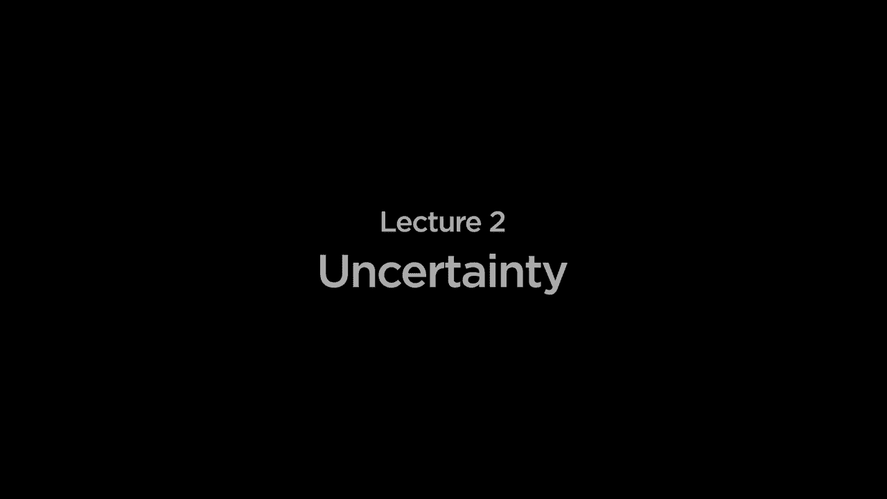

好的，欢迎大家回到Python人工智能入门课程。上次我们讨论了AI如何在计算机中表示知识，我们以逻辑句子的形式表示了这些知识，并使用多种不同的逻辑语言。

我们希望我们的人工智能能够表示知识或信息，并以某种方式利用这些信息，推导出新信息，能够根据已知的信息推断出一些额外的结论。

当然，当我们思考计算机和人工智能时，我们的机器很少能够确定某些事情。通常情况下，我们的AI或计算机所处理的信息中会有一些不确定性。

我们很快会讨论一些概率，了解概率的含义，但并不是完全确定的，我们希望利用它所拥有的一些知识，即使它并没有完美的知识，也能进行推理并得出结论，你可能会想象。

例如在一个机器人探索某些环境的上下文中，它可能并不知情。

确切地说，它所在的位置或周围的情况，但它确实可以访问一些数据，这使它能够以某种概率进行推理，某件事是真的或另一件事是可能的，或者你可以想象在更具随机性和不确定性的背景下。

比如预测天气，你可能无法百分之百确定明天的天气，但你可以根据今天和昨天的天气以及其他数据，推断出明天的天气。

同样，我们可以将其简化为可能发生的事件及这些事件的可能性。这在游戏中经常出现，例如，其中存在机会因素。

掷骰子时你不确定骰子的结果，但你知道结果会是1到6中的某个可能性。因此，我们在这里引入了概率论的概念，今天我们将开始研究数学基础。

概率论的关键概念是理解护士的角色，以及如何利用概率。接下来，我们将深入探讨如何在数学上应用概率，以便提出一些可以在计算机中编程的模型，从而编写能够执行任务的人工智能。

我们利用概率信息进行推断，对世界做出一些判断，评估其真实的概率或可能性。因此，概率最终归结为这样一个观点：我们用这个小希腊字母Omega来表示可能的世界。

可能的世界是指，当我掷骰子时，有六个可能的结果，我可以掷出1、2、3、4、5或6，每个都是一个可能的世界，并且每个可能的世界都有一定的发生概率。

我们用大写字母P来表示概率，后面括号中放入我们想要的事件。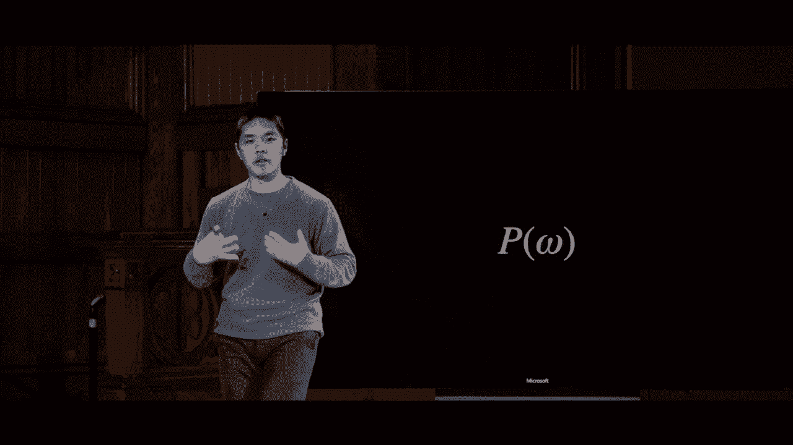

这里的概率是某个可能事件的概率。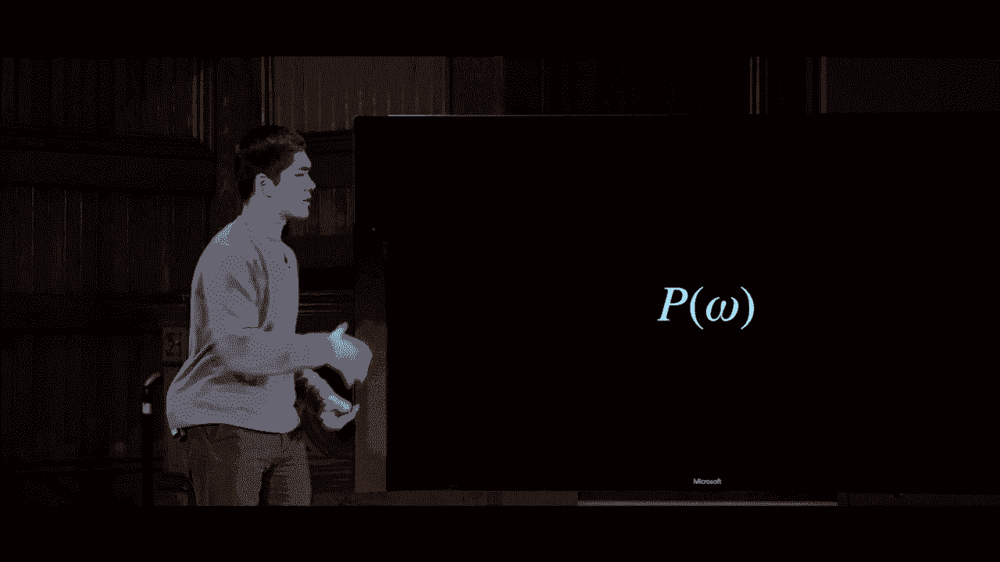

用小写字母Omega表示的世界有几个基本的概率公理在考虑如何处理概率时非常重要。首先，每个概率值必须在0到1之间，包含这两个值。

概率的另一端是0，这代表不可能发生的事件。例如，掷骰子结果为7是不可能的，如果骰子只有1到6的面，掷出7的事件概率就是0。

其数值范围到正数1，意味着某事件肯定会发生。例如，掷骰子的结果小于10是一个事件，如果我的骰子只有1到6这几个面，这个事件就一定会发生，而其值一般会有较高的范围。

概率的高值意味着事件更有可能发生，而低值则意味着事件较不可能发生。概率的另一个关键规则类似于这个Sigma符号，这个符号如果你之前没有见过，表示求和的概念。

我们将要累加一系列的值，这个Sigma符号今天会出现几次，因为在处理概率时，我们通常需要将多个个体值或个体概率相加以得到其他值，所以会看到这个符号几次。

但这个符号的意思是，如果我对所有可能的世界进行求和，Ω表示所有可能世界的集合，这意味着我对所有可能世界的概率进行求和，最终得到的就是数字1。

将所有可能世界的概率相加，最后应该得到数字1，这意味着所有概率加起来都应该等于1。例如，如果我想象我有一个公正的骰子，数字为1到6，每次掷骰子都有相等的机会。

发生的概率是1/6，因此每个概率介于0和1之间，0意味着不可能，1意味着必然。如果你将所有可能世界的概率相加，会得到数字1，我们可以表示其中任何一个。

像这样的概率，例如我们掷出数字2的概率，每6次掷骰子中大约会有一次是2，这个概率不确定，但稍微大于零，因此这都是相当简单的。

对于单个骰子来说是简单的，但随着我们的世界模型变得复杂，情况变得更加有趣。现在假设我们不仅仅处理一个骰子，而是有两个骰子，例如我这里有一个红色骰子和一个蓝色骰子，我关心的不仅是结果。

每次掷骰子我关心的是两次掷骰子的和，在这种情况下，两次掷骰子的和是3。

我该如何开始推理，例如，如果我现在有两个骰子而不是一个骰子，概率会是什么样的呢？我们可以首先考虑所有可能的世界，在这种情况下，所有可能的世界就是红色和蓝色骰子的每种组合。

我可能会得到红色骰子的结果，可能是1、2、3、4、5或6，对于每一个可能性，蓝色骰子也可以是1、2、3、4、5或6。恰巧在这种情况下，每个可能的组合是等可能的。

各种不同可能世界的可能性并不总是相同。如果你想象更复杂的模型，我们可能会尝试建立并在现实世界中表示的东西，可能并不是每个可能的世界都是等可能的。

在公平的骰子情况下，每次掷骰子，每个数字出现的机会都是一样的，我们可以认为所有这些可能的世界都是同样可能的，但即便所有可能的世界都是同样可能的，这并不一定意味着它们的和也是。

所以如果我们考虑所有这些两个数的和，比如1加1是2，1加2是3，考虑每一对可能的数字，它们的和究竟是什么，我们可以注意到这里有一些模式，并不是每个数字都是。

如果你考虑7，那么当我掷两个骰子时它们的和是7的概率是多少？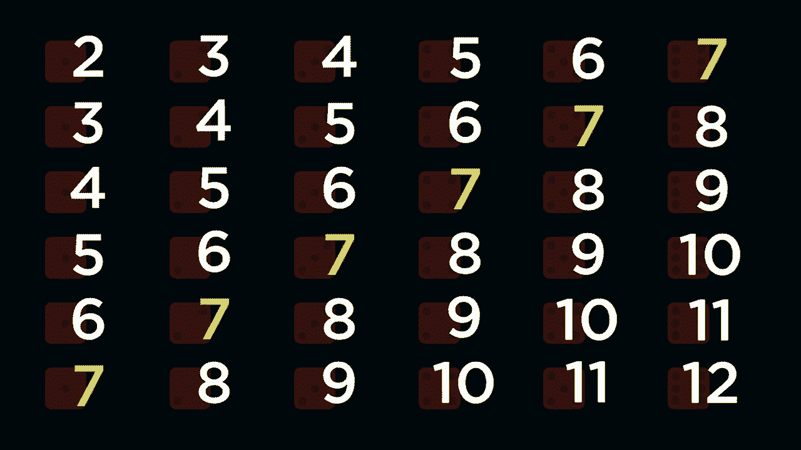

有几种方式可以实现这一点，你知道六个可能的世界，其中和是7，可能是1和6，或者是2和5，或者是3和4，或者是4和3，依此类推。但如果你考虑一下，知道我掷两个骰子，两个骰子的和是12的概率，比如说。

从这个图来看，只有一个可能的世界可以实现这一点，那就是红色骰子和蓝色骰子都是6，给我们和为12，所以仅仅通过观察这个图，我们可以看到其中一些概率可能是不同的。

和为7的概率必须大于和为12的概率，我们甚至可以更正式地表示，即和为12的概率是1/36，在这36种同样可能的情况下，6的平方，因为我们有6种红色骰子的选择。

蓝色骰子有6种选择，在那36种选择中，只有一种和为12；而另一方面，如果我们掷两个骰子，它们的和是7，在那36种可能的世界中，有6个世界的和为7，所以我们得到6/36。

简化为分数为1/6，现在我们能够表示这些不同的概率观念，代表一些可能更可能发生的事件，以及其他一些可能性较小的事件，这些判断让我们在抽象中找出。

这种事情发生的概率通常被称为无条件概率，是我们对某个命题的信念程度，对于某个世界的事实，在没有任何其他证据的情况下，如果我掷一个骰子，出现某个数字的机会是多少。

如果我掷两个骰子，那么这两个骰子的和是七的机会是多少？但通常当我们思考概率时，特别是当我们考虑训练AI能够智能地了解世界并基于此做出预测时。

信息，这不是无条件，概率，而是条件概率，概率，而不是没有。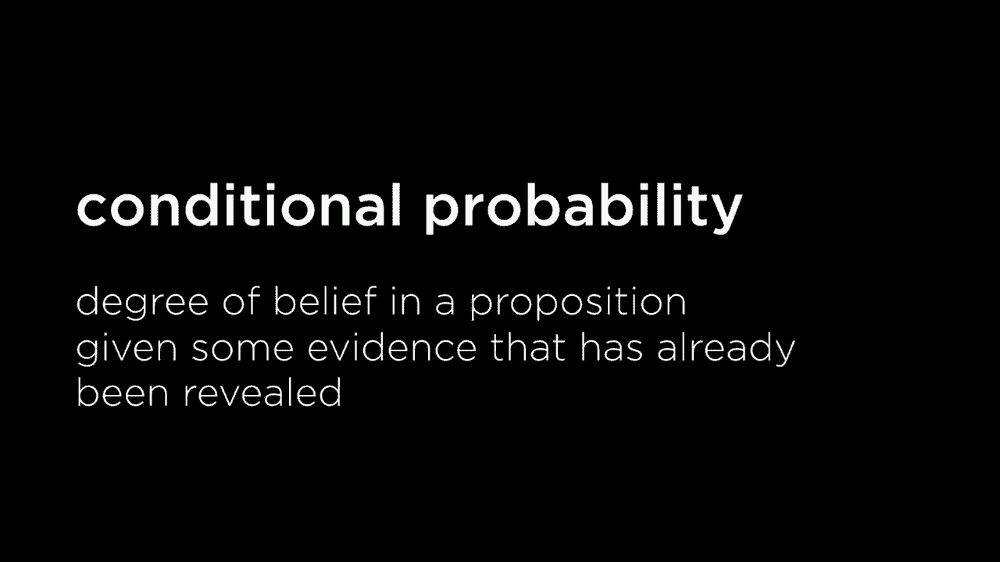

原始知识，我们对世界有一些初步，知识以及世界实际上如何运作，因此条件，概率是给定已经揭示给我们的某些证据的命题的信念程度。那么这看起来是什么样子呢？在符号方面我们将要。

将条件概率表示为，a的概率，然后是这个垂直的。条形，然后是B，读取这个的方式是，垂直条左边的东西是我们想要的，概率在这里现在我想要的。概率是a为真有一个，真实的世界，但这是事件。

实际上发生，然后在垂直条的右侧是我们的。证据，我们已经关于世界的某些已知信息。例如，B为真，因此读取整个表达式的方式是，给定B的情况下，a的概率是多少，已知a为真。

我们已经知道B为真，这种类型的判断条件概率。给定其他事实的一个事物的概率在我们思考类型时出现得很频繁，我们，可能希望我们的AI能够执行的计算。例如，我们可能关心的是，今天下雨的概率，给定我们。

我们知道昨天下雨，我们可以，考虑今天下雨的概率。抽象上今天下雨的机会是什么，但通常。我们有一些额外的证据，我知道，确实是昨天下雨，因此我想计算，今天下雨的概率。

我知道昨天下雨，或者你可能想知道，我想知道。到达目的地的最佳路线概率是否会根据当前。交通条件变化，所以无论交通条件是否变化，这可能。会改变这条路线的概率，实际上是最佳路线，或者你。

可以想象在医疗背景下，我想知道一名患者。患有特定疾病的概率，并且，给定对该患者进行的一些测试的结果，而我有一些证据，这些测试的结果，我想知道，患者患有某种疾病的概率。

特定疾病，因此条件概率的概念无处不在。随着我们开始思考，我们想要推理的内容，但。通过考虑我们已经拥有的证据，能够更智能地推理。我们更能准确地得到结果，关于什么。

是某人患有这种疾病的可能性，如果我们知道这些证据，测试的结果，反之如果我们只是计算无条件。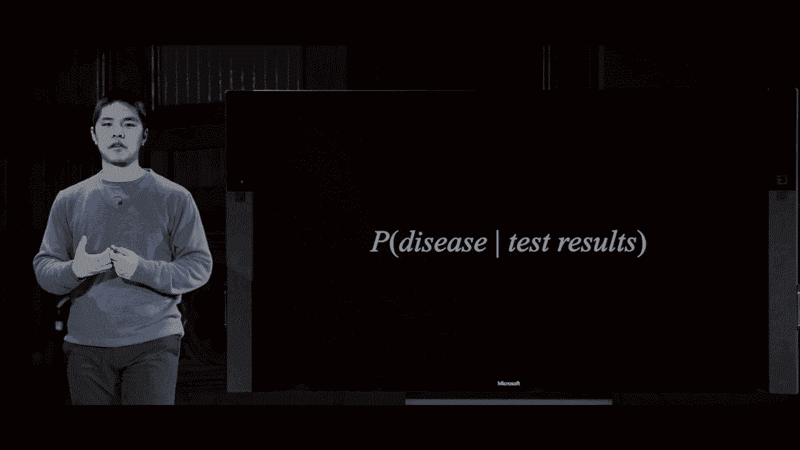

因此，我们可以开始使用这个来进行数学计算，假设他们得病的概率是什么，没有任何证据来支持我们的结果，无论如何。所以现在我们已经有了条件概率的概念，下一个问题是，好的，我们如何计算条件概率。

我们如何数学上计算，如果我有这样的表达式，我该如何从中得出一个数字，条件概率到底是什么意思。条件概率的公式看起来大致是这样的：给定 B 的情况下 a 的概率，a 为真的概率给定。

我们知道 B 为真的概率等于，a 和 B 都为真的概率与 B 为真的概率的比值。直观地考虑这个问题，如果我想知道在 B 为真的情况下，a 为真的概率，我需要考虑所有的。

它们都为真的方式是，我关心的唯一的世界是 B 已经为真的世界，我可以在某种程度上忽略 B 不为真的所有情况，因为那些与我最终的计算无关，它们与我想要获得的信息无关，所以让我们来。

看一个例子，让我们回到掷两个骰子的例子，以及这两个骰子的和可能为 12 的想法。我们之前讨论过，掷两个骰子和为 12 的无条件概率是 36 分之一，因为在 36 种可能的结果中，只有一种情况。

这两个骰子的和为十二，只有在红色为六，蓝色也为六时才成立。但现在假设我有一些额外的信息，我想知道这两个骰子的和为十二的概率，前提是我知道红色骰子是六，所以我。

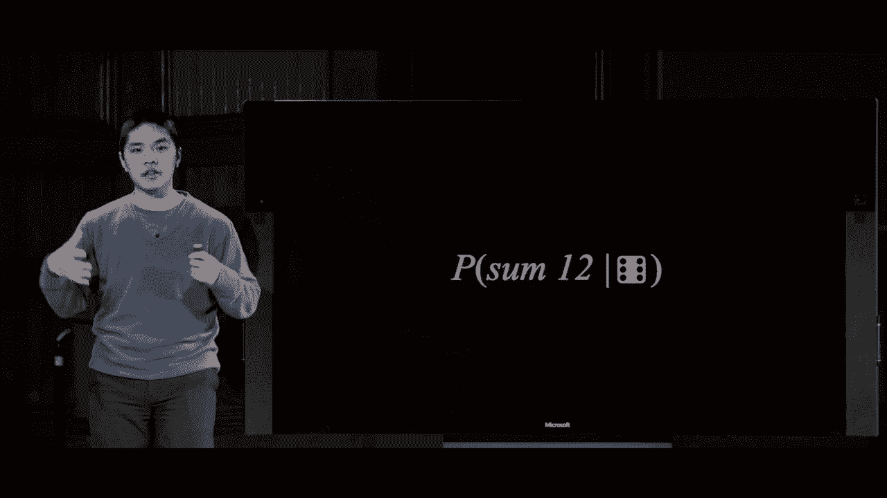

已经有了一些证据，我已经知道红色骰子是六，我不知道蓝色骰子的结果，这个信息在这个表达式中并没有给出。但考虑到我知道红色骰子是六，求这两个和为十二的概率。

从前面取出一个表达式，这里是所有的可能性，红色骰子的结果为一到六，蓝色骰子的结果也为一到六。首先，我可能会考虑，我的证据 B 变量的概率是什么，我想知道的是。

红色骰子为六的概率是六，只有一六分之一的选项，实际上这些才是我关心的唯一的世界，其他的都与我的计算无关，因为我已经有了红色骰子为六的证据，所以我不需要关心所有其他的可能性。

这可能导致现在除了红色骰子掷出 6 的事实外，我还需要知道的另一个信息是，我的两个变量 a 和 B 同时为真的概率，即红色骰子为 6 的概率。

它们的总和为 12，那么这两个事件同时发生的概率是什么呢？它只在 36 种情况中的一种发生，即红色和蓝色骰子都为 6。这个信息是我们已经知道的信息，因此这个概率是。

等于 1/36，因此为了得到给定红色骰子为 6 的情况下和为 12 的条件概率，我只需将这两个值相除，1/36 除以 1/6 给我们一个条件概率为 1/6，前提是我知道红色骰子的值为。

两个骰子和为 12 的概率也是 1/6，这对您来说可能也很直观，因为如果红色骰子是 6，唯一能让总和达到 12 的方式是蓝色骰子也掷出 6，而我们知道蓝色骰子掷出 6 的概率是 1/6，因此在这个情况下。

条件概率的计算似乎相当简单，但通过观察这两个事件同时发生的概率来计算条件概率的这个想法是一个重要的概念。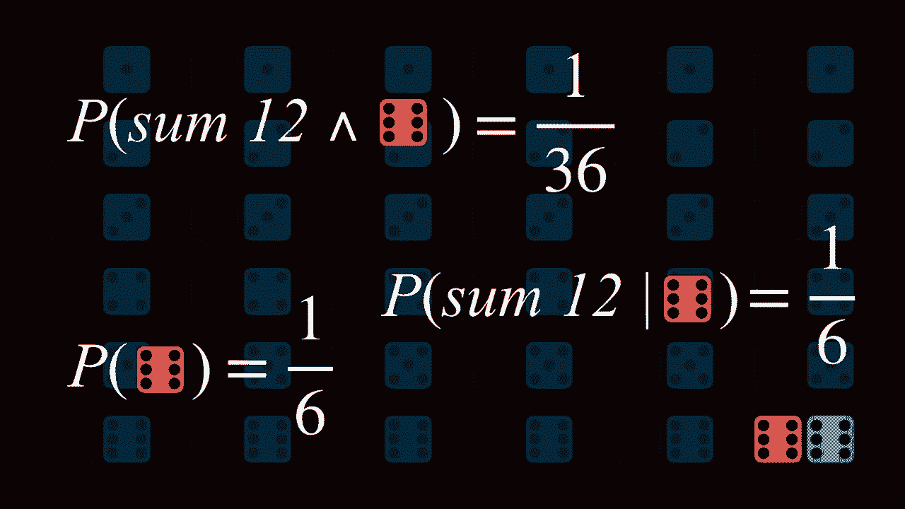

这个概念将会反复出现，这是条件概率的定义，我们将利用这个定义来更一般地思考概率，以便能够对世界得出结论。这个。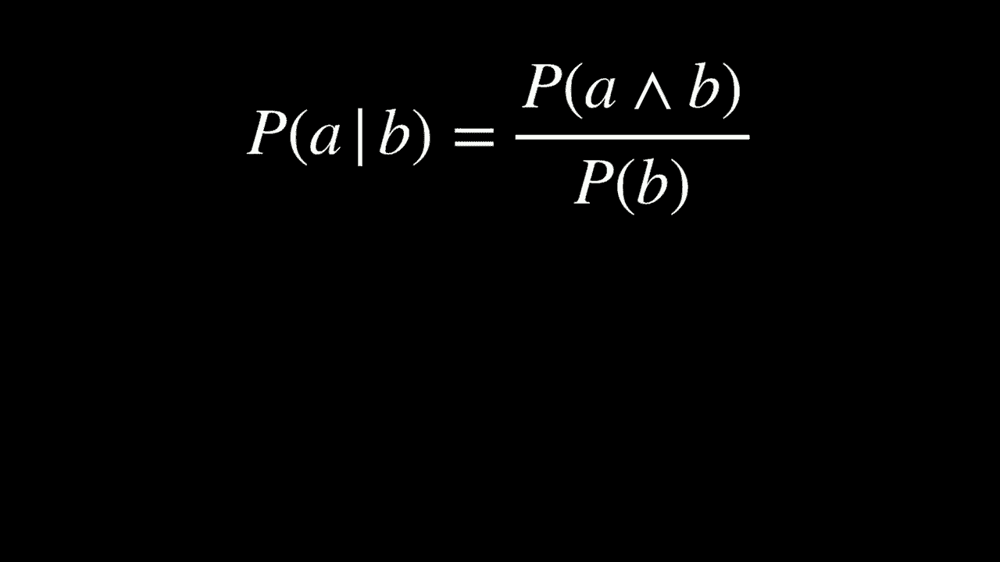

再次是这个公式，给定 B 的 a 的概率等于 a 和 B 同时发生的概率除以 B 的概率，您会看到这个。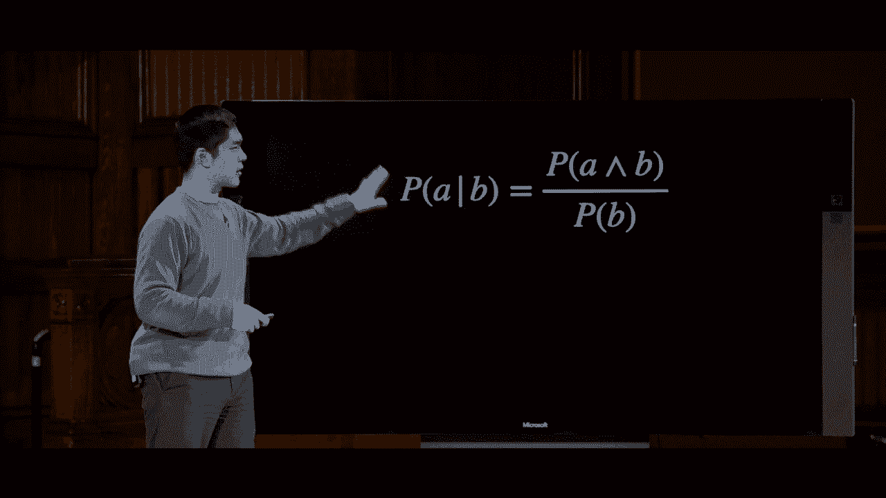

这个公式有时可以用几种不同的方式书写，您可以想象通过将这个方程的两边都乘以 B 的概率来消去分数，您将得到一个表达式，即 a 和 B 的概率，这是这里的这个表达式，它只是 B 的概率和。

给定 B 的概率乘以某个值，您也可以以等效的方式表示这一点。因为在这个表达式中 a 和 B 是可互换的，a 和 B 与 B 和 a 是一样的。您也可以想象将 a 和 B 的概率表示为给定 a 时 B 的概率乘以 a 的概率，仅需交换所有的。

A 和 B，这三种都是试图表示联合概率的等效方式，因此您有时会看到这些方程式，这可能在您开始推理概率以及思考现实世界中可能发生的值时对您有所帮助。

有时在处理概率时，我们不仅仅关心一个布尔事件，比如某事是否发生。有时，我们可能希望能够表示多个不同可能值的变量。在概率论中，我们称这样的变量为随机变量。

随机变量是概率理论中的一个变量，它有一定的取值范围。我所指的意思是，我可能有一个名为“投掷”的随机变量，它有六个可能的取值。

投掷结果是我的变量，可能的值范围是1、2、3、4、5和6。我可能想要知道每个值的概率，在这种情况下，它们恰好都是相同的，但对于其他随机变量可能就不是这样。例如，我可能有一个随机变量来表示。

以天气为例，其可能的取值范围包括：晴天、阴天、雨天、刮风天或雪天，每种情况可能有不同的概率。我关心的是，天气为**晴天**的概率，或者天气为**阴天**的概率，例如，我可能想要知道。

基于这些信息进行一些数学计算，其他随机变量可能是像**交通**那样的，比如没有交通、轻微交通或严重交通的概率。在这种情况下，交通是我的随机变量，而该随机变量可以取的值在这里。

它的可能性是没有、轻微或严重的降水，而我作为进行这些计算的人，需要决定这些可能的值究竟是什么。例如，针对航班，我可能关心的是是否能如期抵达。

我航班按时到达有几个可能的值：我的航班可能按时，可能延误，可能取消。在这个例子中，“航班”是我的随机变量，而这些是它可能的取值。我常常想要了解某些关于概率的信息。

我的随机变量取值为这些可能的值，这就是我们所称的**概率分布**。概率分布将一个随机变量与其取值的概率对应起来，所以在这个航班的例子中，我的概率分布可能看起来像这样。

我的概率分布表示随机变量“航班”按时到达的概率为0.6，换句话说，以更通俗的方式表达，我的航班按时的可能性是60%。在这种情况下，我的概率。

航班延误的概率是30%，我的航班被取消的概率是10%或0.1。如果你将所有这些可能的值相加，总和将是1。对所有可能的世界进行加和，我在这里为随机变量航班的三个可能世界，把它们加在一起，结果需要。

是我们之前提到的概率理论的第一公理，所以这现在是一种表示随机变量航班的概率，分布的方法，有时你会看到更简洁的表示，实际上这对于仅仅表达三个可能的值来说太冗长了，因此通常你会看到。

相同的符号使用向量表示，向量就是一系列的值，而不是单一的值，我可能有多个值，因此我可以扩展而不是表示这个，概念这种方式，粗体P，所以较大的P，通常意味着这个变量航班的概率分布是。

等于这个向量表示的，尖括号中的概率，分布是0.6 0.3和1，我只需要知道这个，概率分布是按时、延误或取消来解释这个向量，意味着向量中的第一个值是，我的航班按时的概率。

向量中的第二个值是我航班延误的概率，向量中的第三个值是我航班被取消的概率。因此，这只是表示这个概念的一种替代方式，有时会更冗长，但通常我们只会讨论一个概率。

随机变量的分布，每当我们谈论这个时，我们实际上是在试图弄清楚每一个可能值的概率，这个随机变量可以取的，但这种符号只是一种。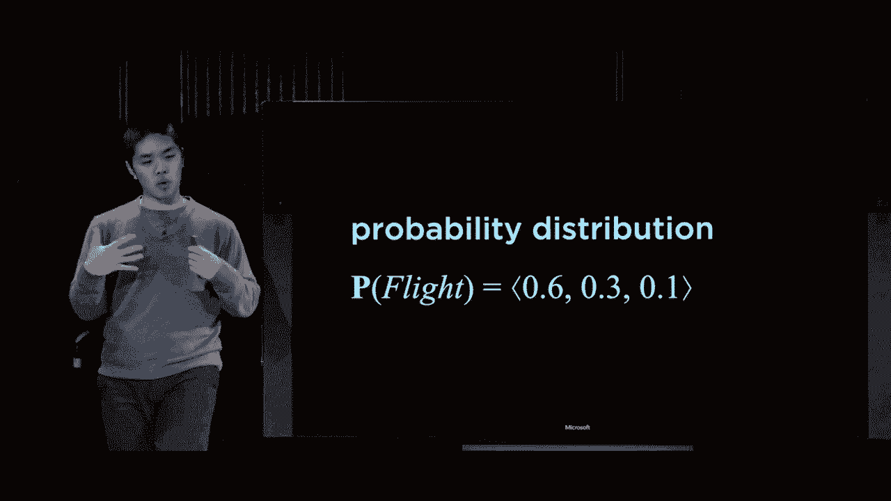

更简洁一点，尽管有时可能会有点困惑，取决于你看到它的上下文，因此我们将开始查看，使用这种符号描述概率的示例，以及描述可能发生的事件，还有几个重要的概念需要了解。

关于概率理论，一个是独立性的概念，独立性是指一个事件的知识不会影响。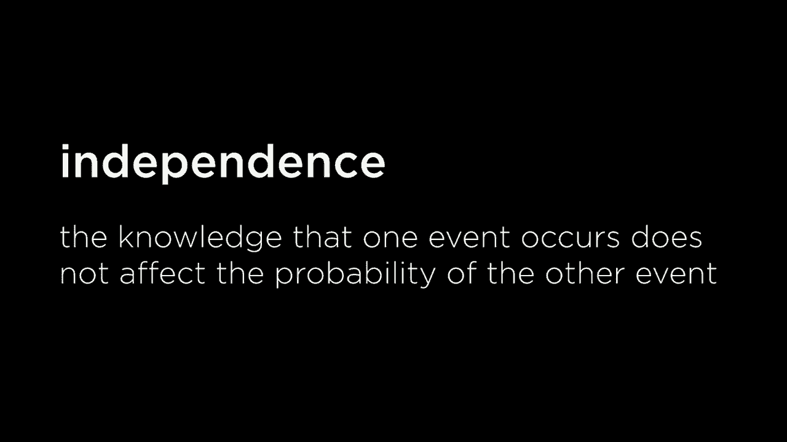

另一个事件的概率，例如在我投掷两个骰子的上下文中，我有红色骰子和蓝色骰子，投掷红色骰子和蓝色骰子的概率，这两个事件，红色骰子和蓝色骰子是独立的。知道红色骰子的结果不会改变蓝色骰子的概率。

蓝色骰子并没有给我任何关于蓝色最终值的额外信息，但这并不总是如此，你可能想象在云和雨这样的情况下，它们可能并不是独立的，如果有云，这可能会增加。

后面一天会下雨的概率，所以一些信息会影响其他事件或其他随机变量，因此独立性指的是一个事件不影响另一个事件，如果它们不是独立的，那么可能存在某种关系，因此在数学上正式。

独立性实际上意味着什么呢？回忆一下之前的公式，a 和 B 的概率是 a 的概率乘以给定 a 的 B 的概率，更直观的理解是，要知道 a 和 B 发生的可能性，首先要计算。

发生了 a，然后在知道 a 发生的情况下，让我们计算 B 发生的可能性，并将这两者相乘，但如果 a 和 B 是独立的，意味着知道 a 并不会改变 B 成真的可能性，那么给定 a 的 B 的概率实际上就是。

给定我知道 a 为真，B 成真的概率。那么我知道 a 为真实际上不应该造成太大差异，如果这两个事件是独立的，但 a 不应该影响 B，因此，给定 a 的 B 的概率实际上只是 B 的概率，如果它确实为真。

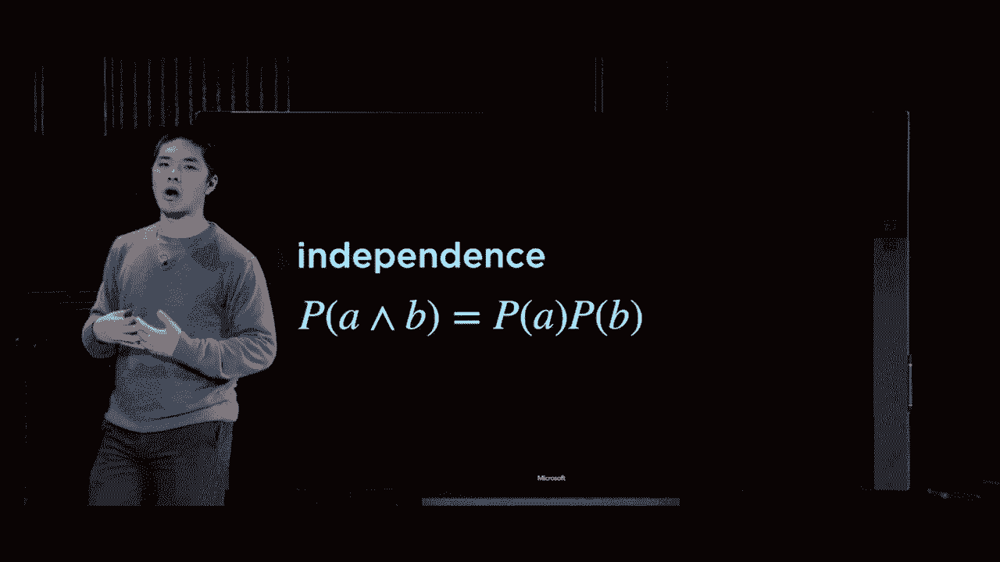

a 和 B 是独立的，所以这里是一个关于 a 和 B 独立性的定义示例，a 和 B 的概率就是 a 的概率乘以 B 的概率，每当你发现两个事件 a 和 B 之间有这种关系时，你就可以说。

a 和 B 是独立的，所以一个例子可能是我们之前查看的骰子，从红色骰子是六的概率和蓝色骰子是六的概率来看，这只是红色是六的概率乘以蓝色是六的概率，两者都等于 1/36，所以我可以说。

这两个事件是独立的，而不独立的例子，例如，这个概率是 1/36，我们之前谈过，但不独立的情况可能是这样，红色骰子掷出六点和红色骰子掷出四点的概率，如果你只是天真地认为红色。

红色骰子六，如果我只掷一次骰子，你可以想象这个天真的方法是相同的，每个骰子的概率都是 1/6，所以将它们相乘，概率是 1/36，但当然如果你只掷一次红色骰子，根本不可能得到。

红色骰子有两个不同的值，我不能同时得到六和四，所以概率应该是零。但如果你将红色六的概率乘以红色四的概率，那将等于1/36，但当然这不是事实，因为我们知道不可能有概率为零的情况。

当我们掷一次红色骰子时，我们得到六和四，因为只有一个结果。实际上可以是，因此我们可以说红色掷出六和红色掷出四这两个事件并不独立。如果我知道红色掷出的是六，我就知道红色掷出不可能是四，因此这些事情是不独立的。

如果我想计算概率，我需要使用这个条件概率，作为两个事件发生的常规概率定义。现在红色掷出的概率是，这个乘法我们得到的。

得到六的概率是1/6，但已知掷出的是六的情况下，掷出四的概率是多少呢？这实际上是零，因为在我们已经知道红色掷出的是六的情况下，红色掷出不可能是四，因此，如果我们计算这个值。

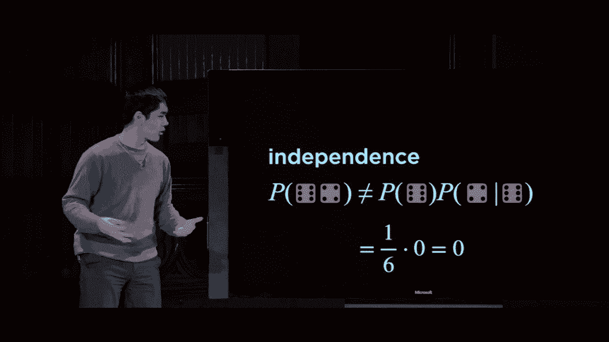

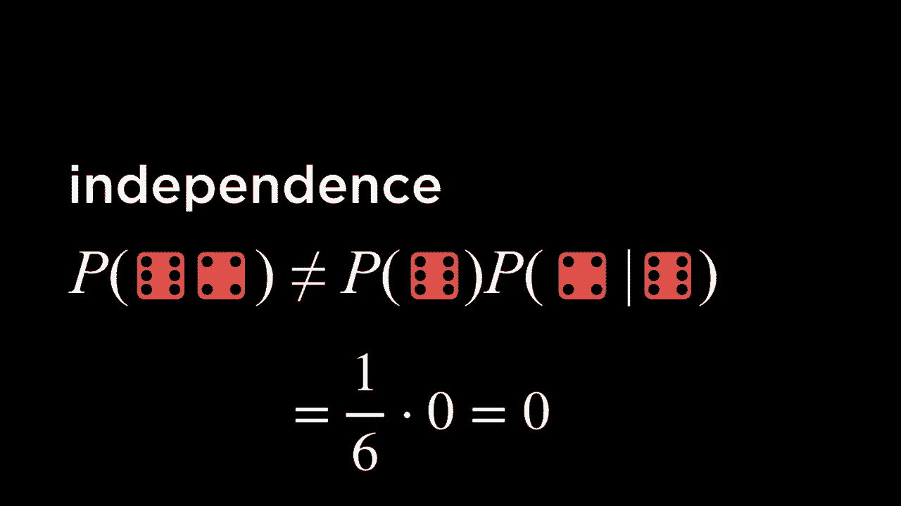

零这个数字。因此，这个条件概率的概念会反复出现，尤其是当我们开始推理多个可能相互作用的随机变量时，这引导我们进入概率论中一个非常重要的规则。

贝叶斯定理结果表明，只要使用我们已经学到的概率信息，并稍微应用一点代数，我们实际上可以自己推导出贝叶斯定理。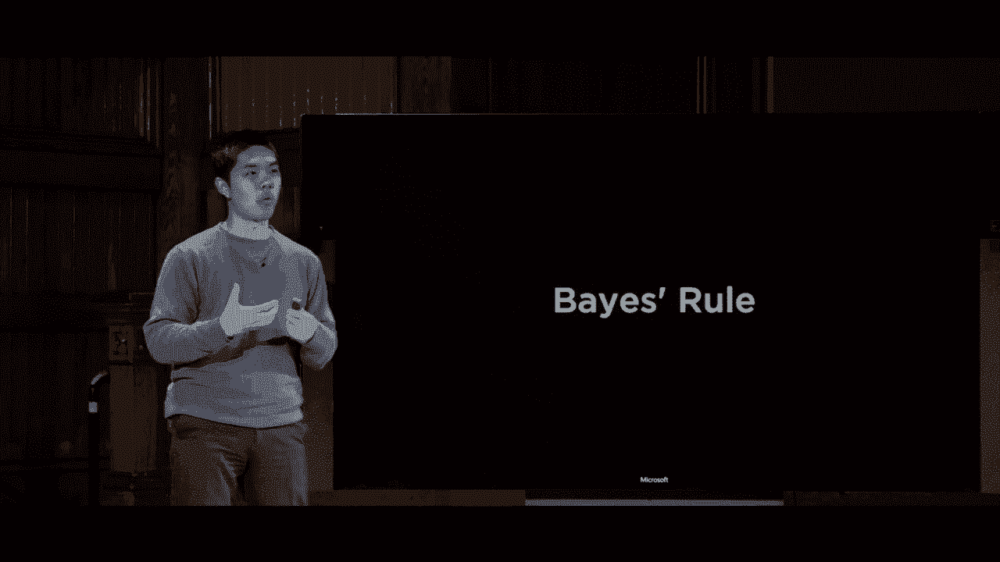

但在推理时，这是一个非常重要的规则，尤其是在考虑概率的上下文时。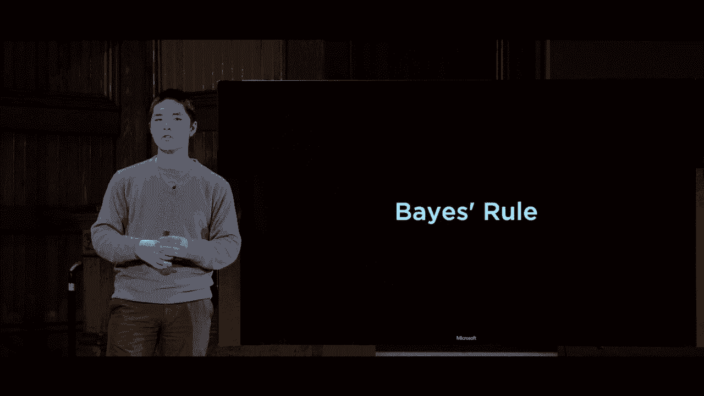

计算机能做的，或者数学家可以通过访问关于概率的信息来做到的，因此让我们回到这些方程，能够自己推导出贝叶斯定理。我们知道A和B的概率，A和B发生的可能性是B的可能性，然后是已知B为真的情况下A的可能性。

同样，已知A和B的情况下A的概率是A的概率乘以已知A为真的情况下B的概率。这是一种对称关系，A和B的顺序并不重要，B和A意味着相同的事，因此在这些中。

方程中我们可以直接将a和B互换，以表示完全相同的。概念，所以我们知道这两个方程已经成立，我们已经看到了。现在让我们对这些内容进行一些代数运算，右侧的两个表达式都等于a和B的概率。

所以我可以将这两个右侧的表达式设为相等，如果它们都等于a和B的概率，那么它们也必然相等。因此，a的概率乘以给定a的B的概率等于B的概率。

乘以给定B的a的概率，现在我们要做的只是进行一些简单的除法，我将两边都除以a的概率，现在我得到的是。贝叶斯规则，给定a时B的概率，等于B的概率乘以给定B的a的概率除以，a的概率，有时在。

贝叶斯规则中你会看到这两个参数的顺序交换，所以不再是B。乘以给定B的a，而是给定B的a乘以B，最终这并不重要，因为在乘法中你可以交换两个数的顺序，而不会改变结果，但目前这是。

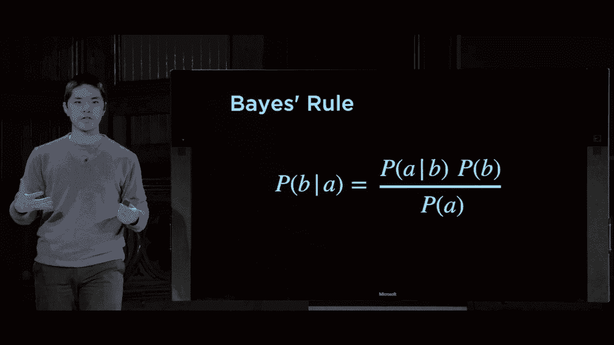

贝叶斯规则的最常见公式是，给定a时B的概率等于。给定B的a的概率乘以，B的概率除以。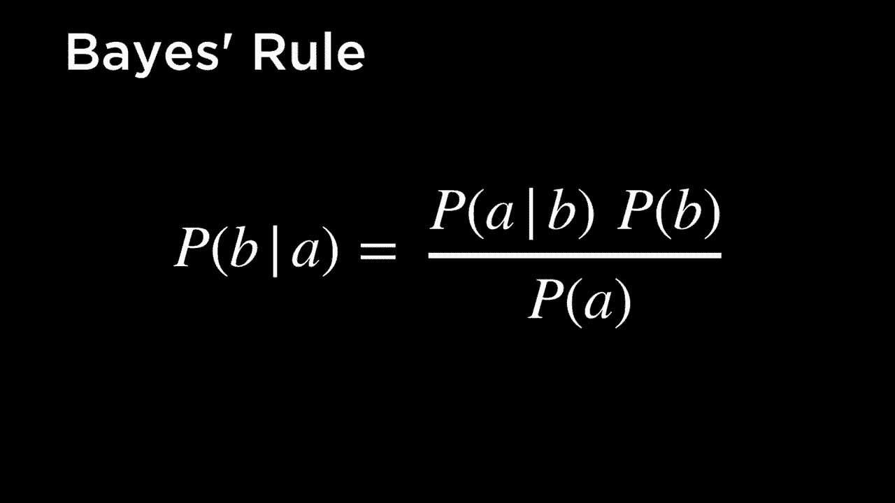

a的概率，这个规则在推断世界事物时非常重要，因为它意味着你可以表达一个。条件概率，即给定a时B的条件概率，使用关于给定B的a的概率的知识，使用反向的关系。

条件概率，所以我们先做一个小示例。看看我们可能如何使用它，然后，更一般地探讨这意味着什么，所以我们将构造一个我有一些信息的情况，涉及两个我关心的事件，即早上有云的想法。

早上以及下午下雨的想法，这两者是。

可能发生的不同事件，比如早上阴天或，下午下雨。对我来说，关心的是早上有云的情况下，下午下雨的概率，这是一个我可能在早上会问的问题，我向外看，或者用相机观察外面，看到早上的云。

我们想得出结论，想弄清楚下午下雨的概率，当然在抽象上我们没有。获取这类信息的渠道，但我们可以利用数据来开始尝试。弄清楚这一点，所以现在假设我有一些信息。

我可以获取的信息是，80%的雨天下午是以多云的早晨开始的。你可能想象我可以通过查看一段时间的数据来收集这些信息，但我知道80%的情况下，当下午下雨时，早晨是多云的。

我还知道40%的日子是多云的。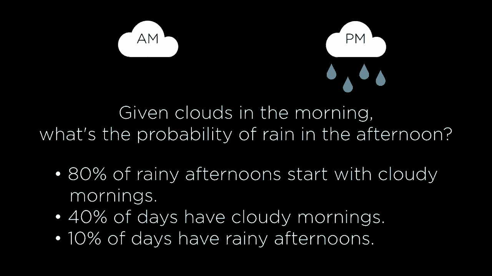

早晨我也知道10%的日子会有雨天，现在利用这些信息，我想知道早晨有云的情况下，下午下雨的概率。我想知道在早晨有云的情况下，下午下雨的概率，我可以特别使用这个方法。

这个事实的概率。如果我知道80%的雨天下午是以多云的早晨开始的，那么我知道在雨天下午情况下，多云早晨的概率。因此使用贝叶斯规则来表达，这看起来是这样的：给定云的情况下下雨的概率是。

早晨有云的概率乘以下雨的概率，再除以云的概率。在这里，我只是将这个方程中A和B的值代入。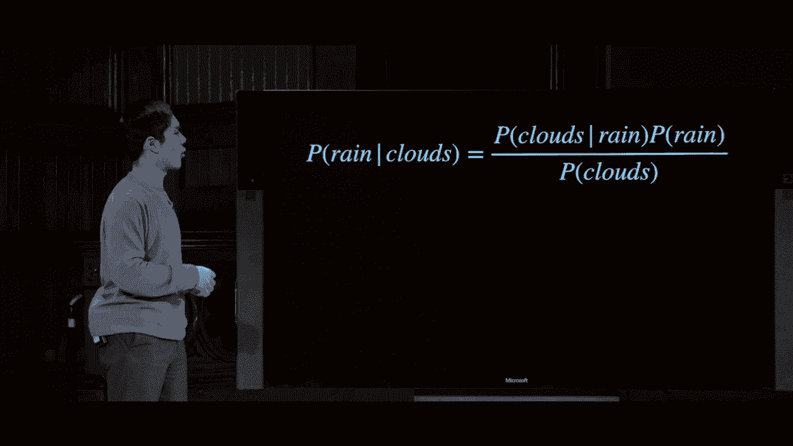

之前的贝叶斯规则，然后我可以进行计算。我知道如果下雨，那么早晨有云的概率是80%。这里降雨的概率是0.1，因为10%的日子有雨，40%的日子是多云。我算出答案是0.2。

所以在早晨多云的情况下，下午下雨的概率是0.2，这就是贝叶斯规则的应用，利用一个条件概率我们可以获得反向的条件概率，这在有一个条件概率时往往是有用的。

条件概率可能更容易让我们知道，或者更容易有数据，而利用这些信息，我们可以计算其他条件概率。那么这看起来是什么样子呢？这意味着知道在雨天下午情况下多云早晨的概率，我们可以。

计算在多云的早晨情况下，下午下雨的概率，或者更一般地说，如果我们知道某些可见效果的概率，也就是我们能看到和观察到的效果，假设有一些我们不确定的未知原因，那么我们可以计算出这个未知原因的概率。

因为可见的效果，所以是什么原因呢？在医学的背景下，我可能知道某些医疗测试结果的概率，假设有一种疾病，我知道如果某人有这种疾病，那么X%的情况下，医疗测试结果将会显示为这种情况。

有了这些信息，我就可以计算，好的，给定我知道医学测试结果，某人患有疾病的可能性，这是一条通常更容易知道的信息，更容易立即获取数据的信息，而这正是我。

我可能想计算，或者想知道，例如，如果我知道什么。某些伪钞的概率，它们在边缘有模糊的文字，因为伪造打印机，打印文字的精度远不如。

例如，X百分比的伪钞具有模糊的文字，利用这些信息，我可以计算一些我可能想知道的信息，例如，给定我知道某张钞票上有模糊的文字。那张钞票是伪钞的概率是多少，所以给定一个条件。

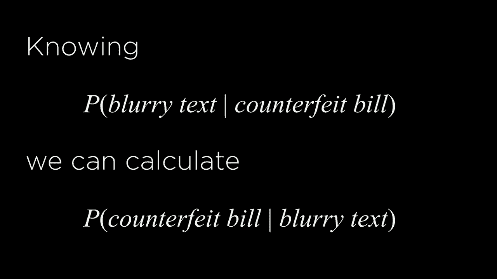

我可以计算其他条件概率，因此。现在我们已经看了一些不同类型的概率，我们已经。看过无条件概率，看看发生此事件的概率是多少，给定没有额外证据的情况下。

可能会访问，并且我们还看过条件概率。在这种情况下，我有某种证据，我希望能够利用这些证据。
