# 哈佛CS50-AI ｜ Python人工智能入门(2020·完整版) - P9：L2- 不确定性 2 (联合概率，贝叶斯网络) - ShowMeAI - BV1AQ4y1y7wy

还计算其他的概率，另一种对我们思考很重要的概率是联合概率，这涉及到同时考虑多个不同事件的可能性。那么我们所说的是什么呢？例如，我可能有。

概率分布看起来像这样，哦，我想知道早上的云的概率分布，而这个分布看起来是这样的，40%的时间我这个随机变量等于阴天，60%的时间则不是阴天。

这里只是一个简单的概率分布，有效地告诉我们。

我知道40%的时间是阴天，我也可能有一个概率分布来表示下午下雨的情况。

在10%的时间里，或者概率为0.1时，下午下雨，而概率为0.9时，下午不下雨，利用这两条信息，我实际上对这两个变量之间的关系并没有太多的信息，但我。

如果我能访问他们的联合概率，意味着每一种组合的情况，包括早上阴天和下午下雨、早上阴天和下午不下雨、早上不阴天和下午下雨、以及早上不阴天和下午不下雨。

如果我能访问这四个值的情况，我会获得更多的信息，因此可以将这些信息整理成一个像这样的表格，而这个表格不仅仅是概率分布，而是联合概率分布，它告诉我每种可能的概率分布。

这些随机变量可以取值的组合，所以如果我想知道在任何给定的日子里同时阴天和下雨的概率，我会说，好吧，查看阴天和下雨的情况，以及这两者的交集，那一行。

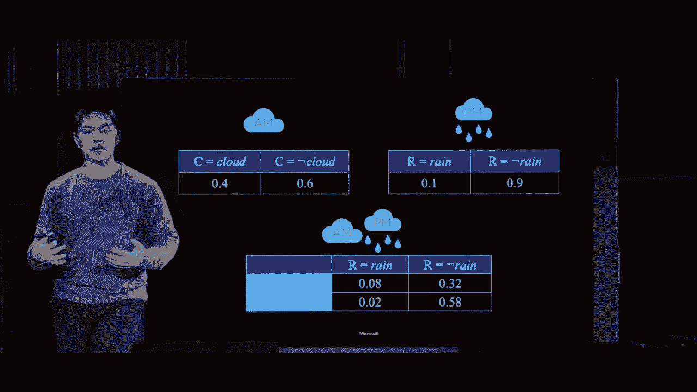

那一列是0.08，这就是同时阴天和下雨的概率，利用这条信息和这个条件概率表，我可以开始推导关于条件概率等其他信息，所以我可能会问一个问题，比如概率是多少。

已知下雨情况下的云分布，意味着我确定下雨。告诉我已知的情况下，云层是否存在的概率分布。这里我用C来表示这个随机变量，我在寻找一个。

分布的意思是，答案不是一个单一的值，而是两个值，一个由两个组成的向量，第一个值是云的概率，第二个值是非云的概率，但这两个值的和必然是1，因为当你加起来的时候。

所有可能世界的概率以及你得到的结果必须是数字1。那么我们知道如何计算条件概率的知识是什么呢？我们知道，给定B的概率是A与B的联合概率除以B的概率。那么这意味着什么呢？

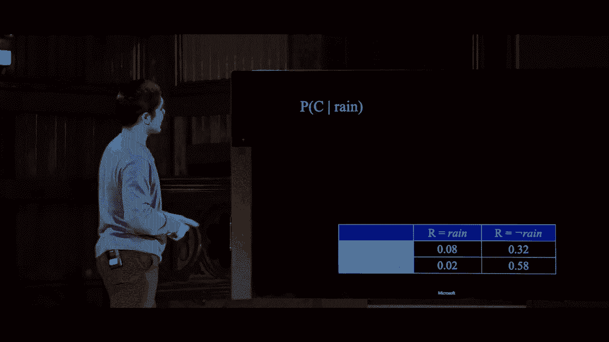

这意味着我可以计算在下雨的情况下云的概率。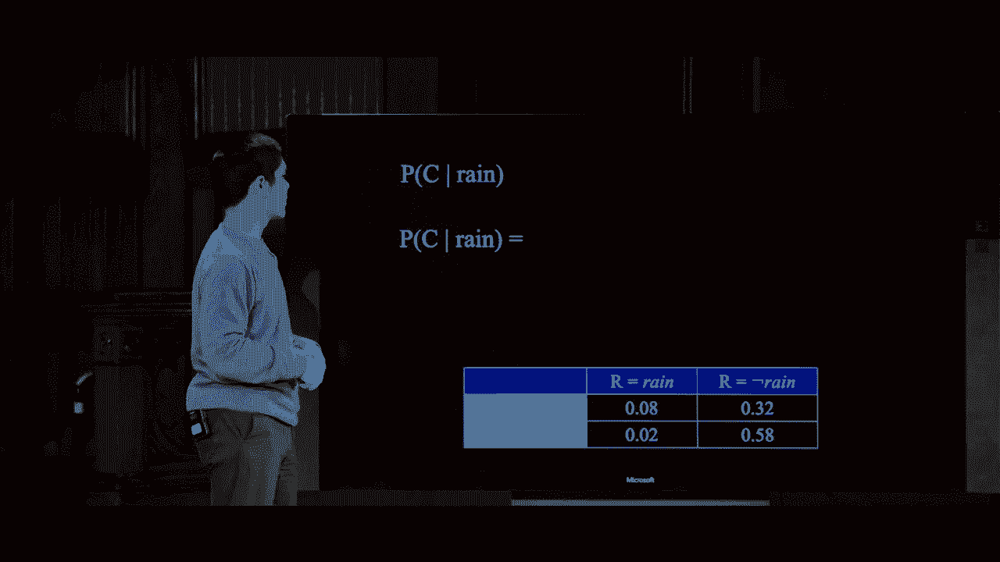

下雨的概率是云的概率和下雨的联合概率除以下雨的概率，而这里的逗号是为了云的概率分布。

雨，这里的逗号代表“和”，你会发现逻辑运算符“和”和逗号是可以互换使用的。这意味着云的概率分布和知道下雨的事实除以下雨的概率，而值得注意的是。

为了简化我们的数学运算，我们通常会这样做：除以下雨的概率。这里的下雨概率仅仅是一个数值常量。除以下雨的概率就只是除以某个常量，换句话说，就是乘以该常量的逆。

很多时候我们可以不担心这个值的准确性，只需知道它实际上是一个常量，我们稍后会看到原因。因此，我们有时会将其表示为α乘以。

这里的分子是C这个变量的概率分布，而我们知道它正在下雨。例如，我们在这里所做的只是将这个值1除以下雨的概率，这实际上只是我们将要除以的一个常量，或者等效地，在最后乘以它的逆。

我们暂时称它为α，稍后再处理。但这里的关键思想，现在这个想法将再次出现，即在给定下雨的情况下，C的条件分布是成比例的，意味着只是某个因子乘以C与下雨同时成立的联合概率。

那么我们怎么解决这个问题呢？这将是已知下雨时的云的概率，值为0.08；以及已知下雨时的非云的概率，值为0.02，因此我们得到的α乘以这里的概率分布，0.08是云和雨，0.02是非云。

云和雨，但当然0.08和0.02的和并不等于1，而我们知道在。

概率分布如果你考虑所有可能的值，它们的总和必须为 1，因此我们知道，只需要找出一个常数来归一化这些值，可以说是用某个数乘或除，以便使所有的概率总和为 1。  

如果我们将这两个数字都乘以 10，那么结果就可以得到 0.8，比例依然是等效的，但现在 0.8 加 0.2 的总和为 1。因此，请查看这个，看看你能否一步一步理解我们如何从一个点到另一个点，但这里的关键思想。  

通过使用联合概率，这些概率是同时阴天和下雨，以及不阴天和下雨的概率。我可以利用这些信息，计算在下雨的情况下，阴天的概率与不阴天的概率。  

乘以某个归一化常数，可以说计算机可以开始做到这一点，与这些不同类型的概率互动，结果是有许多其他的概率规则将对我们有用，当我们开始。

探索我们如何实际利用这些信息进行更复杂的概率和分布以及随机变量分析，以便与之互动，所以这里有几个重要的概率规则，其中最简单的规则之一就是。  

  

这个否定规则是什么，事件 a 不发生的概率是怎样的？事件有一定的概率，我想知道 a 不发生的概率是什么。  

结果是 1 减去 a 的概率。  

这很有意义，因为这两种情况要么 a 发生，要么 a 不发生，那么加起来就会。  

在这两种情况下，你必须得到 1，这意味着 a 不发生的概率必须是 1 减去 a 的概率，因为 a 的概率和不发生 a 的概率必须加起来等于 1。它们必须包括所有可能的情况，我们已经看到了计算 a 和 B 概率的表达式，我们可能还希望合理地计算。  

概率 A 或 B 的问题是，某件事情发生或另一件事情发生的概率是什么？例如，我可能想计算如果我掷两个骰子，一个红色，一个蓝色，a 为六的概率或 B 为六的概率，像是其中一个发生。  

错误的方法是，仅仅说好吧，A出现为六，红色骰子出现为六的概率是六分之一，蓝色骰子也是六分之一，把它们加在一起就得到六分之二，也就是三分之一，但这存在一个问题。

双重计数了红色骰子和蓝色骰子都出现为六的情况，我已经计数了这个实例两次。因此，为了解决这个问题，计算A或B的实际表达式使用了我们称之为包含-排除公式的东西。我们将A的概率加上。 

B的概率和之前一样，但我需要排除我已经双重计数的情况，所以我从中减去。

A和B的概率，这给我结果是A或B，我考虑A为真的所有情况和B为真的所有情况。如果你想象这是一个A为真和B为真的情况的维恩图，我只需减去中间部分，以去掉我多余的情况。

通过在这两个个别表达式中双重计数而得到的。另一个非常有用的规则是一个叫做边际化的规则。某种边际化是在回答这样一个问题：我如何使用一些我可能接触到的其他变量来计算A的概率。

即使我对B没有额外的信息，我也知道B某个事件可以有两个可能的状态，要么B发生，要么B不发生。假设它是布尔值，真或假。

这意味着，对于我来说，要计算A的概率，只有两种情况，要么A发生且B发生，要么A发生且B不发生，这两种情况是互斥的，意味着它们不能同时发生。要么B发生，要么B不发生，它们是互斥的或分开的。

所以我可以通过将这两个情况相加来计算A的概率，A为真的概率是A和B为真的概率加上A为真的概率和。

B不为真，所以通过边际化，我看到了可能发生的两种情况，要么B发生，要么B不发生，在这两种情况下，我查看A发生的概率，如果我把这些加在一起，那么我就得到了这个概率。

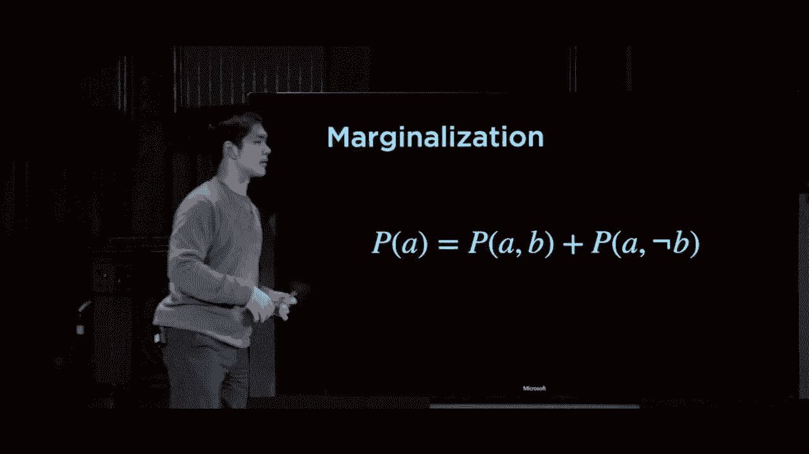

事件整体发生，所以看看这个规则，B是什么并不重要。

或者它与A的关系如何，只要我知道这些联合分布，我就能计算出A的整体概率。如果我有像A和B的联合分布这样的联合分布，这可能是一个有用的方法，只需计算一些无条件概率，比如。

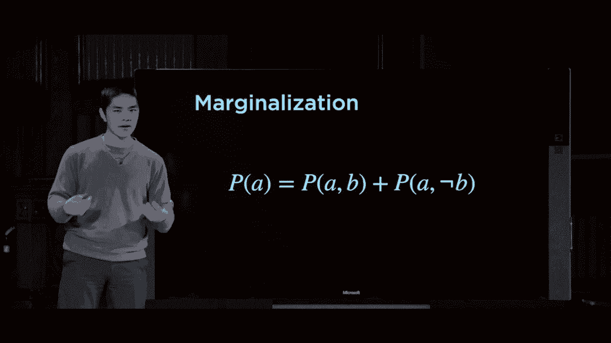

A的概率，我们很快也会看到这些示例。有时，这些变量不仅仅是随机变量，可能不是像B那样的事件，它们发生了或没有发生，可能存在一些更广泛的概率分布，其中有多个。

所有可能值，因此在这里，为了使用这个边际化规则，我需要对所有其他随机变量可能取的值进行求和，而不仅仅是B。因此在这里我们将看到一个关于随机变量的规则版本，它将包括求和符号，以表示我正在进行求和。

对一大堆个体值进行求和，因此这个规则看起来更复杂，但实际上是。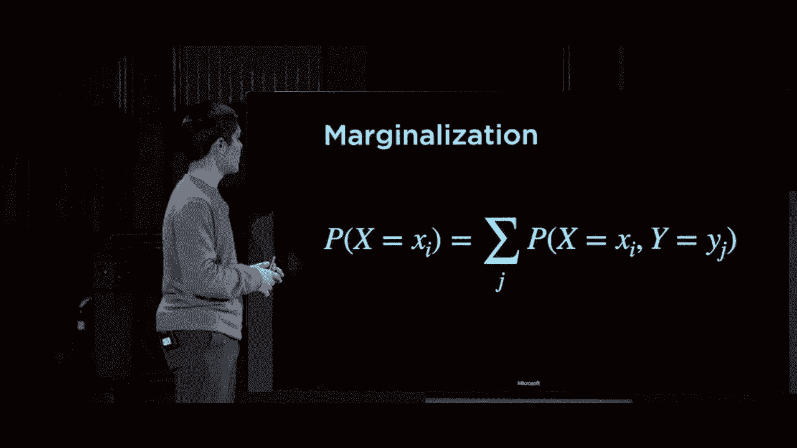

这完全是相同的规则，我在这里所说的是，如果我有两个随机变量，一个叫X，一个叫Y，那么X等于某个值X子I的概率，这只是该变量所取的某个值。我该如何计算呢？我将对J进行求和，J的范围将是某个值X子I。

针对Y可以取的所有可能值，让我们看看X等于X子I和Y等于Y子J的概率。因此，这正是相同的规则。

唯一的不同在于，现在我正在对Y可以取的所有可能值进行求和，也就是说，让我们将所有这些可能的情况加起来，看看这个联合分布在给定所有可能的Y值的情况下，X取我关心的值的概率。

如果我将所有这些加起来，那么我就可以得到X等于某个值的无条件概率，无论X是否等于。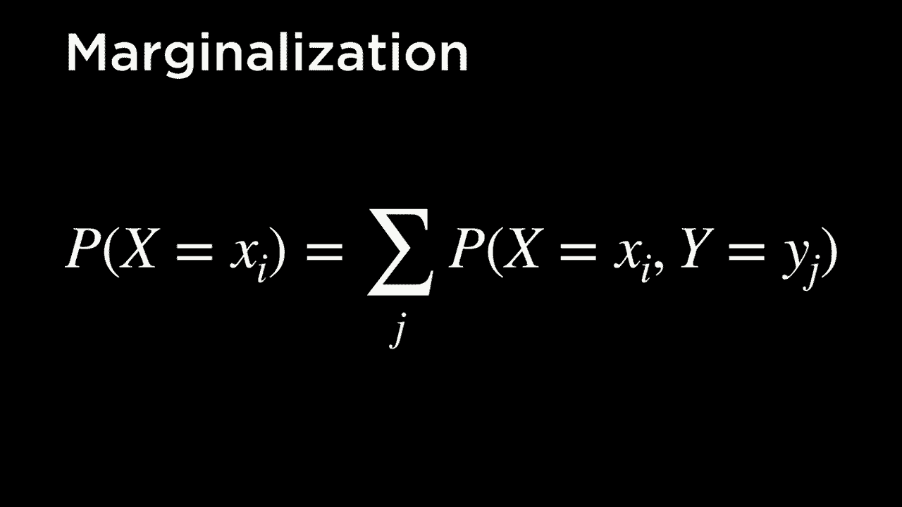

让我们来看一下这个规则，因为它看起来有点复杂，让我们试着给它一个具体的例子。这是之前提到的同一个联合分布，我有“多云”、“不多云”、“下雨”、“不下雨”。也许我想访问某个变量，我想知道“多云”的概率是多少。

边际化说，如果我有这个联合分布，我想知道的概率是。

如果是多云的话，我需要考虑另一个变量，也就是这里没有的变量，想法是它在下雨，我考虑了这两种情况：要么下雨，要么不下雨，我只需将每种可能的值相加。换句话说，云的概率等于。

求和“多云且下雨”的概率，以及“多云且不下雨”的概率，因此这些现在是我可以访问的值，这些值就位于这个联合概率表中。那么，既多云又下雨的概率是多少？这只是。

这两者的交集是，点零八，概率是多云而不下雨，好的，这里是多云，这里是不下雨，是0.32。因此是点零八加0.32，等于零点四，这就是无条件概率，实际上是多云的，因此边际化为我们提供了一种方式来。

从这些联合分布转到，我可能关心的一些个体概率，你会稍后看到为什么我们关心这一点，为什么这对我们在进行一些计算时实际上有用。最后的规则，我们将在过渡到某些内容之前看看。

有点不同的是，条件化规则与边际化规则非常相似，但它说，如果我有两个事件a和B，但不是访问它们的联合概率，而是访问它们的条件概率，它们之间的关系如何。如果我。

想知道a发生的概率，并且我知道有一些。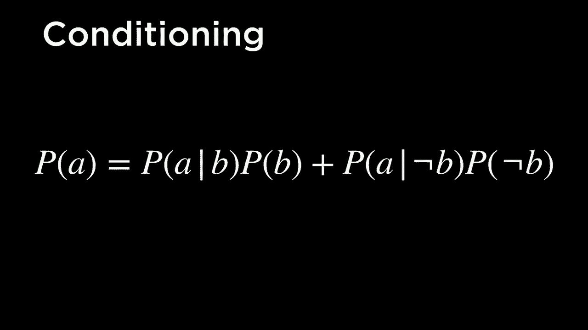

另一个变量B要么发生，要么不发生，因此我可以说，a的概率是给定B时a的概率乘以B的概率。意思是B发生了，给定我知道，B发生了，a发生的可能性是什么。然后我考虑其他。

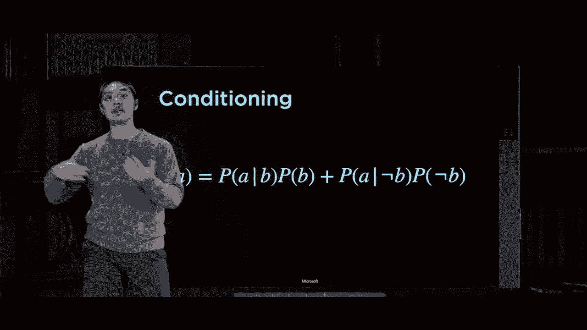

B没有发生的情况，因此这是B没有发生的概率。

这是a发生的概率，给定我知道B没有发生。

这实际上是等价规则，只是使用条件概率，而不是联合概率，我在说让我们看看这两种情况，并以B为条件，看看B发生的情况，看看B不发生的情况。

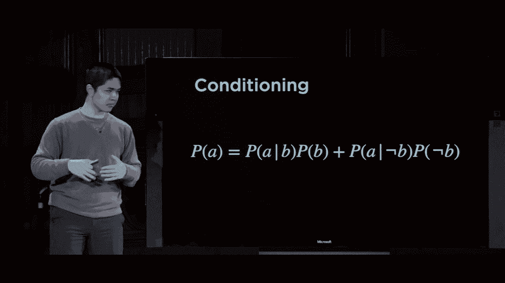

我得到的概率结果，正如在边际化的情况下，针对可能在值域中采取多个可能值的随机变量有一个等价规则一样，条件化也有同样的等价规则，再次出现求和意味着我正在对所有进行求和。

随机变量Y可能采取的一些可能值，但如果我想知道X采取这个值的概率，那么我将对Y可能采取的所有值J进行求和，并说，好的，Y采取的机会是什么。

在那个值YJ上并将其乘以X采取的条件概率。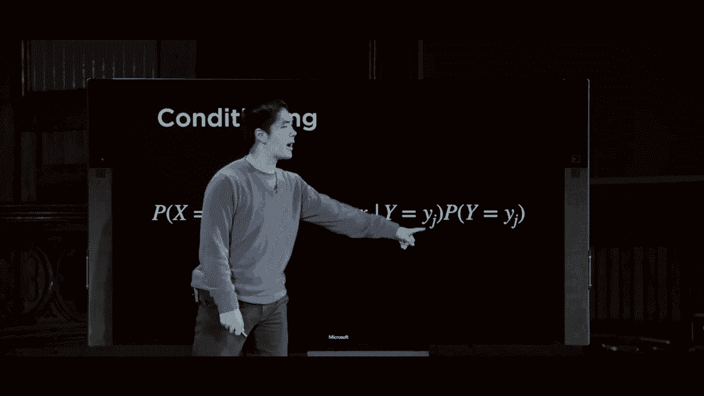

这个值给定Y采取了那个，值YJ，因此等价规则只是使用。

条件概率而不是联合概率，利用我们对联合概率的理解可以在这两者之间转换。所以好吧，我们已经看到很多数学，我们只是奠定了数学的基础，如果你对概率还没有看到太多细节，也不需要担心。

到目前为止，这些是我们开始探索如何将这些概率思想应用于计算机内部、我们正在设计的AI代理的基础。

能够表示信息、概率和各种事件之间的可能性，因此我们可以生成许多不同的概率模型，但我们要讨论的第一个模型是被称为贝叶斯网络的水。

一些随机变量的网络。

连接的随机变量将表示这些随机变量之间的依赖关系，实际上这个世界上的大多数随机变量并不是彼此独立的，它们之间存在某种我们关心的事物之间的关系。如果今天下雨，你知道这可能会。

增加我的航班或火车延误的可能性，例如，这些随机变量之间存在一些依赖关系，而贝叶斯网络能够捕捉这些依赖性。那么，什么是贝叶斯网络，它的实际结构是什么，以及它是如何工作的呢？贝叶斯网络将是一个。

有向图，我们之前见过有向图，它们是带有箭头或边的单独节点，连接一个节点到另一个节点，指向特定方向，因此这个有向图将有节点，其中每个节点将在这个有向图中代表一个。

随机变量类似于天气或我的火车是否准时到达，我们将有一条箭头从节点X指向节点Y，表示X是Y的父节点，这将是我们的符号，如果有一条箭头从X到Y，X将被视为Y的父节点，这一点很重要。

因为每个节点将有一个概率分布，我们将与之存储的分布是给定一些证据和X的父节点的X的分布。所以更直观地思考这种方式，父节点可以看作是某些我们想要研究的效果的原因。

观察，因此让我们看一个贝叶斯网络的实际例子，思考推理该网络可能涉及的逻辑。假设我有一个城外的约会，我需要乘火车去。

约会，我可能关心的事情是什么呢？我关心的是能否准时到达约会，要么我能准时到达并参加，要么我错过了这个约会，而你可以想象这受到了火车的影响，火车要么准时，要么延误。

例如，火车本身的运行也受到影响，火车是否准时可能取决于天气，比如说雨，知道吗？如果没有雨，可能是小雨，或者是大雨，此外，还可能受到其他变量的影响。

比如说，如果铁轨上有维护工作，那可能会增加我的火车延误的可能性，因此我们可以用一个贝叶斯网络来表示所有这些想法，它看起来是这样的，这里我有四个节点代表四个。

我想跟踪的随机变量有一个叫雨的，它可以在其领域中取三个可能的值：没有雨、小雨或大雨。还有一个变量叫维护，用于表示铁轨上是否有维护工作。

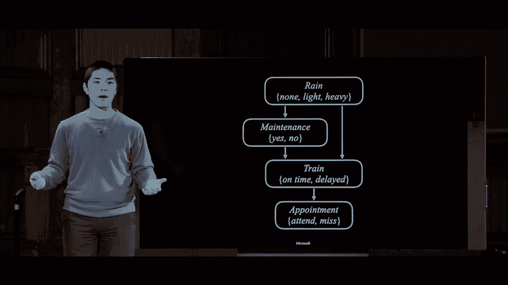

这有两个可能的值，要么是有维护，要么是没有维护，接着我有一个随机变量表示火车是否准时，这个随机变量在其领域内有两个可能的值，火车。

火车要么准时，要么延误，最后我有一个随机变量用于表示我是否能到达约会，我的约会随机变量有两个可能的值：参加和错过，这里有我四个可能的值。

节点，每个节点代表一个随机变量，每个节点都有可能的值域，箭头表示边。

从一个节点指向另一个节点的箭头编码了这个图中的某种依赖关系，我是否能准时到达约会取决于火车是否准时，而火车是否准时则取决于由指向这个节点的两个箭头给出的两个因素。

这些节点之间的关系可能会有所不同，但这个概念是依赖于铁轨上是否有维护工作，同时也依赖于是否下雨，或者现在是否在下雨。为了让事情变得复杂一点，假设铁轨维护的情况也可能受到影响。

比如说，雨，如果下大雨，那可能意味着当天进行铁轨维护的可能性会减少，因为他们更倾向于在不下雨的日子进行维护。

我们可以基于父节点为这些节点构建概率分布，因此让我们逐个查看这个概率分布可能实际是什么样子，我们将从这个根节点开始，即雨的节点，这个节点在顶部，没有下雨。

指向它的箭头意味着它的概率分布将不是条件分布，它不是基于任何东西，我只是对可能的雨水随机值有一些概率分布。

变量的分布可能看起来像这样：没有雨、小雨和大雨每种情况都有一个概率分布。

这里可能的值是我说没有雨的概率是0.7，轻微降雨的概率是0。

雨的概率是0.2，大雨的概率是0.1，例如，这里是这个贝叶斯网络中根节点的概率分布。现在我们考虑网络中的下一个节点：轨道维护是有还是没有，通常这个分布要编码的想法是，雨越大，轨道维护的可能性就越小，因为进行轨道维护的人可能想等到不那么潮湿的日子再进行维护。

进行轨道维护的前提是下雨，例如，这个概率分布可能是什么样的，这将是一个条件概率分布，这里是雨水随机变量的三个可能值，我将在这里简略表示。

要么没有雨，要么小雨，要么大雨，对于每一个可能的值，要么有轨道维护，要么没有轨道维护，并且这些都有与之相关的概率，我看到如果不下雨，则轨道维护的概率是0.4，而没有轨道维护的概率是0.6。

如果下大雨，那么轨道维护的概率是0.1，而没有轨道维护的概率是0.9。这些行的概率总和为1，因为这些代表了是否下雨的不同值。

这个随机变量可以取值，每个值都有自己的概率分布，最终所有的概率加起来将等于1，因此这就是我们对于这个随机变量的分布，称为关于是否有火车轨道维护的分布。

现在让我们考虑下一个变量，这里我们有一个叫做火车的节点，它在我们的贝叶斯网络中，具有两个可能的值：准时和延误。这个节点将依赖于指向它的两个节点，火车是否准时或延误取决于这两个节点。

是否有轨道维护，这取决于是否有小雨。较大的降雨概率可能意味着我的火车更有可能延误，如果有轨道维护，这也可能意味着我的火车更有可能延误，因此你可以构建一个更大的概率模型。

一个条件概率分布，而不是像这里仅依赖一个变量，现在依赖于两个变量，分别是代表小雨的R和代表维护的“是”。再一次，每一行都有两个值并且相加得到总和。

一个表示火车准时，另一个表示火车延误。这里我可以说，比如如果我知道有小雨和轨道维护，那么R表示小雨，M表示是。这样的话，我的火车准时的概率为0.6，而延误的概率为零。

如果火车延误，你可以想象通过查看现实世界的数据来收集这些数据，比如，如果我知道有小雨和轨道维护，火车是否延误的情况有多频繁。你可以开始构建这个模型，但有趣的是，

关键是智能地尝试找出如何对这些事情进行排序，哪些因素可能影响贝叶斯网络中的其他节点。我关心的最后一件事是我是否能如期参加预约，因此我是否参加或错过了预约，*最终*。

不论我是否参加或错过了预约，这都受到轨道维护的影响，因为这间接表明，如果有轨道维护，我的火车可能更有可能延误，如果我的火车更有可能延误，那么我更可能错过我的预约。

预约，但我们在这个贝叶斯网络中编码的只是我们可能认为更直接的关系，因此火车对预约有直接影响。考虑到我知道火车是否准时或延误，知道是否有轨道维护不会给我任何额外的信息。

如果我知道火车的这些其他节点不会真正影响结果，因此我们可能使用另一个条件概率分布来表示，可能看起来像这样，火车可以有两个可能的值，要么我的火车。

列车准时到达或延误，对于这两种可能的值，我有一个分布，表示我能够参加会议的概率，以及我错过会议的概率，显然，如果我的列车准时到达，我更有可能参加会议，而不是列车延误。

如果延误，我更可能错过会议，因此所有这些节点结合在一起表示这个**贝叶斯网络**，这是一个随机变量网络，我最终关心它们的值，以及它们之间的某种关系，某种依赖性。

节点之间的依赖关系使我能够计算某个节点的概率，前提是知道其父节点的值。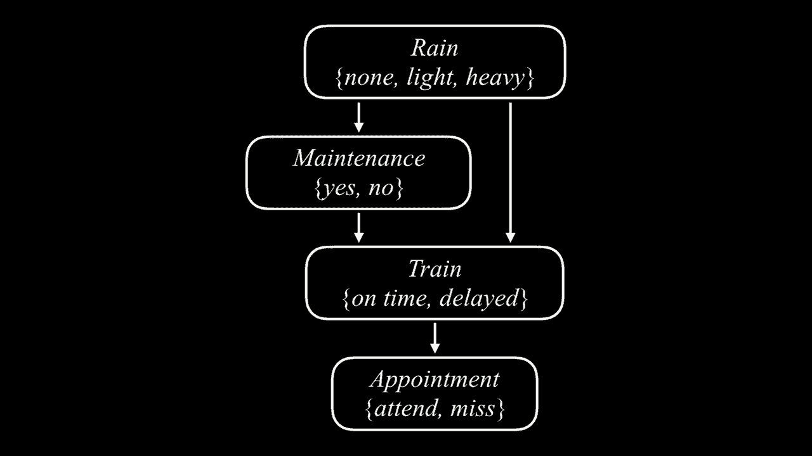

既然我们已经能够描述这个**贝叶斯网络**的结构，以及这些节点之间的关系，通过将每个节点与一个概率分布关联。

对于这个根节点，如降雨的情况，以及所有其他节点的条件概率分布，其概率依赖于父节点的值，我们可以开始使用表格中的信息进行一些计算。

让我们设想一个简单的计算，比如轻雨的概率，我将如何获取轻雨的概率？轻雨在这里是根节点，如果我想计算该概率，我只需查看。

无论这是一个无条件的概率分布，还是关于降雨的概率分布，并从中提取出轻雨的概率，这只是一个我已经可以获取的单一值，但我们也可以想象想要计算更复杂的联合概率，比如同时有轻雨和没有轨道维护的概率，这就是一个联合概率。

对于两个值，轻雨和没有轨道维护，我可能会首先这样做，先获取轻雨的概率，但现在我也想要没有轨道维护的概率，当然这个节点依赖于降雨的值，所以我真正想要的是。

在知道有轻雨的情况下，没有轨道维护的概率，因此计算这个概率的表达式是，轻雨和没有轨道维护的概率实际上就是轻雨的概率和没有轨道维护的概率。

给定我知道已经有轻雨的情况下，我会取轻雨的无条件概率，乘以在知道有轻雨的情况下没有轨道维护的条件概率，你可以对每个你想要的变量重复这个过程。

将其添加到这个联合概率中，我可能想要计算如果我想知道小雨、没有轨道维护和延迟列车的概率。那么这将是小雨的概率乘以，在小雨的情况下没有轨道维护的概率乘以。

给定小雨和没有轨道维护的情况下，延迟火车的概率。因为火车是否准时或延迟取决于另外两个变量，所以我有两个证据片段，这些证据用于计算条件概率，而这三个值仅仅是一个值。

我可以通过查看这些，单个概率分布之一来查找。它被编码到我的贝叶斯网络中，如果我想要一个关于四个变量的联合概率，比如，小雨、没有轨道维护和延迟火车的概率，以及我错过我的约会，那么这将。

乘以四个不同的值，每个值来自这些单独的节点。它将是小雨的概率，然后是，在小雨的情况下没有轨道维护的概率，然后是，给定小雨和没有轨道维护的情况下延迟火车的概率，最后是，关于我是否能按时到达这个节点。

我是否能按时到达约会并不取决于这两个变量，前提是我知道火车是否准时。我只需要关注条件概率，考虑我错过了火车或错过了我的约会。前提是火车恰好很准时，因此在这里表示。

通过四个概率，每个概率位于其中一个。这些节点的概率分布都相乘，直到。我可以像这样取一个变量，并且，算出联合概率。是通过乘一堆这些，单独的概率来实现的。

贝叶斯网络，但当然就像上次一样，我真正想做的是能够获得新信息。这就是我们在知识的背景下，想要用我们的贝叶斯网络做的事情。我们讨论了推理问题，给定我知道的事情。

只要我能得出结论，就能对其他我也知道是真的事实进行推断。而我们现在要做的，就是把同样的想法应用于概率，使用我所拥有的一些信息，无论是证据还是一些，我能算出其他的概率。

对某些变量是确定的，但我能否算出其他变量以特定值出现的概率。因此，在这里我们引入了推理问题。在一个概率背景下，变量不一定真实，而可能是取不同值的随机变量。

以某种概率，那么我们该如何。

正式定义这个推理问题究竟是什么好吧。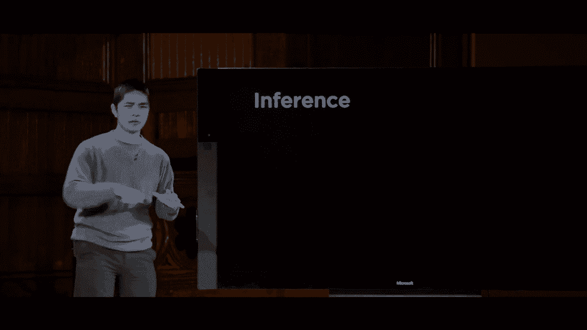

推理问题有几个部分，我们有一些查询变量X，我们想要计算分布，或者我想知道我错过火车的概率，或者我想知道是否有卡车维护，这些都是我想要获取信息的内容，然后我有一些证据变量。

也许这只是一个证据，也许是多个证据，但我已经观察到了某些变量。

比如说，我可能观察到下雨，这是我拥有的证据，我知道。

有小雨，或者我知道那里有大雨，这就是我使用的证据，我想知道我的火车延误的概率，比如说，这是我可能想根据这些证据询问的问题。

我在贝叶斯网络中观察到的变量，当然，这也留下了一些隐藏变量，这些变量既不是证据变量也不是查询变量，所以你可以想象在我知道是否下雨的情况下，我想知道我的。

火车是否会延误，隐藏变量是我无法接触到的，例如，轨道上是否有维护，或者我能否准时赴约，这些是我无法接触到的变量，它们是隐藏的，因为它们不是我观察到的。

它们并不是我所询问的查询内容，所以最终我们想要计算的是，我想知道在观察到事件E后，X的概率分布，即我观察到的事件。

火车随机变量的可能值是准时还是延误，它发生的可能性是什么，结果是我们可以使用我们已经看到的概率规则来进行这个计算，最终我们将看看质量。

从高层次的抽象角度来看，最终我们可以让计算机和现有的编程库开始为我们做一些数学运算，但了解推理过程发生时的实际情况是很有帮助的，想象一下某种事件。

我想计算给定某些条件的预约随机变量的概率分布。

证据是我知道有小雨且没有轨道维护的情况下。因此，这就是我的证据。

我观察到的变量值，我观察到降雨的值，我知道今天有雨，并且我知道没有轨道维护发生，而我关心的是这个随机变量约会。我想知道这个随机变量约会的分布是什么。

我能参加我的约会的机会有多大？在这证据和隐藏变量下，我错过约会的机会有多大，而我无法获取的信息是这个变量列车，这些信息并不是我所看到的证据的一部分。

这不是我观察到的东西，但它是；这也不是我询问的查询。那么，这个推断过程可能是什么样的呢？如果你回忆一下，来自于定义条件的记忆。

概率和使用条件概率进行数学计算。我们知道条件概率与联合概率成正比，我们通过回忆条件B的概率仅仅是某个常数因子α乘以A和B的概率来记住这一点。

因子α的结果像是除以B的概率，但重要的是它只是某个常数乘以联合分布，即所有这些单独事件发生的概率，所以在这种情况下，我可以取约会随机变量的概率给定。

轻微降雨和没有轨道维护，假设这只是会成比例于某个常数α乘以联合概率，即约会随机变量的特定值和轻微降雨以及没有轨道维护。那么，我该如何计算这个呢？

约会和轻微降雨以及没有轨道维护的概率，而我真正关心的是知道我需要这四个值，才能够计算整个的联合分布，因为在特定的约会中，取决于列车的值。为了做到这一点，我在这里。

我可以开始使用那个边际化的技巧，只有两种方式我可以获得任何配置的约会，轻微降雨和没有轨道维护。要么这个特定变量设置发生，列车准时，要么这个特定变量设置发生，而列车就会延误。

延迟，这是两个我想考虑的可能情况，如果我将这两个情况相加，那么我就可以通过将所有隐藏变量或变量的可能性加在一起，得到结果，但由于这里只有一个变量列车，我所需要做的就是遍历所有可能的值。

那个隐藏变量的列车并添加起来。

它们的概率，因此这个概率，表达式在这里变成了关于约会的概率分布，情况是光线良好、没有雨以及火车准时。对于约会的概率分布，情况是下雨、没有轨道维护，并且火车延误。例如，我将考虑火车的两个可能值。

并将它们相加，这些只是我们之前看到的联合概率，如何通过计算这些父节点的概率并将它们相乘来得出。然后你需要在最后进行归一化，从高层次讲，以确保所有内容。

加起来就是第一步，因此这个公式，关于如何做到这一点的过程被称为枚举推理，看起来有点复杂，但最终它。看起来是这样的，现在让我们尝试提炼所有这些。符号实际代表的意思，我们从这里开始，我关心的是。

我查询变量X的概率，给定某种证据，我对条件概率知道些什么。条件概率与联合概率成比例，因此在某种α，即某个归一化常数。乘以这个联合概率，好的，为此我要进行边缘化。

关于所有隐藏变量，即我没有直接观察到的所有变量。对于这些值，我基本上将对所有可能发生的情况进行迭代，并将它们全部相加，因此我可以将这转化为一个对所有Y的求和，范围涵盖所有可能的隐藏变量，以及。

它们可以取的值，并将所有可能的个体。概率相加，这将允许我进行这个枚举推理的过程。现在，最终如果我们人类必须为自己完成所有这些数学计算，那确实是很麻烦的，但事实是这就是计算机和人工智能的优势所在。

计算机理解贝叶斯网络对于理解这些推理过程特别有帮助，并能够进行这些计算，利用你在这里看到的信息。你可以自己从零开始实现一个贝叶斯网络，但这就。

有许多库，尤其是专门为Python编写的库，允许我们更轻松地进行这种概率推理，能够处理贝叶斯网络并进行这些计算，所以，虽然不需要理解所有底层的数学，但对如何。

它是有效的，但你只需要能够描述网络的结构，并提出查询，以能够生成结果。因此现在让我们看一个例子，结果发现Python中存在许多。

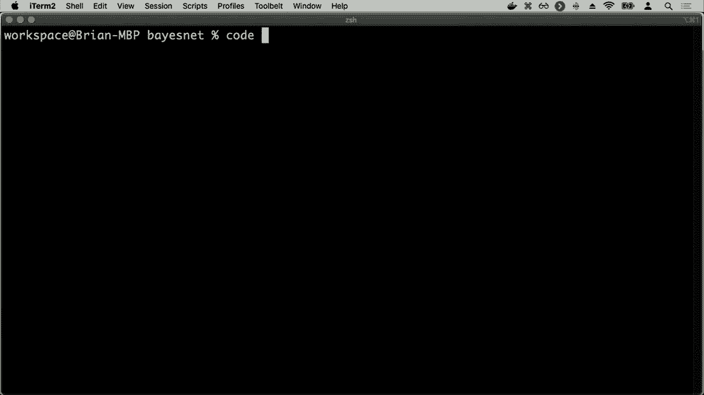

对于进行这种推断，使用哪个具体库并不太重要，它们的行为都非常相似，但我将使用的库是石榴库，在模型pi内部，我定义了一个贝叶斯网络，使用了这个结构和语法。

石榴库期望的内容是，我实际上是在Python中创建节点来表示您刚才看到的贝叶斯网络的每个节点，所以在导入石榴库后的第4行，我定义了一个名为'rain'的变量，它将代表一个节点。

在我的贝叶斯网络中，它将成为一个节点，这种分布有三个可能的值：没有降雨、轻降雨和大降雨，分别对应的概率是0.7（无降雨）、0.2（轻降雨）和0.1（大降雨）。

下一个变量，即轨道维护的变量，例如，它依赖于降雨变量，而这不是一个无条件分布，而是一个条件分布，如条件概率表所示，目的是我遵循这个分布以满足降雨的条件。

所以如果没有降雨，则有0.4的机会进行轨道维护；如果没有降雨，则没有轨道维护的机会为0.6。同样，对于轻降雨，我也有一个重降雨的分布。

刚才以图形方式表示，但我告诉这个Python程序，维护节点遵循这个特定的条件概率分布，我们对其他随机变量也做同样的事情，训练是我分布中的一个节点，它是一个有两个条件的概率表。

父节点不仅依赖于降雨，还依赖于轨道维护，所以我在这里说，假设没有降雨且有轨道维护，我的火车准时的概率为0.8，延误的概率为0.2，同样我可以对火车节点的所有其他可能的父节点值做同样的事情。

对于火车节点的所有这些可能值，这里是火车节点应该遵循的分布，并且我对约会做同样的事情，基于火车变量的分布，然后最后我实际做的是。

通过描述网络的状态和在依赖节点之间添加边缘来构建这个网络，因此我创建了一个新的贝叶斯网络，向其中添加状态：一个用于降雨，一个用于维护，一个用于火车，一个用于约会，然后我添加连接相关部分的边缘。

一支箭指向维护，因为降雨影响轨道维护，降雨也影响火车维护，影响火车和火车。影响我能否按时参加我的预约，而烘焙只是最终确定模型并进行一些额外的计算，因此具体的语法是。

这实际上不是重要的部分，石榴恰好是几种不同库之一，所有这些库都可以用于类似目的。你可以为自己描述并定义一个库，实现类似的功能，但这里的关键概念是，有人可以为一个。

一般的贝叶斯网络有基于其父节点的节点，然后程序员所需做的就是使用其中一个库来定义这些节点和这些概率分布，我们可以基于此开始进行一些有趣的逻辑，所以让我们尝试这样做，例如条件或。

我们之前手动计算的联合概率计算，通过进入似然性嗨，我们在这里导入我刚刚定义的模型，我想计算模型的概率，它计算给定观察的概率，我想计算。

没有降雨的概率没有轨道。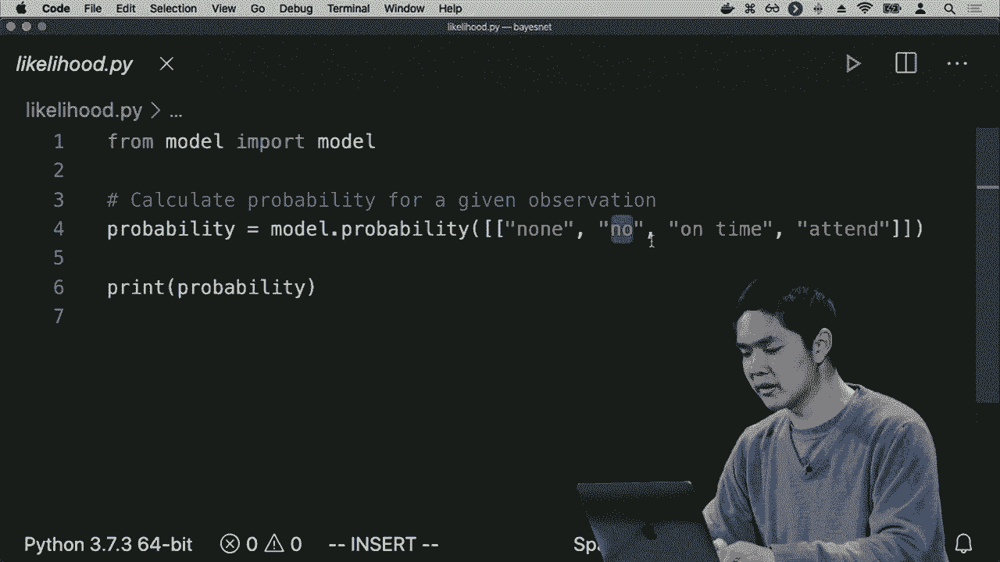

维护我的火车准时，我能参加会议，所以算是最优场景，没有降雨和轨道维护，我的会议。所有这些实际上发生的概率是多少，我可以利用库进行计算，并且打印并运行，iPhone的似然PI，我看到。

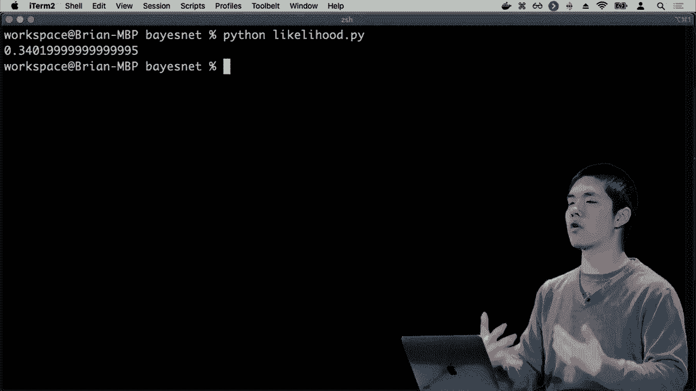

好的，概率大约是零点三四，所以大约三分之一的时间。一切对我来说都顺利，在这种情况下没有降雨，没有轨道维护，火车准时，我能够参加会议，但我可以试验，尝试计算其他概率。

一切都顺利进行直到火车，但我仍然错过了会议，所以没有降雨。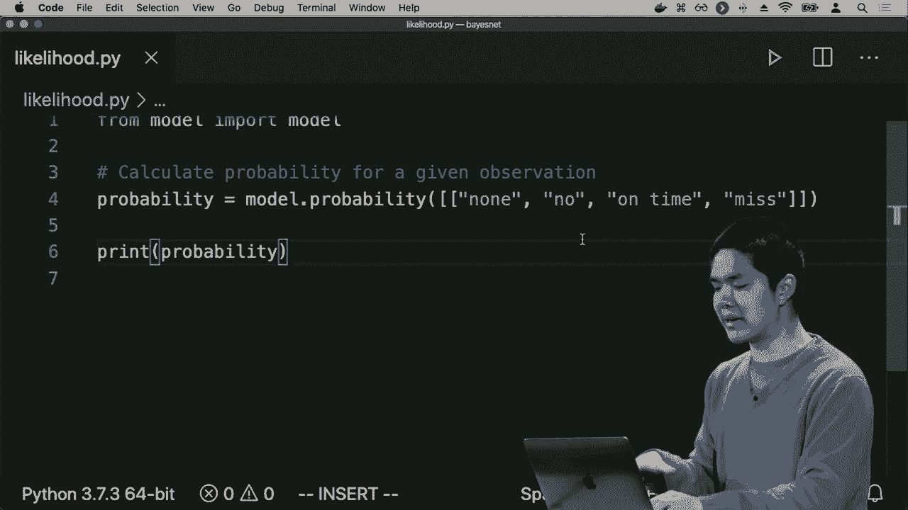

没有轨道维护火车准时，但我错过了预约，让我们计算这个概率，写下来，概率大约是0.04，所以。

大约4%的时间火车会准时，没有降雨，没有轨道维护，但我仍然会错过会议，因此这实际上只是我们之前联合概率计算的实现。这个库很可能首先计算没有。

降雨的概率，然后计算在没有降雨的情况下没有轨道维护的概率。然后是给定这两个值，我的火车准时的概率，以及在我知道火车准时的情况下我错过预约的概率，所以这再次是联合概率的计算。

结果是我们也可以让我们的计算机解决推理问题，开始根据我们所看到的信息证据进行推断，其他变量也有多大可能性是真的。所以让我们深入推理，假设我们在这里，再次导入那个确切的。

使用这一信息，我希望能够从之前的模型中导入所有节点和所有边，以及那里的概率分布，现在有一个函数来进行某种预测，我将其传入这个模型中。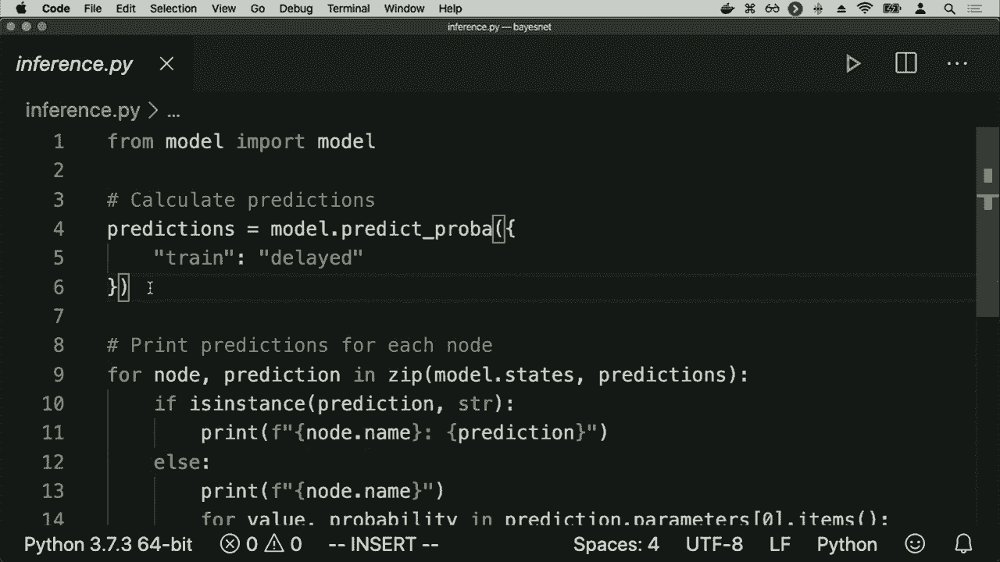

我观察到的证据，所以在这个Python程序中，我编码了我观察到的证据，我观察到火车延误，这是一种四个随机变量之一的值。

获取灵感，我们弄清楚了关于我的贝叶斯网络中其他随机变量值的推断，我希望能够对其他所有内容进行预测，因此所有实际的计算逻辑只在这三行中发生。

我在下面做出这个预测，我只是迭代所有的状态和所有的预测，并将它们打印出来，以便我们可以直观地看到结果。但让我们找出，考虑到火车延误，我可以对其他随机变量的值进行什么预测。让我们运行Python推理并停止PI。

运行这个，结果是我得到了，考虑到火车延误这一事实。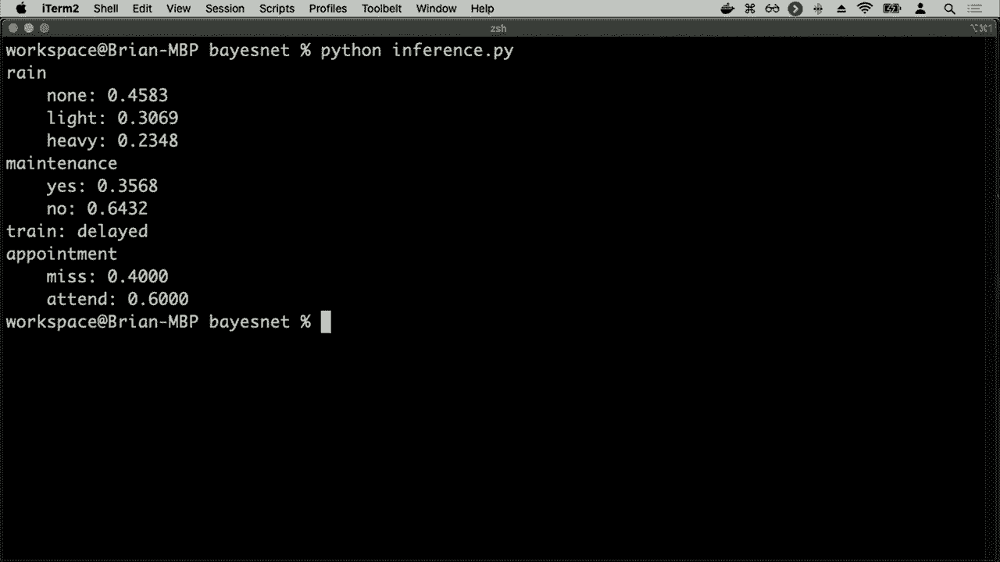

我观察到的证据，考虑到有45%的概率或46%的概率没有下雨，有31%的概率有小雨，有23%的概率有大雨，我可以看到一个概率分布，涉及维护以及我是否能够。

参加或错过我的约会，现在我们知道，无论我是否参加或错过约会，这仅仅取决于火车是否延误。它不应该依赖于其他任何因素，因此，让我们假设我知道有大雨，这不应该影响。

约会，实际上如果我上来这里。

这个分布，并添加一些证据，假设我知道降雨量很大，那是证据，我现在有两条证据，我知道雨很大，我知道我的火车延误。我可以通过再次运行这个推理过程来计算概率，并查看结果。

我知道雨很大，我知道我的火车延误，轨道维护的概率分布因此改变，考虑到现在有大雨，轨道维护的可能性更小，88%而不是之前的64%。那么，我提前到达的概率是多少呢？

仍然会参加预约，错过的概率是0.6。预约的概率是0.4，因为这仅仅取决于我的火车是否准时或者延误，这里实施了推理算法的想法，以便基于现有的证据进行推理。

我们可以推断出其他变量的值，枚举推理就是执行这种推理过程的一种方式，只需遍历隐藏变量可能取的所有值，并计算出当前的概率。

事实证明，这并不是特别高效，确实可以通过避免多次计算相同的概率进行优化，有一些方法可以优化程序，以避免重复计算相同的概率，但即便如此，随着变量数量的增加，

可能的变量取值数量增大，我们将不得不进行大量计算，以便能够进行这种推理，到了那时，这种推理所需的时间可能开始变得不合理。

正因如此，通常在涉及概率和不确定的事情时，我们并不总是关心进行精确推理并准确知道概率，但如果我们能近似推理过程，做某种近似。

推理可能会很有效，即使我不知道确切的概率，但我对概率有一个大致的了解，随着时间的推移，我的准确度会越来越高，这可能是相当不错的。

特别是如果我能更快地实现这一点，那么我如何在内部进行近似推理呢？
