# 哈佛CS50-CS ｜ 计算机科学导论(2020·完整版) - P1：L0- 计算机科学基础知识 - ShowMeAI - BV1Hh411W7Up

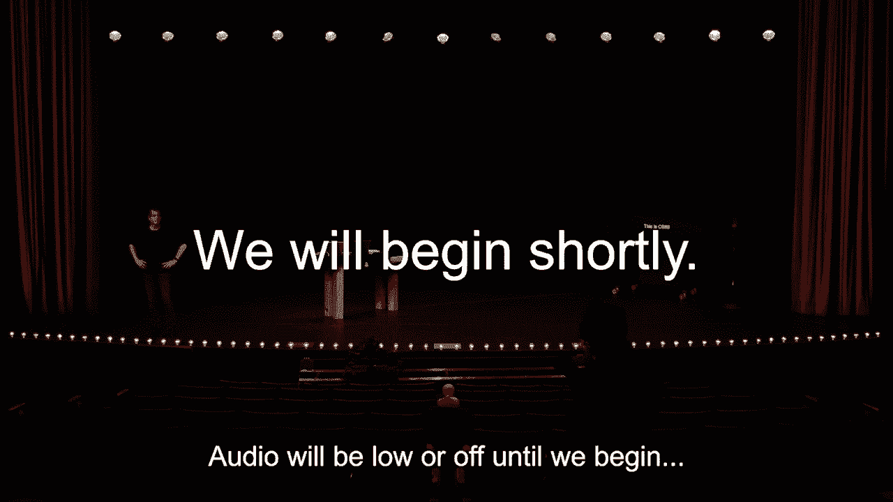

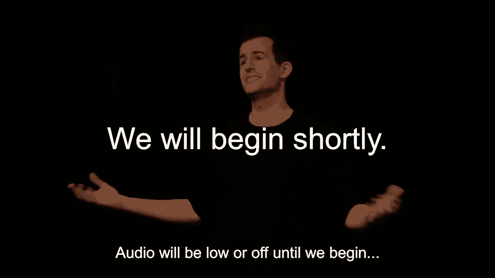

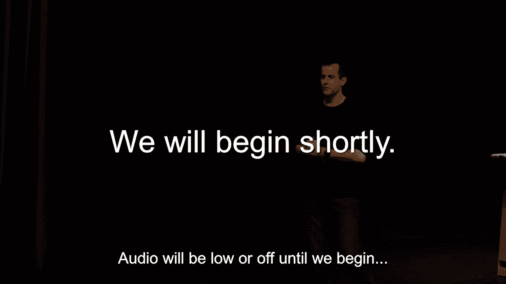

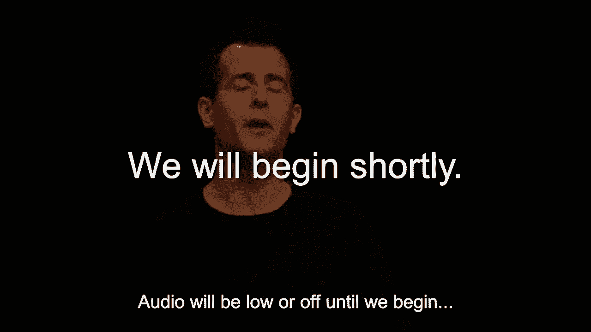

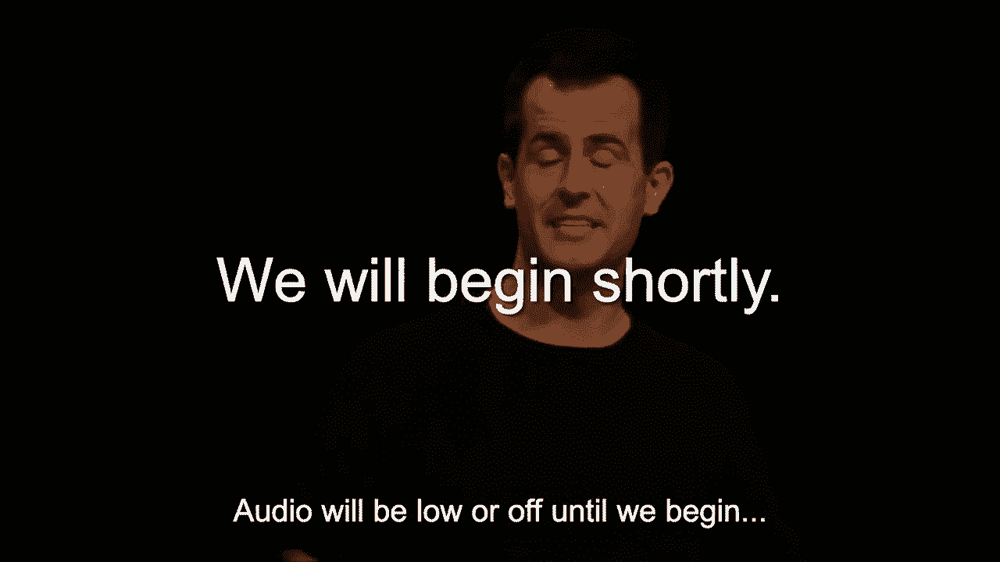

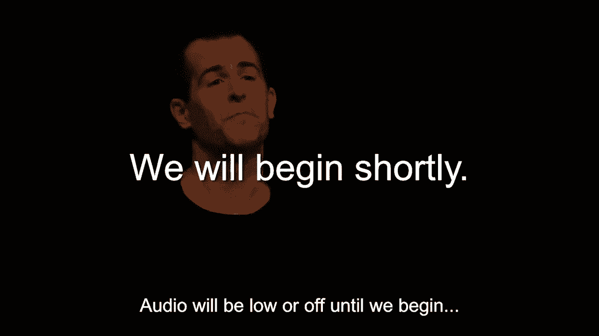

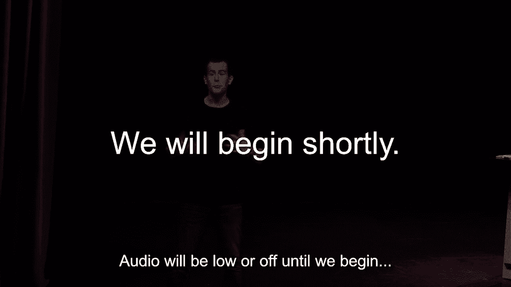

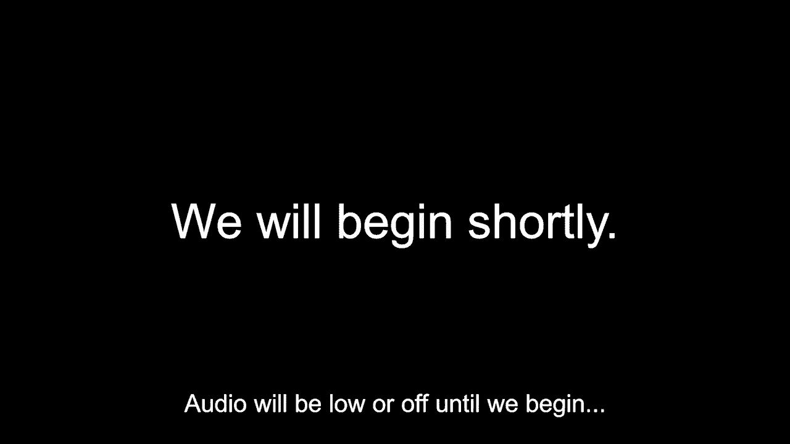

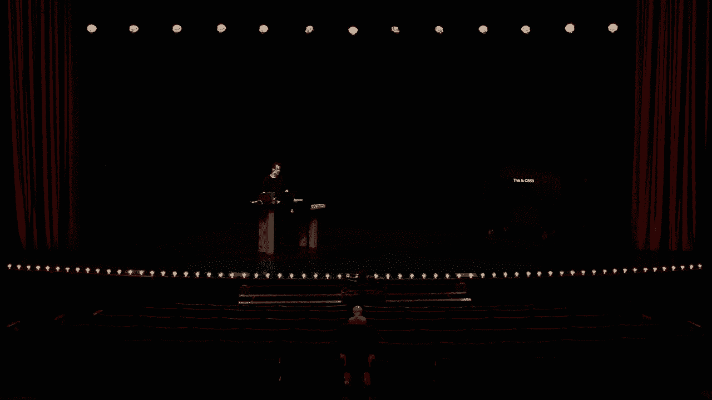

好的，这就是CS50，哈佛大学的计算机科学与编程艺术导论。

在美丽的桑德斯剧院共同度过这个校园时光。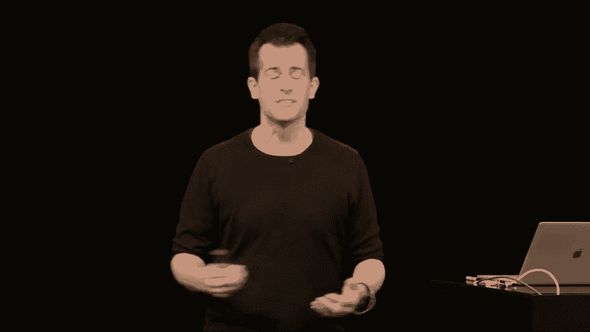

当然，今年有一些不同之处，不止一个原因，但我们在这里。

现在在哈佛大学的洛布戏剧中心进行，而这要感谢我们的朋友们与美国剧院公司的合作。我们有了这个新空间，甚至包括。

在这段时间里，我们与一支极具才华的团队合作。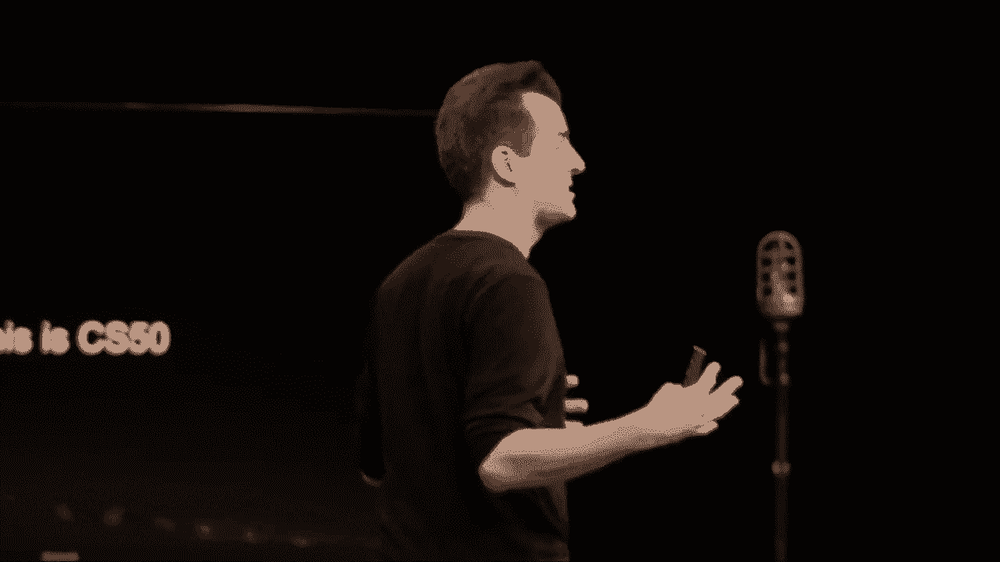

本学期的CS50课程，因此我敢说我们将会有一些新的改进演示。

在这个过程中，我们感谢我们的东道主，美国剧院公司。现在我们希望至少唤起一些回忆，或对校园的某些想象，特别是对于那些本学期无法亲自到场的你们，因此我们进入了哈佛档案馆。在他们的收藏中有这幅由哈佛学生创作的水彩画。

一位200多年前的研究生，乔纳森·费舍，他坐在现在的哈佛广场，观察哈佛校园的一些早期建筑。多亏了科技，我们将这幅相对较小的水彩画复原，这幅画是这位研究生在200多年前创作的。

现在，舞台上装饰着洛布戏剧中心的布景，如果左边是霍利斯大厅，右边是哈佛大厅，这是校园内的课堂建筑之一，第一年，哈佛校长在这里生活和工作。所以欢迎来到CS50，我可以说，嗯，不久前。

大约20年前我上过同样的课程，但正如你所知，我在学习CS50，学习计算机领域时曾感到一些紧张。我在大学时选择了一条舒适的道路，早期学习了政府，坐在这个CS50的课堂上。

我意识到，家庭作业其实可以是有趣的，我发现编程本身也很吸引人，尽管很多人认为它在高中是怎样的，实际上它是关于解决问题的，因此它非常适用于计算机科学和工程领域。

但实际上，艺术、人文学科、社会科学等等，如果你对参加像CS50这样的课程感到有点不安，要知道几乎每年，参加CS50的学生中有近三分之二从未上过计算机科学课程。现在，很多今天和你一起上课的同学也是如此。

你处于非常相似的境地，确实有很好的同伴，最终重要的是。在CS50中，我们强调，如大纲所述，课程中最终重要的不是你相对于自己在开始时所处的位置，实际上考虑到你目前的背景，可能完全没有基础，并考虑到几个月。

最终它应该是衡量你自己成功的标准，因此朝着这个目标前进。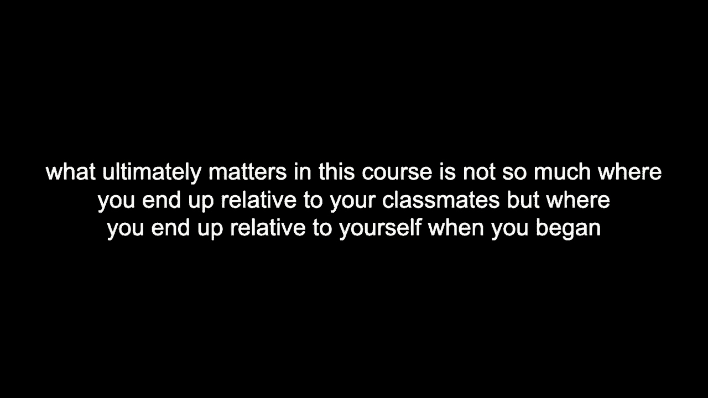

我们将从编程开始，这里有一幅来自往年的超级马里奥兄弟的图像，我们将重现这个游戏的一部分，尽管使用的是文本，也就是ASCII艺术，但我们将在课程的第二周左右完成，这将是你写的第一个程序之一。

快进到几个问题集或编程作业之后，或者几周后，你将构建我们所称的CS50金融。这是你自己开发的一个网络应用，运行在互联网上，并与雅虎财经或类似的API接口。

从一个第三方服务开始，允许你的用户登录和注册，买卖股票，用虚拟货币来说。几个月后，你将真正从构建自己的网络应用开始，接着是课程的顶点体验，这将是你自己的最终项目，但究竟是什么呢？

计算机科学，我们在这一周零的第一周所想要做的，就是准确考虑这意味着什么，这就是计算机科学，这是解决问题。你有一些输入，这就是你关心的问题，你想要解决它。你关心的是这个问题的解决方案，也就是所谓的输出。

在这个输入和输出之间，是一个黑盒子，里面发生着某种魔法，这个魔法你最终能够驾驭，并促使计算机为你解决问题。最终，这个黑盒子里就是我们需要共同认可的代码。

我们将如何表示这些输入和输出，我们都必须说一种共同的语言，所以我们需要达成一致，如何表示这些输入。那么我们通常如何表示信息呢？也许做的最简单的事情是用手指，无论我们是在网上还是面对面。

房间里的人数，所以你可能会用手指来代表每个人。你可以用手上的简单数字来计算，当然你不能仅仅用这只手数得太高，但实际上这里还有一个系统，那就是一元记数法，uno意味着。

一只手指向上或向下，所以你可以数到五。当然，如果我再伸出一只手，我可以数到十，然后事情会变得有点困难，但这是一种表示信息的系统，而且它相当普遍，当然，当我们所有人都在一起时。

年轻的你和我，只是手上的数字，还有其他类型的数字，即我们所知道的十进制数字。那些数字在技术上更正式地称为基数10，这只是一个 fancy 的说法，描述了人类的事实。人类确实倾向于通常使用这些数字，当然是0到9，并使用这几位数字。

我们可以组成数字，比如0到9，但也包括10、11和12，甚至更高，仍然使用多个数字。但是计算机并不真正使用与我们相同的语言，在某种意义上，它们比我们人类简单得多。尽管它们看起来如此复杂，但归根结底，这些都是人类制造的设备。

它们在核心上相对简单，实际上即使你不完全知道自己在说什么，但至少你听说过这种情况。你认为计算机会说什么语言？计算机说什么语言？如果不是我们使用的从0到9的系统，或者十进制。

布莱恩，我们能看看谁会回答这个问题，计算机使用什么系统？就像你听说过的，无论你之前是否上过计算机科学课，基思，我们可以继续吗？是的，呃，计算机使用二进制，二进制，没错，呃，计算机使用二进制。你能详细解释一下你所说的二进制吗？

呃，它是零和一，所以像我们使用零到九作为基数十，它使用零到一作为基数二，没错，所以计算机使用所谓的二进制系统，意味着二，并且确实只使用这两个数字，也就是零和一。这个系统实际上相当简单。

如果我们只使用这两个数字，数字，我们要如何表示这个数字呢？两个、三个、四个，或者任何更大的数字，这似乎几乎是向后退了一步，但实际上并不是，结果是，这个所谓的系统或二进制。之所以称为二进制，是因为它只使用零和一。

这里还有其他的命名法，我们通常称之为两个字的可能性。数字仅仅是在屏幕上的符号，因此二进制数字也称为位，电脑使用这些称为位的东西进行二进制计算。但这意味着什么，为什么会这样？像为什么几十年前没有发明使用零的电脑，完全是一个新系统。

对我们来说，这个问题都难以思考，更别提讨论了，毕竟，电脑使用的输入实际上只是我们每天或每隔几天都在做的事情。手机要么确保它仍然插着，要么插上以便充电，这些设备如今。输入的形式是电力，我们不必深入探讨其细微差别。

电力只是一种，但我认为这与电子流入设备以进行充电有关。我们只需知道这些设备，也就是我们使用的电脑和手机。但就这样，如果我们利用这些电力，也许我们可以开始用信息来表示。旧的、现在关闭的剧院中的鬼灯，它有能力。

开启时我们只需要插入它或按下开关，令人信服的是，使用灯光的比喻是，现在这个灯泡是关闭的，但当我允许电流流动时，开关。现在它当然是开的，如果我拔掉它，或者再次按下开关。

它是关的，或者如果我把它插回去它就是开的。

这个非常简单的想法的含义是，我们可以拿一个物理设备，比如一个灯泡，通过插入或拔出它，来表示。我表示灯泡的开与关，但我们可以简单地称其为开和关。我们也可以称之为零和一，因此这确实是。

这个给我们带来电脑的想法的萌芽，以及它们使用的二进制系统，毕竟电力，嗯，就让我们利用它来掌握和跟踪信息吧，让我们存储一点电力。当我们想表示一个时，让我们释放掉这电力。

当我们想表示零时，因此因为电脑的输入是如此简单。这给了我们这些零和一，而我们似乎给自己创造了一个问题，开关，如果它关了可能是零，如果它开了可能是一个。但我怎么能数高于一呢？这个问题仍然根本存在。

嗯，我当然可以用更多的灯光，使用三个灯泡我们能从零数到多少？两个可能性，但有三个灯泡我们能数到多高呢？让我来问一下这个屏幕上的问题。稍后你们会在屏幕上看到这个特定的问题。

你可以在你的设备上响应，因此我给你三个灯泡，而不是一个，每一个都可以开或关，我们或许可以数得多高。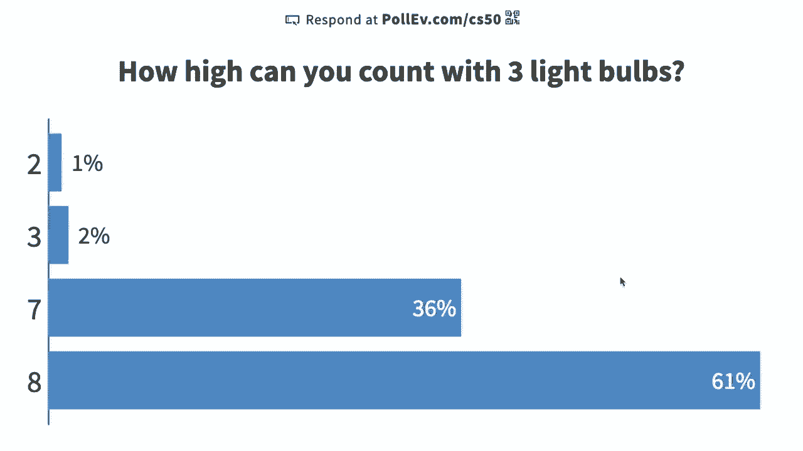

所以你会在屏幕上看到，答案正在出来，我们有很多人认为是60%以上的，认为八是你能数到的最高的，很多人认为是七，还有一些人认为可能是三或二，所以这实际上是一个有趣的答案范围。让我们看看实际情况如何。

最简单地说，我认为如果我们打开这些灯泡，如果它们目前代表零。显然，我可以打开一个，再打开第二个，称之为二，打开第三个。现在三个都亮了，我们可以说，现在我们代表的是三，但我们还不够聪明，只是在计算。

三个因为我只是将它们打开，这个故事从左到右。但如果我们聪明一点，或许可以从右到左打开它们，或者我们以不同的方向进行排列，也就是我们采取的方向，或者空中有多少根手指，而不是所创造的模式。

那么让我们统计一下，所以让我有条不紊地打开一些灯泡。尽管是虚拟的，这里可能是一个，这里可能是两个，这里可能是三个，但然后我们大概就结束这个故事了。那么我们如何能做得更好呢？让我们从零开始，二。称这个为4，称这个为5，这个为6，这个为7。如果你没有也没关系。

相信我，那是一个独特的模式，开始时是关闭的，最后是开启的，但在此过程中确实有八个。那么我能数到多高呢，这实际上取决于你从哪个数字开始计数，正如我们到目前为止所做的，计算机科学家们总是这样做。

实习计算机程序通常从零开始计数，所有东西都是关闭的。你可以称之为零，所以如果我们从零开始计数，而我们刚才看到的有八种可能的模式。那么这将允许我们数到七，所以从零到。

七，所以七是我们可以用三个灯泡数到的最高数字。所以提出七是答案的36%的人确实是正确的。如果你假设我们从一开始计数，那也没问题，但至少在计算机世界中，现在我们通常按照惯例说，有八种这样的可能性。

好吧，这一切都很好，用灯泡的模式来表示事物，但我们如何才能真正得到计算机实际使用的零和一呢？因为最终计算机内部有什么呢，开关。数以百万计的小开关，可以是打开或一，或者关闭或零，这些开关正好发生在。

被称为晶体管，这些天计算机确实有数以百万计的东西可以以不同的模式开或关。所以如果你有能力打开和关闭所有这些开关。那么我们在使用这些开关时，可以就如何表示信息达成一致，嗯，非常好。

我们其实不需要思考得太复杂，孩子们，如果我们考虑一下不仅是零和一，而是整个十进制系统，从零到九，今天你我都是从这个系统开始我们的一天。这个系统是如何工作的呢？好吧，屏幕上显示的是一、二、三，所以你可能在想那是123，但并不完全，屏幕上显示的只是。

符号的模式是一、二、三或三个数字，可能我们所有人本能地都在说，显然是123。但是自从你考虑为什么是123以来，可能已经过了很多年。好吧，让我们考虑一下这些数字或符号各自代表什么，如果你像我一样，成长过程中学习了位值。

中间的是十位，左边的是百位。那么我们如何从这三个符号或数字一、二、三中得到呢？我们每个人都是通过1加上10乘以2，加上1乘以3，这当然就是100加20加3，或我们都知道的数学值是123。所以，这是一个有点循环的论证，但只是提醒我们我们是如何得到这个结果的。

结果发现，在计算机的世界里，他们使用的系统在根本上是一样的，唯一的区别是计算机只能接触到0和1，而不是从0到9。因此，如果我们现在在抽象层面考虑这里表示的三个可能的数字，让我们考虑一下1。

10和100等等，那么为什么会这样呢？其实是有一个模式，涉及到指数或幂，因此如果我们深入探讨，最右边的列实际上是10的零次方，如果你还记得，这只是意味着1。10的第一次方就是10，而10的平方或10的第二次方。

是100，但有趣的是，10的参与使得从0到9总共有10个数字，因此这些列使用的是以10为基数。你也许可以先于我考虑，如果在二进制系统中计算机只使用两个数字，0和1，那么从123到123的过程又是怎样的呢？

变化是这些列的含义，现在我们有了个位。仍然是因为2的0次方是1，但然后我们有2的1次方，2的2次方等等，当然如果我们在计算机使用的二进制世界中进行计算，我们有个位、二位、四位等等，现在我们可以顺利进行，即使我们。

现在我们必须在一个不同的基数系统中思考，我们可以开始计数，从灯泡的隐喻出发，考虑如果所有的灯泡都关着，我们又会把这些东西视作零，因此那将是一个符号或数字的模式，二进制中的0，0，0，但在我们人类的世界里。

你今天可能会瞬间进行的心算是，显然这是4乘0，加上2乘0，加上1乘0，当然在十进制中就是0。但是计算机是如何表示数字1的呢？它只是将最右边的位从0变为1或更多。

并点亮最右边的灯泡，就像我之前做的，1 0。在二进制中，我如何表示3，这是我们即将不同的地方。现在我打开两个开关，因为我需要在二的位和一的位上给我数学上的三，接下来如果我们选择。

嗯，数到四，那就是一零零，如果我想数到五，那就是一零一，六就是一一零，最后七就是一一一。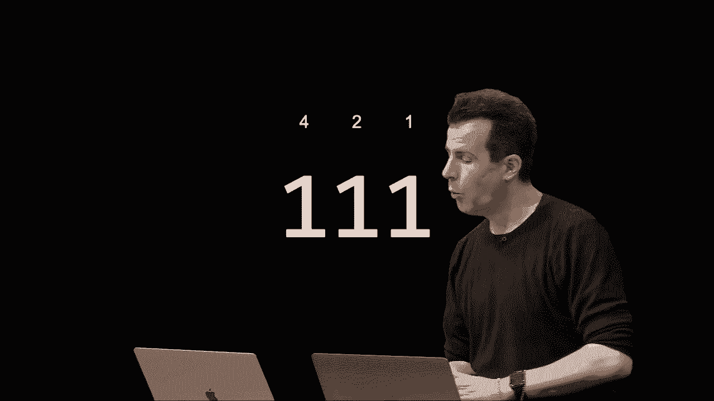

所以似乎使用三个比特，每个比特可以是零或一。是的，你可以将它们排列组合成八个，首先，第二次乘以二，第三次乘以二，总共给我们八个，但根据这个数学和从零开始计数的直觉，我们最多只能数到七，总之，我们继续前进，我们没有。

就说吧，我们假设有一个灯泡或者三个灯泡，我们实际上很幸运地拥有像灯泡、一个罐子和一个门在舞台上，你知道我们能否继续在屏幕上放一个随机数，好的，所以如果你。

关闭 打开 打开，所以关闭 打开。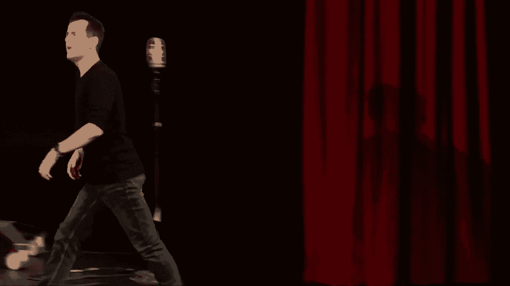

关闭 关闭 打开 打开，所以让我们继续问一个问题，只有一个灯泡、两个还是三个，但在这种情况下至少是六个灯泡，我们实际得到什么价值呢？好吧，让我把问题放在屏幕上，这个问题将在你们的屏幕上弹出。

一一零零一，零代表哦，是的，意识到我必须澄清一下，读出来。实际上这里什么十进制数字呢？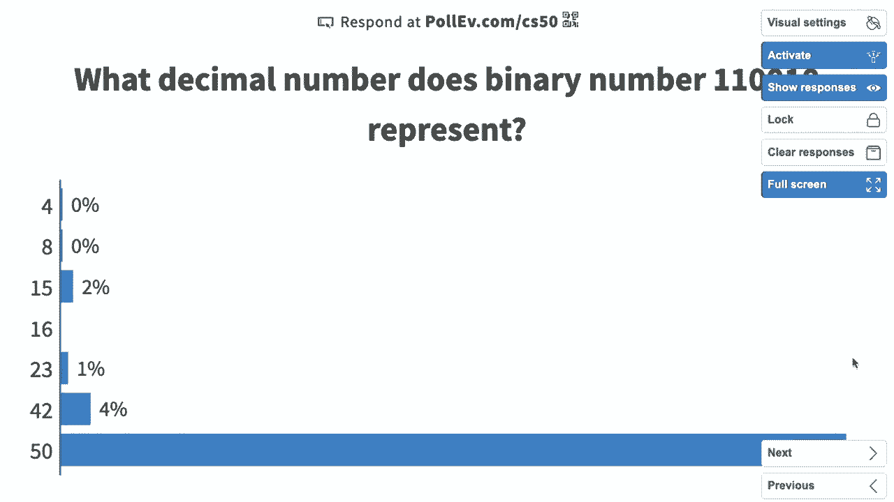

二进制数 1 1，零零一零从左到右表示。不幸的是，我是从我的左边读到右边，但你们的正好相反。所以这里我们有一个压倒性的反应，50确实是正确答案，为什么呢？如果我转到物理灯泡这里，我们只考虑。

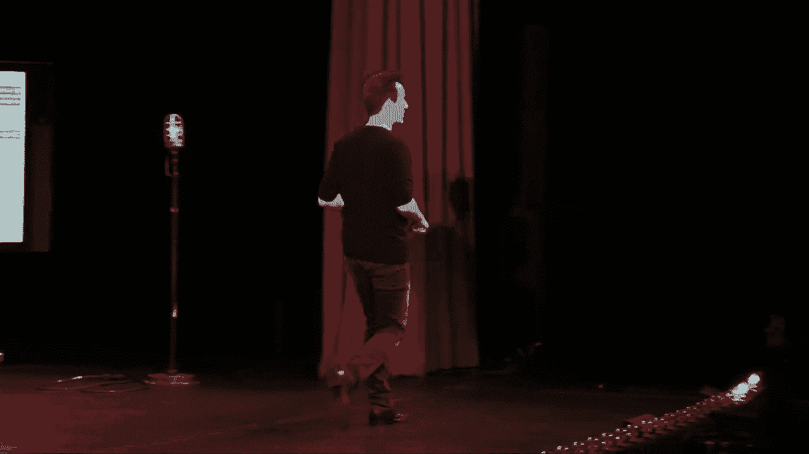

一刻钟，模式实际上是什么，位置，4 8 16 32，我们可以继续，但没有。

这将无关紧要，因为它们都是关闭的，所以我们有 32 加 16 加 2，这确实给了我们。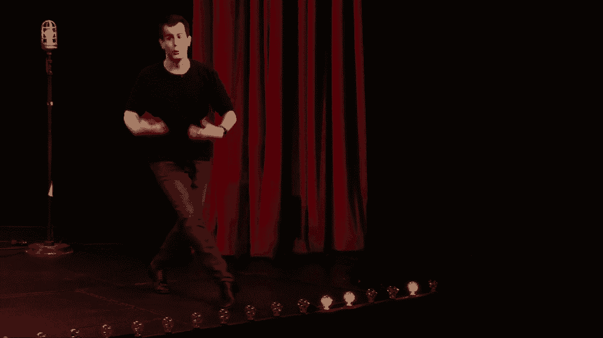

我们在十进制中知道的数字，作为 50。想象一下我们可以用其他灯泡数到多高，好的，所以我们开始了电的故事，然后转向数字，以十进制或二进制表示东西，但我们有点把自己逼入了一个角落。

因为如果我们只有开关或隐喻的灯泡，可以看作是零和一，那么计算机能做的事情似乎仅仅是计算，也就是充当计算器，实际上早期计算机的确是为了便利人类的数学计算而设计的。

当然，我们现在所使用的，每天在手机、笔记本和台式电脑上使用的技术要复杂得多。！

想想计算机如何表示字母，不仅仅是数字，布莱恩，如果你想举手，我们可以请教一下，有人能告诉我们，计算机如何表示像英语这样的字母，如果我们只有这些，你认为呢？让我们看看，索非亚你怎么看？

哦，我们可以将字母表中获得的数字进行分配，是的，我们可以将特定的数字用二进制分配给字母，这似乎是我们唯一的选择，如果我们只能改变这些开关或灯泡，或者位，那我们必须达成共识。

以相同的方式表示字母，现在也许最简单的方法是，大家都同意大写字母A是数字一，所以你，二进制数字一，那对于B我们可以用数字二，数字三，D可以是四，依此类推，我们只需达成一致。

人类确实做到了这一点，但方式稍有不同，多年前他们决定出于一些我们现在不讨论的原因，大写字母a实际上会被表示为我们知道的十进制数字65。现在以位形式看，这将是这样的位模式。

计算机用来表示我们现在知道的十进制数字65，而计算机将做的就是注意你使用的程序类型，所以，如果你在使用计算器，或者使用类似Excel的软件来处理数字，那么在这种上下文中运行像计算器或分析软件。

程序将在计算机内部看到的，表示十进制数字65，因为它是在计算器的上下文中，或者在屏幕上，字面上是十进制数字65，但如果你我使用的是短信或数字，但在字母上，比如英语字母，在这种情况下，你的计算机会非常智能。

在短信或电子邮件等上下文中表示65，实际上表示的是大写字母a，因此模式是相同的，表示方式相同，但上下文是不同的，人类多年前提出的将65映射到66为b，67为c的系统被称为ascii，美国信息标准代码。

交换意味着有一个明确定义的映射，这是一群人在几十年前决定的，用来将字母（在这里是英语字母）映射到从65开始的数字和标点符号的小写字母。所以，假设你确实收到了。

一条包含模式的文本消息，实际上只是一串十进制数字。假设你收到了一个文本消息，包含这些数字模式72 73 33，你可能刚收到什么消息？让我先调出简略图表，看看你到底收到了什么消息。

72 73 33，萨姆纳，我们能否把这个同样的三字母单词放在灯上？如果你想以位的形式看到这个相同的模式72 73 33，现在也可以。那么，这个模式代表什么呢，呃，兰汉姆，我们可以请教你吗？呃，那就是高音和感叹号，没错。

确实是高音加感叹号，回过头来，现在可能很容易推测，72和73分别是h和i。不过，兰汉姆也提到感叹号，点点之间有一个明确的映射。

我们可能在意的是高音，33可能比其他更明显。我们需要一个更大的图表，所以如果你现在上电脑查看ascii图表，你会看到类似这样的东西，当然你也可以直接搜索ascii来获取相同图表的副本。

老实说，位通常不是一个非常有用的计量单位，因为。

你会看到h确实是72，i确实是73，但如果我们看左边，33显然是感叹号，你只有查过或者记住了才能知道这一点。但你我使用的计算机和手机，实际上就是这样被编程的。

但事实证明，我们还应该考虑我们现在使用了多少个零和一来表示72、73和33。因此，让我们最后一次看看灯泡。

这些是位模式，当你从朋友那里收到说hi的文本消息时，hi加感叹号全大写，你实际上在技术上收到了一个位模式。如果是无线的话，那代表着这个位模式，通常现在的计算机使用八位来表示每个字符。

当ascii刚出来时，他们通常使用七位，是出于效率考虑，因为那时空间昂贵。但现在我们使用八位，这已成为表示字符的标准，因此我们这里有八位，八位，八个高音消息，总计。

它们如此之小，仅仅是0或1，实际上你可以称其为一个词汇，这个术语在某种上下文中是这样的。但一般来说，在兆字节或甚至千兆字节的上下文中，当你谈论以字节为单位时，无论是百万字节还是十亿字节，每个字节很简单地是一个八位模式。

0和1，因此如果我们有多达64个灯泡可以使用，64除以8就是8个字符，所以似乎我们可以在这个舞台上拼写一个八个字母的单词。如果我们可以随意展示一个随机的八个字母单词，那就太好了。你能从左到右拼写一个八个字母的单词吗？

使用被称为ASCII的系统的单词，但当然我们在这里有点偏见，因为ASCII是信息交换的美国标准代码，而在典型的美国英语键盘上，字符肯定比大写字母（如A到H和I）要多，还有一些标点符号和数字，但也有很多缺失的内容。

可能会发现使用这样的键盘，尤其是消除一些限制或挫败感。为什么会这样，ASCII似乎缺少了什么？让我们问这个问题，如果我们给自己八个比特或一个字节，我们可能会有多少不同的字符呢？

实际上显示出来，实际上在你的屏幕上，你应该看到这个问题。现在，你可以用八个比特表示多少符号，这实际上归结于一天结束时，ASCII或计算机能够支持多少字母，加上标点符号，以及大小写字母，似乎大约是72%。

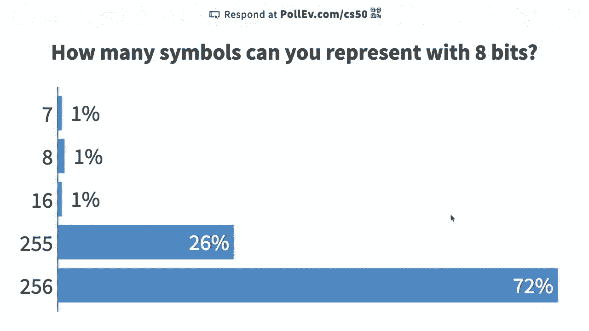

你可能认为答案是256，确实是这样。你可以通过数学计算出来，如果是0或1，这意味着第一个比特有两个可能性，第二个比特也有两个可能性，依此类推。这就是2的8次方或256，这没问题。

这并不是显而易见的，但如果你有八个比特，每个比特可以是两种值之一，你就可以得出256种可能性。那些说答案是255的人，在这种情况下是错的，因为现在我们讨论的是总的模式数量，确实是256，八个比特或八个灯泡似乎确实如此。

255的情况是因为我们可以排列出所有不同的模式。但让我向观众提出问题，为什么美国英语键盘会特别有限，反过来，为什么ASCII在表示人类语言时实际上并不合适，即使这正是计算机多年前开始使用的。

ASCII缺失了什么，为什么256个总可能性可能不足？确实，我是说，缺少了很多不是其他语言的重音字符，但如果你只是考虑像亚洲语言，字符的数量远超过256个，正是如此。因此，我们不仅缺少必要的。

在一些语言中，你可能缺少的字符，尤其是在亚洲语言、阿拉伯语等语言中，我们使用的符号远超过256个。英语我们可以通过适应这个键盘来应付，但一旦涉及字符。

更不用说其他符号了，事实证明，还有其他一些我们人类喜欢说的东西，这些东西最近变得流行，也就是说，你很可能在今天的某个时刻发送或接收了这些东西，通常被称为表情符号。尽管这些表情符号看起来像。

图片看起来像是图像，实际上，它们在计算机中的实现方式是以零和一的模式存在。实际上，这些仅仅是字母表中的字符，所谓的表情符号字母表，也就是说，每一个这些面孔和许多其他表情符号都有一些零和一的模式来表示。

这是因为，从ASCII开始，它只使用了七个甚至在某种意义上是八个比特来表示所有可能的字符。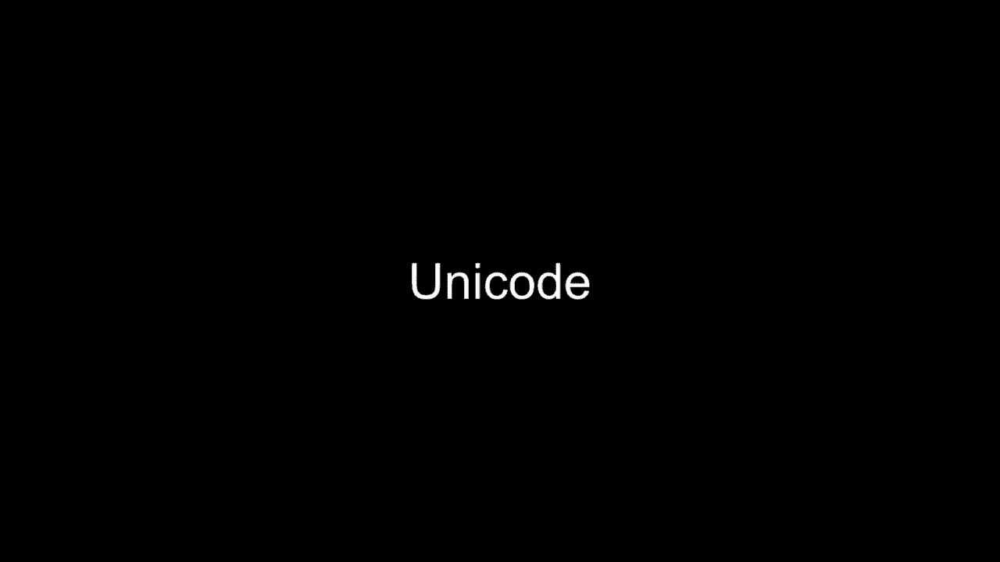

现在有一种叫做Unicode的系统，支持的不仅是英语，还有所有人类语言，这是书面和口头表达的理想目标。书面形式，无论是打印还是电子形式，都是目标，此外。

这就是说我们可以像这样表示事物，这是所谓的“带泪水的快乐脸”。而这种带泪水的快乐脸截至去年是最受欢迎的表情符号，通过短信、电子邮件、社交媒体等发送，但归根结底你收到的就像是键盘上的一个键，所以实际上你看上去并不会知道它，但实际上。

表示这个带泪水的快乐脸的十进制数字恰好是128514，因此为了凯文的观点，表示不仅是某些人类需求，需要超过256个字符，所以我们不仅可以使用8比特，还可以使用16、24或32，这样的可能性巨大。如果你收到或者发送那个带泪水的快乐脸。

从技术上讲，你只是在发送一个看起来像这样的比特模式，这就是全部。所有这些事情，好吧，我们再次从电开始，然后表示数字。现在我们能够以表情符号的形式表示字母，甚至情感，还有什么呢？我们看过的表情符号，都是图像性质的，因此。

这就引出了一个问题，计算机如何表示颜色之类的东西，比如这个流泪的笑脸。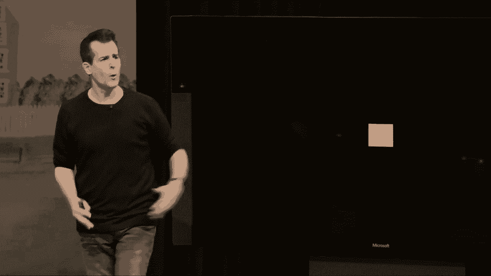

它有很多黄色，那么黄色或任何颜色在计算机中是如何表示的呢？让我再问一下观众，如果你手头只有位，零和一，我们作为人类需要达成一致，如何表示颜色，可能性是什么？这不一定是答案，但你自己的可能是什么？

如果你自己第一次设计这个，计算机如何表示颜色呢？你可能会为不同的颜色和色调分配数字，并使用相同的系统，没错。完美的直觉，你会将数字分配给不同的颜色。

我们都必须达成一致，这个映射到底是什么。结果证明有不同的方法来实现这一点，如果你们当中有艺术家并使用Photoshop等工具，像RGB这样的缩写，红、绿、蓝，但还有其他缩写和方法来实现亚斯敏的想法，我们只是以某种方式映射。

零和一与实际颜色的对应关系，实际上RGB表示红、绿、蓝，这是人类多年前想出的一个系统，说明我们实际上可以获得每种颜色的红光、绿光和蓝光。这就引出了一个问题，我们如何表示红色的量。

我们如何表示绿色的量？我们如何表示蓝色的量？正如亚斯敏所说，我们有位可以做到这一点。假设我们收到一个位模式，那是72、73、33，但这次它不是在电子邮件中，也不是在短信中，而是在我在Photoshop中打开的文件的上下文中。所以就像我打开了一个。

这是某人给我发的照片，我想进行一些编辑，转换位。那么在这个消息中，它表示什么？它的值仍然很高，但在图像上下文中，它实际上将表示一些红色、一些绿色和一些蓝色。正如我们之前发现的，您可以得到的总可能性是。

用八位表示的值恰好是256，最高值可以表示为255，如果从零开始计数，这意味着每一个这三个位数都是0到255之间的数字。因此，72感觉像是中等量的红色。73像是中等量的绿色，33像是少量的蓝色。

如果你将这三种颜色的数量结合起来，八位加八位加八位，总共使用24位，前八位表示红色，中间八位表示绿色，最后八位表示蓝色，结果会形成一个看起来像这样的点，一个黄色的点。因此，实际上这个表情符号在使用时。

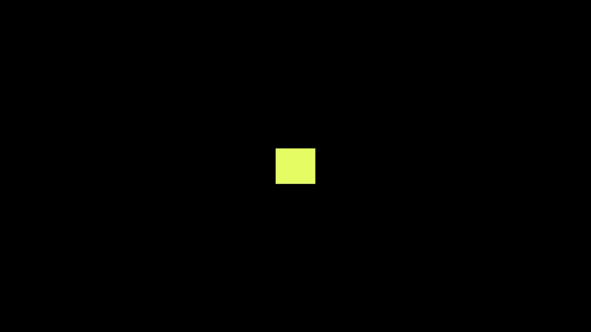

在屏幕上显示的，是计算机解析128514的值，知道哦，那是带有喜悦泪水的表情符号，但在显示时，计算机将使用不同的比特模式来控制颜色，你我在计算机上看到的点。

屏幕或甚至现在的电视，被称为像素，它们是代表某种颜色的小方块，比如这里的这个黄色，你实际上可以在某些情况下看到它们。如果我继续拉出，带有喜悦泪水的同一张脸并放大。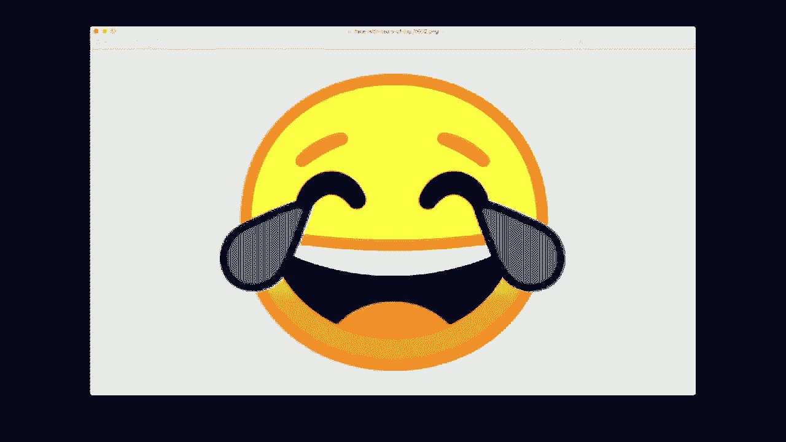

稍微放大一点，真的再放大一点，现在你可以实际看到我们称之为像素化的东西，几乎可以肯定你在Facebook、Instagram或你可能正在调整或编辑的照片中见过这一点，这些照片的分辨率不够。图像的分辨率，就是水平上有多少个像素或点。

如果你真的放大图像，你最终会看到，即使在这个放大的快乐面孔中，有大量的黄色点，以及一大堆，组成了这个非常多彩的图像，因此你可以在这种情况下看到它们。每一个点现在，像素据我所说大约使用24位或。

三个字节，现在你可以想象，图像中可能有数百甚至数千个点。如果我们缩小并再次查看所有点。因此，如果每一个点或像素是三个字节，这就是为什么你我从互联网下载的照片，通常不是用字节来测量，而是用。

或者是兆字节（百万字节），或者更大，十亿字节或千兆字节，但这就是在幕后发生的事情，我们只是以这种方式表示信息。好吧，让我现在问一个后续问题，如果我们现在多亏了Yasmin，代表了所有的图像是一个像素网格，你获取。

你所提出的相同原则是，你代表每个点的颜色，并且有一大堆点给我们图像。你会如何建议计算机表示视频文件。即使你不知道答案，计算机现在可能如何使用仅有的比特来表示视频文件？谁想回答这个问题，计算机可能如何表示。

嗯，我可能只是在快速改变，嗯，我可能只是在快速改变，字节。只是快速改变字节，我听到你能否稍微详细说明一下。你说的快速改变字节是什么意思，嗯，就像快速改变单个像素的RGB。正是如此，以匹配视频的那个瞬间或视频的部分。

完美，所以如果你考虑一下你的手机或笔记本电脑或桌面显示器的矩形屏幕，如果你每秒或每秒多次改变这些点的颜色，我们会产生屏幕上实际存在运动的错觉，因此是视频，所以实际上是视频。

从某种意义上说，这只是一大堆图像，根据雅斯敏的定义，快速地飞过屏幕。因此你甚至可以看到这种老派风格，比如让我在我的屏幕上打开一个短视频，代表一个翻页书，你可能在小时候做过一个，或者你的老师做过，或者你至少见过。

在某个地方，如果你拿一大堆纸，把它们用订书机或夹子固定在一起，画出很多相似但略有不同的图片，你就可以创造出动画，或者说真的，视频，而这在纯电子世界中，甚至是纸质的。

嗯，在计算机世界中，实际上只是一个图像序列以某种速度飞过屏幕，这就是我们今天所知的视频文件，而我们还可以深入探讨更多的细节，例如，你可能如何表示音乐。

嗯，音乐可以用不同的方式表示，比如如果你弹钢琴，你可能知道有像A到G这样的音符，但你知道，也许我们只需要一个数字来代表每一个可能的音符，就像图像使用多个数字来表示点一样，我们可以用一个数字来表示音符。

在一首歌中，还有另一个数字，用于表示该节点的持续时间。你应该听那音符多少秒、毫秒或拍子，因此你可以想出其他的表达方式，但音乐确实可以在计算机的世界中量化成小块信息，只要你和我。

一致同意如何表示这就是这些东西的工作原理。如果你曾经想过，为什么会有JPEG、PNG和GIF，这些不同的计算机文件扩展名或格式只是代表一群人一致同意如何在文件中存储零和一的模式，以便当这些零和一。

加载到计算机中进行显示或解释时，它知道这些模式代表什么。图像的表示方式略有不同，声音和视频的表示方式也略有不同，但归根结底，这一切都是零和一。因此，这一切意味着，只要我们在世界各地达成一致，理想地，如何表示信息，现在我们可以表示问题的输入。

希望能够解决问题，得到输出，因此在解决问题，或者说更广义的计算机科学中，剩下的就是查看这个黑匣子内部，考虑字母、图像、视频、声音，并将它们转换为实际解决方案，因此在这个黑匣子里面，我们通常会描述为指令。

为了解决问题，它们甚至不必涉及计算机。我们人类可以仅通过遵循别人的指令来执行算法。如果你曾经从食谱书中准备过东西，按照食谱，你就是在逐步执行算法。但与许多食谱或我们人类相互给出的许多指令不同，执行过程中没有模糊的空间。

计算机，计算机算法在机器实现时，确实不仅要正确，以便你得到正确的输出，必须非常精确，因为与我们人类不同，我们可以大概理解你的意思，计算机会逐步将算法转换为某些内容。

计算机能理解的语言，责任在于你，确保计算机不会误解你想要的内容。那么我们来考虑这样一个算法，在我们的手机上，无论是iOS还是Android之类的，你都有一个联系人应用程序，而这个联系人应用程序可能。

存储你所有的朋友、家人和同事，可能是按字母顺序排列的，也许是按名字，也许是按姓氏，或者你以其他方式组织这个设备。老派的版本是纸质的，看起来大致是这样：一本电话簿，在一本旧式电话簿里面，确实没什么特别的。

印刷得多，但它是一样的，典型电话簿里有一堆名字和号码，Android手机或iOS手机也是如此。所以假设我们想解决一个问题，输入电话簿，但也包括要查找某人的名字。我的名字，例如，如果我想查找。

我的电话号码或者你可能打开这本书，开始寻找。例如，假设按照名字排序，我在第一页没有看到大卫，所以我继续翻到第二页。我在那里也没有看到自己，所以我继续翻到第三页，我在那里也没有看到自己。

翻到第四页，寻找我的名字，以及我的号码。如果正确性很重要，算法。逐步翻页寻找大卫，正确的，你认为在Zoom中你应该看到一些图标，在参与者窗口下标记为“是”和“否”，如果你想虚拟投票，选择“是”或“否”。

这是黄页，所以我在电话簿中肯定不会出现。但确实，我们假设它包含人类。好吧，看起来这个算法确实是正确的，但它非常非常慢，而我们，计算机科学的关键不仅在于算法的正确性，还有它的效率，以及设计得有多好。

这个算法是正确的，它虽然慢，但我会找到我自己，不过当然我们可以做得更好，而不是一页一页地寻找我自己，四、六、八、十，听起来更快，通过电话簿寻找我自己，这个算法正确吗？让我去问问观众中的某个人，这个搜索算法正确吗？

有人一次看两页，正确吗？因为我声称这样更有效，我声称这样设计得更好，因为我将解决问题的速度提高一倍。不是的，因为你可能会在页面上跳过你的名字，是的，我可能会在页面上跳过我的名字。让我问个跟进问题，我可以修正这个问题吗？

我是否必须抛弃整个算法，或者我们至少能解决这个问题吗？你觉得呢？我认为无论你翻到哪一页，都有助于选择哪个名字在那儿，也许看看你的名字是在前面还是后面，太好了，这正是正确的直觉，我不认为我们必须完全放弃“快两倍”的想法，我能到达。

e区是晚了一页，我应该至少回头查一页，因为我可能会运气不好，也许大卫正夹在两页之间。在那种情况下，我可能会飞过，来到电话簿的末尾说，没有大卫，而我只是运气不好，大约有50%的概率，但正如你所提到的，我至少可以恢复。

我会有条件地问自己，等一下，可能我刚刚错过了，回头再查一遍，这样我可以获得整体的速度提升，但至少可以修正那种错误或bug，bug是编程中的专业术语，指的是程序中的错误或算法中的错误，当我们实际上去搜索电话时。

它们通常不是从顶部开始，然后到达底部，而是计算机可能会更直观地，从中间开始，也许会稍微偏向左边，如果你知道字母表的开头是d，但我就是打开中间，随意浏览，而我在m区。

那么，当我在m区时，我知道什么？再问一个人，我在m区。作为人类，你会如何处理这个输入以解决这个问题？我知道在电话簿中我名字的位置，我能做出什么决定？我能做出什么决定，凯尔，你会怎么做？

嗯，从m区开始，你知道你的名字肯定不会在那里，所以我的名字不会在m区，但多亏了电话簿的字母排序，我至少知道，我可以大口咬下去，这既是比喻上的也是字面上的。

在电话簿的情况下，我可以真的扔掉一半的问题。所以，如果我从一千页的电话簿开始，或者我手机中有一千个联系人。通过大致找到中间，看看左边和右边，我可以决定，正如你所注意到的，那并不在我这一页上。

我在寻找，但我可以决定往左边还是右边。我知道D在M之前，所以现在我可以往左走。而有趣的是，我可以用完全相同的方法，用不同的方式，应用同样的逻辑打开这本电话簿的中间部分，现在我在G部分看到了他，可以撕掉。

把一半的问题扔掉，现在我已经从大约一千页减少到500页，再到250页。如果我再这样做，可能会发现自己，哦，我到了C部分，现在可以再把问题一分为二，扔掉左边的一半。现在我只剩下125页了，这还是很多，但天哪，我已经从一千页减少到了。

从500页到250页再到125页，这比从一千页到998页再到996页到994页要快得多。这两种算法所需的时间都要长得多，所以当你实际上查看949-468-2750时，949-468-2750。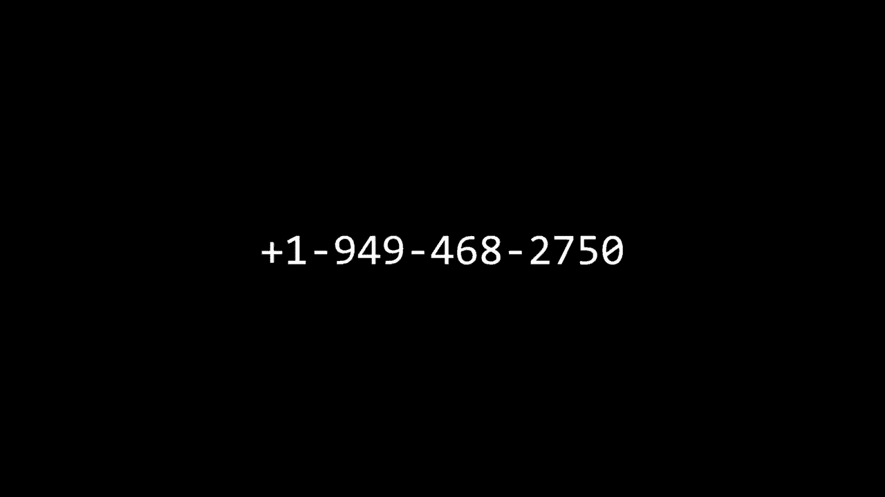

随意发短信问候或打电话打个招呼，但我发现自己用那个第三个算法更快。那么，结论是什么呢？我们可以把这实际上看作一个可视化的东西，让我继续，而不是一次又一次地将整个电话簿一分为二，我们有这个由布莱恩制作的可视化图。

这真是奇妙，描绘出一本一千二十四页的电话簿。每次翻一页，现在我们剩下996页，995页。老实说，这并不是特别启发人，按照这样的速度，用那个算法在电话簿中找到大卫或任何名字将需要很长时间。

但如果我稍微聪明一点，更加直觉一点，我可以再从一千二十四页开始，这次采用“分而治之”的方法，每次一半。将电话簿一分为二。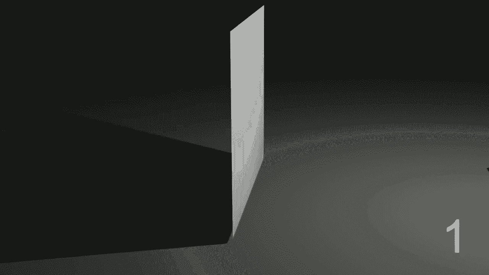

我只剩下一页，如果我们实际上做一下数学计算，如果从大约一千页开始，这个电话簿，468-2750。所以，468-2750。也就是说，第三个算法不仅是正确的，就像第一个算法肯定是的，第二个算法在修复bug后也可以是的，但它也更加。

设计得更好，更高效，所以我们可以从图形上也看到这一点。让我提议一个，不是数字分析或其他东西，而是一些稍微可视化的东西，比如这样，所以如果我在这里有一个X轴，代表水平方向上问题的大小，即数量。

电话簿中的页数和y轴上解决问题所需的时间，这些算法看起来如何，如果我们简单地将它们绘制成图。第一种算法在这里以红色描绘，正是一条直线，斜率为1，因为页面数量和所需时间之间存在一对一的关系。

每新增一页电话簿，意味着我可能需要多走一步，除非我走运，能找到在电话簿前面的位置，转变。第二种算法实际上更好，依然是一条直线。因此，它仍然是线性关系，但每两页在电话簿中。

书中我多了一步，两页一次转动，两页一次转动。因此，它严格优于第一种算法，为什么呢？假设为了讨论，电话簿有这么多页，用这条虚线描绘。那么第二种算法所需的时间是多少？

在电话簿中找到某个人将需要这段时间，对吧？在这两条线交点处，如果你使用第一种算法，实际上将需要同样多的时间。因此，假设我们根据需要折回，如果我走得太远超过一个名字，两者都是正确的，但这两者在本质上是相同的。

它们形状相同，坦白说，它们在说和执行第三种算法时感觉都很慢。如果我们将其绘制成图，它在问题的规模和解决问题所需时间之间有根本不同的关系，线条如预期那样上升。因为页面越多，解决问题所需的时间就会越长，但注意它上升的速度有多慢。

这东西几乎没有开始上升，随着问题规模的增大而变得更加缓慢。直观地说，假设理由翻倍了，也许剑桥合并成一个大的电话簿，那么现在有大约2000页，那么接下来需要多少更多的步骤。书中，仅仅增加一步，所以如果你在这条绿色线上看得更远。

当电话簿的规模翻倍时，线本身只会略微上升，因为没有大问题。使用第三种算法，你将问题分解成更大的字节。因此，这两者编程的本质最终就像是利用你带到课堂上的想法，以及你可能在日常生活中使用的想法。

但你不一定会考虑如何利用这些算法来表示问题，以及如何将它们翻译成，开始思考。算法不仅关乎它们的正确性，例如在这里，我故意标记了这三条线为n、n/2，计算机科学家倾向于使用n作为变量。

就像数学家可能会说x或y或z，代表数字。因此，第一条红线是运行时间，所需步骤的数量，情况n。如果电话簿中有n页，也许我在寻找某个人，正好在电话簿的末尾，这将花费我所有的n步才能找到他们。

第二个算法将花费一半的步骤，因此我们将其表示为n除以2。因为如果我们一次处理两页，我们将更快地到达电话簿的末尾，假设名字以z开头；但第三个算法，如果你对数学有点生疏，可以表示为以2为底的对数，绿色线。

描述了解决问题所需的时间，当每次传递时，每一步你都在将问题分成两半，其他两个算法则是从问题中取出一或两个字节，第三个算法是一次处理整个问题的一半，这使得它更强大。因此，当涉及编程时，现在我们。

算法，代码或者在这个例子中我们称之为伪代码，稍后我们将专注于一种实际的编程语言，尽管是图形化的，但现在我们先考虑一些构造或基本理念，这些将对本课程有用，所以让我提出。

我所做的口头表达可以翻译成伪代码。这就像用英语或任何你所说或写的语言实现的算法，但关键是，它必须是正确的。理想情况下，它最好是精确的，以免产生歧义。

第一步确实是我拿起电话簿，第二步，翻到电话簿的中间，第三步。查看页面，我确实做到了，现在事情变得有趣，第四步，页面。我想做什么呢？我应该打电话给那个人，问题解决了，我得到了输出，人的号码，但还有另一种可能性。

如果那个人在书的前面，结果是m。但我在找大卫，他在左边，我应该做什么呢？翻到书的左半部分的中间，这正是我所做的，我有点不必要地将问题一分为二。但从算法上讲，我只是查看了书的左半部分，接下来我该做什么呢？

实际上这就是我提议的，算法现在可以重复进行。我们可以回到第三行，为什么呢？因为从第三行开始，我有一个查找某人在书中的算法，现在减半了，但还有另一种情况，如果那个人在后面，名字以d开头。

但如果那个人在字母表的末尾，那么如果这个人稍后出现在书中，同样的思路，打开中间的部分，回到第三步。最后还有第四种可能性，左边的内容根本不存在，这最后一点虽然有些微妙，但却非常重要。

我曾经有过非常沮丧的经历，比如你的手机、电脑卡住，你看到愚蠢的旋转沙滩球或沙漏，东西冻结或重启，出现问题是难以解释的，你可能会认为是你的错，但其实通常是你使用的软件的程序员的错。

你的计算机或设备，为什么程序员常常未能预见到可能的场景呢？在这种情况下有四种场景，但你可以想象到，可能会忘记，哦，或许大卫根本不在这个电话簿中，但你最好处理这个场景。

计算机冻结、挂起、重启或出现其他问题，这通常是因为人类没有为某些可能的场景编码。那么，我们在课堂上看到的基本概念是什么呢？现在在黄色突出显示的其实是一些动词或我们与这个电话簿一起练习的动作，这些内容通常是。

编程称为函数，函数是一个动作或动词，是让计算机执行某个操作的语句。接下来突出显示的是我们所称的条件或分支。这些就像是道路上的典型分叉，你可以选择这个、那个或其他事情，你可以做一个、两个、三个或四个条件的决定，条件的数量可以很多。

但是你如何决定选择哪条分叉，无论是做这个、那个还是另一个，布尔表达式就是一个问题，其答案是是或否，真或假，或者简单地说是1或0。所有这些对于我们之前提到的提问人都是等价的。

在书中稍后的提问人，还有第三个问题，所以如果你回答一个零的答案，那就是给我们这些称为布尔表达式的东西。最后在这里的黄色部分是这些内容，回到第三行。这将引发我们所称的循环或周期，这只是一个编程构造。

算法的原则使你能够反复执行某个操作，这样你就不需要编写一百行算法，而是可以编写十三行算法并重用其中的部分。我们将开始cs50，看看一个实际使用的语言，它在年轻时被称为编程语言。

对于你们中的一些人来说，它其实代表了很多，这为我们在短短一周内过渡到一种更传统、更老派的语言C奠定了基础。但在CS50的所有语言中，我们将看到称为函数、条件、布尔表达式和循环的这些东西，今天稍后我们也会。

看一些我们描述为变量的其他特性，类似于数学中的x、y和z，允许计算机同时做多件事情的线程，以及其他一些特性，因此在这里我们从伪代码过渡到实际代码。你在屏幕上看到的就是一种名为的语言示例。

C语言是我们这个学期会花大量时间学习的，这就是我之前提到的旧语言，但这种语言有点晦涩，确实在第一眼看去，你可能会想，为什么会有井号、尖括号、括号、大括号、分号和引号，我的天，这里有这么多。

与现在屏幕上的语法相对应，你可能可以猜到这个程序的功能。让我快速询问一下观众，这个程序可能做什么？即使你从未编程过，让我们快速听取任何人的答案。让我们快速听取任何人的答案，这个程序做什么。

嗯，它只是打印出“你好，世界”，嗯，它只是打印出“你好，世界”。没错，它只打印“你好，世界”，我的天，看看我们需要输入的所有语法和按键，仅仅是为了命令计算机去做这些事情，而今天我们将进行对比。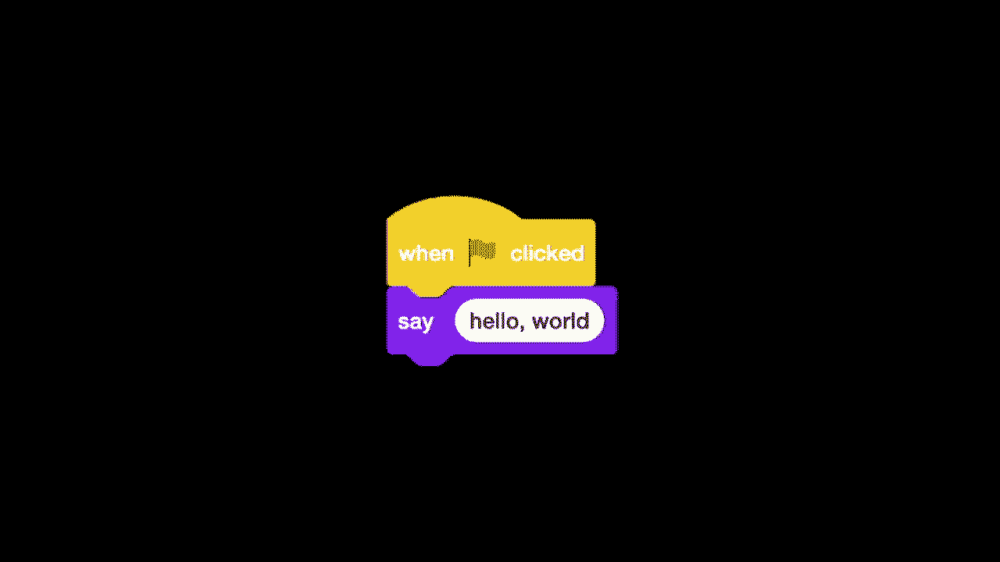

是scratch，我们会给自己一天的时间来看看更友好、更图形化的东西，这将使我们能够探索这些想法，并为更复杂、更深奥的内容奠定基础，但在一个我们不需要担心括号、分号的上下文中，所以让我介绍一下。

你接下来看到的scratch是由麻省理工学院媒体实验室的一些人开发的，你可以在家里跟着玩，如果你愿意，可以访问scratch.mit.edu，它是基于网页的，但也有离线版本，如果你不习惯使用。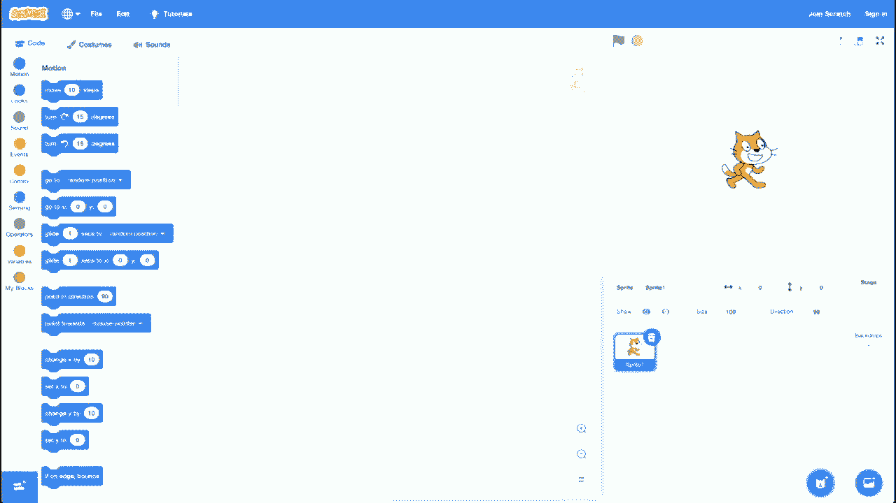

互联网的最佳部分，但用户界面通常看起来像这样，简单的游览。因此，在scratch.mit.edu，当你通过界面上的按钮创建一个项目时，你首先会看到scratch，这个程序的名字来源于一只生活在这个小矩形世界中的猫，你可以上下左右移动。

但这只猫可以变成任何称为精灵的可视化表示。在左边，现在是所有与scratch一起提供的构建模块，所有的编程构造，你会注意到它们是根据颜色和描述进行分类的，还有一大堆“做”的部分，今天的目标不是深入了解。

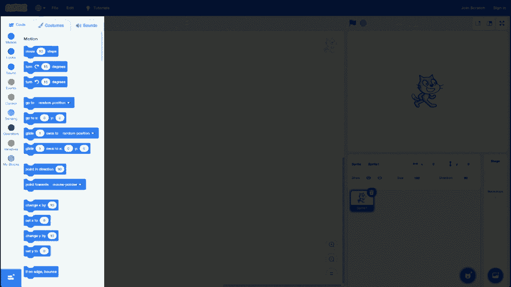

这些各式各样的拼图的杂草，但要突出一些基本的想法。这些想法是可能的，我们将在屏幕中间探索这些想法。我们将能够在片刻之后，开始将这些拼图拖放到这个更大的屏幕上，并将它们相互连接，如果这样做是合逻辑的。

因此，最终对于最复杂的程序，我们实际上可以创建更多的角色或精灵，并在屏幕上进行很多交互。但让我们先从一个例子入手，去scratch.mit.edu，你可以在家一起玩。

同样，我将点击创建，以便准确进入那个帐户。从一开始，除非你愿意，否则让我开始创建。第一个程序，曾由Lore编写的，简单地就是Iris所提议的“你好，世界”，这是一个在屏幕上打印“你好，世界”的程序。

那我们怎么做到呢？我可能会很快做到，因为我之前使用过这个界面。但对于你来说，如果你从未做过问题集或编程作业，目标就是让你动手探索，探究，找出你正在寻找的想法。

你最终会发现弹出，而我将尝试的第一个是这个拼图块，颜色叫做“当绿色旗帜被点击时”。这很有趣，因为如果我去Scratch的舞台，这个旗帜停止标志将意味着停止。所以如果我想在点击那个绿色旗帜时发生某事，我就会。

先从这个拼图块开始，我现在将进入“外观”类别，在外观类别中，有一大堆方块，但我们将保持简单，我将说出Iris所提到的经典语句：“你好，世界”。我将缩回去，移动到Scratch这里。

现在我将点击绿色旗帜，瞧，“你好，世界”，这就是我，也许很快也是你的第一个程序。虽然这并不是特别有趣，但对于第一次可能会让人满意，但我们可以使这个程序更具互动性，并开始叠加这些构建块。

一种更像是搜索的算法，就像查找有多个步骤的电话簿。让我先停止这个程序，让我稍微探索一下。这次让我进入感应这个蓝色类别，你会看到这个块，“询问你叫什么名字并等待”，但请注意，“你叫什么名字”是在这个白色区域。

椭圆形意味着如果我愿意，我可以改变问题，但我暂时对这个问题没意见。让我先去掉这些方块，这次从“询问你叫什么名字”开始，并等待。但注意这有点像一个块。这一“询问”拼图块将字面上问正在玩这个游戏的人。

一个问题，它将把那个问题的答案存储在一个变量中。这里描绘的是一个蓝色的椭圆，称为答案，就像数学中的那样。那么，让我再次去看看，去说，hello，但这次你知道吗，让我。继续说，hello，逗号，然后好吧，让我，给自己一秒钟的说模块，但我。

不想再说hello了，所以我，打算删除它，但我要回到传感器部分。我将拖动并放下答案，现在它，靠近时，似乎想要磁性连接。实际上Scratch会自动扩展，填充这个拼图块，所以现在我，有一个程序，似乎。一个用Scratch编写的程序，一个用Scratch编写的软件。

当点击绿色旗帜时，将会询问“你的名字是什么？”并等待。这是我们的函数say hello，表示，回答人类输入的内容。那么，让我去Scratch的世界，点击绿色旗帜。注意猫在问我“你的名字是什么？”我输入大卫。

进入，嗯，我只看到大卫。好吧，也许是我，绿色旗帜，发生了什么，这似乎是一个错误。发生了什么，这似乎是一个错误，因为我很确定我有三个，函数：ask，say和say，但我觉得我错过了，第二个指令，你对我犯的错误有什么想法？呃，娜塔莉，你觉得呢？嗨，嗯，你能听到我吗？你觉得呢？嗨，嗯，你能听到我吗？

是的，是的，我们能听到。那么，您，替换输出为相同的函数。是的，我把输出替换成了相同的，函数，老实说。尽管我们使用的是相当简单的，程序Scratch，我的Mac实际上还挺快，而你的PC或，你的Mac或你的手机也很快。

尽管Scratch在说“你好”，并且在说“回答”，正如娜塔莉所指出的，答案有点。难以表达，因为我没有停顿，所以我可以进去找到一个模块。有一个等待模块可以让我插入一个任意的。暂停，但我真的希望这是一次性完成的，那我该如何做到呢？让我去看看。

在操作下，结果发现这里有一堆与数学相关的，东西，还有一些。下面，连接苹果和香蕉，这与苹果和香蕉没有任何关系，那只是占位符，但这里有这个，合并，你知道吗，让我继续。替换第一个，输入为说，然后让我连接hello，逗号。

然后不是香蕉，但让我拖动答案，注意它会放置。到位，让我把这个其他模块扔掉，删除东西时你可以直接拖。到左边然后放开，现在注意我有一个程序，询问“你的名字是什么？”然后我将说连接hello和答案的结果，让我去试试。

现在在停止旧的那个后。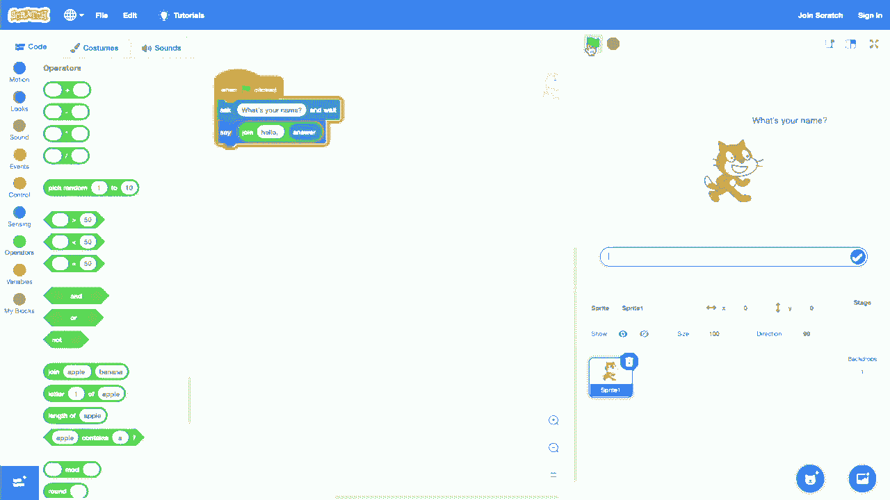

“你叫什么名字”，我输入“david”，按回车，瞧，正如娜塔莉所指出的，现在它不再自我纠缠，破坏之前的内容，现在我可以一口气说完。程序变得更加有趣，但范式与之前没有不同。事实上，让我提出我们刚刚做的所有事情。

完美地契合这个解决问题的整体心理模型，以及计算机科学本身的含义。例如，如果这是需要解决的问题，我有输入和输出是我的目标，算法在中间，让我们考虑我的第一个程序的模型。

我们刚刚写的实际上是“hello world”，它在自己的椭圆函数中。在 Scratch 中称为 say，因此算法是逐步指令，函数就是算法。在这种情况下，函数称为 say，hello world，但事情刚刚变得更有趣。就在娜塔莉的评论之后，当我引入类似“问你叫什么名字”的内容时。

然后注意这次模型发生了什么，现在问题的输入是“你叫什么名字”，这是输入的字符串，而询问块的目的是让猫给我这样的答案。现在这个答案很有趣，因为它有一个前缀。因此，这个块很有趣，因为注意到输入的白色椭圆。

说块实际上还有另一块拼图，然后在上面还有两块拼图。这里很酷的是，当编程时，一个函数可以成为另一个函数的输入，因此流程非常简单。现在我有两个输入到这个函数，都是我写的“hello”。

并回答来自询问块的问题，现在所讨论的算法是连接函数。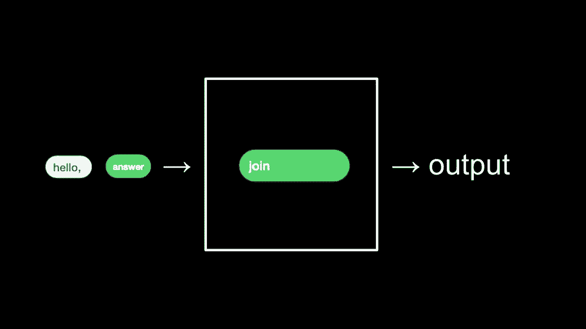

我刚刚使用的它的输出，希望是“hello, david”。但我不想在屏幕上看到白色椭圆显示“hello, david”。所以让我只专注于输出，使其成为最终函数的输入，即那个 say 块，瞧，现在猫说出我想要它说的内容。

即使你开始嵌套，也就是将这些拼图一块块放在一起。我们所做的仅仅是传入输入并获得输出，进行某些操作。那真的就是编程最终的范式，但我们可以让猫做更有趣的事情。为了好玩，让我深入研究一下。

屏幕上，Scratch 有这些所谓的扩展，事物也是如此，让我去右上角的文本到语音。这是使用基于云的服务，即某种基于互联网的服务，它将发送我输入的文字，互联网的某个服务器将会以口头形式响应我刚输入的内容。让我来试试。

继续尝试这个，让我去掉紫色的保存功能。并用这个说话模块替换它，让我拖入这个拼图块。注意，它将扩展以填充，而我这次不再使用这个。我要停止，然后播放。

再一次，输入我的名字，和你好大卫，好的，这不是一个很自然的猫叫声，但注意我们可以设置不同的声音。注意我可以拖动这个拼图块，你甚至可以把模块放在其他模块内部，注意它可以去你想要的任何地方。我将它放在最顶部，尽管我可以放在几个不同的地方。

squeak，听起来合适，让我们尝试一下，输入我的名字大卫。你好大卫，好的，声音仍然不是很好，如果我把它改成小猫，现在你会听到这个。输入我的名字并按下回车，喵喵，好吧，所以在那时我输入的内容并不重要。但现在这太惊人了，我们已经从仅仅说。

你好，世界变成了你好大卫，这正在动态变化，如果你输入名字就会更改。现在多亏了云，即互联网的服务器，我们自动将文本转换为文件，笔记和持续时间，以及我电脑可以播放的内容。好吧，让我们实际上让这个猫叫声更像一只猫，让我继续。

去掉这些模块，让我从声音类别中给自己加一个，怎么样这个播放声音喵，直到完成。现在这是一个简单的程序，当点击绿色标志时播放声音喵，直到完成，来吧，我将点击播放。好了，如果我想再听到猫叫，我得再做一次。

好的，这很好，我可以通过点击播放来娱乐自己一会儿。但我们当然可以做得更好，你可以想象这会很快变得乏味。那么，我如何让猫一遍又一遍地这样做呢？你知道吗，让我喵，喵喵叫三次，所以现在是两次。

好吧，似乎控制没有起作用。让我给它一个小小的暂停，等一秒。好的，稍微快乐一点的猫，但现在这看起来有点乱。确实，它叫了三次，但让我去观众那里。

现在让我们考虑设计，回忆一下，我们的电话簿，第三个算法设计得更好。因为它更快，更有效，但设计还有另一个元素。那就是尽量不要重复自己，所以那些编程的人可能知道，实际上我们在第三行称之为循环。

原来Scratch支持这些称为循环的东西，实际上这里就有一个。如果我放大左侧，注意到控制模块下的这些橙色模块中有一个重复块，尽管默认是10，我敢打赌我们可以更改它。所以让我把它拖到这里，丢掉很多内容。

多余的复制粘贴，让我把这些拼图块移动到重复块里面，它也会扩大以适应它们，没问题。让我把重复改为三，然后重新连接所有东西。现在程序更加紧凑，使用了更少的拼图块或更少的代码行。

更少的步骤，如果你愿意，来达到同样的结果。现在如果我……它仍在工作，所以你可以想象，这仍在工作，所以你可以想象将其更改为你想要的任何数字，甚至有一个无限块，我们可以一直做下去。如果猫要一直这样做，但现在这个程序更好了，现在设计得更好。

因为如果我想改变猫等待的时间，或者我想改变猫喵的总次数，我可以在一个地方而不是在一两个或三个地方改变那些细节，通过复制粘贴那些相同的拼图块。那么关于那个无限循环呢？如果你确实想做一些事情。

我可能想做些什么呢？好吧，让我们让猫开始移动。让我现在进入运动类别，去指向鼠标指针。让我放大这个，每次猫指向这个步骤时，我将抓取移动的一些步骤，并将10改为1，现在我将点击播放，接下来我们……

有点响应我的最大光标，我可以移动它，而且我可以让它，实际上。它指向鼠标光标，然后再移动一步。现在我可以让它移动得更快，让我。不是一次一步，而是一次两步，我们会看到现在猫移动得更快，不算超级快，让我们做20步。

一次调整一步，看看会发生什么，这正是动画的本质。你越是调整步骤的数量，或者时间上发生变化的次数，屏幕上就会呈现出越多的视觉效果。那么我们还能做些什么呢？就只需跟随，嗯，你知道的，猫，跟着我，让我试试别的。

总之，让我继续，打开另一个扩展，进入画笔工具，这将让我现在像用铅笔一样绘画，仍然让猫跟着我。我想，其实知道吗，我们来改变一下。我们就让它去我所在的地方，所以还有一个块说“去到”。

随机位置我不想要那样，所以我要通过这个小三角菜单更改为去鼠标指针。现在猫的指针永远不会滑动或者慢慢地、快速地去，它只会去到光标所在的地方。让我现在去下面这个新的笔类别，我该怎么做呢？你知道的，我对我……

当我上下左右移动光标时，在屏幕上用墨水绘图，但我只想在笔放下时绘制。注意左侧的两个拼图块，笔放下和笔抬起，但这里缺少一条逻辑。让我问问观众。我们怎么能增强这个程序，不仅让猫跟随我的光标。

但我也在屏幕上绘制，尼古拉斯，你会有什么解决方案？呃，所以你可以做的是，呃，采取一个if语句，这样你可以控制，当笔抬起或按下，取决于你有的某个条件。我知道有很多东西，比如你用。

如果鼠标点击，如果鼠标在上，你可以说笔是按下的，也可以是抬起的。然后只要它一直跟随，它就会一直在开或关，我真的不知道，不，你真的知道。这是完美的，因为你采用了有永远块的原则，不仅去鼠标指针，还提议。

通过条件提出问题，所以让我实际去控制下，注意类似我们的电话簿，如果else，嗯，这里只有两个问题。我认为当你提出时，笔是，呃，鼠标按钮是按下还是抬起。所以我认为我们只需一个if else，所以让我去拖动这个。

在鼠标指针下方，注意到这里中间这个小的梯形形状。让我去感知这里，注意到，如果我向下滚动，是的，它就在左侧，注意这个。鼠标按下问号，这些是我们的布尔表达式，让我把那个布尔表达式拖到这里。适配它，然后我想做什么，如果笔按下，或者如果鼠标像这样。

嗯，让我全屏，这样我们可以看得更清楚，点击播放。现在猫跟着我，正如承诺的那样，但现在它是一个绘画的猫。如果我点击鼠标按钮，我可以说像很糟糕的草写，像“你好”，自从我做草写已经很久了，所以我们现在有猫。

实际上绘制一些东西，说实话，它画的是一只猫，有点荒谬。但你知道吗，Scratch有这些服装，我们可以在左上角改变它，即使Scratch可以改成笔，或者标记，或者任何我们想要的东西，精灵实际上只是屏幕上的一个角色。

那可以采取任何我们想要的形式。那么我们如何进一步推进呢？我喜欢引入条件和循环，但这里还有其他原则可以介绍。让我去开始一个全新的程序，看看我们能否开始计数，并开始记录信息。

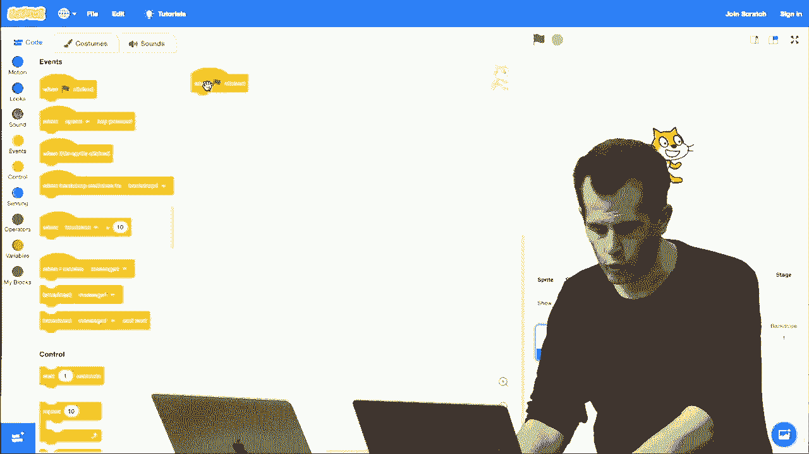

让我们在点击绿旗时这样做，这次我们去变量下，给自己一个新的变量，这个是一个变量，我将要的。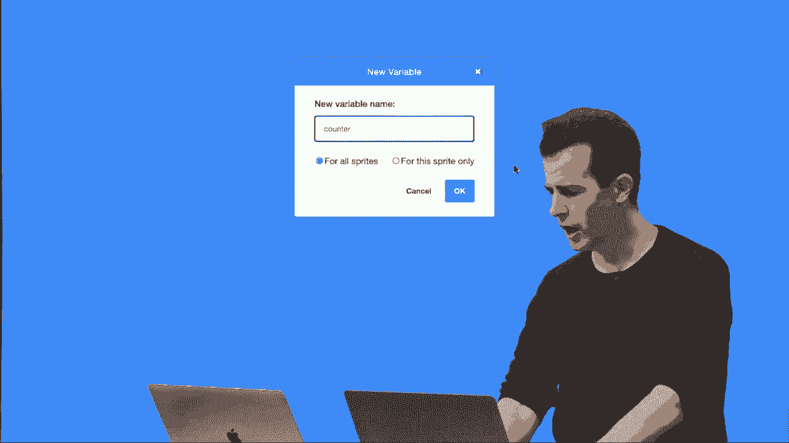

叫这个计数器，仅仅是一个从一开始的计数器。现在这给了我一些自定义拼图块，叫做计数器，还有默认的我的变量，已经在那里了，我将去做这个。我将计数器最初设置为某个永远，让我抓取一个永远块。

永远，当前计数，所以我不想让它说你好两秒，我想让它说。某些东西一秒，比如说，我要回到变量。我要抓住这个我创建的新圆形计数器。然后把它拖到那里，这样你就可以读取，变成一，然后永远说计数器一秒，但。

如果我们不想让猫重复说同一个数字，那么。这将隐式地使数字加一，变为二，变为三，理想情况下一直数到无限，实际上使用一个变量，一个变量，信息。在这种情况下，一个数字不断被重绘，一遍又一遍，现在让我继续。

并且开始打开我提前写的几个程序，这样我们就可以参观其中一些。我有一个叫做反弹的程序，这也是编程的一部分，不仅仅是写自己的代码，还有阅读自己的代码。让我放大一下这个，我已经创建好的。

而考虑一下它所说的，首先设置旋转样式左右，这只是为了修复一个本来会是错误的地方，猫意外地变成了倒立。但让我让我的手挥动。让猫移动10步，如果它碰到边缘，那么转180度，所以现在我们可以重新引入。

动画并不是由我这个人用光标驱动的。我现在可以制作一个游戏，嗯，一个互动的艺术作品或任何东西，现在猫是自我驱动的，因为当我点击播放时，注意它在前后移动，边缘，而那个布尔问题的答案实际上是。

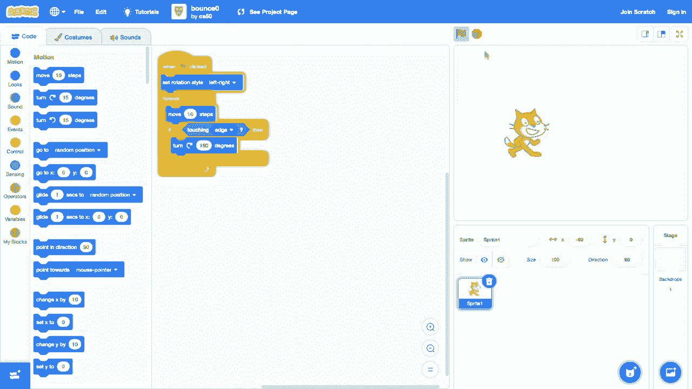

嗯，是的或真的或一，然后它将转180度，但这看起来有点傻，诚然。你知道，猫是从屏幕反弹的，这也许有点不现实，但它并没有真正走路，它是在滑动，但这就是动画的特点。正如我们之前提到的，视频在一天结束时，屏幕。

你知道，我敢打赌我们可以创建我们的真实视频，不仅仅是一个穿着服装的猫，而是猫的脚是这样的，如果我们给自己一个第二个。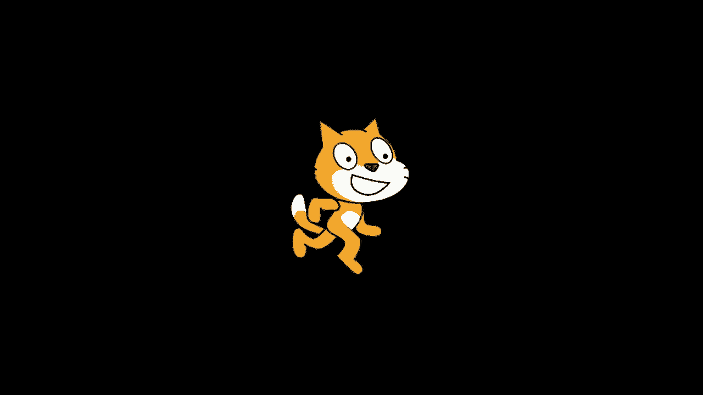

服装几乎是一样的，但它的脚稍微不同，翻页书。我们之前看过的，你知道，我敢打赌如果我在这两个服装之间切换。不断改变猫的状态，我敢打赌我们可以创造出。真正运动的错觉，这就是我们在这个其他反弹示例中所拥有的。

在这个其他反弹示例中，我们有猫现在不仅是前后移动，还注意这个紫色拼图块，在它反弹到边缘后，或者考虑反弹到边缘时。它不断更换服装，变成下一个，再到下一个，所以现在。它不是完全完美，像我们所称的非常低的帧率，这就是。

就像在网上观看一个非常糟糕的动画GIF，它只有两个不同的帧，但看起来更像是他在走，而不是在滑来滑去。而且这个也，Scratch支持听起来不错，比如说，这里是我们之前听到的喵声，我可以录制自己的声音，如果我点击。

这里的小加号图标，点击录制并允许Scratch访问我的麦克风。点击确认几次，好吧，让我录制我自己的声音。哎呀，这就是“哎呀”这个词。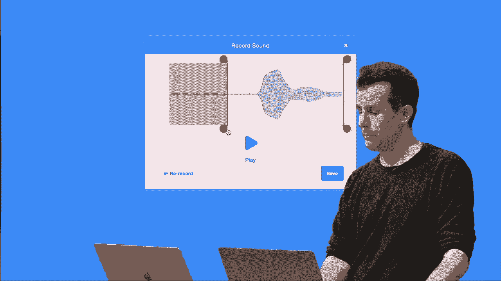

我可以修剪掉开头，让我保存，命名为“哎呀”，现在让我回到我的代码。在声音块下，你知道吗，让我先说。如果我触碰到边缘，我不仅想转180度。现在我可以让这个变得更有趣，哎呀，哎呀，哎呀。

好吧，还是不太像猫，但我们只是在不断叠加。这里的关键点是，随着这些程序变得越来越复杂，目标绝不应是Scratch或C，或者最终的Python，在这门课或其他课程中，仅仅是开始并尝试实现你的全部构想。注意这些程序中的每一个。

我打算从小处着手，添加一两块或三块拼图。从简单的东西逐步构建到更复杂的东西，你知道吗，我敢打赌如果我们合成东西。这里还有另一个例子，可能涉及到抚摸猫，让我继续看看这个程序，这个相对简单，但目前还没有做任何事情。

我已经点击了绿色旗帜，让我放大代码，也许你现在可以阅读我提前写的代码。猫总是在问一个问题，如果触碰到鼠标指针，则播放声音喵，直到完成。好吧，似乎即使程序在运行，它也没有做任何事情，但它在等待某件事情发生，所以让我把光标移到猫上。

所以似乎是这样，如果我保持它开启，它就会不停地喵喵叫，这很像一只猫。你可以想象在循环中拥有条件，正是你想让某样东西做的事，更强大的是，即使在像Scratch这样的语言中，我们能做到这一点吗？让我打开这个海狮。

有一个非常独特的吠叫，但他现在展示的是一个有多个脚本的程序。因此，在这个Scratch项目中，我们不仅仅是一个程序，而是两个。注意它们都以点击绿色旗帜开始，然后你把它们放到屏幕上，看起来更长，但这只是互相适配。

注意每秒钟左右海狮在吠叫，坦率地说，这很快就会让人烦躁，但我该如何停止呢？让我去左边看看，当它还在吠叫时，注意海狮总是在问一个问题，如果静音等于假，那么开始声音C。

说“嗨嗨嗨”两秒钟，所以什么是“静音”？它的形状代表了一个变量，比如x、y或z，这只是保留信息的一种方式。这就像说“静音变量”的值是“假”。如果不静音，继续播放海狮的声音，但我的天。

在右侧这里注意到，还有另一个程序，当点击绿色旗帜时，条被按下。如果“静音”是真的，则将“静音”设置为假，否则将“静音”设置为真，所以程序在“静音”与“非静音”之间切换。我的天，这个程序仍在运行。

非常花哨，很快让我继续创建另一个程序。我会创建一个只有两个块的程序，让我再次进入扩展。视频传感，这次注意启动程序的不同类型。并不是每个程序都必须在点击绿色旗帜时启动，这里有一个类似的形状，但这是。

绿色的那个说，当视频运动时，屏幕正在移动，让我将其提高到50％，让我继续进行这个拼图，两个，50，出去，你会注意到我实际上在屏幕上，让我移出舞台，现在什么也没发生，尽管让我去抚摸一下猫。[音乐]，让我再做一次。

检测运动然后执行，这些简单的构建块可以让我们获得越来越多有趣的事情，你知道吗，我们甚至可以有多个精灵。让我打开一个你可能在游泳池里玩过的老式游戏，一个人喊出“Marco”，其他人则。

假设要喊出“Polo”，注意这里有一个包含两个精灵的程序，所以有两个木偶，一个橙色木偶和一个蓝色木偶，而且在底部这是第一次，我们有两个不同的精灵可以编写程序，现在选中了橙色木偶，这意味着左上方的程序。

这里属于橙色木偶，永远地说，如果按下键盘的空格键，则说“Marco”两秒钟，然后这是新的功能，在编程中有一种方法让一个程序与另一个程序对话，或者在这种情况下，让一个精灵与另一个精灵对话，传递你在屏幕上看不到的秘密消息。

但一个程序可以从另一个程序那里听到，这称为广播事件。这就是橙色木偶的图标，他不会做很多事情，但在绿色旗帜被点击时，他不会做任何事情，当摄像头看到运动时，他将会在收到事件时。

说“polo”两秒钟，所以在这种情况下，如果我现在按下播放，什么也不会发生，但当我按下空格键时，橙色说“marco”，蓝色说“polo”，但它们是独立写的，我为蓝色编程，它们以某种方式互相通信。说到通信，现在有更多的事情可以做，多亏了互联网和。

进入云端，让我快速打开另一个新画布。给自己设定一个“当绿色旗帜被点击时”，让我再问一遍同样的问题。但现在让我进入这些扩展，找到翻译扩展。它将使用云端，将我输入的内容发送到互联网。

获取响应，然后在这里的屏幕上显示，所以屏幕。像是说“hello”，但我不想说类别，我想翻译你知道我喜欢这个块将某些内容翻译成另一种语言。但让我再拿一个“join”块，继续连接。

这个“hello”这个词，以及人输入的名字，所以为了得到这一点，我再次需要“answer”块，之前我说过。将“hello”和“answer”的连接结果，虽然上次是带有逗号的，但现在让我们这样做，让我将“join”的输出作为“translate”的输入，让我。

在这里将“say”翻译成阿拉伯语，让我将其拖放到“say”块中，所以现在我们有两个输入进入“join”，而“join”的输出进入“translate”的输入，翻译的输出进入“say”，但最终结果是我会输入我的名字David并按下回车，您好David，现在用阿拉伯语表示，都是得益于。

这些功能条件、循环的原则，现在甚至还有添加。在互联网的背景下，但让我们考虑一下游戏，总之，有一种方法可以实现，事实上我们已经做到。让我回到我们上次谈到的喵喵声，在我们的一些喵喵示例中，代码看起来像这样，我重复了三次，请再次回想。

一次又一次，我当时争辩说，这样的设计更好，为什么呢？因为我不是一遍又一遍地拖放同样的拼图块。我使用了一个重复块，去掉了所有的冗余，或许我保持了简单，我在使用一些更复杂的想法，但代码更简单，现在拼图块也更少。

但事实证明这里有一个错过的机会。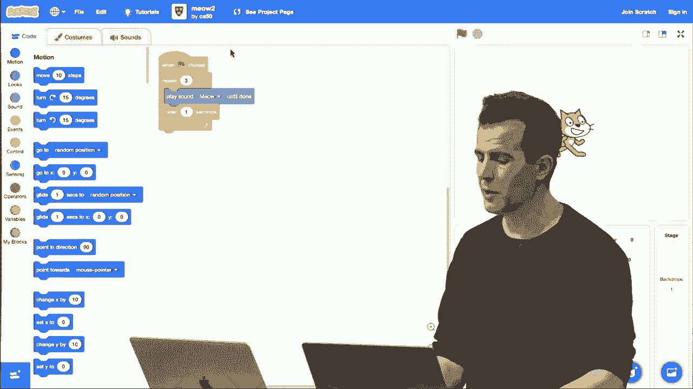

机会，可以应用计算机科学的另一个原则，这通常是我们所描述的。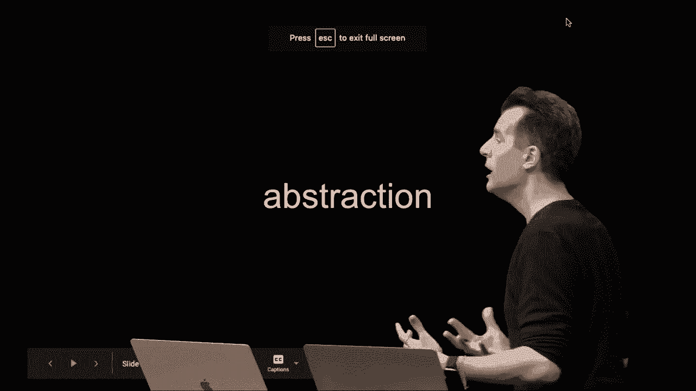

抽象，这是一种很棒的问题解决技术，实际上只是说，让我们把一个非常复杂的想法，或者它可以以复杂的方式实现，但让我们现在简单地说明。让我们现在简单地说明，我们要把它考虑到Scratch中。

有趣的是，我并没有预见到会有一个“喵”块，就像有一个“说”块，还有一个“想”块，但没有“喵”块，这对一个内置有帽子的程序似乎很合适，因此我们可以这样做，就像你可以创建自己的变量一样，注意左下角，你可以用这个粉色类别创建自己的块。

如果我去这里，我要创建一个“喵”，我会很简单地点击确认。现在注意我得到了这个新的拼图块，上面写着“定义喵”，它准备好与其他块连接了，我该如何定义“喵”，我只是把这个拖过来。

右侧因为我刚刚创建了这个自定义块或拼图块。我现在有一个叫“喵”的粉色块，就好像它是Scratch自带的。现在吸引人的是，我可以把这个看作是“看不见、想不见”。谁在乎“喵”是如何实现的，我们只需规定，我们可以理所当然地认为它存在。

如果我现在放大这个新程序，现在从某种意义上说更易读了，稍短一些，有更少的拼图块，但也更具自描述性，我可以阅读我的代码，看着这段代码说，好吧，很明显，它会重复三次一个“喵”块，但让我们播放一下，我打赌我们可以再简化一步。

但我打赌我们可以简化这一点，灵活点，让我右键点击或者控制点击我们称之为“n”的“喵”自定义块，添加一个标签，内容是。

我来点击确认，注意到我的拼图块现在看起来不同了，更像是麻省理工学院的一些输入块，带有这些小白椭圆，事实上现在注意我能做什么，我可以改变“喵”的定义，正如Scratch已经为我做的那样，现在我可以在里面做更多的事情。

让我先断开所有这些，移动“重复”块到“喵”的定义本身，让我来播放声音并等待在那个重复块里面，但注意这个小圆圈在末尾，让我只是重复任意次数，现在我不需要担心。

硬编码3、10或其他任何东西，现在不再需要担心了，让我们把之前写的缩减成仅仅两个拼图块，当绿色旗帜被点击时“喵”确定三次，我不需要再知道或关心“喵”是如何实现的。

我只需要知道有人为我做了这件事，无论是麻省理工学院，重玩，[音乐]，二和三。因此，现在我们有了一个抽象实现，将一个相对复杂的想法，比如让猫叫，不用担心所谓的实现细节，仅仅定义一个拼图块或函数。

叫做“喵”，现在让我们把所有这些结合起来，看看一些你们前辈的创作，算是一种故事，几年前你们的同学制作的。涉及到一个姜饼故事，让我去玩，你现在会看到我们已经有多个精灵，每个都有不同的服装，而我被问到一个问题，你会。

像是一个苹果，yes 或 no，所以我不再被问我的名字，而是被问，我是否想要一个苹果。我输入 yes，然后按下回车，注意，这，嗯，不幸的是，那是错误的决定。好的，不幸的是，那是错误的决定，所以。没关系，我们重新开始，红色，停止标志，绿色旗帜，您好，亲爱的，您想要一个吗？

苹果不，我们从这个教训中学习，这次，再次注意动作，所以有一些动画，碰到了另一个精灵，这也很不幸。让我们最后再试一次这个艺术作品，现在我们有了一个苹果，学到了教训，杯子蛋糕学到了教训，好的，现在让我们看看会发生什么。

好吧，惊喜结局，但这一切都是为了，好的，惊喜结局，但这一切都是为了。说通过使用这些循环、条件和函数的构建块，你能开始制作一些更互动的东西。事实上，几年前我自己也做过一些，最开始我自己写的是。

Scratch 实际上是我在研究生院时，交叉注册了一门 MIT 的课程。教授是 Scratch 的作者和创始人，他提出了我如何思考解决现在一个相当大的问题的方法。回到那个时候，把尽可能多掉落的垃圾拖入垃圾桶。

现在发生了什么，一块垃圾正在屏幕上掉落。你会看到它从上面移动，就像这样，但看这个，我敢打赌，使用一个条件和一个永远循环，我们可以做到这一点，让它可以被拾起，注意现在垃圾跟随我的光标，就像猫之前那样，并注意，如果碰到这个其他垃圾桶精灵。

也许我们甚至可以让奥斯卡从桶里跳出来，他开始计算我的得分，从而使用一个变量，确实，随着更多精灵或更多垃圾掉落，我可以继续以这种方式玩游戏，但在这里，即使事情开始更快速地发生，屏幕上也有更多内容，背景中正在播放音乐。

这一切都简化为基本构建块，写下了你刚刚看到的。其实我做的第一件事是，我在谷歌上查找，找到了“芝麻街”的路灯，我把它放在屏幕上，那算是版本一，它什么也不做，但看起来像我想要的样子。

然后我添加了垃圾桶，然后我想，我编程了一块垃圾或一个。精灵掉落，所以我把猫换成了一块垃圾，然后让它从上到下动画。然后在第四或第五个版本中，我添加了一个永远循环和一个条件。检查鼠标按钮是否按下，如果是的话，我让它跟随鼠标指针，所以我拿了一个大。

问题被逐步拆解成更小的步骤，这也是 CS50 的安德鲁·贝瑞多年前采取的相同方法，他是我们的一位教学助理，我想给大家留个印象的是他的第一个 Scratch 项目，这是一个他称之为。tune 的程序，观看时，今天我们的最后一个 Scratch 程序，安德鲁是如何做到的。

现在你看到的编程，安德鲁进入了现实世界，并没有追求计算机科学，他现在实际上是克里夫兰布朗队的总经理，这是一个美国足球队，这也说明了你可以形成什么样的基础，无论你的。

预期专业是什么，考虑到毕竟我们在这门课程中要关注的很多想法最终都是关于。问题解决，编程只是这个行业的一个工具，实际上，即使在当今世界，对于算法、分析、视频模拟等都有很多。

安德鲁的世界和你的世界，必然会在你开始构建自己的工具箱和理解时碰撞，因此。总结一下，我们来看看安德鲁的项目，期间这是 CS50，现在，[音乐]。[音乐]，嗨嗨，我们是你的天气女孩，嗨嗨，我们是你的天气女孩，听着。

为你的孤独女孩准备好，把那些雨伞留在家里，好吧，我们得赶紧。我们得赶紧。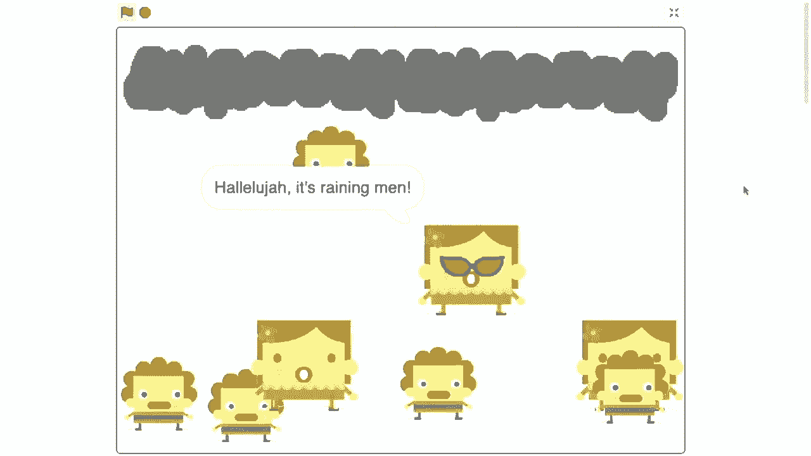

[掌声]。
