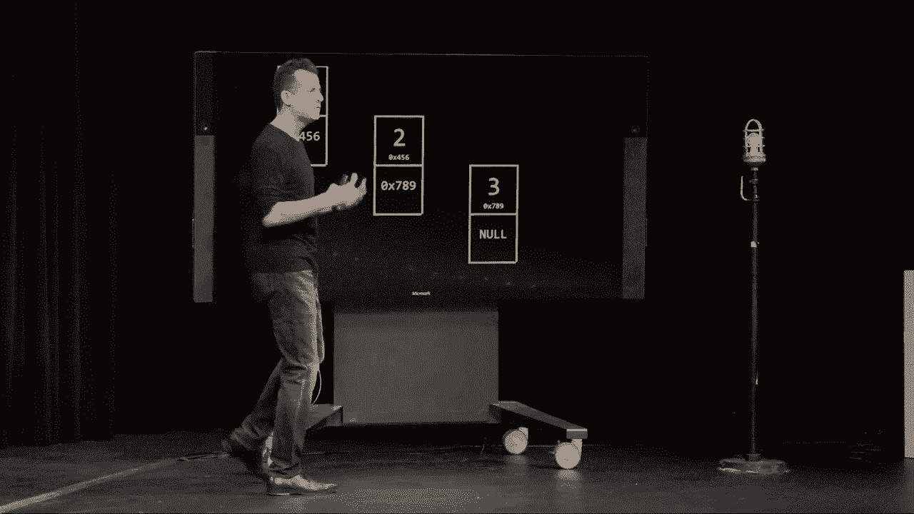
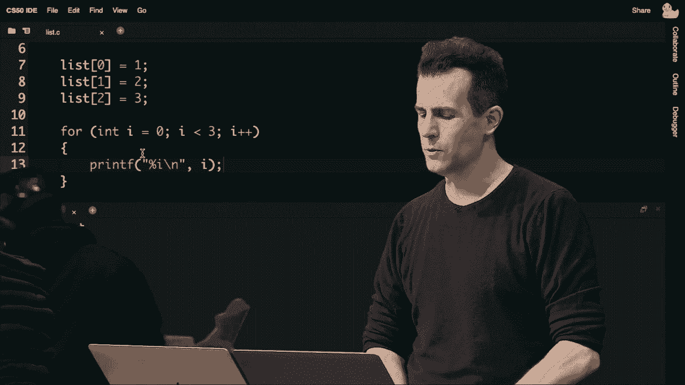
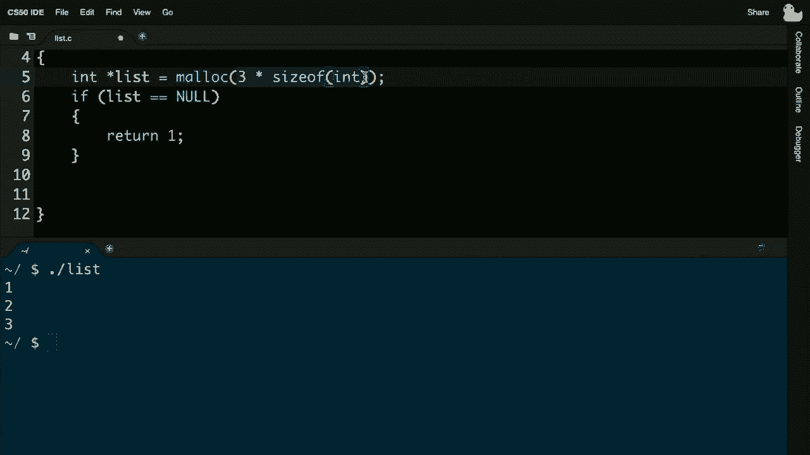
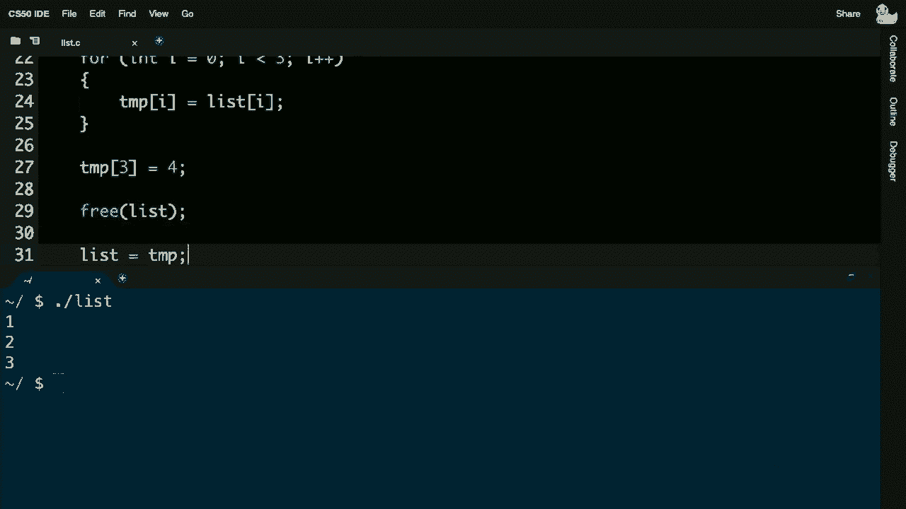
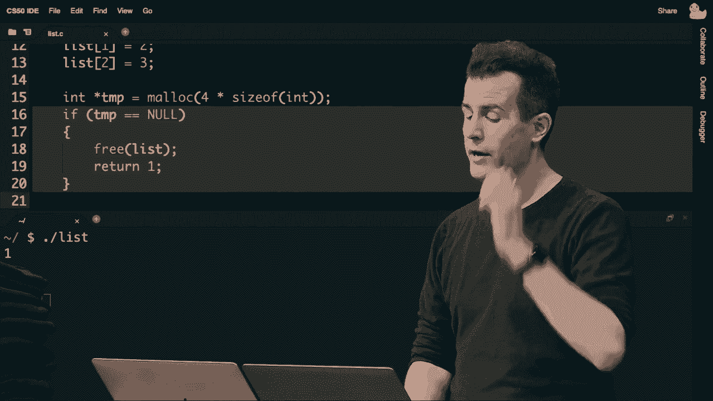
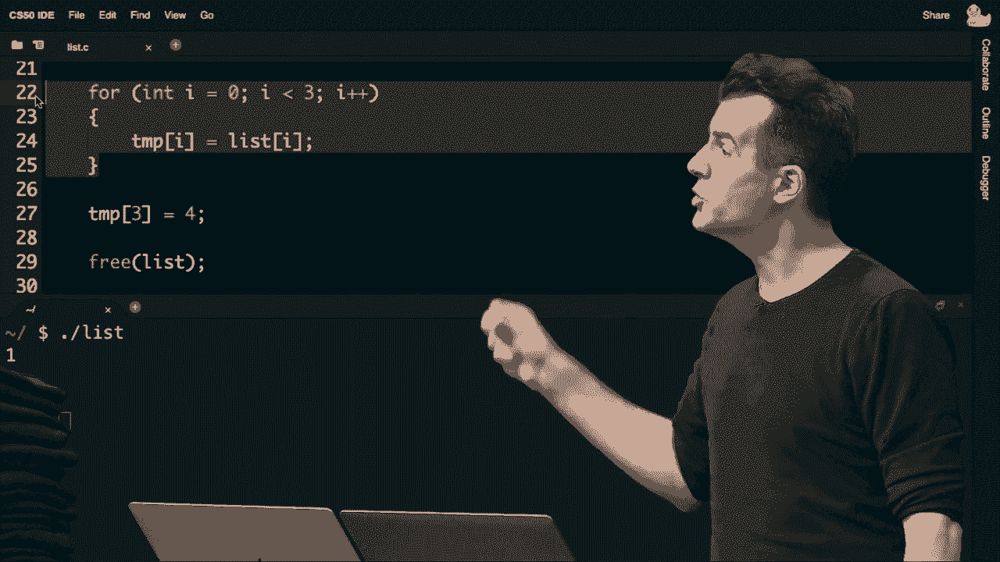
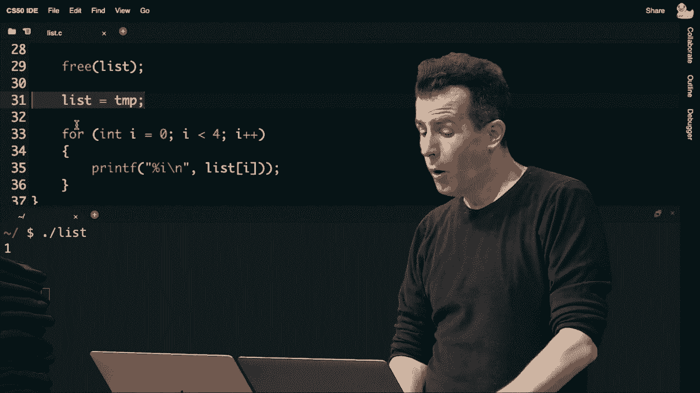
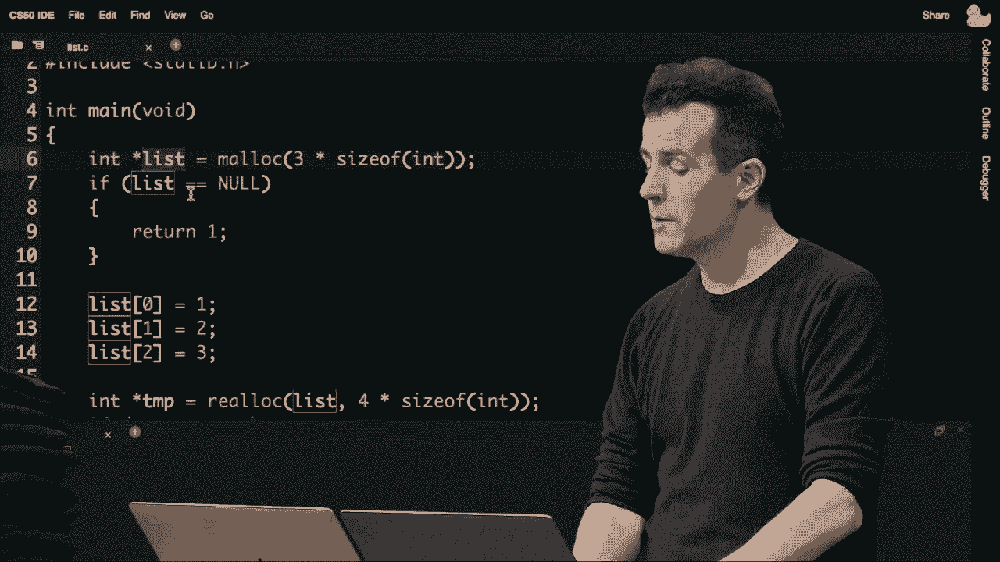
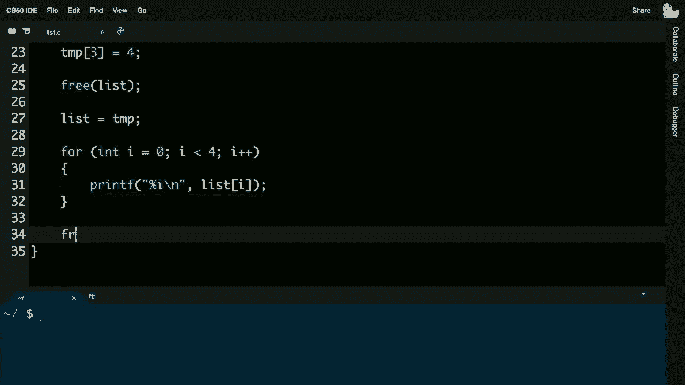
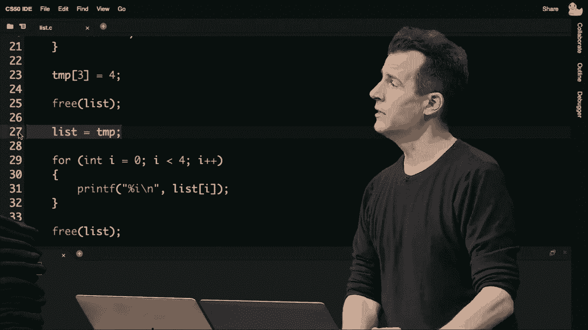

# 哈佛CS50-CS ｜ 计算机科学导论(2020·完整版) - P10：L5- 数据结构 1（数组、链表、树、哈希表、字典树、堆、栈、队列） - ShowMeAI - BV1Hh411W7Up

一切都好。

这是CS50，这是第五周，回想一下上周在第四周我们介绍了一些新的构建模块，即指针，并详细讲述了如何现在操作计算机的内存，并开始以更低的层次进行处理，今天我们将使用这些基本构建模块来开始。

创建称为数据结构的东西，在计算机内存中，结果是，一旦你拥有了引用计算机中不同位置的能力，你可以创建自己的自定义形状，称为自定义数据结构，确实我们将通过回顾一下第一次看到数据结构的地方开始。

在第二周，所以我们称之为第二周，那是我们玩C语言的第二周。我们向你介绍了数组的概念，数组只是内存的一个连续序列，你可以在其中存储一堆整数，逐个存储，或者可能是一个后面接着另一个，这些数组可能已经。

如此图示表示，所以这将是一个大小为3的数组。

它，开始遇到问题，但也解决了问题，今天假设你想向这个数组添加另一个数字，但你只考虑创建一个大小为三的数组，数组在C语言中的麻烦是，它们并不容易调整大小，你们都知道，你必须提前决定数组的大小。

所以如果你后来改变主意，或者你的程序运行得够久，你就会发现自己陷入困境，比如，第四个，理想情况下你会将其放入这个数组，然后继续你的事情，但数组的麻烦在于，那块内存并不是独立存在的，回想一下如果我们。

放大一点，看看你计算机的所有内存。

这一个字节以及其他许多字节可能很可能被其他变量或你讨论的其他方面使用，假设相关程序有一个大小为三的数组，包含整数一二三，然后假设你同一个程序，在代码的某处有一个字符串，你已经，世界。

偶然间，可能是一个h-e-l-l-o，逗号 空格 w-o-r-l-d 反斜杠零。并且可能有“自由内存”，可以使用。那些被垃圾值填充的内存，垃圾并不是坏事，它只是意味着你，值是。或者曾经在那里，因此有“自由空间”，每一个oscar都代表。

有效的自由空间，带着一些垃圾值的残余，可能是某些。过去执行的遗留问题，但这里的问题是，你可能想放置它的位置。那么如果我们有一个大小为三的数组，包含三个整数一、二、三，但它有点被逼到墙角，H-E-L-L。

等等，已经立刻在那里，没有牺牲h，这确实不觉得像是解决方案，问题是我们是不是完全没希望？在这种情况下，你能否向数组添加数字，或者有没有什么解决方案即使你从未编程过，屏幕上有那种布局。

我会说，嗯，也许你可以创建一个新数组，但大小大一个或多一个元素，然后添加那个新元素。是的，这真的是个不错的直觉，毕竟屏幕上有所有这些垃圾值。

空间，我可以把一、二、三、四放在这里，或者放在这里。所以我们有一些灵活性，但圣地亚哥说得对。直观上，我们只需要专注于新数组中的四个可用位置。这个大小为四的数组最初有这四个垃圾值，但那是。

好的，因为圣地亚哥也提到我们将一、二、三放入新数组中。也许我们现在甚至可以释放原始数组的内存。就像如果我们使用`malloc`一样，这当然会留给我们一个大小为四的数组，带有第四个垃圾值，但现在。

我们确实有空间放置数字四，所以看起来这个问题是有解决方案的，不违反数组的定义。数组的唯一定义实际上是内存必须是连续的。你不能随便在计算机的内存中放置四。

成为现有内存之后，如果整个结构确实还是数组，但我担心这可能会花费我们一些时间，实际上让我，继续打开屏幕上的一个问题，欢迎你们参与，插入的运行时间会是什么。

现在揭示投票问题，随时可以去常用的URL，布莱恩，如果你不介意按习惯复制粘贴，你认为插入的运行时间是多少。

插入数组，回想过去我们讨论过数组时的时间，我们实际上在谈论插入它们。如果我们取一个，像80%的人觉得是线性时间O(n)，插入到数组中可能需要多达n步，5%的人提议是n log n，7%的人则。

n 的平方，然后是两和五个百分点，这是一种有趣的混合，过去。我们谈到了搜索回忆，通常我们能达到，呃，O(log n)，这真的很好。不幸的是，如果我们必须执行圣地亚哥所提议的，实际上把所有元素复制。 从旧数组到新数组，这确实会花费我们多达 n 步。

因为我们必须将每个原始元素一二三。复制到新的数组中，新的数组大小为 n，加一，因此总的步骤是 n 步。所以插入到数组的运行时间，至少在上限方面，将确实是 O(n)，因为你必须潜在地复制，所有那些元素。

但如果我们考虑插入的运行时间下限，我们可能会有不同的看法。数组的插入下限可能是什么？在这里我们可以使用 Ω 符号，最好的情况可能需要多少步。插入一个值到数组中，我们不会对此进行投票。

布莱恩，为什么我们不去**做**一下电话呢。

有人能说说插入运行时间的下限吗，瑞安，你觉得呢？好的，最好的情况是数组中只有一个元素，因此你只需。放入数组，没错，所以如果你有一个数组，让我强调一下，它已经。空着，可以容纳新的元素，那么确实，Ω(1) 常数时间就是你所需的。

在数组中，无论数组多大，也许它的大小是四，但你只放入了一个数字。

这没关系，因为你可以立即将新数字放入位置。

请记住，数组支持随机访问，可以直接跳到任何位置，所谓的常数。时间只需一步，如果不满，那么是的，插入到数组中的下限将是，常数时间 Ω(1)，但正如我们在圣地亚哥的情况中看到的那样，你会有一个已经填满的数组。

元素，如果你想再添加一个，在这种情况下，上限确实是 O(n)，因为你必须从一个转移到另一个。现在你们中的一些，Java。可能对“向量”这个短语很熟悉，向量有点像可以调整大小的数组，可以增大或缩小，这在 C 中并不是数组的性质。

在 C 中，数组只是连续的内存块，值一个接一个。 但是一旦你决定了它们的大小，那就是它了，你必须自己调整大小。它们不会自动为你增长，因此数组是。我们看到的第一个，也是最简单的数据结构。

但这并没有我们现在可以做的强大，因为我们可以访问计算机的内存。今天我们将开始利用这些称为指针的东西，即我们可以引用内存位置的地址，我们将开始拼凑一些更复杂的数据结构，首先是单维的。

在某种意义上，这是二维的，在某种意义上，通过使用一些非常基本的构建块，回想一下这三种语法。

从过去几周的结构回忆来看，这个机制是C语言中的这个关键字，我们可以在内存中定义自己的结构。我们看到一个包含姓名和电话号码的例子，就像电话簿一样。你已经见过点运算符，点运算符是我们如何进入这样的结构并获取点名称或点数字，即结构内部的特定变量。

然后在上周的回忆中，我们看到了星号运算符，这是解引用运算符，口语上意思是去这个特定地址。因此，仅仅使用这三种成分，我们现在能够构建自己的自定义数据数组。这最终能帮助我们更有效地解决问题，实际上解决了一些数组的问题，而这些问题可以说是什么呢？

这在C语言编程中是如此常见的技巧，星号的使用，今天几乎是构建块的过去。但我们将以新的方式使用这些构建块，以开始不同地解决问题，首先通过一种称为列表的数据结构。

好吧，如果向数组中插入需要大O的N步，坦率地说，这有点烦人。这种开销相当大，因为随着时间的推移，如果有大量数据，像谷歌或推特这样的公司，如果你的数组是为了高效搜索而设计，那是没问题的。

回想一下，如果我们使用类似二分搜索的方式并保持一切排序，则是大O的对数N。但如果每次你想在数组中添加另一个推文或其他网页时，这将是非常痛苦的，根据你解决的问题，你可能需要如Santiago所提到的那样进行复制。

列表将把你原始小数组的所有内容放入一个新的更大的数组中，只是为了添加更多的推文或网页等。因此，链表将是一个更动态的数据结构，你可以在不触及所有原始数据的情况下，增减数据结构，而不必从旧位置移动到新位置。

那么这可能看起来像什么呢？好吧，让我们再考虑一下计算机的内存，假设我想再次存储那些相同的值。比如数字1，为了讨论方便，假设它在我计算机的内存中，地址为0x123，0x表示这是一个十六进制数字。

一二三是完全任意的，我的讨论，因此让我规定这就是数字一在计算机内存中的位置，在这个新解决方案中存储大量数据，假设我想存储数字二，也许它在地址ox456。那么假设我想存储数字三，假设它在地址ox789，所以故意注意。

这些数字分散在计算机的内存中，因为毕竟数组。你可能有hello world或程序，这有点碍事，因此如果我提议，然后二，然后三，那很好，随便放在你想要的地方，你不必担心已经存在的值在哪里，相反，你可以把这些值放在有空余的地方。

问题是如果你只是开始随便放值，比如一二三，内存值。对，你可能知道一在哪里，但仅仅向右看一位置已不足以找到下一个值或加二找到下一个值，在数组中，一切都是连续的。

但如果我们开始将计算机的内存视为一个画布，我们想要。只要我们能够以某种方式第二到第三，无论其他杂乱的东西如何，这都是可以的。因此，事实上让我建议我们通过可能从计算机中偷取更多空间来做到这一点，而不是仅使用足够的内存来。

存储一二和三，让我存储两倍的信息，除了每个数字的数据，让我存储一点元数据，可以说是我不根本关心但将帮助我跟踪实际数据的值。让我建议在这个框中，我实际存储这个值。

ox456再次以十六进制书写，但这只是数字，它是内存中其他地方的地址，在这个框中让我提出我存储ox789。在这个框中让我随意说ox0，我这样做，即使你从未见过这种结构，这正在演变成所谓的链表，为什么我刚刚做的就是这样。

除了分别存储一二和三外，我现在还在额外的内存块中存储ox456和ox789，但为什么。这样我们就知道第一个元素是如何与第二个元素相关的，或者它们是如何连接在一起的，确切地说在第一个和第二个之间，所以现在我实际上使用了两倍的空间来存储。

分别存储指向下一个元素的指针，现在我会将其视为一个列表。这是ox456，因为数字二在ox456上，我关心的是ox789，所以这只是一个有用的方式，现在我可以留给自己线索，以便我可以随意放置一、二、三。

想要在计算机内存中，随处都有可用空间，并且仍然想办法从一个到另一个，然后再到另一个，我们实际上之前见过一些这样的语法，位，这只是技术术语，称为 null（空），我们上周介绍过，这是一个特殊符号。

表示某些地方出现了问题。

与内存有关，或者你没有空间，这种情况类似于地址缺失的情况，保证如果你使用的是任何有用的地址，但你知道，像上周一样，这种情况有点复杂，我并不太关心 0x，*****。所以让我们先抽象掉这一点，开始真正思考这个问题。

一组数字以某种方式。

在底层，链接是通过地址或指针实现的。这些低级数字，如 0x123456789，但从图示上看，我们只需开始将链接列表视为节点的集合。

可以说，节点通过指针连接，因此节点只是一个通用的计算机科学术语，指代某种东西，我在这里关心的是一个数字，这就是一个链接列表，每个矩形代表一个节点，**最终**，结构。但让我在此暂停，看看是否有任何问题，关于我们所构建的结构。

关于这个叫做链接列表的东西之前有没有问题，我们在一些代码中看到它，布莱恩，是的，聊天中有个问题问，难道这不是一种浪费内存吗？对，确实是个很好的观察，这不就是在浪费内存吗，我们存储了所有这些地址。

除了我们关心的数字一、二、三，没错，实际上这正是我们付出的代价，这将是本周、上周以及之后每周的主题，每当我们在计算机科学和编程中解决问题时，总会有某种代价权衡，因此如果刚才是不可接受的。

在数组中插入的时间复杂度是 O(n)，因为，哇，这将需要很多步骤，将数组插入到新数组中，如果这是原因，或者，任何你正在处理的问题。

解决得很好，那就不错，你可以解决那个问题，现在你的数字可以在内存中的任何地方，无需将现有数字移动到其他地方，从而节省了时间，但你付出的代价确实是更多的空间，因此在这一点上，这取决于什么对你更重要。

计算机的时间、你的人类时间，或者，也许是空间或空间的成本。你可能真的需要为那台计算机购买更多的内存，所以这将会是。时间在编程中无处不在，嗯，让我们考虑一下如何。回想一下我们上次在C语言中看到结构体时，我们做了这样的事情来定义一个人。

有两个与之关联的事物，一个名字和一个数字，所以。今天我们不关心人、名字和数字，我们关心的是这些，节点。所以让我去**d**并倒带，抹去那个，让我们说每个节点在这个结构中重命名，person也作为节点，一个整数。

在我们这里，我留出了一个其他值的空间，因为我们最终需要能够。存储第二个数据，第二个数据将是一个指针，它将。表达得很明显，但我们上周奠定了指针的基础。我该如何描述这个结构有指向，另一个这样的结构的指针，有什么想法。

口头上使用的语法，或者即使你不确定确切的，咒语到底。我们应该使用什么符号来表示地址，指向另一个这样的节点，布莱恩。呃，有人建议我们使用节点指针作为节点，节点指针，好的，我我确实记得上周的，表示如果你有int指针。

这是一个整数的地址，如果你是字符，所以如果所有这些箭头实际上只是。代表节点的地址，那语法大概会类似于节点指针，现在我可以把这个指针。称作任何我想要的名字，按照惯例我称之为，life，结构，这将会是额外的。

被称为number的整数，我提议描述那个单独数据结构的顶部，但。这里有一个微妙的问题，在C语言中，记住C是一种相对简单的语言。尽管它常常看起来复杂，但它不理解任何。它之前没有见过的东西，所以现在注意到第一次。

我提到的节点直到现在是，代码，问题在于typedef的性质。实际上在编译器读取那最后一行代码和分号之前，节点并不存在。换句话说，在这个结构内使用或引用所谓的节点是错误的，因为，节点在执行之前并不存在。

值得庆幸的是，有一个解决方法。在C中你可以实际添加一个，额外的词。紧跟在关键字结构后面，我们保持简单，使用必要的。现在我要改变结构内部来表达这一点。所以感觉有点冗长。

这感觉像是有点复制粘贴，但这是提示中的做法。与我们为函数谈论的原型精神相似，这给编译器提供了一个线索，表明好吧，将会存在一个叫做结构节点的东西。然后你可以在那个数据结构内部使用它，并称之为结构节点指针，这更像是一个。

多个单词像这样，但它类似于字符、星号或实例。就像上周一样，我将任意调用，接下来在这里也会发生相同的事情。与过去的情况一样，通过在最后调用这个节点，编译器。你知道的，你不需要到处称它为结构节点。

可以把这个东西叫做节点，所以在这种情况下，它有点冗长，但所有这些只是为我在计算机中创建节点的定义，正如我们用那个矩形描绘的那样。那么我们现在如何将这转化为更有用的代码，而不仅仅是，我们如何开始构建链表呢，让我来。

提出一个链表实际上只需一个指针，事实上，感谢剧院的道具商店，我们这里有一个空指针。如果你愿意，我将这个变量称为list，而list当前指向没有任何东西，这个箭头只是指向地面，这意味着它是空的，实际上并没有指向任何有用的东西。

假设我现在想开始分配一个链表，其中包含三个数字一、二和三。

我该如何做到这一点呢？目前在叫做list的地方，唯一存在的东西。故事中没有数组，最后在第二周，今天全是关于链表的。那么我如何获得一个代表一的木块，一个代表二的木块，以及一个代表三的木块呢？

我们需要使用上周的新朋友malloc，回想一下malloc。允许你分配内存，尽可能多的内存，只要你告诉它那个东西的大小，所以坦率地说，我认为我们今天最终可以使用malloc。

但现在我开始实例化，也就是创建这个列表。动态分配一个结构体，把数字一放进去，另一个结构体把数字二放上去，再一个结构体把数字三放在这里。实际上将它们串联在一起，让一个指向另一个，所幸的是道具商店为我们创建了一大堆这些，让我去**malloc一个非常重的节点**。

它有两个值的空间，你会看到它有一个数字和一个下一个指针。所以我要在这里首先安装的数字，将是数字一，比如说，我将留下一个空位，表示这是一个空指针。

现在我要做一些类似的事情，说好吧，我的变量叫做list，生活的目的在于跟踪这个列表在内存中的位置。我将通过让这个变量指向这个节点来连接一个到另一个。当时要分配另一个节点时，我想插入到这个。

在数组的世界里，内存，复制这个值到新的值中。我不必这样做，在链表的世界里，我只需第二次调用malloc。并说给我另一块足够容纳一个节点的内存。感谢从道具商店里获得的，里面什么也没有，只有占位符，所以它是垃圾。

直到我实际说数字将是数字二，然后我转到我的链表，其变量名为list，我想插入这个东西，所以我跟随箭头。我然后将这个节点的下一个字段指向这个第三个节点，因此现在我有一个大小为二的链表。图片中有三个东西，但这只是一个简单的变量，这只是一个指针。

这指向实际的节点，而该节点又指向另一个实际的节点。现在假设我想把数字三插入这个链表，记住malloc的强大之处在于它可以从计算机中可用的地方分配内存，所谓的堆，这意味着从定义上讲，它可能不是连续的。

下一个数字实际上可能不是内存，它可能在那边，所以这可能是malloc现在。并分配一个第三个节点，它可能在计算机的内存中无处可用，除了像是在这里，这样没问题，它不必像数字三那样在它的位置是连续的，但如果我想保持一个指向那个节点的指针，以便所有这些。

事情被串联在一起，我再次从头开始，我跟随箭头，我跟随箭头。其中之一是，我必须连接这些东西，因此，现在这个指针需要指向。这里的这个块，这个视觉效果是非常有意图的，这些节点可以在计算机的内存中随处可见，它们不一定是连续的。

这样做的缺点是你不能依赖二分搜索，我们的朋友从第0周开始，它的时间复杂度是O(log n)，你可以比O(n)快得多地找到东西，这就是在第一周中电话簿示例的整个要点，但这种方法的优点是你不必实际不断分配和复制。

更多的内存和所有的值，任何时候你想要调整这个大小，我有点尴尬地承认，不知道为什么我气喘吁吁，只是在这里malloc节点，但重点是像使用malloc和。

一些价格，嗯，这确实令人疲惫，但这也会在。内存中分散东西，但你有这种动态性，老实说，如果你是世界上的推特，谷歌，我们有，很多很多的数据，需要复制。你所有的数据从一个位置到另一个，santiago最初提出。

作为数组的解决方案，使用这些动态，数据结构，如链表，在哪里可用。并且你以某种方式记住它，通过将东西结合在一起，就像这些物理指针。这真的是技术的前沿，你可以创造这些更动态的。结构，如果这对你来说更重要，问题，在我们现在翻译这些物理，块之前。

有什么问题或困惑，brian，像往常一样，如果大家在聊天中更舒服，随时可以说出来。聊天中有一个问题，在整个链表的过程中，我们实际上使用了malloc，malloc的用途是什么。真的很好问题，那么我们在哪里。

每次我离开舞台并拿到其中一个大块时，使用malloc。

那是我模拟分配一个节点的过程，所以当你调用。malloc时，它返回给你上周提到的第一字节的地址。一个内存块，如果你调用，malloc一个字节，它会给你一个字节的地址，如果你调用malloc 100，百字节，它们是连续的，所以每一个。

节点然后代表，调用，malloc，实际上也许brian，回答这个问题的最佳方式是将其翻译。现在将其翻译为一些实际代码，我们来做吧，然后再回头看。所以这里是，例如，一行代码，代表我们开始的。

故事中我们只有一个变量，叫做list，它最初被初始化为。什么都没有，这个箭头并没有，指向任何东西，实际上如果它只是指向上。下左或右，它会被认为是一个垃圾值，对吧？这就是它内部的情况。在我实际放入实际值之前，如果我不赋值给它，谁。

知道它指向什么，但让我去啊**d**并更改代码。这个列表变量默认有一些，类似于，null，所以我在这里将其表示。比喻地说，仅仅指向地面，现在表示null。这将是相应的代码行，仅为你创建。

一个空的链表是故事的开端，现在回想一下，我接下来的事情是。拿回这些大盒子中的一个，这段代码可能看起来像这个节点星。尽管我可以将变量称为任何我想要的，malloc，节点的大小，所以我们可能会看到它只是一个，字节，任何数据类型都是如此，我可以做到。

数学并弄清楚在我的Mac或PC或CS50 IDE中，这些节点应该占用多少字节，sizeof刚好回答了这个问题。因此，malloc再次接受一个参数，即你想动态分配的字节数，它返回这些字节第一个的地址。可以将其视为我之前黄色幻灯片中的一个。

它返回的像是这块内存左上角字节的地址，我要将其赋值给一个变量，称为n，以表示一个节点，它的节点星号地址，以及上周看到的星号语法。所以这给我一个块。

最初只是垃圾值，所以没有数字在位，谁知道箭头指向哪里。如果我现在在屏幕上画出来，它看起来有点像这样。列表初始化为null，它现在不指向任何东西。但我刚刚声明的变量n指向一个节点，但在那个节点内部，谁知道。

垃圾值的数字和下一个只是垃圾值，因为那是默认情况下的残余。但现在，让我建议我们这样做代码，只要n不为null，这是你要养成的习惯。每当在C中调用返回指针的函数时，你几乎总是应该检查。

是null还是不null，因为如果它确实是null，你不想去触碰它，因为这意味着这里没有有效的地址。这是使用指针时的惯例，但如果n不等于null，那是件好事，这意味着它是计算机内存中的有效地址。

让我继续，转到那个地址，语法是星号n，就像上周一样。然后点运算符意味着进入结构内部，并进入其中的变量，在这种情况下称为number。因此，当我继续并做这样的事情时。

变量此时指向唯一的节点，并存储数字1。当我继续时，它将包含数字1，一旦我执行这行代码，星号n意味着从这里的地址开始，进入，然后在这种情况下把数字1放进去，我想，嗯，我想继续并替换。

垃圾值表示该结构中的下一个指针，并用null替换它。null只是意味着这是列表的结束，这里没有任何东西。我不想要垃圾值，因为垃圾值是一个任意的数字，可能指向这个方向、那个方向，象征性地说，我想真正地改变它。

这要设为null，因此我可以使用相同的语法，但这里有一个聪明的做法，我不需要像之前提到的那样使用星号和点，因为它们带有一些语法糖。你可以用箭头表示法来替换我们刚才看到的星号、括号和点，这意味着跟随箭头，然后将这个设置为null。

将箭头字面上指向地面以保持清晰，星号，括号。与这完全相同，大多数人之所以更喜欢使用箭头表示法，是因为它确实捕捉到了这种物理性，你从地址开始，你到达那里，然后查看字段数字或下一个，但它是等价的。

与我们刚才看到的星号和点的语法一样，所以在这两个步骤之后，我们是否已经将这个节点初始化为包含数字一和内部的null，但接下来会发生什么呢？在这个故事的这个时刻，在这段代码中，我还有其他变量，没有展示出来，因为我们。

现在从木工的世界过渡到实际代码，所以有另一个变量n，我可以代表自己，如果我是这个值。直到我实际执行这一行代码`list = n`，我才记得这个节点在计算机的内存中在哪里，因此到目前为止，n实际上只是。

这是一个临时变量，它是我用来实际跟踪这个内存中的东西的变量，但是，如果我想最终添加这个节点，那么就是null。请记住，这个指针指向地面，代表null。但是当我现在想记住这个链表中有一个节点时。

我需要实际执行这样一行`code`，`list = null`，好吧，我们接下来做了什么，让我们再进一步一步，所以在这个故事的这个时刻。如果我表示n，我也指向同一个块，n是临时的，因此最终可以消失，但在这个故事的这个时刻，我们有一个大小为一的链表。

让我们继续深入，假设现在我执行这些`code`行，我们会稍微快一点，首先这一行代码与之前相同，嘿，`malloc`给我一个足够大的内存块，能容纳一个节点，再次让我们使用这个临时变量n来指向它，假设这意味着。

如果我代表这个临时变量，我指向这里的新内存块。然后我检查n是否不等于null，那么只有在这种情况下，我才去插入数字二，就像我之前实际做的那样，并且我是否最初将指针初始化为不指向某个尚不存在的其他节点，即。

这样代表null，这就是它，现在已经分配了第二个节点，但请注意。实际上，这种断开只是因为我分配了一个新节点，并放入我关心的数字，并将其下一个指针初始化为null，这并不意味着它是数据结构的一部分，链表，新，所以我们需要执行另一行。

现在编写代码，以便我们最终能够从这幅图中获取到最后的一个，并且在这里我们可以使用与之前相同的语法，箭头，根据那段代码，然后我更新下一个字段。在那段代码的最后，我现在是否有一个大小为二的链表？因为我不仅分配了节点，还初始化了它的两个变量。

数字和下一个分别，我还将它与链表上的现有节点连接在一起。让我再稍微做一点，以便我们可以一次性看到所有内容。现在我们有了这幅图，让我们执行相同类型的代码。我将数字初始化为三，那么这段代码为我做了什么？那一块代码已经malloc了。

第三点也是最后一点，我将顶部初始化为数字三，我将底部初始化为null，我将用箭头指向地面来表示。然后有一个最后的步骤，如果我想去插入那个第三个节点，而不仅仅是我自己指向的变量n，我现在需要这样做。

这种语法你不会经常使用，我们稍后会在实际程序中看到，但它只是说明了我们正在操作的基本构建块。如果我想继续列出，我可以跟随箭头，一旦我能再次跟随箭头到n，因为n是最近分配的节点的当前地址，所以尽管语法有些复杂。

我使用的两个箭头，字面上就像代码。

只是遵循指针的表现，跟随指针，boom，将一个值赋给下一个。那么在故事的这个时刻，当我……我仍然在图片中，但如果我……临时变量，voila，我们一步一步地构建了一个全新的链表。

这似乎是很多工作，但它允许我们动态地增长这个东西。但让我在这里暂停，有关于链表的任何问题或困惑吗？如果我们试图创建一个更长的列表，比如超过三个元素，难道不会显得乏味吗？

是的，真是个好观察，所以我说你通常不会这样写，我们将暂时在一个完整的程序中做到这一点，只是为了演示，但一般来说，你可能会使用类似循环的东西，然后你会在这里迭代一次，再迭代一次。

让我暂时规定，如果你以正确的方式使用循环，你可以通过不断更新变量，只写出一个箭头。因此，有一种方法可以避免这种情况，你可以做得更动态。让我来提一个我自己的问题，如果……。

你想对这个问题进行回答，搜索链表的运行时间是什么？在大 O 表示法中，搜索链表的运行时间是什么？那么，最坏情况的上限是什么？

搜索像这样的链表，不论它有三个元素还是更多。看起来像以前的情况，大约是八十，它的复杂度是大 O 的 n，这实际上是正确的。考虑最坏情况，假设你在寻找数字三，你必须查看所有三个数字，如果你在找数字十。

你将从这里开始，在开始的地方继续寻找，寻找，寻找，直到你到达末尾，意识到数字十甚至不在这里，此时你已经查看了 n 个元素，但链表。

在常数时间内，链表的操作可以很简单。

一点算术，你可以跳到中间元素或第一个元素，所有这些都是使用常数时间完成的。

不幸的是，链表最终只由一个地址表示，这个地址指向第一个节点。因此，即使你们所有人都能在镜头前看到这个节点和那个节点，作为人类我们能同时看到，但计算机只能跟随这些列表，在这种情况下，它的复杂度将是大 O 的 n，但让我问一个后续问题。

这里的一个后续问题是，插入到链表中的运行时间是什么？插入到链表中的运行时间是什么？所以你有一个新的数字，负五。

无论是什么，都将涉及 malloc，但这只是常数时间，它只是一个函数调用，但你必须在某个地方插入它。在这里，看来你们 68% 的人提议是大 O 的 1，这很有趣，常数时间的 n，是否有人愿意在聊天中或口头表达意见？

至于为什么你觉得这是其中之一，它确实是那些答案之一。你对你思考的背后有什么想法吗？如果结果是其他的也没关系，聊天中有什么想法吗？嗯，我想这可能是 O 的 n，因为创建一个新节点的事实，我认为，计算机正在做的所有事情。

当你分配它时，它将像使用那些箭头一样，从一个小时到下一个小时，再到下一个，依此类推。我认为这将是全部，正如你所描述的，它将是一个事件，但你们两个在做一个假设，就像其他大约 80 或 25 个人正在做的那样，你们似乎在。

假设如果新数字，假设是数字四，必须放在最后，或者如果是数字五，它必须放在最后，而我故意设置的情况。是那样的，我恰好保持了它们，按顺序排列一二三。从左到右，但到目前为止我，尚未做出条件，让它。

链表必须是排序的，尽管我们到目前为止看到的例子都是故意这样做的。但你知道吗，如果你想让它，变得花哨一点，更高效。你想要分配数字四，坦白说你并不在乎。保持链表的排序顺序，嘿，只需将这个拿出来放入你的新节点。

在这里插入，另外一个也插入在这里，只需在列表开头插入。新元素，之后的每个数字。像之前一样malloc，但只需在这里继续插入，现在它不会花费一步。因为就我所说的，有像malloc的步骤，我必须拔掉这个。

必须插回去，所以这总共是三到四步，但四步也是。常量，这是O(1)，因为这是固定步数。所以如果你能够牺牲排序顺序，当谈到这个列表时，你可以。

在常量时间内插入插入插入，列表将会越来越长。但是从开始而不是，从结束，所以这也是一个权衡。如果你不在乎排序顺序，并且你没有任何算法或代码。要求它是排序的，那么你可以去**继续**走这条捷径，达到常量时间插入。

无论是twitter、google，还是类似的，或许这实际上是一个净节省，还是一件好事。但再说一次，你牺牲了排序顺序，接下来让我们把这个翻译成一些实际的代码。让我去**继续**，在uh cs50 ide，然后让我们去**继续**，现在。实际对数字做一些操作，并开始处理事情。

在内存中，所以我准备去**这里**，创建一个程序，叫做list.dot c，我的第一个版本是，**并且**，返回空，然后在这里让我继续。就像我们开始的那样，给自己一个大小为三的整数列表，所以这是，三。这个大小为三的数组，我准备去**继续**硬编码一些新。

值放进去，所以在第一个位置，我放上数字一。在第二个位置，我会放上，放，数字三，然后只是为了，演示这个。这是按我预想的方式工作的，我将要，做一个快速的for循环，所以对于int i从零开始，i小于三，i加一，然后在这个循环里面，我准备去**继续**打印出来。

百分之i，然后我将打印，出i的值，所以现在我已经打印出所有的。这些值在我的循环中让我去**继续**，做出，列表。让我去**继续**，然后做./list。并按下回车，确实我得到了哎呀，不，*不是我想要的*，所以这是个好，*可教的时刻*。

坦率地说，我做错了什么，布莱恩，有人注意到如果我。我的目标是打印出列表，但不知怎么的我打印出了0 1。

2，确实不是这个列表中的数字，呃，所以你打印了i，你应该打印出列表的i，是的，我应该打印出数组的内容，也就是列表。方括号i，所以这是我一个新手的错误，让我修正，列表。点斜杠列表，瞧，我现在打印了列表，所以这就是第周，数组。

在第二周，但现在让我去啊**d，转到更动态的东西。那里我不必提前承诺，创建一个呃数组，我可以这样做。通过动态分配的一块内存，所以让我删除我在main中做的所有事情。让我去啊**d，给自己这个，让我去啊**d，声明。

一系列值，其中列表现在将，操作，我将去啊**d和malloc。让我们看看，我想要三个整数的空间，所以最简单的做法是。如果我只是想保持简单，我实际上可以这样做，三倍sizeofint，所以这个版本的我的程序不会使用，数组，而是使用malloc，但它会。

动态分配那个数组，给我，我们将看看这是什么语法，一如既往，现在每次你使用malloc，我应该检查，列表是否等于空，如果是，你知道。我只是返回一个，记住你可以返回零。或者一个或其他值，让main有效地退出你的程序。

我将去啊**d，返回一些东西，非常糟糕的出错了，像是我完全没有内存了，但现在我有了这个内存块，ant。这实际上是malloc给自己一个数组的方式，直到现在每次我们为自己创建一个。数组，我们都使用方括号表示法，而你们都放了一个。

方括号中的数字，给自己一个那个大小的数组。但坦率地说，如果我们有malloc和，内存，如果我想存储三个整数。为什么不让我请求malloc三倍。

整数的大小和，malloc的工作方式，实际上是，它会返回给我一个连续的。

这样大小的内存块，所以，那个只是，就像我们呃，这是一个我们将在分配实际节点时使用的技术，所以在这个故事的这个时刻，只要列表不等于空，我现在有一个足够大的内存块，能够容纳三个整数，和之前一样，我可以去啊**d，初始化这些，第一元素将是一个，第二个。

元素将是二，第三个元素，将是三，并注意这种等价关系。现在在使用数组和使用指针之间，C在这方面有点灵活。如果你有一块内存由malloc返回给你。你可以像上周一样使用方括号表示法，你可以使用方括号表示法。

将那块内存视为数组，因为毕竟数组是什么？它是一块连续的内存块，而这正是 *malloc* 返回的。如果你想更复杂一些，你实际上可以说去那个地址，把数字一放在那里，你可以说去那个地址加上。

一个数字放在这里，接下来的数字你可以说去那个地址加上，二。再把第三个数字放在那里，但，老实说这变得非常快。至少对大多数人来说，这就变成了不可读的，这就是所谓的指针，指针。这相当于使用我们已经用了一段时间的语法。

这只是使用方括号，方括号的好处在于计算机会为你确定每个整数之间的间隔，因为它知道大小，事情变得有趣也变得烦人，而 *santiago* 记得是帮助解决这个问题的，早些时候在第五行分配了三个整数。

但现在在第 13 行，我心想，哦，天哪，列表，我显然可以重做所有代码。但是假设这个故事的一部分，这里需要更多内存，那么我该如何做到这一点呢？让我继续临时分配另一块内存，我将称之为 *temp*。根据惯例，这次我将继续分配四个，作为故事的需要。

我搞砸了，我想为原始分配足够的空间。我并不是完全搞砸，我现在决定要为这个数组添加第四个数字。像往常一样，我应该检查 *temp* 是否等于空，你知道我将继续释放我已经分配的内存，然后我就要离开这里，返回 1。

出了点问题，没什么可以演示的，所以我将完全退出主函数。但如果 *malloc* 没有返回空，并且一切正常，我将要做什么？好吧，让我们首先开始这个。这个对话，*for int i gets 0，i less than 3 i plus plus*，让我们继续，复制到这个新的临时内存块，原始块中有什么，复制，新的数组。

这里是我们如何在代码中做到这一点，简单使用一个循环。像第二周那样，然后让我继续，再添加一个值。*temp* 中的 *bracket three*，这是第四个位置，如果从零开始。我将继续把数字四放在那里，现在在这个时候。

我将继续记住这个事实，*temp* 是我的新列表，所以我将继续释放原始列表，并将我的旧列表更新为。

指向新列表，最后我将继续使用另一个循环，仅仅为了演示我认为这次正确地迭代到四，而不是三，我将继续使用百分号 *i* 打印列表中 *i* 的内容，所以让我们快速回顾一下，我们开始这个故事是通过分配一个。

这次动态演示malloc只是返回一块内存，如果，作为一个数组。你绝对可以把这些东西放在这里，如果，列表等于空就是错误，出了问题。这里有趣的代码从这里恢复，我把数字1、2和3放在内存块的0、1和2位置，这块内存我又把它当成数组来处理。

但是现在在故事的这个阶段，我规定等等。我想去啊**d再添加一个第四个值，我该如何做到这一点，让我们规定我想返回去，更改现有程序，因为。假设为了讨论，这段代码是在谷歌运行的。

随着时间推移推特，只有在收到另一条推文后，他们的代码才意识到，哦，我们需要更多的，15，这次我分配了足够的空间来存储四个整数。我再次进行一些错误检查，如果。

不会发生，让我们完全退出，但如果没有发生什么坏事，让我们接受圣地亚哥的建议，把他的英文建议翻译成C，让我们使用一个从0到3的for循环和内存。

原始内存块的内容，所以temp i获得列表i。然后在这里，temp括号三的点是，从零开始。但是在这个故事的这个阶段，正如我之前的幻灯片一样，我在大小为三的数组中有1、2、3，并且我有1、2、4，让我去啊**d，释放原始内存。

列表并把那块原始内存交还给计算机。让我记住使用我更好命名的变量，这个新内存块的地址。

内存是，然后只是为了炫耀，让我去啊**d，再用一个for循环。这次计数四次，而不是三次，让我现在打印出所有这些值。这是我交叉手指的地方，编译我的新程序，它没有编译成功，好的。因为看起来我有一个括号多了，所以让我们用make重新编译这个程序。

列表另一个错误，所以让我向上滚动一下，哦，有趣。所以这是一个常见的错误，隐式声明库函数。malloc某某，所以每当你遇到隐式声明错误，几率是你只是做了简单的事情，比如你忘记了。

必需的头文件，上周提到的，malloc在标准库中，free也是。因此现在让我们创建列表，双手合十，希望这次能成功，点斜杠列表，瞧瞧。一二三四，所以这现在是一个。

完全逐字翻译，程序，开始时使用了一个大小为三的数组，动态分配内存，然后通过创建一个新大小为旧大小的数组来调整大小，然后像以前一样进行处理。我故意在这里两次使用malloc，如下所示，如果你在C中创建一个数组。

使用方括号表示法，你把自己困在了一个角落。

你可以看到，并且调整你用方括号声明的数组大小。

更技术性地说，当你使用方括号时，你是在栈上静态分配数组，这是计算机内存的一部分，属于该计算机和函数的栈帧。上周的图示中，如果你使用 malloc，我们的新工具，要求从堆中获取内存块。

回馈，并且获取更多，来回的，实际上还有一种更简单的方式来进行相对的重新分配。

通过调整内存块的大小，你不必像之前那样做所有这些，你不需要使用 malloc 两次，你可以在开始时使用一次 malloc，然后使用一个其实在这种情况下非常有用的新函数叫做 reallock，你实际上可以在大小为四倍的内存块中做到这一点。

尺寸结束，但具体来说。

重新分配的东西叫做列表，因此 reallock 与 malloc 非常相似，但它接受两个参数。

一个是你想要的内存大小，无论是更大还是更小，但它接受第二个参数，第一个参数是你已经分配的内存块的地址，正如 malloc 的顶端所示。

在第16行，我现在传递那个地址。

回到 reallock，说等一下，这里是你给我的相同地址，现在请将其调整为大小四，并且它会将现在足够大小的地址返回给你。

reallock 实际上会将旧内存复制到新的内存中，因此再次回到今天一开始的 santiago 故事，reallock 不仅会在你请求时给予你更大的内存块，还会归还你之前请求的内存地址，并且会给你新的内存块地址。

这个空间足以容纳所有新值，而且它也很智能。

如果在现有内存块的最后有足够的空间。

在早先的幻灯片中，你实际上会得到相同的地址，但计算机的操作系统，无论是 Windows、macOS 还是 Linux，都将记住“好的，我知道最初给你分配了三个字节，恰好在那块内存的末尾有空间，所以现在我将记住整型数据”。

或者传入的任何数字，再次，自己可以让计算机实际为你执行重新分配，有没有任何关于malloc、realloc或free的问题？

注意，这还不是一个列表，这仍然是一个数组，因此我们仍然需要处理这个程序。

进一步一步，实际上从使用数组的这块内存过渡到这些实际节点。但在我们这样做之前，有没有问题或困惑，布莱恩，有什么我们需要在这里讨论的吗？是的，有人问，为什么在程序结束时不需要释放临时变量，因为我是个傻瓜，忽略了这个关键点。

在这种情况下，要释放的不是临时变量，而是列表，因此临时变量我已经释放，嗯，此时它是等效的。

这一行27，名称更好。

我把它等于临时变量，这样我就可以将其视为一个更大的列表。不过你说得对，这是我疏忽了，Valgrind肯定不喜欢这种做法。在这个程序的最后，我应该绝对释放列表。然而，我并不需要释放临时变量本身的名称。

关于那个任务的好问题和好发现，其他问题或评论。有人问，为什么链表只使用数组和realloc、malloc来处理这些内容？嗯，真的很好的问题，那么我们如何改善这种情况，如果我们可以用这种方式使用数组。回想一下，在这种回归中，我刚刚做的是。

回归到我们开始的故事，刚刚写完。

我为这个数组重新分配了更多空间，这意味着我。

手动使用那个for循环，或者用它自己的for循环来复制所有旧值到新的数组中。

所以我们在到目前为止写的这个程序的三个版本中采取的方法是动态的。

当涉及到插入时，它们的时间复杂度都是O(n)。

他们没有给我们复制的动态性。

而且我们还没有能力直接在结构的开头进行插入，时间复杂度为O(1)，所以再次这是我们开始时的代码方法。因此，最终目标将是改变这个代码，并给我们一个适当的整数，但我们已经过了一个小时，让我们先休息五分钟。

休息一下，我们再回来。
