# 哈佛CS50-CS ｜ 计算机科学导论(2020·完整版) - P11：L5- 数据结构 2（数组、链表、树、哈希表、字典树、堆、栈、队列） - ShowMeAI - BV1Hh411W7Up

好的，我们回来了，回想一下我们今天开始时，重新审视数组并指出，如果你做对了，数组搜索是很好的，但一旦你想动态修改数组，它的成本迅速变得非常高。可能需要你大约n步进入一个新的、更大的数组，老实说，随着时间的推移，数据量很大。

即使是大O的n也是昂贵的，你不想不断地复制你的所有数据，避免这种情况的方法是使用指针，反过来将这些结构称为链表拼接在一起，尽管这会增加内存消耗。但有了额外的内存和成本，带来了动态性。

如果我们想的话，插入时甚至可以实现常数时间，但当然我们必须牺牲像可排序性这样的东西。所以我们刚刚看到的这个权衡主题有几个实际的C程序示例，首先是旧式的数组，正如第零周所示。

我们仅使用括号表示法将自己困在了一个角落。所以我们改为使用malloc，这是一个更灵活的工具，可以让我们获取我们想要的内存，并用它来重新创建作为数组实现的列表的概念。但即便如此，我们也看到我必须使用for循环进行复制，或者再次进行复制。

对于这些小程序你甚至不喜欢这样，但对于大型真实世界的软件，所有这些都迅速累积，因此最好尽量避免这一切，达到动态性。所以你可以动态添加到链表的代码实际上是下周问题集五的挑战的一部分，但让我们看看一些构建块，分配。

节点并将它们连接在一起，当我们提前知道我们想要多少个时，这并不是现在的情况，因为我只想要这三样东西，所以我将返回之前的程序，在main内部，我要去声明一个类型，称为结构节点，最初里面有一个数字。

我将称这个整体为节点，这很简单，和我们之前处理的一个人类似，但现在更复杂一些，因为我给结构本身起了个临时名字“节点”，我在结构内部提到这个临时名字，这样我也可以在这里有一个指针，现在是节点。

现在让我们继续，实际上在main中使用这个东西，让我先创建一个空的链表，最简单的方式是用新节点指针创建列表，不幸的是，每当你声明一个没有赋值的变量，它就是垃圾，而垃圾在编程世界中是坏的。

指针再次明确，你不需要显式地初始化它的值。不要像null指向地面那样，而是保持为垃圾值，指向这个方向，这个方向，那种方向，也就是说，你可能在自己的代码中意外地跟随这个箭头指向一个完全虚假的地方。

什么叫做段错误，有些人可能已经在问题集四中体验过。当你触碰不该触碰的内存时，会发生这种情况。因此，垃圾值是坏的，更不用说原因了，所以你很少想这样做，你几乎总是希望将指针初始化为某个已知值，而不是实际地址的缺失。

我们将使用null来表示那里没有东西，但这是我们故意为之的。假设我想插入，就像我之前通过搬运块编号1上台那样。让我继续分配一个节点，我们暂时称之为n。使用malloc，这次请求一个节点的大小，所以故事现在在变化，我不再是个体。

节点内部有足够的空间，节点，这个操作符的大小会算出。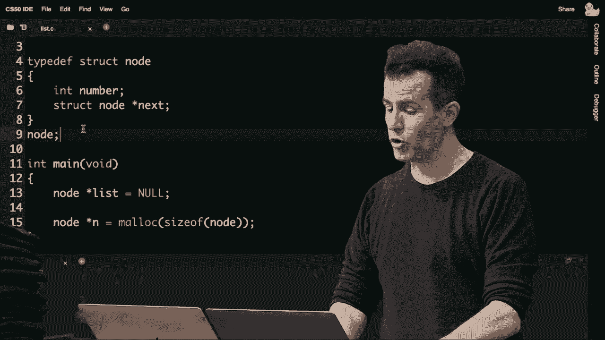

根据这个结构的定义，需要存储一个。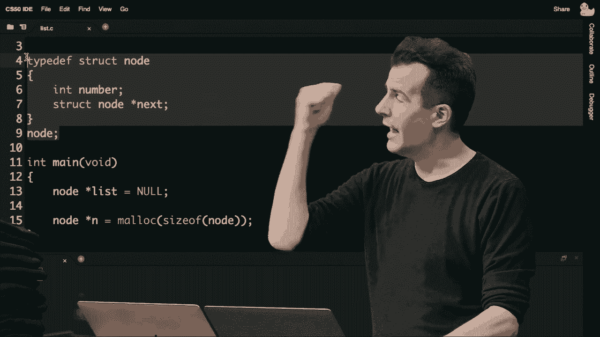

整数和一个指向结构节点的指针，因此我将总是检查n是否等于null。如果是，我将立即退出这个程序，只返回1，因为发生了错误，并且没有足够的内存。但是如果一切顺利，我将继续进入那个节点。

我将进入它的数字字段，并将其赋值为1。接着，我将进入那个节点n，并进入它的下一个字段，暂时将其赋值为null。这就好像我刚刚将带有1的木块分配给null。现在，我将继续更新列表本身，使其指向名为list。

这是我表示整个列表的变量，现在我有一个实际的节点可以指向，我将list设置为n的地址，它指向一个实际的节点，因此在故事的这一点上，我有一个小木块连接到包含1的较大块上。

假设为了讨论，我现在想将数字2添加到这个列表，一个整数。我将继续使用malloc分配n，给自己一个新的节点的大小。我将再次检查，并释放列表，以便不泄漏内存。然后让我继续返回1，以确保我释放了之前已分配的任何内存。

但如果一切顺利，我希望如此，我将继续进入这个节点n。并在它的数字字段中字面地存储数字2，然后因为这个东西也是以有序方式插入的，所以现在下一个是null。如果我确实想把这个数字2的节点放在数字列表后面，我可以去下一个节点，并在内部。

其值我可以说是n，所以这里的这行代码从小块开始，跟随箭头，然后更新第一个节点的下一个指针，指向这个新节点n的地址。最后，让我们再做一次，所以n最后一次调用`malloc sizeof node`，让我先做个健全性检查。

如果n等于null，那就发生了坏事，所以现在我将继续，不必担心语法，只需继续调用`free list next`，然后继续调用`free list`，接着我将继续，处理时间。这只是一个角落案例，在那里发生了一些坏事，但如果没有发生坏事。

如果发生了错误，我将把数字字段更新为三。我将把下一个字段更新为null，现在我要更新列表，n。在这里，之后我可以继续打印这些内容，如果我愿意的话，可以用循环，循环的样子很简单，但事实证明我们可以使用for循环。

在这里也相当强大，但在故事的这个节点上，我的列表指针指向一个节点，这个节点指向第二个节点，第二个节点又指向第三个节点。正如之前有人观察到的，这种双箭头符号在这种情况下并不常见。我敢打赌，我实际上可以在循环中使用它，逐一迭代这些东西。

时候，我们可以在打印时看到这一点，让我继续做这个。四，而不是使用i，因为实际上没有数字在问题中，这不再是一个数组，所以我不能使用方括号符号或指针算术，我需要使用指针，因此这可能感觉有点奇怪。

首先，但没有什么能阻止我用for循环来做到这一点。给我一个临时指针，叫做temp，并将其初始化为列表开头的内容，只要temp不等于null，继续执行以下操作。在每次循环迭代中，不要像i++那样做。

再说一次，现在不相关，但继续更新我的临时指针，让它等于临时指针的下一个字段的值。因此，这看起来可能非常晦涩，尤其是如果你对指针是新手的话。就像上周一样，因为你们大多数人都是，但它和典型的for循环是同一个思路。

你在第一个分号之前初始化某个变量，在第一个分号之后检查某个条件，并在第二个分号之后更新该变量。在这种情况下，它们不是整数，而是我说给自己一个指向列表开头的临时指针，就像我的手指指向的那样。

如果你更喜欢指向列表中某个节点的泡沫手指，就去叫那个临时变量temp，只要它不为null。那是只要它是块的。我想做什么，让我继续，使用printf和%li打印出那个节点的数字字段中的值，就这样，使用这个简单的for循环。

相对简单的`for`循环，我可以本质上指向我列表中的第一个节点。并不断更新到下一个字段，更新到下一个字段，直到我的手指在木块列表的末尾走出，从而指向`null`。在这一点上，循环停止，没有更多的内容可打印。

对于之前那个问题的回答，我们是否需要使用这个双箭头符号，简短的回答是：不需要。这是这里的秘密成分，这段语法在循环内部。它指向你所指向的对象，跟随一个箭头，然后更新临时变量。现在改为指向那个结构，这在做`i`时是等效的。

但这并不像我`++`那么简单，你不能仅仅看一个字节。向右或向左，跟随一个箭头，但通过重新分配这个临时变量到你刚刚跟随的地方，这是一种跟随每一个这些橙色箭头的方法，就像我们做的那样。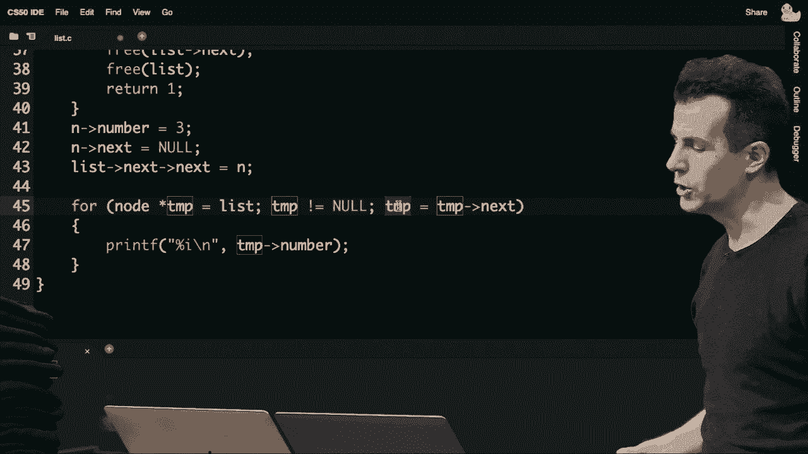

刚才这一刻，在此之后，为了好好检查，我应该去`ah**d`并释放整个列表，让我只是链表，我实际上可以做这样的事情。当列表不等于`null`时，所以当整个列表本身不等于`null`时，继续`ah**d`并像这样获取一个临时指针，指向下一个字段，这样我就能记住。

在当前列表头之后，释放列表节点本身。然后。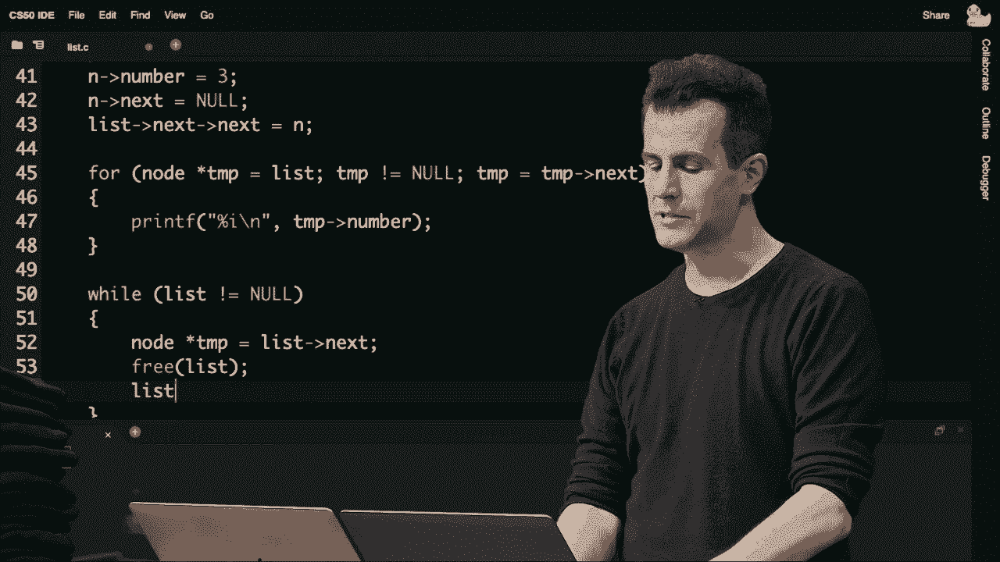

更新列表为临时变量，所以这看起来可能很疯狂，很难理解，尤其是在接下来的几天，特别是针对问题集5，你会以更逻辑的方式更好地理解这种逻辑。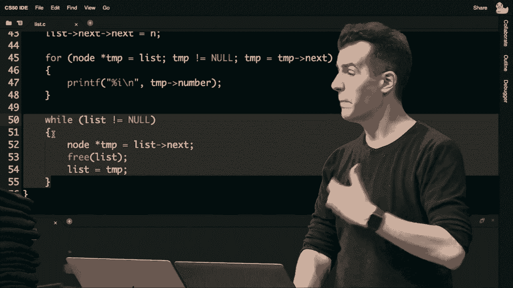

从图像上来看，我在这里做什么，首先，只要我的链表不是`null`，我就会做以下操作。如果我有三个节点，根据定义它就不是`null`，释放我从左到右分配的所有内存。那么我该如何做到呢？如果我有两个。

木块，如果我面前有一个木块，因为那个木块包含指向下一个节点的指针，所以如果我提前释放这个内存，我就把所有后续节点困在了那，因为一旦我告诉计算机，你可以回收这个内存块，对于第一个节点。

这里第52行的代码只是说暂时给我一个名为`temp`的变量。第一个节点，指向下一个节点，这就像用我的右手指向下一个节点。这样我就可以在第53行释放列表本身，这不应被字面理解，列表表示链表中的第一个节点，而不是整体。所以当你说释放列表。

这就像释放当前节点，但即便如此，这也是可以的。这个内存已经被归还，我的左手仍然指向每一个后续节点，通过下一个节点来实现，所以现在我可以将列表更新为等于那个临时变量。并继续这个循环，所以这是一个。

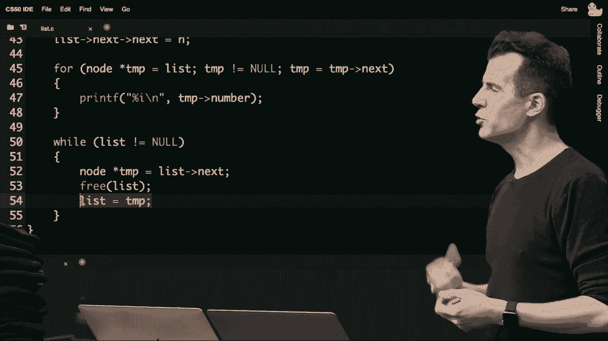

像是吃豆人风格那样，从左到右，通过释放第一个节点，第二个节点，第三个节点，然后就完成了，但通过使用一个临时变量提前查看，确保你不会过早地释放内存，从而失去对所有后续节点的访问，好吧。

那是一个大程序，但它是按顺序进行的，从数组开始，过渡到动态分配的数组，最后是一个实现。使用链表，虽然是硬编码的，只支持三个节点，但在这个例子中，你看到了一些可以操作这些节点的样本语法吗？有问题或困惑吗？

帮助解决你那边的任何问题，布赖恩，是的，有人问了类似你之前做的一个例子，为什么我们不能仅仅使用`malloc`三次`sizeof node`来获取三个节点，以那种方式来做，真是个好问题，难道我不能就这样使用`malloc`一次性分配三个节点吗？当然可以，这完全是你的选择，我做得更。

严谨地说，一次一个，但你绝对可以一次性处理所有三个。那样的话，你就需要使用一些指针算术，或者你需要使用方括号。内存，作为节点的一个数组，然后将它们拼接在一起。因此我假设出于演示目的，尽管我们有这些小的语法。

在一个真实世界系统中，你不会一个一个地插入，一般是先插入一个，然后经过一段时间，你想插入两个，所以你分配更多内存，然后再过一段时间，你想插入三个，因此在这些代码块之间有间隔。在现实世界中，还有其他问题或困惑吗？

是的，还有另一个问题，为什么`malloc`会失败分配内存？`malloc`为何会失败？这很少见，如果你在编写这样一个。内存消耗大的程序时，有那么多数据，你可能会耗尽内存。也许是两千兆，也许是四千兆或更多，但`malloc`很可能会返回null。

你应该总是检查，事实上，我敢说，在Mac和PC上。这至今仍然是程序冻结的最常见原因之一。导致你整个计算机重启的，确实是因为有人做了愚蠢的事情，就像我今天和上周已经做过的多次那样。

通过触碰不该触碰的内存，所以在问题集四和现在的五中。每当你遇到那些段错误时，你的程序就崩溃了。这就像是你整台Mac或PC崩溃，因为比你更有经验的人在他们的代码中犯了同样的错误，让我们快速。

最后的例子涉及链表，这实际上是这种一维结构，从左到右，然后我们会添加第二个维度，看看这能给我们带来什么，但我们仍然有我们的列表，它首先指向数字，指向另一个内存块，那里是数字四。

这就是数字五，所以我们有一个大小为三的链表。但我故意将数字分散开来，二、四、五，因为假设我们确实想将更多数字插入这个列表。但按排序顺序进行，结果是我们需要换一种思维。

当我们在中间添加节点时，不是在末尾，也不是在开头。比如说，我们想在中间分配更多的节点，这实际上需要更多的工作，那么我们应该如何去做呢？假设我们想分配数字一，并且我们想添加数字一。

我们可以使用这样的代码，这与我们之前使用的代码相同。我们分配一个节点的大小，检查它是否等于 null，然后用我们关心的值初始化它为 null，图示上可能看起来像这样。它有点漂浮在变量 n 中。

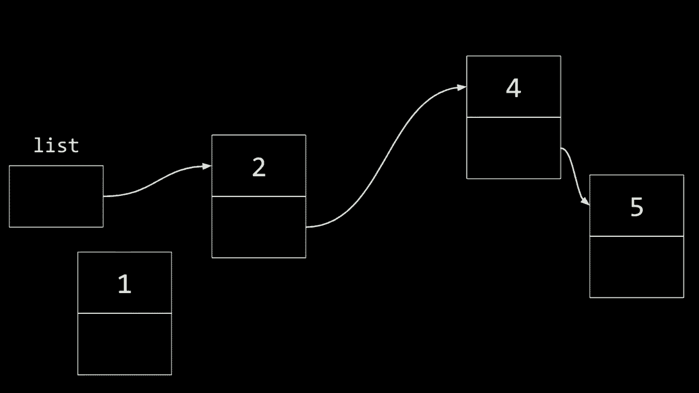

不再显示的节点，我只是指向我分配的数字一。那么这看起来是什么样子呢？就像将数字一放到位，我们运气不错，那里正好有一块内存。那么我现在想要做什么呢？我想去啊**d并连接这个，所以我可以直观地去做。

在此之前，我可以拔掉这个，然后将这个插入这里，这很合理。但如果我在此之前没有做任何其他事情，那么已经存在一个问题。我已经孤立了三个节点，二、四和五。孤立一个节点意味着忘记它在哪里，如果我在代码中没有另一个变量，或者指向。

列表的最初部分，我字面上孤立了剩余的列表，上周的技术含义是，现在我有一个巨大的内存泄漏，内存中的节点，直到你重启计算机或程序，你实际上再也无法找回。

退出时，操作系统会为你清理，因此你不想这样做。运算顺序实际上很重要，所以我应该首先，可能应该意识到这一点，列表，所以我真正应该做的是指向这个，大致上这样做，但让我规定这两个都指向同一个节点。

现在我的新节点，也就是代码中显示的 n，指向这个东西。现在我可以进行某种交换，因为我已经指向了最终目的地，现在我的列表是 n，因此我有插入的变量，这样是正确的，长话短说，运算顺序很重要。

如果我像之前一样从图形上处理这个，简单说列表等于n，如果这是n，坏事就会发生。的确，我们最终会使2、4和5孤立，从而泄漏大量内存，通常泄漏任何内存都是坏事。所以我不想那样做，来看看正确的代码，正确的代码是。

我要从n开始，指向与列表最初指向的相同的东西。然后去更新列表，使得它们两个当前都指向重复的内容。

然后更新列表以指向新的节点，所以这次代码与之前有些不同，因为之前我们一直把它加到末尾，或者我口头提议我们把它加到开头，这里我们在添加它。

的确，在开始时，实际的步骤和代码有点不同。让我们做一个最后的例子，如果我们想分配三个，那我得再malloc一个节点，数字三，假设它最后在计算机的内存中某个地方，这样三就到位了，我现在该怎么做。

像之前一样好好插入这个东西，我不想更新它。指针这样移动，然后把这个插头插到这里，因为现在我把这两个孤立了。所以这又是错误的步骤，当你在中间插入时。如果你关心以有序方式插入，这应该先更新。

我应该有点作弊，现在只有一个物理插头，所以我们就假装这在正常工作，安全地说n和之前的节点已经安全。我可以拔掉这个，然后去更新最后一个箭头，指向新节点的正确位置。让我们再看看代码，如果我去这里。

我在图形上看到节点数字三漂浮在空间中，同时也在四处指向三，目标再次是避免任何内存泄漏或节点孤立。好了，我们即将抛弃链表，因为正如你们中的多位所注意到或可能想到的那样，它们是好的，但可能不是很出色。

它们的优点在于它们是动态的，我可以通过在开头插入来添加它们。如果我真的想这样做，而不关心有序，但如果我想保持有序，在中间或末尾插入就还有很多工作要做，因为那是O(n)，如果我一直遍历这些东西的话。

箭头使我们获得了动态性，但我们增加了，我们从根本上为自己打开了一个全新的世界，我们现在可以使用指针作为线索来使用内存。我们可以把内存当作画布，随意绘制任何我们想要的值，而我们的值是二维的。左右的维度，如果我们给自己一个第二维度，假设我们开始思考一些不同的东西。

左右，但同时也上下，所以对计算机来说这没有意义，计算机只是将内存视为字节0123。但我们人类可以更抽象地思考这些数据结构，以一种对我们现实世界熟悉的方式，树木而不是那么多。

从地面生长而来，但如果你熟悉家谱，你可能会有一个家长或祖先，然后有后代在纸上的图形上挂着，比如你在小学时可能制作过的那样。我们可以利用这种树结构的想法，它有一个根。

这种分支和生长，从上到下，实际上更像是一个家谱，而不是土壤中的真正树。因此，树的这个概念，我们可以从链表中吸取一些教训，但我们也可以重新获得数组的一些特性。

我们可以按如下方式进行，考虑一下，我们即将调用一个从第一个新节点开始的二叉搜索树，它的大小为七，回想一下，如果它是有序的，我们可以对这个数组应用二分搜索，并从中间开始查找。然后我们可以左右分半，接着类似地向左移动。

所以二分搜索的复杂度是大 O，反复地把电话簿对折。问题是二分搜索要求你能够以常数时间通过简单的算术（如括号）索引数组。

从零开始到 n 减一，再到 n 减一除以二，得到中间点。你必须能够对数据结构进行算术运算，我们刚才提议摆脱随机访问，而是更多地过渡到动态数据数组。但如果我们这样做，如果你和我开始思考，不再局限于一个维度。

但在两个维度上，如果我们改变思维方式，想象一下。可以将数组视为一个二维结构，不仅有宽度和长度，还有高度，因此我们在视觉上保持它的缝合，所有这些值之间的关系，但你知道我们可以用什么将所有这些值缝合在一起。

指针是将内存中的事物结合在一起的新东西。如果内存中的事物是数字，那很好，它们是整数，但如果我们为它们投入更多内存，使用一个节点，将整数包装在节点中，使得该节点不仅包含数字，还包含指针，我们可能可以画出一幅图。

就像家谱一样，根节点在最上面，然后是孩子，左孩子和右孩子，这一定义重复出现。事实证明，计算机科学家确实使用这种数据结构，链表，你可以通过添加更多的节点来向树中添加更多的元素。

甚至低于1、3、5和7，只需使用更多指针将它们拼接在一起，以便成长这棵树。但一个好的计算机科学家会认识到，你不应该随便把这些数字放在随机位置，你的时间应该使用某种算法并注意。

有人注意到这棵树的模式吗？谁能在聊天中用语言或文本来表达一下这些节点？在这棵树中，它们并不是随机排列的，而是非常有意图地从左到右、从上到下，以某种方式排列的。谁能指出这个东西的定义是什么，除了它只是被绘制出来。

像你在它们中间放置的那样，在它们的上面你放置了中间的数字。在5和7之间你放置了6，所以在它们的上面你放置了中间数字。确切地说，这个模式适用于所有的数字，在1和3之间是2，在5和7之间是6。必须是中间数字，换句话说，我可以概括它，选择这个树中的任何节点。

它的左子节点将小于它的值，而它的右子节点将大于它。比如4，它的左子节点是2，小于4；它的右子节点是6，大于4。我们可以再做一次，去看2。它的左子节点是1，较小；它的右子节点是3，较大。

对于6，它的左子节点是5，较小；它的右子节点是7，较大。因此，这实际上是一个递归数据结构，如果你不介意上周回顾递归的话。递归不仅是通过调用自身的数据结构，它在某种程度上也是递归的。毕竟，这是什么东西？这是树，是的，我会承认，树。

这里的节点4，从技术上讲有两个子节点，而每个子节点本身就是一棵树，它是一棵更小的树，但其定义是完全相同的，再次是数据结构。这实际上将是一个使用递归代码的机会，我们很快会看到，但现在注意我们又取得了什么成就。

使用指针的动态性，这样我们如果想的话，可以通过在底部按正确的顺序串联更多节点来添加更多节点，同时我们也保留了一个重要的顺序。这个数据结构是二叉搜索树，确保左子节点总是较小，右子节点总是较大，因为现在我们可以开始搜索这个东西。

更有效率。那么，如果我想搜索数字3，我该怎么办呢？我从树的开头开始，就像在链表中，你从列表的末尾开始。因此，在树中，你从根节点开始，搜索3。那么我该怎么办呢？3显然小于4，就像在第零周时我拆解它一样。

削减树的一半，因为显然不会在这里，所以我们。数字二，这是另一棵树，只是一个更小的子树。我要如何找到数字三呢？我看右边，因为它更大，砰，我找到了。但相反的，八，我会从这里开始，我会在这里看，我会在这里看，然后得出结论：没有。

它不在那里，但每次我搜索八时，我都在忽略这棵树的一半，这个子树的一半，等等，所以看起来你会实现与我们在零周时看到的相同类型的能力和性能。那么我们如何将这个想法转化为代码呢？我们已经有了所有的构建块。

让我继续提议，使用之前的节点，而不是我们之前使用的。对于一个链表，它看起来像这样，有一个数字和一个称为`next`的指针，但我们可以把这些东西称为任何名字。让我们继续并为不仅仅是一个数字留出空间，左边的一个，我称之为右边的两个，仍然是指向一个结构体节点的指针。

所以用之前的术语，但现在我有两个指针，而不是一个。这样一个可以概念上指向树，另一个可以指向右边，并指向一个更大的子树。我们如何实现类似二分搜索的东西呢？好吧，让我们来讨论递归。构建摩罗金字塔时，我们强迫它变得相当酷。

使用递归，没错，你可以这样做，但金字塔确实是我所称的递归。物理结构或虚拟结构，指针，现在递归真正开始闪耀。那么，让我们考虑一下，如果我在C中声明一个函数，它是一个数字。它将根据定义从根节点向下搜索，我们如何实现这一点呢？我会。

我将提出的函数将返回一个布尔值，true或false。这个数字是否在树中，是或否，它将接受两个参数，一个指向节点的指针，也就是树。我可以称它为根节点或其他任何名称，它将接受一个数字，就是我关心的数字，无论是四、六、八还是其他任何数字。

我的第一段代码将是什么呢？让我来做我一直在宣扬的最佳实践。每当你处理指针时，要检查是否为null，这样你的程序就不会冻结、崩溃或发生其他坏事。因为谁知道，也许你会不小心或者故意地把一个null指针传递给这个函数，搞砸了。

这没关系，只要你的代码针对null，如果树是null的话。显然那里没有树，所以数字不在那儿，你就返回false。这是我们的一个基本情况，除了树本身的数字。再次强调，这个箭头符号表示，获取树，这是一个节点指针，所以获取这个指针，它自己。

在数字字段中，如果你要查找的数字来自参数，并且小于树自身的数字字段，那么这意味着你想要向左移动。而在电话簿中我会去电话簿的左边，这里我们要去左子树，但我该如何搜索子树呢，这里重要的是一个。

树就是树，这是一种递归数据结构，树在之前已经存在，所以我已经有了可以用来搜索较小树的代码，子树，如此表达意味着从当前节点开始，走向左子节点，并传入相同的数字，数字没有变化，但树在缩小，我已经在代码中有效地将树一分为二。

忽略右半边，我将返回那个答案。否则，如果我关心的数字大于当前节点中的数字，就进行相反的搜索。因此，就像在电话簿中一样，它不断变小，这里我一直在搜索更小的子树。

因为我在从上到下的过程中不断削减分支，左或右。还有一种最终情况，让我把这个抛出来，抛给大家，第四种情况，口头或文本上还有什么我应该检查和做的。一些人建议，如果树本身就是这个数字，如果树本身包含这个数字。

是的，所以如果树中的数字等于我正在查找的数字，那就为真。这时代码又变得有些令人困惑，只有上面是假的，下面是对的，但在这两个中间分支中没有，毫无讽刺之意，但没关系，因为我的代码设计成这样。

如果我搜索左子树，换句话说，我在树的叶子上，那么它将返回假，因此没关系，如果我搜索数字八，它甚至不在树中，我只会在掉出树的末端，看到，哎呀，空值，我将返回假，但如果我看到。

在这个过程中，调用了这两个递归调用来搜索，而不是自己回答真或假，而是返回较小问题的答案，通过分别搜索左树或右树。所以再一次，这就是递归开始变得不是强制性的或。

甚至并不一定是强制的，但确实是适当的，当你的数据本身是递归的，那么递归作为一种编码技术，确实发光了。所以如果最终我们有哦，还有小的优化，我们当然不需要明确检查数字是否相等，我们可以假设，如果它不为零且不是。

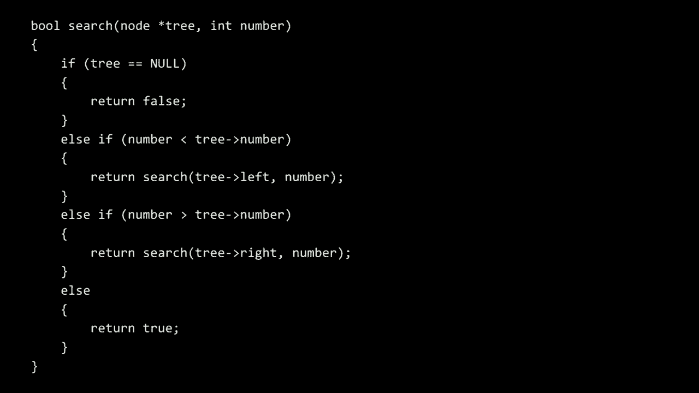

必须正好站在它上面，所以我们刚返回了 true。那么让我重新总结一下，这现在是一个二维数据结构，它比链表要好，因为现在是二维的，我重新获得了二分搜索，这真是太棒了，只要我。

按照这个二叉搜索树的定义保持我的数据有序，但我肯定是付出了代价，对吧，没什么东西是绝对比其他任何东西更好的。在我们迄今为止的故事中，树的缺点是什么？我在这里秘密或不那么秘密地付出了什么代价？

或者时间，或者开发者时间，或者金钱，或其他一些资源，无论是个人的，还是物理的，或真实世界的。有什么想法？嗯，我认为插入不再是常量时间，我想你需要更多的内存。你需要内存来排序两个指针而不是一个，这样时间就会更长，因为如果我需要。

保持排序的顺序，我不能仅仅把它放在顶部，我不能只把其他所有东西往下推。因为那样东西可能会乱，这种情况下似乎不太可行。即使我保持顺序，如果我添加，例如另一个数字，再添加一个数字，我持续把它塞在顶部，它可能会变得非常冗长。

我可能需要保持事物的平衡，如果你愿意，更大的要点是指针，所以现在我的节点变得比这些东西还要大。我现在有空间不仅仅存储一个数字和一个指针，还有另一个指针，这当然会再次占用更多的空间，因此需要权衡。

让我们继续，啊**先问问小组，当涉及到插入时，为什么我们不考虑一下插入的运行时间可能是什么。当插入到二叉搜索树中时，如果你想像往常一样打开网址，让我继续，啊**提出这个问题，运行时间是什么。

插入到二叉搜索树中，如果你想把数字零插入到那棵树中，或者想插入数字八或介于两者之间的任何数字，或者更大或更小，关于最高柱子的胜利率大约是60%！

你认为对数 n 和良好的直觉，坦率地说，这将是正确的答案，这种直觉在任何时候都是正确的。当你谈论二分搜索时，几乎可以说是某种对数的，但我们也看到了分而治之。在归并排序中有 n log n，因此认为约十个百分点也是合理的。

而 n*平方实际上是糟糕的，所以 n*平方就像我们迄今为止看到的最糟糕的情况，这表明一棵树比链表还要糟糕，甚至比数组还要糟糕，值得庆幸的是，我们还没有到达那个假设的点。那么为什么呢？如果我们考虑一下刚才的图。

如果我们考虑刚才的树，它看起来大致是这样的，插入到一个树中涉及什么呢？假设我想插入数字8。那么我从这里开始，显然它属于右侧，因为8更大。

我去这里属于右侧，因为8更大，我去这里它属于右侧，因为8更大，因此将会创建一个新节点。在这里的某个地方，即使它不适合屏幕，我绝对可以调用`malloc`，我可以更新几个指针，然后就搞定了。

我们给树添加了第八个节点，所以如果我从根开始，走了一些步骤，1、2、3，我如何将其概括为大O符号呢？如果你把一个二叉搜索树整理得漂漂亮亮，像这样，平衡的话，那个二叉搜索树的高度。

结果是，如果现在在这个故事中，n的对数，那么n的底数为2的对数将是树的高度，所以如果你把n个节点、n个数字以这种漂亮的排序方式平衡，整体高度将是log n。那么插入的运行时间是多少呢？这相当于找到新的数字属于哪个位置要多少步。

这个位置是1、2、3。而事实证明，8的底数为2的对数确实是3，所以数学上有时可能会有一点舍入误差，但一般来说，它确实是大O(log n)。但是如果我们稍微马虎一下，如果我们稍微马虎，开始。

插入节点，如果你愿意，可以给我们带来一些坏运气。例如，假设我去**d，让我在这里随便做点什么，假设我去**d，插入数字1、2和3，使得这就是逻辑上发生的事情。如果这是根，它符合二叉搜索树的定义。

它是没有左子树的，这并不是严格的问题。因为这里没有违反搜索树定义的东西，只是没有东西。两个在正确的位置，三个在正确的位置，因此这也是严格来说是一个二叉搜索树，但它有点边缘案例，或者说是一个扭曲的案例。

你插入东西的方式最终在二叉搜索树中，实际上更像是什么，如果你想传达给聊天和布莱恩的话。人们说它看起来像一个链表，是的，即使我把它画成从上到下的样子，在某种二维的感觉中。

这其实只是艺术家的表现，这棵树是一个二叉搜索树。但它也有点像一个链表，所以即使给定一些糟糕的设计，也可能偶然退化成不同的数据结构。即使在插入1、2、3时，我也可能允许这种扭曲。

这种情况会变得冗长而复杂，此时一切都是O(n)，这就只是一个链表，只是刚好是对角线而不是左右延伸。从直觉上讲，不是从代码的角度，没有正式的语言，但这里有一个解决方案。确保这个包含一、二、三的树不会在一开始就变得冗长而复杂。

聊天中有几个人建议，把树的顶部作为新的根节点，所以如果我将两个节点作为新的根节点。让我快速模拟一下，过一会儿我会揭示我认为你刚才表达的内容。如果我确保在插入这些节点时，不会天真地一直向右延伸。

我在行使一些判断时，如果我注意到我的数据结构、我的树变得有些冗长而复杂，也许我应该进行旋转，实际上改变根节点的定义。我们不会讨论实现这一点的代码，但结果是，这正是正确的直觉。

如果你上更高一级的数据结构和算法课程，尤其是在计算机科学领域，你将学习像AVL树或红黑树这样的树，它们是不同类型的树数据结构，它们内部嵌入了算法，以便在需要时进行调整，确保。

如果你在插入时，或者在删除时不断重平衡树，长话短说，这可能会花费你额外的时间，但如果你有大量数据，保持树的平衡、对数高度是不冗长而复杂的，从某种意义上说，可能是根据你的应用而定的。

整体上可以节省你不少时间，所以我们可以说插入操作确实是O(log n)，但这依赖于你确保保持它的平衡，而这将涉及比我们今天讨论的更多的代码。不过，这确实是一个可能的设计决策。那么，关于树还有什么问题吗？

特别是二叉搜索树，我们几周前开始讲数组。现在我们有了链表，这很好，但不是很好，树似乎可能很好，但总是有权衡，它们消耗我们更多的空间。但我敢打赌，我们可以继续将这些想法结合起来，构建其他数据结构。

有什么特别的情况吗？是的，有一个问题问，为什么如果像一、二、三都在右侧的一个序列中会成为问题。是的，真是个好问题，为什么这是一个问题？也许并不是，如果你的数据集不大，且值不多。

说实话，谁在乎呢？如果只有三个元素，绝对不在乎。如果是十个元素，如果是一千个元素，天哪，如果你的计算机足够快，那可能有一百万个元素也没关系，但如果是两百万个元素，或者再大一点，那么问题就来了。你正在构建的是什么业务？你的应用是什么？

写下你的数据有多大，你的计算机有多快或多慢，这在最终可能非常重要，确实，当我们对比一些算法时，线性查找的表现。比如，比较冒泡排序、选择排序和归并排序，尽管这些属于不同的运行时间类别，O(n log n)和O(n²)，请记住这一点。

显著的差异，O(log n)在搜索的上下文中比O(n)要好得多，所以如果你的数据结构是字符串型，想象一下就像在查找一本有千页的电话簿，但二分查找却让它不那么冗长，给你10步，而不是1000步来搜索同样的页面。

即使在第零周，我们也看到了这些不同运行时间类别之间的显著差异。那么，让我们看看能否取两者的优点。我们见过链表，也见过树，如果我们把它们结合在一起，提取这些结构的最佳特性进行构建。

事实上，我觉得一种更宏大的数据结构就像是数据结构的**圣杯**，其插入和查找的时间复杂度既不是O(n)，也不是O(log n)。但如果有一种数据结构，其运行时间是常量时间O(1)，那简直是**圣杯**，如果你有内存的话。

这样一来，如果你想搜索或插入一个值，啪，你就完成了。啪，你就完成了，而不需要线性或对数的运行时间。所以让我们看看能否追求这个目标，我提议引入一个主题叫做哈希表，哈希表是另一种数据结构。

链表的数组，最终是将数组和链表结合起来。让我们看看这是如何实现的，我将创建一个大小为26的数组，并开始将我的数组垂直绘制，因为这样在视觉上更好，但这些仍然是艺术家的表现。

我们通常从左到右绘制数组，但现在开始从上到下绘制。接下来会更有趣，比如我想存储像字典那样的名字，或者像你的手机中的联系人一样的名字。如果你想跟踪你认识的所有人，那就太好了，不要找人。

更好的是，我提议在英语中故意使用26个字母，从a到z。所以我们假设位置0是a，位置25是z，现在我开始将所有朋友插入我的新手机，进入联系人应用程序。

或者实际上是从a到z，当我插入一个新朋友或联系人的时候，让我把他们放入一个与名字本身有某种关系的位置，让我们不要从头开始，也不一定要按字母顺序放置。

在这个数组中，不仅是从上到下，而是在一个特定的条目中。假设我想添加到我的联系人中的第一个人是阿尔布斯，那么我会提出，因为阿尔布斯以 a 开头，他将放入 a 的位置，所以在这个数组中的第一个条目。假设我下一个想添加的是扎卡里亚斯，他的名字以 z 开头，所以他，又一次，我跳来跳去，我从 0 跳到。

25 但这是一个数组，我可以在常数时间内做到这一点，你，方括号。所以这是常数时间，我不需要把他放在阿尔布斯之后，我可以把他放在任何我想要的地方，假设第三个人是赫敏。那么我会把她放在位置 h，为什么呢？因为我可以做这个数学计算，我。

可以搞清楚 h，好吧，我可以直接跳到字母表的那个字母，并且感谢 ASCII 和进行一点算术，我也可以把它转换成一个数字，所以，五、六、七，因为 h 最终映射到第八个字符或位置，这些其他人，最终也在我的地址簿中，所以他们。

这里并没有那么多数据，但我把每个人都放在这里，但可能会有。这到目前为止，我有点走运，我只认识那些名字独特以某个字母开头的人，但当我在学校认识某人并把他们添加到我的联系人时，嗯，比如哈利，必须放在同一个。

位置。这是个问题，如果我想存储赫敏和以 h 开头的人。但是如果这是一个数组，那绝对是个致命问题，所有事情都崩溃了。因为我可以是的，扩大数组，但如果我扩大数组，它的大小就是 27，那么此时我如何知道哪个数字对应哪个字母。

只是变成一团糟，但如果我借用链表的概念，如果我把我的数组变成一个链表的数组，所以是的，尽管出现了赫敏和哈利的冲突，这没问题。如果发生这种情况，我只是会把他们串联在一起，从左到右放在一个链表中。

所以这并不理想，因为现在我需要两步才能到达哈利，而不是用方括号表示。但至少我仍然可以把他放进我的地址簿，所以这是一个权衡，感觉还算合理。好吧，另一个人海格，好的，现在我需要三步才能到达我的地址簿中的海格，但三步总比没有好。

所以我们再次看到一个问题的表现，哈希表确实就是这样的数据结构，它是一个链表的数组，至少可以这样实现。它的基础是引入哈希函数的概念。这实际上是我们将在函数中看到的，它将允许我们不仅映射所有。

赫敏、哈利和海格，还有罗恩、卢平、斯内普和小天狼星，分别到达他们的目的地。是确定性的，也就是说这里没有随机性，每次我看到这些人的名字时，我都会确定他们所属的位置，而这个位置永远不会改变。那么我该如何做到这一点呢？实际上，这与问题解决本身有关系。

函数就是这样，这就是我们所定义的问题解决，这也是任何语言中的函数，函数在这个黑箱中将是某种秘密成分。那么哈希函数是什么呢？哈希函数实际上是一个函数，无论是数学上的还是编程中的，它将作为输入。

或者说哈利，它返回一些输出，而哈希函数的输出通常是一个数字，在这种情况下，我想要的数字是在0之间，哈希表的概念不仅仅是屏幕上的图像，而在实际代码中，我实际上需要编写一个C语言函数，它以字符串，或者说字符指针作为输入，返回一个在0到25之间的整数。

和25，所以我知道海格对应的数字是7，那么这个哈希函数到底做了什么？它以像阿尔巴斯这样的输入，并输出0。它以像扎卡里亚斯的人作为输入，并输出25。你可能会看到这里的模式。我将为实现这样的功能编写的代码是。

我可能会查看用户输入的字符指针，它会查看第一个字符，对于这两个字符分别是a或z，然后它会进行一些数学运算，减去65或其他的，这样我会得到一个在0到25之间的数字，就像凯撒密码或我们过去对字符串的一些操作一样，因此从这里开始。

不过我们现在可以利用这个构建模块，或许能更有效地解决我们的问题。我并不喜欢，尽管我为哈利、赫敏、海格以及现在的露娜、莉莉、卢修斯和薇薇安腾出了空间，但这些链表有些过长，而且有点儿像。

链接，如果你愿意，因为它们看起来像链环围栏或链中的小链接。这是这些链或链表，它们很长，而我试图实现常数时间O(1)的做法有些愚蠢，但实际上，尽管有些名字确实只需一步，有些却需要两三步。

四个步骤，所以开始变得复杂，那么这里的优化是什么？如果你开始感到不适，因为你太受欢迎，联系人太多，L的处理时间比其他人多，我们可以做些什么来改善这种情况，同时仍然使用哈希表，或许逻辑解决方案是在碰撞太多的时候。

你有太多名字互相碰撞，我们如何能改善我们的性能，并接近位置，还是一步而不是两步、三步、四步，所以真的一步，因为这就是我们的**终极目标**。有些人建议你应该关注的不仅仅是第一个字母，例如，是的，听起来不错，所以如果看一个字母。

这个人的名字显然不够，因为我们中有很多人的名字以**h**、**a**或**z**等开头，为什么我们不看两个字母，从而降低我们发生这些碰撞的概率呢？所以让我继续，重组并专注于**赫敏、哈利和哈格里德**的问题。

为什么我们不继续并取我们的数组，想象一下它可能不仅仅是在那个位置为**h**，而是具体想象那个位置，作为**h a**，然后**h b h c h d h e h f**，一直到**h z**，再到**i**，列举出所有可能的字母对，从**a a**到**z z**，但这似乎对**赫敏**来说。

**赫里**在数组中的**h e**位置，而**哈利**则在**h a**，现在是**h ag**。哦，天哪，像**哈格里德**仍然在同一个位置，那么可能更好的解决方案是什么？再说，这并不是太糟糕，像两步并不是大问题，尤其是在快速计算机上。但对于足够大的数据集，如果我们不再讨论。

你通讯录中的人，但也许是全世界所有拥有**谷歌**账户或**推特**账户的人，你想快速搜索这些信息，名字以**h**开头，**a n z**和其他所有名字，最好能更分散一些。那么我们该怎么办呢？好吧，和前两个字母相比。

坦率地说，我认为这个逻辑延伸是使用前三个字母，所以也许这是**h-a-a**。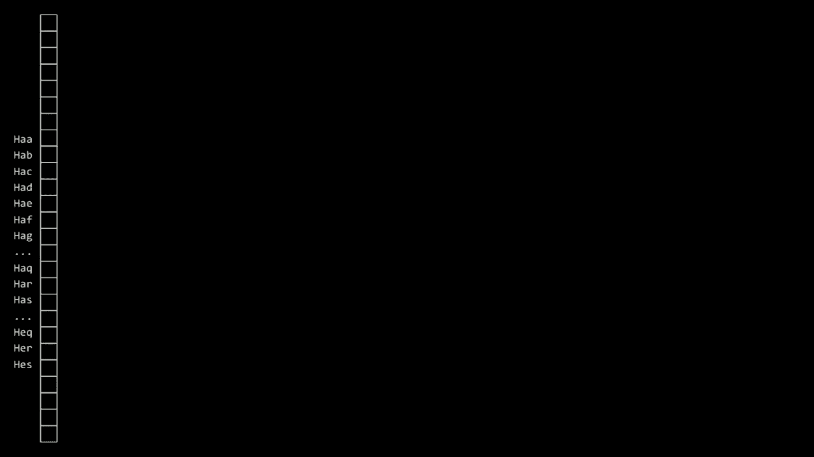

这个桶是**h-a-b**，**a e**点**h-a-c-h-a-d-h-a-e**一直到**h z z**。然后是**i a a**，但现在当我们对三个朋友进行哈希时，**赫敏**进入了**h e r**。可以说这个数组的元素**哈利**，**h a r**进入那个桶，**哈格里德**现在有自己的桶**h-a-g**，其他人也是，所以似乎。

解决了这个特定问题后，你仍然可以想象，我必须考虑，还有其他以**hag**或**h-a-r**或**h-e-r**开头的**哈利·波特**名字来寻找其他碰撞。因为你可以想象使用四个字母，但我们付出了什么代价？像我一次又一次地解决这个问题，给我带来了。

一步我可以通过简单的**ASCII**数学来计算我应该跳到这个越来越大的数组中的哪个索引，但我付出了什么代价，**布莱恩**，你有什么想法想分享吗？是的，有些人说这会消耗很多内存。

哦，我的天，这占用了大量内存，那么之前占用了多少内存呢？让我稍微查一下，*****，*****，可以说是26个桶，数组中的元素，当然这并不算太糟，感觉相当合理，26个插槽。但缺点是链可能会变得有点长，三个名字、四个名字，甚至更多。

但如果我们有一个从a到z的组合，而不是从a到z，那就是26乘以26，总共676个桶。听起来并不是特别大的问题，但这比我们迄今为止在内存中处理的大多数东西都要大。并不算大，但如果我们有3，那就是26种可能性乘以26再乘以26，从aaa到zzzz。现在我的数组中有17576个桶，问题并不是我们在使用它。

内存，因为老实说如果你需要内存，就用吧，这没问题。只是把硬件投入这个问题，买入并升级更多内存。但问题是，我可能不知道多少人，名字以hzz或azz开头，或者字母表的任何这些字母组合。

许多桶将是空的，如果你想要一个数组并希望随机访问，它们必须存在，以便你的算术每周都能顺利进行，你只需使用方括号表示法跳转到你关心的地方，所以找到这种权衡或找到这些权衡的拐点，某种程度上是一种艺术，也是一种科学。

对于你特定的数据、你特定的应用，弄清楚时间、空间哪个更重要，或者两者之间的某个平衡，而在问题集五中，你将看到你实际上必须通过努力最小化自己最终的内存使用和计算机的时间使用来找到这种平衡，但。

让我指出一点，实际上，这个哈希表的概念，到目前为止肯定是我们所看过的最复杂的数据结构。这些可能比你家里的扑克牌还要大，但如果在某个时候你需要为某个游戏排序，有时你需要。

如果你想把它们完全洗牌，为了整洁，你可能会不仅按数字排序，还按花色分类，将红心、黑桃、梅花和方块分到不同的类别，所以说实话，我只是为了隐喻而把这四个桶放在这里，并且已经给它们贴上标签。

提前准备好黑桃，那是一个桶，这里有一个方块的形状。然后我们这里有红心，然后是四叶草，所以如果你曾经没有认真思考过这个，因为它不是特别有趣，你可能会无意识地开始把它们摆放和按花色排序，然后也许按数字，但如果。

如果你已经完成了这一步，如果你看到哦，那是红心10，那是红桃A，你知道，是的，最终你可能关心的是它是红桃，但现在我只是将它放入红桃桶中。这里是红桃2，我将把它放入红桃桶。

我将把这个放在这里，你可以逐渐地对每一张卡进行哈希，哈希实际上只是查看一些输入，并在这种情况下基于输入的一些特征生成一些数字，比如一、二或三。无论是卡片的花色，就像我现在做的，还是其他的。

这是基于字母表的，那么我为什么这样做呢？我不会做完整的，因为52步会花费很长时间，而且很快会变得无聊，但我为什么这么做，因为实际上，你可能已经将这些桶摆在你面前，但你为什么这样做呢？

如果我们知道它是哪个桶，我们可能会更快地找到东西，甚至可以做到一两步，没错，差不多是这样，你开始获得这些优化，至少作为人类，老实说，我处理四个较小问题比解决13个卡片问题要容易得多。 

特别是如果我在找特定的卡片，现在我可以在13张卡中找到，而不是52张。所以这就是一种优化，将卡片哈希到特定的桶中，然后继续解决较小的问题，这不是哈希表的本质。

哈希表的核心是存储信息，但以更快的方式获取信息。因此，回到索非亚的问题，如果她只想找像红桃A这样的卡片，解决一个大小为13的链表问题，如果你将输入分组，那么就可以更快速地访问数据。

获取数据的速度可能不一定是一步到位，可能是两步、四步，甚至是13步，但通常来说，比起线性或对数时间，所需的步骤会少一些。理想情况下，你要选择哈希函数，以尽量减少碰撞元素的数量。

使用的不是从a到z，而是从aa到zz等等。那么让我来问一个问题，关于这个数据结构的运行时间，当我的所有联系人都在那里的时候，手机需要多少步骤才能找到赫敏或哈利·波特。

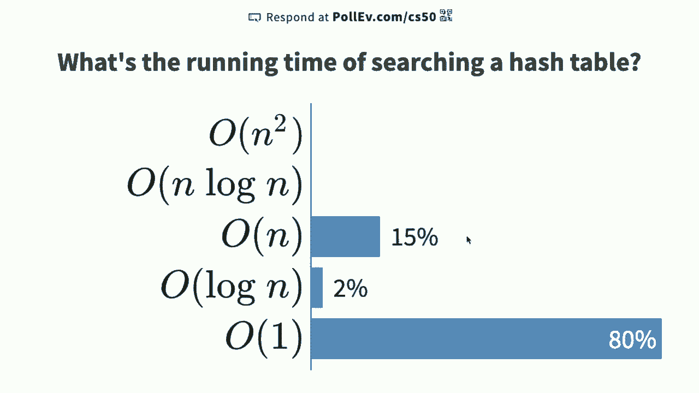

或其他人，所以我再一次看到你们中有80%的人说常数时间O(1)。再次说明，常数时间可能意味着一步、两步、四步，但是一些固定的数字，不依赖于n，约有18%的人说线性时间，我必须承认，约20%的人说线性时间。

从技术上讲，在渐进和数学上，真实世界与学术界之间存在区别。因此，在这里，或者更确切地说，真实世界的程序员会说，正如索菲亚所说的，确实比一个有52张牌的大桶要好，速度就是快，确实快四倍。

找到或填补这13张牌而不是52张，客观上来说是更快的。但学术界会说，是的，但渐进地，渐进是相当大的。我不断描述的那种渐进，走13步在技术上是13张牌，这在技术上是n除以4。是的，确实是13，但如果是n的话。

总的来说，这个桶的大小最终会是n除以4。当我们讨论大O和Ω时，我们会扔掉低阶项，去掉常数，比如除以四，或加上其他东西，所以我们去掉这些，技术上它仍然是O(n)的哈希表搜索。

但在这里我们再次看到现实世界与理论世界之间的对比，确实，如果你想进入学术辩论，链表或数组，在那时你不如从左到右搜索链表，但如果你提前对这些值进行哈希，桶，它最终关系到实际时间，所以当你实际上。

看着墙上的时钟，使用索菲亚的方法比用数组或链表的方法所花的时间更少。因此，提到的大O表示法中，大家认为是O(n)的说法是正确的，但在现实编程中，这可能会是一个净收益，因此多练习，减少对理论的关注。

这些事情，确实这是一个挑战，这个问题五，我一直提到的，将挑战你实现一个表，包含十万多个英语单词，我们将简要给你一个包含每行一个英语单词的大文本文件，你的目标之一将是加载。

所有那140,000多个单词的表，现在如果你简单地使用一个有26个桶的哈希表，从A到Z，你会有140,000多个英语单词，其中有很多单词以A、B、Z或任何其他字母开头，如果你可能选择A到ZZ，可能更好，或者AAA。

经过zzz也许会更好，但在某个时刻，你会开始使用过多的内存，这对你来说并不好。问题集五的一个挑战是愉快地挑战你的同学，如果你选择参与，你可以运行一个命令，这将把你放在大名单上。

课程网站上会显示你使用了多少或多么少的RAM或内存，以及你的代码运行所需的时间。因此，我们只是把那些学术性的说辞暂时搁置一旁。尽管n除以四（n divided by four）的方法在实践中效果要好得多。

这并不是在内存中布局的唯一方式。现在我们有了所有这些构建模块，其中一个数据结构将被称为尝试（try），而try实际上是检索（retrieval）一词的缩写。

尽管它的发音并不明显，树（tree）是一种通常用于存储单词或其他更复杂数据而不仅仅是数字的树形结构。因此，尝试（try）实际上是由节点（node）构成的一种树形结构，你可以在这里看到一种模式。列表（lists）和数组（array）在某个时刻，计算机科学家们开始变得有些创造性。

他们字面上开始将不同的数据结合在一起，因此一个尝试（try）看起来像这样，比这里更好，这就像一个矩形（rectangle）或正方形（square），但在这个节点（node）内部实际上是一个大小为26或z的数组。我们要做的是，每当我们插入一个单词，比如名字“哈利”（harry）或“海格”（hagrid）时。

不论是赫敏（hermione）还是其他人，我们将逐个字母地走过他们的名字，比如h a g r i d，我们将从一个节点到另一个节点遵循一系列指针。例如，如果这是从a到z或从0到25，这里是字母h的位置，所以如果此刻的目标是插入我们的第一个联系人，例如哈利（harry）。

我将从树的根节点（root）开始，查看字母h的位置，并在心中记下哈利（harry）的h是从这里开始的，然后如果我想在哈利（harry）中插入字母a，我将去找字母a的位置。

现在我将有另一个指针，哦，对不起，不是哈利（harry），是海格（hagrid），首先是h a g r i d。那么我刚刚做了什么？尝试（try）仍然是一棵树，每个节点都是一个数组，而每个数组都是指向其他节点的指针数组。因此，我们实际上是在这里将所有东西混合在一起。

和之前的构建模块一样，这棵树中的每个节点（node）从上到下都是一个指针数组（array of pointers）。检查哈格里德（hagrid）是否在我的联系人中，我实际上从第一个节点开始，跟随h指针，然后跟随a指针，再跟随g指针，接着是r指针、i指针，最后检查d。

指针里是否有一个布尔值，可能只是表示是或否，这里有一个叫h-a-g-r-i-d的人。请注意此时没有其他字母标注，也没有其他绿色框，绿色只是为我们的目的表示一个布尔值，这意味着没有任何人名叫h-a-g-r-i-a，h-a-r-h-a-g-r-i-d。

我在联系人中存在这个，但请注意，如果我继续往下走，插入哈利会发生什么。注意哈利和海格共享h、a，然后这个第三个节点，但接下来，指针。用来存储r和y，注意那里的绿色，数据结构中的一种检查标记，一个布尔值，表示我在我的上下文中有一个名叫h-a-r-r-y的人。

然后如果我们添加赫敏，她共享h，然后也共享第二个节点，但赫敏需要一些新的节点。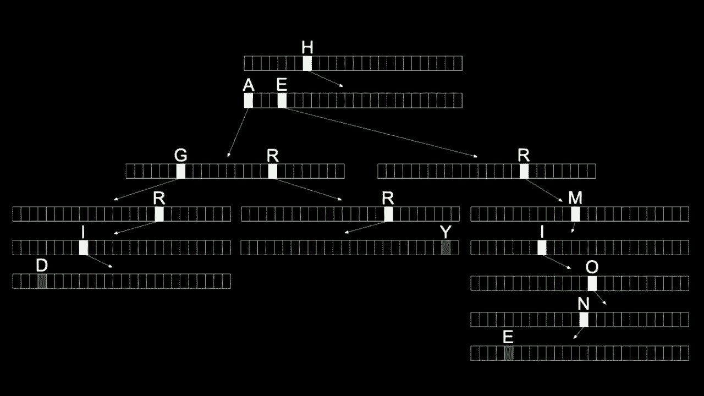

特性，这种复杂性的原因，因为这可能是我们到目前为止见过的最奇怪的结构，即使我在电话本中有十亿个名字。我找到海格究竟需要多少步骤，随时欢迎在聊天窗口中插入你的意见。如果我在数据结构中有十亿个名字，其他名字的数量并不影响找到赫敏或其他人的步骤，仅仅取决于她们名字的长度。

联系人中，我需要多少步骤来查找并检查海格是否在其中。人们说六个，六个h a g r i d，如果我有二十亿个名字，四个需要，至少在这些人名的长度上是常量时间。数据结构中的书籍，那么这意味着什么，尝试。

这是我们可以稍微学术化的地方，如果你假设任何人类的名字，无论真实还是虚构，字符的数量是有限的，也许是20个。

或者100或者其他什么，总之超过六个，但可能少于几百。然后你可以假设这是常量，所以它可能是大O，比如200，名字。但这就是常量，因此技术上来说，尝试给你提供了查找时间和插入时间的大O为1，因为它不依赖于n。

是数据结构中其他名字的数量，它取决于输入。如果你假设世界上所有的名字都合理长度小于某个有限值，比如6或200或者其他什么，那么你可以称之为技术上是。大O为1，即常量时间，所以这里是整个目标。

今天，像是尝试达到常量时间，似乎是线性时间或对数时间或我们见过的其他任何东西，但，代价，我们刚刚付出了什么。如果你看到，为什么尝试不一定，还是有一些问题，嗯，实际上。比如说，如果假设你在联系人列表中有两个人。

有一个人叫丹尼尔，另一个人叫丹妮尔，你知道丹尼尔在你的列表中，所以l会有一个类似于真的布尔运算符，但那么，如果你的l是一个运算符而不指向丹妮尔的另一个l，你该怎么到达丹妮尔呢？

这是个好问题，算是一个边缘案例，如果有人的名字，比如丹尼尔，d-a-n-i-e-l，而我想你说的是丹妮尔，d-a-n-i-e-l-l-e。那么第二个名字稍微长一点，让我说明我们可以解决这个，我没有展示代表树中每个节点的代码，让我建议我们可以继续拥有。

即使在下面，如果我们在这棵树中有丹尼尔，我们也可以通过在丹尼尔下方再增加几个节点来拥有丹妮尔，只需再添加一个绿色勾选，所以在代码中是可以解决的，尽管从图形表示上并不明显，但绝对是可解决的。

在前缀树中，可能还有另一个缺点，尽管你能以O(1)的时间解决丹尼尔问题，有什么想法吗？对了，还是静音状态，哦，来了，哦，好的，我需要，花费大量的，呃，内存来容纳这一切，这可能需要很多时间，很多，呃。

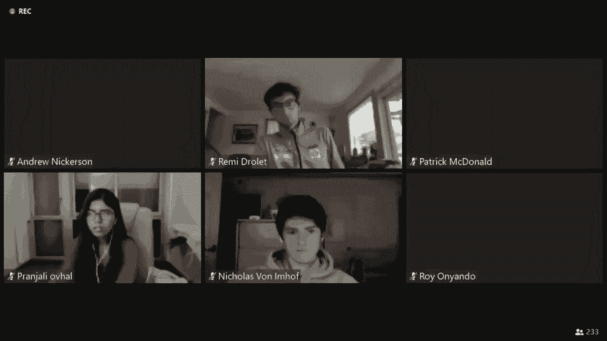

可能会减慢系统的速度，没错，你可以从我这幅图中看出，虽然我们只向这个数据结构添加了三个名字，但我的天，像这里所示的指针，尽管它们可能都是null，对吧，如果没有箭头就暗示它们是null，0x0，但即使存储null 0x0，也是8个零位，所以这并不。

实际的内存使用却缺乏效率，我们并没有高效地使用它，我们花费了大量的位、字节，或者无论你想如何衡量，因为即使考虑到h，我只使用了26个指针中的一个，25个指针可能初始化为null，这意味着我浪费了25个指针，你可以想象得越来越少。

在这棵树中，名字以h-a-g-r-i-d开头的可能性越小。丹尼尔提供了一个不错的例子，而丹妮尔并不会经常发生，当然在这棵树中你得到的越低，正如e10所说，你浪费了大量的内存，因此是的，你获得了，价格。

你可能在使用兆字节、千兆字节的存储空间，因为最重要的数组属性是它们都是连续的，你必须让每个节点包含一个大小为26的数组，或者其他任何东西，内存会反复使用，所以在这方面也是一种权衡，尽管理论上可能是理想的。

理论并不一定意味着，有些教科书上效率较低的东西在现实世界中可能更有效率，并且，在你的第五个问题集中，呃，拼写检查器，呃，当你建立这个字典时，我们随后用它来对非常大的文本语料库进行拼写检查，你将开始体验到一些。

这些现实世界的权衡你自己，嗯，我们今天想结束的是看一下。你可以用这些种类的数据结构做些什么，只是为了让你尝试一下你还能去哪里，能解决什么其他类型的问题，再次到目前为止我们已经看过，数组，它们实际上是最简单的。

数据结构而且它们甚至不是，结构本身，它只是连续的，内存块。课程中你有这种，一维数据结构，它允许你连接。内存中的节点，让你能够，去分配内存、插入和删除节点，如果你想的话。然后我们有，树，这在某种程度上给了我们最好的，数组的两全其美。

还有链表，但我们必须花费，更多空间并使用更多指针。然后当然哈希表将这两种想法，数组和链表合并在一起，这开始运作，确实这就是你所，检查的。但随后当然还有字典树，乍一看似乎更好。

但是并不是没有巨大代价，正如e10所说，所以结果是，所有这些构建块在你手边，实际上你可以将它们作为低层，实施细节。来解决更高层的问题，这就是所谓的抽象数据。结构或抽象数据类型，抽象数据结构是一种你。

你可以想象实现一些现实世界的，问题，通常这会与一些其他数据一起实现。在这个层面上，但你在思考你所，最终构建的内容。那就是抽象，将低层实现，细节简化。为了讨论或解决更高层的问题，那么这样的数据结构是什么呢。

队列是一个非常常见的，抽象数据结构，什么是队列。好吧，那些在，队列中长大的人，确实是它名字的来源。队列是一个具有，特定属性的数据结构，所以如果你站在。商店或餐厅外，在，健康的时光里等待入内。

你通常在队列中，但队列有一个重要属性，至少。如果你生活在一个公平的社会，你会想，如果你是，第一位排队的，先进先出。如果你是第一位排队，然后他们开始让在你后面的人进入，那会显得有些令人不悦，因此，如果队列实现正确。

它有一个称为，FIFO（先进先出）的属性，而我们人类，具备这一属性。队列通常有两个操作，至少与之相关联。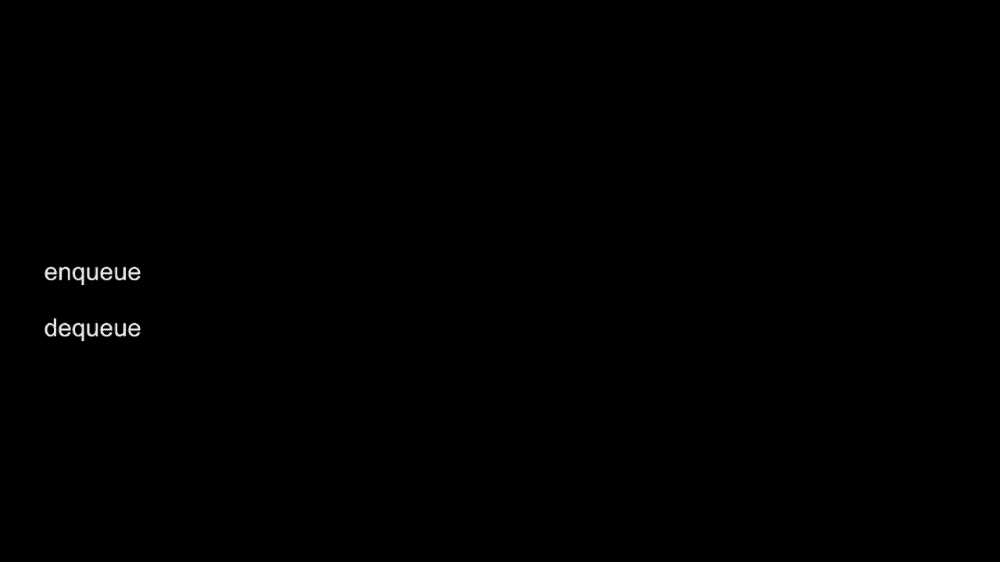

nq 和 dq 只是约定，你可以称其为添加和删除或插入，删除等。不管怎样，nq 和 dq 是比较，常见的说法，所以入队意味着你走到。不得不等待，出队意味着他们准备好服务你或，那是出队，描述了。一个关键属性就是，它是先进先出，所以你如何实现。

那么，有关该数据结构有趣的是，它比代码中的实际事物更重要，你想实现某种公平的排队系统，因此你将其视为队列，但坦率地说，如果我们要将这个例子翻译成数组，人员数组可以实现一个队列。

你可以使用一个人的链表，底层工作是在较低级别的实现细节，但如果我们将这种现实世界的类比翻译成代码，将排队在商店外面进入，使用数组的话，使用数组表示队列的缺点是什么，即使我们正在做。

从现实世界到代码的转变有点大，但可能会有一些缺点。使用数组的缺点可能是什么，如果你正在考虑在一条线中做这件事，你必须把一个人拿出来。

但你无法真正动态排序。

在那之后更改记忆，是的，是个很好的观点。想象一下有一条线，假设有一条线可以容纳10个人在苹果店外。现在在健康危机期间，让人们进入的限制是一次只能容纳那么多人，所以假设他们有空间容纳10个人，间隔六英尺，这实际上是一个非常贴切的类比，今年比以往任何时候都更明显。

但正如瑞安所说，如果你想让某人，如果你想从队列中删除某人，那么排在第一位的人将进入商店，第二位也将进入商店。使用数组的问题似乎是，现在你基本上在队列的开头有空位，但在队列的末尾仍然没有空间。

对于新来的人来说，现在有一个明显的现实世界解决方案，你只需说：“嘿，大家能否向前走几步。”但这效率不高，不仅仅是商店的问题，而是在代码中，这涉及到值的复制，如果有两个人刚被允许进入商店，你必须移动八个值，两个位置。

所以现在你的双端队列操作是O(n)，这感觉并不理想，如果我们是这样的话，但这无疑是队列的一个挑战。使用数组也有限制，因为如果你到达苹果店时，已经有10个人在排队。

线上，他们不让你进入，他们会说对不起，我们已经满了。因为最终队列中会有更多的空间，链表将允许你不断添加更多的人，即使商店外的队伍变得非常长，至少链表可以让你服务所有客户。

随着时间的推移出现的数组，固定大小会使这变得更加困难，你可以分配一个更大的数组，但你得询问所有人。这里不，回去那里，我的意思是你不断在内存中移动人或值，所以这只是说，要实现这一点。

现实世界中有一种队列的概念，在计算机世界中也很常用，以表示某些概念，比如打印队列。当你向公司发送文件时，会有一个队列，理想情况下，第一个打印的人是第一个收到打印件的人，之后队列也在软件中被使用，但。

除了提示，还有一个叫做栈的数据结构，它也可以通过数组、链表或其他方式在底层实现，采用后进先出（LIFO）原则。如果你想象一下自助餐厅的托盘，在大家都在校园里使用托盘的健康时光。

你会记得托盘通常像这样堆叠，最后放上去的托盘是第一个被取出的。如果你去服装店或自己的衣橱，如果你不把东西挂在衣架上或放进抽屉，而是像这样堆放所有的毛衣，这就是我想要的毛衣。

最简单的方式是使用后进先出，因此我不断取出黑色毛衣，如果我把所有的毛衣都存储在这个栈中，你可能永远也得不到下面的红色或蓝色毛衣。这就是数据结构的原因，所以后进先出实际上是使用的属性。

来描述栈，栈的有用与否取决于实际计算。随着时间的推移，我们会看到栈确实发挥作用，那两种操作通常被称为推入（push）和弹出（pop），这与添加、删除或插入是同一回事，但术语有所不同。

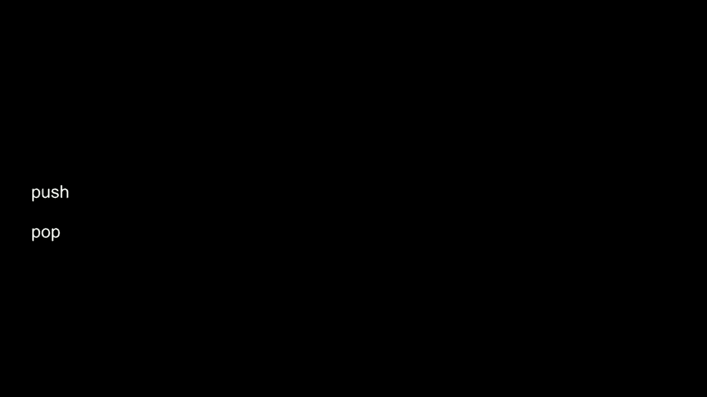

通常会从栈中推出，这就是我把一个值推入栈中，但这也是后进先出。然后还有另外一种数据结构，称为字典。字典是一种抽象数据类型，这意味着你可以用数组、链表、哈希表、字典树或其他方法来实现它。

一种抽象数据类型，允许你将键与值关联。这里最好的类比确实是在现实世界中，像一本老式字典那样的字典。

书本形式的纸质印刷品，书里面有什么呢？一堆关键字，一堆加粗的词，比如苹果、香蕉等等，每个词都有定义，也就是所谓的值，它们通常按字母顺序排列，以便于你更快地查找。

我们的一些朋友在另一所机构中区分了栈和队列的概念。字典是一种抽象数据类型，将键与值关联，通过键查找值，就像你通过单词本身查找词义一样。字典实际上随处可见，你可能并不这样认为。如果你曾经去过甜绿，例如，在纽黑文或剑桥。

这里是一个沙拉店，如今尤其可以提前在网上或应用上订购，然后进入店里，从货架上取食物。但在剑桥和其他城市，他们实际上在货架上贴有字母a到z，想法是如果我去取我的。

沙拉可能在d区，如果布莱恩去取的话，它就在b区。如此类推，你可以想象一些反常的边缘情况，这种数据结构，这个字典，其中沙拉的字母并不一定是万无一失的。你可以想到一个反常的边缘情况，甜绿非常出色的系统。

你能想到这里的限制吗？即使你从未去过甜绿或从未吃过沙拉，这个系统如果以你的名字进入商店并取物品，可能会出现什么问题？有些人说如果两个人有同样的名字，可能会有问题，是的，如果两个人有相同的名字。

你开始将东西堆叠起来，甜绿实际上会开始将一个沙拉叠在另一个沙拉上，这实际上是一个有趣的数据类型在另一个数据类型之上的实例。因此，这些都是像我们正在不断重组的自定义拼贴。

不断将它们重新组装成更有趣、更强大的想法。但如果有很多b字母，我肯定会看到这个货架的有限高度。因此，甜绿在使用数组时就像使用栈，因为数组是固定大小的，所以这里垂直空间也只有这么多。

你可以看到一个现实世界的限制，那么甜绿如果出现这种情况怎么办？把b放在c区或者d和e区，谁在乎呢？在现实中，你的眼睛可能会左右扫视。但在算法上，这会减慢速度，在最坏的情况下，如果沙拉。

或者甜绿真的很受欢迎，你的名字可能是阿尔巴斯，但你的沙拉区。如果他们的空间不够，这也是一个有效的算法决策，只是在其他地方腾出空间。但再次强调时间和空间之间的权衡，还有一些。

堆栈和队列，这些抽象数据类型可以以不同方式实现，它们有不同的属性，各自分别是fifo或lifo。这里是一个最终的回顾，在我们今天最后的时刻，关于这些想法如何表现，*不同于*，[音乐]。 

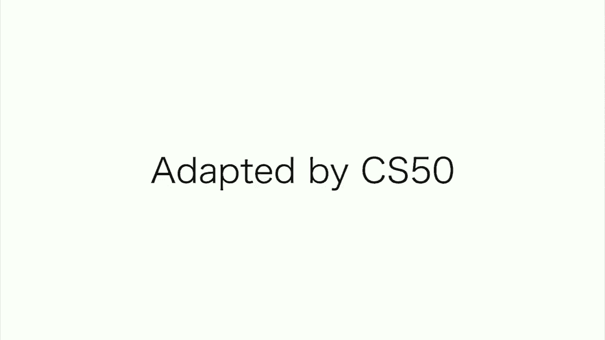

从前有个叫杰克的人，他在交朋友方面很困难。

杰克没有这项本领，所以他去找他认识的最受欢迎的人。他走向蓝色，问我该怎么做，感到沮丧。

好吧，路开始说，看看你是多么不同，确实，杰克，我确实这样做。来我家，我会给你看它们。

所以他们去找杰克，杰克给路展示了盒子，里面放着他所有的衬衫和他的。

裤子和袜子，路说我看到你把所有的衣服都堆在一起，为什么不穿。

有时还有其他的，袜子。

我把它们洗净并放入盒子，然后第二天早上来。

我跳起来，去盒子里取我的衣服，从顶部拿下来，路迅速意识到问题所在。

堆放，当他伸手去拿东西阅读或穿着时，他选择了一本顶书或内衣，然后完成后他。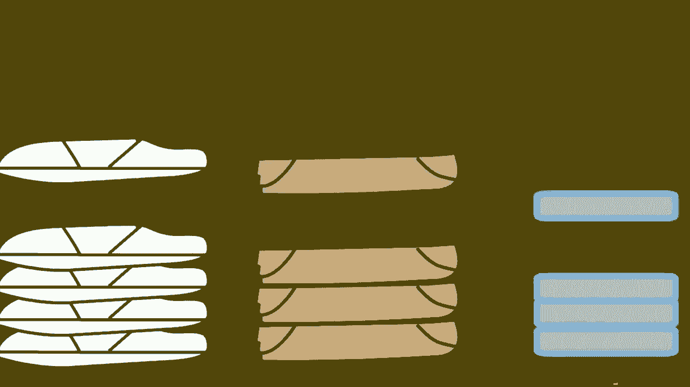

会把它放回去，回去时它会放在堆的顶部我。

知道解决方案的路说，得意洋洋地说，你需要学会开始使用队列。

一个衣柜，当他把盒子倒空后，你刚好把它扔掉，然后他说，现在杰克。

在一天结束时，把你的衣服放在左边，当你把它们收起来时。

然后明天早上，当你看到阳光时，去右边取你的衣服。

从队伍的末端你难道没看到吗，路说，这样会很好。你会在穿之前穿过每一件。

穿东西两次，所有的东西都排队放在他的衣柜和架子上。杰克开始对自己感到相当自信，都是因为路。

还有他美妙的提示，好吧，这就是cs50的全部，我们会再见。
