# 哈佛CS50-CS ｜ 计算机科学导论(2020·完整版) - P12：L6- Python从语法到应用实战 1 - ShowMeAI - BV1Hh411W7Up

嗨，大家，很高兴见到大家，在这个假期，如果布莱恩或我能解决任何评论或关注，请告诉我。向布兰登、安德鲁以及其他在场的朋友问好。没有，我想念红头发的布兰登，来看看萨默维克，很高兴见到你。布莱恩，你想看看有没有。

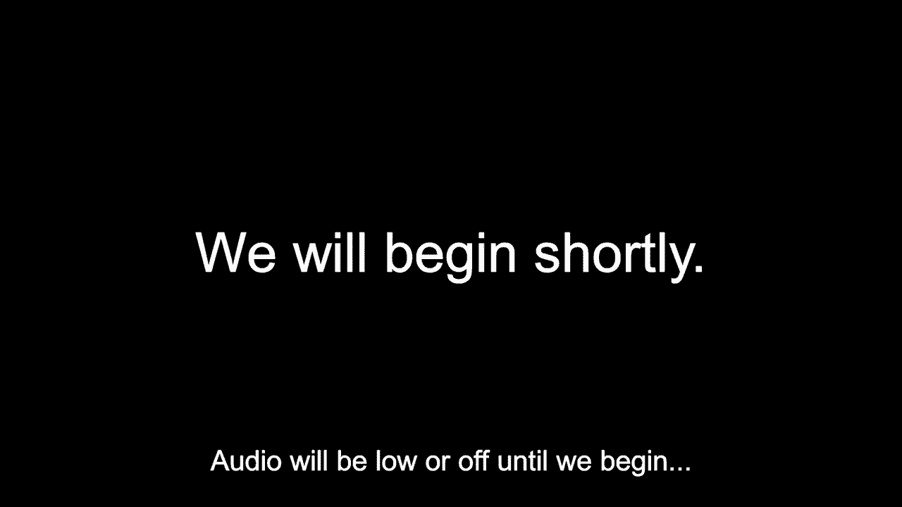

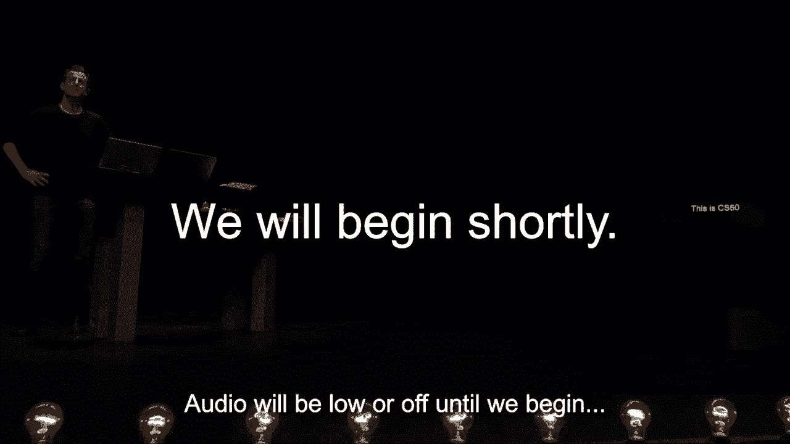

好的，这里是cs50，本周的内容。

六号，这又是那些稀有的日子之一，在短短的时间内，你将能够说，你学会了一种新的语言，今天的这种语言将是被称为python的语言。我们认为，可以通过一些更熟悉的方式来介绍python，课程刚开始于零周时我们介绍的。

说你好，世界，然后事情迅速升级，变得更加晦涩，更加难懂，我们引入了c和这样的语法，当然。这确实做了完全相同的事情，只是在屏幕上打印出你好，世界。但要求你理解并包含所有这些，各种语法。

所以今天，所有这些复杂性，c语言的所有语法突然，开始融化，剩下的就是这个，被称为python的新语言。这将以这行代码来实现同样的，目标。也就是说，python往往更容易，但这是因为它建立在这个基础上。

作为人类早年开始的传统，构建这些低级语言如c，意识到缺少什么功能，哪些是一些痛点，然后，在这些旧语言之上进行叠加，所以，真的有数十种，甚至几百种语言。总是有一个子集在任何给定时间都非常，流行。

python就是这些非常流行的语言之一，也是我们将要研究的第三种语言。确实在学期的这个时候，所以，让我们去**介绍一些python的语法，确实通过与我们过去所见的进行比较，因为无论今天的一些主题有多新。

他们应该都是熟悉的，因为我们将再次看到循环、条件、变量、函数返回值，几乎将会是一个功能的翻译，现在的特性，当然在scratch的世界中，这只是一个。拼图块或一个功能，其目的是，屏幕，在第一周我们将其翻译为。

这里有更多晦涩的语法，你必须了解，这个反斜杠，n 来重新表示换行符。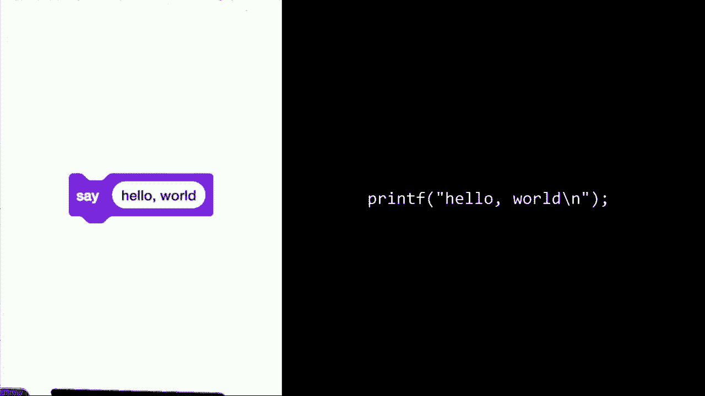

然后当然，这种语句必须以分号结束。今天在这种称为Python的语言中，等效的代码行将非常简单，就是print，而不是printf，我们仍然有这个。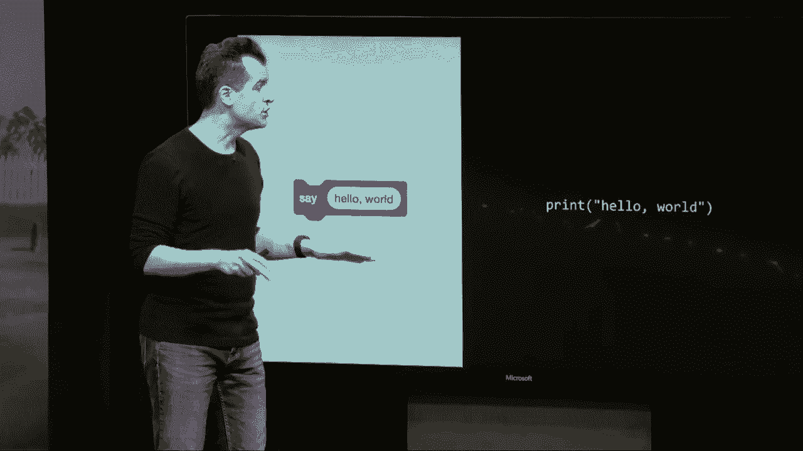

双引号，但是，反斜杠n和分号已经消失了。如果你经常为忘记这些愚蠢的东西，比如分号而自责，Python现在将是你的朋友。好吧，让我们看另一个例子，我们如何获取用户输入。注意我们有一个称为ask的拼图块。

它说询问你的名字是什么，然后等待，下一个难题。说无论人类输入了什么，前面都加上“你好”这个词。从今天开始，我们将看到一些这样的代码，答案等于获取字符串“你的名字是什么”，然后用printf打印出来，给其他的。

在Python中，这些复杂性也将逐渐消失，我们将看到这样的东西，因此不再提到变量的类型。分号也不再存在。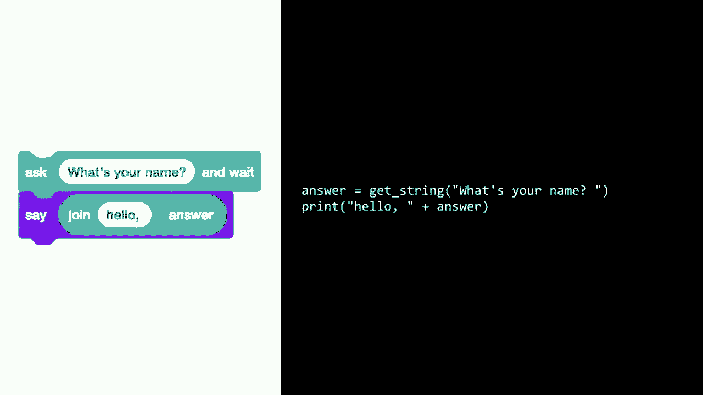

百分号s以及打印的额外参数，所以实际上，让我们去看看这些，转到cs50 ide，稍等片刻。在cs50 ide中，我将继续写我的第一个Python程序。为此，我将继续进行。

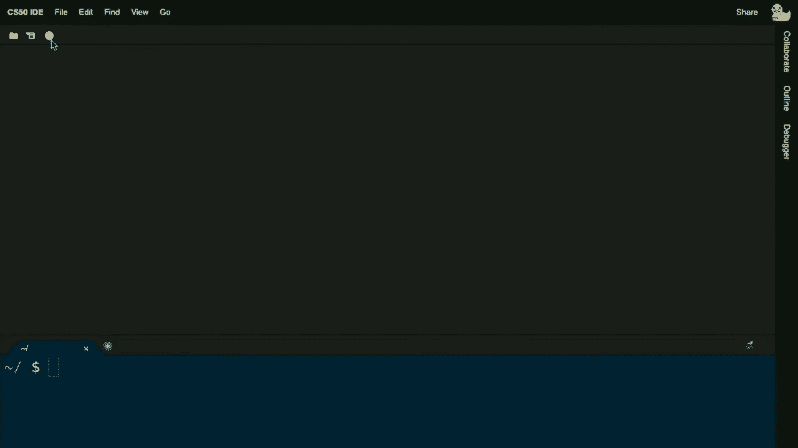

创建一个最初称为hello的文件。像在C语言中一样，Python程序有一个标准的文件扩展名，即.dot pi，而不是.dot c。我将执行我所提议的最简单的转换，我将继续说打印“你好，世界”，我将保存我的文件，然后我将去我的终端窗口，使用。

然后我们将执行dot/slash hello或类似的命令，但今天我将简单地运行一个命令，命令本身被称为Python，我将传递我刚创建的文件的名称作为命令行参数，哇，按下Enter键。这是我的第一个命令行参数，因此，这是我在Python中的第一个程序。

所以这非常强大，让我们继续创建这个我刚才提到的第二个程序。这次我也将继续回答。我将继续获取用户输入，并将使用我们之前在C语言中做过的get string，继续询问你的名字是什么。

“你的名字？”我不打算麻烦分号，但在这里我将继续说打印“你好，”然后在百分号s内部加一个空格，实际上我将继续使用加号运算符。

然后，字面上是“答案”这个词，但还没有工作，这还不能工作，因为getstring，结果证明就像它在c中一样。它在python中也不存在，所以我需要做一件事情，那就是不再是#include某个东西，而是字面上说来自cs50，导入getstring，因此在c的世界中。

回想一下我们包含的cs50.h，它有像这样的函数声明。

getstring和getint等，在python的世界中我们将做一些类似的事情，但。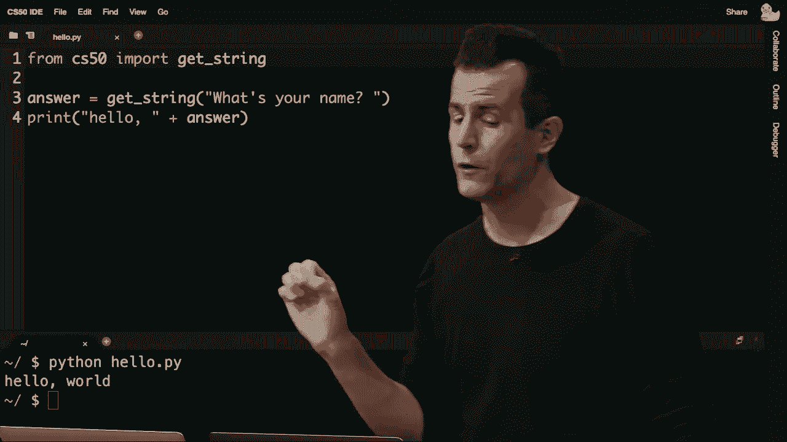

语法略有不同，我们将说来自cs50的，写入。导入的内容是包含一个特定称为getstring的函数。

现在，我可能出现的任何错误都消失了，如果我继续保存这个文件，然后执行python。space hello dot pi并按回车，现在我。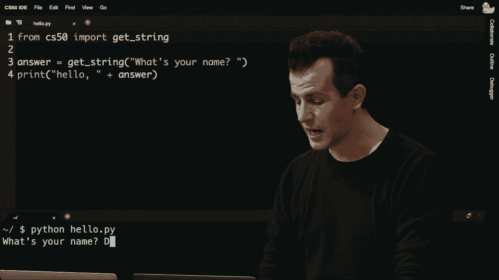

可以继续输入我的实际名字，瞧，我看到了“你好，戴维”。所以让我们仔细看看这段代码有什么不同，并考虑一下我们在这之后还可以做些什么。所以再一次，注意第三行，不再提到字符串。如果我想要一个变量，我只需继续并给自己一个名为answer的变量，函数仍然叫getstring，c，分号。

在我最后一行代码中，打印的是它，确实是打印，而不是printf。然后这是新的语法，但在某种意义上，它会更简单，而不需要提前考虑我想要的百分号s和占位符。这个加号运算符似乎在为我做些什么，让我继续。

这里我问一个问题，这个加号运算符似乎在做什么，因为它不是算术意义上的加法，我们不是在将数字相加。但这个加号显然是在做一些事情，给我们一个可视化的结果。彼得，有什么想法，这个加号在做什么，是在连接字符串，对吧？

连接字符串，这是描述一个字符串与另一个字符串连接的术语。因此，它与我们在c中没有的那个join块的字面翻译非常相似。在c中，我们必须使用printf，我们必须使用百分号s，而python会更友好一些，这样如果你想要空格和那个变量的内容，我们可以。

只需使用这个加号运算符，而我们必须做的最后一件事当然是导入这个库，以便我们可以访问getstring函数本身。好吧，让我们继续参观一下python的其他一些功能，然后主要进行许多实际示例。请记住。

在我们刚看到的例子中，我们有这一行代码，它从用户获取一个字符串并将其存储在一个名为answer的变量中，我们有第二行代码，它是结合在一起，但事实证明，尽管这比在c中方便得多，因为你可以直接使用现有的结合，而不必使用格式字符串或。

诸如此类，结果是有另一种方法，坦率地说，很多方法都能得到相同的结果。我将继续提议，现在将这一行更改为这种奇怪的语法，所以乍一看肯定是丑陋的，这部分是因为这是python的一个相对新特性，但请注意，在python中我们可以使用。

这些大括号，用来插入一个变量的实际值，所以不再是百分号s。python的print函数使用这些大括号，基本上意味着。这里插入一个值，但有一个奇怪的地方，你不能只是开始放大括号和变量名，python，你还必须告诉语言，后面的内容。

是一个格式化字符串，所以这可能是我们见过的最奇怪的事情。但当你有一对双引号像我这里的，前缀加上f将实际告诉计算机格式化该字符串的内容，将值插入那些大括号之间，而不是字面上打印那些大括号。

所以让我继续进行到我的**实际代码**并尝试这个。与其使用连接运算符，逗号，采用正确的方法。因为如果我重新运行这个程序，python的hello.py，它会问我名字，我将输入david，但它会完全忽略我，因为我。

字面上硬编码了hello，逗号答案，但这也不太对。仅仅开始把它放在大括号中，因为如果我再次运行这个程序python的hello.py并输入我的名字，现在它会说hello，花括号答案。所以这里只是一个微妙的变化，我必须告诉python，这种字符串在。

字符串，输入david。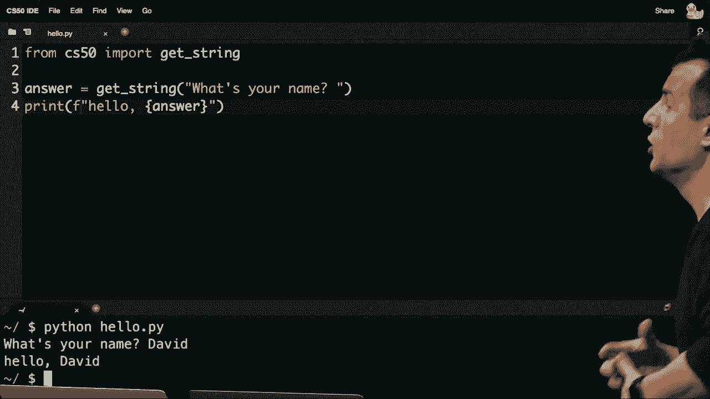

我现在得到了hello david，所以这比c方便一些，因为你不必在这里有一个占位符，一个占位符，然后是一个以逗号分隔的额外参数列表，所以这只是一个更简洁的方式，如果你愿意，实际上引入更多的值到你想创建的字符串中，这些被称为。

格式字符串或简称f字符串，在我们的工具包中，编程时使用这种新语言。叫做python。那么让我们看看几个其他翻译的拼图块，看看，然后转向python，开始从零构建。这是早期的一个示例，名为counter的变量，初始化为零在c中的第一周。

这个，int计数器等于零分号，这给我们一个初始值为零的int类型变量。在Python中代码将是相似的，但会简单一些，Python提到我想要的变量类型，它会根据上下文推断出是什么，我也不需要有。

所以计数器等于零，在Python中将给你一个叫做计数器的变量。因为你给它赋值，将会是一个int或整数，我们在Scratch中还看到了什么，计数器加一，所以这是一种将变量值增加一的方法。在C中我们有几种不同的方式来实现这个，我们可以说计数器。

等于计数器加一，这种说法有点过于**迂腐**，有点长且乏味，而是用符号。在C语言中，我们可以做计数器加等于一，这将达到相同的结果。好吧，在Python中我们其实也有几种方法。我们可以像在C中那样明确地说，但只需省略分号。

计数器等于计数器加一，Python中的逻辑与C中完全相同。至于这种简写符号，Python中也存在。再一次，没有分号，唯一不一样的，或我加加，那种语法糖使得一个变量，不幸的是在Python中并不存在。

但是你可以做计数器加等于一或其他任何变量。我们在Scratch中还看到了什么，以及早期的条件。这些条件使用布尔表达式来决定事情或其他完全不同的内容，在C中我们将其转换为看起来有点类似的内容，确实，花括号有点拥抱。

printf行就像黄色条件那样拥抱紫色块，我们有小于y的括号，我们再次在花括号内使用printf，其中有双引号。一个换行的反斜杠n和一个分号，Python非常好地将会在精神上是类似的，但语法上更简单，接下来Python的样子将是x。

小于y，花括号去掉，分号去掉，这里你看到人类编程语言的演变小例子。如果你和我对代码中到处都是愚蠢的分号和花括号感到沮丧，何况要正确，人类决定，知道吗，为什么我们不直接说出我们的意思呢。

不必过于担心所有这些语法复杂性，让我们保持事情简单，确实。这是Python中的一个例子，但有一个关键细节，如果你们中的任何人习惯于**马虎**，在缩进方面，或许风格50一直在对你大喊，添加空格、添加空格或删除空格或行。

在 Python 中，现在必须正确缩进代码，在 C 中，当然我们 CS50 和世界上许多人都推荐你用四个空格来缩进代码。通常，或一个 Tab，在 Python 的上下文中，如果你不小心遗漏这些空格，就会发生错误。在 print 之前的空格必须存在，否则代码将无法运行。因此，不再有马虎，Python 将会。

不必担心包含大括号，关于两条你可以遵循的路径，如果或 else。在 C 中，我们很直接地翻译成这样。再次是上面的括号，这里的大括号，以及反斜杠 n 和分号。你可以猜到在 Python 中，这将变得更紧凑，因为砰的一声。

现在我们不再需要括号，但我们需要缩进和新行。我们不再需要分号，所以我们正在逐渐摆脱那些现在可以被视为理所当然的特性，但在 Scratch 中的这个例子呢，当我们在路上有三叉路口时，如果用 C，我们会这样翻译，那里并没有太多变化。

这是相当数量的代码行，大约 12 行在 Python 中。注意这里将要消失的是那些括号，那些大括号，那些反斜杠 n，以及分号，这里只有一个奇怪的地方。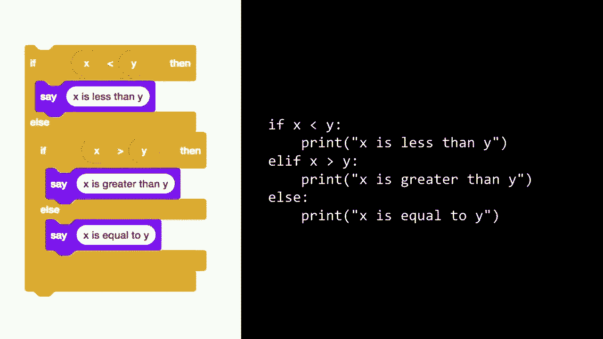

只有一个奇怪的地方，对你来说看起来错或奇怪的，或许看起来像是一个错字。我保证我没有搞错。我会说 lift 而不是 elsif，在语法上是不同的。所以在 C 中我们字面上会说。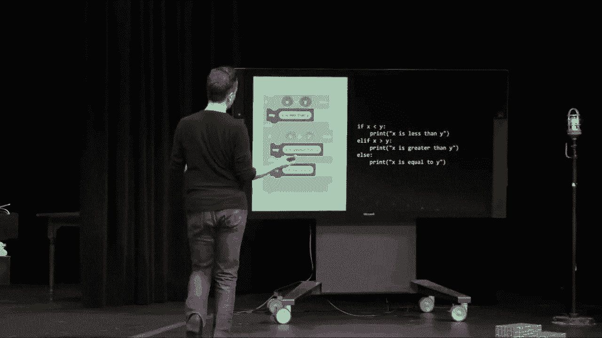

早些年人们决定在 Python 中使用 else if 时，何不简单地说 elif，节省打字的时间。这里的语法确实是正确的，你可以有更多的 elif，可以有四个、六个，甚至更多，但语法确实有些不同。

更紧凑的右侧，代码的语法干扰更少。你不必忽略那么多分号和大括号。像 Python 通常在语法上更为简洁，确实显得更现代。语言就像它，好的，我们来转向 C，当我们想做的时候。

一次又一次作为循环，或许是永远，我们在 C 中会字面上使用 forever 块。我们可以用几种不同的方式实现这一点，我们提出的相当简单。while true 打印出 hello world 一次又一次，因为布尔表达式永远不会改变，它确实会永远执行。

所以 Python 实际上是非常相似的，但有一些微妙的差异，比如这里。我们有 true 在括号中，大括号，新行，分号，很多特性即将消失，但仍然会有些许差异，注意我们正在缩进。正如我一直强调的，我们不再有新行、分号或大括号。

但true和false现在必须大写，所以在C语言中是小写的false和true，而在Python中，它们将被大写。就像之前一样，if i回到我们最近的条件。

注意，尽管我们去掉了花括号和括号，但现在引入了这些冒号，这在这个表达式后是必要的。紧接着的代码行缩进在下面，确实与if、l、if或else相关，而我们在循环的上下文中再次看到了同样的特征。

在Scratch中，当我们想要做有限次数的事情，比如三次时，我们会重复以下三次。在C中，我们有几种不同的方法来实现这一点，所有这些我敢说都是非常机械的。如果你想做三次，C中的负担在于你需要声明一个变量。

跟踪你已经计算过多少次，像有很多移动部件那样递增。在C语言中，一个叫做i的变量等于零，但我们可以称它为任何我们想要的。在这里我们有一个while块，它在询问一个布尔值，i是否小于三，然后在循环内部我们打印出hello world。

使用C语言的语法糖++表示法，我们不断给i加一，直到隐式地跳出循环，因为当然i不再小于三。因此在Python中，精神上类似，但一些杂乱的部分又消失了，i = 0就是我们需要的。

我们只需要一个变量，while i小于三就足够了，但加上冒号后，在适当缩进的地方我们打印出hello world。虽然我们不能用++，这有点失望，但i += 1会递增i，所以这就是在Python中实现相同功能的一种方式，一个执行三次的循环，当然我们还看到了其他方法。

在C语言中，还有其他方法可以在Python中实现。你可能记得在C中看到这种方法，for循环，而你可能经常会用到for循环。尽管它看起来有点神秘，但你可以将更多特性包装进那一行代码中。

如果你愿意，可以将这些分号看作是相同的逻辑，它只是在使用for循环的情况下打印出hello world三次。相比之下，在Python中事情开始变得有些优雅，虽然乍一看有点奇怪，但确实更简洁。如果你想做三次，结果在Python中就变得简单了。

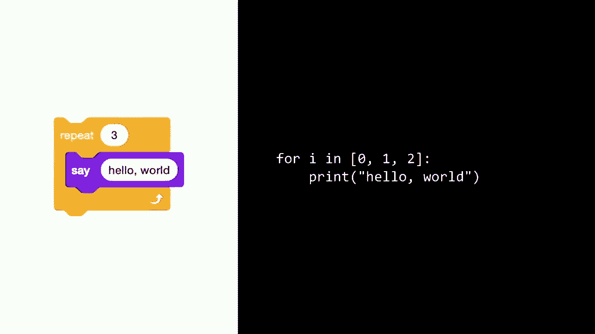

你可以为 for 循环使用更简洁的语法，for i in，然后在方括号中列出值。因此，就像我们过去在方括号中表示数组和索引一样，在 Python 的世界中，每当你用方括号包裹一堆值时，你实际上是在封装它们。

所以这行代码的意思是，for i in 012，这意味着什么？这是一个 Python 中的 for 循环，它说给我一个变量叫做 i。在这个循环的第一次迭代中，将 i 设为零，在第二次迭代中，将 i 设为二，对我来说，它为你完成了所有这些。

现在归根结底，i 的值其实并不重要。因为我并不打印 i 的值，这完全没问题。你很可能使用过 for 循环，或者重复做某件事，比如打印“你好，世界”。即使你没有在这些方括号中打印出任何三项内容。

就像在 C 语言中列举零、一、二一样，像计算机科学家那样，从零开始计数。但这很容易出错，是否有人觉得在 Python 中使用 for 循环存在问题？如果你必须在方括号之间输入你想要迭代的值列表。

嗯，如果你想做一件事情 50 次，你得写出零、一、二、三、四、五、六，天哪，这样看起来会很可怕，有趣的是你提到 50，因为在为今天的讲座准备这个演示时，我回到了第零周，实际上在第零周的类比。

实际上是打印“你好，世界” 50 次，我心想，天哪，这看起来太糟糕了，因为我必须把它放在方括号内。诺亚说，这看起来实在太糟糕了，肯定有更好的方法，确实有。虽然对于非常短的值来说，这可能很吸引人，但在 Python 中有更简单的方法。

在 Python 中，当你想执行某个操作若干次时，我们可以替换这三个值的列表。它需要一个输入，即你想返回的内容数量，基本上是。

range 会为你做这个，输入像 3 的值，它将为你迭代这三个值，所以在刚才的讨论中，如果我现在想迭代 50 次，我只需将 3 改为 50，而不必手动输入从 0 到 49 的疯狂列表，这当然不会是个很好。

一个设计良好的程序看起来会如此，仅仅因为它的长度和出错的机会。在 Python 中，这或许是现在最“Pythonic”的做法，以某种数字执行某些操作，确实这是个短语，技术人员程序员在某种意义上往往非常讲究。

当谈到正确的做事方式时，实际上在 Python 编程的世界中。许多 Python 程序员确实有这两种观点，同时也有标准化的。建议，规范如何您，这，被认为是 Pythonic。如果您以“正确”的方式做事情，那么您就是在以 Pythonic 的方式在做事情。

这并不意味着绝对正确，其他人，在这个意义上更倾向于同意您。那么，接下来在我们开始构建自己的一些特性之前，让我们看看 Python 的一些最终特性。在 C 中，我们有这整个数据类型列表，当然还有更多。您可以创建自己的类型，但我们看到的原始类型是 float。

在 Python 中，int、long、string 等数据类型，尽管我还没有用到它们。因为我可以给自己一个变量，给它一个名字，比如 counter、i 或 answer，然后。为它赋值，Python 会根据您赋的值推断出，应该是什么数据类型。Python 确实有数据类型，只是，在编程世界中，这被称为一种宽松、强类型的语言。

存在，您必须在 Python 世界中显式使用它们，它是一种，松散类型的。语言，类型存在，但您通常可以隐式推断。负担不在于您，程序员，必须不断指定这些数据类型。让计算机为您解决这个问题，所以这是我们从 C 中得到的列表。

这现在将成为我们的类似物，bool 仍然为真和假，但大写。T 大写 F，我们将拥有 float，它是带小数的实数。我们将有 int，它当然是像负 1、0 和 1 这样的数字等等，str。而在 C 的世界中，技术上没有字符串类型，这是一个提供的特性。

通过 cs50 库，它刚刚变得更加易用，回想一下，C 语言有字符串，它们被称为字符串。但没有数据类型叫做字符串，您给自己的字符串的方式，当然是在 C 中声明某个东西为 char 星，char，星是一个同义词，一个昵称，一个别名，叫做字符串。在 Python 中，实际上存在一种，真正的数据类型用于字符串，简写为 str。

好吧，既然如此，还有什么其他可以使用的呢？好吧，Python 中还有其他数据类型，这实际上将在我们开始开发更复杂的程序时，证明非常有用，并用这个语言做更酷的事情。我们已经看到过 range，它严格在 Python 中，默认会返回一系列值，从零开始。

基于您提供的输入列表，我会不断地口头提及。列表是 Python 中的一种适当数据类型，它在精神上类似于数组，但。在数组中回想一下，过去几周我们花了很多时间强调。数组是固定大小的，您必须，这样做，就像上周如果您决定“哦，我”。

需要更多内存时，你必须动态分配更多空间，复制值过去，然后，很多。可以说是跳过一些障碍，当你想使用数组和C时。如果你想增长它们，甚至缩小它们，Python和其他类似的高级语言。一个数组，自动调整大小，变大和变小，这个功能现在你可以得到。

可以说在语言中是免费的，你不必自己实现。Python有所谓的元组，嗯，或者GPS，你可能有X和Y坐标或。纬度和经度坐标，就像逗号分隔的值。元组是在Python中实现这些的一种方式，字典或字典，因此Python有。

字典允许你存储人类世界，如果你有一个人类字典，例如，对于英语，就像一个物理形式的字典，让你存储单词及其定义。Python中的字典更一般地让你存储任何键和任何值，你可以将一件事与另一件事关联，我们将看到这一点。

这是一个非常有用且多功能的数据结构。最后，为了今天的目的，还有一些叫做集合的东西，如果我们从数学上回忆起来，集合是。三个，没有重复，但是Python为你管理，确保你可以向集合中添加项目。你可以从集合中移除项目，Python会确保没有重复的项。

它也会为你管理所有内存，所以我们在函数方面，有。C中，我们使用`cs50`库来获取字符、双精度浮点、浮点数、长整型和字符串。在Python中，感谢上帝，我们不再需要担心双精度浮点或长整型。稍后会多谈谈，但`cs50`库在Python中，你几分钟前看到我导入的。

确实给你一个叫做`get float`的函数，确实给你一个叫做`getint`的函数，确实给你一个叫做`getstring`的函数，至少在本周的目的上。只是会让你的生活更轻松，这两个是训练轮，我们将很快去掉，这样你最终只使用原生的Python代码，而不是。

`cs50`区库，但为了过渡这一周从C到Python，你会发现这些会让你的生活更轻松。在我们放松并把它们也去掉之前，因此在C中。使用库时，你必须包含`cs50.h`，在Python中你将再次去**d。并导入`cs50`，或者更明确地导入特定的函数。

你可能想要导入的内容，所以它，导入东西，它们最终实现的目标基本上是相同的。你可以像之前那样，逐个明确导入一个函数，使用`get string`，或者你可以一次性导入整个库，只需简单地说，更简洁地。导入`cs50`，这将影响我们之后必须使用的语法。

但我们会在接下来的例子中看到多种方式来做到这一点。你也可以稍微简化一下，你可以从像我们这样的库中导入一个以逗号分隔的函数列表，这是我们将经常看到的约定，因为当我们开始使用流行的第三方库时。

互联网上的其他程序员，他们通常会给我们提供很多我们自己可以使用的函数，只需以这种方式在这里指定它们。如果有任何关于Python语法的问题，就这样。

本质上，在我们的Python语法速成课程中，我们现在将开始构建事物，探索Python的特性以及一些细微差别，以及Python的真正力量，但首先，关于语法有什么问题？我们已经看到了循环、条件、变量，奥利维亚，有问题或评论吗？嗯，如果在for循环中你想增量不是1，但又不想明确列出列表，你会怎么做？

很好的问题，如果你想使用for循环并遍历范围，0 2 4 6 8，而不是0 1 2 3，让我回去看一下刚才的幻灯片，我实际上可以动态更改这个，让我去。

我可以做的是。

实际上是指定另一个值，这可能是，如果我更改输入为。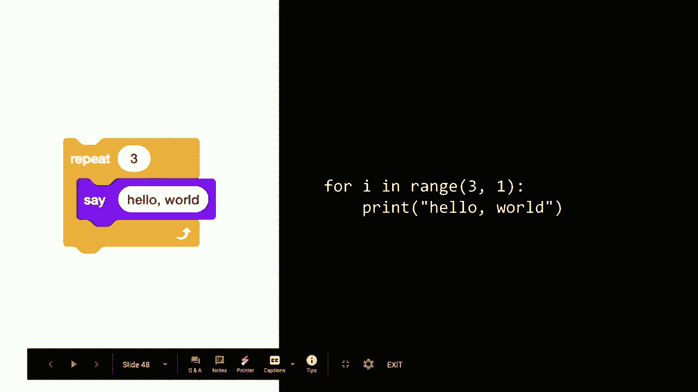

范围不只是一个值，对计算机来说，它应该统计总共三个值，但它应该以每次增量两个而不是默认的一个来递增，并且还有其他能力，你也不需要那样。这就是说，使用Python你会发现更多的功能出现。

使用这种语言，甚至更强大的功能，你可以编写的函数以及你可以在Python中使用的函数，有时可以接受不同数量的参数，有时是零，有时是一个，有时是两个，但这是。

最终这常常取决于你，其他问题问得好，好吧，我们会回到瑞安，哦，索非亚，轮到你了，我们会看到序列主要出现在for循环中吗？还是还有其他应用场景，在什么意义上它们非常有用，序列是指范围或列表，或者其他什么，哦，回到你，我想我们把你静音了。

是的，嗯，是的，关于范围的问题，很好，我们会在其他上下文中使用它们吗？一般来说，这很少见，我现在正在绞尽脑汁想其他我使用范围的用例，我相信我可以想出一些，但我认为毫无疑问，迭代，像在for循环中，我会再想想看看还有其他应用场景，但无论何时。

你想生成一长串遵循某种模式的值。无论是 0 1 2，还是正如 Olivia 指出的那样，带有间隔的值范围，这将使你避免完全硬编码，并且你实际上可以写出自己的生成器函数，可以说是返回任何模式的函数。

你想要生成的值，来自你在聊天中提到的任何内容，或者更多。嗯，看起来所有的问题都已经在这里回答了，好吧，我们现在继续。毕竟，这才是编程真正变得有趣和强大的地方。

当你我不再需要实现那些低级的实现细节时，比如为哈希表实现内存管理，或者为链表实现内存管理，或者在数组中复制值时。过去几周，我们一直专注于一些低级的。

原始数据是理解的有用内容，但编写起来并不有趣，我承认它们在问题集中的形式可能并不好玩。而且在余生中，编写它们肯定不会有趣。每次你想写代码来解决某个问题时。

但再次强调，这就是库的作用，它们提供了一种更简单的语言，用于解决某些类型的问题，其中包括我们在过去的问题集中解决的一些问题。实际上，让我去**做**这个。我将去**做**这个，给我一点时间，抓一个文件。

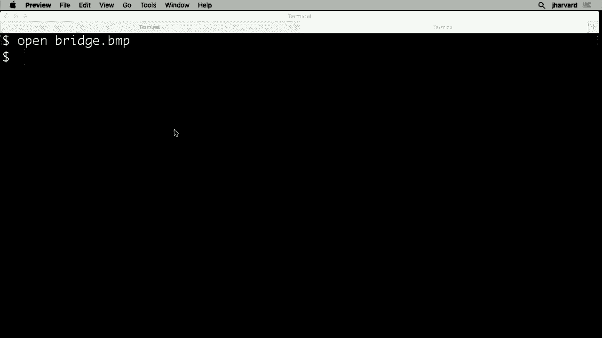

叫做桥的位图，你可能还记得之前的问题集。这是一幅美丽的周末桥，位于剑桥的查尔斯河旁边，麻省理工学院附近。这是由 CS50 团队的一名成员拍摄的一张非常清晰的照片，当然在最近的几周里，你编写了代码来进行各种变换。

其中一张模糊的图片，我敢说模糊并不是最简单的。

要解决的问题是，你必须上下左右查看。平均所有这些像素，你必须理解图像是如何被表示的，一次一个像素，所以有很多低级的细节。我们想做的只是模糊一张图像，因此在过去的几周里，我们需要考虑。

而且在这个较低的层次上写代码，现在用 Python 发现，我们能够以更高的抽象层次思考，为自己编写更少的代码。所以让我去**做**这个，我将使用我的 Mac，而不是 CS50 IDE，这样我可以更快地打开图片。这就是说，即使如此。

我们将继续使用 CS50 IDE 来编写 Python 代码和其他语言，直到课程结束。你也可以在自己的 Mac、手机上安装所需的软件，但我们在课堂上通常会使用 CS50 IDE，以便于操作。所以我将去**做**这个，虽然在我的电脑上写一个叫做模糊的程序。

**pi**，当然是python程序的文件扩展名。我的程序看起来有点不同，现在我有一个黑色和蓝色的窗口，但这只是我个人的mac上的文本编辑器，我要继续进行。我需要一些功能，图像，所以我会继续从中导入。

一个药丸库，一个枕头库，可以说是一种名为**图像**的特殊功能，以及一种名为**过滤器**的特殊功能。也就是说，这本质上是两个功能，聪明过我的人写的图像处理代码，他们把代码免费提供在。

互联网是免费的和开源的，这意味着任何人都可以使用代码。我现在被允许将其导入到我的程序中，因为我之前下载并安装了它。现在我会继续进行，给自己一个变量，称为**before**，并在**bridge.bmp**上调用**image.open**。

所以即使我们之前从未见过，也从未使用过，你也在进行。我在左侧有一个变量叫**image**。open，我传入名称，就像C语言中的**f open**。现在注意到这个点（dot）在这里担任了一个新的角色，只针对**person**对象或一个节点对象，我们想进入其中并访问一些变量。

好吧，事实证明，在python中，你有类似于精神上的东西，只包含变量或数据，比如姓名和数字，就像我们几周前为**person struct**所做的结构体。不仅是变量的数据，你还可以有函数，打开各种功能的可能性。

所以似乎我得到了这个图像对象，这个图像对象是我从其他地方导入的，它里面有一个打开的功能。我们在今天的例子中会越来越多地看到这种语法。让我给自己一个第二个变量，这个变量称为**images**，传入过滤函数。

**image filter dot box blur**的一。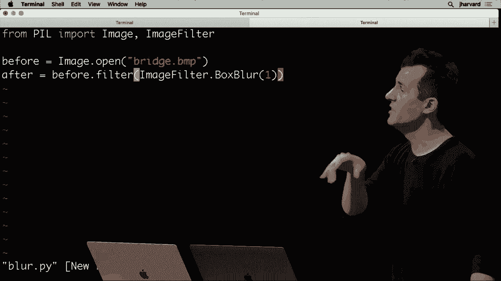

我不打算在这个特定的语法上花时间，因为生活中你可能没有太多机会想要模糊一张图像。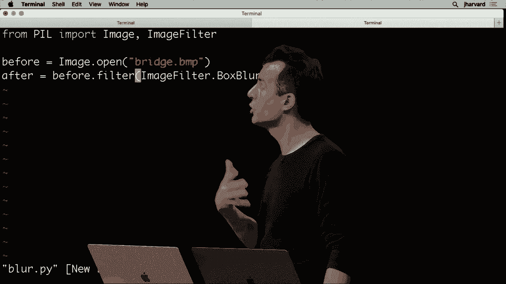

代码，但为了今天的目的，请注意我在**before**变量内，因为我将其赋值为这个新功能的返回值。现在其中一个函数称为**filter**，这个过滤器函数以另一个函数的返回值为输入，简而言之，将使用一个盒子模糊我的图像。

嗯，使用一个像素半径，就像在C语言中一样，这段代码会告诉我的代码向上、向下、向左和向右查看，计算周围的平均值，就这样。在那之后，我会做点什么，使用点（dot）保存，我会将其保存为**out.bmp**。我只想创建一个名为**out.bmp**的新文件，如果我没有犯错误的话。

让我现在继续运行 Python 的 blur。pi，并按下回车，没有错误消息。因此，如果我输入，已经打开的 blur。pi，刚写好的，out。bmp，如果我继续打开 out。bmp，让我们看看，这里是之前的。这里是之后的，嗯，之前，之后，现在在互联网上，可能，mac，就在这里几英寸外。

绝对看起来模糊，但让我们再做得更引人注目一些。与其只向上、下、左、右查看一个像素，为什么不通过观察来查看呢。

添加更多值并取平均，让我继续运行 Python，重新打开。现在你可以看到之前和之后，之前和之后，这说明了什么呢。

好吧，这里是问题集四，用四行代码模糊图像。真不错，很强大，借助他人的肩膀，接下来是解决一个更近期的问题，让我转到一个不同的目录，在那里我有一个先进的，你可以的网站，一个叫 speller。pi，长话短说。

speller。pi 是将 C 转换为 Python 的一个翻译，呃，speller。c 的代码。请回忆一下，那是分发代码的一部分，用于问题集五，在 speller。c 中我们将其翻译为文本，五个，不同大小的字典，以及一堆短文本和长文本。尚未创建的是字典的等价物。c，即现在的字典。

pi 所以让我继续，**并在 Python 中实现我的拼写检查器**。让我继续创建一个名为 dictionary。pi 的文件，这又是约定。接下来我们要实现，检查、加载大小和卸载，但我可能需要在这里放一个全局变量来存储我的字典，这就是你们所有人的地方。

实现了带指针的哈希表，然后是链表和数组，所有这些都很复杂，你知道我将继续，给自己一个叫 words 的变量。

并将其声明为集合，所以请回忆一下，集合就是一组值，它可以处理重复值。我们可以存储字典中的所有单词，并且直接将它们放入集合中，这样就没有重复的值了。

我可以检查这个集合中是否有一个单词，或者没有，好的，让我们继续，现在加载单词到那个集合中，我将继续定义一个名为 load 的函数，它接受要打开的文件名，至此有一些新的语法。因此到目前为止，我们只是在文件中输入代码，实际上迄今为止最引人注目的区别。

我敢说关于 Python 和 C 的事情是，我从来没有写过一个 main 函数，而这也是 Python 的一个特点。如果你想写一个程序，你不必费心去编写一个名为 main 的默认代码，只需开始编写你的代码，这就是我们如何能够将 C 中的 Hello World 从这么多行代码简化为一行。

在 Python 中，我们甚至不需要 main，但如果我想定义我自己的函数，结果是，在 Python 中，你使用关键字 def 来定义，然后你放入函数的名称，然后在括号中，就像在 C 中一样，你放入你想要的变量或参数名称，而你不需要指定数据类型。

而且我们不使用大括号，而是使用冒号，所以这表示，嘿，Python，给我一个名为 load 的函数，它接受一个名为 dictionary 的参数。那么这个函数应该做什么呢？load 函数在拼写检查器中的目的是从字典中加载每一个单词，并以某种方式将其放入你的哈希表中。

所以我要继续做同样的事情，从字典中读取每一个单词，并赋值给名为 words 的变量。所以我要继续打开文件，我可以用这个函数来做到这一点。在 Python 中，你不使用 f open，而是直接使用一个叫做 open 的函数，我要将 open 的返回值赋值给一个名为 file 的变量，但我可以。

我可以随意称之为任何名称，这就是 Python 变得真正酷的地方。从 C 中读取文件是相当繁琐的，对吧？你必须使用像 f read 或其他某个函数来一次又一次地读取字符。而在 Python 中，你知道吗？如果我打开文件，Python 会自动给我一个 for 循环，初始化并将变量 line 赋值为每一行。

文件中的连续行对我来说，每一行是，我想对每一行做什么呢？我想去做 ah**d，然后添加到我的 word 变量中，每一行代表一个单词，我只想将其添加到我的全局变量 words 中，但这并不完全正确，因为文件中的每一行根据定义都有一个反斜杠 n，这就是原因。

我们给你的大字典中的所有单词都是一行一个。那么，如何去掉行末的换行符呢？比如，使用 malloc 来复制，然后移动所有字符，再稍微缩短一点，通过去掉反斜杠 n。在 Python 中，如果你想去掉字符串末尾的换行符，可以使用 strip。

strip 的意思是默认去掉空格、制表符和反斜杠 n，所以如果你想处理每一行的末尾，你可以简单地说 line.rstrip。这就是 Python 中字符串再次强大的地方，因为它们是自己的数据类型。它们内部不仅包含构成字符串的所有字符。

还有像`r strip`这样的函数，它会去掉行尾的任何空白字符，呃，你知道吗，经过这一切，我觉得我完成了，我就要去关闭文件，并返回`true`，所以就是这样，这就是Python中的加载函数，打开字典，全局变量。

关闭文件，返回`true`，我的代码可能比你的代码实现这个要短好几行，肯定也节省了许多小时。那么，检查一下对吗，也许复杂性就在其他地方，嗯，让我检查一下。它以特定单词作为输入，作为其参数，然后我就要检查这个。

给定单词是否在我的单词集中，实际上在C中，你可能需要使用`for`循环或`while`循环，并且你需要遍历你加载的整个单词列表，使用二分搜索或线性搜索之类的。我现在已经超越这一点了，这么多周过去了，我只想说。

如果`word`在`words`中，就返回`true`，否则返回`false`，这就是我对`check`的实现，现在它有点bug，我会修复这个，有人能发现bug吗？即使你从未见过Python，但花了几个小时实现你自己的`check`版本，有没有什么步骤我逻辑上遗漏了，这里确实有个bug。

有人发现我没做的事情吗？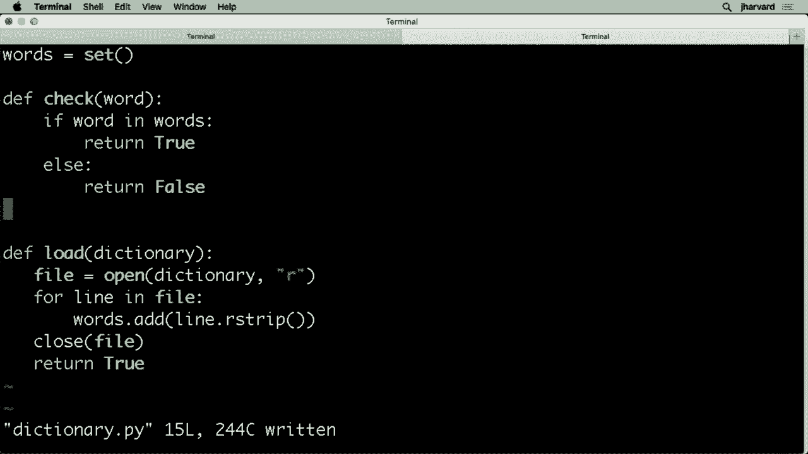

你可能在检查某个单词是否实际上在字典中时做过，几个人在评论大小写敏感性，是的，大小写敏感性，所以你在C语言中的实现很可能强制将单词转换为全小写。这是完全可行的，但你可能不得不逐个字符地这样做，使用`malloc`。

或者将其逐个字符放入数组中，然后使用`two upper`或`two lower`来大写化。

哦，像那样会花费很长时间，实际上可能确实如此，所以你知道吗。如果你想将某个单词转换为小写，只需说`word.lower()`。Python会处理所有字符，将每一个转换为小写，并返回新的结果，确实我认为这与你所做的一致。

`size`函数不接受任何输入，但返回单词的数量。在一组单词中，我这里往前一步，实际上我的缩进有点偏差，让我快速修复一下，如果你想返回字典的大小，或者说你集合中的单词数量。

你可以直接返回那个全局变量`words`的长度，字典。让我继续卸载，实际上不需要输入。老实说，因为我没有做过任何等同于`malloc`的操作，我没有做任何内存管理，为什么呢？因为在Python中我实际上可以在所有情况下直接返回`true`。

因为我的代码无疑是正确的，因为我不需要麻烦于指针、地址和内存管理，所以过去几周你在理解内存管理的低级细节时可能产生的压力，现在都消失了，并不是因为底层的事情，我已经发现。

重新回到 C 语言时，其实我必须调用 file.close。因为现在那个函数关闭与我关联的变量。malloc 和 free 或 realloc 都在背后为你处理，但 Python 语言现在为你管理这一切。

使用所谓的高级语言，你可以获得更多的功能，这样你我就可以专注于构建我们的拼写检查器，而不必在分配内存、复制字符串、转换大小写等问题上浪费时间。老实说，虽然第一次做这些事情可能会很有趣，也很令人满意。

一旦你把这些东西搞定，编程会很快变得乏味。你必须在那种低级别上思考和写代码。好吧，让我去 ah**d 试试，真的去运行这段代码，我将去 ah**d 运行 speller.pie 的 Python 版本，承认这也是我写的。

提前准备，因为就像我们为你写的拼写检查器中的分发代码，我们提前写好了 speller.c 和 speller.pie，但我们不会查看它的内部结构。我要去 ah**d 测试一下，怎么样，试试莎士比亚的文本。我在这里交叉我的手指，目前为止一切顺利，单词飞速闪过。

我假设它们是正确的，希望我们能得到输出，看起来是的，我想我在这里看到一些熟悉的数字，我有 143,000 和 91 个单词。然后在这里，总时间在一秒之内，所以这相当快。需要明确的是，我的数字可能和其他人的有点不同。

在云端运行时是 0.90 秒，但你知道吗，出于好奇，让我快速打开一个不同的标签页，去 ah**d 制作来自问题集五的 speller。我提前准备了我们自己的解决方案，写在 dictionary.c 和 speller.c 中，并且我刚用 make 编译了它，使用相同的莎士比亚文本。

再次运行 Python 版本后，我现在想用 C 版本运行它。

staffs，所有的实现都很好，哇，真不错，速度飞快，差不多快了一倍。而且请注意，尽管上面的数字是相同的，但时间却不是。我的 C 版本用了 0.52 秒，也就是半秒。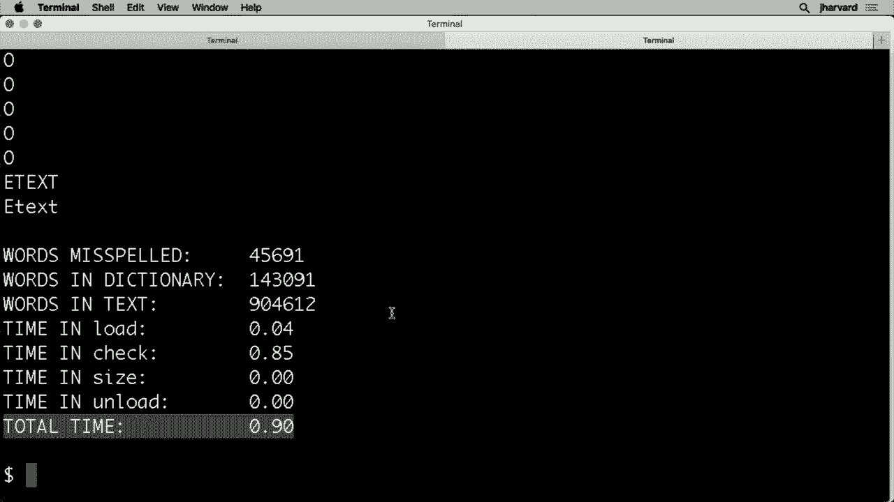

我的 Python 版本耗时 0.9 或大约一秒更快，但我的 Python 版本更慢，为什么会这样？这可能让我有点失望，因为我们刚花了那么多时间宣扬 Python 的优点，而现在我们却在某种意义上写出更差的代码。它是低级的，它明确告诉计算机该做什么。

所以，嗯，这让它快了一点，而在 Python 中，一切都发生在幕后。正如你所说，这可能会使它变得稍微慢一些，是的，在 Python 中，你有一个通用的解决方案来处理内存管理和大写字母，以及其他所有特性。

Python 对所有这些有通用的实现，但使用它会付出代价。

别人的代码为你实现所有这些东西，你还要支付更大的代价。在某种意义上，这在代码之间形成了明显的差异。我会将我的代码从源代码编译成机器代码，并回忆起机器代码是计算机的“大脑”所理解的零和一，所谓的 CPU。

或者说中央处理器，每次我们更改源代码时，我们总是必须编译我们的代码。

然后我们会像这样输入 `dot slash hello` 来运行程序，但到目前为止在 Python 中的每个演示我都没有使用 make 或 clang，为什么呢？结果发现，Python 通常被实现为我们所描述的，仅仅是一种语言，正如我们一直在写的，它也是一个独立的程序，我不断运行的 Python 程序是一个同名程序。

理解 Python 语言的程序。

你会产生一定的开销，你付出了性能的代价。为什么呢？好吧，计算机从零开始回忆。

到头来，它们只理解零和一，这就是它们的本质。

它们在运作，但我没有输出任何零和一，我这个人只是在写 Python。

因此，我的 Python 代码与这种英语语法之间需要有某种翻译，转化为计算机能够理解的内容。如果你每次更改时不想重新编码，而只是通过解释器运行你的代码，正如在 Python 世界中所常见的，你将要付出代价。

因为有人必须为你实现一个翻译器，实际上在 Python 世界中有正式的术语。例如，我们有一幅看起来更像这样的图。而在 C 的世界中，我们实际上会将源代码作为输入，并将机器代码作为输出，然后运行机器代码。

在 Python 的世界里，到目前为止我在写源代码，然后我立刻运行它，我并没有将其编译成零和一，在这个巧合称为 Python 的程序中，其目的就是将那段代码翻译成计算机能够理解的东西。那么这在实际术语中意味着什么呢？这意味着。

如果我回想起这样一个算法，可能对你们很多人来说都是神秘的，不过有些人可能是一个西班牙语的算法，用于在电话簿中搜索某人，假设我根本不会说西班牙语，这个算法变成我能理解的东西。西班牙语到英语，就像哇，这个英文版本阅读起来好多了，算法。

非常快，因为我对英语相当熟练，但如果你只有。

给我西班牙语版本的源代码，你要求我逐行翻译或解释，老实说，这真的会拖慢我的速度，因为这就像我不得不去查一本西班牙语词典，查每个单词，记录 telefonica，好吧，那我得查一下，什么是 ghia。

电话簿是什么，哦好，拿起电话簿，这一步搞定了，第二步是什么，abread。电话簿所以打开到中间，等等，我不知道那个，剧透那是什么意思，abre 好吧让我查一下，它的意思是中间，呃 de gea 电话簿，电话簿。所以我在这里来回挣扎，显然这是一个比较慢的过程。

过程是这样的，如果我继续去查 de la pahina，查看页面，逐行翻译，毫无疑问会拖慢这个过程。因此，这实际上就是我们运行这些 Python 程序时所发生的情况，像是一个中间人正在查看你的源代码，从上到下，从左到右阅读。

本质上将每一行分别翻译成计算机理解的相应代码，因此好的一面是，感谢地，我们不必运行 make 或声称我们对早期 pset 的修改有多少人这里改过 c 的作业却忘记保存文件然后重新运行那个文件。

而且你重新运行它，程序显然没有变化，因为你实际上并没有。

不仅保存了，还重新编译了，所以那烦人的人类步骤消失了。在 Python 的世界里，你改变了你的，重新解释它，你可以省略那一步，但你要付出的代价是一些额外的开销，实际上我们在这里看到了这一点。

就我的 Python 版本而言，处理莎士比亚的内容。

我的 C 版本只用了半秒钟，因此我在过去几周承诺的这个权衡主题，在计算机科学和编程的世界中非常普遍，坦率地说，在现实世界中，任何时候你进行一些改进或获得一些好处，几乎都要付出代价。

这可能是时间，也可能是空间，可能是金钱，可能是复杂性，或者其他任何东西。

这永恒的权衡，归根结底，是关于找到那些转折点。并且最终了解，交易时要使用哪些工具，好的，咱们先休息五分钟，回来后，我们会看看 Python 的其他功能。今天的课程最后，我们将讨论一些非常强大的内容。

好的，我们回来了，首先让我纠正一下，如果我可以的话，布莱恩友善地指出我对奥利维亚和诺亚后续问题的回答不幸地错过了，错在没有查看文档。所以让我回顾一下这个例子，其中我们有 range 函数返回三个值，0，1 和 2，但我认为。

奥利维亚问如果你想跳过值，例如，每两个数字怎么做。遗憾的是，我搞错了语法，只给了 range 两个输入，而这里需要三个。因此，例如，假设我们想要 0 和 100 包含，但跳过每个其他的，即 0，2，4，6，8。因此所有的偶数。

通过 100。嗯，我们实际上想做的应该是这样的，101。

逗号 2。为什么呢？我们马上就会调出文档，但 0 是你开始计数的地方，停止计数，但根据定义，它是排除在外的。因此，我们必须多走一步，超出我们关心的值，然后你想要以每次 2 的增量，从 0 到 2 到 4 到 6 到 8，一直到 100。

那么，我怎么能提前想出这一点，而不是现在让自己出丑呢？事实证明，Python 有官方文档，我们会始终链接给你。这里最上面有一个搜索框，你可以看到，在休息期间我在搜索 range 的文档。

果然，如果我搜索 range 文档，乍一看，结果中提到了很多类似 range 的内容，这就是我们想要的，如果我点击。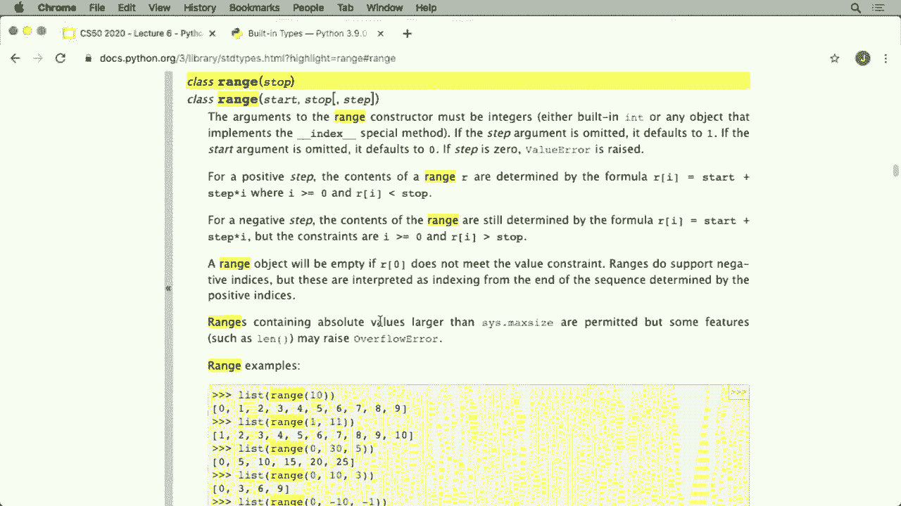

你会看到一些文档，乍一看有点隐晦。但有趣的是，range 有两种不同的形式，它是一个函数。严格来说，它被称为类，但稍后再谈，按照我们的目的，它表现得像一个函数。注意这里有两行，它们相似但又不同。

函数，范围函数可以接受一个输入来停止，三个，显然默认情况下如果是3，您将使用i等于0、1和2。但范围函数还有另一种变体。这并不是我所提出的那个，而是存在的另一个，可以接受这里的三个参数，或者从技术上讲是两个，但它以以下方式工作。

您在Python的文档中看到这样的语法，这意味着范围的替代形式接受一个称为start的参数，后面可以选择一个称为step的第三个参数。我知道作为读者这是可选的，因为它在方*括号中。因此，这与列表或数组无关，这只是人类的文档。

每当您在方*括号中看到东西，人类读者，这意味着这是可选的。那么这意味着什么呢？注意到没有stop和step，我一开始以为在回答Olivia Noah版本时有的。因此，如果我指定我想从零开始，我关心的是100，然后提供一个可选的步长为2，这最终会给我一个程序。

这将打印出所有的偶数，所以让我先这样做。首先让我进入一个程序，我称之为count.dot pi。我要去**d并从零开始。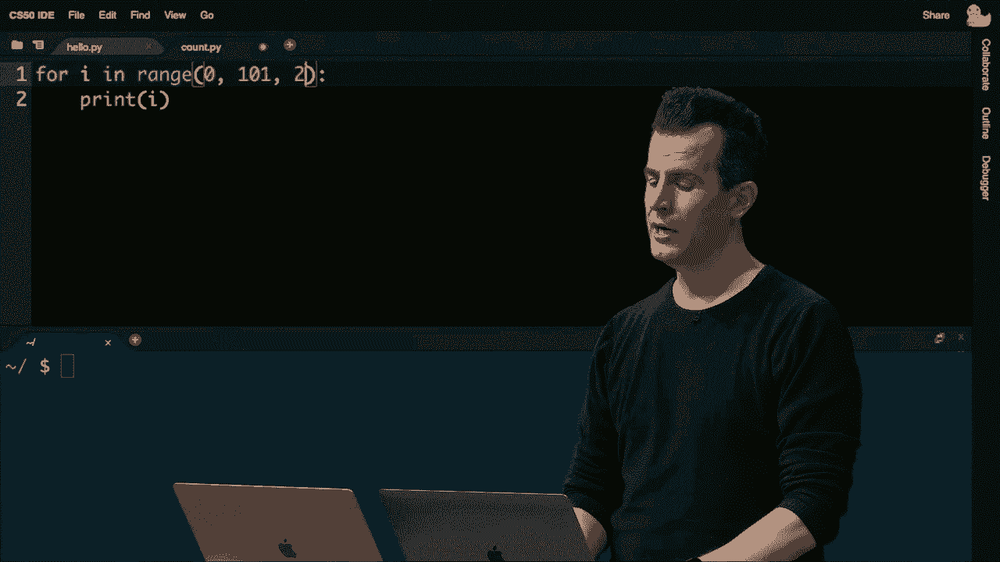

以2递增，但不经过101，每次步长为2，这次我要打印出i。还有这里另一个Python的方便功能，不再使用百分号s。如果您想叫i，只需说print开放括号i关闭括号。您不需要像C语言那样使用另一个格式字符串，让我现在去**d，运行count的Python。

dot pi输入，它滚动得非常快，但请注意，它在100处停止。如果我滚动到开头，它是从零开始的，因此对于之前搞错的地方，我深感抱歉，但这是一个绝佳的机会，去探索Python。尽管它可能感觉神秘，但它将很快成为您的朋友。

乍一看，好吧，让我们继续前进，然后回顾我们之前开始的另一个程序。那个程序再次是这个相对简单的hello程序，我们在这个状态下停止了，我们使用的是来自cs50库的getstring函数。我们有一个叫做answer的变量，它正在获取返回值。

关于getstring的那个版本，我们打印出hello，逗号。所以我们使用了那个新的神秘功能，但很方便，这只是意味着将花括号中的内容替换为实际值。那么让我们开始去掉我们刚刚放上的辅助轮子。

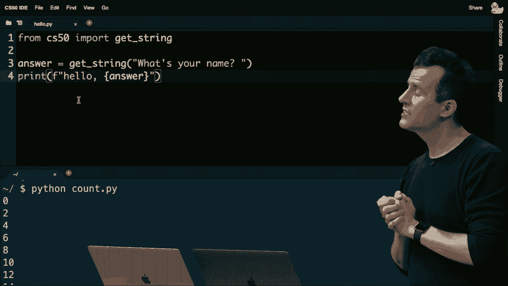

库，我们如何在Python中实际获取输入。

好吧，让我们继续翻译这个，我将使用来自 cs50 的 get_in 函数。像是，cs50 的 getstring 已不再存在，但可以使用简单的 input 函数。input 函数在 C 和 Python 中与 getstring 非常相似，提示用户输入他们的名字，等待他们输入一个值，并在他们按下回车时返回他们输入的内容。

所以如果我现在去重新运行这个程序 python 的 hello.py。在去掉 cs50 库后，使用 input 代替 getstring。我的名字是大卫，嘿，大卫，所以已经有了，这是原始的。

这是完全与 cs50 无关的原生 Python 代码，但现在我们继续使用 cs50 库，最初是因为我们很快就会看到它的优点，因为我们为你进行了很多错误检查。不过我们最终会完全去掉这些辅助工具。

但是请注意，确实相对简单，可以这样做，让我去打开一个我们提前写好的程序。这个程序在课程网站上总是可以找到，我将打开一个名为 edition0.c 的文件。我们之前其实已经见过这个文件，现在我会在这里，稍等一下。

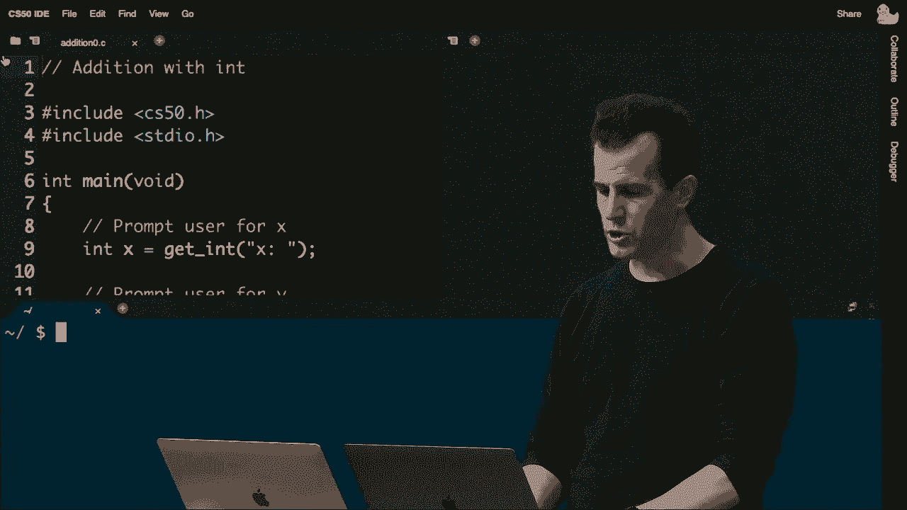

将我的窗口分割，这样我可以同时查看两个文件，在这里我将创建一个新的。

文件，我将其命名为 addition.py，换句话说，我今天只是临时 rearrange 我的 IDE，以便在左边看到一种语言 C，而在右边看到对应的 Python 语言。如果你想要跟着一起练习，可以在线下载所有这些示例。

在你自己的情况下，如果我翻译这个右边的内容，让我们先回顾一下左边的程序实际上做了什么。这个程序提示用户输入 x，提示用户输入 y，简单地对这两个数进行加法运算，这些都是第一周的内容。

cs50 库会让我现在的生活轻松一些。int。我将继续从用户那里获取一个整数，使用 getint 并提示他们输入 x。接下来，我会继续从用户那里获取一个整数，提示他们输入 y。最后，我将继续输出 x 加 y，让我在这里继续下去。

我将运行 addition.py，现在我甚至为 x 进行了保护，让我们输入一个 y，输入 2，瞧，3 是我的程序，所以非常简单，代码行数更少，因为我没有像 standard io.h 这样的多余包含。我没有任何大括号，公平地说，我也没有任何注释。

所以让我在 Python 中写注释，使用不同的符号，提示用户输入 x。应以哈希符号为前缀，而不是斜杠，但我会前进并提示用户输入 y，不过即使如此，它也相当紧凑，只有 10 行代码和一些注释。好的，那么我可能做点什么不同的呢？

让我们去掉辅助轮，去掉 cs50 库，再次获取输入。如果我前进并获取输入，给 x 和 y 分别赋值，进行加法。pi x 将再次为 1，y 将再次为 2，答案当然是 12。这是错误的，发生了什么？

我怎么会搞错这样一个简单的程序，尽管对我来说是新的语言 Python。我在这里做了什么，是的，Ben，因为它可能将其视为两个字符串，所以它就是。*****，*****，*****，确实如此，所以输入这个函数，随 Python 提供。实际上类似于 cs50 的 getstring，将作为键盘输入字符或 ASCII 返回。

几周过去了，即使它们看起来像数字，它们也不会被视为数字，也就是记住在 C 中我们有能力将值从一个转换到另一个，转换意味着将一种数据类型转换为另一种，我们被允许这样做对于字符到整数或整数到字符，但不能这样做字符串到整数或从整数到字符串。为此，我们需要特殊函数，而你们中的一些人。

可能使用了 a to i，实际上查看 ASCII 字符串中的所有字符，整数。在 Python 中坦白说稍微简单些，所以我会前进并将输入的返回值强制转换为使用这个 int，并且我也会对 y 做同样的事，将输入的返回值传递给它以转换看起来像的内容。

类似于将字符串转换为看起来像整数的内容，现在让我继续进行加法，再次进行 Python 的加法。pi，注意这次，希望能回应 Ben 的观点，默认的加法行为是当你有两个字符串时，希望现在它会对 x 进行加法计算，x 等于 1。

y 等于 2，瞧，现在我们回到了正轨，合作用户，我输入 cat，发生了什么。所以请注意，我们在运行程序时触发了第一个错误。我的程序甚至无法运行，稍微隐晦的，最后的文件 edition.py 第二行，好的，这至少是熟悉的，我搞砸了。

在第二行某处，它给我显示了这行代码，并且说值错误，基于 10 的无效字面量。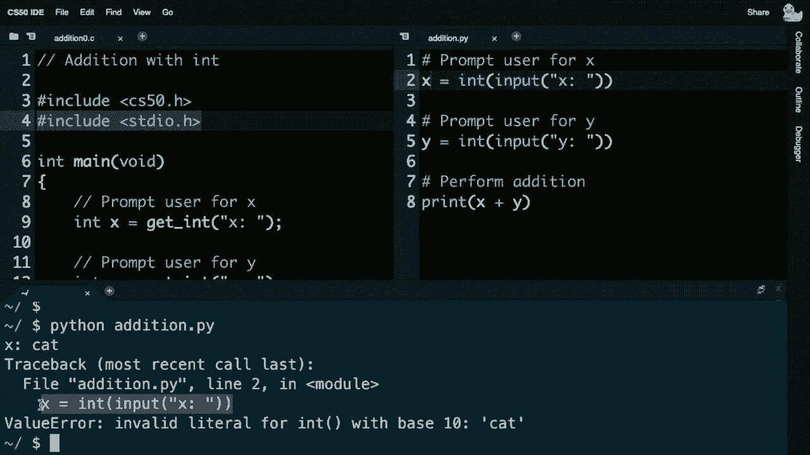

cat 这是一个非常隐晦的方式，意味着我只是尝试将不是整数的东西强制转换为整数，这就是为什么我们使用类似于 cs50 库的东西。写所有检查并确保用户输入数字且仅输入数字的代码其实有点烦人，而不是 cat 或 dog 或其他一些隐晦字符串。

我们现在自己必须实现那种错误检查，如果我们不进行权衡。也许你更喜欢自己编写所有代码，不想使用互联网上某个随机人的库，无论是 cs50 还是其他人的，即使是免费的开源，你想自己编写。

现在我必须添加更多代码行来检查，用户是否输入了小数数字或其他 ASCII 字符，因此再次需要在使用库与否之间进行权衡。通常答案是使用一个通用库来解决这些问题。那么，让我们继续稍微修改程序，让我继续。

打开一个名为 division 的新文件。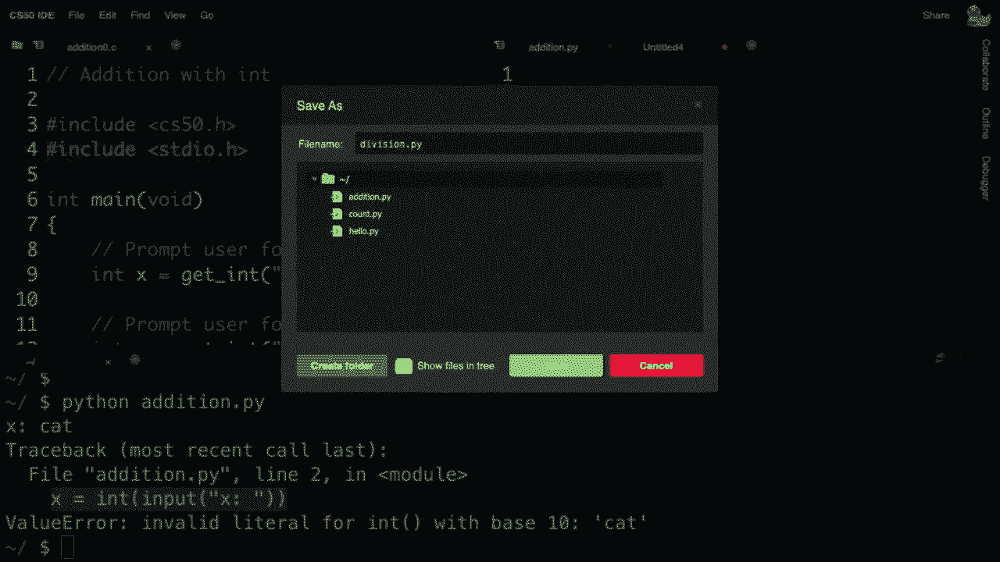

点 pi 这里做一点除法，让我继续往右侧复制粘贴之前的内容，但只需在这里更改为除法。让我继续，将 x 除以 y，并在一会儿将 x 输入 1，y 输入 2，然后我将运行 division.py。输入 x 为 1，y 为 2，但在我按下回车之前，答案。

如果你想，如果这是一个 C 语言的程序，我正在将 x 除以 y。那么在第一周和此后每周，我得到的结果是什么，布莱恩，大家的共识看起来是零，对吧？因为截断，如果将 1 除以 2，当然是 1/2 或 0.5。0.5 是浮点数，但如果我处理的是整数，尽管到目前为止它隐式为整数。

现在，既然我已经强制转换了它们，我似乎会丢弃 0.5，然后运行 division.py，设置 x 等于 1，y 等于 2，瞧，哇，这是最简单的之一。

令人烦恼的是，似乎在 Python 中已经解决了这个问题。通过除法可以实现你想要的，如果你在 Python 中将一个整数除以另一个整数，结果会是语言的另一个特性，它按照你程序员的意图来处理。浮点数和整数的细微差别就不再是问题。
