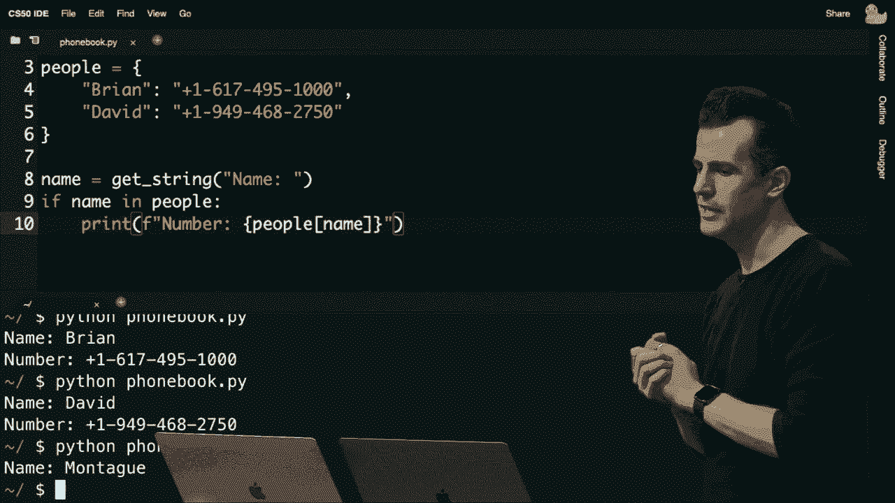

# 哈佛CS50-CS ｜ 计算机科学导论(2020·完整版) - P13：L6- Python从语法到应用实战 2 - ShowMeAI - BV1Hh411W7Up

说得对，让我继续打开另一个程序。这也是来自第一周，这个程序叫做 conditions.c，给我一会儿时间打开它。在左边，这个程序的目的是从用户那里获取一个名为 x 的输入，再获取一个名为 y 的输入，然后就这样做了。

x 小于 y 时打印出尽量多的内容，如果 x 大于 y，打印出尽量多的内容，以此类推。让我们继续将这个程序翻译成相应的 python 代码。使用我们已经看到的一些语法，我会把它保存为 conditions.pi。我想我还会继续使用 cs50 库。

所以我不需要担心那些错误，当将坏输入转换到另一个时，从 cs50 导入 getint，让我继续获取用户输入。用户输入，称之为 y，这次我不打注释了，节省时间。现在让我问这个问题，在 c 中我会这样做，如果 x 小于 y。

python 如果 x 小于 y 的话就可以更简洁，但是要加上冒号。在那之后，我会说，打印 x 小于 y，y，x 等于 y。我想这差不多就是了，我会继续运行这个条件的 python。时间用 2，再用 1，已经工作了，让我再指出一件事。

之前提到过你只需说，导入 cs50 库，如果你不使用函数名称，这完全没问题，但注意到 ide 在第三和第四行对我大喊，getint 不再被识别，这因为 python 支持这个特性，当使用其他人的库时，就是说，你不能再引用 getint。

直接你必须更明确地说，熟悉的点，库就像 c。结构并调用其中的函数，getint，所以我现在可以继续运行这个 python 的条件。pi，现在又可以工作了，所以哪个更好，这要看情况。我是说，如果它更易读，这将为你节省很多时间。

按键操作，因为你不需要不断地输入 cs50.dot.cs50.dot。如果你在写一个比较大的程序，可能会使用两个不同的库，它们都实现了一个名为 getint 的函数。你想能够区分它们，所以你可能想要这样做。

按名称导入库，我在这里做了，这被称为命名空间。命名空间意味着你可以在两个不同的命名空间中有两个同名的变量或函数，它们不会冲突，库。或者其他库的名称，接下来，让我继续打开另一个文件。

呃，这个是`同意`。C语言和这个程序提示用户输入他们是否同意，我们有点好奇地检查了第一周。使用`==`符号来检查`y`或小写的`y`、`n`，那么我们该如何转换这个呢？让我给自己一个新的文件，我将它命名为`agree.py`。

结果我们可以用几种不同的方法来解决这个问题，让我先从导入cs50开始，**获得整型**只是因为它更方便，而不是`获得字符串`。让我继续通过`getstring`获取用户的输入，并问他们同样的问题：你同意吗？

那么让我检查一下，如果`s`等于`y`或`s`等于小写的`y`，然后我会继续打印出`同意`，否则如果`s`等于大写的`N`或`s`等于小写的`n`，让我在这里打印出`不同意`。我想这样应该可以，但有些地方有些奇怪，是什么让你觉得不同？

那么，和C语言不同，你现在可能需要打破哪些肌肉记忆呢？在使用带有多个布尔表达式的条件时，结合这种方式还有另一个细微之处，C语言和Python之间至少有两个显著的区别，聊天室中有没有想法？我本来想说，对于这个，我们可以直接使用逻辑符号。

是的，我们可以直接输入英语单词，或者如果我们想表达逻辑或，在C语言中，左边我们会使用竖线的方式。虽然这样很好，你会习惯它，但从英语的角度来看，Python采用了使用更频繁的实际英语或类似英语的单词，这些单词确实是从左到右阅读的。

确实，在你阅读Python代码时，这里出现了一个主题，它比C语言更接近英语。因为你不会像在C语言中那样频繁被标点符号绊倒，每一行的Python代码更像是一个英语短语或句子，这里还有一个细微之处，回到第一周的左边，y的部分。

本周结束时，我使用双引号，但说实话，其实并没有关系，我可以在任何地方使用单引号，只要保持一致。但在Python中，双引号和单引号之间没有根本性的区别。原因是我们在查看不同数据类型时发现的。

在C语言中，Python数据类型列表中缺少的是字符，在Python中并没有单独的字符字符串，即使只有一个字符，一切都是字符串。缺点是我们没有那么细致的控制，优点是我们可以获得更多的功能。正如我们在第一周看到的那样。

嗯，让我继续，我想我可以简化这一点，比如说我想容忍类似于，不仅是y或y的大写，或者容忍。是的的大写或小写，你可以想象开始逐步。添加代码或s等于等于yes或s等于等于yes，但等一下，这是什么。

如果用户有点马虎，假设我想说，嗯。假如他们在喊，s等于等于yes，全大写，还有其他一些排列，比如说，这很快就变成了一团糟，但如果最终你真的只想检测，为什么或单词yes，无论。

大小写，我敢打赌我们可以在Python中非常聪明，假如我，继续说如果s在。所谓的y或yes，实际上我可以借用之前的一个想法，我可以使用方括号符号来给我一个列表，它会自动根据需要增长或缩小，你不必提前决定它的大小，这个介词在是Python中的一个新关键字。

这将字面上回答我的问题，我们之前用过。当我实现拼写检查器时，我说如果单词在我的单词集合中。返回true，所以如果s在这个列表中，我将返回是的，嗯，基于这个问题的答案的真或假，但再说一次，这并不容忍大小写，但没什么大不了的。

dot lower现在我可以说是s的小写版本，无论人类输入了什么。在这个两个值的列表中，这意味着现在用户可以输入。全大写、交替大小写或其他任意排列。

好吧，那就是我们的条件，让我暂停一下，看看是否有。任何问题，任何问题或混淆，我们可以用条件的语法、布尔变量或布尔值来澄清。所以出现了一个问题。在Python中，我们可以使用等于的语法来比较两个字符串。

是的，所以在Python中还有一个非常好的捕捉，底层没有指针。它们仍然是地址，就像你的内存没有消失一样，但。

在底层，所有这些现在都由语言本身为你管理，因此如果你想。概念上比较，一个字符串与另一个字符串，就像我在这里做的，现在在第七行。Python会为你做“正确的事情”，你不需要回退。使用stir comp，而是现在只需，这个如果s.dot lower在所谓的n。

或者逗号，不，我们可以通过使用同样的技术实现同样的结果，其他问题或。都好吗？好吧，让我继续，打开另一个例子。你可能还记得我们做过，嗯，更好，然后最好，这个例子。涉及到一只猫在某种形式下叫，所以让我继续打开。

从第一周开始，有一个叫做“meow zero”的例子，相对简单，它只是这样做。它简单地叫了三次，所以足够了。

也就是说现在在Python中，做三次这样的事情相当简单，我要去**继续**。

然后称这个文件为`meow.py`，当然我可以做类似`print(meow)`的操作，我可以复制粘贴，但当然这个例子在第一周的重点并不是退化为简单复制粘贴，肯定有更好的方法。我们这次看到了更好的方法，如果在C中是`int i=0; i<3; i++`。

然后在一些花括号中，我们可以做`printf`输出“meow”，新行分号，所以这是我们的`meow`代码在C中的下一个版本，但在Python中，当然更简洁，我可以只做`for i in range(3): print("meow")`，这在精神上与我们之前的“hello world”非常相似。但再次强调，我们不需要包含任何主函数，或者不需要那些花括号。

花括号或分号，如果你喜欢，我们可以直接深入并专注于上次。将`meow`程序演变为拥有自己的辅助函数，实际上允许我们在“meowing”之上创建一个抽象，这就是我们的第三个版本，即`meow2`。让我去**继续**并在标签中打开这个版本，注意这个版本。

开始变得有点复杂，因为我们需要在顶部有一个原型。因为我现在有一个`meow`函数，打印“meow”，但为了将其抽象为一个新的辅助函数，然后我在这里有一段包含`for`循环的代码。好吧，在Python中，如果我想这样做，它会变得简单一点。

现在要做三次`meow`，当然`meow`还不存在。我可以解决这个问题，之前在拼写检查器中我们已经快速看到过，我可以定义自己的函数像`meow`，没有更多的`void`，因为如果你不想在函数中有参数，就不要放在那里。

在Python中没有返回值指定，它们是隐式的，因此这样做就足够了。现在，我有一个程序，迭代三次，每次调用`meow`，而`meow`在下面定义，让我去**继续**并运行这个Python，追踪最近的调用发生错误，问题出现在`meow.py`的第二行，因为名称错误，名称`meow`未定义。

现在使用的语言在Python中与C的有些不同，坦率来说更人性化，但究竟发生了什么？出现了什么问题，我直到现在还没有遇到过，甚至如果你从未编程过，那可能是什么问题呢，如果找不到这个函数的话。

正在尝试调用它，因为它在下面描述，当我们调用它时。是的，所以这是没有原型的，实际上在Python中并没有原型的概念，所以不幸的是，我们在第一周看到的解决方案不是简单地复制粘贴上面的第一行并以分号结束。

这不是我可以做的事情，我可以把我的 meow 函数移动到文件顶部，从而首先定义函数，然后最后使用它，这实际上会解决问题。长期来看这会对我们很有帮助，因为你可能能想象一个情况，这个函数想调用那个函数，但那个函数又调用这个函数，而你根本无法整齐地排序。

而且这并不会像，维护起来那么方便。记住，把 main 放在 rc 程序顶部的一个价值在于，任何想理解你代码的合理人，可能他们不想去找实际的 main 代码。因此，事实证明，在 Python 中，即使你不需要一个 main。

实际上，定义一个函数是很常见的，尽管如此，它会用类似这样的方式实现，我只需在下面缩进我的代码。因此，现在我已定义了 main，但我还没有执行任何代码。在第 6 行，我现在定义了 meow，但我**还没有执行**任何代码，字面意思是如果我现在运行 Python 的 meow 并按下回车。

我希望能看到“喵喵喵”，奇怪，但 Python 正在字面上执行我**告诉**它做的事情。我告诉它定义一个名为 main 的函数，我还告诉它定义一个名为 meow 的函数，但我从未告诉它去调用这两个函数。因此，这里最简单的解决办法是，最后调用 main，这有点不同于 C，稍微奇怪。

在文件中，所以把 main 定义在顶部，调用它在底部。让我去**继续**现在运行我的程序，现在看，喵喵喵又回来了，因为我已经定义了 main，我已经定义了 meow，现在我正在调用 main。顺便提一下，你会在各种文档和在线教程中，看到有很多情况需要你输入，这样就能实现。

同样的目标，但这并不是严格必要的。如果你在任何在线参考、示例、书籍或章节中看到这行代码，它仅在你使用自己的库时是必要的，比如你自己的 cs50 库或你自己的图像模糊库，而在我们仅仅编写自己的单独程序时并不是必要的。

所以我打算去**继续**保持简单，字面上只调用 main，并让我解释一下为什么在这种情况下你需要这个语法，但让我去**继续**修改最后一次。因为回想一下，在 C 中，我程序的最后版本让我运行 meow 并传递一个输入。

因为我定义的 meow 是接受一个输入，比如 n，然后做一些类似于 for int i。gets 0，i 小于 n，i 加 1，然后在我的大括号内，我打印 meow。因此，现在我有了一个我发明的助手函数，它接受一个整数类型的输入 n，并循环那么多次，打印出非常好的抽象，这样我的程序就是。

精简了，就是喵三次，实施方式无所谓。我可以在python中做同样的事情，一个名为n的参数，我不必烦恼指定它的类型，我现在可以说对于i，范围在n中，我可以打印出喵那么多次，现在我可以去掉main中的循环，只说喵三次，依然如此。

功能性如果我最终运行这个，喵喵喵，以更复杂的方式，实际上给自己一些实际的助手函数，好的，有任何问题吗？关于这个进程，现在我们并没有看到新的python语法，我们只是看到一些过去的c程序翻译成python，以便真正展示。

你那边有什么，布莱恩？没有，好的，那我们继续打开另一个版本。来自第一周的一个程序，positive。c，那时这是一个机会，不是叫getpositiveint的函数，但它也让我们熟悉了do while。

循环，不幸的是，我们将从你那里拿走这个。现在python没有do while循环。

但当然，能够在条件为真时做某事是非常有用的。毕竟，我们几乎每次在课堂上获取用户输入时，都使用了do while，这样我们至少提示他们一次，然后选择性地再次提示，直到他们合作。所以让我前进，现在在python中实现这个。

在一个名为positive。pi的文件中，我要前进，翻译如下：让我前进，从`cs50 import getint`开始，定义一个名为main的函数，现在我只是要开始养成这个习惯。我要前进，给自己一个变量i并调用。

获取正整数，然后我只是要前进并打印出i，保持简单。现在我必须实现get positive int，它不需要任何输入，所以我不会给它任何参数，现在我必须做do while的事情。因此，pythonic的做法几乎总是故意诱发。

一个无限循环，想法是如果你想一直做某事，就开始永远这样做，然后在准备好时退出循环。那么在这个函数中我想永远做什么呢？我想前进，获取正整数，然后在下一行继续，直到大于0，从而使其为正，退出。

这里最后一行代码将返回n，所以请注意，左侧的c我做了这个do while的事情，我必须在do while循环外声明n，因为它必须在大括号外才能在作用域内，这里实际上有一点不同。哦，是的，我搞砸了。如果询问实际问题，如果n大于。

小于零，所以我实际上在右侧做了什么不同的呢？注意我故意在第10行引入了这个无限循环，这意味着永远执行以下操作：获取整数，如果满足条件，则跳出循环。我怎么跳出这个循环呢？注意，一致性使我回到了原来的缩进位置。

返回，与while循环对齐，这意味着它是该循环外的第一行代码。在过去，我们会有非常明确的花括号，现在我们只依赖缩进，这让我可以返回n。那么这里有什么不同呢？首先，do while循环完全消失了；其次，在Python中，当你声明一个变量时。

它存在于那个函数结束之前，你不需要担心像我们在C语言中那样先声明一个变量，然后在下面返回。当我们执行这一行代码11时，n突然在那个函数的剩余部分中存在。

因此，尽管我们在循环内部声明了变量，正如缩进所示。

在程序的最后，让我暂停一下，看看是否有任何问题或困惑，关于获取用户输入，做出与do while逻辑等价的操作，但现在以更Pythonic的方式。彼得，在Python中，变量是否可以跨函数访问？好问题，不可以。如果你声明了一个局部变量。

也就是说，传递给那个函数并不是返回，而是将其作为输出传递给输入，否则你必须将其定义为全局变量。好吧，那么还有什么我们可以翻译的呢？回想一下，嗯，回想一下我们在第一周的早期工作中玩过这些。

马里奥的例子，比如我们想从这些金字塔、硬币或小砖块中打印出一些东西。在这里，让我打开一个名为mario的文件，我将不再总是显示之前和之后，而是现在开始。

更专注于Python代码，你总是可以回头看看相应的C版本。我怎么去打印出三个这样垂直的砖块呢？在Python中，我可能会说像for i in range of three一样简单。就像我们已经做过几次的那样，直接打印出一个哈希。

我不需要担心换行，因为可以说这是免费获得的。但我现在要去运行这个马里奥的Python版本。那么如果我。

想要做硬币呢？如果我想做这个水平的。

出现在这四个砖块中的硬币，并打印出一个，呃，版本的那个我该怎么做呢。那好吧，让我去啊**d**并把这个改成，在我的代码中对`for i in range of`四次循环，这样我可以打印出四个这样的东西，让我去啊**d**打印出一个问号，然后运行这个，所以让我运行mario。派对，瞧，天哪，这不是我想要的，所以。

这是一个权衡，你可能，已经有点兴奋。到目前为止，可能对代码感到兴奋，呃，像是哦，我的天，你。再也不需要做那些愚蠢的新行，字符了，但如果你现在不想要它，我们。算是发现了获取那些新行的一个缺点，事实证明如果我们读取。

python，python 2强大之处在于它，不仅支持位置参数。你只需用逗号分隔多个参数进行调用。命名参数，如果一个函数，比如print，接受多个输入，比如这个，那个和这个其他东西，每个输入都可以有名字。

你是那个函数的用户，print在python中支持一个参数。叫做end，你可以明确地说，想给这个。参数什么值，通过提到它的名字，在这里我将字面上这样做。我要告诉print函数，给它一个参数，内容是引号中的内容，原因在于。

如果我阅读文档，默认其实是这个，如果你阅读。文档会告诉你，print的结束参数的默认值。是反斜杠n，这两个是c没有的特性，c没有可选参数。它们要么存在，要么不存在，呃，确切地说要么必须存在，要么不能存在。

python支持可选参数，甚至有默认值。所以在这种情况下，文档中的默认值是，这个结束，为什么。每一行都以那个值结束，如果你，想把它改成什么都没有，也就是所谓的空字符串。你把它改成引号里的内容，所以让我去啊**d**现在运行这个，瞧。

更近了一点，有点傻，因为现在我的光标结束了我的。提示符也在同一行，所以，也许在这行之后让我就去。打印没有，即是换行，现在如果我运行mario。派对，瞧。现在我得到了我想要的效果，如果你想看看这里到底发生了什么。

我可以做一些傻事，比如hello，现在我可以在每次打印中结束。用hello hello hello hello，这并不意味着，那表达式，但正确的版本当然是。只需将其清空。

以这种方式，但这里有一些很酷的事情，如果你，像我一样是个极客，生活开始变得非常有趣，我实际上可以改变我的python。

代码以在天空中打印出这四个问号，简单来说就是打印引号中的内容。

这个程序，完成了，这里再次展示你获得了很多语言特性，你不需要思考很多语法。如果你想把问号做四次，你可以真的使用星号操作符，它被重载了。数字，但也自动连接，如果你愿意的话，用字符串的方式，所以让我去。

前进，做一个最终版本，记得上次我们做了这样的事情。让我去更改我的马里奥代码，现在是为`i`在三的范围内。因为这是一个三乘三的网格。

砖块，假设我们现在进入这个循环，做一个嵌套循环，在这里我想要一次打印一个哈希。可是我不想换行，只想在这里换行，结果是，基本上因为Python会自动给你反斜杠结束符。

本质上，你过去写的任何逻辑现在需要被反转。如果你曾经打印过换行，现在你不想打印换行；如果你以前没有打印过换行，现在在某种意义上你要打印，所以让我去，不要在马里奥.py中写错Python代码，瞧，我的三乘三网格，这意味着在Python中。

我们可以嵌套循环，就像我们在C中做的那样，我可以使用多个变量名，比如`i`和`j`是常规的，没有。

再次逻辑，想法还是一样，只是例如一些新的语法。关于马里奥或者循环或重建这些程序有什么问题吗？现在有没有问题或者困惑？让我去回忆一下，在C中我们很早就遇到了一个整数问题，让我创建一个。

这里的程序叫做int.py，让我初始化一个名为`i`的变量为1。让我继续在一个`while true`块中做这个，让我在每次迭代中打印出`i`的值，从1到`i`。让我继续运行这个程序，让我扩大我的窗口大小，然后运行这个东西。

哎呀，那是马里奥，让我在Python中运行这个程序，计数到无限，老实说这会花费一段时间。你知道什么比按一计数更快？也许是乘以二，所以让我改为乘以二。像在C中那样结束程序，我使用了控制C，所以我看到了键盘中断。

它尊重我想取消程序的意图，让我现在重新运行这个，只是计数一个非常大的数字。尽管互联网有点慢，这就是为什么它有点不稳定。这个数字已经非常大，如果我继续加倍的话，如果在这一点上我使用C来实现这个程序，会发生什么。如果在C中我声明一个变量。

我称之为i，它是一个int类型，我不断地重复，如果有什么想法，嗯，我想它可能会崩溃，会占用很多内存。好想法，所以它不会真正崩溃。只是会出现问题，但不会崩溃，因为它仍然是一个int，在C语言中，至少在典型的计算机上仍会占用32位或四个字节。

到现在为止可能已经开始打印零或负数，C语言中的整数是有限大小的，只有32位或四个字节，这意味着如果你不断从1、2、4、8、16、百万、二百万、四百万、八百万等等，一直到十亿，当你越过20亿的阈值，或者如果使用有符号或无符号数字，可能是40亿的阈值，情况就会变得复杂。

当数字变得过大时，你会遇到整数溢出。在Python的世界里，溢出已经不再是问题，你的数字可以变得和你需要的一样大。然而，不幸的是，浮点不精确仍然存在，所以我早些时候只将一除以二，但如果我继续除以其他值，我会发现足够多的。

不幸的是，在小数点方面，我们仍然会遭遇浮点和精度的问题。然而在Python的世界中，

在Java和其他语言中，有科学库允许你根据需要使用尽可能多的精度，或者至少使用你计算机所拥有的尽可能多的内存。因此，这些问题在现代语言中得到了更好的解决，而不是像C语言那样需要一遍又一遍地乘以那个数字。

比我们之前几周看到的数字更大。好吧，让我继续进行另一个程序，这个程序叫做scores。pi，这将是一个真正跟踪分数的例子，这在课堂上，而在Python中，我将继续给自己一个这样的分数列表，72，73和33，再次是对我们的一种戏谑式的参考。

ASCII数字，但在这个上下文中，它们是测验分数，所以两个测验分数和一个相对较低的测验分数，假设这些分数是从100分中得出的。但注意我使用的语法，方括号在Python中给我一个列表。我不需要提前决定它的大小，它不是数组，但。

在精神上是相似的，但它会自动增长或缩小。而且语法甚至更简单。假设我想在Python中计算这些分数的平均值，我可以这样做，我可以打印出这些分数的平均值，比如说，然后我可以这样做，我可以把分数的和除以新列表的长度。

事实证明在Python中，有一个sum函数，可以接收一个列表作为输入，并返回这些项的和。而且我们已经看到有一个长度函数l-e-n，它告诉你列表的长度，所以如果我把我所有的分数加起来，然后除以总分数，这应该根据定义给我结果。

我的平均值，所以 Python 的分数点 pi 哇，哎，我在这里做了什么，我搞错了，所以显然不是故意的，但让我试试，这个错误信息有点隐晦，说明类型错误只能将字符串与浮点数连接。因此，长话短说，在这种情况下 Python 不喜欢我试图将一个字符串与右侧的浮点数相结合，所以有几个。

我可以用多种方法解决这个问题，我们之前看到了基本解决方案，如果这个我已经突出显示的表达式，按定义在数学上是浮点数。但是我希望它变成字符串，我可以直接告诉 Python 将这个浮点数转换为字符串。因此，就像你们发现的 i2a 函数一样，它是 a2i 的相反。

在 Python 中，我可以接受一个浮点数并将其转换为字符串等价物，所以现在如果我运行分数的 Python，我的平均值是 59.3333，你已经看到了一些不精确，最后有一些舍入误差，实际上这不是一个完美的三分之一，但我还有另一种方法可以做到这一点，虽然有点丑陋。

但是我可以使用其中一个 f 字符串，我可以说继续并在这里插入一个值。然后直接打印用户的平均值，因此，事实证明在这些大括号内部，你不必打印整个编码表达式，我会鼓励你不要粘贴疯狂长的代码行，因为那样会很快变得难以阅读。

在那时你可能应该使用一个变量，但在这里我可以继续运行分数的 Python。pi，哇，我又搞错了，这也不是故意的，但我可以修复这个。是的，我遗漏了字符串答案中的 f，所以我又有了多种方法。这里还有第三种我可以在那种情况下做的方式。

在格式字符串内部，Python 会假设我想要这样，这很好。或者我可以把这个提取出来，我可以说类似于这个，给我一个变量叫 average，并将其赋值为 average。因此，就像在 C 语言中，解决这个问题有很多不同的方法，而哪一个是最好的，实际上取决于什么可能是最。

可读性最强、最易维护或者最简单的方法，让我继续动态添加一些分数。现在不再是硬编码我的三分数，让我问自己在整个学期内的分数。从 CS50 导入 get_int，以便我可以轻松获得一些数字。让我给自己一个空的分数列表，其语法就是打开。

括号关闭，所以最开始里面什么也没有。现在让我继续这样做，让我获取这个术语，现在，范围在三之内，我可以继续并附加，get_int 的值是这样的，现在我也可以用很多方式做到这一点。让我把这里的这个去掉，嗯，哎，不，我们还是留着这里，我正在做的事情。

我得到一个整数，并将整数的返回值传递给一个名为`append`的新函数。事实证明，列表使用方括号，一旦你在一个变量中定义了它们，例如`scores`，它们也有`append`函数，以便将数字添加到列表中。现在让我去运行`python of scores.dot pi`，手动输入我的72和73。

我的33，瞧！. 

说到得到确切的答案，但想想如果在C中你必须提前决定数组的大小，或者不提前决定并使用`malloc`和`realloc`来不断增长，这将是多么麻烦。这个列表变量中的函数会自动处理这一切，为我们提供功能。

不过有任何问题我可以回答吗？嗯，是的，我有一个问题。即使是写作的笔，它的底层是否只是做像`malloc`和`realloc`这样的事情？这一切在Python内部发生吗？是的，语言确实这样，所有的`malloc`和`realloc`的内容。

也许它的底层实现是一个数组，就像在链表中一样。正如我们上周看到的，但所有这些都是为你发生的，这也是代码的一部分原因。

最终运行会慢一些，因为你有别人的代码在中间。

这其中有些工作，在我们打印的方式之间是否存在效率差异？比如说使用`f`格式化或不使用。如果我理解正确，确实有一些它的花哨功能。例如，有语法可以指定你想要多少小数位。

在浮点值后打印时，我使用`%s %f`等等，幸运的是。由于你不必担心，确实减少了。好吧，让我再做一个可能熟悉的例子，来自几周前，让我快速准备一个。

大写的例子只是为了将我们早期的一个例子联系在一起。

在这种情况下，命名一个文件为`uppercase.pi`，让我从`cs50`库导入`getstring`，然后一旦我有了这个，让我去获取用户的字符串，并要求他们做以下事情，目标是我想将整个字符串转为大写。

我将把所有内容保持在上面，这将在打印之前。询问用户一些输入，然后在之后显示整个字符串的大写版本。那么我该如何做到呢？我们已经看到了一种方法，我可以字面意思地做到。例如`s.dot upper`，让我继续保存这个，然后运行`python of uppercase`。

让我输入高低写的版本，但如果你愿意，你实际上也可以操作单个字符，让我去 ah**d 细致一些。对于 cns 打印 c，现在这还不是我想要的，但它是一个跳板。注意现在如果我输入高低写，我看到 h i 感叹号，所有的仍然是小写，所以我还没有完成。

让我去掉换行，这样所有内容保持在同一行，因为那样有点丑。让我再试一次，好点了，实际上让我在程序的最后添加一个换行，让我的更多内容，好吧，我没有大写任何东西，但如果我把 c 改为 c.upper，那我再次得到 hi，boom，现在我有另一个可工作。

程序，但现在的新特性是注意第五行的酷炫。如果你想遍历字符串，将 i 初始化为零，然后像在 c 中一样使用方括号表示法。你只需说 for c in s 或者 for x in y，无论是什么，四也可以用来遍历个体，这在进行像密码学这样的事情时很有用。

一次性字符串，我们仍然可以访问我们的各个值。在 python 中还有其他你可以做的事情，类似于我们在 c 中能做的。让我去 ah**d 创建一个名为 argv 的程序，它是输入到 main 的名称，允许你访问命令行参数。今天我们已经看到，这不需要。

但这很传统，并不是必需的，所以我们还没有看到 argc 或 rv，但这是因为它们在 python 的其他地方。如果你想在 python 中访问命令行参数，结果是你可以导入一个名为 argv 的模块。这有点新，但它遵循 cs50s 库的相同模式。

我要从系统库导入一个称为的特性，使用 python。但要使用它，你必须显式导入。现在我会这样做，如果 arg v 的长度等于 2，那么我将去 ah**d 打印出，就像我们几周前做的一样。hello 然后 argv 括号 1。这有点神秘，但我稍后会回来讲这个。

嗯，接下来我要 ah**d 打印出默认的 hello world，所以我们几周前在第二周做过这个，我们运行了一个程序，如果用户在提示符下输入他们的名字，它会说 hello david 或 hello brian。如果他们没有输入，它只会说 hello，world。为了明确，如果我运行这个东西。

我运行它时没有任何命令行参数，只看到 hello world。如果我再次运行并输入我的名字，然后按回车键，我现在看到 hello。david，那这是怎么工作的呢，这第一行代码让我访问了 argv 库。如果你愿意，可以这么说，sys 包，但它的工作方式是一样的。

没有arg c，但没问题，如果v，是一个命令行参数的列表，长度len。将告诉我这个列表的长度，等同于argc，所以我可以，重建我在C中的相同想法，接下来我有一个格式字符串，打印出你好。逗号，然后是大括号中的内容，rgb是一个列表，和C中的数组一样。

列表只是一个数组，可以，动态增长和缩小。你仍然可以使用方括号表示法，人类输入，所以让我为了清晰起见，改变这个为零，如果我现在重新运行它，并，输入大卫，它奇怪地说你好rgb。pi，所以你。没有看到的是单词python，python是，解释器，但这不是部分。

你的程序的执行本身，argv 0将是你正在运行的python程序的，名称，而arg v1将是接下来的，第一个单词，依此类推。所以我们仍然可以访问这个特性，但现在我们可以，将其转换为python，事实上，如果。我要打印出所有的命令行，参数，我可以更简单地这样做。

对于arg in argv去啊**d并打印arg，瞥一眼，现在让我去啊**d并输入。像大卫·马林这样的两个单词，回车后你现在看到所有打印，出来了。所以。这里也注意到我们如何干净地在python中，遍历一个列表，没有。i，没有必要的方括号，你可以直接说for arg和argv。

就像我刚才说的，对于C，几乎就是python的for循环。它足够聪明，可以判断你想要迭代的对象，无论是。字符串还是列表，天哪，编程变得如此有趣或愉快。现在你不必，像，递增和加加，以及所有这些。

这里，例子很快，但它们实际上只是翻译，再次为即将到来的问题。更多地，系统地比较前后，任何在你这边的事情，布赖恩，这里没有。好吧，我们来看看一些我们的，最终的过去例子，然后我们会，看看一些。甚至更强大的事情，因为现在有像python这样的语言。

让我去啊**d并创建一个程序，这次叫exit。pi，exit。我，这个程序的目的和。生命只是为了演示退出，状态。回想一下，最终在C中，我们引入了返回0的概念，主函数，我们现在在python中也有这个能力。你将会在更多，较大的程序中看到，此外，我要去，导入cis。

整个过程这次只是为了展示一个，不同的做法，我要说如果sys。org v的长度，不等于2，让我去啊**d并，喊用户。缺少命令行参数，然后，在这之后我要去啊**d并，做sys。exit。1否则，我将去啊**d并，打印出，格式化字符串，显示你好，逗号，r v。

在前面加上cisnow的括号1，理由我稍后会解释。然后在最后，我将默认**打印**`sys.exit(0)`。好的，那么这里发生了什么？不同的事情，我决定不特别导入rv，而是导入整个库，但因为这样做，我不能直接。

在任何地方写下单词`argv`，我现在必须用它所在的包或库的名称进行前缀，这就是为什么我开始做`sys.argv`，`sys`库，这让我可以访问一个退出函数，这等同于从主函数返回。因此在C语言中，这有点二分法，你必须返回零、一个或其他。

从主函数调用其他整数，在Python中，你相应地调用`sys.exit`，用相同类型的数字，语法上稍有不同，但基本思想是一样的。这个程序的目的是什么？如果我运行这个程序，它的目的仅仅是**返回**我的程序名称，所以请注意，如果我只运行`python exit.py`。

如果我运行它却缺少命令行参数，它在大吼。现在它说“你好，David”，这个愚蠢的程序只是为了演示如何返回不同的值，因为你不再在主函数中。你不能直接返回，但你可以在Python中根据需要**退出**，所以这是可以比较的地方。

好的，那么关于退出状态有没有问题？我们只是不断浏览我们看到的特性，即使它们不会**自然**出现在你面前，Python世界里也有类似的东西。没有问题。那么请记住，在那之后，我们开始真正专注于类和算法，这就是那时候。

我们数据集的大小和代码的效率开始变得非常重要，所以让我去**写一个**名为`numbers.py`的程序，里面包含一个导入，在一会儿，然后给我一个数字数组，比如4682750，你可能还记得这些。

第三周门后面的数字，假设我想要搜索数字零。在C语言中，实施线性搜索时，你会使用一个`for`循环和一个类似于i的变量，检查所有位置。Python的方法简单得多，如果在数字中找到零，就直接去**打印**出“找到”，然后我会去，**否则**打印出“未找到”。

就这样，所以让我去**执行**`python numbers.py`。希望我能看到确实找到了，因为它实际上在那里，所以这就是你想要的**真假**。

线性搜索，如果我想对名字做同样的事情，那我就去**给**自己一个第二个类似的文件。

其实，如果我真的想与我们的 C 版本完全相同，让我去 ah**d，并以零退出。这里让我以一退出，但严格来说，这就是我做的。当我们在 C 中做这个时，反而在 names 中让我去 ah**d 并做一些类似的事情。让我给自己一个包含很多名字的 names 列表，比尔和查理。

还有 Fred、George、Ginny、Percy，最后是 Ron，在最后的位置，然后让我线性搜索，如果 Ron 在 names 中，去 ah**d 并打印出找到，否则去 ah**d 并打印出未找到。这次我不会麻烦地打印出或以 0 或 1 退出，但让我去 ah**d 并运行 Python 的 names，哎呀，Python 的 names，瞧。

我们找到了 Ron，注意我没有作弊，我认为我没有搞错。如果我去 ah**d 说 Ron old，那确实是他的正式名字。现在我搜索 Ron，未找到，它确实在寻找一个确切的匹配。所以这真的很酷，我们可以轻松做到，但记住，我刚才说过我。

提出了 Python 还有其他数据类型，其中包括被称为字典（dictionaries 或 dicks，d-i-c-t）的东西，它们代表一组。

键值对在精神上类似于，西班牙语的键和英语的值。将一个转换为另一个，这个英语字典包含英语单词和英语定义，但同样的思路是一组键和值，通过一个你可以找到另一个。那么，让我们去 ah**d，把它翻译成。

Python 在一个名为 phonebook 的程序中。pi 并实现某个回调。在 C 中，我们最初使用了几个数组，然后我们放弃了这个，转而使用一个结构体数组，这更符合。让我去 ah**d，并从 cs50 导入 get_string，然后让我去 ah**d，给自己一个不同的人的字典。

不过，我将去 ah**d 预先使用花括号，它们又回来了，目的是为了字典。然后这是如何定义键值对，将会是，*****。那是他的号码，然后我将是其他键之一。暂时我们会保持一个非常小的电话簿或字典，*****，哦，就这样。

所以花括号在技术上可以位于不同的行，我可以将其移到上面，我可以去掉这个，但在 Python 中有某些风格约定。这里的要点是，字典是用开始和结束的花括号定义的，键和值由冒号分隔。

键值对用逗号分隔，这就是为什么按我所做的方式书写是惯例，显得更加明显。

这是一个包含两个键的字典，每个键都有一个值，可以说它将左侧与右侧关联起来。那么这意味着什么呢？假设我想搜索某人的名字，嗯，让我去 ah**d，并给自己一个名为 getstring 的变量，询问用户姓名。然后让我实现一个自己的虚拟电话簿，类似于。

你的手机让我先去，等我有了名字，如果名字在人员中。这太好了，如果我在人员中找到了名字，让我继续打印出人员。括号名称，这就是字典将要真正解释的地方，Python的电话簿。哎呀，Python的电话簿。让我搜索布莱恩的号码。

突然有了布莱恩的号码，让我继续用大卫的名字运行一下，手机号码还没有，他是未列出的。

所以我输入的其他任何东西，那么在这里发生了什么？在顶部是“人员”，这是一个字典，一组左右的键值对。

然后我像以前一样从用户那里获取字符串。这也很强大！. 

实质上在第9行搜索整个字典，我在这里找到与那个名字相关的号码。抱歉，与那个人的名字相关的号码，让我更清楚一点，通过将其提取出来，给自己一个变量叫做“号码”，然后更明确地打印出该变量的名称，今天有什么不同的是，如果名字。

而“人员”在这里是写好的，这样做是让Python搜索所有与那个名字相关的键，而不是值。当你说如果名字在某个字典如“人员”中，它只搜索键。如果你找到键，我可以确定是大卫或布莱恩。

字典中的内容注意到这一点，这就像C语言的数组语法。你现在可以使用方括号符号，通过一个单词如大卫或布莱恩来索引字典，并获得一个值，比如我们的手机号码，而在C语言中，迄今为止在Python中每当我们看到方括号符号，它通常只适用于数字。

因为数组或列表有索引，这些数字指向第一个位置、中间和最后一个等，字典的不同之处在于它们也被称为关联数组，字典是键值对的集合，如果你想查找一个键，你只需使用方括号符号，就像我们过去用方括号处理数字一样。

并且因为Python是一种相当高级的语言，它为你处理搜索，并提供常数时间的搜索，使用我们上周所说的哈希表。字典通常是通过哈希表实现的，回想一下，即使这确实是实现常数时间的目标，如果你选择一个非常好的哈希函数。

你可以接近常数时间，因此，再次强调其特性，给你非常高的性能，这不是线性搜索，实际上，回想一下当我们开始玩拼写器时，使用大约10或20行代码，而不是你可能为第5个编程作业写的那么多，拼写器使用了一个集合，而集合只是一个值的集合。

长话短说，从精神上讲，这与字典相似，因为它在底层使用哈希表来快速获得答案。所以如果你回想一下那个拼写检查器的代码实例，实际上实现了你整个拼写检查器的所有指针和链表，你就会明白。

关于语言本身没问题，任何问题都会回到字典和它们的结构上，因为这种将某物与其他事物关联、组织数据的能力会不断出现。任何问题，嗨，索非亚，字典是否只有一种哈希函数？还是我们可以以任何方式改变这个哈希函数？好问题，嗯。

它带有一个哈希函数，所以你，应该把这种细节留给库，因为其他人花了很多时间考虑如何动态调整数据结构，根据需要移动事物。因此你不再需要为自己实现拼写检查器而感到压力，结果是其他。

事情也会变得简单，这并不是一项必需的常见功能，但这是我们可以做到的。让我写一个叫做交换的快速程序。我们之前给出了 2，然后我打印出像 x 是 x，y 是 y，但这一周我使用格式字符串来打印出来，然后我做了类似交换 x y 的操作。

我只是希望能有好的结果，然后我再次打印出那些值。结果是，在 Python 中，由于你没有指针，也没有可以访问的地址，你不能像上周那样通过引用传递这些变量。

按照它们的地址进行操作，这显然是不可能的。为什么会这样呢？看起来这是一项功能被剥夺了，但老实说，如果这一周有什么启示，包括之前的一周，指针是很难的，像分段这样的东西是困难的，最糟糕的情况下，你的程序可能会被妥协，因为有人可以。

访问不该访问的内存，因此 Python 除去了这一特性，Java 也将这项特性从程序员那里去掉，以保护你自己，避免像上周那样出错。但事实是，如果你想交换 x 和 y，那也没问题，交换 x 和 y，现在如果我在这个程序中运行 Python 的交换功能。

瞧，嘭，它浓缩成另一行，所以尽管他们从我们这里拿走了一些东西，但你仍然可以做很多事情，我们可以把一个更强大的特性交还给你。注意，这个单行代码用于交换，左边是 x，y，而右边是 y，x，这样就实现了布赖恩所做的效果。

这些液体的杯子，进行交换，即使没有临时变量的出现。

在底层，好的，让我们回顾一下这一周。

四，并且在第六周引入我们自己的几个。让我继续实现另一个持久的。

让我继续，创建一个名为的文件。

将此命名为，名称、逗号、数字，所以`csv`文件的回忆是。

像一个非常简单的电子表格，我将继续创建这个文件，以便我可以随时使用，然后我将创建一个名为的文件。

电话簿。`pi`，我要做的是，从`cs50`导入`getstring`函数，就像以前一样。但我还将导入一个名为`csv`的库，事实证明，Python自带了很多与`csv`文件相关的功能，可以让你的生活更轻松，使处理`csv`文件变得更简单。我可能想要做的事情之一是。

让我继续打开那个文件`phonebook.csv`，以追加模式打开，类似于两周前的`f open`，然后让我继续将其赋值给一个名为`file`的变量。然后让我继续从用户那里获取一个名字，所以让我使用`getstring`来获取某人的名字。然后让我继续获取号码，所以使用`number`，最后这个。

这是新的代码，让我将名称和数字保存到一个文件中，并回忆起第4个编程作业。保存文件和将字节写入文件的过程相当复杂，就像恢复或模糊处理任何涉及创建新文件的过滤器一样，结果证明`csv`库让这变得相当简单，让我继续给自己一个所谓的`writer`。

我将给自己返回一个调用`csv.writer`的文件值。那么这个文件再次代表我试图打开的文件。`csv.writer`是一个函数，它接受一个你已经打开的文件，并且以某种方式包装该文件，提供一些更高级的功能，这是程序员需要的。

要写入该文件，我要做的是使用`writer`变量写入一行，专门包含一个名称和一个号码，并且我使用列表，因为如果你考虑行，列表是一个合适的概念，左到右的每个单元格就像一个列表，一行就像一个列表，所以我将故意在这里使用列表。

最后，我将关闭文件，就像我过去所做的一样。所以这里有点晦涩，但再说一次，`getstring`现在已经过时了，唯一的新内容是导入`csv`，我以追加模式打开这个文件，类似于我在`C`中所做的，然后。

这些行涉及使用`csv`功能包装文件。写入一行到这个文件中并关闭它。所以让我现在试试这个，打开`phonebook.csv`，目前只包含这些内容。稍早之前的内容，然后让我继续运行这个Python程序，来自`phonebook.pi`。

让我**加上布莱恩**，布莱恩将是加一，*****，千，回车。现在让我去我的 CSV 文件这里，啊，该死，我搞砸了，呃，假装我没有按回车，现在它有效，让我现在再次输入，创建文件时我应该按回车，但我搞砸了。

创建时我就这样做，所以让我挥挥手，证明我在代码中正确做到了，通过添加我自己，大卫，呃，2750 回车，让我回到我的 CSV 文件，瞧，现在格式正确，给我。

还注意到，如果我下载这个文件，让我下载 phonebook.csv，像我在上周那样，让我下载到我的 Mac，打开这个 CSV 文件，无论你是否安装了 Apple Numbers 或 Microsoft Excel，你会打开看起来像这样的东西，瞧，我现在已经动态创建了，使用 Python 代码。

我自己的 CSV 文件，结果是。

有一种方法可以更紧凑地处理这个，我做过，但实际上你也可以以稍微不同的方式打开和关闭文件，你可以用 `with open as file` 来做到这一点。这样我可以在这里缩进所有这些，并且可以去掉我的关闭行，所以以我之前的方式打开和关闭并没有什么大不了的。

但我在这里的做法有点更 Pythonic，`with` 关键字并不是我们在 C 中见过的任何东西，当你打开文件时，它会自动为你关闭，最终你可能会在一些在线参考资料或其他材料中看到这个，但它会自动为你完成。

好吧，让我们继续，我喜欢。

我们现在可以处理 CSV 文件，事实证明如果你曾经使用过 Google 表单，那是一个非常流行的。

像这样收集用户数据的方式，实际上让我去一个 URL，cs50.ly/hogwarts。如果布莱恩不介意，打这个进聊天，去那个 URL cs50.ly/hogwarts，如果大家不介意，告诉我你希望被分配到哪个房屋，*分院帽*会把你放在哪。

如果你以前使用过 Google 表单，结果当然会在 Google 表单本身中，已经有 122 人参与进来，我们可以看到图表中的分布。然而我想要的，不是分布的图示。我要去**打开一个电子表格**，如果你从未使用过。

之前使用过 Google 表单的，你可以点击一个按钮，然后你可以获得所有当前实时响应的列表。默认情况下，Google 会跟踪表单提交时的时间戳和实际使用的房屋，所以我现在要去**做这个**。

让我**继续**在另一个标签页下载它，给我一点时间在这个屏幕上，我要**继续**下载这个 CSV 文件到我的 Mac 本地，通过选择文件下载 CSV，这会将其放入我的下载文件夹。

将其上传到我的 IDE，只需拖动和浏览器，我将通过拖动和放置文件来完成，好的，现在我有了那个文件，让我**继续**检查文件是否在那里，我有这个名为“Sorting Hat Responses”的文件，表单回应 1 等等，好的，让我**继续**写一个程序。

现在如果你像运行一个学生小组一样操控这些数据，这就像是在收集谷歌表单中的数据，或者你只是在一般情况下收集信息并以 CSV 格式保存，那么你现在如何汇总所有的数据呢？

特别是如果谷歌没有结果，结果就是，嗯，让我去**写一个程序**。

名为霍格沃茨，这不是我们在 C 中见过的东西，让我**继续**导入这个 CSV 库，最初给自己一个字典，称为 houses，包含一堆键，比如格兰芬多，初始计数为零，赫奇帕奇，初始计数为零，拉文克劳，初始计数为零。

还要带一个初始计数为零，所以注意在 Python 中的字典，或称为 dict。

键和值不需要都是字符串，它当然可以是字符串和数字，因为我要统计某个房子的所有投票或另一个房子的投票，所以让我**继续**这样做，让我**继续**打开“Sorting Hat”文件，回应 1 dot csv，文件名很长，但这是谷歌的默认设置。

文件，所以我将使用我的单行代码，而不是打开和关闭。我将给自己一个之前没有见过的读取器，CSV 库有一个读取器函数，可以让我自动读取 CSV 文件。我将**继续**跳过第一行，时间戳。

而我确实想要忽略的房子，我想要你们提供的真实数据。这就是 CSV 和 Python 的酷炫之处，我可以选择遍历那个电子表格中的所有行，我可以这样做：`for row in reader`，现在让我**继续**获取，比如说，问题中的房子，所以给定行中的房子将是行的第一个元素。

条目是零索引的，那么这里发生了什么呢？让我回到刚才的谷歌电子表格，在谷歌电子表格中，有两列，而 CSV 读取器的工作方式是，它一次返回一行，这在概念上是相当简单的，它完美地映射到电子表格的概念，但每一行都会以一个。

列表，实际上是大小为 2 的列表，所以行括号 0 会给我一个给定的时间戳。

行括号 1 会给我一个给定的房子名称。

这就是为什么在 IDE 中我继续声明一个叫做括号一的变量。因为我不在乎时间戳，我们大致在同一时间做了这个，像在 C 语言中一样索引字典，我可以使用字符串，所以我将继续进入我在上面定义的 houses 字典。

将其增加一，至此我已打开 csv 文件，并使用这个库读取它。在这个循环中，我在每一行中迭代你们通过填写那个表单所创建的电子表格。我再次使用一个变量来获取第二列中的内容，也就是行，括号一，因为行记录零将是时间戳。

然后我进入字典，叫做 houses，我们在这里定义过。我像访问数组一样索引它，但在这种情况下它是一个列表。使用它的房子名称来查找相应的键，增加其值，所以这很好。

进入字典并增加，进入并增加。所以现在我们就到这里的最后，打印出结果。对于 houses 来说，是迭代字典中所有键的华丽方式。继续打印出一个格式化的字符串，如下所示。

让我打印出房子名称，后面跟着冒号，然后是房子的字典。我用房子索引它，所以再次，霍格沃茨的第二个，交叉我的手指，希望我没有搞砸，这确实如此，IDE 在我之前就知道了，好的，现在，真该死。好吧，文件的名称与我之前的稍微不同。

练习一下，让我复制这个，关闭排序帽的响应。啊，它有括号，我忘记了，所有程序，真该死。好吧，没有这样的文件或目录，哦，我忘了 csv，点 csv 现在交叉手指，哦，感谢上帝，好吧，狮子座，呃，哦。

击败赫夫帕夫非常有趣，出于某种社会学原因。但现在我们有一个程序，使用傻乎乎的哈利·波特数据，但想象一下。从用户那里收集任何你想要的数据，将其下载为 csv 到你的 Mac 或 PC，或你的 IDE。然后编写代码以你想要的方式分析这些数据，我做了一个非常简单的求和。

但你当然可以想象做一些更复杂的事情，比如进行求和或平均值。标准差等所有这些功能，我们也能获取，有关字典的问题。在编程中，我们尚未看到的强大功能，布莱恩，你那边有什么问题吗？没有人举手，好吧，那我就去吧，**现在我要转换到。**

我的 Mac 上预先安装了 Python，这样我就可以在本地进行操作。这会让事情稍微快一点，我不必担心互联网速度等问题，而这确实是一个 PC 解释器，可以在自己的 Mac 和 PC 上运行，但我建议你继续使用这个 IDE，特别是为了问题集的原因。

直到学期结束，也许过渡到你的 Mac 或 PC，仅仅用于最终项目，因为我这个周末花了大量时间让愚蠢的库在我的 Mac 上工作，这通常说起来容易做起来难。

编写的代码应该能够在世界上每一个可能的 Mac 和 PC 上运行。你我以及其他每个人的版本号略有不同，安装的软件也不同，存在不同的不兼容性，所以在本地操作时很快就会出现这些麻烦。因此，让我鼓励你等到学期末的最终项目，或许可以考虑脱离这个 IDE，做我现在要做的事情，因为你能够在这里更清楚地看到这些演示。

我现在在自己的 Mac 上调用一个支持语音合成的库，如果我想访问该功能，只需导入 `pyttsx3`，这就是它的名称。

这是我下载并安装的一个开源免费的库，我在过去一周才开始使用它。我发现我可以声明一个变量叫 engine，例如，我可以调用 `pyttsx3.init` 来初始化这个库。这是因为程序员的设计方式，你必须先初始化它。

然后我可以使用这个引擎说话，比如说，应该运行引擎并等待它完成，然后我的程序再退出。好的，让我继续，现在关闭它并在我的 Mac 上运行 `speech.py`，这里是 hello world，确实，我可以让这个更有趣，让我继续说一些像这样的内容，让我再次打开 `speech.py`。

添加一些功能，我不会使用 CS50 库，但我可能会使用输入函数。让我继续说，name = input("你叫什么名字？")，然后让我继续说，不是 hello world，而是使用 f 字符串，这可以在任何接受字符串的函数中使用。让我继续说 hello。

好的，继续，再次运行 `python speech.py`。哎呀，让我继续并运行 `python speech.py`，我的名字是什么，David？你好，David，我们在选择语调上，但确实它合成了。让我们试试 Brian，你好，Brian。好的，我们可以调整设置，让声音听起来更自然一些。

但这真的很酷，让我进入一些我提前写好的代码，这次使用一个不同的库，这个库与面部和面部检测相关，当然在很多网站自动标记你时，联邦政府和执法机构都非常常用，让我打开一个文件。

这里例如更温和一点。

办公室，所以这是一些人在办公室的照片，那里有很多脸。那里有很多盒子，但让我先快速看看一个叫做tech dot pi的程序，这个文件大部分是注释，以便于你在家可以跟随并了解它的功能。

但让我突出一些显著的行，这里又是那个pillow库。我正在访问从预安装的python函数中获取与图像相关的功能。这一项相当惊人，只需导入面部识别，你就可以访问这样的强大功能，现在我只知道通过阅读一些文档来弄明白这一点。

你调用了一个名为face recognition dot load image file的库，这是一个功能，做它所说的事情，我正在打开office.jpg，然后向下滚动到蓝色的注释部分，回想一下这行代码，是使用面部识别库查找给定图像中所有面部位置所需的全部内容。

将它们存储在名为face locations的列表中，这行代码只是一个python循环，遍历每个面孔。

在检测到的面孔中，然后这些几行代码，长话短说，就是裁剪出独立的面孔，并创建一个包含找到的面孔的新图像。

所以在不深入图书馆细节的情况下，这些内容并不是特别有趣的。

目前我们对这些功能很感兴趣，让我运行python来检测。pi让我。

嗯，看看这里，如果我放大，我们看到其他所有照片。被裁剪成了独立的面孔。

如果你曾经注意到在自己和facebook上传照片时的小方块。这正是facebook和其他人执行的代码。好吧，你知道在同一张办公室照片中，有一个人总是显得与众不同，没人真的喜欢他，那就是toby。

如果我们有toby的单独照片，比如这样。

我们能在这些办公室的人群中找到Toby吗？当然可以，让我现在运行一个叫**recognize.py**的程序，你可以在线查看。它的代码行类似，没多少。

这将进行一些思考，它正在打开办公室的jpeg和这个文件，注意刚刚发生了什么，如果我放大，可以看到他脸部周围确实有一个大大的绿色框被识别出来了。所以，回顾一下代码，这次如果我打开**recognize.py**，它多了几行代码，但仍然是其他内容。

我正在加载**toby.jpg**和**office.jpg**，然后这里还有一些代码在寻找Toby，寻找Toby，然后在他找到的脸周围画一个大大的绿色框。所以说，归根结底，它只是循环，函数和变量，但现在这些函数是。

相当华丽且强大，因为它们充分利用了我们自己在像C语言这样的语言中实现的所有其他特性，或者现在在Python世界中窥见的一些特性。好吧，让我们再做一个，我来快速打开其中一个2D条形码，也就是所谓的二维码，让我创建一个名为**qr.py**的文件。

在这个文件中，让我导入操作系统库，原因很快就会明了，然后让我导入二维码库，这将为我完成所有的艰苦工作。接下来，让我创建一个名为**making**的图像，并粘贴课程讲座视频的URL，比如说。

然后让我将这个图像保存为**qr.png**，可移植网络图形，确实是一个png文件。其他东西，然后让我实际上打开这个，打开系统。其实不，这样也好，让我保持简单，我们不需要操作系统库。不，我们确实需要，让我打开它，使用**open qr.png**，所以三行代码就可以生成二维码。

带着这个URL。

保存为**qr.ping**并打开文件，三行代码让我运行**python qr.py**。

瞧，速度相当快，如果你想拿出自己的iPhone或Android手机，打开相机，如果你的手机支持这一功能，就可以通过尴尬地指向这个3D条形码来扫描它。

在讲座进行时，它应该轻松地为你打开YouTube。我为此向你们道歉，是的，感谢你们告诉我你们现在看到的东西。我再次为此道歉，这真是再正常不过了，但我们所做的只是以二维格式嵌入了一些细节，这些细节我们将在课堂上不深入讨论，其中包含一个URL，暗示着你可以存储。

这些2D条形码中的任何内容，以及你的相机，这些天手机上运行的软件都可以为你解码这些东西。让我做点别的，这次涉及到另一个感官，这个是听觉。让我进入一个名为`listen.py`的文件，接下来让我去做，使用，然后让我把所有内容转换为小写，以保持简单。

现在让我做这件事，一旦我获取到用户的词语，接下来让我说，如果"hello"在他们的词中，就继续打印"hello to you too"。所以如果他们说"hello"，我想说回去，如果在词中是"how are you"，类似于"我很好，谢谢"。如果在词中是"goodbye"，那么让我继续说点什么。

合理的像"再见你也好"，然后最后，如果没有匹配的，就让我继续打印出像"嗯，无法识别"之类的东西。

一个AI，对吧，一个将以某种方式与我这个人互动的程序。我输入短语给这个东西，所以如果我做对了，接下来让我去运行`listen.py`。

我没有正确地做某件事，哦，不在，好的抱歉，让我继续运行`listen.py`。说点什么，我会说你好，哦，你也好，真是个友好的程序。让我问它怎么样，"你好吗？" 它似乎能检测到。让我继续说，"好的，再见"，它也能检测到。

因为"goodbye"在用户输入的短语中，但如果我说点像"hey there"，就无法识别。所以很酷，我们可以使用非常简单的字符串比较，使用`in`介词来检测内容，但我敢打赌，如果我们使用正确的库，我们可以让这个变得更强大。让我继续，就像我导入的那样。

面部识别让我在Python中导入语音识别，这又是一个我预先安装的库。让我继续，现在做这个，`recognizer`等于`speech.recognition.recognizer`，这只是创建一个变量。使用这个库的文档，然后让我继续。

还要从文档中导入`speech.recognition.microphone`作为源，这样实际上是在某种意义上打开我的麦克风，再次遵循文档。让我继续说，给用户说点什么，然后在那之后，让我继续，等于`recognizer.listen`函数，将我的麦克风作为源传入，然后在这里。

让我继续说，打印出你说了什么，然后我将在下面打印出`recognizer.recognize`，这是今天为止最难的部分，出于某种原因，谷歌音频，好的，那么这些代码行在做什么？这里是打开与我在Mac上的麦克风的连接，然后使用语音识别。

用于监听我的麦克风，并将音频存储在一个名为的变量中。

这里的代码行字面上在打印你所说的内容，然后它传递给google。thegoogle。com。

我刚刚在麦克风上录制的音频文件，它打印出从google返回的任何内容，所以让我们看看又会出现什么，交叉我的手指希望我没有搞砸。这是相当不错的语音识别，交给google，但现在让我们把事情做得更花哨，实际上回应，添加一些之前的逻辑并说。

如果hello在words中，那么就继续打印，像之前那样。呃，你好，我很好，谢谢。如果我在words中说再见，那么就继续，再见你也是，识别到这一点了吗。现在让我们继续进行python的listen。pie，hello there，哦，该死，好的，稍等。

抱歉，让我找一找并替换一下，我把变量命名为words而不是audio，我刚刚执行了一个复杂的命令到处替换，所以这次我想说的是audio，现在让我们去运行这个python，listen。pi。hello world，该死，音频数据不是间隔，这是一个bug，记录在案，这是我第一次。

但我以错误的方式来做，让我把变量改回words，好的，我忘了调用一行代码，这实际上就在我面前，我需要转换识别器的返回值，识别google音频，我需要存储将音频传递给google的返回值，并在这里存储结果文本。

所以我在这里恢复了使用words变量，好吧，现在让我继续运行python。非常好，你今天怎么样。

好吧，所以我们有了一个更引人注目的人工智能。诚然，它并不是那么智能，它只是在寻找预先设定的字符串。但我敢打赌我们能做得更好，实际上让我继续进行，无法自拔。在这个剧院的大型高级PC上做一些实时的事情。

我们正在运行其他的python程序。

在一个足够快的cpu上能够实时处理，我们已将我们的一个摄像头连接到那台pc，所以你即将看到的是我们的一台摄像头的结果，它被连接到这台运行着python软件的pc，并且我们已经使用这个python软件训练了这台pc，识别过去的某些图像。

让我们看看能不能做到这一点，继续，我想我们是在线的。所以你再次看到我嘴巴的动作与，呃，爱因斯坦在同步，他的嘴唇与我的相匹配，他的头部动作也在匹配，我们甚至可以表现得好奇，如果我的眉毛抬起，我的嘴巴就会这样那样移动，你可以看到这个python程序实时运行。

这是将我的面部动作映射到深度伪造技术上，错误的环节，我们能试一下吗？类似于配合一个大微笑的人，某些时候会有些失真。但是，如果我们预先渲染所有这些，而不是现场进行，计算机可能会做得更好，能否邀请哈佛校长Larry Bakau加入呢？

这是哈佛大学的CS50课程，介绍计算机科学的知识体系和编程艺术。这是耶鲁大学的CS50课程，介绍计算机科学的知识体系和编程艺术。此时，现实世界的影响应该越来越明显。

Instagram、TikTok等平台，实际上在做同样的事情。你可以看到图像并没有完全跟上我，如果我现在开始稍微快速移动，这在政治、政府、商业和现实世界中都有非常真实的影响。

更一般来说，因为我本质上是在用别人的嘴说我的话，尽管迄今为止这些例子并不那么引人注目，但如果我开始移动太多，你会看到事情开始失去同步，想象一下如果我们再等一年。

我们的计算机将会变得双倍强大。

软件的速度和内存等都在不断提升，库和训练也在改进，接下来几周课程的主题不仅是如何使用技术和编写代码，而是直面更大、更重要的问题。

我们是否应该用技术做某些事情，是否真的应该写这样的代码？我们提前征得了他们的同意，以这种方式调侃他们，但我们想更玩味地结束，给出几个你可能在Instagram、TikTok等上看到的例子。可以邀请Pam加入今天的讨论吗？

