# 哈佛CS50-CS ｜ 计算机科学导论(2020·完整版) - P14：L7- 数据库与SQL知识体系 1 - ShowMeAI - BV1Hh411W7Up

好吧。

这是CS50，这是第七周，今天的重点将完全放在。

数据的收集过程，存储过程，搜索过程，以及更多，你可能还记得上周我们开始时，玩弄一个相对较小的数据集，我们问了每个人，他们在霍格沃茨的首选房子是什么，然后我们继续使用了一些Python。

统计有多少人想要，好的，最终我们是通过使用一个。谷歌表单来收集这些信息，并将所有数据存储在谷歌电子表格中。

然后我们当然将其导出为CSV文件，所以这周我们想收集更多数据，看看开始使用，仅仅一个电子表格或转而使用一个CSV文件，来存储我们关心的数据，所以，您看到的这个网址，应该能看到另一个。谷歌表单，这个表单向您提出一些不同的问题，我们所有人可能都有一些，也许。

我们想要做的是请每个人在那个表单中输入，类型或。

类型，属于，所以请**花一点时间**来这样做。

如果你在家无法跟上，大家正在查看的是一个表单。就像这个表单一样，我们在询问他们，首选电视剧的标题和该特定电视剧的类型或类型，所以请**填写**一下，如果可以的话。我们会关注回应。

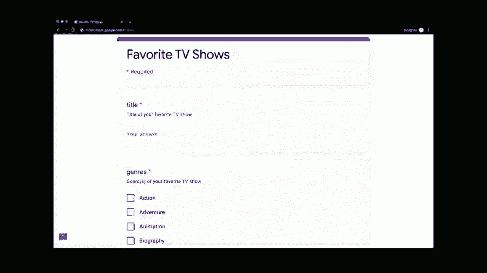

在进入的时候，我们会给每个人几分钟时间思考，自己首选的电视剧。我自己最近在重看《办公室》，我看了很多旧剧的重播，我想我，看电视的时间有点多。在这一切中，不过为了辩解，它一直在背景中播放，而我在。

我在我的笔记本电脑上工作，所以希望这没问题，让我看看已收集的回应。好吧，我们收到了，数百条回应，再给你一会儿。当前的问题是最喜欢的，电视剧的标题，以及该电视剧所属的类型或类型，布赖恩，你觉得我开始查看数据可以吗？如果我们继续这样也没问题。

收集一些更多的信息，但我会继续展示前几行，如果这样听起来不错。好吧，所以让我们去**看一下**一些已收集的数据。这是谷歌表单为我们创建的谷歌电子表格，和表单。这个特定的工具至少有三列，用于这个表单，一列是给我们的。

根据大家在标题和类型方面反馈的日期和时间，我手动加粗了它。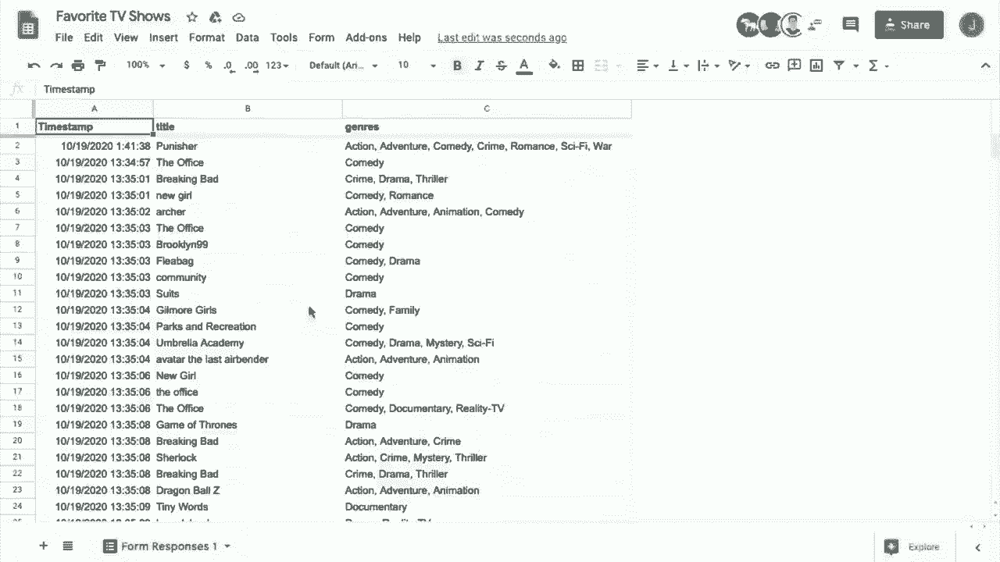

提前突出显示，但你会注意到这里的标题和类型完美匹配我们在谷歌表单中提出的问题。回复中，我们的问题可以看到，惩罚者是输入的第一个最喜欢的电视节目，接着是《阿奇》，《办公室》等等，在第三列。

在类型下，你会看到这里有一些有趣的内容，尽管某些单元格，即文本的小框框只有像喜剧或剧情这样的单词。你会注意到其中一些有一个用逗号分隔的列表，而这个逗号分隔的列表是因为你们中的一些人勾选了多个复选框以表示剧情。

还有惊悚片，因此谷歌表单处理这个问题的方式有点懒惰，因为它们只是将所有这些值作为用逗号分隔的列表放入电子表格中，如果我们最终将其下载为CSV，这可能是一个问题。现在在逗号之间又有逗号，幸运的是有解决方案。

我们最终会看到的，所以我们这里有相当多的数据。实际上，如果我继续向下滚动，我们会看到几百条回复，现在以某种方式分析这些数据并找出最受欢迎的电视节目会很好。也许通过它们的类型搜索我可能喜欢的新节目，所以你可以想象一些。

查询可以通过考虑像这样的电子表格来回答，我们都可能偶尔使用谷歌电子表格、苹果数字、微软Excel或其他工具，所以让我们考虑一下电子表格擅长什么，以及它们不擅长什么。有没有人愿意自愿回答第一个问题，是什么？

电子表格擅长什么，或不太确定如何回答。你用电子表格做什么，它们解决了哪些有用的问题？呃，安德鲁，你怎么看，接下来让安德鲁·帕克说说。哦，嘿，它们非常适合快速排序，好的，非常适合快速排序。

像我可以点击标题列的顶部，立刻按字母顺序对所有这些标题进行排序，我喜欢这样。使用电子表格的其他原因是什么，它们解决了哪些问题，它们擅长什么？关于电子表格的其他想法是，存储大量数据，以便你可以稍后分析。

好的，存储大量数据，以便你可以稍后分析，这是一种很好的存储大量数据的模型，可以这么说。我会说实际上是有一个限制，事实上，限制是。

长话短说，在研究生院我研究数据，Excel，支持的行具体来说我有 65,536 行，这在当时对 Excel 来说已经太多了，因为长话短说，如果你回忆起电子表格，每一行都从一开始编号。不幸的是，那时微软。

曾经使用过 16 位整数。！

这些数字中的 2 的 16 次方大约是 65,000。所以在那时我达到了总行数的上限，现在对彼得的观点，他们在最近几年增加了这一点，你实际上可以存储更多数据，所以电子表格确实在所有方面都很好，因为在某个时刻你的电子表格。

比你的 Mac 或 PC 能处理的更多，事实上，如果你实际上是在尝试构建一个应用，无论是 Twitter、Instagram 还是 Facebook，或者任何那种规模的东西，这些公司肯定不会将它们的数据仅仅存储在电子表格中，因为那样会有太多数据可供使用。

而且没有人能真正地在他们的电脑上打开它，因此我们需要一个解决方案来解决这个规模的问题，但我认为我们不需要抛弃电子表格中有效的部分，所以以行的形式，但似乎你也可以以列的形式存储大量数据，尽管我只展示了列 a 和 b。

当然，你可能用过 d e f 模型来思考电子表格中的行与列，我觉得我们可能在某种程度上以稍微不同的方式使用它们，从概念上讲，我们可能会稍微不同地看待它们，行和添加更多条目（如添加更多数据）之间的区别是，那些是在行内，但像是。

数据的实际属性或特征应该在列中。确切地说，当你向其中添加更多数据时，！

电子表格你应该真的在底部添加数据，添加更多和更多的行，所以这些东西在垂直方向上生长，尽管当然这只是人类的感知。它们从上到下生长，通过添加更多和更多的行，但为了索非亚的观点，你的列代表我们可能称之为属性或字段或任何其他这样的特征。

这类数据的类型是，表单，时间戳是第一列的标题，第二列是流派，第三列是那些字段或数据的属性，实际上在你第一次创建表单时，提前决定这些，在我们的案例中，或者在你其他的案例中，使用电子表格时不应该养成这样的习惯。

养成从左侧添加数据的习惯，除非你决定收集更多类型的数据。所以仅仅因为有人在你的数据集中添加了一部新的最爱电视剧，你不应该从左到右在新列中添加，而是向下添加，但假设我们实际上决定从每个人那里收集更多信息，也许那个表单曾问过你。

对于你的姓名或电子邮件地址或其他问题，这些属性或字段将作为新列，因此我们通常提前决定数据，然后再添加更多行，而不是列，除非我们改变主意，需要更改架构。

我们特定数据的情况表明，电子表格确实非常有用，正如彼得所说，对于你知道的大型或合理规模的数据集，我们可以当然根据上周导出那些数据集为.csv文件，因此我们可以从电子表格转到一个简单的文本文件。

存储在ASCII或Unicode中，通常在你自己的硬盘上或云端的某个地方。你实际上可以把那个文件，那个.csv数据库想象成一个数据库。一般来说，数据库是一个存储数据的文件，或者是一个为你存储数据的程序，大家可能都考虑过或者在某种程度上使用过数据库。

你可能熟悉这些大型网站，比如谷歌、推特和脸书等，它们使用数据库存储我们的数据，而这些数据库要么是包含大量数据的巨型文件，要么是为我们存储数据的特殊程序。平面文件只是指在简单文本文件中存储数据时的设计选择。

如果你想存储不同类型的数据，比如索非亚提到的不同属性或者特征，简单起见，我们只需分隔那些列，也就是.csv，你可以使用其他方式，使用制表符，甚至可以使用任何你想要的东西，但如果你的实际数据中包含逗号，那就会有问题。

如果你最喜欢的电视节目标题中有逗号，或者谷歌假设将流派存储为逗号分隔的列表，使用.csv文件时可能会出现不好的情况。

对于你的平面文件数据库，这里有解决方案，在你有的时候。

在你的.csv文件中，如果有逗号，你只需确保整个字符串在最左边和最右边都用双引号括起来，双引号内的任何内容。

以免被误解为划分列，就像文件中的其他逗号一样。这就是平面文件数据库的含义，而.csv可能是其中之一，仅仅因为所有这些程序，数字，都允许你将文件保存为.csv文件。长话短说，那些使用过电子表格高级功能的人。

像内置函数和公式这些功能，都是谷歌电子表格和Excel专有的，.csv文件或.tsv文件，或更一般的平面文件数据库是不可更改的值，因此当你导出数据时，所见即所得，这就是为什么人们使用更高级的程序，比如Excel和谷歌电子表格。

因为你获得了更多的功能，但如果你想导出数据，你只能获取原始的文本数据，但我敢说，这将是可以的，实际上布莱恩，你介意我继续下载这个电子表格作为CSV文件吗？好的，我将继续去。

打开Google表格，点击文件，下载，你会看到一大堆选项，PDF，网页，逗号分隔值，这就是我想要的，所以我确实要选择。csv，从这个下拉菜单中，在表格中，这当然会为我下载该文件，现在我将要继续去，正如上周，我能够将一个文件上传到IDE。

我这周也要继续这样做。我将继续抓取我的文件，它最终在我的下载文件夹中。

在我这台特定的计算机上，我将继续拖放这个文件。

进入这个IDE，最终到了我的。

所以可以这么说，现在我有这个文件《最爱的电视节目》在IDE中。

逗号，标题，逗号，类型是我们的标题行，包含了这个文件中的属性或特征的名称，然后我们有时间戳，逗号，最爱标题，逗号，然后是一个逗号分隔的类型列表，这里确实注意到任何值本身有逗号时的引号，所以这是一种相对简单的文件格式。

我当然可以浏览一下，看看谁喜欢这些节目。但根据上周的情况，我们现在有了一种相当有用的编程语言供我们使用，Python。这可以让我们更容易地开始操作和分析这些数据。回到我的观点，最后的工作，你绝对可以完成我们要做的一切。

在之前的CS50周中，我们可以使用C来做我们即将要做的事情，但你可能会发现C通常是很麻烦的。

某些事情，比如任何涉及字符串操作的，改变字符串、分析字符串的，都是一种真正的麻烦，天哪，如果你不得不将CSV文件加载到内存中，不同于你的拼写检查器，你将不得不在各处使用malloc，或者realloc等等，涉及的工作量非常大。

分析文本文件时，Python为我们处理了所有这些，通过提供更多的功能，让我们可以打开数据，所以让我继续关闭这个文件。让我继续创建一个新的文件，叫做favorites.py，在这个文件中，我将开始回答一些关于它的问题，坦率地说，即使到今天，20多年后。

我自己非常习惯于，当简单，并且没有解决我最终。想要的问题，但一些，简单的作为一种管道的证明，去写一个快速的。程序，仅仅打开这个文件，底部，并逐一打印出每个标题。作为一个快速的理智检查，我知道，数据，他们在这里，所以让我去啊**d 并导入。

csv 然后我可以以几种不同的方式做到这一点，但到现在为止你可能已经看到或记得使用，像打开命令这样的东西。和 with 关键字来打开，文件给我，dash，表单响应 1.dot csv。我将严格地以读取模式打开这个 r。

这不是必需的，你可能会在网上看到例子，不包括它，那是因为，c。和 f 打开我将明确并，实际上做引号中的 r。我将去啊**d 并给这个。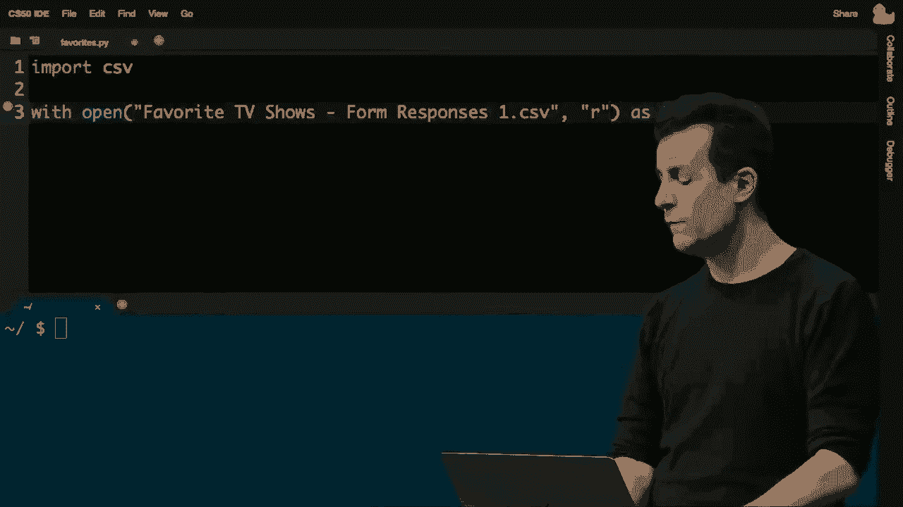

一个文件的变量名，因此这个，csv，文件以只读模式打开并创建一个，引用。现在我将去啊**d 并使用一些，csv 功能，我将要，读取器。这个我可以叫 xyz 其他任何东西，但读取器很好地描述了。这个变量将要做什么，并且，它将是调用 csv 的返回值。

对于那个文件的读取器，基本上是 csv 库的每个。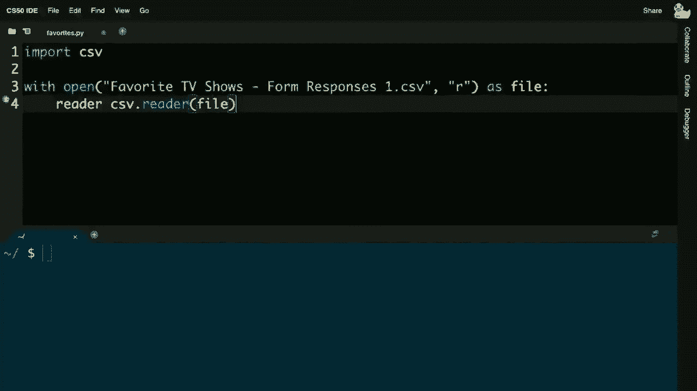

上周有很多炫酷的功能，内置的，所需输入的只是一个已经打开的文本文件，然后可以说，它会将那个文件包装起来，功能。像现在我可以逐列、逐行读取，好的，现在我，我将跳过第一行，因为。

第一行有我的标题 timest*mp、标题和类型，我知道我的，那。行现在我将这样做，对于行中的，读取器让我去啊**d 并简单地打印。行，我只想要标题，所以我想如果，它有三列。从左到右是 0 1 2，所以我想，打印出列，括号 1，这将是。

第二列 0，索引好的，让我去啊**d 并，保存它，然后去我的终端窗口。运行 python favorites.dot pi 并，交叉我的手指，好的，瞧，它看起来飞快地过去了。它看起来确实这些都是，大家输入的电视节目。向上滚动，所以我的程序似乎在工作，但让我们稍微改进一下。

有一点，结果是使用 csv，读取器不一定是最好的。方法在 python 中，许多人已经发现了，一个字典读取器，这很好，因为你不必知道，或者不断检查。你的数据在哪一列，你可以通过的方式来引用它。

标头本身，因此通过标题引号中的，或者通过类型，这也是好的，因为如果你或。也许一个同事在搞定，电子表格并且他们。通过拖动列左右重新排列它们，任何在代码中使用的数字 0。1 2 等等，可能会突然不正确，如果你的，同事重新排列了那些列。

因此，使用字典阅读器通常是标题，而不是单纯的数字。如果有人，比如你自己或者其他人，改变了那第一行的值并重命名标题或类型，那么事情会崩溃，但在那时我们不得不责怪你没有跟踪你的代码与数据。

仍然存在风险，所以我将这里改为字典阅读器或字典读取器。我的代码几乎可以保持不变，除了我不需要在第五行这里的黑客技巧。我不需要直接跳到下一行，因为我现在想让字典阅读器为我处理读取第一行的过程，但。

其他方面都保持不变，除了最后一行，现在我认为我可以将行作为字典使用，而不是作为列表，标题，来自每一行。因此让我去运行 Python 的 favorites.py，再次运行，哇，看起来我得到了相同的结果，几百个，但让我说明它做的事情是一样的。

好的，在我继续之前，实际上想要在此基础上增强新的功能。对于我们刚刚写的这个 Python 脚本，打开一个文件，用阅读器或字典阅读器包装它，然后逐行迭代打印标题，有什么问题或困惑吗？没关系，我们只知道。

如果你看过 Python 一周，没关系，如果它仍然很新，布莱恩，我们应该解决任何问题吗？是的，为什么你不需要在使用你所用的语法时关闭文件呢？这里是个很好的问题，上周我更严格地单独使用了 open，然后我使用了与我刚刚打开的文件相关联的关闭函数。

实际上是使用这个关键字，它在 C 语言中并不存在。它在 Python 中通常是一个有用的特性，如果你说 with open ... 它会为你打开文件。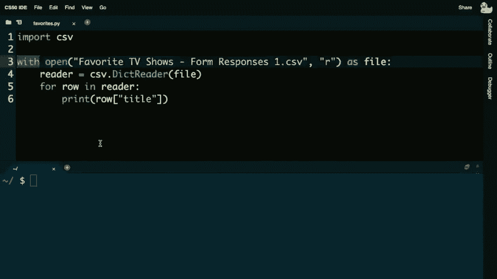

然后，只要你的代码缩进在那个关键字块内，它就会保持打开状态。一旦你到达程序的结尾，它会自动为你关闭。因此，这是 Python 在某种意义上试图保护我们的一项特性，这对于人类来说可能是相当普遍的。

这可能会导致保存问题，造成内存泄漏，正如我们在 C 语言中所知。因此，宽度关键字假设我不会傻到忘记关闭文件。Python 会为我自动处理这个问题，布莱恩，还有其他问题或困惑吗？字典阅读器如何知道标题是字典中的键名，这真是太好了。

这是由 python 语言的作者设计的。查看文件中的第一行，第一行，短语，在第一个逗号之前是。第一列的名称，第二个词或短语在，第一个逗号之后是。第二列的名称，以此类推，因此 dict 读取器仅假定。

按照 csv 的惯例，你的，第一行将包含。你想用来，引用这些列的标题。如果你的 csv 恰好没有这样的标题，那么它将直接跳到。第一行的实际数据，那么你没有，正确的，配置，好吧。

让我们继续，现在我觉得，这里有一堆麻烦，你知道。某些节目相当受欢迎，当我浏览这个时，我，很多人喜欢。办公室，很多人喜欢，绝命毒师，权力的游戏以及许多其他节目，所以我认为如果我们这样做会更好。

通过仅查看唯一值来缩小我们对这些，数据的视角。你在查看唯一值，因此，不要只是从文件中遍历。自上而下打印出一个，标题接一个，为什么我们不继续积累这些，数据到某种数据结构中。

这样我们就可以丢弃重复，值，然后只打印出。我们积累的唯一标题，我打赌我们可以用几种方式做到这一点。但如果我们回想上周的，字典演示。你会记得我使用了所谓的集合，我将继续执行这个。

创建一个名为标题的变量，并，将其设置为等于某个名为。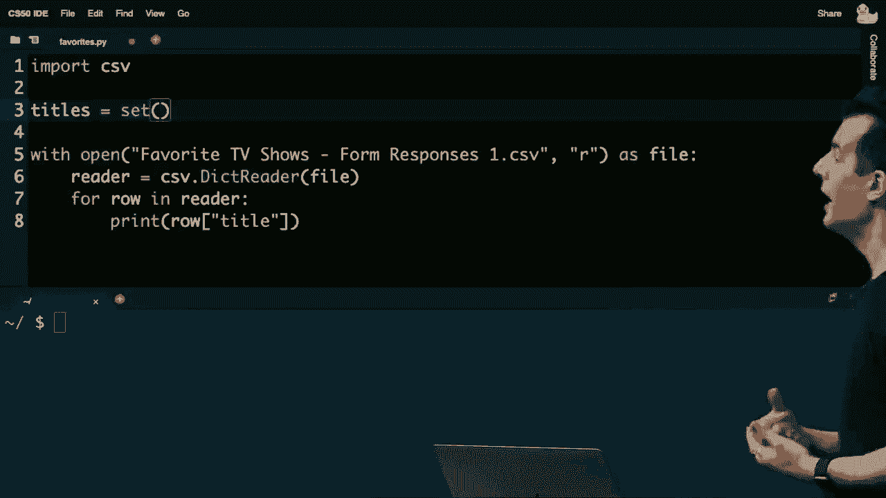

集合只是一个，值的集合，它有点像。一个列表，但它为我消除了重复项，这似乎正是我想要的。每个标题，如果我想要。首先过滤掉重复项，我将继续执行这个。

将继续添加到标题，行，我反而，添加到标题集合，特定的。处理，python 中的集合数据结构将为我丢弃重复项，并且，唯一。现在在我的文件底部，我需要，做更多的工作，诚然，现在我必须遍历。集合，只打印出那些唯一，标题，所以让我为标题执行这个。

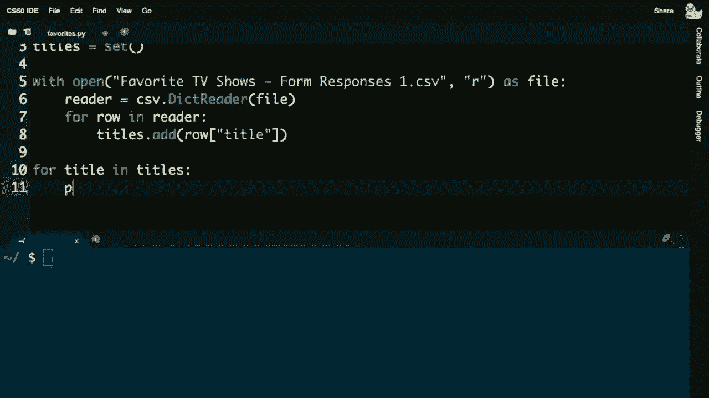

标题继续前进，并打印出标题和，用户友好的，少于。n 或者你可以说标题，在标题中，如果标题变量是数据结构的类型。你可以，列表，或者如果它是一个集合，甚至如果它是一个。字典，我们上周在 python 中看到的另一种数据结构，python 中的 for 循环将会知道。

这将循环遍历，所有标题在标题，集合中，所以让我继续保存这个。文件，然后继续运行 python 的，favorites。pi，结果看起来是的，列表有。某种不同，绝对比以前少，因为我的。滚动条没有跳那么远，但老实说，这有点乱。

现在在C中进行排序会有些麻烦，我们不得不拿出伪代码，可能是冒泡排序、选择排序，或者天哪，归并排序，然后自己实现。但在Python中，有很多函数可以用。

所以，如果你想要对这个集合进行排序，你知道的，比如说你想要它排序。Python中有一个叫做sorted的函数，可以使用一些更好的算法，也许是归并排序，也许是快速排序，可能是别的。

这是完全不同的，它不会使用O(n平方)的排序，Python中的某个人可能花时间为我们实现了更好的排序。现在让我再做一次，让我增加我的终端窗口大小，并重新运行Python的favorites.py，好吧，现在我们有一个有趣的。

这些节目组合让我更容易理解，因为我现在在这里进行了整理。实际上，如果我向上滚动，我们应该能看到所有以数字或句点开头的节目，呃，这可能只是有人在玩。接下来是以字母a、b开头的节目，等等，现在稍微容易一点。

理解这些内容，但有些不对劲，我感觉很多人喜欢《最后的气宗》（Avatar: The Last Airbender），然而，我确实看到它出现了四次，但我以为我们是通过使用集合结构来筛选出唯一的。那么，究竟发生了什么？实际上，如果我继续滚动，我可以肯定我在这里看到了更多重复的《波杰克马戏团》（Bojack Horseman）和《绝命毒师》（Breaking Bad）。

布鲁克林九号（Brooklyn Nine-Nine）、CS50和几种不同的风格。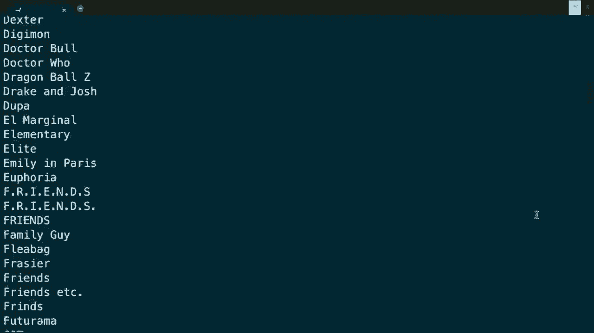

嗯，是的，朋友们，我看到很多重复值，所以发生了什么呢？

是的，你当前的排序是大小写不敏感的，某些地方会导致每次结果不同。是的，正是如此，有些人在大写方面不够认真，事实上，现实是Kudana指出了大小写之间的差异，现在我们已经解决了这个问题。

事实上，当你实现自己的拼写检查器时，早就处理过这个问题了。

你已经处理过这个问题了，当文本中，有些词可能是大写的，有些可能是全小写或全大写，而你想要容忍不同的大小写。所以我们可能通过强制所有内容为大写或小写来解决这个问题，因此实现大小写不敏感的处理。请给我一点时间，快速。

更改我的表单，我要去调整，并且我要改变这一点，以便我们可以，缩回我的代码，继续改变这一点，使我们实际上强制所有内容为大写或小写，实际上无所谓，但我们需要规范化。

可以这么说，以某种方式**标准化**事物，意味着以某种标准格式化所有数据，所以就像刀锋所说的，让我们将所有内容标准化为大写或小写，我们只需做一个**判断**，所以我将**进行一些调整**，我仍然会使用集合，我仍然会像以前一样读取csv。

但我不是仅仅用行括号标题添加标题，而是将**强制**它为大写，纯粹是为了统一。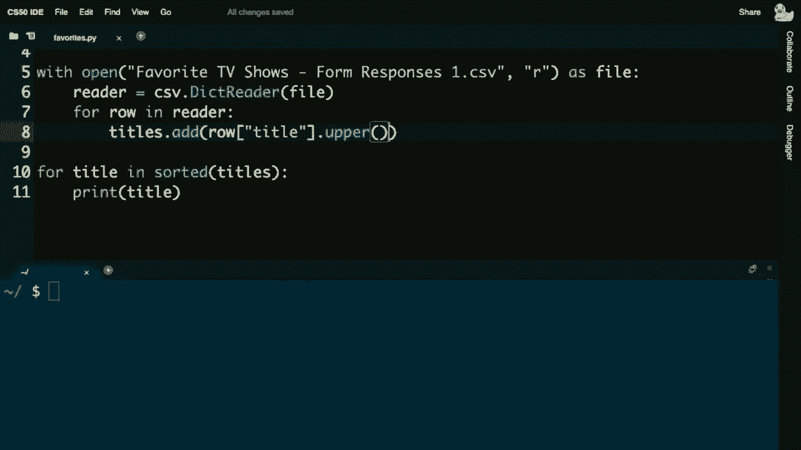

也要去，然后让我们前往**检查一下**，究竟发生了什么，我不会改变其他任何东西，但让我**去增加**我的终端窗口的大小，重新运行。python 的最爱。pi，瞧，它有点难以阅读，因为我不习惯阅读全大写，感觉像是在对自己喊话，但。

我不明白，等等，我仍然在这里看到了**办公室**两次，如果我继续滚动，奇怪。更奇怪的是，看来这只是一个**错字**，我看到两个福尔摩斯，不过，你。看来我还没有完全解决问题。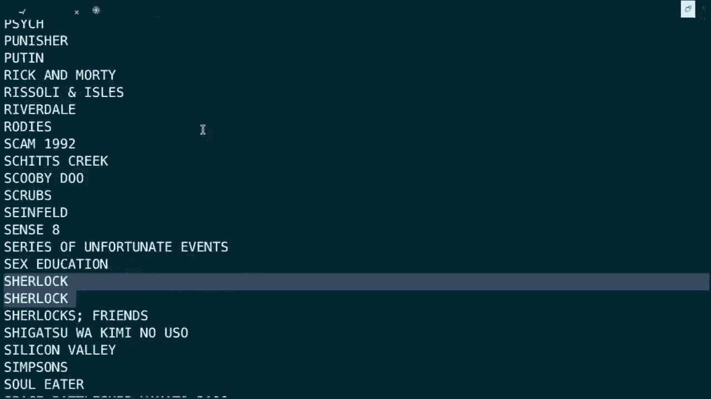

这个就稍微微妙一点，我可能还应该对我的数据做些什么，以确保我们去除重复项，可能是修整一下边缘，我们会……但。你是什么意思，那有什么用哦，像是修剪掉额外的空格，以防单词。是的，确实很常见，**按下空格键**的地方不该按，其实我。

有点推测，我敢打赌，你们中的一个或多个意外地输入了**福尔摩斯 空格**，然后决定不，这样就不再输入其他任何东西，但那个空格。尽管我们看不到，它显然是存在的，当我们做结构时，它实际上会被注意到，因为它们不会相同，所以我可以在几种方式中做到这一点。

python，你可以将函数链接在一起，这也是一种比较**花哨的特性**。注意我在这里做什么，我仍在访问标题集合，我在添加以下值。我要添加的值是行括号标题，但不完全是，**我将继续**并进行修剪，这意味着如果我们查看这个函数的文档，正如奥利维亚所说的。

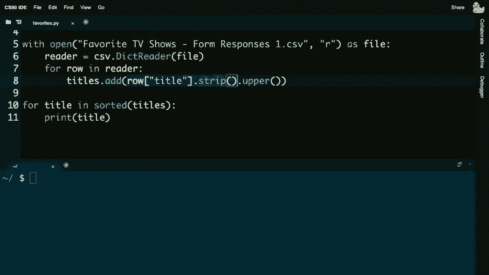

我将去掉或修剪所有左侧和右侧的空白，不论是空格键、回车键、制表符或其他几个字符。这将去掉前导和尾随空白，然后，无论剩下什么，我将**强制**所有内容为大写。

kadana 建议 2。所以我们现在有点结合了两个好主意，真的在处理数据，变成更清晰的格式，这是一个现实世界的现实。像你我这样的普通人，有时无法被信任，输入数据方式也许并不正确。因为我们有点懒惰，或者有点社交，从亚马逊。 

尝试输入有效的邮政编码，因为我可以想到我生活中的几个人，现在还没想好。所以所有东西可能都是大写的，这对需要精确度的计算机系统来说不好。我们在第零周强调过，因此处理数据意味着清理它，进行一些变更，这些变更并不真正改变数据的含义，而是规范化。

它将其标准化，以便可以说你在比较苹果与苹果，而不是苹果与橙子。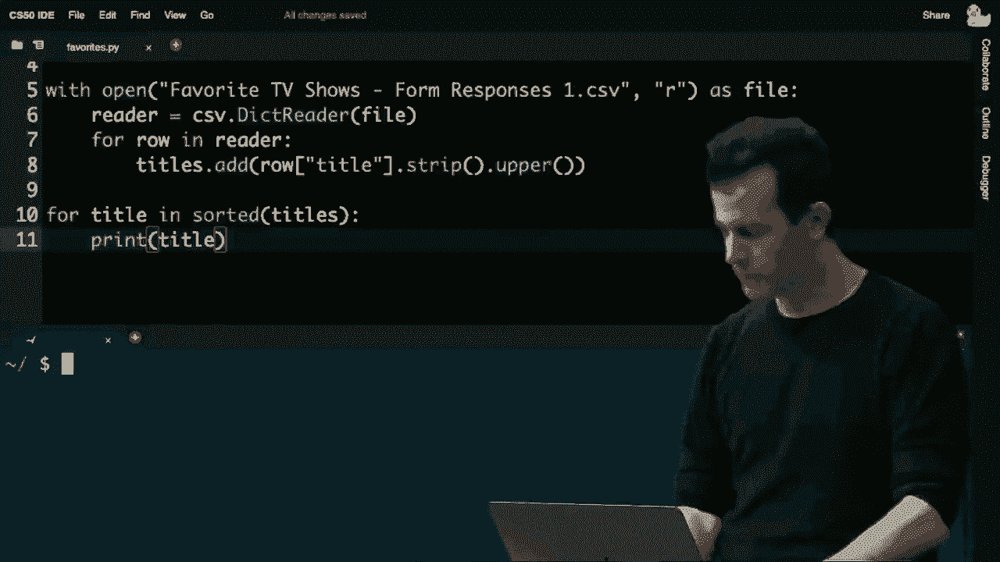

好吧，让我继续在更大的终端窗口中运行这个。python favorites stop high voila，向上滚动，看到，向上和向上，相关于空格，我认为我们有一个更干净的独特标题列表。当然，如果我们向上滚动，我会需要更聪明。

如果我想检测像“你”这样的事情，你是非常认真地输入句点，但最后无聊而漏掉了最后一个句点，但这在接收用户输入时是会发生的，当然我们有所有这些变种，来清理它们。

添加一大堆条件和其他处理，以便清理所有内容，如果我们确实想要规范化，去掉引号。

cs50，这真的是一条滑坡之路，你我可以开始写一个，但这就是处理真实数据时的现实。好吧，让我们现在继续改进这个程序，做一些更花哨的事情，因为我现在可以信任我的数据已经被规范化，除了实际内容。让我们继续找出什么是。

在这里观众最喜欢的电视节目是什么，所以我会从我以前的代码开始，因为我认为我已经有了大部分构建模块，我会继续清理我的代码，给自己一个新的变量，叫做标题。

这样我可以以更有条理的方式思考事情。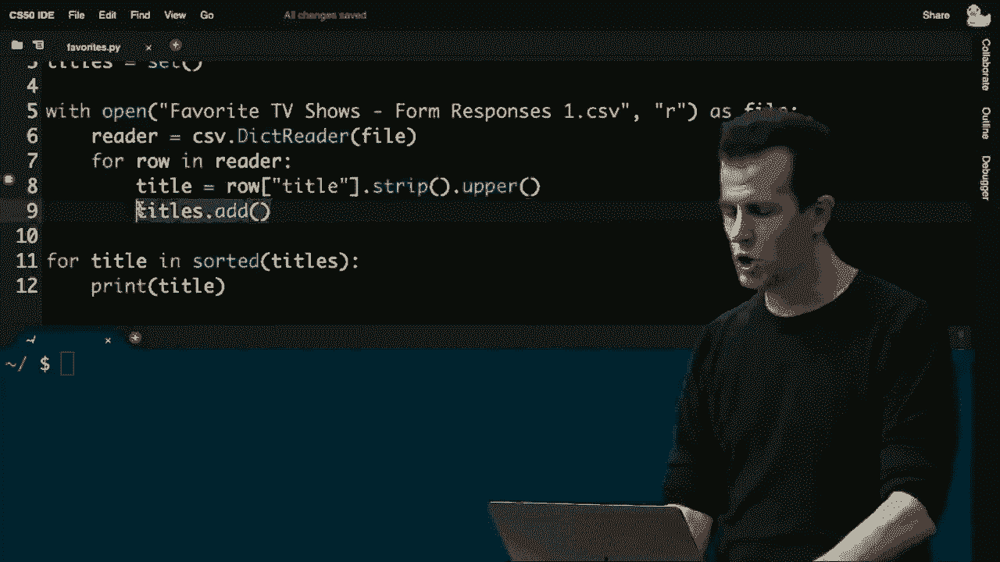

但我不打算再向这个集合添加东西，事实上，我认为集合并不足以跟踪电视节目的受欢迎程度，因为根据定义，集合会丢弃重复项，但现在的目标恰恰相反，我想知道哪些是重复的，以便我可以告诉你有多少人喜欢这个。

办公室里很多人喜欢《绝命毒师》等等，那又怎么样。

在Python的工具箱中，我们有哪些工具。

提取出，任何关于什么，数据结构的信息，显示流行度，显示流行度，嗯，我想，一个选项可能是使用，字典，这样你可以像，办公室。我不知道20票，然后《权力的游戏》另一个，所以。字典真的可以帮助你，直观地理解，是的，完美的直觉记住一个。

字典，归根结底，无论它在底层实现得多么复杂，就像，你的拼写检查器，它只是一个键值对的集合，实际上它，可能是任何语言中最有用的数据结构之一。因为这种将一个数据片段与另一个数据片段关联的能力。

只是一个非常通用的解决方案，关键是，如果手头的问题是弄清楚。节目的人气，那就让我们把，键设为我们节目的标题，来说。那些键的值我们将映射标题，投票标题，投票标题，投票，因此。让我去啊**d并向上滚动，我可以，设置，我可以改为说字典并给自己。

只是一个空字典，实际上有更常用的简写表示法。用两个空的大括号，这只意味着完全相同的事情。给我一个最初为空的字典，没有复杂的快捷方式用于。集合，你必须字面上输入s e t，开括号闭括号，但字典。

是如此常见，如此流行，如此强大，它们有这个小的语法快捷方式，只有两个。大括号打开和关闭，所以现在，我有了这个，让我去啊**d并在我的。for循环内部做这个，而不是打印标题，我，真的不想这样做，而是将其添加。到集合中，我现在想将其添加到字典中，那我该怎么做呢？如果我的。

字典叫做标题，我认为我基本上可以做类似这样的事情，标题括号。标题等于，或者也许加，等于1，也许我可以有点使用这个。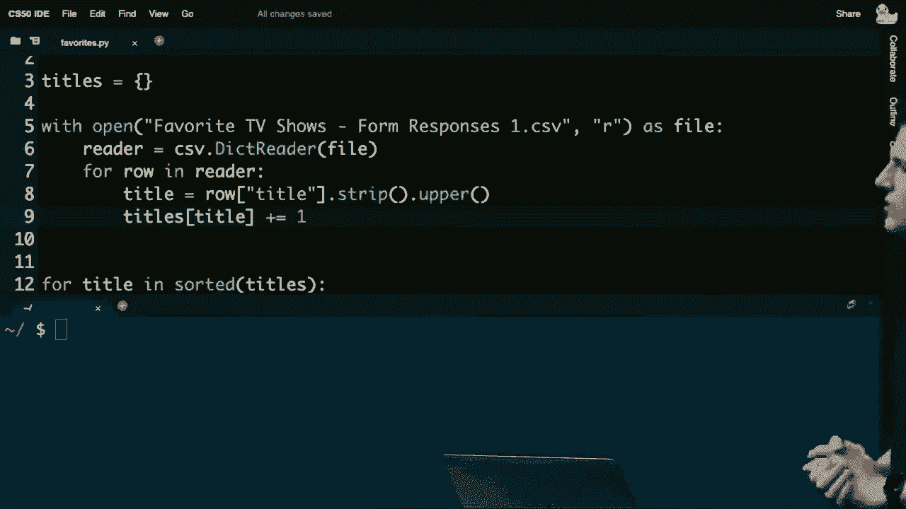

字典，数字，从零开始，然后加一，加二，加三，所以每次我看到。等于1，加等于1。我们不能做加加。

因为这在Python中不是一件事，它只在C中存在，但这似乎会进入。名为标题的字典，查找与这个特定标题匹配的键。

然后将那里任何值增加，1，但我将去啊**d并运行。这个有点天真，让我去啊**d并运行python的，favorites.dot pi。哇，或者它已经在第九行崩溃了，所以这在一开始就是一个适当的选择。我们遇到了一个关于惩罚者的键错误，所以，惩罚者是坏的，刚刚发生了一些坏事。

发生了，但这意味着什么呢？一个关键错误是指我尝试访问字典中的一个无效键。这里的代码是，即使标题是一个字典，即使单数的标题的值是“惩罚者”，我仍然遇到了一个关键错误。因为那个标题尚不存在，所以。

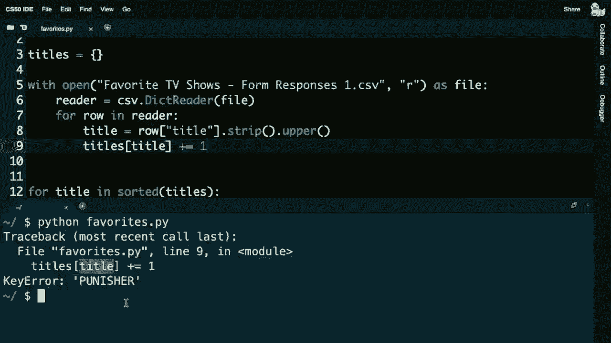

即使你不确定 Python，这里也有直观的解决方案。我无法增加“惩罚者”的频率，因为“惩罚者”不在字典中。我觉得你首先需要创建一个 for 循环，并可能给字典中的每个元素分配一个值，例如零，然后再添加。

一，没错，所以直觉很好，在这里我可以用另一个隐喻，我担心我们可能会有一个“鸡生蛋”的问题，因为我觉得我不能在代码的顶部循环中，将字典中的所有值初始化为零，因为。

我需要知道此时所有节目的名称，这很好。

我想我可以更字面地*带你走*，打开 CSV 文件并从上到下遍历它。每当我看到一个标题时，就初始化为零。然后再有一个 for 循环，也许重新打开文件，做同样的事情，这样可以工作，但这可以说不是非常有效，从大 O 的角度来看是渐进的。

但这似乎是在对文件进行两次遍历。一次只是为了初始化所有内容，再一次只是为了增加计数。我认为我们可以更有效地做事，我认为我们可以实现，不仅是对如何解决这个问题的思考，而是不用遍历整个文件两次，来检查是否。

该键在字典中，如果它还未被添加，那么继续*增加*值，之后再处理。我们完全可以这样做，所以让我们就应用这种直觉。如果问题是我试图访问一个尚不存在的键，那我们就想办法处理。如果存在，那么增加它，但如果不存在，那么只有遵循 Grid 的建议。

将其初始化为零，所以让我这样做，让我去**继续**，用一种**优雅**的方式提出问题，这比在 C 中干净得多。让我再说一次，如果被调用的标题，那也没关系，我可以继续，*说* titles[title] = 0。这里的区别是我可以*确实*索引到一个字典。

使用一个不存在的键，如果我打算在那一刻给它一个值，那是可以的，而且自上周以来一直都可以，但是如果我想去**继续**增加那个值，我将会在这一行进行操作，但我已经。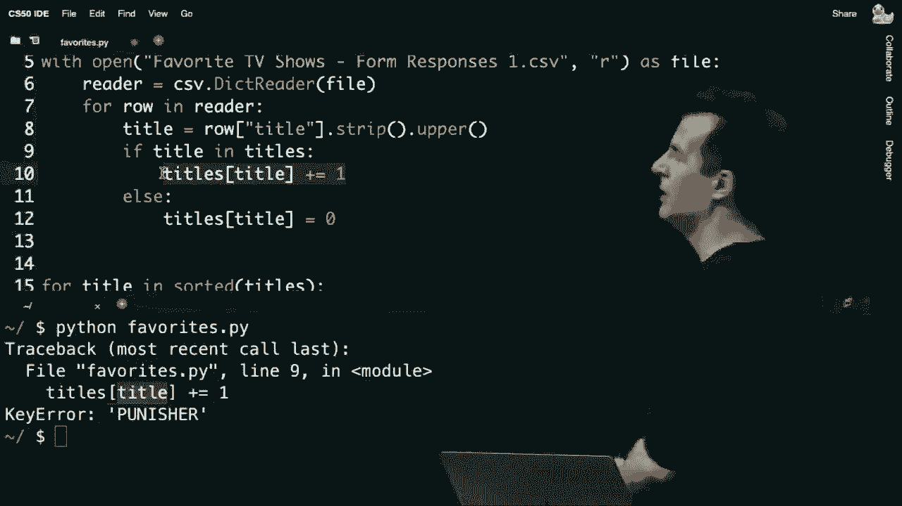

引入一个bug，我在这里确实引入了一个bug，我想我需要进一步一步。逻辑上我觉得我不想把这个初始化为零。

作为一回事，有人看到我逻辑中的细微bug吗，如果标题已经在字典中，我就把它加一，有什么细微的捕捉吗，哦，奥利维亚，你觉得我应该把它初始化为一，因为这是第一次实例。确切的，我应该将其初始化为一，否则我就不小心忽略了。

这个特定的标题，我会继续进行计数，以便我可以通过这样做来修复它，或者老实说，如果你愿意，我不需要使用if else，我可以只用if，通过做，如果标题不在标题中，那么我可以继续说标题。括号标题得到零，然后之后，我可以盲目地这么做，那么这到底是哪个。

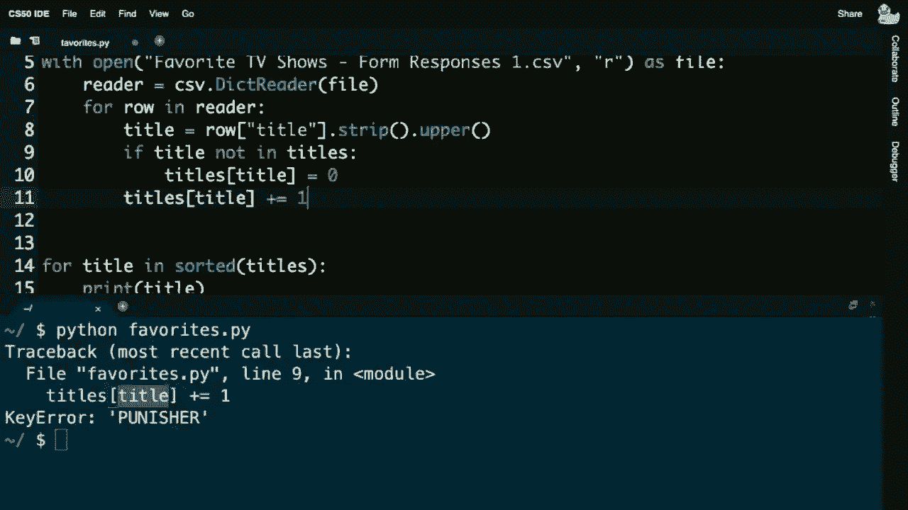

我觉得第二个可能是更好的一行代码。

但通过那个if条件确保了某人的建议，字典。直到我确定标题在里面，现在，python of favorites dot pi，输入。好的，它没有崩溃，这很好，信息，但我现在可以访问更多，让我来程序。现在我有这个循环，让我继续打印出不仅仅是标题。

还包括字典中该键的值，仅仅通过在这里索引进去，你可以，但用print。

你实际上可以传入多个参数，默认情况下，print会用空格分隔它们，你可以用任何东西来分隔，但这只是为了快速演示一下，所以，让我再运行一次，python of favorites dot pi，瞧，这有点乱，但在办公室非常受欢迎，有26票，真是多。 

单个投票在这里，呃，很多《大爆炸理论》有九票，我觉得这会让我花很长时间来理清哪些是最受欢迎的节目，所以我们当然该如何做到这一点。

回到之前提到的要点，使用电子表格，天哪，在微软的Excel或谷歌电子表格或苹果中，标题一出，哗啦一下排序，我们似乎失去了这个能力，除非现在用代码来做，所以让我为我们做一下，哦**继续回到我的代码，结果看起来像是排序过的，尽管它确实有效。**

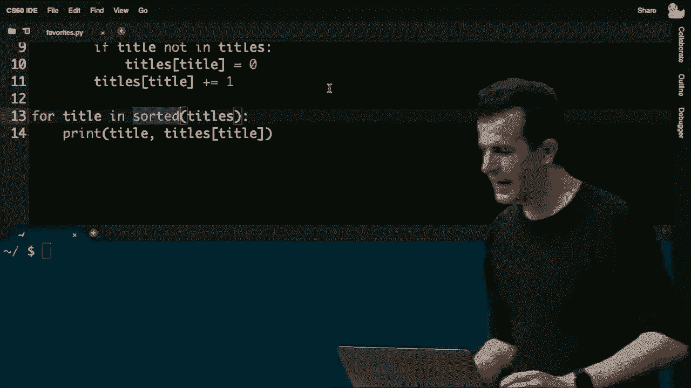

字典实际上是按键而不是按值排序的，在这里我们的Python编程技巧需要变得更加复杂，我们想在这里引入Python的另一个特性，这将以一种一般的方式解决这个问题。所以如果我们阅读`sorted`的文档，它们的排序是。

它按值对列表进行排序，按键对字典进行排序，因为字典对于每个元素都有两部分信息，它有一个键和一个值，而不仅仅是一个值。因此默认情况下，sorted按键排序，所以我们必须以某种方式重写该行为。那么我们该如何做到呢？实际上，sorted函数。

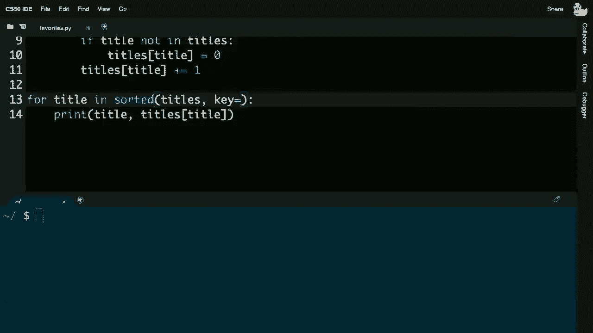

key参数的值是函数的名称，这里事情变得非常有趣，如果不说令人困惑的话。实际上，在python中，参数可以通过其名称传递。技术上你可以在c中做到这一点，但语法上复杂得多。但在python中非常常见。

javascript在许多语言中都很常见，通常将函数视为一等对象，这是一种花哨的说法，意思是你可以像传递其他东西一样传递它们。

调用它们，但你可以按名称传递它们。那么我所说的是什么呢？好吧，我现在需要一个函数来对我的字典进行排序，这，也许让我去啊**d给它一个叫f的名字，因为我们要暂时把它去掉。定义一个名为f的函数，输入一个标题，然后返回给我该值。

对应于该键，所以我要去啊**d并返回。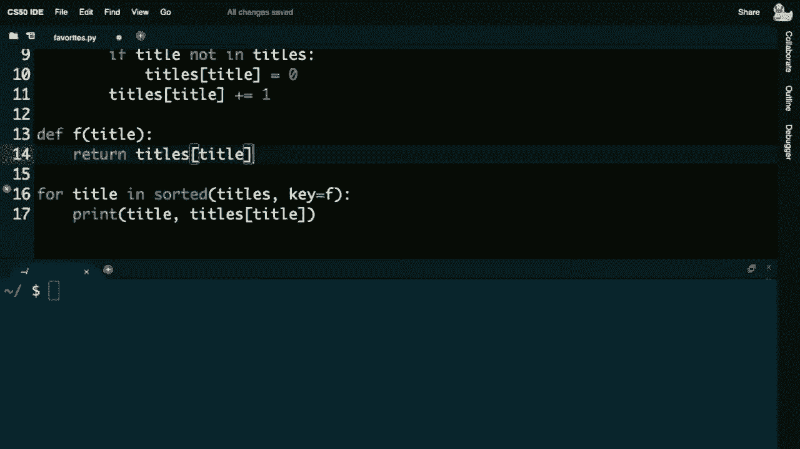

这个函数的目的是非常简单，你给它一个标题。它给你对应的计数，查找起来简单，但这就是它唯一的目的。但是，根据文档，sorted现在要做的是因为我传入了一个名为key的第二个参数。

sorted函数并不是仅按键的字母顺序排序，而是会在字典中的每个元素上调用该函数f，并根据你的返回值来确定实际的。

默认情况下，排序仅查看键，我实际上是在做这个值，每个键对应的，因此，即使语法有点。

新的字典是按键排序的，因为默认情况下它按键排序。但如果我定义自己的键函数并重写该行为以返回对应的值。它是值、数字和计数。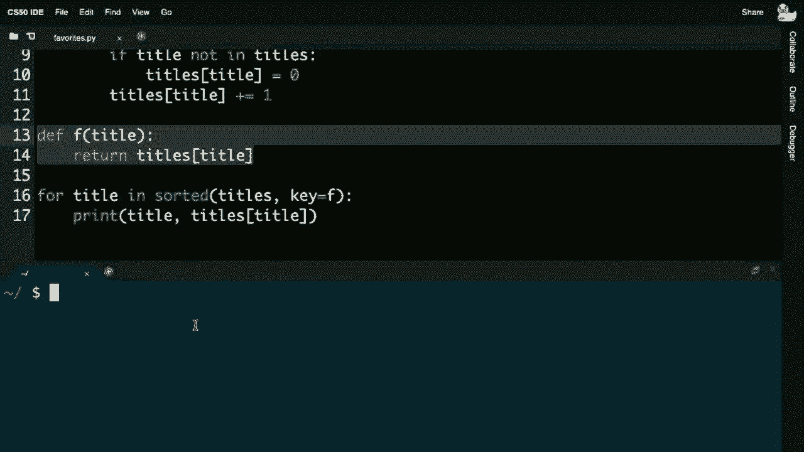

好的，让我们去啊**d看看这在实践中是否真实，让我去啊**d重新运行python favorites dot pi，我应该能看到所有标题，瞧，最受欢迎的节目似乎是《权力的游戏》，27。其次是《办公室》，26，等等，但当然这个列表有点。

倒着说，我的意思是这很方便，我。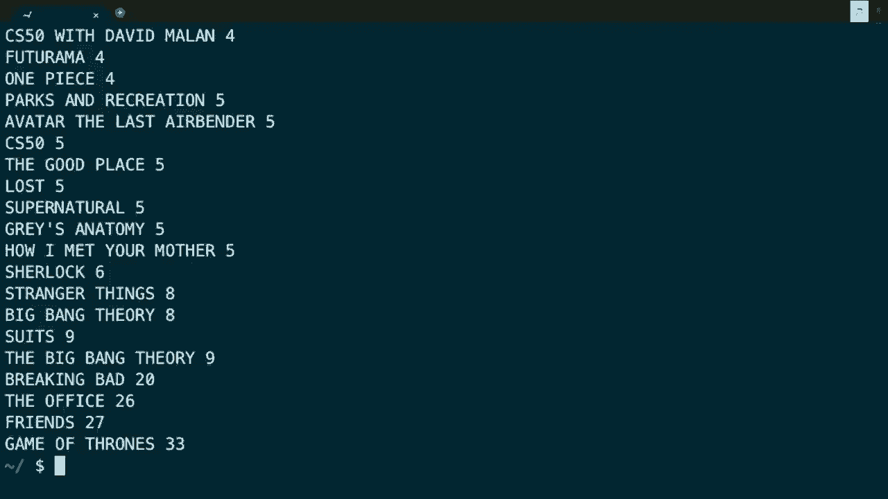

我可以在屏幕底部看到它，但如果我们在创建列表时，它应该真的在顶部，那我们如何覆盖这种行为？事实证明，sorted 函数，如果你阅读它的文档，还接受另一个可选参数，称为 reverse。在 Python 中，这将去 ah **d** 并现在给我们。

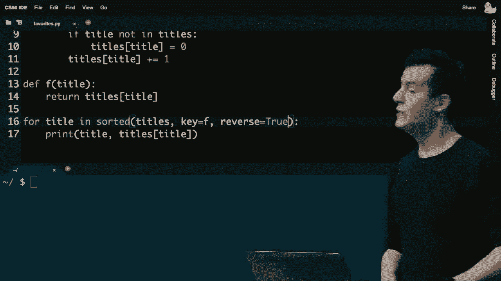

该排序的反向顺序，所以窗口，再次运行它，瞧，如果我向上滚动到顶部，它不是按字母顺序排序的，但如果我继续向下滚动，数字越来越大，瞧。

现在《权力的游戏》以 33 分的成绩高居榜首，太酷了。而且至少是我们可以传递函数的两个函数，并让后者调用前者，这样说复杂了，不过现在有关于我们如何使用字典和以这种反向值排序的方式有什么问题或困惑吗？

有什么问题或困惑吗？聊天或口头上，布莱恩。嗯，看起来所有问题都已得到解答，那在这种情况下让我指出一个常见的错误，注意即使 f 是一个函数，这样写也是不正确的，原因是我们故意想将函数 f 传递给 sorted 函数，以便。

sorted 函数可以自作主张地反复调用 f。我们不想只用括号调用它一次，而是想通过名称传递它，这样 Python 的 sorted 函数就可以为我们完成这项工作。圣地亚哥做了，我们把 f 作为 title 呀，那么为什么不呢？

我本来要问那个问题，特别是哦，因为那样会调用函数一次而且仅一次，我们希望 sorted 能够再次和再三调用它。现在这实际上是一个示例，正如我们在过去看到的那样，这是一个正确的解决方案，这表现得正如我所期望的，从上到下的排序标题列表。

按受欢迎程度排序，但设计得有点糟糕，因为我定义的这个函数 f 首先名字有点无聊。我只为了在一个地方使用而定义一个函数，天哪，这样的按键浪费。

所以事实证明，在 Python 中，如果你有一个非常短的函数，其生命意义就是这样，而它短得足以让你确定可以放在一行代码上而不会换行并且开始变得风格丑陋，实际上你可以这样做。你可以像这样复制你脑海中的代码，函数名称。

你实际上可以使用一个在 Python 中称为 **lambda** 的特殊关键字。你可以像以前一样为函数指定一个参数的名称，然后简单地指定返回值，随后删除函数本身。所以为了明确，key 仍然是传递给 sorted 函数的一个参数，它通常期望的值是。

函数的名称，但如果你认为这似乎是浪费额外的精力去定义一个函数然后传递这个函数，尤其是当它如此简短时，你可以在一行内做到。lambda函数是Python中的一个，因此你不必为它选择名称，但它仍然在意。

关于它的参数和返回值，所以仍然由你提供零个或多个参数和一个返回值。注意我已经指定了关键字`lambda`，后面跟着我希望这个匿名的无名函数接受的参数名称，然后我指定返回值，而对于lambda函数，你不需要指定返回值。

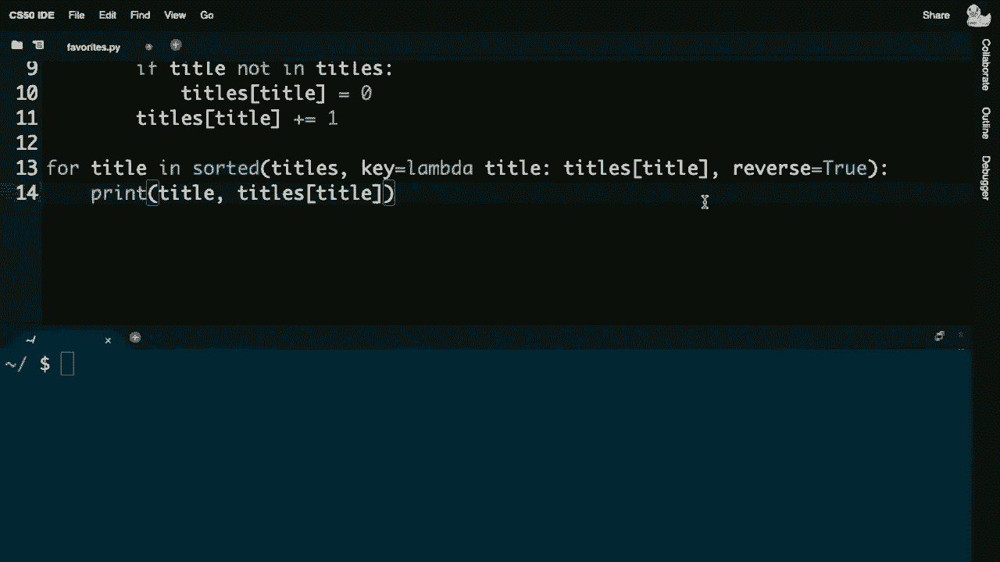

不需要指定返回值，你在冒号后写的内容就是字面上将被返回的内容。

自动化，所以这再次是一个非常Pythonic的做法，这是一种非常巧妙的单行代码，尽管它需要一些时间，但它允许你将思想浓缩成一个简洁的陈述，完成工作，因此你不必开始定义更多的内容，也无需跟踪，好的，有什么问题吗？

复杂或精致的程度与我们今天的Python代码相当，我在想为什么使用`lambda`，而不是其他一些关键字？是的，这背后有一段漫长的历史，如果你在哈佛上了一门功能性编程的课程，叫做CS51，这个问题我留到下次再说，但实际上不仅在Python中。

其他语言中也存在这些东西，称为**lambda函数**，所以它们实际上在其他语言中相当常见，因此Python也采用了这个术语。从数学上讲，lambda通常用作函数的符号，因此它们借用了这个想法。

编程，好吧，所以没有其他问题，我们继续解决一个相关问题，仍然使用Python，但这将接近效率的极限，涉及到将我们的数据存储在CSV文件中。让我开始在这个文件`favorites.py`中重新开始。

到目前为止我写的所有代码都已经提前放在了课程网站上，所以你可以看到逐步改进。我将继续在顶部再次导入CSV，然后这次让我们写一个程序，这个程序不仅仅是自动打开CSV并分析它，寻找节目的总**流行度**。

然后，哦，继续输出它的**流行度**，我可以用很多不同的方式来做这个，但我首先会让用户输入一个标题。我可以使用CS50的`getstring`函数，但请记住，它与Python的`input`函数几乎相同，所以今天我将使用Python的`input`函数。

然后我将去**做**，像之前那样打开同一个csv，叫做最喜欢的电视剧。form responses 1.csv文件，我将给自己一个阅读器。我会再次使用字典读取器，这样我就不必担心，知道每列是什么内容。传入文件，然后让我们看看，如果我只关心一个标题，我可以保持这个程序。

更简单，我不需要搞清楚每个节目的受欢迎程度，我只需搞清楚一个节目的受欢迎程度，也就是人输入的标题。所以我要去**做**一个非常简单的整数，叫做counter，并将其初始化为零，我不需要整个字典，只需要一个。

变量现在足够了，我要去**做**一个遍历，呃行，接着说。如果当前行的标题呃，等于人输入的标题，就加一，它已经被初始化，因为这样很好，然后在这个程序的最后，让我们简单地打印出这个值。

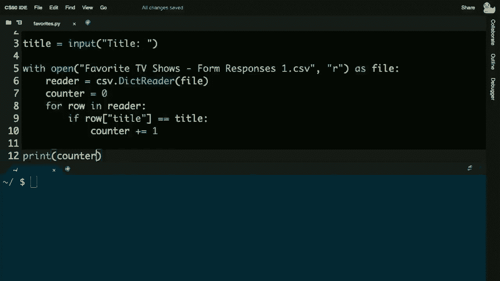

然后我只需在文件中报告其受欢迎程度。所以让我去**做**这个，用python来处理最爱的节目。让我输入《办公室》，回车。

19。现在我不记得确切的数字，但我记得。

《办公室》比那个更受欢迎，我很确定它不是19。直觉认为这个程序是。buggy，或者说似乎我做了什么，聊天中有任何想法吗？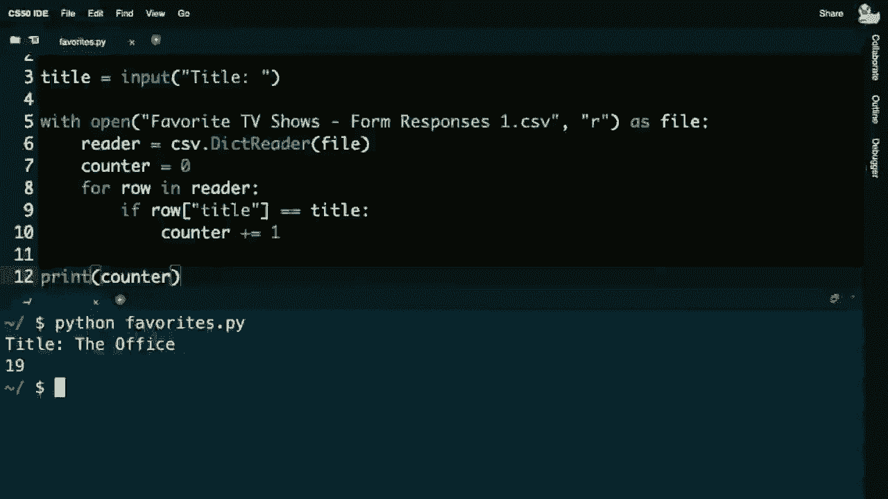

聊天中有几个人在说你需要记得处理。大写和空格问题，没错，所以我们需要练习之前学到的那些相同教训，所以我真的应该标准化人刚刚输入的内容，还有来自的输入，这在上面。

首先去掉前后空格，以防我有点马虎，按下不该按的空格键，然后让我们去，因为。大写或小写都无所谓，这样，当我这样做时，看看当前行的标题，我觉得如果我要标准化一个，我真的需要做同样的事情。

需要将其他内容标准化，现在比较两个字符串的全大写去空格版本。让我重新运行，现在我要输入《办公室》。回车，瞧，现在我在26，这我想是我们之前的地方，实际上现在我作为用户可以有点马虎，我可以说《办公室》。

我可以再运行一次，输入《办公室》。

空格键按了很多次，回车，这仍然会有效，确实我们似乎在这里过于挑剔，比如去掉空格等等。想想在相对较小的听众中，有多少人不小心按下空格键或以不同方式大写这个。

当规模巨大的时候，这变得非常重要。想象一下，当你在某些社交媒体帐户中标记朋友时，这会很重要。你不想要求用户输入大写的B、小写的r、i、a、n等等，这是一个非常常见的问题。

在我们今天使用的应用程序中，好吧，关于这个有任何问题吗？

那我想问你一个问题，*在什么意义上*这个程序设计得不好？在什么意义上这个程序设计得不好？这更微妙，但想想这个程序的运行时间，以大O的形式，这个程序的运行时间是什么，如果csv文件中有n个不同的节目或者n个不同的提交。

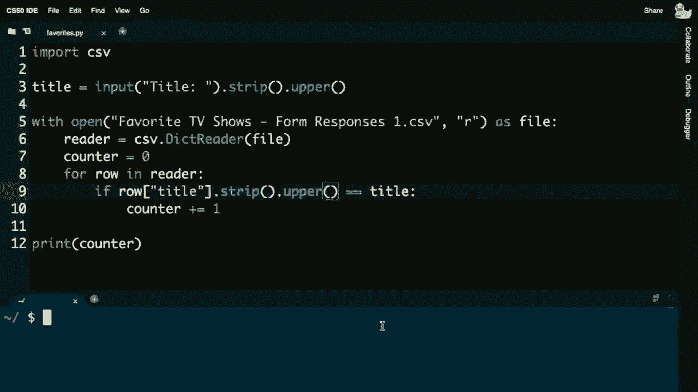

所以n是我们讨论的变量，是的，安德鲁，运行时间是什么？是大O的n，因为你在使用线性搜索，是的，它是n的O。因为我确实在通过for循环使用线性搜索，这就是c的方式。从开始一直潜在到结束，所以我。

隐式使用线性搜索，因为我没有使用任何复杂的数据。想象一下，如果我们不仅对班上的所有学生进行调查，而是对校园里的每个人，甚至对全世界的人进行调查，或许我们是互联网电影数据库imdb。可能会有大量的投票和节目。

所以，无论是在我的终端窗口还是在其他地方，写一个程序会更加优雅。

一个移动设备或者可能是在网页上，适用于你的笔记本或台式电脑。这可能不是最好的设计，*不断*遍历你数据库中的所有节目，只为回答一个问题。

从上到下，*仅仅*是为了回答一个问题。

以记录结束时间或以常量时间的方式处理事情，会更好。感谢过去几周，我们在cnn和python中看到了实践。我在这里讲的内容，实际上在某个时刻，平面文件数据库的概念开始对我们来说过于原始。平面文件数据库如csv文件。 

当你只想快速做点什么或从标准中下载数据时，它们非常有用。

便携的方式，便携意味着它可以在系统之间使用，csv文件是最简单的格式，*无论是*word、苹果数字或其他特定产品，它只是一个文本文件，因此你可以使用任何文本编辑程序或任何编程语言来访问它，但平面文件数据库并不一定是最佳的结构，最终用于较大的数据集。

因为它们并不真正适合更高效的查询，所以要搜索更好的数据库，通常被称为关系数据库，这些数据库存储数据，公平地说，这些程序使用了大量内存，它们确实会持久化你的数据，通过将数据存储在文件中来长期保存。

在你和你的数据之间，有一个正在运行的程序，如果你听说过Oracle、MySQL、Postgres、SQL Server或Microsoft Access等其他许多流行的产品，无论是商业的还是开源的，关系数据库在精神上与电子表格非常相似，但它们是通过软件实现的。

它们给我们提供越来越多的功能，使用越来越多的数据结构，以便我们能比仅使用CSV文件更高效地搜索、插入、删除和更新数据，所以我们来这里休息五分钟，回来后我们将查看关系数据库。

好的，我们回来了，现在的目标是从这些相对简单的。

从平面文件数据库过渡到更正式的关系数据库，而关系数据库确实是支持今天许多移动应用、网络应用等的基础。现在我们开始过渡到现实世界的软件和真实世界的语言，所以现在，让我介绍我们将称之为SQL Lite的东西。

因此，关系数据库是一种以行和列存储所有数据的数据库，但它不是通过电子表格，而是使用我们称之为表格的方式，因此基本上是同样的想法，但在表格中，我们获得了一些额外的功能。

使用这些表格，我们将能够搜索数据、更新数据、删除数据、插入新数据等，这些都是我们在电子表格中绝对可以做到的，但在电子表格的世界里，通常是你这个人手动点击和滚动。如果你想插入数据，通常是你手动输入的。

如果你想删除某个东西，可以删除整行或更新其中的单元格，使用结构化查询语言SQL，我们有一种新的编程语言，它通常与其他编程语言结合使用，所以今天我们将看到最初独立使用的SQL。

但我们也会看到在Python的上下文中，它本身可以独立使用SQL。SQL Lite就像SQL的轻量版，更友好，更便携，可以在Mac、PC、手机、笔记本、台式机和服务器上使用，但在手机上极其普遍。

您今天在自己设备上运行的许多应用程序都是在后台使用sqlite，所以它并不是一种玩具语言。它实际上是对通常称为sql的语言的相对简单实现，但长话短说，还有其他实现。

我已经列举了几种关系数据库，包括oracle、mysql和postgres等，它们都有略微不同的sql语言风格或方言，用于与数据库进行交互。

社区在某种程度上添加或删除了他们自己的首选特性。因此，您使用的语法通常在所有平台上是恒定的。但为了我们的目的，我们将以sql lite为标准，实际上这就是您如今在关系数据库世界中会使用的。

移动应用程序，所以这与此密切相关。使用sqlite，我们最终将能够查询数据、更新数据、删除数据等。但为了做到这一点，我们实际上需要一个程序，因此您的数据仍然存储在文件中，但现在它是一个包含零和一的二进制文件。

那些零和一可能代表文本，也可能代表数字，但这是一种比单纯的csv文件使用ascii或unicode更紧凑高效的表示方式。因此，sqlite的第一个区别是，它使用一个单一的二进制文件来存储所有数据，并通过所有这些零和一在该文件中进行表示。

这是我之前提到的表格，它们是数据库世界中类似于电子表格的概念。因此，为了与存储所有数据的二进制文件进行交互，我们需要某种用户界面程序，而sqlite被称为sql lite3，实质上是版本工具，精神上类似于任何命令。

迄今为止，您在终端窗口中运行的程序允许您打开该二进制文件并与所有表格进行交互。现在，我们再次面临一个“鸡与蛋”的问题：如果我想使用数据库，但我还没有数据库，同时又想从数据库中选择数据，我该如何加载内容呢？

您可以通过至少两种方式将数据加载到sqlite数据库中，直接导入csv。您所要做的就是将csv保存在您的mac或pc和cs50 ide上，它将自动完成。

查找所有的逗号，它将内部构建。

该二进制文件的相应行和列使用适当的零和一来存储所有信息，因此它会自动为您导入。第二种方法是实际编写其他代码，手动将所有数据插入数据库中，我们将提前进行此操作，运行sqlite3，这是。

在cs50 ide上预安装，并且在mac和pc上也不难启动。我将在我的终端窗口中继续运行sql light 3，输出。它告诉我如果我想查看一些使用提示，可以输入句点帮助，但我知道大多数命令。

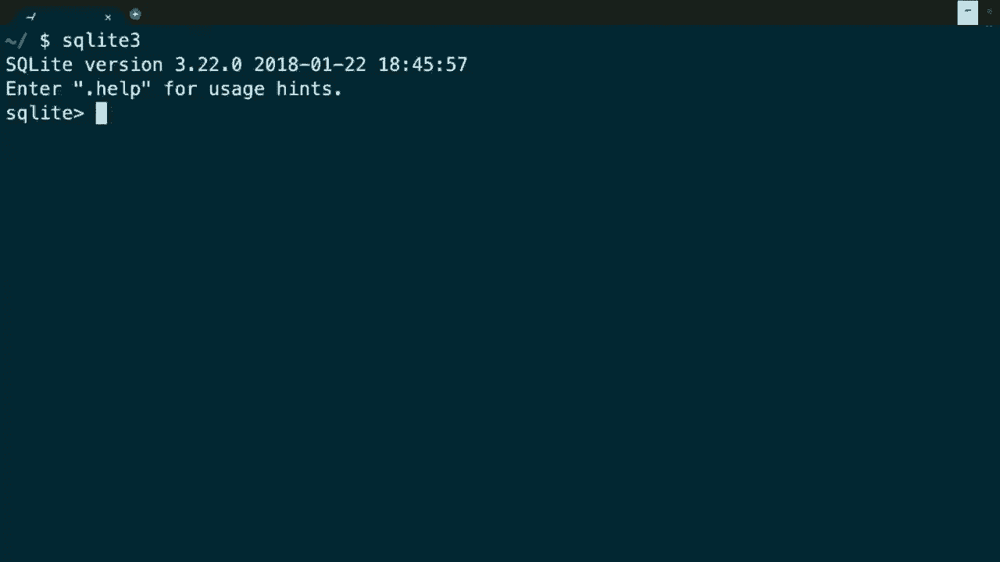

你可能需要的，事实上我们可以导入的命令之一。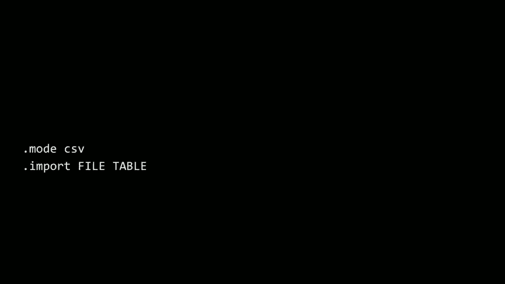

所以一般来说，你不会频繁使用这些，通常只有在第一次创建数据库时，才会使用它们，当你从现有的csv文件创建数据库时，事实上这是我目前的目标，让我将包含你最喜欢的电视节目的csv文件加载到sql lite中，形成一个合适的关系数据库。

这样我们在搜索数据和进行其他操作时可以表现得比例如大O(n)更好，因此为了做到这一点，我需要执行两个命令，第一个是将sql light置于csv模式，这只是为了将其与其他平面文件格式区分开，比如tsv或其他格式，现在我要继续执行。 

导入时，我必须指定要导入的文件名，即csv。我将继续将我的表称为shows。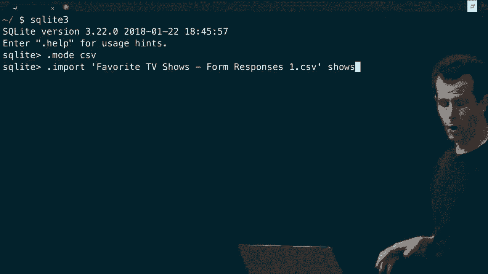

所以点导入需要两个参数，您要导入的文件名。

从该文件创建表格，再次强调，表格有行和列，明确这些列的开始和结束，我将按下**回车**，看起来速度非常快，似乎没有发生什么。但我想这没关系，因为现在。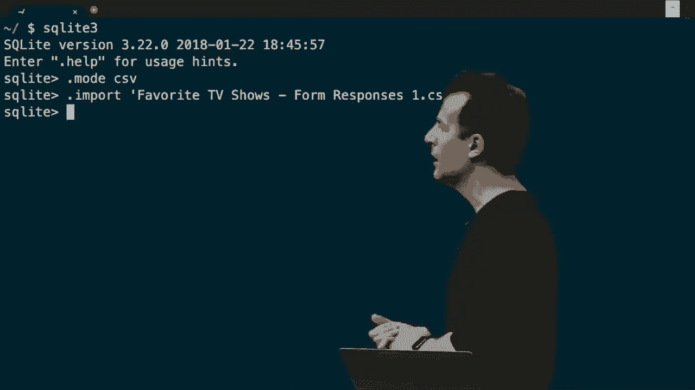

实际上操作数据的能力，但我们如何操作数据。我们需要一种新的语言，sql结构化查询语言，是sql lights、oracle、mysql和postgres及其他一些产品所使用的语言，你不需要在短时间内知道或记住它们的名字，但sql将是我们用来。 

查询数据库以获取信息并进行操作，一般来说。关系数据库以及相应的sql，作为与关系数据库交互的语言，支持四种基本操作，这些操作可以用一个简单的首字母缩略词记住。 

操作与关系数据库相关的，crud代表创建、读取、更新和删除，确实这个缩写是crud，这样有助于你记住任何关系数据库支持的四个基本操作是创建、读取、更新和删除。创建意味着创建或添加新数据，读取意味着访问并加载新数据文件到内存中。

更新和删除的意思是，如果你想操纵数据集中的数据。现在这些是任何关系数据库的通用术语，通常由任何关系数据库支持的四个属性，具体的实现是这四个功能，它们是创建和插入。

通常来说，创建更多的关键字是用来从数据库中读取数据的，更新和删除也是如此。

一种令人恼火的不一致性，术语或行业术语是 CRUD，创建、读取、更新、删除，但在 SQL 语言中你会看到这五个关键字，以便于实际对数据库进行操作，那么这意味着什么呢？

假设你想手动操作时间，那你该怎么办？在电子表格的世界里，这很简单，对吧？你打开谷歌电子表格，选择文件新建或其他，然后就可以得到一个新的电子表格，就像微软 Excel 和苹果数字一样。

文件菜单中新建电子表格或其他，然后你现在有一个新的电子表格，在 SQL 的世界里。

然而，与代码互动有图形用户界面，通过这些界面你也可以与它们互动，但今天我们将使用代码来实现这一点。在命令行程序中，结果是你可以通过运行类似的命令程序化地创建表格，所以如果你按字面意思输入语法，就像创建。

表格的名称在这里用小写字母表示，然后是括号，接着是你想创建的列名，以及该列的类型。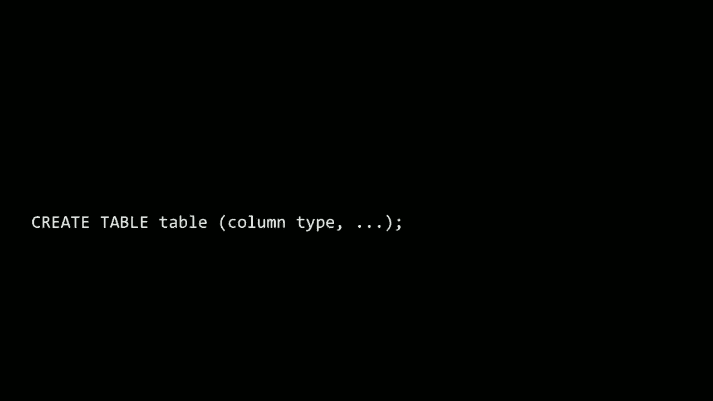

你将在这个被称为 SQL 的语言中使用，表格用小写字母表示，列用小写字母表示，是你想给自己列的名称，也许是标题，也许是类型。而点点点则意味着你当然可以有更多的列。

如果我在终端窗口输入这种命令。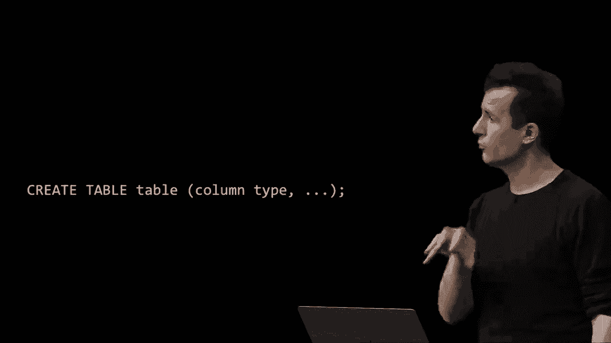

sqlite3 程序，我可以为自己开始创建一个或多个表格。实际上，这已经为我发生了，点导入命令，这不是 SQL 的一部分。在 Excel 或谷歌电子表格中，点导入只是为我自动化了某个过程，实际上它为我做的是，如果我现在输入点架构，这就是。

另一个特定于 sqlite 的命令，任何以点开头的命令仅特定于 sqlite 3 的这个终端窗口程序。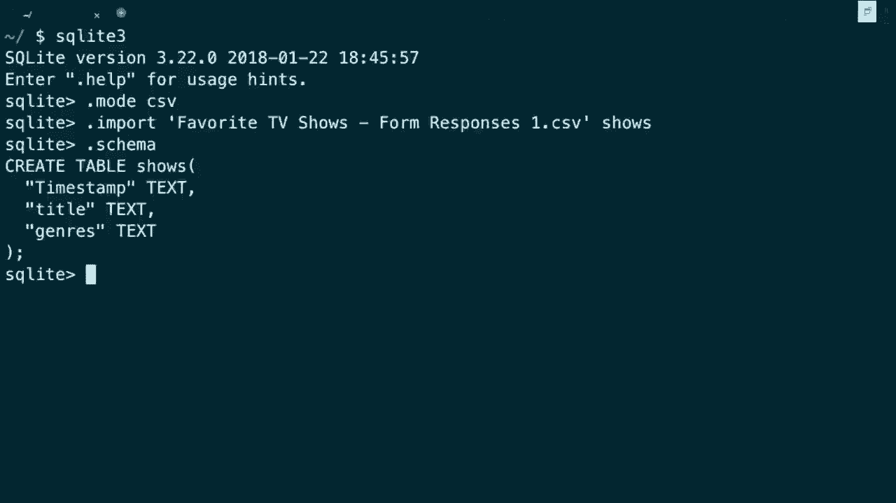

请注意，通过运行点导入，输出的表格在我称为timest*mp的数据库中，标题和类型这些列名来自哪里，实际上它们来自csv的第一行，并且它们看起来都是文本，因此这些值的类型显然是清晰的。我本可以手动输入这些，创建这三个新列。

表格称为显示给我，但再次提到的点导入命令只是自动化了，从csv中导入。
