# 哈佛CS50-CS ｜ 计算机科学导论(2020·完整版) - P15：L7- 数据库与SQL知识体系 2 - ShowMeAI - BV1Hh411W7Up

表格。

shows 等等，也就是说现在，在这个数据库中有一个文件，或者说有一个表。名为 shows，其中包含了来自那个 CSV 的所有数据。我实际上该如何获取这些数据呢，结果表明还有其他命令，不仅仅是 create。还有 select，结果表明 select 相当于 read。

从数据库获取数据，这个功能相当强大，许多数据科学家和统计学家，使用并喜欢使用像 SQL 这样的语言，来处理和。过滤数据并分析数据，使用今天对我们来说新的语法。但相对于我们见过的其他东西，这个语法相对简单，SQL 中的选择命令让你。

从你的表中按照给定名称选择一个或多个列，我们稍后会看到这一点。那么我该如何进行呢，让我继续。

在我清除完这个之后，让我继续选择。

假设从 shows 中选择标题，分号，那我为什么要这样做呢。

选择命令，更多列，然后是字面上的介词 from，接着是你想要选择的数据的表名，列名叫。标题，这就意味着 select，title from shows 应该会给我返回我想要的数据。请注意一些风格选择，这并不是严格要求的，但却是好的风格。

按照惯例，我会将任何 SQL 关键字，包括 select 和 from 首字母大写。在这种情况下，然后将任何列名或表名小写，假设你创建了。那些列和表，实际上是小写的，还有其他不同的惯例，有些人会使用大写，有些人使用类似的方式。

但一般来说，我会鼓励，对于 SQL 语法使用全大写，而列名和表名使用小写，输入，值，从数据库输出，如果你。回想一下，你可能会意识到，这实际上是与之前相同的顺序。因为 CSV 文件是，从上到下加载到这个同一个数据库表中。

相同的数据，重复和错误的大写，以及奇怪的空格。但假设我想查看 CSV 中的所有数据，结果表明你可以选择。标题，但也许时间戳是感兴趣的，这个显然是大写的，电子表格。这不是我手动选择的，因此如果我只使用一个用逗号分隔的列表。

列名，注意我现在能做的事情，对于我们人类来说有点难以看清。因为现在有很多事情在进行，但请注意，在左边的双引号中，有所有的时间戳，表示你们提交你们最喜欢的节目的时间，而在逗号右侧还有另一个，被引号的字符串。

那是你喜欢的节目的标题，尽管sqlite在仅是单词（如friends）时会省略引号，这只是一个约定。事实上，如果我想获取所有列，结果发现有一些简写语法可以做到这一点。

这将让我获取我的表格中从左到右的所有列，瞧，现在我可以看到流派。所以现在我实际上有三列在输出，非常有用。到目前为止，我所做的只是处理csv，但sql很强大，因为它自带其他功能，有点类似于函数和excel。

但现在我们可以最终在计数、唯一值、转小写、最大值、最小值和转大写等函数中使用它们，还有很多其他功能。这些都是内置于sql中的函数，可以作为查询的一部分使用，以某种方式在从数据库返回数据时，改变数据的格式。

所以例如我关心的就是我的唯一标题，我们不得不写所有那些烦人的代码，使用集合并将内容添加到集合中，然后再次循环，这确实不算大量代码，但我们花了五到十分钟才能完成工作。在sql中，您可以将所有内容放在一行中。

选择不仅仅是从节目中提取标题，让我去**选择唯一值**。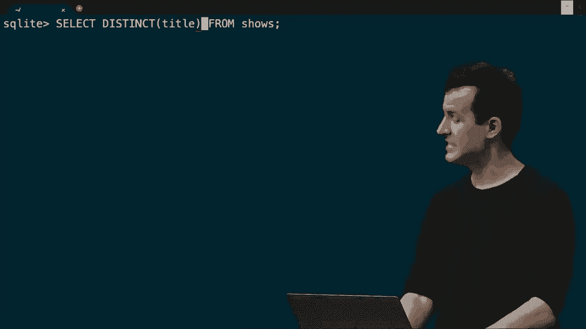

从节目中提取标题，因此再次，唯一值在sql中是一个可用的函数，它的功能正如其名称所示。

过滤掉所有标题，只给我返回唯一值，因此如果我现在按回车，你会看到一个类似的混乱列表，但不包括那些不看电视的人的标题。包含这些标题的未排序列表，所以我认为我们可以开始像之前一样整理这个东西。让我去**选择**，不仅仅是唯一值，让我去**选择**。

还要将所有内容转为大写，我可以使用转大写作为另一个函数。注意，我只是将一个函数的输出嵌套到另一个函数中。让我现在按回车，现在看起来更标准化，因为我对所有内容都进行了大写处理，但似乎事情仍然不太。

排序仅是您输入它们的相同顺序，但没有，sql有其他语法可以使我们的查询更加精确和强大。因此，除了可以用来改变返回数据的这些函数外，您还可以使用这些类型的子句。

在sql查询中，您可以说“where”，这相当于一个条件。

你可以说选择所有这些数据，条件是某些东西是真或假，你可以说像“where”，也可以说给我一些不完全是这样的数据，而是像这样的。你可以按某一列排序数据，可以限制返回的行数，并可以以某种方式将相同的值分组。

让我们看看几个例子，如何选择标题。来自shows表，标题等于，我添加了这个，标题等于引号中的“the office”，所以SQL在精神上与Python类似，或许比C更用户友好。尽管它有点。

精确且更简洁，让我去**并按下回车。瞧，这就是你们输入“the office”的数量，但注意并不是所有人都是这样，我们仍然缺少一些。似乎我只得到了那些字面上输入了“the office”大写T和大写O的人的结果。那么如果我想更加宽容呢？

好吧，让我返回任何你们输入的“office”，也许你省略了“the”这个冠词。所以让我去**并说标题不等于office，但让我去**并说标题是“office”，我想允许末尾有一些内容。尽管这在上下文中似乎有些不一致。

使用像另一个通配符一样的字符，即百分号（%），在左侧。这个百分号表示零个或多个字符在右侧。所以这是一种通用的方式，可以找到所有包含o-f-f-i-c-e的标题。结果表明，like是大小写不敏感的，所以我甚至不需要。

现在让我们不必担心大小写的问题，按下回车，瞧，我得到了更多的答案，你可以真正看到这里的杂乱。注意上面，有人使用了小写字母，快速输入时这往往是常见的，有人确实在这里使用了小写字母，并且还给我们。

在结尾有一个额外的空格，有人只输入了“office”，结尾有一个空格。所以这里有很多变化，这就是为什么当我们强制所有内容时，我们能够消除许多冗余。那么实际上，让我们去**并排序，所以让我返回选择，distinct，upper of title。

从shows中，现在让我按新的子句进行排序，标题的大写版本。所以现在注意这里有一些事情在进行，但我只是在构建更复杂的查询，类似于Scratch的学习，我们只是开始不断地向一个问题抛出更多的拼图块。我选择所有不同的大写标题。

从shows表中，但这次我要按标题的大写版本来排序结果，所以所有内容都将是大写的。然后将按字母顺序从A到Z排序，现在按下回车，事情会变得更容易理解，注意，引号只有在。

标题中有多个单词，但注意这些是所有节目，以及m's，l's等等，确实是按字母顺序排列的，感谢使用按顺序排列。好吧，让我暂停一下，因为我知道一下子有很多内容，到目前为止对选择、去重、上层表名、where子句、order by子句有任何问题吗？

这很快，但一般来说，它表达了我们已经看到的各种问题。布赖恩，你那边有什么吗？没有人举手，好吧，让我们开始解决更多类似的问题。现在在SQL中，之前在Python中，如果我想实际计算。将所有相同的节目合并，找出所有相应的计数，好吧。

让我继续尝试这个，让我继续选择一下嗯。标题的大写版本，但我这次不会做不同的选择。我将选择标题的大写版本，计数那些标题的出现次数，所以把它视为一个新的关键词，现在，什么。

计数，嗯，如果你想象这个表有很多标题，标题，标题，标题，标题，能够将相同的标题分组在一起，然后实际计算有多少个这样的标题，我们可以说。按大写标题分组，这告诉SQL将所有的大写标题分组。

一起将多个行合并为一行，但保持标题的计数。按回车键，你会看到非常类似于左侧写的所有标题，后面跟着一个逗号，后面是计数，因此你们中有一个人真的喜欢《猫和老鼠》，而有一个人真的喜欢《顶级车》。不过，如果我向上滚动，有两个人真的喜欢《线人》。

在场的你们中有23人喜欢《办公室》，尽管我们还没有处理这个问题。因此，如果我们想的话，可以通过修剪空格进一步合并。但现在我们得到这些计数，嗯，我该如何继续排序呢？就像我们之前做的那样，让我继续这里，按标题的计数排序，然后点分号，现在。

现在注意，就像在Python中，所有内容都是从最小到最大。

在底部，我该如何修复这个呢？结果发现，如果你能将事物按降序排列。d-e-s-c是缩写，而asc是默认的升序。所以如果我以降序排列，现在，我必须一直向上滚动到最顶部，看看行从哪里开始，哎呀，如果我一直向上滚动到开头。

在这里，现在如果我想，哎呀，我这样做对吗？抱歉，我不想这样，哦，来吧。按计数降序排列，现在让我继续，这看起来有点太笨重了，让我限制自己到前10个，只看前10个值，瞧，现在我有《权力的游戏》33。

在 26 的办公室和 23 的朋友们，不过我觉得我仍然遗漏了一些，布莱恩，你记得修剪前导和后导空格的序列函数吗？我想就是 trim，trim，好吧，我自己不记得了，所以如果有疑问，就修正它。让我继续前进，选择大写的内容。

现在输入，瞧，谢谢布莱恩，所以现在我们达到了我们的。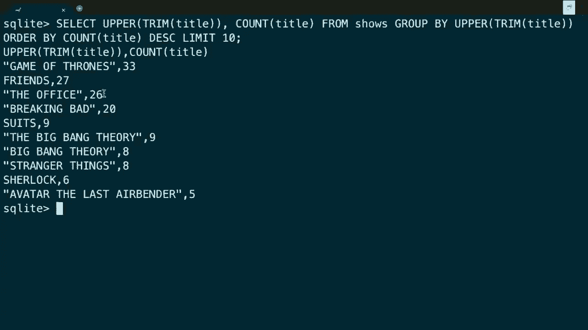

这里有 26 个办公室，总之，我们花了一些时间才到达 SQL 的这个故事节点，但请注意，我们做了什么，我们把一个程序浓缩成了几分钟，并且确实是十几行代码，浓缩成了一个新的语言。

但这只是一句简单的说法，一旦你对一种语言，比如特别是 SQL，感到舒适。如果你不是计算机科学家，而是数据科学家或某种分析师，整天查看财务信息、医疗信息或任何可以加载成行和列的数据集。

一旦你开始说。

人类可以阅读 SQL，你能开始表达一些非常强大的查询，你的答案。通过使用像这样的命令行程序。

结果在这里，尽管只是非常简单的文本，但如前所述，还有一些商业软件也支持 SQL，你仍然可以输入这些命令，然后它会以更用户友好的方式显示给你，就像 Windows 或 Mac OS 默认那样。

所以现在关于选择语句的语法或功能有什么问题吗？关于选择的任何问题。布莱恩，你那边看到什么了，一个问题来了，数据实际存储在哪个文件里？这是个好问题，文件实际存储在哪里？在退出之前，我可以实际保存这个。

文件可以用我想要的任何名字保存，文件扩展名通常是 db，实际上布莱恩，你介意检查一下手动写文件的语法吗，.something。我想是 .save，后面跟着文件名 .save，所以我会称之为 shows。

嗯，输入数据库，现在如果我再打开一个终端窗口只是为了演示，哎呀。

抱歉，关闭整个东西，如果我现在要继续打开另一个 ls。你会看到我现在有一个 csv 文件，我有之前的 python 文件，我创建的那个是包含表格的二进制文件，我动态加载的表格来自那个 csv 文件。关于选择查询或其他任何问题，布莱恩，有几个。

人们在询问这个的运行时间，是的，非常好的问题，运行时间是什么。我会回到这个，好的，现在诚然是大O符号为n。我实际上还没有做得比我们之前的csv文件或python代码更好，现在默认仍然是大O符号为n，但还有。

这会是一个更好的答案，这将使其更具对数性质，所以让我回到这个特性，当时机成熟时再启用它。实际上，让我们开始朝着那个方向迈出一些步骤，因为事实证明。在加载数据时，我们并不总是有奢侈的机会，只用一个大csv文件。

导入我们使用的格式，我们需要提前决定如何存储数据，以及我们想存储什么数据，关系是什么，跨越的不仅是一个表，而是多个表。所以让我继续，运行另一个命令。

实际上引入了第一个问题，让我去选择，从节目中选择标题，其中流派等于例如喜剧，那是其中一个流派。注意我们返回了很多结果，但我敢打赌我漏掉了一些，我快速浏览这些。可是我打赌我遗漏了一些，因为如果我检查流派等于喜剧，我遗漏了什么。

好吧，那些勾选了多个选项的人可能会说某个节目是喜剧和剧情，或者是喜剧和浪漫，或者其他几种流派的组合。如果我在这里搜索相等，等于喜剧，我只会得到你喜欢的那些节目，你只说我最喜欢的电视节目是喜剧。如果我们想做些别的事情。

比如喜剧，我们可以说，只要包含“喜剧”这个词，就应该返回更多结果。让我明确一下，确实我现在有一个更长的结果列表，现在我们有所有的节目，你至少勾选了喜剧选项。但不幸的是，这开始变得有些杂乱，因为回想一下选择。

来自节目的流派；注意这个表格，流派列表，这就是谷歌的方式。对于sql来说，这样是可以的，但这有点混乱。一般来说，在sql数据库中存储用逗号分隔的值列表并不是你应该做的，使用sql数据库的整个意义就在于此。

是从逗号和csv中转移，实际上更干净地存储信息。因为让我提出一个问题，关于喜剧，但也许还有音乐。这样就能让我找到任何节目，其中包含“音乐”这个词在逗号分隔的列表中，这里有一个微妙的bug，你可能。

我得回想一下，你提到的地方，我不能在这里展示全部内容，但我们有传记。省略号音乐视频与音乐剧截然不同，这两种类型是不同的流派，但请注意我目前的提问。这里存在的问题是什么，以及，音乐剧，这就是事情的所在。

现在变得混乱了，是的，你知道，我们可以稍微清理一下。也许我们可以在这里放一个逗号，这样它不能只是，音乐某些东西，它必须是音乐逗号。但是如果音乐是你选中的最后一个框，那么就是音乐。那里没有逗号，所以现在我需要，把东西结合起来。

所以也许我得做一些，比如，我们的音乐像这样，或者，类型像所谓的音乐。

像这样，但老实说，这只是，变得凌乱，这样设计得很糟糕，如果你只是将你的，内容存储在一列中，而不得不 resort 这种。黑客方法来弄清楚，或许在这里或那里，或这里，考虑所有语法的排列组合，你做错了，你没有使用一个。

完全利用sql数据库的潜力，那么我们该如何设计这个。东西更好，实际上加载这个csv，简短地说，我们如何摆脱那些愚蠢的逗号，在类型。列中，而是将一个词放入那些单元格，换句话说，不是两个，不是三个，只有一个，类型。那么让我介绍几个建筑，块帮助我们达到目的。

事实证明，在sql中，当你想要，创建自己的表时，我们可以，抱歉。事实是当你自己创建时，我们需要的不仅仅是，阅读。但是如果我们想更好地做到这一点，而不仅仅是使用sqlite 3的。内置的点导入命令，而是，我们要写一些代码，表。

一个用于标题，一个用于类型，我们需要更多的表现力。谈到sql，所以为此我们需要一个。创建我们自己表的能力，我们之前见过这一点，但。我们还需要看看另一个，语法的部分，因此插入也是另一个。

你可以，实际，向数据库添加数据的命令，这很好，因为如果我想。最终遍历那个相同的csv，但这次手动添加所有的，行到数据库。自己，那么我将需要一些，是，表，您想要插入值的列或列，然后字面上是单词值，然后，字面上在括号中。

实际的值列表，因此这是一个，通用形式。

只是，这里稍等一下，当涉及到将某些东西插入数据库时。让我们继续尝试一下，比如**木偶秀**，就像我在70年代成长的那样。我认为它不在列表中，但我可以确认这一点，所以，选择所有内容从节目中，其中，标题像我们只是搜索一下，*muppets*，带一个通配符，我猜没有人把它放在那儿。

好的，所以这是一个错失的机会，我，忘了填写表单。我可以回去填写表单，并重新导入csv，但让我们继续，插入到节目中。哪些列，标题和类型，为了好玩，然后我将插入什么值，*无论现在是什么时候*，所以我要作弊，标题将是像**木偶秀**这样的。

类型将是它有点像，嗯，类型。

就这样留下分号，所以这遵循标准语法，指定你想插入的表，插入的列，以及你想放入的值。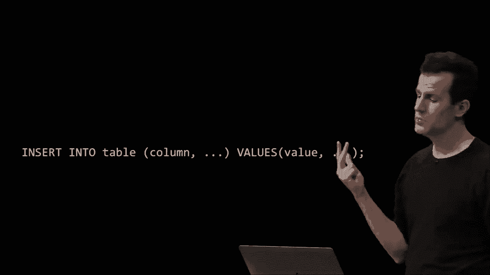

那些列，我现在要去啊**d，按下回车，现在似乎没有发生什么，但如果我。现在选择，哦，好的还是没什么，因为我犯了一个小错误。嗯，我不是在搜索 muppets（复数），我在搜索 muppet，看看我的。行在这个数据库中，因此插入将使我们现在能够插入新的数据。

将行插入数据库，假设你想更新某些内容，也许你知道。某些木偶节目实际上非常戏剧化，那么我们该如何做呢？嗯，我可以说更新 shows 设置，看看类型等于喜剧、戏剧、音乐剧，条件是。标题等于木偶秀，所以我再次提取经典版本。

语法稍后会讲，但现在只是一个小提示，你可以非常简单地更新内容。尽管需要一点时间来适应语法，但它确实如所说的那样工作，更新。shows 设置类型等于这个，条件是标题等于那个，现在我可以去啊**d，输入。如果我继续选择同样的东西，就像在终端窗口中一样，你可以快速向上滚动。

我只是在上下滚动以前的命令，瞧，现在我看到木偶秀是一个喜剧，一个戏剧，戏剧和音乐剧，不过，我对列表中更受欢迎的节目有些意见，你们中有很多人喜欢，嗯，假设是朋友，我从来没有真正喜欢过，让我去啊**d，选择。一个标题从 shows 中。

标题等于朋友，也许我应该更严格一点，我应该说标题。就像朋友，以防有不同的大小写出现。很多人真的很喜欢朋友，实际上你们中有多少人还记得我。可以做到这一点，我可以说计数，并且我可以让续集为我计数。

你们中有 26 个人我强烈不同意，还有几个人甚至在后面添加了内容。那么假设我对此有异议，嗯从 shows 中删除，标题等于引用的朋友，实际上标题类似朋友，来吧把它们都找出来。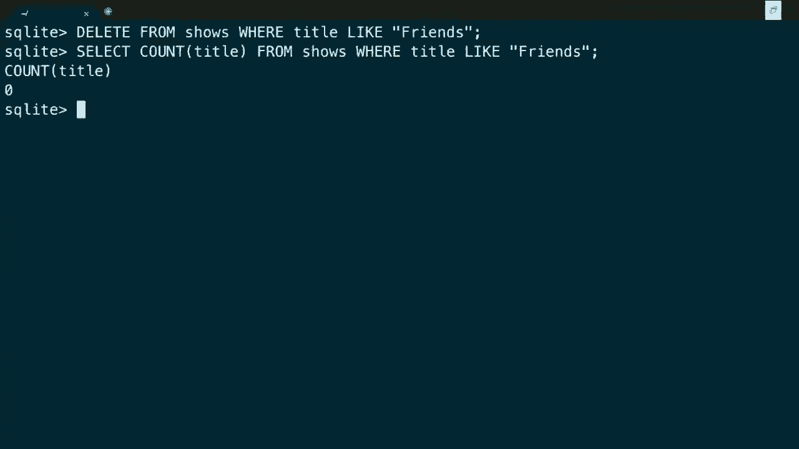

输入，现在如果我们再次选择，抱歉，朋友已经被取消了，所以你可以再次。更新你可以执行这些基本的 CRUD 命令，创建、读取、更新和删除，选择。通过字面意义上的更新和删除来实现，而就这些而言，即使这很快，确实只是这四个基本操作。

在 SQL 中，一些附加功能，比如这些额外的函数，比如计数，你可以使用，还有类似的功能，嗯，让我提议我们现在做数据。创建表并插入数据，让我们开始吧，啊**d，自己写点代码。

python 脚本使用 sql，以循环的方式读取我的 csv 文件，并逐行手动插入，因为老实说，这样手动输入数百条 sql 查询将花费我太多时间。为了将你的所有行导入到一个新的表中，我将这样做，并建议我们设计。

以以下方式进行，我这次将有两个表。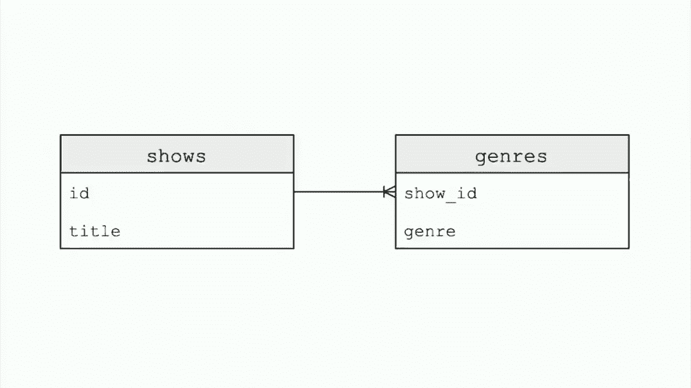

renditions，其中一个将被称为 shows，另一个将被称为 genres。这是设计关系数据库的基本原则，以弄清楚数据之间的关系，并规范化你的数据。规范化你的数据意味着消除冗余，规范化你的数据意味着消除对相同词汇的多次提及，*****。

*****，我的意思是，我将建议我们创建一个更简单的表，称为 shows，只有两列，一列将被称为 id，这是新的，另一列将像以前一样被称为 title。老实说，我不在乎时间戳，所以我们将把那个值丢弃，这也是自己编写的一个好处。

对于 id，我引入了这个，它将是一个唯一标识符，字面上是一个简单的整数，从一、二、三一直到十亿。我将让它随着我们进行而自增，为什么？我建议我们转到另一个表。

拥有一到三个或五个类型的列表，这在某种意义上是愚蠢的，因为这只是杂乱无章，这意味着我必须运行愚蠢的命令，检查这里的逗号，那里也有逗号，这非常 hackish。我将创建另一个表，它也有两列，一列将被称为 show id。

另一列将被称为 genre，而这里的 genre 只会是一个单词。那一列将包含单词，例如 comedy、music 或 musical，但 genres 将与它们所属的原始节目相关联，根据你的 Google 表单提交。通过在这里使用这个 show id，这具体意味着什么。

通过向我们的第一个表 shows 添加这五、六，我现在可以以非常高效的方式引用同一个节目，使用一个非常简单的数字，而不是冗余地写出 the office、the office、the office，只需一个规范的数字，这个数字只会是四个字节或 32 位，效率很高，但我仍然可以。

将这个节目与一个、两个、三个或更多类型关联，甚至没有。这个表将变成我们新的一对表中的一行或多行，我们正在将类型提取出来，以便我们可以为每个节目添加多行，但仍然将这些类型重新映射回原始节目本身。那么，这些流行词是什么呢？

这里或者说一下我们有哪些语言，哪些种类，类型可以使用。为此我想提到，在SQLite中有五种主要的数据类型，这些数据类型中有一些看起来很熟悉，还有一些稍显奇怪。

整数是一个东西，而实数和浮点数是相同的。因此，一个整数可能是一个32位或四字节的值，负数，一个实数将会有小数点，一个浮点值，通常默认是32位，但这些类型的大小因系统而异，就像它们支持。

从技术上讲，在C中也是如此，因此它们在SQL世界中因系统而异，但一般来说，这些都是很好的经验法则，文本就是这样的，它是某种长度的字符串的等价物，但在SQLite中，似乎还有两种我们之前没有见过的数据类型，数字型和blob。

但是稍后会详细介绍这些。可以在数据库中存储零和一，数字型将是某种类似数字但不完全是数字的东西，比如年份或时间。某些有数字的东西但不是简单的整数，然后我们提出两个，SQLite将允许我们手动指定，通过自己执行SQL代码。

可以指定某一列，不能为null。到目前为止我们一直忽略这个，但你们中的一些人可能已经选择不提供，节目或类型的标题。你的答案可能是空白，你们中的一些人，在注册网站时，不想提供信息，比如你住在哪里或你的电话号码。

空值，但你可能想说，它不能为null。一个网站可能需要你的电子邮件地址，需要你的密码和其他几个字段，但不是所有字段。而且在SQL中还有另一个关键词，叫做unique，你可以在想确保同一个。

电子邮件地址不能多次注册你的网站，你只需指定电子邮件列。多个用户，长话短说，这只是我们SQL工具包中的更多工具，因为我们现在会间接看到其中一些，而在设计我们自己的表之前，我们需要的最后一个术语是SQL的主键概念。

外键，我们在电子表格中没有见过，除非你在真实世界中工作了几年。

在前面有相当复杂的电子表格， odds are 你可能没有以相同的方式看到键或唯一标识符。

但它们实际上相对简单，让我回到之前的图示，提出当你有两个这样的表时，你想用一个简单的整数来唯一标识。这被称为，技术上是一个ID，按惯例我会称之为。你可以称它为任何你想要的东西，但ID只意味着这是，一个唯一标识符，但在语义上，这个ID就是。

称为主键，主键是一个表中的列，唯一标识每一行。这意味着你可以在标题字段中有多个版本的《办公室》，但每一行将有自己的唯一编号。因此主键唯一，就像我建议我们马上创建的类型一样，参考。

通过那个唯一标识符，称为外键，虽然我在这里称它为显示ID，这在很多SQL数据库中是一个约定，意味着这是技术上在一个表中称为ID的列。叫做显示或复数形式的显示，因此如果这里是数字一，假设。

办公室有一个唯一的ID为一，在这个表中我们会有一行，ID为一。在喜剧类别，剧情类别，输出三行，分别是第一、第一、第一，喜剧。所以再次强调，这里的目标是设计得更好。不要在单一列中有愚蠢的逗号分隔值列表，我们想要。

一种将其拆分为单独行的方式，你可能会想到，列。但根据我们的原则，来自电子表格，你不应该习惯性地增加更多和更多的列，当数据都是相同的，比如类型类型类型，没错，这在电子表格中是一种愚蠢的做法，类型一个，再添加一个叫做类型二的列。

一列叫做类型三，类型四，你可以想象这有多愚蠢和低效。很多这样的列将会为空，对于那些类型非常少的节目来说，这显得有点杂乱，因此在关系数据库的世界里，更好的是。拥有一个第二个表，那里有多行，某种方式链接回。

通过我们所称的概念上，一个外键来实现主键，所以让我们现在继续，尝试写这个代码，让我回到我的IDE，让我退出SQL Lite。让我稍微移动一下我的文件，暂时移开，让我们只保留原始数据，开始实现我的Python文件的最终版本。

被称为，显示一个叫做类型的表，然后在一个循环中遍历那个CSV，并插入一些数据到显示中，其他数据到类型中，我们如何以编程方式做到这一点。好吧，我们还需要一个拼图的最后一部分，我们需要某种方法来连接Python和SQL的世界，在这里我们确实需要一个库，因为它。

如果没有库，这将会非常痛苦，cs50s如我们所见，使得这变得非常简单。还有其他第三方商业和开源库，你也可以在现实世界中使用，它们做的事情相同，但语法就不那么友好了。所以我们将首先使用cs50库，记得在python中有函数。

像getstring、getint和getfloat，out。

也为sql能力，所以我将回到我最喜欢的文件。我不仅要导入csv，还要从cs50库中导入一个功能。你将在cs50库中找到这个，或者说是sql，如果我调用它，它将允许我。

将一个sql lite数据库加载到内存中，那我该怎么做呢？让我继续添加几行新的代码，让我继续打开一个名为shows.db的文件。但这次以写模式，然后，为了好玩，暂时我会。以一种pythonic的方式创建一个空文件，这看起来有点傻。

但通过以写模式打开一个名为shows.db的文件，然后立即关闭文件。我现在有一个空文件可以进行交互。我也可以通过执行这个touch shows.db，这个命令有点奇怪。

但在终端窗口中，它意味着创建一个文件，如果它不存在。所以我们也可以这样做，但那将是独立于python的。所以一旦我创建了这个sqlite数据库，我将声明一个名为db的变量，用于数据库，我将使用cs50s库中的sql函数。

我将通过一些有点神秘的字符串打开这个sqlite数据库，sqlite://shows.db，现在看起来像一个url，http://，但它是sql lite，而有三个斜杠而不是通常的两个，但是。

结果是，目前还没有内容，作为一个sqlite数据库，使用cs50s库，为什么我这样做？好吧，我这样做是因为我现在想要创建我的第一个表，让我继续执行db。execute。所以在cs50 sql库中有一个名为execute的函数。我将继续运行这个，创建一个名为shows的表，其类型为。

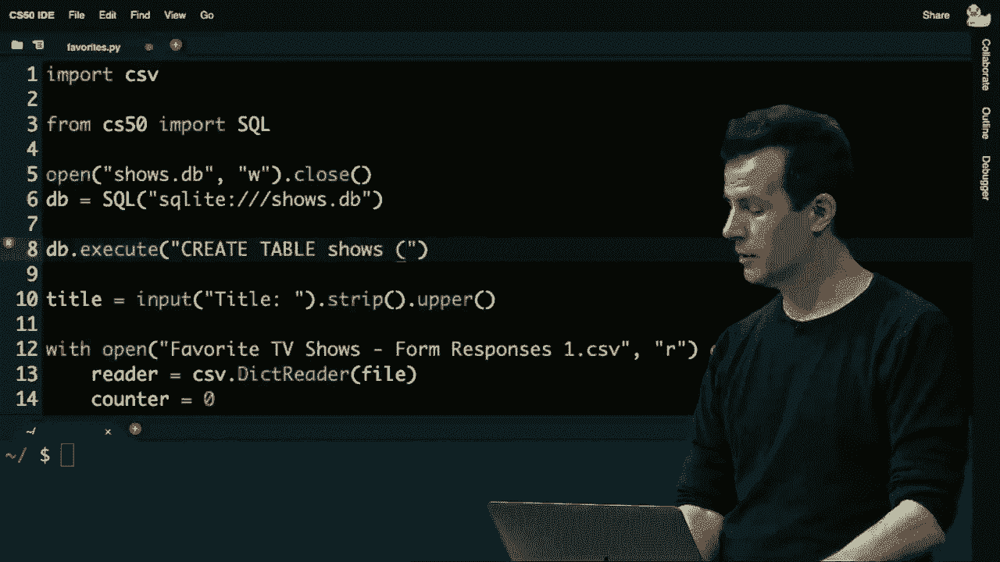

它的列有一个id，它将是一个整数，一个标题，它将是文本，主键将是id列，所以这有点神秘，但让我们看看发生了什么。我似乎现在在第8行将python与sql结合在一起，这就是编程变得真正强大、花哨、酷和困难的地方，随你怎么理解。

我实际上可以在一种语言中使用另一种语言，SQL只是一堆文本命令。直到现在，我一直在手动输入它们，轻松一点。不过没有什么阻止我使用字符串，然后将它们传递给数据库，使用代码，我使用的代码是一个名为`execute`的函数，它在CS50中的作用是传递参数。

从你的Python代码中执行到数据库，这就像是以编程的方式手动在SQL Lite提示符下输入几分钟前的命令。因此，这将去创建一个名为shows的表格，我将存储所有唯一的id和标题，然后让我再次执行`db.execute`。

创建表格genres，它将有一列叫做show id，类型为整数，还有genre，类型为文本，最后它将有一个外键，引用show id，指向shows表的id。好吧，这信息量很大，让我们从左到右回顾一下。

`db.execute`是我执行任何SQL的Python函数，创建表genres，创建一个名为genres的表格，该表格的列将有一个叫做show id的整数和一个文本字段genre，但它将是一次一个genre，而不是多个，然后在这里我指定一个外键，即show id列。

它正好指向shows表，Brian，交给你了，没关系。哦，好的，我刚刚修复了这个bug，是的，Brian在秘密解决这个问题方面很不错。好吧，我知道有什么地方不对，好的，所以这有点晦涩。

但这一切只是实现了在这里，我本可以手动输入两个SQL命令！

在那个闪烁的提示符下输入这两个SQL命令，但我想写一个程序，现在用Python为我创建表格，更有趣的是将数据加载到数据库中。所以让我们继续，我不打算从用户那里选择一个标题，因为我想导入所有内容，我不会使用任何计数或。

任何这样的东西。所以让我们继续，像以前一样进入我的循环。这次让我们继续，从reader中获取当前标题，像往常一样，但也让我们继续去掉空格并大写，以便规范化，执行`db.execute`，插入。

shows表中的标题列的值为“标题”，所以我想在这里放入标题。事实证明，像我们的SQL库支持一个占位符。在C语言中我们用`%s`，在Python中我们用“”，在SQL中我们有第三种方法，概念上是相同的，你放置一个问号在你想放置占位符的地方。

然后在这个字符串外面，我实际上会输入我想要插入那个问号的值，这与第一周的`printf`非常相似。现在，接着是你想为那些占位符插入的参数的逗号分隔列表。现在这行代码16已经将所有这些值插入到我的数据库中。

让我继续，啊**d，做这个，我现在要运行python。一个喜欢的停止点，心中祈祷，一如既往，正在加载，正在加载。这是因为那里有一个相当大的文件，或者我搞砸了。等这个太久了，我做错了什么，好的，这显然花费了太长时间。

它变得越来越大，哦，好吧，我应该更有耐心。好了，看来我的连接有点慢，所以，嗯，正如我预期的一切都是100。正确，并且运行良好，所以现在，如果我输入ls，请注意我有一个名为shows.db的文件。这是全新的，因为我的python程序创建了它。现在，让我们继续运行sqlite3。

在其中，我注意到我可以做。schema只是查看，表是否存在。但请注意，如果我执行选择，星号从shows，让我们看看所有数据。瞧，已经程序性创建了一个表，这次注意没有时间。st*mps，没有类型，标题，id。

从1开始单调递增到513，这种情况为什么会这样？那么你在sql数据库中获得的一个特性是，如果你将一列定义为主键，在sql lite中，它将为你自动递增。请记住，在我的代码中，根本没有一行是整数。

输入一个然后是两个然后是三个，我完全可以做到，我可以这样做。计数器，实际上我可以这样做，计数器等于一。然后在这里我可以说id，逗号标题，给自己两个占位符。然后每次传入计数器，我可以自己实现这个。

然后在每次迭代中，计数器加一，但正如我们所见，在sql数据库中，你会得到更多内置的功能，我不必做任何事情，因为如果我已经将该id声明为主键。

sqlite将为我插入它，所以，如果我回到sql lite，请注意我确实有id和标题，但如果我选择星号，还没有。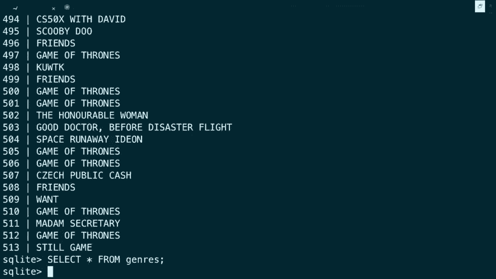

那么我现在如何获取每个节目的所有类型，我需要完成我的脚本。当前行中只有标题，但我也有当前行中的类型。但是类型是用逗号分隔的，回想一下在csv中，每个标题旁边都有一个逗号分隔的标题列表。那么我该如何访问每个类型呢？假设对，类型在行括号中。

但是这行不通，因为不会基于这些进行分割。实际上，正如上周所看到的，我们需要对字符串中的所有字符进行迭代。但事实证明，Python中的字符串有一个华丽的分割函数。我可以在逗号后面跟一个空格进行分割，而这个函数将为我在类型中执行。

并且可以说会将其分割，在每个逗号和空格上，将其转换为包含类型的Python列表。现在我可以对这个单独类型的列表进行迭代，在这里我可以执行db执行插入到类型中，节目ID类型的值，问号问号。

嗯，有个问题，我肯定可以将当前的某些东西插入这里，仍然需要第一个问号的值，我怎么知道当前电视节目的ID是什么呢？事实证明，库可以在你向有主键的表插入新行时提供帮助。

大多数库会以某种方式返回你这个值，如果我回到第15行，实际上在使用插入后存储db执行的返回值，库会告诉我刚刚为这个给定的节目使用了哪个整数，可能是123，我不需要知道或者关心。

程序员，但我可以将返回值存储在一个变量中，然后在这里我可以直接放置那个相同的ID，这样如果我输入的办公室ID是1，并且其类型是喜剧、戏剧、爱情，我可以在这个嵌套的for循环中，一次插入喜剧、爱情的三行数据。

让我们回到这里，呃，在我的终端窗口，让我删除旧的shows.db，使用rm命令以重新开始。让我继续重新运行，呃，python favorites.py。这次我会更加耐心，因为云端有点慢，所以它正在思考，实际上现在正在进行更多的工作。

在故事的这个时刻，我的程序正在CSV中插入行，并且正在将一个或多个类型插入到类型表中，让它在那里处理一下。它有点慢，如果我们在更快的系统上，或者在我自己的Mac或PC上，它可能会更快。

更快地下降，但你可以在这里看到我为什么最初使用点导入命令的一个例子，它自动化了这个过程的一部分，但改变了我的数据格式。但关键要点是，尽管一次插入几百行花了一些时间。

我只需要做一次，刚才有问过关于性能的事情，事实证明现在我们完全控制了SQL数据库，因此我们有能力提升其性能，而我真的不想继续。

这里我只是想让这个事情完成，我应该使用一个需要的时间。几乎在其他系统上所需的时间一样，但让我再拖延几秒钟。拖延拖延拖延拖延，好吧，让我暂停我们的悬念，利用这个时间，让我切换到，哦，好的，正如预期的那样，它正好完成了。

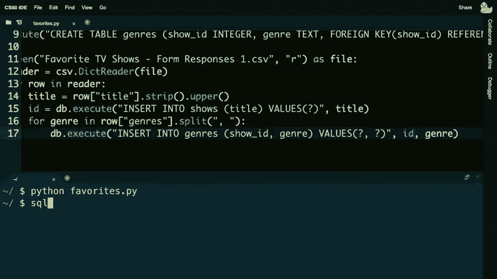

在shows.db上亮灯3。好的，现在我回到了我的原始SQL环境，之前的操作。如果我从shows中选择星星，其中标题等于所谓的《办公室》，我将看到所有这些的实际唯一ID，我们没有消除重复项，只是保持所有内容原样，但我们给了每个项目一个唯一ID。

但如果我现在执行选择星星，从类型中，我们将看到所有的值，并注意关键细节。这里每行只有一种类型，因此我们可以最终将其排列，有，嗯，出了点问题。让我想一会儿，我想得到。

好的，让我们继续，进行第二次也是最后一次五分钟的休息。然后我们会回来，我会解释。

好吧，我们回来了，就在我们分开之前，我的自我怀疑开始滋生。但我很高兴地说，没有任何华丽的魔法在后台，一切实际上都运作得很好，我，返回，得到两列，一列是唯一ID，所谓的主键，接着是，类似地，从类型中搜索星星，我得到了单一的。

在某个时间点的类型，但左侧并不是主要的主键。现在这些相同的数字在这个上下文中被称为外键，它们将一个映射到另一个。例如，无论如何，显示512有五种不同的类型与之相关，实际上如果我稍微回顾一下，似乎《权力的游戏》是由你们中的一个决定的，属于冒险类。

动作和战争也是，那五个。所以现在这就是关系数据库的意思，你在多个表之间有这种关系，将某些数据连接起来。问题是，现在回答问题似乎会更难，因为我现在得查询两个表，或者执行两个单独的查询，然后。

假设我想回答在你最喜欢的电视节目中有哪些音乐剧，我不能仅仅选择节目，因为那里不再有类型，但有一个值，将一者与另一者连接起来的外键与主键关系。

所以你知道我能在脑海中迅速做的，我很确定我可以从类型表中选择所有的节目ID，其中某种特定类型等于所谓的音乐剧。我不需要担心逗号和版本，因为我用代码编写的音乐剧和其他每个类型都是一个单词，如果我按下回车键，所有这些节目ID。

你们决定这些都属于音乐剧，但现在这并不有趣。我当然不想手动执行 10 个查询，查找每一个 id，但请注意我们在 SQL 中也能做到什么。我可以嵌套查询，让我先把这个整个查询放在括号里。

然后将以下内容添加到它之前，选择标题，从显示中选择主键。id 在这个子查询中，这样你就可以拥有嵌套查询，类似于在 Python 中看到的，当你有嵌套的 for 循环时。在这种情况下，就像在小学数学中，括号内的内容将会优先执行。

利用那个内查询的结果，如果我在那个 id 列表中，瞧，似乎有点好玩的是，许多人认为《绝命毒师》、《超自然》、《欢乐合唱团》、《夏洛克》、《我遇到的律师》和《我和我弟弟》都是音乐剧。我对其中一些有异议，但这些节目，所以即使我们已经算是做了一些工作。

我们在设计上做得更好，因而我们通过提取共性来规范化我们的数据库，或者说我们清理了数据。诚然，仍然有一些冗余，但至少现在我的数据是干净的，每一列仅有一个值，而不是一些。

设想一个人为的逗号分隔列表，假设我想找出所有的类型。让我们问一个相反的问题，首先，我需要从显示中选择 id，条件是标题等于“办公室”，因为有很多你们输入了《办公室》，我们给每一个答案分配了一个唯一的标识符。

我们可以跟踪这些数据，现在有所有这些数字。这就像数十个响应，我当然不想执行那么多查询。但我认为子查询将会帮助我们。让我再把这个整个内容放在括号里。现在让我说选择独特的类型，从类型表中选择，条件是显示。

在类型表中的 id 在那个查询中，仅仅是为了好玩，让我去排序，呃，按类型排序，所以让我执行这个，好的，有点好玩的是，输入《办公室》的你们勾选了动画、喜剧、纪录片、剧情、家庭、恐怖等选项。

现实电视、浪漫和科幻我也对其中的一些有例外，用户，SQL 语言能够相对简洁地表达，尽管今天有很多新特性一下子出现，否则我需要在 Python 代码中实现这一点需要十几行或更多，天知道那需要多少行代码和多少小时。

在 C 中，诚然我们可以比这个设计做得更好，这张表或这个图表示的是我们现在的情况，但你会注意到类型表中有很多冗余。每当你勾选喜剧框时，我现在就有一行显示喜剧、喜剧、喜剧。尽管节目 id 不同，但我又有了“喜剧”这个词，重复多次。

这在喜剧或音乐类等类型中往往是不被赞同的，你理想中应该将这些内容集中在一个地方，所以如果我们真的想，要特别注意，并且真正规范化这个数据库，这个学术术语指的是，去除所有此类冗余。

我们实际上可以这样做，我们，仍然可以有一个节目表。

ID和标题没有区别，但我们可以有一个类型表，包含两列ID和名称，现在这是它自己的ID，和节目ID没有关联，它只是它自己的唯一标识符，这是一个主键，名称对应类型。

“喜剧”、“戏剧”、“音乐”、“音乐剧”以及其他所有类型，然后你将使用一个第三个表，这个表在口语上称为连接表，我会在这里绘制，但我们已经画过。称它为shows_genres，以明确这个表实现了这两个表之间的关系，并注意在这个表中是。

里面没有什么重要的数据，只有外键、节目ID、类型ID，通过这个第三个表我们现在可以确保“喜剧”这个词，只有在某一行中出现，“音乐”这个词也只出现在一行中，但我们使用这些更高效的，称为节目ID和类型ID的整数，分别指向那两个主键。

这是一个在数据库世界中称为多对多关系的示例，一个节目可以有多种类型，一个类型可以属于多个节目，因此通过拥有这个第三个表，你可以实现这种多对多关系。这个第三个表现在允许我们真正规范化我们的数据集。

通过消除所有重复的“喜剧”，为什么这很重要，对类型来说可能不是一个大问题，但想象一下，在我当前的设计中，如果我错误命名了“喜剧”，我现在需要在每一行中再次更改“喜剧”这个词，或者如果你更改了节目的类型，你必须在多个地方进行更改。

你可以争辩说，现在你只需要在一个地方更改类型的名称，而不是到处更改，这在一般情况下，在C语言、Python和SQL中通常是一件好事，不要复制粘贴相同的值。

在现实世界中使用SQL，除了这五种大对象、整数、二进制数据以外，通常不用于其他更专业的应用，假设整数是一个通常为32位的int，数字是像日期、年份或时间之类的，实数是浮点值和文本。

还有什么其他工具可以使用呢？事实证明，还有其他数据类型。

最终从手机和Mac、PC上的SQLite，过渡到运行Oracle、MySQL等实际服务器的数据库，这些数据库还带有其他子类型。除了整数之外，你可以指定小整数（**small int**）用于小数字，可能只使用几个比特而不是32位整数，或者大整数（**bigint**），它使用64位而不是32位。

社交媒体如Facebook和Twitter需要频繁使用大整数（**bigint**），因为它们有大量数据。你和我可以使用简单的整数，因为我们不会有超过40亿个最喜欢的电视节目，当然像**real**这样的类，你可以有32位实数，或一个命名有些奇怪的双精度数（**double precision**），它就像一个双精度数。

精度，数值型（**numeric**）是一种通用类型，你不仅可以有日期和时间，还有布尔值。你可以使用这种数值刻度和精度指定要存储的数字总位数，因此它涉及到的不仅仅是整数，还有其他类型的数字。然后你还有文本类别，**char**后面跟着一个数字。

这指定了每个值在字符中是有帮助的，适用于你事先知道长度的情况，比如在美国，所有50个州都有两位数字代码或两个字符代码，比如马萨诸塞州的**MA**和加利福尼亚州的**CA**。在这种情况下，字符长度是合适的，因为你知道每个值的长度。

当你不知道时，你可以使用`varchar`，而`varchar`指定了最大字符数，因此你可以指定`varchar`为32，没人在名字中输入超过32个字符，或者`varchar`为200，如果你想允许更大的输入。

但这与我们在网络上的现实世界体验是相关的。如果你曾经访问过一个网站，开始填写表格，突然发现你无法再输入任何字符，提示你输入的内容太长。这是为什么呢？可能程序员不希望你继续详细表达自己。

特别是在客户服务网站上的投诉表单，但从实际角度看，可能是因为他们的数据库设计用于存储有限数量的阈值，你当然不想像在C语言中那样发生缓冲区溢出。因此，数据库不会强制一个最大值，而文本则用于更大的输入。

如果你让人们处理文档，或更大的文本集合，你可能会使用**text**类型，这样事情变得非常有趣，所有这些非常学术的想法和建议实际上是相对的，但当我们有成千上万的数据时就不一样了。因此我接下来要做的就是下载一个文件。

请给我一点时间从课程网站上获取它，我将下载一个今天的文件，这是**IMDB**（互联网电影数据库）的SQLite版本，你们中的一些人可能在网站上使用过，以查找电影及其评分等。我们事先写了一个脚本。

我写了一个脚本，提前下载了所有信息。作为 tsv 文件，结果表明他们提供所有数据作为 tsv 文件（制表符分隔值），脚本名为 shows.db，如下所示，所以我将去，哦**继续**片刻，打开 shows.db，这不是我之前创建的版本。

根据你的喜好，这现在是我们工作人员提前创建的版本，通过下载成千上万的。

电影和电视节目、演员和导演来自 imdb.com，在他们的许可下，然后导入到 sqlite 数据库中。那么我该如何查看这里的内容呢？让我去看看，哦**继续**输入点模式回忆。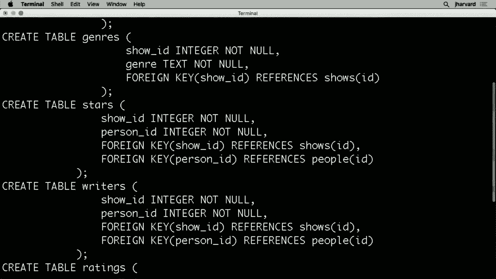

其中，实际上在图示形式中，它实际上看起来像这样，这是一个土地。将会有一个人员表，其中每个人都有一个 ID、名字和出生年份，将会有一个节目表，就像我们一直在讨论的那样，包含节目 ID 和标题，以及节目的首播年份和剧集数量。

该节目的剧集数量，然后将会有一个与之前设计相似的类型，所以我们没有完全展开，将其拆分为第三个表。我们在类型上确实有一些重复，但随后有一个评级表，在这里你可以看到关系数据库变得有趣的地方。

可以有一个评级表来存储评分，例如从一到五，但也可以将这些评分与某个节目的显示 ID 关联，这样你就可以跟踪该节目获得的投票数。编剧通知是一个单独的表格，注意这有点酷。这个表格通过箭头与节目表和人员表相关联。

因为这是一个连接表，外键的人 ID 分别引用节目表和人员表，这样一个人可以是多个节目的编剧，而一个节目也可以有多个编剧，这又是一个多对多关系。最后，明星是节目的演员，注意这也是一个连接表，显示 ID 和一个人 ID 分别引用那些表格。

这才是真正有意义的地方，关系数据库如果你将所有导演、编剧和明星的名字放在不同的表中重复列出，那将是相当愚蠢和糟糕的设计。

史蒂夫·卡瑞尔，史蒂夫·卡瑞尔，史蒂夫·卡瑞尔，所有这些演员、导演、编剧和业务中的其他角色，归根结底都是人。所以在关系数据库中，建议是将所有这些人放在一个人员表中，然后使用主键和外键来将它们关联起来。

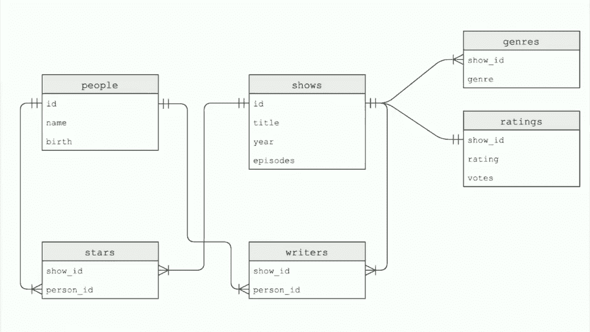

这些其他类型的表格的关键是，当我们这样做时，事实证明，当我们有大量数据时，事情可能会变得缓慢。例如，让我进入这个。让我继续从shows中选择星级，分号，这有很多数据，在Mac上还挺快。为了节省时间，因为这是在云中，让我继续计算一下。

IMDB数据库中节目的数量，使用计数153。

来自人员表的人员计数，457,886个可能是明星、编剧或其他角色的人，所以这是一个相当大的数据集。让我继续做一些事情，从标题等于办公室的节目中选择星级。这次我不必担心奇怪的大小写或空格。

这是IMDB，这是来自权威来源的干净数据。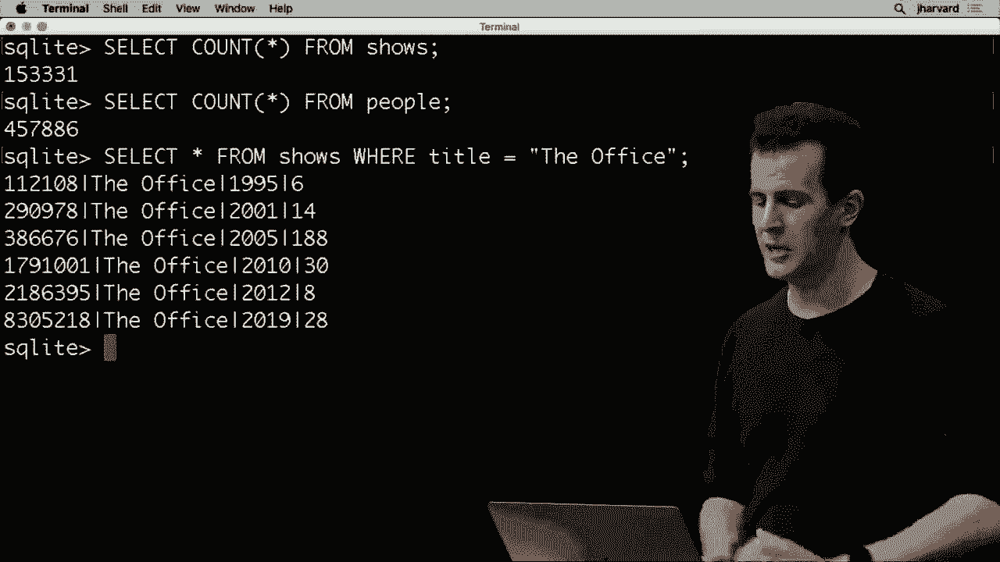

请注意，实际上有不同版本的办公室，你可能知道英国和美国版本，还有其他与该特定类型的节目无关的节目，但它们每个都按年份区分。好吧，这有点多，让我们再做一次，我继续。

让我暂时开启一个功能，在这个程序中，再次运行它，似乎花了0.012秒的实际时间来完成这个搜索，这真的很快，我几乎没注意到。显然因为它如此之快，但让我继续去做，创建一个，叫做。好的，最终回答之前关于默认性能的问题。

我们一直在做的确实是大O的N，它只是在从上到下线性搜索，这似乎质疑了SQL的整个目的，如果我们做得不比CSV好。但索引是数据库的一个线索，以一种高效的方式，让你获得对数级别的效率。

索引是一种高级数据结构，SQLite数据库或Oracle数据库或MySQL数据库，无论你使用什么产品，都会为你在内存中构建，然后它使用类似这样的语法进行操作，称为B树，我们曾经谈论过树，树的外观就像家谱树，宽而不高。

这是一种数据结构，精神上类似于我们在C中看到的，但它试图将所有的叶子节点，或者说所有的子节点，尽可能靠近根节点，而它使用的算法，往往是专有的或基于你使用的系统进行文档化。但它不以列表形式存储数据。

在底层，这些看起来很高的表格，实际上在底层是树，如果我们通过创建它们被正确称为的索引来创建这些树，这可能需要我们一个索引。但现在注意之前发生的事情，办公室，使用线性搜索时花了0.012。

如果我在创建索引并告诉 SQL Lite 在内存中构建这个花哨的树之后，再次执行相同的查询，只需几秒钟。

瞧，0.001 秒，所以现在速度快了几个数量级。对我们人类来说，这两者都很快，但想象一下数据集更大、查询更大，呃，它们的查询可能会比这更长，因此需要更长的时间。但不幸的是，如果我的数据分散得一团糟。

就像在图表中，就像在这样的图示中，我的天啊，我如何才能实际完成有用的工作？我如何才能获取到人们的信息？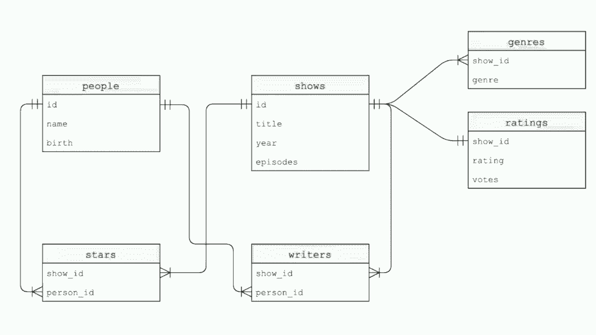

电影、编剧、明星和评分，如果一切都是混乱的，我似乎制造了一团糟，我现在需要执行所有这些，以至于变得复杂。事实证明，在 SQL 中还有另一个关键字，实际上我们这里要查看的最后一个，称为连接（join）。连接关键字可以隐式或显式使用。

允许你将表连接在一起，并重新构建一个更大、更用户友好的表。例如，假设我想获取《办公室》，好吧，记得我可以从人员表中选择史蒂夫的 ID，条件是名称等于史蒂夫·卡瑞尔。所以在这个表中他有不同的 ID，因为这是来自 IMDb，但这是他的 ID，让我去做，嗯，关闭计时器。

现在好吧，这里是他的 ID，136-797，我可以把它复制粘贴到我的代码中，但这并不是必要的。得益于这些嵌套查询，我可以做这样的事情。让我去做，嗯，接下来从星级表中选择所有节目 ID，条件是那张表的人 ID 在这个结果中。

连接人们并展示，错误的关键，重新输入它，从星级表中选择显示 ID，条件是人 ID 相等。不论史蒂夫·卡瑞尔的想法是否正确，这都是史蒂夫的所有节目 ID。卡瑞尔的电视节目很多，且其内容并不明显。所以让我再做一个嵌套查询，把所有内容放在括号里，现在选择标题。

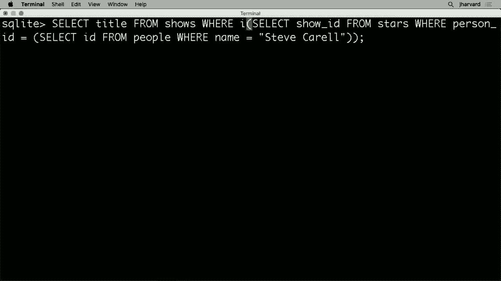

呃，从节目中选择，节目的 ID 在这份很长的节目 ID 列表中。那是他参与的所有节目，包括当年的达娜·卡维秀和顶部的《办公室》，还有最近的像苹果电视上的《早间秀》。好吧，这些数据很不错，但事实证明有不同的方式。

在接下来的几周以及问题集、实验室等中会有更多类似的内容，但事实证明我们也可以做其他事情，让我就展示这个语法，尽管只是瞥一眼。你也可以像这样使用连接关键字，我可以选择标题，来自与星级表中人 ID 列相等的人员表。

换句话说，我可以从连接结果中选择一个标题。像这样在ID列上连接“人物”和“明星”，在另一边的“人物ID”列上，我可以在“节目”表中连接，“明星.show ID”等于“节目的ID”，所以，现在我在连接主键和外键。

这两张表，其中名字等于“引用引号”，**史蒂夫·卡瑞尔**。所以这是我们见过的最隐晦的东西，但它只意味着取这张表并与这一张连接，然后再与这一张连接。

过滤所有的连接结果行。

我们也得到了所有的答案，还有其他方式来做到这一点。

我现在会保留一些语法不说，但这感觉有点慢，事实上让我继续并重新启动我的计时器，让我重新执行这个最后的查询：选择“人物”中的标题，连接“明星”连接“节目”，条件是名字等于**史蒂夫·卡瑞尔**，这花费了超过半秒的时间。

所以那实际上承认有点慢，但又一次。

索引来拯救我们，如果我们不允许线性搜索占主导地位，但让我继续创建几个索引，创建一个名为“人物索引”的索引，为什么？因为我刚才的查询使用了“人物ID”列，进行了过滤，所以这可能是一个瓶颈。我将继续创建另一个索引。

在“明星”表上显示索引，基于显示ID，稍早前我的查询使用了显示ID列。因此这也可能成为一个瓶颈，从上到下线性地。让我创建那个索引，然后，最后让我创建一个名为“姓名索引”的索引，这也许是最重要的，在“人物”表的姓名列上。

而且这也花了一点时间，现在总的来说，这几乎花了一整秒。但这些索引只是随着时间的推移而创建，但你并不会在每个查询中都承担这个。现在让我再做一次选择，让我从“人物”中选择标题，连接“明星”表，再连接。

在“节目”表中，条件是名字等于**史蒂夫·卡瑞尔**，哗！

0.001秒，这比刚才花费的超过半秒快了一个数量级。所以在这里你也看到了关系数据库的力量。尽管我们随着时间的推移给自己制造了一些问题，我们最终解决了它们，当然，凭借一些更复杂的特性和额外的语法。

但是关系数据库确实是你在现实世界中使用它们的原因，像**谷歌**这样。因为它们能够如此高效地存储数据，没有冗余，因为你可以对它们进行规范化并分解一切，但它们仍然可以保持电子表格。使用接近对数的结构，得益于那些树状结构，但也存在问题。

我们今天想要结束的内容是关于SQL，因为它们确实不幸地非常常见。请注意这里有一个攻击，你在任何接受用户输入的应用中都是脆弱的，这对我最喜欢的`pi.file`来说并不是一个问题，因为我只从CSV中获取输入，但如果你们中的一个人是恶意的，那会怎样。

你们中的一个恶意地在你的展示中输入了“删除”这个词。当我在执行查询时，不小心将其插入了我自己的Python代码，你可能会注入SQL，如果通过耶鲁大学登录，你通常会看到一个这样的表单，或者通过哈佛大学登录时，你会看到一个这样的表单，这里有一个我非常确定的例子。

假设我在这个登录表单中输入我的电子邮件地址为`mailand.harvard.edu`，SQL两个短横线是用于注释的符号，如果你想注释掉某些内容，结果发现单引号是某种像史蒂夫·卡瑞尔，或者在这种情况下是`mailing@`。

在`harvard.edu`，可以使用双引号，也可以使用单引号，在这种情况下，我使用单引号。但是让我们考虑一些样本代码，如果你愿意，这是我提出的代码行，可能存在于哈佛的身份验证后端，或耶鲁大学的，或者任何其他人的。也许有人写了这样的Python代码，使用`select * from users`。

其中`username`等于问号，`password`等于问号。他们将用户名和密码插入到用户刚才在网页表单中输入的内容中，这很好，这是好的代码，因为你使用了SQL问号占位符，所以如果你真的只按我们今天所说的去做。

并且使用这些问号占位符，你就可以安全地防止SQL注入攻击。不幸的是，世界上有太多开发者并不这样做，或者没有意识到这一点，或者确实忘记了，如果你转而使用这样的Python方法，使用f字符串，这可能是你上周的直觉。

因为它们非常方便。

带有大括号，假设你真的插入了。

用户名和密码，不是带问号占位符，而是字面意思。在这些大括号之间，注意如果我恶意地输入了`mailin.harbor.edu`，会发生什么。

在`harvard.edu`单引号两个短横线，这将使这段Python代码基本上执行这个，让我来进行查找和替换，欺骗Python执行`username = 'mailin.harvard.edu' --`和其他内容。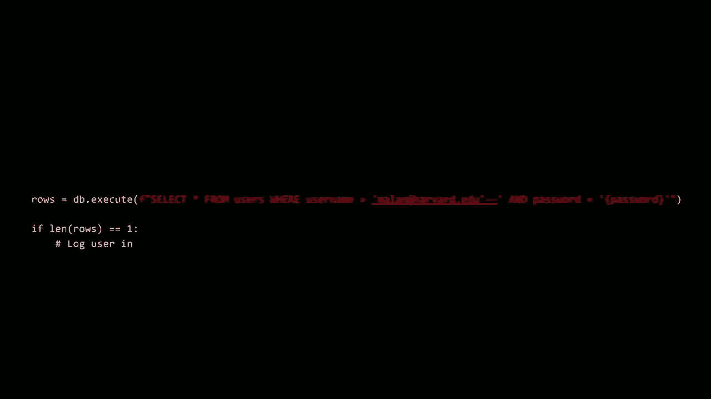

不幸的是，两个短横线又意味着注释，这意味着被忽略。

SQL查询的整个密码部分是检查这个用户名和密码是否有效，以便你可以决定登录用户，基本上，注释掉所有相关内容。

密码通知我做了什么，我刚刚理论上登录了自己。

作为大陆harvard.edu，甚至在不知道或输入密码的情况下。

而且连字符连字符，正在被忽略。

密码等于检查，所以结果显示db。

执行插入时，它返回给你，正如所说，你使用db执行从数据库表中选择行，它返回给你一系列每个都是字典的行。所以这是现在的伪代码，以及我的评论。

但如果你得到一行，似乎暗示有一个用户名为malin@harvard.edu的人。我不知道他的密码是什么，因为这个人恶意地欺骗了服务器忽略那个语法，所以SQL注入攻击不幸地是对SQL数据库最常见的攻击之一，它们是完全可以防止的。

如果你简单地使用占位符并使用库，无论是cs50s还是其他的。网上有一个常见的迷因，这里有张图片，如果我们放大这个人的执照，这就是一个理论上试图欺骗高速公路上的某个相机的例子，掉掉整个数据库，删除是另一个表。

这个人可能是故意的，或者只是幽默地，试图用这样的语法让它执行SQL。所以，分号都是潜在危险字符。如果它们不加改变地传递到数据库，非常流行的。xkcd漫画，让我给你一点时间，去阅读它，现在，在计算机科学中，如果你想的话。

阅读这个，在嗯教育学习者的家庭中，知道得很少。

Bobby Tables 不幸的是这里死寂，我无法判断，如果，但是无论如何这是一个众所周知的迷因，所以如果你是一名了解SQL的计算机科学家，你知道这个，还有一个最后的问题我们想介绍，如果你不介意，最后几分钟，这就是一个根本性的问题。

计算机中称为竞争条件的情况，现在第一次在我们对SQL的讨论中显现出来，结果显示SQL和SQL数据库在现实世界中非常常用，用于非常高性能的应用程序，换句话说，再次是谷歌、脸书、推特等。

在这个世界上，许多数据是同时进入服务器的。例如，你们中的一些人可能在不久前点击了这个蛋的赞，这是有史以来点赞最多的Instagram帖子。截止到昨晚，它的点赞数已经超过了五千多万，嗯，确实超过了金·卡戴珊。

这个问题是很难解决的，嗯，这种点赞以如此惊人的速度涌入的概念，因为假设长话短说，Instagram实际上有一台使用SQL、C++或任何语言与那个数据库进行交互的服务器。假设它们有代码试图增加总的。

那么逻辑上这可能如何运作呢？首先，为了增加这个蛋的点赞数，你可能需要先从数据库中选择当前的点赞数，针对那个蛋的照片的`id`，然后你可能给它加一。接着你可能会更新数据库，我之前没用过，但就像。

插入和删除都是有的，还有更新，因此你可能会用新的计数来更新数据库，加一，所以相关的代码可能看起来像这样，这里。你执行从`posts`中选择`likes`，其中`id`等于问号，`id`是那个蛋的唯一标识符，然后我将结果存储在一个列表中。

我将进入第一行，所以是`rows[0]`。然后我将进入`likes`列以获取实际数字，这个数字我将存储在一个变量中，五千万，我想让它变成五百万一，那么我该如何做到呢？`posts`，设置`likes`等于问号。

然后我只需将点赞数加一，问题在于Instagram、Google和Twitter这样的世界，实际上它们并不只有一台服务器。它们有成千上万的服务器，而所有这些服务器可能在网络上，而这些点击则转化为这段代码被执行，执行，执行。

问题是当你有三行代码时，假设布莱恩和我大约在同一时间点击那个蛋，我的三行代码可能在他的三行代码之前没有被执行。相反地，它们可能会混合在一起，按时间顺序，我的第一行可能会被执行，然后布莱恩的第一行可能会。

被执行，我的第二行可能会被执行，布莱恩的第二行也可能会，所以它们可能会在不同的服务器上交错，或者只是暂时存在问题，因为假设布莱恩和我大约在同一时间点击那个蛋，我们查询五千万是当前计数，然后我们的下一行代码在我们所处的服务器上执行，增加一个点赞。

更新那个蛋的行到五千万，因为根本问题是。执行时，我们基本上是在同一时间检查一个变量的值，哦。当前的点赞数是五千万，我们然后做出决定，给五千万加一，我们接着更新值为五百万一，问题是，如果布莱恩的代码或这个。

Instagram碰巧首先选择了点赞数，他应该被允许完成正在执行的代码，这样当我选择时，我看到5000万，我再加一，所以新的总数是5000万两。这就是在多服务器环境或被称为多线程环境中编写代码时，所称的竞争条件。

按时间顺序排列的代码行可以得到，根本问题源于，如果布莱恩的服务器正处于检查变量状态的过程中，我应该被锁定，不能同时点击那个按钮，或者我的逻辑代码，可能不应该被允许执行。

从逻辑上讲，当你需要像这样编写代码时，这是一个解决方案，这在推特、Instagram、Facebook等中很常见，使用被称为交易的东西。交易增加了一些新的语法，我们今天不会深入探讨，你在接下来的日子里也不需要使用，但它们确实解决了一个根本性的难题。

交易本质上允许你锁定一个表，或者实际上是表中的一行，以便如果布莱恩点击那个鸡蛋，导致一些代码在检查总点赞数的过程中执行，我对鸡蛋的点击将不会被服务器处理，直到他的代码执行完成，所以在这里我提出了你。

你应该这样做，你不应该只是执行中间的三行，作为Facebook的用户，在这种情况下，Instagram应该首先执行开始交易，然后在最后提交交易。

交易的设计是，所有的操作要么全部成功，要么全部失败，数据库不会进入这种奇怪的状态，我们开始失去对“喜欢”的跟踪。尽管近年来这不是问题，但在推特刚开始的时候，推特非常受欢迎。

并且经常处于离线状态，曾经有个叫做“失败鲸”的东西，那是他们网站上展示的图片。

处理过多流量的问题，正是因为当人们喜欢、推文和转发时，数据量巨大。事实证明，解决这些问题非常困难，但通过这些交易锁定数据库表或行是一种方式，最后，今天我们想。

在我之前提到的同一个例子中，假设当前的场景是。

你和室友有一个不错的宿舍冰箱，大家都习惯喝。

大量的牛奶，而你想喝点牛奶，但你去冰箱的时候，像我即将要做的那样，你意识到，哦，我们没有牛奶了，所以现在我在检查这个的状态。

冰箱，这个变量是空的，告诉我我应该去CVS再买些牛奶。

那我接下来该怎么做，我想我会关上冰箱，然后去离开，前往CVS，不幸的是，同样的问题出现了，我们将在最后60秒左右的时间里重演这个场景，假设现在我的室友布莱恩在这个故事中也想要一些牛奶。他来找我时，我已经走向冰箱，意识到哦，我们没有牛奶了。

很好，会去补货，所以让我们看看这个会如何发展。

我们来看看是否有类似的，呃，类比解决方案。

我检查了变量的状态，返回。

做吧。

好的，我现在回到商店，买了一些牛奶，要去**把它放进**冰箱，哦，这怎么发生的，现在有好几瓶牛奶，当然，你知道牛奶不会保存太久，而布莱恩和我喝的牛奶也不多，所以这真是一个严重的问题，我们已经尝试更新这个非常。

这个变量的值，同时，怎么去解决这个问题呢，实际的解决方案是什么呢，嗯，我敢说，我们可以得到一些灵感。

从事务的世界和数据库的世界中，或许可以在这里创建一个视觉化，让你希望永远记住，如果今天你什么都没学到，就去**把这个重演**一次。这次我会更极端一些，我去**打开冰箱**。

冰箱，我意识到啊，我们没有牛奶了，我要去商店，我不想让这种情况发生，也就是说，嗯，让我先去**把这个挂起来**。有点极端，但我觉得只要他进不了冰箱，这应该就没问题。让我现在去**把锁装上**，快好了，加油，好的。

现在冰箱锁上了，我要去。

我可以上台并告诉我，哦，好吧，CS50就到此为止，抱歉让你们久等，我们下次再见。
