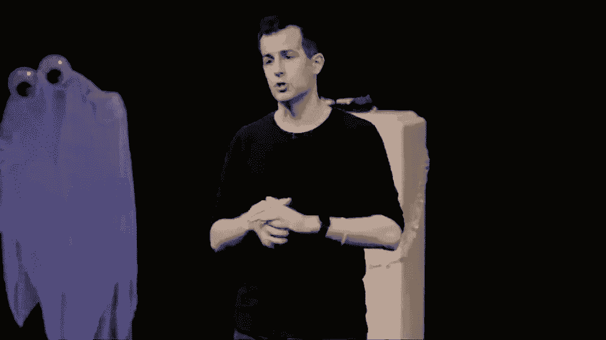
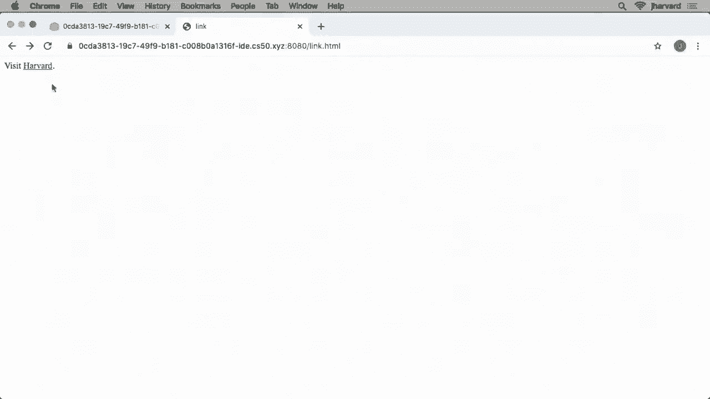
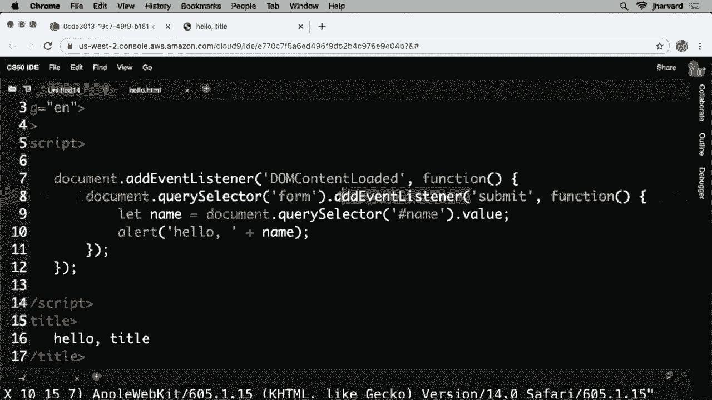

# 哈佛CS50-CS ｜ 计算机科学导论(2020·完整版) - P16：L8- 网络编程全指南（网络协议、HTML、CSS、JavaScript） - ShowMeAI - BV1Hh411W7Up

好的，这里是CS 50，这是第八周，即万圣节周。感谢我们在美国话剧院的朋友们，今天舞台看起来很棒，有一些特殊的灯光和角色。上周你们第一次探索了50ville，寻找失踪的橡皮鸭。

罪魁祸首已经找到。让我说，有一个小家伙想打个招呼。他甚至为这个场合精心打扮了一下。不过，谢谢大家的辛勤工作。我们将过渡到网页编程的世界，动机是过去几周。

我们编写的几乎所有代码都集中在命令行程序上。

编译你的代码，但一般来说只是与一个相当普通、闪烁的提示进行文本交互。你我每天使用的软件，通常是以笔记本电脑、浏览器或移动设备或APP的形式出现。今天，我们开始过渡到一套语言，而不是技术。

通过这些，你可以开始将过去几周的知识和思维模型应用于一个更熟悉、更加图形化的领域。在接下来的几周里，我们将专注于网页编程，使用的语言是HTML、CSS和JavaScript。

今天网站的构建方式，以及今天手机上的移动应用或APP的构建方式。但为了到达这个故事的那个点，我们需要考虑我们将运行这些网站或网页应用的框架。

这就引出了互联网的问题。究竟什么是互联网？

我们每天都在使用它，但让我们从观众中挑几位志愿者来为我们定义一下我们所说的互联网。我们每个人现在都在互联网上，但如果你退一步思考一下，互联网究竟是什么？

你如何为比你更少技术的人定义它，或者你会如何定义它？

就像全球所有计算机构成的网络一样，它们在接收信息的同时也在提供信息，完美吗？互联网就是这样一个网络的网络。如果你在家里有一个小网络，或者在公司或大学有一个大网络，然后你开始用电缆或某种无线技术将这些网络互连起来。

你得到了互联网，一个网络的网络。这实际上是所有今天应用程序运行的基础设施。因此，当你使用网页、聊天、Slack、视频会议时，你是在使用互联网。但可以把互联网视为将零和一从你传送到其他地方的底层管道。

这些应用程序最终都是以软件实现的。因此，如果我们考虑到这些计算机以某种方式互联，我们就有理由认为，作为全球社区，我们需要决定如何将数据从A点传输到B点及更远的地方。因此，在整个互联网中，有一些称为路由器的计算机。

到头来，它们可能比你我熟悉的桌面和笔记本电脑大一点。它们是相同类型的设备，配有中央处理单元（CPU），即计算机内部进行所有思考的“大脑”，以及存储器（RAM）和硬盘，数据被持久存储并呈现。

这是MIT几年前描绘的一张图像。我想展示一些互联网中最重要的对等点。因此，这里每个红点本质上代表一个路由器或一个非常重要的地方，许多电缆在此汇聚并相互连接。

这在全国的各个节点上。这种故事现在远远超出了美国，使用海底电缆和其他无线或卫星技术等。因此，可以说这是一种网状结构，所有不同计算机的互连，进而形成了全球的网络。这意味着数据可以从A点到B点的路径有很多不同的选择。

你和facebook.com或斯坦福之间并没有必要的直线联系，而是有一堆路由器，有时是少量，有时多达30个。它们会将你的数据从左到右、上下或其他方向转发，以便将数据从你传送到你试图联系的网络服务器，然后再把服务器的响应返回给你。那么这一切是如何运作的呢？

人类本质上需要聚集在一起，作为一个群体决定什么标准、什么协议？

所有这些计算机将会交流。协议不太像一种语言，而是一套约定。对了，在更健康的时代，如果我们面对面见面，可能会伸出手，你会立刻知道应该伸出手来。我们会进行一次实体握手，这就像一种人类协议。

我通过伸出手来与你建立沟通。你通过伸出手来确认这次沟通，然后这种互动就完成了。因此，我们在计算机的世界中也有这些人类协议。它们是类似的协议，但显然都是零和一。

因此，如果第一台计算机发送这个零和一的模式，另一台计算机应该用一组不同的零和一来回复。所以我们即将讨论的这些协议只是标准化了这些零和一的模式，实际上所有的消息都是往返于这些模式。

在互联网中，从A点到B点传输数据的两个最常用的协议称为 TCP/IP。TCP 和 I P 是两个独立的协议，但它们通常一起使用，因此你通常会将它们提到一起。TCP/IP。这些是你可能在 Mac 或 PC 上见过的缩写。

或者在你手机的设置中。它基本上涉及到计算机用来将数据从一个点传输到另一个点的两套规范。那么我们所说的数据是什么呢？

我们所说的从A到B移动东西是什么意思呢？这有点像老式信封。如果你想给世界上其他人发送一封信，你我可能会在早期去拿一张纸。我们会拿起一个信封，并在那张纸上写下我们的便条。

把纸放进信封，然后写下实际信息后，最重要的一步就是为其地址。在现实世界中，你会把收件人的地址通常放在信封的中间。你可能会把你的回邮地址放在信封的左上角，然后可能还有邮资。但我们人类几乎在所有邮政系统中都进行了标准化。

所以这里的隐喻是信封和其中的信息通常被称为数据包，信息包，这将是计算机的物理体现。你将使用零和一来实现这一点。所以让我们拆解一下他们用来实际放置数据、为这些信封地址并从A点发送到B点的两套规范。

首先考虑 I P，I P 代表互联网协议，如今几乎所有的 Mac、PC、iPhone、iPad 和 Android 设备都被设计为。由苹果、谷歌或其他人开发，能够理解这一点。这些公司在那些设备上编写了运行的软件，使其。

确保那些设备都支持类型。就像我所学到的，可能是某个人类教我的。这种人类习惯在早期就像是互联网协议。它只是标准化了计算机之间的地址方式。因此，在我们的物理人类世界中，如果你想给我发送一个信封，你可能会写到哈佛大学计算机科学系，地址是33 Oxford Street。

02138 U。这显然是一个唯一的邮政地址，指向校园内的计算机科学大楼，因此，如果你在加利福尼亚或其他地方投递一个信封，通过多个跳数和邮件运送等方式，它将到达那个特定地址。那么我也有类似的独特地址，称为I P。当你的电脑 Mac 或 PC 使用这种规范时。

手机等设备将数据从自身发送到另一个服务器。它在那个虚拟信封外面写上的地址是远程服务器的 IP 地址。如果我想给你发送消息，我需要弄清楚你的 IP 地址是什么。我会在这个信封的外面虚拟写下这个 IP 地址。

我可能会在这个隐喻的信封左上角写下我自己的 IP 地址，然后将其发送到互联网。这意味着什么？

这意味着我将那个信封交给最近的路由器。因此，实际上，当你在家时，你有自己的路由器。它是连接到你的有线调制解调器、DSL 调制解调器或类似设备的设备。如果你在校园里，比如哈佛或耶鲁，哈佛和耶鲁有自己的路由器。

所以你的电脑在校园内，会知道将数据交给那个设备。如果你在家使用，或者在全球其他地方，比如星巴克或机场。那么你的电脑通常知道最近的路由器在哪里，然后路由器的生命目的又是决定这个包裹是向左、向右还是向上。

为了更接近目标？但这有点像鸡和蛋。如果我想给你发送一条信息，我需要知道你的 IP 地址。但在我知道你在哪里之前，我并不知道你的 IP 地址。因此，还有一个你可能见过的缩写系统，称为 DNS。

域名系统。这是一项遍布互联网的技术，现今由 Mac、PC 和手机支持。它将我们通常称为域名或完全合格域名的内容，从那些类似英语或人类可读的字符转换为相应的 IP 地址。公司不以数字 IP 地址广告宣传其网站是有原因的。

我们都永远不会记得这些。

他们反而以 Microsoft.com、google.com 和 New York Times.com 等名称进行广告宣传。DNS 是一种你的 Mac、PC 和手机支持的技术，当人类输入这些人类可读的地址时，域名解析器将这些名称转换为 IP 地址。因此，字面意思上。

如果你输入哈佛或耶鲁。

当你在网页浏览器中输入时，你的 Mac 或 PC 会迅速查找该 IP 地址。

Web 服务器使用随 Mac 或 PC 附带的软件，将其转换为对应的 IP 地址，然后在信封的外面虚拟写上哈佛或耶鲁大学 Web 服务器的 IP 地址，然后将其发送到互联网上。因此，这些空中服务就像是你自己的 ISP（互联网服务提供商）提供的 DNA 服务。

当你在星巴克时，可能是星巴克的网络。这是你的互联网服务提供商，如Verizon或Comcast等。因此，世界也决定使用该技术。暂时还有一个缩写，TCP，TCP。或者说传输控制协议是几个问题的解决方案。其中一个是对互联网上的个别服务器来说，这通常非常方便。

为了能够同时正确处理多个事务，互联网可以做很多事情。服务器可以托管电子邮件，托管网站，托管聊天服务器，以及视频会议。这已经是你可以在软件中使用的功能的不断增长的列表。如果一个服务器能做到这一点，在财务和管理上会很好。

同时处理多项事务。实际上，它们可以。因此，当一台计算机收到其中一个虚拟信封时，而该计算机，恰好支持多个服务（如电子邮件），它会查看信封以获取一条额外的信息。

这一信息被称为端口号。R T号。它只是一个小整数，世界上已经决定用它来表示TCP领域中的特定内容。多年前，世界决定我们的计算机在IP地址后面虚拟地写上数字**80**，以表示这是一个请求网页的请求。

网页或**443**在信封外侧。如果这是一个使用称为https的安全请求网页的请求，稍后会详细说明，还有其他数字。电子邮件有其独特的号码，Zoom有其独特的号码，而你我每天可能使用的所有其他互联网服务也都有其独特的TCP端口，以便公司和个人可以让一个服务器同时处理多项事务。

但在收到这些信封中的一个时，服务器可以查看它并意识到。这不是请求电子邮件。这是请求一个网页。这是请求聊天或其他完全不同的请求。显然，TCP还处理数据的传递。它是协议的一部分，确保当你将数据从点A发送到点B时。

如果任何数据丢失，那是因为这些路由器中的某一个出现了问题，或者可能是31个路由器中的一个被压垮了，接收的包裹数量远远超过它能处理的数量。这种情况可能会发生，因为这些计算机具有。如果你通过一个路由器发送太多数据，互联网可能会变得拥堵。

你的视频可能会缓冲，其他很多症状可能会出现。因此，TCP还处理数据的重新传输过程。如果这些数据包在互联网上丢失，那确实是。

TCP 也会促使你的 Mac、PC 或手机重新发送数据。但互联网的一个显著特点是数据并不一定遵循一条特定的路径。如果你从一个人发送多个数据包到另一个人，这些数据包可能每次都走不同的路。这实际上是一个特性。

因为你可以想象服务器可能会拥堵，或者需要绕过的问题。因此，TCP 也支持其他协议和适应性解决方案来应对这个问题。

数据可能会沿这条路走。有时候也许会沿着另一条路走，但这部分原因就是为什么有时你的互联网速度会变得不稳定，因为中间的路由器可能不同，或者可能有些超负荷。因此，我们试图通过引入一些 CS 50 的工作人员来讲述这个故事。

你介意在稍后扮演一个网页浏览器的角色吗？某人的 Mac 或 PC？

你的手机向我请求，可能是一些无厘头的事情，比如让我给你一张猫的照片？

所以如果我想向某个网络服务器请求一张猫的照片，我需要给你发送一条消息，以便发送那个请求。因此，我可能会在一张纸上写下我的请求，并把这个请求放进一个信封里。然后我需要在信封上标注我们讨论过的所有信息，特别是你的 IP 地址，我可能会通过 DNS 查找。

把那个信封寄出，我想我们需要一点帮助，因为布莱恩和我在不同的地方。所以我们不能简单地把信封从一个人递给另一个人。所以让我们也请 CS 50 的工作人员来帮助，他们也在 Zoom 上参与了讨论，看看我们能否将布莱恩的请求路由过去。

谁在扮演网页浏览器的角色，而我将扮演网页服务器，以接收这个猫的请求。让我们看看能否在这里召集团队。哦，感谢 Phyllis 递给我这个信封。现在我们有的是布莱恩发给我的请求。我将打开它。

我确实看到了一条消息，里面请求了一张猫的照片，这在互联网并不罕见。如果我是网络服务器，实际上我有一份猫的照片档案，我会给布莱恩回复其中的一只猫。我需要在我的硬盘或者电脑的某个地方查找一下。

这是猫的照片，这里有一张。所以我打算把这只非常快乐的猫发送给布莱恩。我有一些自己的信封，我将把布莱恩的 IP 地址写在这个信封的中间。我会把我的 IP 地址写在这个信封的左上角，然后也许还有其他任何识别信息。然后我将把猫放进信封里，这个猫其实放不进去。

而且这实际上是非常常见的情况。每当计算机尝试传输大量数据时，无论是一个大图像，还是为了股票市场而可能更大的视频文件，将大型数据包拆分成多个小数据包通常是有利的。你可能听说过网络中立性或更专业的服务质量（QoS）主题。

网络中立性涉及计算机在优先处理数据时应做出何种决策，历史上一个共同的惯例是，我们所有人应将大型数据包分割成小型数据包。发送出去，以便与其他人的数据包交错。我们都以相同的速率到达目的地。网络中立性作为附带话题。

这关乎一些方的利益，优先考虑那些付费更多的特定公司的数据。因此，这确实涉及到这些基本原语的使用或滥用。但我试图把这幅大图塞进一个信封，这对我来说是不公平的。所以我打算真的把这幅图一分为二。基本上把数据包分成两个。

让我现在把这个放入信封，因为它会更容易适应。所以我有一份信息包给布莱恩，还有一份MAWR信息包给布莱恩。这将把这幅图像的另一半放进去，但我想我必须在把它放出去之前做点别的。

将互联网交还给菲利斯，再寄回给布莱恩。我可能需要关于这些信封的额外信息。我已经在“收件人”字段中写下了布莱恩·西普的名字。在“发件人”字段中有我的IP地址。我还写下了我应该给布莱恩使用的端口号以及我自己的回程端口。

端口号以及那些通常由我的Mac或PC决定的人。但我觉得我可能需要更多信息。我在这个信封外面还应该虚拟写些什么，以确保数据按预期接收？有什么直觉？这里假设对TCP管道没有熟悉度。

但是如果布莱恩即将收到两个信封，我或许应该给他提供什么额外的信息？

布兰登把照片的顶部和底部搞混了。因此，你需要以某种方式告诉布莱恩，这里是顶部，那是底部。也许要完美地合并它们。所以我们需要确保布莱恩知道这些数据包应该按什么顺序重新组装，以便他确实能以正确的方式，而不是错误的方式接收。大概我只需为每个数据包添加一个我们称之为序列号的内容就足够了。

这本质上是一个数字。

你可以把它看作是两个中的一个，而另一个是两个中的两个，这样，布莱恩就知道该以什么顺序重新组装数据包，更重要的是，如果其中一个或两个数据包在路由器的过程中丢失或掉落，就能有足够的信息让我们恢复它们。

根据需要重新发送数据包一或二。那么我们现在就开始吧。团队的帮助从菲莉斯开始，如果菲莉斯想继续的话。这仅仅是问题的一半。所以我现在要发送第二个数据包。实际上我会并行发送这些，但它们仍然可以沿不同的路径发送。

可能需要一点更多的时间。你想先打开你的信封并重新组装它们吗？

所以我没有信封。我想我会先打开那个写着“一个中的二”的。它是猫的上半部分。然后我会打开另一个信封，也就是“二中的二”，那是猫的下半部分。所以现在我想我有完整的猫了。

太好了，布莱恩加入了整个团队。我所说的这个协议是规范写入内容的一套约定。这是计算机如何以某种数字唯一地相互地址的方式。TCP 管理几种不同的内容，其中之一就是像 80 这样的服务编号。

不安全的网络流量是 80，安全的网络流量是 443。这确保了数据从一个点到另一个点，并由在特定服务器上运行的正确应用程序处理。

这是我们最初使用的。如果布莱恩有自己的域名，我的计算机会查找他的 I P 地址，他也需要查找我的，这样我们这些实际使用互联网的人才能进行连接。

以一种友好的方式，我不需要记住 I P 地址，这些地址只是数字，而是可以记住像 Harvard、edu 这样的东西。互联网是基础设施的根本，在此之上我们现在能够将数据从 A 点传输到 B 点。如果你对此感到舒适，我们现在可以将互联网抽象出来，仅将其视为一种。

从一个点到另一个点的数据传输机制。因此，只要我们现在可以假设我们有这一基本的公共服务，可以将数据从一个点传输。

现在我们可以在软件和其他语言上建立基础，并将其用于有趣的事情。但在我们继续做这些事情之前，有关 TCP、I P、DNS、互联网、路由器或其他新术语的任何问题或疑惑，我们可以澄清。我有个问题。

那么购物信息会产生任何问题吗？因为我不知道。一条信息可能在那里待两秒，而另一条可能待三秒。这对用户会造成问题吗？这些数据包可以花费不同的时间。尽管我确实规定它们应该大致在同一时间发往菲利斯的手中。

即使她需要将它们传递到两个不同的方向，也绝对可能会有延迟。如果数据包从A点到B点花费超过200毫秒，人们开始注意到延迟。看起来确实有一点延迟。如果是两到三秒，你在那个时候真的会注意到。

这不一定是个问题。希望布莱恩会耐心等待猫的下半部分，如果他最终只收到一个数据包。计算机可能会有点焦虑，会让我重新传输一个数据包，如果它。

如果在五秒后没有到达，这些超时通常可以由在个人电脑上运行的软件指定。但在那时，你我肯定会注意到区别。其他问题或困惑。看起来所有问题都已经得到解答。所以如果我们现在在根本上具备这种能力，从A点获取数据到B点，布莱恩给我发送的信封里面到底有什么，以及里面是什么。

我发给他的信封，除了那张猫的照片，还有什么？

我们过渡到另一种语言或另一种协议，称为http超文本传输协议。这是你可能见过或输入过很多次的缩写，出现在URL（统一资源定位符）的开头，这些是你我用来实际查找的工具。

我们实际上想从互联网请求哪个网站或哪个图像。所以网络，全球互联网实际上只是许多在互联网之上运行的服务之一。网络为我们提供网页。Zoom提供视频会议。其他工具提供文本聊天、语音聊天等。所以网络实际上只是互联网之上的一个应用。

毫无疑问，这是最流行的应用程序，但它实际上只是一个应用。它是一个使用底层管道的服务。所以http是一个不同的协议，真正管理这些信封内的内容。TCP/IP管理信封外的内容。Http管理信封内的内容。

假设我们谈论的是网页浏览器和网页服务器，而不是视频会议或其他东西。所以使用http，它带有几种不同的命令或相当有限的词汇，其中两个是最重要的术语，就是get和post，这两个字面上是英语动词，它们是这两个命令。

那么http支持的内容以及布莱恩可能在那个信封里做的事情。

他可能真的写下了“获取猫”或类似的东西。邮寄用于其他应用程序，我们很快会讲到。但是“获取”是关键字。这确实是浏览器如何请求或获取来自服务器的信息。因此，在布莱恩寄给我的信封中，英文单词“获取”可能是写的。

然后是cat J。Peg或类似的东西。可能还有更多的信息，但http的本质意味着如果布莱恩想从我这里获取某些东西，而他是浏览器而我是服务器。他应该用标准化的动词get开始他的请求，后面跟着他想获取的文件名。那么让我们现在把这个放入更熟悉的女孩的上下文中。

从这个女孩身上得到一种标准形式。让我们强调一下它的几个特点。https。你在网络上看到这个。

它通常会自动出现在你浏览器的地址栏中，因为浏览器或网络服务器是。S只是指http的安全版本，我们下周及以后会再讨论这个安全话题。但是在http的上下文中，这只是意味着我和布莱恩之间的数据，以及反向数据是。

不知何故，它比凯撒密码或其他密码更好。它在数学上复杂得多。但它本质上只是将信息进行混淆，以便布莱恩知道他在请求一只猫。知道他在请求一只猫。但如果你们中的任何一个人或者任何一个TFC在扮演路由器的角色时，恶意地或者真的打开了信封而不是将其交给下一个工作人员。

他们不会理解信封里的内容，因为它看起来类似于凯撒密码和其他随机的零。所以https只是意味着这些数据包的内容是加密的。还有什么是关于这些女孩的显著特点？这就是我们所称的域名。大多数人很可能知道什么是域名。

通常是两个短语，某个点其他某个东西。一个例子是点com，点edu和如今的数百万其他域名。这就是我们通常称之为顶级域名。这只是历史上你试图得到的那种类型的网站。

评论商业人教育点net意味着某种网络。

一个组织不再真的是这样的情况。如今有数百，甚至可能成千上万的顶级域名，你可以购买域名。

有时候会试图对事物进行分类，但大多数顶级域名周围并没有硬性规则。你必须是认可的教育机构才能使用点edu。你必须在U.S.军事中才能使用点mil。在其他国家也有类似的限制，它们有自己两字符的国家代码TLD，如点u。

K 代表英国，jp 代表日本，还有许多其他国家。每个国家都可以根据自己的需要进行标准化。但你和我可以购买 dot com，或 go dot net dot us 等等。你可以看到几乎详尽的列表。这只是为了对网站类型进行分类。

这是一个前缀，通常被称为主机名，而 www 只是一个人类惯例。几乎所有互联网上拥有这样人类友好名称的服务器，比如 www dot example dot com，都是为了向用户传达，这必定是一个网页服务器，而不是邮件服务器、聊天服务器或其他什么。

这并不是严格要求的。这只是人类的惯例，你可能甚至不再费心输入这个了。但这是一个历史特征，能够给人类提供视觉提示，帮助判断服务器的类型。因此，除了这些，还有一个隐藏的信息。

如果你只是想访问 example dot com 的首页，你可能只需输入这个网址，甚至只需输入 example dot com 然后按下 Enter，让浏览器重定向你，带你到这个网址的规范形式。但是通常你实际上是在请求一个特定的文件，如果没有的话。

提到的文件名通常是 index html。也可能是其他的，取决于所使用的语言或服务器技术。但你输入的网址的末尾通常是一个文件名，比如可能会特别请求 Cat J Peg。但如果他请求的不是一张猫的图片，而是一个完整的网页，包含文本和其他内容。

很可能有一个隐含的文件名。通常是 index html。这一点很重要，因为当我们查看这个封装时，这是一条需要包含在内的信息。那么让我们来看看一些示例的 HTTP 请求和响应。

更技术性地深入了解 Brian 和我以及工作人员刚才的表现。技术上讲，当 Brian 向我请求那只猫时，他在这个封装内不仅写了关键词 get 和类似 Cat 的内容。他还指定了其他一些内容，现在让我们泛化一下，远离猫这个话题，提出这个。

HTTP 请求就是，这些虚拟封装字面上是请求，比如 get 后面跟着斜杠。如果你不想要猫，只想要默认的首页，后面跟着 HTTP 的版本说明。浏览器和服务器应该使用的版本，1.1 是相当常见的，2 也越来越常见，3 现在也在使用中。

但协议有不同的版本。就像人类在握手时逐渐细化了含义。这些协议版本随着时间的推移而演变，但也有像这样的格式。主机冒号 www dot example dot com，因为以防万一我特别讲究。

向不仅支持example.com，还可能支持Harvard.edu和Yale.edu的服务器发送请求。如今，公司可以在同一台服务器上托管多个网站和多个域名。

这个小线索在信封里确保它发送到example.com或Harvard。你或Yale与所有这些实体共享同一台物理服务器，因此更具体地说，请求可能看起来是这样的。如果你不是只请求默认的主页，而是想要特定的文件。

可能会显示为斜杠index HTML，那么我的响应看起来是什么样的？

所以我收到了Brian的信封。现在我要回应我的一个或两个或多个信封，里面将有一些猫的部分，但根据协议还有一些附加信息。所以我的响应，就像在现实世界中一样，如果我看到Brian发起握手，我会伸出我的手。我要回应类似这样的内容，这提醒浏览器我说的版本号。

这是状态代码，后面跟着一个简短的摘要，比如，逐一放在这些信封里。我还在信封里提到了内容类型。如果是网页，我会写text/html。

如果是JPEG，我可能会说image/jpeg。还有不同的内容类型，也被称为MIME类型，适用于世界上所有不同的文件格式。响应并不总是那么简单，浏览器请求信息，服务器回应请求的信息。

有时用户会走错地方。我想这就是浏览器访问www.harvard.dot的情况，响应可能并不一定是好的。事实上，它可能不是状态代码200，我们可以看到这一点。

让我在我的屏幕上打开一个浏览器窗口，带我去harvard.edu。我将继续在URL栏中输入http://www.harvard。

dot e d 你现在进入了吗？这一切发生得相当快。但是如果我点击URL栏，这个被Chrome简化或缩短的地方，瞬间我注意到我实际上到达了某个地方。我的浏览器没有让我停留在http。它将我重定向到https。这可能是哈佛故意的。

他们更希望我安全访问，以便如果我在阅读文章或其他内容，这实在是没有别人可以插手的事情。中间没有路由器能够看到这一点。因此哈佛以某种方式将我从http重定向到了https。我该如何看到这一点？

嵌入在Chrome、Edge、Firefox和Safari中的所有现代浏览器，通常都有开发者工具，有时你需要手动启用。但是这些开发者工具是如此强大，让你作为用户或现在作为程序员，可以实际看到并理解这些浏览器和服务器的内部运作。

所以我将专门在Chrome中进行这个操作。

我要去查看开发者，然后进入开发者工具。如果你是Chrome用户，这个菜单选项一直存在，即使你从未注意到。所以请在家里也试试看，然后注意到它会在右上角弹出。我将通过点击点将其移到底部。

我将开发者工具移动到屏幕底部，以便我们可以更宽广地查看内容。然后我会点击上面的网络选项卡。当我点击这里的网络选项卡时，我会看到与我上一个请求相关的大量信息。所以我会重新执行这个请求。让我回到U。

R L Bar，让我再在隐身模式下做一次验证。

即使你可能习惯使用隐身模式，如果你不希望浏览器记住你访问过的地方或登录的信息，隐身模式对开发者来说是极其强大的工具，可以让你重置浏览器状态，仿佛是第一次使用，没有任何先前的网络浏览历史。

所以我现在要在隐身模式下再次执行这个操作，之前已经打开了开发者工具。Http://www.harvard.edu。

按下回车后，很多信息飞快地在窗口中出现，其中一些是性能图表。因此，针对你之前关于时间量的提问，你可以看到一些请求的响应时间从几毫秒到超过1000毫秒不等。但我目前关心的是下面这个相当晦涩的列表。

许多内容迅速飞过屏幕。如果我放大底部，简单访问哈佛大学会导致每个请求70次HTTP请求，左下角提到，这导致传输了6.8MB的信息，耗时相当可怕的11.95秒。所以，相对而言，这样的速度很慢，绝对而言也是。所以这里的要点是什么？

每次你访问一个网页时，不仅仅是网页本身，里面的所有文字，还有可能包含的图片、音乐等，所有这些内容都是单独下载的。因此，如果布莱恩问我是否能提供像课程主页网站那样的完整网页，我可能不会只回复一个或两个信封。

我可能会回复70个信封，包含组成CS50 Zone网站的每个媒体的响应，或者，我们先关注这些请求中的第一个。如果我查看这里在Chrome中的第一行，我会看到我第一次访问的提醒。但注意这里的状态栏是301，301移动。

事实证明，除了200之外还有其他数字告诉浏览器该做什么，200仅意味着好的，这里是你请求的数据。301意味着你请求的内容已永久移动到另一个位置。所以让我先点击这一行，你会看到一整套不同的内容。我将点击这里的头。现在让我定义一个术语，当Brian和我在这些内容中使用http时。

信封中，我写下像get slash http 1.1或host www.example.com这样的内容。每一行文本被称为http头。它是信封内部的一行文本。所以我们在这里看到的是Chrome对这些头的总结。让我来查看一下我的请求。我将点击查看源代码。

我可以清楚地看到我的浏览器发送到的原始请求。www.harvard.edu/，你能理解slash http 1.1，Host www.harvard.edu，然后还有一堆我们暂时不理会的其他内容。但这些都是http头。如果我向上滚动，我们来看一下响应头。从哈佛到我笔记本的不同信封中返回的内容，这里注意到的是http 1.1。

这是301移动永久。这是对我的浏览器的提示，表示你访问的URL没有内容。你需要访问另一个位置。为了知道我需要去哪里，我需要向下滚动找到这个头。注意响应中的第三行是location: https://www.harvard。

这就是返回的信封包含的线索，告诉我我们已经永久转移到网站的安全版本。如果我现在缩小视图并点击这个小X来关闭这些标签，你会看到我的浏览器自动发送的下一个请求，是去别的地方。

如果我在这个请求中向下滚动，网址是https://www.harvard.edu，而这次的响应在这个一般摘要下确实是。

这只是一个简单的机制，它允许浏览器和服务器之间进行通信，以便将它们从一个位置发送到另一个位置。让我稍微把这个变得更熟悉一些。你可能没有明确地见过这个，因为作为一个人，你几乎不会看到数字31或移动到永久的位置。

现在你是一位使用这些开发者工具的程序员。但你可能看到过另一个数字。如果你想参与聊天，关于网页和数字，有没有人见过可能现在看起来更有意义的数字？很多人说 404。

我也见过 505 和 502，0404 是人类的代码。

多年前采用的代码只表示找不到。因此，如果你访问了一个错误的页面，或者一个不再存在的旧页面，比如一个被删除的旧猫，服务器将不会以 200 响应，而是以 404 找不到来告诉你的浏览器显示某种错误信息。奇怪的是，多年前的浏览器并不是特别用户友好。

然后浏览器只是告诉我们人类 4444，这并不是很用户友好。但归根结底，这都是回应信封中的一个小提示，表明出现了问题，找不到某些东西。而且有一整套这些状态码，这绝对不是你需要记住的。

但随着我们越来越专注于网页编程，你会自然熟悉其中的一些。这还有其他方法可以将用户从一个地方重定向到另一个地方，32 和 307 可以用于效率。服务器有时会以 304 响应，这基本上意味着你已经问过我了。

服务器上的猫没有变化。使用你自己的猫的副本。如果布莱恩自己的浏览器聪明的话，它会缓存（C a C h e）他刚从我这里下载的猫，这样如果布莱恩点击重新加载或再次访问同一网站并想再次查看猫。

他的浏览器加载本地副本，而不是打扰我这个网页服务器并浪费时间。发送另一个猫的请求 304 或 404 只会说猫是一样的。使用你自己的本地副本。然后你可能见过其他的 401 或 403，都是因为未正确登录或类似的问题，500 实际上是坏的。

我几乎可以保证，在接下来的几周里，你们所有人都会经历你们的第一次 http。这将是下周，你的代码出错了，实际上写了有问题的 python 代码。这意味着整个服务器不知道该怎么做。

这是一个内部服务器错误，可以修复并帮助你调试。这种情况也相当常见。503 仅表示服务器可能在某种方式上超载。因此服务不可用，还有其他状态码。

所以我们实际上可以在这方面玩一点乐子，还有几个不同的方向。

事实证明，如果我们发送这个 http 请求，我们可以查看返回的内容，让我代替使用浏览器来执行这个操作。

我打算使用一个命令行工具，这通常会更清晰，因为我不需要操心所有这些按钮。让我使用一个叫 Curl 的程序，Curl 的目的就是连接到一个 URL，它不会烦恼地显示网页或任何内容。只会给我显示 HTTP 头，如果我使用一个命令行参数 dash Capital。

我现在要继续访问 HTTP colon slash slash safety。school dot org 的内容，我要进入。这是我的 Mac 现在发送一个信封到 safety school dot or，里面包含请求主页的 get 动词。可以想象，它将回复我另一个信封，里面包含某种响应。

也许是 200。也许是其他的。

看起来请原谅，可能安全学校的 Orc 已经永久迁移。根据这个 301 到新的位置。

Www dot gail dot e d u 对不起。

如果我复制这个网址，我们可以这样做，让我进入浏览器。我会再次使用隐身模式，这样就没有任何历史记录。

输入，以及很多视觉效果。正如标题所暗示的。这则笑话的有趣之处在于，网上有人已经为域名支付了费用。安全学校或者说，已经 20 年了。这个笑话唯一的作用是重定向一个域名。让我继续从安全学校转到 Harvard sucks dot org。

这个网站也存在，而且对面有人已经托管这个网站一段时间了。

如果你去见那个女孩，咱们去哈佛，sucks dot org 的入口。你实际上会看到一个完整的网站。所以耶鲁的学生们真的全力以赴，你实际上可以看到一个惊人的黑客作品。在 Harvard sucks dot org 上。

有一个旧的 YouTube 视频，展示了几年前在哈佛耶鲁橄榄球比赛中发生的一个惊人的黑客或恶作剧，骗我们拼出一个位图上的内容：我们烂。因此，将这两个基本的 HTTP 消息连接起来有点牵强。但这确实与这些非常简单的基本元素有关。让我再指出一件事。

我们可能还会看到 HTTP 请求形式中更复杂的首行，其中你不仅请求。斜杠默认主页。你并不是在请求斜杠 cat J peg 或斜杠 index dot html。可能还有问号和等号，请注意。这是我的 Mac、PC 或手机可能发送给谷歌的信封摘录。

dot com 请求猫的图片。事实上。

让我在我的浏览器上做这个。让我访问 https。我根本不打算使用不安全的版本。我将明确地访问 google.com/search?Q=cats。

所以这是我 Mac 将翻译的人类版本 URL。它会转换成这个将被放入虚拟信封的低级消息。好了，我要输入，瞧，我现在确实看到一大堆猫的照片，包括一些来自表现不佳的电影的可怕照片。

这就是说，一旦你理解了 URL 格式，你就可以开始向服务器传递输入。这里是我们如何将过去几周与未来几周连接起来。当我们访问像哈佛大学、耶鲁大学这样的网页时，我们只是访问静态网页内容。我们实际上没有像使用 GET 字符串或输入那样提供用户输入。

或者我们写的任何命令行程序。但事实证明，URL 确实支持用户输入并且是标准化的。如果你看到一个问号，然后是一个变量名，比如 Q，然后是一个等号，再加上一个单词，比如 cats。

这就像基于网页的命令行程序模拟。当被问到 Q 的值时，人类输入 cats。

这就是说，有一种方法可以使用 URL 实际允许我们传递输入。这就是当你访问 google.com 时发生的事情。但这归结于理解这些 URL。在我们开始在这个基础设施上构建自己的解决方案之前。

现在有任何问题吗，关于 http、状态代码或我们到目前为止见过的任何东西？任何事情都可以？过渡到圣地亚哥。所以当你想发布网页时，为什么你必须购买域名？是因为你在使用某种内存和服务器吗？

这是一个很好的问题。为什么你必须购买域名？这实际上归结于资本主义。运营互联网的某些方面是有成本的。

互联网的确涉及各个方面。有一些非营利组织和志愿者历史上帮助管理它。运营互联网是需要一定开销的。

运行主要的 DNS 服务器和其他功能，所以有一些所谓的东西。

互联网注册商，类似于大学注册处，其目的是允许人们基本上以年度为基础租用域名。

这并不是永久归你所有。

一旦续费，每一到两年或三年一次。

它的价格可能从几美元到几百甚至几千美元不等。我们可以深入讨论域名的相关问题。

如果你想到一个非常酷的词，然后购买了该域名，而其他人也想要它。

这里有资本主义的运作，可能会让你将域名出售给其他人。

但在某种程度上，它有助于严格规范谁可以注册。

注册域名似乎给所有域名施加了一些下行压力，以免它们全部消失。如果你可以免费注册任意数量的域名，那还有其他问题吗？

关于不仅是HTTP，还有TCP/IP协议或今天的字母汤中的其他任何内容的澄清。聊天中有个问题。如果你有多个数据包要从一个地方发送到另一个地方，它们是否必须一个接一个地发送？还是可以同时发送所有数据包？

我们并不认为人类能很好地做到这一点，之前在Zoom中有些舞蹈。于是我们通过教学一次发送一个数据包。

计算机通常会同时传送所有这些数据包。它们会依次序列化，但会非常快速地发生。碰巧的是，它们可能都通过教学助手作为路由器走同一条路线。

或者它们可能会朝不同的方向走，具体取决于互联网此时的拥堵程度或繁忙程度。它们可能会按顺序到达。这就是布赖恩需要知道信封外部序列号的原因，以便他可以重新排列它们。

以正确的顺序发送。路由器如何知道将特定的数据包发送到哪个方向？

真是个好问题，作家们是如何知道的，早在那时？

在某些情况下，它是硬编码的。你可以把路由器想象成在内存中有一个类似Excel电子表格的东西，至少有两列，一列是IP地址，另一列是应该发送的方向，比如左右上下，电缆的走向。但你可以从隐喻的角度来理解。

它告诉路由器，如果你接收到这个IP地址的数据，就通过这根电缆发送；如果是这个IP地址，就通过那根电缆发送。这些电缆都连接到同一城市中的其他路由器，以及跨越海洋连接到其他城市的终点。这会非常麻烦。

如果人类必须手动配置所有的互连。我们刚刚看到的Mitt地图。因此，确实存在其他协议，我们在这堂课中不会花时间讨论，但那些路由器依赖于这些协议以动态适应。有一些协议会判断我的数据包是否突然无法通过。

我将开始动态地进行路由。路由器会判断那似乎不是一个好的目的地。

因为我没有收到任何响应，或者花了太长时间才得到回复。因此有一些协议决定你是否可以动态地改变那些所谓的路由表。

我之前提到的电子表格。因此，在这一点上，我们现在有一个称为互联网的基础设施，允许我们通过在信封外部写地址和端口号，将信息数据包从A点发送到B点。我们还有一个称为HTTP的协议，专门用于网页浏览器和网页服务器，与视频分开。 

它们有自己的一套约定和协议。但我们有一个机制来请求信息并以信息回应。我们从问题中知道，如何用猫进行回应，这只是一串位。无论是位图还是其他东西。

但我们还没有看到实际网页的样子。如果我们更深入地查看我发送给布莱恩的信封，而他又将其发送给我，你从哈佛收到的回应，以及我们从耶鲁收到的回应，我们会看到另一种语言。这并不是一种编程语言。

它被称为标记语言，这意味着它更多地关乎美学而非逻辑。而且还会有其他几种语言被嵌套其中，CSS层叠样式表，它是一种正规的编程语言。但我们先休息五分钟，我们将学习如何制作网页。

因此，当你访问一个网站请求主页或特定文件时，虚拟信封的内部内容是什么，稍微深入一下HDP。服务器返回的标题。该语言称为HTML超文本标记语言。

这确实不是一种编程语言，这意味着没有循环，没有条件。

它实际上没有函数或变量。这只是文本，告诉浏览器以相当细致的方式从上到下，从左到右，显示什么以及如何显示。

让我们看看一些示例。HTML 页面将包含两种不同的概念。

我们称之为标签或元素，以及属性。

这里可能是我们能制作的最简单的网页，这就是 HTML 本身。你会看到它是结构化的，并且有一种对称的方式。某些内容像在适当的编程语言中那样缩进。但这里的确有某种对称性。

让我们逐步理清我们在这里看到的内容。这第一行被称为文档类型声明。长话短说，每当制作现代网页时，这应该是你文件的第一行。无论如何，这表明你和我正在使用最新版本的 HTML，即版本五。随着 HTML 本身的演变，这一行可能会改变。下面注意一对我们将称之为标签的内容。标签是开括号之间的内容。

我们可以从一个词，如 HTML，或者一些简洁的短语开始，可选地。像这样一个词和一个等号，后面可能还有一些带引号的内容。这里是我们的第一个 HTML 标签，这个标签是 HTML 标签。它的工作方式如下。当浏览器收到一个包含文本的信封时。

它首先读取第一行并说，这个文件包含 HTML 版本五。接下来是什么？这是网页的内容。浏览器来自 HTML。请注意，这里有点与该声明相反。当你到达文件的末尾时。你会看到一个类似的标签，但前面有一个斜杠。

如果我们将其视为一个开放标签，或者如果你将其视为起始标签，这就是结束标签，大多数标签确实有这种对称性。打开它们一次后，理想情况下你应该在适当的顺序中关闭它们。请注意，关闭标签时你不必重复其他内容。

你只需提到标签的名称，以保持简洁。HTML 就是这样。里面有什么呢？如果我们往下看，你会看到这里有一个东西，这就是我们将称之为属性的内容。属性往往是简短的、简洁的短语，对特定标签具有特殊含义。这些特定的属性。

如果你阅读该语言的文档，HTML 会说，如果你在 HTML 标签中添加 Lang 等于引号中的某个内容，这将是浏览器的线索，告诉它，接下来是 HTML。顺便提一下。该网页的内容默认是英文，E N。世界上每种语言都有自己的两位或三位字符编码。

可以放置在这些引号内的字符代码将标准化浏览器所解释的内容。现在很有用，例如浏览器中的翻译功能。它知道页面用什么语言编写，因此可以帮助你将其翻译为你所说的语言。这里有两对标签，即头部标签和主体标签。

我同时突出显示了它们，因为你可以将这两个视为HTML标签的子项。因此，如果我们借用家庭树和某种层级的比喻，想象HTML标签是父项。这个父项有两个子项，头部标签和主体标签。

每个标签都分别打开和关闭。我们考虑第一个，即头部标签。里面的内容，你现在可能猜到了，是标题标签，将表示我们正在编写的网页的标题。这个网页的标题将是字面上的，也就是“你好”。

所以这就是你在这个网页标签中看到的内容。让我们稍微回顾一下，现在看看HTML标签的第二个子标签，即所谓的主体标签。这将是网页的大矩形区域，也称为主体或视口。在这里，我们看到该矩形区域的内容将是字面上的。

这是一个相对简单的网页的HTML，其标签栏标题是“你好，标题”，而其主体在大的矩形区域中，称为主体。现在明确指出，我们可以将这一切视为一个数据结构，即使它只是包裹内的文本，自上而下、从左到右读取。

浏览器在你的笔记本电脑、台式机或手机上实际上要做的事情是构建一个内存中的数据结构。所以，编写Chrome的微软或编写Safari的苹果，写了代码从上到下、从左到右读取HTML，就像一个长字符串，解析它，即分析它并将其构建到计算机的内存中。

这样的树状数据结构就像是为问题五构建的。在内存中构建自己的哈希表，以处理原本只是一个大型文本文件的单词。因此，你可以看到这里的层级。如果将整个文件视为所谓的文档，将绘制一个节点，而该节点的第一个也是唯一的子项就是HTML标签。

每个网页都必须以HTML标签开始。它有两个子项，正如我所提到的，头部和主体。头部有一个标题子项，而标题本身也有一个子项，那就是文本。为了稍微挑剔一下，我故意将这些节点绘制成略微不同的形状，以表示HTML头部、标题和主体。

确实，所有的标签都被打开和关闭了。这些椭圆形的只是文本。那些并不在标签内部，那些本身并不是标签。这只是这里和这里的原始文本。而文档注释是唯一一个随机的。这是唯一一个会以感叹号开头的内容。通常，除非你有我们所称的 HTML 注释。

这些只是我们看到和理解的自我备注。在 Python 中也有类似的语法。如果这是我们能制作的最简单的网页，我们该在哪里制作呢？

所以你当然可以打开你的 Mac 或 PC，打开像 text edit 或 note pad X 这样的程序，输入这些内容。保存文件并在浏览器中打开。但这并不太有趣，因为如果你只是在你的 Mac 或 PC 上保存一个 HTML 文件。你将 literalmente 是世界上唯一一个能打开它的人。

你想要一个服务器，这样你就可以编写和保存你的 HTML，以便其他人可以通过互联网访问该文件。我们都有一个名为 CS 50 的工具，实际上这是一个用于编写代码的 Web 工具，而我们现在开始编写的代码恰好是 HTML。所以让我来做这个。继续打开一个新文件。

我将称这个文件为 hello dot html dot。

作为常规文件扩展名，让我重新输入一下。所以 doc type HTML 表示。这里是版本五 html Lang 等于 quote unquote e n。现在注意，IDE 正在为我做什么，视你的偏好而定，好的或坏的。它会尝试为你完成你的想法，这样你可以少输入一些。

这越来越成为集成开发环境（IEDs）的一个特性，因为现在我可以大约输入一半的内容。我将打开页面的 head，注意它已自动关闭。我将打开页面的 title，它也会自动关闭。让我来做一些像 hello title 的事情。

然后在 head 标签外面，我会添加我的 body 标签，并写上 Hello，逗号 body。从严格意义上讲，这种缩进并不是必需的。如果我想稍微简洁一点，不用那么多行。这完全是合理的，而且可能也很合理。如果我有一个非常长的标题。

我可能应该把它移到自己的一行。这些细节对计算机来说并不重要，对浏览器来说也是。可是它们确实让它更美观，也更容易让我这个人，假设你也是，去阅读。所以我已经保存了这个文件。在过去我会使用 make for C，或者我会使用 Python for Python。

但这两者都不适用，因为我们并不是在编写或运行代码。我现在想访问这个网页，我需要一个浏览器，我已经准备好了。我可以在我的 Mac 上使用 Chrome、Safari 等。但我也需要一个服务器。结果发现 CS 50 ID 本身就是一个我们用来编写代码的 Web 服务器。

我们可以用它作为 Web 服务器来提供我们的 HTML。就在不久前，当我扮演 Web 服务器的角色时，我基本上需要在这个想法中实现一些程序，只是在听、听、再听。就像我在等待 Brian。当我从任何人的浏览器收到 http 请求时。

我将用合适的文件进行回应。现在我们不打算自己实现一个 Web 服务器。Web 服务器算是一种商品，任何人都可以下载或付费使用。这个想法简单地来自一个叫做 http dash server 的程序。这是一个预装在 I 中的程序，它是免费且开源的。

你可以在 Linux、Mac 或 PC 上使用它，但它在 I D 中预装。当我运行它时，它会为我启动一个新的 Web 服务器。因为这个想法本身已经在 CS 50 自己的 Web 服务器上运行。我现在需要运行自己的 Web 服务器，以便区分两个服务器。

我将使用不同的端口，默认情况下，ccs 50 i d 使用的是 1 80 80 这个端口。所以再次默认情况下，世界上大多数 Web 服务器使用不安全的 80 端口和安全的 443 端口。但不幸的是，这两个端口已被 CS 50 自身使用，它已经在 CS 50 的 Web 服务器上运行。所以如果我想使用同一个服务器。

同一台云计算机监听我自己的其他请求。我只是要并行启动自己的第二个 Web 服务器，只是在不同的地方监听。这就是为了让你我能够运行自己的 Web 服务器，尽管我们在自己的账户之外无法控制这个想法。

现在这是一个看起来相当神秘的主机名，它是一个随机的东西，Zero CD 83813 等等。但归根结底，它只是一个口头通知，最后以 CS 50 X y Z 结束，这是一个我们购买的域名，仅用于运行 Web 服务器。

在 CS 50 上。如果我继续点击并打开 Y la。我现在会看到一个相当复杂的文本列表，列出了我刚刚运行 http server 的文件夹中的所有文件。让我放大一点，你会看到里面只有一个文件，就是我们写的 hello dot html。所以让我点击这个文件，瞧！

这就是我的第一个页面，hello body。我没有看到标题，因为我处于全屏模式。但让我退出全屏模式。如果我放大这个页面的标题和标签。标题。那么刚刚发生了什么？我刚好在使用 CS 50 I，因为这很方便。你我都已经有账户了。我们正在运行自己的 Web 服务器。

实现我之前作为人类所扮演角色的软件版本。我用Chrome作为我的浏览器，就像布莱恩之前在故事中一样。所以当我在浏览器的地址栏中访问这个长URL时，服务器告诉我访问的地址。注意，它以slash hello.html结尾，所以一切都在一个环境中。

我正在提供网页和请求网页。这是一个现实世界的软件开发者在构建自己的网站时所做的。他们希望实际保持一切本地，反复工作，直到准备好发布。有任何关于我们刚刚构建的网页的问题或困惑吗？有任何问题或困惑吗？

布莱恩做完了吗？让我在这里指出一个标签中的事情。你们中一些人非常聪明，实际上惊人地转录了你们，因为我看到更多的。HTTP请求现在进来了。注意到在我运行HTTP服务器的终端窗口中，我看到请求一行行地进来，这算是一种日志，因为我的Web服务器仍在运行。

如果你们想再次输入那个相同的URL。

如果你倒回视频的时间，你实际上可以在互联网上访问我的hello.html文件。

假设你正在观看现场讲座，你可以看到“新玫瑰”出现在我的输出中。

但这只是说这对我们有用。让我在这里稍微做点别的。我将创建另一个文件，这次演示一些其他的HTML标签。所以让我们回到这里，我会保持我的终端窗口运行。但我现在不太关心输出，所以我只会把它最小化。

我将创建另一个文件，叫做paragraphs.html。

让我们看看是否可以引入一些HTML的其他特性。我会继续输入和之前一样的内容。文档类型HTML。我的HTML标签带有英文的Lang属性。这个想法会让人困惑。如果我开始一个想法却没有完成，然后再试图完成它。

你可能需要清理一下，想法是为了帮助你。我现在来创建这个头部标签。我给自己起个标题。我称这个页面为段落，所以我会把它保持在一行，以便简洁明了。打开我的主体。现在我要输入五段拉丁文本。

我就直接把这个放在这里。让我来好好构造一下，使其更加易读。这是你们的洛伦·伊普森文本，基本上是一些类似拉丁语的无意义内容。现在我有五段文本了。

这远不止是hello body。所以让我保存这个文件。让我回到我的另一个标签。在我点击重新加载之前，注意到没有任何变化，这将显示我文件夹的最新内容。所以让我点击段落，学习HTML，我应该看到五个拉丁文段落。

呜？这真是一团糟。一个庞大的长段落。对此可能存在的bug有什么直觉吗？

关于聊天有什么想法？还是Ryan举手了？至少从设置的方式来看，HTML似乎没有默认的自动行距。所以它不会把所有内容收集到这个大的字符串中，除非你以某种方式在每个段落之间创建一个空格，就像大多数计算机语言一样。

它会字面意思上处理你。如果你不通过HTML标签告诉它该做什么，它就会执行一些默认行为。所以让我回到CS50的页面。让我在这里引入另一个标签。原来有一个叫做段落标签，简写是简单的开括号P闭括号。我的想法是完成我的思路。

但是因为我已经有段落了，我需要手动修复这个问题。所以让我在这里打开它，接下来插入几个这样的标签。一个在这里，再复制一个闭合标签到这里，再一个在这里，现在让我为了样式在后面再加一点。

我知道几乎在过去每一周我都声称复制粘贴是不好的。对于HTML来说并非如此，因为如果你想要多个段落，就没有循环的概念。你可以仅用HTML创建五个拉丁文段落。在这种情况下，这是正确的解决方案。让我回到我的另一个标签并现在点击。

在你告诉它之前，什么都不会改变。所以，就像你重新加载一个普通网站一样，让我重新加载一下自己的页面。瞧！我们通过明确使用HTML段落标签修复了Ryan识别的问题。故意使用的是P标签，因为HTML标签往往简洁，输入的字符更少。我怎么知道是P标签？你只需在课堂、书本或网站上学习到这一点。

的确，像Python和C一样，我们并不打算教你HTML中所有的标签和属性，而是今天特别关注概念和基础，以便你可以通过许多在线资源快速扩充你的词汇。让我们这样做，而不是从头开始。

让我复制这个并创建一个我称之为headings.html的文件。在写论文或读书时，比如章节标题或小节标题，你也可以用HTML做到这一点。所以我会在这里引入几个更多的标签，即H1标签。

这就像是最大的标题标签。我这里只是写下一个简单的单词。我要做 H 二，然后说到这里，我将继续做 h 三，并说三到这里。我将做 H 四，然后是四。我将在这里做 H 五，五，然后到这里。我没有段落了。所以我准备给自己一个重复的段落，仅仅为了演示。

我们这里有六个，并继续保存它。

所以如果我现在回到我的浏览器并重新加载，什么也不会发生，因为我在错误的文件中。但是如果我回去，我现在有一个名为 headings.html 的文件。

内容是一样的。但现在看起来有点更好，它是大而粗体的标题。1234 注意这些标题。它们越来越小。这在书籍或学术论文中是一种惯例，你的章节、子章节和子子章节会越来越小。

如果我们真的想，我们可以自定义这个。但开箱即用的 HTML 让我们能够格式化像这样的标题。我们在 HTML 中还可以做些什么呢？让我回到我的 ID。让我先复制粘贴一些内容以节省时间。然后我们创建另一个文件，命名为 Say list.html。

事实证明，HTML 使写列表变得非常简单。在这里，如果我想列出三个东西，比如 Foo、Bar 和，这些都是非常通用的计算机科学术语，当你只需要占位符时，比如数学中的 X、Y 和 Z，或者人们常常会想到的几个 Bar。好的，我有一个干净的列表。

让我回到我的其他标签。返回我的目录索引，这里有 HTML 的列表。瑞恩再次发现了同样的问题。如果我不详细告诉浏览器开始一个列表，它就会假设我只是想要一个大的文本块。它保留了空白字符。它将所有的换行和制表符压缩成单个空格。

但这不是我想要的。那么我该如何解决这个问题？我需要某种额外的标签。结果发现有几种方法。有一个无序列表标签。所以你使用 l 来表示无序列表，这意味着它不是编号的，然后在里面，你可以有名为 LI 的子标签，或列表。让我再给自己一个条目，然后再给自己一个。

所以输入更多的内容。而且实际上，HTML 中几乎有那么多红色字符，这些字符都被我的 IDE 进行了很好的语法高亮，远比实际内容要多。但是如果我现在回到这里并重新加载，如果你查看课程网站，我们实际上在内容和邀请等方面大量使用了项目符号列表。

我们只是在使用一大堆ul标签。如果你希望计算机为你编号，你当然可以这样做，123。但你可以想象，如果你想重新排序或在中间添加东西，这会变得很烦人。因此，计算机在处理繁琐的事情上非常擅长。

使用有序列表（ol）中的北方列表项。

如果我回到另一个标签，现在是123，并且它为我自动编号。

我完全不需要担心这个。让我们再做一个，涉及到页面的结构。让我复制我的起始点，Hello，并创建一个名为Table HTML的文件。如果你想布局表格数据，有行和列，因为你想要理清一些财务信息或类似电子表格的内容。

我们该如何做到这一点？让我继续并称之为表格。在我的主体部分，我来引入表格标签，表格标签稍微复杂一些，因为你需要定义所谓的表格行，所以我可以在这里放一个TR标签，然后在里面，放TD用于表格数据。让我随便放个数字，比如一，接下来让我模拟一些更熟悉的东西。

比如手机键盘的2和3。然后让我再复制一次，给自己再加一行，填上456，接着再给自己加一行，填上789，然后再来一行，给自己提供一个类似键盘的布局，加上星号、零和井号。让我保存一下。

去我的另一个浏览器标签页。打开table.html，你会看到一些像旧式手机键盘的东西，还有隐含的行。

我可以让它变得更好看，加上实际的线条或边框。但HTML使它们能够使用TR标签布局表格数据，用TD标签表示列。这一切都是相当乏味的文本，真的不是你我所知道的网络。因此，让我回去做一些更有趣的事情。

让我开始一个名为Maybe Image HTML的文件，并从我们的基本模板开始。我会把这个标题重命名为image，在下面，做一些这样的事情。让我进行图像处理。源代码怎么写？

引号里的harvard.jpeg。结果我有一张哈佛的图像在我的ID里，让我尽量描述它，加上这个。Ault属性，哈佛大学。我们稍后再讨论这是什么意思。但到目前为止，我们有第二个标签，实际上向我们展示了。

如何自定义标签的行为。之前的 Lang 属性通过告知浏览器来定制整个网页的行为。这里有一个用英语编写的网页，下面有两个属性。一个在等号后有值，另一个是源 SRC，它在等号后也有值，你可以使用单引号或双引号。

但你应该尽量保持一致。不过，每个属性之间应该有一个等号连接键和值。那么我该如何做到这一点呢？让我打开这个文件。现在让我快速抓取一下这个。

给我一秒钟来准备这个演示，让我确保我有我的图片在这里。

让我打开我们的另一个标签页。让我们去那里。让我重新加载一下。我们现在应该能看到 image dot html 和 Harvard JPEG。

我刚刚为我的 ID 抓取的，哇 image dot html 是理论期刊，展示了过去几周装饰我们背景的画作。你可以像那样链接到特定的图像，祭坛属性的角色是什么？

所以祭坛属性常常被新手和经验丰富的程序员忽视。但这与可访问性有关。并非所有人都能以相同的方式看到、听到和与媒体互动。因此，那些在网站或声音等方面有困难的人，祭坛属性是一个强大且简单的机制，可以包含在你的网页中。

图像标签字面上用英语或你自己的语言描述了它。人类本来可能在看着的东西，即使他们可能失明，无法看到那里有什么。如果他们安装了屏幕阅读软件，可以将屏幕上的文本读出来，这对人们听到你我在说的内容非常有帮助。

否则可能只是看着这些标签。因此，请务必注意这些标签。你只有通过上课或阅读书籍才能知道这些标签的存在。查看我们的在线参考资料，我们才刚开始扩展我们的词汇。让我们更进一步，做一些更强大且熟悉的事情。

让我创建一个名为 link dot html 的文件。让我在这里粘贴我的起始点。我将其重新命名为 Link，充满了链接。超文本标记语言完全与超文本有关，这是一个关于链接的深奥概念。超文本是包含其他链接的上下文。那么我该如何在网页中实现一个链接呢？让我先在这个页面中继续。

只是鼓励人们访问哈佛。让我回到我的另一个浏览器窗口，打开链接 html。

这实际上并没有做任何事情，我可以点击访问或哈佛或其他任何东西，但它什么也不会做，因为显然这只是文本。

那么我该如何实际将用户链接到某个目的地？我们需要另一个标签，称为锚点标签，简称为单个字母A。它有一个属性h ref，表示超链接，超链接的意思是。你想链接到什么？让我们保持简单。

让我们链接到我已经创建的文件Image HTML，想要链接的字是字面上的哈佛。所以在哈佛这个词的左边，我有一个绝妙的所谓图像html。我有闭合标签，再次注意。仅仅因为我在标签上有一个属性，并不意味着你需要在闭合标签中冗余地复制粘贴。

只需关闭标签的名称就足够了。现在让我放大一点，重新加载，哇！

现在你看到的是熟悉的超链接，你可能在许多网页上看到过。如果我将鼠标悬停在上面，然后点击，哇，我们将发现自己回到了1792年的哈佛大学，因为现在我看到的是图像。让我暂时退出全屏模式，以便明确此时故事中的女孩。

在页面中我看到的只是访问哈佛，后面是某个链接。你的URL将与我的不同，但我的恰好是这么长的加密字符串，因为这是我的账户/链接.html。

当我点击链接时，请注意我最终到达的是图像html，从而将我带到相对的u R l，即我自己的文件。如果我不想链接到那个文件，也许我想链接到哈佛本身。仅仅做哈佛edu是不够的。那不是一个URL。WwW不是女孩。我需要我的协议。

如果我现在保存该文件并重新加载，回到这里，文本看起来完全一样。但请注意，如果我将鼠标悬停在上面，有一个微小的。

屏幕底部有一个小小的视觉提示，说明我将要到达哪里。如果我现在点击，R L栏不会停留在我的i d/链接html上。它会将我带到实际的哈佛。值得注意的是，Chrome和Safari等浏览器，无论好坏。

浏览器的用户体验（UX）越来越简化。我并不真的在哈佛。如果你单击或双击地址栏，你会看到你实际上在哪里。这对开发者来说更糟糕。

对于普通用户来说，看到域名可能更清晰。但是所有信息确实在这里，如果你稍微挖掘一下。但这里有一种新漏洞，有点像恶意行为。

比如让我把这个改成 Yale dot cdo，并保留“哈佛”这个词。如果我现在回到另一个标签并重新加载，当前看起来不同，因为它是蓝色而不是紫色。默认情况下，紫色意味着我之前去过，而蓝色则意味着我没有去过。但如果我没注意到这个微妙的差别。

我很可能会认为哦，这是我想去的大学。

但当我点击那个错误的地方时，好吧，傻例子。但这确实可能被恶意利用。你想到的是什么，或者与这个非常简单的机制相关的威胁是什么？

现在你有能力制作网页，你可以说你要去一个地方，但实际上引导用户去别处。你能看到这可能被滥用吗？

圣地亚哥认为这可能是演变出的黑客，他们可以插入恶意软件。然后他们会欺骗你去执行这个操作？而“欺骗”是关键字。我们大多数人可能没有在点击链接之前先查看的习惯。就像我刚才那样悬停在上面，然后很。

偏执的我可能会看看下方以确认我是否真的去到正确的地方。即使这样也可能被欺骗。你可以欺骗用户，让他们觉得自己要去正确的地方，但仍然覆盖这种行为。因此，如果你曾经成为钓鱼攻击的受害者或近乎受害者，P H I S H I N G。钓鱼指的是试图欺骗他人。

圣地亚哥说，通过社会工程学让人做一些他们实际上并不打算做的事情。你可以想象收到邮箱中的垃圾邮件，上面写着点击这个链接访问 paypal dot com，因为你需要验证你的密码，或者点击这里告诉我们你的社会安全号码。

这些天收到这样的邮件是非常普遍的，邮件本身也是。

如果它们不仅仅是文本，那它们就是 HTML。当你在 Gmail 中查看任何包含可点击链接或图片的电子邮件时，该邮件包含的 HTML 就像我们在这里编写的内容一样。欺骗用户进入他们并不真的想去的地方是微不足道的。今天的要点之一，除了如何做这些事情的机制之外，还应该考虑你个人的。

关于你应该对网站的不信任程度的安全性，因为这些机制是多么简单，它们确实可以将你引导到错误的地方。让我们澄清这里的几件事。这是最后一个例子，看看我们能否回到用户输入的想法上。

让我回到这个想法上来，让我从我的 hello 文件中抓取一点启动代码，并创建一个最终的例子，叫做 search dot html。这确实是纯 HTML。我将把这个命名为 search，然后在页面的主体部分再加一个新标签。

事实证明，HTML 也支持表单标签，而这个表单标签可以有几个属性，其中之一是 action。这是你希望表单引导用户的位置。我将稍后再回到这一点。另一个是 method，方法是使用的动词。

我将使用 get，而这里不一致，应该是小写。尽管我们之前在表单标签中见过它是大写的。我将有几个输入，其中一个的名字将是 Q，类型将是 search。还有另一个输入，其类型将是 submit，值将是。

将会被称为“搜索”。我故意省略了名字，因为这并不是绝对必要的。但我想说什么呢？我实际上并没有实现一个搜索引擎。我现在所做的只是实现一个搜索引擎的前端。前端指向 google.com。我将通过实际在互联网上搜索数据来使用谷歌本身。

所以我将指定一个动作为 www.google.com/search。在这里我们将要有表单文本框和按钮，用户可以与之交互。这个动作将会把用户发送到这个链接，但这个链接会自动添加一个 HTTP 参数。

有一个名为 Q 的变量。还记得我访问 google.com 时的情况吗？

我能够通过直接访问 https://www.google.com/search?Q=cats 来模拟搜索。我声称谷歌是由软件工程师设计的。他们通过 URL 获取用户输入。你我并不会通过键入像那样的长链接来搜索东西。

任何会造成极差体验的事情。你我只是把东西输入搜索框或表单。如果我现在进入我的另一个标签，这里是 search.html。你不会对我的表单的美观感到印象深刻。它只是一个矩形文本框和一个搜索按钮。但请看发生了什么。

我的相对链接结束于 search.html。我将输入一些像 cats 的内容。现在注意，如果我按下 enter 或手动点击搜索按钮。我的网页，包含一个有着谷歌链接的 HTML 表单，并且方法是 get，我的浏览器将把它转换为相应的 HTTP 请求，并且。

这样用户就可以通过双击自动发送到这个链接。这个完整的链接和用户输入会自动通过浏览器附加到链接上，形式为问号 Q，而不仅仅是 cats。我们现在有了自己非常简单的谷歌搜索引擎。

如果我们想要的话，可以搜索 dogs，注意到 URL 会改变。

问号Q等于狗。这就是现在网络的运作方式。我们之前谈到互联网是如何工作的，如何从A点到B点传送原始数据包。这就是当你访问一个网站时的运作方式，你不仅仅想要一张猫的特定图片，而是想要搜索猫或狗，或者你想要登录一个网站，或者你想要结账。

提供用户输入。你总是在填写HTML表单，表单的外观基本上就是这样。它们可能有更多的输入，可能会更复杂。但它们都是在amazon.com、facebook.com或任何一个网站上的一个表单标签，带有一个输入，提交时，按下或点击，提交或搜索，或者不论按钮的标签是什么。

这就是下一个请求如何提交给服务器的方式。这意味着有很多内容。而且这并不是所有的HTML标签。但这就是HTML的所有概念。它真的就像开放标签和闭合标签，有些标签可能没有属性，仅仅理解这个心理模型。而现在通过表单，我们有了提交用户输入以搜索网站的机制。

到Web服务器上，只是要指出另一个动词。事实证明，Google仅在www.google上支持GET用于其搜索程序，你只能使用GET。但POST也很常见。

Post是一个不同的动词，可以放在那个封包内。而且Post实际上改变了浏览器中发生的事情。所以。

Q等于猫和Q等于狗不会出现在URL中，因为这实际上是我们隐私的另一个威胁。如果你的小兄弟或父母在你搜索网络后来到你的浏览器，他们可以滚动浏览你浏览器的整个历史记录。因为你在Google、Bing或其他地方搜索的所有内容都会出现在URL中。

由于这种机制和用户的便利性，你的浏览器往往会缓存或保存所有这些内容。现在这对我来说是早期的。对于有室友或家人的人来说，显然是侵扰你的隐私。但如果你在注册网站或使用用户名结账时，这尤其令人担忧。

密码和信用卡号码以及其他更敏感的内容。长话短说，Post只是一种不同的动词，可以在HTTP中使用，它隐藏了Q等于猫，隐藏了信用卡号码等。

密码等于基本上更深入地放在封包内。它不会放入URL栏中。

但它仍然以更私密的方式发送到服务器。刚才提到的标签很多。最终使得获取用户输入的能力成为可能。使用这种语言制作网页的语法或隐含意义是什么？有什么内容吗？

我对迄今为止所做的所有工作有些尴尬，因为这些页面实在是太无聊了，令人失望，远没有你我熟悉的日常网页用户界面。所以让我先关闭大部分标签，转而不再仅关注网页的结构。

现在我们关注网页的美学，网页的样式，这里可以真正展现艺术风格。我们可以开始重建用户界面，最终更像我们的世界。在这里你可以看到颜色、形状、图像和声音，但仍然使用这些基本构建块。为此，我们需要一种叫做CSS或层叠样式表的语言。

这不是一种编程语言，但它是一种额外的语言，可以与之结合使用。为了给你的页面加上样式，使其更加美观，CSS归结为使用我们称之为属性的东西。属性类似于变量，它们只是键值对，再次注意这个反复出现的主题，就像我们之前介绍字典那样。

或者在几周前我们提到的Python中的字典。它们只是以哈希表形式存储的键值对集合。我们刚才看到的HTML中的属性，基本上就是键值对。Q等于猫是一个键等于一个值。Q等于狗是一个键等于一个值。CSS有相同的概念。但因为不同的人发明了它们，所以他们称这些为属性，而不是属性。

但这个想法是一样的，只是词汇不同。应用不同的属性，如颜色、字体、大小和定位在HTML标签上会有不同的方法。那么我们该如何实现呢？

事实证明，CSS是一种可以与HTML结合使用的语言。你可以从这样的HTML页面开始，就像我们已经创建的那样，显示“Hello title”和“hello body”。但你可以添加一些额外的属性和/或标签来开始。你实际上可以在网页的<head>中添加一个<style>标签。

这也是我们可以放在<head>中的另一件事，它也可以放在<body>的其他地方。或者，你可以链接到一个单独的文件。因此，我们将看到几种不同的方法。但在此之前，让我们通过一些具体的例子使之更真实。

让我在一个名为CSS.html的文件中创建一个新的示例。为了演示这门新语言，我将像往常一样，从我的原始HTML开始，使用我的DOCTYPE HTML。让我来设置我的html lang为英语。然后在这里我将处理我页面的<head>和<title>。

我就简单地把它命名为CSS，作为我的网页的主体。现在让我们做一些有趣的事情。让我介绍一些在这个语言中可用的HTML标签。其中一个叫做Header。在这里我会说类似约翰·哈佛的话。

我将为约翰·哈佛创建一个主页，他是哈佛大学的创始人。让我在这里做我页面的主要部分。我将说“欢迎来到我的主页”，然后在这里。我将有一个所谓的页脚，在这里我将写上版权符号约翰·哈佛。所以这是一个超级简单的网页，三行。这里有三个新的 HTML 标签。你只有在课堂书籍或在线参考中才会知道这一点。还有叫做 Header、Main 和 Footer 的标签，它们不执行任何操作。

它们不会像标题标签那样使内容变得大而粗体。H1 到 H6。它们被称为语义标签，比普通的段落标签更具意义，帮助浏览器知道这是什么。页面的页眉，这是你页面的主要部分。屏幕阅读器能够区分页面上真正重要的内容。

它可以帮助翻译工具，比如 Google 翻译，了解你实际想翻译的内容，比如页面的主要部分，而不是像页眉或页脚这样不那么重要的信息。所以只有三个 HTML 标签。但你可以把它们想象成段落标签，但名称更具体。所以让我先保存这个文件。然后返回到索引。现在我有了一个新的文件 CSS html。

点击它，瞧！你知道这看起来有点乏味，但它确实如它所说的那样。它包含三行这样的内容。

让我们开始给它添加样式，并尝试让它更具吸引力。让我添加一个带等号的样式属性。现在，在 HTML 和 CSS 的世界里，这里有些奇怪。你实际上可以将这两种语言混合在一起，我们已经看到了这一点。

我们看到包含 SQL 的 Python 代码。今天我们看到的是包含 CSS 的 HTML 代码。在这些引号里，我将放一些所谓的属性键值对。让我将我页眉的字体大小改为大，并且让我将文本对齐为居中，注意这个模式。这里有新内容，不是等号。

没有额外的引号。左手没有和右手沟通。不同的人基本上是发明了 HTML 和 CSS。但是字体大小是 CSS 属性的名称和美学细节。冒号是分隔键和值的符号，在这个案例中值是大。

我选择大是因为它是可用选项之一。还有超大和其他一些。你也可以使用特定的字体大小或像素大小。文本对齐现在将文本居中，让我在主标签上做一些类似的事情。我们来做字体大小为中等，然后文本对齐为中心，然后在这里。

让我们做样式等于字体大小。小，因为它是脚部，文本居中对齐。让我遗憾地说，分号又回来了。在所有地方它们并不是绝对必要的，但我这么做是为了保持一致性。在这里绝对需要分隔键与其他键。

让我再打开这个页面。重新加载，哇，它变得更好看了。这没什么值得骄傲的，约翰·哈佛的字体很大。“欢迎来到我的主页”的字体中等，而页脚的字体很小。让我把这整理一下，这个开括号和闭括号并不一定那么好看。

我不知道这个符号在我的屏幕上在哪里，但让我在这里输入这个和号#169分号。这是HTML的一个特性，称为HTML实体，是一个标识符号的数字代码。

这通常不在你的键盘上，但你可能还是想显示出来。让我在这里重新加载一下。当放大时，我们有了正确的版权符号。还有其他HTML实体用于其他符号。

尤其是当你在键盘上看不到它们时。这之后会发生什么？

但我觉得这里有些不优雅。有人能认出我到目前为止写的代码吗？

即使你从未见过HTML，是否有更好的设计机会？我认为这是正确的，但请随时在聊天中发表意见。我能改善设计吗？

尽管我之前说过复制粘贴不好，但这并不意味着我们在HTML中不能使用它，也不意味着我们不能在某些地方逐步改进它。

有什么特别的地方吗？有人说你的样式属性开始变得很长。它们确实在变长。

而且我觉得是多余的，尽管字体大小在变化，所以这似乎是必要的。文本居中文本居中文本居中，似乎没有必要。我为什么要一次又一次地这样做呢？但这就是CSS的意义所在。CSS是层叠样式表，字面意思是指一种瀑布效果。

去掉这些属性。那么我实际上可以做的是去掉每个头部、主体和页脚的文本居中，并且让我回到我的body标签，这个被称为这三个样式属性的父标签。在那里把文本居中，并相信因为body是父元素。

它所具有的任何属性都会级联到其他元素，从而让我能够在一个地方定义文本行，而不是在三个地方。

让我重新加载页面，瞧！没有改变。但我现在声称我的页面设计得更好，因为我消除了冗余，并使我的行稍微短一些。但这似乎有点滑坡。如果我想制作一个更大的主页。

我很可能会有更多内容。到处都有这些样式属性会迅速变得混乱，这让你我与比你我更好的艺术家合作变得困难。如果我们在团队中工作，可能会对我们其中一个人有好处，也许是 CS 50 的最终项目。我们中的一个做 HTML，另一个做 CSS。如果你我试图在同一个文件上合作，这将是一团糟。

所以让我们看看能否向将这些因素分开，保持 HTML 和 CSS 的分离迈出一步。我该怎么做呢？让我这里去掉所有这些。让我去掉所有这些样式属性，这再次让人感觉不太可维护。我的页面变得更长，让我过渡到另一个格式。我们之前看到了一个样式标签的预告。

但这里有一个可以放在网页头部的标签，让我继续做一些不同的事情。让我说我的标题应该是，文本居中。我的主体部分应该是文本对齐。让我这样做，就像我们没有看到文本居中一样，然后我的脚注也将是文本居中，为了与之前保持一致，字体大小在这里是大号。

字体大小中等，字体大小小。这个想法并不是识别所有这些关键字，但有些是白色的，有些是蓝色的，所以这里仍然存在一些冗余。但请注意我现在所做的。在我的样式标签内，允许使用所谓的 CSS 选择器，并且有不同类型的选择器。

但我们现在看到的是所谓的类型选择器，这有点古怪。但这仅仅意味着，如果你想为某个标签的每个实例进行样式化，每个标题标签，每个脚注标签，你可以在样式标签内直接写下那个标签的名字，然后是一对大括号。然后在那些大括号内，你只需放置那些键值对。

属性由分号分隔，我正在将其优雅地样式化。

分开行，以便它更易读。如果我回到我的其他标签并重新加载，效果不会有什么不同。没有改变。但我已经开始将 CSS 从页面的其余部分分离出来。

但请注意这里仍然存在一些冗余，我可以删除这里的文本居中。这里的文本居中，可能将其应用于主体而不是。

但如果你想以可重用的方式定义一个或多个属性，我可以使用其他类型的选择器，这样你就可以在各种标签上使用它们。结果发现，CSS支持所谓的类，我将继续这样做。与其仅仅说我的标题将有一个大的字体大小。

我将介绍在CSS中称为类的东西，其语法是使用一个点，然后是你自己选择的关键字。

我将称这一组属性为大的，下一组属性为中等，而这下一组属性为小的。这有点奇怪，因为它以点开始。这只是因为人类决定在定义所谓的类时，使用一个可重用的属性集合。

你开始你的关键字时加一个点，我将再给自己一个点居中将是文本对齐居中。因此，这些类居中大的、中等或小的类尚未使用，直到我现在将它们应用于我的HTML。所以让我滚回到我的HTML，在那里我之前去掉了所有样式属性。

现在我将使用一个不同的属性，称为Class。我将继续添加这个居中大的标题。我将把类添加到主要标签上作为居中中等。然后在这里，我将说类等于居中小，以便我可以在属性中有一个名为类的内容，啊，这只是一个用空格分隔的单词列表，当然可以有任意数量的空格，但那看起来很傻，风格上也很傻，所以只用一个空格就足够了。这意味着，嘿，将居中类和中等类应用于以下内容。

如果我回到标签并重新加载。

仍然没有任何改变。我只是改变设计。希望我在改善设计。但在这里你也许会注意到，一再使用居中也是愚蠢的。让我去掉这种冗余。让我在我的主体中添加一个居中的类，现在事情变得有点紧凑，就像我重新引入了一些属性。但是如果我和某人合作，我可以说，你能帮我创建一个大的CSS类吗？

我会假设你会正确地做到这一点。我可以使用这些术语和类，并假设你已经定义了这样的代码和CSS。我可以做得更好。我甚至不需要你触碰这个相同的文件。你和我可以相对独立地工作。

让我继续提议这个。让我突出显示我刚刚写的所有代码，然后剪切它，彻底去掉这个样式标签。让我创建一个新文件，称为假设是styles.dot.CSS，仅仅出于约定。但我可以把它叫成任何我想要的dot CSS，把它粘贴到里面并保存，让我继续，我不再需要任何缩进了。

所以让我使用一个炫酷的键盘快捷键把所有内容移动到那边。这可能是你正在处理的文件。你在一个单独的文件中为我创建了这些属性和类。然后在我的HTML文件中。如果你和我在合作，我可以使用链接标签。样式表的超链接值是styles.css，其关系是样式表对你的。

现在，你只需举手投降。我们会称网页中的链接为链接标签。我们不会使用开放括号A作为锚点。在可点击的意义上。这仅仅意味着将这个HTML文件链接到这个CSS文件，样式表之间有一种关系。

什么是样式表？它是一张样式表。它是一个属性文件。

这些属性可以在类型或类中，或者我们即将看到的独特ID中。

还有其他类型的颜色。不过现在我们可以说这是相对较好的设计版本，因为这是非常紧凑的。HTML和HTML属性值在属性中。但所有的CSS都在这个第二个文件中。现在你我可以真正独立地合作。那么关于CSS和我们可以用它做什么呢？

到目前为止，我们只是在CSS的表面上轻轻划过。

但可以说，实际上只是为了让你对这有多糟糕有些刺激。假设你真的想要一个多彩的背景。让我进入我的CSS文件。

Styles CSS，我不必只使用类。我可以说一些类似的。让我们继续，让我的body标签有一个背景颜色。

怎么样，红色分号？让我们回到浏览器。

这变得很丑很快。让我继续改变我的文本颜色。

也许太白了，让它在红色上更突出一点。它又回到了某种状态。

我可以把它改成任何颜色。也许是小耶鲁蓝在这里。

或者如果你真的想要更炫酷，怎么让它变成00f00呢？

说到十六进制。

这将让我看到绿色的效果。外面有这么多不同的CSS属性，再次强调。我们这里主要关注列表。当真正使用这些属性的时候，我会指引你到合适的地方。只是为了扩展你的词汇。如果有任何问题，关于CSS的能力以及它与HTML的关系。

所以今天我们根本没有进行任何编程。我们实际上需要第三种也是最后一种语言，即JavaScript。在过去几周的课程中，我们使用的是我们所描述的真正的服务器端编程，你已经为此编写了C代码。

服务器上的python代码，特别是在CS 50 i D上，这本质上是在云端的服务器。但事实证明，这段时间你并没有真正使用自己的Mac、PC或手机。除了它们只是一个非常昂贵的显示器，非常昂贵的屏幕。

所有的代码都是写好的。所有的代码都在这个后端服务器上运行。这是一个错失的机会，因为你所有的用户，我们所有人如今都在使用自己相当不错的Mac、PC或手机。

这些设备都拥有CPU、RAM和存储空间，真是太可惜了。

然而，我们并没有利用这些能力，我们实际上只是利用了这个玻璃屏幕来。

看看服务器上的其他内容。但是有了JavaScript，我们有另一种语言，稍后我们将看到，它将允许我们编写代码。

将其保存在服务器上，但在用户的计算机上运行，进行所谓的客户端编程。因此我们仍将保存我们在服务器上编写的代码，但我们将把代码放入这些虚拟信封中，用户将下载这些信封。与其只是从上到下、从左到右读取代码并显示信息。

像HTML和CSS一样，我们还会在信封中深入读取JavaScript代码，并在用户的Mac、PC和手机上执行该代码。在这里，网页编程变得非常有趣，因为你现在有一台完整的计算机可供使用。甚至不是你自己的。

那么让我们在这里休息五分钟，最后看看JavaScript。

我们即将介绍一种程序化的方法来控制网页，甚至向网页添加内容并更改用户看到的内容，从而使我们的网站不再只是静态的——一次性编写、永远以相同的方式可视化，而是动态的，某种程度上对用户交互或用户输入作出反应。

但首先我们需要几个最终的构建模块，使我们能够将CSS的世界与JavaScript结合起来，以便这三种语言——HTML、CSS和JavaScript可以相互作用。请回忆一下不久前，我们编写了这个link.html示例，其正确版本是一个指向w w dot harvard dot edu的链接，文本是这个单词。

现在假设我们想要覆盖浏览器的默认链接样式。

回想一下，如果我现在在另一个标签页访问link.html，实在是太无聊了。这种情况已经持续了大约20年。链接在你访问之前通常是蓝色并带下划线，或者在你至少访问过一次后是紫色并且带下划线，算是一种视觉提示。

但如今大多数网站，包括CS50区，都使用不同的颜色和美学来呈现网页上的链接。有无下划线的不同颜色，甚至可能还有不同的背景颜色。你可以通过CSS和多种方式来样式化这些东西。那么我们该如何做到呢？

让我们公平一点，说访问哈佛，或者说交通是所谓的https。Dubbub dot Yale dot e d u 问题。没有闭合括号。

让我给自己设定两个长度。如果我重新加载，就像这样。它们现在都是无聊的紫色，因为我们已经去过这两个地方。

所以让我在这里添加一个样式标签，保持在同一个文件中。我将回到使用样式标签，而不是引入一个单独的文件，这样可以让事情简单。在我的样式标签中，让我改变这些链接的颜色。也许我们先把它们都设为红色。

f foo，让我们保存它。让我重新加载，你会看到现在这两个链接都是红色并带下划线。

我并不太喜欢下划线，所以我们来去掉它。让我的A标签的文本装饰设置为无。你只能通过某种参考形式知道这些属性的存在。

只是增加我们的词汇量。现在让我们重新加载，看看下划线消失了。但这就像某些网站那样，如果在你悬停在链接上时，至少在笔记本电脑或桌面上，感觉会很酷。

这个链接然后会出现下划线，吸引你的注意力。我们该如何做到这一点？

事实证明，你可以使用所谓的伪选择器。如果我想在用户悬停时改变A标签的行为，你只需写标签名加冒号hover。然后在这个块里面，我将说文本装饰为下划线。

默认情况下，把所有东西设为红色并且不带下划线。但当用户悬停时，给它加上下划线。

所以让我们在保存后重新回到文件。还没有视觉变化，直到我把光标移到这里，瞧！

现在它变得更像现代网站了。现在这对耶鲁来说不太公平，因为这两个链接都是红色的。

如果我们改变不同类型链接的颜色会怎样呢？让我在这里往下看。我需要以不同方式区分这些链接，我可以为此使用类。但如果我只有一个哈佛链接和一个耶鲁链接，我还不如给它们唯一标识。让我添加一个叫做`Id`的属性，引用“哈佛”。

我会保持全小写。有点像变量。然后在这里我要说`id`等于“耶鲁”。我可以随意命名这些东西，但因为只有一个哈佛链接，我将在HTML中添加一个属性，让我能口头上唯一识别每一个链接。但在这里，注意我能做什么。

现在让我从这里移除颜色，而是说对于任何具有`id`为哈佛的标签，给它上色为`#f00000`。但如果它有`id`，就给它上色为`#0000ff`。这应该给我RGB中的蓝色，并且注意这里的新符号是井号。

在CSS的世界中，单词前的井号表示唯一标识符，比如哈佛或耶鲁，单词前的点则表示类，比如类大、中或小。如果单词前没有任何符号，比如井号或点，这意味着字面上的标签是`a`，或者字面上的标签，当它被悬停时。

几个语法片段。这不是编程代码。

但这确实是某种代码。让我回到我的标签页并重新加载，瞧！

现在我有了一个更美观的网站的开端，我用红色下划线区分哈佛，用蓝色下划线区分耶鲁，但仅在特定条件下。

使用CSS可以更精确地控制我们网页的美观。但那是静态内容。这个网页永远不会改变。现在让我们引入另一种语言，称为JavaScript，并考虑如何使用JavaScript动态更新我们的网页。

这是一个标准的网页，目前仅为HTML。回想一下我们可以为其添加样式标签。让我们考虑如何通过引入JavaScript使我们的网页更加动态。

所以让我们快速介绍一下JavaScript的一些语法，令人惊叹的是，它的语法与C和Python相似，但稍微简单一些。但没有内存管理，所以它有点介于C和Python的语法之间。但在Scratch中，这些都应该变得相当熟悉。

回想一下我们有一个名为counter的变量初始化为零。我们现在如何在JavaScript中声明相同的变量？看起来是这样的。所以这不是Python。你实际上使用关键字let，这意味着让以下变量存在。这个变量叫做counter，值为零，后面跟着分号。分号并不总是必要的。

但为了保持一致，我会在这里继续使用它们。我想你想要像在Scratch中那样将计数器增加1。在JavaScript中实现为1。你可以非常冗长地做到这一点。你也可以像这样更简洁地做到，就像在Python中一样，或者加加号又回来了。所以如果你在Python中怀念它，愉快的Nicholas似乎是加号。

加号现在也回来了。那么像这样做怎么样？

所以如果你想在JavaScript中说“如果X小于Y”，它将表达为“如果X小于Y”。所以这里有大括号。但思想仍然是相同的。在Scratch中的if else看起来像这样，在JavaScript中将是这样。if else在JavaScript中看起来是这样的。

看起来是这样的。没有奇怪的L如果缩写，字面意思是else。但有括号和大括号。如果在接下来的几周早期你陷入这些学习新语言的琐碎细节中，必须培养肌肉记忆。你得开始记住语言是什么，但在遇到困难时不要感到压力。

大括号和括号这些东西从根本上来说并不重要。对计算机来说，确实是知识上的，当我们引入这个语言的新功能时。像for循环或while循环这样的内容呢？在Scratch中，如果你想要永远做某事。

你现在可以在JavaScript中转换这个，类似于C语言中的while true或while任何表达式为真。如果你想重复某事三次，几乎与之相同。但我在这里使用let，而不是end。

是松散类型的。它有类型，不需要强调指定它们，计算机会自动识别。所以让我们看看如何声明一个关键字。JavaScript中还有其他声明变量的方法，包括常量。我们将保持简单，专注于这里的关键字。所以这是那个网页，以及它的树形表示。这个树在Leah的场景中是有用的。

这是一个关于计算机在其内存中正在做什么的心理模型。在用JavaScript加载网页后，我们现在能够实时更改这个树。当用户点击某个东西，或者用JavaScript输入一些内容时，我们将拥有一种编程语言，可以实时变更这个树。

这样我们的网站就不再是静态的或固定的状态，而是动态和变化的。那么我们该如何做到这一点呢？让我们考虑一下我们如何编写一些 JavaScript 代码。我们可以通过在头部添加一个脚本标签来做到这一点，像这样。它也可以像这样放在主体中。这些选择有一些逻辑含义。

或者我们甚至可以将它提取到一个文件中，比如 scripts dot Js，就像我们对 CSS 所做的那样。所以尽管标签不同，属性也不同。它的来源写得很愚蠢。

如果你使用外部文件，你实际上关闭标签。即使里面没有内容。这是使用这个特定标签的现实之一。让我继续提议我们在 JavaScript 中编写一个实际程序。让我回到我的 IDE。让我们创建一个新的文件，实际上让我们打开我们的旧文件。

hello dot html，让我们让它变得互动，而不是简单地说 hello body all。

让我们看看能否让它对我和你说点什么。所以在我页面的主体部分，让我去修改这个，做一些像这样 form。close form input。我们可以设置 ID 为“name”，类型将是文本。然后让我继续给自己一个提交按钮，类型等于提交。所以非常简单。

现在唯一的区别是我想要一个通用的文本框。我不想要一个特定于搜索的文本框。

我想要一个通用的提交按钮。我不在乎它说什么。让我回到我的其他标签。点击 hello dot html，我们有一个类似于 Google 搜索示例的表单。

但现在我将使用我自己的 HTML 文件中的 Web 表单与用户互动，因为毕竟，人类与网页的典型互动方式就是通过这些表单。我想让用户输入他们的名字，然后我希望我的网页，而不是 Google，说“你好”，不管是谁输入的，所以我不会以之前的方式使用表单。

这将不会被执行，因为我不会将其发送到 Google。我不会将其发送到其他地方。这完全是在浏览器内的客户端。当这个表单提交时，我希望调用一个名为 greet 的函数。我们稍后会清理这一点。但在 HTML 中有这个属性 con ALTs on submit，它的值不是。

现在是 JavaScript 代码。我想调用一个名为 greet 的函数。这个函数尚不存在，但很快就会出现。我该怎么做呢？让我继续上去添加我的脚本标签，然后在这里。让我继续在 JavaScript 中定义一个函数。这有点像 C，也有点像 Python，你确实。

在 JavaScript 中定义函数时，你写下函数的名称、任何参数和括号，然后在大括号中定义函数。我将简单地说 alert，"Hello"。我会保持简单，只是愚蠢地输出。而因为这个表单。

和所有表单一样，通常会提交到服务器，我还要添加一个好奇心。我将说 return false。同样在这个 on submit 属性中。因此我意识到事情迅速升级，因为有很多环节在运作。但再一次专注于基础。这个属性是在提交时。

当用户提交时你想做什么？我想执行这两行 JavaScript 代码，称为 Greek 函数，然后返回 false。这里的 return false 意味着不提交表单，但不提交到任何地方。我只是想将其用作与用户交互的客户端工具。我不需要将其发送到服务器或谷歌或其他人。

现在让我继续指定这一点。我故意给这个文本框一个名称的想法。

不过我们稍后就会用到这个。让我转到另一个标签。现在重新加载，因为我做了更改。我可以输入“David”，但我暂时会被忽视。现在提交。请注意，这并不是最佳的用户界面，但我的屏幕上出现了一个来自我特定的警告。

但我希望它能打招呼，那么我该怎么做呢？让我回到我的代码中，定义一个叫做的变量。其实我可以随便给它命名，并使用这个特殊函数 document dot，query selector。这是一个 JavaScript 提供的函数，允许你选择任何 HTML 元素，但你需要通过某种选择器来识别它。

在这里，无论好坏，CSS、HTML 和 JavaScript 开始相互借鉴。如果我想获取用户文本框的值，我可以给它一个独特的 ID，比如说“名称”，并使用我的 CSS 语法进行选择。一旦我选择了那个 HTML 元素，可以说是那个标签，我会进入其中获取它的值。这种语法稍显熟悉。

我们之前见过点符号，看看它在结构中的表现。我们在处理 Python 的库时也见过点符号，比如 CSV 库。我们以类似的方式使用它。Document 是一个特殊的全局变量，它随 JavaScript 一起提供在浏览器中，并且它让你访问与文档相关的所有内容。

你的网页查询选择器是一个由谷歌、微软和苹果为你编写的 document 函数，称为 query selector。其目的在于接受一个 CSS 选择器，这个选择器标识一个或多个节点，也就是树中的节点。

这棵树实际上有一个名字，尽管我之前没有使用过。我们一直提到的这棵树。Teoh 是一种称为 DOM 的技术，即文档对象模型。

这只是一种说法，表明文档这个全局变量赋予你访问这个 DOM 的权限。所以当你调用 document Doc query selector 时，它会引导你的浏览器去搜索整个树，所有的节点、父节点、子节点和孙子节点等等，寻找那个具有唯一标识符“名称”的节点，然后在里面查找。

矩形内部的节点，获取人类输入的实际值。因此，如果我现在想输出这个值，我只会使用一些旧式的连接。让我在这个字符串上添加“你好，名字”，我可以使用双引号，也可以使用单引号，这没有关系。只要在 JavaScript 世界中保持一致即可。

这个约定倾向于使用单引号，原因仅仅是因为你可以几乎快两倍地输入，因为你不必按住那个愚蠢的 Shift 键。双引号或单引号的类型。

让我返回这个页面，重新加载，因为我做了更改。让我再次输入我的名字。自动完成很好地弹出。点击提交，瞧！还是有点无聊，但至少现在是动态的，我可以输入任何人的名字，就像你可以的那样。布莱恩提交。你可以更改网页的其他内容。

这些只是一些实现细节。但请记住，你可以给一个按钮赋值，并且可以说一些像“现在问候我”的话，如果我回到这里。

重新加载我的，但现在说的是问候我。

结果发现，文本的输入可以有一个占位符。

你叫什么名字？然后在重新加载文件时，你会看到灰色文本提示框，但实际上并不存在，因为一旦你开始点击。

我还可以通过设置自动完成等于来禁用那种令人讨厌的自动完成。

引用说完后，我可以回到我的页面，重新加载，现在注意到。即使我点击那里，它也不会自动完成。这或许出于隐私考虑，我还可以做其他事情。

让我继续添加自动聚焦。请注意，每次我重新加载页面时。

我必须点击那个框。当我重新加载页面时，光标已经在那里闪烁，准备好通过节省用户一步到达。这是另一个支持可访问性和可用性的投票，通过将用户放在正确的位置。

他们可能想要的是什么？在这段JavaScript的介绍中有任何问题吗？通过在我们的新脚本标签内使用问候，并使用这个新的提交属性，调用那个函数，然后通过返回false来短路表单提交。但不要像我们用Google那样将表单提交到服务器。有什么问题或困惑吗？

你那边有什么问题吗？让我冒着让事情看起来更复杂的风险，让事情变得更复杂。但以一种在接下来的几周里会熟悉的方式。当你看到越来越多的例子并使用第三方库时，你会看到一些构建块。我们并不期望你在这一周写出这个，基于这些例子，但只是给你一个关于JavaScript通常是怎样的思维模型。

像CSS一样，往往设计得不太好。当你开始混合语言时，这让与他人合作变得困难。它让一个语言独立于另一个语言的维护变得困难。所以保持这些东西分开通常是个好主意。这并不总是如此。

特别是在移动应用开发中，将这些东西重新组合。但这通常保持事情的清晰，至少在我们刚开始的时候。所以让我继续，实际上现在把我的代码删掉。这里暂时先放一放，让我把这个也去掉。

提交处理程序，让我继续，现在在这里，实际上出现。给我一个脚本标签，让我以略微不同的方式做同样的事情。这次我选择表单，而我不会麻烦给它一个名称。所以如果我只选择表单，这会给我我的表单，让我使用这个花哨的函数。

添加事件监听器。事实证明，网页编程的世界充满了我们所称之为事件的东西。当你在页面上点击时，这就是一个事件；当你在页面上拖动时，这也是一个事件；在手机上，当你触摸页面时，这也是一个事件。事实证明，使用JavaScript，你。现在程序员可以编写代码，监听这些事件并对此做出响应。

所以我将继续在我的表单上添加一个事件监听器，监听提交事件。我希望我的代码在表单提交时能做什么呢？我想调用问候函数。好吧，为了使问候函数正常工作，我需要重新引入它。所以让我快速写出问候函数。让我先弹出一个“你好”，然后加上名字。

所以让我说，让名字等于文档的查询选择器。现在让我继续，我仍然有ID。那么我们说引用一下哈希名字的值。所以我认为希腊语现在存在了。但现在这一行代码注意到这点。找到表单。然后添加一个事件监听器，监听提交事件。当这个事件被调用时。

当那个事件发生时，调用这个函数。这与我们上周的 Lambda 示例非常相似，当我们将一个函数传入排序函数时。这是告诉它按值排序而不是按键排序。记住我们定义函数时的语法，以帮助我们排序。

注意我不想在线调用 greet。我想告诉浏览器在准备好时调用 greet。

我是通过名称传入函数的。让我继续保存并重新加载。视觉上没有变化。但当我输入 David 和 Great May，呃，让我说 David greet。什么都没发生。如果出现问题，让我们回到开发者工具，开发者开发者工具，不要看网络，而是看控制台。

在这里，你的新朋友将向你展示你在 Java 中犯的所有错误。就像在 Python 中一样，你会在终端窗口中看到错误，因为 Java 脚本是在用户的浏览器中运行的。你不能只看终端窗口，那里不会有任何错误。

如果你是测试者，你需要在自己的浏览器中查看。注意这里不能读取属性。添加事件监听器为空，因此这是一个微妙的错误，但我故意这样做，因为这非常常见。

我保证我这样做是故意的。让我回到这里指出这个浏览器的错误相当幼稚。尽管看起来华丽且功能强大，但它们仍然是字面意思地处理，就像 Python 一样，从上到下、从左到右。在第 13 行，我说查询表单标签，但表单标签在第 21 行之前并不存在。

这将无法工作，因此我看到的错误信息是有意义的。你无法读取属性。添加事件监听器为空。

来自表单的内容当前为空。从第 13 行开始，它在第 21 行之前并不存在。那么我们该如何解决这个问题呢？一种快速而肮脏的方法是，把它移到<body>内部的下面。

但在表单标签下。我认为这样会有效。让我继续重新加载。现在错误消失了。但我还没做任何事情。让我点击框并说，它又可以工作了。但就像在 Python 中一样。

这有点像解决我们问题的滑坡。不能就这样我们把它往下移。一定有更好的方法，类似原型的精神，但不完全是同样的方式，JavaScript 处理这个问题的方法如下。如果我撤销这一点，回到顶部我现在有我的脚本。

我实际上可以这样做，我可以这样做document。我可以做这个document.addEventListener和这个，但是DOM内容加载。这个函数Listen，让我在这里再给自己一个第二个函数，并且这个函数内部将是那一行代码。所以我现在有两个函数。

其中一个处理问候。有一个新的称为Listen的函数，其生命目的只是添加那个。这就全部，但请注意在线。现在我正在向文档本身添加一个事件监听器。表示当DOM内容加载时。

当整个树加载完成，表单标签和一切都被加载时。

另外，继续调用监听函数。监听函数将会为表单添加另一个监听器。

监听提交。因此，现在如果我保存并重新加载这个页面。我会保持开发者工具打开，输入David并向May打招呼仍然有效。但是我不需要像以前那样愚蠢地将代码移动到底部来解决这个问题。

我只是告诉浏览器，在DOM内容加载之前不要执行以下操作。对此有任何问题吗？这绝对是最复杂的。我认为今天我们做的语法和逻辑只是为未来几周理解这些内容播下种子。问题和困惑。

让我给你们展示JavaScript的另一个功能，它实际上与Python有相似之处。回想一下，每当我们在一个地方定义一个函数并在其他地方使用时，通常都显得有些无聊。你为什么要麻烦地创建一个函数？

添加代码行以编写一个你只会调用一次的函数。回想一下，两周前我们用Python定义了一个函数f，然后我们说。让我们使用一个匿名的lambda函数，因为它只在一个地方被使用。因此，这将是我们看到的最丑陋的。如果我知道我要调用一个名为listen的函数。

当DOM内容加载时，我不需要给那个函数一个名字。我可以直接把函数放在那儿。我将会字面上复制并粘贴这个。让我移除多余的空白，接下来我将以不同的风格来说明，以便与其他人保持一致。

现在我已经完成这个。我实际上将那个函数作为addEventListener的第二个参数移动，而此时我不需要它的名字。我会继续这样做。在JavaScript中，lambda函数的等效物就是字面上说。没有名字的function，且仍然保持开放的括号，括号之间可以有或没有空格。

现在这更优雅地表达了，即使在文档对象上更为隐晦。你的全局变量。添加事件监听器，监听DOM内容加载。你想在DOM内容加载后做什么？调用这个匿名函数，也称为lambda函数。但请注意我们要做的事情。

我们将查询表单，并通过调用问候函数添加提交事件监听器。我们不需要这样做。让我们删除这个。让我们去掉问候函数的名称，把它去掉。让我们再做一个匿名函数。让我把这个粘贴到这里。

我需要快速整理一下我的格式。所以让我去掉一些空格。去掉函数名。把我的大括号放到那里。把这个去掉，并进行缩进。那缩进关闭这个，哦，或者至少看起来很隐晦。这取决于你是否喜欢这种东西。这只是基本的构建块。

你可以定义没有名称的函数。因为如果你想把一个函数传递给另一个函数，你实际上可以直接使用支持的语法来编写代码。在JavaScript中，不使用单词lambda，而是使用无名函数这个词，但仍然需要括号，并确保它格式正确。

这里有一个打开的大括号和一个闭合的大括号。你可以在这里写出你的代码，而我之所以有这个额外的括号，是因为我已经在里面了。

事件监听器中调用的函数。这在这个阶段当然不是问题。我们现在只是将这些不同的想法一层一层叠加上去。让我给你展示一个预制的示例，它准确地展示了你现在可以用这些做的事情。以下是你可以在浏览器中监听的事件的一个非详尽列表。

不仅仅是提交的事情，还有点击和拖动。持续按住，移动鼠标。鼠标向下移动，按钮上下移动。

触摸、移动和其他类似的事件。有一个完整的事件列表，你可以做这些事情。让我回到我的ID，打开一个预制的示例。这个叫做Hello。five html，在Hello，five html中。我已经有这个示例，它只是做了一些事情。它在监听DOM内容加载，同时也在监听键盘抬起。

那么键盘抬起事件会做什么呢？让我看看我的索引。我将关闭调试工具。让我重新加载我的目录索引。这会给我在源文件八中另一个文件，叫做Hello，five html。现在注意这里。我将开始输入。注意，网页本身正在立即与我互动。

当我删除它时，它显示“你好”，让我输入“Brian”。现在我们有一种自动完成的效果，我可以输入“Montague”或“arithmetic”，它会一直自动完成。

你甚至可以更改网页的内容，而不仅仅是弹出一个丑陋的警告。你可以使用你看到的代码，尽管我们不详细讨论，但这允许你更改页面本身，并注意。这种语法看起来有点丑。

你甚至不需要编造。就像 Python 有 f 字符串，JavaScript 也有。

你可以使用反引号加美元符号和大括号，做同样的事情。我在这里有点偏向了，但这和 Python 中的想法是一样的。再说一次，这些是早期不可避免会让你困惑的东西。随着你对语言的熟悉，所有的想法将会超越具体的语法。

让我们看看一些其他的预制示例，让你感受一下 JavaScript 的能力。这是一个名为 Background HTML 的程序，这个网页你会看到有三个按钮。事实证明，你可以以不同的方式在网页上实现按钮。你可以在这里使用按钮标签。我有一大堆使用查询选择器的代码。

注意如果你继续使用 JavaScript 并选择你的主体，通过说 Document 查询，你实际上可以访问页面主体或任何标签内的一个特殊变量。然后你可以使用 JavaScript 更改 CSS 属性的样式，但不幸的是。

CSS 中的左手和右手没有沟通。这应该是 background-dash-color。在 JavaScript 中，作为适当的编程语言。这将是 background-minus-color，像是字面上的算术。所以世界决定，任何带有连字符的 CSS 属性将改为像 background capital color 这样，以区分二者。

如果我现在进入这个文件，想法是一样的。

现在我有一个非常简单的页面，有三个按钮，但注意当我点击它们时，我必须提前找到。

我为点击声明了一些事件监听器，每次我听到点击时。

我更改了页面的 CSS。如果这还不够酷，让我打开开发者工具。

开发者工具中注意第三个也是最后一个选项卡。今天是元素，不管你的 HTML 有多丑，开发者工具的元素选项卡总是以一种非常漂亮的格式显示给你。而且它会实时显示实际的 CSS 变化。所以让我重新加载页面，默认是白色背景，注意这里。

body没有样式属性，但如果我稍微缩小一下，点击查看页面底部的HTML。Chrome动态添加了背景颜色红色，如果我点击绿色。

背景颜色绿色现在在这里和蓝色。因此，使用这些开发者工具，你可以与自己的网站互动，看到发生了什么变化。

我们实时更改这个树的属性，从而使页面更加动态。这是强大的，让我去harvard dot edu。

打开开发者工具，注意这里我们可以看到哈佛在元素选项卡中使用的所有HTML。注意，这里有很多HTML层级，但有很多可以展开或折叠的小三角形，只是为了使其更简洁。如果你想查看特定的东西，我们来看看像这样的内容。看看这里有什么有趣的变化？怎么样？

我将继续右键单击或按住控制键点击关于哈佛，因为我正在发现这一点。

它会自动在元素选项卡中打开哈佛用来创建关于哈佛的实际HTML。这里还有其他一些标签。Span是另一种东西，就像一行中的迷你段落，类是我们之前见过的。我不知道LG Navteq是什么，可能是哈佛作为类发明的大的导航文本。

但是注意我在这里可以做什么。我们把这个改成耶鲁，然后按回车，哇！

hacking harvard dot e d。

理解这里发生的事情很重要。我在更改我下载到本地的哈佛的副本。如果你有一个哈佛，现在的情况并不算黑客攻击。但这真的可以让你学会如何设计网页。如果我去耶鲁。Edu Aiken类似地，查看耶鲁的所有HTML并在这里更改。让我右键单击关于耶鲁，点击检查。

让我继续将其更改为哈佛。按回车，我可能真的很恶意，但在我自己的机器上注意。这里在开发者工具中，你可以看到所有当前应用于该特定标签的CSS样式，注意这一点。如果我在右上角更改颜色。

让我将其更改为F 0000并按回车。Wallach。我已将耶鲁大学这一行的所有标签改为红色。因此，这不是在黑客攻击某个网站，因为它对实际服务器没有影响。但通过使用浏览器微调自己页面的美学要容易得多且更快。尝试新的属性等等，当你准备好保存时。

然后进入你的文本编辑器，输入或复制粘贴那些特定属性。让我在这里给你展示几个最终示例，接下来我们进入 ah size dot。这里有一些初始字体大小的样本拉丁文本。但我使用的是你在许多Web表单上常见的小下拉菜单。

让我把文本放大。让我把它放得更大更大。这只是使用JavaScript。监听这个下拉菜单的变化事件，并相应地。改变该特定段落的样式大小。让我回到我学习HTML的那段时间。我们现在已经到了五个。

在HTML中确实有一个标签叫做Blink，它真的会这样做。我的第一个主页可能会以这样的方式迎接访问者。欢迎来到我的网页，采用这种可怕的。可怕的闪烁美学。我们可以做同样的事情，让我打开并去查看。检查一下，看看发生了什么。

我在这个名为blink dot html的文件中写了一些JavaScript代码。每半秒或一秒钟就会改变我的主体样式，使其可见或隐藏。

可见或隐藏。如果你想提前了解一下，如果我查看blink HTML中的那个html。

这是因为在JavaScript中，有一个很酷的函数叫做window dot set Interval，它可以让你每隔一定毫秒调用一次函数。

所以如果我把这个改得更快，让我们每100毫秒做一次，保存并重新加载。你会看到现在闪烁得更快了，所以你可以不断重复这些操作。通过在代码中注册这种间隔，甚至更酷。让我去抓另一个u R l。只是因为我的浏览器设置。

我决定在Safari中打开这个，而不是在Chrome中。这是名为geo location dot html的文件。我们提前写了一些代码，实际上会尝试找出你在世界上的位置，请注意出于隐私原因。我们不能假设找出你们的位置。我们会像这样提示你。浏览器会为你完成这件事。我将允许这个查询，瞧。

这个文件geo location。Html只是打印出你的GPS坐标。并不是特别有趣。

但是如果我去Google Maps，我实际上可以搜索那些GPS坐标。如果你想知道我现在在哪里，但如果我进入卫星模式并放大。我们确实大致在剑桥Brattle街的美国剧院附近。使用JavaScript真是挺吓人的，你甚至可以知道你的用户在哪里，乍一看有点可怕。

但是如果你使用过Uber Eats或Grubhub，或者任何一个像天气网站那样的网站。问你的位置，那它是怎么做到的？

网站的程序员编写了一些代码，正如我们在地理定位 HTML 中所做的，代码中有这样一行。Navigator.geoLocation.getCurrentPosition。然后这是内置于你的浏览器中的一个函数，可以告诉你用户的纬度和经度。

浏览器内置了一些功能，然后这里有一个最后的 Java 示例。结果证明，你可以以更复杂的方式实现自动完成。我们转换了五个拼写检查器，包含超过140,000个单词。名为 large 的文本文件被转换成相应的 JavaScript 文件 large.js。

我们在这里编写了自动完成。让我输入 a，我将瞬间看到一个以 a 开头的单词列表。让我输入 AP，现在它正在改变为以 p 开头的所有单词：a p p l e。这就是如何使用 JavaScript 实现自动完成的。我要监听什么？

如果我回到刚才提到的事件清单。

我敢打赌我正在监听这些按键或抬起键事件之一。所以在监听用户按下的键。一旦他们输入他们的键，我可能在使用 dot value 语法获取人类输入的值。

然后我在网页中显示它，并动态添加或移除网页中的 L I 元素。我们还没有实际看到如何实现这一点，但构建块已在这里。你可以改变网页的样式，向页面添加 HTML，并可以监听这些事件。现在，结果证明，不仅仅是 JavaScript 可以利用这些。

以这种方式进行演示，我们认为我们会在这里做最后一个演示，这个演示回归到 Python。我将在这里与我们的南瓜灯做一点小事情。让我把它带得更近一些，你会看到它有一个。

藏在他里面的灯泡。我们继续把它面朝前。结果证明，这个南瓜灯里的灯泡实际上是这些更复杂的现代 LED 灯泡之一，具备互联网连接。它是物联网设备和智能设备。

它恰好在与我讲台上这个小无线设备进行通信。因此，灯泡实际上是通过无线方式与讲台上的设备通信。它接入了哈佛的网络。现在看起来我们有能力在我的 Mac 或你的设备上编写代码。

PC 通过使用本地互联网与这个灯泡进行通信，从而连接这两个设备。结果证明，这样的设备通常会有一个应用程序接口（API）。

编程接口出于简单起见实际上是基于女孩的。有一个简单的URL，因此如果我向这个灯泡发送某个HTTP请求，它将自行打开或关闭或做其他事情。如果我发送另一个请求，它也会执行那个操作。现在并不是所有的东西都是这样的，但确实如此。

仅仅因为我们现在正在转向网络编程，并不意味着我们会抛弃Python。下周将更加强调Python和Sequel。将这五种技术结合起来：HTML、Python和Sequel，将它们全部整合成一个完整的Web应用程序。让我在这里创建一个名为Light dot Pie的程序。

这样我就不在云端。实际上，我在哈佛的本地网络中。让我导入几个库。

导入OS和导入requests。我们以前没有见过这个，但有一个可用的Python库叫做requests，它允许你像浏览器一样进行HTTP请求。让我声明一个变量，叫做user name，它将是获取名为环境变量的结果。

这个环境变量叫做user name。为了保护隐私，我不想在这个程序中输入我在哈佛网络上的用户名和密码。所以在Mac、PC和Linux电脑上存在一些被称为环境变量的东西，你可以在其他地方秘密存储值。使用Python的OS Get n函数，你可以在计算机内存中以某种私密的方式加载这些值。

让我通过执行os.dot get“ip”来获取灯泡的IP地址。让我通过阅读文档来构造URL，一位同事构造的URL看起来像这样：冒号斜杠斜杠然后是灯泡的IP地址。

斜杠api斜杠我的用户名，个人来说，以防不同的人想控制灯泡。斜杠lights斜杠one斜杠state。所以这是一个奇怪的URL。

但本质上将是http://无论这个灯泡的数值IP地址是什么/ ip /我的用户名/ lights / one / state，所以如果我知道那些值，我可以直接复制并粘贴到浏览器中。但我将通过编程来完成这一点。我要开始写请求。

我可以说Get，如果我想发送一个GET请求，但这不是我想要的，因为我不想获取灯泡的值。我也不想发布灯泡的值。结果有一个我们之前没有见过的第三个HTTP动词，但它通常用于称为Put的操作。但在代码中它是用小写字母写的.put。

所以这将发送消息，从我的Mac到这盏灯泡。让我来把下面的Python代码放到这个URL里。

我将继续为Python赋值，布尔值为false。那么，Jason是什么呢？Jason代表JavaScript对象表示法。这只是通过互联网发送文本消息的一种传统方式，因此我们将发送一个包含Chazz AKI的字典，其中“On”的值为false。

如果我没有做错任何事情，让我关闭这个文件。运行Python的light.py，祈祷一切顺利。这个灯泡不必在我身边，它可以在互联网的任何地方，只要我有网络连接并能访问到那个IP地址。

其实我今天不想这样做，以免有成百上千的人帮我开关灯。但是让我稍微改一下代码。现在让我重新打开它并改变状态，几乎是相同的代码。接下来，我将再次运行Python的light.py，增加点花样。

让我们更有逻辑性一点，让事情变得更有趣。看看我们能否让这个闪烁的效果活过来。让我下来，这次做点无限循环的事情。如何用“while true”让这个演示永远进行呢？在“while true”中，将其发送到那个接口。

不仅仅是开和关。让我们把亮度改为254，真的很亮。并且像之前一样将“on”改为true。

接下来，让我们稍微暂停一下，time.sleep一秒，然后再发送另一个请求。在一秒后，向同一个接口发送一个Python字典，其中“on”现在为false。然后我们再暂停一秒。你可能注意到我需要另一个库。我需要导入时间，这听起来很神奇，但其实只是一个叫做time的库。

我已经保存了文件，我将永远发送一个请求，将其打开，再发送另一个请求。

现在，光控制Python的高潮部分！

好吧，行。CS 50到此为止。下次再见。
