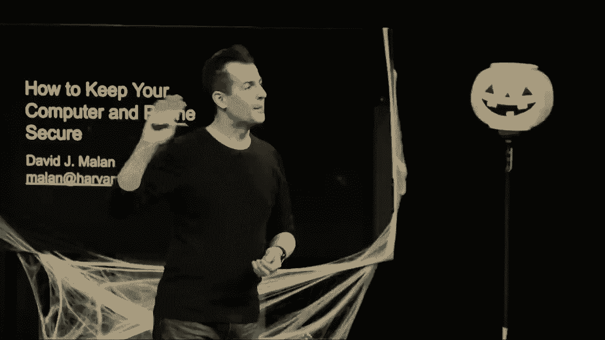

# 哈佛CS50-CS ｜ 计算机科学导论(2020·完整版) - P17：【CS50网络安全讲座】如何保证电脑和手机的安全 - ShowMeAI - BV1Hh411W7Up

好的，这里是CS50，这不是一个典型的CS50周。这是2020年秋季，我们在校园中处于一周中的中间，通常这是新生家庭周，家长和家属可以参加课程，听讲座并了解他们的课程。

今年，我们所有人都在远程数字参与，除了已经在这里的人。因此，我们今年的想法是举行一种虚拟讲座，围绕一个主题进行讨论，这个主题并不需要你在CS50上课，因为这是一个至少对我们所有人都熟悉的话题。

从技术上讲，这个话题对我们所有人来说都是熟悉的，那就是安全或网络安全。我们今天提出的讨论主题是，如何保持你自己的计算机，无论是笔记本还是台式机，或者是你的手机，这也是一种计算机，安全。我敢说，尽管我们会深入一些细节，但这个话题是非常重要的。

这种情况是熟悉的，因为我们每天都在现实世界中接触到好与坏的安全。想想你所居住的家，

无论是房子、 apartment、宿舍还是其他地方，通常你会在门上装有锁，根据你的居住地点，窗户上可能还有栅栏。但通常，在不同层次上有安全的体现。我是说，可能一层的窗户有栅栏，但二层或三层可能没有。

这就是说，有人可能会。

从技术上讲，攻击者可能通过二层或三层进入你的家，但当然这会更困难，因为他们需要梯子或者其他形式的物理方式到达那样的高度，这时他们可能会吸引更多的注意。

因此，假设有一个对手试图闯入你的家，考虑到他们必须实际达到那个高度，概率是相对较低的。

从一层楼以上进入的可能性相对较低，但并不是零。技术上来说，没什么阻止他们从梯子上爬上去，进入那个没有栅栏的开放窗户，这样的事情虽然可能性较小，但实际上，这是考虑安全性的一种好方法，数字世界也是如此，实际上并不存在真正的安全。

像你的手机这样的设备并不安全。

从根本上说，您的系统在某种程度上是安全的，可能在某些攻击或特定类型的对手资源方面是安全的。

而这些资源可能是时间、金钱或技术能力。但这实际上是一个权衡，因此虽然有点不幸，但关于安全的一个思考方式是，您不希望在绝对意义上是安全的，您希望更加安全。

比如说，您的邻居的房子更安全，您希望以某种方式提高对手的门槛，无论是从物理上还是从隐喻上，以便消耗太多时间。

花费太多金钱、精力去闯入您的家，他们不如直接去下一个，确实。在计算机领域也是如此，但我们将以更计算的方式来衡量系统的安全性，而不是那么多地关注物理方面。

所以说，接下来请您打开这个网址，若您使用的是笔记本电脑或台式机，请在另一个浏览器中打开它，或者在新的标签页中打开。如果您在手机上，您可以在两个窗口之间来回切换。请在有时间的时候打开这个网址，我们将使用它。

要提出一些互动问题，您可以以数字方式回应，同时我们也会在今天的过程中接受问题和评论，所以说，安全的意义是什么？让我们对此进行一些思考，您如何看待“安全”这个词在您的手机、计算机或家庭的上下文中意味着什么，请随意解释。

安全的意义是什么呢？您会！

在Zoom上请举手，若您感到害羞，欢迎通过聊天参与，布莱恩可以代为提问，但无论如何，请随意虚拟举手，定义一下，嗯，如何称呼您是Pranav，如果我发音正确的话，意味着要保护存储在特定系统上的所有数据，如果我们谈论的是技术。

至少要让事情变得困难，给自己足够的时间，这样某些人就可能无法在当前时刻黑入您的系统。保护您的系统可能不能持续您的整个生命周期，但我会说至少要不断为自己争取时间，可以吗？我喜欢这个，所以安全就是。

关于保护某人不接触您的资源，但正如我自己到目前为止所说的那样，这在绝对上确实很难争论，您希望能够。

使您的系统在被攻破时花费太多时间，使得您的手机或笔记本电脑被攻破的时间过长，这样您就有些概率上。

从统计学上看，对手是安全的，因为他们不会想浪费那。

破解你的特定系统与其他人的系统相比，花费的时间、精力或金钱都很少。你我在现实世界中试图保持我们的笔记本电脑和手机安全的方式各有不同，而最流行的网络机制之一当然是密码，密码可以是某种短语或数字，理想情况下只有你知道。

使用该密码进入设备，举手的人中有多少人有密码？

如果你使用笔记本电脑或台式机，几乎所有人都举手。那些不举手的人，可能是做出了有意识的选择不使用密码，也许是因为输入密码很麻烦，或者你并不担心周围的人。

你进入设备时，应该承认或意识到存在威胁。

对于某人来说，进入你的笔记本电脑或台式机要比进入其他人更容易。你们中有手机或移动设备的，多少人有密码？

设备上的密码，在你的手机上，看到举手的人稍微少一些，看到这么多人举手很好，但似乎仍然有些人没有。希望你们考虑过这意味着什么，这意味着你的父母、兄弟姐妹或陌生人，如果他们随意拿起你的手机，无论是在家中还是在外面。

在咖啡馆或机场，立即访问。

这对你所有的数据来说，显然不如需要密码的设备安全。但让我们考虑如何通过使用这样简单熟悉的机制，比如密码，来衡量你电脑的安全性。事实证明，作为人类，你我在选择这些密码时并不擅长。

截至2019年底，这个世界上最常见的密码是“一二三四五六”。在已知的密码中，列表上的第二位是稍微好一点的“一二三四五六七八九”，之后就是。

“qwerty”如果看起来有点奇怪，看看你键盘的左上方，q-w-e-r-t-y是美国键盘上拼写的内容，人们实际上并没有努力想出他们的密码，尽管从技术上讲，这并不是一个英语单词，“password”是第四个最受欢迎的密码，p-a-s-s-w-o-r-d。

这听起来有点太戏谑，根本不安全，之后是稍微糟糕的一个二、三、四、五、六、七，接着是一、二、三、四、五、六、七、八，之后是一、二、三、四、五，你也许会觉得可爱，我爱你，但如果你觉得自己在设置密码，嗯，还有很多其他人也是，111111也是很流行的。

然后最后是二、三、一、二、三。那么，为什么这些密码你可以从这个列表中推测出一些，这些人使用这些密码的可能性。大概率这些人在手机、网站或其他系统上使用密码，可能有一个最小的密码长度。这些人可能需要一个长度为六个字符的密码。

需要一个九个字符长的密码，等等，因此你可以看到一些公司、大学和软件制造商可能实施的政策。可以说，如果你的密码在这个列表上，你今天讨论的第一个结论应该是，至少要更改这个密码，如果你。

在乎这个账户，我认为这确实应该考虑在内，什么类型的账户。如果是某个无聊网站或游戏，你永远不打算再使用。如果是你的银行账户、学生记录或医疗相关信息。

你可能真的不想在这个列表上看到你的密码，因此要考虑我们做出今天所有决定的背景。现在，这些密码为什么不好，以及风险是什么，在计算机科学中有一个术语就是暴力破解攻击，这种攻击就是它的字面意思。

指的是对手，想要得到你或某个人的人，他们有一个设备或编写软件，试图仅仅通过猜测来获取你的密码。如果他们不知道你的密码，他们不会仅仅尝试随机数字，而是会尝试111111。然后他们会尝试111111，可能是手动输入。

可能是你被盗的手机，或者是通过编写软件，然后通过 USB、电缆或类似的连接方式。暴力破解攻击基本上意味着对手并不一定知道你的任何信息，比如你的名字、生日等。

孩子的名字等等，但他们确实有很多时间或技能，所以他们只会尝试所有可能的密码。我认为这种攻击的一个启发是，它给了我们一个机会来开始思考如何。

我们能否保护自己免受攻击，现在你的手机和电脑上的账户对暴力破解攻击有多安全？让我们考虑对手可能如何做到这一点。让我先播放这个动画，展示一个小机器人正在用这个小机械手在安卓手机上输入。

这里有一个放大的版本，由一个机器人设计的物理设备，能够输入所有可能的密码。你可以想象这个对手的日常生活，他们在睡觉，而这个东西一直在暴力破解你的密码，所以最终可能会幸运地找到你使用的代码，但当然。

可能还有其他威胁，实际上任何上过CS50或CS50x课程，甚至只是前几周的学习的人，都能写出模拟那个机器人物理行为的软件。软件的特点是，一旦没有任何运动部件，就能做很多事情。

速度要快得多，因为它是电子的，完全没有机械部分。如果我从你身上偷走了你的手机，然后将我的Mac或PC通过USB线或Lightning连接器连接到你的手机，这样我就可以编写代码不断尝试所有可能的密码。

假设你的手机使用的是一个常见的默认设置，至少在过去的iPhone或安卓手机上都是这样，四位数密码。如果你的密码是四位数，那么我们谈论的是十进制数字，从零到九，即零、一、二、三。

你需要从四、五、六、七、八、九中选择四个数字，形成某种模式。这些数字长度为四位，如果你的密码是四位数的，可以开始考虑密码的安全性，想一想对手暴力破解实际密码从000开始需要多长时间。

例如，最多到9999，让我打开之前的内容。你很快会看到一个调查，问你这个非常相同的问题，也就是有多少四位数密码可能。请稍等一下，你会在屏幕上看到，另外让我在我的端口全屏显示。

如果你之前错过了网址，或者不小心关闭了标签页，可以再次访问我屏幕顶部的URL。四位数密码有多少种可能？在这里的答案可能是4、40、9999或者也许是10,000，欢迎用其中一个回答来参与。

到目前为止已有一百个回答，我们再给你几秒钟的时间参与，再给你几秒钟的时间。让我开始揭示结果，所以看起来像是。

嗯，超过60%的人认为有10,000种可能性，27%的人认为是999种可能性，还有一些人认为是40或4。还有很多人不确定，所以让我们考虑如何回答这个问题。为了回答这个问题，我提议我们做。

一些非常简单的算术，不需要太复杂。但数学可以这样考虑，如果我们有一个四位的密码，四位数字，每一位都可以是零到九，总共十个数字，即零、一个、二、三、四、五、六、七、八。

每个四位数字可能有九十种值，所以如果是这样，我认为是公平的。第一位数字乘以第二位的十种可能性，再乘以十，乘以十，当然，如果把这些全部相乘，答案确实是。10,000种可能性，所以如果你现在有一部iPhone或安卓手机。

你有一个四位数的密码，你认为没有人知道，这很可能是事实。但你应该担心或考虑，如果一个朋友用一个精巧的机器人，将你的手机连接到那个设备上，直接从零到9999，或者更聪明的是，通过电缆将你的手机连接到他们的笔记本电脑。

写软件来生成所有这些可能性，其实有点令人担忧，后者并不那么难做到，实际上写代码是可行的，因此让我在我的mac上，打开一个名为crack.dot.pi的程序。crack是编程中的术语，意味着以暴力方式破解。

什么是算法，尤其是那些从未见过这些的父母和家人，这完全没问题，你们对这都是新的。你们的儿子和女儿，以及在场的其他人，见过一点这段代码，但我们会简短地说，这段代码的努力是用来进行暴力破解的。

攻击你自己的手机，而我在这里要写的代码是一种叫做python的语言，这在今天非常流行。我将执行这样的命令，从字符串中导入数字，这只是python这门编程语言中的一种巧妙方式，给我访问所有可能的十进制数字。

从零到九，然后我将“导入”一些来自库的东西，也就是其他聪明人写的软件，叫做product，结果是功能或功能性，就像在。

像加法、减法、乘法和除法这样的运算，我在这里导入的函数是这个，乘积的概念，这实际上意味着所有可能数字的排列，而现在我将使用所谓的循环。在编程中，程序中的循环是，并且，再次，我将继续说这个。

用所有这些数字的乘积生成密码，并将这些数字重复四次。继续打印出每个密码，让我们来看看。

让我使用一些稍微神秘的语法来打印出来，但这只是因为我要将一个列表作为实际字符串打印出来，亲戚和家人们，暂时不要担心这意味着什么，嗯，cs50和。

cs50x的学生们，这只是用几行代码巧妙地迭代从0到9的所有数字，将它们四个一组组合起来并打印出所有可能的排列。所以如果我没有搞错，我将保存我的文件，并运行一个叫做python的命令在crack。

并按下回车，轰！那真的很快，事实上让我再做一次，清除我的屏幕并重新运行这个crack。

程序爆炸，这就是计算机的速度，我的小麦克这里，零点零和九千九百九十九，它如此之快，因为它在眨眼之间完成了所有操作。所以如果你认为你的四位密码是安全的，可能真的并非如此，因为可能只需一些努力就能让你家里的人写出代码。

比如，晚上在你没有注意的时候悄悄连接你的手机，看看你的密码到底是什么。那么，除了使用数字，还有什么更好的方法呢？为什么不使用英文字母呢？今天我们就用英文字母，在英文字母中，我们有更多的。

字母比我们拥有的数字还要多，那么我们该如何思考这个问题呢？让我们在这里提出一个问题。如果你今天之后更换手机，使用四个英文字母，而不是单独使用数字，那么可能性有多少呢？让我打开一个不同的投票问题，这次询问有多少。

四位数字密码是可能的，稍后你将在同一个窗口中看到这个问题，询问有多少种四位字母密码是可能的，我们将看看大家对此的看法。为了公平起见，我还没有给出一个合格的答案，所以你可能需要自行推断。

英文字母的字母有大写和小写。如果你允许用户输入一些区分大小写的内容，那么对于这四个字母来说就不是26种可能性了。所以看起来你们中有78%的人认为大约有七种可能。

使用四位字母密码时有数百万种可能性，大约11%的人认为有52000种密码。那么，让我们快速计算一下。再一次，这不需要特别复杂的数学，让我打开一个类似的方法来解决这个问题。

字母表和我们假设的大小写敏感性，公平地说，你可能没有假设。好吧，我想我们有52个。

可能性是52的四次方，如果你将它们相乘，你确实会得到七百万以上的可能性。因此，考虑一下，如果你当前使用的密码是纯数字的四位密码，那么你与潜在威胁之间仅有一万种可能。

如果你将四位数的密码更改为四个字母的密码，那么你和对手之间就有七百万种可能的密码。那为什么这样更好呢？无论他们是使用机器人还是代码。

这将需要他们更多的时间来破解你的设备。再次强调，如果需要花费那么多的时间和精力，甚至是金钱，其他人可能确实会更安全，因为可能更容易破解那个手机，而不是尝试进入这个。

那么我们来考虑一下这在实际代码中的作用，让我回到我的Mac上，打开之前的那个文件。让我来更改一些内容，使用我所称的ASCII字母，而不是数字，给不熟悉计算机科学的朋友们。

ASCII基本上指的是你在英语中通常看到的所有可打印字母，所以包括大写字母A到Z和小写字母。我要把我提到的数字更改为ASCII字母。因此，程序几乎是相同的，但它将使用所有52个大写字母。

还有小写的英文字母，这个文件。

让我重新运行Python的crack。hi，这次我实际上有时间走到屏幕前，指出我们现在正通过小写字母z。现在我们正在遍历所有可能的字母，这依然非常快，可能是10秒后完成的。我们从aaa到zzz，因此我们提高了难度。

我们的安全性，因为这将需要对手花更多的时间或精力，来真正破解我们的设备。那么我们再考虑另一个问题，假如我们进一步将其推广到字符，而在你们当中可能有些人不太清楚字符与楼层之间的区别。

当你注册网站时，这些天有点烦人。因为那些网站通常强迫你选择一个好的密码，而“好的密码”通常意味着什么？如今你的密码通常必须包含什么，才能让网站让你继续。

嗯，随时可以举起你们的虚拟手，让我们看看，布赖恩，我们有谁。

关于 dax，你觉得至少八个字符如何？数字和大写字母，所以至少有一个数字和字符的组合。我喜欢这样，所以我们可能有 62 个，如果我们结合字母和数字，而不是 26 或 52 或 10。还有其他关于网站的想法，通常，好的，特殊字符或井号。

也许是一个感叹号，或者其他的，是的，这些符号坦率地说，我和你一样恼火，当这些网站烦扰你并说不，你不能使用那个密码，不，你不能使用那个密码，你需要猜测。但确实，如果我们在混合中加入标点符号，我认为我们可以做得更好，实际上是一个字符。

因此，任何类型的字符，包括标点符号、字母或数字，和仅字符不同，实际上在 ASCII 中，cs50 学生会知道计算机通常使用。每个符号有 94 种可能性，因为你有 10 个字母和 10 个数字 0 到 9。

有 26 个小写字母，26 个大写字母，如果你在英文键盘上数一下，还有 32 个字符表示标点符号，比如井号、感叹号、逗号和句号，所以如果每个符号有 94 种可能性，结果你就有了总共 7800 万种，好的，现在我们真的在提高标准。

对于对手来说，因为现在他们必须花费更多的时间来破解你的密码，实际上让我模拟一下，使用一些实际的代码，让我继续打开之前的相同程序，这次让我导入的不仅是 ASCII 字母，还有数字和实际的标点符号。

我在这种语言中编写的代码叫做 Python，字面意思是通过只需导入这一行代码来访问所有可打印的标点符号，我只需要在这里更改一行代码。我需要实际说出 ASCII 字母，加上，Python，cs50 的学生们会知道。

你可以以这种方式连接两个列表，似乎把它们都放在一起，但我仍然打算用长度为四的方式来处理。

现在让我继续保存这个程序并将其作为 Python 代码重新运行，破解 pi。现在我可以坦诚地慢慢走向屏幕，因为现在你在屏幕上看到的是四个可能的符号，但包括 32 个可能性，列表此时更长，我们已经经历了这个故事的阶段。

所有的小写字母到 z，刚才提到的，现在我们只是在 m 的 n 的 o 的 p 的情况下，换句话说，如果我的 Mac 不只是把它打印在屏幕上，而是连接到我偷的你的手机，并以某种方式将所有这些可能的密码发送到你的手机上，那么花费的时间就会是这个。

现在解决方案，公平地说，我们几乎到小写字母z了。所以你知道如果我们再拖延一两分钟，一百万的可能性并不算太令人印象深刻，所以我敢说我们应该做得更好。那么，什么可能比四个字符的密码更好呢？

有什么想法或志愿者，什么会比四个字符更好的密码，再次强调每个字符都是字母、数字或标点符号，列表相当不错，但我想我们能在一分钟内完成。你有什么想法，莱奥？我觉得我们需要让莱奥解除静音。你好，是的，成功了，嗯，至少需要一个八个字符的更长密码。

完美，所以使用至少八个字符的更长密码，注意这里我们现在甚至在计算数字，但似乎快结束了标点符号。但再次，如果我给这稍微多一点时间，我觉得我有点过于热心，可能在一分钟内并不会完成，但如果我们再加些字符。

好吧，八个字符会需要更长的时间，这可能还要多久让我先来一个有点不同但精神相似的问题。稍等一下，这个问题就会出现在你的屏幕上，问题是有多少种八字符的密码可能，请稍等让我打开它。

屏幕你应该很快就会看到，实际上现在你们的屏幕上应该能看到这个问题。多少种八字符密码是可能的，这次我有点随意地提了一下，我还没仔细算数学，但我提议大约有一百万种可能。

十亿、万亿、千万亿、千亿的人，你们或许注意到了一种模式，你们直接跳到了千亿，对吧？不错的直觉，看来我们大约有60%的人认为是一个千亿，25%的人认为是一个千万亿，然后越来越少。

对于其他人，让我们看看实际答案是什么。请稍等，我来计算一下这里的数学。如果我们在屏幕上计算，当然我们需要做一些更多的计算。乘法，而不是仅仅按照莱奥建议的使用八种可能符号的情况。

如果你这样做，我不得不考虑，这实际上是，让我们看看，我们有百万、十亿、万亿、千万亿，所以你得到了。所以这并不是列表上最大的选项，答案确实是千万亿，所以六千万亿，如果你愿意，但那些喜欢。

拥有千亿的可能性是相当安全的，因为这将需要对手花费更长的时间去破解你的密码，嗯，从六千兆变到千亿只需要，提出的，不是八个字符的密码，而是十个字符的密码，我们实际上会达到千亿的安全性，密码越长越复杂。

所以根据逻辑，你应该使用八个字符，而不是十个。也许它们有20个字符，甚至是100个字符，但在这里我们看到另一个安全主题，即权衡，最终目标可能不是达到安全，而是要考虑你可能有的其他目标，所以让我问这个问题。

在这里延长密码的长度有什么权衡呢？作为人类，你的代价是什么？在计算机科学和生活中，总是有附带条件，总是有成本，那么，当你让密码更长时，成本是什么？让我们看看，布莱恩在，嗯，吉尼那里，我觉得这很困难。

对于一个人来说，记住如此长的密码很困难，因此我们甚至在系统中存储这些长密码，以便在需要登录时使用，是的，这就是记住这些东西的权衡。如果我可以再次在我的讲台上发言，如果你是那些人中的一员。

拥有相当不错的密码，所谓的好密码是一些数字、字母和标点符号，但它写在你工作时的监视器上的便利贴上，或者可能更巧妙地写在一个微软Word文档中。

你的文件可能在硬盘上，或者在谷歌文档里，甚至可能是在抽屉里的纸张上，你只是在暴露自己于其他威胁中，当然这里也有一种社会学考虑，或者只是政策考虑，无论是大学，还是有多个家庭成员的家庭，你的政策应该是什么。

因为可以说这不是珍妮的错，如果我们的密码如此难以记住以至于不得不写在纸上，这也不是我们的错。此外，我甚至还没提出这个建议，但如果你是那种在多个网站上使用同一个密码的人。

一旦这些应用程序或网站被攻破，而你的密码泄露，无论是“我爱你”这种简单的密码，还是更复杂的，只需对手在你的其他账户上尝试相同的密码，你就只是让自己暴露于更多风险中。但回应珍妮的观点，我的天，这到底要到何时？现在我需要一个非常长的密码。

在这个网站上有随机密码，这个、这个和这个应用，到处都是。老实说，作为一个人，我肯定无法记住所有这些密码，即使我能记住，我觉得还有更重要的事情要记住，而不是这些账户的密码。

这里肯定有一个权衡，但再次强调，目标是以某种概率将对手挡在外面，而不一定是绝对的。那么我们还可以做些什么来防止对手入侵我们的系统，这样我就可以有一个相对容易记住的密码，但至少能把他们挡在外面呢？这是一个。

这是你可能无意中做的截图，可能是在晚上有点昏昏欲睡，眼睛有点模糊，试图输入密码错误太多次。事实上，通过身体的表现，显示你之前也因多次输入错误密码而被锁出了手机，我确实就在前几天发生过。

比如在iPhone上，它看起来像是放大了一分钟，所以你不必扔掉手机重新开始，但iPhone在提示你。

你可以等一分钟再回来，如果我们看一下安卓，比如说安卓壁纸肯定会有所不同，但在这里，比如说它会显示太多尝试，请稍后再试，我的意思是这有点让人恼火，因为如果我现在拿起手机，我想立刻进入。

那“稍后”到底是什么呢？那么暂且不提，今天的主要观点是什么，为什么苹果会这样做？

那谷歌为什么这么做呢？我敢打赌，如果你曾经把自己锁在手机外面，一定在那个时候非常恼火，但当他们因猜错密码而锁你出手机时，他们这样做的好处是什么呢？

为什么这可以说是一个特性而不是一个问题呢？

嗯，是的，它用于减少成功暴力破解的几率。那你会说它是如何减少这种可能性的呢？因为它让攻击者必须尝试更多次才能成功进入手机，所以它确实降低了成功的几率，确实，这在安全领域是一个非常常见的原则。

之前也提到过，只需减缓对手的速度，我们不必重新思考安全问题，也不必重新设计密码，而是应该让对手更难以登录，理想情况下不让你更难。

数字密码有一万个可能性，电脑或机器人可以很快猜到这些，但如果输入错误密码三次或十次后，某个小次数，iPhone或安卓手机会锁你一分钟，就像刚才iPhone所做的那样。

嗯，这可能意味着即使只有一万种可能性，破解你的密码可能需要对手一万分钟，因为他们每次输入错误密码时都会被拖慢。而也许这不是确切的一万，而是某种方式。

也许你有一个10位的密码锁，可能性达到78万亿。想象一下，手机每次都慢你一秒钟，也许你每秒只能输入一个密码，万亿。

可能会慢下来，这可能足以阻止对手。因此，如果你在任何设备上没有启用这样的功能，你应该现在寻找它们。谢天谢地，它们通常都是预配置好的。但也有缺点，不应该仅仅开启这些防御措施。 

盲目启用这些功能的缺点是什么？启用它们和如果它们尚未启用有什么不同？这里的缺点是什么？为了明确起见，因为我们今天的建议不会是100%有效。如果你忘记了密码，那就意味着你再次访问手机会花更长的时间。

是的，这将花费用户一些时间，我也承认我多次锁定自己。然后我变得固执，我认为我的愤怒水平上升，因此开始更愤怒地输入，结果犯了更多错误。苹果和谷歌所做的是，他们有你可以描述的方式。

第一次被惩罚，你知道要等一分钟，现在你必须等一分钟。如果你再出错，那么你必须等两分钟，如果你再出错，也许是五分钟，也许是十分钟，或者一个小时。那时我真的想把我的手机扔到房间另一边，因为我。

我无法进入自己的设备，这时你开始牺牲可用性。对吧，如果我的设备安全到连我自己都进不去，那么它真的值得拥有吗？所以找到那个拐点非常重要，因为你必须找到那个拐点，以便用户能够使用良好的密码和密码锁。

但他们并不是仅仅把它们贴在监视器上的便签上，或者完全禁用它们。好吧，让我在这里暂停一下，看看是否有关于密码、密码锁、暴力破解或这些防御措施的任何问题，考虑到这些防御措施是为了防止对我们不希望他们访问的硬件和软件的对手。

现在，有一个明确的数字，我们可以计算出对于四位数字，这可能是结果的最大数量，但我们的矩阵又是什么呢。

指纹扫描，确实是个好问题，那么生物识别技术呢？像苹果现在的面部识别，这也是。

有时让我烦恼的是，如果它没能正确识别我的脸，或者现在我们，如果戴着口罩，使用这类功能就很让人恼火，但。也许概率上是更少的。

有着完全相同面部特征的人，通常比输入某个密码要安全。有时你使用指纹或视网膜扫描，或者，像手指之间的距离。这些不同的测量方法，统计上往往不会，唯一识别我们。

但足以唯一识别我们所有人，并且，也有威胁，一个以前的，双胞胎兄弟。因为苹果的面部识别，现在能通过。仅仅从桌子上拿起手机，作为双胞胎，他们看起来都太相似，所以也有缺点。

也有好处，但生物识别技术也可以帮助事情，所以，始终。并不是说你，只需要记住某个东西。事实上，这正好是计算机科学家所称的，双因素身份验证在，安全领域安全人士会，称之为。

我们使用的密码是一个因素和，因素。

确实，双因素身份验证，攻击者，并不只是依赖于你，知道的东西，比如密码，它通常也依赖于。

你拥有的，或类似的，密码并且，从数据库中某处下载。你以前使用过，它们不一定能访问。

除非他们有对你的物理访问权限，威胁，但还有其他形式的双因素。身份验证，例如，如果，这听起来熟悉，现在可能。你甚至不叫它双因素，双步，身份验证，呃，举手谁有一个或多个账户，使用两个因素，而不仅仅是一个，是的，这里也是。

很高兴看到这么多手举起，但如果你不使用双因素。身份验证来保护你的电子邮件账户或银行账户。或者你的经纪账户或你的，医疗健康账户，你真的。应该开始考虑这样做，而这通常采用什么形式呢。

让我展示一个gmail账户的截图，供你工作或个人使用。

你可以启用谷歌所称的，双因素，身份验证，当你登录你的gmail账户时，你会被提示，如果你，呃，如果你启用这不仅仅是你的。用户名和密码，还有一个六位数的代码，六位数字，听起来并不长。但在这种情况下，这些信息是通过文本，信息或特别应用发送到你的，设备。

拥有这个设备，因此只有你知道那个代码，更好的是，这些代码是有时效的，所以即使某个对手截获了它，或看到你在输入时的侧影，你也只能使用这些代码一次，这样一来，就可以独立使用。所以现在再考虑一下，我不能强调这一点。

你已经有自己的银行账户、经纪账户，任何与医疗相关的事情，任何你觉得特别重要或个人的事情，比如你自己的电子邮件密码，从今天开始，你已经拥有数学工具和心理模型，我敢说，可以轻松搞清楚。

你的信息。

并且可以保护你的财产，或读取你的电子邮件等，因此你可以更好地改善这个，更长、更随机的密码，以某种方式记住或背诵。此外，通过启用双因素认证，缩小对你构成威胁的数量，因此，正如所说的双因素。

认证时，还有另一件事情可以考虑，当涉及到管理所有密码时，我提到过使用微软Word或便签纸，也有软件解决方案，因此我们今天想为你提供的另一种防御是通常所称的密码。

管理器，这是一种软件。

免费使用或付费的，适用于你的手机、笔记本电脑或台式机。它在最简单的形式上就像一个电子表格，但在你自己的计算机上是安全的，所谓的密码管理器，这里有两个受欢迎的选择，onepassword.com是一个流行的工具，lastpass.com是另一个，还有。

其他选择，如果你搜索一下，但我总是建议阅读评论或获取第二意见，不要仅仅接受我们所提议的，输入后你将它们都保存起来，背后有一个主密码，一个真的很长的密码，希望是随机的，包含大量数字、字母和符号。

主密码，通过在你的Mac、PC或手机上输入该密码，你就可以解锁所有其他账户的用户名和密码，或者这些程序还提供了键盘命令，哇，你就会自动登录网站，无需。

复制粘贴或手动记录，所以到现在为止，这对我意味着什么，我使用这些密码管理器，我的大多数同事也是。我们许多人甚至不知道我们在各种网站或应用程序上使用的密码，为什么，因为我们现在信任密码管理器，可以通过点击按钮来完成。

生成一个非常长的随机密码，包含大量数字、符号和标点。然后它会为我记住这个密码，我只需记住那个保护所有其他密码的主密码，这样就好，因为现在我可以实践我所宣扬的。但我意识到，这也有一个缺点，我正在暴露自己于一种新的风险。

脆弱性，也就是说，这里的权衡是什么，为什么你不应该在今天的课程后，立即下载并安装密码管理器，而是先思考一下，可能有什么缺点，这听起来不错，是吧？

像是 lex lean，如果我说得对，嗯，是的，如果有人破解了你的密码管理器密码，那么他们就可以访问你所有的密码。所以这真的取决于这里的威胁是什么，或者你最担心的是什么。如果有人妥协、猜测、弄清楚你的主密码。

这保护了所有其他的，现在你刚刚将所有账户一次性交给了它。这是一个巨大的权衡，不过如果你再次考虑替代方案，想出随机的复杂密码，然后记住它们，或者有些愚蠢地将它们写下来，监控。问题不应该是，这是呃？

这是否是正确的做法，但相对来说，这是否是更好的做法，你的风险是什么，你担心的是哪种风险。但也许你可以把密码管理器的主密码写下来，放在一个物理保险箱或者防火柜之类的地方。

这有非常低的概率会被别人访问，除非他们物理攻击那个设备或者隐藏它。是的，这确实脆弱，但找到它的几率可能相对较低，但再次强调，这是一个主题，找出你账户的正确平衡以及安全性。

你想要追求的目标，我们来考虑几个其他的防御措施，最后我们将留出时间讨论技巧，保护自己在线的另一个基础是什么，加密，cs50的学生会知道，加密是指信息的加扰。

数据看起来像随机数据，但通过称为密钥的东西进行加密，通常是只有你和接收者知道的密钥，加密往往是解决我们很多问题的方案，事实上，这些密码管理器通常还会额外加密你的数据，这样即使有人偷了你的 Mac 和 PC，也不能轻易打开程序。

所有的数据2同样是加密的，很多人已经被社会训练或条件化，至少要寻找、希望或识别 https。冒号斜杠斜杠，s 表示安全，这往往是好事，因为这意味着一个你正在使用的网站。

访问是安全的，采用加密，而不是几年前更为常见的未加密的http。也就是说，如果你访问的网址仅为http，理论上你与那个网站之间的任何人都可能监听你的流量。

如果你在某个外国访问敏感资料，政府可能会知道你正在访问哪些网站和内容，这让事情变得更加复杂，虽然不是百分之百安全，仍然可能存在攻击，但这确实提高了安全门槛。

但有一种越来越多地被媒体讨论的技术，你应该熟悉，即端到端加密。

端到端加密意味着，当你使用第三方服务时，无论是聊天还是其他，你不仅是在加密你的流量，而是加密你与交谈对象之间的数据。因此，例如WhatsApp这种流行的消息工具。

早期的聊天程序中就有这个特性，现代许多聊天程序也具备，包括iMessage、Signal和Telegram等。

端到端加密意味着，即使你在使用一个你可能信任也可能不信任的第三方服务，你的沟通仍然是与你的交谈对象之间的交流，位于公司服务器之间的信息，他们无法解密这些信息。

至少最近，Zoom就是这样，实际上在几个月前因为其营销文献中提到的加密技术而受到一些批评，因为那是错误的，真正的端到端加密并不存在。

你与沟通对象之间的连接，然而当时的营销文献表述不当，Zoom与安全研究人员、计算机科学家或一般技术人员所定义的端到端加密不符。不过，他们最近几周开始推出真正的端到端加密。

目前我们没有使用加密。

这实际上使某些特性存在权衡，但一般而言，如果你正在进行最私密或私人的沟通。

个人、财务或医疗信息，以及与人沟通。这是你应该开始寻找和倾听的另一种特性，尤其是在涉及社区时，这种软件越来越受到政府攻击，因为他们常常想要后门，以便美国的NSA。

或者联邦调查局或其他某个实体可以进入这些通信，这在使用端到端加密后变得更加困难，因此你的通信确实是安全的。好吧，在我们最后的时刻，让我们最终关注一下Zoom，这正是我们正在使用的技术，因为他们确实遭受了一些批评。

超越端到端加密的功能，许多用户几个月前决定停止使用Zoom，尽管他们的业务依然繁荣。那么，Zoom安全吗？让我们向小组提出最后一个问题，记住我们现在刚刚讨论了安全性，让我继续问这个将在你们屏幕上出现的最后问题。

它很简单：Zoom安全吗？我们将给你们提供“是”或“否”的选项。好吧，让我们看看反应如何，我看到55%的反馈。

没有16%的支持，只有28%的支持，让我们在你们中间讨论一下，认为Zoom安全的，为什么你认为它安全？有没有人愿意举个虚拟手，以便我们可以叫到你，或者在聊天中评论一下？有没有志愿者？让我们看看，比如说，萨姆，两天前，Zoom提供了一个。

端到端加密适用于所有用户，确实，Zoom开始逐步推出端到端加密的试点，所有用户都能使用。所以，如果Zoom正确地实施了这个概念，那么是的，也许Zoom在某种程度上是安全的，因为你和其他人的视频对话确实是私密的。

话虽如此，如果你在咖啡店或图书馆，尤其是在健康的时光，有人在旁边看着你。

或者倾听你的对话，甚至可以说那种技术也并不安全。你可以想象可能还有其他威胁，或许你无意中遭遇了某种病毒，或者你的计算机上存在某种威胁，即使在你和那个其他人之间，这并不意味着没有恶意软件在运行。

在你自己的Mac或PC上，或者在对方的设备上，记录着你说的每一句话。

对于敌对者来说，每当你询问或回答有关安全性的问题时，也要考虑这些条件，因为安全问题绝不应该在真空中讨论。因此，那些说不的，我认为我们可以找出更多的理由，但至少让我消除一些误解。

我认为Zoom所遭受的一些批评被夸大了，因为那些批评的人并没有真正理解一些问题。例如，今天你们所有人登录这个会议，可能是通过一个你们收到了邮件的URL，或者在你们屏幕上看到的URL。

可能看起来像这样 https，这很好，zoom.us 或类似的地址，后面跟着一个数字，比如会议 ID，例如五五五一一一，或者其他不同的数字。注册后，这个网址安全吗？尽管你们所有人现在都可能已注册，但从技术上讲，并没有任何东西可以阻止你们中的任何一个人。

通过短信、电子邮件或直接消息，这个相同的网址可以分享给互联网中的任何人，他们因此可以加入，也许无需注册，这可能是一种威胁。不过，Zoom 通常在你注册时发送的不是像这样的简单网址，而是一个更长的地址。确实，还有另一个细节，一些网址也可能像这样看起来像个问题。

在结尾标记和 pwd 代表密码，然后是某种密码。确实，今天你点击的 URL 看起来更像那样，仍然不同，因为它们是特殊注册的。

密码，现在你需要知道会议 ID 和密码才能加入特定的 Zoom 会议。如果你今天不是像我们这样进行大型课程，而是进行一对一或小规模会议，通常你会收到或生成一个看起来像这样的 URL。

或者更好的是，它看起来像这样，这样对手就无法仅仅猜测会议 ID，这正是早期发生的情况。Zoom 通常不要求会议 ID，这意味着在你加入会议之前，唯一阻止对手黑入会议的，就是猜测会议 ID。

我们已经看到，我花了大约一分钟三十秒写了一个 Python 程序，生成所有可能长度为 4 或 8 的数字。因此，你知道，有些人有太多的空闲时间，他们在编写代码，尝试所有可能的网址。所以如果你曾经被 Zoom 入侵，也许是因为有人分享了这个。

将网址分享给不该分享的人，或者可能有人有一点编程经验或只是运气好的特点，诚实地说，必须输入会议 ID 和密码是相当麻烦的，这开始影响系统的可用性。很多公司的人可能会选择其他产品。

如果其他产品更容易开始视频会议。所以可以说，这是一项有意识的决定，Zoom 方面现在大学和公司已经开始要求这个或另一个功能，称为候诊室，今天。但这再次提高了攻击这些系统的门槛，所以 Zoom 安全么？

是的也不是，实际上应该考虑的不是在真空中，而是在你担心的各种威胁的背景下，以及你愿意采取什么样的防御措施。因此，就像在现实世界中，你可能会有自己的房子或公寓，可能在门窗上有锁、闩和栏杆。

知道有些时候如果你需要五扇门。

只是为了进入你的家，可能会很享受回家的感觉，因为这需要很长时间。你可能会在窗户上装上栏杆来阻止那个人物理上进入，但这看起来并不美观。

特别不错，而且没有其他的，这种权衡存在于其中。我们希望今天的收获之一，就是更好的思考过程，无论是你的手机、电脑，还是你的家，都能够安全，并且认识到这种权衡。我们鼓励你最终去问这些问题，如果有任何公司。

如果任何应用程序或网站只是在上面说。

他们的网站说我们是安全的，这简直是胡说八道，这本身没有任何意义，直到你开始问问题，比如，你的安全针对什么，效果如何。非常感谢你们的加入，让我们正式结束这里，但如果你们想继续问问题，欢迎大家留下来。

问题，布莱恩，如果你想请任何人提问，哦，是的，我有一个问题，记得你说过对于iPhone 10或某个错误尝试的次数，但是当你输入密码时，是不是也是这种情况？因为那时即使是可负担的密码也真的得到了保护，因为可能只有一个人会试图黑入，是的，这确实很好。

问题取决于设备，所以如果你几个月前看到，比如说联邦调查局（FBI）在美国与苹果有关，因为他们希望让进入嫌疑人设备（如手机或iPad）变得更容易，他们通常通过连接来实现。

一台电脑在精神上类似于我用来黑入的，但苹果，值得称赞的是，已经让人们在这些设备上自动化攻击变得更加困难，因此即使是锁定通常也适用，即使你使用的是物理电缆，这也是一件好事。否则，它并没有做什么，只是在阻止非程序员进入。

当程序员实际上是威胁时，这些相同的防御确实会适用。苹果也让安装不同软件变得更加困难，除非你已经有了密码。几年前有一个攻击向量，可以实际安装不需要密码的特殊软件在iPhone上，这样就更容易了。

为了获取数据，但我相信这已经被修复，其他关于安全性、密码或加密的问题可能没有关于量子计算的问题。

我们似乎处理了所有这些目光，我们有一个来自史蒂夫的问题。

是的，我是史蒂夫，你能听到我吗？是的，史蒂夫，接下来由你来。所以我有个问题，你觉得那些看起来像小型USB的设备怎么样？简短的回答是，*是的*，这在企业界更为普遍。像RSA这样的公司，通常会有被称为带电池的设备。

还有一个很小的屏幕显示信息，*很好*，在某种意义上，这确实是你必须物理拥有的东西，所以这是一个很好的第二因素。缺点包括这是你必须物理拥有的东西，我过去有过这些，如果我把它放错地方或者不随身携带，我可能会被锁定在某个账户之外。

只是因为我没有携带那个愚蠢的钥匙扣，越来越多的公司开始使用软件钥匙扣，这意味着你在你的iPhone或Android手机上安装特定的软件，这在某种程度上更好，因为我知道我比较紧张我的手机，而我可能不会注意到我的钥匙链。

或者我丢失的钥匙扣，速度很快，所以在可用性方面往往存在缺点，*并不差*，但越来越多的，我会谨慎使用短信，即SMS或你在iPhone上收到的绿色短信，这些往往很*容易伪造*，不值得信赖，所以我会小心使用任何那种。

基于文本消息的问题，其他小组还有其他问题，聊天中有关于cookies的问题，所以cookies是否存在安全隐患？我们应该清除设备上的cookies吗？我们应该如何处理cookies？是的，对于那些不熟悉的人，请关注即将到来的周一的CS50讲座。

关于cookies和其他网页编程主题，同时，cookie只是一个小文件或数据。

浏览器，通常在你第一次访问时。

如果你访问Facebook、Gmail或任何互联网网站，包括。

在CS50区，你的电脑上会植入一个cookie，这只是一个小值。

这有助于网站记住你之前是否访问过。

很多的追踪，意味着如果你在电脑上有cookies，它们被设计成可以发回给你。

像Facebook和Google这样的网站也是如此。

那些广告通常也来自网站，这意味着那些不同的公司。和这些广告公司是。

不同的客户，Facebook、Google和成千上万的其他公司，不幸的是，这意味着作为中介，广告网络不幸的是，往往由Google和Facebook拥有。

访问这些网站，因为这些cookies就像我所说的，虚拟手印。就像你在游乐园可能会在手上盖印一样。

酒吧、俱乐部或类似场所，只是证明你曾经去过。你的电脑被设计为显示这些。

回来，所以我们几乎都在花时间，告诉许多网站我们是谁，或者我们是同一个人，从而泄露了关于我们去过哪里的信息，这真的令人毛骨悚然，坦率地说，只有在最近几个月，过去几年里才有所了解。

有像Apple甚至Google这样的一些公司，某种程度上。

浏览器正在禁用所谓的第三方，这是不能消除问题的，但会让事情变得更加困难，但这也有其权衡，因为如果它们不能再把你作为产品赚钱，可能需要向你收费使用某些网站。

用户，让我们看看转到Phillip，或者哦，Brian，来了，如果有人拍了你一张照片并给你的手机展示呢，哦，问得好，如果有人拍了你一张照片并展示给你的手机，而你指的是像……。

手机能够自行解锁，是的，通常手机是抗干扰的，红外线。这是一个人类不易看见的光谱。这意味着它并不一定像电影中那样容易，通常情况下，你举起一张照片，效果不如实际。 

硬件，不过如果你有足够的时间和天赋，你可能完全可以创造一个像假人一样的玩偶，看起来、感觉和温度（例如98.6华氏度）都是正确的。

与那个人相似得足够，你完全可以假装成为那个人。

现在，如果有人试图通过创建与你非常相似的假人来黑入你的手机，你就……

关于，但嗯，确实是可能的，少一点。

对于安全性、密码、cookies等问题或评论，欢迎提问，如果你必须离开，也可以，反正现在是开放问答。是的，Esther有个问题，Esther，Esther，嗯，谢谢。

如果我们一直在点击并接受 Cookies，是否有办法回去清理一下，以便你不再被持续跟踪。

是的，我应该早点提到这个，简短的回答是，现在大多数浏览器都。

比如，隐私浏览模式实际上是。

在 Chrome 中，私密浏览基本上会清除你的 Cookies，那个窗口配置。大多数浏览器如果你在合适的设置中稍作调整，可以在一天、一周或每次会话后删除你的 Cookies，但这里也会有一个缺点。Cookies 从技术上讲是个很棒的东西，因为它们使网站能够记住。

你我都经历过这种情况，确实是为了登录目的，在亚马逊上，每次你点击一个新产品，你都必须重新登录才能将其添加到购物车，实在是无法使用。你可能会去其他地方购物，因此这之间有一个权衡。

你可能确实希望 Cookies 起作用，但你不希望它们一直存在，感谢上天，在这方面，计算机程序员常常出于直觉而让数据永远保留，或许将来会有用。如今公司在处理数据方面变得更好，有些内容。

这方面受到政治压力的影响，特别是在欧盟。但这正在慢慢改变，值得庆幸的是，它正在改变。

简而言之，如果你在浏览器设置中稍作调整，是的，你可以手动或定期清除它们。

这可能不是个坏事，关于安全性的其他问题，斯蒂夫的另一个问题。

斯蒂夫，回到你这边，好的。

你经常会看到网站，或者其他网页区域会询问你是否想使用你的邮箱凭证，比如说你有一个 Gmail 账户。它们想用这些凭证登录到它们的网站，这看起来真是个糟糕的主意。你对此怎么看？这是个好问题。

如果网站正确实现了这一点，这可能不是个坏主意。如果网站要求你输入密码，那就是个很糟糕的事情，这种情况以前经常发生，某些网站仍然这样做，甚至 Gmail 和 Yahoo。有时为了链接账户，它们会要求你输入用户名和。

另一个邮箱账户的密码，原因是他们需要该账户以获取你的邮件，但我认为你描述的情况在网上更为常见，现在你可以使用现有的 Gmail 账户或微软账户登录许多网站。

或者苹果账户或其他许多账户，幸运的是，这通常是，作为。oauth 2.0版本，这实际上是一项相当先进的技术，cs50在其所有网站中使用这一技术，你会从一个网站重定向到谷歌，你然后登录谷歌，谷歌本质上会返回一个数学上处理过的网站。

它会告诉他们你的名字和电子邮件地址，但不会告诉网站你的密码，只要谷歌批准了使用这一功能的网站。通过oauth对它们进行身份验证，它们就可以以这种方式对你进行身份验证，这里的想法实际上是数学意义上的传递性。

如果这个网站信任谷歌，而谷歌信任你，那么该网站就可以信任你实际上是史蒂夫，但你应该始终确保，当你输入你的Gmail用户名和密码时，URL是！

字面上是google.com，而不是randomwebsite.com。

还有大约15分钟的时间用于开放问答，如果大家有问题，是否有助于我们在网络上更加安全，是的，VPN是否有助于我们更安全，所以VPN是虚拟私人网络，如果你在一家公司工作或去大学，你很可能可以在大学访问VPN，全球任何地方。

通常以安全的方式连接到你的校园或公司的网络，这意味着以加密的方式，所以你在Mac、PC或手机上运行特殊软件，该软件通过加密与校园或公司连接，从而将信息混淆，因此你所有的互联网流量现在都从你的笔记本电脑或桌面或手机。

加密后到达你的公司或校园，从那里，它去往你正在访问的实际网站，VPN通常是，只有你和其他有权访问这些网站的员工或学生，今天会议中的许多学生可能知道，它通常对你有帮助。

访问Netflix和Hulu以及其他来自不支持这些网站的国家的网站，或者内容实际上来自于一个IP地址，即你公司或校园的互联网地址，所以如果我在国外旅行，国际上的某个地方，访问Gmail时会认为我戴夫和马林在。

美国，即使我在一个完全不同的国家，所以无论好坏，它可以用于安全目的，也可以用于规避目的，但在某些地理位置，尤其是如果非法，有时在可能存在政府审查的地方，VPN也允许人们在某种意义上“瞬移”到不同的。

国家似乎安全，这个政府，这家公司，这个大兄弟，至少没有，总是有缺点，它们往往会拖慢速度。因此，如果你在世界的某个其他大陆尝试 VPN 连接到哈佛来观看 Netflix，现在你所有的流量都在来回往返。

而且即使你有一个真正的设备，你可能也不会获得那么好的体验。还有其他问题吗，布莱恩？好吧，过来，嗯，我们看看，您好，您能听到我吗？是的，我们能听到，您的问题是什么，嗯，是的，我的问题是，您是如何连接您正在黑客攻击的笔记本电脑的，例如，那次破解 PIN 码的。

您如何将其连接到手机或其他正在黑客攻击的笔记本电脑上？这是个好问题，我不太清楚，我自己实际上并没有做到过。这通常是可能的，使用合适的硬件，所以合适的电缆，这通常是相当简单的。

但你有时确实需要在设备上运行特殊软件，这在某些设备上更容易，或者在其他设备上我怀疑这并不容易。仅通过插入 iPhone 来实现这一点并不简单，查阅一下，嗯，所以如果你想知道的话，我建议你去谷歌查找相关资源，看看这究竟有多可能，但就像你可以连接。

iTunes 和其他软件与 iPhone 的连接，确实有这些工具沟通的方法，但由于设计上的原因，这变得越来越困难，这可能是件好事。阿拉塞利，如果我说对你的名字，嗯，见到你，很高兴，你好，有什么想法吗？我的教授，我的名字是阿拉塞利，我有一个问题，关于安全的。

你说的锁是怎样的，手机的图案你知道在哪里吗？你是怎么连接的。对，锁的模式是你可以用手指上下左右移动。所以这是个好问题，这取决于它们有多复杂，以及你的路径有多长。如果只是上下左右，那么这可能是相当简单的。

仅仅四个字符，图案的想法是如果你从未见过，你基本上可以在屏幕上绘制一个多边形或图形。如果它与你的图案足够接近，它就会让你进入。我认为答案将是相同的，取决于图案的长度或复杂性。

图案实际上是，软件对你稍微偏离之前的路径的宽容程度，这也取决于。谁在你肩膀上看，我承认我经常看到我的内容出现在他们的手机上。因为设计上它也往往会留下痕迹，以便你作为人类可以帮助你绘制它。

但这将是一个权衡，所以我不知道，在安全研究领域它们的看法如何。这可能意味着。

安全，我可能可以打一些更随机的东西，并且用我的，画作遮盖屏幕上的内容，但我会根据长度了解其数学原理。

其他问题，一些人正在询问，如果我想与某人进行安全的文本消息对话或与某人进行安全的视频通话，而公司无法拦截对话，呃，我们应该使用什么工具，是的，所以值得一提的是，苹果在这方面确实做得很好，我认为。

在某种程度上，不仅围绕硬件构建他们的业务，还围绕隐私。

原则远比你想的要多。

这就是所谓的产品，呃，因为他们使用广告和其他机制进行变现。

你使用服务的情况，嗯，iMessage例如，可能是一个很好的起点，当然你必须有一台Mac或iPhone才能使用，所以它更具排他性。

嗯，在安卓或PC或更广泛的计算机世界中，WhatsApp是相当受欢迎的，你可能会有。

归属于。

而且必须，直面这些产品声称使用端到端加密的事实，但最终，如果，代码，那些程序中的代码。

编写代码是完全理论上可能的，某个或多个政府，无论是我们的还是其他的，可能已经以某种方式插入了这个过程，使其并不像你想的那样端到端，因此，还有开源的倡议，这意味着由社区中的人编写的代码，源代码向所有人发布以供查看。

这并不排除存在后门的可能性，所以，代码。但是至少如果有很多聪明的人。

并且可以验证这些东西隐藏在其中的可能性可能较低，所以。他们的软件如Signal，呃，我相信是开源的，Telegram我想。可能是的，我得去谷歌查一下，确认一下，还有其他问题交给Max。你可以进行的攻击类型，除了暴力破解攻击，来访问密码，是的。

非常好的问题，其他类型的，如最简单的攻击是暴力。破解，从头开始，一直到最后，但也有必要提到。你在电视和电影中可能看到的情况，猜测某人的生日。或者你可能猜测他们的，呃，你知道的，丈夫或妻子的生日或。

有人家里的人，或者他们母亲的娘家姓，或他们第一只狗的名字，或这些网站经常询问的安全问题。坦率地说，你可能认为这些问题很好，因为，只有你知道你小时候狗的名字。但如果你在社交媒体上发布了这个答案，那可就不一定了，狗的名字往往是相当常见的。

所以，猜测所有可能的狗名可能并不难，你也可以进行所谓的字典攻击，事实上，而不是从零开始。

从零零零到 9999，我可以使用字母表的字母并开始。

这些 b，词 c 词 d 的等等，还有字典，这可能仍然有成千上万或数十万的单词，但这远远少于我之前提到的千万亿种可能性。所以，今天的建议是，如果你的密码是。

某人的出生日期或你长大的宠物，或者你出生的城镇的名字，或者类似的东西。这些信息不难猜测，通常在字典中查找。因此，不幸的是，使用这些类型的启发式方法会有更复杂的攻击。

开始时使用明显的技巧和其他。

在其他问题上似乎有效，嗯，转到 uh，让我们，讨论一下，保存密码在 Chrome、Edge 等浏览器上的安全性，他们会要求你，记住我们，对吧，有时是的。所以，很多浏览器今天都内置了，基本上我们的密码管理器，我。需要了解具体情况，才能知道是什么样的，像是。

我认为如果你正确使用它们，它们会在你的硬盘驱动器上或云中某处加密东西，使用你的，像是，布莱恩，你知道浏览器内置的密码管理器吗？我不太确定，我需要再查一下，如果你不介意的话，如果你想发邮件给我，我可以。

我不知道，稍后尝试查找这件事，我有些犹豫，只是因为我不想推荐错误的东西。我使用的第三方密码管理器，也可以在浏览器外使用，像是。

LastPass 或 OnePassword 这些我之前提到的东西。我不太清楚，但我会先尽职调查，然后我会，谷歌一下。

Safari 是否加密密码，还是 Edge 加密密码，然后想想，嗯，这个。

它是否在加密，使用我的用户名和密码，如果是的话，它是在我的 Mac 或 PC 上进行的吗？

它是在云中进行的，并尝试将这些要素作为。

嗯，考虑到你自己的决定，时间只剩一两个问题，我。请使用你的 Zoom 虚拟手势。

是的，你能听到我吗？我们可以，是的，好吧，所以，嗯，我想问的是，你知道的，这些天，特别是在安卓手机中，我们实际上看到很多光学，嗯，显示内指纹扫描仪和面部扫描仪，嗯，你可以只需触摸显示屏，分开的，硬件可见指纹扫描仪。

大家都知道苹果在触控 ID 和如今的面部 ID 上做得非常好。所以，我想问一下，嗯，这些光学的显示内指纹识别方案安全吗？如果不，是否比电容式，嗯，你知道的触控 ID 或电容式指纹解决方案更安全？因为是的，那些确实非常安全，实际上，嗯。

报告说，他们可以轻易判断手是否，嗯，死亡，因为没有电通过它。所以，是的，这是个好问题，我不知道，我得查阅一下那里的最新技术，我不确定学术界的情况。 

嗯，还没有审查那些类型的设备，你实际上是在触摸玻璃并进行保护，下面是。

我猜那里有一些容忍度是有文档记录的，或者可能并没有被各种私营公司公开记录，基于某种概率。

只有你才能真正解锁。

相对来说，嗯，其他人的数量，概率上有足够相似指纹的人。我得查阅一下那方面的尽职调查。

当我们关注这些生物识别时，考虑到其实已经在做一些事情。

点击器，使用小型电池和。

你的车，解锁车门甚至启动引擎，甚至那些历史上也不太安全，可能只有几千或几万种可能性。

但有文献记录表明，你可以拿一些那些车的遥控器，商场。

或者是百货公司等，如果你点击得足够多，你可能会解锁别人的车，因为。

制造那种点击器的公司，使用的可能代码不够，无法保持设备的安全，这对物理钥匙也是如此，如果你想想你的物理钥匙。

这并不安全，尤其是如果这是一个本地的锁匠，一个真正做出决定的人。

在你的金属钥匙上使用什么级别的排列，很可能你的金属钥匙可能会。

解锁你自己和别人的房子，所以在软件中，Pranav所提到的实际上就是可能的值或排列的复杂性。对此，关于基于玻璃的技术，我必须。

阅读一下，哦，嗨，你能听到我吗？我们能听到，是的，嗨，我有一个问题，哈佛大学是否提供在线网络安全课程，或者你推荐的那个课程如何？好问题，Brian，我不知道是否有在线课程，他们肯定在校园里有。Brian，你介意快速搜索一下吗？是的，看起来MIT确实有其他大学的网络安全课程。

还有其他几个选择，所以确实有很多可供选择的方案，非常感谢你们。对于我想问的所有问题，我希望尊重每个人的时间，所以无论你是cs50的学生，还是家人、cs50x的学生或朋友，感谢你们今天的参与，我们期待在未来见到你们。

未来的课程，祝你一切顺利。
