# 哈佛CS50-CS ｜ 计算机科学导论(2020·完整版) - P18：L9- Flask网络请求与爬虫数据编程 1 - ShowMeAI - BV1Hh411W7Up

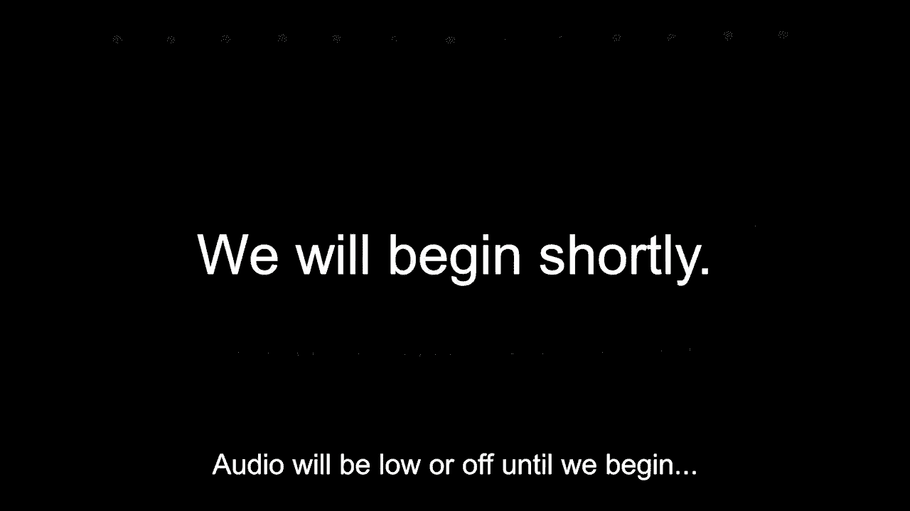

好的！

这是cs50，这是第九周，我们在这一周合成过去的内容。

最近的语言，加上一些sql和python，确实，这一周的目标是将所有这些材料合成一个广泛描述为web编程的主题。公平地说，上周我们确实介绍了一点javascript，并且通过javascript你确实可以编程，但完全是客户端的。

上周使用了javascript，本周我们将重新引入一个服务器端组件，确实是终端！

通过将浏览器与所谓的客户端和web服务器连接起来，后端的任何web应用程序。为了到达那里，让我们考虑一下上周我们来自哪里，以便提供任何静态网页，它们不会根本改变，特别不接受用户输入，javascript。

我们仅使用这个简单的程序，称为http服务器，现在在mac、windows、linux和其他平台上还有其他等效的命令，但就我们的目的而言，http服务器程序字面上只运行一个web服务器，而web服务器就是一款不断监听80端口的软件。

或者tcp的443端口，回想一下，它只是监听连接。任何时候你的浏览器连接时，它会查看你访问的url，可能还有你通过该url提供的一些参数，或者更一般地通过一个表单，然后它提供一个网页。

可选地提供某种输出，但当然，上周的一切实际上都是静态的，只是html文件、css文件，也许还有一些javascript文件，或者javascript浏览器发送给那个web服务器，会回调http头部，像这样。因此，程序的http服务器在做的事情，以及任何web服务器在做的事情。

所做的就是分析那个虚拟信封的内容，从上到下，从左到右。试图理解你的浏览器，或者如果你与他们分享了url的朋友或家人，试图请求什么，如果第一个斜杠。这只是意味着给我默认的网页，根据惯例回想。

这通常意味着具体给我名为index的文件。html。如果你真的在浏览器的url栏中输入了index.html，那会更加明确地告诉服务器给你那个文件。但请回想一下，我们也玩过google.com，特别是它的搜索。

功能回想一下，我们上周手动构建的 URL 看起来像这样。然后我们通过实际提交它进行了复制，`http://www.google.com/search?q=cats`，而上周的 HTTP 服务器相当简单，只提供静态内容，所以它基本上是参数，但是如果您真的想写一个，像 Google 的。

您需要能够确定用户想要的路径或路由。搜索在这个问题中就是这个路由，然后您必须确定确切的 HTTP 参数，在这个例子中，值是 cats。因此，某处必须有人编写代码，解析该字符串，找出变量。

您希望的是 `/search`，那么好吧，让我们忽略问号，声明一个变量叫做 `q`，并给它赋值为 cats，像是代码。今天我们向您介绍一个名为 Flask 的库，从技术上讲，Flask 也被称为框架。

框架是一种做事的方法，它是一种组织代码的方式，更具体地说，就是如何使用这个库。那么 Flask 存在的原因是什么？还有其他替代品吗？其实 Flask 存在的原因是，如果没有它，我会感到很无聊，想象一下如果没有它会多么烦人。

如果您想实现一个新的网站或新移动应用程序代码，分析这样的文本，每次都会这样，不是很好吗？如果您只需调用一个函数，相当于 `get string` 或 `get int`，让其他人编写的函数查看该文本，找出参数及其值。

这就是 Flask 为您做的事情之一，它分析这些虚拟输入的内部，弄清楚用户想要的路由，比如 `/search` 或 `/index.html`，并使其更容易供您，程序员使用，它是一种框架，通常当我们创建。

今天，我们将介绍一个基于 Flask 的 web 应用程序，您通常会以这种方式组织文件和文件夹，这就是我所说的框架。框架不仅仅是包含函数的库，它们通常还有文档，此外，还组织您的文件和文件夹，以这种方式，或许最简单的 Flask 应用程序。

应用程序会包含一个 `app.py` 文件，实际上我们所有的努力都将集中在这里，编写 Python 代码，一个文本文件，列出了您希望在应用程序中使用的其他库，每行一个。还有一个名为 `static` 的文件夹，实际上包含静态文件。

你的gif、jpeg、ping、css文件、javascript文件，任何你在过去一周编写的文件现在都将放入这个静态文件夹。最后是模板，模板将是更多的html放置的地方，我们将看到与上周的区别，所以简而言之，如果你想。

创建一个网络应用而不是一个网站，一个接受用户输入的网络应用。生成用户输出，可能与数据库对话，可能发送电子邮件。可能还会程序化地做其他许多事情，你有一个网络应用，我们将使用这个框架，称为flask，世界上还有其他替代方案，存在于python的领域。

在php的世界中有一个名为django的框架，还有像symfony和laravel这样的框架，java、c#和其他语言也有类似的框架，所以这只是现有框架类型的代表，了解这些也许是有帮助的。

我们深入一些实际代码，这些框架倾向于实现某些设计模式。设计模式再次只是描述人类编写代码的方式的一种花哨的方式，可以说在过去的几十年里，很多独立的开发者不断解决同样的问题，他们意识到哇。

我注意到在解决这个项目及其他项目的问题时，我发现的模式。一旦人类程序员注意到这些模式，他们可能会通过写书、写博客或类似方式将其正式化，并给它们命名为设计模式，建议其他人采用，为什么呢？

仅仅因为它帮助你组织代码，而不是将所有代码放在一个巨大的文件中。也许如果我们把一些代码放在这里，一些代码放在那里，我们可以更好地协作，使自己在维护越来越大的项目时更理智。因此，flask实现了通常被称为mvc的模式，指的是控制器，这些都是一些技术术语。

到头来，我们看到的艺术相对简单，控制器将是你编写大部分python代码的地方，这是文件或文件的集合。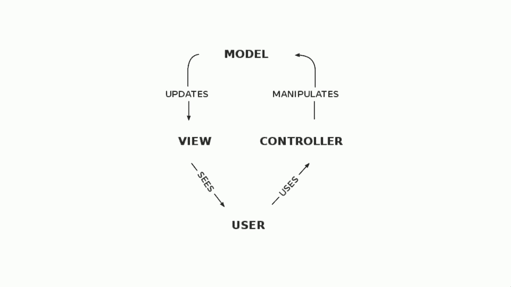

控制你的网络应用，因此在过去，每当我们编写c程序或python程序时，实际上你一直在编写控制器代码，只是从未给它贴上标签。今天还有我们将称之为视图的东西，mvc中的v，vue只是指人类看到的所有东西，界面，任何涉及用户的内容都将。

被描述为你应用视图的一部分，但同样，任何你作为程序员编写的代码都可以被视为控制器的一部分，最后是所谓的模型，mvc中的m，通常指的是你的数据的技术或形式。因此，这可能是一个sql数据库，也可能是一个csv文件，模型指的是你的数据。

应用程序正在使用，所以再次强调，这些术语并没有引入任何我们在上周或之前几周不能做的事情，我们引入 mvc 作为一个缩写或设计模式，只是为 flask 和许多程序员在设计基于 web 的应用程序时使用的方法贴上一个标签。

还有其他选择，但这是最简单的，就像我们在任何语言中所做的一样，让我们看看使用这个库可能编写的最简单的 web 应用程序，如果你填写代码行。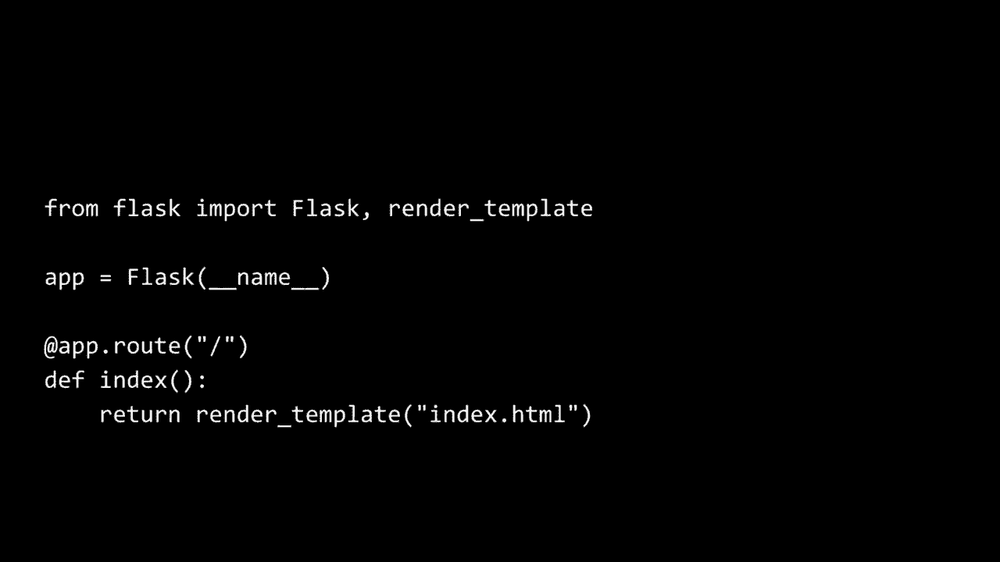

这个应用程序现在不会做太多有趣的事情，但这就是你需要的，以便编写一个 web 应用程序，这是一个程序，一旦你启动，它将会不断地监听，监听和监听 tcp 请求，在 80 或 443 端口上，来自人们的浏览器，包括你自己的，然后现在你有能力去。

编写能够响应用户的代码，那么我这是什么意思呢？好吧，让我们开始，编写自己最初的一些程序。我将切换到 cs50 IDE，我们将在这里继续使用。我不打算再运行 http 服务器，而是将使用 flask，替代那个服务器，现在我要去 ah**d，开始吧。

首先创建一个非常简单的文件，我将去 ah**d，实际上让我们这样做，我要首先创建一个目录，所以我要创建一个名为 hello 的目录。我将进入 hello，并且和往常一样，如果你打开你的文件浏览器，你会看到左上角的相同内容，但通常我会专注于命令。

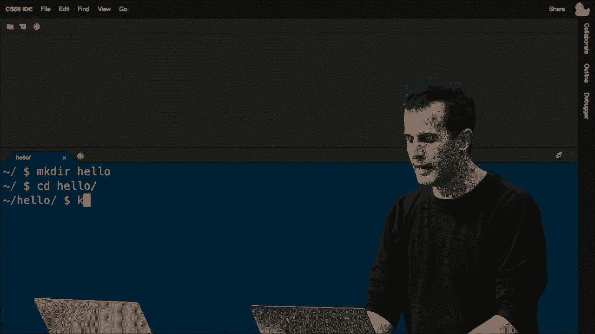

现在我在 hello 目录中，让我去 ah**d 创建一个文件，我会保存这个。

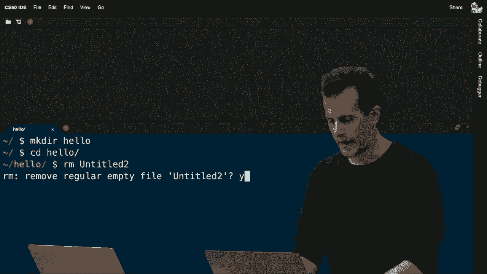

让我去 ah**d，调用这个。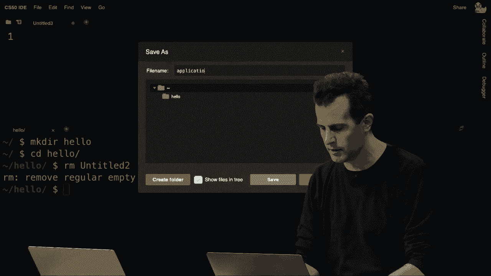

比如说 application.dot pi，并再次将其保存在 hello 目录中，好的，如果我输入 ls，我会看到它在那里，现在是空的，所以让我去 ah**d，大致复制一下刚才的代码，让我去 ah**d，从 flask 库导入一个叫做 flask 的东西，首字母大写的 F，这就是。

他们的约定，让我去 ah**d，还导入一个叫做 render 的东西，实际上我们暂时先不做这个，先保持这个最简化。为了将这个文件变成一个完整的 flask 应用程序，也就是我自己的 web 服务器，我将按照约定，称之为 flask 函数的 app。

我有点奇怪地将传入 `__name__`。我们只在说你应该在 python 文件底部调用 main 函数时见过这个特殊变量，或者你可以做这个恼人的事情，即说如果 name，matter。

为什么我们过去使用这个特殊的变量`__name__`，来表示当前文件的名称，所以这行代码的意思是，Flask将当前文件转变为一个应用程序，即一个Web应用程序，它将监听浏览器的请求。现在在我的文件中，我必须告诉Flask我的路由是什么，路由只是一个URL，所以是斜杠。

或者斜杠index.html或斜杠search，或者你在今天的网站URL中看到的任何其他路径。为此，在Flask中，我说`app.route`，引号中的斜杠，这在Python中是我们没有见过的，但这实际上是Python的一个特性，每当你看到一个@符号时，它被称为Python装饰器。

今天对我们来说，一个函数对另一个函数，但我先就说到这里。使用Flask的惯例是，首先定义你的路由，比如你的斜杠默认路由，然后定义一个函数，这个函数可以叫任何名称，可能叫一些适合该路由的名称，再次。

人们倾向于将默认路由称为你的索引，因此我将继续调用这个函数**index**，在下面让我继续做一些傻事，比如“hello world”，字面上返回这个字符串。让我们继续看看到底发生了什么。在我的hello目录中，如果我输入`ls`，注意到我仍然只有一个文件**application**。

我今天要启动我的服务器，因为它是一个Flask服务器。我想运行命令`flask run`，所以Flask是一个库，但它也是一个程序，当你在Mac或PC上安装它时，或者在IDE中，它让你启动一个Flask应用程序，你会看到一些神秘的输出。

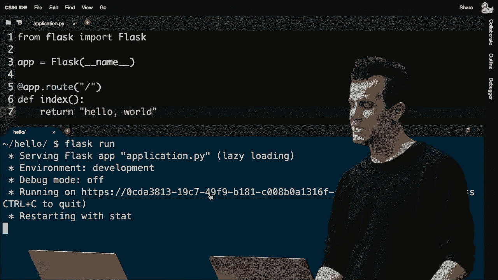

你当前运行的应用程序的URL，如果我继续并点击这个URL，并在另一个标签中打开它，哇，我看到了我的第一个动态Web应用程序，它只是打印“hello world”。事实上，如果我去Chrome的查看页面源功能，注意到它甚至不是完整的HTML，它实际上是文本，但这只是因为我还没有返回任何实际的HTML。

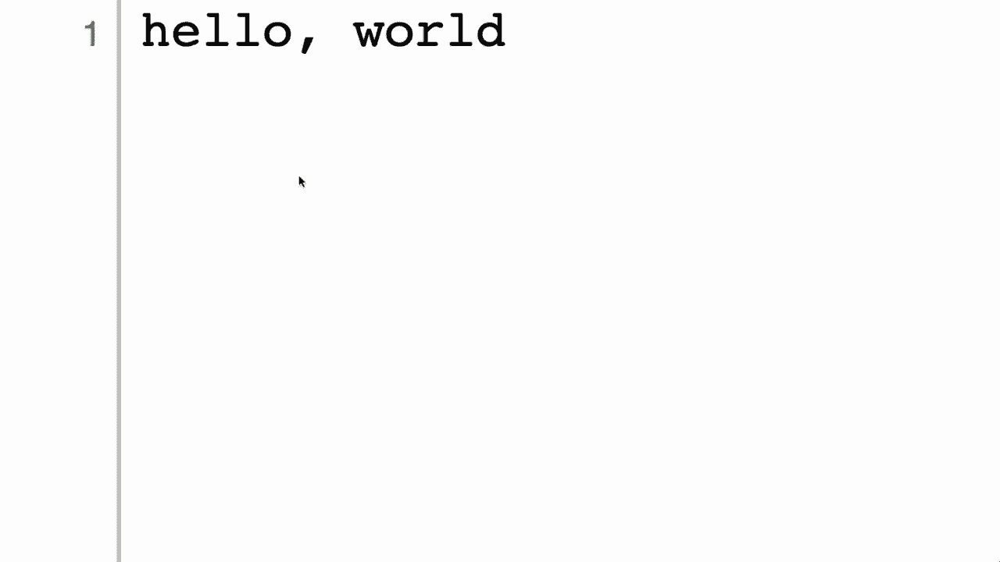

所以让我们来做这件事，更正确地处理它，而不是仅仅返回一些任意的文本字符串。默认情况下，称为斜杠的路由意味着你应该返回一个名为**index.html**的文件，好吧，暂时假设它存在，我该如何继续返回它呢？

从技术上讲，我将继续并渲染一个名为**index.html**的模板，为了使用这个函数渲染模板，我需要从Flask库中导入它。因此，Flask确实是一个库，里面有很多功能，第一个是激活这个作为一个Web应用程序的渲染模板的功能。

是去找到一个名为 index.html 的文件，获取其内容，以便你可以将其返回，所以这在精神上类似于在 python 中使用 open 和 read。几周前，但它会给我们一些其他的高级功能。让我现在进入命令行，输入 ls，提醒我们我们只有 application.pi。

我不想在这里创建 index.html。

同一目录，flask 回忆有某些组织建议，就像这样。实际上我应该把 index.html 放在这里。

我的文件夹，叫做 templates，所以让我们这样做，让我继续创建一个名为 templates 的目录，使用 make dur 输入，如果我现在输入 ls，你会看到。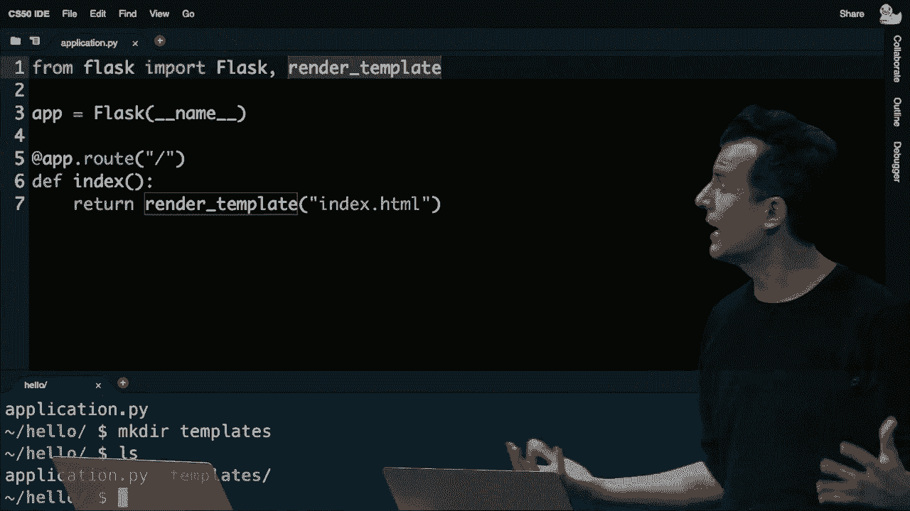

我有一个模板目录，现在让我继续创建一个新的。

实际文件名为 index.html，让我将其存储在我的模板目录中，现在让我继续做一些比较熟悉的事情，我们在这一点上已经做过很多次了，我们迅速创建一个简单的 html，这里，默认是英语，下面我将有我页面的头部。

在头部我会有一个标题，我将称之为 hello。下面我会有我的主体，在主体中我只会说 hello world，上周。但让我现在回到应用程序。pi，提醒我们我们刚刚返回了。函数调用 rendertemplate 的 index.html，再次这个函数。

文件，抓取里面的所有字节，并最终通过这一行返回它。因此现在让我继续运行 flask run，再次让我继续点击我的 IDE 的 URL，瞧。同样的事情，但现在如果我打开 chrome 的查看源代码功能，完整的。

网页，因此再次并不是根本上那么有趣，但我已经迈出了这一步，开始生成我想要的任何 html，所以让我们让这件事变得更有趣。我一直声称，有这样一种方法，当然是通过 web 编程，从 URL 获取用户输入。那么我们该如何去做呢？让我继续提出这个。

让我继续在这里写一行额外的代码，做一些这样的事情，让我声明一个变量，实际上让我们在 render template 之后做这件事，结果你可以传递零个或多个命名参数，这些参数的名称完全取决于你，而到目前为止我们还没有看到这一点。到目前为止，在过去的任何时候我们使用过。

你需要检查文档或讲义，以弄清楚可用的函数，但在 render template 中并不是这样的。将用户的名字从我的 application.pi 文件传递过来，回想一下我们将开始称之为我的控制器。我可以说给我一个名为 name 的变量，我想要这个值。

这个人的名字，我真正想要的，是问号之后的等价物，根本上从网址获取用户输入的唯一方式。我们看到的是问号之后的任何内容，而我不想要。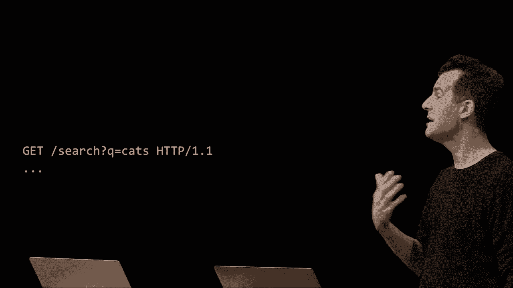

`q`，我不想要猫，我想要`name`等于`david`或`name`等于`brian`。那么我该怎么做呢？让我去。

继续说这个，`name`等于`request.args.get`引号中的`name`，让我另外添加，我在导入这个其他请求时做了什么。

来自Flask库的变量。

这让我访问了http请求，已经在网址中，而Flask为我做的事情是。它解析了这个网址，弄清楚了，`david`，在问号之后的任何内容。Flask为我解析它，并将其作为变量返回给我，我可以通过调用`request.args.get`来访问这些变量，然后是我想获取的参数名称。

从网址来看，现在如果我保存这个，让我回到`index.html`，这就是为什么，模板。模板就像在人类世界中，是一种框架，可以在其中插入其他值，这是一个你可以基于自己工作构建的模板，就像是，的。因此模板通常有特殊的语法，可以插入一些内容。

值，我担心语法略有不同于我们过去见过的东西，但如果你。使用两个花括号，就好像一个在C和其他上下文中还不够。两个花括号，左和右，你可以告诉Flask的`render_template`函数在这里插入任何变量的值。

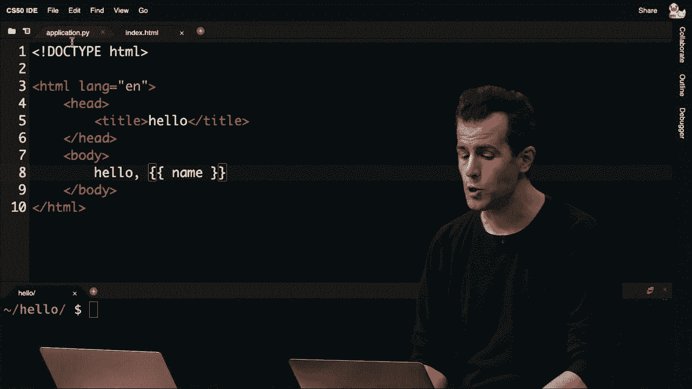

你已经传递给`render_template`作为函数调用中的这些参数之一。所以让我继续，现在再次运行`flask run`，以重启我的网络服务器。

让我继续打开这个网址，现在看起来真的很傻，你好。没有，但请记住，`None`在Python中是一个特殊的值，表示某物没有值。所以你知道我可以这样做，结果是，让我回到这里，如果我回到我的网址，让我缩小一下，这样你就可以看到，这是我那个疯狂长的网址。

在我的服务器运行时，让我继续添加一个斜杠，问号，不要`q=cats`。因为那不相关，现在，`name=david`怎么样，让我放大一下。所有我添加的只是斜杠，问号`name=david`，让我继续按回车键，瞧。现在我有一个显示“你好，david”的网页，确实如果我查看我的页面源代码，请注意。 

HTML 已经动态生成，我的 IDE 中没有文件说 hello comma david。相反，它是动态插入的，注意这可以改变，如果我去 ah**d 并把名字改成 brian，按回车他的页面变化了，当然如果我现在查看页面源代码，就像我有一个名为 index.html 的文件，里面确实有 brian 的名字。

但不，这只是我模板中的占位符而已。我可以清理这个，注意它看起来像 name。

但事实证明，request.rx.getfunction 接受第二个可选参数，如果我不知道是否会有值，我想给它一个默认参数。我的 get 函数的第二个参数实际上可以是默认值。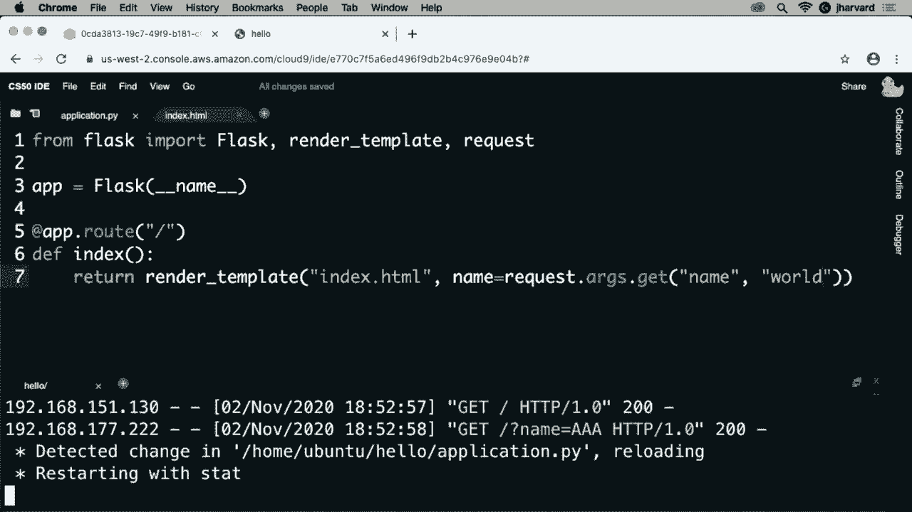

所以如果我去 ah**d 现在让我去 ah**d，并重新运行 flask，且让我去 ah**d 现在无名参数重新加载，你现在看到的默认值是 hello。

逗号 world，但如果我回到那里，把我的名字放回去，现在它不需要默认值。我看到了人类实际输入的内容，那这里发生了什么？好吧，如果你考虑 google.com，当你输入 cats 并按回车时，那个单词 q 等于 cats 被传递给 google.com 在 URL 中，谷歌在运行某个程序，可能是其他语言。

这是在分析 URL，抓取参数 q，等于 cats，然后他们正在搜索。他们的数据库基本上是针对关键字 cats 进行搜索，然后动态生成 HTML。那会显示出所有的图片和搜索结果，关于 cats 没有网络服务器。没有一个人不断地维护一个大名单的 cats。

维护一个非常大的 HTML 文件，里面填满了图片标签和 cats 整天，简而言之，这一切都是动态生成的，即使在这个微不足道的例子中。我们现在也许看到了我们刚刚触及了这个表面，看看是否有任何问题或困惑，因为这一切都是一次性给出的，有任何框架你。

通常需要先学习约定，然后你才能开始。聊天中有任何问题或困惑，嗯，当你调用 render template 函数时，有人问模板，斜杠 index.html，为什么你只是说 index.html，好问题，这是那些仅仅因为的答案之一，render template 函数已经。

实现的方式假设你的文件在模板目录中，你可以通过重新配置应用程序技术上覆盖这一点，但默认情况和确实的约定是。问题是，嗯，我只想知道当你声明 ad app.route 时，为什么必须包含正斜杠作为参数，嗯，所以为什么你必须包含。

正斜杠就是进入的方式，功能，最简单，当然是最基本的路线。所以你必须在那儿放一个斜杠，否则服务器不知道该做什么。如果你访问 exam dot com，斜杠就这样，我们可以改变这个。注意，我可以把这个改成任何我想要的，让我停止我的服务器。

让我把这个改成斜杠 secret，我的网站。

让我继续运行 flask run 看会发生什么，没发生，未找到 404，当我访问斜杠时。chrome 只是很烦人，它为了简单而隐藏了斜杠。即使你作为人类没有看到，但斜杠确实在那里。不过如果我改变这个，去斜杠 secret。

然后我们再次看到那个页面，所以那个应用程序，定义，应该与之关联的路由是。

以下函数，我有一个关于模型的问题，它的名字。我想数据是否编码在 HTML 文件中，是的，目前我会争辩说我们。实际上还没有模型，就像当没有数据库时，没有控制器和视图，这完全没问题。只有当我们有一个完整的。

应用程序时，就像我们今天很快会有的，真正的模型才会发挥作用，但这也是合理的，人们可能会觉得，为了被我的网站问候，你必须知道，你必须在 URL 栏中输入自己的名字，通常没有人这样做，通常情况下我们发现自己作为人类。

填写表单，所以让我们以这样的方式处理这个，以便我们实际上有一个表单。所以让我先去做这个，我要去创建。另一个文件，让我去我的模板目录，在那里我目前只有 index.html，让我现在把这个文件，index.html 复制到另一个文件。

名为 greet.html，换句话说，我想要我的 greet 文件，最终让我去打开这个。在我的编辑器中，greet 最终会做 index 刚才的工作。我会把 index.html 的行为改为实际表单，所以我将去删除这个，然后我将做一个表单，去吧。

让我让它去一个叫做斜杠 greet 的路由，那个路由还不存在，但我打赌它很快就会。我最初将使用 GET，然后在这个表单内部让我给自己一个输入。名字将是字面上的 name，红色名字，时刻，虽然有点令人困惑，然后让我继续说这个字段的类型将是。

文本，然后让我继续给自己一个输入类型，等于提交，所以我有一个提交按钮。这个值将是默认的，所以现在让我回去应用程序。pi，让我回到我的 hello 目录，确保你不要只在 flask run 中运行。只在应用程序所在的地方运行。

文件已打开，现在，瞧，我的斜杠路由默认路由已经变成这个 HTML 表单，如果我查看 Chrome 中的源代码，你会看到我刚刚输入的内容，所以这个表单确实是硬编码的，没有占位符，但是注意这个表单已经被斜杠。

使用 GET 的问候路由，我该如何实现呢？让我实际上去。

进入我的应用程序，现在你会注意到如果我输入我的名字大卫并点击提交，问候。并不存在，这是未定义的。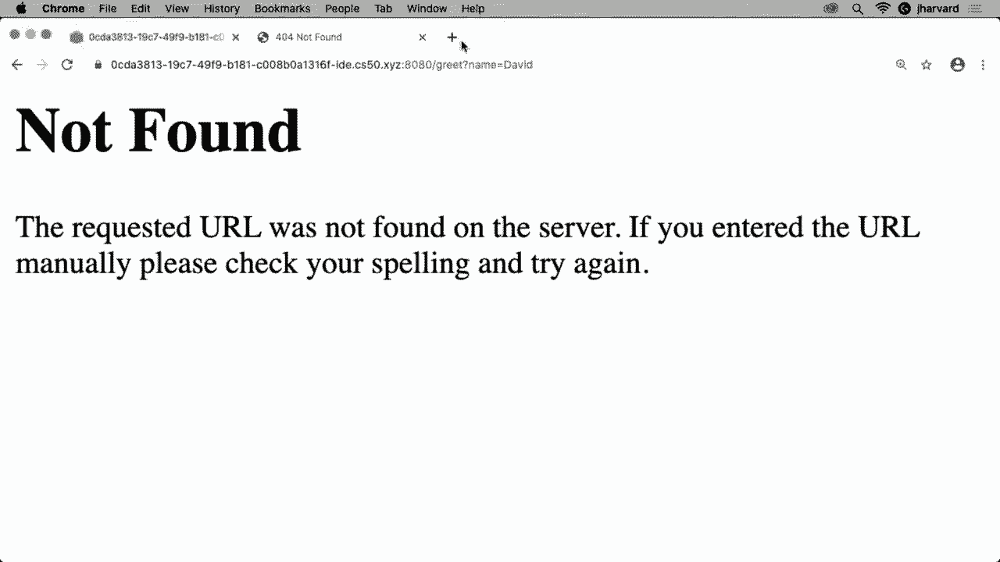

在我的应用程序中路由，所以让我回到我的服务器，接下来让我**往下**走，做一些类似的事情，app.route 引号里的 gree，所以让我们给自己一个第二个路由。让我去**定义**当用户访问斜杠 greed 时应该调用的函数，再次你可以称之为自己，让我们保持简单，直接称之为。

路由的事情是一样的，但这并不是一个要求。在我的问候函数中，我该怎么做？让我去**说**。返回待办事项，我还没有完成，但确保你的代码基本上工作到目前为止，让我重新运行 flask run，让我打开我的。

url，现在让我尝试再次填写相同的表单，实际上我有点烦恼的是自动完成功能弹出，但我们可以稍后关闭它。让我去**提交**，瞧，现在问候路由确实存在，注意那个斜杠问候是完全可用的，它并不是一个未找到的，有用的东西。

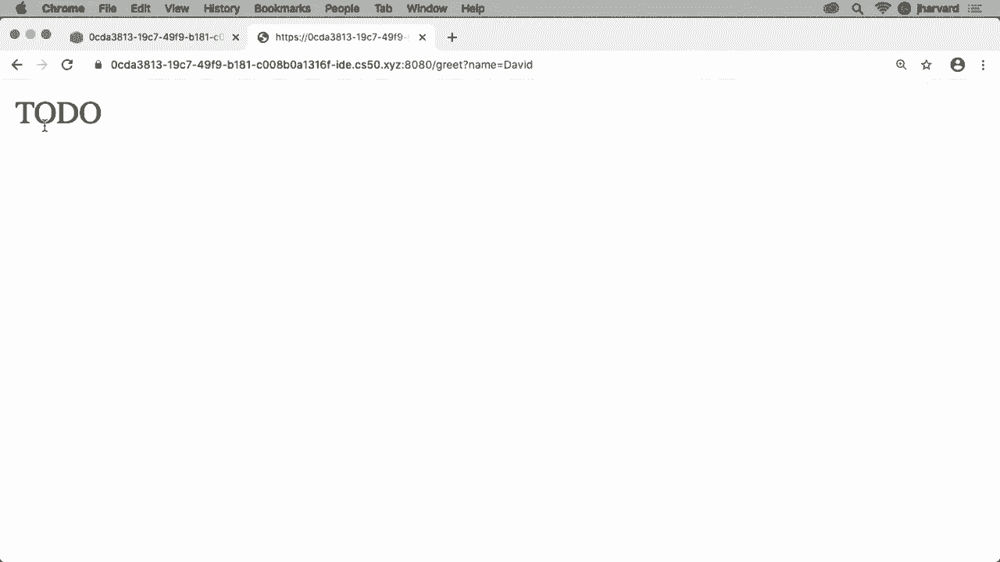

因此待办事项，那没关系，让我回到这里，让 gree 渲染一个名为 greet.html 的模板。但请记住，greet.html 是我设置占位符的地方，所以我认为我可以做的就是移动我之前用于 index 的代码，因为 index.html 只包含一个硬编码的静态表单。让我去**问候**路由，而不是，让我去**重启**我的服务器。

让我去**打开**我的 URL，接下来让我去**输入**我的名字。

然后提交，瞧，现在我们有两个问候，第一个恰好只显示静态表单，第二个实际上更有趣，并且问候用户。我刚才提到，我有点烦恼的是，记住之前输入姓名的人，让我觉得有点隐私泄露。

让我实际上进入我的 index 和 html，比如，将自动完成设置为关闭，我也可以设置自动聚焦，以便默认情况下给该文本字段闪烁的光标。经过这个更改，让我去**稍微改善**一下。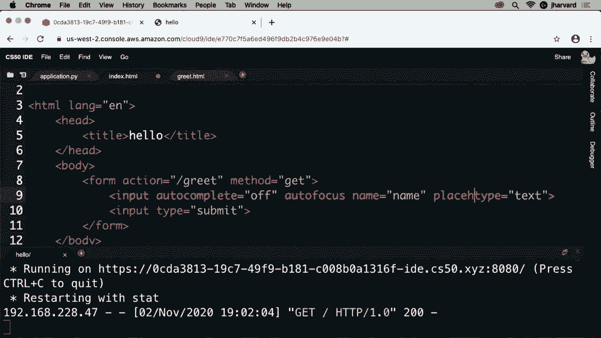

我们还添加一个占位符，所谓的名字，只是为了让我的访问者更清楚，哦，你希望我在这里输入我的名字大卫，自动完成现在是。

如果是简单的网页应用程序，那工作就没问题，那么我们增加了什么呢？我们添加了第二个路由和第二个模板，以便一个表单可以将数据提交到另一个路由。让我在这里暂停一下，看看是否有任何问题或困惑，然后再继续讨论。

看起来我们有安娜的问题，当然，安娜，抱歉，再大声一点，嗯。这个名字等于双引号，名字，这是否等同于你稍后指定的[音乐]？是的，我会通过改变这个来演示。我叫它名字只是因为我们确实在谈论人名。

但我可以把这个命名为我想要的任何东西，例如，个人的名字。但是如果我只关心他们的名字，我可以将其更改为第一个下划线名字。例如，让我更改占位符，以清楚表示我只想要他们的名字，让我获取第一个下划线名字的http。

然后在我的模板greet.html中，让我将其更改为第一个下划线名字，实际上我还需要做一个更改，我需要将其更改为第一个下划线名字，所以在应用程序的上下文中，确实很烦人，你需要在各处重复自己，但它们在不同的上下文中意味着不同的东西。

这是我在上下文中传递给我的模板的一个参数，在这个get函数的上下文中，这是我从url中抓取的http参数，而在我的那些参数中，这是我传递给的参数。

服务器，让我继续重新加载表单，这里让我只输入我的名字，改变。这不是在输出方面的变化，而是在功能方面的变化，你会看到现在我使用的是第一个下划线名字。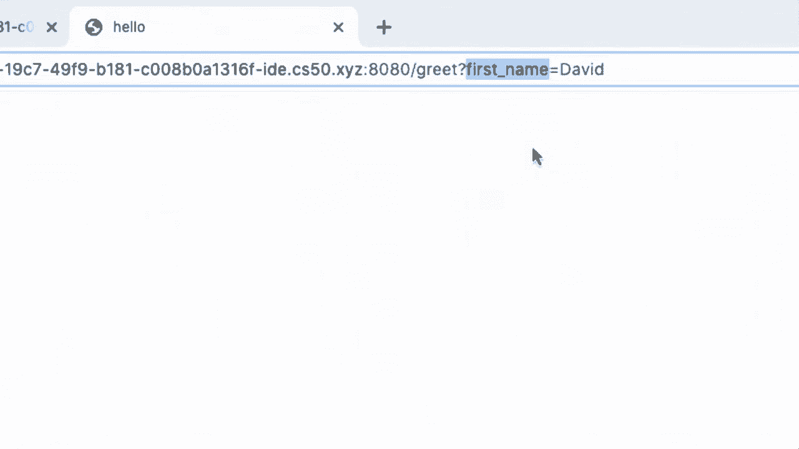

关于路由的其他问题或困惑。

或者url中的参数，模板或其他的。那么，让我问一个问题。让我往下滚动一点以腾出空间，这里是我的index.html文件，它包含一个表单，里面只是“你好，某某”。这看起来设计得很糟糕，我会继续恢复一下。

我的名字更短一些，这样在屏幕上能显示得更多一点。但我声称这设计得不佳，尽管我们似乎有一个正常工作的网页应用程序，但可以说设计得不好，即使你从未见过Flask或网页编程，也可以根据以往在C或Python中的学习经验获得某些直觉。

嗯，我想你明白了，所以 URL 暴露了输入的个人数据，无论他们输入了什么，所以我想我们希望使用 POST 来隐藏它，故意地，但有点令人担忧的是，这信息可能会在 URL 中泄露，意味着现在可能会被保存。

我的浏览器通常在你输入内容到 URL 栏时，可以看到你之前搜索过的内容，或者你访问过的网站。这对用户来说是好的，因为你可以快速回忆起你的想法。但如果你不想让别人知道你去了哪里，那就有点侵犯隐私。

无论你搜索了什么，或者如果是一个实验室，也有很多原因让你不想让输入出现在那个 URL 栏中，我建议使用你提议的 POST。确实，让我们回到我的 index.html 文件，几乎和 GET 一样，但不把我的参数放在 URL 中，比如 q= cats。

或者在 URL 中名为 David，它将比喻地把它放得更深，藏在虚拟信封里，因此仍然会从浏览器发送到服务器，但不会被浏览器记住在 URL 栏中。但如果我这样做，我需要更改我的控制器，我需要我的 Python 代码在一个。

有些不同的位置来访问，这个变化其实很简单。相反，我必须告诉 Flask，路由斜杠 greet 实际上将支持一组不同的方法，而不是默认支持的 GET。我必须传递一个有点晦涩的参数，叫做 methods。

然后我必须传递一个字面上的 Python 列表，列出我希望这个列表支持的方法。默认情况下，如果你不使用这个参数，所有这些路由，第一和第二基本上都有这个默认值，methods 等于 "get" 的列表，所以是一个大小为一的列表。如果你有默认值，仅允许你什么都不输入，那会有点烦人。

但是如果你想支持 POST，你确实需要覆盖这个并更改 GET 的默认参数，从一个不同的变量，而不是使用 request.args，它指的是 URL 中的参数。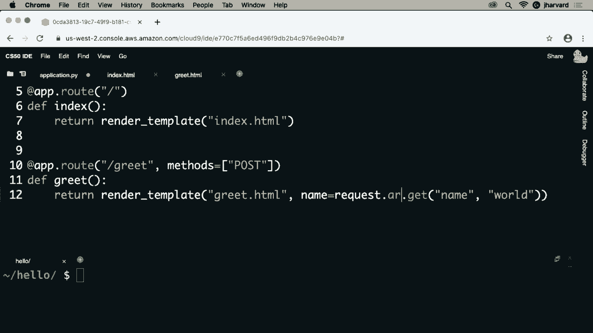

你必须将其更改为 request.form，这些名字取得真糟糕。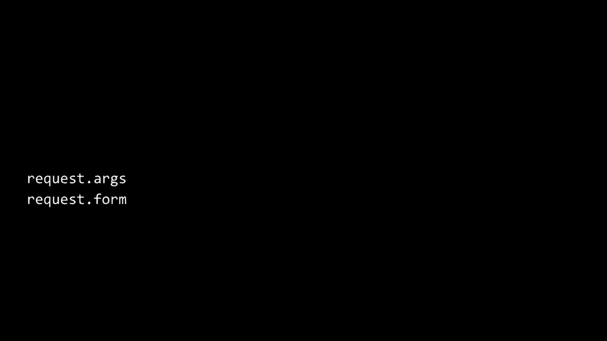

在 Flask 中，这些全局变量分别是 GET 和 POST，更好的名字可能是 request.get 和 request.post，但这就是我们所拥有的。URL.request.form 是用于 POST 请求的，其中相同的信息被埋得更深在虚拟信封里。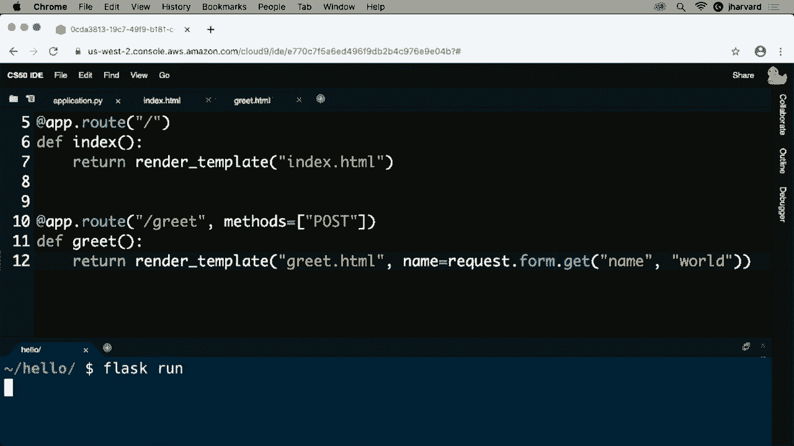

抱歉，错误地使用了语言 flask run，好吧，让我去**打开我的 URL。瞧，我将输入 David，点击提交，现在注意这个魔法，现在路由仍然是斜杠 greet，但以后使用我笔记本的人就不会看到。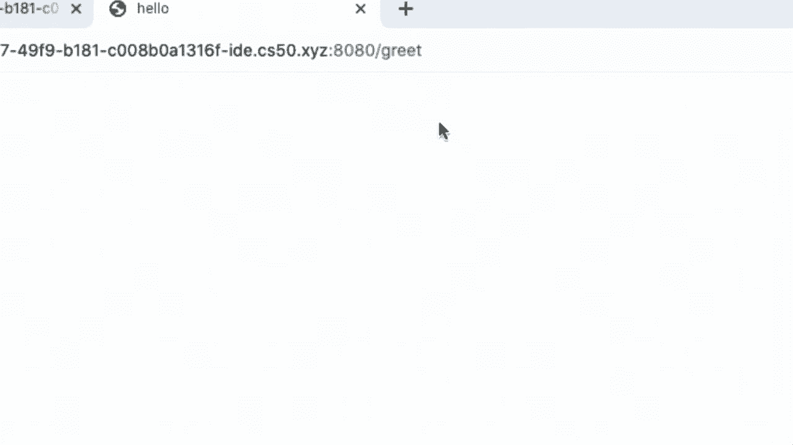

我在谷歌搜索中查找的内容，或者我输入的信用卡，输出，明确来说。当你收集任何远程个人信息时，例如人们的电子邮件地址，或者某些其他值，但呃，你也可以像我们到目前为止使用的那样使用 GET。

好吧，让我问一个后续问题，这里有一些关于 index.html 和 greet.html 设计的基本问题。

这感觉有点不太理想，我敢说，你们中的几个人在过去一周创建几个 HTML 文件时也注意到了这个问题。什么让你觉得有点乏味或烦人，或者设计得不太好。从你创建这些 HTML 文件中，你能告诉的最好。

个人主页，你发现自己做了什么，可能让你觉得不太好，或者似乎违反了以往的经验教训，聊天中提示你在两个 HTML 文件之间重复了一些 HTML，是啊，天哪，老实说。到第二个、第三个、第四个文件时，你可能只是复制和。

粘贴你之前的文件，然后进行小修改，仅此而已，甚至是 JavaScript。你无法在多个页面之间共享 HTML，你唯一的选择是上周。提供静态内容时，只能冗余地复制和粘贴内容，看看这个。在我的 index.html 文件中，我从第一行到第七行突出显示的所有内容。

恰好与 greet.html 中从第一行到第七行的内容完全相同，所以这是你在 Flask 或任何网页编程框架中获得的另一个特性，这些并不特定于 Flask， 你可以提取共同内容。那么我们该如何做到这一点呢，嗯，让我继续进行这个。

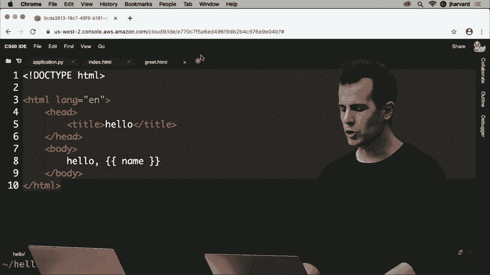

让我继续创建一个第三个文件，按照惯例在 Flask 中称为。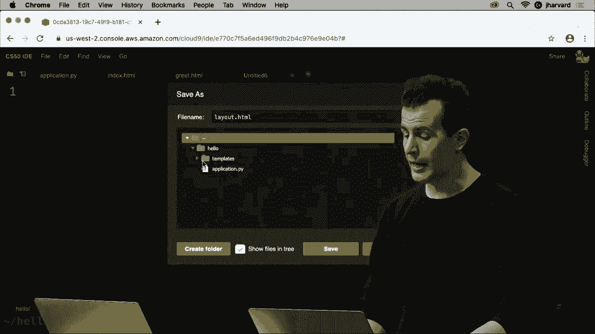

layout.html，为了安全起见，我将把它放在我的模板文件中。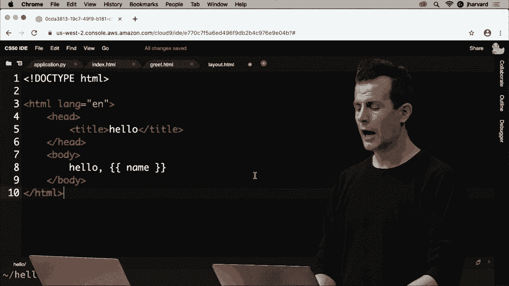

我将继续复制粘贴所有相同的样板代码。所有的共性，删除与 greet.html 特定的内容。我认为我们现在看到的第 1 到第 10 行就像一个模板，为我的另外两个网页的布局。

所以你知道，让我继续进行，**并做**，说块，主体，然后有点奇怪地结束。这里的块是特定于 Flask 的，语法或者技术上来说是特定于 Jinja 的。这是一种语言，Flask 正在使用，别人写的。这是 Flask 中特殊的语法，基本上是说，这里我可以。

过一会儿再插入其他html，所以我现在怎么使用这个呢？让我去我的`index.html`文件。让我去掉所有的冗余，把`index.html`真正简化为它的本质，唯一特别的地方就是我刚创建的那个表单。让我去**上面**说，使用那个特殊的语法扩展`layout.html`，然后在下面。

我稍微取消缩进，然后让我说在下面，呃，结束块，所以语法确实很奇怪。但是思想上是相似的，这几乎和我们的头文件精神上相似，可以看看你能否提取出一些共性，并在多个地方重用，它可以有这种蓝图这种布局。

字面上说，你可以将不同的内容插入，所以这一行说，嘿Flask，以下文件`index.html`，实质上从它继承。扩展我的，这个。注意这个布局定义了这个，任意称为`blo.body`的占位符，我本可以叫它x或y或z，但我将称其为`body`。

因为实际上它就像是我的`body`的百分之百内容，所以看起来是个好名字，然后在`index.html`中，我现在只需要告诉Flask。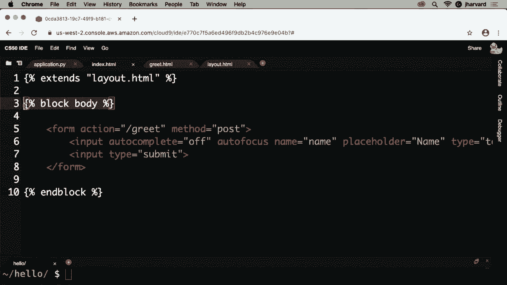

这里有一些代码，你应该插入到更多的html代码行中，所以让我继续保存这个。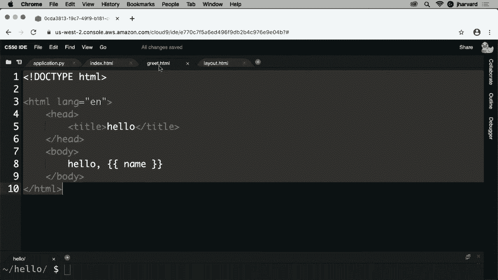

让我现在去问候，**同时删除所有那些疯狂的冗余**。现在让我再上来一次，扩展`layout.html`，然后在这里让我说这是我的`body block`，稍微取消缩进，然后让我说结束块。保存那个文件，所以现在这些html几乎没有，任何html在这里，它真的只是文本，和奇怪的东西。

Flask语法在`index.html`中也是一样，但这也是网络应用程序的一个价值所在，当你有像Python这样的编程语言时。你可以提取出这些共性，并真正开始动态生成页面，就像谷歌、脸书和其他公司每天所做的那样，所以让我去。

现在继续，重新运行`flask run`，并交叉我的手指，像往常一样，因为我这里做了很多更改。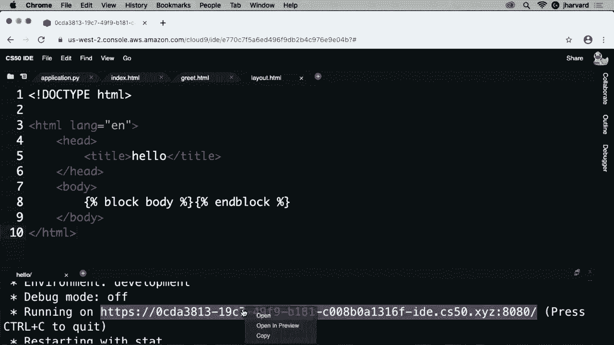

让我打开我的网址，瞧，似乎工作得很好，接下来让我去**上面**，在我提交之前，让我给你展示页面源代码，注意，它在那里，虽然打印得不那么美观，缩进有点偏差，但没关系，你的模板应该是风格良好的，所有的内容在你的模板中都应该优雅地缩进，但如果你的模板被渲染了。

虽然看起来不那么好，但这没关系，因为浏览器并不在乎，但确实我有一个完整的网页，让我提交这个表单，似乎仍然有效，那是我的斜杠问候路由，我看到“你好，大卫”，如果我在这里查看页面源代码，注意。另一个确认表单提交，这实际上是一个安全功能，你不想。

网站让你用信用卡通过邮寄重复检查，所以我要去啊**d**并手动点击重载，这确认了，因为这没什么危险，现在是我的问候路由，所以这可能会为你节省。

所有这些都可以减少很多麻烦或单调，或者复制粘贴，你上周没有这个工具，不能单独使用**HTML**和**CSS**或甚至**JavaScript**在浏览器中，因此这是模板真正闪光的地方，不仅可以使用两个花括号的模板，使用它。

其他文件的实际内容，嗯，有个澄清问题，你能告诉我们什么是**jinja**吗？是的，我略过了这个，因为我对今天有多少新术语感到有些烦恼，坦率地说，在我们所困扰的网络编程世界里。

有很多人在解决不同的问题，如果我们所有人都试图解决世界上所有的计算问题，那会有点烦人和自以为是，因此**Flask**的作者决定对于他们的模板特性，不会重新发明轮子，而是使用。

你会看到，使用双花括号和花括号和百分号符号。

这是代码重用的一个好例子，很多聪明的人正在结合一个非常常见的内容，这是件好事，因为从技术上讲，如果你真的反对**jinja**，因为某种原因你就是讨厌语法，实际上可以使用其他语言。

你可以插入不同的部分。

软件能够协同工作，我们会在课程的网站上添加链接。

去**jinja**的文档，我们稍后会看到你还能做些什么。

在模板中与**jinja**一起使用，因此再说一遍，**jinja**实际上是指双花括号语法和。

所以这实际上是计算机中一个基于组件设计的示范，花括号和百分号语法出现在我们的模板文件中。好吧，关于说你好到目前为止，在应用程序中，我一直保持着概念上的简单，如果语法上有些复杂，因为有两个独立的路由。

嗯，实际上显示信息的路由，但严格来说，我可以聪明一点，组合这些路由，仅仅因为如果你正在构建一个相当复杂的网站，有很多路由，如果每个路由都需要两个路由，那会有点烦人。

一个表单必须提交到另一个表单，所以让我提出，收紧我们的实现，实际上重用我们的一个路由，所以让我**继续**删除我的greet路由，因为我觉得有点冗余，并让我**继续**说我的默认路由是我的索引。

所以我将使用同一路由，不仅向用户展示表单，还要向用户问好，同时在同一路由上处理GET和POST请求，那么我将如何做到这一点呢？让我**继续**做这件事，如果request.method等于GET，那么我实际上可以**继续**执行这段代码，POST。

接下来我将返回，渲染模板，greet.html，并传入一个名称，即request.form.getname，然后默认值为world，所以没什么新意，这只是我刚刚删除的代码。

但请注意，我现在正在重用同一路由，如果请求方法是GET，就显示表单，如果请求方法是POST，就问候用户，这为什么会有效呢？事实证明，每当你访问互联网上的URL时，比如http://www.harvard.edu或http://yale.edu或http://google.com。

你一直在发起GET请求，实际上回想一下上周我们查看的那些示例HTTP请求和头部，上周我们做的所有事情默认都带有GET关键字，所以GET实际上与表单没有什么根本关系，它实际上是默认的HTTP动词。

每当你访问网页上的任何网址时，都会使用**GET**方法，提交表单时你也可能在使用GET，就像我第一次那样。

或者你在使用POST，就像我第二次那样。那么这里的重点是什么呢？让我**继续**对我的表单进行一次更改，我确实想通过POST提交。不过，我将不再提交到/slash grief，而是直接提交到我的默认路由。如果我在这里做对了，

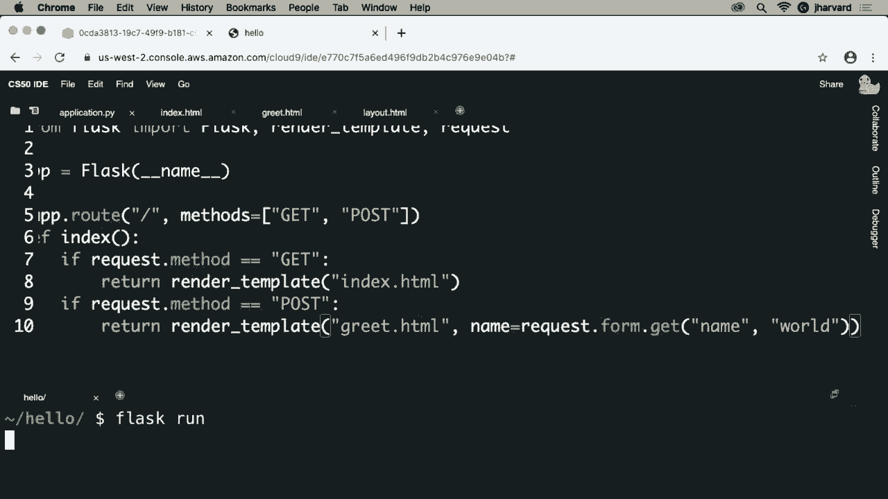

让我**继续**运行flask run，像之前一样打开我的网址，查看我的页面源代码，操作将是斜杠，因此我在为两个不同的功能使用同一路由，太好了，惊人的是它工作了，hello david，但我的路由没有改变，这为什么呢？这有什么用呢，可能有也可能没有。

你现在拥有的能力，因为如果你可以在Python中以编程方式表达自己，你可以区分你收到的HTTP请求中的两种动词GET和POST。如果有什么意义，这只是意味着你不需要两倍的路由，只是为了让一件事传递给另一件事，结果也还有其他衍生的特性。

通过重新使用相同的路由来实现这一点，但更多的细节将在后面讨论，如果有任何问题，就请问“你好，Flask”。好吧，作为一个小预告，这里是我制作的第一个网页应用的截图。

在我本科的时候，我参与了校内运动。不是从体育的角度，而是从计算机科学的角度，我自愿为哈佛大学的新生校内运动项目（即frosh iems）建立了第一个网站。当时我们还在用纸张记录名字和电子邮件地址。

我们会走过哈佛的中间，把它塞在其中一个督导或宿舍顾问的门下，瞧，我们就注册好了运动，但那时还没有网站。嗯，虽然有互联网，但还没有网站，所以这是90年代末。我觉得实现同样的想法会很有趣。

用于在网页浏览器中注册运动的纸张。遗憾的是，那时我只知道C语言，也许还有一些C++，以及其他一些计算机科学编程语言。所以我自学了网页编程，依靠许多朋友的问题和答案，我碰巧使用了一种叫做Perl的语言，令人畏惧。

在这里设计很多菜单选项，并且后端有一些csv文件，存储所有的注册数据。那时我对数据库一无所知，但这是我第一次接触网页编程，我们当时想在第一次休息后重新实现一个注册系统，使用sql。

重新实现同样的想法，今天对美观的担忧甚至更少。不过让我们先休息五分钟，回来后继续。好的，我们回来了，当前的目标是实现我多年前在frosh items网站上首次实现的最基本功能。

允许学生注册运动和报名参加运动。让我们收集每个人的名字，也许注册一下，那么我们该如何做到这一点呢？让我去**复制**一下我们之前的“你好”示例的布局，因为它是很好的模版，我实际上要进行一个改动。

事实证明，通过添加一些标签，你的网站可以变得非常适合移动设备。在这里，我将添加一个标签，viewport，viewport指的是定义你大部分网页浏览器用户界面的矩形区域。这个meta标签的内容将是initial scale=1和width=device。

这段魔法，实际上告诉浏览器，无论用户的设备宽度是什么，假设那就是我网页的最大宽度，并且它会根据你使用的是笔记本、台式机、iPhone 还是安卓手机，自动调整我的字体大小。

否则，还有其他事情需要做，以使你的网页具有响应性，这样说是有帮助的，但这至少在某种程度上解决了这里的问题。现在让我去我的`frosh_ims`，是空的，确实需要明确的是在假期中我创建的`application.py`，是空的，模板目录也是空的。

在我的模板目录中只有`layout.html`，所以我们有一点工作要一起做，**让我们开始构建这个应用程序**。让我先从flask导入flask函数以及`render.template`，我敢打赌我们会需要它，然后还有`request`。

我可能还需要，让我使用这个flask函数初始化应用程序，使用之前提到的`__init__`，并且让我们开始定义我们的第一个路由`app.route`，也就是`/`，让我定义一个叫`index`的函数。虽然我可以随便命名，但我只是想快速开始。

并说返回待办事项，但我现在有点自信，至少能够使用`render template`，所以让我们至少渲染，坦白说，它还不存在，所以让我们创建它。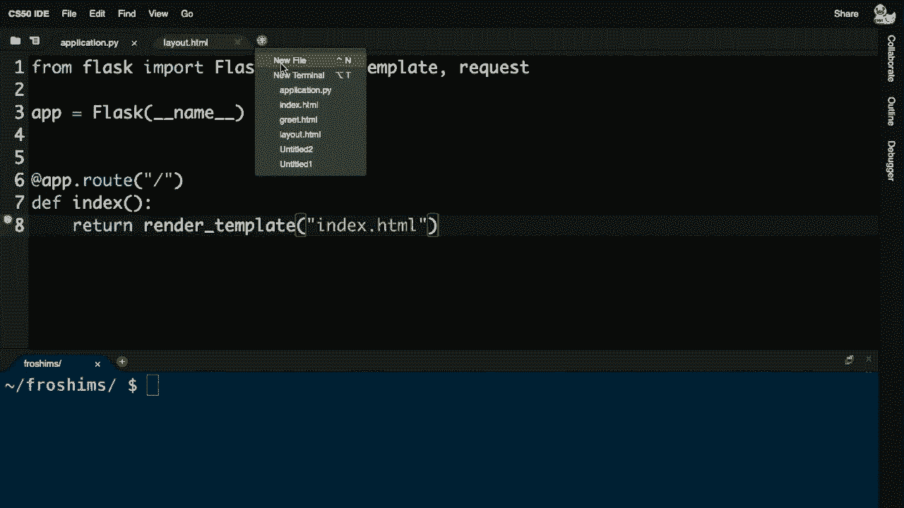

文件叫`index.html`，我可以随便称呼，但如果这是我的默认路由，我不妨将我的默认页面称为最常见的默认名称，即`index.html`，让我将它存储在我的`frosh_ims`文件夹中。

在我的模板文件夹中，这样它就在正确的位置。让我说这个`extends my layout.html`，然后在这里让我说我的主体块将是这里的任何内容。现在我有点不舒服，因为我写了太多代码，所以我们就把它放到待办事项那里，并确保整个目录。

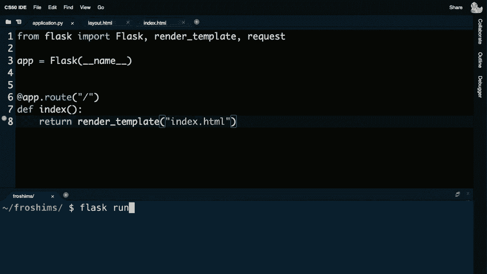

运行`flask run`，好了，打开这个浏览器标签，它只显示待办事项，所以我查看页面源代码。

我看到一个完整的网页，包括我们刚刚添加的meta标签，但这里有一个大待办事项。现在我想做的最大事情是让学生能够注册一项运动，所以让我们定义一个html表单来实现这一点，在我的主体块中的`index`。

html模板，让我们先把这个称为注册页面，并使用h1标签。然后让我创建一个表单，动作将是。我的意思是，限制是天空，让我们保持简单，直接使用`/register`，而不是通过再次使用相同的路由来使事情复杂化。

让我们保持一点私密性，所以使用**post**方法，这样我的室友就不知道我注册了哪些运动或没有注册。在这里，类型将是文本，让我们像之前一样添加一些花样，自动完成设置为关闭，或者**oof**，呃，自动聚焦，哎呀。

占位符，使其自我描述为姓名，好的，然后让我添加一个提交按钮，输入类型为提交，并添加一个值为注册，只是为了让网站更加用户友好。让我停止我的服务器并重新启动，这样我可以。

重新加载所有这些更改，让我再次访问这个**url**，瞧，我们有了一个开始的界面。

表单只询问姓名，所以还不够，我需要询问一些运动。现在有很多方法可以做到这一点，尽管你可能还没在**cs50**中见过它们，但你在访问网站时肯定使用过，所以我们先做一个下拉菜单。

让我做一个叫做选择菜单的东西，因为你选择一个选项，名称将是运动。如果你阅读教程，你会看到它们必须有称为选项的子元素，子元素必须有值。例如，选择躲避球作为一个常见的校内运动。

然后在选项标签内部，你实际上必须说，就像链接一样，人类应该看到什么，所以我会冗余地说躲避球，让我让我的生活简单一点，快速一点。让我复制粘贴一下，我们将这个改为**flag football**。

在这里说足球，我们可以说**soccer**，就像链接一样，可能会有这种二元性，*一样*。

但现在我们保持简单，这就是计算机将看到的内容。这是人类将看到的内容，然后在这里我们将称之为**终极**飞盘，听起来一样，**终极**飞盘。好吧，现在我有了一个工作中的下拉菜单。

有点丑，确实很简约，但如果我现在输入我的名字**david**，注意到默认的应该是躲避球，但我可以修正它。我不喜欢强迫每个人都认为他们必须选择躲避球。让我在这里做一个空值的选项。

举个例子，假设它是运动，所以没有价值，它并不是一个实际的有效选项，让我去打开我的**url**，现在，我看到下拉菜单中也有运动。

体育方面有点奇怪，你可以注册运动，事实证明，如果你阅读选择菜单的文档，你可以实际禁用该选项，并且还可以默认选择它，所以这些都是你在`option`标签的文档中会发现的附加属性，现在让我来优化用户界面。

让我们做得更强大一些，以便用户。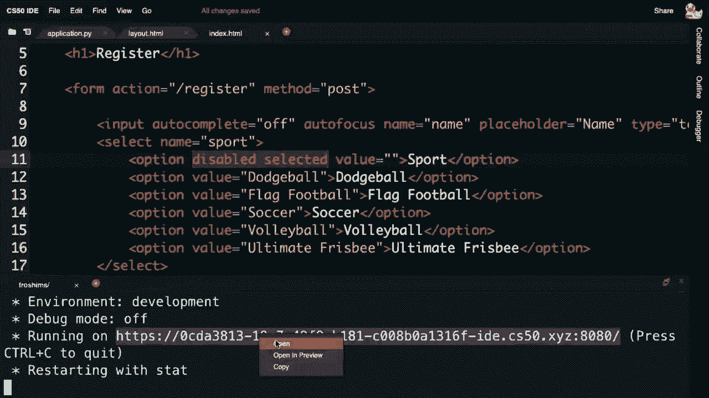

现在注意，运动默认选中但已灰显，它不再是有效值，所以这是一个小的用户界面改进。躲避球听起来很棒，在我那个时代这并不是一项校内运动，但显然如今是的，所以让我去**注册这个功能**。

好吧，但当然没有找到，为什么会这样。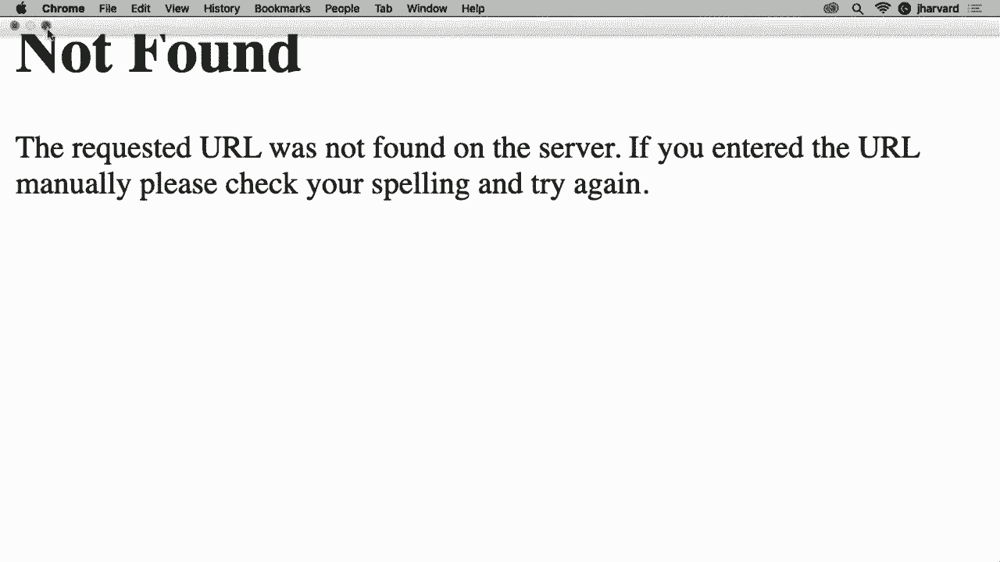

如果我们看看我刚刚到达的这个网址，我还没有实现我的斜杠注册路由。好吧，我们来做这个，为此我需要回到应用程序`pi`。让我们去**做一些注册的技巧**，`app.route.register`，我将定义一个函数，可以随便取个名字。

初始时我们保持简单，让我们去**返回一个名为成功的模板**，而且就是成功的。

事实上，让我去**创建一个新文件**。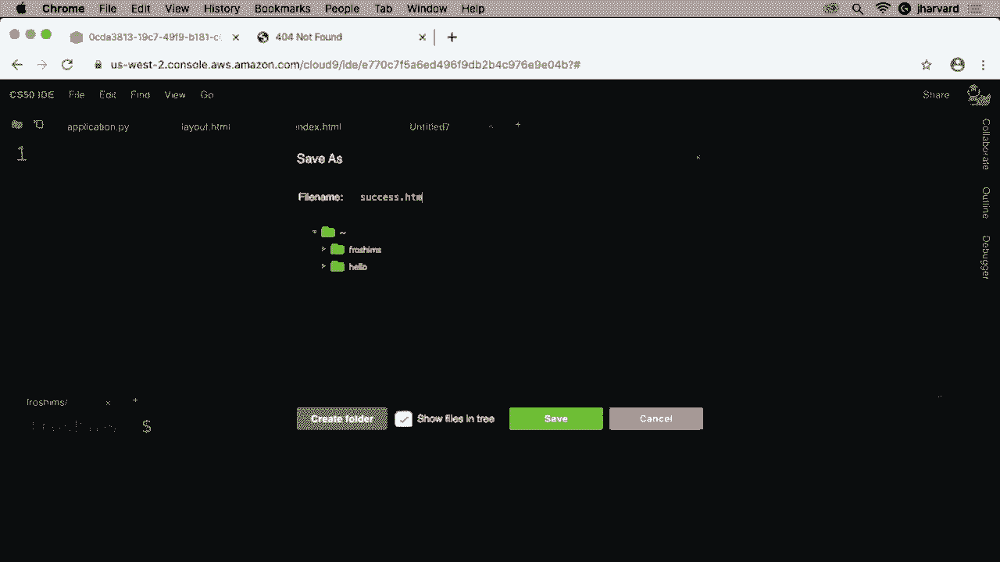

在新生`ims`模板目录中叫`success.html`，让我确保它也扩展了`layout.html`，并且有一个`block body`，为了确保安全还有一个`block`，然后现在你已注册！不是在真正注册任何人，但我要声称他们被注册了。

现在如果我重新运行我的应用程序，重新注册大卫参加躲避球并点击注册。哈，现在出现了一个错误，让我在这里暂停一下，看看这些部分是否**结合在一起**，即使我在斜杠注册那里，方法仍然不允许。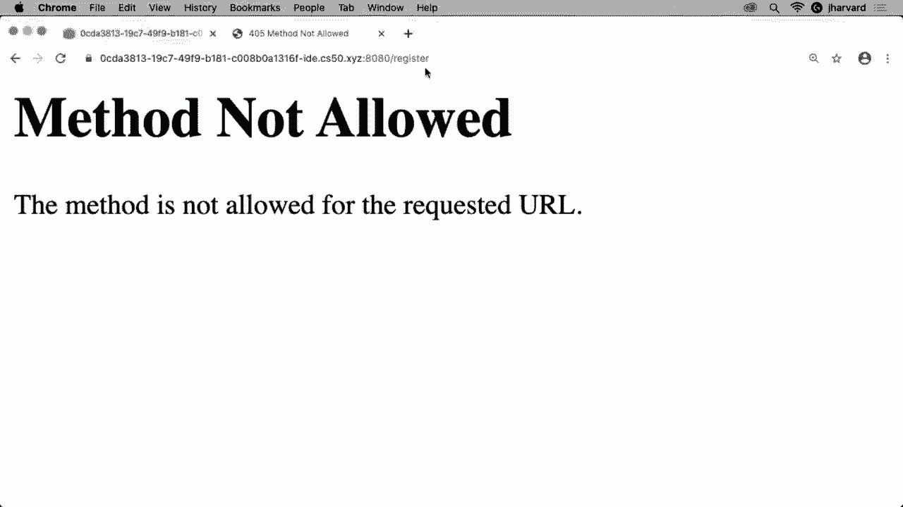

关于如何解决这个问题的想法，注意在我的终端窗口中红色显示意味着“方法不允许”，这是一个罕见的错误，布莱恩有什么想法，嗯，我认为当你定义`app`的路由时，没有为读取或注册指定方法，都是`get`。但如果我想出于隐私原因使用`post`，记住我只需要告诉。

flask希望你支持此路由的方法是这份动词或方法列表。这个列表的大小将为一，仅包含关键字`post`。所以再次，当你第一次做这些事情时遇到这些问题，**不要太担心细节**。

错误信息，但想法是，出了什么问题，方法不被允许，那可能意味着什么，我们讨论的唯一方法是 get 和 post，所以也许这和 slash/register 相关，所以也许这与线索有关，可以引导你找到像 Santiago 刚刚提议的解决方案。

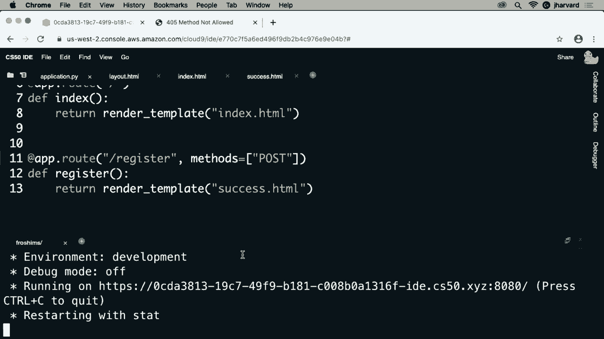

让我继续并重启我的服务器，让我继续并重新加载。我的表单再次输入大卫，我要选择躲避球注册。瞧，你已注册。好吧，我实际上并没有注册任何东西，但我觉得这里仍然有一个遗漏的错误检查机会。事实上，让我去看看。

回到我的表单，不输入大卫且不选择躲避球，然后点击注册。嗯，这有点傻，它声称即使我只输入我的名字，我也注册了！

没有运动你已经注册了，所以这里有一个遗漏的机会来进行一些错误检查，所以让我们至少去添加这个，让我们继续做一些，比如如果不是 request.form.getname，或者 request.form.getspore，或者不是那样，那么让我继续并返回渲染模板 failure.html，否则我将返回 success.html。

让我现在尝试这个，让我重新运行。

server flask run，让我继续并重新加载我的表单，没有对表单进行更改，但现在如果我不合作并点击注册，好吧，现在真的发生了糟糕的事情。这是那种500错误之一，让我们看看我哪里搞错了。内部服务器错误及其后续。

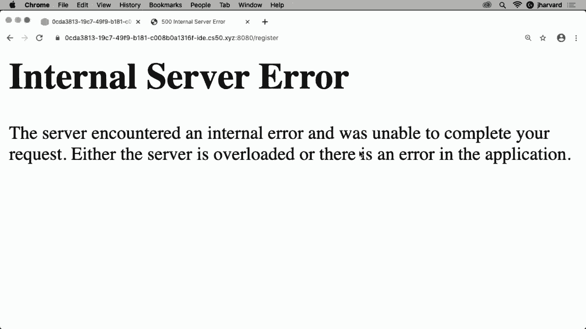

段落不是很描述性，但如果我去我的终端窗口，这里是我的异常，failure.html 找不到。好吧，这只是因为我犯了一个愚蠢的错误，所以让我暂时停止服务器，继续并粘贴到这里。

我可能可以把这个提取出来，但我们暂时还是保持简单，称之为 failure.html。

把它放在 frosh ims 模板中并保存。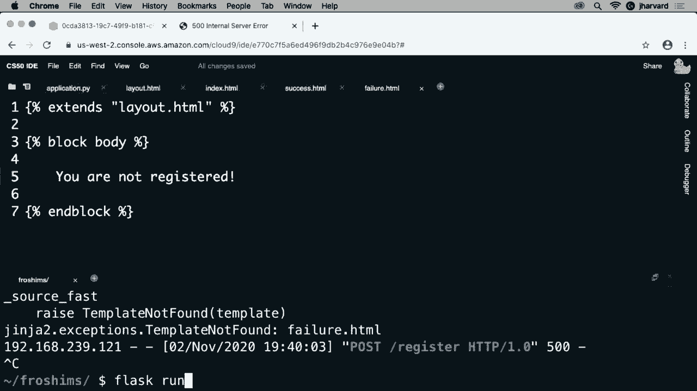

回来，让我尝试不输入任何内容，直接注册，好吧，瞧，这下它实际上在检查。如果我回到这里，名字好吧，我不输入任何运动，它仍然没有检查。但这里仍然有一种hack，你知道的，你还记得上周的事。如果你右键点击或控制点击任何网页中的内容，你可以在 Chrome 或你的浏览器中检查它。

首选浏览器，让你开始浏览 HTML，看看这个，可能我有点不高兴，嗯，没有，比如说，网球，网球并不在校内运动项目中提供，但该死，我想注册。好吧，再次使用浏览器，没有什么能阻止我，比如我不知道如何。

我们来把 ultimate frisbee 改成 tennis，页面，缩小回去，关闭检查器哈哈。现在 tennis 是哈佛的一项运动，所以现在，看看我能做什么，注册 tennis 输入我的名字。david voila 注册了 tennis，没错，我黑了这个网站，好的。所以在某种意义上，我算是黑了这个网站，这次。

显然，我现在在服务器上没有处理任何红色信息，我只是在盲目地说注册或未注册。但注意我刚刚做了什么，事实上，让我们真正注意到我做了什么，让我去 ah**d 再次检查页面，让我去我的网络选项卡并重新提交这个表单。

回到这里，让我输入 david 让我再做这个快速黑客。让我去 ah**d 右击 sport，检查，让我去掉 ultimate。frisbee，并将其改回 tennis，然后再将其改回 tennis。输入，现在让我去我的网络选项卡，从下拉菜单中选择 tennis，然后在这里，向下滚动。

就像上周一样，你可以看到所有 HTTP 请求的列表，所以让我们看看 /register。现在让我放大这一切，向下滚动到表单数据，我们上周没有看到，但它存在于 POST 请求中。

我已经合法地从我的浏览器发送了 david 和 tennis 到服务器，现在的责任在于你，程序员，要确保你不会让我注册 tennis 如果它不是一个支持的运动。所以现在需要更多的错误检查，仅仅这样做是不够的。

信任用户输入了一个名字和一项运动，你不能仅仅检查这两者的缺失。现在我们应该更聪明，确保人类的浏览器发送的运动实际上在哈佛存在，你可以快速地。如果这是一个银行账户，比如你想存多少钱，我会说金额。

我现在在存款或取款，对吧，你不应该能够仅仅通过改变一些 HTML 来改变服务器的数据或数据库。你绝不能信任你的用户，或者在这个案例中是我。那么我们该如何防御呢？其实这个问题有一个解决方案，它还提供了一些其他的功能，傻乎乎的，我把所有的。

这些运动在 HTML 中，字面上我 resorted to copying and。pasting，这应该是第一个线索，说明我们可能能做得更好，让我进入应用程序。pi，让我在这里上去，让我定义一个全局变量叫做 sports，我会按照惯例将其大写。

常量定义成硬编码的，让我去 ah**d 并说运动将会是这个。python 列表，所以我会保持它整洁并将其放在多行上，列表。这里我要说 dodgeball 作为一项运动，flag football 是我们的下一个逗号。soccer 哎呀 soccer 哎呀，soccer 是我们的第三项，volleyball 是第四项，最后我们保留。

终极飞盘，我现在如何使用那份运动列表，我可以直接将它们传递给我的模板，我可以说，类似这样的东西，sports 或任何 x、y 或 z，但 sports 更具描述性，等于 sports。这就是说我要在我的模板中创建一个变量，名为 sports，其值将是相同的。

全局变量，并且要明确 Flask，要求你选择一个名称。你不能仅仅传入运动，因为，Flask 根本不知道该如何处理。像这样的单一参数，你必须给这些东西命名，而这又往往导致冗余，因为你在重复使用相同的词汇。

但一个是你在右边的变量，另一个是你在左边模板中使用的名称，所以现在让我们在 index.html 中做这个，强大。在像 Jinja 这样的模板中，你不仅仅有左右的花括号。你不仅仅有带有花括号和百分号的块结构。

我实际上可以做这样的事情，结果证明我实际上可以做这样的事情。对于 sports 中的每个运动，你可以直接说，结束，然后是刚才的介词的名称，但现在让我去啊 **d 并生成一个值是“当前运动”的选项，关闭它，然后在这里让我说。

运动再次完成，现在，我在我的模板中使用了一个 for 循环，其语法看起来几乎与 Python 相同，这不是偶然，Jinja 的作者基本上借用了 Python 的语法，所以我做的并不太多，我使用这个 Jinja 语法来迭代那个 sports 变量，这是一个 for 循环，所以我在说，逐步设置 sport 等于第一个。

运动，然后是第二个、第三个、第四个和第五个，for 循环。我使用双大括号，只是将运动插入那里，将运动插入那里，而这个特性，关于 Flask 和其他网络框架的惊人之处在于。

总的来说，现在当我运行 flask run，并且打开我的网址，访问这个表单。瞧，它在那里，是动态生成的，如果我查看我的，所有选项确实在那里，但我不需要手动输入它们。

我现在将它放入一个数组中，我正在动态生成更多的 HTML。而且更强大的是，现在我可以进入我的应用程序。pi。我们不仅仅检查这个值，如果没有 request.form.getname。也就是说，如果没有名称，然后这一部分是在说。

如果没有运动，为什么我不更具体地说，用户输入到表单中的运动并不优雅。

现在我正在检查两个布尔表达式，是不是没有请求。表单。获取名称，还是说他们，不，应该失败，所以你可以给我发网球，你想，我现在要拒绝，因为我在验证你的提交，是主题的。不幸的是，你永远无法信任用户输入，你应该始终假设。

那些恼人的黑客在外面，或者朋友或兄弟会试图入侵或崩溃你的程序，但你可以通过这种方式进行防御，所以现在如果我去**d和，戴维。躲避球注册，这有效，但如果我，再次进行这个小黑客。在我的HTML中，我下拉到这里，我将终极飞盘更改为网球，出来，戴维。

瞧，等一下，该死。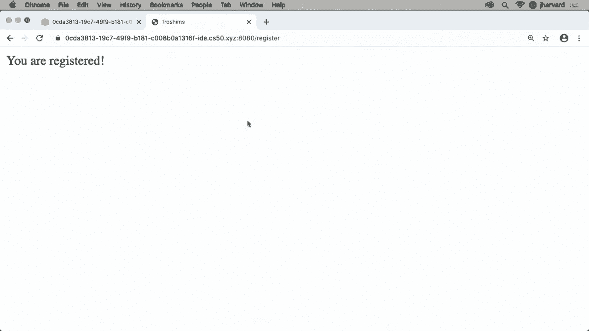

为什么那有效，更多请求对不起。

对不起，戴维不仅注册了，而且感到困惑。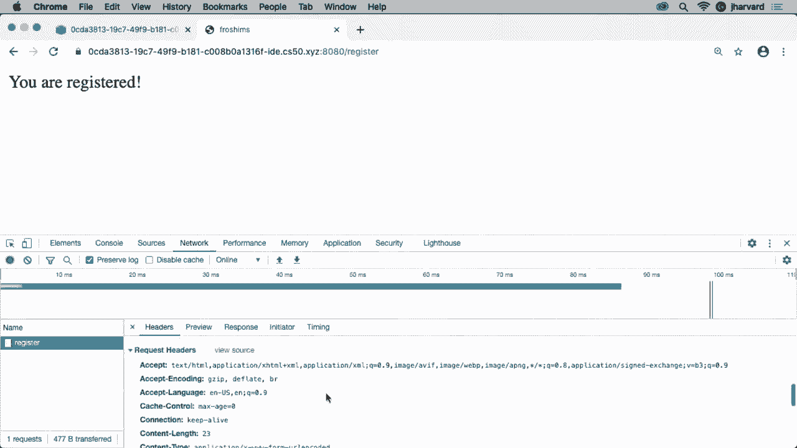

让我再检查一次，运动等于网球注册哦，等一下，好的，我没有重新启动服务器，它还在运行旧代码。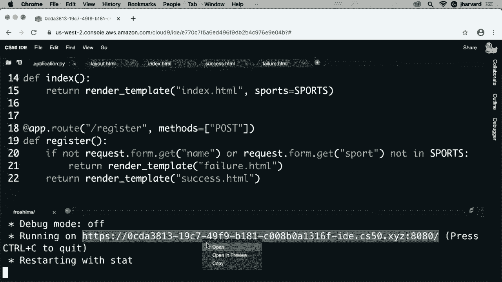

现在我打开它，哦，现在我们必须做，黑客网站，让我去**d并检查一下，展开运动，让我们去**d并将终极飞盘更改为网球。让我们去**d并将其更改为网球，关闭窗口。

将下拉菜单更改为网球，现在好了，好的，刚刚有点困惑，但再一次，只需重新启动服务器，它就会重新加载我们实际做出的更改。非常感谢布莱恩，深入其中拯救我，但我搞清楚了。好的，还有其他问题或困惑吗，超出我自己的，现在，我们刚刚做了什么。

动态生成用户选择菜单选项，同时在服务器上对相同的数据列表进行验证，有什么问题或任何事情在你那边吗，布莱恩，没什么。这很好，所以让我快速演示一下这些不同的用户，假设。我们并不太关注用户界面设计的目的。

使用像Bootstrap这样的库，你可以通过添加几个HTML标签和几个CSS类，使这些表单看起来更漂亮，但让我去**d并在这里进行一个调整。我们可以将UI从选择菜单更改为一堆不同的东西，让我回到我的索引页面，在这里，让我去**d并介绍。

不要这个选择菜单的概念，让我们去**d并去掉它，但让我们引入一个更熟悉的选项，如下所示，让我去**d并把这个移开，让我继续使用我的循环，在这里定义一个输入类型等于复选框。其值将是当前运动，然后在外面，我将继续。

保存同样的运动名称，所以我需要做一件事，名称等于引号中的运动现在让。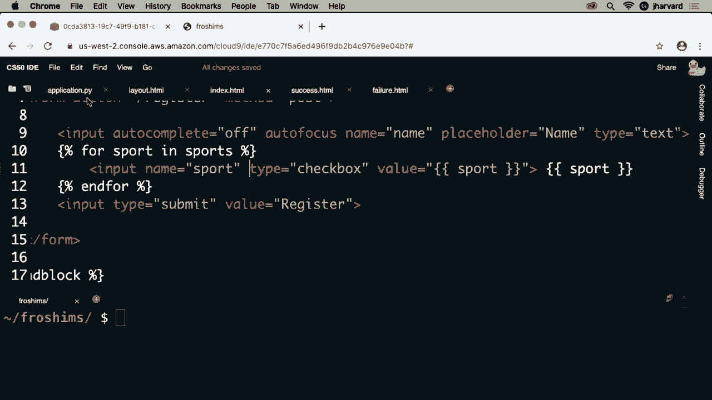

让我回到我的flask运行，让我现在回到表单，现在注意这并没有更漂亮，但它现在使用复选框，如果我继续点击大卫并检查。躲避球，我实际上可以，现在技术上注册多个运动。如果我愿意，我可以注册多个，服务器。

我必须稍微以不同的方式处理这个，因此实际上，如果我确实想支持多项运动，我应该在应用程序中实际做的事情是。pi。

列表，flask获取多个值，看起来像是获取列表，是的好的，所以获取列表。会返回给我一个人类输入的所有复选框的列表，有点。这样我现在可以以不同的方式获取用户的输入。或者我可以做一些互斥的事情，而不是使用选择菜单。

注意我可以在index.html中做什么，我可以去啊**d并在我的菜单中定义。一个输入名称等于sport，类型等于radio，作为单选按钮，它们是你可能在网站上勾选的互斥圈子，然后这个值将是这个特定运动。

然后这里让我去啊**d。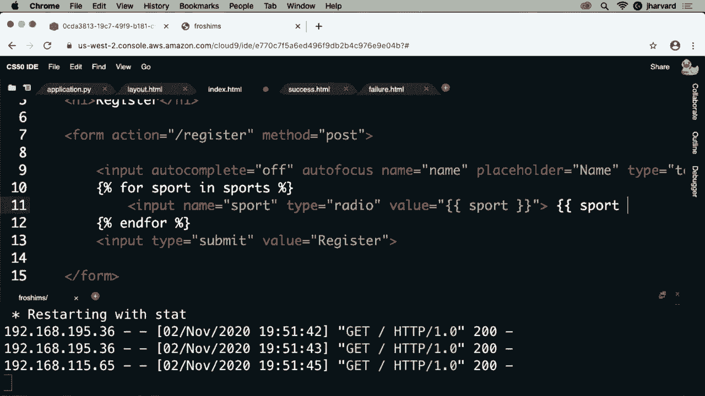

在单选按钮之外，实际上向人类显示该运动名称，让我重新启动服务器，让我重新加载我的页面，瞧，我们不再有选择。菜单，但我们有单选按钮，它们达到了相同的结果，但只是以略微不同的方式排列。

互斥就像老式的车载收音机，你只能选择其中一个。完全相同，所以使用哪个取决于如果你有一百种不同的运动，你可能不想要一百个不同的收音机，占用太多空间，但如果相反，你可能想使用。
