# 哈佛CS50-CS ｜ 计算机科学导论(2020·完整版) - P19：L9- Flask网络请求与爬虫数据编程 2 - ShowMeAI - BV1Hh411W7Up

好的，那么我们还没有做的关键是什么？我们有一个相当动态的用户界面，但用户一点击就扔掉信息。记住，正如我以前所做的，谁实际注册了，这样我们才能有一个真正有效的注册系统。我们该如何进行呢，过去。

我们可以在 Python 程序中使用列表、字典、集合存储数据，Python 提供了很多数据结构，所以让我们从简单开始，实际上做到这一点。让我们继续将注册者存储在一个字典中，因此在 application。pi 中，至今为止未更改，给我再加一个全局变量。

注册者，让我将其初始化为一个空字典，并回忆我们这样做是为了实现一个电话簿，我在几周前添加了我的名字和电话号码，以及布莱恩的名字和电话号码，我们用 Python 字典来存储这些键值对。名字和电话号码，现在让我们做，名字和他们所从事的运动。

注册后，我们在计算机的内存中会有一个有效注册的列表。我们怎么做这个，什么需要改变呢。让我继续将其改回选择菜单，因为它在屏幕上看起来更好，而不是单选按钮，从这里我们将再次有用户。

我们看到的接口。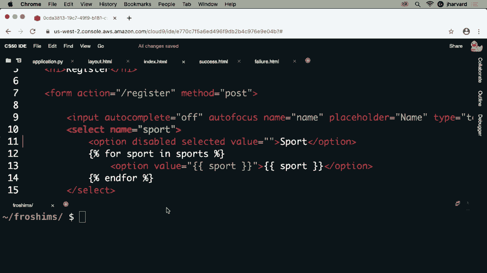

所以让我继续执行 flask，run。

让我继续打开这个，之前的目标是当我点击时，看看。你已注册或未注册，用户，所以我想我们需要在 application。pi 文件中做一些工作，实际处理用户注册的文件。因此，不只是通过检查他们是否有名字来验证表单。

或者是一个在运动中的运动，让我们继续，差不多从这里开始，给我做点这样的事情，name = request.form.getname，这样我更容易使用。然后我们就说，如果没有名字，那么就继续执行并返回，渲染模板失败，sport。sport = request.form.getsport，把它存储在一个变量中，这样我就可以。

让我们做得更干净一点，然后，如果不是运动，就继续执行并返回渲染模板。模板失败 dot html，然后我们再检查一次，但我在想，如果运动不在运动中。那我们就继续执行并返回，模板，失败。html，但你知道吗，这看起来有点傻，如果我知道作为程序员我在做什么。

错误是，但我只是告诉用户，你未注册，那不是，用户。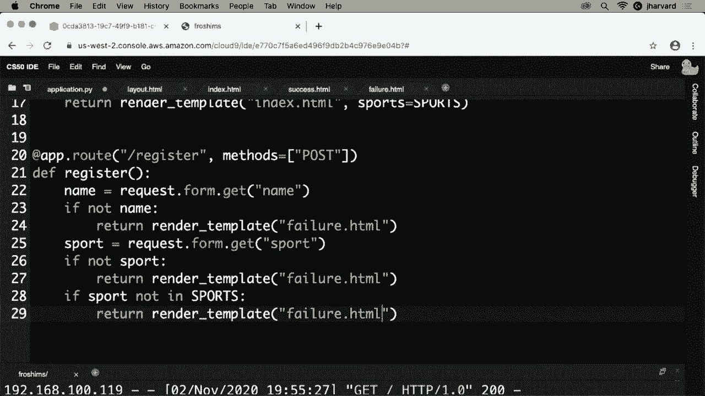

错了，所以我们改成这个，而不是。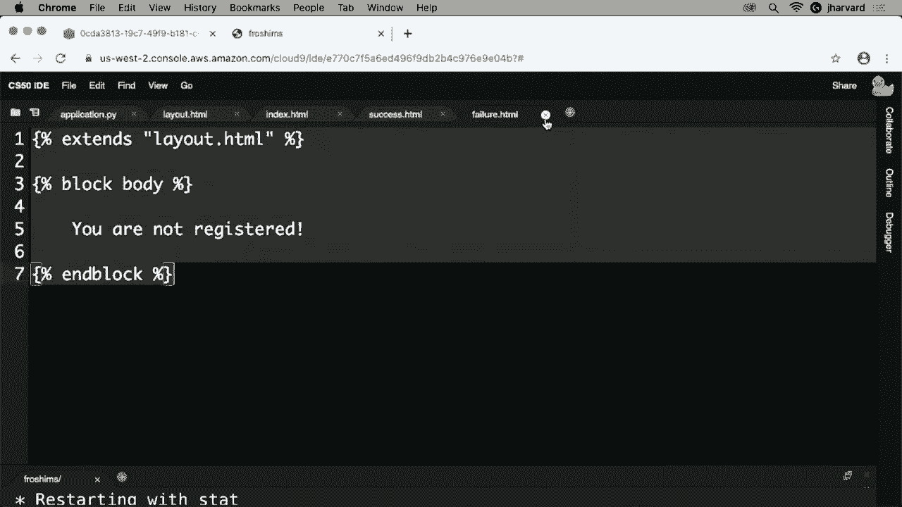

failure。html，让我**继续**创建一个不同的文件叫做error。html。这将在我的frosh ims目录中的templates中叫做error。html。

目录，在这里让我们**继续**实际放置一个错误信息，例如像这样。这个消息没有任何内容，但让我们看看这会对我们有什么帮助。现在让我们回到application.pi，而不是error。html，让我们提供一个**错误信息**，比如缺少姓名，然后在这里更改为error。html，并给出一条消息。

缺少运动，在这里让我们将其更改为error。html，哎呀。错误，错误的错误信息，**无效运动**，所以那里有一个运动，但它不在有效的列表中，因此现在让我们快速尝试一下，输入这个。

数据不正确，所以我们可以看到这些，让我重新运行服务器，重新加载表单，输入空白。试着注册，好的，缺少姓名，比起你没有注册要有用得多，好吧，让我给你我的名字，大卫。注册缺少运动，好吧，现在让我**继续**给你一个运动。

如果我注册，我可能会得到处理。

还没有成功的结果，所以让我们完成这项工作，回到我的application.pi中的注册路由，然后问自己，用户在计算机的内存中**注册**了某个运动。计算机的内存，我通过这个名为registrants的**全局变量**来使用。

这都是大写字母只是为了清楚地表明这是**必需的**，然后在这里我为什么不这样做。注册者姓名，我们做了什么，值，我在这里使用姓名索引到`python`字典中。然后我将值设置为**运动**，然后我们暂时说返回。

渲染模板，哎呀，渲染模板，success.dot.html，所以让我们测试一下。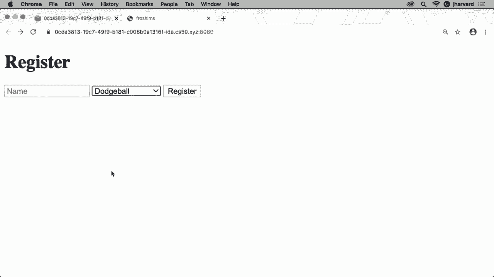

让我们去frosh i am，所以让我们从我的错误中学习。

停止服务器并重新加载，让我回到浏览器，接下来让我**继续**输入大卫，他将注册为**躲避球**，注册声称已注册，让我。

布赖恩将注册为**标志橄榄球**，我不知道谁注册了，但你知道吗，让我们做一点**理智检查**，让我打印出来，print。f是你的朋友，所以我们就这样做。

再次运行，这次让我们回到表单中。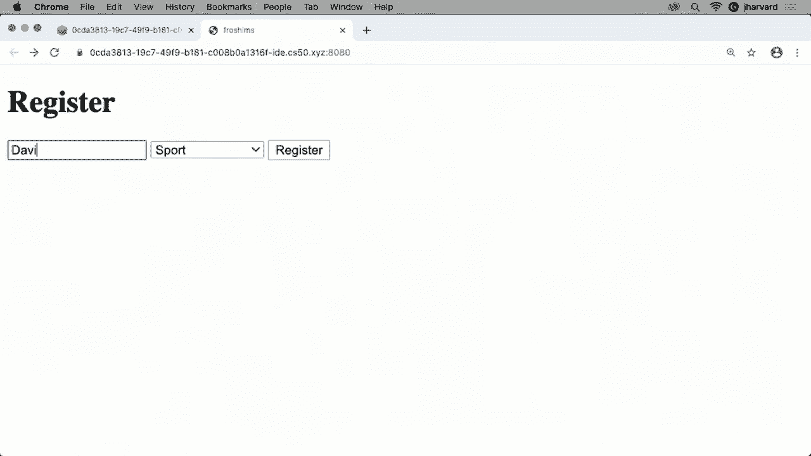

注册大卫，运动躲避球，注册相同的行为，但在这里注意。我们有这个哦，我看到你们也在注册，呃，所以我看到。卢卡斯注册了躲避球和排球，所以，他们现在很好，哈希注册了。排球，所以这是个问题，实时演示，但显然它确实有效。

让我们去啊**d，把这个弄得更整洁一点，而不是仅仅打印 registrants。让我们去啊**d，做点什么，比如，这为什么不我去啊**d。你知道吗，让我们这样做，去渲染一个名为，[Music]，registrants.html 的模板，我认为要实现这一点，我需要另一个，有趣的，生成。

非常成功的消息，所以，让我去啊**d，做点什么。

registrants.html frosh iams 模板。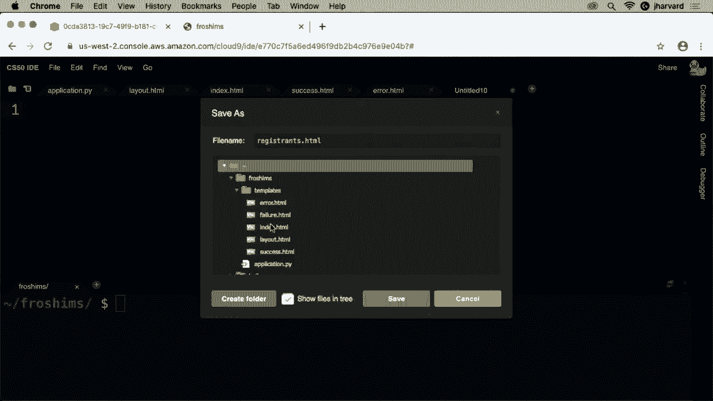

然后在那个文件夹的模板中，在这里我们将做 extends，layout.html。在这里。block body 结束 block，然后在这里我要做。这会花我一点时间，这里 h1，registrants 然后在下面我会给自己一个 html 表格，在表格中，我将定义所谓的。

表头不是严格意义上的，头部，来自可选的页脚，表行。在这里，我将创建三个，使用 th 表头的列，你可能之前没有见过，默认使其加粗，以清楚地表明这是标题，我将放入，个人的姓名，然后是另一个标题。

他们的运动在这里，然后在表头下，我将做 t body。这是表体，你可能没有见过的另一个标签。body。我将动态生成一堆 trs，所以对于 registrants 中的姓名，让我们去啊**d 在这个，姜的 for 循环中，表行，具体来说。

个人的姓名，然后在另一列，我们将看到。通过一个叫做 registrants 的变量，索引进去，所以 registrants 过一会儿，将是一个我传递，给我的模板的字典，我想就是这样，虽然手动输入有点繁琐，但，模板化，如果我现在回去传入。

registrants 等于，我给我的 registrant 模板提供的变量，叫做 registrants，但我也可以叫它 x，更合适，将其设置为该全局变量的值，从而给我的。

模板访问到，那个字典，如果我现在保存文件。

重新运行 flask，回到这里，哎呀，让我去啊**d，再做一次。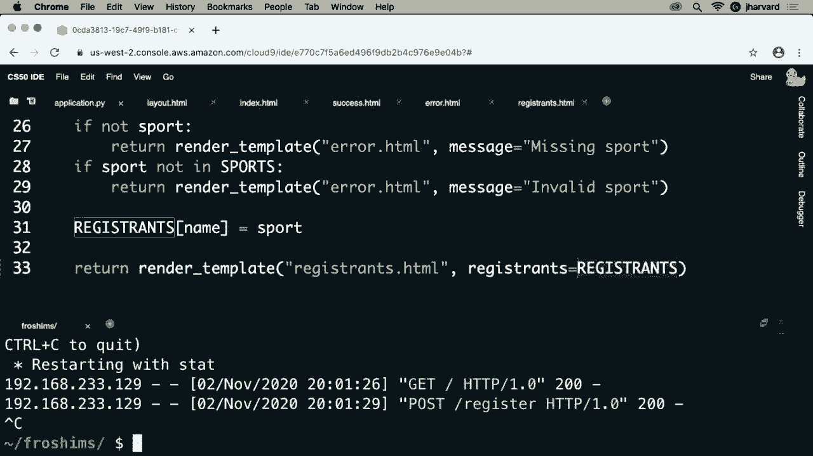

再来一次，让我去啊**d 重新运行 flask，让我去啊**d 选择我的 url 让我。去啊**d 把大卫注册为，躲避球，点击注册，瞧瞧，或者，她比我快。哈希已注册为橄榄球，大卫已注册为躲避球，但。如果我查看页面源代码，你会看到，我们确实有表头。

后面是表体，后面是！

对于橄榄球来说很苛刻，接着是大卫的躲避球，然后是任何后续的注册者，他们在同一时间注册，所以我敢说这很酷，因为现在我们有能力将所有这些注册者保存到一个全局变量，但这里的缺点是什么，我们已经取得了进展。

我现在在展示注册者，谁在进行这项运动知道谁注册了，但有一个陷阱，这里可能出错，使用字典有什么坏处，索非亚。我认为每次你重新加载服务器时，你会重置，你会保存数据，确切地，如果我只是在使用一个全局变量。

变量只要服务器永远运行，它就会永远有效，只要IDE保持在线，我们不失去电源或其他任何原因，但一旦网络服务器，抱歉，停止或被关闭，或者出现其他问题，我们会失去所有这些数据，这就是为什么几周前使用Python。

我们实际上使用了csv文件，或者最终使用了一个SQLite数据库，但让我做一个改变，因为，我现在不喜欢的是，目前查看我的唯一方式。也许这是一个功能，如果你想让人们在查看其他注册者之前注册，但有不同的路线也不错，可能是/registrants。

任何人都可以访问以查看实际的注册者列表，所以让我去啊**d并进行一个调整。让我去啊**d到这里，定义另一个路由，app.route/registrants，然后定义registrants，任何我想要的，让我实际上将这个模板的渲染移动到这里，你知道吗，让我聪明一点，实际上重定向用户。

到/registrants，所以让我去啊**d，导入一个函数，来自Flask库的redirect，这是一个函数，实际上会执行一个http 301或其他状态码，将位置发送到浏览器，告诉它去这里而不是那里，原因是，这样很好，现在在我的注册路由内部。

一旦你注册，我不需要真的复制，实际上。拥有冗余代码，我可以直接说，重定向用户到/registrants。！

这个路由现在已经存在，所以他们可以看到自己和其他已经注册的人，所以如果我再次这样做，让我为躲避球重启服务器，这次我们看到，呃，破和莫伊什，还有大卫现在在那一瞬间注册，这些运动真是惊人，但请注意URL，这才是关键点，现在我们在/registrants，如果我。

不断重新加载，我会看到所有的更改，自那时起，一切都好，但索非亚指出一个非常好的问题，那就是日期将会丢失，所以我想我们应该清理一下。我们实际上可以将数据保存在 SQL Lite 数据库中，或者甚至通过电子邮件发送出去，以便我们有一个备份副本。让我**继续**提议在这里做一些更改。

做了一些更改，从我们对 SQL 和 Python 的观察中借鉴了一些灵感，因此我现在将大部分内容保持不变，我要**继续**去掉这个变量，我们必须将数据存储在其他地方，数据库是一个 SQL Lite 数据库，所以让我**继续**声明我们的数据库，呃，作为 sql sqlite colon，frosh ims。

让我**继续**导入这个，这是来自 CS50 的库。SQL 库，接下来让我**继续**在。！

请稍等，我将复制我带来的示例数据库。！

这样我们就不必创建数据库，也不必重复上周的 SQL 课，让我**继续**抓取这里的数据库，烤箱，现在我们在我的本地文件中有一个。！

目录叫做 froshims.db，所以让我们**继续**先查看这个数据库 sqlite，frosh iams.db dot schema enter，这里是我提前创建的数据库表，以免我们重新发明轮子，我创建了一个叫做注册人的表，带有一个 ID 列，一个名字列和一个运动列，主键将是那个 ID。

文本字段不能为空。！

上周我看到了所有的语法，因此这只是一个简单的表，给我每个注册人一个 ID，一个名字和一个运动，但我现在要用 Python 来做这个。让我**继续**回到我的应用程序中。pie。让我们**继续**做这个，当我想实际注册用户时。

让我们像以前一样验证他们，确保他们给了我们他们的名字和运动，现在让我们用一点 SQL，而不是将其保存到一个全球变量中，让我们做 db.execute，插入到注册人中，一个名字和一个运动，我不需要 ID，它将作为主键自动递增，问号。

再次警惕 SQL 注入攻击，让我传入名字和运动，我想这就是我需要的全部。我现在要在我的 Python 中使用一点 SQL，将名字和运动插入数据库，之后我想我就没问题了，但我确实需要更改注册人。因为这里的变量不再存在，但没关系。

因为回想一下我们对 SQL 在 Python 中的观察，我可以做类似这样的事情，注册人等于 db.execute 选择，从注册人中选择星号，确实，这个简单的查询似乎能让我访问到所有的注册人，到目前为止，现在我可以就这样传入。看起来你的变量名称在你的 db 中有点奇怪。

模板与这个变量的名称是相同的，但再次说明，右侧是变量，左侧是你希望在模板中使用的名称，但你可以随意命名，这里总是让我交叉我的。

手指输入 flask run，好的，让我去**前进并打开我的，网址，让我去**前进并输入 david。躲避球注册，好吧，有趣的是，Harsh 和 Naveen 很快就进入了那里。你只是在等待提交按钮，但这真是一团糟。

明显有些东西出错了，现在我看到像奇怪的字典语法。但这是因为我还没有调整我的模板，所以让我去 registrants.html。记住，当我选择时，像获取行一样，我刚把它改名为 registrants。但我实际上是在获取行，行只是字典，每一行都是，它们在。

所以我觉得我的语法只需要稍微调整一下在我的，registrants.html 中。我应该真的把这看作是注册的注册人，让我去**前进并输出注册人的名字，然后在这里让我输出注册人的运动，因此这更像是我们在 Python 中花费的 SQL 时间，而不是 HTML 和 CSS。

现在我正在遍历所有行，如果你喜欢，可以回到这里。就像我们之前处理的几行那样，将这些行传递给我的模板，然后遍历这些行，每行都有一个名称字段，而每行都是等效的，但一旦你理解了这些，实际上是，而不是这个更通用的行，所以让我们。

让我现在恢复，然后让我去**前进并重新运行代码，试着在大多数人之前输入 david，躲避球。

哦，我的天，好的，很多人，好的，新鲜事，更加严厉，所以你工作得非常快，看起来应该是这样，现在我们看到所有相同的结果，数据库真的很活跃，我有点紧张，不想再滚动了，所以我就停在这里，但我们现在有一个成熟的网页。

说实话，现在的应用程序，网站，我们有自己的数据库使用 SQL，我们有自己的模板动态生成这个表格，尽管目前它很丑，但我可以用一些 CSS 或特别是 Bootstrap 美化它。但是我们现在有一个完全功能的网站，究竟什么才是点缀呢？

你知道这很酷，即使我们认为这是理所当然的，当一个网站给你发送确认邮件时，实际上是在做什么，多年前你给注册者或自己发送邮件，以报告某人已注册。那么我们怎么能进入我的代码，在这里让我再加一个最终的顶端，从 flask，mail 导入邮件和消息，再一次。

你只能通过课程、文档、教程等，了解这些事情。我提前查找了如何做到这一点。然后根据，文档的要求，当你想要编写 Python 代码生成时，有一系列的，初始化步骤。

要以编程方式发送电子邮件，你必须，知道你的用户名、密码以及一些，其他设置。所以让我，现在就配置这些，app.config 字面意思上说。邮件默认发件人是一个，我将继续将其，设置为 os.dot。邮件默认发件人，因此默认发件人指的是一个默认，电子邮件地址，所以例如如果我。

如果我希望所有这些电子邮件来自我，我可以这样做。但我将把它们存储在，其他地方的变量中，因为我提前配置了我的 ID，以便没有人可以看到我的，用户名和密码，所以我将从所谓的环境中获取一些。值，你不会太常使用这个功能，问题集。

这是一种访问已在其他地方定义的，变量的方法。在你的 IDE、Linux 系统、Mac 或 PC 中更普遍。好吧，我需要再定义几个，让我继续做一些，样板代码。尽管这看起来有点，复制粘贴，但实际上是的。

这是必要的，因为邮件服务器有很多，设置，所以让我一个一个来。邮件密码我不想让你看到，这一点，所以我会继续从我的环境中，获取这个邮件密码，呃，让我看看，我需要，邮件端口，邮件端口将是，gmail，端口，587，所以我在查找这个。

文档太多了，邮件服务器实际上是，smtp.gmail.com，我在谷歌的文档中发现了这一点。邮件使用 tls，这是一种加密方式，让我继续将其设置为**真**。最后，邮件用户名我不想让你知道我使用的，用户名，但我会去，获取这个信息。开玩笑地说，用户，名字，或者安全的。

进入你的代码，因为想象一下，如果你，确实把自己的 Gmail 用户名或。密码输入到这个程序中，仅仅是为了尝试，真的在家里。然后你提交 50 次或者检查 50 次，密码被，工作人员获取，更不用说 GitHub 和。整个互联网，通过将其包含在，你的源代码中，所以，尽管我有点在嘲笑我。

在这些环境变量中，信息实际上是最佳实践，因为这意味着，意外地。将其复制粘贴到其他地方。好吧，我需要导入另一件事情，我还需要。导入 os，所以导入整个操作系统是个大胆的，声明，但实际上确实有一个库，随 Python 提供，名为 os，它让你访问类似于。

这些环境变量，还有其他的。好的，那真是很多，我需要最后一行代码，一个邮件变量等于，叫做邮件的函数。好的，我认为所有这些错误很快就会消失，我想，它只是对我有点慢。让我们现在继续实际发送，滚动一下，在我重定向用户之前。

到斜杠注册者，但在注册他们之后，让我继续定义一个消息变量，等于大写消息，这是我从那个库导入的功能，让我创建一个主题行，内容是你已注册。让我继续，但哦，我实际上不知道要发送给谁，所以这里有什么。

让我们继续，让用户不要求他们的名字，而是现在询问用户他们的电子邮件。所以我将更改我的实际表单，询问他们的电子邮件，而不是现在。让我回到这里，设定一个第二个参数为红色。接收者等于电子邮件，让我在这里更改，继续获取用户的电子邮件。

如果表单没有电子邮件，让我们大声喊他们，说缺少电子邮件，插入到注册者，你知道的，我们就不去插入到数据库了。实际上让我们保持这个超级简单，去掉 SQL 的东西。让我们只是发送确认电子邮件，这样会更简单，我们将完全保持关注。

在电子邮件上，所以我创建了带有主题行的消息，接收者。现在我要继续发送邮件，点发送，消息保存。这里我将像往常一样交叉我的手指。

我现在要继续进行，运行这个程序，我要重启我的电子邮件。让我继续输入，呃，假设是约翰·哈佛的地址。这里，像我一样的约翰·哈佛将注册躲避球，让我去点击注册，现在网站即将显示。

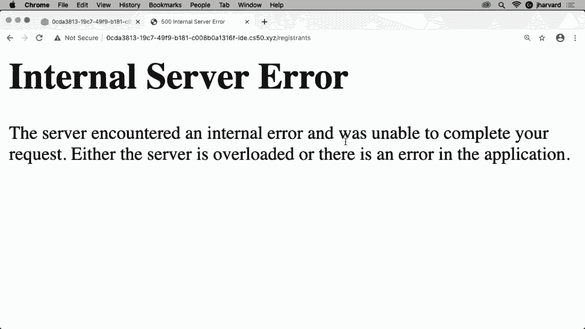

让我感到惊讶的是，哦，我不小心仍然在使用数据库，所以让我修复这个。让我继续，由于我们不再使用数据库，让我继续恢复到我们的。更简单的返回渲染模板。

success.html 好的用户错误，让我继续重启服务器。好的，错误网关，完全是另一个问题，来吧，j harvard 在 cs50。让我现在继续注册躲避球，确实注册。让我们转到我另一个浏览器，这里我打开了 Gmail，我目前假装是约翰。

在 Gmail 中的哈佛，让我继续刷新我的收件箱。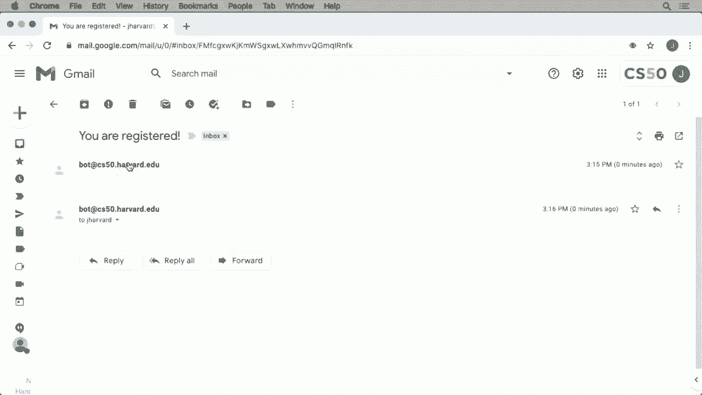

哦，我的天，来自 CS50 机器人消息，我确实已注册，所以现在我们有了一种程序化发送电子邮件的方式。我点击了两次，所以这次我收到了两封电子邮件，但确实我现在动态生成了电子邮件，想法确实是基于模板，和将我们的控制逻辑与美观结合的理念。

我们的所谓视图，现在的**后端**中也有存储的概念，或在这种情况下发送，是否有任何问题？

关于**SQL Lite**或电子邮件的使用，是否有任何混淆或需要澄清的地方？布莱恩，你那边看到什么了吗？没问题。那么，为什么购物车上有Cookies呢？休息后我们会回来讨论一种叫做会话的东西。

这是一个我们在网络编程中还未真正触及的功能，而这是你我在访问一些网站、在线购买时所理所当然的。

一般与动态网站互动，这通常被称为**会话**。无论是在Flask中还是其他框架或语言中，网络应用程序内置了一种机制，允许网络服务器记住关于你的一些信息，这之所以有效，是因为没有它，你将无法使用。

登录Gmail或任何其他网站时，网站会记住你已登录。毕竟，当你登录Gmail时，你输入用户名和密码，接着看到收件箱。之后再次打开电子邮件时，你会在一定时间内保持登录状态。

即使你关闭计算机，当你再次打开Gmail时，通常仍会保持登录状态，并记住你曾经登录过。究竟这是如何工作的呢？每当你访问gmail.com时，你的浏览器底层会执行特定操作。

像这样发送请求到gmail.com的默认路由，期望你要么看到收件箱，要么如果尚未登录，则看到登录屏幕，响应可能会返回200 OK，内容类型为text/html。

当你看到登录表单或收件箱时，回想一下上周，藏在那个虚拟信封中的信息，提供了它们如何应该互操作的方式，这正是**HTTP**的约定，规定了浏览器和服务器如何工作，有时涉及**Cookies**。你可能听说过Cookies，虽然它们被认为是坏的或危险的，但也是必要的。

确实，所有这些数据或文件都是由服务器放置在你的计算机或手机上，帮助它们记住你之前曾经访问过。在某种意义上，它们帮助记住你是谁，即使是那些你不常登录的网站也会在你的手机或笔记本电脑上放置Cookies。

桌面上的Cookies本质上可能是一个只有你知道的大随机数，即使它们不知道访问该网站的是**玛吉**，还是**瑞安**或**妮可**，也能追踪到你。

所以如果你听说过“追踪 cookie”这个词，那就是它，它是一段数据，一个随机数，浏览器会记住，并且机制就简单得像这样：来自服务器到浏览器的 HTTP 头之一。字面上是 set-cookie: 然后是一个 cookie 的名称，比如 session，然后是值。

因为 HTTP 的原因，cookie 会一起传递到你访问的每一个后续页面，比如 gmail.com 或其他你所在的服务器。换句话说，当你访问 gmail.com 时，那么一个小时后，即使你关闭了电脑去睡觉，如果你之前从 gmail.com 收到过 cookie，你的浏览器不仅会发送这些头。

你的浏览器发送一个类似的头，但没有“set”这个词，只有值。因此， unbeknownst to you 你的浏览器不断提醒服务器，你以前来过，这在现实世界中类似于，当你进入一个俱乐部或通过大门时，通常会被允许重新进入。

你的手被印上，这样他们就不必再次检查你的票据或身份证明之类的东西，他们只是给你印手，这是一个小提醒，表明你以前来过。因此，实际上我这里有一个小印记。如果我访问一个网站，就像我的手在这里被印上，而我的浏览器设计上是通过 HTTP。

每次我访问另一个页面或点击另一个链接时，都是在展示我的手，就像你回到酒吧、俱乐部或游乐园，提醒门口的人，保安，你以前来过，以便让你通过。而不是再次提示你登录，这就是 cookie 的作用。

就像这个虚拟的手印，贴在你的电脑上，但你的电脑设计上是不断地展示它。因此，如果你曾经想知道为什么有时候你在一个网站上购物，突然之间，令人毛骨悚然地你在 Facebook 或其他地方，看到那个网站的广告，那一切都源于 cookies，长话短说。

简而言之，有广告公司与 Facebook 和 Google 等其他公司合作，在网站上放置小图像或 JavaScript 文件等，因为这些广告分布在不同的网站上，因此 cookies 在某种意义上是跨多个网站共享的。所以就像你不断地，向所有这些展示你的手印。

不同的第三方公司，这就是他们如何向你宣传，呃，甚至在最坏的情况下追踪你。当你使用隐身模式或浏览器的私密模式时，你的所有 cookies 都会被暂时丢弃，可以说你得到了一个空的 cookie 罐。因此你看起来像是已注销，实际上即使在课堂上我也使用过。

我使用了几次隐身模式，因为我想重新开始，不让之前的点击或我们的演示影响未来的演示。

但我这样做的原因仅仅是，所有的。

因此一方面，cookies是一个极其重要和强大的机制，但足以说，更多关于这一点的信息在后面，他们可能会被滥用，当然在隐私或安全方面。所以说完这些，让我们考虑一个典型的网站是如何记住这个简单的想法，并明确这都是在。

现在用代码提升你的能力，所以我们开始吧。我创建了一个演示程序，记录用户登录。我保持了之前的布局，并添加了一个标签。最好告诉浏览器，你使用的是基本的unicode。这样我可以在我的HTML中使用表情符号和其他字符，所以我在第五行添加了这一行。

你将在bootstrap的文档和其他网站上看到这些。因此现在我有一个良好的起点，但页面实际上没有任何内容。这里只定义了一个块，正如之前所说的，确实如果我输入`ls`，你会看到一个名为`app.py`的应用程序和一个模板文件夹，那个模板文件夹现在开始。

写一个快速应用程序，其目的仅仅是向用户呈现一个表单，通过这个表单他们可以登录，然后记住他们已经登录。还要导入重定向函数，渲染模板函数，请求变量，还有一个session变量，这个是新的，然后来自flask的session。

__name__，现在我需要几行代码来自文档，`app`，`app.config`。打开括号，`SESSION_PERMANENT`，仅用于我正在使用的名为flask-session的库，而这个库将使得手动配置成为可能，`SESSION_TYPE`等于`file_system`，而`file_system`只是硬盘或我自己IDE帐户的华丽说法。

这是使用数据库或其他类似东西的替代方案。然后是`session`，应用程序的这三行来自于这个库的文档。但是为了使用这个库，之前还有另一个文件我应该指出。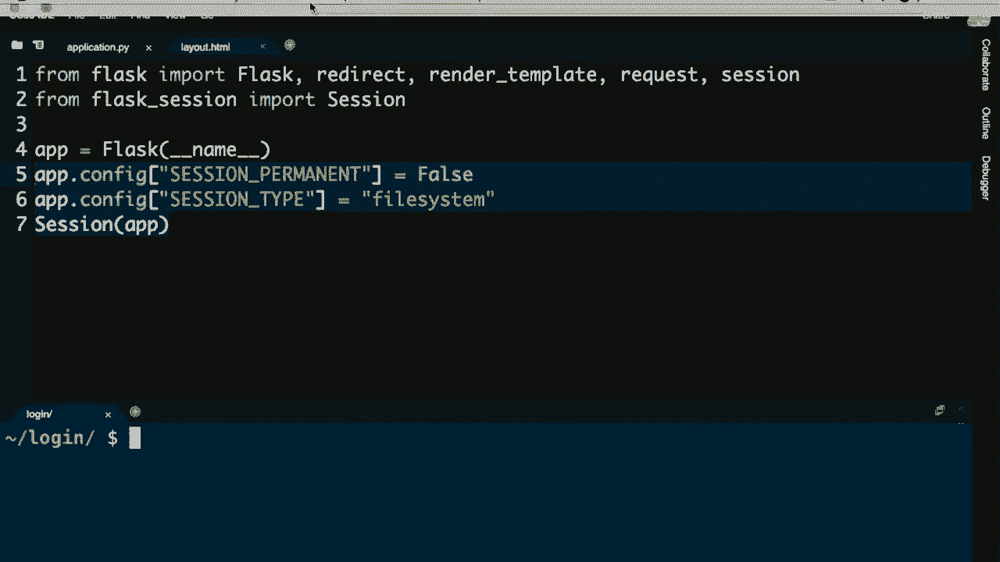

当我在这里时，我应该创建一个我之前提到但还没有创建的文件。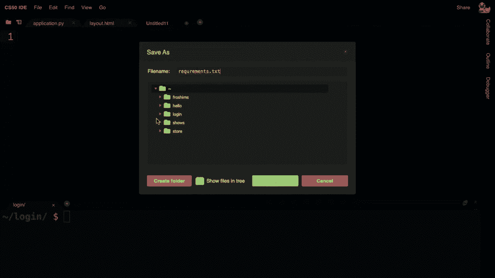

这次我们称之为`requirements.txt`，我将把它放入我的登录目录。我将需要flask来实现这个应用程序，同时还将需要一个名为flask-session的库。所以我之前在幻灯片中声明过，所需库的列表以及你想使用的库，还有一些命令。

在命令行中使用，安装那些你不会通常需要的要求。通常情况下，你需要为问题集执行此操作，但只是让你见识一下。如果你想为一个python应用程序安装要求，你通常会执行类似这样的命令：`pip install -r requirements.txt`，并提前进行。

但是请知道，为了安装库，在python中比在c中要容易得多，它们通常更容易通过这种称为pip的技术进行打包，好的，让我们去**继续**创建几个路由，app route斜杠，def index，就像之前的样板，返回。

默认渲染index.html的模板，然后让我们去**继续**，创建另一个路由app.route，login，在我的登录路由中，这将由一个登录函数来管理。让我去**继续**返回渲染，模板，login，所以让我们保持简单。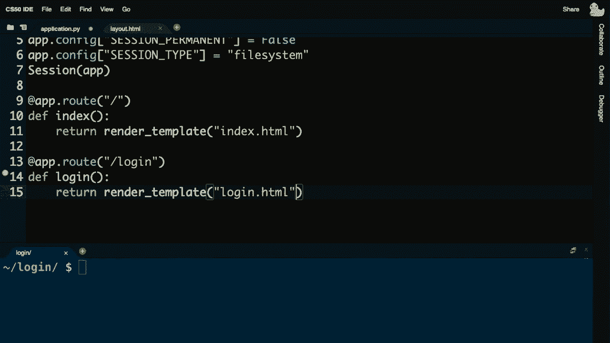

这个表单，所以让我去**继续**创建一个文件。

被称为login.html，其生命目的就是，拥有我的登录表单。我想要的登录表单中，只有一个用户名称的空间。在现实中，我肯定会做一些，比如用户名和密码，但我们将保持简单，只关注，想法的本质，做一些像用户的。

名称，所以在login.html中，我将像之前一样扩展layout.html。我将有我的区块主体，并且我将有我的结束区块标签。然后在这里我将有一个表单，其操作将是，斜杠login。方法将是post，我会遵循最佳实践，我不想要我的，用户名和密码。

在现实世界中存储在，人们的呃，自动补全历史记录，让我进行输入，测量。为了方便，名称等于，用户的名称，然后类型。等于文本，然后在这里输入，类型等于提交，所以这几乎与我们之前的表单相同，用于注册等等，但现在我将用它进行登录。

目的，所以让我们快速检查一下，让我回到我的应用程序，执行，flask run。

我将去**继续**打开我的网址，然后第一个错误。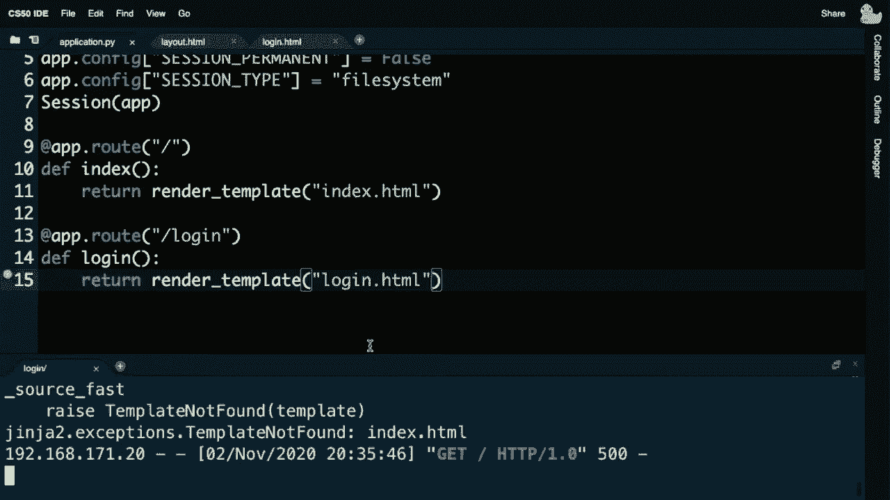

让我们看看模板未找到，好的，所以这其实是预期的，我有点知道我没有创建index.html，所以我现在对这个错误没问题，让我去**继续**放大一下。因为我故意想要去我的斜杠。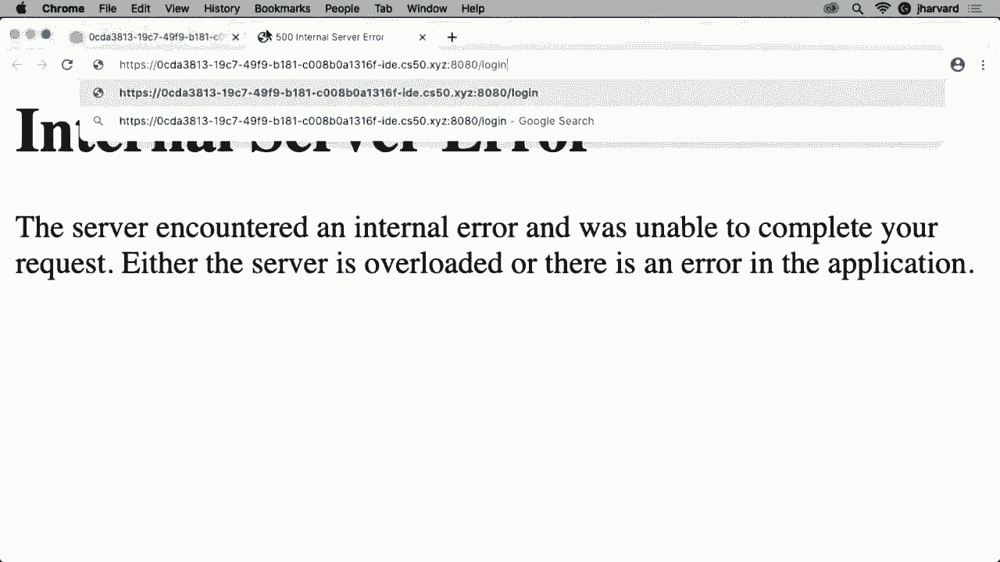

登录路由，因为我想先测试一下，这似乎工作正常。现在让我们去**继续**创建文件。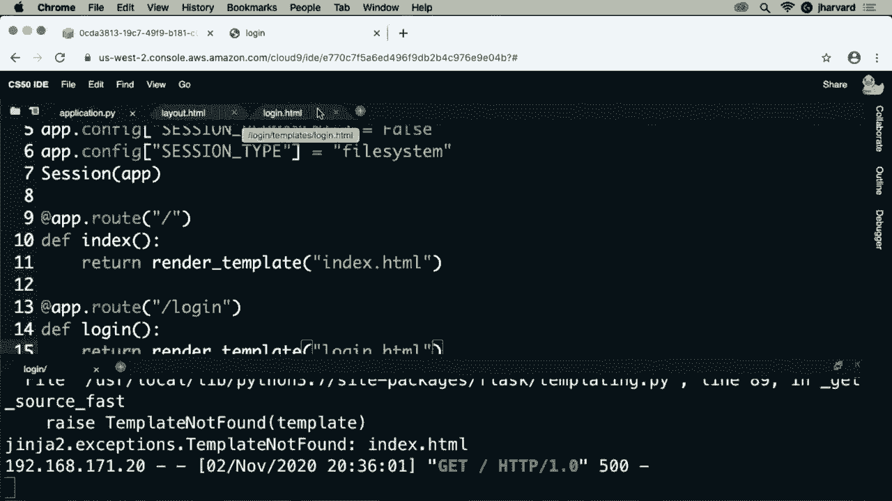

那个不存在，index.html，所以index.html放在我的。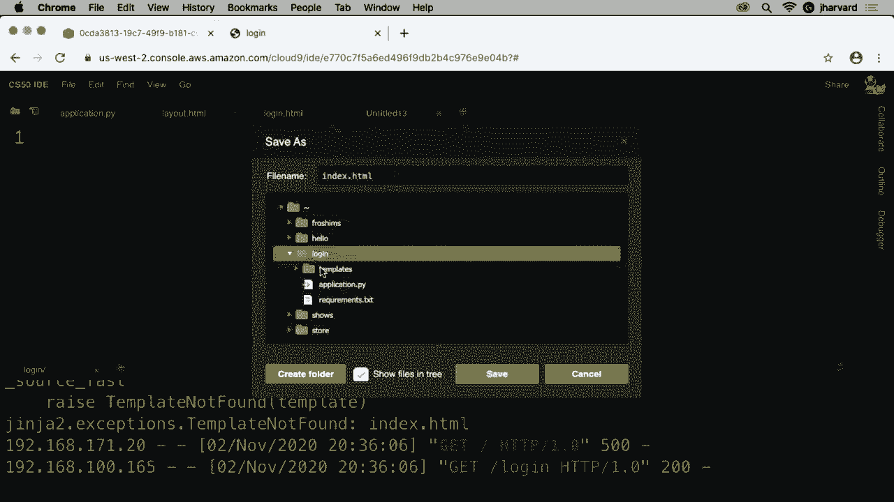

登录文件夹在模板中，我将会非常类似地做这个，我会去**继续**复制，粘贴只是为了节省一些击键，已登录。

因为我确实还没有实现，合理的，让我去**继续**重启flask，让我。去我的索引，我应该看到，去。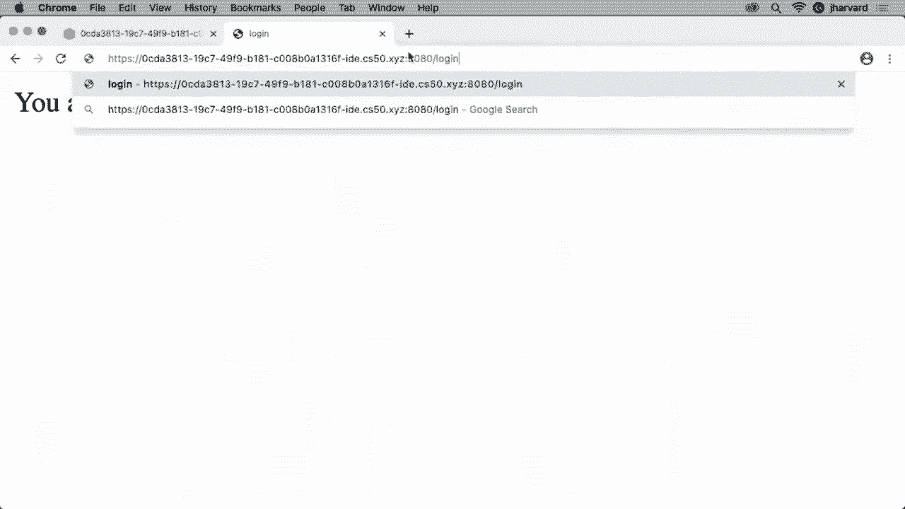

登录时我看到了我的登录表单，所以让我们让这个互动性更强，让我进入 index.html，在这里说你没有登录 ahref，登录。让我们创建一个更好的用户界面。

让我重新运行 Flask，回到我的网页，点击刷新，现在我有了用户界面的初步形态，超级简单，但与一个网站非常相似，如果你访问网页而没有登录，你会看到一个链接或按钮，或者什么东西来登录。如果我点击这个，它只是一个简单的链接。

进入登录，所以我们快到了，几乎具备登录的能力。让我们处理一下信息，我想让应用程序发生什么，如果他们登录多次，我想支持 POST，因此为了隐私起见，让我这样做，然后让我来处理，如果请求方法等于 POST。

像以前一样，让我们继续记住那个用户已登录，然后将用户重定向到登录页面，否则让我们继续渲染登录表单，所以我还没完成，但这是关键思想，我需要以某种方式记住用户已登录。那么我该怎么做呢？我可以从请求中获取用户的名称，request.form.get('name')，我应该假设我。

[音乐]，是的，这没问题，我们不会验证用户的名称，我想把它存储在会话中，所以结果是这样。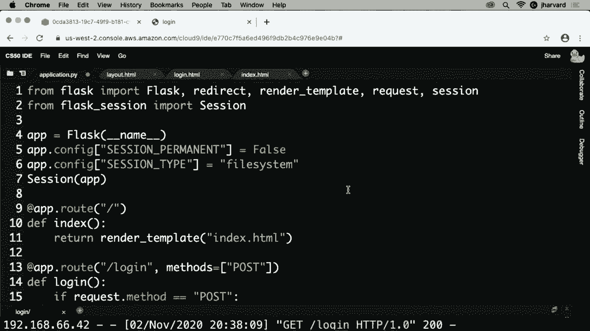

这有点像外套寄存，但我不想增加太多的比喻。在一个高档餐厅，如果你把外套递给某人，他们通常会把它放在衣柜里，然后把号码递给你，这在某种意义上就像一个小线索，可以让你排队，可能不应该仅仅是一个笑脸。

面对面的问题是，否则每个人都会拿回同样的外套，但他们给你某种标识符，并把你的外套放入某个衣架、桶或某个空间。那么这与此处有什么相关性呢？实际上，独特的 Cookie 机制也在以某种方式发生。

包括你的外套，但在这种情况下，记住，所以在这点上，我能够访问的内容。多亏了 Flask，特别的。

有一个名为 session 的变量，这是一个特殊变量，它一方面是全局的，这意味着我可以在任何地方使用它，但它足够高级，它与当前用户相关，因此即使我们现在在 Zoom 上的所有人都访问我的 URL，这种情况也在发生。

会话的实现是通过这个 Cookie 机制。

当你访问我的应用程序时，我们每个人都获得不同的 cookie 值。那个 cookie 值就像映射到壁橱中不同的挂钩。因此我的数据将放在这个挂钩上，你的数据将放在那个挂钩上，等等。

现在我实际上有点自豪于这个隐喻，它运作得不错。这个挂钩将是我存储用户名称的地方。因此记住我已经登录，或者布莱恩已经登录，或者索非亚已经登录，或者瑞安已经登录，或者任何其他人，但全局会话变量在这里。

我在这一行中突出显示的，将是，方法。如此，我将简单地将其用作字典在 Python 中，我将去啊**d并将用户的名称添加到会话中，而我甚至不需要这个变量，现在让我稍微收紧一下，让我去啊**d并存储在会话中，这就像这个挂钩。

名称的关键和价值，无论用户以什么身份登录，以及重定向，我知道如何处理。重定向，斜杠让我摆脱我的伪代码，我想这就足够了。请原谅我记住。

用户已登录时，你将他们的名字放在会话中。但理所当然，我们来改进，索引。html，此时只是。

盲目地总是说，你没有登录，好吧，让我们做出那个决定，而不仅仅是硬编码。因此，让我们这样做，如果呃没有会话。获取名称，这是说如果会话中没有名称的语法，那么去啊**d并返回重定向，斜杠登录，所以如果会话中没有名称，那意味着你还没有给我，你的名字，让我强迫你。

发送你去斜杠登录，否则去啊**d并渲染模板。好吧，我现在还能做什么，让我去我的索引文件这里。与其天真地硬编码，不如看看我现在能做什么。我可以在这里用 jinja 语法说，不是大括号，不是块，语法，不是 for 循环。

如果会话。名称存在，我也可以使用 if 条件，那么我可以说你以某种方式登录，像是一个，`href` 等于斜杠注销还不存在，但我们可以回到这个，注销否则如果没有会话名称。那么我们假设用户确实没有登录，所以如果我这样做是对的，让我去啊**d。

在这里停止服务器，让我去啊**d并重新运行`flask run`，重新加载我的表单我仍然看到。好吧，哦，错误错误的 URL，让我去，索引。

哦不，我这是对的，我在斜杠登录，方法不允许，我想。圣地亚哥已经指出我之前犯的错误，我只是重复，让我去。应用程序。呃，我需要在这里支持多种方法，我也想支持。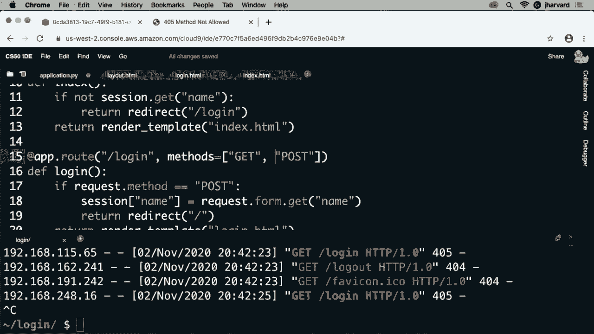

这样我就可以根据需要渲染我的模板，所以让我去**重新运行**这个服务器。好了，斜杠登录，注意发生了什么，让我放大一下。让我去掉登录，直接访问斜杠，注意我立即被重定向。让我们做上周做的事情，打开检查器。

让我们去网络标签，再次访问斜杠并按下回车，瞧，注意到如果我访问那个请求，放大一下Chrome的网络标签，向下滚动到响应头。注意到我们得到了302找到，这是一个重定向代码，就像301一样，斜杠登录。因此，HTTP的所有机制又重新起作用了。

好的，让我去**登录**为大卫，点击提交。

惊人的是，你已登录为大卫，注意发生了什么，我现在在斜杠路由上。这个是真的，所以这并不适用，所以我实际上在看到index.html。注意我不小心点击了**注销**，让我们修复这个，给我们提供注销路由。好了，我们来，应用，应用。路由斜杠注销，定义注销，然后在这里我需要。

别忘了用户已经登录，有几种不同的方法可以做到。现在让我们简单处理，会议名称设为无，让我们把你的名字或我的名字改为无，然后重定向回斜杠，让我。

重启服务器，让我回到我的主页，因为我仍然在这里登录。我将去**注销**，好的，让我去**登录**为布莱恩。例如，提交你已登录为布莱恩，注意我可以重新加载。我可以关闭标签页，我可以重新打开标签页，这一切都被记住了，多亏了。

我的浏览器正在代表cookie，实际上你可以在网络标签中看到这一点。让我重新加载同一页面，注意这里的响应是200。如果我向下滚动到请求头，注意到我的浏览器正在请求。哎呀，抱歉，注意到我的浏览器正在请求斜杠，但如果我向下滚动。

不不，那里我们去，向下向下注意，可能我和你都不知道，这段时间我的浏览器也在显示手印，表明我的cookie值是会话等于三。

五四五六……嗯，通常来说，告诉别人你的会话是不好，因为现在你们可以通过假装是我来劫持我的会话。但是当然，这个应用程序并不关心你们的账户，没有人应该看到你的cookie值，因此我们实际上在这里看到cookie，它来自服务器。

我第一次访问的时候，好的，有什么问题吗？cookie是否存在就消失了，好的问题，cookie是永远存在的还是有时间限制的？这取决于你如何配置它，因此这个cookie将有一个默认的时间限制，几分钟、几小时或几天，之后它将过期。

除非服务器为我刷新。

不过，你可以设置那些永久有效的cookie，尽管你可能不想这样做，因为在登录时，大家都可能不小心离开了实验室电脑或朋友的电脑，忘记注销。至少知道我最终会自动从网站注销，这感觉不错。 

这就是所谓的会话cookie，它最终会过期。但是，当你访问一些网站时，你会注意到有些网站会有“记住我”的按钮。

或者类似的东西，实际上你可以设置永久的cookie，它们不仅仅在你的计算机上存储某个随机值，而是存储一些信息，这些信息会在表单中预填充，随后的使用中对网站非常有用。如果你自定义了一些东西，它可以记住这些设置。 

甚至连cs50的网站也会记住你选择的内容。

当你登录一些cs50的网站时，有时会看到哈佛或耶鲁的登录提示。

如果你从未注意到，呃，我对此感到遗憾，因为我们在这方面投入了很多努力，它会记住你。

这节省了时间，因此你不必不断互动，下拉框会自动记住。

我们通过cookies来记录你的隐含偏好，因此作为一项家庭练习，真正开始打开浏览器的网络标签，查看那些请求头，你会发现网站的运作，实际上，使用cookies实现功能变得越来越具有挑战性，因为长话短说，很多浏览器制造商正在... 

最终开始禁用所谓的第三方cookie。这些来自其他服务器的广告类型cookie，往往用于追踪用户，尤其是在欧盟，最近在美国，如果你曾经点击过“我同意”的框。 

接受cookie，我接受必要的cookie等等，老实说，这个想法挺不错，但也有点傻，现在世界正让你我不断点击这些框，而不去认真思考。但你真正做的就是在授予。 

当你点击这些框允许你的手被*印记*时，你就给予了权限。好的，有关于cookies或我们如何实施的任何问题吗？布莱恩，你那边没有其他问题吧？好的，那我先继续，准备一个我们提前制作的示例。 

这将允许我们探索某种东西，我们将其称为存储。这次与其从头开始编写代码，不如让我在名为store的目录中打开东西，这样它总是在课程网站上可用，让我继续进入store，打开`application.py`。

`requirements.txt`和我的模板，包括布局，实话实说，阅读别人的大量代码，涉及几个文件。当你下载了这样的程序，或者下载了cs50或任何其他课程的发行代码，你该如何开始理清思路呢？

如果你理解这些不同文件所扮演的角色，`application.py`是你的控制器，任何以`.html`结尾的都是视图，你可以开始弄清楚这些文件的功能。让我们从`application.py`开始。请注意，我正在导入cs50的库和会话支持，下面我在初始化购物目录，类似于一个amazon.com或某种在线书店。

应用程序如我之前所做的，下面我连接到一个包含大量产品的数据库，这里是书籍。我随后配置会话，我们刚刚做过，这段代码和之前是一样的，我认为我们可以开始推测这个网站的功能。

看起来这个数据库中有一个名为books的表格，所以我在访问书籍。然后我看起来在渲染一个名为`books.html`的模板，我在传递这些书籍。让我们跟随线索，进入`books.html`，看起来`books.html`扩展自`layout.html`，好吧，让我们看看`layout.html`，没有什么特别有趣的内容。

这里只是一个模板占位符，我们之前见过的代码，所以我将关闭它，假设这没什么趣味，毕竟经历过了，但`books.html`如果继续深入，内容会有点精彩，我在第3行之间有一个块体，显示页面顶部的书籍。

在下方有一个h2标签，显然是一本书的标题。然后下面是一个表单，我之前没见过所有这些功能，比如我还不确定hidden是什么意思，但请注意我确实识别出一个提交按钮，值为“添加到购物车”，所以听起来我们在实施一个。

好的，现在让我们回到`application.py`，看看购物车，看起来购物车支持get和post，所以也许我在使用相同的路由处理两种不同的事情，我们之前见过，函数称为购物车，这使得。

在某种意义上，让我们回到这里，初始化我们的会话，我们将再回来看看，似乎这个程序没什么更多的。如果get是动词，让我们关注条件，我在选择从书籍中获取所有信息，书籍的ID在这份书籍列表中，那么这份书籍列表是从哪里来的呢？

会话所谓的购物车。在上一个例子中，我使用会话。来按用户存储你的名字、我的名字和每个人的名字。现在我用它来存储我们称之为购物车的东西，确实这是购物车的原因，多亏了我们在剧院的朋友。

在这一阶段，这就是如何在网站上实现购物车的。通过后台的 cookies 来给你提供用户特定变量字典的幻觉。因此，看起来我的会话购物车键的值将等于。一大堆书籍的 ID，我还不知道它们是怎么来的，但，我正在解读。

然后在这里我只是渲染一个名为 cart.html 的模板。传入数据库中的书籍，那么它们是如何进入会话的呢？如果用户提交表单到购物车，我想这段代码现在是相关的，如果用户发布到。/cart，看来我会获取他们输入的 ID，也许，也许是。

实际上有一个 ID，它不是，none，也不是默认值。我要去**添加到**购物车中，那本书的 ID，然后我将。重定向用户到购物车，所以我觉得这已经足够复杂了。我想是时候看看具体的操作了，让我向上滚动并运行，flask run。

让我去**打开**我的 URL，好的，这个网站不是最美观的，但看起来我的数据库里有七本哈利·波特的书。注意每本书都有一个“添加到购物车”的按钮。让我们看看 HTML 源代码，看看 mybooks.html 模板生成了什么。

有点有趣，所以有这个 h1，书籍在顶部，这是我的第一个 h2，书名。注意这里有一个奇怪的符号，因为这是一个卷曲引号。这是一个 HTML 实体，让你可以输出你无法在键盘上轻易输入的符号，这是我的第一个表单，我动态创建的。

输出，我之前声称它，我说它允许你以一种用户视觉上隐藏的形式提交一段数据，这不是一个用户可以输入的文本框，但它确实存在，令人兴奋的是，注意我给它一个值为一。但是在这个表单中我给那个隐藏字段一个值为二。

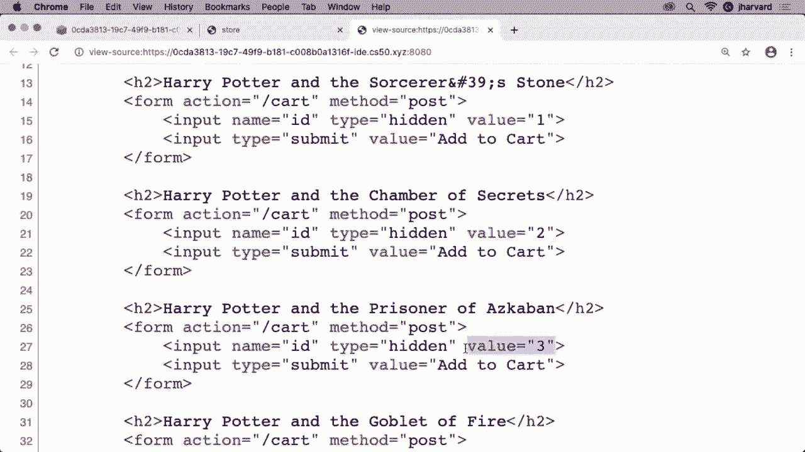

在这里值为三，为什么呢，片刻。

让我在我的 store.db 上运行 sqlite，里面有一个 ID，一个标题，仅此而已，让我做 select。star from books，使用 sql lite3，瞧，看到不，唯一的 ID。根据它们出现的顺序适当地编号，巧合而非意图，现在在这里。

让我去**移动**我的终端，稍微往下。

让我去 ah**d 并重新运行 Flask，假如我现在提交其中一个表单，让我们看看会发生什么，将第一本书添加到购物车，奇怪的是我被重定向到了 /cart，并且注意我有一个有序列表（ol 标签），看起来似乎是包含那本第一书。让我回到目录，呃《阿兹卡班的囚徒》是。

很好，我们现在把它添加到购物车中，我在这里看到了这个，注意这一点，如果我……我不知道为什么我举起手，因为我显然在用另一只手。

但我一次又一次地重新加载页面，它显示的正是我购物车里的内容。那么这个代码，这个逻辑在哪里呢？在 POST 条件下，它正在将书籍 ID 1 和书籍 ID 3 添加到我的会话购物车键中。那么这个购物车键是从哪里来的呢？我们回过头来，我只需要在我的页面顶部有某种方式。

简而言之，除非你将其放在那里，否则会话中不会有名为 cart 的键。Flask 默认并没有这个名称或购物车，你必须将其放入。所以请注意，如果购物车（cart）还不在我的会话中，我只是将其初始化为空的 Python 列表，我可以使用集合、字典，或者任何我想要的东西。

选择简单地用列表来处理，但这就是我记住其中内容的方式。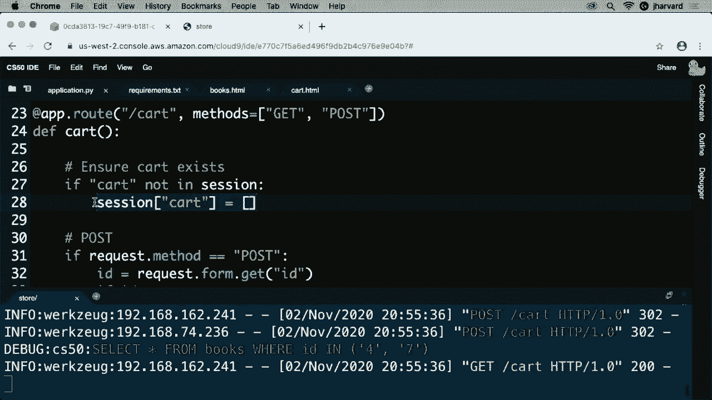

我的购物车，而不像我们之前的购物车，现在正试图将东西添加到你自己的购物车中。我们每个人看到的购物车都是不同的，我们的购物车里有不同的东西。如果我一直重新加载，无论有多少人试图将书籍添加到他们的购物车中，他们实际上只是在添加到。

你的购物车，而不是我的，因为我们都有不同的，呃印记在手上。关于现在 Cookies 如何实现这一更通用的功能，有什么问题吗？布莱恩，你那边没有问题吗？好吧，所以这里我也鼓励你，下次去亚马逊时，添加一些东西到你的购物车。

说真的，这就是底层发生的所有事情，而亚马逊肯定还有其他功能，比如你可以改变数量，这挺不错的，你可以将东西添加到愿望清单，这也不错，但如果你开始查看 HTML，看看网络请求来回传输的数据。

我们现在理所当然的所有这些功能，其实都是基于非常简单的 HTML 表单和这些输入、按钮，以及服务器上的这些会话构建的。亚马逊可能使用不同的语言和框架，但所有这些理念都是相同的，所以实际上这周并不算复杂。

关于教你 Flask 的内容，在几年后可能就不再相关了，关键是教这些 HTTP 请求和响应的理念和原则。这些 Cookies、会话，以及我们因此可以在其上构建的功能。好吧，我想我们还有时间做一个最后的示例，这将再次引入我们的老朋友。

上周的 JavaScript 在服务器上动态生成 HTML，尽管我今天的设计非常糟糕，你肯定可以想象使用 Bootstrap 使界面更美观，特别是表单，但这与上周相比并没有什么新鲜之处。上周我们确实有 JavaScript 作为编程语言。

这是一种客户端编程语言，至少在我们使用时是如此。这是让用户浏览器运行代码条件、函数和循环等的方式，在浏览器上而不是服务器上。今天我们又介绍了 Python，因此我们有了服务器，而网络真的变得复杂。

如今有趣的是，当我们将用户看到的所谓前端与后端结合时。后端就是服务器，前端是你和我交互的用户界面。后端是程序员从未见过的 Python 代码和 SQL 代码。因此，我们能做些什么来将这两者结合起来，让后端带回。

我们的旧节目数据库，让我来快速展示这个文件夹中的内容。在节目中，我们有，呃 sqlite3shows。db，这是几周前我们玩过的一个较小版本，我为了节省空间，精简到只有电视节目的名称和 ID。

电视节目的就是这些，我删除了评级、编剧和导演等等，只保留标题，因为现在我们要开始通过互联网使用 Python 和 JavaScript 发送大量数据。好吧，让我去**前进**并打开这个示例。

这是提前制作的，展示中会看到一些文件，应用程序。pi requirements。txt，还有我的模板，分别是索引、布局和搜索。

好的，虽然有一堆，但没有超过我们以前真正看到的。让我们去**前进**，我之前有点作弊，没查看要求，以便确认。这里是requirements.txt中可能还有的东西的一个例子，cs50库和 Flask，这些在IDE中是预装的，但我们这样做是为了让你能得到。

冒险尝试在你的 Mac 或 PC 上运行这些东西。你拥有所需的所有配置，好的，让我们像以前一样开始，先做这个。让我先运行这个，以便我们可以实际看到应用程序。

工作正常，所以如果我访问这个，让我去**办公室**，好的，目前什么也没有发生，让我点击搜索，好的，然后我看到一个大项目列表，列出了所有提到办公室的内容，所以不是办公室本身，而是一个办公室，让我去**前进**并放大回来。让我指出我们又在根目录，斜杠在那里，它只是天数。

当我搜索像“office”这样的东西并按下回车时，标记q等于office，所以我借鉴了一些来自谷歌的**灵感**。对，我上周有点**作弊**，其实我只实现了前端的HTML表单，然后让我谷歌帮我找了一些猫和狗等等。

但现在，随着Python的出现，你可以实现该应用程序的两个方面，所以如果我查看这里的源代码，注意到我似乎返回了一个非常大的无序列表，列表项代表所有与office相关的节目标题，这很好，但这个。

这有点像老派的网页编程，你填写表单，按下回车，**轰**。但如今，你访问一个网站时，很多事情同时发生，你在这里有自动完成功能，聊天信息在这里弹出，地图在这里自动移动，还有优步的小车。

在同时移动，就像今天的网络，**Web 2.0**，这并不是一个技术术语，更多的是一个流行词，指的是用户与计算机之间越来越动态的网络互动，借助JavaScript和你自己的后端，无论是Python还是其他东西，你现在可以开始构建这些更动态的接口。

如果我开始输入o f的时候，真不错！

f i c e我们实际上立即看到了结果，我们上周已经看到过这个。记得我从a开始，使用了我们来自pset五的大字典，这个标题数据库有好几兆大，我不想把整个电影数据库发送到浏览器，原因是性能和大小。

也许涉及到两个知识产权，我没有数据库，你可以想象希望对所提供的数据保持更多控制，要求用户登录或支付服务费等，所以有理由让浏览器与服务器进行交互，而不是**整个过程**，所以我们就这样做。

它实际上做得更动态一些，但让我们先理解它是如何工作的。我这里有几个库，cs50在Flask中，我在这里配置Flask，然后在这里配置我的数据库，在这里我只有一个非常简单的路由，渲染index.html，显然我们来看一下，有那个表单，非常简单，和。

上周和今天非常相似，到目前为止我们做的所有表单。这里是name等于q，其他都是**模板**，所以现在让我们把那个文件去掉，布局也相当模板化，看起来和以前的东西很像，所以让我们把索引设为搜索路由，这正是我们上周使用谷歌时所缺少的部分。

这里我有一个叫做`search`的路由，一个叫做`search`的函数，将被调用。这里是SQL和Python的一个很好的结合，我将给自己一个变量，叫做`shows`，它将是当我执行这个时，所有返回行的结果。`select * from shows where title is like`这个占位符问号。

现在我要插入什么，注意这开始时有点神秘。看起来我似乎在获取用户的输入，`q`来自`request.args.get`，所以这是在使用`get`，显然因为有`args`这个词，它不是`form`而是`request.args`。我在获取用户的`q`值，在我的例子中是办公室，并且，快速检查一下。

左右的百分号是什么，因为我们今天看到很多百分号，但这些是不同的，也许在聊天中，这些是什么？布莱恩，你想回声一下共识吗？是的，人们说这是SQL占位符。是的，所以PL SQL通配符占位符，意味着零个或多个字符，正是原因。

在单词开头，我得到与办公室的大量匹配。在结尾和中间，如果我真的想较真，我只需要完美匹配，但这不是我这个实现的目标。一旦我拿回所有，哎呀，一旦我拿回所有这些行。

我在这里对齐返回渲染模板`search.html`，传入所有的`shows`，所以最后要看的就是`search.html`，这很简单，确实像一个小时前这看起来会非常，加密，但一旦你开始使用这个语法，你会发现，哦，这只是一个模板，允许我动态输出。

一个无序列表的`li`标签，展示，这已被传递到这个模板中。好吧，所以现在最后的点缀，让我们以同样的方式增强这个应用，但所有逻辑实际上发生在JavaScript和后端之间。我将去**做**这个，首先我要回到应用`pi`这里。

而不是这里的内容，我将继续进行以下操作，我将去**做**这个，而不是渲染一个模板，我将使用一个新函数，叫做`jsonify`。这是一个有趣的名字，我需要在这里导入它，所以让我导入`jsonify`。结果表明，`jsonify`或`json`意味着JavaScript对象表示法。

我们一会儿就会看到它的样子，但多年前世界标准化了一种在轻量级文本格式之间传输数据的格式，JSON或JavaScript对象表示法。`jsonify`是一个Flask函数，它接受一个Python列表或字典，并将其转换为JSON格式，所以我们一会儿就会看到这个，所以请注意，我现在返回的是。

`shows`变量的JSON化，回想一下，这只是来自`db.execute`的行。让我们看看这个实际操作，我实际上要去我的。

让我前进并重启服务器，因为我做了一些更改。让我前进，现在访问服务器，斜杠search，问号q等于office，所以我，输入。注意返回的内容，乍一看有点疯狂，隐晦，但请注意，这确实被称为，javascript对象表示法，这里有一个左上角的方括号。

这意味着，嘿浏览器，这里有一个列表，有一个大括号，这意味着，嘿。浏览器，这里有一个字典，也被称为一个，javascript中的对象，引用id。是这个字典中的键，108878，是该键的值，这里有第二个键，引用title，该值是“办公室的美好一天”。

然后有一个闭合的大括号，表示字典的结束。或对象的结束，一个逗号，然后，有很多其他的。

字典，因此简而言之，我们在这里看到的，都是一种非常原始的基于文本的格式，python字典再转换为一种叫做json的东西，javascript对象。表示法，字面意思就是，json使用双引号、冒号、大括号和方括号，仅此而已，来表示信息。

很好，但这太糟糕，太糟糕了，这一团糟，但这不是重点，重点是现在。是让我们的后端返回一个搜索结果的json数组，让浏览器。将其转换为html，回想一下，最后，能够改变或更改你的dom，文档对象。模型在内存中的树，特别是你可以用，javascript添加更多。

向那棵树添加节点，你可以增加更多的结构，所以是的，您好，我们刚刚收到了，嗨，大卫，嗨。大卫，嗨，大卫，谢谢你，非常好，所以让我，最小化它，接下来我打开，嗯，not。search。html，我们不再，使用它，而是index。html，知道吗，我将借用一些代码，前进并打开。

index。html，我将简化，这让我停止服务器。我将前进并去掉我的，布局模板，我将去掉我的搜索。不再使用了。

所以我将简化这个程序，现在完全专注于此。

这里，我需要引入一些javascript，所以，我该如何进行。首先我需要前进。

并且使用一个库，叫做jquery，jquery是一种，逐渐失去人气的东西，但仍然，bootstrap使用它，因此我们将继续。使用它，因为你已经在某些其他示例中包含它，但我们。需要它的不同版本，所以我将快速搜索。

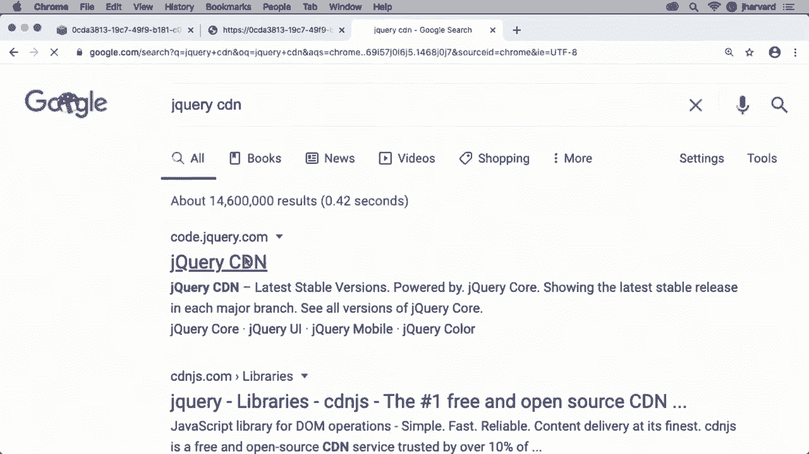

jquery cdn我将去这个网站，长话短说，使用。通过抓取他们的脚本标签，并在自己的代码中使用，所以我将去**清理这个标签**，使其成为一行长的丑陋行。但通过复制并粘贴那行，通常我们会为你在问题集和分发代码中做。

我将**把这个库复制到我的文件中**，使其成为我可以使用的库之一，上周，我将添加一个脚本标签到我页面的头部，然后在这里，让我们看看我想在哪里做这个，实际上你知道吗。让我去**做这个稍微不同**，以便与在线上看到的一致。

我将去**在我的主体中全部处理这个**，这样我们就不必担心事情的顺序问题，确实会保持在页面的主体内，这。输入自动完成等于引号，未引用关闭，提示为查询，然后是文本类型。所以我将有一个非常简单的搜索框，并且我将有一个无序列表。

目前里面什么都没有，这是故意的，然后我将导入这个。jquery库，然后在这里，我的脚本标签内，这是我要做的。编写实际代码，让输入等于document。获取。让我们像上周一样做查询选择器，让我去**选择我的输入标签**。

这项工作我不需要id或任何类，因为目前我只有，未引用的输入。将特定地给我那个标签，让事件，事件，回忆一下上周我们讨论的。事件和键盘抬起，用户触碰并松开键盘。是你可以监听的事件之一，每当用户这样做时，我想调用以下内容。

这是一个匿名函数，我们上周也看到过。我要在这个匿名函数内部做的就是。调用一个新的函数，今天唯一的新javascript函数。称为美元符号下划线获取，这是的简写符号。

jquery点获取，但抱歉，美元符号点获取是jquery的简写。我将去**获取以下内容**，我要获取一个，由，放入。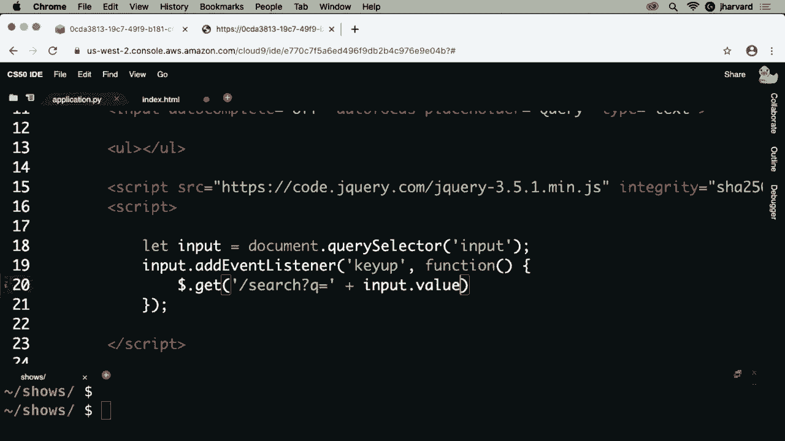

输入点值，所以注意这行代码，这个javascript字符串。正在动态构造javascript代码。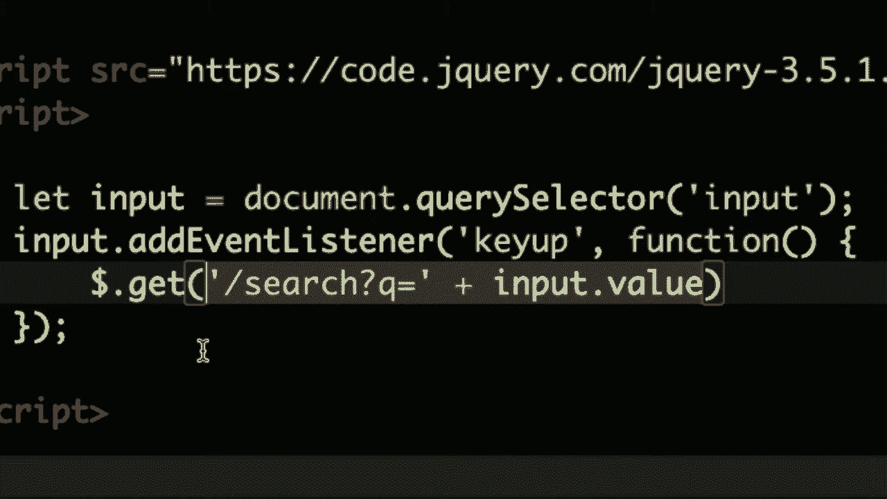

我想请求的URL，从搜索问号q显示。等于用户输入框的值，即用户键入的内容，而这个。美元符号点获取函数的工作方式是，它支持所谓的回调。回调是一个将在有答案时，最终被调用的函数。

这在网络上是重要的，互联网有时会很慢，你可能想编写代码来联系另一个服务器，就像我现在要做的那样，而那个服务器可能会很慢，或者互联网连接可能很慢，如果你整个平台都冻结，那是非常烦人的，你在等待服务器的响应和数据。

可以说，给我回电，用一种比喻的方式。通过调用这个函数来回电，那么我想要它调用什么函数呢？我想要调用这个匿名函数，它将接收一个名为shows的参数，但我可以将其称为我想要的任何名称，我将这样做。

创建一个html字符串，起初是空的，引号javascript。让一个名为id的变量等于刚刚返回给我的shows中的任何id。现在在这个for循环内部，让我去啊**d，并且在这个for循环内部创建一个等于shows的标题，这再次是刚刚返回的数据。

通过那个回调返回，所谓的，shows.id，点标题和分号，然后我将做html。加等于引号，无序列表项加标题加这里，最后我将做document。queryselect。选择器引号 ul，点内html获取html。好吧，这绝对是我们今天所做的最疯狂的事情，它将连接起来。

将如此多不同的想法结合在一起，更不用说新的语法了。所以在所有的示例中，不用太担心，如果这一切一次性太多，真正的目标现在不是向你介绍这种语法，以便你明天可以重复，而是我们正在做的事情的想法。那么我们在做什么呢？我们有一个简单的网页，里面有一个文本输入框。

我们有一个简单的网页，其中有一个当前为空的无序列表。在下面，我们包含了这个第三方JavaScript库，名为jquery，它也被bootstrap用于一些图形组件，然后我有自己的JavaScript代码，首先声明一个变量，让我可以访问我自己网页上方的输入标签。

我接下来使用这个花哨的函数，美元符号来进行所谓的ajax调用页面。为了程序化地向服务器发出额外的http请求，这就是允许的方式。今天所有网站如何获取你的聊天信息，在哪个平台上，你输入地址时它如何基于整个地球的内容进行自动补全。

地址的价值，这就是谷歌搜索自动补全的工作原理，美元符号。get是一个内置于jquery中的函数，它使用一些标准的JavaScript功能。它将允许我访问以search question mark q equals人类输入的内容结尾的url，当响应准备好时，这被回调。

它将会接收一个名为shows的输入参数，将等于这个东西，这。来接收列表，或者说是一个数组，里面是一个字典或对象的列表。包含两个键id和title，这让我说明一下，这是数据结构中的语法。这是javascript中的语法，让我能够创建。

一行接着另一行，另一个li，另一个li使用连接将其追加到这个变量中。叫做html，而这最后一行代码对浏览器说。去选择我那个ul，并将其内容插入到其inner html中，赋值为我的变量。现在我希望我没有在语法上搞错。

让我继续做flask run，我仍然需要运行flask，因为我确实有一个。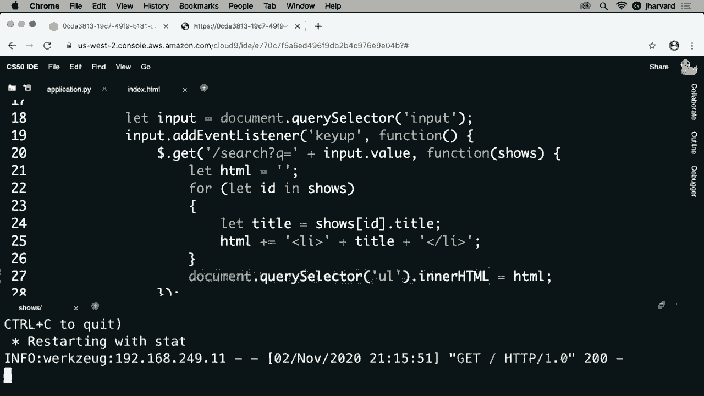

后端在这里，让我回到浏览器并重新加载，斜杠路由。让我现在继续输入o f，浏览器，让我看看我的控制台，没问题，我输入。

f，让我看看这个，什么都没有回来。

办公室显示为什么没有任何返回，哦等一下，只是慢哦，好的，注意。我到目前为止输入的所有内容，或者说我目前看到的所有内容都匹配。单词off，如果我继续这个off，搜索，让互联网做它的事情，现在确实，它缩小到一个列表。

办公室匹配，再次注意，如果我去检查选项卡，然后最后我去网络，注意它又消失了，让我在检查下再做一次。让我继续输入办公室，注意这里我输入的每一个按键。都触发了o-f-f-i-c-e的执行，触发了一个ajax调用，也就是http。

服务器的调用，注意如果我点击最后一个。向下滚动，我不仅会看到我的响应，我确实会看到这个大json数组。

所有数据，其实慢下来是相当幸运的，因为我们。将要结束于一个演示，比如如果我想知道整天待在室内，天气如何，我可能会。给布莱恩打电话，您好，布莱恩，您知道什么？

嗯，今天外面的天气如何，我已经有点没去外面了。好的，如果我必须在电话上等他去外面，那会很烦人，所以我会挂断电话，等他给我回电话。我的代码也是如此，当我传递这个匿名函数时。

这个获取函数和这里的获取。

浏览器，一旦你有了答案就调用这个函数，希望如此。布莱恩即将有蚂蚁，确实，您好，我查看了天气，今天是秋天。太好了，非常感谢，这就是cs50的全部内容，我们下次再见。
