# 哈佛 CS50-CS ｜ 计算机科学导论（2020·完整版） - P2：L1- C语言（语法与格式）1 - ShowMeAI - BV1Hh411W7Up

布莱恩，你也可以打开第二个房间。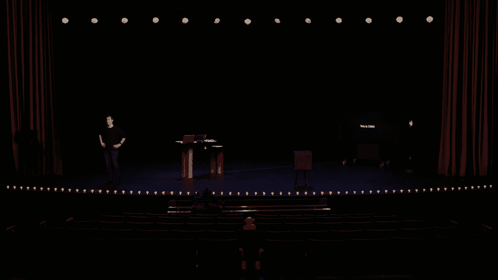

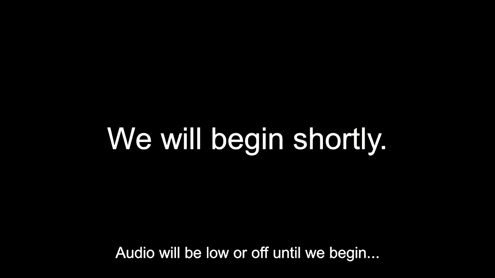

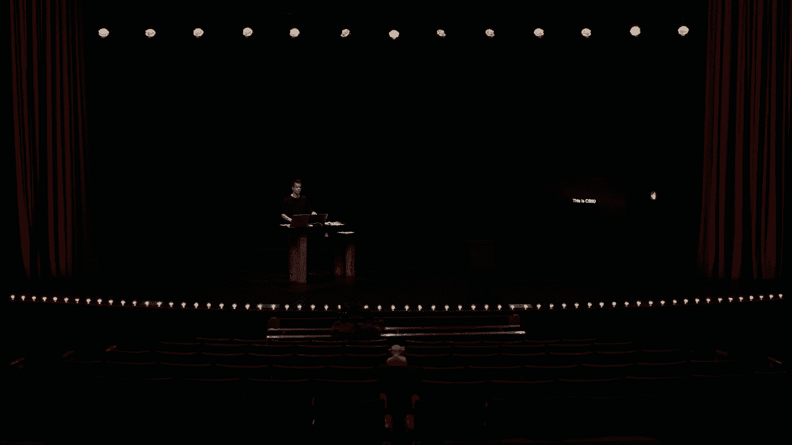

好的，这是 CS50，这就是。

第一周我们的第二周，今天回想一下，我们将关注另一种编程语言 C，上次，我们看到我提出的这段代码在屏幕上，是你很快就会知道如何编程的内容，如果还没有的话，但足够说它看起来有些不同。

回顾一下我们上周看到的，当然是 Scratch，它更加玩乐，更加图形化，所以请让我从一开始就声明，呃，对我们大多数人来说，今天会感觉像是打开了一个消防水龙头，实际上这里是麻省理工学院的一个老黑客作品，其中一些勤奋的学长连接了喷泉。

呃，今天得到一个消防栓的感觉会有点像，因为这是一个特殊的场合，你并没有机会经常描述，但这是我们所有人将学习一种新语言的机会，确实这并不是我们每天都会做的事情。

从第一眼看去，它会看起来像，但请让我向你保证，马上看起来的这个 C 代码在根本上是与上周通过 Scratch 看到和实验的内容是相同的，也就是说，在这种更传统、以文本为基础、以键盘为基础的编程语言 C 中。

我们仍然会看到函数、条件、布尔表达式、循环等等，它们看起来会有些不同，但理念是一样的，就像第一次走进某人的家，了解环境，看到许多你之前未见过的事物。

你通常不会关心所有这些，简单地向前走坐下，或者开始你的对话，类似地，今天我们将看到大量的语言。必须理解并抓住那些熟悉的概念，实际上是编写计算机程序，我们如何编写它们。

所以让我提出，有几个指导原则应该指导代码的编写，其中之一当然是正确性，我们上周探讨过这一点，即你的代码的正确性是否能如预期那样工作。当你命令时，你或其他人编写的程序是否表现正确，是否做到它所说的那样。

但是写作、编写优秀软件以及撰写良好程序还有其他方面，这与设计有关，我们上周对此稍微提到了一点，但设计更是一种定性，更多的是主观的衡量标准，你的代码写得有多好。因此，当你需要写论文时，你当然可以提出非常正确的论点。

但是你可以通过写非常长的、冗长的句子来提出非常正确的论点，*重复自己*。通常来说，这可能是正确的，但在你的论文中可能没有什么价值。你可能说这是不正确的，但你可能得不到很高的分数，因为它设计得并不好，所以在这个方面也是如此。

编程世界中有一个概念，代码，但良好设计的代码让你不必重复自己。你编写的代码效率相当高，*不会做多余的工作*。最后让我提出，今天在这个课程中，编写良好代码时你应该考虑的第三个方面，与风格有关。

这更像是一种审美，因此在写论文的类比世界中就是：你是否使用了良好的标点符号、大小写，是否为新段落缩进，这些审美因素在根本上不会改变你所说的内容的正确性，也不一定会改变你论点的质量。

但你的论文风格就像你的代码风格，使你的代码更加可读。因此，当涉及到编写良好的代码时，你首先希望它是设计良好的，同时也是风格良好的，*就像你写一篇希望能很好反映你能力的论文一样*。

比如这个第一个 C 程序，简单地在屏幕上打印出“hello world”。那么我们如何开始编写这段代码呢？上周我们通过拖放拼图块来编写代码，今天会有点不同，我们将使用不同的工具来编程，但为此我们要去**进行**。

本学期，这个被称为 cs50 ide 的工具，是编程中“集成开发环境”的缩写，简单来说就是一个。

在这种情况下，cs50 ide 是 cs50 自己的基于网络的编程环境，并不特定于 cs50，我们只是在一个第三方云工具上进行了功能增强，任何在互联网上的人都可以使用，而我们的版本位于这个网址 ide.cs50.io，所以你可以自由使用。

在讲座本身期间，但在接下来的时间里，实际上可以使用这个工具并更加熟悉它。动手操作，所以让我去**打开**，提前准备，您看到的这是可用的基本用户界面，幸运的是，现在只有几个。

所以在屏幕顶部是一个大黑矩形，稍后会被代码填充，*就像使用谷歌文档或其他工具一样*。

像这样的地方，你可以创建新标签，并创建新文件，这就是我将进行编程的地方。屏幕顶部，我现在将开始调用我们的终端窗口，实际上在这个终端窗口中，我可以运行命令，并且最终运行我的实际代码，但让我们继续深入，设置环境。

并意识到这个工具确实并不代表一种非常常见的流行编程文本编辑器，或者可以编写代码的标签窗口，以及可以实际运行命令的终端窗口。我们可以替代地编程，当然可以在你自己的 Mac 或 PC，或者现在的任何其他设备上进行，但坦率地说，这往往涉及到一些。

早期会面临不少技术难题，尤其是当我们都有不同版本的 Mac OS 和 Windows 等操作系统时，所以这个基于云的环境确保在第一天，我们都能有相同的编程体验。所以我现在要继续进行这个文件。

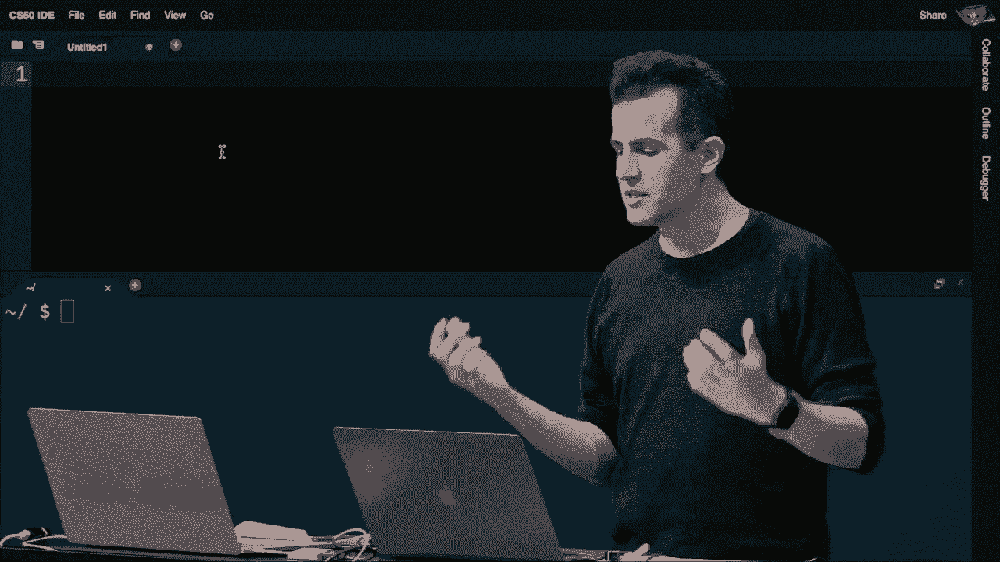

这将默认创建一个名为“未命名”的新标签。这并不有趣，所以我现在要。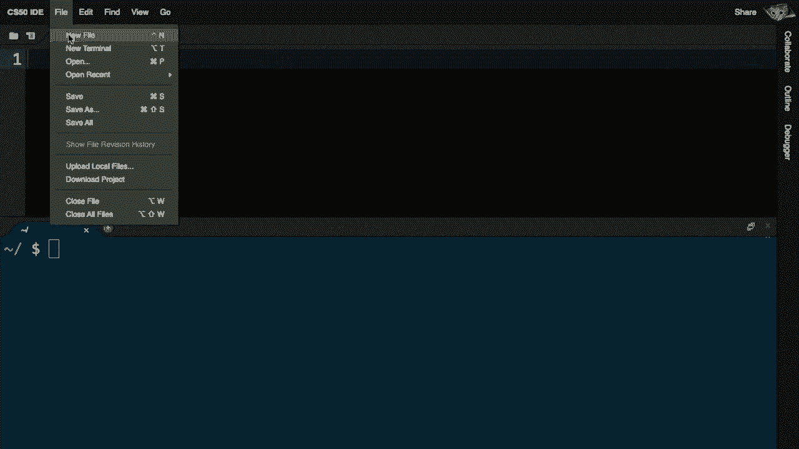

上到文件并保存，默认情况下我将把这个文件保存为程序的名称。在这个叫做 C 的语言中，我将我的文件命名为 hello，但我将以一个名为 .c 的文件扩展名结束，这确实是编写 C 程序的惯例，它们应该以 .c 结尾，就像你可能记得的 Scratch 程序以点结尾。

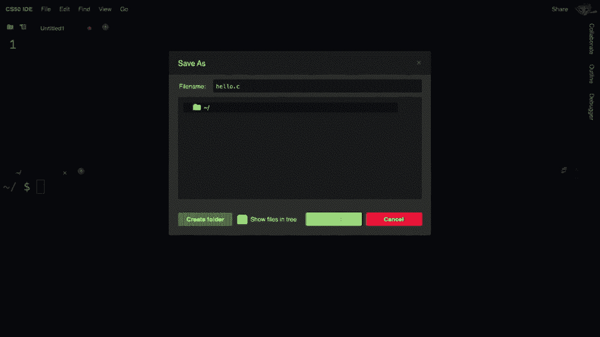

点击这个绿色按钮，保存，实际上没有什么变化，除了名称和标签，现在我在左上方看到这个标签被称为 hello.c。现在我可以开始输入任何我记得的内容，就是我们上周看到的第一个程序，刚才提到的，我将做的是包含标准 io.h，不管那是什么。

我将做的是 int main void，不管那是什么。我要使用一个大括号，然后在此之后关闭那个大括号。在这里，我将继续做 printf，"你好，世界"，后面跟一个分号，现在这真是太多了。

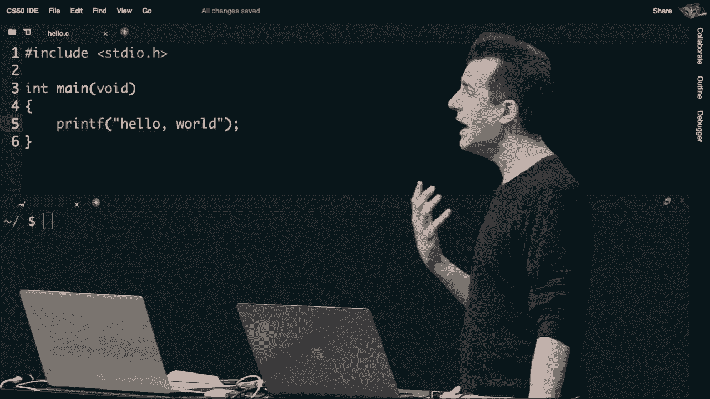

这就是我脑海中立即想到的内容，这种肌肉记忆是你在编写程序时很快会发展的。我当然之前做过很多次，所以我能够一下子，分解出所有输入的内容。但我现在想做的是，打印“你好，世界”，但怎么做呢？

在我们的 Mac、PC 和手机的世界中，如果我们想要实际运行一个程序，我们都会点击一个图标，但今天情况并非如此。因为现在我们处于一种更传统的编程环境中，当前的环境要求我多用键盘，或称为命令行界面（CLI）。

这与图形用户界面（GUI）形成对比，图形用户界面描述的是 macOS、Windows、iOS 和 Android，但在命令行界面中，我必须在所谓的命令行上做所有事情，我指的是屏幕底部闪烁的提示符，在我的屏幕底部报告，我将在这里输入命令。

这是我的命令行界面，我在这里输入的任何内容都会被发送到这台计算机，并希望它能够在自己的硬件上执行。因此，我该如何操作呢？当然，这里有一个问题。

当编写 C、Python、Java 或其他许多存在的语言代码时，这些代码实际上是为了我们人类理解而编写的。然而，上周提到的唯一一种计算机理解的“语言”是什么呢？布莱恩，我们能请人来解释一下吗？计算机只说什么语言？因为我觉得这里有一些误解。

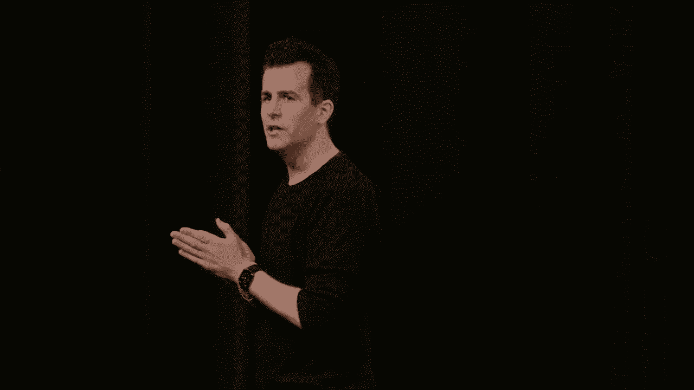

在我们上周停下来的地方和我们目前所在的地方之间。

这位 Cindy，计算机说什么语言，你会说，嗯，二进制，能稍微详细说明一下你所说的二进制吗？为了回顾一下，是的，他们使用零和一来表示所有内容，确切地说，他们用零和一来表示所有内容。上周我们只专注于数字、字母以及颜色等。

图像、视频、声音等等，但我们并没有真正利用内置功能。计算机也使用零和一来表示，也就是说，计算机当然现在有能力在屏幕上打印某些东西，而这种打印的概念在计算机内部是由一些零和一的模式所代表的。

也就是说，我刚才输入的所有内容，尽管看起来有点像英语，实际上是计算机刚刚输入的。为了让计算机理解我刚刚输入的内容，我需要将其实际转换为零和一。因此，这个过程的下一步是将我称之为源代码的内容进行处理。

这里用 C 编写的源代码，上周我们也看到了源代码，它只是图形化的，像是 Scratch 中的拼图块。这是我的源代码，尽管很难懂，但至少我这个人最终能够读写它。不过，我需要将其字面上转换为计算机能理解的零和一的模式。

现在我如何得出这一点呢？上周，这涉及到问题解决。这里有一个问题：我如何将称为 C 的源代码转换为计算机理解的零和一？我敢说，我的输入将是我的源代码，我们称之为机器代码。机器代码只是一个术语，用来描述这些零和一。

计算机能理解的，我们上周没有使用那个表达式，右边是C代码，左边是源代码和机器代码。如果我拿我的源代码黑箱，如何摆脱这个理解的黑箱？嗯，我需要一个特殊的程序，我们将开始称其为编译器，编译器是一个你可以免费下载的程序。

或者在过去你可以付费的程序，设计用来将源代码转换为机器代码。所以我只需要做的就是，如果我想实际解决如前所述的问题，我已经在C中编写了这段代码，现在需要将其转换为零和一，我只需要给自己访问一个编译器，结果在CS50 IDE中存在这样一个编译器。

这是一种你可以在自己的Mac或PC等上下载的工具。现在我们将对此进行描述。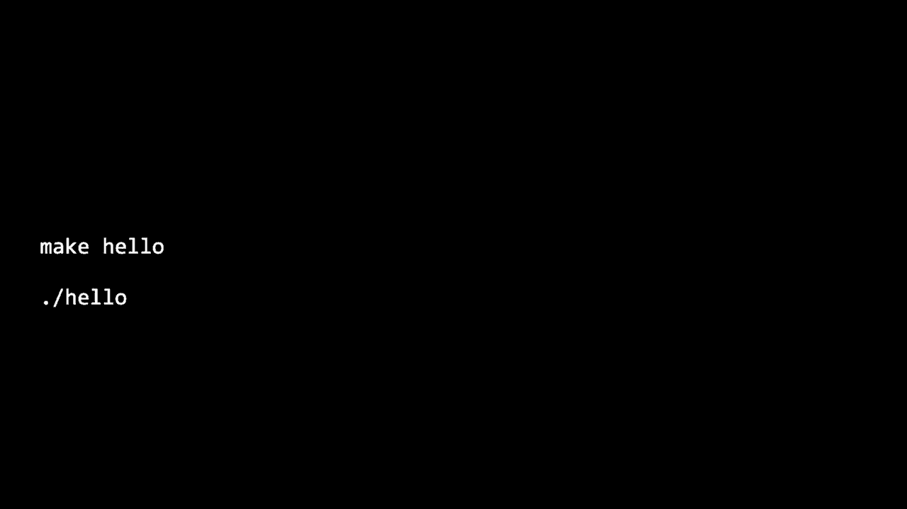

工具简单地称为程序，我将去**前进**并输入`make.hello`，然后我将用一点难懂的语法运行它，`./hello`，但让我们看看它在终端窗口或我的命令行界面中的实际效果，我将字面上输入`hello`。

注意我并不是在输入`make hello.c`，我输入的是我实际上想要制作的程序名称，我只是想从这个命令中调用这个程序。实际上我打算编译一个叫`hello.c`的文件，我将去**前进**并按下回车。接下来会有一些疯狂的难懂输出，关于这一点留到以后再说，但我没有看到任何大问题。

可怕的红色错误消息是件好事，这意味着我的程序成功编译，为什么呢？因为没有黄色或红色的消息说明相反，但现在如果我想实际运行这个程序，我需要输入一个不同的命令，这相当于双击。我将字面上输入`././hello`，本质上就像是。

这意味着进入我正在使用的计算机的当前文件夹，并查找一个叫`hello`的程序。我将去**前进**并按下回车和！。

瞧，hello world，现在我再次看到一个美元符号和屏幕上的其他文本，我们稍后会解析这意味着什么，但注意这个美元符号只是一个常量视觉提醒。更多命令，计算机实际上完成了我要求的，它打印出了hello world，现在它在等待我的第二个命令，所以这相当于只是打印hello world出来。

可以做的事情远不止这些，但让我们将其与我们上周做的联系起来，这样这里的一切就不那么不同。回想一下上周我们有参数，尽管我们没有函数，它像一个迷你程序，是一个行动或动词，你可以在编写自己的程序时使用，做一些事情，我们看到了`say`块。

上周那些是，动词或动作，更普遍地被称为函数，但函数也可以接收。输入，回想一下，我们上次看到的调用，函数的输入参数，所以。换句话说，另一个术语是，参数，但就我们而言，它们是。对我们目的来说，参数是函数的输入。

那么让我们考虑一下，上周我们看到的这个 say 块。它只是想说，猫嘴里说出你好世界。好吧，让我去**转换一下，如果可以的话，把它对应的转成 C 代码。只是为了强调，根本上这两种语言是多么相似，尽管。

从语法上讲，C 看起来绝对，呃，视觉上不同，结果是。如果你想说什么，我刚刚做了，你不会写 se，而是会写 print，这其实有点白 lie，你实际上是要说。print f，原因我们最终会看到，它意味着格式化输出，C 中的一个类似物。

在 Scratch 中说的，现在注意到在 C 中我，有这个开放括号和闭合括号，它们恰好呈椭圆形，并且注意到它们。模仿了上周我们提供输入的白色椭圆，因此在这两个括号之间。将是我对这个，函数 printf 的输入，或者说。

但是这周它们会有一点不同，我是的，我要说你好世界。中间有个逗号，从语法上讲，C 中，我必须更为严格。我还必须在左边和右边加上双引号，略微麻烦的是，我还必须加上。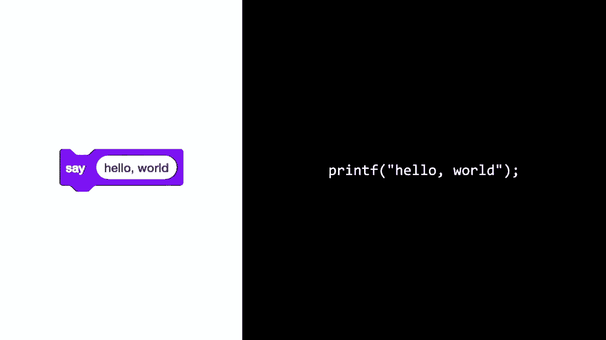

这行代码末尾的分号，就像在英语或许多。人类语言中，你结束一个句子，例如用一个句号。你也得在这种情况下用，分号结束你的想法，所以右边这个是。将左边的 Scratch 转换成 C 的最接近方式，分别。

所以这些想法依然相同，但语法看起来稍微不同，我们，最终。要弄清楚这些模式是什么，以及这些，人的约定是什么，但请注意，范式。和上周一样，但我们这周增加了一些，术语。上周我们将黑箱描述为，可能是算法。

最初我们开始称它们为函数，函数只是算法的编程版本，即在代码中实现一个算法。在软件中，所以函数也可以，称为参数，但事实是。函数在编程的世界中可以做至少两种不同类型的事情，我们已经。

这些东西我们已经见过，但我们并没有像今天这样具体地描述它们。当一个函数接收输入，也就是说参数，就像。你好世界是 Scratch 中的 say 块的输入，或者是 C 中的 printf 函数。函数可以有被称为副作用的东西，记住，当我们使用 say 块时，它确实输出了。

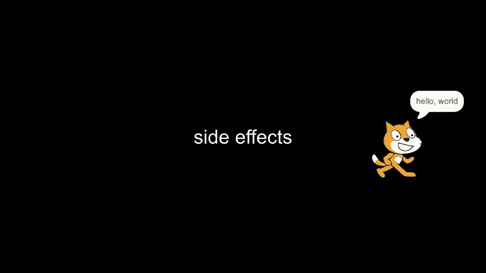

更技术性地说，它有一个副作用，一个视觉副作用，当我上周使用 say 块时，以及这周的 printf 函数时，你在屏幕上看到了某些东西。是的，这是一种输出，但这是我们上次看到的输出形式。因此，一个函数的副作用，在屏幕上显示，例如文本或音频。

还有这个函数的另一个特性，我们将看到并利用，函数实际上可以把一个值返回给你，它不会用声音表达，而是以一种程序员可以重用的方式返回给你。无论那个函数的输出是什么，理想情况下，甚至可以存储在一个变量中。

例如，回想上周我们问人类他们的名字，在这个白色椭圆形框中写着“你叫什么名字”，然后回想一下这个 ask 块上周是有点特别的，因为它让我们访问了人类最终输入的任何内容。也就是说，上周的 ask 块本质上返回了一个值，而不仅仅是盲目地。

显示人类输入的任何单词在屏幕上，不，它在某种意义上返回了它。比喻地说，并将其存储在一个特殊变量中，称为 answer。所以下面就是区别，say 块字面上在屏幕上显示某些内容，并且有一个直接的视觉效果，而 ask 块在你输入后。

你的名字并没有再次在屏幕上打印或显示，而是你的名字有点藏在一个变量中，就像数学家会将一个数字存储在 x、y 或 z 这样的变量中。最终要做一些事情的是这个叫做 answer 的变量中的值“我的名字”，所以我们将如何翻译。

上周的 ask 块在 c 中查看这个星期，做这个在 c 中，没有一个很简单，除非你使用所谓的库，库是别人写的代码，我们今天将使用的就是所谓的 cs50 库，这个库是我和我的团队写的，旨在让简单的事情变得更容易。这些可以算是训练轮，某种意义上会被取下。

在几周内完全掌握，但为了快速入门，会更容易做一些事情，比如从用户那里获取文本。所以字符串是编程世界中的术语，字符串就是文本，它可以是一个单词，一个字母，一个段落，或者一页文本。

文本在某种形式上，字符串是计算机科学家所称的文本。getstring 是我们写的一个函数，我们会提供给你，它确实接受输入，注意这里在 c 中的括号，它可以接受输入。那么这个输入可能是什么呢？就像 ask 块一样，它将是一个提示，人类最终应该看到。

但是，涉及到的事情比仅仅使用这个函数要多。当你在 c 中使用 get string 时，正如我们将很快在现场演示中看到的那样，你想对人类的名字做一些事情，而仅仅信任 scratch 会为你将它放入一个变量中是不够的。

在C语言中，与大多数编程语言一样，它更加严格。如果你希望某个值放入变量中，你必须自己来处理，MIT不会自动把它放入答案中。所以你只需想出你想要的变量名称，可以是x、y、z或者更有吸引力的名称。

答案你使用一个等号，一个单等号，即使在数学中这通常意味着相等，语言中的等号实际上意味着我们所说的赋值。它的意思是有效地将右侧的内容复制到左侧的内容中，所以如果右侧有一个函数，其目的就是询问人类他们的名字。

这个名字最终会从右到左复制到名为answer的变量中。在scratch中MIT自动为我们完成了这个过程，而在C中你必须自己来处理，但你还需要更具体一点。事实证明，在C语言中，你不能仅仅有变量。

事先告诉计算机你想要什么类型的变量，具体来说，我将告诉计算机我想要的变量类型是字符串，约定是你必须字面写出你想要的类型名称，字符串是我们看到的唯一变量，然后再次从右向左为该变量赋值。

我们在这里必须使用单等号，现在稍作停顿。布莱恩，如果我们能请某人来，在你心中牢记我早些时候的一条建议，想要完成这个scratch代码的翻译，以便在右侧查看缺失的部分。

之前编程时，奥兹自动会跳出，你需要回想我之前所说的，雅各布你觉得呢，呃，分号，确实只有一行结束。这是为了让计算机明确这是这个思路的结束，而我有点愚弄它，因为老实说。

学习编程时最大的挫折之一就是现在将要发生的事情，今天、这一周以及之后，最初你会忘记一些愚蠢的东西，比如分号、标点符号或括号之类的东西。我今天可以给出的最重要的建议是，尽量不要因这些小事而感到沮丧。

这些愚蠢的事更有趣，也更有用，尤其是在条件中。而且不要让自己因更微小的审美问题而感到沮丧，老实说，这些问题只会随着你的进步而来，比如缺少分号，可能需要你花10分钟或一个小时来搞清楚代码出错的原因。

正常情况下，这些挫折会随着时间的推移而迅速消失。所以我们有了一个函数到另一个函数的转换，我们还可以从这里进行什么？让我们看看上周在ask block后使用的另一个转换。我们询问人类他们的名字，作为向函数提供输入。

然后，我们获取一些输出，接着进行了某种处理，使用了`ask`的返回值或输出。我们再次询问人类他们的名字，神奇的是，上周将名字放入了`answer`变量中，但我想区分一些副作用，这些只是发生在你身上的事情，比如在屏幕上打印东西，像猫在说话。

通过其输出与返回值相比，返回值是一条信息，比如一个人输入的名字，被存储在某个地方，以便你，程序员，之后可以利用它。这并不是发生在你身上的事情，而是为后续使用而交给你的。上周，为了打招呼，我们不得不堆叠这些拼图。

将各个部分叠加在一起，使`join`的输出成为`say`的输入，在C语言中，这实际上是一种语法，再次`printf`将是`say`的类比，我们刚才已经看到了，我们仍然会有括号，我们仍然会有输入。我该如何向C提供“hello, answer”呢？我将前进并输入“hello,”。

在双引号中，但这有些奇怪的新语法，`%s`这是我们将称之为格式的东西，`printf`不仅仅是打印东西，它也可以打印格式代码。这里插入一些实际的值，而不是字面打印出`%s`。这是一个占位符，表示将要插入的字符串。那么我想放什么呢？

这里还有一些新内容，在Scratch中，如果你有两个输入，可以在这里输入单词或数字，或将变量拖入，而在C中根本没有椭圆或图形的概念。因此，我们将采用老派的方法，只需使用逗号，如果在参数之间使用逗号。

括号，作为函数的参数或输入，来自右侧的那个，因此相当于在Scratch的世界中有两个椭圆。现在这里有一些潜在的视觉混乱，这里实际上有两个逗号，当然在这里，但请注意这个重要的细节。

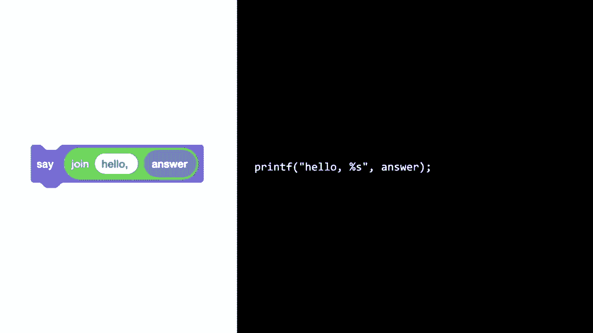

我在引号字符串内放置的逗号，与编程无关，完全与英语有关。值得注意的是，这个逗号在双引号之外，这在名为C的语言中是有意义的，它分隔了第一个参数。

从第二个参数，因此以这种方式，我们现在是否有能力使用`printf`以这种稍微新颖的方式在屏幕上说些什么，所以让我来实际操作一下，回到`cs50 ide`，我将前进并回到这个程序中。

只需片刻考虑一下，我们这个程序，它字面上只是打印“hello world”，并不那么有趣，我可以整天运行它，它会说同样的话。那我现在如何从用户那里获取输入呢？结果是，我可以稍微增强一下这段代码，让我来做点像`string answer`这样的事情。

等于get underscore string，quote unquote 你叫什么名字，所以我。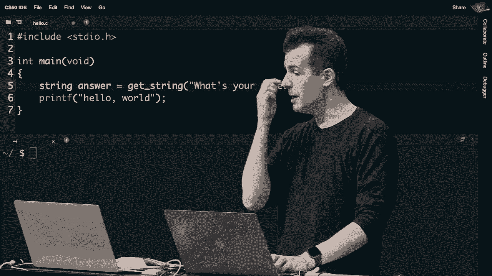

逐字输入我们刚才在c中看到的内容，我会记住我的分号在这里。然后我需要更改第二行代码，现在不说hello comma。world，而是说hello，comma percent s，然后在双引号外面，我会加一个逗号，然后字面上提供这个词，变量。

但我还没有完成，这有点微妙，你也会在某个时刻忘记这一点，为了使用get string，我必须使用这个叫做cs50库的东西，工作人员编写的代码，你不需要这样做。我需要添加一行代码，稍后会更详细地解释。

但现在只要相信，通过在最顶部添加这行代码，包含cs50。h。getstring，功能，否则我将无法访问。好吧，现在我要回到终端窗口，注意这里的二分法，如果我只是，运行dot slash hello。稍微热情一些，让我们看看，我的新程序会做什么，我快要。

不幸的是让我失望，因为它仍然显示hello world，你可能会直觉地意识到这里的问题是，当然我没有实际重新编译代码，因此每次你对代码进行更改时，仅仅保存文件并不足够，通过文件，保存或控制或命令，s我需要重新编译它。

好吧，我只需输入make hello回车，穿过我的，令人害怕的文本，这一切看起来都很好，似乎已经编译成机器代码，现在我可以重新输入dot slash hello和，回车，你会看到我的程序正在运行并等待我，让我继续输入我的名字david，回车，hello comma david让我继续啊**d和。

清屏后再次运行，让我再试一次。这次，假设我的名字是brian，我看到的是，hello comma brian，这与我们在scratch中的做法非常相似，但现在我们更强大，至今为止，完全通过键盘完成。好吧，我们写了很多，hello world 非常迅速。

我的内存，然后增强到现在我，接收用户输入，让我在这里暂停一下，如果有任何问题，欢迎通过聊天提问，让工作人员或同学回答。但如果你想在zoom上举手，请随意，这样我可以澄清或详细说明这里的任何内容，聊天之前的字符串就是。

不是变量的名字，字符串que，你可以把它写成string a或string。其他任何东西，只要在string后面的是变量的名字就行。真是个好问题，在scratch的世界中，你必须使用叫做。答案的变量，而在c中我们有完全的灵活性，可以做我们想做的，所以，正如ryan所建议的。

我可以把变量的名字改成，只是简写为a，但我也需要在其他地方进行更改。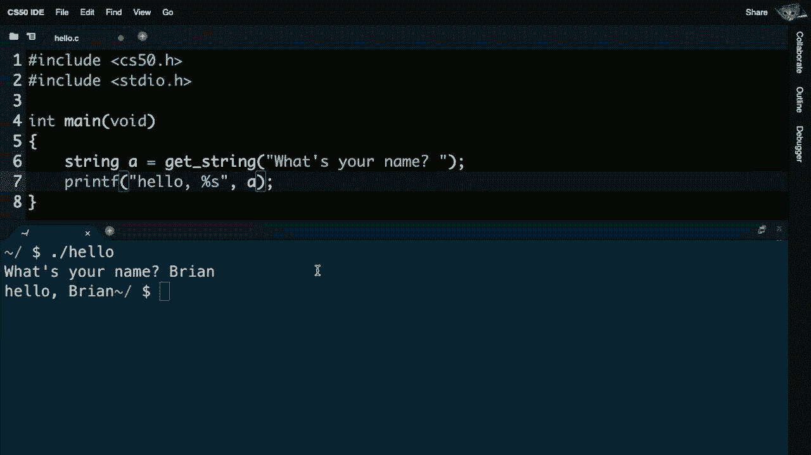

是为了明确被使用的变量是同一个，只是名字不同，这完全可以，但现在我们进入了更好的风格问题，变量名叫**a**并不利于代码的可读性，我现在可能看着我的代码，想知道变量**a**是什么。

当涉及到编写好的代码时，实际上更加冗长并使用实际的单词，例如在这种情况下的**答案**，虽然我不断描述x、y和z作为数学家的主要变量，但在笛卡尔平面之外它们并没有真正的意义。

在你用**C**、**Scratch**或其他任何东西编写的程序中，使用描述性的变量名是良好的风格，嗯，乔纳森，轮到你了。是的，我有个简单的问题，为什么我们要手动编译，嗯，与其他不同的IDE相比，确实是个好问题，为什么你必须这样做。

不断重新编译代码，简短的答案就是因为这是**C**语言的特点，嗯，这是一个已经有十年历史的老语言，所以在那时，一切都是非常刻意的，用户界面并不是首要任务，性能才是重点。

现在有一些更花哨的东西，有些人可能用过像**Codecademy**或**Code.org**这样的在线平台，用户只需点击按钮就可以运行程序，而我们在这堂课中要展示这些按钮的作用，因此如果你使用这样的自动化环境，这仍在进行，但为了我们的目的，尤其是在学期初，我们将手动完成。

在学期稍后，我们将引入完全不同的语言，例如**Python**，不再编译，但几周后会详细讲解，好的问题，索菲亚，轮到你了，我注意到字符串末尾的**\n**是必要的吗？即使只是单行，真的很好的问题，这个反斜杠n。

你在其他地方看到的，有点剧透，但即使我有点忽略它，你知道这看起来有点奇怪，美元符号，像那样并不是我想要的输出，我真的只想说**你好，布莱恩**，或者**你好，戴维**，这个可视化伪影这里的美元符号。

符号和波浪线以及斜杠与我使用的终端窗口有关，这是我正在使用的命令行环境，老实说，稍微挑剔一下，它应该在新的一行上，应该单独一行，这样就不会与我自己的输出混淆，正如索菲亚所说，我们有一个。

解决方案。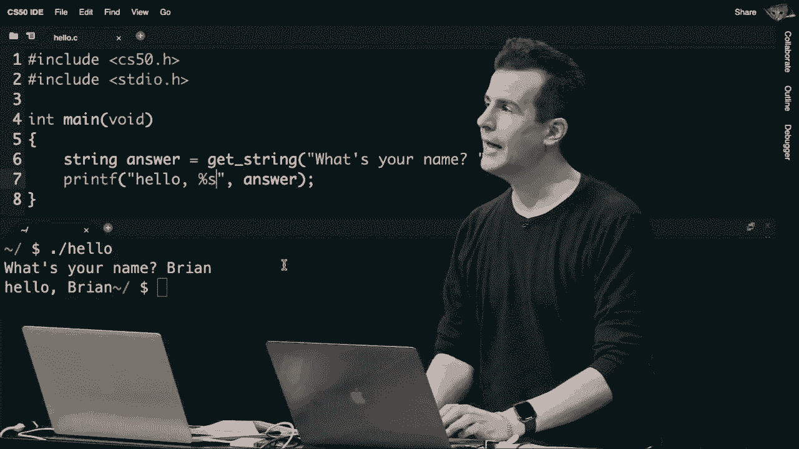

在编写算法和代码时，你必须非常精确。在我的代码中没有明确告诉这一行，所以我可以通过在 `%s` 后面立即加上 `\n` 来显式地做到这一点，但仍然在双引号内部。这是告诉计算机移动光标到下一行的简写符号。

现在你可能会想，为什么我不直接按回车呢？即使这些对我们大多数人来说可能都是新的，简单来说，如果你在代码中间开始按回车，事情会很快变得混乱，这可能不是正确的解决方案。因此，多年前的程序员们想出了这个方法。

决定提出简写符号，比如 `\n`，它表示换行。这里 `\n` 是换行符，让我继续编译这个程序。在保存我的文件后，让我继续运行 `make hello`，它似乎编译得不错，`./hello`。让我再次输入布赖恩的名字，瞧。

输出还是一样，但更干净了，所以我们在整理上做得稍微好一点。非常好的问题，呃，BJ。我有一个问题是，`get_string`，为了让它请求输入。它在你将其分配给变量时仍然会询问你的输入。

很好的问题，为什么我不需要通过将 `get_string` 放在单独一行上来调用它。C 语言和许多编程语言的工作方式是，它们会评估整行代码。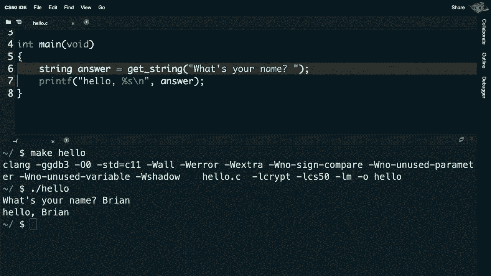

在这个上下文中，至少从右到左，当你有一个等号时。在我这里的代码中，这告诉计算机，你首先要执行右侧所述的内容，然后将该内容的输出存储在左侧。现在，把事情分散在更长的行上。

如果可以的话，代码就是这样，如果这样理解的话，`get_string` 正在执行。坦率地说，我们对这些程序的一些细节已经习以为常。可能公平地说，开始提及 `main`、`void` 和其他许多语法，让我们拆解一些我记得的代码行，但实际上在每个地方都需要存在。

你写的 C 程序，至少让我们开始理解一些细节。回想一下，在 Scratch 中，我们总是从“当绿色旗帜被点击”开始我们的程序，就像是。当你听到事件或者有摄像头运动时，这实际上启动了我们在 Scratch 中编写的大部分程序，在 C 语言中对应的是什么。

“当绿色旗帜被点击”的公共部分，实际上就是这个。今天我们不会花时间详细解释为什么它是 `int`，为什么是 `void`，括号。为了今天的目的，我只想说明这是“当绿色旗帜被点击”的对应部分。你只需要开始你的程序。

使用这种类型的样板代码，呃，我们将开始更详细地解释这一点，但现在只需相信这是你开始编写程序的方式。当然，我们写的程序还有更多内容，特别是我们看到了一些称为头文件的东西。

这是一个专业术语，指的是一个用 c 语言编写的文件，文件名以 dot h 结尾，而不是 dot c。所以我们之前见过这些，像这样。回忆一下，这是我们上周在 scratch 中写的最简单的程序，它在你点击绿色旗帜时只会显示“你好，世界”，这就是更完整的模拟。

右侧的模拟。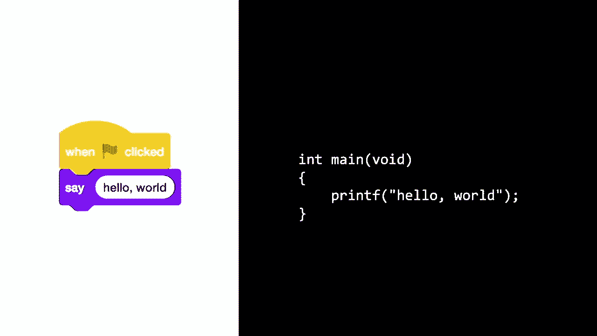

今天的那个程序有些东西缺失，可能在某些短小的地方特别明显。缺失的就是这一行，我刚刚从记忆中写下了它，它指的是一个名为`stdio.h`的文件，代表标准输入输出，点 h，所以 i o 是一个缩略词。

计算机世界通常指的是输入和输出，所以标准 io.h 是一个非常流行的文件，广泛用于 c 程序中，允许你从用户那里获取输入和输出，它通过提供`printf`来实现，这当然允许你通过这些副作用生成某种形式的输出。

之前我写的另一个程序中确实有，正如 bj 之前提到的`get string`，我可以从用户那里获取一行文本。我需要的是完全不同的东西，这时我们刚刚添加了第二个头文件`cs50.h`，这些头文件让你能够访问更多。

函数，这些函数是你可能不会自动从你使用的语言中获得的，而这里是 c。回想一下上周，当我开始研究 scratch 的扩展菜单时，我使用了翻译块和语音块，那些被埋藏的更复杂的功能，就像在 c 中使用头文件一样。

它让我访问了更多的功能，换句话说，就是说你得到了额外的功能。好吧，让我在这里暂停一下，看看是否还有其他问题，然后我们继续实际创建一些你们可能会遇到的问题，呃，我们将给你提供解决这些问题的工具。

解决这些问题，这样你在学习新语言时不会感到完全孤立。有什么问题吗，布莱恩？等布莱恩给我提示，好吧，让我继续提出，我在写这些程序的过程中有那么多不同的方式可能搞砸了，呃，我可能漏掉了一个分号，就像我。

这意味着我可能没有关闭我的引号，可能括号写错了，可能完全拼错了单词，我可能有很多不同的方式让那个程序出错，坦白说，我有点心存侥幸，希望我没有弄错我们一起写的第一个程序，但不可避免地。

在某个时刻，也许不是你的第一个程序，但在学习如何编程或学习如何用C语言编程的早期，你会出错，你会犯一些拼写错误，你的理解和你想让计算机做的事情之间会有一些脱节，这就是说有一些工具。

幸运的是，有一些工具可以帮助你解决这些问题，第一个叫做help50。任何以50结尾的工具，都是专门针对教育的，由CS50的工作人员编写的，是临时的训练工具，课程中使用，但最终可选地去掉，换句话说，你不会需要它们来排除故障。

可能你在自己的代码中看不到的问题，让我先模拟一下，像这样，让我回到我们在C语言中写的第一个程序，这个程序非常简单。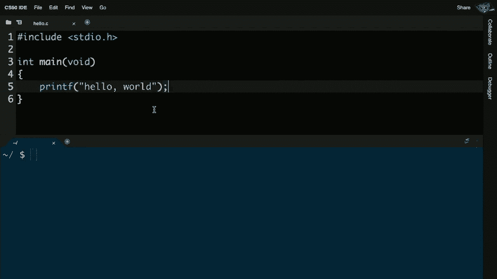

它只显示了“你好，世界”，而我在这里可能有几个地方出错，例如，我遗漏了标准输入输出头文件。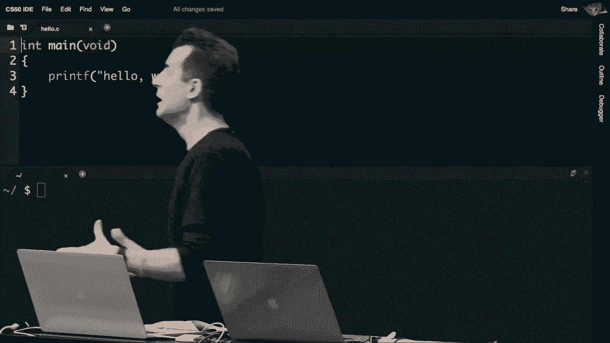

在我的程序顶部的暗示是，现在printf没有通过标准io.h包含，所以让我们看看错误消息，希望它是一个非常自我解释的消息，完全有意义，让我重新编译这个错误的代码。天哪，我的错误行数比我实际需要的行数还要多。

这实际上是编程的一个现实，很多编程语言和工具坦率地说并不是为了易用性或用户友好性而设计的，而是为了简洁性和精确性而设计的。不幸的是，它们往往假设观众是程序员。

当然，当你第一次看到这些输出时，这可能会适得其反，你不得不理解像这样的疯狂模糊输出，今天我们不需要关注每一条信息，但让我们开始识别模式，走进一个新的空间和现实世界。现在让我们用代码来做到这一点，最重要的是，当你出错并且在你的代码中犯了一些错误，以至于你的程序甚至无法从源代码编译成机器代码，通常你会在错误输出的顶部看到一个线索。

这个线索告诉你出错的文件名和行号，第三行意味着第三行，然后第五行可能暗示在那一行中的列或字符。

这实际上取决于特定的问题，如果这有用的话。因此在第三行我遇到了一个错误，printf，应该输入 const char star，我的意思是，谁知道那甚至是什么意思，你最终会知道，但今天它只是意味着发生了错误，你可能看不到，也可能不知道，如果我没告诉你。

我故意删除了那一行，所以让我们看看能否通过使用这个工具 help 50 来理解这一点。这个工具是由 cs50 工作人员编写的，它将帮助翻译晦涩的计算机消息为更人性化的建议和问题，供你的同学或助教参考。

在办公室时间的上下文中，它可能会给你提供建议，所以使用 help 50。不要一次又一次运行同样的命令，看到相同的错误输出。实际上，只需先在你的终端窗口中输入 help 50，然后输入完全相同的命令，按下回车键，然后发生的事情是同样的命令将被运行。

我们将使用 help50 程序进行分析，突出显示我们识别的内容，然后将其翻译为更人性化的语言。例如，在运行 help50 后，我们请求帮助……这里用黄色显示的就是我们之前识别的内容。然后在这里，你是否忘记在你的文件顶部包含 `#include <stdio.h>`，其中声明了 printf。

所以希望如果我们能识别出问题，我们可以用这种修辞式的问题来引导你，让你意识到“哦，是的，我犯了这个错误”，所以现在我可以回到这里，移动到我的文件顶部，添加 `#include <stdio.h>`，现在注意，如果我重新运行，一切都在一起。

例如，我省略了分号，现在让我去做 hello，没有分号的情况下，我们将得到一个不同的错误消息。你将再次看到我出错的文件名 hello.c，因为在我上面添加了更多内容后，行号向下移动，你可以看到。

在表达式之后预期分号，所以这个稍微简单一些，但你也可以在这个命令上运行 help 50。只是为了获得一些更明确的建议，因此 help 50 将成为你的朋友，你的代码。

为了写出相当漂亮的代码，我缩进了 printf 这个词，我在这里添加了一些空白行，仅仅是为了让它清晰，我把这些花括号放在自己的行上。但是老实说，我的电脑或 cs50 ide 并不那么挑剔，我从技术上讲可以去掉这一空白行，我可以把这个花括号移得更上去。

在这里我可以完全去掉这个缩进，将其移动到单独的一行，然后我可以将这个花括号移到这里。这样就可以写出一个现在只有两行长的程序，不是六行，但希望即使你之前从未编程，这也应该让你感到不舒服。

这就像现实世界中一些人不在社交媒体帖子、电子邮件或短信中使用标点符号，他们只是不断地说下去，是的，信息在那里，你可以推测他们想要传达的内容，但天哪，这太烦人了，难以阅读，可能。

更高的概率说明这里有个错误，而且它将变得更难以平衡。我的程序依然是正确的，但描述起来是糟糕风格。标准输入输出库`io.h`和分号都没问题，只是看起来有点丑，空白空间不多，空行也很少。

缩进只是让你和我更容易注意到。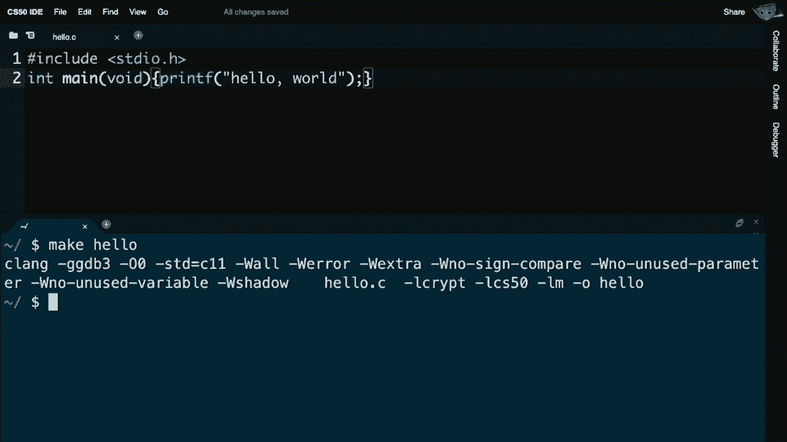

它确实编译，所以help 50不会帮助我解决这个问题，因为它编译得不错。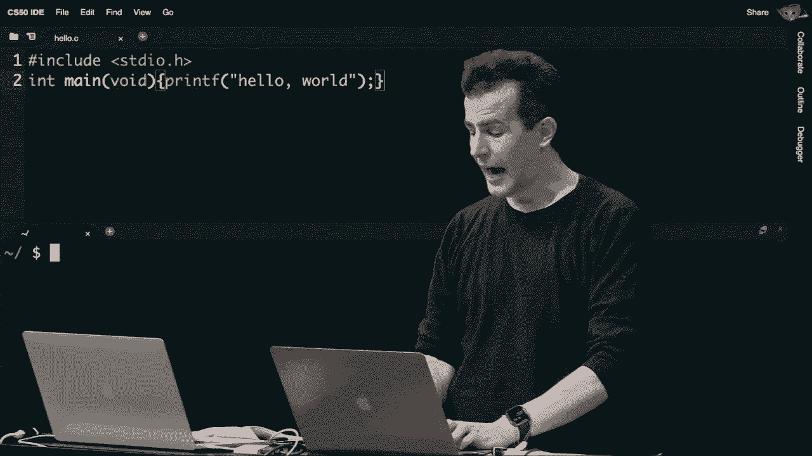

但是我可以运行另一个程序，我们称之为style 50。这是一个教育工具，安装在CS50 IDE中，可以帮助你改善代码的风格。当我运行style 50时，我们会看到一些乍一看可能有点神秘的输出。

但我认为这会帮助我们最终理解程序。要运行style 50，你只需运行style 50，然后是文件名，在这种情况下是hello.c。所以你不需要再运行make，也不需要运行make hello，你只需做style 50，按回车。你会看到一些有点神秘的输出，但用绿色高亮显示。

这个工具试图引导我改善这个文件，注意这里的反斜杠n。之前提到过，它表示将光标移动到下一行。因此，这里绿色的反斜杠n意味着我的天，在这个括号后按回车。另一个反斜杠n则意味着，人类，。

再按一次回车键，将大括号移到自己的行上。这里有四个绿色空格意味着人类字面上按了四次空格键或按了一次Tab键来缩进代码，最后再加一行新行。因此，style 50并不会为你在风格上修复代码。

但它试图引起你对所有可能的改进点的注意，所以让我在这里添加一行，让我在那添加一个空行，让我在那缩进四个空格，让我把大括号移下来，现在，代码。希望它看起来确实不错，但它仍然给我提供建议。

它告诉我添加一些叫做注释的东西，很多人已经在Scratch的世界中发现了这一点。你可以在Scratch中添加小便条或便签，提醒自己某些功能或解释某些内容，C语言也支持这些。

比如说，如果我想在这里特别严谨一点，向阅读我代码的人清楚表明我的意图，我可以在现有代码行的上方写“问候用户，新行”。我已经写了一些，斜杠，表示嘿，编译器，这不是实际的C代码。然后我按下空格键，接着我只是输入了一个。

英语短语，这可以是任何一种口语，但我继续输入“问候用户”。为什么？因为这只是对我自己一个提醒，后面这行代码的目的是问候用户，这比说“打印你好，世界”要稍微好一些。让我问一下，即使你从未编程过，为什么第一件事情是。

评论，为什么我应该说“问候用户”而不是“打印你好，世界”，你可以用一个手指在这里。哦，你在Zoom中未静音但听不见，你技术上可以，现在可以听见我了吗？是的，好吧，它告诉你代码的目的。是的，代码的目的与之相对。

你在做什么，确切地说，你在区分什么，如果你的注释几乎与实际代码相同，你并没有向读者传达更多的信息，更不用说将来对自己解释了。更一般地说，这行代码的目的，是问候用户，这样的描述要更清晰一些。

因为如此简短，即使风格50会更希望你添加一些注释。如果你的程序确实只归结为一行代码，你可能不需要注释。现在，然而，几乎我们接下来要写的每一个程序都会超过一行主代码，比如这行printf。

所以很快就会变得更有意义，我们将希望实际打印出来。给我们的代码添加一些实际的注释。好吧，让我介绍一个最终的工具，这将帮助我们解决复杂的程序，这就是检查50。这是一个特别的工具，你将会在实验室或作业中使用。

实际上检查你代码的正确性，而帮助50仅仅是帮助你编译代码。通常在它完全无法编译的时候，风格50帮助你改善代码的风格，检查50将会检查你的代码的正确性，针对你写的作业题目。实际上我们写了一些测试，以正确地符合我们的规格，所以我该如何。

运行检查50这将完全依赖于问题集或实验室。我们将在问题设置器或实验室中告诉你要输入的命令。你可能无法自己弄明白，我恰好记得我们有一个测试，叫做cs50/problems/hello，这恰好是一个独特的。

它不是一个网址，也不是一个文件的路径，它只是一个说明。在问题集或实验室中，如果我现在运行这个命令，发生的事情是，我的 ide 中的名为 hello.c 的文件正在上传到这个流行的存储代码的地方 github，我将用我的学生账户登录，然后哦，你们都看不到。

我在这里做的事情，所以我们将重新开始这个演示，因为现在你实际上可以看到我的代码，所以几乎没有错误地完成，所以 check 50 是这个工具，它将允许你测试你的代码的正确性。让我现在继续并按如下方式运行，我将输入 check 50。

然后是 cs50 斜杠问题斜杠 hello，概率是你将永远不会运行这个相同的命令。在问题集或实验室中，我们总会告诉你该输入什么，你不会知道该输入什么，除非我们告诉你使用什么测试，这现在将上传我的文件 hello.c 到一个叫做 github 的服务，它再次是一个流行的共享代码工具。

用它来收集提交，我接下来将输入我的密码。你看不到它，你会看到星号或像网页中的项目符号。我将会前进并按下回车，然后它将验证我的代码，它会进行一些思考。它正在上传，现在我们只是在等待互联网的服务器。

我们在编译你的代码后运行你的代码，或者在这个情况下是我的。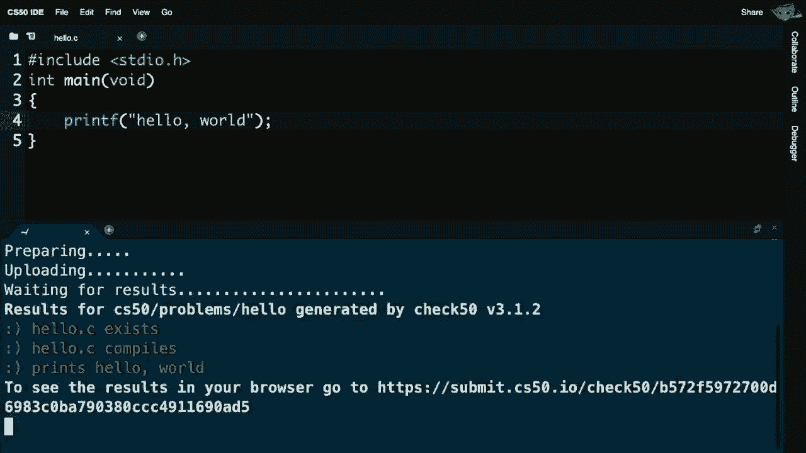

并确保是的，它实际上按预期运行，而你通常会看到，希望的是一堆绿色微笑脸，表示是的，你的代码存在。是的，你的代码可以编译，并且是的，例如，它打印 hello world。有时你可能会看到红色的皱眉脸，这意味着不，你的代码没有工作，问题集。

在这时，就得回到你的白板，弄清楚这里到底需要修复什么。有时你会看到黄色输出，只有一个简单的黄脸，这意味着我们甚至无法运行某个测试，因为某个其他测试，关于正确性提供了相对快速的反馈。

在提交代码之前，你可以检查一下，结束这一天并检查 check 50。说明将始终伴随问题本身，在实验室中，在这个终端窗口中，我可以做的不仅仅是运行 make 和 dot slash hello 或者我程序的名字是 50 并检查 50。结果是我实际上是在 cs50 ide 的形式中使用。

我自己在云中的服务器，所以是的，我正在使用一个网站，你自己的服务器或你自己的计算机在云中，在互联网上的某个地方。你有自己的用户名和密码，以 cs50 ide 的形式，你编写的程序存储在这个 ide 中，还有一些我现在会介绍的其他功能。

也许最友好的一个是左上角的小文件夹图标。如果我点击这个小文件夹图标，你现在会看到是什么。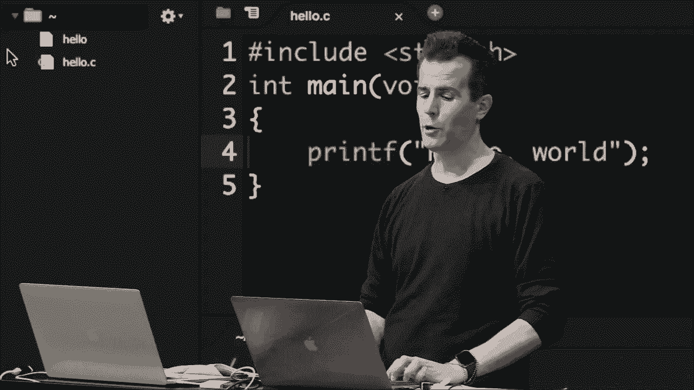

通常被称为文件浏览器或文件树，就像是我的账户或这个案例中我 IDE 中文件的图形表示。看起来类似于 macOS，看起来类似于 Windows，这只是内置于 IDE 的图形用户界面。

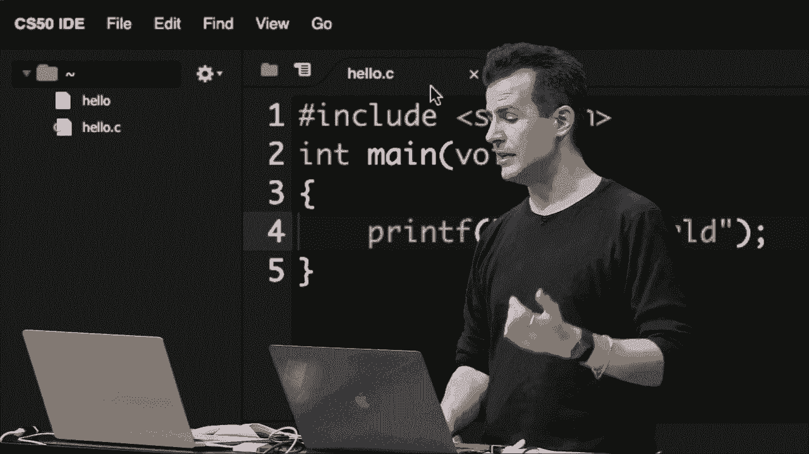

例如，如果我通过点击右上角的这个小 x 按钮来关闭我的标签。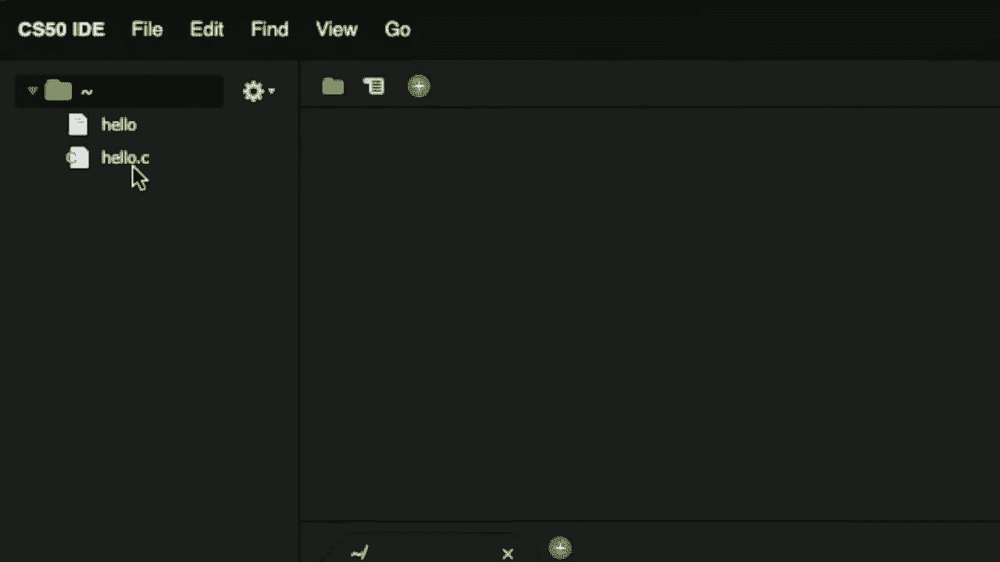

如果我想重新打开文件，就像你在 Mac 或 PC 上想象的一样。只需双击左侧的文件，但请注意我并没有点击 hello。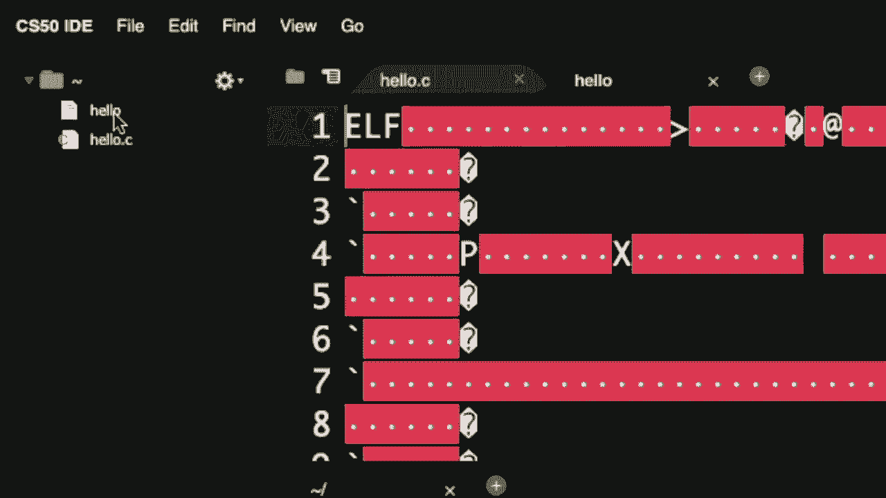

因为请注意，如果我打开，天哪，发生了什么。这有点乱，有红色，还有点点，谁能告诉我这是为什么。我看到的这些是因为概率，或许你在某个时刻会不小心点击一个文件，比如 hello，而不是像 hello.c 这样的文件，它是二进制代码。

机器语言不允许用户看到他们所写的代码之外的内容。是的，正如你在这个标签页中所尝试查看的，实际上是二进制代码，零和一。然而，这些零和一在技术上被误解为 ASCII 字符或 Unicode 字符，请回忆一下上周的内容。

ASCII 是数字、字母之间的映射，数字当然只是零和一的模式，这看起来非常神秘，因为我们试图误解零和一，好像在 ASCII 和 Unicode 中有更多的字符，而不是 a 到 z 之间的字母和数字，还有一些不可打印的字符，实际上所有的怪异之处都是。

在这里看到的只是零和一的误解，这些是计算机的指令。机器代码被误解为文本，因此你无法编辑这样的二进制文件。因此，当你做类似的事情时，你应该关闭 hello，并确保你已双击并打开了它。

你的实际源代码文件也是如此，所以我们看到了字符串，还有其他数据类型，还有其他函数，更多的，我觉得现在是个不错的时机，也许我们可以休息一下，让这些内容消化，休息一分钟，等我们恢复时，我们将介绍 C 的一些新特性，并将其与上周看到的进行比较。

在 Scratch 中，我们七天后再见，好吧，我们回来了，请回忆一下我们停留的地方，我们正在查看这个左上角的图形用户界面，文件浏览器，文件树，这给了我们更多的图形。现在让我们以老派的命令行方式在我的终端窗口中来做这个。

事实证明，使用我们的终端窗口，我们不仅可以编译代码并运行等操作。我们还可以操作文件和文件夹，即使这些文件夹存在于我的 IDE 中，也就是我在这里的云端计算机上可以访问的地方。我要提的第一个命令是，输入 ls，ls 是列出的简写。

非常简单的ls，当前文件夹，所以这就像在windows中双击你的“我的文档”文件夹或在mac os中的“文档”。ls只是列出内容，现在注意，hello有点奇怪，它被高亮显示为绿色，并且后面有一个星号，那只是一个视觉提示。

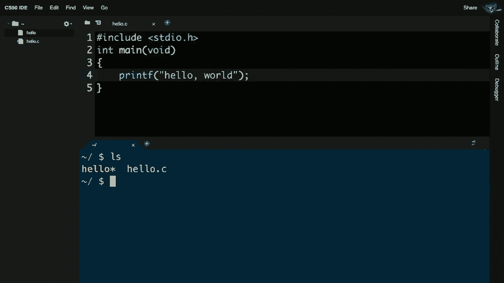

那个文件是可执行的，也就是说，点斜杠hello，星号不是文件名的一部分，当然我们看到hello.c，重命名我的文件，嗯，我可以像在mac os中那样。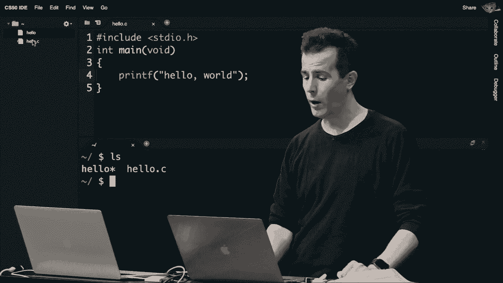

或者在windows上，我可以去上面的文件浏览器，控制单击或右键单击，注意有一大堆菜单。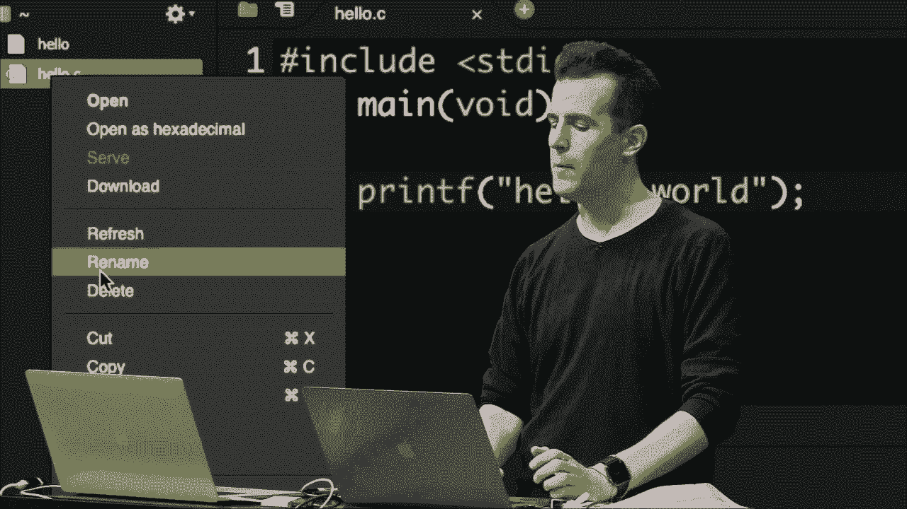

我自己的电脑，我可以直接重命名文件。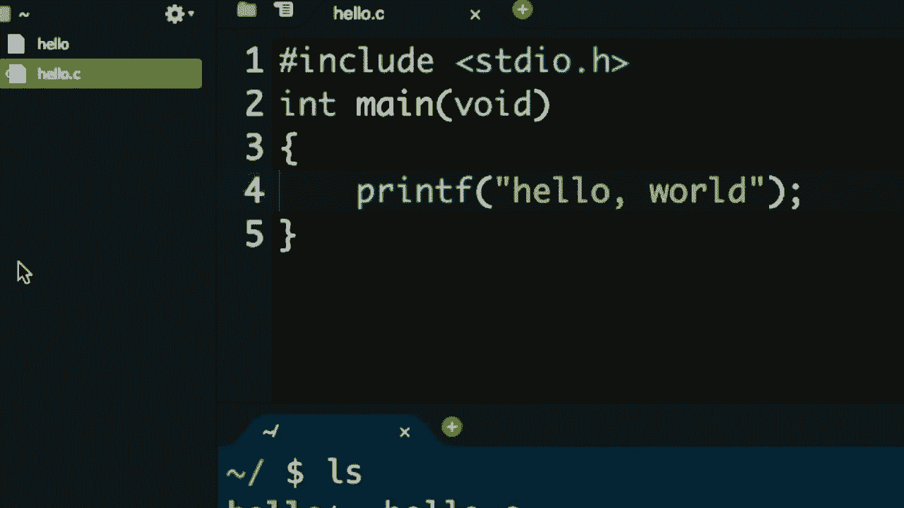

在这里，但一般来说，我们今天将只在命令行上进行操作。这将为我提供一个更强大的命令行界面。因此，假设我改变主意，我知道我不喜欢这个程序，并且想重新开始，严格来说，我并不需要删除hello，我可以直接。

重新编译它，它会不断被修改，但如果我想删除它，我可以输入rm hello，然后按回车，接着会被询问是否要删除常规文件hello。这只是一个视觉确认，我可以回复y或yes之类的，如果我按y和回车，似乎没有发生什么，但注意顶部发生的事情。

左边注意，hello现在消失了，只留下hello.c代码文件。也许现在我想更改这个程序，不想写hello.c，而是goodbye.c。让我关闭上面的标签，是的，我可以右键单击或者控制单击它，但我们不需要使用图形界面。

让我继续，然后做mv hello.c goodbye.c，mv是移动命令。尽管如果它叫重命名而不是移动会更好，但移动只是将一个文件移到另一个地方，移动hello.c goodbye.c，注意左上方发生的事情。现在我的同一个文件叫做goodbye.c，如果我再次输入ls，我可以看到它确实是。

现在让我继续，把它移回去，因为我想保留hello.c程序，但假设我想要程序，因此我的账户会随着今天越来越多的文件变得有些混乱。假设你想创建一个文件夹，也就是一个目录，make。

目录，然后是我想要创建的目录的名称。例如，lecture，你可以随意命名，也许我想把今天所有的文件存储在lecture目录中，当我按下回车时，注意我的文件树上发生了什么。三角形是空的，因为我还没有移动hello.c到lecture文件夹中，mv hello。

c 讲座，现在让我按下回车键，瞧，现在注意到它被嵌套在这个讲座文件夹中，实际上如果我现在输入 ls 列出文件，我只看到讲座文件夹。不幸的是，我现在没有访问 hello.c 的权限，无法在这个命令行环境中访问，除非我切换到那个目录，在 mac 和 pc 的世界里。

我们显然会双击一个文件夹，瞧，我们就在里面。在命令行界面中，你需要更有目的性，所以我要使用 cd 来更改目录，然后是讲座，然后我将继续按回车。现在注意，这样做可能更能解释为什么这段时间我们一直看到蓝色。

这个 ~ 讲座 / ，这个 ~ 只是我自己的账户，我自己的默认文件夹，像 mac os 一样。这就是 ~ 在我现在所在的文件夹中的代表，仿佛我在 mac os 或 windows 上双击讲座以打开一个文件夹。现在我在终端窗口中进入这个讲座目录，瞧，嗯。

我已经进入其中，现在让我撤销这个，因为我想保持简单一点，假设我想移动 hello.c 的语法。对于我们称之为上级文件夹的内容，有这种简写符号。因此，就像在家谱中，有父母和孩子的概念。

孙子和孙女等等，这在有文件夹和文件夹内有文件夹的计算机系统中也是如此，文件夹之间有层级关系，就像家谱一样。因此，如果我想将 hello.c 移动到上一级，我实际上可以使用 mv，就像在说。当我这样做时，注意左上角发生了什么，现在 hello.c 不再在讲座文件夹中。

在下面，实际上如果我现在在讲座文件夹中输入 ls，里面是空的，我该如何在这些文件夹之间移动呢？点（.），因此切换到我的上级目录（..），回车，现在我显然在 ~ 目录下，这又是你自己家目录的简写符号，你的我的文档，ls 在这里。

我已经完成了这个讲座文件夹，我可以使用 rm 来删除像我之前做的那样来移除 hello，但用 rmdir，已经不见了，我撤销了所有的各种操作。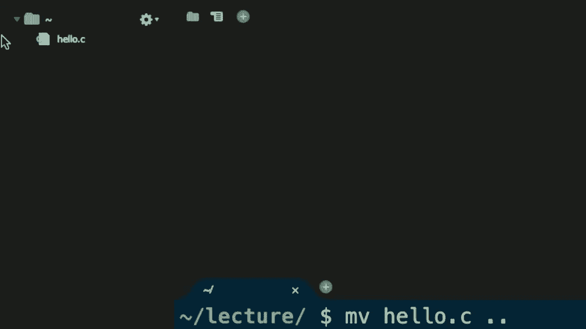

我之前所做的更改，但或许现在可以更好地理解为什么我之前做了一些事情，让我打开我的 hello.c 文件。让我再次创建 hello，这正是我们停下来的地方，回想一下，这段时间我一直在使用 ./hello。

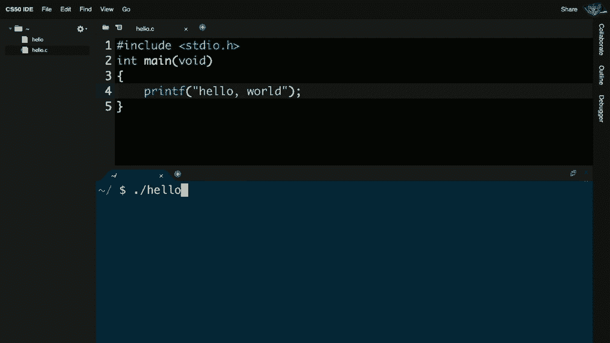

为什么会这样呢？就像点点（..）指代你当前的目录，尽管这看起来有点傻，名为 hello 的文件夹就在我当前的目录中，点（.）代表当前目录，点点（..）代表上级目录，所以，我们终于明白了为什么我一直在输入 ./hello，这只是文本的类比。

做类似于在 mac os 或 windows 上双击图标的事情。还有其他命令，随着时间推移你会接触到这些命令并在各种问题中使用它们，比如 cp 是复制的命令，等等，许多其他命令，但这些都是标准命令，并不是 cs50 特有的。

允许我们操作文件和文件夹的标准命令。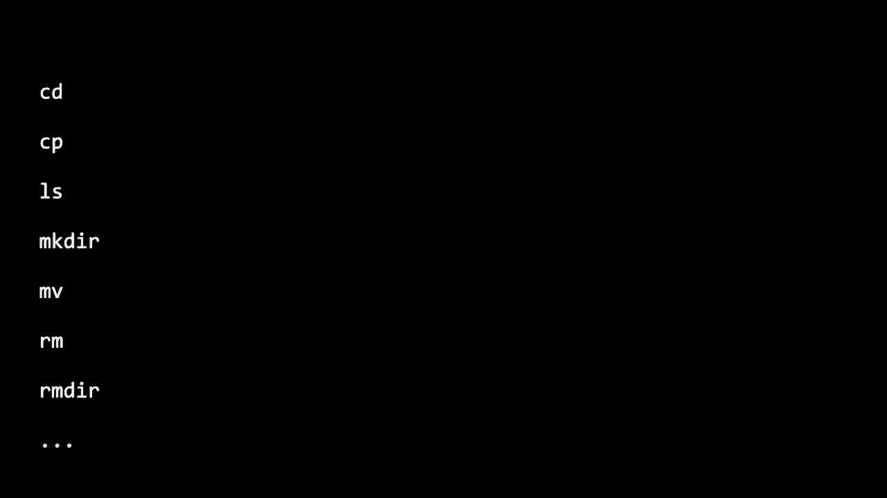

在这样的计算机中，来自 max 的问题是，我不太明白 hello 程序和 hello.c 程序之间的区别，似乎没有 c 的那个没有用处。哦，在这个故事中，我们有源代码，就是我写的 c 代码，然后是机器代码，即零。

计算机理解的那些代码，我一直在写的所有代码都在一个叫 hello.c 的文件中。make 程序会创建一个新的文件叫 hello，技术上来说它只包含零和一，而这就是我实际运行的机器代码。我可以使用 rm 来删除 hello 程序，就像我之前做的那样，现在我们回到了最开始。

这是我们从零开始写代码的故事，如果我现在输入 make，让我来试试。现在 ls 注意到我只有一个文件，现在让我做 make hello，我看到那个神秘的输出，但如果我再次输入 ls，只有绿色带星号的那个是可执行的，那是编译器生成的机器代码。

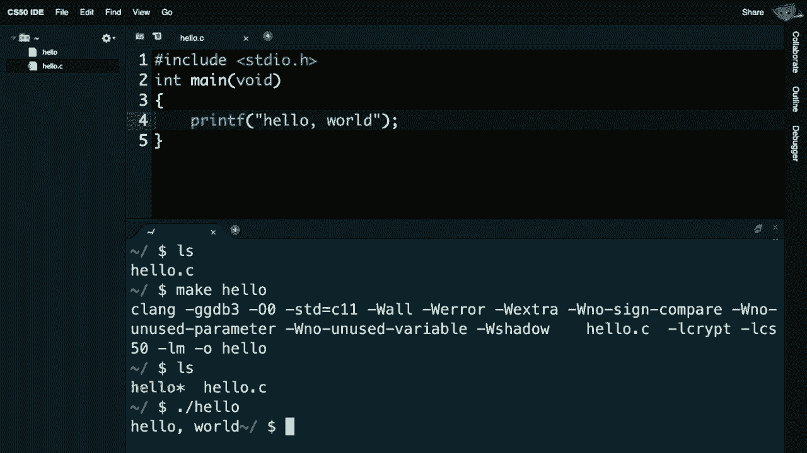

为我创建的程序，我应该说，声明一下，我今天说了一点小谎言。make 本身其实不是一个编译器，而是让我们更容易去编译我们的代码。
