# 哈佛CS50-CS ｜ 计算机科学导论(2020·完整版) - P20：L10- 计算机与道德话题 - ShowMeAI - BV1Hh411W7Up

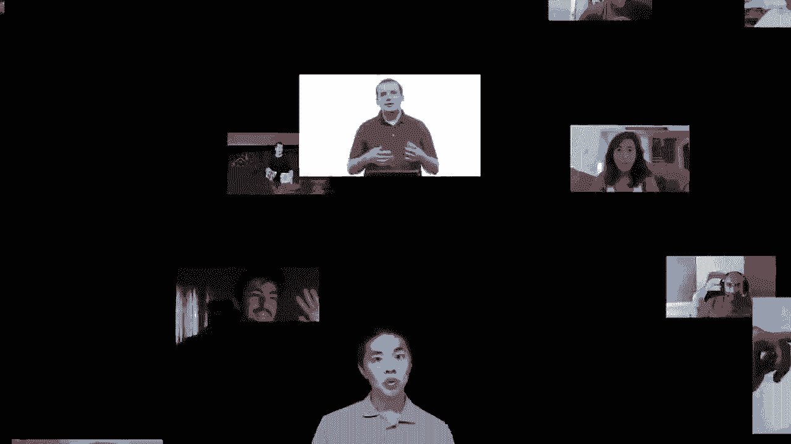

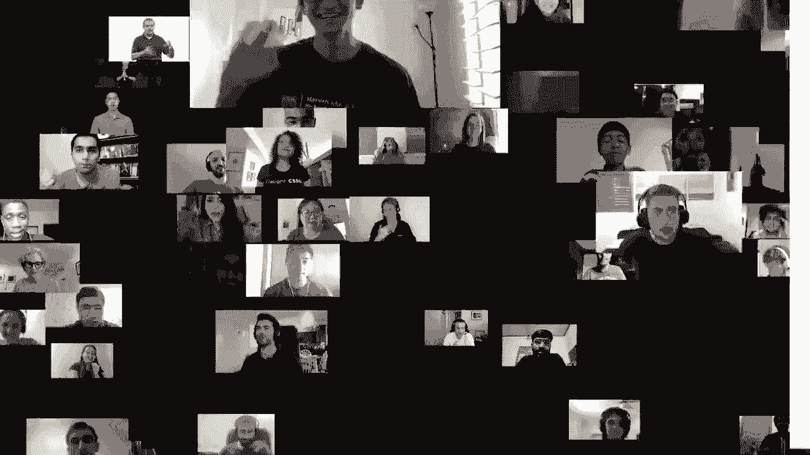

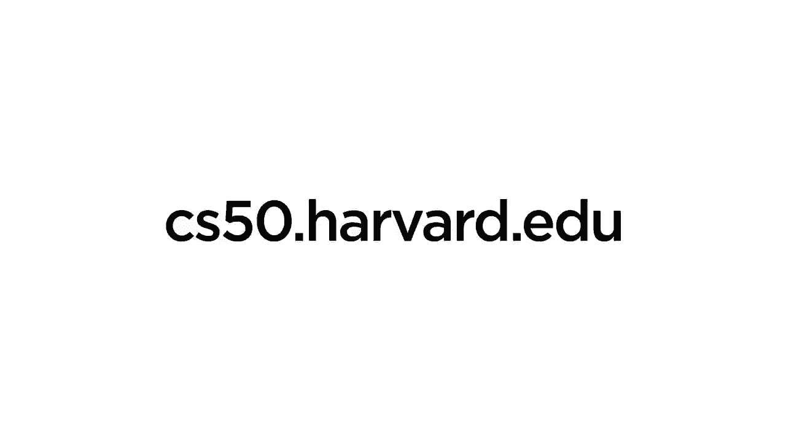

好的，这就是CS50，这也是结尾。

接下来剩下的就是你们的最终项目，我们迫不及待想看到你们今天的创作。我们想稍微回顾一下，也展望未来，所以能做什么呢，谢谢，当然我们在洛贝戏剧中心，感谢美国剧团，他们整个学期都是我们的出色东道主。

他们确实给CS50注入了新的活力、新的灯光、新的动画和新的声音。我们非常感激能够有这样的特权，与这里才华横溢的团队合作，确实让这个舞台在这个学期焕发活力。当然，还有CS50的团队，尽管我现在是唯一一个在这里的人。

我们有我们的视频、技术，以及所有的视觉元素，希望能补充你们所做的实践操作，因此非常感谢你们，这个学期。这一切都是可能的，可以说，这些都是比较特殊和困难的经历。

我们希望，无论你是现在直播观看，还是稍后某个时候看到这个视频，都能感到健康和快乐，并且确实希望我们能帮助你在这条学习新事物的道路上找到方向，当然还有比这更多的人在幕后支持着你们。CS50的整个团队，当我望向台上的每一个人，大家相距甚远，这学期。

这里的观众实际上并没有观众，后面的场景就像这样，这是一张我在每节课上看到的确切照片。如果我们放大一下，当我们有问题时，实际上就是我们和一些电视屏幕。在这一年里，但我们期待着不久后再次团聚，现在在幕后团队。

实际上，这里展示的只是CS50的教学助理们的大部分，而不是全部，他们在哈佛和耶鲁任教，没有他们，这一切都是不可能的，因为他们确实是我们获取每个人最终完成问题集、实验室等的支柱和支持结构。但值得注意的是，我们都是有缺陷的，确实有人告诉我，这相当于。

当我做错事或在台上有点困惑时，这会让我感到启发。我无法立刻弄清楚为什么自己的代码会出现问题，这种情况肯定会发生在我们所有人身上。因此，即使你在学期结束时感觉到并不是所有的东西都能很顺利地理解，而有时仍在挣扎。

当你在代码中找到那个bug时，你仍然在谷歌搜索或寻找某个较小的技术问题的答案，实际上这永远不会真正消失，实际上，除了我在舞台上听到的错误外，我们认为分享一个，来自几周前教学团队的故事会很有趣。

准备那段关于TCP/IP数据包的视频，效果非常好，其中人们希望从Zoom的右下角到左上角传送三个TCP/IP数据包，但我们想给你一瞥，实际上在我们背后发生了什么。

甚至在那个演示中，我，[音乐]，太棒了，乔什，[音乐]，嗯，索菲，[音乐]，太完美了，我认为，[音乐]，真是太惊艳了，谢谢你们，哦，天啊，[音乐]。所以可以说，计算机科学对我们所有人来说都是困难的，这些感受和挫折确实是你们工具箱中的工具。

工具包的基础更加坚实，现在，你在学习语言时会感到有些不舒服。最终吸收新的想法和技能，但记住对于CS50而言，这门课程中最终重要的不是你相对于同学的最终位置，而是你自己最终的位置。

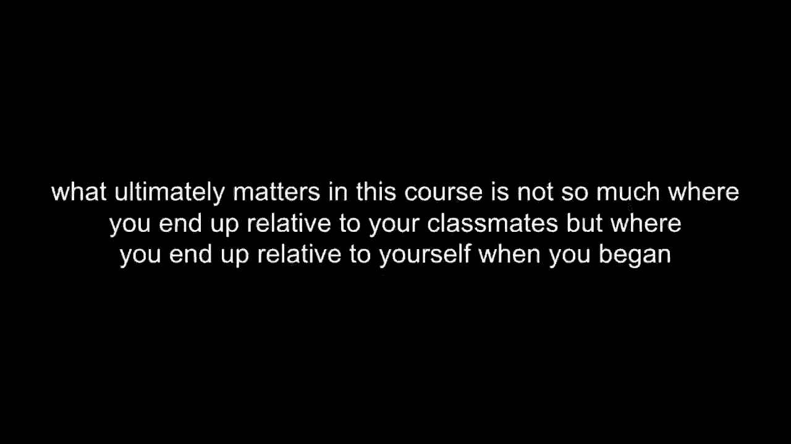

相对于你刚开始的时候，考虑到这并不久远。也许这是你在CS50中最大的困难之一，只是试图弄清楚。对的，是否选择了不那么舒服的版本，弄清楚如何打印空格，如何移动金字塔等等，弄清楚如何嵌套循环，更不用说让所有的。

分号和编译步骤都正确，然后快进到一两周前，当你建立了自己的网页应用程序，使用了第三方API并几乎实时拉取数据，控制着所有你所读取和写入的数据，像这样的进步真是巨大。

在短短几个月的时间里，所以，也要对此感到安慰，尤其是，当你可能会，最终推过来。所以我们在这学期专注于什么呢？我们花了很多时间谈论和进行编程，但我们希望能让你记住的是，真正能持久的收获。

比起这些语言的细节，无论是Scratch还是C，其他我们查看的实用工具。 

所有这些最终都会以某种形式过时，或者它们可能会作为旧语言继续存在，但更新更好的事物会接踵而至。我们希望的是，在过去的几个月里，你能够掌握基础知识，并建立一个可以自我提升的基础。

我们开始时，首先是原则，你可以推断出一些新系统。某些新硬件、某种新技术、某种新语言肯定会奏效。因为在背后，最终，某种程度上，仅仅是零和一，因此我们引入了。在零周回顾中，计算思维鼓励你更有条理地思考。

从算法角度来看，但实际上计算思维只是计算机科学家的体现。我们可能认为这仅仅是批判性思维，这一过程是将信息作为输入，并产生输出，即某种解决方案。在这之间，当然是我们的算法，那个黑箱正在做一些有趣且可能困难的事情。

但归根结底，这就是解决问题，这无论如何不会消失。与您使用或选择的语言无关，甚至在过程中遗忘某些内容，今天也是如此。二进制形式，或者仅仅是信息和决策，或事实和结论，这一过程，正确。答案、正确的结论，远比c或python或其他任何语言的细节要重要得多。

这是我们在这个学期花费时间的更多动手技能。还要记住，至少在cs50内，我们提出的工具，用于评估你解决问题的方法的质量，或这三个轴，其中第一位和最重要的无疑是。

正确性，因为如果它不工作，那一切的意义何在，算法。从输入到输出的过程必须是正确的，这一点至关重要。但之后是设计问题，如果你实际上想要构建更多。

复杂系统或解决更复杂的问题时，你确实需要更清晰地解决问题。你不希望它们变慢，变得混乱，从实际角度看，你不希望你的代码完全难以理解，因为这只会在长期内妨碍你使用那些相同的工具和库来解决更多问题。

更有趣、更复杂的问题，这肯定会使得与其他人互动变得更加困难。

其他合作者和其他系统，实际上在这些方面也包括风格。

这仍然重要，它或许是我们这一三位一体中的第三个，但它是你代码的美感。就像你在我们的语言中所传达的那样。

与其他人接触时，展现你的最佳状态，让他们理解你。尽管我们在这样的课程中花费了很多时间与计算机互动，归根结底，你实际上是在与机器交流。

以一种清晰的方式与其他人沟通，使你的想法和解决方案被采纳，显然与这些其他理念同样重要。那么，关于其他跨越特定语言和任务的基本构建模块呢？抽象，这个将它们整合的概念。

所以你不必担心底层实现的细节，你只需专注于那个拼图部分或那座建筑。这样的思维无处不在，当然在代码中也是，抽象，我不记得`getstring`的具体实现，像`printf`那样，但我知道它有效。

我知道它接受输入，我知道它产生输出，因此我可以在这个构建模块的基础上，构建我自己的想法和软件，抽象掉那些细节。在现实世界中，我们也会抽象事物，时间，假设会由其他人完成输出，没有专家了解底层实现细节。

但随后还有另一个概念，即精确，这在书写人类语言时至关重要，要明确你所表达的意思，考虑边缘案例，考虑可能不会发生的输入，这样你就不会犯错，避免一些意想不到的行为，正如我们在实际代码中多次遇到的。

有时候，抽象和精确在某种程度上是相互矛盾的。因为抽象让你在相对高的层次上思考和交流，而当涉及到给其他人讲解时，应该深入细节，逐步进行，或许可以通过几个例子让这一切变得生动。

我们会尽可能多地让人参与进来，你可以拿出一张纸和一支笔，或者铅笔，如果没有的话也没关系，你也可以在电脑上进行，如果你更愿意在记事本上画画，没问题。但理想情况下，拿出一些东西，我们将继续尝试应用。

一些计算原则，在某一层次使用抽象或精确是有害的。因此，我认为要做到这一点，布莱恩，我们需要观众的帮助。我想我们需要一位志愿者，来为其他人口头写指令，我们会把每个人都视为参与者。

观众中有一个人，将成为今天的电脑，我们需要一位志愿者来担当这个角色，丹尼尔，谢谢你愿意参与。布莱恩，我们能否向丹尼尔，以及只有丹尼尔，分享一个我们希望其他人绘制的东西的图片？丹尼尔，你应该看到你面前的。

屏幕稍后会有一张图片，如果你还没有看到，不要告诉其他人那是什么。你可以在一会儿使用任何你想用的词，但你不应该用手或任何手势，目标是为房间里的每个人逐步口头写出一个算法，这样理想情况下，他们就能画出你所看到的内容。

你可以说任何你想说的，但就是不要有身体手势，这样明白吗？明白了。你想在开始之前先向大家介绍一下自己吗？我叫丹尼尔，来自耶鲁大学的埃兹拉·斯图尔斯学院，我非常喜欢这个学期的CS50。哦，太好了，谢谢你的志愿服务，我们继续让大家准备好吧。

丹尼尔，大家第一步应该做什么，好的，所以我们要画的第一件事是一个六边形，嗯，它是一个规则的六边形，我们要确保画出它，确保六边形的底部顶点和六边形的最顶部顶点，所以你是这样做的，不要做手势，不要用手，不要用手。

好的，嗯，一个顶点在最顶部，一个顶点在最底部。你还有另外四个顶点，嗯，在侧面，嗯，所以一旦你有了六边形，下一步是找到六边形的中点，嗯，所以一旦你找到你的中点，你要从一个顶点画三条线。

到那个中点，你将选择的顶点，将是从最底部到中点，然后从中点到顶部。好的，还有最后的指示，嗯，我希望这就是了。那确实是很长的步骤一和二，但好的，好的，我们就开始揭示吧。

如果大家都能舒适地拿起他们的纸张或平板电脑，稳稳地保持五到十秒钟，我们将能看到每个人都能看到的确切内容。丹尼尔，希望你看到一些熟悉的画面。我想我们肯定有范围，你是否看到一个或多个与你心中的想法匹配的？

是的，它们看起来都很好，好的。那么让我先分享我的屏幕，等一下，丹尼尔描述的内容是什么。布赖恩事先与丹尼尔分享的是这张图片。

我敢说这实际上是一个立方体，但它实际上是由一个六边形组成的，然后，丹尼尔，我确实看到过，可能是在缩放窗口的第二和第三页上，并不是完全的立方体。呃，你当时在想什么，关于你提供的算法的？是的，所以我想要，嗯，我的第一反应是。

头是一个立方体，但我知道有很多方法可以画立方体。我不想把它描述为一个立方体，因为如果我说只画一个立方体，我知道我们会得到。很多不同的结果，所以我想，如果我能以某种数学的方式来描述它，嗯，用六边形和中点来描述，可以画出一个精确的形状，确实说得很好。

如果我们每个人的声音都在，你可能会听到一些轻笑，也许还有一点尴尬，所以我敢说并不是所有的。照片都完全呈现那样，但这是一个完美的例子。

也许抽象概念会让我们陷入麻烦，因为如果丹尼尔只是说画一个立方体，有些人可能会立即开始画一个立方体，但你们中的许多人会有一个问题，那就是方向应该是什么，大小应该是多少，精度变得越来越重要。

我有点被细节的数量压倒，结果失去了方向感，因为你们都在一个点上操作，但我认为我们确实让你们中的一些人，现在放松一下，谢谢，特别是丹尼尔，让我们看看，集体编程，如果可以的话，我将继续在我的屏幕上拉起。

我在这里可以用鼠标和光标绘制，而和其他人一起，我们将看到一幅我保证没有提前看到的图画，所以我现在是唯一一个在简历室里没有看到这张图片的人，但布莱恩已经为你们提供了网址，所以把它拉到你的屏幕上，然后布莱恩如果可以的话。

我会逐步征召一些志愿者，为什么不试着按照大家的指示逐步绘制呢，好的，所以我刚刚把照片发给你们，戴维没有看到这个，我大约五分钟前选的，嗯，你们都会举手，如果想给他一个指示。

先从接下来的步骤开始，好吧，所以你要先在屏幕的顶部画一个圆，好吧，屏幕顶部附近的圆。让我明确，我没有删除计算机上的能力，所以一旦我提交就没法更改了，所以画一个圆，好，谢谢乔治，布莱恩，第二步。

好吧，接下来让我们去索非亚，在屏幕的正中心画一个黑色的填充圆，大小大约是顶部圆的十分之一，好的，填充黑色圆。我听到的说是十分之一的大小，所以我将做这样的事，然后稍微调整一下。

把它涂满，好的，谢谢索非亚，是的，你将再画一个圆，但它实际上不是一个圆，而是更像一个椭圆。所以它会比第一个大，嗯，它会在中间，并且会包围那个填满的建筑圆，底部留一些空间，好的。

所以这是一个椭圆，它比第一个圆要大，但它包裹着更小的圆。好的，我听到一些这个，好的接下来去瑞安，第四步。想要，[音乐]，在下面画一个更大的圆和那个椭圆。但实际上不要显示穿过椭圆的线。

但不让线穿过，它看起来好像会穿过边缘，好的，我有点担心，但我听到的。是的，嗯在那种中间的椭圆，非常像你知道孩子们像飞机一样表演，然后像是做飞机。

噪音，他们用手做那种奇怪的动作，所以画出那种手和那种。来自于大的中间椭圆的中间椭圆，这个更低的，外面的那个，哦这个更大的椭圆，是的，外面的那个，好的，所以我应该画。

一些手像小孩一样，当，好的，我不确定这会不会有好的结果。好的，我们需要更多志愿者来帮助大卫完成这个，让我们去加布里埃尔。好的，试着画，试试是个关键字，你在最底部有一个更大的列表，那个比上面和中间的都大，但不要显示。

中间的线与正在画的那个重叠。好的，所以哦不，重叠的线，所以我听到一个更大的椭圆，所以像。哎呀抱歉，这个好的工作，好的工作，谢谢，继续积极的强化。必须做的就是画一个小的实心圆，稍微小于你最初的那个。

你在顶部画的圆，好的，就在第一个圆的中心。好的，我觉得这开始成型了，我后悔我之前的一些决定。嗯，你想在最后一个你刚画的圆和那个圆的边缘之间再提供一个圆，所以，在那个圆的左边你要。

在这个圆的左侧画另一个圆，[音乐]，好的。下面你要重复同样的过程，只是画一个在右边的圆。好的，循环我想我们可能还有一两步，让我们回到索非亚。嗯，在费尔登圆的下面，画两个这个圆的复制品在原来的下方。

嗯在中间椭圆的中间椭圆，所以这里，好的我想我知道这个指令。好的，所以在最上面的圆的下面，画，线。

一条有两个直线的宽“V”形，好的那部分我想我掌握了，我可以切换过来。并揭示这个网址，我相信你们都收到了，我还没访问过。现在嘿，这还不算太糟糕，一路走来。但这是另一个例子，如果你刚开始就画一个雪人。

这样的内容可能在精神上帮助我找到方向，诚实地说，类似于丹尼尔的设计，这将为你提供一个心理模型，帮助我理解我应该绘制的内容。因此，在这里，抽象是困难的，操作的合适细节水平是解决问题过程的一部分。

尽管现在我看着它，实际上也不算糟糕，我在这里确实做错了，但对我们所有在线志愿者来说，做得很好。因此，当你试图向某人解释某个过程时，请记住这些细节，即使是为了一些琐碎的事情。

就像去办事或在市场上购买物资。精准当然很重要，但你提供的越精确，越容易让人陷入细节之中。因此，有时一个更高层次的细节列表可能是某人所需要的，所以超越今天。

我们希望大家考虑的一个想法是，学习计算机科学课程不仅仅是你能用代码做什么，还有你是否应该用代码做某事，如果应该，你该如何做。事实上，我们认为在这次最后的交流中，讨论伦理与技术是很有必要的。

现在你们都知道怎么做，坦率地说，还有更多的事情你们肯定能够弄明白，即使你们没有在讲座、问题集或实验中见过。例如，考虑到你们现在已经有能力用代码发送电子邮件，坦率地说，没有什么可以阻止你作为他人发送电子邮件。

使用代码，因此诞生了我们现在都知道并在某种程度上受到影响的垃圾邮件世界。你肯定有能力在数据库中存储密码，而我们为`cs50 finance`展示的内容，坦率地说，如果你自己在创建网站，没有任何东西可以阻止你，只需确保以明文形式存储，这样即使是你自己。

你可能会看到他们，当然我们人类会使用密码，所以如果你的用户在你的网站上使用相同的密码，也在其他账户上使用，这是一件你可以做到的事情，但你应该这么做吗？因此，你有能力使用代码，无论是Python、JavaScript还是其他语言，记录例如每一个击键。

有人可以监控你的网站或应用程序上每次点击的详细信息，坦率地说，这在科技界已经成为一种常态，使用数据库存储每一次击键和他们购物车中的每一个链接，这无疑对一些有用的内容有价值。

如果你能提醒我之前从你的网站上买了什么，或者甚至有什么线索，但这一切都需要记住这些信息，实际上已经过了一段时间，真的只是保存所有内容，最近几年在欧洲，尤其是在保护人们隐私的利益下，发生了一些变化。

所以我会建议你在构建某个东西时，即使是最无害的命令行应用程序、Chrome扩展或网页应用程序、移动应用程序。仅仅因为你可以做某事，并不一定意味着你应该这样做，而“面部混合”就是一个过去15年多前的网站的众多例子之一。

由哈佛学生制作，这位哈佛学生懂一点编程，并且他们知道如何。

编写代码抓取所有的哈佛“脸书”，可以说在facebook.com之前，哈佛有一个字面意义上的“脸书”，即一本印刷的照片书，包含面孔，当然多年来哈佛像很多学校（耶鲁等）一样，开始将这些实体脸书转移到在线格式。

当然，一旦你把东西放到网上，就意味着它现在受到代码抓取的影响，你可以看到如何用javascript或python编写代码，基本上假装成一个浏览器，如果你能假装成浏览器，你就可以假装成。

下载或实际上可以从一个网站下载所有的图像。因此，这位特定的学生确实这样做了，下载了数百张甚至数千张其他哈佛学生的照片，当时他认为这可能是一个好主意，或者甚至没考虑过是否是个好主意。

两名学生同时进行，邀请这些学生点击其中一名，以表示他们是否认为对方“热”或“不热”，同样的学生随后创办了正是那个工具，马克·扎克伯格的facebook.com，因此，现在不仅具有校园意义，也对地方上的公平决策产生影响，类似于我们今天关于隐私和信息的讨论。

因此，我们当时想邀请一些来自哈佛哲学系的同事，和我们一起参加20分钟左右的讨论，给我们提供不仅仅是进一步的技术，还提供一些不是仅仅出于本能的想法，大多数人可能现在都会感到不安。

可能当时也会感到不安并说“不，你不应该实施像脸部混合这样的东西”，但是，超越你自己的本能和正义感，你可能在更正式的思考过程中会做些什么，决定在你能够做某事时，应该怎么做，如何进行正式框架以制定这些决策。

所以不再多说，允许我介绍我们的朋友们，米卡·米尼亚尼和苏珊·肯尼迪，他们来自哲学系，来这里讨论这些话题，以便最终为你提供一个更具哲学框架的视角，让你评估这些类型的决策。

决策并自行判断你或他人是否参与。因此，嗨，我是米卡·米尼亚尼，我是哈佛嵌入伦理学项目的哲学博士后。嗨，我是苏珊·肯尼迪，我也是哈佛嵌入伦理学项目的哲学博士后。在开始之前，我先说几句。

关于嵌入伦理学项目，我们是一个由哲学家和计算机科学家组成的跨学科团队，致力于将伦理学整合进计算机科学课程。这种方法的理念是将伦理推理的工具嵌入计算机科学课程中。

这样做的原因是，在做出设计技术的决策时，无论你是否意识到，都在做出伦理决策。这就是做出可能对社会、政治或人类产生影响的决定。在哈佛，我们认为计算机科学家应该具备这方面的知识。

思考这些的工具，技术带来了巨大的力量和影响，这意味着设计技术的人同样也有影响。现在你开始思考作为计算机科学家，你可能承担的责任，以避免一些显著的失误，比如脸书应用。

我们将关注这些如何影响新闻和信息的分发及参与。看起来这个话题与美国总统选举相关，政治内容在互联网和电视广播中占主导地位，争议在社交媒体上引发了全球的关注。

毫无疑问，技术彻底改变了信息和新闻的传播和消费方式。过去，街角的报童大喊“来这里买报纸”，而现在几乎每个人都使用互联网来跟踪最新动态，不仅是本地新闻，还有全球发生的事情。在过去几年中，社交媒体平台尤其开始在获取、分享和参与信息方面发挥巨大作用。

例如，研究显示，44%的美国成年人表示他们通过Facebook获取新闻。可以说，近年来由于技术发展，发生了很多变化。这在我们考虑公众参与的能力时显得尤为重要。

这种话语支持一个良好运作的民主制度，因此我将首先向你们简要介绍我们来自何处，以及由于技术发展我们现在所处的位置。然后考虑我们今天面临的挑战，在互联网之前，新闻和信息几乎完全掌握在少数几家主要广播电台和印刷媒体手中。

媒体机构也称为大众媒体领域，因为只有少数几家组织负责新闻。这些组织的信息本质上是从组织到广泛公众的传递，负责研究和撰写这些组织内容的记者都共享一种职业伦理，他们关心真相。

对公共价值的批评，尤其是由于目标是生产吸引广泛受众的内容，因此比我们今天看到的极化和极端评论要少，但负责新闻的记者大多是白人男性等，这对报道产生了影响。

此外，受众很少有机会回应，发展新的主题或话题，或对大众媒体领域提出批评。报纸没有“点赞”和评论的功能。

不幸的是，这一切开始发生变化，近年来新闻报道不仅转移到了在线，还转向了社交媒体平台，我们现在生活在一个数字化网络公共领域。因此，我们不再是少数几家组织向公众传播信息，而是拥有一个广泛的数字领域。

一个可以让很多人分享新闻和信息的广阔领域。更具体来说，内容的来源不仅是组织和他们雇佣的专业记者，还有公众，尤其是社交媒体用户。任何人都可以在推特上发推或在脸书上发帖，任何人都可以阅读这些推文和帖子。

这不仅导致了内容多样性的增加，也提高了信息获取的便利性。如果你想关注新闻，网上有很多免费选项，只需点击几下鼠标即可访问，这些前景增加了多样性和获取途径，让许多人相信数字领域。

充满了改善公共话语的巨大潜力，以支持良好运作的民主。例如，得益于推特和脸书，我们看到了像“我也是”和“黑人的命也是命”等社会正义运动的动员，观点的多样性使得个别研究人员和科学家能够对CDC关于种族政治、经济政策和美国在世界中的角色发表看法。

新冠病毒，因此尽管CDC最初并未说新冠病毒是通过空气传播导致社区传播，但在科学家们在推特上提出证明这一点的证据后，他们最终修正了立场。尽管数字领域带来了某些改善，但也带来了。

一些问题加剧并创造了新的挑战，例如，由于任何人都可以创建内容，事实核查和监控变得更加困难。人们在判断网上阅读内容的可信度时只能自求多福，我们也看到了信息的增加。

关于新闻和信息的个性化，特定内容可以通过社交媒体上的策划新闻推送，针对特定用户。这种现象显得尤为重要，因为尽管我们获得了更多样化的信息，但最终却产生了一种矛盾的效果。

可获取的内容较少，新闻和人们实际消费的信息的多样性降低，信息的个性化往往强化个人的观点。此外，由于缺乏集中化的新闻来源，我们也看到了内容创作者和分享者表达出不同的目的。

一些人已经无视对真相的关注，像极端内容或假新闻。假新闻在选举期间成为一个巨大问题，人们担心社交媒体上信息错误的大规模传播可能影响或改变个人的政治观点。尽管信息错误的传播一直是个问题，但其影响无疑更加严重。

在数字公共领域中，社交媒体平台本质上是在火上浇油，假新闻的传播在社交媒体上激增。因为数字环境的结构从点赞到转发都是病毒式的，迅速到达全球数百万人的屏幕，关于假新闻的传播引发了严重担忧。

这在加剧政治两极分化方面发挥了作用，因此，尽管技术带来了独特的优势，但也带来了独特的挑战，现在的问题是，如何对社交媒体平台上的内容进行规范，如果有的话，考虑到问题的规模。一些人可能对此持怀疑态度，认为任何形式的内容监管都是不可能的。

在线发布内容的人太多，无法逐一进行事实核查。而且假新闻传播得如此迅速，在它已达到庞大受众之前，根本难以阻止。同时，人们也担心试图规范内容的举措可能会演变为一种侵犯言论自由的审查制度，但一些人则更为乐观。

关于如何设计社交媒体平台以促进和维护民主的可能性，特别是有可能通过负责任设计的算法和用户界面选择，减缓假新闻的传播，更广泛地改善信息在社交媒体上的传播和互动方式。

例如，一些人认为，像Facebook、Twitter和YouTube这样的公司有责任对内容进行监管，因为它们对我们的巨大影响。特别是，人们认为社交媒体平台有责任打击假新闻，并减少那些个性化用户体验的数据驱动算法的影响力。

即使做这些事情可能会以用户参与度为代价，导致在平台上花费的时间减少，以及广告收入降低。很明显，在社交媒体平台上进行内容监管的前进道路将会很棘手，无论我们是否促进民主理想或削弱它们。

我们将讨论我们在使用技术创造今天的内容时所做的具体设计选择。我们需要对设计选择做出明智的决定，这需要对伦理和哲学进行一些批判性思考，以找出最佳的解决方案。但我们希望像你这样的学生能利用你的创造力。

技术知识和伦理推理设计，现在将事情交给米卡，她将告诉你一些哲学概念，这将帮助你积极思考特定的设计选择和算法工具，这些工具可以被实施以构建和促进民主公共话语。

数字公共领域，一篇为我们的处境提供了精彩诊断的文章，苏珊和我在本次讲座中大量借鉴了这篇文章。作者约书亚·科恩和阿尔坎·方告诉我们，数字玫瑰的光环已然消退。正如苏珊所描述的，我们对其民主化潜力曾寄予厚望。

社交媒体和互联网，但现在我们面临一个假新闻泛滥的环境。公民似乎被极端化的信息所分化，信息在孤立的泡沫中旋转，仇恨言论达到令人震惊的恶劣水平。所有这些都威胁到有效所需的条件，或者人们如此推测。

因此，以下问题随之而来：民主的条件在何种方面受到威胁？可以或应该做些什么？我们的技术结构是否负责，还是仅仅是我们人类创造了这些问题？在本模块中，我们特别关注内容监管的问题，社交媒体公司如Twitter。

Facebook和YouTube现在都在努力通过平台设计和功能来解决这些问题。从某种角度来看，它们正在为保护民主而服务，试图控制虚假信息的传播、仇恨言论的放大以及两极化的加剧。

然而从另一个角度来看，它们正在介入塑造信息的分布。根据具体的设计，可能会说它们正在监管或压制言论。这当然与对自由言论和讨论的民主承诺相悖。因此，本模块的目的是为你提供一些工具，以深入思考这些问题。

诊断问题的来源并集思广益解决方案。在接下来的10到15分钟里，我将概述一些主要工具，你将在阅读材料中找到详细信息，这些也是你将在本周实验室中被要求分析的工具，所以首先我们需要清晰思考。

关于健康民主所需的条件，如果我们要对科技如何威胁民主进行主张，以及支持这一点的条件，方教授是哈佛的政治学教授，约书亚·科恩是一位正在与苹果大学的教师合作的政治哲学家，他们为我们提供了这些工具。

民主的理念是对政治社会应有状态的理想。方和科恩将这一理想简化为三个要素，首先是民主社会的概念。这是一个政治文化将个人视为自由和平等的社会，尽管它涉及到利益、身份和信仰体系，这些都需要通过反思和话语来实现。

使他们能够在尊重彼此自由和平等的同时共同工作，第二是民主政治体制的理念，特征是定期选举。参与权以及结合表达权的权利，使参与既知情又有效，第三最后是。

论证民主，政治讨论应该诉诸于合理的理由，作为自由和平等的人，因此在为政策辩护时，不能仅仅诉诸于你自己的宗教，因为其他人不一定持有相同的信仰。你可以诉诸于宗教自由的概念，但不能诉诸于特定的宗教信条。

宗教内部包含的信仰，因此民主基本上是一个理想的决策过程。这一决策过程尊重我们的自由和平等，这不仅包括投票、选举和立法的正式程序，还受到非正式公共领域的影响，即公民识别问题、表达意见和挑战问题。

观点和围绕事业组织起来，这是民主决策过程中的一个绝对关键的部分，在这里我们作为公众形成、测试、分散、交流、挑战并修正我们的观点。信息流动以及用户在Twitter上的互动，都是这一非正式公共领域的一部分，以便个人能够参与。

作为自由平等的公民参与这一公共话语的领域。科恩和方提出了一系列权利和机会，一个良好运作的民主所需的工具，这些是分析的工具。作为民主公民，我们有基本自由的权利。

表达和结社的自由，表达自由的权利不仅对个体的自由重要，以确保他或她不受审查。公民之间能够将自己的想法带入对话，并对行使权力的个人进行批评和追责，第二是表达的机会。

我们不仅应当免于审查，而且还应该有公平参与公共讨论的机会。不会因为强大的权力，他们就有更多参与的机会。第三，每个人都应该有良好和平等的机会，获取公共事务中的优质和可靠信息。

也就是说，如果我们付出努力，应该能够获取这些信息。有效参与决策需要知情。第四是多样性，每个人都应该有良好和平等的机会，听到广泛的观点。我们需要接触到竞争观点，以便拥有更为知情和理性的立场。

最后，第五个是沟通权力，公民应有良好和平等的机会与他人探索兴趣和想法，并通过这些关联，发展可能挑战主流观点的新关注。这些权利和机会共同提供了启用的重要条件。

参与公共讨论，起初似乎需要跟踪很多事情，但如果我们要思考民主，尤其是平台设计如何促进或阻碍民主，这些都是我们可以使用的有价值工具，比如获取条件。这个观点认为我们都应该能够获取可靠信息。

作为分析的视角，我们的平台是否阻止某些群体或用户获取可靠信息，或者我们可以利用多样性条件。这个观点认为我们都应该能够接触到多种相互矛盾的观点，作为分析的视角。因此例如，我们可以问自己，我们的平台是否创造了信息茧房。

在个体不再面对对立观点的情况下，除了理解支持民主社会的条件外，我们还需要了解所谓的问题，然后才能提出有效的干预措施。考虑假新闻，为什么人们在假新闻面前如此容易上当，为什么他们经常在没有适当批判评估的情况下转发。

为了理解假新闻现象，我们应该将其视为一种证言。当另一个人与你分享信息时，你通常认为这是真实的。这是因为治理我们证言实践的规范。当你断言某事并传递给他人时，你通常会对其真实性承担责任。

人们假设你要么是自己获得了证据，要么是从你认为可靠的来源接收到这一信息。我们对世界的大多数知识，都是通过这种实践获得的。我们不可能为我们持有的所有信念获取证据。

所以我们常常需要依赖我们认为并希望可信的来源。但是社交媒体的反馈指出，这打乱了证言的规范。当某人发布一条新闻时，我们似乎持有两种相互矛盾的观点。一方面，我们将其视为该人对所发布内容的某种程度的积极认可。

在发布信息时，就像在对话中传递信息一样。然而，另一方面，当唐纳德·特朗普因其中一条有争议的推文而被质疑时，他的反驳是“这只是条推文”，以此来对抗假新闻，因此里尼认为，我们需要稳定社交媒体的证言规范。

正如她所说，维持我们在鸡尾酒会上诚实的规范也将使我们在发帖时保持诚实，我们需要让人们对自己分享的信息负责，或者有一种责任感。她的具体提议是给予用户一个可信度评分，因此在实践中，这将是一个。

对Facebook系统的修订，使用独立的事实核查新闻，并在用户重新发布之前警告用户。当用户尝试发布误导性内容时，弹出窗口会解释来源，然后询问用户是否确认继续重新发布，用户的可信度评分为里尼。

这将取决于他们选择忽视这些警告和传播误导信息的频率。用户姓名旁边的绿色点可以表示该用户没有选择分享有争议的新闻，黄色点可能表示他们有时分享，而红色点可能表示他们经常分享，想法是，一个可信度评分将激励他们分享，并且也会让其他人感受到他们作为信息源的可靠性，因此里尼提出了这个解决方案。

通过仔细分析我们为何如此容易相信假新闻，我将留给你考虑这一提议，结合各种背景因素。

民主公共领域所需的权利和机会。里尼的提议是否违反或威胁到言论自由？它是否促进或阻碍我们获取可靠信息的能力？获取多样观点的能力，还是促进或阻碍我们的沟通能力？

我们希望你在思考以下问题时，开始问自己这些问题，例如，极化等与民主对立的问题，推特、YouTube 和 Facebook 等公司如何应对这些问题，以及社交媒体平台的某些设计特征如何促进或抑制这些问题。

这些特定的权利和机会，无论是作为未来的计算机科学家、科技行业领导者，还是仅仅作为这些技术的用户，我们希望通过更批判的眼光问这些问题，真的很期待你们未来在设计选择上所做的努力，非常感谢今天能在这里与我们分享。

非常感谢苏珊和米卡加入我们，确实在即将到来的实验室中，我们有机会在一些非常具体的现实场景中考虑这些问题，所以我们现在想展望一下你们在涉及更实际的方面时会想到什么。

仅仅具备计算思维，所以对许多人来说，编程当然是设计中唯一的计算机科学或编程课程，而这当然没问题，实际上我们希望你现在能够对艺术、人文学科、社会科学或自然科学产生兴趣，实际上能够有一个。

一套具体的实用技能，无论是在Python、C还是其他我们所讨论的技术语言中，实际上能够在你自己喜欢的领域解决问题。如果你对计算机科学本身感兴趣并在这个领域继续前进，我们希望你能带走一个坚实的基础。

为这个特定领域进一步的理论和系统探索打下基础，但从实用的角度来说，我们希望你不仅能编程，还能更好地提问，无论是在现实世界中，概率是如果你曾经在CS50的讨论论坛上提问，教学助理或我可能会很好的回应。

问题要求你澄清，或者更好的是，你能给我们提供问题。我们可能有的，如果你注意到模板，通过它你被引导去很好地回答，看看你所遇到的错误信息是什么，你尝试过哪些步骤来解决问题，因为如果你想象在现实世界中。

甚至只是联系一些随机公司的客户服务电话。这正是其他人会问你的问题，以更好地理解你自己视角中的问题。因此，我们鼓励你在从CS50中走出时，思考一下。

如果你掌握的信息比他们多，能更好地向人们提出问题，他们可以更有效地帮助你，同时寻找答案。我们完全理解，许多CS50的周数，可能都让人感到相当沮丧，因为在讲座中覆盖过的内容，或者我没有看到。

部分内容，我看到一些点头，所以这似乎是这样，尽管我非常希望能以其他方式来安慰大家，这确实是意图所在，因为任何此类课程的最后一轮辅助工具现在真的正式解除，和你一起，帮助最终项目并回答相关问题。

当然，最终项目没有具体要求，告诉你该做什么或使用哪些库，毫无疑问，在接下来的几周里，你会遇到错误，坦率地说，也许我，也许是布莱恩，可能教学助理和课程助理都没有见过这些错误，但课程的目标是让你。

在克服那些障碍的过程中，你可以找出如何做到这些，仅仅依靠互联网，无论是谷歌还是堆栈，找到答案，涉及编程的世界，或者更一般地说，问题解决的世界。我们希望这实际上是一个持久的技能，我们希望你能够做到。

这无疑是令人沮丧的，但在课程的安全网支持下，你们经历了这些月。希望从现在开始，你能更舒适地接受不适，在你探索新事物的过程中，阅读文档也是其中一部分，这里也是一个可能的沮丧源。

有些文档库永远不会消失，它们的质量很差，是由那些并不理解你或我思维的人编写的，缺乏你所希望的同理心，因此它们是在非常低的技术细节水平上撰写的，它们的功能也或反之则是在极高的技术细节水平上撰写的。

高级别的文档让我感到无奈，你必须先学习库，才能弄清楚如何使用它。你会看到两种极端，但适应阅读像Python文档、一些API文档这样的材料将赋予你更多能力，希望你能做出更酷的事情，解决更强大的问题。

最终要依靠你自己，最后这可能是最重要的一点。教会你如何自学新的语言，原因在于我们没有花太多时间在Python上，甚至在JavaScript上花的时间更少，而在SQL上花的时间几乎相等。

我们在C语言上花了几周时间，并不是因为C语言比其他语言更重要，而是因为在这个过程中，许多人，包括你们大多数人，都是在学习编程本身，尽管语言不断变化和演变，但这些思想并没有改变，比如条件、循环，甚至事件。

因此，我们希望你从这样的课程中走出时，不会觉得哦，我学会了如何编程，或者说我学会了如何在Python中编程，因为事情还没有结束。但你现在肯定更擅长成为一名程序员，弄清楚你需要填补哪些知识漏洞。

为了弄清楚哦，这种方法在这个语言中的语法是什么，我在另一个语言中已经看过，这正是我们将许多语言并排比较的原因，以加强这一思想没有不同，尽管语法可能需要大量的搜索和询问。

这也是我们希望你能够独立完成的事情，当下一个最好的事物出现时，提到辅助轮，你可以继续使用CS50 IDE进行最终项目，甚至在之后的其他课程或项目中使用它，但归根结底，这也是。

你应该为自己设定目标，IDE旨在代表一个真实的编程环境，但我们确实为你做了很多事情，我们为你安装了整个学期可能需要的所有库，我们有这些以数字50结尾的漂亮命令。

回到你自己部门，解决一些代码问题。帮助不会再长期存在，所以我们想给你一个感觉，告诉你一些你应该考虑使用的行业标准工具，或许在假期或未来几个月进行尝试。

这样你就知道如何做你本学期所做的同样事情。因此，例如，如果你想在你的 mac 或 pc 上查看，结果是有些工具已经存在。确实我在某个时候提到，mac os 在其应用程序文件夹中的实用工具中有一个终端窗口，windows 也有类似的东西，但还有其他命令并不。

这并不一定会随你的 mac 或 pc 附带其他工具，因此我们鼓励你访问这些网址，如果你想在自己的环境中安装更多在 cs50 中看到并使用的命令行工具。我们还推荐你了解 git。

git 是版本控制的一个例子，是当今任何良好软件实践的基本构建块，我们在 cs50 中使用 git，但我们对你隐藏了这个细节。每当你运行 check 50 或 submit 50 时，我们在背后运行一个名为 git 的开源命令，它将你的代码推送，从 cs50 ide 到 github.com。

这是几个流行网站之一，你可以在上面托管代码、共享代码、合作编写代码、运行自动测试等。但 git 本身可以终止你可能在 Google 文档中使用的常规做法，当你想保存某个东西或另一个文件的副本时，也许你只是。

将文件名的结尾更改为 2，然后下次更改为 3 或 4，或者你可能会做 dash sunday night dash monday morning，我的意思是，有时我仍然会犯这个错误。当我想给文件版本时，有更好的方法。如果你在未来发现自己在做一些你认为有更好方法的事情，git。

这是那些更好的视频之一，了解得更多会帮助你不仅维护多个版本，实际上是你自己代码的备份。它还将最终使你能够与他人合作。至于文本编辑器，当前最新、最优秀和最受欢迎的工具之一是叫做 vs 的东西。

code 这是一个你可以在自己的 mac 上下载的开源工具，当然也可以在网上找到。但这绝对是目前最受欢迎的工具之一，但它只是一个文本编辑器，当然也有绝对的替代品，欢迎你查看。如果你对事物的网络感兴趣。

如果你想托管一个网站，比如一个静态，网站就是你自己的个人主页。GitHub Pages 是一个选择，Netlify 也是，实际上还有很多其他的网站托管服务。基础帐户，因此它们不一定需要，甚至花费任何费用。但静态与动态是不同的，如果你想托管一个网页，应用程序。

这个实际上接受用户输入，存储信息在数据库中，做一些比静态网站更有趣的事情，你可能想用某个叫做 Party Service 的东西。它也有一个免费的入门级账户，可以用来开始玩最终项目。然后还有其他提供者，所谓的大型云服务商。

像亚马逊、微软和谷歌，这些公司的学习曲线，真的很好，免费的课程。在这样的课堂上，确实是关于基础，但你将无法在，将来的某个时候，了解任何形式的新闻，而不看到与科技相关的内容，如果你只是喜欢保持。

你的手指应放在科技界事物的脉搏上。这里有一些你可能，喜欢保持关注的地方，所以 Reddit 有几个不同的，社区或子版块，专门讨论编程，既适合经验丰富的程序员，也适合仍在学习的我们。Stack Overflow 是一个。

课程中你可能已经使用过解决，过去的学期，服务器故障在精神上与，管理相似。Linux 类型的东西，以及 TechCrunch 是一个，受欢迎的地方，不仅仅是消费类。聚焦新闻，而是几乎任何，正在科技领域流行的事物，然后还有一个叫做新黑客新闻的，网站在 Y Combinator 的网站上，这也是一个可以随便浏览的地方。

偶尔会看到最新的和最好的库，或者一些相当新兴的事物，所以如果你总的来说想了解，科技界的新鲜事和趋势，你应该了解的事情，即使你不关心深入探讨。

进行这些动手操作，这些都是很好的网站，当然还有其他一些网站。而 CS50 当然有自己的，在线社区，其中一些你们已经参与了很久，甚至是在高中之前，呃，请随时保持与我们的联系，或为你们的继任者回馈一点什么。

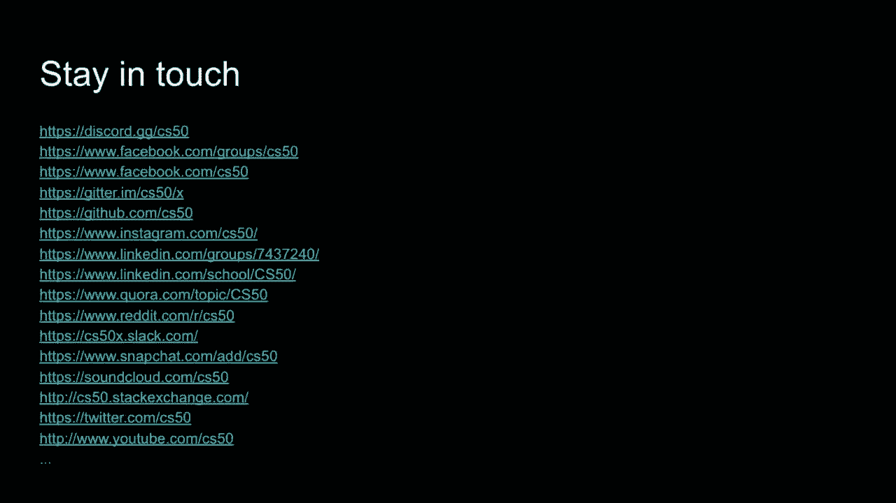

参与不仅是在这些社区中提问，同时也回答他人的问题，所以我们想少说点。现在把事情转向一种最终的，社区活动，感谢过去几周，许多贡献问题的你们。

多亏了布莱恩，我们想把，CS50 小测验秀放在这次最后讲座的结束，由布莱恩的这些，工作人员来主持。这将是一个让每个人都可以按铃，回答我们提前准备的20道题目的机会。时间至关重要，所以你的得分，会更高如果你快速按铃。

快速一些，所以这次不仅要正确，也要迅速，布莱恩，你想在聊天中分享一下大家现在应该去的链接吗？是的，我刚刚分享给大家了，你们都可以点击那个链接。那是你们可以回答这些问题的地方，好的，稍后会有几位其他嘉宾在这里。

我将继续分享我的屏幕，我们将有20个问题，这些问题都来自于cs50的某种形式，网址再次在屏幕上，你可以访问，之后每个问题根据答对或答错的人数，我们会花一点时间解释。

你去了哪里，做对了什么，或者哪里做错了，准备好了吗？好吧，让我们看第一个问题。

将源代码编译成机器代码的步骤是什么？预处理、编译、汇编和测试，或者，开始吧，快速参与，使用布莱恩提供的相同网址，你们每个问题有20秒，现在剩下两个，时间到。

好的，我们来看看结果，看来70个你们说了链接。布莱恩，你能告诉我们这是否正确？是的，这是正确答案，预处理、编译、汇编和链接，所有这些都是在后台进行的，确实是这些步骤。

fair make可以说是所有这些的抽象，因为它启动了整个过程，但我认为更准确地说，回答两个步骤确实是那四件事。好，让我们看看记分牌，我们有很多嘉宾账号，嘉宾编号200在领先，但与其他人并列。

有一千分的你们迅速参与了，所以时间至关重要，下一个问题，运行时间是什么？n。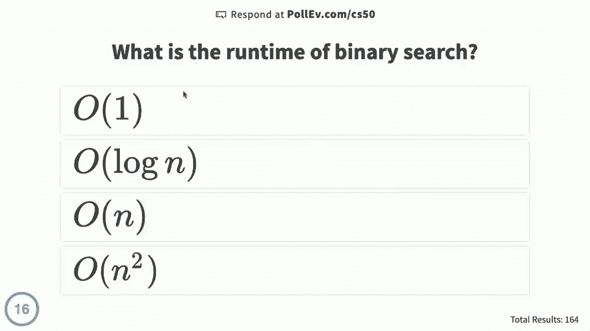

o(n) 或 o(n²)，剩余15秒，二分搜索的运行时间。回想一下，这是我们最早看的算法之一，它最早是与电话簿结合的，即使我们没有称呼它，看起来61%的人说对了，布莱恩，log n是正确答案，如果你。

记住那个电话簿，问题实际上是我们可以把那个电话簿一次次对半分，直到只剩下一页，这变成了log(n)，如果电话簿中有n页。在生活中，任何时候你看到某事在对半分。

很可能在分析中会涉及某个算法，好，下一个。这里的排行榜，猜测200分降了一点，但我们有很多人并列第一。我们现在有2000分，下一个问题，这些动物中哪个是第一个？

在 CS50 讲座中提到，驼鹿、Python、鸭子、猫，驼鹿、Python、鸭子或猫，在 CS50 讲座中最先提到的是哪一个？好吧，一秒钟，让我们看看结果。看起来猫刚好超过了鸭子，得到了51%，布莱恩，猫确实是正确答案，驼鹿出现在第一堂实验课，但他们。

在讲座中未提及，呃，鸭子直到调试时才出现。Python 在讲座结束时被简要提及，但那是在我们自我介绍之后，Scratch 中的主角当然是猫。好吧，我们可能很快会看到一点扩散，我们有。

一大堆人有3000，但名字开始变得不同，让我们继续下一个问题，每次你 `malloc` 内存时，你还必须确保。`reallock` 返回 `free` 或退出，每次你 `malloc` 内存时，你也应该确保。`reallock` 返回 `free` 或退出，大约还有五秒钟，`malloc` 是很多。

学期中出现了分段错误，现在的回答是78，布莱恩，你同意吗？他们都是正确的，每当你动态分配内存时，完成后应该通过调用 `free` 归还给计算机，确实如此。布莱恩，作为一个可教的时刻，为什么我们从未有过 `call free` 的 `get string`，我们现在知道。

在幕后使用类似 `malloc` 的东西来分配内存。所以 `getstring` 是 CS50 库中的一个函数，CS50 的库为你处理内存管理过程，因此你不必担心自己释放所有的内存，确实如此，但每当你调用 `malloc` 时，你必须。

在这里，呼叫 `free` 完全正确，排行榜上看起来我们有来宾，问题是。什么是竞态条件，当条件适合赛车时。两个事情同时发生，产生意外结果。当一行代码执行得太快时，另一行代码也被执行。

太慢了，什么是竞态条件，事情迅速升级，但你会回忆起这发生在上下文中。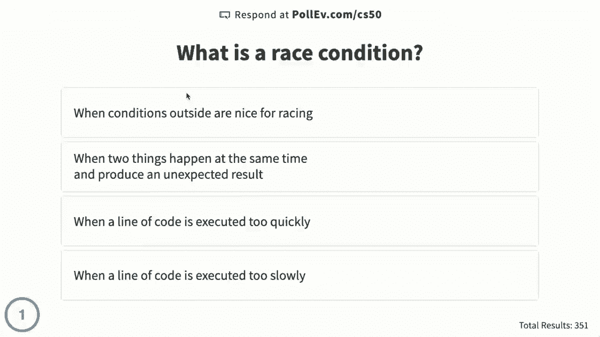

SQL 和数据库 0 秒，让我们看看，85% 的人说当两个事情同时发生时。产生意外结果，布莱恩，这是正确答案。我很感激至少有1%的人说当外面的条件适合赛车，但在计算机科学的上下文中。

至少，当两个事情同时发生并可能产生意外结果时。这就是我们所称的竞态条件，回想一下，这就是布莱恩和我为何冰箱里有太多牛奶，因为我们几乎在同一时间检查了那个变量的状态，好吧。

这里的排行榜，现在我们有一个整体，继续前进。

放大照片能让你增强细节吗？是的，就像在《犯罪现场调查》中一样，不，照片只包含一定量的细节。你有15秒的时间在这两个选择之间做决定，放大照片能让你增强细节吗？我承认我在看你们的时候，他们确实说了“增强”。

好吧，0秒，看起来93%的人说不，照片只包含一定量的细节，7%的人说是的。就像在《犯罪现场调查》中一样，布莱恩，你能帮我们调和这两个选择吗？嗯，这里93%的人是正确的，嗯，照片只包含一定数量的像素，你无法在那之前做到。

公平地说，这有点改变了，或者至少答案是机器学习或人工智能，算法会计算出什么样的细节可以或应该存在，但那实际上只是统计推断，实际上并没有存储在相机或其他设备上。

好吧，排行榜现在在6000分，这些人并列，以下哪个不是一个好的哈希函数的特征：确定性输出、随机性、均匀分布、效率。事情又变得真实了，以下哪个不是一个好的哈希函数的特征，回想一下我们在上下文中使用了哈希函数。

哈希表在谈论数据结构时，好吧，一秒钟，答案这次更分散了，应该是的，这才是正确答案。随机性不是一个好的哈希函数的特征，你希望你的哈希函数在相同输入下总是给出相同的输出。

那样你就可以依赖输出结果，如果是随机的，那将很难使用。确实考虑一个拼写检查器，它随机地说“是”或“不是，这个是个词”，这可能不是你想要的属性。好吧，现在排行榜上我们已经达到7000分，但终于开始看到一些差距。

所以你们中的一些人没有足够快或者正确，下一题。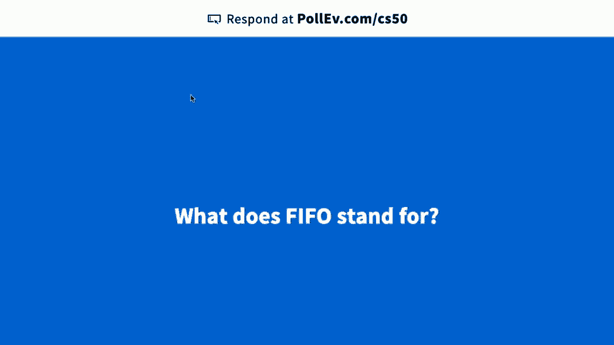

FIFO代表什么？f-i-f-o，得分，先进先出功能输入文件。FIFO代表什么？让我们看看，80%的人说是先进先出，布莱恩，这是正确的，我们用这个来描述像队列这样的东西，队列中的第一个。

所以它确实遵循FIFO顺序，让我们看看排行榜。好吧，我们有一些8000分。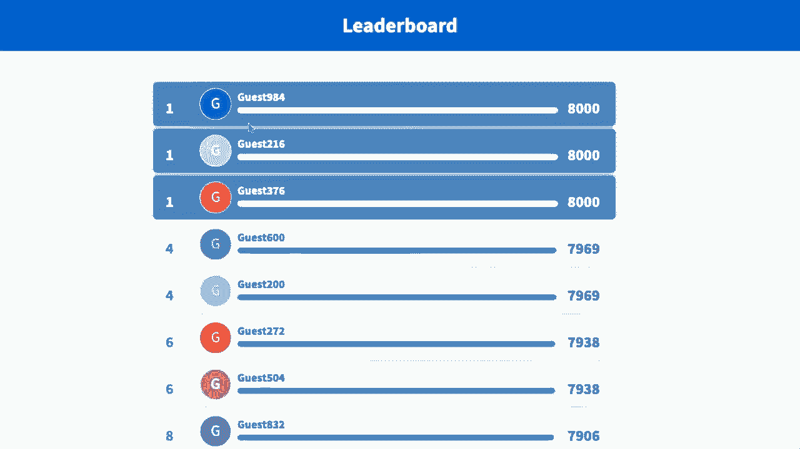

但更接近7000的范围，接下来是一个更丰富的问题，以下哪个会代表。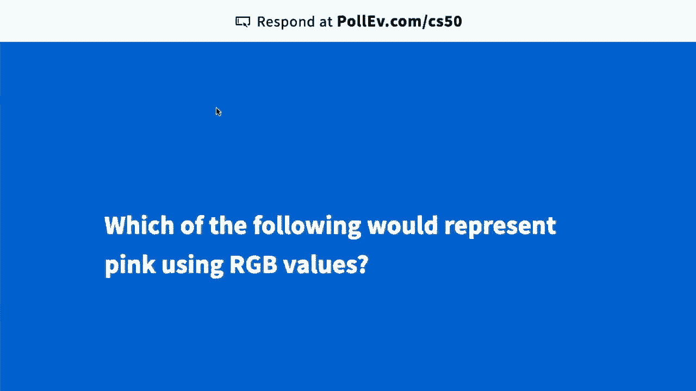

粉色的RGB值，我让你自己阅读这些，当然现在幕后可能正在进行一些谷歌搜索，但没关系，实际上谷歌相当聪明。如果你输入一个十六进制代码，轮子或色板，五秒后，以下哪一项代表粉色？好吧，让我们看看，选择`ffd`。

0e零，布赖恩，这样是正确的，所以这些RGB值是六个不同的值，其中每两个对应一种颜色。两个是红色，两个是绿色，两个是蓝色，这一切都是以十六进制表示的。粉色会是它们的很多，因为它非常接近白色，即所有红色、所有绿色和所有蓝色，但它的红色比绿色和蓝色多。

嗯，那个`ffd0 e0`是很多红色，稍微少一点绿色和蓝色，确实，好吧，让我们看看我们在这里的位置，目前没有人有完美的分数，但猜测200是。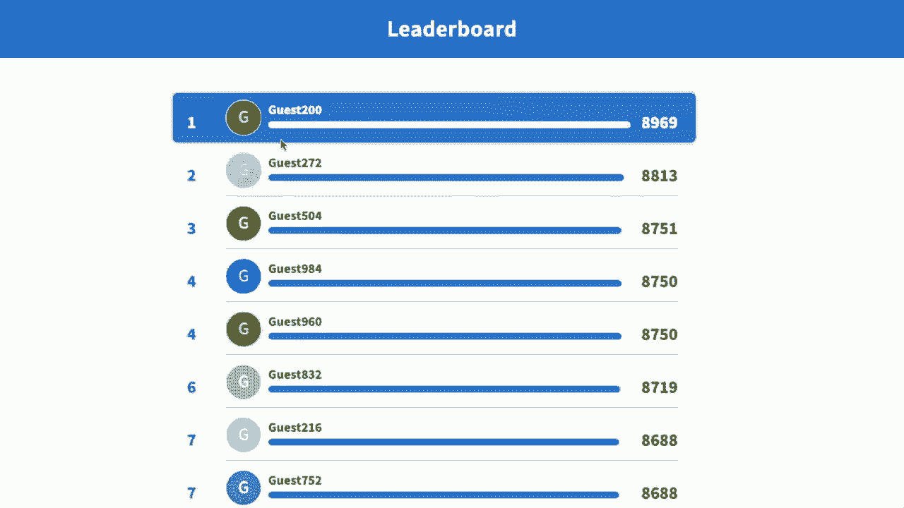

在C语言中，以下哪一行代码？

代码为字符串`s`分配了足够的内存，我让你自己阅读这些。在C语言中，以下哪一行代码为字符串分配了足够的内存？还有大约五秒的时间，这里似乎有很多有效的选择。我们来看看结果，看来46%的人选择了`malloc`的`s`大小，但布赖恩选择了`s+1`的`malloc`，33%。

谁是对的呢？在这种情况下，少数的33%是正确的。记住`malloc`的参数是想要分配的大小。如果你有一个字符串，想要的事情是弄清楚这个字符串中的字符长度，但你确实需要一个字节。

我们有一个空终止字符，且需要一个字节的内存。所以字符串的长度加一，就是你需要的内存字节数。确实在C语言中，你没有什么是免费的，想要什么都需要自己去做，那个加一的部分，是你需要解决的问题。

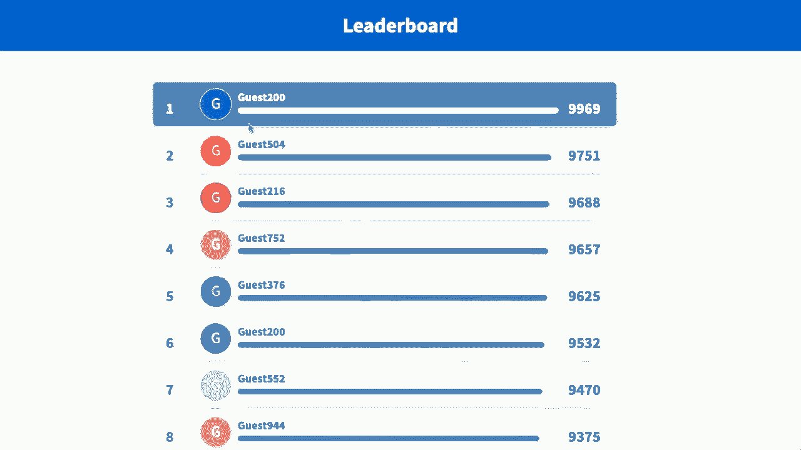

200依然领先，分数接近10000，这是第10题，我们进入第二轮。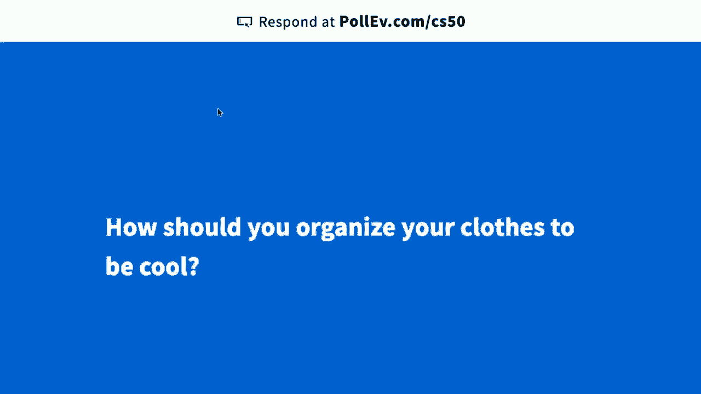

游戏进行到一半，你应该如何组织衣物以显得酷？这是第11个问题，堆栈、队列、字典、二叉树，你应该如何组织衣物以显得酷？是堆栈、队列还是二叉树？还有两秒的时间，结果看起来48%选择了队列，布赖恩，这样是正确的，所以来自杰克和卢的视频。

有不同的方法来组织衣物，但结论是放入一个队列。因此，在你用完一个后，将它放到队列的末尾，然后在回去之前使用其他的。确实，好吧，现在排行榜上，看来猜测10破了10000分，但。

有很多其他人，接下来的问题是什么是段错误。当计算机内存耗尽时，当程序尝试读取一个空文件时，当程序尝试访问它不应该访问的内存时，当发生地震时。这些都可能非常接近，等两秒钟，让我们看看，似乎80%的人说当计算机。

程序尝试访问它不应该访问的内存，布莱恩，这是正确答案。段错误可能发生在你试图触及程序中不应接触的内存时，对于13%的人来说，他们说当计算机内存耗尽时，为什么这不是这里的正确答案。

所以计算机可能会耗尽内存，当你像调用malloc时，malloc可能会返回null，因为没有可用的内存来分配。但只要你检查这一点，我们在你调用内存时尽量鼓励你，检查这个值，避免这些类型的错误。好吧，让我们。

现在看看这个板。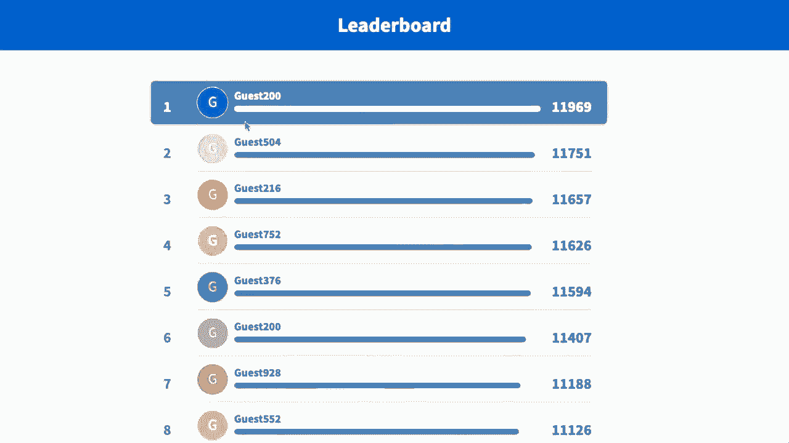

猜测200大约11000的东西，让我们现在继续这个问题，以下哪种类型的。

溢出可能源于递归，如果没有基准案例，堆溢出，整数溢出。栈溢出，缓冲区溢出，以及所有形式的溢出确实都会出现。其中一个当然也是一个流行网站的名字，但这些都是实际存在的东西。那么对于没有基准案例的递归来说，哪个是正确的，两秒钟，好吧，让我们看看结果。

比如61，60选择了栈溢出，布莱恩，这是正确的。每次你调用一个函数时，嗯，你最终会在栈上为那个函数占用一点内存，如果你不断递归调用那个函数而不停下，因为没有基准案例，那么你可能会耗尽栈空间，我们称之为。

确实，好吧，让我们看看排行榜，现在猜测200仍然是这个。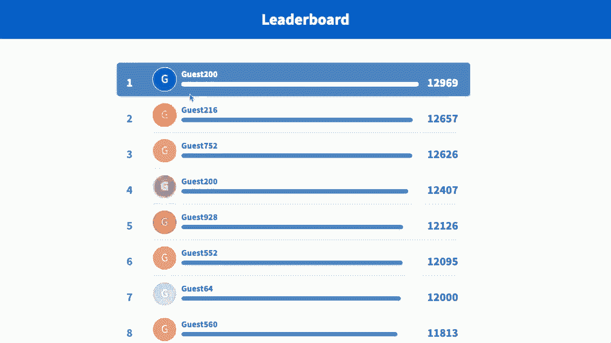

继续，接下来的问题是在五十城。

三个人的名字是什么，他们目击了在五十城发生的橡皮鸭抢劫案。三个人的名字是什么，他们目击了橡皮鸭抢劫案。今年出现了一个新问题，非常有趣，但不必担心，这三个人的名字是，目击了橡皮鸭抢劫案。他消失的时间正好是那周的所有人一起从那个想法中消失。

好吧，让我们看看结果，布莱恩，这个很接近，33 说是露丝、尤金和雷蒙德，露丝。得到的回答比其他任何人都多，这是正确答案，这些名字的背后并没有太多理由。我在故事本身上花了很多心思，但在名字上并没有太多的思考，那些名字有点是随意选择的，但确实是目击者的名字。

现在排行榜上确实有这些名字。

我们仍然有客人200是领先者，这是第15个问题，所以我们走在前面。

这些命令行程序中，哪个检查你的代码是否存在内存泄漏，Valgrind、Clang、Make，哪一个命令行程序检查你的代码是否存在内存泄漏，注意这些都没有50，这意味着这些都是你在自己的Mac或PC或未来会继续看到的真实命令。

Linux系统三秒。

让我们看看结果，我们有Valgrind，一个明显的赢家，得分78。布赖恩，这个答案是正确的，这个程序可以用来检查你的程序是否有内存泄漏，看你是否触碰了不应该触碰的内存，是否忘记释放某些内容。

Valgrind对所有这些都很有用，如果可以的话，我觉得你们中的五分之一，但我们将拭目以待。好了，最后五个问题，现在开始。

以下内容在C语言中存在，但在Python布尔表达式中不适用，`do while`循环、递归函数和浮点数，哪一个在C语言中存在，但在Python中不适用，一切都好。68，正确，呃，Python有四种循环，Python有`while`循环，但它没有以C语言相同的方式有`do while`循环，你必须找到其他方法来实现。

这种逻辑思维确实存在，布赖恩，几周前我们讨论的是什么方法。是的，一种方法是有一个`always`重复，然后当你到达一个可以退出循环的点时，可以使用`break`命令跳出循环，继续程序的其他部分，确实，一切都好，我们来看看。

板上的猜测仍然是200，现在是15。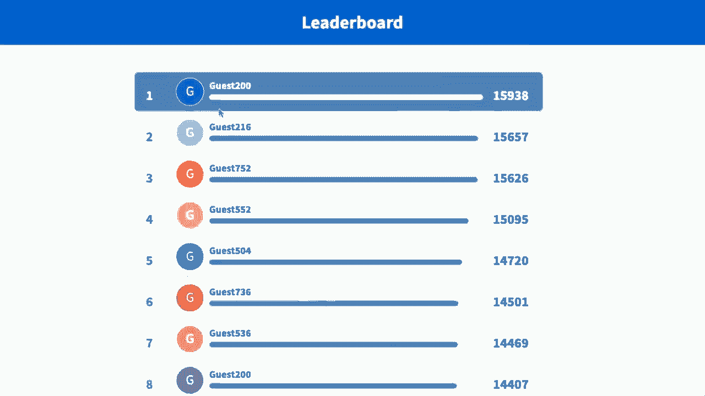

938，但还有几个紧随其后的朋友。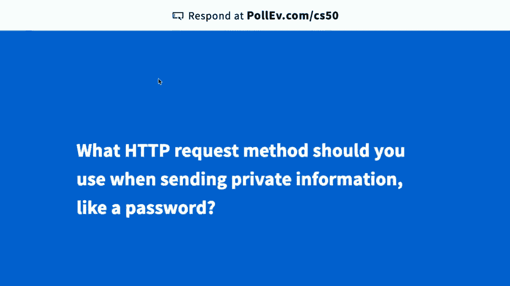

当发送私人信息时，应该使用什么HTTP请求方法，例如密码，是GET、POST、SELECT还是TEXT？发送时你应该使用什么HTTP请求方法？看看结果，好的，分布情况是很多人说POST，布赖恩74，他们是正确的，如果是GET请求，你最终会得到敏感信息。

在URL中，可能会出现在你的浏览历史中。例如，因此为了安全，你要确保使用POST请求方法来处理这类事情，明确一点，不要这样做，GET也是可能的，我们看到过如何做到这一点，但当然这最终会出现在你的历史记录中。

暴露的地方选择和文本不是HTTP动词，因此POST确实是正确的，只有三个问题仍然存在。

客人200仍然是领先者，紧随其后的是客人216，哪种数据结构允许常数时间复杂度？

单词查找的时间，搜索树，字典是一种抽象数据类型，因为你可以以不同的方式实现它，但要获得常数时间查找，你可能想使用这些中的一个，而不是其他的。几秒钟后，让我们看看结果，布莱恩，有趣的是，32人说树结构，能帮我们一下吗？是的，树结构是所有选项中的正确答案。

其他的有链表、二叉搜索树和数组。随着字典中单词的增多，线性搜索所需的时间会更长，或者你需要通过二叉搜索树的各种节点来查找。另一方面，树结构查找不受单词数量的影响。

字典中，你只需跟随每个字母的一个节点，就能找到你查找的单词。布莱恩，如果常数时间，O(1)，这么好，为什么不把树结构用于一切呢？嗯，任何事情都有权衡，时间也是如此。但是一个主要的权衡是内存，树结构最终会使用更多的内存来存储。

相比于其他许多数据结构，我猜200。仍然在领先，但猜752现在也在领先。！

紧随其后，我们还有两个最终问题，速度再次重要。！

饼干是什么？用于识别你的计算机与网站的数据。一种美味的小吃，上述两个选项都是，这可真是个难题，布莱恩，特别是如果只有一个正确答案的话。我们可能会看到更多的分歧，给你五秒钟时间做出选择，这些中哪个是饼干？好吧，让我们看看结果。

用于识别你的计算机与网站的数据为六十百分比，上述的为三十五百分比，仅有两百分之的你喜欢单独的饼干，布莱恩。呃，上述的两个选项是正确答案，我要提醒大家，这些问题最初都是由学生撰写的，答案选项也是。

学生选择的正确答案是上述两个选项。好吧，现在仍然在领先，但底部有些波动，这是CS50课程的最后一个问题。你现在的舒适度如何？答案都在了，让我们看看分布，似乎43人说你们在字典中比那些其他数据结构更舒服。

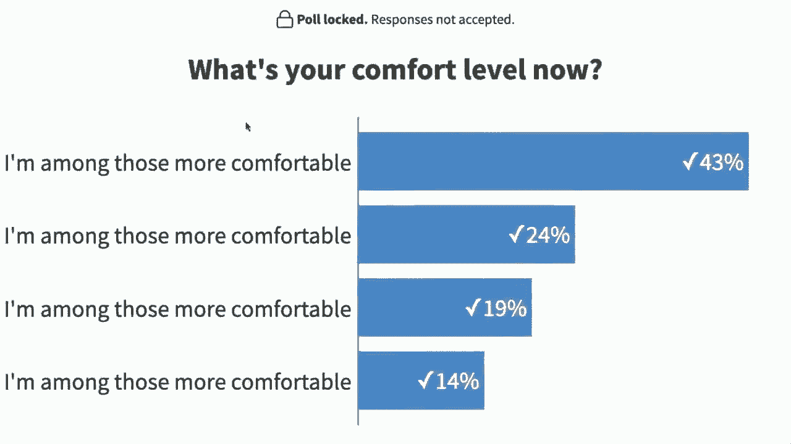

你们当中有24人选择了第二个选项，非常底部的19人，但重点是，你们现在确实被正式纳入了。更加舒适的环境，感谢你们加入我们CS50课程，我们迫不及待想看到你们的最终项目。

