# 哈佛CS50-CS ｜ 计算机科学导论(2020·完整版) - P21：人工智能（决策树、广度深度优先搜索、A＊搜索、强化学习、遗传算法、神经网络） - ShowMeAI - BV1Hh411W7Up

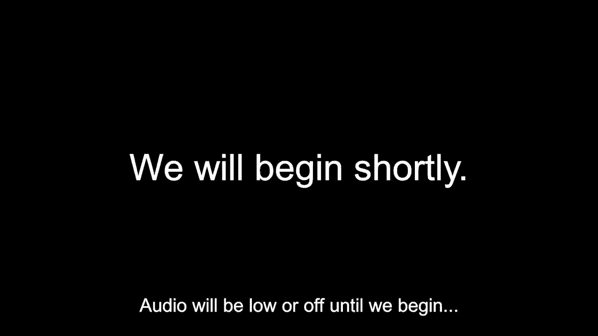

这是哈佛大学的CS50，介绍智力活动。

计算机科学在这里。计算机科学今天我们与C s一起。这个星期很特别。我们来看看人工智能或AI。你可能还记得几周前，当我们首次介绍Python时，我们谈到了编写程序，当你说hello时程序会回应hello，当你说goodbye时程序会回应goodbye。但这些程序都是通过。

如果条件和else ifs和else，实际上这并不是真正的人工智能。如果你想和这样一个计算机程序进行整个对话，那将需要大量的if和else if，以预测人类可能说的所有内容，因此我们可以做得更好。人类在人工智能领域已经做得更好。

我非常高兴地说，布赖恩在这里引导我们。现在CS50的布赖恩，非常感谢你。欢迎大家来到CS50。正如大卫所提到的，讨论的主题是人工智能，这一切都是关于让我们的计算机尝试变得智能，试图让它们以某种理性的方式行动。

这可能有许多不同的形式。人工智能的一个例子可能是游戏。你可能熟悉井字棋游戏，你有一个三乘三的网格，X和O轮流尝试排成三行。X先下在这个网格的中间格，然后轮到O。

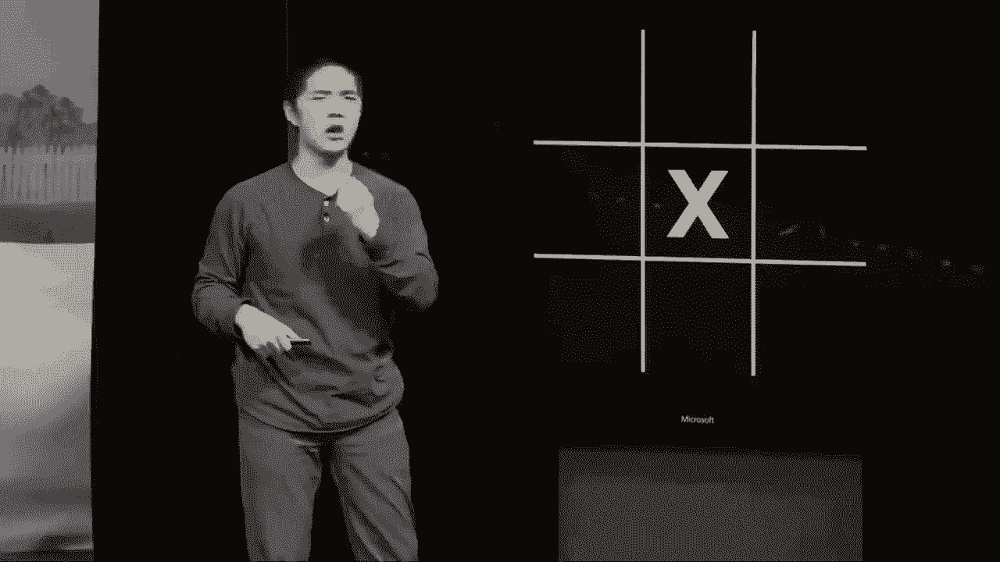

下在上面。事实证明，此时在游戏中，X有一个非常有策略的举动，而一个非常擅长这个游戏的人或计算机，可能会尝试找出如何玩这个游戏，可能会做出一个聪明的举动，比如在右上角下棋。

如果X在右上角下棋，那么O就需要在左下角下棋，以阻止X得到三个一行。在这里，你也许可以看到X的一些可能的好棋。但X也可以选择在右边的格子中下棋。

始终处于微妙的境地。X有一种方式可以在水平上赢得比赛，还有一种方式可以在垂直上赢得比赛，因此必须阻止其中一种方式。也许他们选择阻止水平的方式。但无论如何，X会赢，只需在右下角下棋。因此，人类在玩这个游戏时可以推理对手可能会如何。

响应的方式，以及X会如何回应。计算机也可能试图在游戏中做同样的事情，比如一个简单的井字棋，或是更复杂的游戏。但人工智能不仅仅局限于游戏。你可能会看到类似于手写识别的例子，如今计算机在处理人类手写文本方面相当不错。

这个过程因人而异，并以相当高的准确率判断人类实际上写了什么字符。人工智能应用于垃圾邮件检测。也许在你的电子邮件收件箱中，垃圾邮件通常会被分类到一个单独的文件夹中，而你的收件箱中可能会涌入一大堆邮件。

不知何故，你的计算机能够相对准确地判断哪些邮件是好的，哪些邮件是垃圾邮件。计算机并不是在这方面完美无缺。有误报的情况，计算机会认为某封邮件可能是垃圾邮件，而实际上并不是。而且还有漏报的情况，垃圾邮件可能意外地出现在你的收件箱中。

计算机无法捕捉到这一点。但这种误报和漏报正是人工智能研究者努力减少的问题，以使这些系统越来越准确。你会在这种系统中看到类似的表现。如果你曾在像YouTube或Netflix这样的视频观看网站上看过许多视频、电视节目或电影。

Netflix或YouTube背后的软件能够给你推荐，建议你可能感兴趣的其他视频，基于你已经观看的内容。近年来，人工智能在更复杂的事情上也变得相当出色。例如生成数据。看看这两张人的图片，看看你是否注意到什么奇怪的地方。

看看这两个人中是否有哪个看起来很奇怪。你能分辨出这两张图片中哪一张不是一个真实的人吗？

一个计算机生成的人物，看起来像人类。但这实际上不是一个真实人物的照片。你可以仔细观察这两张图片。也许看看眼睛、头发、嘴巴和鼻子，看看你能否分辨出哪一个是人。结果发现这两张图片都不是现实中的人。它们都是计算机生成的。

而不是现实中的人。但计算机已经被训练生成看起来像真实人物的图像。它可能会让人误以为这是一个真实的人，但这完全是人工智能生成的信息。因此，今天我们将探讨所有这些概念，了解人工智能是如何运作的。最终，一个重要的收获是，人工智能不仅仅是一个算法或一个。

这实际上是一系列方法的集合，都是用于尝试解决一些让计算机智能化的问题。因此，让我们从我们可能想要进入的第一个领域开始，那就是决策制定。我们经常想训练计算机能够做出决策。

这个决策可能是在判断一封邮件是垃圾邮件还是非垃圾邮件，或决定是否向你推荐一个视频。或者它可能是在游戏中决定采取什么行动。所以我们来玩一个简单的游戏。也许你之前玩过这样的游戏，控制这个位于底部的球拍，并试图反弹这个球，以击中所有的。

上方的砖块。想象一下，如果你试图编程让计算机能够战略性地玩这个游戏。计算机观察到球朝那个方向移动，那么球就朝那个方向移动。你应该编程让计算机做什么？逻辑上讲，如果球向左移动，那么你应该编程让计算机也向左移动球拍。

尝试在球掉到地面之前捕捉到那个球。因此，你可以将这种逻辑编码成一个计算机程序，使用我们可能称之为决策树的决策。决策树只是一种表示计算机可能通过提问来做出决策的方式。根据这些问题的答案，我们可能会问另一个问题或做出某种决策。

所以在这个球拍游戏中，我们可以通过问这样一个问题来创建一个决策树：球在球拍的左侧吗？如果这个问题的答案是肯定的，那么我们应该采取的行动是将球拍向左移动，因为球正在向左移动。球拍也应该向左移动。如果问题的答案是否定的。

那么我们也许需要再问一个问题。我们可以问：“球在球拍的右侧吗？”

如果这个问题的答案是“是”，那么我们就将球拍向右移动。如果答案是否定的，那就意味着球不在球拍的左侧，也不在右侧，因此在这种情况下我们根本不需要移动球拍。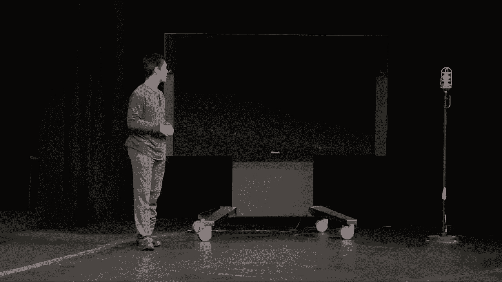

再次提到的决策树可以让我们就我们的人工智能做出这些选择。

在这种情况下应该怎么做。我们可以将这个决策树转化为一种伪代码。它看起来可能像是在C或Python中编写的东西，而游戏仍在进行中。如果球在球拍的左侧。

请继续将面板向左移动。如果球在球拍的右侧，请将球拍向右移动。如果这两者都不成立，那么就不要移动球拍。所以这个决策树的一个优点是它能够很好地与您在编程世界中熟悉的条件相对应。

所以让我们试着做一些更复杂的事情。我们来看看井字游戏，想象一下你正在尝试编程一个人工智能，以战略性地玩这个井字游戏。在你的决策树中，你可能会问什么问题？是的或不是的问题。但你想要提出问题，以创建一个能很好地玩这个游戏的人工智能。

能够战略性地玩这个游戏，或许我会请一位志愿者。如果有人想建议一个可能的问题，我可能会问我的人工智能，因为我正在教这个人工智能如何玩这个游戏。在这种情况下，我可以问什么问题？让我们看看，嗯，给定某种情绪，获胜的概率是多少？

你如何检测获胜的含义，比如你会在棋盘上寻找什么？

三个连续的。多余的圈。你在寻找三个连续的叉或圈的机会。你可能会问，检查一下是否能够在下一个回合连成三行。如果你已经有两个连在一起，并且有一个空位。这可能是我们想尝试的机会。

我们可能想问的其他问题是我们战略决策的一部分。如果我们想玩这个井字游戏，是否有其他方面的想法？我们可以尝试寻找其他我们应该关注的事情。在我们训练的过程中，我们在问问题。我们的人工智能正在尝试被编程以战略性地玩这个游戏。

你也可以在聊天中评论。如果你想到了我们可能想要做的事情或采取的方式。让我们去圣地亚哥。如果有任何可能性让对手赢，那么你可能想检查一下对手是否有获胜的机会。如果他们有获胜的机会，那么这些都是你可以问的好问题。

我们可以开始为井字游戏制定一个决策树。基于这些问题。我可能会先问，"我这轮能否连成三行？"如果答案是“是”，那么我的行动就非常明确。我应该在能让我连成三行的方格下棋。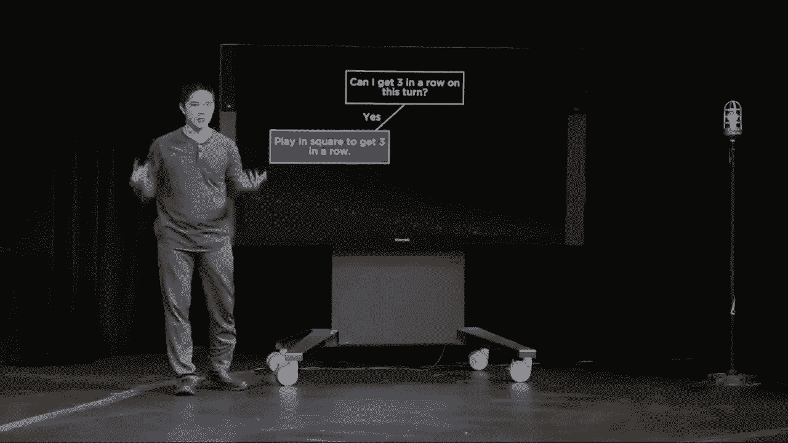

如果问题的答案是否定的。那么我可能会问圣地亚哥的问题。我的对手能在下一个回合连成三行吗？如果答案是“是”，那么我们最好在一个方格中下棋，以阻止他们连成三行。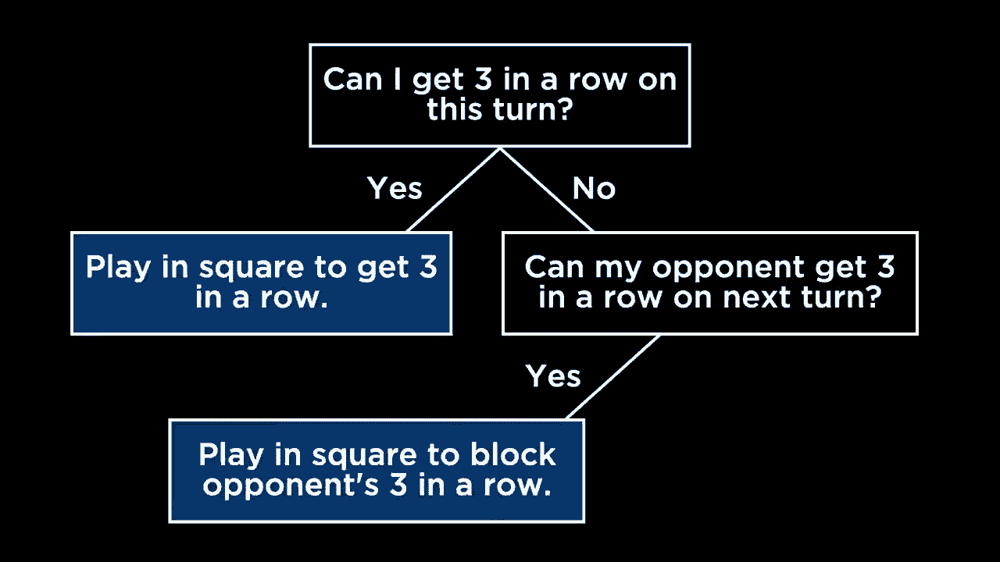

如果我们不阻止他们，他们就会赢得比赛。如果这个问题的答案是否定的。如果我不能在这一轮得到三个连成一排，而我的对手在下一轮也不能得到三个连成一排。现在就有点不那么明确。你或许可以尝试提出额外的问题。但这两个问题很明确，其余的可能就不那么明显。

但最终，我们不希望做这些，因为我们开始让我们的AI变得越来越智能。正如大卫之前提到的，我们不想为计算机编程每一种条件，告诉它在每种情况下该做什么。我们希望计算机能够聪明到自己分析所有可能性，并找出该采取的行动。

我们希望计算机在游戏中做出**最佳的决定**。我们可以介绍我们在人工智能中的第一个算法，今天要讲的算法叫做**Mini Max**。Imax是一个游戏算法，适用于两个竞争对手的情况。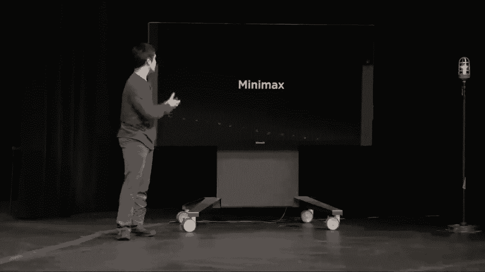

这些人试图玩某种竞争游戏，比如**井字棋**。但它也适用于其他游戏。正如我们在CS 50中看到的，我们需要某种方式在计算机中表示这个游戏。最终，你会记得从CS 50的开始，我们一直在尝试用数字表示一切，我们也可以用同样的方法。

对于我们的AI来说，只有三种可能的游戏结果值得关注。要么O获胜，要么X获胜并形成三个连成一排。也有可能双方都不赢，比赛以平局结束。因此，我们将对这三种可能的结果赋予一个数字。

对于每一种结果，我们可以说，X获胜的结果记为-1。平局记为0。没有人赢得比赛，现在每个玩家都有一个目标，某种可以用这些数字量化的目标。

最大化玩家，或者我们也可以称之为**Max Player**，目标是最大化得分。对X来说，最佳得分为1，意味着X将赢得比赛。但如果X不能获胜，那么平局得分为0，这比输掉比赛要好。我们将称最小化玩家为**Min Player**。他们的目标是最小化得分。

-1是对O玩家来说最佳的结果。但如果-1无法实现，如果O不能获胜，那么平局仍然比X获胜要好。因为X获胜意味着最小化玩家O最终将输掉比赛，因此我们可以考虑每个局面。

井字棋的分数要么是 1，要么是 0，要么是 -1。这场比赛已经结束。X 已经赢得了比赛，因而我们会将其赋值为 1，表示 X 胜利，-1 表示 O 胜利，0 表示平局。那么现在让我们考虑这个棋盘。这场比赛尚未结束。

但我们仍然可以给它分配一个分数。假设现在是 X 的回合。你会给这个棋盘什么分数？当我们为每个棋盘给分时，我们在考虑如果两个玩家都在最佳状态下会发生什么。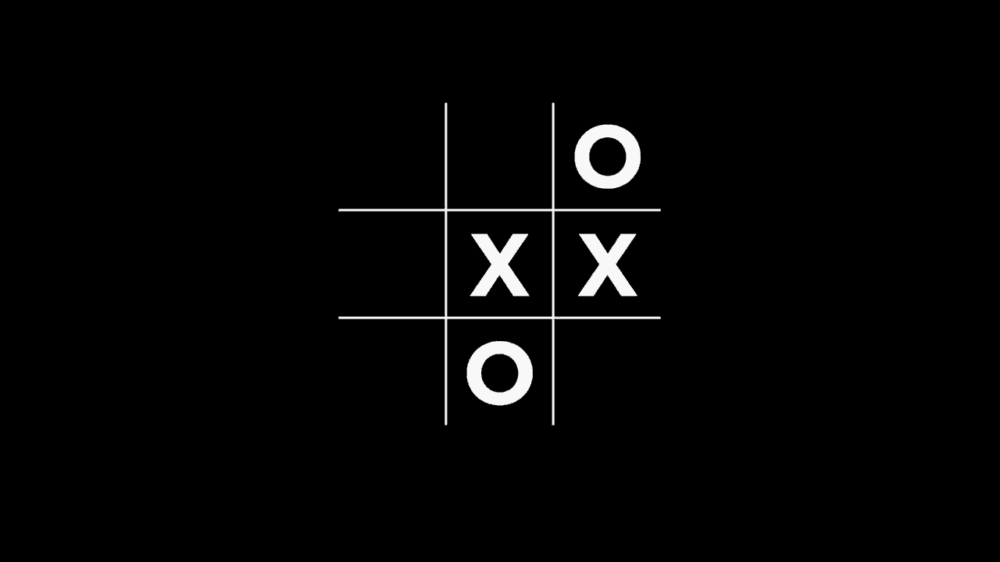

如果两个玩家都在玩最佳的棋步，在这种情况下如果 X 玩得最好，那么 X 将在这个方格下棋以得到三个连成一排。因此这个棋盘的价值也为一，因为 X 的游戏表现。X 将赢得价值为一的比赛。那么让我们看看另一个棋盘。

也许这个棋盘稍微复杂一些。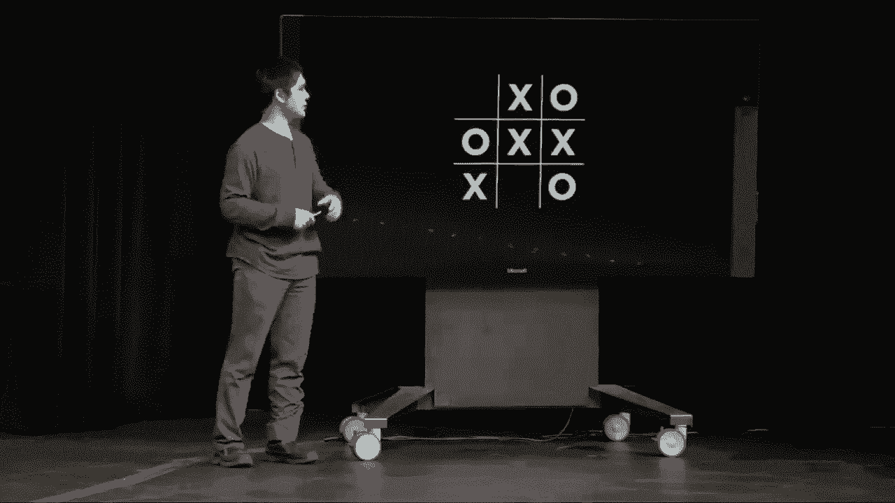

假设现在是 O 的回合。然后因为有一个空格，X 会在之后进行移动。你会给这个棋盘什么价值？也许我们可以找一个志愿者。

可能性有三种。如果 X 将会获胜，负一总是会获胜，零则表示平局。如果两个玩家都玩得最好，而现在是 O 的回合。你会给这个棋盘什么价值，为什么？

让我们看看 Santiago。我认为这个棋盘的价值为零，因为两个玩家都在尽力而为。最终没有人会赢，因为 O 会挡住 X，之后就不会有任何进展，确实。完全正确。X 有可能获胜，因为 X 已经有两个连成一排。他们可以得到三个连成一排。但如果两个玩家都玩得最好。

然后 O 将在这里挡住，接着 X 将在左上角下棋。最后将会平局，这意味着这个棋盘的价值将是零。计算机可能会通过与我们一样的推理方式来计算这个值，考虑这两个可能的选项。如果我想知道这个棋盘的价值，现在是 O 的回合。

然后我会考虑这两个可能的选项。O 有两个选择。可以在左上角下棋。或者可以在底部挡住 X。计算机会考虑这两个可能的选择，并尝试弄清楚每个棋盘的价值。那么如果在左上角下棋会发生什么？

然后 X 将在底部出场，X 将赢得比赛 X。赢得的比赛价值为一。这意味着这个棋盘的价值也将是 X 赢得的价值为一。

那么让我们考虑其他可能的选择。也可以通过在底部下棋来阻挡X，而在这种情况下，这将导致左上角的解释。这是唯一的其他可能选项。那个棋盘的值为零，这意味着这个棋盘的值也为零。现在，最小化的玩家将考虑这两个选项。

如果我在左上角下，那将是一个对我不利的值为一。如果我在底部下，那将是一个值为零。因此，这样更好。我们可以得出结论，桑蒂亚哥上面的这个棋盘的值也将是零。如果双方都下出最佳走法，最终结果将是平局。

这就是我们可能称之为游戏树的东西，你正在探索所有可能的分支，所有可能的游戏走向。我们距离游戏结束还有两步。但是你可以退一步，考虑一下这会是什么样子？

距离游戏结束还有三步，你会得到一个更大的树，因为现在你需要探索。可能性是你试图弄清楚任何特定棋盘的值。因此，这就是最小最大算法的工作方式。考虑所有可能的走法，然后递归。

考虑一下如果我下出最佳走法，我的对手会如何回应？

那我可以如何对此做出回应？我们可以将其表述为一小段伪代码，假设玩家是X。

对于所有可能的走法，让我们像之前那样递归地为这个棋盘计算一个分数。跟随所有可能的走法，为这个棋盘得到一个分数，然后选择分数最高的走法。如果玩家是O，那么我们将对所有可能的走法做同样的事情，为那个棋盘计算一个分数。但随后我们将选择分数最低的走法。

所以X玩家选择最大化分数的走法。O玩家选择最小化分数的走法。使用这种方法，你可以创建一个能够完美玩井字游戏的AI。如果你正确编程，它将永远不会输掉比赛。

这不仅适用于井字游戏，还适用于其他游戏。但是你是否看到这种方法有什么问题？这种考虑我所有可能走法的方法，然后是我对手对那些走法的可能回应，最后是我对那些走法的所有可能回应。直到我们到达游戏的结束，有没有可能出现的问题？

也许你可以花很长时间，像是探索所有的分支，实际上得出一个结论。探索所有这些可能的走法所需的时间可能会相当长，这取决于游戏的复杂性，比如井字游戏。也许想想有多少种可能的井字游戏。结果大约有255种。

井字棋有大约三十万种可能的游戏，看起来很多，但计算机处理起来相当迅速。大多数现代计算机通常能在几秒钟内完成这255,000种井字棋的对局。但如果想象一下国际象棋，这是一种相对复杂的游戏，那么有多少可能的国际象棋对局呢？如果有255。

井字棋有三十万种可能的对局，那么国际象棋有多少种可能的对局呢？

结果发现，仅前四步就有2880亿种可能的国际象棋对局。这对于任何计算机来说都是一项巨大的挑战。这仅仅是前四步，如果考虑整个国际象棋游戏的话。

没有人确切知道答案，但人们估计10的29000次方可能是可能国际象棋对局的下限。实际数字可能更高。对于任何计算机来说，这个数字太多了，无法在任何时间内合理处理。我们无法考虑所有可能的走法，一直到游戏结束。

为了找出任何棋盘的得分。正因为如此，像国际象棋这样的游戏对于人工智能来说比井字棋要难得多。但这并不是不可能的。目前，最好的计算机国际象棋选手远远优于最好的人类棋手。那么我们可以做些什么呢？我们可以做哪些改进？

或者我们可以对算法做出什么改变，使我们的AI仍然能够玩这样的游戏？即使有很多额外的可能走法，仍然有很多可能的答案。有人想提出一个想法或建议吗？我们如何应对这个问题？

有太多的走法需要考虑，计算机永远无法合理尝试任何方法。你有什么想法可以尝试的呢？也许沿途可以为一些低于某个阈值的走法分配一些点值？也许我们可以丢弃那些路径。我们希望有一种更智能的方式来避免探索所有路径。

丢弃一些路径或者不丢弃，或者在某个地方停止，以便我们不考虑所有10的29000次方的可能国际象棋对局，而是考虑更少的对局。探索更少的可能游戏和更少的可能层级，嗯，因此在最小最大算法上有很多变体。

最常见的算法之一是所谓的深度限制的最小最大算法。我们考虑一种评估函数，而不是一直跟随游戏直到最后。我们跟随游戏某个数量的走法，可能是15、16步，但并不是一直到游戏结束。

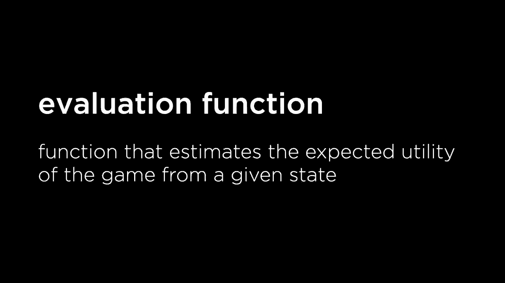

然后你只是问一个问题，比如，在游戏的这个节点，谁看起来更有可能获胜，即使我们不会完全计算。你可以通过统计每一方的棋子数量及其价值来做出一些判断，并可能会为不同的游戏想出其他策略。

但这正是我们需要开始的地方。更智能的做法是思考如何制定一个好的评估函数，能够处理复杂的游戏并估计谁可能会胜出。**Minimax**是一个可以用于玩游戏的算法例子。我在这里暂停，看看关于Minimax或游戏玩法的任何问题。

在我们转向完全不同类型的人工智能之前，有什么问题吗？聊天中有没有问题？我只是想问一下，这个算法是类似于我们思考游戏的方式。但有没有其他算法，不一定是逐步评估的？

还有其他算法和其他方法。我们给出的例子实际上只是一个穷举搜索的例子，搜索所有可能的移动，然后做出判断。我们稍后会看到一些更智能的算法，能够学习的算法。

我们将查看其他一些可能性，以及我们如何应用它们。这实际上是我们可能称之为搜索算法的一个例子。搜索算法是一种算法，我们在寻找某种解决方案。它可能是在寻找在游戏中该做的最佳移动。

或者你可能会想象一个搜索问题，或者抽象地说是找到你在迷宫中走的路径。你需要从迷宫中的一个点到另一个点，并且必须决定转哪个方向和如何走。这种应用可能类似于驾驶指引。如果你使用谷歌地图。

你输入你所在的位置和目的地，谷歌地图很快就能提供一个相当**最佳**的路线，告诉你该转哪个方向以及何时转弯。这是一个搜索问题的例子。谷歌地图需要以某种方式搜索所有可能的路线，以找出如何到达你要去的地方。

因此，我们可以想出一个算法来解决这个问题。想象一下，我们有一个迷宫，我们试图从A点到B点。但这里有一些墙，这些灰色的方块或墙是我们无法穿越的。我们仍然想找到一条从A点到B点的路径。

你可以尝试一些算法，如果你在解决这个迷宫，你会考虑如何决定做出哪个决定，去左边还是右边？

但就计算机而言，我们需要给它一个非常精确的算法。

我们可能想到的最简单的算法之一就是深度优先搜索。深度优先搜索的导航方式很简单：AI会沿着一条路径前进。如果AI需要做出选择，它会到达一个分岔口，可以选择向左或向右。

它只是随机选择一个。它不知道哪个更好。因此它会选择一条路径并尝试。如果它遇到死胡同，无法继续前进，我们的AI就会退回来，尝试另一条路径。

我们从A点开始。我们想要到达B点。我们的AI可能的工作方式是，我们可能开始时只是一个一个地跟随方格。我们在这方面没有太多选择。我们还没有到达任何分叉点或路口。但在这一点上。

我们可以向左走，也可以向右走。就深度优先搜索（Depth First Search）而言，它不知道该走哪条路。它不知道是向左还是向右。所以我们随机选择一条路径。我们可能选择向左走。我们会继续沿着这条路径，直到到达另一个分岔口。

我们可以向左或向右。深度优先搜索不知道该选择哪条。所以我们将随机选择。现在我们遇到死胡同，我们的算法知道这不是一条好的路径。因此，它会退回到最新的决策点，并做出不同的选择。它会退回到这里，表示我尝试过向左，但没有成功。

让我们尝试向右走，这条路不是一条好的路径。因此，不是走左边，让我们尝试向右走。我们将尝试这条路径。也许我们尝试向上走，但遇到死胡同。所以我们会再尝试向右走。我们会做出一些选择。我们会不断遇到死胡同并尝试新路径，直到最终到达目的地。

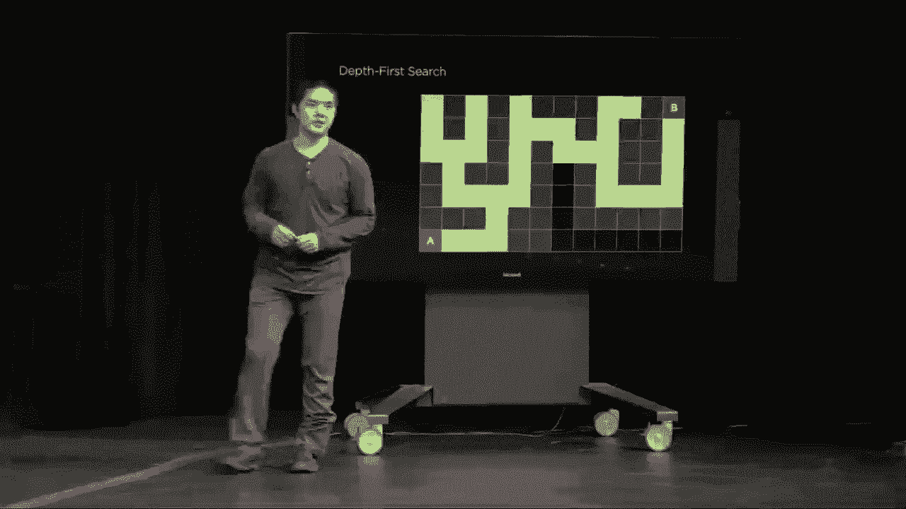

这就是深度优先搜索。只要有有限数量的方格，这个算法最终会找到到达目的地的路径。如果这样的路径存在。如果从A点到B点有一条路，那么这个算法最终会找到它，因为它尝试了一些东西。我们不断这样做，直到最终找到目的地。

但这个算法并不理想。显然有一些问题，也许还有改进的空间。所以也许我会问问你们。你们觉得这个方法有什么问题？

也许这个算法可能不是理想的原因，可能是我们可以改进的地方。目前来看，这个算法非常耗时，耗时的方式有很多。我们探索了很多实际上没有任何意义的路径。

我们探索了所有这些区域，但最终并没有帮助我们找到目标。而且，在最终找到的路径上，这也很耗时。就像想象使用谷歌地图，从一个地方导航到另一个地方。你可能希望找到一条高效的路线。

就像是从你所在的位置到你想去的地方的最快方式。如果谷歌地图给你一条漫长而曲折的路线，有很多绕路，虽然最终到达目的地，但耗时却比必要的时间长。这可能不是最佳的用户体验。而深度优先搜索。

可能会遇到这样的情况。想象一下，从A点出发，我们可以向上走或向右走。我们不知道该选择哪条路，因此使用深度优先搜索。第一次搜索会随机选择。我们可能选择向上走。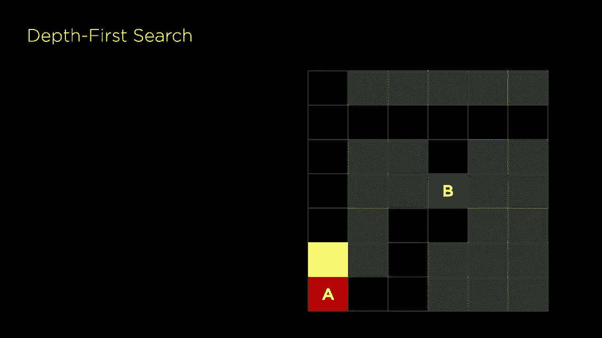

或许我们会选择向右走，并找到通往目的地的道路。深度优先搜索能够为我们找到从A到B的路径。但请记住，我们通常想要做的是做出最佳决策。这是一条从A到B的正确路径，但并不是最佳路径。

如果我们在寻找从A到B的最短路径，那将是从A到B的这条路径，因此我们希望找到某种方法来解决这个问题。我们希望有一个算法，能够找到最短路径，而不仅仅是找到任何路径。为此，我们可以使用一种称为广度优先搜索的算法，也称为B。

这个算法的工作方式是，当我们到达岔路口时。

选择一条路径直到碰到死胡同，然后选择另一条。广度优先搜索会在遇到岔路口时，选择两条路径。我们先走左边一步，然后右边一步，再走左边一步，再走右边一步，有效地从中间向外搜索。

我们将从头开始，寻找所有可以通过从A点出发一步、两步、三步等到达的地方。因此，我们总是先查看附近的事物，然后再查看更远的事物。所以，这样的操作可能是，从A点出发向上走一步，然后进行搜索。

然后我们将查看这个方向的第二个方块，然后查看右侧路径上的第二个方块，再然后是第三个方块。我们将有效地重复这个过程，在所有不同的选项之间交替，直到最终找到从A到B的最佳路径。因为我们在寻找较短的路径之前，首先会考虑那些较长的路径。

最终我们会找到最短的路径，但这仍然存在问题。

正如Joy所指出的，这些算法往往不必要地探索许多路径。我们回到最初的迷宫，考虑广度优先搜索会做什么？

如果我展示这个迷宫，会考虑可能发生的情况。我们可能会一直走到这个决策点。

我们可以向左或向右，并记住深度。首先搜索选择一个方向并一直跟随直到死胡同。而广度优先搜索将选择两个方向。它将先向左再向右，然后再向左再向右，基本上在所有这些之间交替，直到我们到达另一个决策点，然后它会考虑所有这些。

我们可以在这里向左或向右，考虑这些可能性，并将继续探索。每当我们到达任何决策点时。

它会反复探索这个方向和那个方向。如果我们重复这个过程并考虑广度优先搜索的目标，它将找到我从A到B的最短路径，并且在这种情况下，唯一的可能路径。但这花了很长时间才能做到。

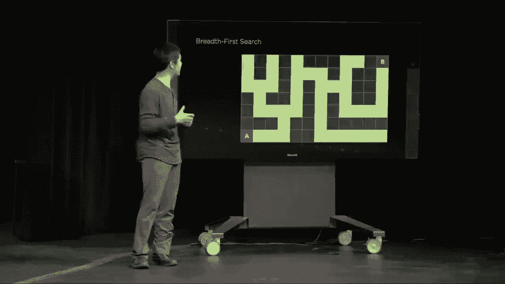

它考虑了许多不同的方块。它查看所有方块，以便做出简单的决策，比如找到最短的路径，从一个点到另一个点。因此，我们可以尝试变得更加智能。理想情况下，我们希望在到达第一个决策点时选择向左或向右。大多数人，如果你给他们这个迷宫并告诉他们在这个决策点尝试解决。

你不会随机选择，而是会选择向右走，因为目标在右边。因此，如果我们试图找到方向，可能应该朝那个方向前进。

到达迷宫的尽头。因此，到目前为止我们讨论的算法，深度优先搜索和广度优先搜索，是我们可以称之为无信息搜索的例子。它们并没有利用任何关于问题的专业知识。它们对这个迷宫并不了解。

他们基本上是在盲目猜测，希望最终能到达目标。但在一个I中，我们可以通过使用知情搜索来改进这一点，知情搜索。利用我们对问题的了解来改进搜索方式，使我们能更有效地搜索。 

所谓启发式，是估计某个特定状态有多好的方法。在这个迷宫中，如果我想从A到B，启发式会让我回答这样的问题：如果我看到点C在这里，点D在那边。我更想处于哪个点，哪个点更适合找到到达目的地的路径。在C和D之间进行深入研究时，他们没有哪个更好的知识。就它们而言，每个方格只是一个方格。但如果你把它当作一个迷宫，大多数人会直观地告诉你。

即使我不知道如何准确到达目的地。

如果我可以选择C或D，我可能会选择D，因为它看起来离目标更近。因此，我们可以使用的启发式通常称为曼哈顿距离。任何两个方格之间的曼哈顿距离实际上是说，忽略墙壁，忽略所有边界。只考虑在这种情况下向上和向右走了多少格。

我必须从我所在的位置到达目的地需要做什么。

我们会先向上走这么多格，然后再全部向右走。而从D出发时，先向右走还是向上走都无所谓。

但就曼哈顿距离而言，我会向右走四格，然后再向D走。D离目标比C更近。所以我宁愿选择D，而不是C。一旦我们有了两个选择之间的概念，哪个更好？这给了我们改进其他算法随机猜测的方式。

深度优先搜索在遇到分叉时，它可以选择向左或向右。它不知道选择哪个，所以随机选择了一个。现在我们有了这样的启发式，可以做出明智的选择。我们可以说我不知道向左还是向右是正确的解决方案。

但由于这个启发式，向右可能会比向左好。所以我可以做出这样的判断。我们将看看另一种称为贪婪最佳优先搜索的算法。在贪婪最佳优先搜索中，我们要做的是考虑每一个方格。

根据曼哈顿距离，它的启发式值是什么，所以这个正方形离我们标记为一的目标是一个单位。离我们的目标是两个单位，我们标记为二。这是离目标三个单位的，忽略了任何墙壁和边界。

因为那些计算起来会很困难。我们希望找到高效的，这个正方形，即使为了到达目标，我们必须沿着这个曲折的路径绕过所有边界，仍然给它打了两分。我们现在想要高效的，它看起来是离目标两单位，所以这不是一个完美的启发式。启发式仅仅是一个估算。

但我们将其作为一种近似，这将帮助我们进行搜索过程。因此我们将以相同的方式开始，从A点开始，查看所有的正方形。直到我们达到第一个决策点。因此这里我们可以选择向左。

或者我们可以选择向右，根据启发式，这个正方形距离目标13个单位，而这个距离目标11个单位。所以在这两者中，离目标11个单位的听起来好多了。因此，贪婪最佳优先搜索将选择向右。

我们将继续前进，直到到达下一个决策点，这里有两个选择：向上或向右。就启发式而言，这两个都是等价的，向上是七个单位，向右是六加一，总共七个单位。即使贪婪最佳优先搜索有时也需要随机选择。

如果两个正方形的启发式值相同，我们只能做出选择。也许我们会做出错误的选择并到达尽头。但我们可以尝试另一个。因此，76我们将继续前进，这里有另一个决策点。我们可以向下或向右，但右侧的启发式值较小。

它是六而不是八，所以我们总是会尝试选择看起来更接近的那个。六将指向五。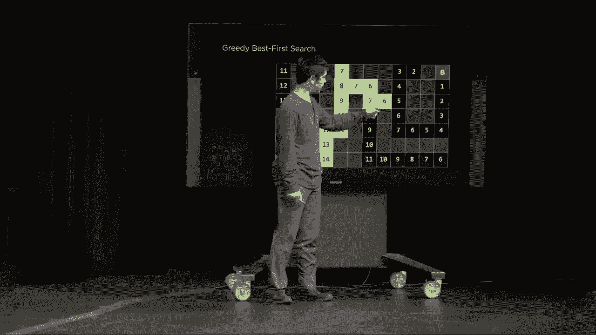

在这里，我们又到达了一个决策点，启发式值是四，另一个是六。所以即使在这里，因为四的值较小，我们将向上走，尽管人类的自负使我们最终会遇到死胡同。计算机还不知道这一点，只能根据启发式判断认为最好的选择。

但最终它会遇到那堵墙，意识到无法前进，然后返回，沿着这条路径，我们最终会找到解决方案。因此，我们达到了与广度优先搜索相同的解决方案。但我们不需要考虑所有的正方形，可以忽略左侧的所有。

我们可以通过更加聪明地处理这些下方的内容来忽略它们。我们不是随便选择，而是根据启发式做出明智的选择。在这里暂停一下，有任何问题吗，然后是关于我们到目前为止所看的算法。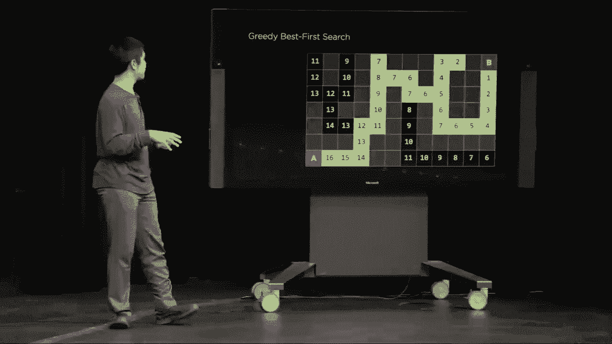

深度优先搜索，广度优先搜索，现在是启发式算法。贪心最佳搜索。关于这些算法有什么问题吗？让我们去看看。让我们看看索非亚在随机决策中。是否可以继续查看是否短些，比如向西？

你当然可以，比如尝试向前看几步，看看后面可能跟随的内容。这可能提供一些数字来改善情况，但即使这个算法也并不完美。当你只是查看这些启发式值并跟随这些启发式值时，有时启发式值会引导你朝一个良好的方向。

就像在这种情况下，我们最终做了一些错误的选择。

但最终我们还是找到了自己的路。但这并不总是会发生。

在某些情况下，因为启发式只是一个估计，启发式有时是错误的。如果你跟随贪心最佳搜索，13和12。你可以选择11或13，而贪心最佳搜索会向前看并说，这条路径看起来不错，并且这些值没有比12更大。

所以它会找到这条从A到B的路径。但即使这条路径实际上也不是最佳路径，最佳路径是A和B之间的最短路径，实际上是这里这条，看起来有点违反直觉，而我们没有注意到的原因是因为它涉及。

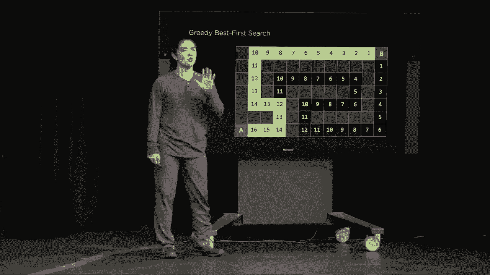

像是先向左走，然后绕道而行。根据这个启发式，我们通常不想往左走，因为我们知道我们的目标点B在我们想要到达的地方。所以，即使你在查看这些启发式值并向前展望，这个算法也可能不是完美的。因此，我们可能会尝试改进这个算法。

最后一个搜索算法，我将向你展示的是我们见过的最复杂的一个算法，称为A星搜索。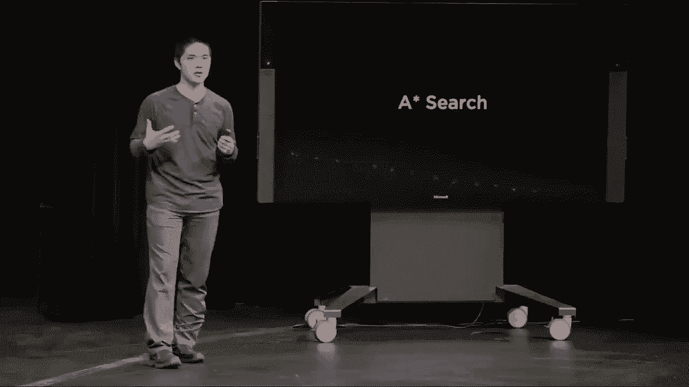

A星搜索试图建立在贪心最佳优先搜索的思想基础上。我们将使用启发式来尝试智能地做出选择，但我们会尝试解决我们刚刚看到的问题，即贪心最佳搜索并不总是最佳的，因为它只是考虑了。

它并不总是会做出最佳选择，因为我们可能最终选择了一条路径。A*搜索试图意识到，如果我们已经一路走到这里，现在在一个地方，我们可能距离目标还有11个格子。这没关系，距离目标更早地达到13个格子可能更好。

所以我们不能只考虑启发式值，我们还应该考虑我们已经走了多远。如果我已经走了很多格子，发现自己离目标很近。我宁愿走得少一些，但依然离目标很近。因此，A*搜索会尝试结合这两部分信息。

结合我们在这里看到的启发式信息，也结合我到目前为止走了多少步。因为这会影响最终的最优解，所以A*搜索将如何工作。它将是之前相同的思路，只是看启发式值。

但不是仅仅考虑启发式值。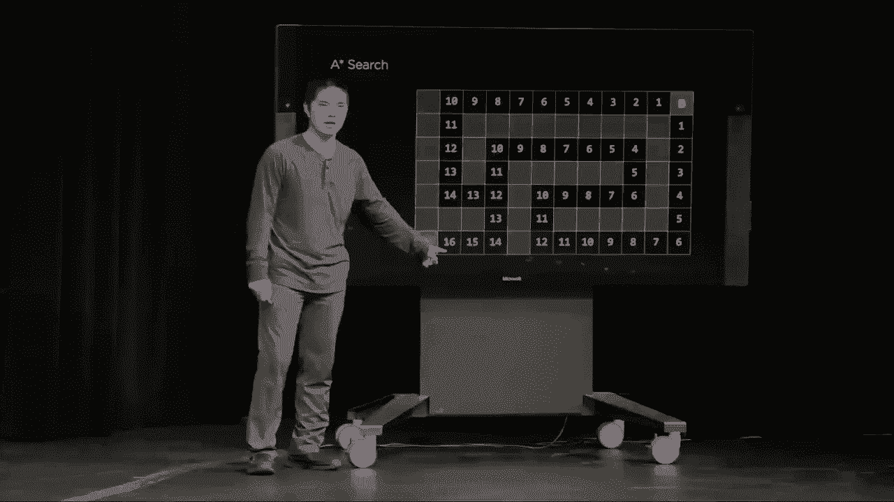

我们将考虑启发式值并加上我们走了多少步。因此我们迈出了第一步，现在我们已经走了一步，离目标还有16个格子，总共17。然后我们迈出第二步，离目标还有15个格子，接着迈出第三步，离目标还有14个格子，我们继续走，直到达到决策点。

在走了五个格子后，我们现在离目标还有12个格子，而现在我们面临选择。我们可以走六个格子，离目标11个格子，或者我们可以走六个格子，离目标13个格子。所以我们将做出决定，向上走。

所以现在看起来我们还没有做得更好。我们还没有找到最优解，但注意最终会发生什么。如果我们沿着这条路径走得足够长，我们会到达一个点，在那里我们已经走了14步，估计离目标还有五步，12345，忽略墙壁，现在我们有一个。

我们可能在走了15步后距离目标还有六个格子。所以15加六，总共是21，而这个选项仍然对我们可用。我们可能距离起点有六个格子，但距离目标还有13个格子，六加13。这总共是19，而这个19比21小。所以这个19最终是啊。

A*搜索关注的就是这一点。通过结合我们走了多远和剩下的路程，我们可以做出更聪明的选择。让我们继续尝试这条路径，A*最终将能够找到从起点到金子的路径。这个算法依赖于一个良好的启发式函数。

而且恰好你可以证明，如果选择一个好的启发式函数，这个算法将是**最佳的**。它总是能找到从 A 点到 B 点的最短路径，而且它不会像贪婪最佳搜索那样陷入实际上不是的路径。因此，有许多这样的搜索算法旨在尝试找到智能。

找到某些问题的解决方案的方法，穿越某些地形。因此，我在这里暂停一下，以便回答关于搜索算法的任何问题。我们已经看过我们所称的经典搜索，穿越迷宫，寻找驾驶方向，以及我们可能称之为对抗性搜索的内容。

在有对手的情况下，你试图在井字棋或其他游戏中寻找最佳移动。来自聊天的一个问题：这些启发式值的分配对计算机来说是否也需要很多时间？

或者这是自动的？你想找到一个高效计算的启发式。所以如果计算启发式所需的时间很长，这可能会更糟。你希望寻找一个能快速计算的启发式。

这就是为什么有时候我们在查看启发式时，会忽略一些使其更复杂的细节。比如在计算这些启发式时，我们忽略墙壁，因为处理墙壁会让它变得更加复杂。这将需要更长的时间来计算这些值。

我们可以很快地计算出像 X 和 Y 坐标那样的坐标方格。我们离那个目的地有多远？我已经给这个网格中的所有方格标记了它们的启发式值，以便你能看到。

观察这些启发式值在实际中的表现。如果我们的搜索算法从未接触到一个方格，比如从未接触到这些方格，它不会计算这些方格的启发式值，因为这与搜索过程无关。因此，它实际上不会为所有这些方格计算启发式值，这样可以节省时间。我只是将它们以视觉方式展示给你，以便你能看到所有的。

方格以及将要分配给它们的数字。我只是想知道你展示的三个例子是否。我们使用地图来实际搜索地图。所以这有点像直接映射到文本搜索或其他类型的搜索，通过不同种类的问题。

这可以用于许多不同的问题。在文本空间中，它们通常在自然语言处理的世界中采用不同的方法。但你可以在任何时候使用这些搜索算法，当你有一些通常称为代理的东西，它在做决策时必须做出某些。

在某些时刻做出的决策。即使这些决策不是关于走哪条路的地理决策，只要它做出了一些将其移动到不同位置的决策。你通常可以应用这些类型的算法来解决问题。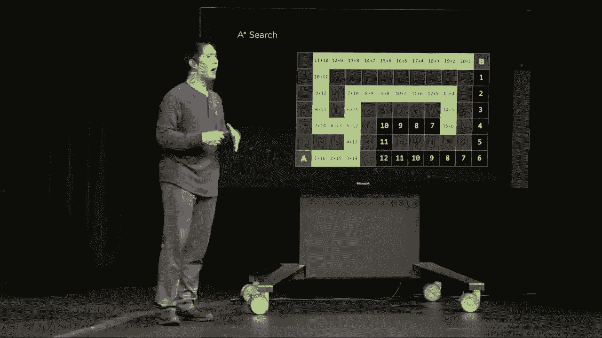

因此，这些算法不仅适用于特定问题，它们可以在其他领域中使用。现在我想谈的不是仅仅提出这些算法，让人工智能立即知道该怎么做。而是关注一种你可能听说过的人工智能类型，称为机器学习。机器学习的核心是尝试使我们的人工智能能够。

以某种方式从数据中学习或从经验中学习，跟人类的方式很相似。我们通过观察环境来学习。我们从周围学习。我们从经历中学习，从这些经历中获得一些东西。因此，一种机器学习类型被称为强化学习，正是从中学习。

你所做的正面或负面奖励。计算机做得好的时候，它会得到奖励。计算机做得不好的时候，它会受到某种惩罚。计算机尝试从中学习。一个非常简单的游戏，我们可能希望我们的计算机去玩。计算机将尝试在这些方块中导航。

它将尝试达到目标，这与我们之前看到的非常相似。但这次计算机不知道障碍在哪里。让我们想象一下，路上有一些障碍，用红色高亮显示。如果我们的计算机代理这个黄色点碰到了这些障碍之一。

计算机在这个游戏中输了，但它不知道障碍在哪里。我通过视觉向你展示这些障碍，但计算机对此一无所知。计算机将如何尝试解决这个问题？你将如何尝试解决这个问题？

它开始时所能做的就是随机做出选择。随机猜测，比如选择往右走。但是现在计算机可以从经验中学习，只要它知道一旦碰到障碍，那是一个坏结果。计算机可以学习。我最好不要再那样做了。与其往右走，不如让我尝试另一种行动，再试一次。

也许这次我会往下走。这导致了一个障碍。因此，计算机从中学习到这是一个不好的尝试。那么我们尝试其他方法。也许我们试着往上走。这次的两个方向导致了一个不好的障碍。那么也许我们试着往右走。也许我们再往右走。这又导致了另一个障碍。

所以反复进行。它只是犯错误，我们让计算机犯这些错误。但每次它犯错，计算机都在从中学习。它在学习下一次通过同样的过程该做什么或不该做什么。因此，在未来，它可以通过足够的试错来找到路径。

它找到了通往目标的路径。一旦它找到了通往目标的方式，它会记住这点，它会知道。我现在确切知道从起点出发需要执行的动作序列。

因此，在未来我可以一次又一次地这样做。这就是强化学习的一个例子。但是，即使在这个例子中，你是否看到了这种方法的潜在问题？限制或缺点是什么？

我可能并不完美。有什么想法？我们看看是否显得简单。或者它可能并没有走最有效的路径。因为它是在随机尝试。最终它会找到通往目标的道路。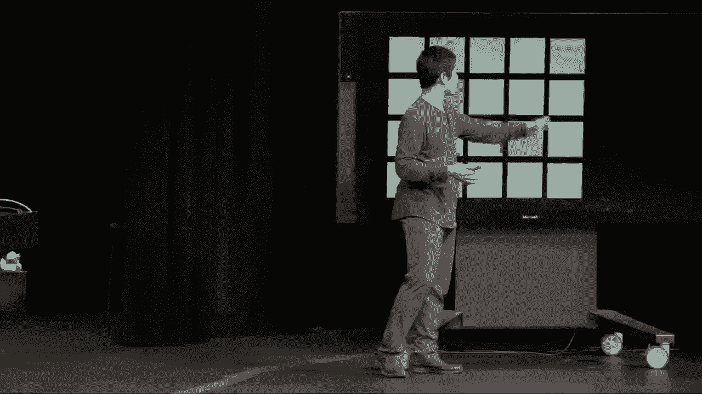

但它不一定能找到最佳路径，因为这里有一条更快的路径。还有一条更快的方式可以到达目标。可以说，一旦你到达这里，就向上走，这将通向更高效的路径。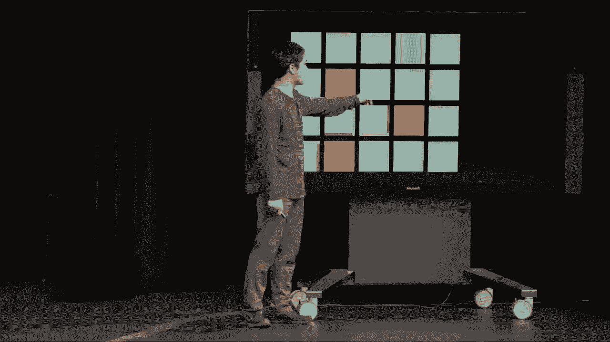

但因为我们的 AI 在学习，每当它达到目标时，它就会学到这一点；当它未能达到目标时，它就会学到不要这样做。我们的 AI 没有那种能力。无法在未来找到更好的路径。因此我们可以在此基础上进行改进。这就是我们所说的在人工智能中探索与利用之间的权衡。

我们希望我们的 AI 能做到这两件事。我们希望 AI 利用已经拥有的知识。我们希望使用这些信息，但也希望它探索一下。我们希望它有时尝试一些以前未尝试过的新行动，因为，或许这会比我过去尝试过的东西更好。

我们的 AI 在刚才的例子中只是在利用它已经拥有的知识。但它从未探索过新事物。

我们希望在这两者之间找到一种良好的平衡。我们希望做出明智的选择，但偶尔也冒一次险。看看是否能找到更好的解决方案。因此，解决这些问题的一种策略被称为 Epsilon 贪婪法，试图为我们分配一个值 epsilon。

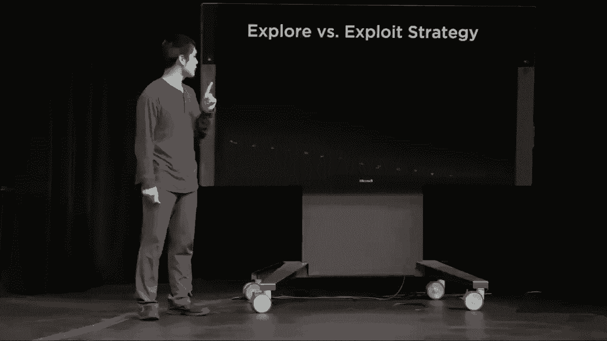

这相当于某种比例，某种概率，我们的计算机将随机选择。

因此我们可以说，如果我们生成一个随机数，且它小于 Epsilon。在这种情况下，这大约发生在 10% 的时间里。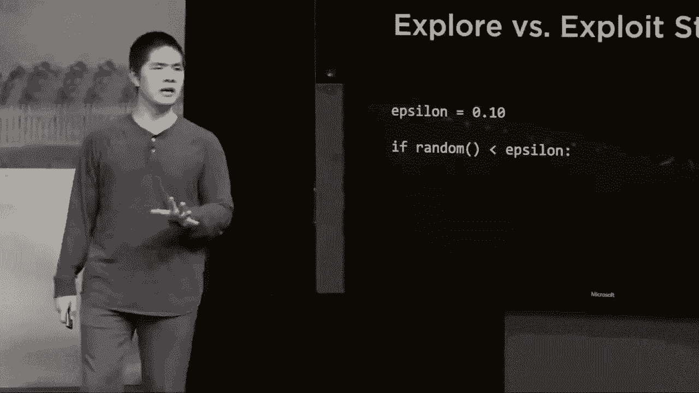

然后我们就随机进行一次移动，而不是做出智能选择。随机选择一次移动，其余时间，90% 的时间里，进行我们已知是最佳的移动，选择我们迄今为止知道的最高价值的移动。这通常会带来一种良好的平衡。90% 的时间。

我们的AI将做出它知道是正确选择的好决策。但这只有10%的时间。也许它会碰到一些坏的选择并学会避免，未来不再做。但也有可能它会发现更好的选择，以便未来更好地执行。所以我会展示一个多年前的真实演示。

意大利技术研究院正在研究一个类似的例子。但是在我们继续之前，我想看看聊天中布莱恩的问题。这和遗传算法有关吗？这种方法中的遗传算法是这种类型学习的另一种形式。我们将会在稍后讨论遗传算法。

我们很快就会到达那里。这绝对与此有关。几年前，意大利技术研究院尝试教一个机器人如何翻转煎饼，这可能是你曾经看过别人做的事情。但在实践中，很难准确地将如何做到这一点编码到机器人中。

精确地确定应该采取什么动作，以及如何移动机器人的肌肉才能翻转煎饼。因此，他们并没有试图将每一个细微的动作编程到计算机中。他们只是让机器人通过强化学习进行学习，每次煎饼翻转错误时，它就学习到未来不该怎么做，而每次成功翻转时也会学习。

它学会了未来该怎么做。因此，我现在就来展示一个例子。我们要看的是一个人工煎饼。最初，研究人员向机器人展示成功的样子。机器人需要知道什么是成功，什么是失败。因此人类进行了演示。

这是实际翻转煎饼的样子，展示了到底应该怎么动作，以及成功翻转煎饼的感觉。然后我们让机器人尝试一下。这是它的第一次尝试，不算成功。经过三次尝试后的情况。每次它做错的时候，它都会学习到未来不该怎么做。

在大约15次尝试后，我们看看会发生什么。学习这些技巧需要一些时间。这里是15次尝试。在进行足够的练习后，这里是50次尝试后的结果。我们现在实际上有一个能够成功执行这个任务的机器人。

这不是因为人类程序员告诉它该如何做，而是因为它从失败中学习，从经验中学习。一旦它知道了，就会精确地知道未来该怎么做。训练后，它可以不断重复这种行为。

能够执行这个任务。这就是你可能如何利用强化学习的想法。但是聊天中有人提出了另一种方法。这种被称为遗传算法或遗传学习的东西。这就是许多机器学习所获得灵感的来源。

人类是如何学习的，自然又是如何运作的。由于自然已经进化出了智能生物，我们为什么不试着在计算机中做同样的事情呢？

你会看到经过时间演化的种群世代，其中最适应的生物体存活下来并能够进化、变异和变化，逐渐更好地适应环境。因此，有一种策略和方法是试图构建智能机器。

与其编程一个在执行任务时表现优异的算法，不如创造大量在执行任务时表现不佳的算法，因为这要容易得多。但我们会让它们进化，让它们尝试某个任务。它们完成后，表现不会很好。但我们会保留那些表现最好的，复制和变异它们，让它们再试一次。

然后这一过程代代相传，淘汰那些表现不佳的计算机程序，但复制和变异表现良好的程序。伪代码可能看起来像这样。我们将从随机生成初始候选者开始，每个候选者都是设计来尝试解决某个任务的程序。

但与其智能地编程，像你整个学期所做的那样。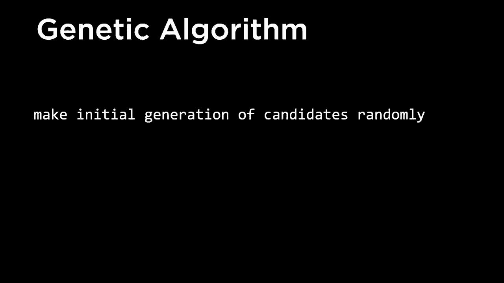

我们将随机编程，让它们做随机选择。我们将重复这个过程，直到最终它们成功。

对于每一个候选者，我们将计算其适应度，评估它在执行设计任务时的表现如何。

然后我们将去除那些适应性最差的候选者。那些表现不佳的程序会被淘汰，但我们会保留表现较好的，并从剩下的候选者中创造出新一代。复制它们，对它们进行一些随机变异，以改变状态，看看如何运作，以便尝试创造出更好的世代，随着时间的推移，我们以类似的方式重复这个过程。

进化能够不断产生越来越优秀的生物体，使它们更加适应环境。我们可以用我们的算法做同样的事情，随着时间推移，生成越来越好的算法。我还有一个演示来展示这一点。这是一些已经过进化的自动驾驶汽车的模拟。

这些程序并没有被编程来驾驶，而是完全随机开始驾驶。你看到的每一个矩形都是一个虚拟自动驾驶汽车的示例。每个小十字线，每个小X代表我们传感器的可获取数据。所以汽车能够获取关于特定障碍物在任何给定方向上的距离数据。

这些汽车试图学习的是如何在某种环境中行驶而不发生碰撞。起初他们做得并不好。你会注意到他们几乎立即发生碰撞，但现在我们已经经过了六代或七代，他们开始做得稍微好一些，开始有了一点转弯的感觉，当他们撞上墙壁时。

即使在他们进入新的环境时，他们并不一定见过这些环境。他们开始做得稍微好一些，但仍然频繁发生碰撞。有时一代的表现甚至不如前一代，因为随机突变并不总是会产生良好的结果。

它们不一定会变得更好。有时突变实际上会导致表现稍微变差，因此它们可能会在代与代之间有所退步。希望你现在看到的情况是，这些车经过十代后总体上表现比之前好得多。每一代我们都在进步。

哪些汽车能跑得最远就复制这些，淘汰其余的，并向前推进。

聊天中有关于煎饼的问题吗？机器人是如何知道上一次翻转煎饼时出错的？在汽车的情况下，汽车是如何知道自己出错的？无论是煎饼还是这些机器人，进行强化学习时，程序仍然需要告知 AI。

成功是什么样子的？失败又是什么样子的？

在煎饼的例子中，我们训练了煎饼翻转器，使其能够知道在翻转煎饼时，成功的样子是什么？这样它能对成功的情况有所感觉。

也许还被告知如果煎饼掉落，那不是 AI 应该尝试的事情。我假设这些汽车被编程为在碰撞到某物时，能够检测到这一点。

所以它可能也有某种感觉，了解它能行驶多远，以便我们能够复制那些行驶最远的，而不是那些没有行驶的。让我们看看这辆车的表现。它离终点非常近。也许再给它一代，我们看看这一代的表现如何。

所以它在导航这些转弯。看起来有一大部分没有成功。但只要我们能得到一个成功的实例，我们就可以在未来从这个成功中学习。这是结尾。但是，看起来有一辆车终于能够到达终点。它成功地学会了这个任务。我必须在这个迷宫般的环境中进行导航。

我在这里暂停一下，供大家提问，然后谈谈强化学习，这些想法可能如何运作。是的，所以针对遗传算法，特别是汽车的情况。所有的汽车都是相互学习的，每当一辆车发生碰撞时。这并不是说汽车之间在相互学习，而是我们生成了新车。

基于之前成功的汽车。这个想法是，如果我们运行10辆车，看看它们走得多远，我们保留走得最远的五辆，淘汰其他五辆。那些没有走远的。但接着我们复制并重复那些表现良好的，从而在未来。希望这一新一代的汽车能够取得进展。

进一步说，代代相传。希望我们能够在这条路上走得更远，直到最终，正如你看到的，经过15代后，我们能够得到一些能够成功执行任务的汽车。现在让我们去问乔赛亚。汽车是否专门只从轨道学习？

当你改变轨道时，我们需要另一个吗？我们需要从零开始吗，或者是这样。所以如果轨道有所不同，希望不是。希望汽车在这种情况下所学习的，基于传感器数据，比如墙壁在任何方向上的距离，应该如何转向。

目标是这种方法能够泛化。希望真正的自动驾驶汽车不会以这种方式训练。但你会希望，当它们在样本环境中接受训练时，当你把它们放到不同的环境中时，它们能够泛化知识，应用类似的技术，以应对真实世界的情况。

你把一辆车放在一条它从未见过的道路上。希望它已经看到了足够多的类似示例的传感器数据，以便识别。能够基于此做出智能决策。希望目标是能够将这种知识泛化，而不仅仅是其他问题。还有其他问题吗？

让我们谈谈雅干教堂。那么这些算法能否达到瓶颈？就像在现实生活中的进化一样。有些分支会达到瓶颈。那么这里也可能发生吗？这确实有可能。算法可能最终收敛到一些看起来相当不错的东西。

似乎没有任何突变表现得更好。但事实证明，完全不同的算法可能会比这更好。这通常被称为局部极大值。在人工智能的背景下，存在一些更好的方法或更好的算法，但我们不一定能找到它。

还有其他策略来解决这个问题，但这确实是我们需要考虑的挑战。还有一个问题，关于如何计算适应度，在这两种情况下。是运行的某些电机，还是像距离这样的参数？在煎饼的情况下。

这可能类似于一个二元结果，比如煎饼是否落入锅中。我们的计算方式是评估该特定例子的适应度。在汽车的情况下，我们可能根据行驶的距离来计算适应度。最终行驶得最远的汽车就是我们的适应度定义。

这实际上是程序员需要参与的部分。程序员需要决定，什么是最适应的？一个坏例子是什么样子的？

一旦计算机知道成功和失败的样子，它就能够从中学习，以便在未来做得更好。这就是遗传算法，一个能够让计算机学习的例子，模仿人类学习的方式，从自然的工作方式中学习。

但是计算机科学家并没有止步于此。还有其他例子可以补充，这也是一个例子。使用强化学习和遗传算法的另一个例子可能是视频推荐，在这种情况下，你可以拥有一些观看历史，而像YouTube或Netflix这样的算法建议你观看视频的方式正是通过这种强化过程。

它将尝试向你推荐视频并从经验中学习。如果它向你推荐一个你喜欢的视频，并且你从头到尾观看了它，那么算法将会在未来学习，推荐更多类似的内容，就像汽车行驶得很远。因此，我们学习在未来多做这种事情。如果它向你推荐一个视频，而你没有点击。

你从未观看过它。那么在未来，它可能不会再向你推荐这个视频，并且它可能也会从这个经验中学习。因此，这是计算机科学从自然中学习的一个例子，学习人类的方式。另一个发生这种情况的地方是通过研究人脑，人脑由什么组成。

这些神经元彼此连接，并且它们传递信息。电信号在一个神经元和另一个神经元之间流动。这就是大脑能够进行这些非常复杂计算的方式。这就是我们可能称之为神经网络的东西，一组这些神经元。

我最近关注的一个地方，尤其是最近越来越受欢迎的，是尝试开发人工神经网络，而不是使用生物神经网络。我们只使用我们可能称之为人工神经元或单元的东西。你可以将这个单元视为存储一些值，比如一些电信号。

就像你在人的大脑中可能找到的那样，只不过是以数字格式存在。这些人工神经元，这些单元可以以某种输入的方式彼此连接。这转化为一种输出格式，其中这个箭头代表某种计算，将左侧的值转变为。

右边的值和神经网络。它们通常不仅仅是一个输入单元和一个输出单元，而可能更复杂。你可能会有一个神经网络，有两个不同的输入，每个输入连接到一个输出，甚至还有像这样的更复杂的神经网络，其中有多个层的单元相互连接。

每个箭头执行某种计算。如果你听说过“深度学习”这个术语，这通常指的就是这个。这个深度神经网络的概念有很多层，每层都在执行计算，并最终使用一些线性代数。

它们能够准确地进行这些计算，将输入转化为某种输出。如果你给神经网络足够的数据，它可以从这些数据中学习。它能够确切地设定这些不同的箭头，以计算某项任务，将输入转化为输出。

这可能表现为手写识别。我们如何训练计算机来学习识别手写字？考虑到各种不同的手写体？一种方法是使用神经网络，建立这些神经元及其所有连接的网络。然后你将数据输入到这个神经网络中。

我提供给神经网络一大堆已经存在的手写数据，每个数据都有标签。因此计算机知道哪个图像对应哪个数字。你在这里看到的数据集是一个非常著名的手写数字数据集，称为MNIST数据集。基于这些数据，计算机可以开始训练神经网络，并逐步弄清楚确切的计算方法。

在神经网络的每一层中进行运算，以将输入转化为输出。比如翻译一个看起来像手写数字“八”的截图，我们都能辨认出这个数字，但可能很难描述计算机如何得出这个结论。但通过神经网络。

通过在所有样本数据上训练神经网络，它能够学习某种函数，将这个输入的手写数字转化为实际的输出数字。

这些神经网络已经证明非常通用。

我们不会在这里讨论所有的数学，因为它变得有点复杂，但它被广泛应用。它可以用于电子邮件垃圾邮件检测，如果你给计算机一大堆数据和一大堆电子邮件，其中一些标记为垃圾邮件而另一些不是，它可以学习一个函数。

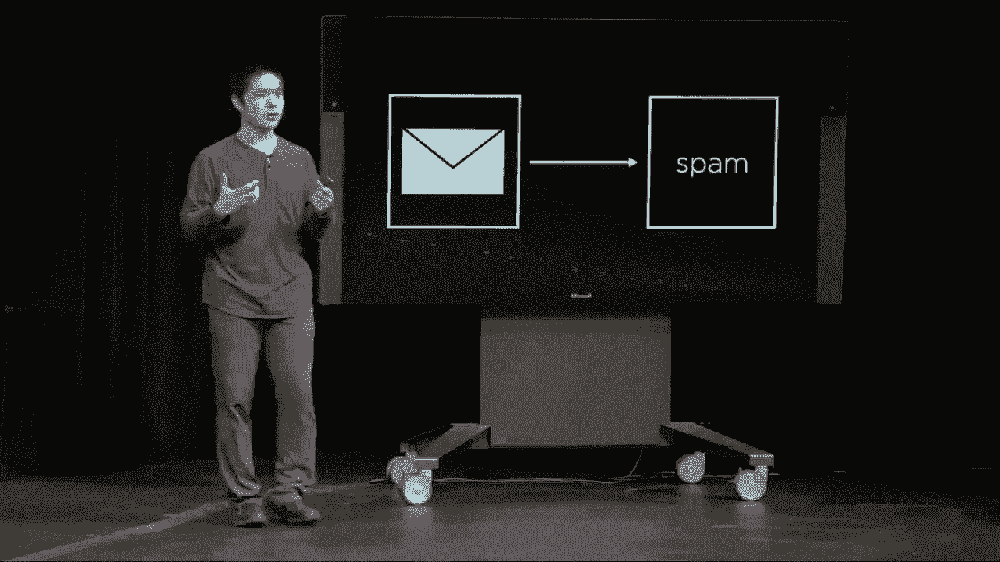

你可以确切地学习如何调整神经网络，以便能够对任何给定的电子邮件进行预测，无论它是否是垃圾邮件。使这些网络发挥作用的关键因素是拥有大量的数据。这就是为什么许多公司现在正在努力获取大量数据并利用这些数据来训练他们的机器。因为你拥有的数据越多，你就能更好地优化这些算法，因为你可以更好地调整它们以适应各种不同类型。

这可能会帮助使它们在未来更准确，以便能够测试这些网络。

看看它们的效果如何。每次你在网上与网站互动时。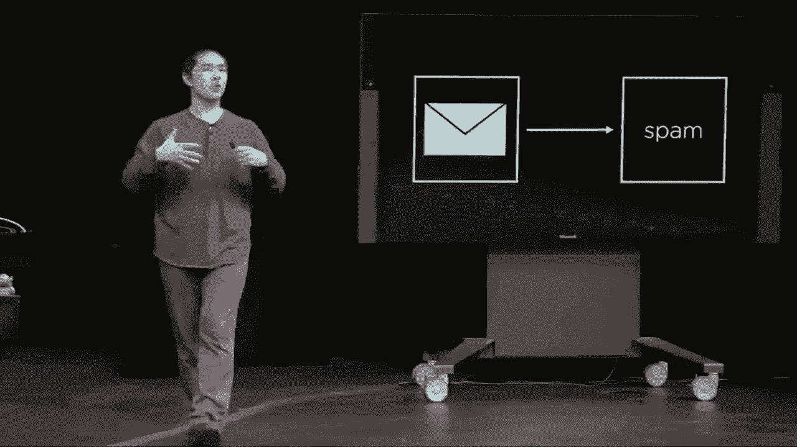

每次你打开电子邮件应用程序并将一封电子邮件标记为垃圾邮件时，你通常都在提供一些数据。那个电子邮件应用程序可能在学习那个标记？

这类电子邮件是垃圾邮件的一个例子。因此，它在未来学习更好地进行分类。每当一封电子邮件被标记为垃圾邮件时，你必须告诉计算机。计算机正在从中学习，这是计算机可以用来帮助其算法获取更多数据。

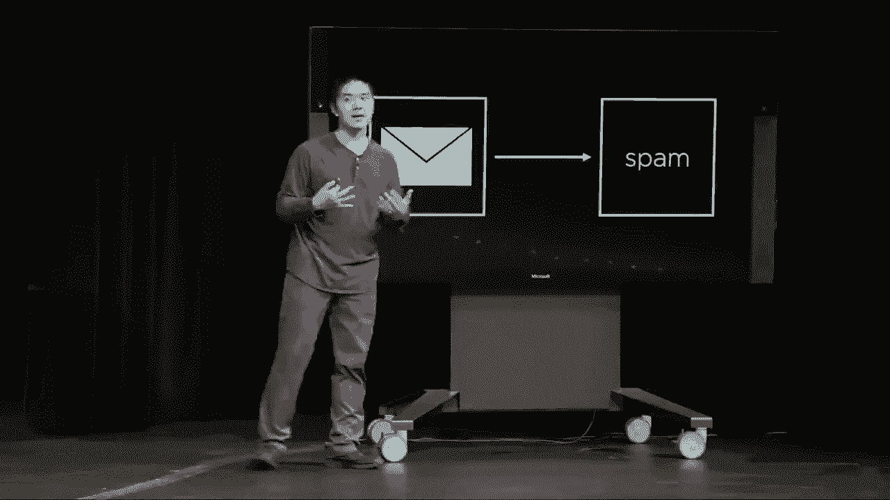

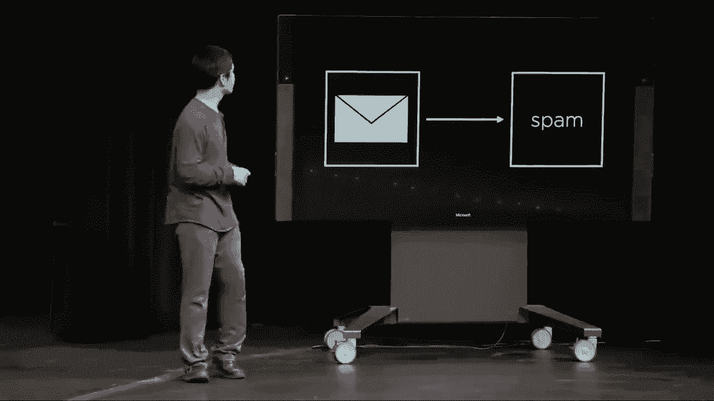

最后一个例子，我们可以看看像这样的图像实际上是如何生成的。计算机怎么可能得到这样的图像并生成它呢？

制作看起来非常像真实人的东西，尽管它实际上并不是真正的人？

它是通过使用完全相同的技术来完成的，使用神经网络学习如何将输入转化为输出，但在这种情况下，拥有大量的数据，包括许多真实人物的照片。因此，计算机可以开始对一个真实的人是什么样子有一个感觉。它可以以这种方式开始训练网络，而不是一次性构建整个的人。

一步一步地构建它。计算机生成这样一张照片是一项相当复杂的任务。做起来很困难。但你知道什么更简单？生成16个像素的图像。它看起来根本不像一个人，但计算机可以很容易地生成看似一堆随机的东西。但随后你会训练计算机为这个图像添加一点细节，以便能够学习。

如果这是一张真实的图像，你会如何添加更多细节，使其看起来更像一个人？这同样是通过访问大量数据来实现的，许多人的照片使得计算机能够从中学习。因此，计算机学习如何将这个图像转化为这个。

仍然看起来并不像一个人，但看起来更像一个人了。它的分辨率更高。你也许可以看出这里有一些头发，脸上有一些特征。然后算法学习。你如何处理这样的图像？

一个八乘八的网格，转变为一个十六乘十六的网格。它仍然看起来不像一个人，但看起来更准确了一些。随着时间的推移，我们可以一步步地跟随这些步骤，添加越来越多的细节，直到最终。

计算机能够生成一幅看起来真的像人的完整图像。这仅通过输入到输出的过程是非常难以区分的。学习一些输入的映射。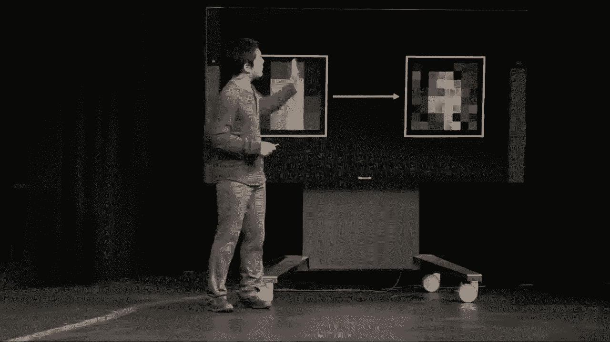

输出是通过访问大量数据实现的。那么在我们结束之前，给大家留一点时间，提出关于人工智能的最后问题，关于我们查看的任何算法，或者搜索、学习之类的事情。我有个问题，关于像健身方面的。你提到的所有访客数据是怎样的？

它们像成功的模型那样被重新生成。这些数据是如何产生的？

就像成功的确切是什么，因为适应度就像是一个分数。确切地说，它做出了哪些决定，以至于它是成功的。这实际上是机器学习中更棘手的事情之一，我们可以训练这些机器学习。

但我们并不总是立即能够看出它在成功的过程中做了什么。这是机器学习中一个活跃的研究领域，包括哈佛的一些教师，这涉及到机器学习的可解释性。像算法这样，变得非常，非常擅长向你推荐视频或生成一个人的图像。

但对一个人来说，很难看清那个机器学习模型是如何得出结论的。人们只是举起手来说，我们并不在乎算法是如何运作的，只要算法能够成功地做到这一点，并最终。产生良好的结果。我们只会选择那些表现最好的，使用这些。即使我们不一定完全理解这些算法是如何工作的。

对某些人来说，这无疑是一个令人关切的领域，而对其他研究者来说，这是一个研究领域，他们正在研究这些类型的工具和技术。也许来自聊天的最后一个问题，布赖恩。每次我选择包含交通信号灯或人行道的图片部分来证明我不是机器人，可能是我的训练来源于谷歌的无人驾驶汽车，或许不一定是谷歌的。

但当然，在做这种事情时，很多时候是为了验证你确实是。那是这些东西的目的之一，以确保机器人注册网站。但是，它当然可能只是提供更多标记数据的例子，机器学习模型往往依赖于标记数据，比如手写数字。

你有一个标签，这个标签是数字二或者数字八。因此，计算机可以利用这些数字来推断如何学习如何将手写数字转换为个体。因此，拥有这种标签数据的访问权限，最终会变得非常重要。

今天的人工智能内容就到这里。非常感谢大家！

