# 哈佛 CS50-CS ｜ 计算机科学导论（2020·完整版） - P3：L1-C语言（语法与格式）2 - ShowMeAI - BV1Hh411W7Up

但更多内容在下次讨论，好吧，到目前为止我们只见过字符串，但。事实证明在 C 语言和许多其他语言中，还有其他被称为。类型或数据类型的东西，也就是说你，可以拥有变量和数值。它们不仅仅是文本字符串，而是两个、三个、四个，或者像 3 这样的浮点值。

14159 或其他此类值，你可以拥有布尔值，这仅为真，`chars`。它是单个字符，这意味着在像 C 这样的语言中，实际上有许多可用的数据类型。`string` 只是其中之一，甚至比这个列表上的更多。

但这只是一些我们今天将看到的最常见的类型的列表。并且将在本周第一组问题集中使用，允许你告诉计算机不仅存储一个变量中的值，而是存储在变量中的值的类型。此外，我们在 CS50 库中有更多函数，我们已经看到了 `getstring`。

但同样，我们创建了函数，超越，允许你通过 `getchar` 获取单个字符，允许你通过 `getint` 获取整数，允许你通过 `get float` 获取浮点值，这是一种描述带有小数点的真实数字的 fancy 方式。但事实证明，这些数据类型，例如 `int` 和 `float` 只有有限的。

位数，并回想一下上周我们玩弄了灯泡，我们玩弄了位和零和一。更一般地说，事实证明，`double`、`float`、`int`、`long`、`string` 等等，均使用特定数量的位，结果是，使用 32 位，这很好，直到你想计数超过大约。

40 亿，此时你无法再继续。我们今天稍后将看到，如果你只使用特定数量的位，你只能计数到这么高，因此存在其他数据类型，例如 `long`。`long` 是 C 语言中的另一种数字类型，仅使用 64 位，因此它提供了。更高的表现力，类似地，`double` 就像一个浮点数。

浮点值是一个带有小数点的真实数字，后面有一些数字，后面的数字，然后一个浮点值会是这样，所以我们稍后将看到并使用一些这些数据类型。`printf` 同样具有，我们看到的，但也使用不同的格式代码。其他数据类型也是如此，这些类型更为晦涩，但没关系，你会。

最终将它们 ingrained 用于常见的用途，`cases`，`percent c` 将是占位符。打印单个字符 `percent c`，可以说 `percent f` 将用于。浮点值，所以如果你想打印一个带有小数点的真实数字。你将使用 `percent f`，如果你想打印一个整数使用，`integer`。

如果你想打印一个字符串，我们已经见过百分号s，如果你想打印一个长整型，即长整数，你将使用百分号li，还有其他一些，但这些可能是最常见的，它意味着c确实需要你这个程序员要非常精确，你不能只说打印这个，你必须告诉printf如何打印你传递的变量或值。

你传入的变量，然后最后发现，在c中有一堆运算符，当然有数学运算符，还有其他许多运算符，就像scratch有一整套运算符，暂且说c也支持加法、减法、乘法和除法。

甚至还有余数运算符，略显神秘地用百分号表示。

不要与printf的格式混淆，代码是说一些。计算机的最早用途当然都是与数学相关的，在电子表格程序中，比如在谷歌电子表格之前的visit、calc等程序，计算机在支持数学方面非常出色，所以这些只是。

我们现在可以看到的一些运算符，所以让我继续做这件事，让我回到我的IDE，在清理完一切后，重新开始，在终端窗口中没有任何内容，也没有打开的标签。让我继续写我的下一个，这些函数。

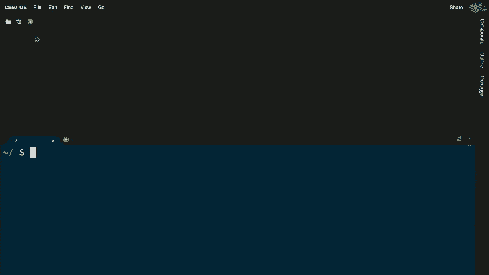

我将继续创建一个名为edition.c的文件，虽然我可以把它叫做其他任何名字，但重要的是要添加.c的后缀。

否则计算机将不知道这实际上是源代码，而不是机器代码。让我继续利用cs50库，包括cs50.h。让我包括stdio.h，这样我就可以使用像getint和printf这样的东西，然后再次出于今天的目的，我只是会写在main intmane void中，然后。

大括号，再次为今天，只是相信这是必要的，但我们将在一两周内解释为什么我们一直写int main void，但现在就像绿色旗帜被点击的拼图一样，让我继续从用户那里获取一个整数，假设我现在的目标不是写一个获取。

一串文本打印出hello，brian或hello david，让我继续写一个程序，可能会要求输入两个整数，两个数字，然后将它们相加，所以让我用代码制作最简单的计算器，使用一个叫做x的变量，就像数学家一样。我将赋值给它，类似于x冒号，我可以随便说任何我想要的。

是 x 问号，但我会保持简单，只说 x 冒号。用分号结束我的思路，因此在这里我用 get int 从用户那里获取一个数字或整数，引用的参数是输入，打印到 getint 的输出，等号是赋值。

操作符表示，复制右侧的返回值，即人类希望输入的整数到左侧，左侧表示给我一个变量，叫 x。让我在其中存储整数，因此之前我们在左侧使用了字符串，现在的不同在于左侧是 int，因为我想要一个数字，右侧是 get int。

然后让我再做一次，获取另一个数字，获取 int，我只是说 y 冒号，但是我可以问 y 是什么，问号或任何英文，但最后一行将是有趣的，现在我将打印出来。例如，这两个数字的和，告诉它要精确打印出什么，所以我不能。

还没真正输入一个数字，因为我输入了，所以我将放置一个占位符，我将放置百分比 i，表示这里放一个数字，我只是还不知道是什么。然后，为了保持整洁，我将使用换行符，它只是说，给我一个新行，这也是一个美观的细节，移动光标。

下一行只是为了保持整洁，但现在 printf 将接受第二个参数。无论你是否编程过。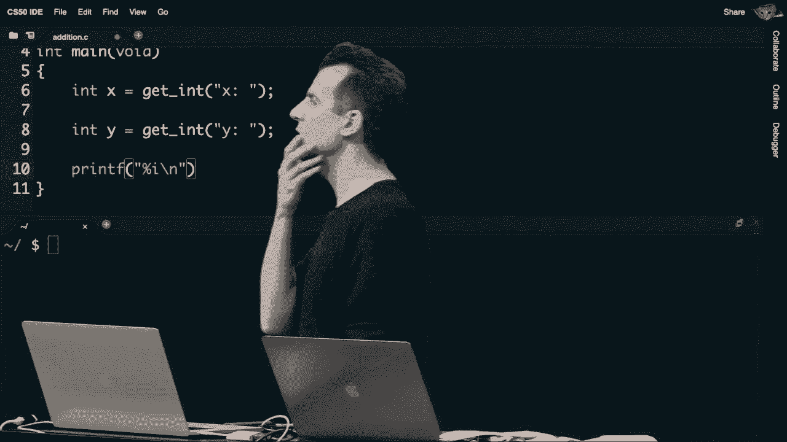

在布莱恩之前，让我们去观众中找人，如果可以的话，如果这个程序的目的是很简单地将两个数字相加，即使你从未编程过，基于现有的运算符和到目前为止我们看到的一些语法，你的直觉会让你输入什么？

即使你从未这样做过，santiago，你该怎么做？嗯，我会说只需写 x 加 y，是的，就这么简单直接，x 加 y 是正确的直觉，我将最后加一个分号来结束我的想法，但确实计算机。

在这种情况下，c 完全理解，*****，*****，我现在要保存文件，然后往下走，我不会去，输入，添加，因为那是我的文件名，隐含地，edition。c 我想编译成一个名为 edition 的程序。希望这是我交叉手指的地方，我没有犯任何错误。

我将继续运行 make，addition，一切顺利，没有错误信息，如果我有的话。

编译，help 50 可能是我接下来的本能。

slash edition，注意我首先被提示输入 x，我将继续做一个。我接下来被提示输入 y，我会再做一个。瞧，santiago 提议我确实在屏幕上看到，x 加 y 或者值 2，而我没有硬编码 2，我使用百分比 i 代入，无论结果是什么。

x加y实际上现在注意到，`getint`函数的一些特性，假设你不是很配合，输入`cat`作为x，注意到`getint`只是，忽略了你并再次提示，提示我，再次，如果我输入1.23，它忽略我，提示我再次，因为它想要一个整数，在这种情况下是像1这样的数字。

四或零，或任何高于或低于的值，所以好吧，我现在会合作，给它数字一。y也是如此，它会忽略任何非整数输入，所以如果我给它一个数字，比如这次是2，我希望能得到，3的答案。好的，所以我们有一个基本的。计算器在c中，我们使用一些基本构建块，和以前一样，我们有这些头文件。

这只是让我访问，分别使用`getint`和`printf`，但是，假设现在我想要更高的计数，你知道吗，让我尝试一下，像这样的程序让我再运行一次。让我贪心一点，怎么样，四零零零。零零零零零零，所以大约是，四，确切地说，四十亿，呃，这就是我想要的数字。

注意到x不喜欢这个，所以`getint`不接受四十亿。那么，呃，没错，这样可以，怎么样，两个亿。

好吧，那次成功了，我在这里暂停，发生了什么？也许现在再次我们，工作人员编写了`getint`，所以我们是，拒绝，猫和狗以及四十亿，甚至三十亿的原因，但在这种情况下不太清楚，为什么我们拒绝四十亿和三十亿，你认为基于一些定义。

今天远远不够，为什么会这样，纳撒尼尔，你好，嗯，我刚刚解除静音，呃，数字的大小有限制，因而在两个亿之后，完美，所以整数再次是，蚂蚁。蚂蚁总共只使用32位，而你只有通过输入才能知道这一点。

被教授过或查过，针对特定计算机系统。但他们在cs50 ide和大多数现代系统中，整数。

只有32位，这就引出了问题，如果你有32位，或者灯泡，你能计数到多高，事实证明，有32个灯泡或位，你大约可以计数到四十亿，你绝对可以计数到三十亿。然而，`getint`仍然拒绝它，但这是因为`getint`函数，包含的不仅仅是数字。

而且要注意的是，如果你想支持正数和负数，你可以表示四十亿左右，总共有可能的值，但是如果你想尽量向左走，尽量向右走在我描述的数字线上，你只能在正方向上计数到两个亿。

负20亿是在负方向，因为这仍然给你一个总共4亿。但远没有3亿或4亿那么高，我记得早些时候提到过，还有其他数据类型，不仅仅是整数和字符串，还有长整型，实际上是更长的整数，即64位，所以让我继续试试。

让我继续并将get改为get long，把这个改为long，所以同样的程序，同样的计算器，但我现在使用的是不同的数据类型，这将使用更多的位数来存储值。让我再次运行加法，重新编译我的程序，哦，天哪，我搞砸了，让我们看看能否找出哪里出了错。

让我向上滚动，我不能强调这一点，有时候我在这里运气很好，显然只有一个错误，在错误信息中，并不会出现两行代码的错误。在你的代码中，编译器有时会感到困惑，如果它感到足够困惑，它会开始思考。

你实际代码中的一切都是错误，所以最重要的收获是，总是向上滚动到输出的顶部，首先解决第一个错误。这就是我在窗口中向上滚动的原因，以便立即查看我输入的内容下面的内容。做加法，这就是第一个错误，位于第10行。

看第10行，所以让我把代码向上滚动，它提到格式指定类型为int，但参数的类型是long，我们之前没见过这个错误，但我想我可以从中推断出，这并不是超级神秘，尽管那是百分比，我记得是用于整数，我想我需要一个不同的长整型格式代码。

整数将会是l i，而这是我之前的小备忘单。所以让我继续再试一次，li，哎呀，拼写错误，现在让我做点斜杠加法，现在我会输入四个零，四十亿，真是个长整型，因为它有足够的位数。好的，关于类型int的问题，当我输入的时候。

两亿和两个都是整数，错误的答案，一些负数是因为位和字节确实是相同的答案，所以我没有演示这一点。但如果你为x输入两个2亿，为y输入两个2亿，然后试图将它们相加，这在数学上会给你4亿，但再说一次，亿。

如果我们还希望能够表示的，那就是你无法将结果放入允许的数据类型中，我们稍后会看到，实际上这有什么后果。你试图把一个太大的数字塞进有限的位数中，32位，但你可以通过切换来避免这个问题。

让我再试一个别的，稍微有点意思，让我去**写**一个稍微不同的程序，现在，我将把这个称为**截断**。这是个华丽的术语，但我们很快就会看到这意味着什么，我将在顶部引入`cs50.h`，并引入`stdio.h`，这样做当然没问题。

从第一个实验室或问题集开始，如果你打这些东西花了更长的时间，我只是为了肌肉记忆而这样做`int main(void)`。现在我们可以开始一个新程序，文件名叫`truncation.c`。我接下来要**提示**用户再输入一个整型。

和之前一样，我会再提示用户输入一个整型，继续**进行**这个操作，我想这次进行除法，不仅仅是加法，这有点太简单了。让我做除法，所以`z`等于`x`除以`y`，我在这里暂停一下，问一下，这行代码还不正确。

因为回想一下，每次你在左边创建一个新变量时，我需要在该变量名称的左侧放置一些内容，以便`c`知道我想要什么类型的变量，迄今为止我们看到了字符串和长整型，那么你提议我们用什么呢？z的数据类型应该是什么？jack，你觉得呢？

嗯，它应该是浮点数吗？是的，所以是浮点数，所以`value`，这是程序员描述实数的方式。让我接下来做一个浮点数，嗯，我猜你的直觉是，如果你输入一个x的数字和一个y的数字，而结果是某种分数。

所以有小数点的东西，我们需要将其存储为浮点数，以便我们实际上可以，嗯，存储所有数字，做这个，`%f`，`\n`，因为我正在打印一个浮点数。打印出z的值，顺便说一句，为了好衡量，让我开始练习良好的风格，所以从用户那里获取一个数字，让我再给自己加一个注释。

从用户那里再获取一个数字，或者说，这看起来有点傻。我可以合并这些行，为什么不直接说，从你的代码中获取，比如x乘以y，但即使这样也有点过于挑剔，因为从代码中你可以大致看出来，所以到某个时候，我们可能甚至不需要对此进行注释。

所以我们就这样简化一下，接下来我们编译这个程序，`make`，来吧，`make truncation`。好的，它编译成功，我喜欢我们在这里使用浮点数，这感觉正确。让我运行`truncation`，然后我去**输入**，比如说x输入4，y输入2，好的，我喜欢这个结果是2.000，所以数学是正确的，x是1，y是2，结果是0.0000。

好吧，也许这只是个小问题，嗯，二分之三，怎么说呢，这不对，怎么会是四分之三，给x呢。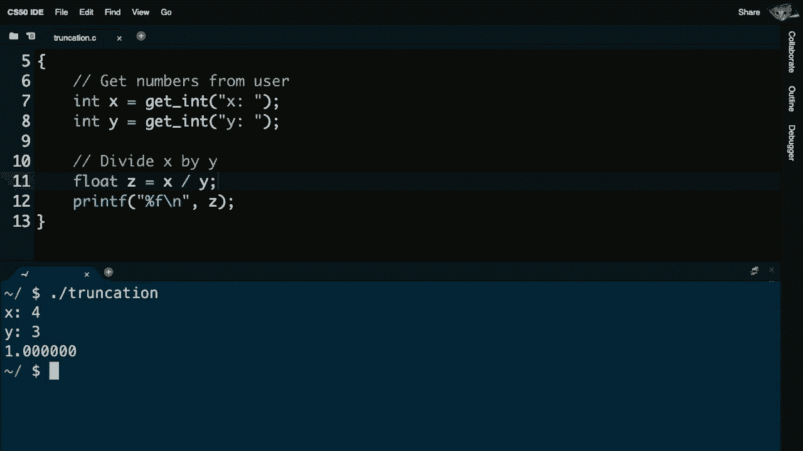

四分之三，好吧，接近，没问题，但这是一个逻辑错误，就像我不知怎么地不当使用了C代码。那么这里可能发生了什么呢，y是1除以2和2。

除以三的结果显然是零，后面跟着零，后面有六个小数位，甚至四分之三给我的是1.00000，而不是1.33333。因为在这种情况下，它们不喜欢像小数这样的东西，所以像四分之三的问题，三只能整除四一次，想要实际小数就用双精度。

确切地说，这个比我之前犯过的错误更微妙，但C语言像大多数编程语言会字面上处理你输入的内容。

所以如果在右侧的这个表达式上，行11。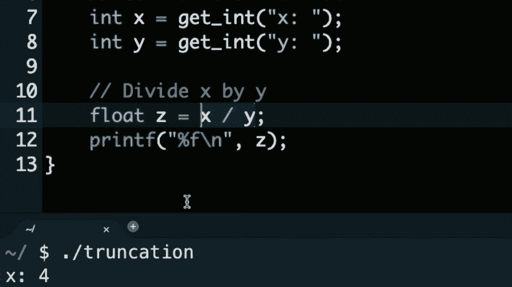

我实际上是在做x除以y，你首先要问自己，x的类型是什么。答案将返回一个整数，因此如果你做1除以2，数学上是0.5，确实可以，但它会截断所有小数点后的部分。然而，因为你无法将浮点数和之后的数字放入整数中，所以你会失去小数点后的所有数字。

因为你只能适配整数，所以我保存的这个没关系，太晚了。数学运算已经在右侧完成了，所以是的，我在一个浮点数中存储了一个整数，因此我可以将其打印为浮点数，但一切都太晚了，所有数据都被丢弃了。那么这有什么影响，或者我该如何修复呢？

我可以逐一更改所有这一切，比如说，如果问题是x和y是整数，那么我就把它们改成浮点数，像这样更改，这样就可以了。这会解决问题，但这是一个过于粗暴的解决方案。你可以更加聪明一点，可以说服浮点数。

通过一种称为强制转换的方式，所以我实际上可以在这里，使用一种新的语法，我可以说float y。我甚至可以为了保险起见，但这并不是严格必要的，也对x这样做。你可以在C语言中通过在括号中放入你想要的新数据类型，强制转换或类型转换一种数据类型到另一种，如果这样转换在数学上是合理的。

计算机会为你完成其他操作，所以通过这种方式。我是在告诉计算机将x转换为a，float将y转换为一个float，然后进行数学运算。在之前，当我分别输入1和2作为x和y时，现在就像我输入了1.0和2.0，而1.0除以2.0，数学上是0.5，但因为x和y现在被转换了。

在转换为浮点数之后，答案将保持为浮点数0.5。这将存储在z中，并最终被打印出来。所以如果我重新运行截断，已经修复了这个问题，让我输入`./truncation`，输入1，输入2。我不必自己输入小数点0，计算机为我做了这一切。

括号中的类型转换，现在我看到答案确实是。

好的，所以我们似乎现在对程序有了一些非常基本的低级控制。让我们现在重新添加上周从头开始的所有高级特性，这样我们就可以开始编写更有趣的程序。因此，变量糖也是这些特性之一。

回想一下上周，当我们想要创建一个名为`counter`的变量并将其设置为零时。我们可以这样定义它，在C语言中，从今天开始，我们要说的是，`counter`等于零，但我们还需要指定该变量的数据类型。并且我们需要用分号结束我们的语句，因此我们所说的设置`counter`。

像上周那样设置为零，现在这将在右侧简单地转换为这个。那么接下来会发生什么呢？如果我们想要将上周的计数器变量增加1，加1，我们很简单地使用了这个拼图块。本周我们需要更明确一点，并说类似于`counter`等于`counter`加1。

并用分号来结束这个语句，现在这可能看起来很奇怪，`counter`并不在逻辑上工作，但在这种情况下，这不是等号。在C语言中，与其他语言一样，我们会遇到等号，它是赋值运算符，从右侧赋值给左侧，结果将`counter`增加1，因此有效地增加其总数。现在这是一个非常常见的操作。

程序在本学期会看到你只想加一些东西，因为你想跟踪某种计数，因此发现有一些语法糖，这意味着有一种不同的语法方式来做这件事，它并没有给你在C语言中没有的任何新功能，只是稍微让输入更愉快或更快。

因此，这行代码在C语言中与这样说是相同的。一个分号意味着取左侧的变量并加1。它稍微简洁一点，并且让你的代码更具可读性，因为人类需要处理的东西更少。还有更多额外的语法糖存在。

你甚至不需要键入这个，你可以直接使用`counter++`。`counter++`是在C语言中为给变量加1的最简写法。好的，除了变量之外，上周我们还有什么工具呢？当然是条件的概念，条件就像是道路上的分叉。

这可以让你在Scratch中做这件事。例如，如果我们想要比较上周的两个变量`x`和`y`是否不相等，`x`小于`y`。如果是这样的话，`x`就小于`y`，我们如何将其翻译为C语言呢？那么语法将会非常简单，这里有一些新的内容，一些新的括号，一些新的花括号。

但在视觉上看起来有点相同，尽管以文本形式，我字面上说，如果是空格，那么在表达式中，回想一下上周`x`小于`y`是我的布尔表达式。然后注意我使用一个开放的花括号，留一个空白，就像我可能在上周做的那样，事实上让我们在这里放入等效的代码行。

使用`printf`打印出`x`小于`y`，换行符，所以我们之前已经完成了那个翻译。说就像`printf`，就像`if`，现在就像`if`，严格来说，特别是如果你之前编程过，你在条件内部只需一行代码时，并不需要这两个花括号。然而，从风格上讲，为了CS50和风格50的缘故，始终包含。

这些花括号，尽管它们在自己的行上，好的，如果我们可以这样做`if...else`，我们可以在分叉的一个方向走，也可以在分叉的另一个方向走。在C中，相应的代码看起来像这样，所以几乎和之前一样。我只是添加了`else`，然后是另一个花括号和一个关闭的花括号。

让我添加一些`printf`，你可以看到在C中这实际上是上周非常图形化的版本，但理念是一样的，你只需开始识别括号放在哪里，花括号放在哪里，分号和所有那种视觉元素。好了，让我们再做一个`Scratch`和比较，这就是一个。

在我说`if x`小于`y`时，`say x is less than y else if x is greater than y，y`，Scratch和C的分歧，因为Scratch旨在非常用户友好，不需要对赋值操作符进行长时间的解释。C使用等号进行赋值，呃，不，抱歉，回到麻省理工学院，C使用等号从左到右进行赋值，但这意味着相等性之间的差异。

一切都是逐行翻译，虽然我们可以将`elsif`放在同一行，而`else if`也可以放在同一行，除了这里有点愚蠢的变通方法，从某种意义上说人类，我们已经使用等号进行赋值，我们现在用什么来表示相等呢，嗯，麻省理工学院忽略了这个问题，只是。

使用单个等号表示相等，计算机科学家在发明C语言及其后续语言时。当比较左边和右边两个值的相等性时，使用两个等号，仅仅因为一个。左边，两个等号是相等性比较，这两个值是否相等。但是你知道，这不一定设计得很好，从逻辑上讲这是正确的，我的Scratch。

代码和我的C代码是正确的，但有没有人能观察到，为什么。代码不一定设计得很好，我做的工作比我需要的多一点。我可以稍微简化一下这段代码，我可以输入稍微少一些字符。并且达到相同的效果，正确的决策并不完美设计，呃，非常好。

是的，你使用了`elsif`两次，实际上可以在最后用`else`而不加条件。很好的观察，我用`elsif`两次在逻辑上是正确的，但请考虑，如果`x`小于`y`，那是什么路？如果`x`大于`y`呢？唯一的其他可能是什么？

在数学的世界中，逻辑上`equal to`没有必要过于详细地强调这一点。显然让我们简化代码，稍微设计得更好，作为提议。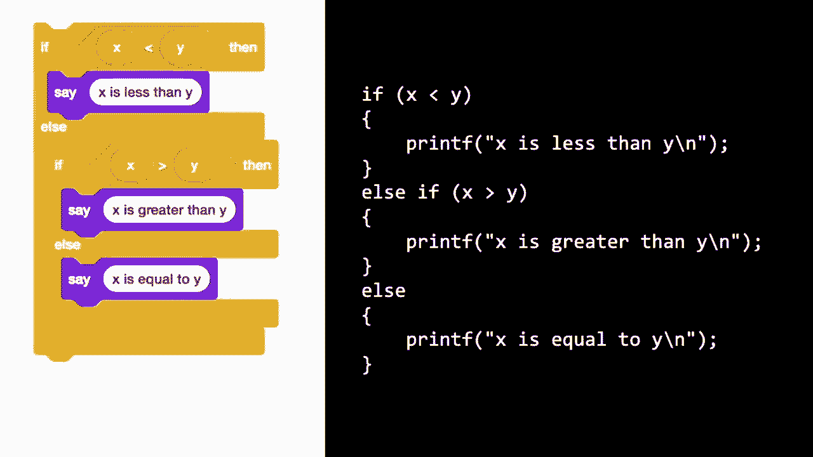

这并没有更清晰，也没有更短，但确实避免了问一个额外的问题。因此，现在可能问三个问题的情况变成了两个。坦率地说，如果你编写大量代码或者一次又一次地执行这个，那种差异可能会累积，确实能给我们带来能力。

使用这些条件，我们实际上来尝试将其转换为程序，让我提前进行。让我先**复制**一个我今天带来的文件，名为`conditions.c`，这是课程网站上提供的文件之一，让我打开这个文件，看看这是否算是对`scratch`代码的字面翻译。

我现在来展示我在这里做了什么。我打开了一个我提前写的文件，名为`conditions.c`，在文件的顶部我有我通常的两个**包含**，然后在这里我几乎有我们在幻灯片上看到的内容，加上两次`get ins`的调用。

然后我在这里问这个问题，如果`x`小于`y`。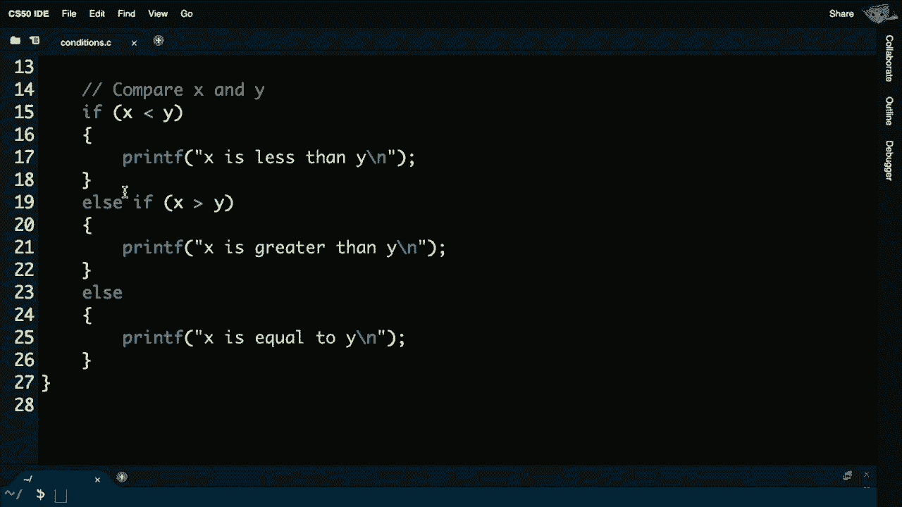

`else if x`大于`y`，否则去**做**以下的`scratch`翻译。让我先**制作**条件，`conditions.c`是文件名。没有明显的错误，所以让我去**运行**`./conditions`，输入`x`将是`1`，`y`是`2`，确实`x`小于`y`，如果我去**运行**。

这次，例如`10`和`5`，`x`大于`y`，然后最后如果我去**运行**这个`4`和`4`。

`x`等于`y`，所以我现在有一个`c`程序，实际上为我添加了条件，这实际上是为我添加条件，做出决策，并可能打印出一个东西，或另一个。但让我做一些稍微复杂的事情，让我先**打开**另一个程序。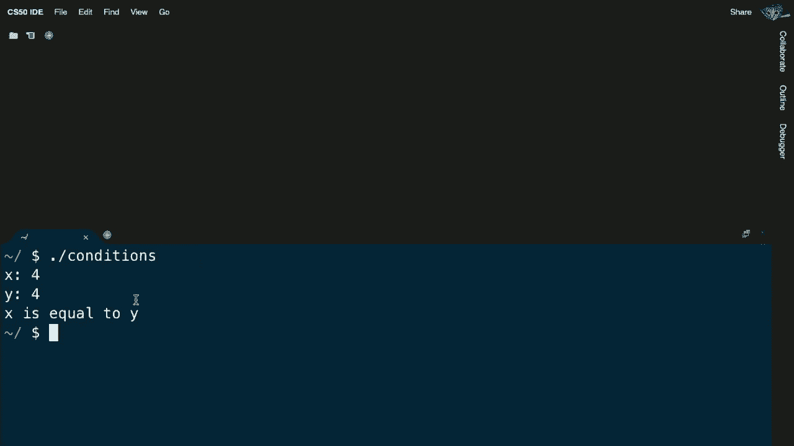

scratch，假设我想写一个名为`agree.c`的程序，模拟这些想法。当登录时，或者使用软件的第一次，或者在我之前删除文件时，我必须输入`yes`或`why`才能继续，让我先**包含**`cs50.h`在顶部，让我先**包含**`stdio.h`。

在顶部，然后我的int main void，这是从之前复制粘贴过来的。现在让我这样做，让我去ah**d，并且不从用户那里获取一个整数，甚至不是一个单词，让我们简单点，只问用户y或n表示是或否，让我去ah**d并给自己一个字符，我叫它c，但我可以叫它任何东西，比如answer。

但如果我只有getchar函数，c看起来是合理的，让我问你同意吗？问号，然后让我去ah**d，比较一下。如果c等于y，那么让我去ah**d并打印出同意，\n，否则如果c等于n，表示不同意。现在不幸的是，我在这里犯了几个错误，其中至少一个可能比其他的更明显，可能引入了。

任何人都可以，嗯，如何处理Olivia，布尔值你使用了单个等号而不是双等号，因此都很好，所以我使用了单个等号。这是因为c数据类型，我一直在使用双等号。

字符串的引号，但事实证明，在C语言中，当你比较单个字符时，你必须使用单引号。所以我会在这里修改，将y和n周围的引号改为单引号。为什么？因为我现在正在处理字符的世界。字符是在你。

讨论字符时，你需要像这样逐字引用它们。变量名c不需要引用，但y和n需要引用。但我不需要改变文件中其他的引用，因为那些仍然是文本字符串，实际的短语或。

所以让我去ah**d试着运行make agree，它编译得很好。让我去ah**d运行./agree，我是否同意？让我去ah**d输入y，同意，我喜欢这样，所以让我试试n，不同意，哦，我忘了一个\n，所以让我快速修复一下，只是为了保持一致性。让我重新编译我的程序，假装这一切从未发生过，但让我现在非常合理地这样做。

./agree我想要同意，是的，大写Y，呃，没发生什么，那n呢，大写N。没发生什么，但程序仍然正常运行，如果我使用小写字母也能工作。如果我在这里使用小写字母也能工作，那到底发生了什么呢？好吧，计算机只会逐字理解你，即使我们人类可能会觉得。

好吧，是大写还是小写，问两个问题如下：我们可以做一些类似的else if c等于大写Y并用单引号括起来，你可以想象再次说同意，就像这样。但就像上周我开始复制和粘贴Scratch块一样，这可能不是很好的设计，类似地，这段代码的第11行。

14行几乎是相同的，我们来看看是否能结合这些想法。让我表达一下，如果c等于y或c等于大写Y。实际上你可以使用这个竖线运算符，它是逻辑或运算符，并且实际上可以一次问两个问题。结果证明，你可以使用与的概念来实现这个。

使用“&&”逻辑与，更多的将在另一次讨论。但两个竖线是相当于说“如果左侧这个或右侧这个”，现在如果我保存并重新编译程序，运行`make agree`，然后执行`./agree`，你会看到我可以输入小写的y。

或者用大写Y，这样它就能工作。因此，如果我可以结合这些思路并让我的程序更好设计，注意到这一点，我一直在每次进入花括号时，严格缩进，每次有if条件或else时也如此。

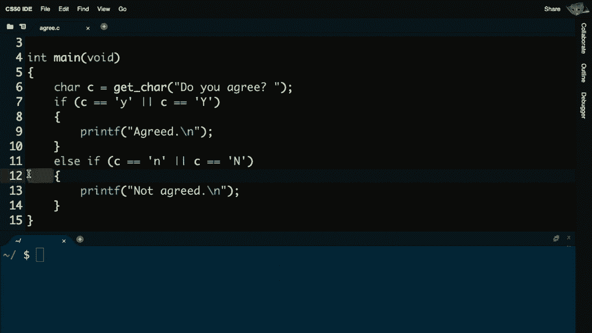

风格和美学好吧，现在让我们考虑，不仅有能力表达条件，还有这些称为循环的东西。结果，在Scratch中我们有非常简单的“永远做以下事情”循环。C语言则有点笨重，C中没有“永远”关键字，但我们可以如下模拟这个概念。

这实际上是说“当...时”，在英语中具有正确语义，像是“当某事成立时就做这个”。但你必须更加明确，不能仅仅说“当”。在C中，“当”类似于一个条件，它不断地询问一个问题来决定是否继续，这与它自己的布尔表达式非常相似。

在C中，使用while时，你必须在“while”之后有括号，并且必须在括号内询问一个问题。这是一个小的边缘案例，因为如果你想做某事永远，谁在乎问题是什么，你只想要答案始终为“是”，或者在计算机术语中。

始终为真，最简单的方式来表达“真”。虽然这看起来有点奇怪，但在C中，这就是你故意引发一个永不停止的无限循环的方式，你甚至不需要问一个更复杂的问题，你可以简单地让某事发生。

“永远”是表达某事永恒的最经典方式。如果你想做有限次数的事情，我们也可以在C中做到。使用我们将称之为for循环或while循环的方法，我们逐一考虑这两者，最机械的手动方式我能想到的是。

就像我用手指头计数一样，最少在我的手上计数十次。那么我该如何在C中做有限次数的事情呢？我可以使用变量来做计数器，将其初始化为零，数据类型为int，因为我只需要像在手指上计数那样。

冗长的程序员在频繁计数时，通常会从零开始计数。他们往往会直接使用 i，字符串，你并不总是想在代码中这样做，有时让你的变量名称更具描述性更好。但对于一个只会从 0 开始计数的简单变量，我们不妨简单点，称它为 i，我得问。

有个问题，因为我不想让这个无限运行，我希望它运行 50 次。我可以问什么问题呢？好吧，为什么我不检查一下 i 是否小于 50。就像在 50 根手指上计数，直到 50，然后执行以下操作，我想做什么呢？我想不断打印“你好，世界”，你好，世界，你好，世界，迭代。

在这个循环的每个周期，我需要做一件事。从数学上来说，我需要再加一个手指，换句话说，我需要给 i 加一。所以让我去把 i 设为当前值加一，但我们又有一些语法糖，让它更简洁。

我可以用 i 加上等于一，甚至更简洁地用 i 加一，所以尽管这在实现上比在 C 中要烦人得多，但我们现在有了所有的构建模块。现在有了变量，重复某个有限次数的概念。但是还有另一种方法可以做到这一点，正如你可能已经发现的那样。

从零开始有不同的方法来实现同样的功能。我可以从一开始计数，一直计数到 50。所以你的键盘上大概没有大于或等于符号，或者小于或等于符号。因此在 C 中，像其他语言一样，你只需使用两个字符，使用小于符号。

后面跟上等于号，这表示小于或等于。所以如果我从一开始计数，到 50 也是正确的。你可以这样做，但不要这样做，这不符合常规，程序员通常会在上周开始时总是把灯泡关闭，他们会从零开始计数，到 250。

这隐含给你 0 到 49，所以做这个，而不是那个，但这确实说明了你可以用许多不同的方法解决问题，还有另一种计数的方法。我们必须用 i 减一，而不是 i 加一。所以这又是三种解决同一个问题的方法，而且你会开始拥有正确的。

直觉和肌肉记忆，你还会开始看到讲座代码中常见的模式，你的助教代码，书籍和在线参考资料，往往是做事的方式。好吧，这里还有一种循环的方法，结果发现还有另一种循环结构，这种结构更隐晦，称为 for 循环，它允许你自动化或说得更准确些。

再简洁一点，对于 printf，打印“你好，世界”将使我们更接近于打印 50 次“你好，世界”，但 for 语句就像 while 语句一样，后面必须有必要的括号，但这次你可以在括号中放更多内容，它不仅仅是一个布尔表达式，括号中的第一件事。

你可以将任何变量初始化为某个值，我可能会说counter等于零，或者更简洁地，int i等于零分号，但for循环的样子有点奇怪。你可以在一行上做多件事，for循环括号内的第二件事是你想检查的条件，for循环括号内的事情是。

更新或递增或递减，或者说，让我们就用i加等于1，甚至更简洁地，i加加，这可能是C语言和其他编程语言中最常见的做某事的方法，50次或有限次数。这看起来与我们迄今为止所见的有所不同，分号出现在奇怪的地方。

括号中还有更多的东西，所以总体来说。

但现在只需意识到，这表示将i初始化为零，检查条件，如果i小于50，则打印“hello world”，然后更新i，然后检查条件，然后。如果它小于，打印“hello world”，所以变量的初始化只发生一次。其他一切都一次又一次地发生，直到你完成这个。

一共50次，好吧，因此有了这些构建块，我们的Scratch到C的翻译就差不多了，现在让我们开始构建一些更有趣的程序，并进行实例抽象，因此抽象回想一下是这个。问题解决原则，你可以简化否则更复杂的问题。

细节是抽象，这是一种在更复杂的细节之上的简化，或者可以说。所以例如，让我继续写一个名为meow的程序。类似于上周，但这次用C语言，为了让猫以文本形式“喵”，让我在顶部给自己添加standard io.h，在int main void这里，再次我在一个名为meow.c的文件中。

我已经包含了standard io.h和int main void，现在我要继续做类似这样的事情，printf“喵”换行三次。让我保存那个文件，生成meow，好吧，现在点斜杠meow，喵喵喵，全是文本，所以没有上周那样神秘，但它是正确的，但并不是很。

设计良好，因为我在重复自己，这是坏的本能，但现在我们有能力使用循环，所以让我实际上删除这个函数的部分，试着回想一下之前的例子，如果我想做某事三次，我可以使用几行代码。让我这样做：int i等于零，i小于三，i加加。

这样说有点晦涩，但这又是事实上的方式。

做某事有限次数，初始化某个变量，保持。不断递增你的变量，使其总共执行那么多次。

melo，重新编译，meow 通过让我执行 dot slash，meow，然后 voila。现在这个程序可以说设计得更好了，但让我进一步说明。这一周的轨迹不仅是实现 meow，更是以更好的设计来完成，而不必重复自己，因此使用循环。

但是请记住，我们引入了一个抽象概念，那是一个名为 meow 的自定义拼图块，我们也可以创建自己的函数，语法会需要一点时间来适应。但让我去 ah**d 这样做，让我去掉这里的 printf。在我文件的底部，实际上在我文件的顶部，void，meow void，这对于。

今天但这对于现在来说，复制粘贴是没问题的。让我去 ah**d 这里打印 f meow，即使我们还没有解释。

今天不会解释这个关键字 void 的含义，我在第三到第六行中做的是创建我自己的自定义函数，C 语言并没有提供一个名为 meow 的函数，CS50 的库也没有提供一个名为 meow 的函数，但现在多亏了我，这个函数存在于生活中，只是打印出 meow，但是什么呢？

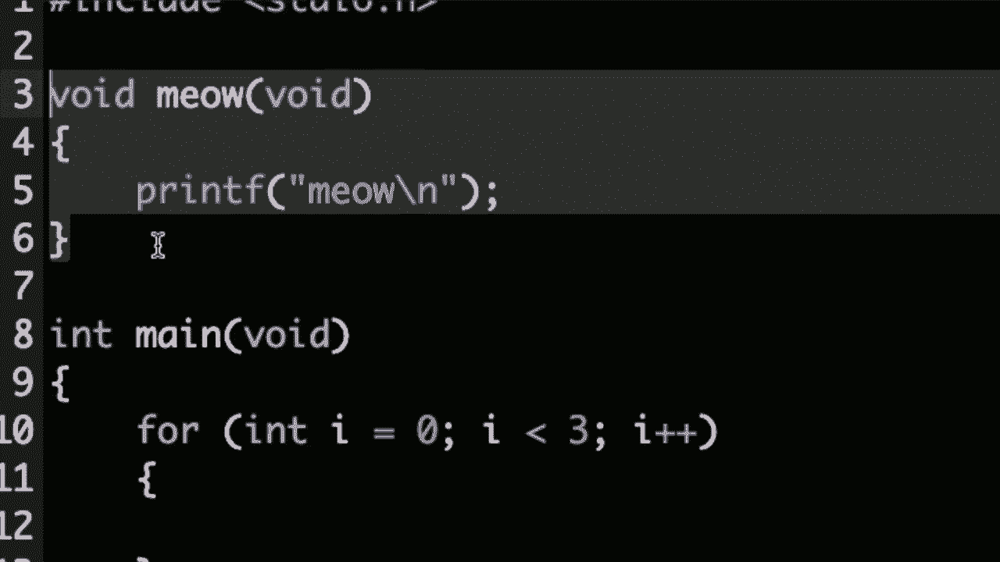

现在很酷的是，就像上周的 scratch 一样，我现在可以调用一个名为 meow 的函数，而我的，相当于说它的功能，只是通过函数名。让我去 ah**d 编译这个，make meow，到目前为止一切顺利，dot slash meow，似乎工作得还不错，但我不喜欢我把 meow 实现在文件顶部这个事实。

这没什么大不了，函数位于文件底部，为什么只有教学助理想从上到下理解你的代码？这只是人类的惯例，将主程序，主函数放在文件的顶部。问题是当我这样做时，我会为自己创造一个问题，当我运行 make meow，现在出现了两个错误。

所以有几个错误需要解决，但首先，布莱恩，来自小组的一个问题，聊天中有一个问题，关于为什么在第五行这里，你的 for 循环末尾没有分号，而在第十一行你没有在函数名末尾加分号。

那么为什么有些行需要在末尾加分号，而其他行则不需要？这是个好问题，为什么有些行没有分号而其他行有。简短的回答，虽然不是为了让人感到轻率，老实说，只是因为语言的设计方式是，你通常应该在表达动词、动作或函数时结束你的思想。

使用分号，我们已经看到，例如在 printf 之后，我们刚刚看到在 meow 之后。然而，当你使用其他编程结构时，比如循环或自定义函数时，你就不需要分号了。为什么几年前一些人类决定在这些地方不需要分号？这就是一个需要时间来发展的事情。

肌肉记忆和识别这些东西去哪里以及不去哪里的心理模型。但是到目前为止，我们看到分号的唯一地方是在函数末尾，比如`meow`和`printf`，现在是括号，问题是一个和第一次实验等等。您通常希望回顾像这样的例子和幻灯片。

您部分中的引用，以便您能理清思路，这些模式。所以让我现在继续解决我似乎在这里创建的两个问题。虽然有点不明显，但它让人想起我们以前看到的内容。函数`meow`的隐式声明在C99中是无效的，C是我们正在使用的语言，但这仅仅是。

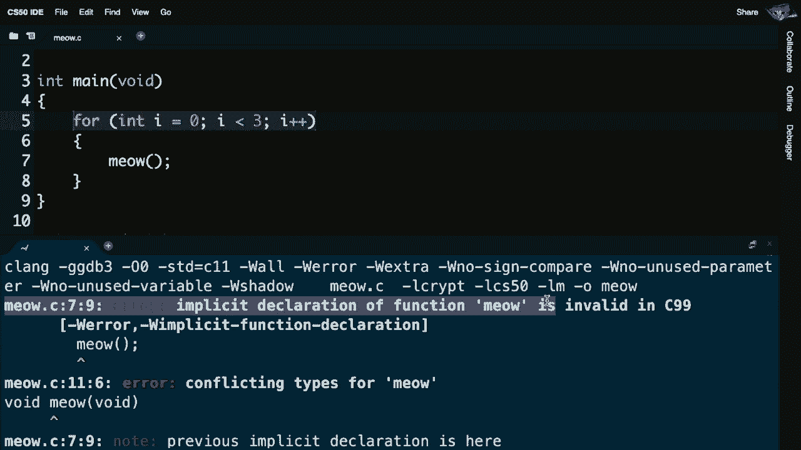

变得困惑，C现在很好。那么为什么呢？让我向上滚动一下。坦率地说，C及其编译器并不聪明，它们显式地，当前的问题是，当编译器从上到下、从左到右读取我的代码时，直到第行。

11，`meow`函数甚至存在的那一刻，坦率地说，编译器并不知道`meow`是什么，因为它还没有处理`meow`，而编译器不够聪明，或者不够用户友好，不能先读取所有内容，然后决定是否有问题，它只会从上到下读取一次。

它将在遇到问题时立即对您大喊，所以解决这个问题的方法很简单，就是将函数移动到文件的顶部，但这最终会变得烦人，因为那样您就得去寻找主函数，或者还有另一种方法，我们会解释。

这也会在适当的时候完成，但您也可以只复制自定义函数`main`的第一行。然后回答布莱恩的问题，并且要加上分号，所以这很奇怪。这通常被称为原型，这是一个提示，只有它算是一种聪明的方式来告诉编译器，将会存在一个名为`meow`的函数，但现在还不存在。

但要知道它会的，这只是一个常见问题的变通办法。好吧，所以让我继续进行一个更改。再进行一次更改，假设我真的想完成这个`meow`示例，就像我们在Scratch中那样，我们还允许`meow`接受一些数字。

输入是`meow`，所以我不想要这个函数。

`meow`，在我的主函数中是3，成为`meow`函数的输入。现在我需要更改我的自定义函数。

就像我上周做的那样，结果证明更多内容将在接下来的几周中出现，11。简而言之，我的自定义`meow`函数今天没有返回值，它不会输出任何内容，实际上它只是有一个副作用，就是在屏幕上可视化打印，但它确实有一个输入。

你可以字面上做一些，比如你想要的类型的名称和你想要的变量名称，所以假设我想让 meow 作为输入一些数字，我们称之为 n，我想在循环中使用这个数字。我可以这样做，for int i 从 0 开始 i 小于 printf。

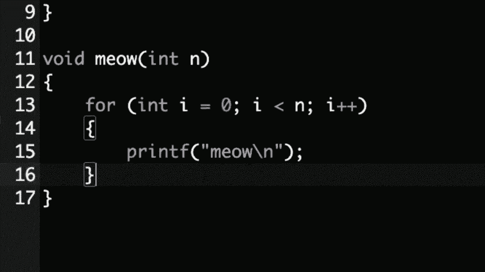

使用大括号，现在注意，就像上周我最终的实现一样。

我自定义的函数可以像括号所示那样接受输入。它没有输出，因此我将这里留空，但我们稍后会更详细地解释 void，但现在我正在使用那个输入。这是在 C 中的新实现，我使用相同的构建块，使用一个 for 循环。

我像之前一样，但不是硬编码 3 或 50，就像我之前做的那样。现在我实际上会继续，将那个变量插入。就像 Scratch 让我做的那样，假设我想做一些更花哨的事情，你知道的，让我继续这样做，假设我们想从用户那里获取输入。

但我们确实希望他们提供一种特定类型的输入，让我先去介绍另一种类型的循环，我将从我的档案中获取我今天带来的代码，并复制一个文件。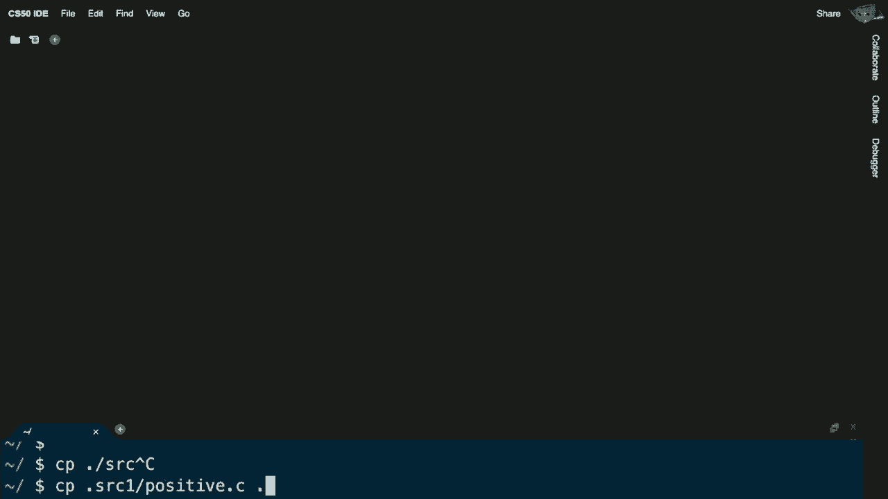

这个函数会有一个值，因此这也在课程网站上。让我带你走过我已经写的代码，在我文件的顶部，我包含了一些现在熟悉的头文件，在这里我包含一个原型，作为将要被调用的函数的提示，简单地说就是获取正整数。

这是一个只获取正整数的函数，在我的主函数中。注意我将使用这个，我将在第10行获取一个名为 i 的变量，并从用户那里获取一个正整数，然后我将把它打印出来，但现在有趣的是。我有这个额外的抽象，cs50 库并不包含一个名为 positive.c 的。

函数叫做 getpositiveint，但它确实有一个名为 getint 的函数，注意我在第 15 行到第 24 行之间做了什么。在这里我声明了一个名为 getpositiveint 的函数，注意这是我自己的自定义函数。它不接受任何输入，只是从用户那里获取一个正整数，但现在注意。

它确实有一个返回值，之前我使用 void 这个词来表示没有输入或没有输出，在这里我仍然使用它来表示。没有输入，它总是获取一个正整数，但我在这个自定义函数的左侧说 int。确实有输出，输出将是什么呢，注意这里在第。

17 我给自己一个变量，称为 n，然后我今天有 c 的一个最终新特性，这个循环。这个循环不是 while 循环，而是 do while 循环，while 循环首先在检查条件之前。因此注意，这里我将执行以下操作。使用这个提示正整数调用 getint，然后存储返回值。

赋值给变量 n，然后在这里注意，我说，当 n 小于 1 时，这种语法有点奇怪，但如果从数学上讲，我想让用户给我一个正整数，这实际上与我想让用户给我一个整数是同一回事。只需确保它不小于 1，因为如果小于。

一个是零或负一或负二，这显然不是代码中的。这时唯一的新东西是，存在这个东西，do while，然后。检查一个条件，while 循环首先检查条件，然后做一些事情，而这正是我想要的，我想做到这一点，从整数中获取一个正数。

然后当 n 小于 1 时，如果人类输入零或，想要重复。一直这样做，所以它在语法上是合理的。在 n 小于 1 时执行以下操作，最后唯一的新行是返回。n，这是一种程序实际上可以返回某个值的方式，它可以把你交还一个。

通过在屏幕上打印它，或者从猫的嘴里听到声音来返回值。它以某种意义返回，返回的是 n，这是一个匹配该函数输出的整数。为什么这有用呢？好吧，让我们向上滚动，现在假设 get positive 函数存在，现在注意，我们如何在 main 中使用它，我调用 get。

正数整数，右侧类型为整数，我将返回值存储在左侧名为 i 的变量中，然后我打印 i，刚刚开始。现在我已经实现了 get positive，它在某种程度上已经被抛到脑后。我知道可以做到这一点，我可以抽象出，只是一些奇怪的东西。

我确实想指出这些实现细节，为什么我在这里声明 n。每次我创建变量时，我都是这样做的，有人想猜测为什么吗？我在第 27 行将 n 声明为 int 的这种方法实际上是不会正确工作的。为什么这可能不正确，这很微妙，如果你之前编程过，你会明白。

可能你对这个有直觉，或者如果没有，也许只是稍微有点。为什么这可能无法正常工作，abigail，为什么这不起作用，我们，嗯。我不确定，我想我们已经，赋值过了，它是一个整数，思路很好。在这种情况下不是正确答案，出于更微妙的原因，这不会起作用。

其实在某种意义上，这与这些大括号有关。我们一直很幸运，每次我声明变量时。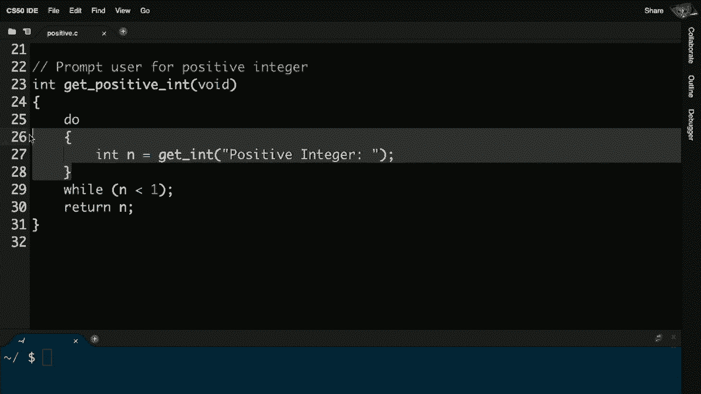

它们技术上处于花括号之间，花括号属于主函数或我迄今为止编写的其他函数，但在这种情况下问题在于，当你在花括号内声明一个变量时，会遇到什么。

我们将称之为作用域问题，变量的作用域是它存在的代码行。变量的作用域是你可以使用的代码行。今天的情况是，如果你在像第26和28行的花括号内声明一个变量，出于do while循环的需要，那么变量n仅仅存在于那些花括号内。

变量n只存在于花括号内，而在第29行中不存在，这意味着你无法在第30行返回它，它在那时就不再存在了，所以你做了所有这些工作获取变量n，然后一旦退出这些花括号，它就消失了。因此解决办法，尽管这很愚蠢，实际上是你可以在第25行单独声明它。

你甚至不需要给它赋值，因为你最终会给它赋值。但再次强调，创建一个变量就像我一直说的那样，是声明一个变量。你不需要立即将其定义为有值，所以这是解决作用域问题的一种方法。

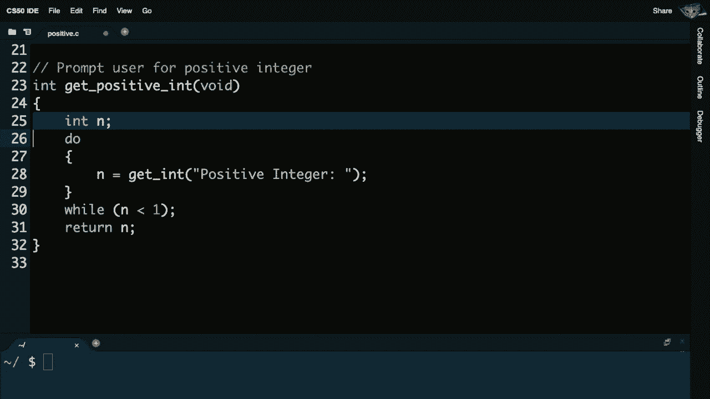

让我去提议一下。

解决一些更图形化的东西，你当然会记得《超级马里奥兄弟》是我们上周提到的第一个问题集，在这个游戏中有很多视觉效果。例如，这里有早期的天空和这些问号，如果你跳起来。

在它们下面给你金币，对此让我问，嗯，我怎么能在C语言中写一个程序，打印出问号呢？好吧，让我去做这个，让我去写一个叫做mario.c的程序，接着让我去包含标准库，standardio.h。在一个叫mario.c的文件里，给自己一个main函数，main void，我要把这个保持简单。

printf1234反斜杠n分号，这远没有老式游戏那么酷或好看，但如果我运行make mario，然后执行dot slash mario，瞧，我得到了一个非常糟糕的近似，或者说真正的ASCII艺术，但我可以做得更好，回想一下，现在我们有能力使用循环，所以我可以说for。

int i等于0，i小于4，输出一个问号，然后输出一个换行符。只是为了在最后一刻移动光标，我不想为每个问号都这样做，因为那样最后的结果是相同的，但在某种意义上稍微好一点，因为现在更动态，现在使用循环而不是硬编码的值。

但让我现在聪明一点，做点别的。让我借用那个正整数示例的逻辑，做一些类似的事情，叫做n，表示一个数字。让我像之前那样，先从用户那里获取一个整数，并询问用户我想打印的砖块的宽度，所以它不总是四，也许是。

可变数量的砖块。然后让我继续，当`n`小于1时，与我之前的逻辑相同。你知道吗，一旦我有了一个值`n`，让我在这里加上一个注释，从用户那里获取正整数。也就是说，所有这些单行注释每隔几行就可以注释一下，如果有必要。

逻辑上这样做是有意义的，让我继续打印出那么多的int。`i`初始化为0，`i`小于`n`时，`i`加1，现在我可以打印出一个问号而不换行，然后在程序的最后，我可以打印出一个换行符，分号。让我继续。

增加我的终端窗口的大小，让我做`make mario`，现在哦，`get int`。这里的`help50`可能是我的朋友，所以让我继续，运行`help50 make mario`。它会询问帮助，啊，你似乎在`mario.c`的第9行有一个错误，隐式声明了函数`getint`，clang意思是下周。

这意味着它不认识`getint`，你是否忘记包含`cs50.h`？在这里声明了`getint`。我输入这个，所以包括`cs50.h`，保存文件，然后用`make mario`重新编译。现在让我继续，运行`./mario`，我给自己一个宽度四。还是一样，让我给自己一个宽度40。现在我得到了这种动态性。

让我给自己一个宽度50，等等，所以现在我们有了一个更加动态的程序。但你知道吗，让我们进一步增强一下。稍后在超级马里奥兄弟中，有很多这种地下世界，你可以看到这些砖块的网格，注意到这一点。

这看起来像是多行砖块，横向和纵向都有，所以有宽度和高度。我该如何打印出，可能是三乘三的砖块呢？让我实际上进入我的程序，去掉之前所有的问号内容，考虑一下如何打印出一个。

三乘三的网格。那么，我的代码可能是，三更多的哎呀，也许再加三，然后再三。但是当然，这样的复制粘贴从长远来看是行不通的，但没关系。让我做一下`./mario`，好吧，我有点像是一个网格。看起来像这个东西，虽然不完全一样，但至少是对的想法。

但这不一定是最好的方法。我真的想去，结果发现。使用C语言，我们实际上也可以这样表达，让我继续这样做。让我打印出以下内容，不只是一次又一次的井号，让我继续为int做这件事。

我设置`i`为0，`i`小于3，`i`加1，我还不知道我接下来要做什么。我要做三次，那么我想要三行，每行上我想要三条井号。所以你知道，你可以嵌套循环，让我设置`int j`为0，`j`小于3，`j`加1，我还不知道我将要做什么，但。

我确实知道我要做这件事三次，你也许可以看到这是什么方向，三件事，三块砖，只要在这个内部循环里，可以说这个嵌套循环中，我打印其中一条井号，然后换行。在这里，为了明确，即使它已经开启，我们也知道这就是你所使用的语法类型。

进行有限次数的操作，三次，这就是相同的语法，但我使用了不同的变量名，以便跟踪两个不同的值，基本上是行和列，然后每次我只打印一个砖块，但在我打印完一整行后，换行。因此让我试试这个，让我去`ah**d`并在我的代码中制作马里奥。

`./mario`，瞧，现在我使用嵌套循环像这样打印砖块，如果我想做一个10乘10，我所需要做的就是在一个地方更改它，或者如果我真的想变得花哨，我可以再次使用`get int`。我可以从用户那里获取宽度和高度，并完全做到这一点。

动态地，但如果我做10乘10，比如说，我至少可以看到一个更大的网格。所以如果你想知道像超级马里奥兄弟，或者坦率地说，现在在PC、控制台或手机上任何游戏是如何制作的，就是这种地图生成方式。也许在过去，它们是硬编码的，也许是使用代码生成的，你可以完全想象得到。

像这样，因此最终你的游戏甚至你的世界都是部分动态生成的。我们已经有了基本构件，但并没有真正讨论计算机能做的限制，而在最后的时刻，我们想为计算机不太擅长的事情设定一个舞台，实际上存在的问题，几乎是潜在的。

今天我们所做的一切，但我已经超出，这幅图是典型计算机内存或RAM（随机存取内存）的图片，它只是你手机、桌面或笔记本电脑中的一个。在程序运行时，它存储着程序。所以在Mac或PC上，如果你双击一个程序。

这最终存储在一个文件中，执行`./mario`并按回车。在这样的程序中，你正在使用cs50的IDE的RAM，但相同的想法也适用于云中的其他地方。然而，事实证明，如果你只有有限的内存，就像这样，你能做到的事情是有限的，你无法解决世界上所有的问题。

我所指的是什么意思呢？让我继续创建另一个程序，叫做 imprecision.c。我们将看到我为什么这样命名，在 include，standardio.h 中，再次在主函数中只是为了给自己一些设置，然后让我继续非常合理地非常简单地询问用户一个叫 x 的浮点型变量。

值就像之前一样，让我请求另一个变量 y，然后让我继续打印出使用 percent f 的值，x 除以 y，所以我在这次使用浮点数进行除法，但让我们继续运行这个隐式声明函数 get flow，我没有练习过我。

我还需要包含定义，现在让我重新编译，现在它工作了。让我继续运行 imprecision，十分之一，好吧，所以 1/10，看来根据我非常简单的计算器，但我现在有点好奇，它看来 printf 的功能比我们看到的还要强大，实际上你可以打印出超过单个数字。

假设我想输出的不仅仅是六个有效数字，而是十个。语法有点奇怪，但不再是说 percent f，点，然后是你想要看到的数字位数，最后是 f，所以让我继续编译这个，make imprecision。现在让我执行点斜杠 imprecision，和十分之一，哈哈，这有点奇怪。

我不记得知道十分之一的末尾有一个 1.5。好吧，让我们更深入一点，打印出 50 个小数点，真的深入挖掘一下这里发生了什么，让我重新编译我的代码，并重新运行点斜杠 imprecision，进行 1 除以 10，哦我的天，就像我。

我非常确定在小学时，当我们都学会 1 除以 10 时，老师告诉我们是 1/10 或 0.1。他们从未提到它实际上是 0.1000001490116，等等。那么发生了什么呢？就像我们今天看到的所有语法一样复杂。我的天，电脑连十分之一都无法正确计算，所以我们正遇到问题。

面对一个基本限制，如果计算机有那么多的 RAM，那么多的硬件，那么多的位，那很合理，如果你只使用有限数量的位，例如 32 或 64，是的，你可以数得相当高或相当精确，但你无法无限制地高或无限制地精确地数。

在某个时候，你必须开始通过使用 32 来逼近值，表示浮点数，世界上有无限数量的浮点实数。不幸的是，如果你有有限的位数，你必须开始削减一些角落，而这正是计算机正在做的。

它尽可能接近地表示十分之一，这就是你随后在大多数。问题中看到的，这可能不是大问题，但如果。你在进行数学、处理金融、货币价值或军事操作时，那可能真的是一个大问题，其中许多小数字，呃，科学上确实开始累加。

确实有许多例子发生，还有另一个问题，计算机不仅仅面临这种浮点精度。即使是整数也有它们的局限性，回想一下，整数当然可以在十进制或，二进制中表示，如果我们有三个灯泡。

或者三位比特，让我们考虑一下如何，使用二进制进行计数，零零零是我们上周开始的地方，零零一，零一零零一一一零零，现在。这从上周回想起来是我们知道的七，在十进制中，只需。进位而已，但如果我只有，位数，进位，就消失了，因此存在这个问题。

也是整数，有人早些时候提到过，当我们。尝试做20亿或当你。尝试做20亿加20亿时，它无法适应结果，这是因为整数。如果它们只有32位或在C中是长整型，如果它只有64位，那些是大数字，但并不是， 无限大，我们人类已经，屡屡绊倒在这上面。

你可能记得听说过，甚至经历过Y2K问题。世界上许多东西崩溃了，或者担心会崩溃，做出了合理但不够长远的决策，仅用两个数字来存储年份，因此1995年。将被表示为95，96、97、98、99，然后，到了1999年到2000年的年末。

任何仍在使用两个数字的计算机程序或系统，当然会在第三位数字。可用时加一，它就消失了，整个世界将年份2000混淆，认为，作为前缀，如果你能相信，我们人类即将在2038年再次做到这一点，这离现在并不远。

我们即将耗尽比特，用于跟踪时间，因为，时间。他们将使用32位来，表示数字，更新，1970年1月1日。所以那是时间的开始。从某种意义上讲，计算-wise，而不幸的是，使用32位你只能。计数到大约40亿，而不幸的是，我们将会达到。

在2038年1月19日，达到第40亿秒，所以除非。我们所有人都升级我们的Mac和PC，还有更糟糕的嵌入式系统和卫星，以及任何硬件。嵌入在我们现在使用的各种设备中，否则我们即将再次遇到这个问题。突然之间，这将像是1月1日的问题。

因此，尽管我们在C和Scratch中看到的所有强大功能，仍然存在这些。基本的限制，因此在解决你自己的问题时。在C和CS50中，关注这些。约束将变得极为重要，并且最终找到，现在，我们将在这里结束，留给你。

你在C语言中的第一个问题集。
