# 哈佛CS50-CS ｜ 计算机科学导论（2020·完整版） - P4：L2- 字符串、数组、调试方法 1 - ShowMeAI - BV1Hh411W7Up

好的，这里是 CS50，这是第二周。

我们将更深入地探讨这个新语言，并回顾一下上周的内容，以便你更好地理解 C 语言的一些特性，以及你所采取的一些步骤来让你的代码工作。所以我们将逐层剥离上周的抽象，以便你更好地理解真正的。

了解计算机内部正在发生的事情，所以当然，上周我们以 C 语言中可能最经典的程序开始。你几乎可以用任何语言编写的最经典的程序是 hello world。但请记住，在我们实际上运行这个程序之前，我们必须进行转换。

它将源代码转换为计算机自身所理解的语言，上周我们定义为二进制的零和一，亦称为机器语言。因此，我们必须以某种方式从这个源代码转化为更像这样机器代码的形式，也就是计算机实际理解的零和一。

你可能还记得我们命令叫做 hello，我们能不能创建一个叫 hello 的程序，而 make 则有点高级，它假设如果你想创建一个叫 hello 的程序，它会自动查找一个叫 hello.c 的文件。这一切都会自动为你完成，最终的结果当然是一个名为 hello 的额外文件。

所以你可以执行 dot slash hello 然后继续前进。但结果显示，make 实际上是在为我们自动化一组更具体的步骤，我们现在将更仔细地看看。因此，屏幕上显示的正是我们上周写的代码，它简单地说 hello world，hello。

或者制作马里奥，或者制作现金，或者处理最近可能遇到的任何问题，你会看到一些神秘的输出信息。但即使一切正常，你也会看到这段白色文本，表明一切都很好。而上周我们基本上忽略了像 dot slash hello 这样的内容，但今天我们来实际。

更好地理解我们一直视而不见的内容，以便让你了解屏幕上发生的事情。所以再次，如果我在这里执行 ls，我们不仅会看到 hello.c，还会看到我通过 make 实际创建的可执行程序 hello，但看看这个输出，有一些。

这里提到了一个叫做 clang 的东西，还有很多其他计算机术语，包含了一些前面带有破折号的神秘短语。结果显示，clang 其实是在自动化执行一个命令，更具体地说，是一个叫 clang 的编译器。

将源代码转换为机器代码，我们实际上一直在使用`clang`。但请注意，`clang`需要更多的专业知识，你必须对发生的事情有更多的了解才能使用它。所以让我去掉名为`hello`的程序，我将使用`time`，通过输入`y`来确认。

我现在再次输入`ls`，你好。`c`是唯一剩下的文件，暂时让我去掉使用`make`的能力，现在我们直接使用`clang`，`clang`是另一个程序。它安装在cs50 ide中，是一个非常流行的编译器，你也可以下载到自己的Mac和PC上，不过运行它稍微有点不同。

我将去输入`clang`，然后是我想要编译的文件的名称，`hello.c`就是这个文件。接下来我将按回车，现在似乎什么都没有发生，但实际上。当看起来没有发生坏事时，这通常意味着发生了一些好事，你的程序编译成功了，但奇怪的是，如果我现在输入`ls`。

你没有看到程序`hello`，你看到的是这个奇怪的文件名`a.out`，实际上这是一个历史遗留问题，很多年前人们编写代码时，每个程序被赋予的默认文件名是那个，这有点愚蠢，因为它并没有说明其功能。因此，像`clang`这样的程序可以在命令行中进行配置。

再次提到闪烁的提示符，在那里你可以输入命令，所以确实我将去删除这个文件，`rm`，空格，点，输出，然后确认输入`y`。现在我回到了最开始的状态，只有`hello.c`，接下来让我去做一些不同的事情，我将输入`clang -o hello`，然后是单词`hello`。

`c`，我在这里做的是提供我们正在进行的参数。因此这些命令像`make`和`rm`，有时可以直接通过输入单词并按回车来运行。但我们经常看到它们在某种意义上需要输入，你输入`make hello`，你输入`rm hello`。在这些情况下，第二个单词`hello`可以算作命令的输入。

否则现在称为命令行参数，它是命令的输入，所以在这里我们有更多的命令行参数，我们有单词`clang`，这是我们即将运行的编译器。输出的符号，请输出以下单词，`hello.c`。所以长话短说，这个命令现在虽然更冗长，但它是在说运行`clang`，输出一个名为`hello.c`的文件。

并将其作为输入，抱歉，运行`clang`，输出一个名为`hello`的文件，并将输入文件称为`hello.c`。所以当我运行这个命令后，按下回车，似乎又什么都没有发生，但如果我输入`ls`。我没有看到那个愚蠢的默认文件名`a.out`。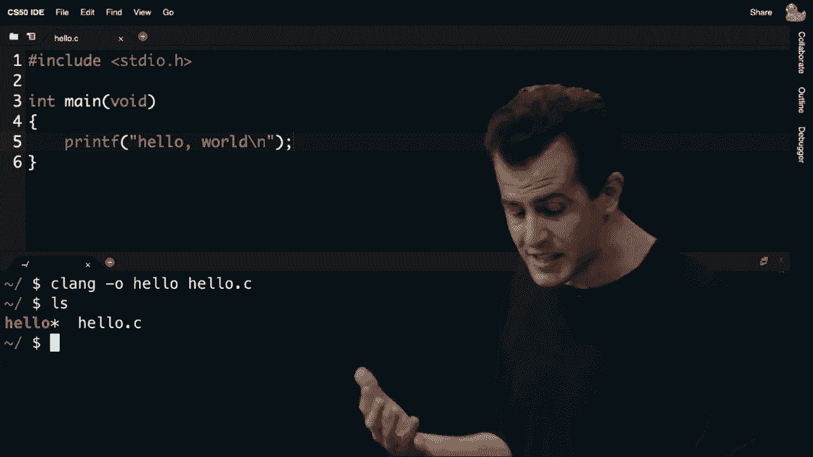

最终，clang 是如何帮助我编译我的代码的，它在自动化所有这些过程。但请记住，这并不是我们上周运行或编写的唯一类型的程序，我们实际上是像这样写代码，然后用 hello world 加强它，实际上涉及到使用 cs50 的 getstring 函数来提示用户输入名字。

但请记住，我们也必须在文件顶部添加 cs50.h。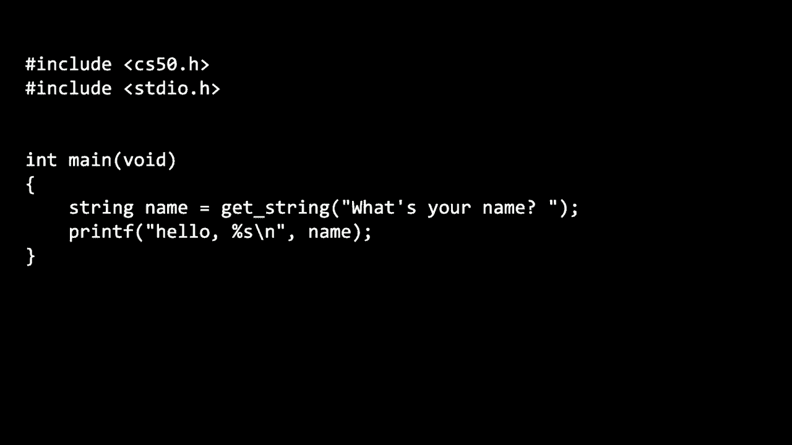

所以让我继续做吧，**让我去**，把 hello 去掉，因为现在是旧版本，让我们去我的 hello.c 文件，包含 cs50.h，现在给自己一个字符串，叫做 name，但我们可以叫任何东西，调用函数 getstring，问是什么。

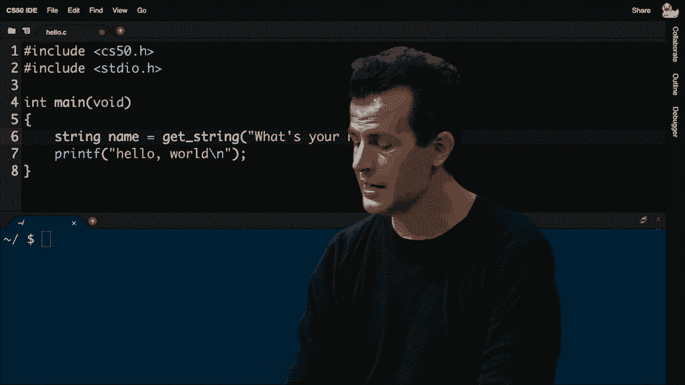

你的名字？在最后加一个空格，只是为了创造一个间隙。然后在这里，不再打印 hello world，让我打印 hello %s，这是一个占位符，回想一下，并输出这个人的名字，所以上周我们编译这个程序的方式就是 make hello，现在没有区别，但这一周，make 只是因为它有点自动化。

现在我想更详细地理解这些步骤，我可以再次编译这个程序，使用 clang -o hello，传递三个参数的相同想法 -o hello 和 hello.c。但关键是，我实际上会看到这些红色的。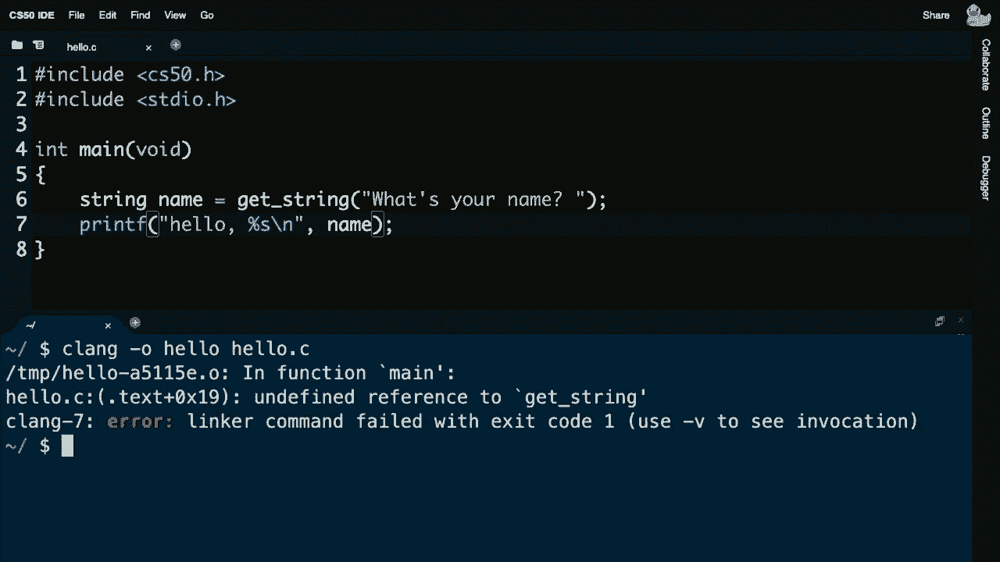

错误消息，让我们考虑这实际上在说什么，仍然在这里。但注意，像往常一样，我们会看到熟悉的，因此，未定义的引用到 getstring，我尚未知道未定义的引用是什么，我不知道链接命令是什么，但我至少意识到 getstring 出现了一些问题。

而且这样做是有原因的，事实证明，当使用一个库，无论是 cs50 的库还是其他库，有时并不是在你自己代码的顶部有文件，而是计算机在哪里找到零和一的功能，比如 getstring，所以像 cs50.h 的头文件。只是告诉编译器这个函数存在，但还有第二种机制。

到目前为止，一直为我们自动化，这告诉计算机在哪里找到实际的零和一的文件，因此，话虽如此，我需要实际添加另一个命令行参数到这个命令中，而不是做 clang -o hello hello.c，我还将附加并承认地做 -。

l cs50 在这个命令的最后，这很简单，指的是链接 cs50 库，因此链接是一个。

一种艺术术语，我们稍后将更详细地看到它的含义。但这个额外的最终命令行参数告诉 clang，你已经知道像 getstring 这样的函数存在，-lcs50 意味着在编译 hello.c 时，确保将 cs50 库中的所有机器代码也包含到你的程序中，简而言之，它是。

当你使用某些库时，你必须做某些事情，所以现在当我按下回车时，一切似乎都很正常。我输入`ls`，看到hello，哇，我可以执行`./hello`，输入我的名字大卫。哇，hello大卫，那么我们为什么不在上周做所有这些，坦白说。我们没有取得任何实质性的进展，所有我们做的只是揭示了底层的运作情况，但。

我声称坦白地说，输入所有这些冗长的命令行参数来编译你的代码会迅速变得乏味，因此计算机，具体来说，最终通过`make`发生的事情是，所有这些，输入的`make hello`上周及以后。好吧，命令，其中一些我们甚至没有提到，最开始，我识别`hello.c`。

这里我识别`-l cs50`，但请注意还有许多其他东西，不仅是`-o hello`，还有`-lm`，它指的是一个数学库，`-lcrypt`，它指的是一个加密库。简而言之，我们的工作人员已经预配置了`make`，确保当你编译。

你的代码时，所有必需的库都会可用。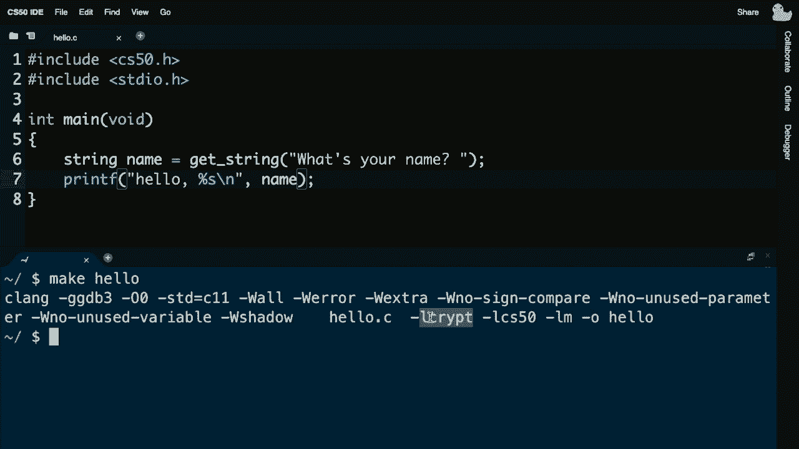

无需担心所有后续步骤，你当然可以通过直接使用clang编译你的代码，或者你可以回到`make hello`。但我们手动运行`make hello`是有原因的，这通常会变得乏味，因此。确实我们在这里所做的是，编译我们的代码，而编译意味着。

从源代码到机器代码，但今天，我们揭示了在底层有更多的确在发生。确实，链接以及其他几个步骤也在进行，所以，事实证明，当你从源代码编译到机器代码时，实际上还有一些其他步骤最终涉及到，当我们。

当我们说编译时，我们实际上是指这四个步骤，我们不会过多探讨这些低级细节，但看看。当你从源代码开始，最终试图生成机器代码时，了解发生了什么，或许是有启发性的。

你编译你的代码，第一步是处理你自己的源代码，它看起来大概像这样。然后它从上到下，从左到右预处理你的代码，预处理你的代码本质上意味着它寻找任何以井号开头的行，所以`#include cs50.h`。包括`<stdio.h>`，而预处理步骤的作用就像是一种查找和替换。

它注意到哦，这里有一行`#include`，让我去啊，复制那个文件的内容，`cs50.h`。进入你的代码，类似地，当我遇到`#include <stdio.h>`时，让我这个所谓的预处理器，打开那个文件`<stdio.h>`并复制，粘贴那个文件的内容。所以文件中的内容现在看起来，更像这样，这一切都是自动发生的。

从未需要手动执行这一过程，这些通常放在文件顶部的代码行。有没有人意识到预处理器在为我做什么，以及我为什么写的代码会有这些井号，像呃，为什么我写的代码会有，和，include standardio.h，但这个。

预处理器显然是自动执行的，替换那些行，替换为这些文件的实际内容。这些东西是什么呢，呃，它是为你使用的代码定义所有函数，否则计算机就不知道该怎么做，确切地说，它是在我的代码中定义所有函数，所以我们遇到了这个问题。

上周有个令人烦恼的错误，我调用了，我想是get positive int，记得在我文件的底部，编译器有点傻，它没有意识到它存在，因为它是在我文件的底部实现的。所以为了杰克的观点，通过在最上面放置这个函数的提及，如果你愿意的话。

这就像是在训练编译器，让它提前知道，我不知道它是怎么实现的，但我知道，getstring会存在，我不知道，printf会存在，所以这些头文件，实际上包含了所有的原型，也就是所有函数在库中存在的所有提示。

所以预处理器只是在省去我们复制粘贴所有这些原型的麻烦，如果你愿意的话，所有这些提示，我们自己完成。那么在那一步之后会发生什么呢？接下来会发生什么呢，可能在那些文件中还有其他内容，仅在这里是原型，所以现在编译实际上有了更准确的定义，我们今天要定义的C。

这里是另一种源代码，这可能是我们见过的最难懂的东西，这不是你需要理解的代码，但屏幕上显示的是所谓的汇编代码，长话短说，世界上有很多种不同类型的，呃，CPU。

中央处理单元是大脑。

计算机和CPU理解某些命令，而这些命令往往用这种叫做汇编代码的语言表达，现在我老实说并不。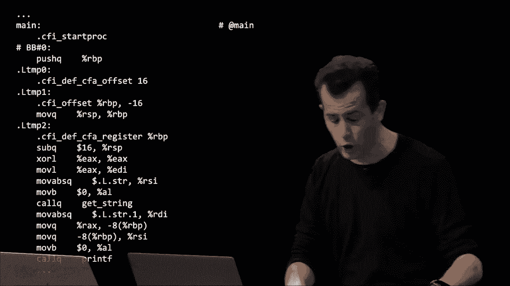

我自己也很难理解大部分内容，确实已经有一段时间了，甚至我强调了几个操作字符，注意到提到了main，getstring和printf，所以这有点像在另一种叫汇编的语言中的低级printf，所以你写C代码，计算机则将其转换为。

更友好的计算机。

被称为汇编代码，几十年前，人类编写了这些东西，人类编写了汇编代码。但如今我们有 C，如今我们还有像 Python 这样的语言，更多的用户友好，尽管在过去的一周里你可能没有感觉到。汇编代码更接近计算机本身所理解的内容。

但还有一步，那就是组装步骤，再次强调，所有这一切发生在你简单地运行 `make` 时，而这个命令 `clang` 组装你的代码，意味着将这个汇编代码转化为零和一，所以你编写源代码，编译器将其组装成汇编代码，然后将其编译成汇编代码。

然后它将其组装成零和一，但实际上还有最后一步。因为你编写的代码已经转换成了零和一，但它仍然需要与 `cs50` 编写的零和一以及多年前 C 语言设计者编写的零和一进行链接。

在它们的情况下，`printf` 函数也是如此，就像这样，这不仅包括原型。对于像 `getstring` 和 `printf` 这样的函数，最顶部的这些黄色行就是最终转换成的，呃，零和一，我们现在必须将其组合，从很久以前的，。

甚至还有一个名为 `stdio.c` 的文件，C 的设计者多年前编写的，技术上来说可能在幕后，但实际上有三个文件在运行。第一个我刚刚声明过的，它的确经过预处理、编译和组装。它此时以全零和一的形式存在于 `cs50 ide` 的某处。

一大堆零和一，表示 `cs50.c`，在 `cs50 ide` 的某处还有另一个文件，表示 `stdio.c` 的零和一，所以这个最后的第四步，也就是链接，正好将我所有的零和一、所有的 `cs50` 的零和一、所有的 `printf` 的零和一全部连接成一个，庞大的整体。

表示你的程序 `hello`，我的天，这听起来真复杂。有这么多步骤，而我描述的所有步骤，对你实现 `mario` 的金字塔或 `cash` 或 `credit` 并没有真正的相关性，因为过去一周我们所做的，实际上是将这四个相对低级的复杂概念抽象出来。

我们称整个过程为编译，所以即使是四个步骤。程序员通常在说编译时，只是轻描淡写地提及细节。但确实存在多个步骤在幕后进行，而这就是，实习生 `clang` 为你做的，自动化这个过程。

从源代码到汇编代码再到机器代码，然后将其与任何可能使用的库链接在一起，所以不再把发生的事情视为理所当然。希望这能让你更清楚，当你编译自己的代码时，实际上发生了什么。让我在这里停一下，因为这实在太复杂了。

看看关于预处理、编译、汇编或链接的任何问题，别名编译。我们不会停留在这个低层次，我们现在会倾向于抽象出来。是的，这些步骤是存在的，但真正重要的是整个过程，顶部的步骤，信息是否包含在 ide 中，或者我们那些文件存在哪里。

我想知道的是这些信息来自哪里。是的，真的很好奇这些文件从何而来，所以当你使用 cs50 ide，或者坦率地说，如果你在自己的 Mac 或 PC 上，且已经预装了编译器，就像我们在 cs50 ide 中一样。

你得到的是一大堆 .h 文件，可能还有一大堆 .c 文件或其编译版本，存放在系统的某个地方。所以是的，当你下载并安装编译器时，你获得了所有这些库，我们预装了一个额外的库，称为 cs50s 库。

另外还带有自己的点。

h 文件及其自己的机器代码也在，所以所有这些文件都在 cs50 ide 中，或者如果你在本地工作，也在你的 Mac 或 PC 上，而编译器 clang 则知道如何找到它，因为安装自己编译器的一个步骤是确保它配置为知道。

关于索非亚的问题，这些文件到底在哪里，呃呃呃，抱歉如果我。

发音错误，基本上，呃，所以每当我们在编译 hello 时，比如说，编译器是否也在编译 cs50，还是 cs50 已经存在于某个机器代码中。是的，这也是一个非常好的问题，所以我有点避开了索非亚问题的这部分，因为从技术上讲，可能 cs50.c 并没有安装在系统中。

从技术上讲，标准 io.c 可能并没有安装在系统中，y 它其实不需要这样做，如果每次你编译自己的程序时，还需要另外编译，这会显得有点低效。

所以实际上可以推断出，计算机通常所做的就是预编译。

所有这些库文件对你来说都是可用的，以便更高效地链接，而你不必一直保持。

预处理、编译和汇编，第三方代码你只对自己的代码执行这些步骤，然后链接，嗯，所有事情都是提前完成的。是的，当我们像替换头文件时，是否只用被使用的原型，或者说所有原型技术上都在呢？

像替代品是的，所以我有点，我，等等，在那些文件里还有很多其他东西，你得到的是这些文件的全部内容，即使你需要的只有这部分。

原型，但这就是为什么我提到技术上可能会有那么多东西在里面，可能没有那么多。

只是一个标准的`stdio.h`文件，里面包含所有内容，可能有一些较小的文件神奇地。

包括在内，不过是的，确实有很多行代码在那些文件里。但没关系，一旦你的计算机，你的编译器只会使用它实际上关心的行，过去一周无疑在某些方面有点令人沮丧，因为你可能遇到了一些问题。

代码中的错误，可能你看到一个或多个黄色提示，或者有点挣扎才能让代码编译通过，再次，这很正常，这种情况会消失。假设我仍然有20%的时间遇到编译错误，更不用说我代码中的逻辑错误了，这只是编写代码过程的一部分，人类在所有方面都会犯错误。

生命形式，而在代码的背景下，这一点更为真实，正如我们前两周提到的，精确度和正确性都很重要，有时很难同时达到这两个目标。所以现在让我们考虑一下，如何让你更有能力调试自己的代码，也就是发现你自己代码中的问题，而这个词实际上有一些词源。

这不一定是第一个错误，但在这里的图片，来自著名计算机科学家格蕾丝·霍普的研究笔记，她发现哈佛马克二号计算机有一些问题，这是一台非常著名的计算机，现在它实际上位于新工程科学中心，计算机出现了问题。

确实，当工程师们查看这个大型主机计算机时，里面实际上有一个错误，图片在这里，贴在格蕾丝·霍普的笔记本上，所以这不是个错误。但这是一个众所周知的实际计算机中的错误的例子。如今我们更倾向于称之为程序中的“错误”，我们上周确实给你提供了一些工具。

对于故障排除，`help50`可以帮助你更好地理解一些晦涩的错误信息，这只是因为工作人员编写了这个程序来分析你遇到的问题，我们试图将其翻译为更易于理解的语言。我们看到一个叫做`style50`的工具，它帮助你解决你的正确性问题。

但仅仅是通过你的代码的美观，帮助你更好地缩进和添加空白行。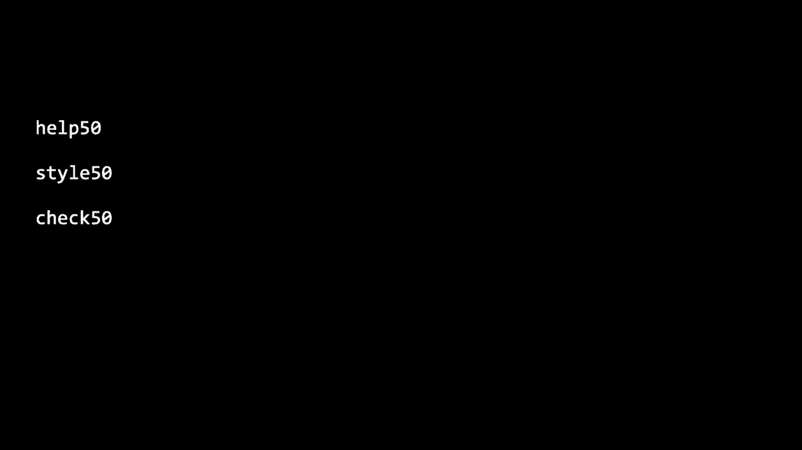

或空格字符，这样对于人类来说更易读。然后检查50，当然是工作人员编写的，这样我们可以立即反馈你的代码是否正确，根据问题集或实验室规范，但还有一些其他工具你今天应该具备。

说实话，这是一种通用的调试工具，叫做c语言中的printf。因此printf当然就是这个函数，它将内容打印到屏幕上，但这本身就是一个强大的工具，通过它你可以追踪代码中的问题，即使在几周后我们离开c语言。

并介绍python和其他语言，几乎所有的编程语言都有某种形式的printf，也许它叫print，或许它叫。

就像在scratch中一样，但有某种能力来展示信息或向人类呈现信息，所以让我们尝试使用这个原始的printf概念来追踪代码中的错误，让我继续故意编写。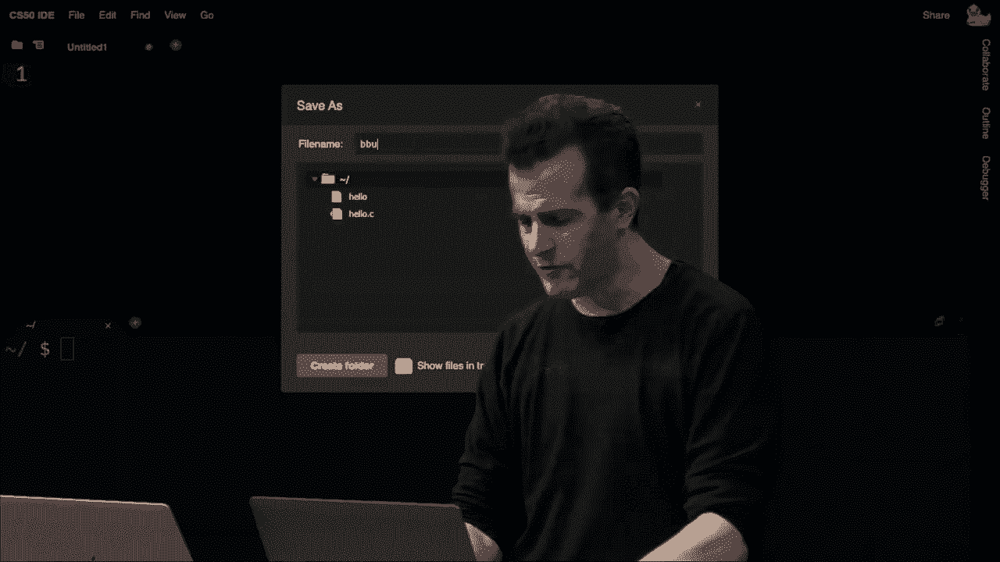

这是一个有问题的程序，我甚至将这个文件命名为buggy0.c，在这个文件的顶部，我将继续包含stdio.h，这个不需要cs50库。然后我将做int main void，我们上周见过，并将在今天详细解释。然后我将给自己打印出，哦，我不知道，比如10个哈希在。

屏幕上我想打印出一个垂直列，像是超级马里奥兄弟中的一个截图，不是金字塔，只是一列哈希，总共10个，因此我将做一些类似于int i等于0，因为我觉得我在课上学到通常应该从0开始计数。

然后我将有我的条件在这个for循环中，我想做10次，所以我将其设为小于或等于10，然后我将继续。我的递增，可以简单地表示为i加1，然后在这个循环内部，我将继续打印出一个单一的哈希，后面跟着。

新的一行，我将保存程序，编译它，意思是你不必手动使用clang，以这种方式更简单，命令，buggy zero，make会为你处理调用clang的过程，我将继续运行，似乎编译成功，所以不需要帮助，事实上如果我运行。

style 50在这个有问题的buggy zero上，我还没有任何评论，但至少看起来还不错，**就是这样**。但是让我添加那个评论并进行打印，目标，现在让我继续运行这个dot。slash buggy zero。

*****，*****。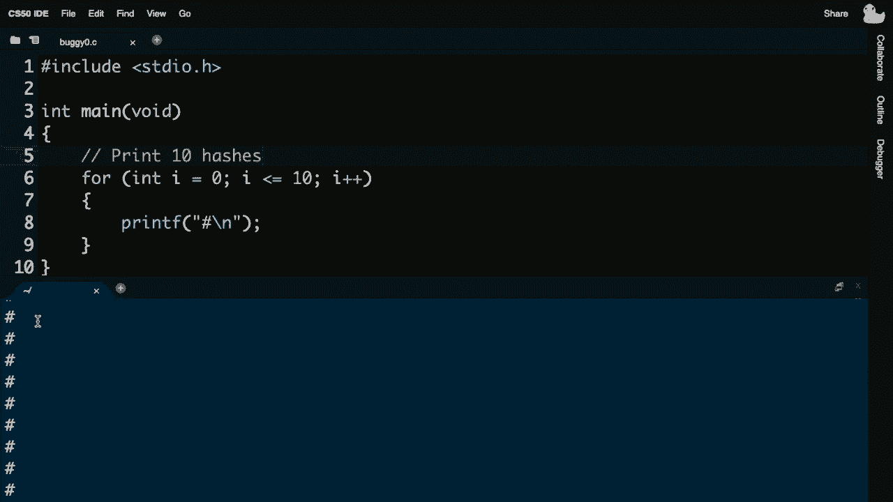

我想，好吧，这真是个愚蠢的错误，可能对你们中的一些人来说显而易见，但对其他一些人来说可能更微妙。但你从哪里开始呢？假设我运行 check 50，check 50 会说不，你打印出了 11 个哈希而不是 10 个，但我觉得我的代码看起来是对的。

乍一看，我该如何调试或解决这个问题呢。再次强调，printf 是你的朋友，如果你想要了解更多信息，临时打印更多信息到屏幕上，不是我们希望在最终版本中看到的，也不是你的 tf 想要看到的，但你作为程序员可以暂时看到。

在我打印这个哈希之前，让我打印一些更严谨的东西，比如说 i 现在是百分比。知道，在我打印这个哈希之前，i 的值。所以我使用百分比 i 作为占位符。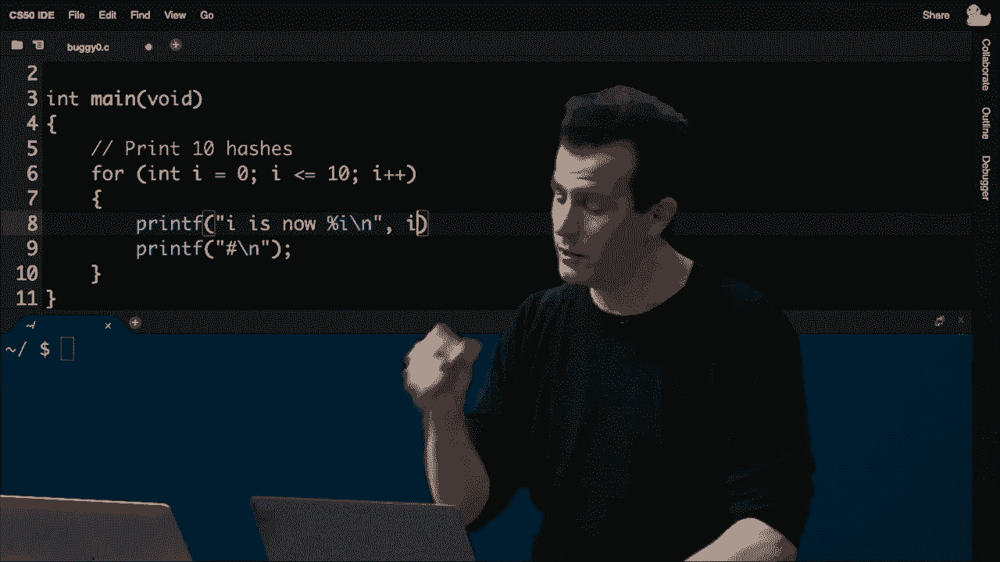

我正在插入变量 i 的值，我现在要保存我的代码，然后用 `make buggy zero` 重新编译它，我现在要重新运行它，让我去**增加我的输出**的大小，然后我将去**运行 dot，slash buggy zero**。输入好吧，现在我不仅可以看到我的输出，还有一些诊断输出，如果你愿意的话。

调试输出更是更加严谨地告诉我，i 现在是零，i 现在是一，i 现在是二。点点点 i 现在是九，i 是十，但我不喜欢的是，如果我从 0 开始，并打印一个哈希，然后我达到 10，并打印另一个哈希，那么显然这就是我的问题，所以这可能并没有比之前更明显。

查看代码本身，但通过使用 printf，你可以更清楚地看到。所以如果现在我看到，好吧，如果我从 0 开始，我必须上升到 10。我可以更改我的代码，使其从 1 到 10，但再次，程序员的惯例是从 0 到 10，所以我觉得我现在很好，在这个，make buggy 0。

让我去**增加窗口的大小**。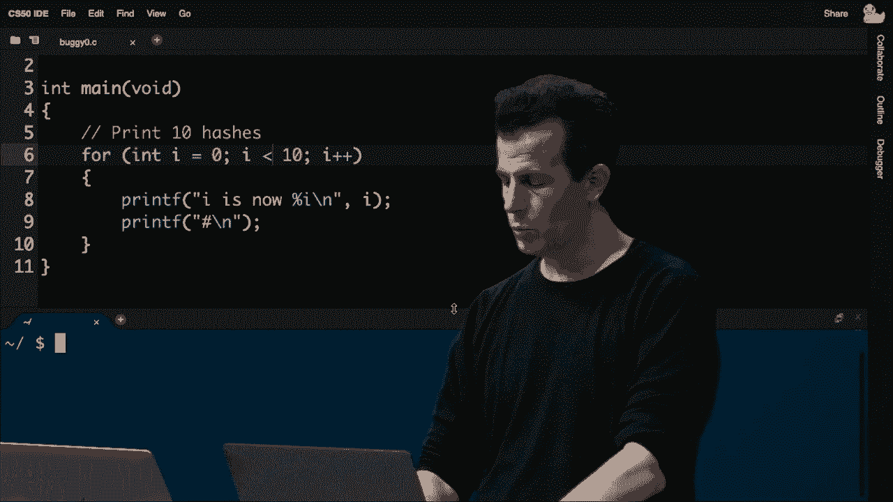

再次只是为了让我暂时看到这一点，执行 dot slash buggy，zero 好吧，我现在从零开始。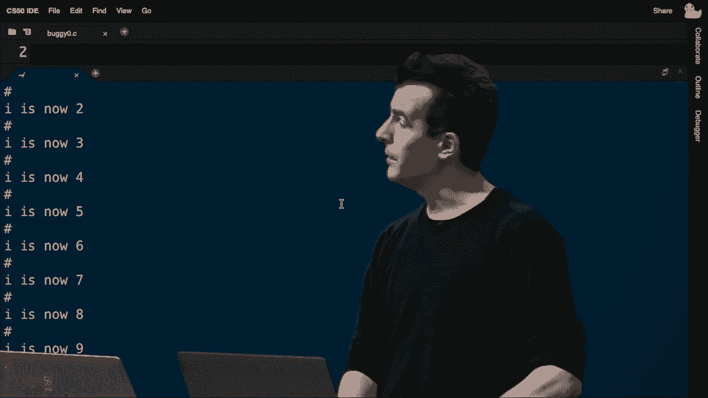

两个点点点，现在我停在九，另外，我不需要这个在最终输出中。

我现在要去**删除**这个作为临时输出的内容。但是，如果你对为什么你的代码编译但运行不正常没有完全理解，并且想更好地看到计算机在清晰地看到的内容，使用 printf 来告诉自己某个变量或变量的值是什么。

在你的代码中任何你想要看到更多细节的地方。好吧，让我暂停一下，看看有没有关于这个使用 printf 的技术来开始调试你的代码以及查看变量值的问题。没有，好吧，那让我建议一个更强大的工具。

诚然，这需要一点时间适应，呃，相信我，如果你能做到的话，这周学习这个工具，你会节省自己数小时，可能甚至数十个小时，随着接下来几周的学习，因为这个工具可以帮助你编写代码，所以这个工具我们要加入到列表中。

今天称之为 debug 50。虽然这个工具的名字以 50 结尾，暗示它是一个 cs50 工具，但它是建立在行业基础之上的。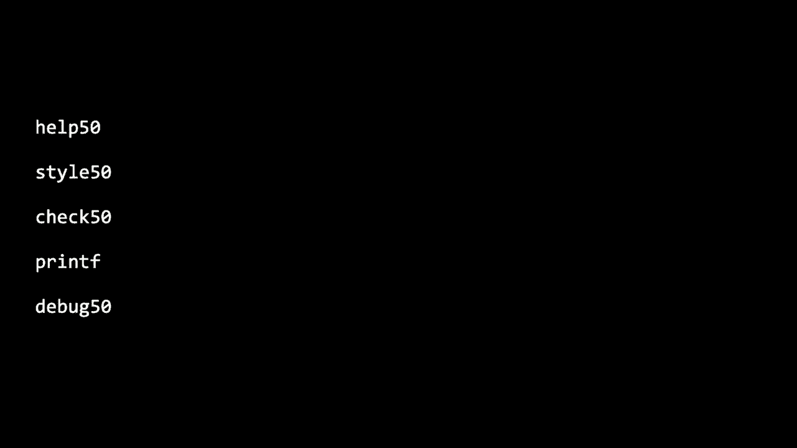

一个称为 gdb 的标准工具，GNU 调试器，这是一个标准工具，很多不同的计算机系统使用它，提供一种比单纯使用 printf 更复杂的调试代码的能力。所以让我们继续，回到这个程序的有错误版本，记得让我从 0 开始。

10 步骤太多了，刚才我提议我们只用 printf 来查看 i 的值。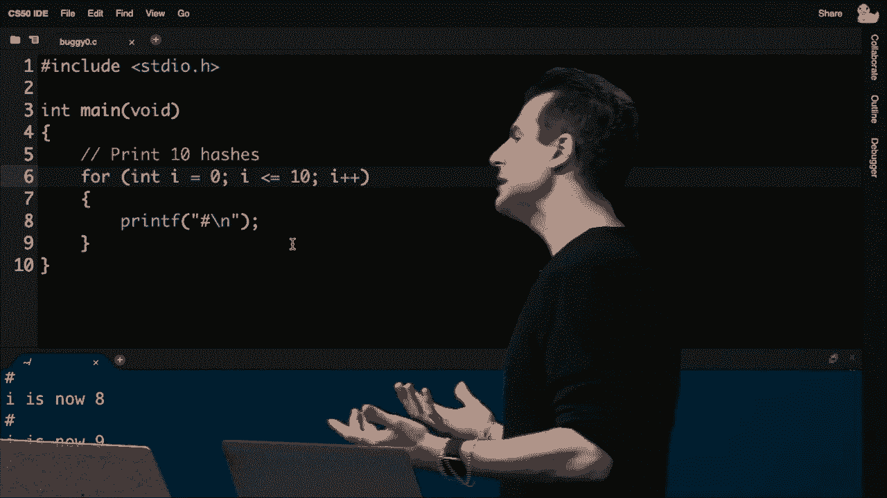

但坦率地说，我们的程序越大，变得越复杂。它们需要在屏幕上有更多输出，如果你输出了不该出现的内容，情况很快就会变得混乱。想想马里奥。马里奥的金字塔就是这种快速生成的金字塔，如果你把那个金字塔和其他东西混在一起。

所以 debug 50 以及任何语言中的调试器都是一种工具，让你可以逐步运行代码并查看变量，计算机在你程序运行时的状态。几乎每个程序运行都需要短短的时间，这对于我这样的人类来说太快，无法理解发生了什么。

逐步调试器让你运行程序，但速度慢得多，逐步进行，这样你可以看到发生了什么。所以我现在将运行 debug 50，点斜杠 hello，不，抱歉，debug 50 点斜杠 buggy zero，所以我先写 debug 50，一个空格，然后点斜杠和程序的名称，这个程序已经编译好了。

我想调试，所以我会继续按 Enter，注意到哦，它很聪明，注意到我更改了代码，我刚才把它恢复到了有错误的版本，所以让我修复这个，让有错误的版本为零。好吧，现在没有错误。让我再运行 debug 50，如果你还没有注意到这一点。

有时我似乎打字速度非常快，但我并不一定在那么快地打字，我正在查看 cs50 ide 中的历史记录，使用你的箭头键上下，你可以回溯所有你输入的命令，甚至是几天前的命令。这将开始节省你大量时间，现在我不需要再烦恼输入整个命令。

这是一个节省时间的好方法。我现在将继续按 Enter，注意这个错误信息：我还没有设置任何断点，至少设置一个断点，点击行号左侧，然后重新运行 debug 50。那么这里发生了什么呢？debug 50。

我需要提前告诉计算机我想在哪一行断点，以逐步执行，所以我将去文件的侧面，如它所示的那样。第一个有趣的文件，第一个有趣的行就是这里的第六行，所以我在所谓的“水沟”里点击了左侧的第六行，自动在这里放置了一个红点，像个停车标志。

现在最后一次我将继续并运行调试器，注意，这个新的面板在右侧打开，起初看起来有点神秘，但让我们考虑一下屏幕上发生了什么变化。

现在注意到突出显示的这个淡黄色，正是第六行。这是因为调试器正在运行我的程序，但在第六行暂停了执行，所以它完成了第一到第五行的所有内容，但现在在第六行等待我。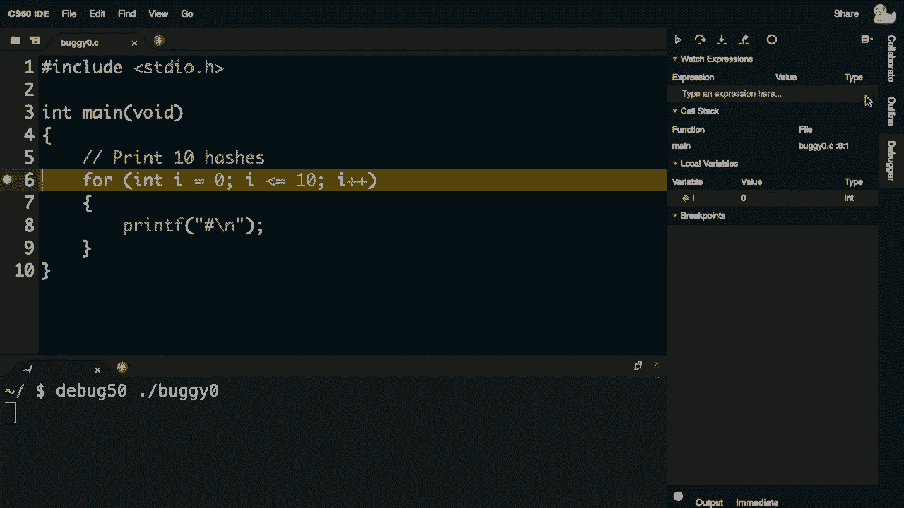

这里有趣的是，这让我可以放大这个窗口，虽然这里有很多内容，但让我们暂时关注局部变量`i`，它的初始值是零，类型为`int`。这很有趣，因为我可以点击这个逐步执行的行。

开始逐行调试我的代码，所以让我继续并放大。让我继续并点击“逐步执行”，突出显示移动到下一行，但如果我再次放大，`i`的值没有改变。现在让我继续并再次执行，注意到黄色突出显示再次返回，这很合理。

因为我在一个循环中，所以它应该来回反复。但在循环中，每次回到循环的开头时，请记住你的递增是通过`i++`来实现的。所以现在请在右上角仔细观察。

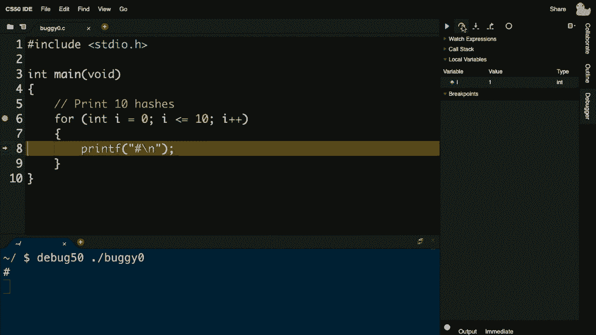

当我点击“逐步执行”时，调试器的右下角刚刚更改为一个，所以我不需要使用`printf`，也不必搞乱我屏幕的输出。

我可以在这个图形界面的右侧直观地看到`i`的值。如果我开始点击得更快一点，注意到在循环执行时，`i`的值会不断更新。你知道吗，我打赌，即使我们从0开始，如果我多次这样做，我会看到最终值是10。

我没有获得任何新信息，但注意我获得了未受干扰的信息，我没有混乱且马虎地在屏幕上打印所有这些`printf`语句，我只是更有条理地观察我的变量状态，在右上方。

好的，让我在这里暂停一下，看看关于这个调试器有没有问题。再次提醒，你编译代码，运行`debug 50`在你的代码上，但仅在设置一个所谓的断点之后，你提前决定在哪里暂停代码的执行。尽管在这里我几乎是在程序的开头做的，但对于较大的程序，能够在代码的中间暂停是非常方便的。

嗯，关于调试器的内容，嗯，`step over`和`step into`、`step out`之间的区别是什么，真是个好问题，让我稍后再回来讨论。

我们将做另一个例子，其中`step into`和`step out`实际上很重要。但在此之前，有没有其他关于`debug 50`的问题，在我们揭示`step into`和`step over`为我们做了什么之前，好的，那么让我们来看一下彼得的，现在，退出调试器，老实说，我没有看到明显的退出方式。

此时调试器，几乎在你失去程序控制的任何时候。因为调试器正在运行，而你对它失去了兴趣，或者也许上周你写的程序有一个无限循环，按`ctrl c`将中断该程序。但现在我们快速写另一个。

这个程序这次有一个第二个函数，我们今天将看到调试器的另一个特性，我现在称之为`buggy1.c`。它将故意有缺陷，但我首先要继续，包含`cs50.h`这次。我还将包含`standardio.h`，我将写`int main void`。

我将继续进行，去调用一个名为`getnegativeint`的函数，试图获得一个负整数。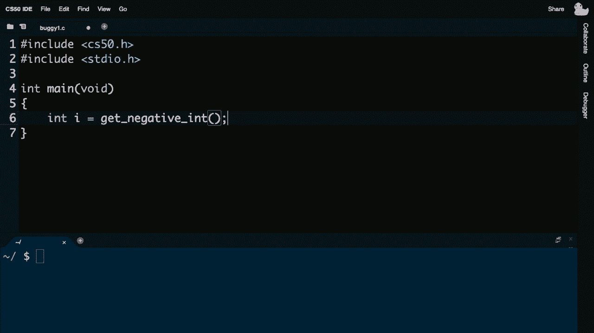

然后，我会简单地打印这个值，百分号i，反斜杠n分号。现在只有一个问题，`get negative int`并不存在，所以像本周的`positive`一样，我会先实现`get negative`。如其名所示，尽管我们上周只花了简短的时间来讨论这一点。

你可以通过将你编写的自定义函数的输出，所谓的返回值放在这一行的第一部分来指定函数的输出，然后你可以放`int`，在括号中放输入，你可以字面上写出“void”这个词，这是一个专业术语，意思就是这里什么都不放。我要继续进行。

现在实现`get negative int`，坦白说，我认为这会与上周非常相似，但我的记忆有点模糊，所以再次，它会故意有缺陷。首先我将设置`n`等于`get int`，然后我会明确地询问用户。

负整数后面跟着一个空格，然后我将继续这样做，直到 n 小于零。然后在最后一行我将返回，n。所以我再次声称这个函数会从用户那里获取一个负数，并且会不断重复，直到用户合作。然而，这里有一个错误，还有几个。

错误，事实上，现在让我去**d**并故意犯一个错误，make buggy。

输入一个，我看到一堆错误，我可以在这上面使用帮助 50，但基于上周，有人记得这里可能是什么错误吗，get negative。int 在 c99 中无效，所以我不知道，函数，是你将开始看到的东西。

如果你犯这个错误，你会更频繁地看到，有人记得这意味着什么，以及修复是什么，而不借助于帮助 50 吗？是的。

Jasmine，你觉得怎么样，呃，基本上因为你在代码中已经使用了它后才声明它，所以它在处理时不知道该读取什么。因此你需要，把第一行移动到你实际开始代码的上方，完美，这就是那个函数的原型。

我唯一会声称复制粘贴是可接受并且鼓励的情况是，我将复制那个函数的第一行，正如 JavaScript 提出的，我将把它粘贴到文件的最上面，从而给自己一个提示，通常称之为原型。所以我甚至会标记它，以提醒自己它在那里是为什么。

这里我要去**d**并从用户那里获取负整数，写下。所以我现在在文件的最上面有这个原型，我认为这确实会消除这个错误。让我再做一次 make buggy one，现在我看到，点斜杠 buggy one 让我去**d**并输入一个负整数负一。

嗯，负二负三，我觉得这个函数应该会满意。这显然不是，所以我需要使用控制 C，退出我的程序，因为否则它可能会永远运行，现在我要使用调试 50。但调试 50 现在对彼得之前的问题变得非常有趣。

因为现在我有东西可以逐步调试，主函数，还有另一个函数叫做。get negative，所以让我们看看，现在发生什么，让我去**d**并在像第10行的第一个有趣的代码行上设置一个断点，这有趣仅仅是因为，其他的都是模板代码，在这个时候你只需要这样做。

为了启动你的程序，我现在要下去做，调试 50。点斜杠 buggy one，稍后它会打开那个侧边栏。

现在我将不仅关注局部变量，就像之前一样，注意到i在这里再次默认为零，但我也会显示这个mo选项，这里是调用栈。因此，调用栈是一个华丽的方式，指的是你程序在这一时刻执行而尚未返回的所有函数，所以现在只有一件事在。

调用栈，因为当前唯一的函数是。

执行当然是主要的，因为我在第10行设置了一个断点，这显然是在main内部。就像第10行和第11行，坦率地说，它们看起来相当正确，对吧？在这一点上，很难搞砸第10行和第11行，除了语法方面，因为我得到了一个负的整数，我把它存储在i中。

然后我在这两行上打印出i的值，但如果相反，我对那个bug感到好奇。从逻辑上说，它肯定在里面，写道，注意这次而不是点击步过。让我去啊**d并点击进入，这也是彼得提到的按钮之一。当我点击步骤，兔子洞，调试50跳入了函数。

获取负整数，它关注第一行有趣的代码。因此，做本身并没有那么有趣，n 也没那么有趣，甚至到现在。第一行有趣的代码似乎是第19行，这就是为什么调试器跳到了那一行，现在n等于getint，感觉相当。

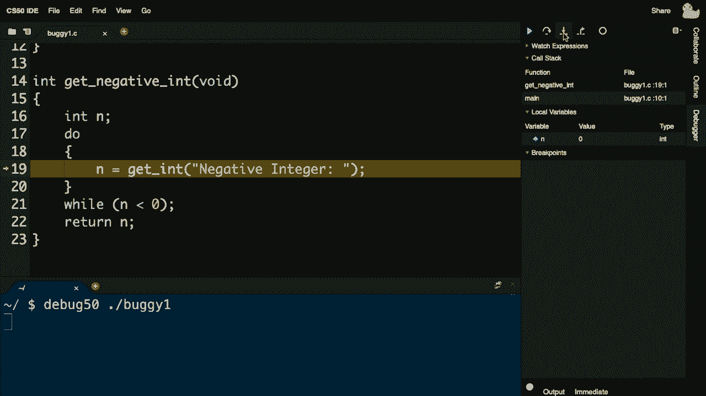

正确地说，错误地使用getint是很难的，但现在注意到右侧，看到，负整数。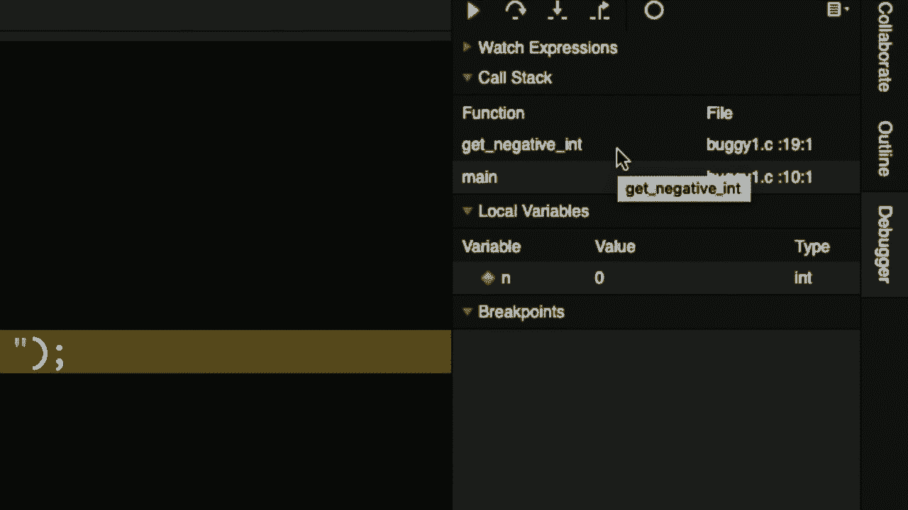

栈就像自助餐厅的托盘堆，最底层的第一个托盘就像main。自助餐厅的堆中第二个托盘现在是get负整数，而这很酷的是，注意到现在我可以看到我的局部变量n。这确实是我使用的变量，因此我不再看到i，而是看到n，因为我进入了get。

负整数函数，一次又一次，在输入一个数字后，让我输入负一。现在注意到右上角的n等于负一，我现在要继续点击步过，我想我会停在第22行。如果人类输入了一个负整数，比如负一，显然这是负数，让我们继续到第22行，步过。

它似乎确实不断回到do循环，整数。因此，我的逻辑应该是，如果n是负一，但我的循环仍然在运行，那么你逻辑上的结论应该是什么呢？如果n是负一，而这在定义上是负整数，这可能是你的诊断结论，如果调试器。

本质上，这向你透露了这个提示，n是负一，但循环仍在进行，奥马尔。嗯，条件可能是错误的，也许某种布尔逻辑有缺陷。显然，要么条件错误，要么我的布尔逻辑有问题，而布尔逻辑只是指真或假，所以在某处。

我说的是true而不是false，或者我说的是false而不是true。坦率地说，唯一必须在21行的地方，我一再强调。所以即使你还不太确定怎么修复它，仅仅通过推理你应该意识到，负1在变量中，但这还不够。

循环仍然在继续，我一定是搞砸了循环，确实让我现在指出，第21行确实是bug的源头。因此我们已经将其孤立出来，在23行中，我们至少找到了我知道的那一行。解决方案是什么，如何修复逻辑现在。

多亏了调试器的引导，我来到了这条路，我该如何修复，第二十一行呢？你会提议的修复是什么？是的，雅各布，你需要将它从“当n小于零”改为“当n大于零”，我想稍微澄清一下，我想在这里包括0，因为0不是负数，如果，我想要一个负的n，我认为我可能想说的是。

当n大于或等于0时，继续执行循环，因此我很。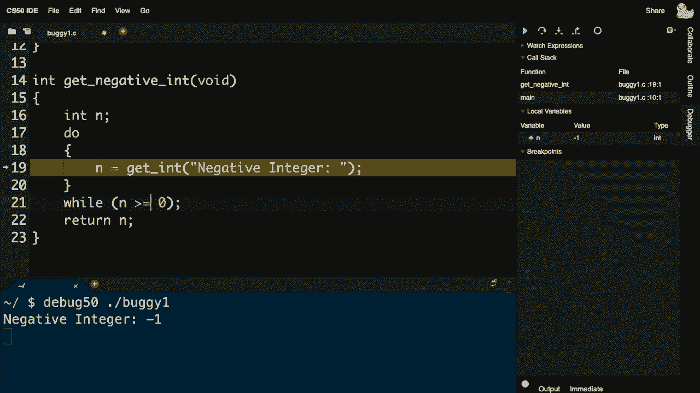

可以理解的是，我只是颠倒了逻辑，没什么大不了，我在考虑负数，而我用了小于，但，修复很简单，重点是调试器让你到了这一点。现在那些之前编程的人，可能在你面前看到了bug，可能有时候会，搞清楚bug是什么。

在23行的代码中，这一定是其中之一，但随着我们的程序变得，越来越复杂，我们开始编写更多行代码，调试50，以及调试器通常会是你的。朋友，我意识到这说起来容易，但实际上当你第一次使用调试器时，你会觉得啊，我只是，想用printf。

我会努力克服这个困难，通过使用调试器作为你的第一反应，追踪类似问题，你会获得那段时间的回报以及更多。因此，这就是，kit，除了printf之外，调试50无疑是两者中更强大的工具。现在你们中的一些人可能好奇这只。

橡皮鸭的原因，这也有原因，还有一个最后的调试技术，严肃地说，我们今天会介绍给你，也被称为橡皮鸭调试，你可以去谷歌搜索，这里有整篇的维基百科文章，这是计算机领域的一种现象。

科学圈内的计算机科学家，他们的桌上，关键是有时在试图理解，代码中出了什么问题时，交流是有帮助的。我们会和我们的同事，或我们项目上的合作伙伴交谈。仅仅听到自己表达出代码应该做什么，往往能带来很大帮助。

典型的“灵光乍现”，我明白了，仅仅因为你听到自己说话。逻辑不通时，你本来想表达一些，实际的逻辑，和我们正在合作的同事或。伙伴，或朋友，我们并不。常有家人或朋友想听我们讲代码。

所有事情中，一个绝妙的代理，实际上可以是一个橡皮鸭。因此在更健康的时代，我们会，给你们每人一只橡皮鸭。我们在舞台上带来了一个大号的，供大家共享，如果你注意到在一些广角。镜头中，有一只鸭子一直在看着这一切。

每当我出错时，我实际上有一个人可以，和我对话，虽然在这种情况下是非语言的。但我们不能强调，在printf的基础上，以及。更复杂的调试50，与你的代码问题进行讨论。是非常有价值的事情，如果，你的朋友或家人愿意，写下来。

如果你正在解决某个bug，太好了，但如果没有，就和你房间里的。毛绒玩具谈谈，和一只真正的橡皮鸭谈谈，这真是一个美妙的。习惯，因为，听到自己表达出，认为合理的想法。好吧，那么，话说到这里，已经说了很多，让我们继续。

然后休息五分钟，让每个人都喘口气，当我们。回来时，我们将看看现在的一些，更强大的C语言特性。现在我们可以相信，我们可以解决，所有这些新工具的问题。好的，我们回来了，让我们来看看，计算机底层的，机制。

这些设备再复杂，它们似乎再强大，实际上它们在其。工作上是相对简单的。让我们通过最后一部分揭示尽可能多的，C语言支持不同的数据类型，回顾一下。我们发现，结果是，这些数据类型。被定义在典型计算机系统上，占据固定的量。

空间，这取决于计算机，是否是Mac或PC，旧或新。通常这些数据类型使用的空间，但在CS50 IDE中。所有这些类型的大小如下，布尔值，真或假只需一个字节。现在，这实际上有点浪费，因为一个字节是八位。

哇，对于布尔值你只需要，一位，不能轻松在C语言中以单个位级进行操作。因此，我们通常，花费一个完整的字节来表示布尔值。字符也是一个字节，这听起来可能熟悉，因为上周我们谈到ascii时，提出了总数。

可能的字符可以表示，字符是256，因为八位和二的。八次方，所以一个，不管怎样，还有其他的数据。类型，浮点数是一个带有小数点的实数，使用四个字节。双精度数也是一个带小数点的实数，但它使用八个字节。

这给你提供了更高的精度，你可以有更多的有效数字，我们使用了一些。通常来说，四个字节的长整型是双倍的，这就允许你表示更大的数字，你们中的一些人可能已经在信用卡存储整个信用卡号码时做到了这一点。

字节的数量是可变的，可以是短字符串、长字符串，或者一整段文本，因此这一点会有所不同，稍后我们将回到字符串的概念上，但今天我们关注的是这些原始类型，这里是你计算机内部的一张图片，所以这是一块。

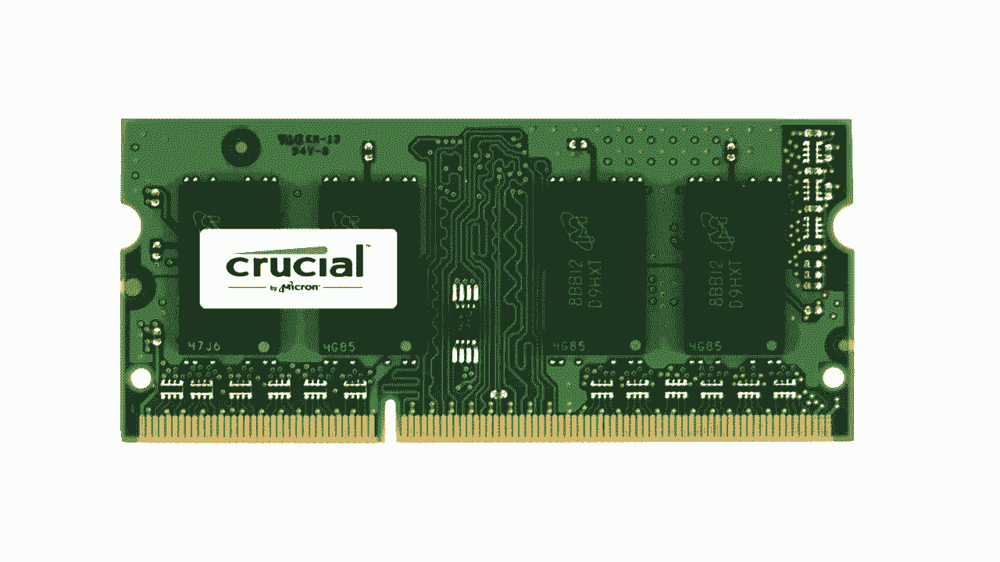

内存或RAM（随机访问存储器），它可能会稍微小一点，也可能会稍微大一点，这取决于正在运行的内容，以及文件在打开时存储的位置，因此通常情况下，如果你保存安装程序或保存文件，这些文件会保存在通常称为硬盘或硬盘驱动器的地方。

固态硬盘或CD或其他某种物理介质，而电力的好处在于能够长期存储数据，而RAM是不同的，可以说是易失性的，但它比硬盘或固态硬盘快得多，甚至比它们快得多，因为它是纯电子的，确实没有任何活动部件。

它是纯电子的，如这里所示，因此通过RAM，你可以更快地打开文件和运行程序，因为当你双击一个程序运行时，或者打开一个文件以查看或编辑时，它会临时存储在RAM中。长话短说，如果你的笔记本电脑电池，或者你的笔记本电脑电池曾经死过。

手机死机的原因是，你我通常会丢失数据，刚刚写的那段文字，尤其是你尚未保存的论文，因为RAM内存是易失性的，也就是说它需要电力来继续供电，专注于RAM，而不是那么关注长期磁盘空间，因为当你在运行一个程序时。

它确实按定义在你计算机的内存中运行，但有趣的是，像这样简单的图片，每个黑色矩形实际上是一个芯片，在这些芯片中存储着所有的零和一，周围是零。因此，让我们专注于并放大其中一个芯片。

现在可以推断，我不知道这根RAM棒的大小，可能是1GB，一亿字节，可能是4GB，物理上更大，由这硬件决定，所以如果我们再进一步放大，让我假设，我不知道这里有多少字节，但如果有一些字节，无论是多还是少，可以推断出我们可以简单地。

将所有这些字节编号，我们可以把这个物理设备，这个内存视为一个从上到下、从左到右的网格，每一个我在这个物理设备上叠加的方格，可能代表一个独立的字节。再次说明，实际上可能有更多，或者更少，但确实有。

我们可以把每个字节想象成一个位置，就像这是第一口，第二口，第三口，等等。那么，一个字符占用一个字节是什么意思呢？这意味着如果你的计算机内存正在运行一个程序，可能是你写的或我写的，它在某个地方使用了一个字符变量。

存储在那个变量中的值可能会存储在这块 RAM 的左上角，可能就在那，也可能在别处，但这只是一个物理的方格。如果你存储的是像 int 这样占用四个字节的东西，老实说，它可能会占用顶部的所有四个方格，或者在别处，如果你使用的是长整型。

这将占用两倍的空间，因此在计算机内存中表示一个更大的数字将需要使用构成这八个字节的所有零和一。不过现在让我们远离物理硬件，抽象一下，如果你把内存看作一个网格，从技术上讲，它就是这样的。

这不是一个二维结构，我可以同样容易地从左到右绘制所有这些字节。我可能在屏幕上只能放下更少的字节，因此我们将物理隐喻进一步拓展，想象我们计算机的内存，这些字节每个都是八位，这些位在隐喻上只是聚焦于我们计算机的。

内存开始考虑，当你双击 Mac 或 PC 上的程序，或者在 CS50 IDE 中执行 `./hello` 或 `./buggy0` 或 `buggy1` 时，所有变量的值都会填满你计算机内存中的这些字节。因此，让我们在这里考虑一个例子。

假设我写了一些代码，涉及声明三个分数，也许这是一个类，有三次测试，你想要计算学生的平均分数。

跨越这三个测试的学生成绩，让我们去**实现**这个。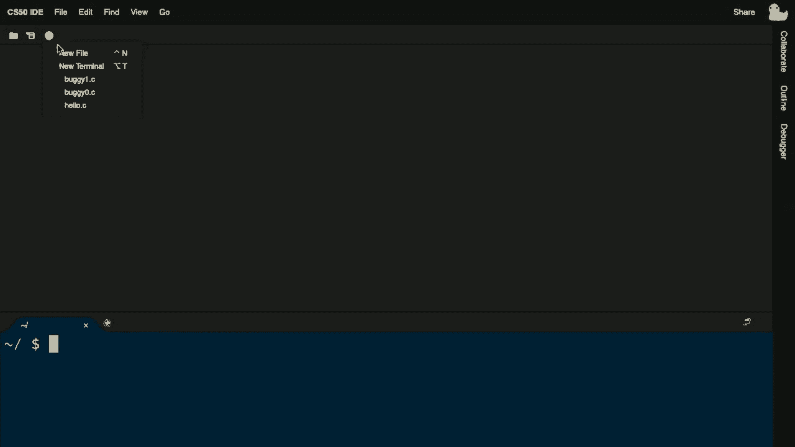

在 CS50 IDE 中，我将创建一个名为 scores.c 的程序，在 scores.c 中，我将包含**stdio.h**，然后像往常一样编写我的 `int main(void)`，然后在这里我将保持简单，给自己一个名为 score 的整型变量，值为 72，和上周一样。

设定第二个分数为 73，然后设定第三个分数为 33。然后让我去**打印**这三个值的平均值，通过插入一个占位符来表示浮点值。如果你将三个整数相加，然后除以三，我可能会得到一个分数或一个带有百分比的实数。

而不是percent i，因为我不想截断某人的成绩。否则如果他们有像99.9，他们不会被四舍五入到100，他们会得到99，因为截断，正如我们上周讨论的。那么我现在怎么做平均值的数学呢？其实很简单，得分1加得分2，数学。

让我再次在底部做make scores，我们不会手动使用clang，没有必要。因为运行make要简单得多，但我在这里搞错了，参数类型不对，我不太明白，但是它引起了我对percent f的注意。并且我的数学看起来像这样，printf在这里会帮到我，因为我是。

错误出在printf行上，我认为调试50在这里不会真的帮到我，因为我已经知道错误在那一行代码中。这感觉像是一个机会，可以和对象对话，或者我们也许可以想想上周遇到的错误，阿尔潘，你觉得呢？我认为这是因为好的，它是那个文件。

我告诉你这些是因为，它接收到的所有值都是整型。但是你告诉它要受到影响，是的，你把它放入了平均分中。正是得分，哦，天哪，抱歉，所以计算机仍然把它当作浮点数。结果它不知道该怎么做，实际上得分一、得分二、得分三都是整数。

整数，因此这次编译器足够聪明，可以将整数结果强制转换为浮点值，但你并没有进行任何浮点运算。如果你愿意的话。所以你知道有几种方法来修复这个，上周回想一下，我们提出你可以使用强制类型转换，你可以显式地将一个或多个值转换为浮点数，所以我可以这样做，例如。

或者我可以把所有这些转换为浮点数，或者其中一个转换为浮点数，还有很多，最简单的修复方法。就是例如除以3.0，这样我可以避免一些从一种类型到另一种类型的麻烦，确保至少参与这个运算中有一个浮点值。现在让我重新编译得分。

这次编译正常，让我做一下点，斜杠得分，瞧，我的平均分不高，59.3333。好的，那么计算机内部到底发生了什么，与浮点数无关。上周，让我们考虑这三个，三个，它们实际上存储在哪里。再考虑一下那个网格，我将从左上角开始，方便起见。

但从技术上讲，我们会在后面看到，你的计算机内存就像是这样一大堆不同的地方，但今天我们会保持简洁。第一个变量得分一，我声称它将在这里的左上角，简单起见，但存储的重要性在于，它占用了这四个。

这些框中的每一个代表一个字节，整数回忆，cs50 ide 是四个字节，因此我使用了四个字节的空间来表示数字72。分数二中的数字73同样是三个，也会占用四个框，但这里的底层到底发生了什么呢？

这些正方形代表一个字节，每个字节是八个比特，而比特就是零或一，真正发生的事情是这样的，这种电子存储器以正确的方式存储电，存储并以十进制方式存储这个零和一的模式，也就是33。

在十进制中，但我们不必继续思考或沉迷于此。到目前为止我们讨论的一切，现在在这张图中汇聚在一起。因为计算机只是为我们存储这些模式，而我们正在分配空间，感谢我们的编程语言，通过这样的代码，但这段代码。

虽然我的平均值确实是59.33333，如果我的测试分数是72、73和33，但我觉得这里有更好设计的机会。因此，不仅仅是正确性，不仅仅是风格，回忆一下设计是代码质量的另一种衡量标准。这更主观，且更容易在合理的人之间引发辩论。

但我并不太喜欢我在这个命名方案中所做的，实际上如果我们看看代码，我的程序除了这三行外并没有更多。我担心这个程序设计得并不好。

这三行代码可能是什么，即使你不知道解决方案，尤其是如果你从未编程过，关于这三行代码的气味是什么？这就像某种不爱的感觉。

如果你愿意说分数一有什么不好的地方，我本来想说，如果你要把它们全部加起来。在代码中，你可以添加变量，绝对可以，如果我在计算平均值，我不需要保留这三个分数，我可以只保留总和，然后用总和除以数量，我喜欢这样，关于这段代码的设计，现在分数一、分数二。

三个分数，一个分数，两个分数，三个分数，是否还有机会进行改进。我感觉每当你开始看到这种重复时，哦，我想我不会将这三个分数硬编码在一起，好的，所以不硬编码这三个分数，那你会怎么做呢？我可能会接受一个输入，或者我会。

是的，我不会写出分数本身，是的，另一个好的程序。我编写了一个程序，仅计算某个学生的平均分，实际上得到了这三个测试分数。这里，此外，称我的变量为分数一、分数二、分数三也有点懒，究竟能到哪里呢？

之后如果我想在下学期参加第四次测试，现在我必须去拿四分。如果我得到了五分，那就开始有点让人想起。
