# 哈佛CS50-CS ｜ 计算机科学导论(2020·完整版) - P5：L2- 字符串、数组、调试方法 2 - ShowMeAI - BV1Hh411W7Up

这并不是最佳实践，因此让我提议清理一下。通过另一个话题，另一种特性，编程语言中称为数组的内容。如果你在Scratch中使用某种叫做列表的东西，它在精神上与Scratch的列表非常相似，但我们没有看到C语言中的数组。数组是存储在内存中的值序列。

连续的值序列，依次相连。回到回到回到这一点，因此从这个意义上说，如果我们使用我们一直在绘制的图片的隐喻。那么这在这里又如何呢？事实证明，如果你想存储一整堆值，但它们都在那数组中。

它们彼此相关，就像所有的分数一样，你不必诉诸这种懒惰的方式。分数一、分数二、分数三、分数四、分数五，根据有多少个分数，在分数99的地方，为什么不把所有这些数字都叫做分数，而使用一种语法呢？这样你可以访问所谓的数组，因此屏幕上的语法。

这是声明三个整数空间的一个例子，全部一次性声明，并统称为分数。所以不再有分数一、分数二和分数三。这三分数在这里，是一个数字，字面意思是你想存储多少个整数，名称为分数。那么这让我可以做什么呢？整数。

所以这个数组将会回溯，我可以在其中放入值，而我放入这些值的方式将看起来像这样，语法上我仍然使用数字，但现在我使用一种新的表示法，与我之前使用的类似，但现在它更为普遍化。现在如果我想更新该数组中的第一个分数。

我实际上是写变量的名称，分数[0]，然后给它赋值。如果我想获取第二个分数，我就用分数[1]。如果我想要第三个分数，那就是分数[2]，唯一有点奇怪且需要适应的是。

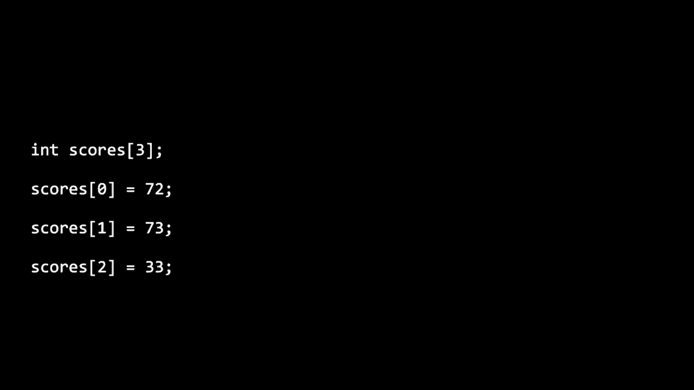

我们的数组是零索引的，因此在过去的例子中提到过。这是编程中的一种约定，当涉及到数组时，从零开始计数是必要的。数组是计算机内存中连续的值序列，它们必须从零开始，否则，如果你不从零开始计数，你实际上会浪费空间。

通过忽略一个值，所以现在如果我们在屏幕上重新命名这些内容。不是叫这三个矩形分数一、分数二、分数三，而是它们都叫分数。如果你想特别提到第一个，你就用这个花括号表示法，而第三个也是如此，但注意到。

二分法当，数组说，给我三个整数，你使用的就是[3]。其中[3]是总值的数量，当你索引数组时。你去特定的位置，使用数字，但现在那些是相对位置，位置零，位置一，位置二，这就是，数量总和，第一。

第二和第三，好的，所以，图示上没有变化，只有我们的，命名发生了变化。所以让我去**d，开始改善这个程序，听取建议。嗯，之前提到过如何，我们可以， sort of，去除它的味道，让我先来。先处理这些最简单的方法，首先去掉这三个。

单独的变量，而不是给我，一个名为 scores 的变量，然后，再来两个，就这样。全都消失，就这样全都消失，现在如果我想要。用这三个值初始化那个数组，我说 scores[0]。然后在这里我说 scores[1]，再在这里我说 scores[2]。

所以我增加了一行代码，但，第四行，我可以在这里分配，然后用另一行代码放入。或五、六、七、八，我不。需要开始复制和粘贴所有，约定，但我认为如果我们采纳一些。之前提供的建议，我们也可以通过循环清理这个。

或者类似的，让我们这样做，让我去**d，首先给我，cs50 库。这样我可以使用 getint，让我们接受第一个建议。让我们开始请求分数，使用 get_int，我将这样做，三次。是的，我有点，懒惰，已经有点无聊了。

所以我要复制粘贴，这在一般情况下并不乐观，当。复制粘贴时我们可能可以，做得更好，但现在我想我需要再改动一点。这里在进行数学时，我想 scores[0] + scores[1]，这里的问题是。逻辑仍然是一样的，但我现在，是动态地接受三个整数。

这里仍然有一种味道，明确一点，我现在可以做些什么更好。如何清理这段代码，让它，设计得更好，这里还剩下什么，nina。嗯，这段代码是仅针对，三个分数，所以你可以在一开始，询问输入想要多少分，然后就像有 scores[for] 循环。

这个过程从零到，嗯，n 减一或者说少于 n。它应该像是，替代成一行代码。是的，真的很好，事实上我们，要反复提到，这样做是，次优的，可能是正确的，但可能设计不够好，因为我做了。

字面上 resort 到复制粘贴，这里有种模式我，像一个循环。所以让我这样做，实际上去掉这两行代码，去上面做些，像 for int i = 0; i < 3; 现在。i++ 让我打开这个 for 循环，代码，而不是 scores[0]。

这就是数组变得真正强大的地方，数组，可以去特定位置。我想用什么作为我的变量，嗯我会认为我在这里，所以现在我把代码行从三行几乎相同的三份减少到一行，里面有一个循环，它将为两个做同样的事情。

我不需要到处硬编码这些三，也许我可以做一些像这样获取分数的事情，我可以从那里直接询问人类，变量。在多个地方使用总数，因此现在我需要在第14行稍微努力一下，因为现在我不能硬编码分数0、1和2，因为如果数字。

如果少于这个我需要做更多的加法，如果超过这个我需要做更少的加法。所以我想我们引入了一个错误，但我们可以修复它。不过让我先提议一下，不要让它变得动态，先引入另一个功能。我要在这里定义今天C语言的新特性。

如果我事先知道我想声明一个数字，而我想多次使用，而不是逐字复制粘贴，这就是常量。通过`const int`声明。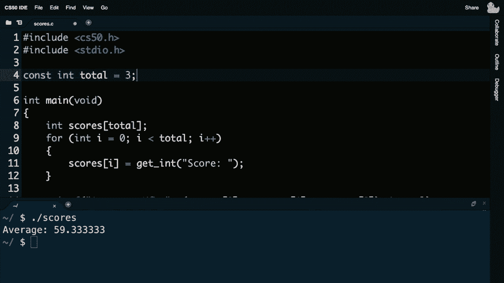

总数等于三，这声明了在编程中所谓的常量。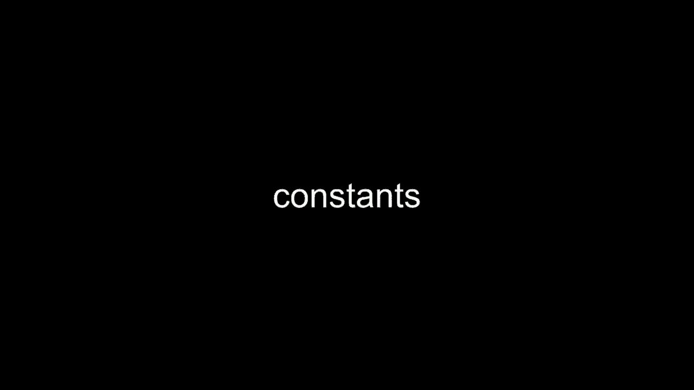

这是许多语言的一个特性，通过它你可以声明某种变量，一旦设置值就永远不会改变。你不能改变它，这很好，因为首先，它在这个程序的上下文中不应该改变，其次，以防你这个人犯错，你不想在没有意图的情况下意外改变它。

编程语言的一个特性，可以在某种程度上保护你免受自身的影响，因此现在我可以将我的直觉和妮娜的想法结合起来，使用这个变量总数，实际上，在声明常量时还有另一个约定是将它们大写，以清晰地表明这个变量。我将在这里和这里使用总数。

在这里你没看到，这其实是一种约定，当你想引起对常量的注意时，使用全大写字母，所以我将把这个改为总数，我会在这里、这里以及这里使用这个值。但我担心妮娜和我在那一部分的分数上还有一点清理工作要做。

这是两个分数，我想把一系列变化的数值相加。所以你知道我有一个主意，让我去创建一个函数，来计算一个平均值。如果我想创建自己的计算平均值的函数，我希望它返回一个浮点值。

为了避免截断任何数学运算，我将这个函数命名为 average，输入参数将是数组的长度和实际数组，而这就是目前最后一段有趣的语法，结果表明，当你想将数组作为输入传递给自定义函数时，你确实使用那些方括号。

再次提醒，你不指定大小，而这种做法的好处是你的函数可以支持一个空间、两个空间、三个空间，甚至一百个空间，以这种方式更具动态性。那么我如何在这里计算平均值呢？我认为，之前建议的方法是合理的，让我做 int sum 等于 0，因为你如何计算一堆的平均值。

数字嘛，你把它们加在一起，然后除以总数。好吧，让我们看看我可能怎么做，让我从 int i 等于 0 开始，我被作为这个自定义函数传递数组的长度，从 i 迭代到长度，然后每次迭代后 i 加一。

想要计算总和，加上数组中第 i 位置的内容，可以说这是简写符号，上周提到的，这个总和等于总和加上数组中第 i 位置的内容，一旦我完成了所有这些，我认为我可以返回总和除以数组的长度。

我喜欢这种方法，假设我的代码是正确的，尽管我认为现在还不完全正确，注意我现在可以在主函数中抽象出计算平均值的概念。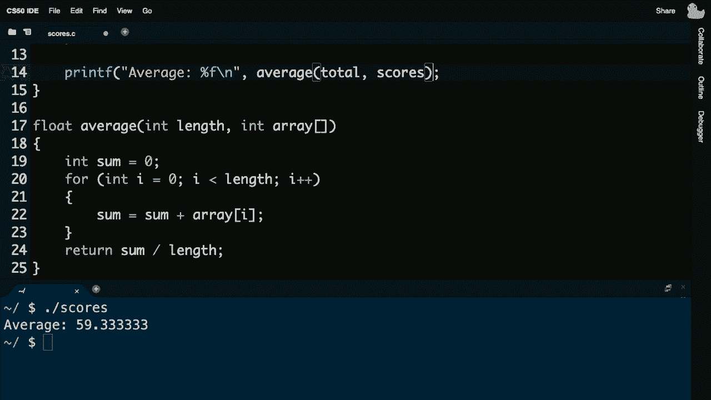

通过这行代码。那么我刚刚做了什么？发生了很多事情，但让我们暂时关注第 14 行，在第 14 行，我仍然只是在打印某个浮点占位符的平均值，但我现在作为输入传递的是这个名为 average 的函数，其输入。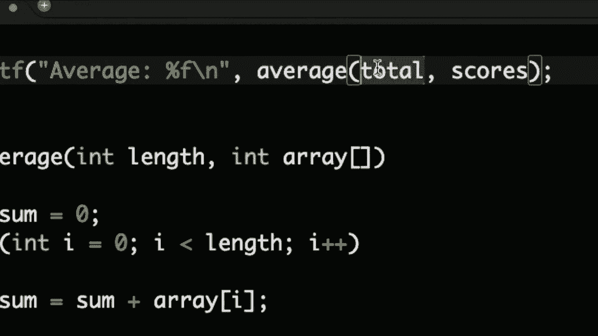

total 将会是，这个常量在最上面，哦抱歉，我搞错了，我应该把它大写，这就是在最上面的那个常量，再次强调，这只是所有这些分数的数组，同时在自定义函数中，在自定义函数的上下文中，注意函数的输入名称。

变量的名称不需要与传递到那个函数中的变量名称匹配，所以即使在主函数中它们被称为 total 和 scores，在我的自定义函数 average 的上下文中，我可以将它们称为 x 和 y，array。我不知道这个数组是什么，但它是一个整数数组，我不知道如何处理。

它的长度是多少，但那个值，答案将会是长度，但这里仍然有一个 bug。这里仍然有一个 bug，如果我们暂时忽略主函数，这个 bug 是微妙的。有没有人看到我过去两周在代码中犯的错误？这个错误有点微妙，但目标是计算一个。

一堆整数，并返回答案尼古拉斯，在函数中我声明了变量，函数内部声明变量是可以的，因为我，指的是函数。我在外部大括号内使用了一些内容，那是定义的，所以没问题，没问题，让我们再想想这里，奥利维亚。

返回类型是浮动，但你正在返回n除以n。完美，所以我再次犯了同样的愚蠢错误，随着时间的推移，这只会变得更加明显，如果我想进行浮点运算，就像亚利安火箭的讨论，爱国者导弹，这些细节在这里很重要。

程序现在是正确的，因为我，实际上会确保，重要性远低于这些真实世界的上下文，只是在计算一些分数的平均值。我不会意外截断任何我的值，所以在这个上下文中，函数平均值只是应用了一些变量，我有一个循环，并且正在进行一些操作。

浮点运算最终需要两个输入，一个是长度，另一个是数组本身，float，所以我的输出也会被很好地定义。但有趣的是，你可以把这些函数视为抽象。我不需要担心如何计算平均值，因为我现在有这个辅助函数。

我写了一个自定义函数，可以帮助我回答这个问题。在这里注意，这个平均函数的输出将作为printf的输入。还有我添加到这里的唯一其他特性就是数组，这使我们能够创建多个变量，任意数量的变量。

还有一个常量的概念，如果我发现自己一次又一次地使用相同的数字，这个常量可以帮助我保持代码整洁，注意这一点，如果明年可能有四次测试，轰，我就完成了。一个设计良好的程序不需要你逐行阅读并修改数字。在一个地方进行更改可以让我改进这个程序，使其明年支持四次测试。

而不是仅仅三个，但更好的是，嗯，考虑一下妮娜之前的建议。那就是可能使用get int，询问用户他们实际有多少次测试，这样也能很好地工作。让我在这里暂停一下，看看是否有关于数组或常量输出的问题，嗯，是的，我有一个关于使用的疑问。

浮动和原因，比如使用一个流量使得整个输出变得浮动。为什么会这样，是个很好的问题，这涉及到一个或多个浮点值。参与了一个数学公式，它会使用这种数据类型。这个数据类型更强大，如果你愿意，而不是冒着截断的风险，所以你只需要一个。

浮动参与其中，所涉及的公式是个好问题，关于数组或常量或传递这个，我有一个关于声明的问题，关于。在主函数中声明的数组分数，你说int scores，而在括号中你有总数，可以在没有总数的情况下声明吗？

真的很好问题，括号的短答案是否定的，我所做的方式是你必须这样做，事实上，如果我突出显示我在这里做的事情。现在它目前显示为总数，如果我去掉版本，假设我说类似三和三，呃这里的三，你不能这样做，建议。

当你创建数组时，计算机需要知道数组的大小。例外情况是，当你从一个函数传递数组到另一个函数时。你不需要告诉那个自定义函数数组有多大，因为。再说一次，你不能提前知道你的函数，存在的目的是接收任何长度。

与该东西的大小相匹配，作为旁注，对于那些以前编程的人，尤其是在Java中，不同于Java和某些其他语言，数组的长度不是内置在数组本身中。如果你不将数组的长度传递给另一个函数，就无法确定数组的大小，这点不同。

来自Java和其他语言的！

可以在某种意义上询问数组，它的长度，在C语言中你必须分别传递数组本身和它的长度！

哦，呃你好，我还是有点困惑。什么时候括号里是void，我们什么时候定义结尾，因为，像我记得我们做获取负数或获取正数输入时，我对这一点并不是完全信服。

当然，很好的问题，让我去啊**d并打开那个之前的示例，它有点错误，但它包含之前的正确功能，正如你所知，它的输入是void，所以你提到的一个评论是，它仍然接受不必要的输入，因此get negative没有接受任何输入，正如案例所示，如果我们滚动。

注意当我在第10行调用它时，我说get a negative in，打开括号关闭括号，括号内没有输入。因此，这个关键字void，之前我们看到过几次，上周和这周，只是在C语言中一个明确的关键字，表示这里不要放任何东西。

也就是说，我在这里做这样的事情是错误的，比如传入一个数字或传入一个提示，或者任何在那些括号内的东西。这个函数get negative中输入void意味着它根本不接受任何输入，这没问题，忘记负数这个名字吧。

函数的说明一切都在这里，没有必要对`get`的行为进行参数化或自定义。你只想获取一个负整数，刚刚写的`average`这个函数确实有用。你不能仅仅说，给我平均值，平均什么呢？它需要输入，以便回答你的问题，和数字的长度，这样你就可以。

做一些算术，希望这有助于区分，当你不想接受输入时使用void，而当你确实想接受输入时，你需要明确指定一个以逗号分隔的参数列表。好吧，所以到目前为止我们主要关注整数，但让我们稍微简化一下，因为结果显示。

数组和内存实际上相交，创造出一些非常熟悉的东西，假设我们。我们进一步简化，不再使用整数，暂时只用一个字符，编写一个程序，只创建一个像马里奥游戏中的单砖，让我去啊**d并创建一个程序。

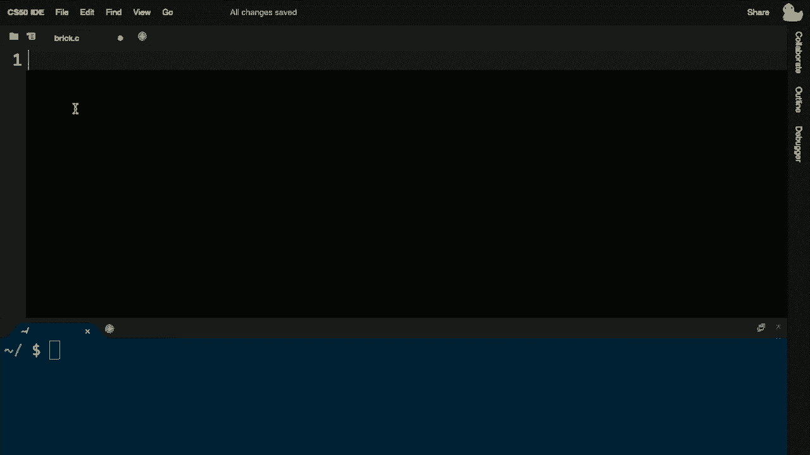

叫做brick.c，在brick.c中，我只会包含标准io.h。int main void，稍后会详细说明这个void，char c获取“#”。然后在这里，让我去啊**d，简单地打印一个占位符% c，换行。然后输出c，这个程序相当简单，它的唯一目的是。

打印一个单独的哈希，就像你在马里奥金字塔中可能会有的那样，高度为1，非常简单，让我去创建brick，似乎编译没问题，让我用./brick运行它，瞧，我们得到了一个，瞬间，究竟发生了什么，这背后实际上发生了什么。

嗯，我有点好奇，我记得上周我们可以将值从一种转换为另一种。如果我稍微好奇一点，没有打印出c，也就是这个哈希字符，作为% c占位符。如果我稍微疯狂一点，说% i。我想我可能可以强制这个char的十进制等价，我可以看到它的实际ASCII。

代码，所以让我重建这个brick，上周我们看到的数字是72和73，还有33。这周你可以看到35。事实证明，这是ASCII哈希的代码，你可以看到。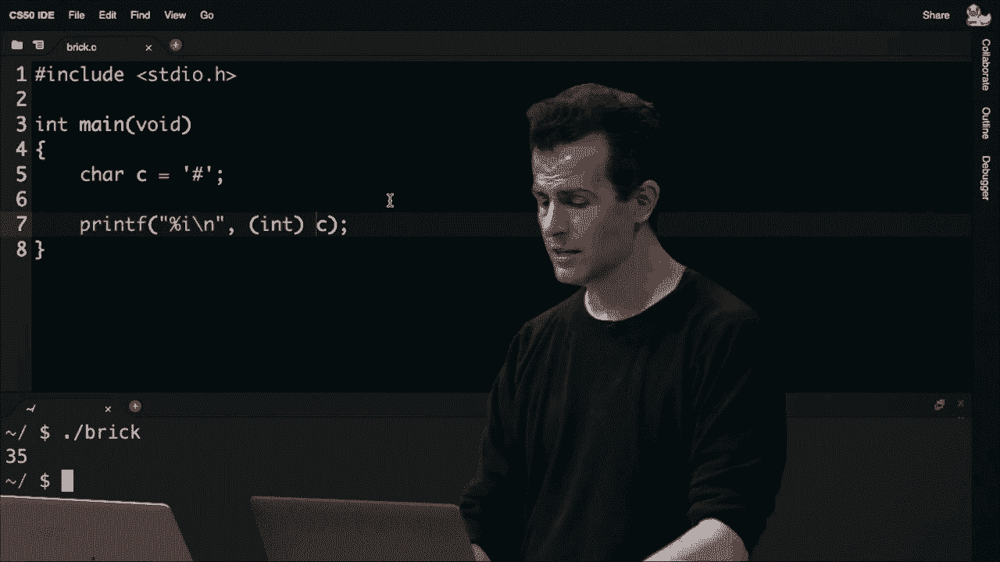

举个例子，如果我去一个网站，比如ascii chart.com，果然如果我去这个。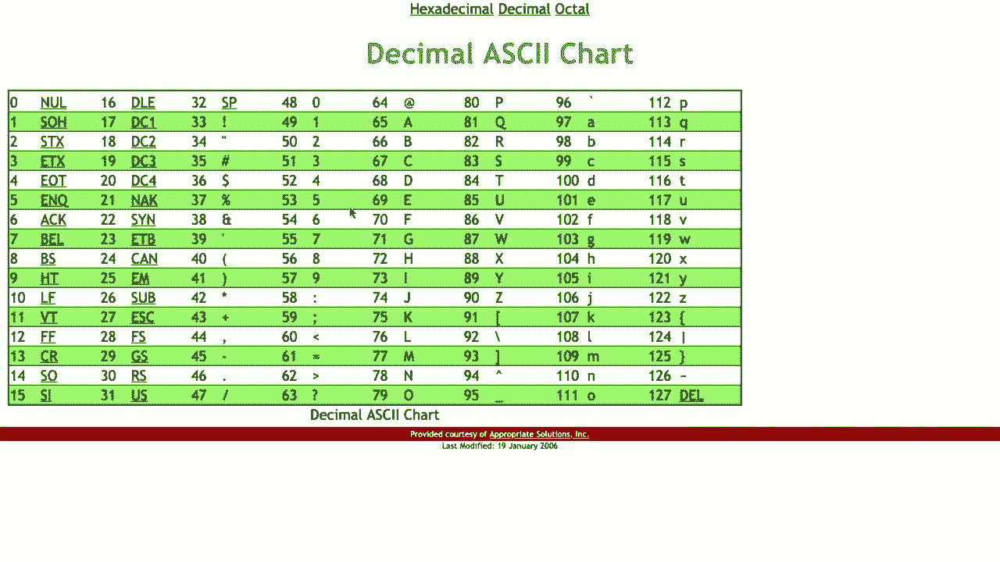

上周的相同图表，我在这里寻找哈希符号，它的ASCII码是35。结果在C语言中，如果这是一个字符，计算机很清楚，我知道我可以将其转换为，你可以替代性地。隐式转换一种数据类型为另一种，仅仅通过上下文，所以printf和C。

这里足够聪明，知道好的，你给我的是变量c形式的字符。% i。

一个整数这没问题，我确实仍然看到了数字35。所以，这只是简单的类型转换，但现在让我们将其放入上下文中。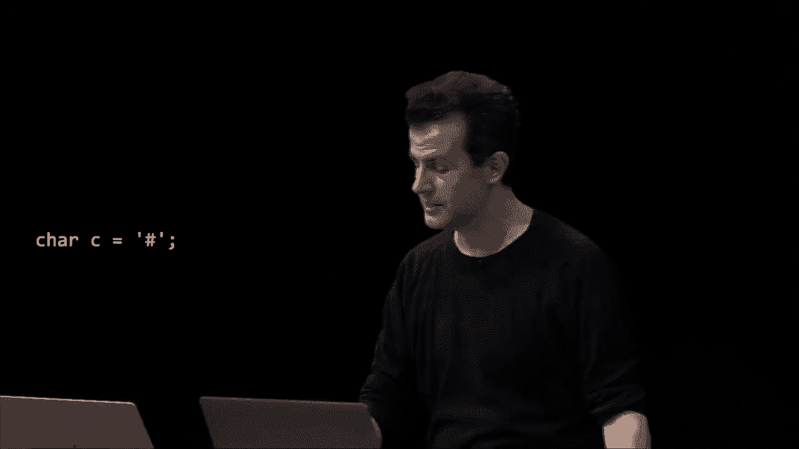

布局好吧，如果这是我的内存，数字，存储。呃，只是存储在其中之一，因为再次，一个char是一个字节。但等效的35是实际上存储在那里。我想知道，上周我们花了不少时间存储的不只是，hi。

还有其他表达式，如果我做这样的事情让我回到我的代码。让我先不要实践我刚才所说的，给自己三个变量，这次是c1 c2和c3，让我故意存储这三个变量。h i，全部大写，后面跟着一个感叹号，上周你处理的是。

单个字符，你正在处理多个字符，上周被称为字符串。使用双引号，但这就是我为什么用单引号，因为我们现在只在玩单个字符。现在让我继续打印这些，百分比c，百分比c，输出c1 c2 c3。所以这可能是打印完整单词的最愚蠢方式，存储。

每个单独的字符在它自己的变量中，但这样也没关系，我只是把这些第一个原始。百分比c，作为我的占位符，我打印这些字符，所以让我现在执行砖。编译没问题，如果我点斜杠，你知道我真的应该重命名。这个文件，但我们会在一个。

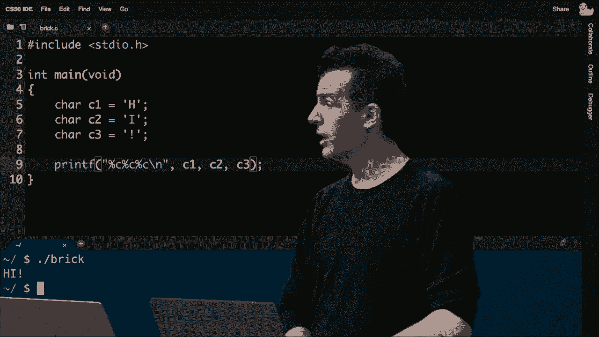

现在点斜杠砖高，让我继续做这个，让我继续，现在实际上关闭文件，回忆一下上周，如果我想把我的文件从砖，砖。c。假设重命名为高。c，我可以使用移动命令mv。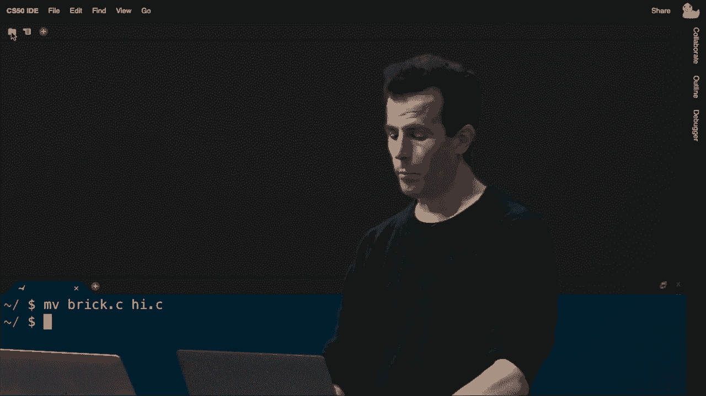

现在如果我打开这个文件，果然里面有高。c，我已经修正了我的重命名错误。好吧，如果我现在执行高，输入点斜杠高。哇，我看到了高，但这显然是实现一个字符串的愚蠢方式，但我们还是深入探讨一下，让我打印出来。

百分比i百分比i和百分比i，这次让我加入空格，只是为了我能看到。呃，数字之间的分隔，让我再一次执行高，点斜杠高，好吧，有72。还有73。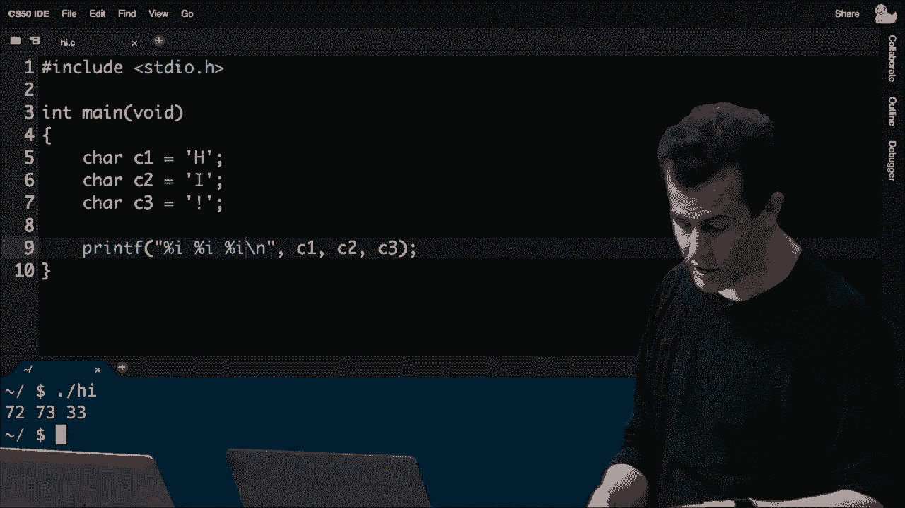

上周有那33，所以这也挺有趣的，那到底发生了什么呢。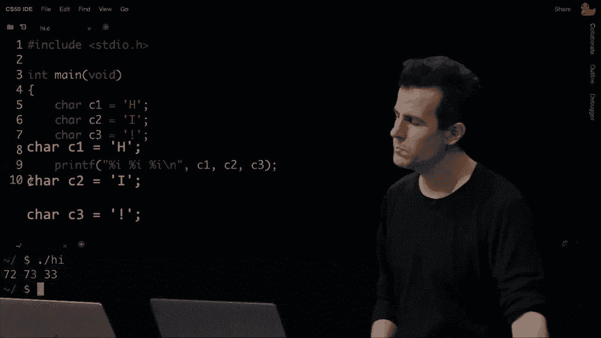

内存，当我现在存储这三个字符时，我只是把它们存储在三个不同的盒子里，所以c1 c2 c3，当你从整体上看，它有点像一个完整的单词，尽管当然只是这些。单个字符，但底层当然是。

`72 73 33`或者在二进制中相同，仅此而已，因此这个故事是相同的，即使我们现在在谈论字符，而不是整数，但当我这样做时会发生什么？当我执行`string s`时会发生什么？``

**高**，用双引号表示，好吧，让我们相应地更改这个程序。让我去**做**我们上周会做的，字符串我将其称为`s`，只是为了`S`代表字符串，全部大写，我可以简化下一行，让我使用`%s`作为字符串`s`的占位符，接下来让我去**重新编译**，这使得。

`hi`和`huh`有五个错误，我的天哪，像八行代码和五个错误，这不是**好事**。总是向上滚动到第一个错误，因为这可能是一些恼人的**级联效应**，导致编译器感到困惑。使用``。

标准，我没有，但这是因为字符串，结果显示在技术上并不存在。结果是，这个字符串一词，实际上在C中并不存在，这是一点**白色谎言**，或是cs50的库的一个特性。如果你愿意，我们下周将去掉这个训练轮，但现在让我们揭示什么。

字符串实际上是因为字符串是每种编程语言都有的**艺术术语**，即使它在技术上并没有一个叫做字符串的**数据类型**。我们通过**cs50的库**将这个类型添加到C中，但现在如果我创建一个高。注意我的代码可以正常编译，如果我输入`./hi`，然后按回车，哇，我仍然看到高，这就是。

我在上周也见过，如果我们在计算机的**内存**中描述这个，因为`hi`是三个字母，这就有点像说，给我三个盒子。让我称这个字符串为`s`，所以这感觉像是一个合理的艺术表现，如果它存储一个像`hi`这样的三字母单词，但每当我们有这样的字符序列时。

我觉得我们现在看到了一个合适的编程语言的**能力**。我们稍早前引入了字符串的概念。所以，也许可以有人重新定义今天的**命名法**中的字符串，比如什么是字符串。这里有一个例子，`high`占用了三个盒子，但我们是如何实现的。

字符串的本质，呃，它是一个字符的数组和整数。好吧，如果整数用于基本的单字符，那么这就是完美的。如果我们现在有能力表达，做得很好，塔克。如果我们现在有能力表示，事物的序列，例如分数，那么可以推理出我们可以。

取另一个基本的**数据类型**，例如`char`，如果我们想要英语单词。那么我们不妨将字符串视为字符的**数组**，即字符的数组。实际上，这正是字符串的本质，所以这里的东西，`high!` 从技术上讲是一个叫做`s`的数组，而这是`s`的第一个元素，这就是`s`。

括号一，这就是 s 括号二，这只是一个名为 s 的数组。我们上周没有使用“数组”这个词，因为它没有“实例”那么熟悉。但字符串显然只是一个数组，如果它是数组，那么我们可以访问，如果我们想的话。从今天开始，结果是有一些特殊的东西。

关于字符串的实现，回想一下我们涉及分数的例子，我们知道那个数组的长度是因为我有第二个变量叫做总数。也就是说，在我们的分数示例中，并没有同时保存数组。虽然直到现在，每当你和我使用 printf 函数时。

我们已经传递给 printf 函数一个像 s 的字符串，我们只提供了 printf 字符串本身，或者从逻辑上讲，我们仅仅提供了 printf 某种方式。printf 神奇地找出字符串的长度，毕竟，当 printf 打印 s 的值时，它打印的是 h i，感叹号，仅此而已。

如果你打印四个字符、五个或二十个，那么很明显，在你的计算机内存中还有其他东西，如果你有其他变量或其他程序在运行，然而 printf 似乎足够聪明，知道给定一个数组，数组的长度。因为很简单，它只打印那个单一的单词，那么，如何呢？

在内存中，如果一个字符串仅仅是字符的序列，事实证明，只有一个 h i 感叹号。从技术上讲，一个字符串在内部实现使用四个字节，它使用四个字节，并使用第四个字节来初始化我们所称的反斜杠零，这是一种奇怪的描述方式，但这仅仅表示一个特殊的。

字符通常被称为 null，表示字符串的结束。也就是说，当你仍然创建一个字符串，用双引号引起来，比如 h i，感叹号。是的，这个字符串的长度是三，但你实际上浪费或使用了四个字节，为什么呢？因为这是给计算机的提示，字符串。

也许开始的时候，仅仅逐个打印字符是不够的。在 printf 中，从左到右需要有类似的停止标志在字符串的末尾，表示这就是这个字符串的结束。那么，回到十进制，72 73 33，那奇妙的反斜杠零仅仅是表示。

字符形式是零，更具体地说，*平方*，所以为了存储一个字符串，计算机需要额外的字节。所有的零位可以写成字面上的值零，因此这个东西通常被称为 null 只是一个特殊字符，我们将在片刻后，如果我回到我的 ASCII 表。

所以说，字符串的强大之处在哪里，一旦我们有了，这种能力。让我继续，回到刚才的代码。并让我继续，增强一下，我对发生的事情很，感兴趣。你知道，我可以在这里做的事情，我敢打赌。

如果我想打印出所有这些，字符的s，我可以再好奇一点，打印出百分c，数组，按照今天的语法，我技术上可以做，s括号0。s括号1 s括号2，然后如果我保存这个，重新编译我的，代码make hi。好的，dot slash high我仍然看到高，但你知道，让我再稍微。

更好奇了，让我用百分号i，实际上可以看到那些ascii代码，高。dot slash high，那里有7273，33，现在让我再好奇一下，打印出第四个值。像这样，s括号3，也就是第四个位置，记住。所以如果我现在做make hi。和dot slash hi，瞧，现在你看到零，这暗示了实际上一个。

非常危险的特性，假设我好奇想看看，那里有什么。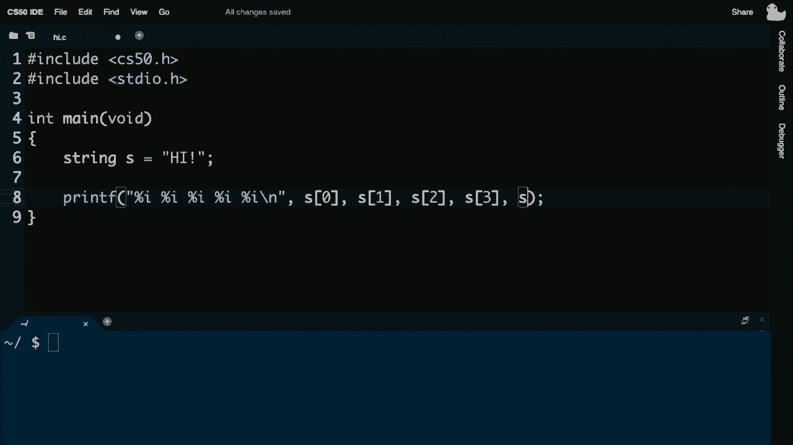

我技术上可以做s括号四，给我的图。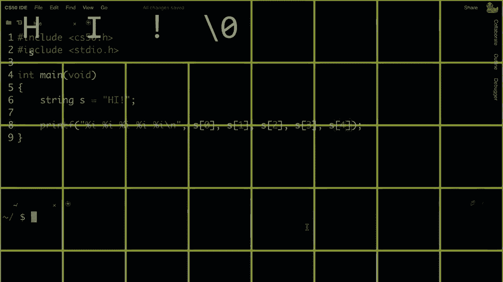

在第五个位置应该没有任何东西，至少我，暂时不知道。不过我可以用c来做，没什么能阻止我，所以让我来做高。dot slash high，这很有趣，显然有数字37，是什么呢。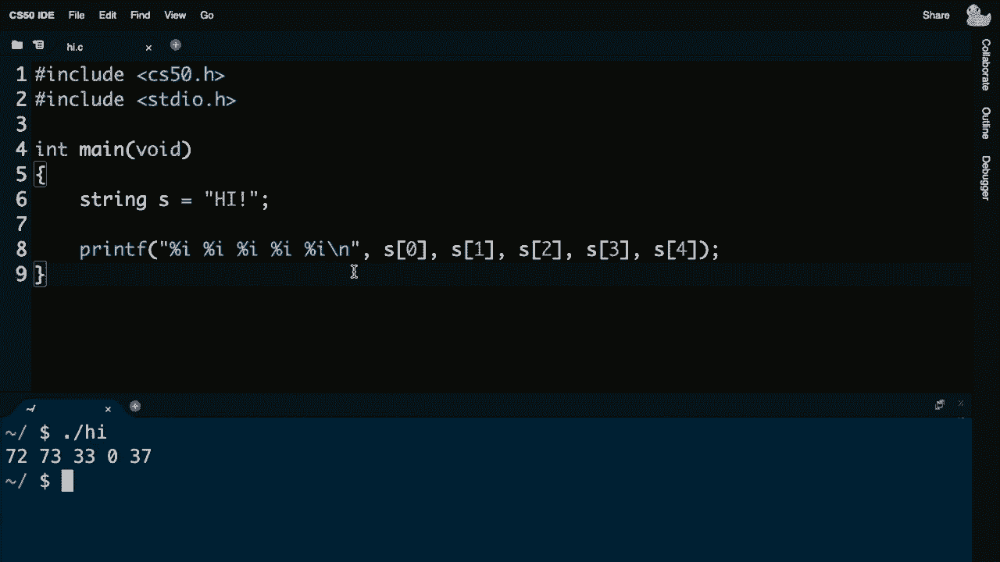

数字37，让我回到我的，ascii图表。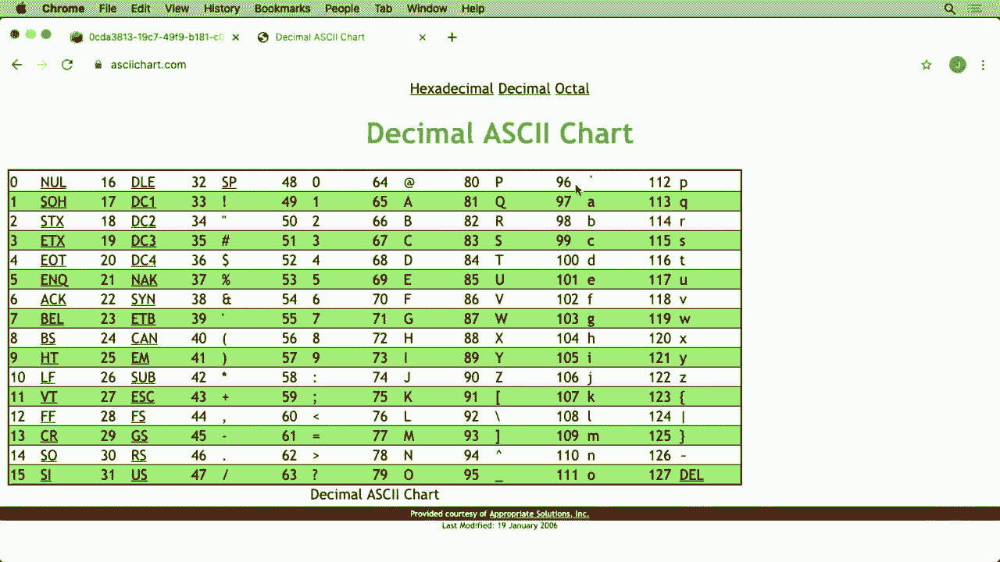

让我总结一下，数字37是一个，百分号，这有点奇怪，百分。现在我有点在，计算机的内存里乱翻，某种意义上我不应该，查看的地方。事实上，如果我真的好奇，看看不是位置4，如何呢，位置40。像是深入那幅图，make high，看看位置，400，重新编译我的代码，make hi dot slash hi。

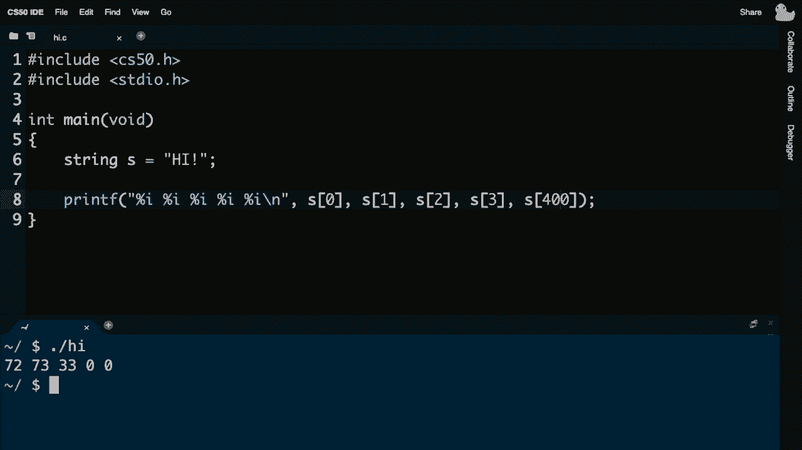

现在又是零了，所以这和c有关，你想，你实际上只是在遵循，诚信系统，不去触碰不该碰的内存。下周，我们会不会开始不小心，触碰到。你会看到，这实际上可以，包括，自己mac和pc上的程序，又是另一个，常见bug的来源。但是现在我们有了，存储字符串的能力，作为。

数组，所以让我们继续考虑，如何在一个程序中存储多个字符串。我们称它们为，s和t，分别。另一个程序员的惯例，如果你需要两个字符串，叫第一个为s，然后第二个为t，也许我存储高然后低。好吧，去吧，让我们再挖掘一下，高，像以前那样将存储在这里。

整个事情都指向`s`，它占用了四个字节，因为最后一个是那个特殊的空字符，它是结束字符串`b y e`的停顿标志。感叹号五个字节，因为我需要第五个字节来表示另一个空字符，而这个字符故意回绕，尽管这只是一个艺术表现。

现实中不一定有网格，感叹号`\0`现在表示`t`。所以这是说如果我有一个程序像这样，开始在计算机的内存中探测，只是使用方括号符号`b`、`y`或`e`，只是通过查看稍微超出字符串`s`。所以，尽管我们的程序多么复杂，底层发生的一切。

理论上，只需将东西放入内存中的这些位置。因此，现在我们有了这种能力，或者说对计算机内部发生的事情的心理模型，我们可以考虑一些特性，你可能想要在你编写的程序中使用，所以让我继续在这里快速写一个。

举个简单的程序，比如说，它会打印出字符串的总长度。让我继续做这个，我将继续创建一个新程序。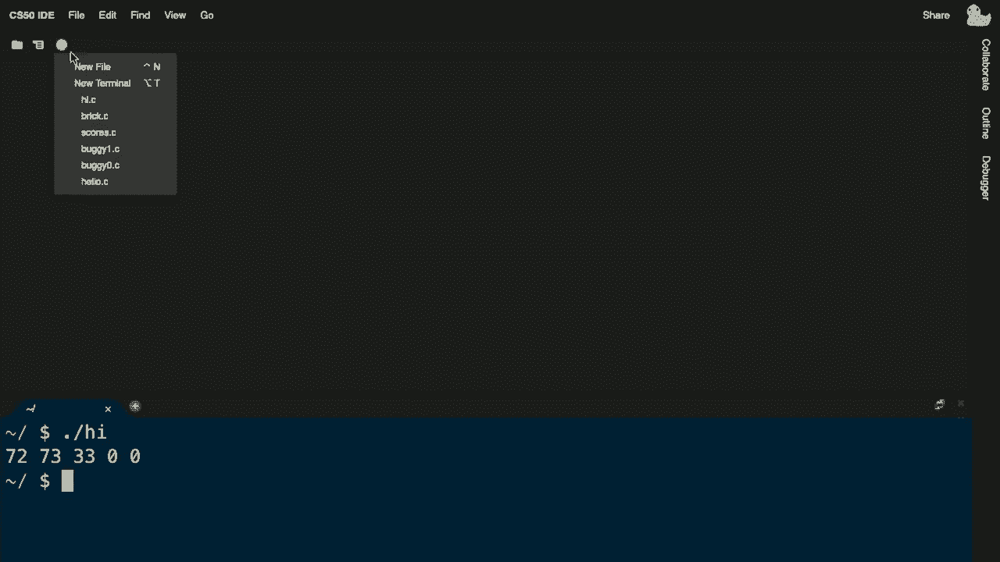

在CS50的IDE中，我将把这个文件命名为`one_string.c`，然后我将快速在顶部包含像往常一样的`cs50.h`，并且我将继续包含`stdio.h`。然后我将给自己一个`int main(void)`，然后在这里我将得到一个字符串。所以`string s`等于`getstring`，让我问人类输入一些内容，不管是什么。

然后让我继续打印出字面上的单词输出。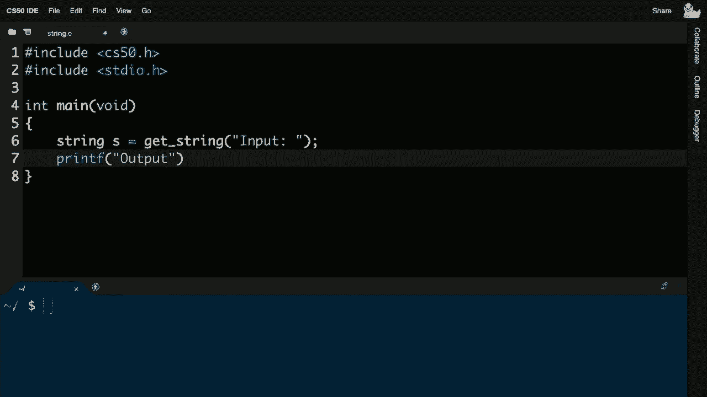

只是为了我能实际看到结果，然后在这里，哎呀。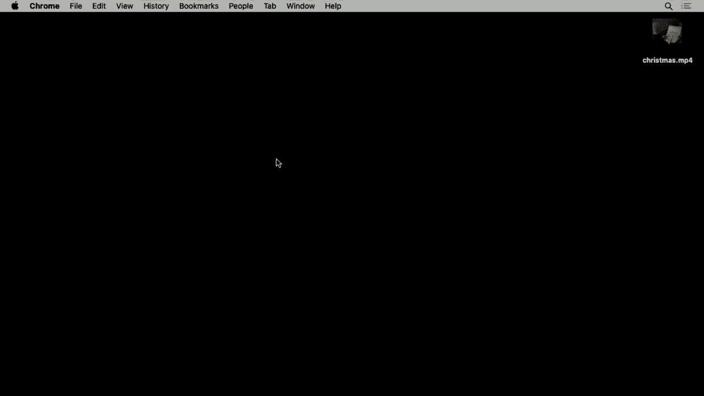

哎呀，抱歉。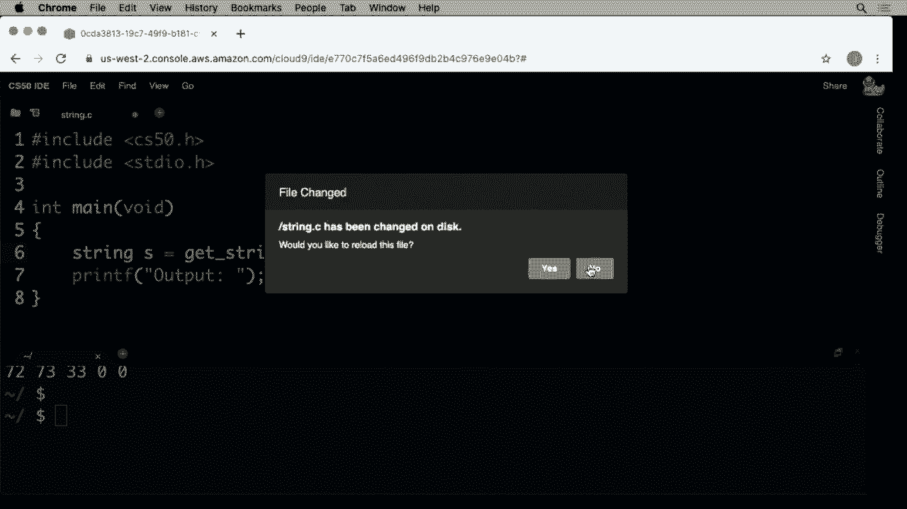

在这里让我继续打印出这个字符串，对于`int i`，从0开始，`i`小于……哎，我还不知道字符串的长度，所以我就放一个问号在这里，这不是有效的代码，但我们会回来处理这个。`i++`，然后在循环内部，我将继续打印出每个字符。

一次一个地使用我的新数组符号，最后在行的末尾。只是为了确保光标在它自己的行上，所以这是一个完整的程序。现在从本周开始，这个程序将把字符串视为数组。因此我在第10行的语法使用了我新的花哨的方括号符号。

但我还没有回答的唯一问题是这个字符串，我怎么知道何时停止呢？事实证明，迄今为止，当我们使用`for`循环时，我们通常做的事情就是从零开始数到某个数字，这个条件其实是任何布尔表达式，我只需要一个“是”或“否”或者“真”或“假”的答案。所以你知道，我可以继续循环。

只要位置`i`的字符。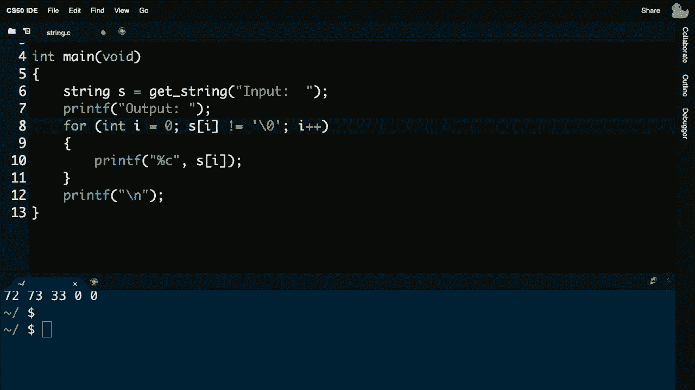

s 不等于反斜杠零，所以这肯定是新的语法，让我在这里放大一下。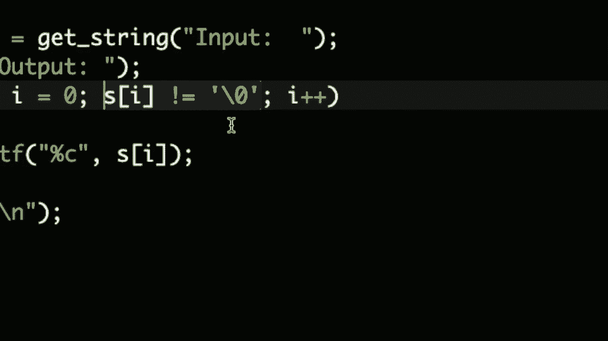

在 s 中的字符，位置 i，s 不等于，所以不等于是程序员发音感叹号的方式，因为稍微快一点，bang equals 表示不等于，所以这是你在数学中如何用斜杠表示等号，代码中是。呃，感叹号等于号，然后注意这种奇怪的字符。

但是它用单引号表示，因为它定义上是一个字符。出于我们以后会讨论的原因，反斜杠零是你表达它的方式，就像反斜杠 n 是一种奇怪的换行符，所有零。因此，这是一种不同的 for 循环，我仍然从零开始。

我仍然像往常一样递增 i，但。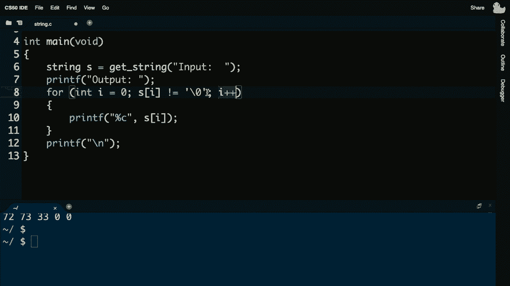

我现在不检查某些计算机。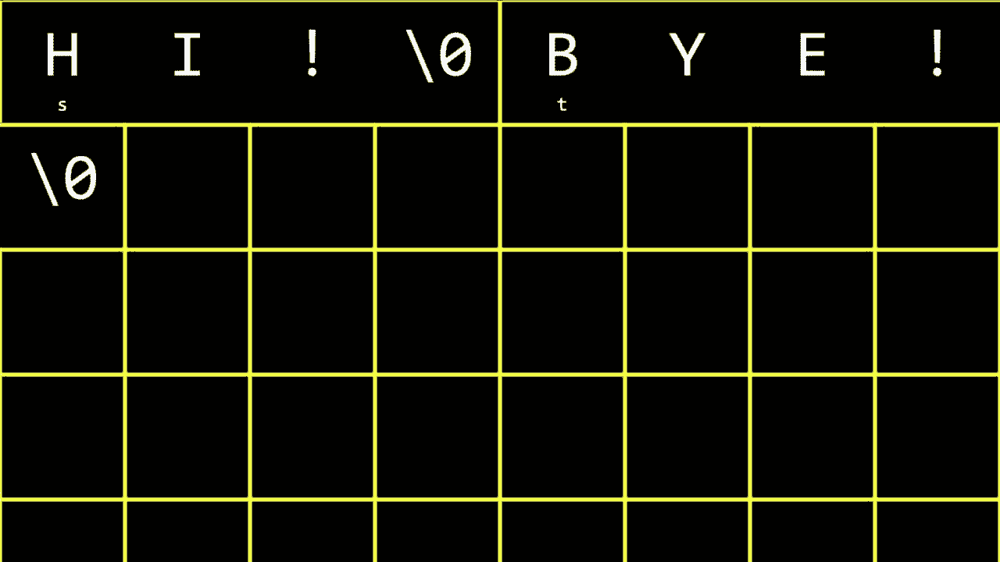

字符串结束，我只知道它们在我看到反斜杠零时结束。因此，当我现在下去做 `make string` 时，它编译正常，点斜杠字符串让我输入像 hello again 的内容，让我再试一次，买在全部大写时。输出是 by，所以这在某种程度上是个无用的程序，因为它只是。

打印出我输入的相同内容，但我有条件地使用这个布尔表达式来决定是否继续打印字符。现在，感谢这个，对我来说，事实证明有一个叫做 `strlen` 的函数，所以我可以简单地说，算出字符串的长度，函数叫 `strlen`。

字符串长度存在于一个文件中，显然是字符串 h，字符串 h，所以现在让我下去做 `make string` 编译正常，点斜杠字符串，函数 `strlen` 确实存在于通过头文件字符串 h 的库中。已经存在，其他人写的，但他们是怎么写的，可能他们。

我写了我做的第一个版本，让我在这里问一个微妙的问题，这个程序是。它遍历整个字符串的长度，并打印出每个字符。有没有人观察到这个函数中的设计决策有问题，这一点很微妙。但我对我的 for 循环特别不喜欢，我会将其隔离到第九行。

我在第九行没有做到最优设计，有一个更好设计的机会，有什么想法吗？关于我可能做得更好的任何想法，呃，是的，乔纳森，是的，基本上创建另一个变量来存储流长度，并记住它，嗯，如果你想为流长度使用不同的值，或者如果它可能波动或改变，你想要只拥有一个不同的。

变量作为某种占位符值，好的，可能可以，但我在这种情况下声称，因为人类已经输入了这个词，一旦输入这个词，它不会改变，但我认为你走在正确的方向上。因为在这个布尔表达式中，我小于s的字符串长度。

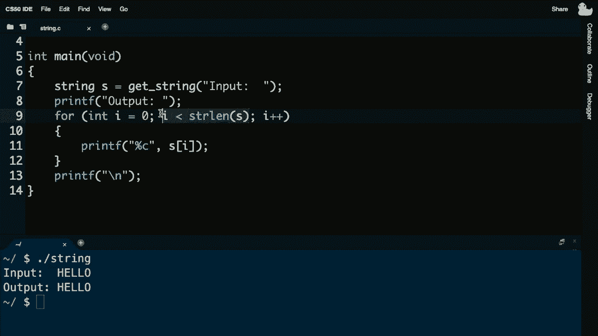

回想一下这个表达式每次通过for循环时都会被评估。回忆条件，在这种情况下i小于s的长度，问题是斯特林在这种情况下是一个函数。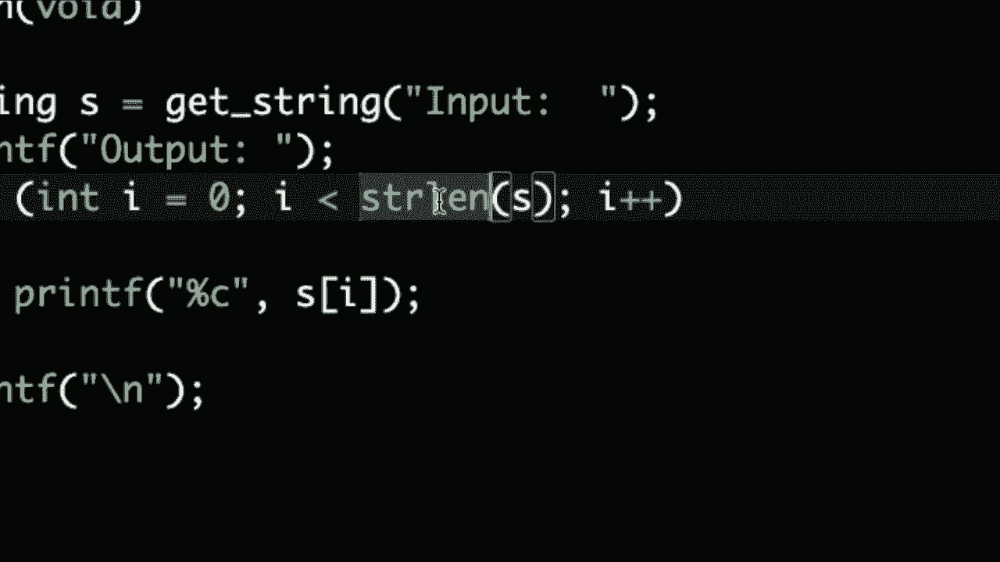

这意味着有一些代码，可能是有人写的，类似于我几分钟前写的，你不断地问字符串的究竟是什么。而且从我们的图像回忆，你找出字符串长度的方法是从字符串的开头开始，你不断检查我是否在反斜杠零。

好吧，我是否在反斜杠零，所以要找出高的长度大约需要我一、二、三、四个步骤，对吧，因为我必须从开始处开始。我迭代bi的长度，这大约需要我五个步骤，因为这就是我从左到右所需的时间。

找到那个反斜杠零。所以我不喜欢这行代码的原因是，为什么你要一次又一次地询问s的字符串长度，在这种情况下它不会改变。因此，乔纳森的观点是正确的，如果我们不断要求用户提供更多输入，但在这种情况下，我们只问了人一次，所以你知道吗，听从乔纳森的建议去做。

int n等于这个，让我们听从乔纳森的建议，做int n等于字符串长度。把n放在这个条件里，所以现在我在问同样的问题，但。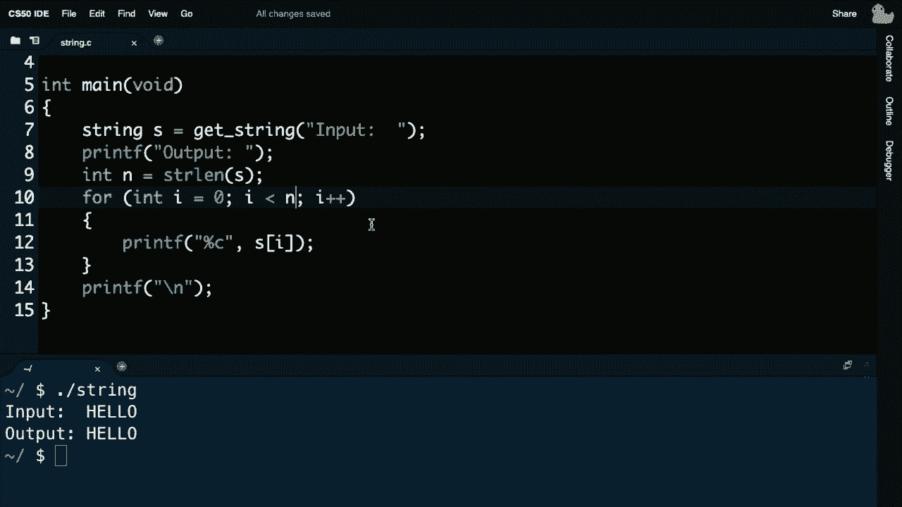

我并不是愚蠢地低效地问同样的问题。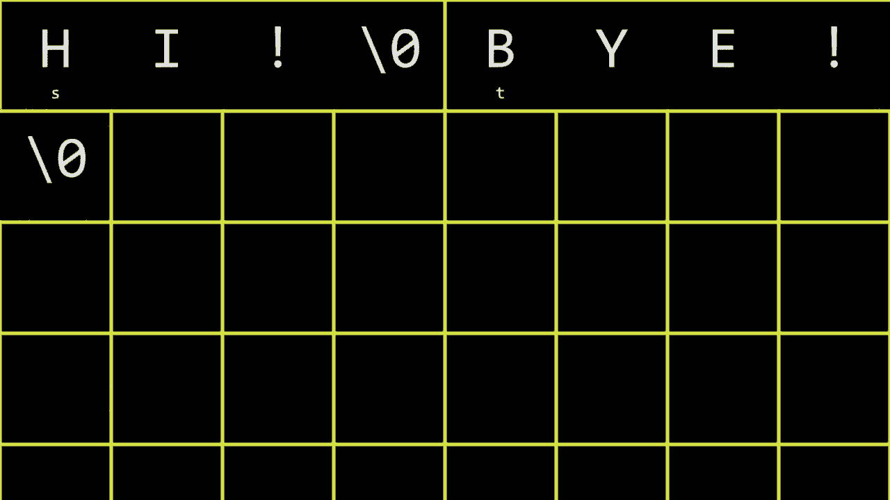

一次又一次地，同样的问题需要花费相当多的工作来找到反斜杠零，一次又一次。现在我们这里也可以做一些清理。事实证明，如果你想将另一个变量初始化为一个值，对于for循环还有另一个微妙的特性，你实际上可以一次性做到这一点。

在分号之前你可以做逗号，n等于斯特林的s，然后你可以像我在这里一样使用n。所以这并没有好太多，但稍微干净一些，因为现在我把两行代码合并成了一行。它们都必须是相同的数据类型，但这在这里是可以的，因为i和n都是。因此，之前的低效是愚蠢的，我。

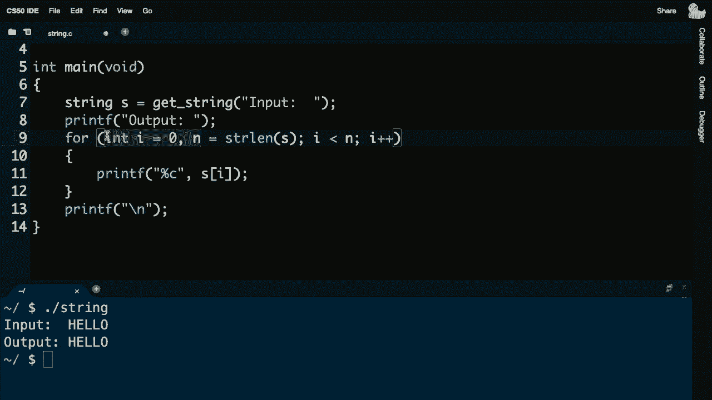

不断重复同样的问题，但现在我只问了一次。记住在一个叫n的变量中保存它，并仅将i与那个不实际改变的整数进行比较。好吧，我知道这也是很多内容，让我们去做一个三分钟的任务，然后再回来开始应用。

所有这些特性最终都将面临一些问题，这周关于语言的可读性以及密码学的内容。

好的，所以我们回来了，这些无疑是一些低级细节，而我们最终要去的地方是应用这些构建块，接下来的一个问题集将是密码学的问题。如果你试图加密信息，比如消息，那些。

消息可能用英语或ASCII编写，你可能想转换一些内容，以便如果你的消息被某个第三方截获，他们无法真正解码或弄清楚你发送的内容。因此，我感觉我们几乎要接近了，我们能开始转换。

从一个单词到另一个单词或者混淆我们的文本，但我们需要几个更多的构建块。所以回忆一下我们停留在这里的画面，计算机的内存中有两个单词，高和bi，两个都有感叹号，但也都有这些反斜杠零，这些是你我并没有显式放入的。

这些在你使用双引号和`getstring`函数时就会自动发生，所以一旦我们将它们放入内存，你可以分别把它们想象成s和t，但字符串s或t只是一种数组，所以你也可以通过今天的新方括号表示法来引用所有这些单独的字符或字符。

`s1 s2 s3`，然后`t bracket 0 t bracket 1 2 3 4`，以及计算机内存中其他的内容，但你知道你甚至可以这样做，假设我们想要一个单词数组，所以之前我们有一个分数数组，一个整数数组。但现在假设我们在某个其他程序的上下文中有一个数组。

你完全可以这样做，没有什么阻止你拥有一个单词数组，语法是相同的，注意如果我想要一个字符串数组，`bracket 2`。这意味着嘿计算机，给我一个大小为2的数组，每个成员都是那个数组。和之前的分数一样，`words bracket 0`得到的是“高”。

`words bracket 1`得到的是“拜”，也就是说，通过这段代码，我们能否创建一个类似于之前的图片，但我现在不再称这些字符串为s和t，而是称它们为两个不同位置的单词0和1。因此我们可以像这样重新绘制那幅图，现在`bracket 0`，这个由单词引用。

括号一个，但再说一次，什么是字符串？字符串是一个数组，而这里我们有一个字符串数组。数组，所以我们有一个单词数组，但单词只是一个字符串，而字符串又是字符数组。因此我在板子上真正有的是一个数组的数组。所以这里，这将是今天最后一个奇怪的语法，你实际上可以有多个方括号。

括号背对背，所以如果你的变量叫做 words，而那是一个数组。如果你想获取数组中的第一个单词，你可以用 `words[0]`。一旦你到达那个单词 hi，并且你想获取那个单词中的第一个字符。你可以同样用 `bracket[0]`，所以第一个括号指的是什么。

你想在数组中放入哪个单词，第二个括号指的是 i 当前在的字符。是 `words[0][1]`，零括号二和空字符在 `words[0][3]`，与此同时 b 在 `words[1][0]`、`[1][1]`、`[1][2]`、`[1][3]`，所以这几乎有点像一个坐标系统，如果你。

这是二维的，仅仅是说，如果我们想将字符串数组视为单独的字符，我们可以，我们现在也有这种表达能力。在代码中，那么我现在可以做些什么，既然我可以在这个层次上操纵事物。让我做一个程序，我认为这将非常适用，结合我们的。

即将到来的程序。让我称之为。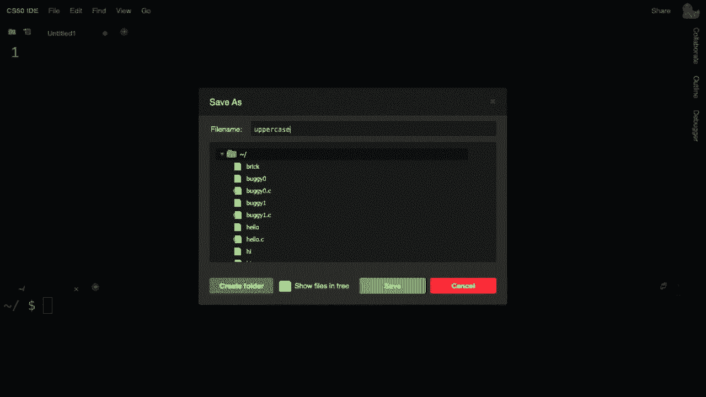

这一个大写，让我快速写一个程序，其目的只是转换一个。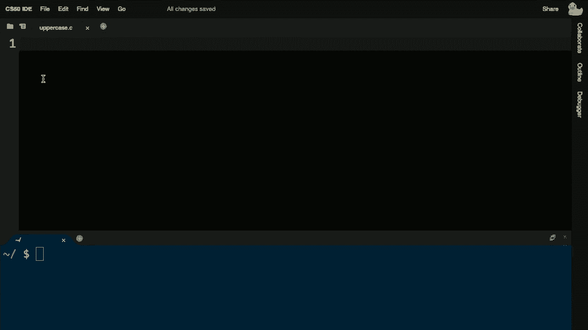

输入单词转换为大写，让我们看看，并且包含 `cs50.h`。让我继续并且包含 `stdio.h`，我还要包含 `string.h`，这将给我们像字符串长度这样的函数。然后让我做 `int main(void)`，然后让我继续在这里从用户那里获取一个字符串，就像之前那样，我只是会问用户。

一个字符串，我希望他们给我，不管字符串在字面上应该是什么，在之前，之后。我将字符串中的所有内容都大写，现在让我继续，`for int i = 0; i < string length of s; i++`，等一下，我之前犯过这个错误。我们不要重复这个问题，让我给自己一个第二个变量。

`n = string length of s; for (i = 0; i < n; i++)`，所以这又变成了样板代码，任何时候你想要字符串，这可能是一个合理的开始地方。然后让我问这个问题，我想要遍历人类输入的字符串中的每一个字符，我想问自己一个问题。

正如我们用任何算法所做的，具体来说，我想问当前字母是否是小写。让我以某种方式将其转换为大写，否则让我直接输出，不做更改。那么我如何用上周和这周的构建块来表达这一点呢？让我说类似这样的话：如果位置 i 处的字符。

在 s 或者如果 s 中的第 i 个字符。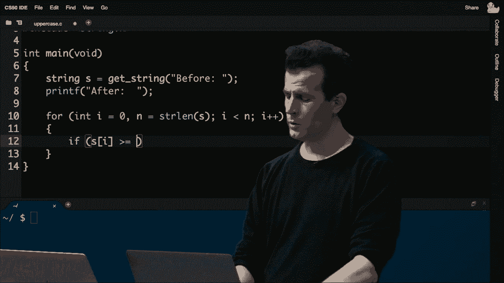

大于或等于小写字母a，并且s中的第i个字符小于或等于小写字母z，我想做什么呢？让我继续打印出，什么，这里还没决定。但是让我回到else，继续打印出那个字符，保持不变的s括号i，减去占位符的问号。

我几乎已经全都做完了，第10行将i初始化为0，它将计数一直到n，其中n是字符串的长度，并且它将不断递增i，所以很快就会成为肌肉记忆。第12行来自上周，这周我们有新的方括号符号来获取字符串s中的第i个字符。

或者小于或等于，我们上周至少看到了其中一个。这仅仅意味着大于或等于，小于或等于，我提到了上周的&符号，它是逻辑与运算符，意味着你可以检查一个条件和另一个条件。只有当这两个条件都为真时，整个条件才为真。

当前字符在小写字母a和大写字母及小写字母z之间，是完全可以隐式地将a和z视为数字，因为它们确实是。因为如果我们回到我们最喜欢的ASCII表，访问ascii chart.com，你会再次看到这一点。

像这样，我想表达，如果这个值大于或等于97，并且小于或等于122，但这像是糟糕的设计，我永远不会记得小写字母z是122，像是没有人会知道，这让代码不那么明显，所以我决定以一种更友好的方式写出来。

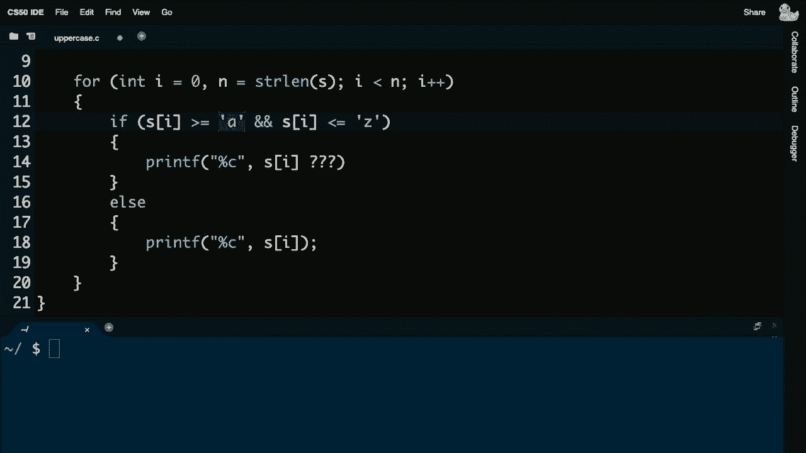

像这样，但注意这个问号，我该如何填充这个空白。好吧，让我回到ASCII表，这个问题很微妙，但这很酷，人类显然是在前瞻性思考，注意小写字母a是97，大写字母A是65。小写字母b是98，大写字母B是，注意这两个数字，67到90，65到97，66到98。

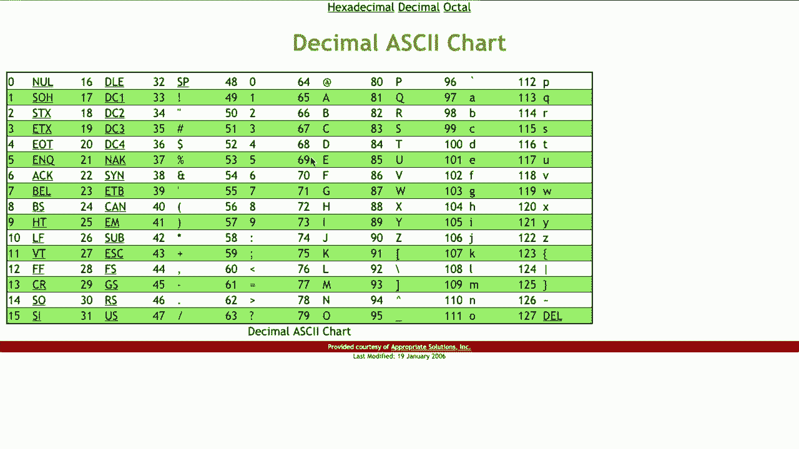

看起来，从67到99，无论我们比较什么字母，小写字母和大写字母之间总是相差32，这一点是一致的，我们可以对所有26个英语字母进行这种处理。所以如果它们总是相差32，你知道我可以做什么。如果我想取一个小写字母，14，大小写，这并不是最干净的做法，因为我在某个时刻。

至少在数学上，我认为这会奏效，因为97将变成65，98将变成66，这就迫使那些字符变成更低的数字。我仍然在使用percent c将其强制转换为字符，所以如果我没有搞错任何语法，让我将其改为大写，好的，点斜杠大写，让我继续输入，例如。

我的名字全部小写，瞧，变成大写了，现在有点丑，我忘记了`\n`，所以让我继续，快速添加一个。只是为了修复光标，让我用`make uppercase`重新编译代码。让我用`dot slash`重新运行程序，并输入我的名字**大卫**。

让我再用**布莱恩**做一次，注意它是逐个字符地大写的。仅使用今天的构建模块，这是正确的，样式也很好，因为一切都很好缩进，非常可读，尽管乍一看可能有点神秘。

但是我认为我可以做得更好，我可以通过使用另一个库来做到这一点。这里是C语言和编程的一般强大之处，使用流行语言的整个意义在于，许多其他人在你之前已经解决了问题，而你不需要再次解决它们。我相信在过去的50年里。

可能有人为我写了一个函数来大写字母，我不必自己去做，实际上有另一个库，我打算通过它的头文件`ctype.h`包含。这个库有一些函数，具体来说，让我去掉所有这些代码，调用一个叫做的函数。

`is lower`和`past is lower`，如你所猜，它的目的是基本上返回一个布尔值，`true`或`false`，如果那个字符是小写的话。那么，让我继续打印出一个占位符，后面跟着那个字母的大小写。现在在我之前必须做那烦人的数学计算，减去32并弄清楚，`to upper`的。

括号和方括号，现在我可以只打印出那个字符，保持不变，就像之前一样，方括号。但现在请注意，我的程序。老实说，它确实短了一点，简单了一点，因为代码少了，希望如果写`is lower`和`two upper`的人做得好。

我知道这是正确的，我只是在借助他们的成果，坦白说，我的代码更可读，因为我理解`is lower`的意思，而那个疯狂的`&`语法和所有额外的代码，确实让人很难理解。因此现在如果我继续编译这个，`make uppercase`，好的，似乎工作得很好，现在。

我打算继续做`dot slash`，大写并输入我的名字，然后再小写。**大卫**似乎可以，**布莱恩**似乎也可以，我可以整天这么做。这似乎仍然有效，但你知道，明确地说，如果写`two upper`的人聪明，我敢打赌我可以盲目传入任何字符给`two upper`，它只是。

`going to uppercase`，如果可以转换为大写，否则将保持不变。所以你知道，让我去掉所有这些东西，并为C输出一个占位符，然后`two upper`的方括号，果然，如果你阅读这个函数的文档，它将处理小写和大写的情况。

好的，现在如果我重新编译我的代码，运行`make uppercase`，到目前为止一切正常，执行`./uppercase david`。又一次，看看，它仍然可以工作并且注意到。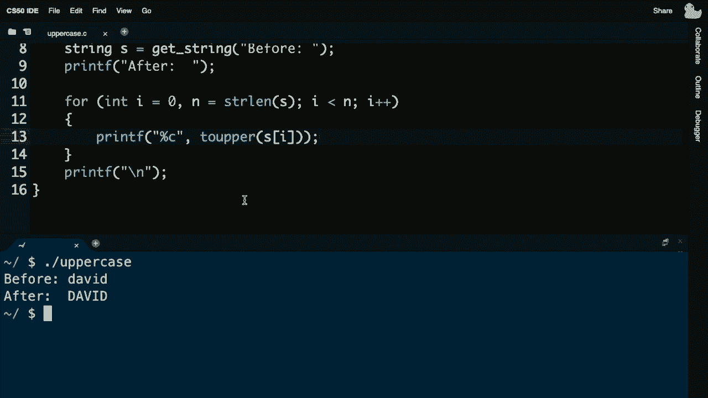

真正清楚的是，我的代码到底变得有多紧凑，有多干净，以及有多简短。而且它的可读性也更强，从这个函数的命名来看，它的确命名得很好。“to upper”就是它的确切名称，但这里有一个重要的细节。“two upper”期望输入一个字符，你不能传入整个单词。

此时我仍然需要使用这个循环，并逐个字符地处理，现在是多个字符。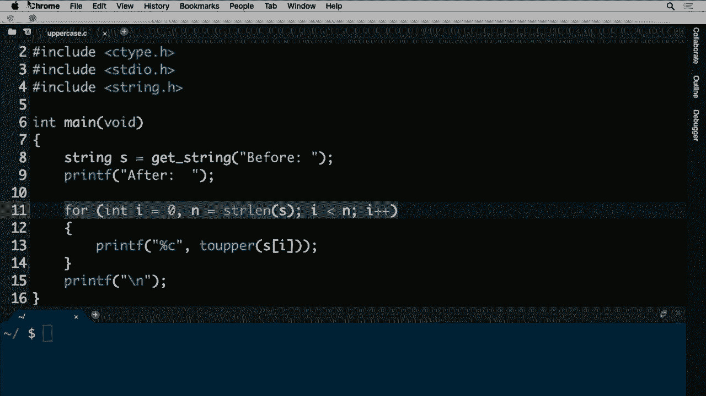

接下来几周的例子，但如果我去查找所谓的C语言手册页面，我们有自己基于网页的版本，我们会在课程实验和问题集中链接给你。你可以看到C语言中至少常用函数的所有可用列表，在CS50中。

如果我们在顶部取消勾选一个框，我们可以看到更多的函数，可能有几十个甚至几百个函数，其中大多数我们在语言中不需要或使用。你会随着时间的推移逐渐掌握所需的构建块，这里的函数乍一看可能有点晦涩，这些手册页面就是。

这些内容确实是为经验丰富的程序员编写的，但会帮助你随着时间的推移理解它们，以便它们对你有用。事实上，如果我向下滚动到描述部分，这里有一些文档的开头，这些函数将小写字母转换为大写字母，反之亦然。

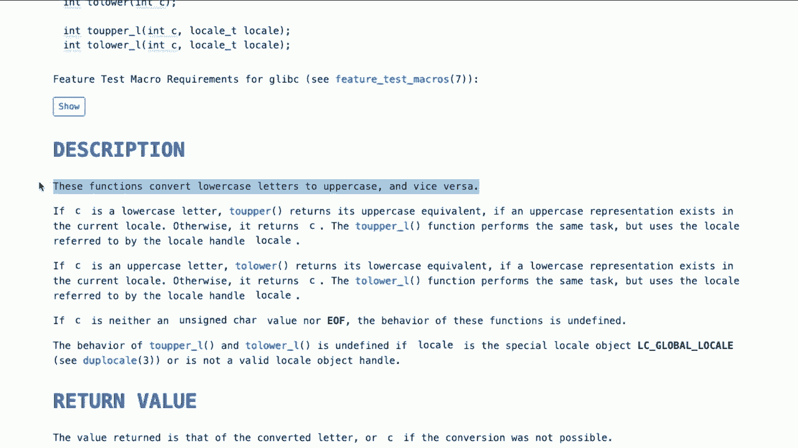

等等，所以我们会推荐这些资源给你，以便你不需要上课。但你可以利用这些其他函数和工具包，我们在Python、SQL和其他语言中也会这样做，这些都是我们所称的功能。在我们考虑加密和混淆信息之前。

问题集二，所以我之前提到的命令行参数，像一个你可以在程序名后输入的单词，以在命令行提供输入，所以`make hello`。`hello`是程序`hello`的命令行参数，而`rm a.out`则是程序`rm`的命令行参数，当我想要的时候。

为了去掉它，我们已经在实际操作中看到了命令行参数。但到目前为止，我们实际上还没有编写任何允许你从所谓的命令行接收单词或其他输入的程序。到现在为止，你和我在程序中获得的所有输入都来自`getstring`、`getint`等，我们从未能查看单词。

人类在运行你的程序时可能非常好地在提示符下输入的，但这一切即将改变。让我去创建一个名为`argv.c`的程序，我将要包括标准的`stdio.h`，然后我将给自己一个`int main(void)`，然后我将非常简单地返回。

并改变 void，正如我们自己的自定义函数可以接受输入，我们已经看到 get negative int，main 可能接受输入。到现在为止，我们一直在说 void，我们告诉你上周说 void，告诉你说 void，C 语言确实允许你将其他输入放入 main，你可以说 nope main does。

不接受任何命令行参数，但如果它接受，你可以字面上说 int arg c 和 string argv 带方括号，所以这有点神秘，技术上你不必准确地这样输入，但人类的惯例会要求你至少现在这样做。这表示主函数 main。

接受一个整数作为输入，而不是一个字符串，而是一个字符串数组。arg c 是 argument count 的简写，argument count 是一个整数。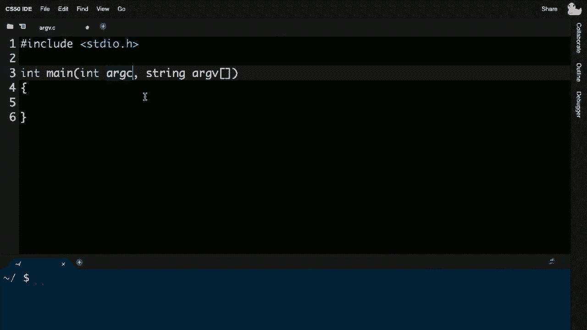

将表示用户在提示符处输入的单词数量。程序名称 arg v 是 argument vector 的缩写，vector 是一个花哨的说法，指的是列表。它是一个变量，将存储人类输入的名称，所以我们可以这样使用。例如，假设我想让用户在命令行输入他们自己的名字。

prompt 我不想使用 getstring，我不想稍后再提示人类输入他们的名字。我希望他们能够运行我的程序，并一次性给我他们的名字，就像 make，rm 和我们见过的其他程序一样。所以我将这样做。如果 argc 等于 2，所以如果传递给我的程序的参数数量是 2。

go ah**d 并打印 hello percent s，并插入 arg v1 中的内容。所以稍后会有更多关于这个的内容，else if，argc 不等于二，让我们就用上周的默认值 hello world。那么这个程序的生命目的是什么呢？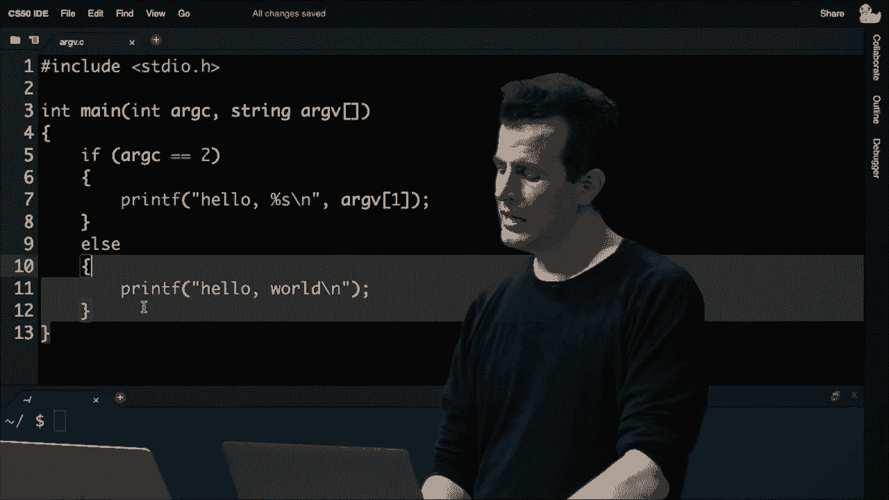

如果人类在提示符处输入两个单词，比如 brian，hello so and so，否则如果他们没有在提示符输入两个单词，我将只是说默认的 hello world。让我编译一下这个 make arg v。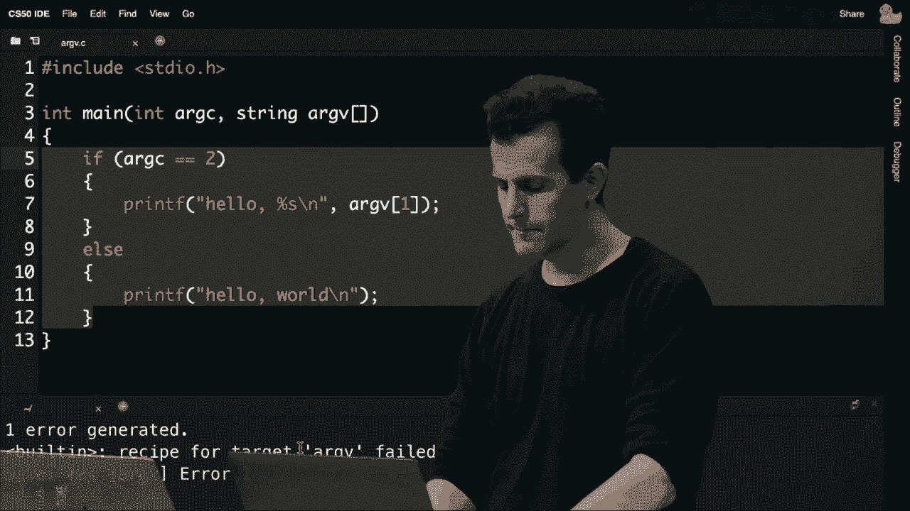

类型，string unknown 类型 string 好吧，我搞错了，如果我使用 string。请记住，现在我需要开始使用 cs50 库，我们会看到更多的原因，在接下来的几周里，当我们去掉那些辅助工具时。但现在我要再做一次，make argv，来了，现在它有效。

dot slash arg v enter hello world，这基本上等同于我们上周所做的，但请注意。如果我输入，比如说 rv1 david，rv，brian，它会说如果我输入 brian u。它会说 hello world，那么发生了什么呢？好吧，你在 C 语言中写程序的方式。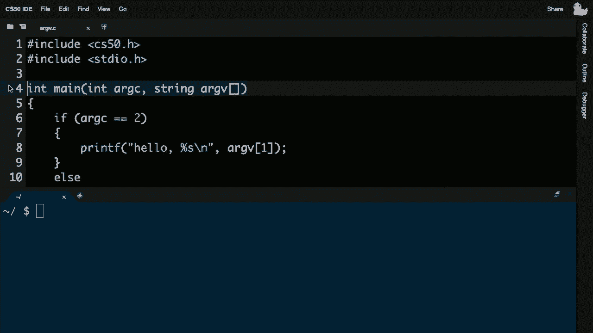

参数也就是，在你的程序名字之后提示的单词，你改变我们一直在做的事情，从 void 变成这变成 argc，字符串 argv，带有方*括号，计算机会自动为你做的事情，是会存储人类输入的单词总数，而不仅仅是。

参数技术上来说，所有的单词，包括你自己程序的名字。然后它将填充这个字符串数组，也就是，argv，包含人类在提示符下输入的所有单词，所以不仅仅是像布莱恩或，大卫这样的参数，还有。你的程序名称，所以如果人类，输入了两个单词，那么就打印出来。

你好，后面是一个占位符，然后。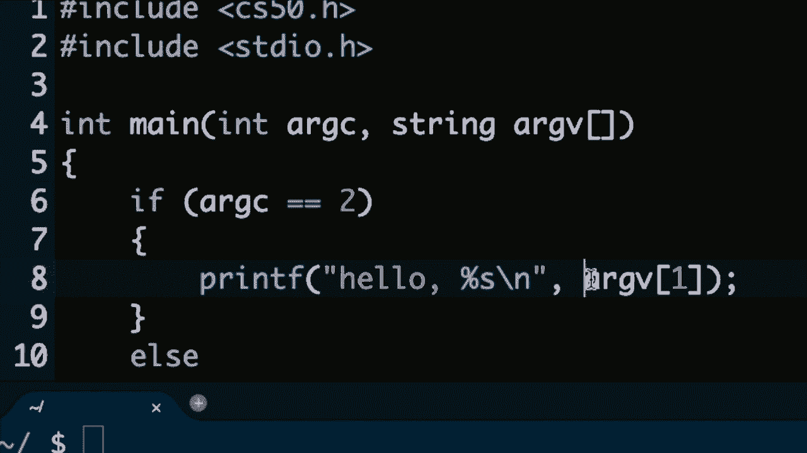

无论 r v 一个的值是什么，我故意不做零，如果我做了零，根据口头，这个程序，我不想看到这个 hello argv，所以程序自己的名字是。自动存储给你，如果你想要第一个，真正有用的信息，你实际上会在重新编译代码后，这里，方式，我们能看到一个 arg v，我们实际上，也能。

假设我想打印出所有的，单个字符。在某人的输入中，你知道吗，我敢打赌我，甚至可以这样做，让我去啊**d，做这个，而不是。仅仅打印出 hello，让我做 r v 的长度，哎 arg v 一个，然后在这里，我将做 i 小于 n，i 加一。

好的，我将遍历所有的字符，在 argv 中第一个真实的单词。我要做什么呢，让我去，打印出，位于 argv 1 的一个字符，但在位置 i，所以我刚才说过，结合我们的图。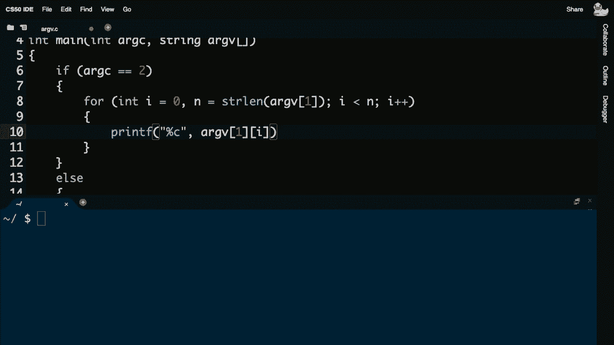

我们可以将其视为一个数组。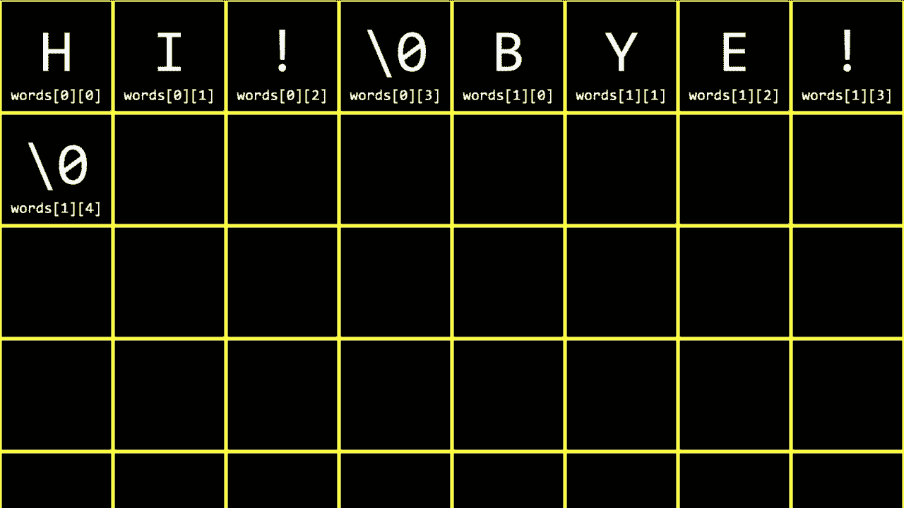

数组，因此我可以在这里使用这种语法，通过访问 argv 一来获取单词，如大卫或布莱恩等，然后进一步索引，使用更多的方*括号来获取 d，a，v，i，d 等等。为了更加清晰，我在这里放一个新行字符，这样我们可以明确看到是什么。

继续让我去啊**d，现在就删除这个 hello world，因为我。并不想看到任何 hello，我只想看到人类输入的单词，制造 argv，哎，我做错了什么，哦，我用了 sterling，实际上不应该，因为我没有，包含。string dot h 在顶部，好吧，现在如果我重新编译这段代码并，重新编译我们的 v，太好了，点。

斜杠 argv，大卫，你会看到每行一个字符，如果我对布莱恩的名字做同样的事情，或者任何人的名字，并把它改成布莱恩，我是逐个字符打印出来的，所以我还是不确定你为什么想这样做，但，在这种情况下我的目标仅仅是。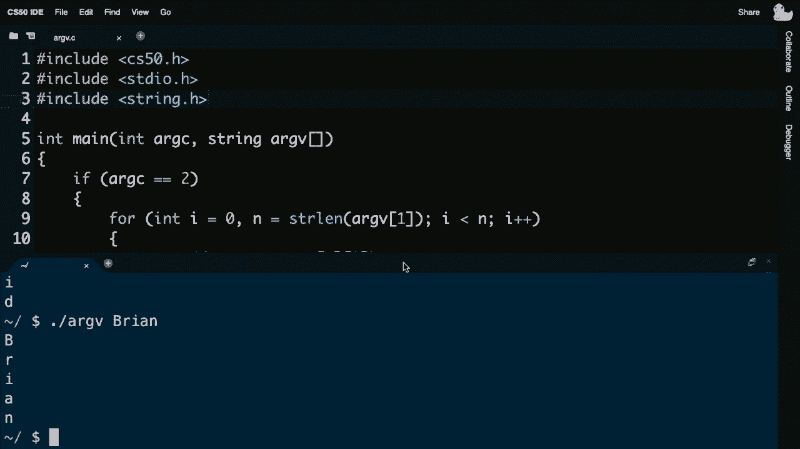

目的是不仅迭代，字符在，第一个单词中，而且打印它们，所以。再次仅通过应用。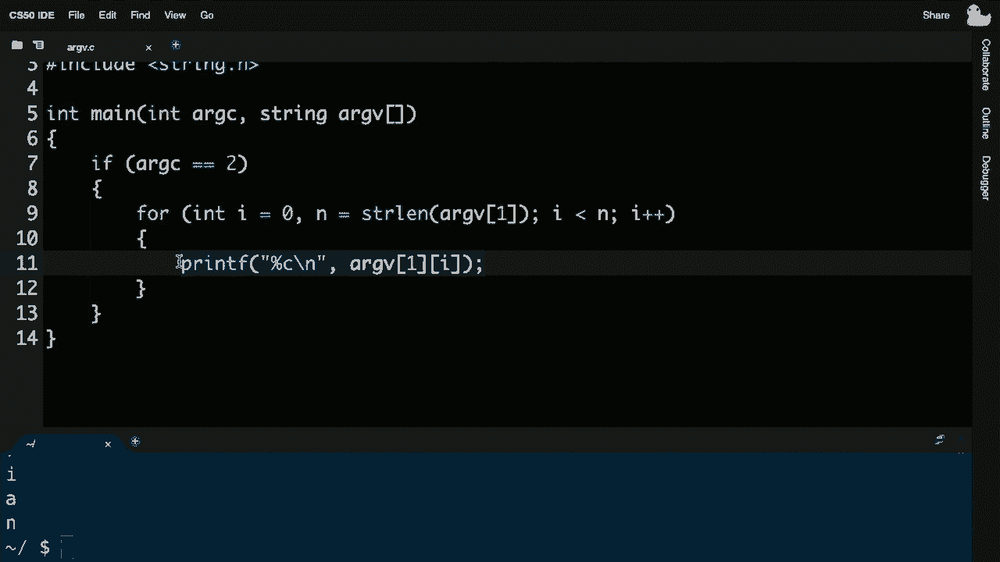

我们实际上看到程序可以访问这些字符串中的每个单独字符。好吧，在我们引入加密和应用之前，最后一个解释是，这个东西，这个东西，谁知道为什么。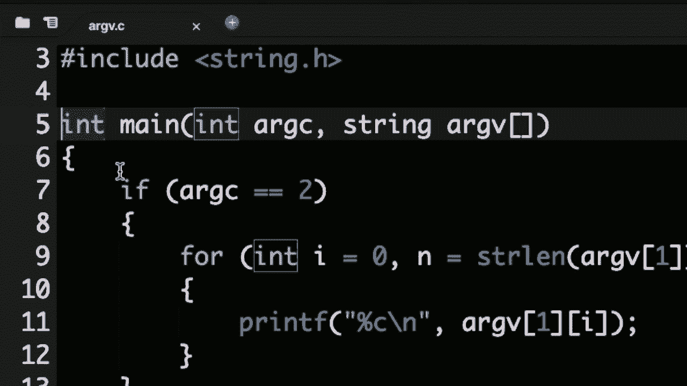

返回一个 int，尽管它不是一个普通的函数，它不是一个获取正数的函数，它不是获取负数的，出于某种原因，主函数总是保持不变。这是我们上周承诺的最后一部分，最终会说明这可能意味着什么，这个有点棘手，布赖恩，我们有谁，怎么样。

是的，通常函数最终返回零，这意味着函数停止。而且这个零就像是从主函数中弹出的整数。如果你之前编程过，几率是，我猜你曾经见过这个。我们人类在像使用 Mac 和 PC 的现实世界中。

你实际上在奇怪的地方看到了数字整数。坦白说，几乎每次你的计算机卡住或看到错误信息时，你都能看到它。很可能你在错误信息中看到的是英文或其他某种语言，但你常常会看到一个数字代码，例如如果你在使用 Zoom。

如果你遇到麻烦，你通常会在 Zoom 程序的错误窗口中看到数字五，因此程序员经常将整数与程序中可能出现的问题关联在一起，这很不错。他们用零来表示这一点，所以让我在这里写一个最终的程序，名为。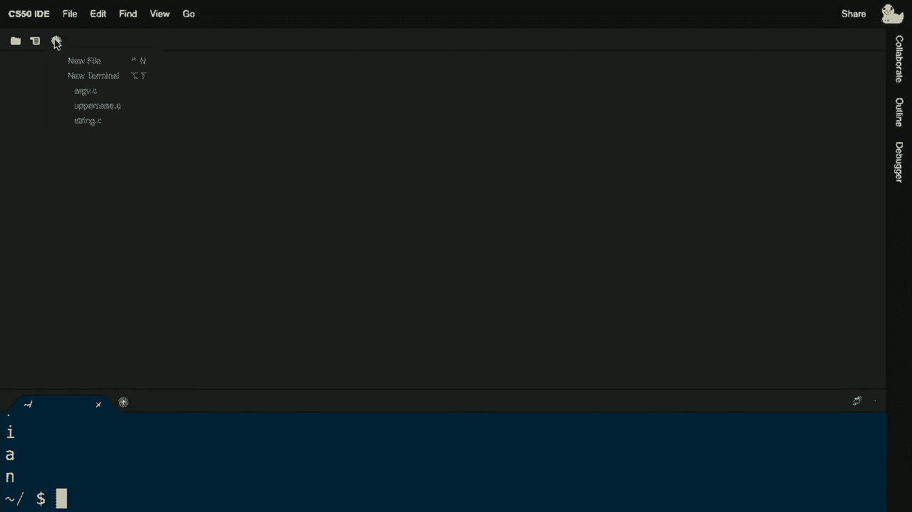

exit.c，这将进行测试，文件名叫做。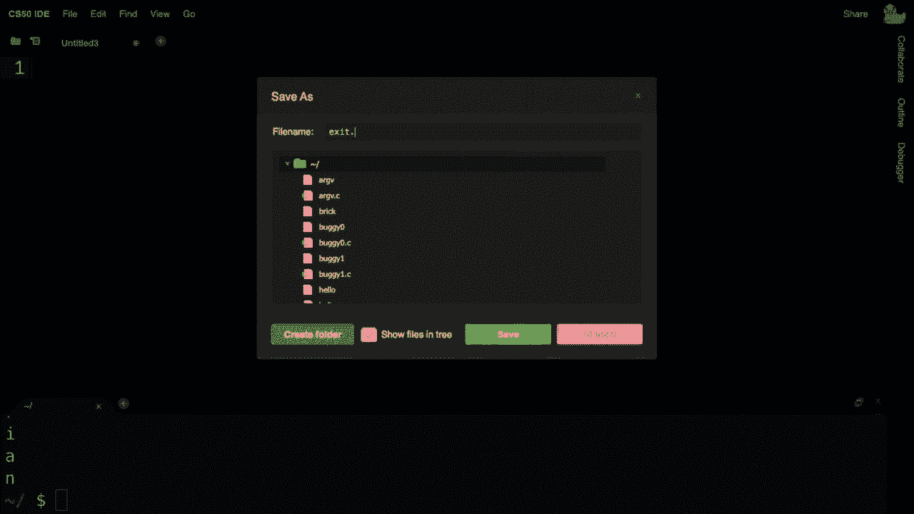

exit.c，这将介绍我们要称之为的内容。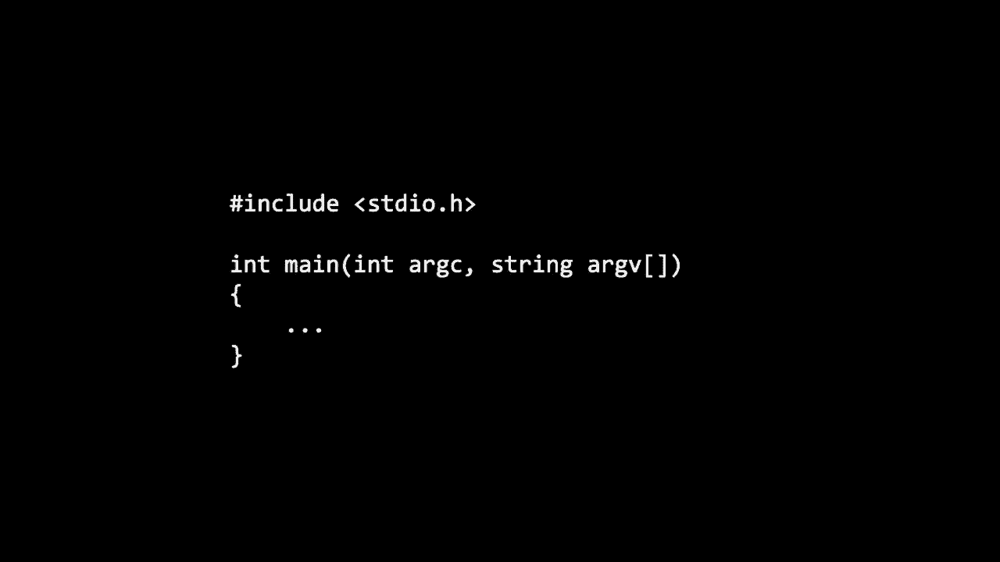

退出代码，这是一种微妙的东西，退出状态，这是一种微妙之处，随着我们的程序的深入，它会很有用。这里包括 standardio.h，我将给自己一个更长的主函数版本，因此 int argc string argv，带方括号。在这里，我要说如果 argc 不等于，人类并没有按照我的要求去做。

我将对他们在某个行参数中大喊大叫，所以任何类型的错误消息屏幕。我只是会告诉他们这个消息，但我将非常微妙地返回数字一，我将返回一个错误代码，人类不一定会看到这个代码，但如果我们有一个图形用户程序。

这将是他们在错误窗口中看到的数字，就像 Zoom 一样，某种东西出了问题。类似地，如果你曾经访问过一个网页，坦白说，当你发现网页不存在时，你会看到整数 404，这在技术上并不是这个确切的表现形式，但它代表程序员使用数字来表示错误，因此你可能见过这个。

如这里所示，我将继续默认说“你好 %s”，就像之前一样，但我不会输入任何无聊的内容，而是检查人类是否在命令行给了我两个单词。如果没有，我将打印缺少，退出代码，否则如果一切正常，我会。

我们将继续并明确返回 0，这又是另一个数字。但我们可以访问它，并且坦率地说，为了课程目的，检查 50 可以访问这些，伟大的笔记也都很好，但一个将意味着继续并进行退出，这在我们结束时是适当的。

继续执行 `dot slash`，退出缺少命令行参数，即显示的内容是什么。如果我继续说“退出大卫”，我会看到“你好，大卫”，或者退出“布莱恩”，我会看到“退出布莱恩”。这不是你需要经常使用的技巧，但你可以想要。

美元符号问号，这是一个非常晦涩的方式来表示我的退出状态。如果你按回车，你会看到一个；相比之下，如果我运行“退出大卫”，我实际上看到“你好，大卫”。

如果我运行退出并看到这个错误信息，我可以很奇怪地说“echo”。所以这不是你我会非常频繁使用的技巧，但这是一个程序的能力，而这是你现在可以访问的 C 语言能力。因此，在编写程序时，我们在实验室和作业中经常会要求你从主函数返回。

错误代码可以是 0、1、2、3 或 4，基于你在程序中检测到并适当地响应的问题。所以这是以标准方式处理错误的非常有效的方法，这样你就知道自己在主动检测错误。那么我们可能会遇到什么样的错误呢？

处理这周我们可能解决的问题，今天完全是关于拆解字符串是什么，上周只是文本的序列，今天是一个数组 C，用于访问那些字符。我们今天还可以访问更多库和头文件的文档。

这样我们就可以在不自己写那么多代码的情况下解决问题。我们可以以这些库的形式使用其他人的代码。因此，这周我们要解决的一个问题是可读性，像是你在阅读一本书、论文或任何东西时，是什么让它看起来像是一个第三类。

评估阅读水平，比如 12 年级的阅读水平或大学阅读水平。我们可能都有一种直观的感觉，对吧？比如如果字体大且单词短，可能是给年轻孩子的；如果是非常复杂的单词和我们不知道的内容。

也许这意味着大学，稍微更公式化，但不一定是唯一的方法，我们会给你几个著名的句子：德尔斯利先生和夫人住在四号普莱维特大道，我们很自豪地说，他们是完全正常的，谢谢。然后还有其他内容，这段文本有什么让《哈利·波特》成为年级。

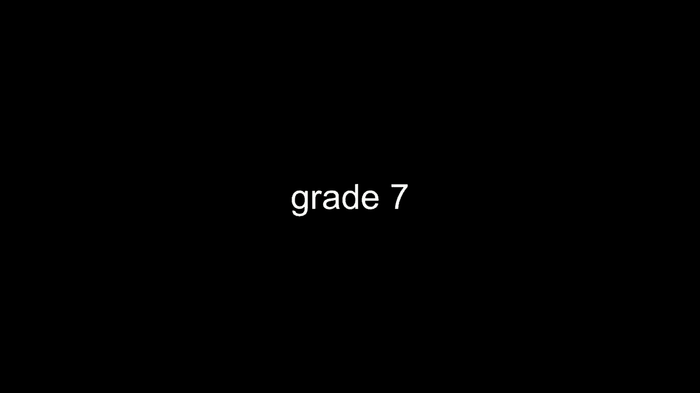

7的阅读水平可能与词汇有关，但也可能与句子的长度、标点符号的数量，以及你可能计算的字符总数有关。你可以想象只基于文本的外观和美感来量化它，那么在计算机科学中这又如何呢？

语言学中的作者归属是预测未知作者文档作者的任务，这个任务通常通过分析风格特征来完成。特别是，这是布赖恩的毕业论文，所以这并不是七年级的阅读水平，而是实际评级在年级。

16，因此O'Brien也相当复杂，你或许可以从句子的复杂程度、长度和所用词汇中得到一些启示。我们或许可以评估文本的可读性，即使你没有字典来确定哪些是。

实际上，大或小的词汇，以及密码学，那是非常常见和重要的，现在你我都需要使用密码学。并不一定是使用我们自己想出的算法，而是使用像WhatsApp、Signal、Telegram和Messenger等软件。

支持在你和第三方之间进行加密，比如你的朋友或家人。或者至少与之互动的网站，利用密码学来隐藏信息。如果这些信息是文本，那么坦率地说，在CS50的第三周，我们已经拥有了不仅仅是基础的必要构建块。

表示文本，但我们今天看到，即使只是将文本大写，也在操纵它。那么，从上周开始，加密意味着什么？你有一些输入，你想要输出，明文。你想从自己发送给其他人的消息，密文是你想要的输出。所以在这之间会有我们称之为密码的东西，或输出。

第三方无法理解的信息，且希望这个密码和算法是一个可逆的过程，这样当你弄清楚那个人想要发送给你的内容时，你也会有一个秘密密钥。如果你回想一下小学，也许你在课堂上和某人调情，并在一张纸上给他们写了便条。

如果你在纸上只是写了“我爱你”，然后通过所有朋友或老师传递给最终收件人，希望你没这样做。也许你做了一些像是应用算法，将所有字母加一，这样看。

在这方面，他们可能没有足够的耐心去搞清楚这些胡言乱语。但如果你的朋友知道你将a变为b，b变为c，通过给每个字母加一，他们就可以逆转这个过程，从而解密。因此，密钥可能字面上就是数字一，消息字面上可能就是我爱你。

但密文或输出会是什么呢？让我们考虑一下。我爱你是一个字符串，截至今天，是一个字符数组。那么这有什么用呢？让我们具体考虑这个短语，就像它是一个数组一样。它是一个字符数组，我们知道上周，字符实际上就是整数，十进制整数。

多亏了ascii，进而是unicode，因此结果是我们已经知道i是73，图表，l是*****。很容易看出，你可能需要检查你的笔记和我的示例代码等等，但在c语言中相对容易地将我爱你转换为相应的整数，实际上可以通过将字符转为整数来实现，我可以非常轻松地使用c语言中的加法运算符。

开始为这些字符每个加一，从而对我的消息进行加密。但我可以将这些数字发送给我的朋友，也不妨让它更加用户友好。因此，现在看起来，对于我爱你，使用密钥为一时，实际上只是意味着将a变为b，而不是变为c。

只是将其移动一个位置，这是我爱你的加密消息的密文，因此整个过程变得简单，输入是文本，输出最终是这个。如果某个老师或朋友截取了这条消息，他们可能不知道发生了什么，实际上这就是密码学的本质。

保护我们的电子邮件、短信、财务信息和健康信息比那个特定算法更复杂，但它归结为相同的过程，通过一些输出，所谓的密文，有时甚至是机械形式。在过去，你实际上可以得到这些小的圆形设备。

字母表的一侧是字母，另一侧也是字母。a可能对应b，b可能对应c，所以你甚至可以有一种物理形式的密码学，就像在美国圣诞节期间电视上不断播放的电影一样，你可能会认出，如果你看过的话。

圣诞故事，就是这样。我们将利用最后的几分钟，来看看这个密码学的真实世界体现，你无疑可能在电视上看到过。众所周知，在周日，拉尔夫·帕克被任命为小孤儿院秘密圈子的成员，享有所有的权利。

荣誉和利益也会在这里发生。

签名，皮埃尔·安德烈，荣誉与利益，来吧，继续，我不需要那些关于走私者的所有花哨，听明天晚上的黑色信息结局，为你们秘密圈子的成员，圈子。可以解码任何秘密信息，记住，安妮在依靠你们，把你的针设置为**太**这里。

信息是12 11。我在我的第一次秘密会议上，今晚的声音。我能感受到今晚的信息真的很重要。

3 25，这是安妮亲自发来的信息，记住不要告诉任何人，[音乐]。90秒后，我在房子里唯一一个九岁男孩可以独自坐着的房间。可以私下解码，啊哈，b，我接着读，第一词是b，现在变得更容易了。哦，确保，确保，**小孤儿院**想说什么，确保观看。

兰迪，必须走了，请你出来，妈，没问题。紧张得可怕，是什么呢。

平衡，[音乐]。

准备好了，我的手指飞快，我的思维如钢铁般敏锐。

每个毛孔都在震动，几乎可以肯定，是的，是的，是的，确保喝你的**Ovalt**。一个糟糕的广告，[音乐]，该死的家伙，没问题。
