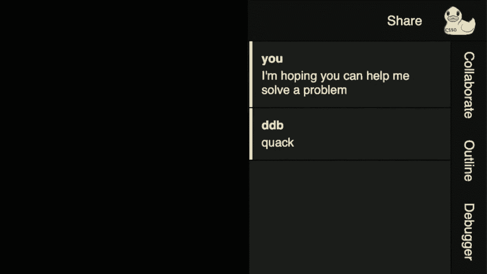
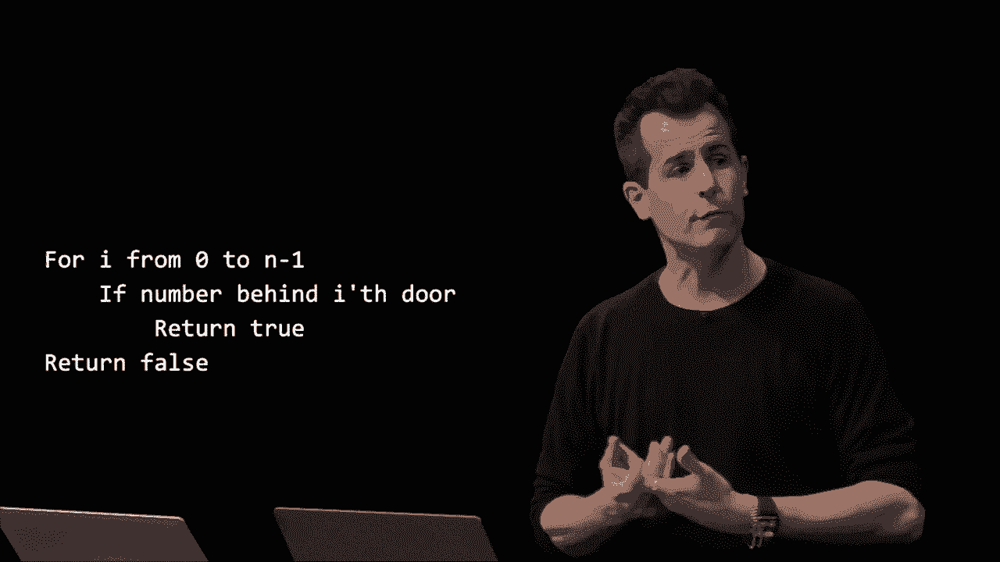
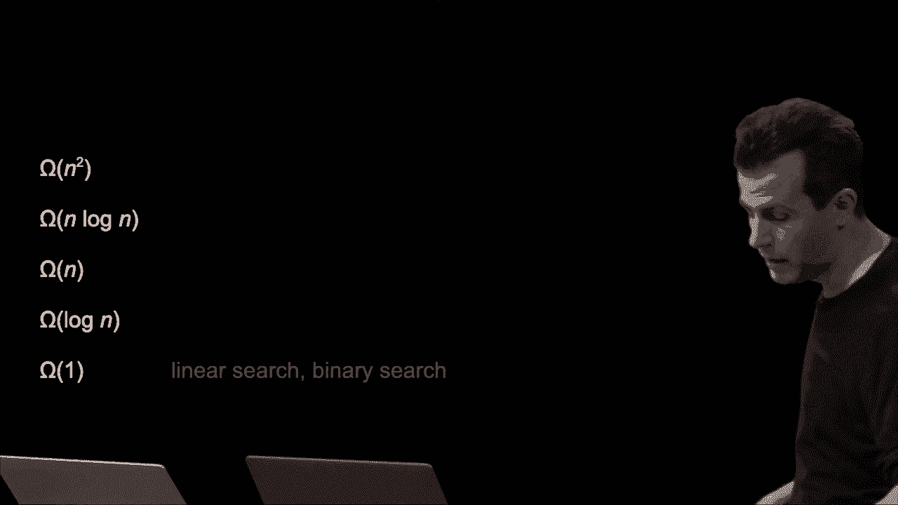
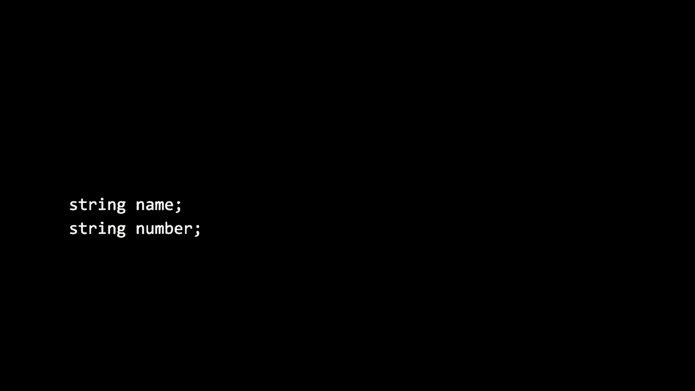
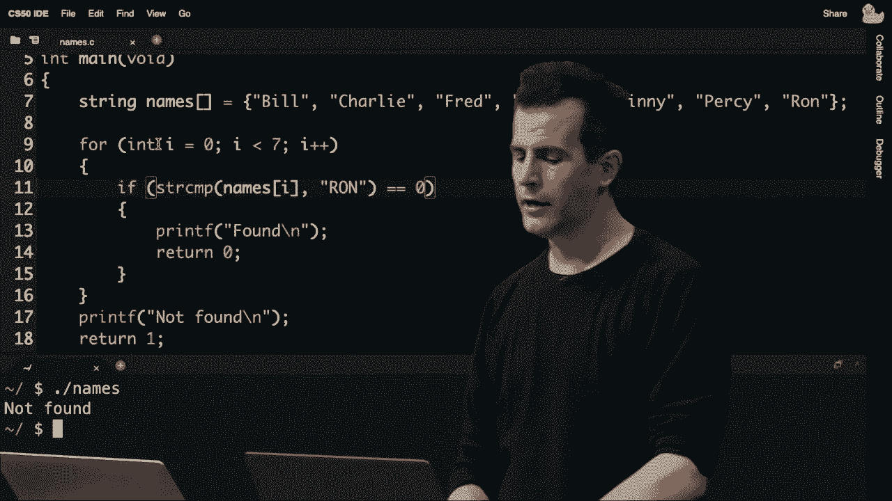
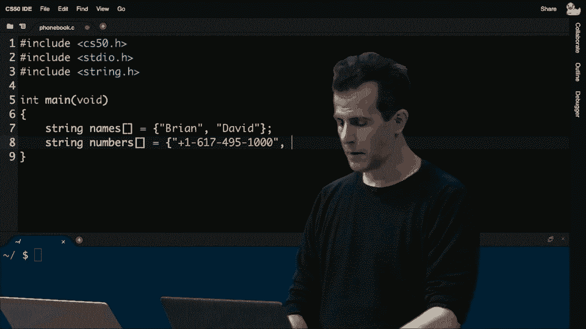
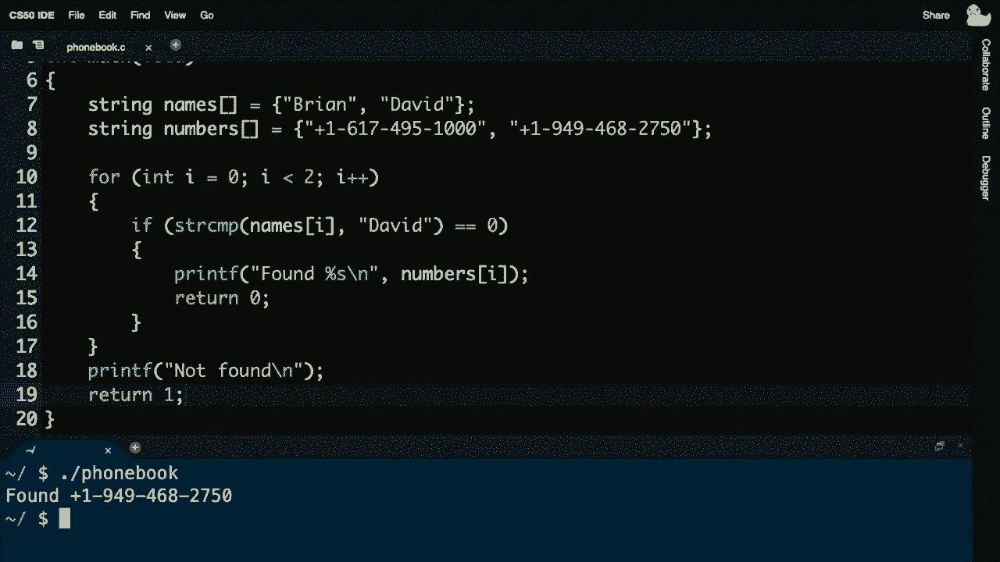
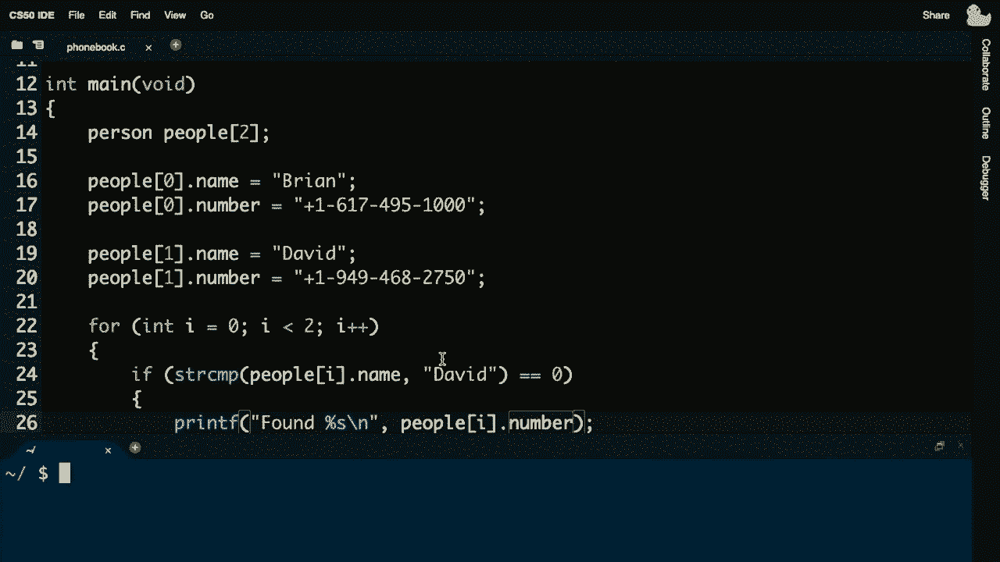
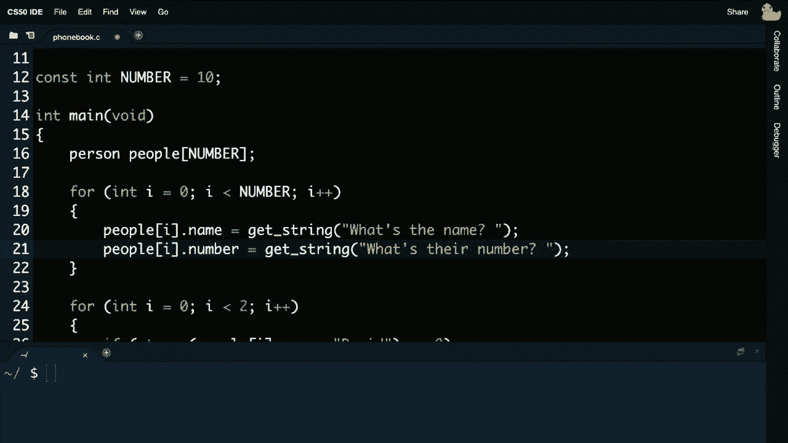

# 哈佛CS50-CS ｜ 计算机科学导论(2020·完整版) - P6：L3- 算法（结构体、搜索与排序）1 - ShowMeAI - BV1Hh411W7Up

三个。

你会记得上周我们讨论了解决问题的方法，不仅是我们提出的问题，还有你自己代码中的问题，也就是*错误*。这些工具涉及到帮助你解决编译器可能吐出的神秘错误消息，风格检查工具会给你关于代码风格的一些反馈。

check 50会检查你的代码在给定问题集或实验中的正确性，而printf是几乎所有编程语言中都存在的一种函数，这也是你最终可能学到的。这只是打印你想在屏幕上显示的任何内容的一种方式，接下来这些工具中最强大的就是debug 50。

交互式调试器，尽管这个命令debug 50有些特定于cs50，但它会触发一个小侧窗口，在那里你可以查看在某些断点时调用的内容，以及在代码执行的某个时刻你可能定义的局部变量，这是一个非常常见的约定。

任何调试器的特性与大多数语言相符，最后回想一下，还有这个ddb鸭子调试器，当然它以这种物理形态存在，如果你恰好有一个可以交谈的鸭子，但我很高兴地说，如果你目前没有，在家时cs50区的Kareem、Brenda和Sophie已经做了很棒的补充，如果你还没有注意到的话。

同样的虚拟鸭子在cs50 ide中，所以如果你点击左上角。

你实际上可以开始和橡皮鸭进行某种对话，虽然这无疑是同一概念的更具玩味的表现形式，但我们真的无法过分强调，和其他人或其他东西谈论代码中的问题时，*讨论问题*的价值。

这并不是其他人说了什么，而是你说了什么以及你自己听到自己说的内容，这无疑是这个过程最有价值的部分，因此我们感谢Kareem、Brenda和Sophie。上周我们也仔细看看了电脑的内存，字面意义上在你的笔记本电脑里。

更艺术地思考这个问题，将其视为一个字节网格，在这个芯片内有一堆位，如果你一次查看八个，它们就形成了一堆字节，想象这个作为第三个字节，依此类推，将其形象化分割成一个完整的内存。

回想一下，如果我们放大并专注于一个连续的数组。我们可以在这个数组中做一些事情，比如存储一堆不同的值。回想一下上周，我们开始时定义了一些有点傻的、几乎相同名称的多个变量，比如 scores one、scores two 和 scores three，然后我们。

开始通过引入一个数组来清理我们的代码设计，这样我们就可以有一个名为 scores 的变量，大小为三，有空间存储多个值，这是许多编程语言的一个特性，能够在计算机的内存中连续存储数据，因为这个非常简单的布局，这个非常简单的特性。

这个语言将开启各种强大的特性，实际上。我们甚至可以重温上周我们尝试解决的一些问题。这是因为即使你我可以一眼看清屏幕上的这个图片，并立即看到，尽管屏幕上有七个框，但实际上是七个。

存储值的位置，你我可以在一定程度上拥有这种鸟瞰视角，看到整个数组内部，方式更为系统，更算法化，如果你愿意，所以尽管计算机非常强大，技术上只能一次查看数组中的一个位置，因此你我可以。

一瞥这个并试图一下子理解，计算机无法一眼看清它的内存并一次性接受所有值。它可能从左到右，或从右到左，也可能是中间开始，但它必须是一个算法，确实。某种程度上掩盖了这个数组无法一次性看到的事实，你只能。

在某一时刻查看数组中的一个位置，这将有非常现实的影响。例如，如果我们考虑第一个问题，在第一周我们尝试在电话簿中找到我的电话号码，开始时。并从左到右搜索，我们之后尝试了一些变体，但问题。

简单地说，搜索和科学是非常常见的，确实你我作为用户在谷歌等网站上整天搜索东西，因此设计一个优秀的搜索算法无疑是许多今天工具的一个引人注目的特性，你我都在使用。所以如果我们真的把这看作是一个。

要解决的问题是，我们有一些输入，可能是一个数字数组，或者在谷歌的情况下，可能是一个网页数组。目标是得到一些输出，因此如果问题的输入是一个值的数组，输出希望是一些简单的东西。

作为一个布尔值，“是”或“否”是你正在寻找的值，即这个值。“是”或“否”，“真”或“假”，现在在这个黑箱中，回想一下，会有一些算法，这就是今天我们大部分时间要讨论的内容，实际上我们不会真正介绍那么多 C 的其他特性，我们将再次专注于，现在理所当然的想法。

你在工具箱中有更多工具，除了循环、条件和布尔表达式。现在我们有这个被称为数组的其他工具，但首先让我们介绍一些相关术语，关于我们将称之为运行时间的东西。当我们思考这些时，我们提到过几次。

我们描述算法的好坏时，会说明它的运行时间。也就是说，它的运行时间取决于需要多少步骤、多少秒、多少次迭代，这些单位并不重要。运行时间只是指需要多久。

算法需要多少时间，我们可以更正式地思考这个问题。在这一周，我们没有给它这个名字，这个斜体的 O，屏幕上的大 O 符号被称为大O表示法，计算机科学家们使用这个符号来描述算法的运行时间，或数学上像一个函数。

回想一下这个画面，实际上当我们在查找电话簿时。我们是以“好、好点、最好”的顺序进行的，线性搜索，一个页面一个页面地搜索。我们通过每次搜索两页的方式提高了速度，然后我们进行了对数搜索，通过不断对半分割来实现。

页面中 n 只是一个数字，在计算机科学术语中。我们可能会描述第一个算法的运行时间或步骤数，可能在最坏情况下需要 n 步，如果你在电话簿中寻找的人，可能有一个以 z 开头的姓氏。

用英语来说，z 可能位于电话簿的最后，因此在最坏情况下你可能需要查找整个电话簿，而第二个算法却快了两倍，因为我们每次查看两页，所以我们可以将其运行时间描述为 n/2，然后第三个算法是我们将问题进行了分割。

一直对半分割，实际上是一次又一次地丢弃一半的问题，n。这再次是一个数学公式，指的是不断重复某个操作，当然在这种情况下你一开始有 n 页。结果证明计算机在这些数学细节上表现得相当出色。

事实上，我们不会养成写非常精确的数学公式的习惯，而是会尽量理解算法的概念，粗略地了解它是多么快或多么慢，但仍然使用一些符号，比如 n 作为占位符。因此，计算机科学家会描述三者的运行时间。

这些算法来自于零周，作为大O，O(n) 或大O，O(n/2) 或大O，O(log₂(n))，所以大O只是表示在某个顺序上，这可能是一种随意的表示。它是 n 减 1，也许是 n 加 1，甚至可能是 2n，但它在 n 的顺序上，注意这个图表，这里有些，奇怪的地方，比如这两个算法，来自于零周。

从图像上看，几乎看起来是一样的，毫无疑问，黄色线略低，因此稍微好一些，稍微快一些，但它们有相同的形状。事实上，我打赌如果我们大幅缩小，这两条直线会变得相当大，足够大且高，这就是绿色线。

是根本不同的，所以这种不纠结细节的倾向，零。是更好的，是的，这条黄色线是算法，其运行时间的量级是**n**。也就是说，计算机科学家往往会忽略常数因子，比如1/2或除以2，他们倾向于只关注主导因子。

在那个数学表达式中，哪个值会增长得最快，**n**。除以2，**n**会随着时间的推移占主导地位，电话簿越大，你拥有的页面就越多。真正重要的是**n**，而不是除以二的结果。同样，如果你熟悉并记得你的对数。

我们其实不需要关心2，但是，我们可以将这个对数乘以其他数字，将其转换为我们想要的任何基数，比如10，3，7。任何基数，所以我们可以说它的量级是**log n**，这很好，因为这意味着我们不会浪费时间深入细节。

在数学上，当我们谈论算法的效率时，是以**n**这个变量为基础的。如果你愿意，让我们缩小视野，如果我在这个图像上缩小，你开始看到，确实这些看起来几乎是相同的。如果我们继续缩小，你会看到它们本质上是一回事。

绿色的那个很突出，所以这确实是以**log n**为量级，而不是**n**本身。所以这里有一个小的备忘单，在算法分析中，我们的确是这样的。

我们会看到一些常见的公式，像是我们刚刚看到的量级是**n**。我们看到量级是**log n**，结果是非常常见的**2n平方**。然后甚至还有大O的1，最后的情况是，做一步或两步，可能甚至10步，但都是常数步数，所以这算是最好的情况。

至少在这些选项中，而**n平方**会开始需要很长时间，它会开始感觉慢，因为如果你取任何值的**n**并平方它，那将意味着更多的步骤。所以今天开场时先讲一点行话。我们现在有这样的词汇来描述。

算法的运行时间用这个大O符号来表示。大O表示运行时间的上限，比如说，算法最多可能需要多少步骤，最多需要多少时间，反之，算法的运行时间的下限是什么，我们并不需要。

另一个图示或其他公式我们可以，在这里，只是提出当描述算法时。你想提出一个下限，例如我的算法最少需要多少步。我们可以使用相同的数学公式，但我们用Ω而不是大O，所以看起来华丽，但实际上它只是指一个。

手挥动，试图大致估算，幸好。我们已经见过一些算法，包括在零周。现在我们要给它一个更正式的名称，线性搜索就是我们做的。我们通过逐页搜索电话簿来进行的。

在那个特定例子中寻找我的电话号码，因此今天的不同之处在于。与能够查看电话簿页面并一次看到许多名字和数字的人类不同，我们需要更加有条理，更加刻意，今天我们才能翻译。

伪代码，但实际上是C代码，所以很高兴，在哈佛校园这个学期我们与整个团队合作，他们更擅长。独自一人，我有这七扇美妙的门，它们之前出现在这个剧院里，我们甚至有商店，谁在后面制造了一些令人愉快的。

数字，并将它们带入生活，这意味着在这七扇门后面。每扇门后都有一个数字，这将是一个机会，真正强调当我们想在数组中搜索某个数字时。实际上就等同于搜索一个数字门，你我不能只是看所有的。

数字是，我们必须更加有条理，我们需要从这些门开始搜索，可能从左到右，可能从右到左，也可能从中间向外，但我们需要提出一个。代码的方案，例如假设我要搜索数字零，我们该如何有条理地搜索这七扇木门中的数字零呢？让我听听建议。

听众，你可能在这里采取什么方法，独自面对这些门，有什么建议？我该如何开始找到数字零，佛罗伦萨，你有什么提议？嗯，我会建议从左边开始，因为零是一个较小的数字。好的，等一下，稍等我一下，让我提出。

哦**d并打开门，希望能找到，不，这是数字四，所以不是零。那么，佛罗伦萨，你提议我接下来做什么，嗯，我可能会从中间开始，比如一，所以，好的，可能是向下走，所以让我去哦**d并试试，所以你提议。中间，我可以去这里，哇，不，这是数字二。

我想知道我还应该去哪里看，我有点好奇，也有点紧张，是否忽视了这些门，往前看看，哦不，那是数字六。我们继续看看这里的数字，往下走，所以**弗朗西斯**，我该如何完成对这个数字的搜索？还需要做什么？你会说应该从右边开始。

好吧，我可以从右边开始，也许就在这里走过来。瞧，它就在这里，我们找到了数字零。那么让我问**弗朗西斯**，你的算法是什么，你是怎么成功找到数字零的，比如，下降一步，如果数字不在这里，像是，我不知道。

轻松地问问，你在中间时，这样做效果如何？更好、坏、还是没有区别？我想，可能确实有点帮助，然后一直往右走，好的，是的，我们可能获得了一些信息，但让我们继续看一下所有的门。

那个四和六又来了，那个八又出现在中间，之前有个二，现在这里有个七，第一次在这里出现的五，当然还有零。如果你认真考虑这一切，**弗朗西斯**，你我其实没有做得更好，因为这些门。

这些数字实际上是随机排列在这些门后面，所以你随意跳动其实并没有什么坏处，尽管缺点是，如果你跳来跳去，你和我作为人类可以相对轻松地记住我们去过哪里，但如果你想一下如何将其转换为代码。

我觉得我们开始积累了一堆变量，可能是因为你得跟踪这些，所以坦白说，最简单的解决方案可能是从第0周开始，我们采取非常简单的天真的方法，从这个大小为七的数组开始，后面有一些数字，如果你。

我对那些数字一无所知，坦白说，你能做的最好就是从第零周开始那种线性搜索，一次检查一个值在这些门后，只希望最终能找到。所以，这已经占用了很多时间，如果我这样做线性。

这种搜索方法就像我在第0周所做的一样，我得在所有这些门后面搜索，所以，让我们更正式地考虑一下，究竟如何至少实现那个算法，因为我可以采取**弗朗西斯**提出的方案，只是跳来跳去，可能用点直觉。

不过这其实并不算一个算法，我们确实需要更逐步的方法。同时，让我们前进，**乔**，拉上窗帘，看看是否能用另一个问题来解决这些问题，稍后我们再考虑。所以，关于线性搜索，我想提出这个。

我们可以在伪代码中实现它，首先如果你喜欢这样。对于 i 从零到 n 减一，好吧，我们看看这将如何进行。如果数字在第 i 个门后面，返回 true，否则在最后。转换成伪代码，像我们之前做的那样。

电话簿，早些时候，为什么这些值，因为我更像 c。尽管它仍然是伪代码，所以对于 i 从零到 n 减一，所以计算机科学家倾向于从零开始计数。

在这种情况下，从零到 n 减一，这只是一种非常常见的方法。通过设置一个 for 循环，可能是在 c 中，也可能是伪代码，在这个条件下。数字在第 i 个门后面，我只是用一种口语化的方式来说。第 i 个位置的门后面是什么，继续并返回 true，我找到了。

我想要的数字，例如，数字零，然后注意到这个返回 false。并不是 part of an else，因为我不想中止这个。

算法过早终止，并且仅仅因为一个数字不在当前门后面。我基本上想等到算法的最后。

在检查完所有 n 个门后，如果我仍然没有，只有那时。我要返回 false，所以一个非常常见的编程错误可能是把这个嵌套在内部，考虑事情的 if 和 else，但你不需要有一个 else。这在最后算是一种通用处理，但现在让我们考虑。

搜索，搜索，效率如何。！

搜索，也就是说这个算法设计得如何，我们给自己设置了一个框架，刚才提到的大 O 表示法，它是一个上限。现在我们可以把它理解为，像是最坏情况，在最坏情况下，我可能需要多少步才能找到，数字零或任何数字。

事物之间，n 的情况。

时间 log n，大 O 表示法 n，大 O 表示法 log n。

常数，固定步数，嗯，布赖恩，我们能否继续并拉出这个问题。让我也在我的屏幕上拉出来，如果你去我们平常的地方，稍等一下。现在的问题看起来，如果你去 polev.com cs50，你很快就会看到结果，给你几秒钟时间。

你认为线性搜索的运行时间的上限是什么，在这里用这个伪代码实现，同时，我要继续并在这里登录。技术问题，如果你不介意，原谅我，让我暂停一下，快速修复一下，这并不是技术问题。

由于我没有提前完成这项工作，这是我的用户错误，所以我。几乎在网上修复好了，哇，看到结果将会是多么有趣。好吧，差不多到了，我们会去掉所有这些尴尬，让我继续，好吧。给我一秒钟让它出现。

好吧，我很抱歉，那么线性搜索的运行时间的上界是什么？看起来几乎所有人都回答了 n 的大 O，所以你们中有 86% 的人，这确实是。

这种情况，我们确实可以在我们的整个图表中看到这一点。如果我们考虑运行时间，抱歉，我在这里是新人，好吧，修复一下，这里可以了。好吧，确实，如果我们现在考虑，这应该是 n 的大 O，为什么呢？在最坏情况下，我正在寻找的数字 0，可能就在最后。

列表的步骤将是 n 步，或者在这种情况下，确切地说是 n 步，这是一种思考方式。

问题，符号。

这是一个算法运行时间的下界，布莱恩，我们能否继续询问这个。

下一个问题，在同一网址，我们将看到一个问题，询问线性搜索运行时间的下界的可能答案，所以让我们继续看看这个。很快我们会看到。

大约有 75% 以上的回复，你们提出。实际上它是 omega 的一，omega 是下界，一指的是常数时间，这一点为什么重要。

步骤，或常数步数，为什么是这样，你怎么想？呃，是的，你可以打开它，走运地在第一扇门找到它。是的，所以这确实表明，你可能只会走运，正在寻找的数字可能就在第一扇门后，所以在最佳情况下的下界。

线性搜索的算法可能确实是 omega 的一。

正是出于这个原因，你必须走运，元素可能在开头就在那里，所以这相当。

很好，我们真的做不到比这更好了，所以我们现在有一个范围，来自于 omega 的下界。

直至大 O 的 n 成为线性搜索运行时间的上界，但当然我们还有。这个工具箱中的其他算法，回想一下从零周。我们看过二分搜索，虽然。

并不一定是按名称来分而治之的第三种算法，我们拿起电话，分成两半。再一次，现在我在那里笨拙地处理，而乔在一旁。

乔好心地给我们了一组新的门，如果乔，我们再次有门。后面仍然有一些数字，但我想这次我会去找门。好了，后面是我们同样的七扇门，但这次那些门后面是不同的数字排列，假设这次我想找到数字六。

所以数字六会稍微改变问题，但这次我会给你一个关键的要素，这将是这个工作的关键。为什么弗洛伦斯和我之前只能做到线性搜索？为什么弗洛伦斯和我只能做到。

上次随机搜索。

数字数组或者门数组有什么特征，让我之前无法使用呢？嗯，因为我们不知道这些数字是否是排序的。是的，我们不知道数字是否排序，而确实，除了那个细节，弗洛伦斯和我。比线性搜索好，所以这次，乔好心地进行了排序。

一些数字在这些门后面，所以如果我想搜索数字六。现在我可以开始利用这些信息，你知道我将开始，就像我们处理电话簿一样，大致从中间开始，瞧。数字五，好吧，所以我们很接近，我们很接近，但问题是。

关于二分搜索，回想一下这是有用的信息。如果这些门后面的数字是排序的，左边的所有门，右边的所有门应该大于5。现在我可能会在这里走捷径，想如果这是5，6可能就在隔壁，但再次，从算法的角度来看，我们该如何做到这一点呢？

不想特别考虑这些特殊情况，所以更多的大小为三的数组，所以让我去应用相同的算法，瞧。现在我到中间，得到了数字七，现在变得相当清楚。如果数字六存在，可能在这扇门后面，确实是，大小为一，数字六。

门，而不是所有七扇门，或者也许六扇门，找到我的数字，因为我得到了这些额外的要素，即所有的数字都是排序的。因此，看来你可以应用更好、更高效的搜索。如果只有像乔这样的人提前为你排序数字，那就好了，所以现在我们来考虑一个。

从算法的角度来看，我们可能如何实现这个，因此用二分搜索让我提出这个伪代码，返回真，我们找到了它，所以如果我们运气好，那么我们可能找到了这个数字，完成了，但这没有发生，而在一般情况下，这可能不会发生，所以如果数字小于。

在中间门后面，然后就像查电话簿一样，我将去，剩余门的左半部分。如果这个数字大于在中间门后面。然后像电话簿一样，我将去，电话簿，但可能还有一个最终的情况。潜在地，如果根本没有门，或者根本就没有门。

我至少应该有一个特殊情况，例如如果六因为某种原因不在那些门中，而我正在搜索。我仍然需要能够明确处理，如果我没有进一步的门可搜索，则返回false。那么这里可能是这个算法的伪代码，更正式一点。

现在让我们考虑之前分析的内容，在线性查找为O(n)时。线性查找为O。

这次让我们考虑二分查找实际适用的地方，问一个不同的问题。我将继续并回去问这个问题。二分查找的运行时间的上限是什么，二分查找的运行时间的上限是什么，继续并像以前一样发言。

二分查找的运行时间的上限是什么，你可以在这里看到答案在增多。

在O(log n)附近非常占主导地位，确实与我们在O(n)中的结果一致。因为这将是给定大小数组的最大值，并将其对半分割。你正在寻找，同时如果我们现在考虑的不仅仅是这个算法的上限。那么在最坏的情况下，二分查找的时间复杂度为O(log n)，现在让我们考虑一个相关问题。

什么是下限，什么是运行时间的下限，我将继续参考到目前为止的一些建议。在最佳情况下，也许是两个。你运气好，正在寻找的数字六或其他某个数字恰好在数组的中间，因此也许确实可以做到。

只需一步，确实是二分查找的下限。

可能实际上只是一个Ω(1)，因为在最佳情况下。你运气好，它正好在你开始的地方，在这种情况下在中间，所以我们似乎有一个范围，但严格来说，二分查找似乎比线性查找好，因为当n变大时，差异实际上会变得明显。

回想一下从零周，我们玩了一点这些灯泡，现在这六十四个灯泡都亮着，让我们考虑一下，为了将其放入视角，使用线性查找在这六十四个灯泡中找到一个灯泡需要多长时间。灯泡。

或者我们正在寻找的数字，在那里的一端，但我们事先并不知道。因此，Sumner，如果你不介意对这些灯泡执行线性搜索，让我们感受一下这个算法的效率或低效，你会注意到，一个灯泡一次亮起，意味着我已经搜索过那扇门，搜索过那扇门。

我们搜索了那扇门，但只经过了十个左右的灯泡，还有超过50个灯泡要处理。可以看到，如果我们每秒检查一个灯泡，实际上会花费很长时间，等到最后似乎没有必要。因此，如果你愿意，让我们一起把所有的灯光带回，算法。

这个二分搜索，再次感受一下，像二分搜索这样在对数时间内运行的算法的运行时间。所以，稍后我们将继续执行这些灯泡上的二分搜索，想法是：有一个灯泡我们关心，让我们看看，我们能多快找到这个灯泡。

从 64 个灯泡中熄灭。因此，Sumner，准备好，开始，几步之后我们就完成了。然后我们得到了这个灵魂灯泡，它快得多，实际上我们故意这样做。一轮接一轮，刚刚执行的算法，在 Sumner 和 Matt 的帮助下。算法的运行频率是 1 赫兹，如果你不熟悉赫兹。

每秒仅表示一次，这在物理学中经常使用，或者更广泛地讨论电力，实际上在这个例子中，那个第一个算法线性搜索可能会到达最后一个灯泡，但第二个算法是对数的，因此从 64 到 32。

到 16 到 4 到 2 到 1，我们得到了。

这样可以更快地得到最终结果，即使以相同的速度运行，所以如果你想象一下你的电脑 CPU。

CPU 也是以赫兹（hertz）为单位测量的，h-e-r-t-z，可能以千兆赫（gigahertz）为单位测量，即每秒数十亿赫兹，因此你的 CPU，电脑的大脑，字面上可以同时做一十亿件事，而在这里，我们有这种更简单的设置，仅仅是每秒做一件事的灯泡，你的电脑可以做到一。

这种操作的数量达到数十亿，因此想象一下究竟有多少。

这些节省时间的优势随着时间的推移而累积，处理多个问题，而不是像我们在第零周那样逐步进行，一次一步。好了，现在让我们继续，将其翻译成代码，我们的工具箱中有足够的工具，我认为基于我们上周对数组的讨论，我们可以。

现在我们实际上开始自己用代码构建一些东西，所以我将继续在`cs50 ide`中创建一个文件，叫做`numbers.c`。让我将其翻译为一个名为`numbers.c`的C代码文件，手头的目标只是实现线性搜索代码，而不是伪代码。

但我们要更具体一点，所以我将继续并包含`cs50.h`。我将继续并包含`stdio.h`，并且我将从没有命令行参数开始，就像我们上周所做的那样，但只是用，并且我将继续并给自己一个包含七个数字的数组，声明为`int numbers`，然后这在计算机的内存中稍微有点右。

这对于在你提前知道想要什么数字时创建数组很方便，而我正是这样做的。因为我要模拟乔为我们设置的这些门。我将继续并要求给我一个等于`4 6 8 2 7 5 0`的数组。这是我们上周没有看到的特性，如果你提前知道数组的话。

你实际上不需要显式地处理，编译器可以智能地为你解决这个问题。用逗号来枚举从左到右你想放入数组的值。所以在第六行执行后，我的计算机中将留下一个名为`numbers`的数组，其中包含七个从左到右列出的整数。

现在我想用这些数字做什么呢？好吧，让我们实现线性搜索，线性搜索如我们之前提到的，通常从左向右进行。所以我将进行一个标准的`for`循环，声明`int i = 0`，`i <`我将继续。

现在为了简单起见，我将硬编码想要的内容，并在每次迭代时执行`i++`。所以我很确定我的第八行将引发一个总共迭代八次的`for`循环。我想在每次迭代时问什么呢？嗯，如果数字数组在位置`i`等于，例如数字`i`。

我最初要搜索的目标是零，然后我想做什么呢？让我去，但有用的知识，然后让我继续并为了好 measure，再返回零，我们稍后会再回到这个问题。但在这个程序结束时，我也会执行这个`printf`，输出`not found`并带上换行符。

我要继续进行并返回，不过在我们拆解这些聚合之前，先来看一下我的整个主函数。在第六行，我初始化了数组，就像我们一开始时用一个看似随机的数字列表那样。

这个for循环总共进行七次，每次递增i，然后第十行，就像我一个一个打开门一样，我将检查这个数组中的第i个数是否等于我关心的数字，0，基于那个第一次演示，我会打印找到。否则不是else per se，而是如果我遍历这个整个循环，检查如果。

如果我实际上从未找到零，我会在结尾加上这种“捕获所有”的处理。也就是说，无论如何，如果你到达第16行，就打印未找到，然后返回一。现在这是一个微妙之处，但能有人提醒我们，第13行的返回0和第17行的返回1是怎么回事吗？为什么是0和1，我为什么要返回它。

这解决了我什么问题，尽管我们大多数程序因此，这对我来说，返回。或者找到了，嗯，它会退出循环，说明，1，就像返回假一样，嗯，它也确实退出了，确实，退出在main中是一个重要的词。当你准备好退出程序时，就像我们用“退出”这个词一样。

在我们过去的一些伪代码中，你可以直接返回一个值。回想一下上周末，我们介绍了main总是返回一个答案。对此我至少忽视了一到两周，但有时，返回一个明确的值是有用的，无论是为了自动评分的目的。

无论是为了自动化测试你的代码在现实世界中的应用，还是仅仅是为了向用户传达确实出了问题的信号，所以你可以从main返回一个值，正如德米所建议的，零意味着一切良好，这有点违反直觉，因为到目前为止，真值往往是件好事，但在这种情况下，零是件好事，一切正常，就是成功。

如果你返回任何其他值，例如1，这表示某些事情出了错。所以我在“找到”这个词后打印的原因是，我返回零。有效地说，程序在那一点上退出，我不想在已经找到我关心的数字的情况下，一遍又一遍地继续。

在这里，这一行诚然不是，16，可能删除第17行，程序将。无论如何会结束，但不会有我们上周讨论的所谓，退出状态。简而言之，你可以通过这种方式传达，成功或失败，而零是一个好的信号，一个或任何其他数字则不是，程序会。

写或现实世界中的公司，当你得到那些错误，错误代码时。可能会有成千上万的问题，发生在计算机程序中。可能会出现那么多的错误代码，你在屏幕上看到的原因解释，比如，仅仅是一个值，世界已经决定，这意味着成功，所以只有一种方法可以得到你的，许多。

事情出错的方式有数百万种，这就是为什么人类采用了这个特定的方法。现在，不仅是数字，让我们让事情变得更有趣，假设我们实际上在后面有人的名字。好吧，让我们继续写一个程序，这次不仅搜索数字。

取而代之的是搜索名字，所以我在这里，称之为names.c。我将以类似的方式开始，我会在顶部包含cs50.h，顶部再包含standard io。这次我还将包括string.h，我们简要介绍过，用于获取字符串长度，以及其他一些函数。

让我继续声明int main，void，像往常一样，然后在这里我需要一些随意的名字。让我们想出七个名字，这里我也可以像之前一样声明一个数组，但它不必只存储整数，它可以存储字符串，因此我将数据类型从整数更改为字符串。

变量名称从数字更改为名称，表示法，可能还有。

charlie，也许还有fred，也许是george，也许是ginny，或许是percy，最后可能是一个像ron这样的名字，它刚好可以放在我的屏幕上。因此，话虽如此，我现在有了这个名字的数组。除此之外，可能还有一些。

显而易见的模式存在，但也有第二个不那么明显或许明显的模式。

你会如何描述这些我随意想到的名字列表？它们有什么有用的特征？你注意到这些名字有什么？对此问题，我认为至少有两个正确答案。

你注意到这些名字有什么？嗯，它们是按字母顺序排列的，是的。除了是哈利·波特中韦斯利家孩子的名字之外，它们也在。

按字母顺序排列，这对我们的目的来说是更突出的细节。这次我有了先见之明，提前对这些名字进行了排序。如果我已经对这些名字进行了排序，那么这隐含着我可以使用比线性搜索更好的算法，我可以使用例如我们旧的二分搜索。

但是我们先直接搜索它们，现在还是使用线性搜索，因为你知道我们还没有做的是比较字符串。我们进行了很多整数的比较，但名字呢？所以让我先进行这一操作，对于int。

i得到了0，就像之前一样，i小于7，i加加，我仅仅在做这个，七个名字。我想我们或许可以改善这个代码的设计，通过使用一个变量或常量来存储那个值，但我现在想保持简单。结果是，由于一些原因，我们将在下周更详细地探讨。

做之前的事情并不足够，如果我在寻找ron。结果是，在C语言中你不能使用等于等于，int，对于char我们在过去做过这两者，但有一个细微差别，我们将深入探讨。下周会更详细地讨论，这意味着你实际上不能这样做，这很奇怪，因为如果你。

有在像python这样的语言中的编程经验。你可以这样做，因此在C语言中你不能，但我们下次会看到原因，而现在。结果是C语言可以解决这个问题，历史上解决这个问题的方法是使用一个函数。因此在string.h头文件中，不仅有声明字符串长度的。

它实际上以ASCII顺序比较字符串，或称为ASCII比较，这是一种有点古怪的描述方式。

像上周提到的字符串，还有另一个函数叫做str_compare，简写为strcmp，允许我传入两个字符串，一个是我想要比较的字符串。

还有字符串比较，如果我们阅读它的文档，会告诉我们。它比较两个字符串，并且。

返回三个可能的值之一，如果这两个字符串相等，即完全相同。逐字比较的话，这个函数将返回零。如果第一个字符串在某种意义上按字母顺序排列，那么这个值，如果第一个字符串应该在前面。

在第二个字符串之后，按字母顺序排列的话，它将返回一个正值。

有三个可能的结果，或者等于零，实际上如果你查看，指定。

什么值小于零或什么值大于零。

你只需检查任何负值或任何正值。我刚才也撒了个小谎，这并没有按字母顺序检查，即使它偶然有时会这样。

所以语法不完全相同，确实有点难以阅读，不像等于等于那么简单。

这个函数从左到右查看两个字符串中的每个字符。它检查它们的ASCII值，然后逐字符比较这些ASCII值。如果ASCII值小于另一个，则返回负值。反之亦然，因此，如果你有，比如字母A，字符串中大写的A。

首先转换为65，然后如果你在其他地方有一个**A**，也转换为65。它们是相等的，但当然，字符是从左到右进行比较的，因此`strcmp`会检查每个字符，并在遇到结束的空字符时停止。记住，字符串在底层总是以这个反斜杠零`\0`结束。

有八个零位，因此这就是`strcmp`知道何时停止比较值的方式。但如果我继续**进行**，找某个人，比如说**Unquote**，像之前一样，我会继续**进行**，返回像**Demi**所提出的那样成功。否则，如果我到达代码的底部，我将打印出“未找到”，以告诉故事我们没有找到**Ron**。

在这个数组中，尽管他确实在那里，我会继续**进行**，返回1。因此，尽管我把所有内容都硬编码了，硬编码的意思是明确地输入。你可以想象使用命令行参数，就像上周那样获取用户输入，问他们想搜索谁。

你可以想象使用`getstring`来获取用户输入，并问他们想搜索谁。但现在为了演示，我只用了**Ron**的名字。如果我没有打错，让我继续**进行**，输入`make names`，到目前为止还不错，`./names`，希望我们确实能找到，因为**Ron**确实在这个数组中。

在这里，新定义的数组为七个，我们声明一个固定大小的数组时，实际上不需要严格放一个数字，并且我们有这个大括号表示法。但是或许最后也是最强大的，我们在C中有一个叫做`strcmp`的函数，它将允许我们以这种方式存储和比较字符串。

让我在这里暂停，问一下是否有关于我们如何将这些思想转化为数字代码的问题，以及我们如何将这些思想转化为名称代码。每次使用线性搜索而不是二分搜索，**Caleb**问，我会静音。呃，是的，如果**Ron**例如是全大写的，那程序还会有效吗？

比如说，如果你试图搜索时，大写和小写不一样。这是个很好的问题，让我提出一个一般性的方法。当有疑问时，就尝试一下，所以我会完全这样做。虽然我确实知道答案，但假设我不知道，让我继续**进行**，把**Ron**改为全大写，只是因为人类的因素。

大写锁定键是开启的，他们输入时有点马虎，让我继续**进行**。并且不做其他更改，注意我在保持原始**数组**的情况下只把**R**大写。让我重做这个程序，执行`./names`，瞧，他确实还在，哦，好吧。

与罗恩一起工作是因为我没有真正练习我所宣扬的，所以凯勒，请暂时保持这个想法，这样我可以倒回去一点，修复我显然的错误，所以罗恩确实被找到，但他并不是因为罗恩被找到，我在这里做了一些愚蠢的事情，而现在可能更具教育意义的是。

程序，它也说，罗恩以大写字母显示，而你知道，让我稍微好奇一下，让我去搜索，不仅是罗恩，我们怎么搜索罗恩的妈妈莫莉，好的，现在只是想揭示我，确实做了一些愚蠢的事情。点斜杠名字，好的，现在显然有什么不对，对吧，我甚至可以搜索父亲亚瑟。

制作名字点斜杠名字，似乎我写了一个程序，它只会字面上总是说“找到”，所以我们不应该接受这个作为正确的。根据我到目前为止的定义，有人能发现这个错误吗？同时，这并不是一个真的糟糕的时机去打开鸭子，说，呃，你好鸭子，我遇到了问题。

我程序的输出总是打印“找到”，即使数组中没有某人。我可以继续向鸭子解释我的逻辑，但希望索非亚能比鸭子更快地指出解决方案，我们收到的。搅拌比较某些东西，所以我们需要这样，完美，所以我说了正确的事情，但我，我想检查。

对于相等，我确实需要检查。

当比较名字的括号我与罗恩相等时，返回值为零，因为只有在搅拌比较的返回值为零时，我才真正有一个匹配。

相比之下，如果函数返回一个负值，或者函数返回一个正值，那就意味着这不是匹配，这意味着其他，或在其他之后，但问题是，并不总是错误的语法，使用布尔表达式时，其中是像这样的函数调用，注意到我的全部发言。

为了搅拌比较，我传入两个输入，名字的括号我和引号罗恩，因此我期待搅拌比较返回，一个所谓的返回值，这个返回值将是负的。

清晰，账单，和名字的括号我或名字的括号，零是账单，账单逗号罗恩实际上是我在第一次迭代中的输入。

按字母顺序和ASCII顺序，账单在罗恩之前，这意味着它应该返回一个负值给我，而布尔表达式的问题是，在这个上下文中实现的，只有零是假的，任何其他返回值根据定义都是真的，或者是“是”的回答，无论是负一还是正一，负一百万或正一百万。

在计算机语言中，像C这样的语言中的任何非零值都被视为真，也称为*****。

虽然是错误的，但只有那个值被视为假，所以我实际上一开始很幸运，因为我的程序是为“RON”设计的。然后当我再次为凯勒布执行时，我把“RON”大写，我就不再幸运，因为突然间我知道大写的“RON”不在数组中。然而，我仍然说他被找到了，但那是因为我没有练习我。

传教士每个智慧都是好的，所以如果我实际上将这与零进行比较，现在凯勒布我们就回到了你的问题，我用名字重建了这个程序。我现在执行`dot slash names`并搜索所有大写的“RON”，我应该能看到，谢谢。

未找到，所以我希望我能说这是故意的，但这实际上是常见的错误情况。所以在这里，我20年后在我的代码中制造错误。如果你这周遇到类似的问题，请放心，它永远不会结束，但希望你在做题时不会有几百人盯着你。

好的，还有其他问题吗？答案是没有。

是区分大小写的，因此不会找到“ROB”。关于使用字符串的线性搜索有任何问题吗？没有，好吧，让我们继续做一个最终的例子，我认为是关于搜索的。但让我们引入另一个特性，这实际上非常酷且强大。直到现在，我们一直在使用像`int`、`char`和`float`等数据类型，你现在会看到。

有时实际上有理由创建我们自己的自定义数据类型，这些数据类型在C语言发明时并不存在。所以，例如，假设我想表示的不仅仅是一堆数字，而不仅仅是一堆名字，但假设我想实现的书当然包含名字和数字。

假设我想将这两个想法结合起来，如果我能有一个数据结构，那将是一个有某种结构的数据类型，能够同时存储两者，那不是很好吗？事实上，如果C语言，我想表示。

像电话簿中的一个人，既有名字又有号码。我实际上可以通过调用那种类型的变量“person”来实现这一点。当然，C语言的设计者并没有强迫创建一个名为“person”的数据类型。实际上，如果他们为每个数据类型都创建一个，那将是一个滑坡。

你可以想象的现实世界实体，但这个电话簿既有名字又有号码，我们可以这样理解，一个名字和一个号码都是字符串类型。快速检查一下，为什么我现在有点自作主张地将电话号码称为字符串？我们一直在谈论这些门后面的“ins”，我们一直在代码中搜索“ins”。

但我为什么会假设我们改为实现一个，数字呢。呃，是的，因为我们并不是在做，数学，这就像，电话号码可以是字母，随我们怎么想，实际上我，想说有时候你会看到像，1-800 contacts这样的东西，也许我们想允许这样。

是的，绝对是一个电话号码，尽管它的名字不一定只是一个数字。

它可能是1 800 contacts，这个是一个英文单词，它可能有连字符或破折号，可能有括号，它可能，有很多，我们绝对可以，表示并使用字符串，但我们无法表示。

在C语言中使用蚂蚁，实际上即使在现实世界中，有这些数字，你我偶尔会提到，比如电话号码，也许，在美国的社会安全号码，信用卡号码，那些不一定是你想要的，处理为实际整数，实际上，你们中那些做了信用问题的人。

并尝试验证信用卡，挑战，卡号，回想起来，可能对你来说，把信用卡号视为字符串会更容易，当然设计的陷阱是你没有，至少，在C语言中。所以假设我想创建我自己的自定义数据类型，封装如果你愿意，两个不同的值类型，一个人应该是。

从此，名字和数字，结果是C语言给了我们这个语法。这是今天我们将看到的唯一一段新的，语法，除了刚才的花括号。类型定义，正如名字简洁地暗示的，这允许你，定义一个类型，而该类型将是某种结构。

所以在编程语言中，数据结构通常是一个有某种结构的数据类型。它通常包含一个或多个值，内部使用，`typedef`，并依次使用 `struct` 关键字，我们可以创建我们自己的自定义的，多个其他数据类型。因此，如果我们想要，把人们，作为他们自己的自定义数据类型，语法在这里有点晦涩。

字面上输入 `def struct`，打开花括号，然后逐行输入。

指定你想要的数据类型，以及你想要给那些数据类型的名称，例如名字和数字，然后在关闭的花括号外面，你实际上写上，数据类型。

你想发明的，那么我们如何可以，更强大地使用它呢？好吧，让我们继续做一些事情。

在没有这个功能的情况下，以错误的方式进行，这样可以激励其存在。

让我继续将这个文件保存为`phonebook.c`，然后像往常一样以`#include cs50.h`开始。接着让我继续包含`#include stdio.h`，最后让我也包含`#include string.h`，因为我知道我需要字符串函数，让我继续为这个程序的第一个版本设置一堆名字。

具体来说，布赖恩，戴维，我们保持简短，仅仅作为数据而已。他们在这里。然后布赖恩和我各自有电话号码数组，前面是，呃加上1 617 494 951000，确实，库尔茨的评论已经激励我们使用字符串，因为里面有加号和几个短横线。

然后我的数字在这里，所以我们做加法，*****，*****，花括号和分号。因此，我已经声明了两个数字，我将进行一种默契协议，确保名字中的第一个与数字中的第一个对应，名字中的第二个与数字中的第二个对应，你可以想象这将如何工作。

好吧，只要你不犯任何错误，并且每个元素的数量刚好合适，现在让我。比两个更多的数字，我将暂时保持硬编码，只为演示。然后在这个循环里，让我继续搜索我的电话号码，直到结束。因此，如果`strcmp(names[i], "david") == 0`，我就不。

我不会再犯那个错误了，让我继续在这个循环里，在这个条件里进行下去。我将继续进行打印，比如说我的数字，我将把它插入，所以数字的括号是i，然后像之前一样，我将继续返回零。如果这个数组里没有，我将继续像之前一样打印“未找到”。

以分号结束，然后我将返回1，我可以返回负一百万，但你从1、0到1到2到3，如果有那么多可能的错误条件。好的，所以我在C语言中基本上实现了一个电话簿，算是一个零。现在我在代码中实现它，这是一个有限的电话簿，它只有两个名字。

有两个数字，但我当然可以通过使用Honor系统来实现这个电话簿，确保名字的第一个元素与数字的第一个元素对应，依此类推。现在希望如果我没有打错，让我继续做这个电话簿，好的，它编译成功了，运行命令`./phonebook`。

它找到的似乎是我的号码，所以看起来工作正常。虽然我之前试图将那个号码拉过来，但我很确定这个实际上是正确的。

所以我们找到了我的名字和实习生编号，但为什么这个代码的设计不一定是最好的呢？这开始变得更微妙，确实如此。我们已经看到可以以不同的方式做到这一点，但这里让你感觉不舒服的是，这又是我们可能称之为代码异味的一个例子，感觉有点奇怪。

啊，这可能不是最好的解决方案。我想的是，像你之前创建数据框一样，将新的数据结构组合在一起。在这种情况下，我们只寄希望于不从相同的链中搞砸。

一般来说，你的直觉是正确的，作为一个程序员，虽然你可能渴望成为更好，但你并没有那么完美，你会犯错误。而且你编写的代码越是反映出你自己，你的代码就会越正确，你将能够更轻松地。

如果你选择在现实世界中合作，参与真实的编程项目，比如一个研究项目，那么一般来说，你不应该完全信任自己或其他与你一起编写代码的人。你应该有尽可能多的防御机制，就像这样，因此，虽然这听起来是对的，但如前所述，如果你出错了。

也许你会遇到错位错误，或者交换了两个名字或两个数字。想象一下，如果你有几十个、几百个，甚至几千个名字和数字，出现顺序错误的几率可能会太高，可能会出现混乱。

保持相关数据在一起，这是我的数组对齐。我只会确保它们长度相同。我们可以做得更好，让我们保持相关数据在一起，并更干净地设计它。我可以通过定义自己的类型来做到这一点，举个例子，称之为“人”。

在主函数之前，我将定义一个结构体，其中包含我关心的两种数据类型。请注意，我所做的不是给自己一个数组，而是给自己一个名字和一个数字。在这个花括号外面，我将给这个数据类型一个名字。

我可以给它任何名称，在这个例子中。而现在在这里，我将稍微改变一下这个代码，我将仍然给自己一个数组，但这次我将给自己一个“人”的数组，我将以某种俏皮的方式称呼这个数组为“people”。在这个程序中，我和布莱恩现在想要。

去填充这个数组，我想用值填充它，以便我们能够实际存储值在结构内。如果我想索引这个数组，我就用`people[0]`，这将给我第一个人变量，所以可能布莱恩应该在这里。我需要的最后一部分语法是，如何进入里面。

结构化那个个人数据结构，并访问个人的名字。我实际上只需做一个点，因此`people[0]`给我第一个人，然后点表示进入并抓取。我要继续将这个名字设置为“布莱恩”。

现在他的名字的语法几乎是相同的`people[0][617495]`；同时，如果我想访问我的位置，我将继续并设置`location`，名字将是“戴维”，然后在这里我将做`people[1].number = "494"`。

六八二七，有点冗长，诚然，但你可以想象，如果我们让思绪自由奔放。如果你使用`getstring`，你可以在某种程度上自动完成这项工作；如果你使用命令行参数，或许可以填充一些内容。我们不必仅仅将它硬编码到这个程序中，你可以想象更灵活的做法。

动态地使用我们的一些技术，使用`getstring`等。从第一周开始，但现在只是为了演示，所以如果我想搜索这个新数组，这个单一的人员数组，我认为我的`for`循环可以保持不变，我仍然可以使用`str_compare`，但现在我需要进入的不是名字。

但是在`people`中查找点名称字段，所以数据结构中有字段或变量，所以我也将使用点表示法，进入`people`数组中的第i个人并比较“戴维”，如果我在这种情况下找到了戴维，继续访问`people`数组，再次用`printf`打印。

所以再次强调，点操作符是唯一的新语法，让我们能够进入这个被称为数据结构的新特性。如果我继续再做一次电话簿，在做完这些更改后，一切正常，编译也没问题，如果我再次运行`./phonebook`。这里似乎是一个无用的练习，我所做的其实就是。

重新实现同样的程序，使用更多。

复杂，但现在设计得更好，或者说是朝着更好的设计迈出了一步。因为现在我将所有内容封装在一个变量中。

例如`people[0]`，`people[1]`，所有我们关心的信息都与布莱恩，或我，或任何我们可能放入这个程序的人有关，实际上这就是。

程序是谷歌和脸书这样的公司如何存储大量信息的方式，考虑一下你的任何社交媒体账户，如Instagram、Facebook或Snapchat，以及与您在所有这些平台上相关的数据，不仅仅是你的用户名和帖子，还有你的朋友和粉丝。

所以这些公司收集关于我们的大量信息是有利的或不利的，大数组。

所有的用户名放在一个大数组中，所有的密码放在一个大数组中，所有的朋友，如你所想，确实在规模上这肯定是一个糟糕的设计，只是相信你会正确地排序所有这些东西。他们并没有这样做，而是用某种语言编写代码，某种方式进行封装。

所有与我、布莱恩和你相关的信息，存储在某种数据结构中。这就是他们放入他们的数据库或其他服务器的内容。在他们的后台，这种封装是我们在C语言中现在拥有的一个特性，它允许我们创建自己的数据结构，随后可以使用。

为了将相关数据放在一起，好的，有关数据结构或更具体地说，typedef和struct的任何问题，这些是C语言的关键字，通过它们你可以创建自己的自定义类型，呃，所以在main外定义新的数据结构是否典型，像在头文件中，真是个好问题，它在main外是否典型并不重要。

因为在这个程序中我只有一个函数，但正如我们本周、下周及之后将看到的那样，我们的程序会开始变得有些复杂。因为自然而然会有更多的功能，一旦你有更多的功能，你可能会有更多的函数，而当你有更多的函数时，你也会有更多的。

所有这些函数，我们将开始看到一些这些结构的定义，实际上是在我们自己的函数、类和头文件之外，或者我们是否会继续在main外定义它们，这真是个好问题，我们是否会在头文件中定义我们自己的类型和数据结构，最终我们会做到这一点。

迄今为止，你我只使用了别人写的头文件。我们一直在使用标准输入输出头文件（stdio.h）、字符串头文件（string.h），这些是C语言的作者创建的，你一直在使用CS50.h，这是工作人员编写的，结果是你也可以创建自己的头文件，你自己的.h文件，其中包含一些代码。

你想在多个文件中共享你的内容，我们还没有完全到达那里，但没错，彼得。

这也是解决这个问题的一种方案，将其放在一个地方。我当时在想，解决这些问题需要足够的信息，因为我觉得有些误导。我是一名新生，我在专注，但我无法继续。关于这些问题，有没有我遗漏的？这是一个非常好的问题，确实如此。

嗯，确实记得从零周的“消防水管”隐喻，这个我借鉴自MIT。这个案例中，有很多新语法和新概念一下子涌现，但当涉及到单独的问题和问题集时，要意识到你应该去完成那些工作。

复杂的内容，在每一节讲座中，以及通过课程网站上预先制作的示例进行复习，总是有一些小线索、提示或示例，你可以去做，比如实验室等，你会看到额外的构建块，所以，随时可以更个别地联系我。

之后很乐意向你推荐一些资源，实际上最近你会注意到课程网站上我们所称的。

shorts 是由lloyd制作的较短视频。

这些实际上是关于非常特定主题的短视频，所以在今天之后。你会看到Doug制作的短视频，提供对线性搜索、二进制搜索以及其他一些算法的不同视角。嗯，我想知道我们有什么返回值。比如我们有什么示例。

有几种不同的情况，我们想要以某种方式跟踪它们。实际上正是后者，所以现在说实话。

值得花时间返回零或返回。

因为我们没有使用信息，但我们想要做的是铺垫。

为更复杂的程序打下基础，实际上这周和下周。

更长的时间，当我们开始提供课程时。

伴随起始代码或分发代码，也就是员工提供的代码行。

我写下的内容是你接下来必须建立的，这将是一个非常有用的机制，以便能够标示出这些内容。

错误或其他事情出现问题，所以我们所做的只是准备。为了那种不可避免的情况。

如果现在似乎没有解决什么问题，我只是想快速问一下。显然在这段代码中我们有人员，所以假设我们有10、20甚至30个人，我知道这是聊天中的一个问题，但我只想为自己澄清一下。然后这个“如果”意味着什么，什么会改变，或者这个问题的结局是什么。

嗯，什么会改变代码或什么问题，啊，好问题，所以如果我们有更多名字，比如第三个名字或第十个名字，唯一需要在这个版本的程序中更改的事情是，首先在第14行，people的大小。我们需要提前决定我们将有10个人，最好是。

例如，我可以在这里分配一个常量，所以让我实际上回到这里，就像我们在以前的课程中做的那样，做类似const inst等于10的事情。请记住，const意味着常量，这意味着这个变量不能改变。int当然意味着它是一个整数，我将它大写只是为了。

人类习惯使得在视觉上稍微清晰一点，以便你不忘记这是一个常量，但它没有功能作用，然后，这当然只是一个分配给数字的值。然后我可以在第16行下去，插入那个变量，以便我不必硬编码人们所称的神奇数字，这只是一个出现的数字。

现在我似乎突然之间将我所有的特殊数字放到了文件中。现在我在使用这个变量，然后我可以做的事情，我之前只是口头提到过，我可以绝对开始硬编码，例如蒙太古的名字和号码，其他的，但老实说，这似乎有点愚蠢。

如果你只是硬编码所有这些名字和数字，而在几周后用相同的信息，例如电子表格或称为CSV文件的逗号分隔值，甚至在一个适当的数据库中，像Facebook和Google这样的公司会使用。但我现在可以做的事情是类似这样的，int i等于0，加上。

也许我可以这样做，people[i].name = get_string("名字是什么？")，然后在这里我可以做people[i].number = get_string("他们的号码是什么？")，我也可以问那个问题。

现在程序设计得更好一些，我不是布莱恩。现在它是动态的，技术上是当前的，但我也可以让它动态，我也可以调用getint，或者像你上周那样使用命令行参数，并将代码参数化，以便它实际上可以适用于两个人或十个人。

不管你想要什么，程序都可以动态适应。关于结构或类型的其他问题吗？没有，好吧，那么我们是如何到达这里的？搜索，我们只是想找一个人在门口，我们只是想在数组中找到某个人，我们在某种程度上将事情升级得很快。

快速找到的不仅仅是数字或名字，而是现在，这些数据结构中带有数字的名字，但要有效地做到这一点，确实需要一个更智能的算法，比如二分查找。到目前为止，我们只在C代码中使用了线性搜索，即使如此。

请回忆一下我们手头有这个伪代码。

二分查找，但是通过二分查找，已排序，所以如果你想获得更快的搜索速度，必须有某种方式将数字排序。

必须为我们做到这一点，比如乔就在幕后为我们整理了所有这些数字，但他用了什么算法，这将如何进行。

高效地对数字进行排序，实际上，如果你是谷歌、脸书和世界上的Instagram。

在用户中，你当然希望保持数据排序。

大概是这样你才能使用像二分查找这样的算法快速找到信息。我们来吧，**休息五分钟**，然后谈谈用于排序的算法，这将使我们能够。
