# 哈佛CS50-CS ｜ 计算机科学导论(2020·完整版) - P7：L3- 算法（结构体、搜索与排序）2 - ShowMeAI - BV1Hh411W7Up

做一切。

好吧，我们回来了，简单回顾一下，我们有几种不同的算法，搜索。二分查找显然是所有衡量标准中，胜出者。关键在于数据需要，提前排序，以便应用该算法，所以，让我们给自己一个可行的。

对于排序某样东西的模型，像往常一样，如果你想到了，解决。它有输入和输出，目标是将该输入转换为。输出，那么输入是什么呢？它将是一堆未排序的值。目标当然是得到已排序的，值，所以有趣的部分在于，中间。

但为了更加具体，如果我们现在考虑这个。未排序的输入作为一个输入数组，因为毕竟这或许，至今。为了同时传递一堆值，仅使用一个变量名。我们可能有一个这样的数组，63852741，这似乎确实是随机，排序的，即未排序。

我们想把它变成，三四五，六七八，所以八个数字，这。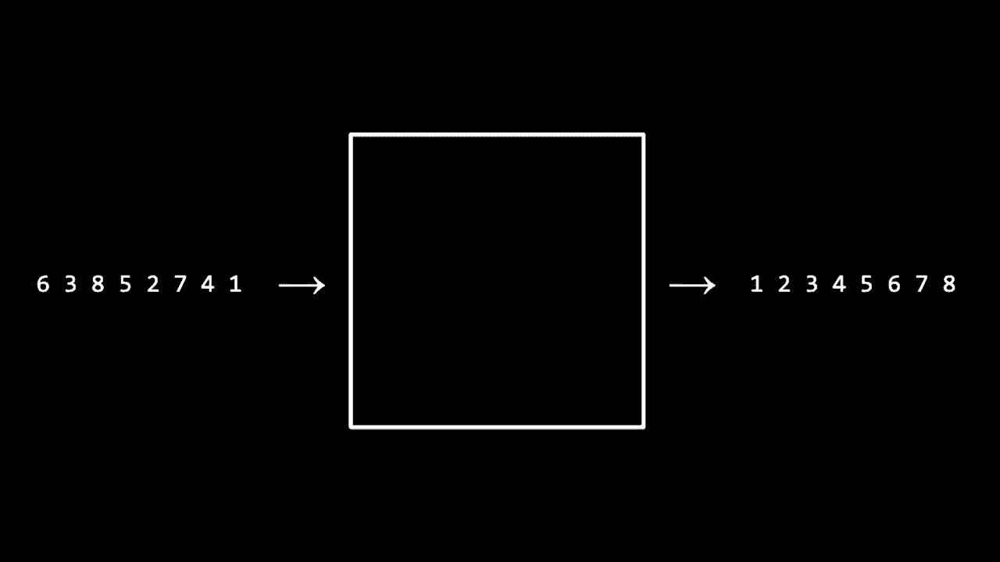

时间不是七，而这次的目标不是搜索，值本身，而是对它们进行排序。但在我自言自语之前，有人能对此整个智力练习，提出反对意见吗？我们即将进行，排序的事情，比如，有人能争论一下。为什么我们可能不想费心使用，费心，排序这些元素，反正就让我们这样。

使用线性查找，找到某个元素，无论它是否是，门后面的一个数字。

在数组中一个名字，比如我们什么时候可能会，想要使用线性查找。

而且不需要去排序，呃，索非亚，我们该做什么。

这可能在某种程度上，比如如果我们能找到某个东西，而线性查找我们知道我们可以找到它。好的，公正，我承认，实施二分查找并非伪，代码。实际上更困难，因为你必须处理四舍五入，特别是如果是奇数。门与偶数门，或这些长度的数组。

老实说，你必须处理这些，四舍五入，因为每当你将某物除以。二时，你可能得到一个小数值，或者，你可能得到一个整数，所以我们。

需要做出一些决策，所以这是完全可解决的，人类几十年来一直在编写。实现二分查找的`code`。

完全可能，你可以使用库，但这确实更具挑战性，而且你会面临风险，但让我声明这是可以的，我，我在我的进程中，已经足够好到，我相当确定我能正确实施它。所以正确性不是我的，担忧。

排序，一个元素数组，是什么可能让我动机啊。

就用线性搜索吧，它太简单了，谁能提出为什么，奥利维亚，如果游戏的目标是效率，那么，你不妨直接搜索，而不是排序，这会额外花费一些开销。是的，真的说得好，如果你有一个相对较小的数据集，而你的计算机的处理速度达到十亿。

每秒操作次数，例如，天啊，如果你的代码糟糕且有点慢谁在乎呢？只需用不高效的方式去做，为什么呢？因为实现一个更简单的算法，比如线性搜索，可能只需几分钟。尽管它的运行时间会更长，而这可能需要你花费数十分钟。

可能需要几分钟，甚至一个小时，不仅要编写，还要调试像更复杂的算法。比如二分搜索，此时你可能花了更多的时间。

编写代码比运行慢代码更快，你只需这样做，我可以说。

这让我想起我研究生时期，我所做的一些研究涉及到非常大数据的分析。

集合，我必须编写代码来分析这些数据，我可能花了几个小时、几天，甚至。编写我能设计的最佳算法，以尽可能高效地分析数据。或者说，我可以写一个糟糕的版本的代码，然后去睡觉。

八个小时，我的代码将在早上生成我想要的输出。

这是一种非常现实且合理的权衡，确实，在接下来的几周里，这将成为课程的主题。将会有这种权衡，而这种权衡往往是时间、复杂性，或者你所使用的空间或内存量。

而成为程序员的艺术之一，就是尝试决定界限在哪里。

你需要在前期投入更多的努力，以创造一个更好、更快、更高效的算法。

或许在那里可以稍微简化一些，所以资源。

挑战性问题，因此我们在课程的问题集和实验室中总是会规定。最重要的是什么，但在几周后，你将会实现你自己的拼写检查器，其中的目标之一是。最小化你的代码运行所需的时间，以及最小化占用的空间或内存。

运行，所以我们会越来越欣赏这些权衡。但确实如此，我真的很喜欢奥利维亚的说法。如果你的数据集很小，可能不值得编写最快、最好设计的算法，只需简单而正确地编写即可。

快速得到答案并继续前进。

但这并不是许多问题的情况，他们说大多数生活中的问题。

如果你正在构建Facebook、Instagram、WhatsApp或任何今天最受欢迎的服务，它们在短时间内获取成千上万的新数据。你不能仅仅线性搜索你在LinkedIn上的所有朋友或连接，高效地进行，你不能这样做。

线性搜索谷歌和微软在其搜索中索引的数十亿网页。

而且无疑，你的程序、代码、网站、应用程序等越成功，设计就越重要。因此，目标不是一次性搜索这些门，目标不是一次性搜索这些灯泡，目标不是一次性搜索电话簿，而是一次又一次。

如果是这样的话，我们可能应该花更多的时间和一点复杂性，提前让我们的代码不仅正确，而且高效。这样我们才能从这种效率中一次又一次地受益。

也许让布莱恩帮忙，布莱恩，你愿意帮忙排序吗？是的，当然可以，我有八个数字，你可以开始排序这八个数字。我们将把它们按照排序顺序放好，确实，我同意，现在让我们听听观众的意见，有人愿意解释一下布莱恩是如何排序的吗？

那么这八个数字，布莱恩是如何一步一步地达到最终结果进行排序的呢？彼得，你看到他做了什么，呃，他一步一步地检查，如果它们没有排好，就一直进行下去，直到它们全部正确。他不断地寻找小值并将其移动到左边。

并寻找大值并将其移动到右边，因此有效地一次选择一个数字。如果你愿意，布莱恩，我们可以看看更慢一点的过程。如果你能更有条理地进行，我看到你已经将数字重置为它们的原始无序状态，为什么我们不更有条理地开始呢。

你能再慢一点，选择最小的值吗？因为我认为，彼得，它需要放在最左边。呃，当然可以，我正在看这些数字，1是最小的。好的，我现在有了最小值，你做得很快，但。

我觉得你太随意了，作为一个人可以有这种感觉。但如果你能更像计算机一点，如果这八个数字实际上是一个数组。就像我这里的七扇门一样，每次只能看一个数字。你能不能更有条理、更谨慎地告诉我们如何。

你找到最小的数字放入位置，当然，我想既然计算机一次只能看一个数字，我会从这个数组的左侧开始。然后逐步向右查看每个数字。所以我可能从六开始，问，好的，现在这是。

这是我目前看到的最小数字，但我再看下一个数字，六。所以现在的三是最小数字，继续查看，八比三大，所以我。无需担心，五也比三大，二比三小，所以。现在这是我找到的最小数字，但我还没完成，所以我会继续。

看看七比二大，四比二大。但一比二小，所以我现在已经走到了数组的尽头。可以说一是我找到的最小数字，好的，所以我听到的是你在做这些比较，和彼得暗示的也很相似。

你一直在检查这个小吗？这个小吗？这个小吗？你在跟踪当前看到的最小数字。是的，听起来没错。所以你找到了，我觉得它应该放在开头。那么我们现在如何将其放入位置？是的，我想把它放在开头，但没有真正的空间。

所以我可以通过将这些数字移动来为它腾出空间。好的，等等，但我觉得你刚才增加了工作量。我觉得。不要这样做，那感觉你要做更多步骤，比我们需要的多。我们还可以做些什么？好的，另一个选项是它需要。

像这样在数组的第一个位置，所以我可以把它放在那里。但如果这样做，我必须把现在在那里的六拿出来。好的位置，但六不在。我同意，但我认为这样没关系。因为这些数字是随机开始的，所以六在错误的位置。

无论如何，我认为通过仅仅移动它，我们并没有让问题变得更糟。事实上，我认为交换两个数字，把一个移动到另一个，反之亦然，然后移动之间的所有数字，这样会更快。是的，所以我把一从数组的最末尾位置拿出来，全部在右侧，所以我。

我想我可以把六放在那里，因为那是，数字。是的，虽然不完全在正确的位置，但没关系，所以我。喜欢这样，但现在这个一在正确的位置上，而且你确实照亮了它，表明这一点，我觉得我们可以。

从此基本上忽略这个一，现在只选择下一个最小的元素。所以你能带我们走过这个过程吗？是的，我想我会重复同样的过程，我从三开始，这是我目前找到的最小数字。我会继续寻找，八更大，三，二比三小。

我会记住二是我见过的最小的数字。然后我只需要检查一下是否有比二更小的。我看看七、四和六，这些都没有比二小，所以我可以说二是下一个最小的数字。

那个需要放在第二个位置，所以我需要把三拿出来。我想我可以把三放到这个空位置，那里有可用的空间。是的，我觉得这开始变得清晰了，我们进入了一种循环，因为你几乎又讲了同样的故事，但换了一种方式。

不同的数字，你介意继续算法直到结束，选择下一个最小的、下一个最小的、下一个最小的并使其排序吗？当然，所以我们得到了八，五比那个小，三比那个小，然后剩下的数字是七，***** 这些都是更大的。

所以三将放入已排序的位置，我会把八换掉。现在我会看 5、8 和 7，5，但六更大，所以四是我目前见过的最小数字，所以四将放在这个位置，我会把它和五交换。现在我有了八，七比八小，所以我会记住。

五比那个小，但六比那个大，所以五将是下一个数字。现在我剩下七，八更大，所以七仍然是我见过的最小的，但六比最后两个小，而在最后两个之间，八和七，七是更小的，所以七将放在这个位置。

目前我只剩下一个数字，所以这个数字必须在已排序的位置上，现在我可以说这是一个已排序的数字数组，看起来确实是正确的，感觉有点慢，但当然我们使用的是实际的数组，如果你不介意观察一下，看起来如果我们有八。

一开始有多少个数字，或者说 n 个数字，进行了 n 减 1 次比较，因为你一直在比较数字，其实你做了 n 次比较。你看了第一个数字，然后又一遍一遍地比较了所有其他可能的值，以找到最小的元素。

是的，因为对于每一个数字，我要看看它是否比最小的那个小。然后我需要记住这一点，所以在每一轮中，你考虑了每个数字，总共 n 个数字，首先直到你找到了一个数字，接下来要清楚 n 减 1 的数字，然后是 n 减 2 的数字。

减去三个数字……一直到最后一个数字。所以我认为这是正确的，我认为，这是一种相当有意识的方式。来对这些元素进行排序，比起你最初的方法，布莱恩我可能会描述为更有机一点，你有点像。

更像是人类，只是稍微观察一下，然后移动东西。但如果我们要把这个，翻译成代码，请记住我们必须非常，精确。所以让我考虑一下，究竟如何将布莱恩所做的，最终再翻译成。伪代码，所以他所做的实际上是一个有名字的算法，叫做选择。

排序，为什么呢？因为最终它是在排序这些元素，而是通过让，布莱恩或实际上是计算机，一次又一次地进行操作，一旦你找到了每个这样的小，实际上忽略它。确实，每次布莱恩亮起一个数字，他并不需要继续比较它。所以我们所做的工作量，在每次迭代中都在减少。

n 个数字，然后 n 减 1，然后 n 减 2，n 减 3，等等，所以我们可以把这个算法的运行。时间视为它实际的伪代码。那么我们该如何定义这个。伪代码呢？让我提议我们把它想象成这样，从 0 到 n 减 1 的 i。现在，毫无疑问这是。

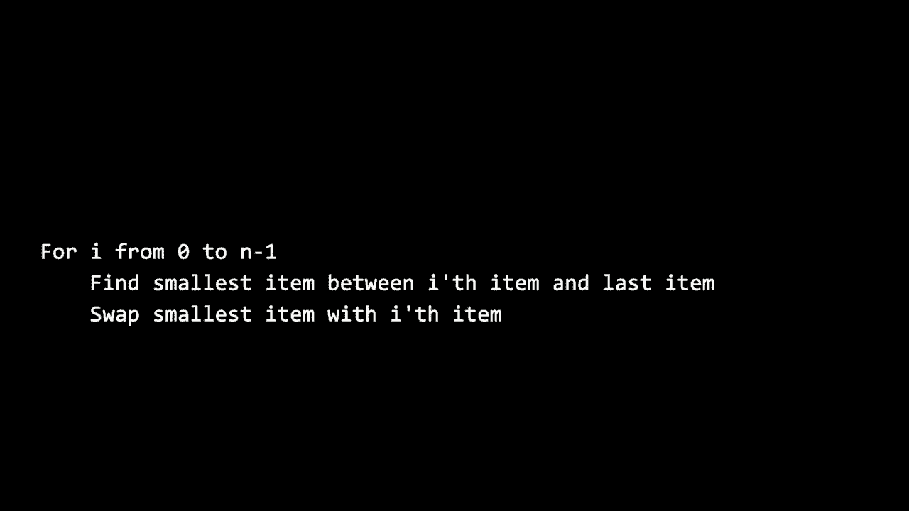

可能是最难懂的行，屏幕，但再说一次，这正是我们本能地使用代码看到的类型，看看你如何写一个 for 循环。for 循环通常按惯例从零开始计数，但如果你有 n 个元素，你并不想，数到 n，而是想数到 2 n，或者等效地数到 n 减 1。所以。

从 0 到 n 减 1。好吧，现在在第一次迭代中，我想要做什么，项。和最后一项，所以这一点在第一眼看上去并不是很明显，但我认为这公正地描述了，布莱恩所做的，因为如果 i 初始化为零，那么就是架子上最左边的第一个，数字，而他接下来做的是找到。

最小元素，在第 i 个项与第一个项零之间，以及最后一个项，所以这有点像是。非常花哨的说法，布莱恩找到了，所有 n 个元素中的最小元素，然后他所做的就是将最小项与，第 i 个项交换，所以我们就这样，交换了一切。他只是通过将它与，错误位置中的值交换来为它腾出空间，但。

现在在这个循环的下一次迭代中，考虑一下 for 循环是如何工作的，你执行 i 加 1。在伪代码中，这正是这里发生的事情，所以现在 i 等于 1，项。项 1 零索引和最后一项，所以这是一种花哨的说法，布莱恩再次检查所有的。n 个元素，除了第一个，因为现在你是从位置开始的。

从位置一而不是零，现在算法继续进行。所以你可以用不同的方式用英文写出这段代码，就像伪代码，但这似乎是对该算法的合理表述。让我们更直观地看看，人类在数字中移动，让我。

继续使用这个可视化，我们将在课程网站上放一个链接。如果你也想尝试一下，这只是某人的数字数组的可视化，但这次不是用符号、十进制数字来表示数字。现在这个人使用垂直条，就像条形图一样，这意味着。

小条就像小数字，大条就像大数字，所以目标是对这些条进行排序，这也可以看作是从短条到高条的数字排序，从左到右。我将继续在菜单顶部选择我的排序算法，就是我们刚刚描述的那个。

回忆一下选择排序，注意一下，我想要花点时间理解这里发生的事情，但注意这条粉色线是从左到右移动的。因为这正是布莱恩所做的，他在数字架上来回走，寻找下一个最小的数字。

他把最小的数字放在左边，正好在它应该的位置上。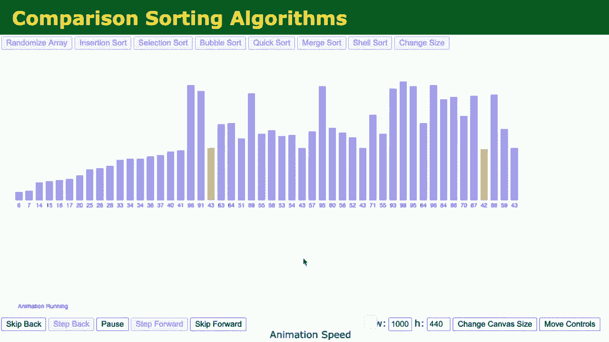

的确，这就是为什么在这个可视化中，你看到小数字开始被放置在左边，我们不断地扫描，但注意，彩色条逐渐向右移动，就像布莱恩不再回头一样，一旦他点亮了数字，就让它们保持不变。

瞧，这些数字现在都已排序，这只是以图形化的方式来思考相同的算法，但那样效率如何呢？让我们看看能否在这里应用一些数字，但还有其他的方法可以做到，所以如果第一次通过数字时，他有八个数字可用，他。

查看所有八个数字的顺序，所以这是最初的结束步骤，下次他经过货架时，他忽略了已经被点亮的数字一，因为根据他已经做过的定义，它已经在正确的位置上。现在他只需进行n减一的步骤。然后他进行了n减二的步骤，接着是n减三、n减四。

从五，一直到最后一步，他只需找到并留在原地的数字八，因为这是最大的数字，所以只需一步。这是某种数学序列，你可能会记得在数学书的最后一页或高中的时候。

在你的物理教科书或类似的书籍中，结果证明这实际上归结为这个公式。n 乘以 n 加 1 除以 2。如果你对此不熟悉，没关系，只要让我说明，我们开始于 n 加 n，减去 1，加 n 减去 2，加 n 减去 3，依此类推，最终简单地归结为更简洁的 n 乘以 n 加 1 除以 2。

这个 squ*red 加上提议，给我们的是是的，这个 n squ*red 除以 2，加上 n 除以 2。所以如果我们真的想要斤斤计较，这是总步骤数或操作数或秒，无论我们想如何衡量，布赖恩的运行时间，这似乎是精确的数学公式。

但是在本周初，我们再次考虑了那种大 O 符号，挥一挥手，我们更关心的是算法运行的数量级，我真的不在乎这些，分之二和 n 除以二，因为当 n 变大时，哪一个因素会重要。

电话簿越大，我们拥有的门越多，灯泡越多，架子上的数字越多，n 会不断变得越来越大，考虑到这个主导因素，如果我们可以请来某个人，哪一个因素，n squ*red 除以 2 还是 n 除以 2，问题。

随着 n 的增大，变得越来越大，主导着，没有问题的将是 n squ*red。是的，n squ*red 对于任何 n 的值，你只需将其平方，结果会比仅仅做 n 除以 2 的值大得多，因此在我们的大 O 符号中，我们可以描述布赖恩的运行时间在 n 的数量级上。

squ*red 是的，我忽略了一些数字，是的，如果我们真的想要斤斤计较并计算布赖恩每一步，确实是 n squ*red 除以二加上 n 除以二，但再说一次，如果你考虑这个问题的时间，以及 n 变得非常大，类似 Facebook、Twitter 和 Google 的规模，数学上真正主导的就是这个。

这里更大的因素会使总步骤数远远大于那些较小的有序项，所以在大 O 符号中，选择排序似乎是在 n squ*red 的数量级上。所以如果我们考虑之前的图表，其中我们对线性和二分搜索算法的上界进行了划分，这个是。

不幸的是，这真的是个小问题。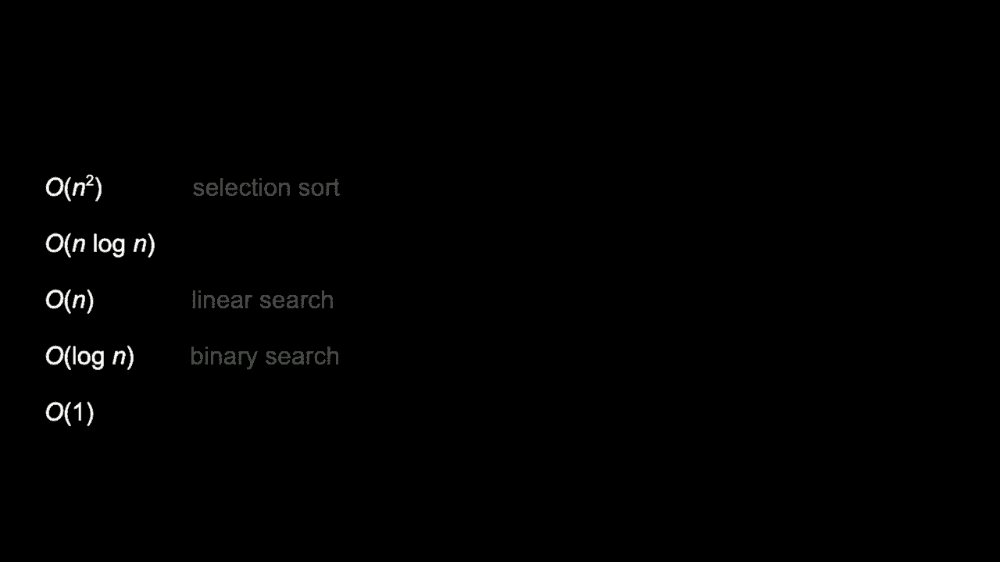

这个特定运行时间列表的顶部，还有无数更多的。这些只是计算机科学家可能使用和思考的更常见公式的子集，选择排序算是列表的顶部，排在第一位显然是糟糕的，n squ*red 绝对比常数时间慢得多。

或者说一步，所以我在想我们是否可以做得更好，我想知道。彼得实际上之前说过一些其他的事情，关于比较两个数字并修复它。让我建议我们让布莱恩回到你这里，看看可能会被称为其他算法的东西。

冒泡排序，冒泡排序是一种不同的算法，它试图更局部地修复问题。实际上，布莱恩，如果你看看你面前的数字，你的位置，我感觉如果我们关注小数字，就像上次我们试图解决的问题那样，如果我们只看数字对。

那些相邻的数字，我们可以稍微做一些小的调整，比如说。布莱恩，六和三，你能给我们什么观察？是的，当然可以，六和三是数组中的第一对数字。如果我想让数组被排序，我希望较小的数字在右边。

所以只看这一对，我可以告诉你六和三是乱序的，三应该在左边，而六应该在右边。好的，那我们来做吧，修复这两个，只修复一个小问题。现在让我们重复这个过程，对吧，我们的算法，所以六和八是下一个这样的对，那是什么呢？

那一对似乎没问题，因为六比较小，而且它已经在左边，所以我想我可以让这一对保持不变。好吧，八和五呢？呃，八比五大，所以我要交换这两个，五应该在八的左边。好的，八和二也是一样的情况。

这里八比二大，所以八要和二交换。好的，八和七，八比七大，所以我应该和七交换，好的，八和四也是一样，八比四大，八和一我可以最后再做一次。

这次八比一大，我已经交换了，并且有一个很不错的戏剧性效果，如果你走到一边，瞧，实际上没有排序，事实上，看起来并没有好多少，但我确实认为布莱恩做了一些聪明的事情。布莱恩，你能谈谈至少一些边际改善吗？

你做出的改进是的，至少有一些改善，最初的一个向后移动了一格，而我认为另一个改善是，八最初在某个地方。但因为八是最大的数字，我不断地将它交换，直到它完全到达了末尾。所以现在实际上我认为这个八是在正确的位置。

它最终移动到了数组的右侧。是的，这就是我们稍后会看到的算法的名称来源。冒泡排序暗示着最大的数字开始。逐渐上升到列表的顶部或末尾，注意。

正如布赖恩所做的那样，数字一只移动了一位，所以显然还有更多的工作要做，那也是错位的，但我们已经改善了一些，八在位置上，而一更接近于到达位置。那么接下来我们可能怎么做呢？好吧，布赖恩。让我们继续解决一些小的、易处理的问题，从。

再次开始，三个和六，确保这三个和六看起来是有序的。所以我就不动它们，六和五，六和五是不对的，所以。要往右移动，六和二也是不对的，所以我将二和六交换。六和七，六和七是好的，它们是有序的，七和四。

那些是不对的，所以我将四和七、七和一交换。那两个也不对，七已经到达排序位置。确实如此，现在我们正在取得一些进展，七已经冒泡到列表的顶部，停在八之前，而一的位置。

所以我敢打赌，布赖恩，如果我们不断这样做，只要列表保持部分未排序，我想我们可能会到达终点。你想接手并排序剩下的部分吗？好的，当然，所以我再重复一遍这个过程。三和五是好的，而二和五是不对的。

所以我将它们交换，五和六作为一对是好的。***和***是不对的，六和一也是不对的，所以我将它们交换，现在六，我可以说是处于正确的位置，我再重复一遍，三和二是不对的。

所以它们被交换，三和五是好的，五和四是不对的，所以它们被交换，然后五和一也需要交换。所以现在五在排序位置，而我剩下的四个，二和三是好的，三和四是好的，但四和一是不对的。

所以它们被交换，现在四在它的位置上，二和三是好的，但。那些，现在三进入了它的排序位置，然后最后一对需要考虑的就是二和一，呃，它们是不对的，所以我将它们交换。现在二在位置上，而一是唯一剩下的数字。

我可以说那个在位置上，二，现在我认为我们有一个排序好的数组。不错，所以这感觉像是一种根本不同的方法，但我们。仍然达到了相同的终点，这确实引发了一个问题。泡排序是否更好，还是更糟，或者也许没有区别。

但也要注意，我们从根本上用不同的方式解决了同样的问题。第一次我们采用了更人性化、自然的直觉，只是找到最小的元素，好的，重复一遍，重复一遍，这次我们从不同的角度看待问题。

列表未排序，正如彼得指出的，当事情像这样失序时，非常基本的原始状态表明了一种方式。只需修复所有微小的循环，如果我们重复这个直觉，它最终会通过修复所有小问题而得到回报。

直到大的一次似乎会消失，让我回到之前的可视化。重新随机化条形，短条形是小数字，大条形是大数字。让我去运行气泡排序算法，你会注意到，现在的颜色是两个，再次，你会看到这次条形。

它们表现得有点聪明，并且不是每次都走到最后。就像布莱恩照亮了数字，停止查看8和位置一样。但是他和这个可视化确实会返回到开始，进行另一次遍历，再一次遍历。

总共进行了多少次比较呢？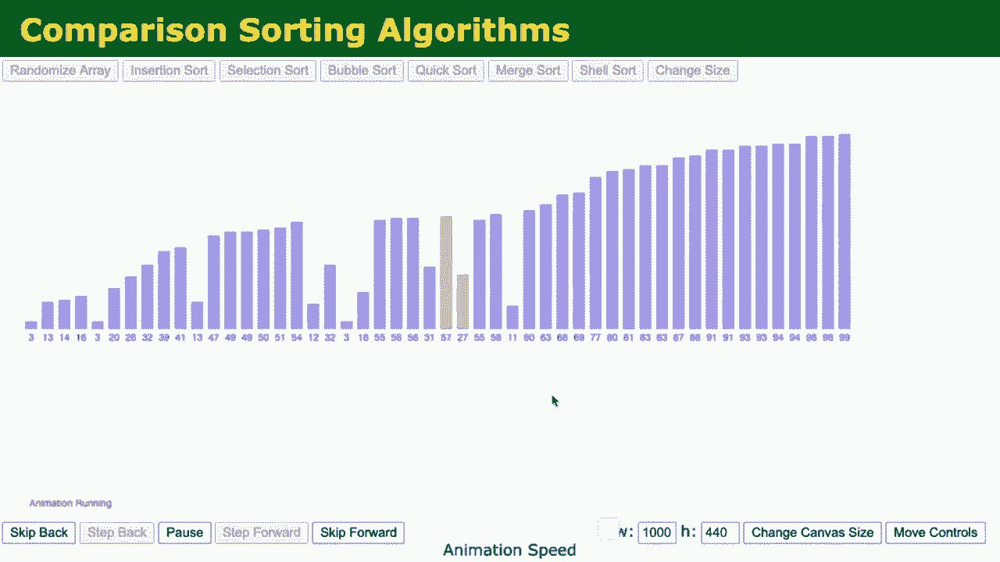

这次似乎是第一次，通过条形或者同样的，通过货架，布莱恩在这个可视化中进行了n-1次比较，从左到右比较n个元素的n-1个相邻元素，直到n-4和n-5。

当剩下两个或一个时，你就完成了。虽然这个算法在根本上达到相同的目标，但它成功地对元素进行了排序。让我们考虑它在代码中的实现，以及它是否真的快一点或慢一点，让我们设置一个最终的边界，实际上是两个。

在选择排序中，我们有一些可以比较的内容。让我们考虑一下选择排序在最佳情况下的下限场景，如果你有n个元素，并且不断寻找下一个最小元素，实际上，这里我们的朋友就是这个图表。

在我们讨论的Omega符号中，线性搜索和二分搜索可能会非常幸运，只需一步，如果你正好在寻找，正如我们在布莱恩和可视化中实现的那样。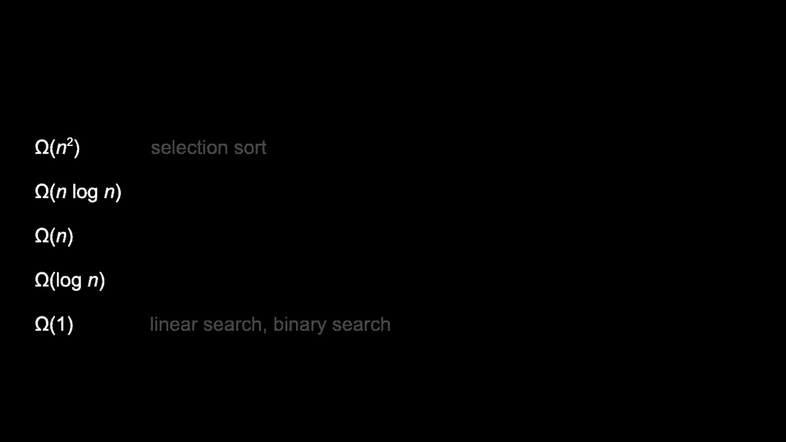

不幸的是，这并不好，因为每次他搜索一个数字时，都是从左到右。公平地说，他确实忽略了已经到位的数字，所以我们没有继续查看那个他没有保持在的位置的数字，而是多次触碰那些数字。

所以即使你和我，人类可以看这些数字并且觉得，显然这是一个，显然这是两个，显然这是三个，布莱恩必须以更系统的方法来处理，事实上，即使那串数字是完美排序的，他也会浪费同样多的时间，事实上，布莱恩，如果你不介意，再说一遍。

布莱恩，如果我们从一个已排序的列表开始，这是一种有趣的扭曲，供你考虑。从算法的角度来看，在分析算法时，有时你想考虑最佳情况和最坏情况，而似乎没有比已经排序的列表更好的情况了，你运气真好，实际上没有工作要做，最坏情况是列表可能是。

完全相反，这是一项巨大的工作量要完成。

不幸的是，选择排序并没有真正优化这个幸运的情况，即它们已经排序。所以布莱恩，我看到你已经将数字从左到右重新排序。如果我们像之前那样重新执行选择排序，你会如何去找最小的数字。我们之前决定，要找最小的数字，我需要。

从左到右查看数组中的所有数字，每次检查是否找到更小的东西，所以我会从目前为止看到的开始，但我必须继续查看，因为可能后面会有零或负数，我需要检查是否有更小的东西，所以我会检查二是否更大，所有的都更大。

所以结果证明我一直是对的，那个是最小的数字，已经在正确的位置，所以现在，那个数字在正确的位置，然后要找到下一个最小的数字，你会怎么做，我会做同样的事，二是我目前找到的最小数字。然后我会查看所有数字，除了二，我会查看三、四、五、六。

七、八，没有比二更小的，所以我会回到二，说明那个数字现在必须在它的排序位置上，确实如此，而这个故事对于三、四、五也是一样的，选择排序的伪代码或实际代码中并没有任何智能，去判断数字是否已经排序，如果已经排序就停止。

就像没有机会提前中断并终止这个算法，布莱恩实际上会做同样的工作，无论它们从一开始就是完全排序还是完全未排序，甚至是反向的，所以，非常，非常希望冒泡排序确实会朝着这个方向发展，让我们来看看一些提议的冒泡排序伪代码。

假设输入可以是任何内容，无论是已排序还是未排序，伪代码总是会像这样，直到n。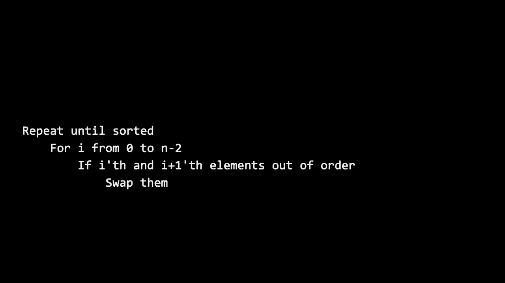

从第一个元素到最后一个元素，范围是0到n减2，表示从第一个元素到倒数第二个，为什么我这样做呢？我们马上就会看到，如果i的顺序，聪明。如果你考虑所有这些数字都在一个数组中或在门后面，如果你从零迭代到n减二，那就像从第一扇门到。

倒数第二扇门，但这很好，因为我的条件是检查门i和i加一。因此，如果我从这里的开始处开始，并且我只迭代到这扇门，那是好事。因为当我比较门时，门的比较是将门i与门i加一进行比较，而这并不存在，确实，这将导致一个错误。

可能你们所有人在某个时候都会遇到，涉及到一个或多个空间的内存问题。尽管没有分配内存，但数组中的某个位置可能会超出范围。所以这看起来似乎很聪明，实际上表现得可能与理想的状态一样好。以冒泡排序为例，假设这个列表，你，呃，排序并重启数字太多了。

你介意再给我们一次排序的列表吗？我想看看我们是否考虑到，和之前相同的已排序列表，这次使用冒泡排序。

我们能否从根本上做得更好？我有这段代码，说的是重复直到。排序，所以这可能会有什么变化？布莱恩，你又得到了已排序的数字。这应该是一个好例子，但选择排序并没有从这个输入中受益，尽管我们可能会幸运地使用冒泡排序，你的思维过程会是怎样的？

所以冒泡排序的思维过程，是一次检查每一对，看是否需要为那一对做交换。所以我会看一下一和二，如果二和三是可以的，我就不需要在这里交换，三和四也可以，同样五和六，以及八。

所以我完成了对所有，任何交换的遍历，因为每一对我查看的都是彼此，确实如此，因此这次如果布莱恩真的回顾了这些步骤，并在n减1个元素中再次执行，然后在n减2个元素中再执行，那就太愚蠢了。

任何工作、任何交换，在第一次遍历中，他实际上是在浪费自己的时间，甚至再做一次遍历或另一遍，代码，这个重复直到排序，尽管它并不完全可以转换成C语言中的for循环或while循环，但直观上它表达了他应该做什么：重复直到排序，布莱恩已经识别出这个事实。

由于他没有进行任何交换，这个列表就是已排序的。因此，他可以停止这个循环，我们可以将其更明确地映射到C语言代码中，我们可以默认说执行以下操作n减1次。因为在n个元素中，你可以查看n减1总对，但请注意。

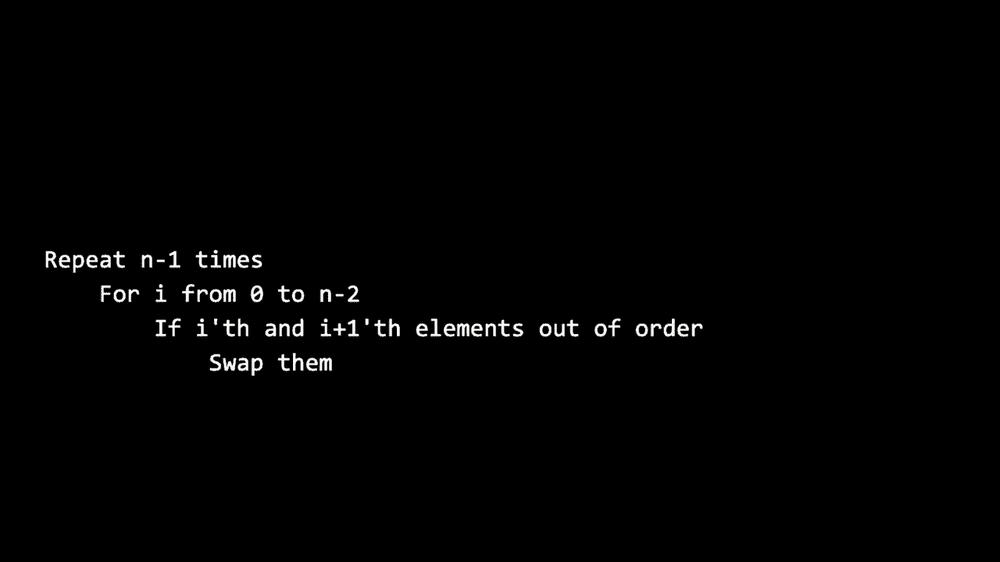

我可以在这里添加一行额外的代码，可能会说。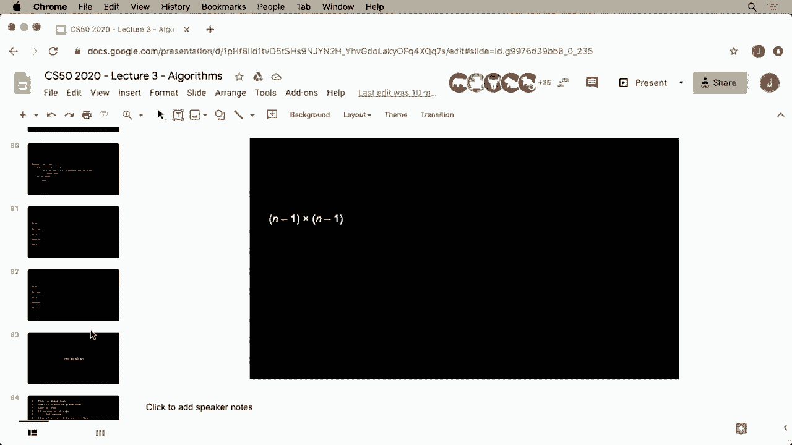

这我可以说是增加一行代码，如果没有交换则完全退出算法，只要布赖恩跟踪他在一次遍历中做了多少交换或者没有做多少交换，使用一个叫做计数器的变量，他可以简单地提前中止这个算法，这样确实可以为我们节省一些时间。

让我们暂时考虑一下冒泡排序的运行时间。在最坏情况下的上界，如果你注意到冒泡排序，做某些事情，n-1次，所以再次重复n-1次，字面上说。执行以下操作n-1次的for循环，这只是一种不同的方式。

在伪代码中表达类似的思想，但这次给我们一个变量。对于i从0到n-1，n-2，总共是n-1次比较，因此这是一个n-1的事情，出现在repeat内部和repeat外部。所以我认为这给我的是n-1个事情。

n-1次乘以n，所以现在如果我将这个稍微整理一下，像高中或初中的数学，n² - 1n - 1n + 1。我们可以合并同类项，得出n² - 2n + 1。但根据我们之前的讨论，这真的有些复杂。谁在乎2n或1，当n变大时，主导因素肯定是n。

冒泡排序和公式似乎会有n²步的上界，所以在这个意义上，它与选择排序是等价的，从根本上来说并没有更好。我们可以说从渐近的角度来看，这个公式在所有意图和目的上是相同的，尽管它们在低阶项上略有不同。

就所有意图和目的而言，它们的复杂度大约是n²，但如果我们考虑一个下界，尽管冒泡排序有相同的上界运行时间，如果我们考虑一个下界，使用这个更智能的代码，布赖恩可能会注意到等一下，我没有进行任何交换。

我只是打算退出这个循环，提前结束，而不是过早结束。因为继续做更多工作是没有意义的，我们可以逐步减少这个运行时间。我认为，这并不如常数时间的Ω(1)那么好。就像你不能确定一个数组是已排序的。

除非你至少看过所有元素一次，所以常数时间是完全天真和不现实的，你不能只看一个元素、两个或三个就说是已排序的，必须至少看过元素一次。因此，这似乎暗示了冒泡排序运行时间的Ω符号是它的下界。

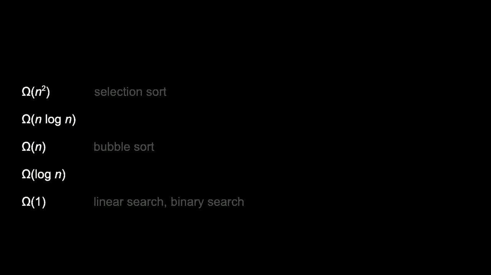

如果我们聪明一点，不要不必要地重走我们之前的步骤，这个复杂度是Ω(n)，或者从技术上讲是n-1步，因为如果你有n个元素，比较这两个、这两个、这两个、这两个，总共是n-1次比较。但谁在乎减去的1呢？它是n的阶数。

这里是 n 或 omega 的 n 表示法，所以总结一下选择排序选择了，再一次。不幸的是，根据它的代码，它是大 O 的 n 平方，但它总是会在渐近意义上花费相同的时间，随着 n 的增大，看起来更好。在上界方面，它将花费多达 n 的时间。

平方步骤太多，但至少在使用像已经排序的输入时，它可以自我短路。平方是不好的，像 n 平方会迅速累积，如果你有 n 平方而 n 是一百万或者 n 是十亿，天哪，那可真是一大堆零。

在你的算法的总运行时间中，有很多步骤，我们能做得更好吗？我们能做得更好吗？结果证明我们可以，今天我们将考虑一个最后的算法，它从根本上做得更好，就像在零周时，我们稍微接触到二分查找一样，而今天，显然比线性查找要好得多。

我认为我们可以比冒泡排序和选择排序做得根本更好，排序可能是我在研究生院用来快速编写代码然后去睡觉的东西，但对于非常大的数据集，它不会工作，坦白说，如果我不想的话，它也不会工作。

只是睡过这个问题，相反，我们希望从一开始就尽可能高效地完成事情。让我提议我们利用一种技术，这是一种你几乎可以在任何编程语言中使用的技术，递归，简单来说就是一个函数调用自己。到目前为止，我们还没有看到任何示例，我们看到的是函数调用其他函数。

函数主，不断调用 printf 主已经开始调用 sterling 主。早些时候主调用了 stir comp compare，但我们从未见过主调用主。人们不会那样做，所以这并不能解决问题。但我们可以实现自己的函数。

并且有我们的函数可以调用自己，这在原则上看起来似乎是个坏主意。如果一个函数调用自己，天哪，这会到哪里结束呢？似乎会永远做某件事，然后可能会出问题。

这可能会发生，这就是使用递归的危险，你很容易搞砸。但是这也是一种非常强大的技术，因为它让我们以一种非常有趣的，敢说优雅的方式思考潜在的问题解决方案。所以我们不仅能够实现正确性，而且还。

更好的设计因为更好的效率，看起来在这里是这样。所以让我提议回顾一下这段代码，来自零周的伪代码。用于在电话簿中查找某人的伪代码的特点之一，就是这些行，这里回到第三行，我们在零周时描述过。

作为循环的代表，发生了一次又一次。但你知道吗，有一种技术叫做递归，称为迭代，它完全是基于循环。它字面意思是让我回到这一行，回到这一行，回到这一行，没有自我调用。但如果我改变第零周的伪代码呢？

让我更像这样，让我去掉的不仅仅是那一行，而是这两行条件。让我简单地说，而不是打开书的左半边中间，然后返回到第三行，或打开书的右半边中间，然后返回到第三行。

为什么我不更优雅地说，搜索书的左半边，搜索书的右半边。现在我可以立刻缩短一些代码，我声称通过只说搜索书，这就是足够的信息来实现同样的算法，但它并不是使用循环。人类会再次参与，但还有其他的方法来做事情。

一次又一次，而不是通过 for 循环、while 循环或 do while 循环。或者重复块或永久块，你实际上可以使用递归。递归是这种技术，函数可以调用自身。如果我们考虑一下，毕竟我们正在看的伪代码是搜索的伪代码。

在第七行和第九行，我现在字面上说，搜索书的左半边和搜索右半边。这甚至在伪代码形式中，已经是递归的一个例子。在这里，我用11行代码实现了一个算法或函数，九行代码字面上具体搜索电话簿的一半。

递归真正发挥作用的地方，简单直接调用函数自身，输入相同是愚蠢且错误的。因为如果输入始终相同，期待不同的输出简直是疯狂。

这不是我们在第零周做的，也不是我们现在正在做的。如果你使用相同的函数或等效算法，越来越小，函数调用自身可能是可以的，代码中非常智能地说如果你在页面上。你需要一个所谓的基本情况，需要一些代码。

那个会注意到，等等，这里没有更多的问题需要解决。现在退出，那么我们怎么将这映射到实际的代码呢？好吧，让我们考虑一些非常熟悉的东西。回想一下你重建马里奥金字塔时的样子。看起来有点像这样，让我们考虑这是一个砖块金字塔。

这高度是四的，y4，那么从上到下有一砖、两砖、三砖、四砖，所以这里的总高度是四。但让我问一个问题，你怎么去打印高度为四的金字塔？结果证明，这个简单的马里奥去掉了不必要的背景是递归的。

这是一种递归的物理结构，为什么呢？好吧，注意这个结构，这个砖块，这个金字塔在某种程度上是用自身来定义的，为什么？好吧，如何制作一个高度为四的金字塔，我会有点恼人地、循环地争论，你创建一个高度为三的金字塔，然后再加上一行砖块，好的。

好吧，让我们继续这个逻辑，好吧，如何构建一个高度为三的金字塔？好吧，你微笑着说，你需要建造一个高度为二的金字塔。然后再加上一层，好吧，如何构建一个高度为二的金字塔？你建造一个高度为一的金字塔，然后再加上一层，如何构建一个高度为。

高度为一，你只需把这个愚蠢的砖块放下，你有一个基本情况，在这里你有点陈述了显而易见的事情，只需做一次，你硬编码逻辑，但请注意，什么是有点让人费解或恼人的在人际互动中。就像你只是用事物定义答案，但没关系，因为金字塔更小。

直到我能处理那个特殊的情况，所以我们可以为乐趣做这个实例。如果我想建造一个高度为四的金字塔，我该怎么做？好吧，我可以建造一个高度为三的金字塔，好吧，让我去啊**d**建造一个高度为三的金字塔，呃，我该如何建造一个高度为三的金字塔，好吧，我建造一个金字塔，好的。

我该如何构建一个高度为二的金字塔，高度为一，我该怎么做？好吧，你只需放下砖块，所以这里的事情有点停滞不前，不再是循环的论证。你最终只是做一些实际的工作，但在我心里，我必须记住你刚刚给我的所有指示，或者我给自己的指示，我必须建立一个高度为四的金字塔。

不，三，不，二，不，一，现在我真的在做这个，所以这是高度为一的金字塔。我现在该如何构建高度为二的金字塔？好吧，回顾一下故事。要构建一个高度为二的金字塔，你需要建造一个高度为一的金字塔。然后再加一层，所以我想再加一层。

我基本上需要做到这一切，现在我有一个高度为二的金字塔。但是等一下，故事开始于，我该如何建立一个高度为三的金字塔。好吧，你需要一个高度为二的金字塔，我这里有一个，然后再加上一层额外的层，所以我得构建这一额外的层，我要去啊**d**给自己一个结构。

层，层，然后我将把它放上去，瞧，这就是高度为三的金字塔。好吧，我是怎么到这里的？让我继续回顾这个故事，我问自己的第一个问题是如何建造一个高度为四的金字塔。好吧，答案是建造一个高度为三的金字塔，太好了，完成了。

然后再加上一层额外的层，如果我有更多的手，我可以做得更优雅，但让我去啊**d**，把这个铺出来，这就是高度为三的新层。现在我要去做四，现在我要把高度为三的金字塔放在上面，直到瞧，我有这个形式在这里，循环的。

每当我要求自己构建一定高度的金字塔时，我总是推迟说，不，构建这个高度的金字塔，不，构建这个高度的金字塔，不，构建这个高度的金字塔，但这个算法的魔力是多做一点工作，构建一层，再多做一点工作。

一层又一层，金字塔本身的最终目标实际上出现了，因此你可以用 for 循环或 while 循环来实现同样的东西，坦率地说，你确实这样做了，只是形状稍有不同，但你用循环做了同样的事情，你有点。

按照我们规定的方式进行，因为使用 printf，你必须从屏幕顶部打印到底部，然而，得先打印一层，然后再回到顶部，所以我在这里有点对现实世界的自由裁量，抬起这些东西并移动它们，你必须有一点。

代码中更聪明，但想法是相同的，因此即使是像这样的物理对象，也可以有一些递归定义，因此我们展示了这个有点搞笑的例子，因为递归的概念是一种基本的编程技术，你可以利用它来解决问题，我认为为了这个我们需要最后一个。

在布莱恩的帮助和计算机的帮助下可视化归并排序，归并排序将是一个算法，它的伪代码可以说是到目前为止最简单的，但却具有欺骗性，归并排序的伪代码非常简单，就是对左半部分数字进行排序，对右半部分数字进行排序。

合并已排序的两部分，注意即使不公平，这里有一个排序算法，然而我在我的排序算法中字面上使用了“排序”这个词，就像在英语中，如果你被要求定义一个词，而你字面上在定义中使用这个词，这种情况很少成立，因为你只是制造了一个。

循环论证，但在代码中没关系，这样做有点不同，只要问题确实是，这个伪代码并不是在说排序数字，而是将问题分成两半，然后解决另一半，迭代，现在我会免责声明，我们将需要。

所谓的基本情况，再次，我需要做一些愚蠢但必要的事情，假设只有一个数字，就可以停止，它是排序的，这就是所谓的基本情况，递归情况是函数调用自身。但这确实是我们的第三个也是最终的排序算法，称为归并排序。

我们这里真正关注的是最精华的部分，一个就是合并的概念，因此布莱恩，我们能不能转到你这边，这样我们可以在查看归并排序算法本身之前先定义一下，当我们说合并已排序的部分时，我们究竟是什么意思？例如，布莱恩的架子上有两个大小为四的数组，左边的第一个数组有四个右边的四个数字。

左边是已排序的，右边也是已排序的，但现在布赖恩，我希望你合并这些已排序的部分，告诉我们这是什么意思。当然，如果我有一个从最小到最大排序的左半部分，还有一个同样从最小到最大排序的右半部分，我想将它们合并成一个新的列表。

这个组合数组的所有数字也都是从最小到最大，我想我可以从这里开始。最小的数字需要从左半部分的最小数字或右半部分的最小数字开始。因为在左边，最小的数字是三，而在右边，最小的数字是。

在这两个数字中，必须有一个是整个数组的最小数字。在三和一之间，一更小，所以我会取那一个。这将是合并两个半部分的第一个数字，最小的数字，然后我想我会再次重复这个过程，右边的三是最小的数字。

是二，在三和二之间，二更小。所以我会取二，这将是下一个数字。我正在慢慢构建这个已排序的数组，这是将左边与右边的四结合的结果。在三和四之间，三更小，所以我们取三，并将其放入位置。

现在我在将左边的五与右边的四进行比较。在五和四之间，四更小，所以它进入了位置。接下来，我将左边的五与右边的七进行比较。五更小，所以五放在了下一个位置。接下来我在比较左边的六与右边的七。

右边的六仍然更小，所以这个数字将下一个。我现在在比较八和七，只有两个数字剩下，七在这两者中更小。因此，我会取七并放入位置，现在我只需放入两个半部分的合并，这就是数字八。

所以这个数字将占据最后的位置，现在我已经取了这两个半部分，每个部分最初都是已排序的，组成一个完整的数组，所有这些数字都按顺序排列。确实，考虑一下我们所做的，实际上定义了一个助手函数，我们自己的自定义函数，意味着。

合并两个数组，特别是合并两个已排序的数组，因为为什么呢？这是一个我认为我们在这个归并排序算法中想要的构建块。因此，就像在实际的C代码中，你可能会定义一个执行一些小任务的函数，我们现在也以口头和实际的方式定义了合并的概念。

这里令人费解的部分是，排序的左半部分和排序的右半部分已经被实现，没有更多的工作要让布赖恩或我来定义。剩下的就是我们执行这个算法，特别关注这三行高亮的代码，并让我声明的是。

到目前为止我们看的算法，可能这个是最不容易快速理解的。即使其他算法可能让你花了一天、一周去消化，或者也许你还没有完全掌握，这都没关系。归并排序是个让人头疼的，因为它似乎是魔法般的工作，但实际上它更智能地工作。你将开始获得各种原始数据，以便我们最终能解决问题。

乖乖地把数字放回最上面的架子上，他把它们放回原来的无序状态，就像选择排序和冒泡排序一样。布赖恩，我现在想提议的是……

我们执行这个归并排序算法，如果你不介意，我先复述一下最初的几个步骤。这是一个大小为8的无序数组，目标是排序。请记住，归并排序本质上就是三个步骤：排序左半部分、排序右半部分、合并已排序的两半。布赖恩，看着那些数字，你能……

好的，所以这里有8个数字，左半部分是这四个数字，所以我将对这些进行排序。只是我现在不太确定如何排序这四个数字。是的，考虑到我们已经看过选择排序，回到那些较旧的、较慢的算法，布赖恩，我可以在这里稍微聪明一点。好吧，我给你一个排序算法，所以现在你实际上有一个更小的。

问题是一个大小为4的数组，我很确定我们可以使用相同的**算法**归并排序，通过对左半部分进行排序，接着对已排序的两半进行排序。那么你能帮我**排序**这四个数字的左半部分吗？好的，我有这四个数字，我想排序左半部分，也就是这两个数字，现在我需要做的就是这样。

我们凭借人类的直觉，显然知道我们该怎么做，但再说一遍。让我们应用算法，排序左半部分、排序右半部分、合并已排序的两半。布赖恩，你能排序这个大小为2的数组的右半部分吗？我得到的数组是2，所以我先对这个大小为2的数组的左半部分进行排序，也就是6。

这就是幻灯片中基础案例发挥作用的地方。如果只有一个数字，那就停了。布赖恩，我可以让你松一口气，那个大小为1的列表里有个数字6，已经排好了，所以这是三步中的第一步完成了。布赖恩，你能排序那个大小为2的数组的右半部分吗？右半部分是数字3，已经完成，好的。想想我们在故事中的位置。

我们已经排序了左半部分，排序了右半部分，甚至还没有做任何有用的工作，但现在魔法发生了，布赖恩，你现在有两个大小为1的数组。你能把它们合并在一起吗？好的，我要将这两个合并在一起。先把3放进去，然后把6放进去。

这两个数字现在已经完成了，好的，现在是时候开始动脑筋了。事情堆积起来，我们是怎么到达这一点的？我们开始时有一个大小为8的列表。然后我们查看左半部分，发现它是一个大小为4的数组。接着我们查看那部分的左半，发现它是一个大小为2的数组。

然后有两个大小为一的数组，然后我们，想，现在如果我倒回那段故事，布莱恩你。需要对原始数字的左半部分的右半部分进行排序，四。左半部分的右半部分现在是，这两个数字。所以现在要排序这两个，我想我，会再次重复这个过程看。

我单独看这两个的左半部分。是八，那一个完成了，还有五，那一个也完成了。好的，所以第三步是，合并这两个已排序的部分。好的，所以在八和五之间，五更小，所以那个，先放进去。

然后八会在后面，现在我有第二个大小为二的数组，它现在也是已排序的，提醒一下，现在，左。半部分和左半部分的右半部分，所以我认为这个故事的第三个也是最后一个步骤是布莱恩，现有的大小为二，好的我有两个。

每个大小为二的已排序数组，我需要合并，所以我将比较每个的最小数字。我会比较，三和五，三更小，所以那个会先放。现在在这两个数组之间，我有一个六和一个五要比较。五更小，所以我接下来会看六和八，六更小。

我剩下的只有八个，如果，回到我正在排序的原始八个数字，我想，我现在已经排序了原始数组的左半部分四个数字，确实如此，所以如果你在家里玩，想想你有这些，想法可能堆积在一起。

你心里确实应该是这样的，坦白说，很难。跟踪所有这些，做同样的事情，现在通过排序右半部分直到完成，布莱恩如果你可以，好的，所以右半部分我们得到了四。个数字我将开始对，右半部分的左半部分进行排序。

这就是这两个数字，要做到这一点我会重复同样的过程。它是这两个数字的左半部分，只有两个，那一个完成了，它只有一个数字。右半部分同样，七只有一个数字，所以也完成了。现在我会将已排序的部分合并，两个和七之间，两个更小。

然后是七，所以这里现在是，右半部分的左半部分。一个已排序的大小为二的数组，我会对右半部分的右半部分做同样的事情。从左半部分开始是，四，已经完成，那个一也完成了。现在要把这两个合并，我会比较它们，发现那个一更小。

所以我们把一放下，然后是四，所以现在我有两个大小为二的已排序数组。我现在需要回溯并且，合并在一起形成一个大小为四的数组，所以我会比较这两个之间的那个，一是更小的。然后我会把两个与四进行比较，两个更小，然后我会比较七和。

四个元素中，四是较小的那个，然后是最后一个数字，将其放入最终的位置，所以数字。我现在已经对左半边进行了排序，对右半边也进行了排序，现在我们进入第三个也是最后一步，你能把这两个排序的半部分合并吗？是的，我认为这实际上是一个我们已经看到的例子。为了对这两个半部分进行排序。

我们只需从每个半部分取出较小的数字，再次进行比较。较小的数字放入合适的位置，然后在三和二之间，二较小，所以我们取出二并将其放入四中，进行比较。将五与四进行比较，四较小，因此四放入合适的位置。

现在我在比较五和七，五较小。因此，它进入合适的位置。接下来我在比较六和七，六较小，所以六进入下一位，七则是两个中较小的数字，所以它接着进入。此时我只剩下一个数字，即八。

所以，一个数字会在数组的末尾进入其排序位置，尽管感觉我们并没有真的在做，但当我们开始合并、合并、再合并这些列表，并有效地自上而下地划分列表时，这一切都聚在了一起。我们从一个八个元素的列表开始，然后本质上进行了处理。

两个大小为四、一个大小为一的列表，尽管它并不是完全按照那个顺序，如果你回放并分析所有内容，数字从八变成两个四，再到四个二，最后到八个一。这就是他为什么将这些数字从顶层架子上移动，即二的原因。他总共移动了三次，在每个架子上，他需要合并多少数字。

在每个架子上，他首先插入最小的数字，然后是第二小的数字，再到第三小的数字，但与选择排序不同，半部分。他只是在不断地从每个半部分的开头取出数字，假设是n步，因为他在合并所有n。

那个架子的元素，但他合并n个元素的次数是多少？他总共做了三次，但如果你考虑二分查找，以及更广泛的分而治之的过程。每当你将某样东西分成一半，再一半、再一半，就像他从八到四、到二、到一的过程，这就是对数，底数为二的对数。

事实上，这正好是这个架子的高度，如果你在架子上有八个元素。布赖恩使用的额外架子数为三，正好是通过计算得到的，底数为二的对数，八的对数，也就是说布赖恩做了n次，log n次，再加上计算机科学家挥手表示的不提及底数的log n。

布莱恩进行了 n 次操作，每次 log n 次，因此如果我们考虑该算法的渐近复杂性，也就是算法的运行时间，它的表现严格优于选择排序和冒泡排序，复杂度为 n log n，甚至再次强调，如果你对对数有些生疏，我们在零周的二分查找中看到 log n 确实是相乘的。

n log n 是 n 乘以 log n，这在数学上确实优于 n 的平方。虽然在考虑下界时，归并排序有点像选择排序，因为它并没有自我优化，早早退出算法，它始终是在合并这些部分。

n log n 所以它的下界是 omega(n log n)，这有时可能不可接受，你可能会有某些数据输入，可能趋向于已排序，而你不想使用冒泡排序。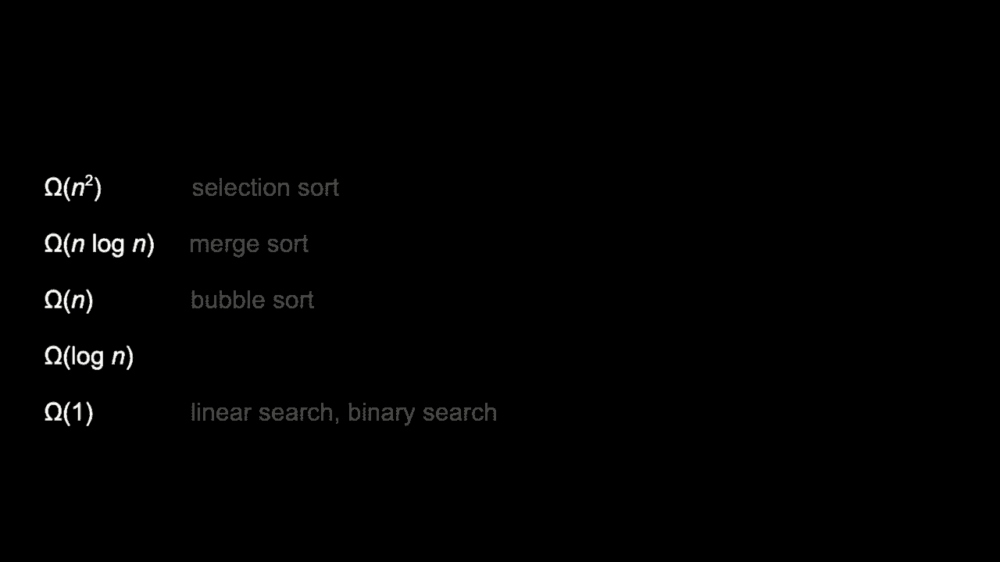

但老实说，随着 n 的增大，输入到你的排序算法中的数据，偶然间恰好已排序的概率是非常非常低的，因此在一般情况下，使用像归并排序这样的算法（其复杂度为 n log n）会更好。我们也可以通过我们的条形图直观地看到这一点，并注意到，就像布莱恩在分割时所做的。

并通过将问题一分为二，再合并这些部分，你可以在视觉上看到，实际上这里发生了很多事情，过一会儿，这一切看似神奇地运作，但你可以在淡紫色的条形图中看到这些部分。

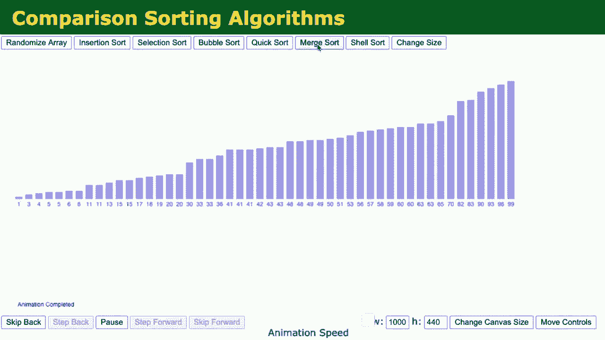

合并这些部分的可视化稍有不同。它没有三层存储的奢侈，只是从上到下移动。老实说，布莱恩在这里可以更优化一些。我们想清楚地说明总共需要多少，实际上他完全可以直接移动。

数字上下波动，确实这就是使用归并排序所付出的代价，尽管 n log n 优于 n 的平方，因此归并排序可以说优于选择排序和冒泡排序，你付出了代价，这表明我之前提到的权衡。几乎总是，当你在代码中做得更好，或者更智能地解决问题时。

你可能付出了代价，也许你作为人类编写代码时花费了更多时间，因为这更复杂，需要更多的技巧，这是一种成本，也许你需要使用更多的空间，暂时存放数字，以便在合并时来回移动，如果是三。

分开的数组或四个分开的数组，但根据归并排序的图形表示，只使用第二个数组就足够了。现在这可能看起来没什么大不了，但隐含地你需要两倍的空间，这在你有一百万个需要排序的东西时可能是个大问题，现在你需要两个数组。

这需要两百万块内存，可能这并不可行。因此，这里也会有权衡，可能选择排序或气泡排序速度更慢，但也许因为它在空间上更有效，具体取决于你关心什么，以及你想优化什么。

说实话，金钱有时是一个因素，在现实世界中，也许稍微多花点钱，购买两倍数量的服务器或两倍的计算机内存是更好的选择，这取决于资源的情况，时间、你的钱包或其他资源。因此我们会继续看到这些权衡，但也许最令人震惊的是，我们可以做到的事情。

在结束之前，我分享一些如何这些算法实际比较的可视化，最后一个术语是这个，最终的希腊符号 theta，结果证明，得益于选择排序，更具体的术语是这个 theta 符号。任何时候当一个算法具有相同的时间，你实际上可以用一个来描述它。

在 theta 符号中用一个句子而不是两个，因此因为选择排序在大 O 记号中是 n 的平方，同时也是 omega 的 n 的平方，你实际上可以简单地说，它在 theta 的 n 的平方中，无论是上界还是下界，归并排序也是如此，它在 theta 的 n log n 中，而我们不能为气泡排序使用 theta。

二分搜索或线性搜索因为它们有不同的上下界，但让我现在继续，准备一个最终演示，这次使用一些随机输入，你会看到这里有一个视频比较排序。所有三者都从随机数据开始，但让我们看看这对一个算法意味着什么。

在最坏情况下，算法是 n 的平方或接近 n log n。让我们以戏剧性的方式，现在比较选择排序、归并排序和气泡排序，选择排序在上面，气泡排序在下面，归并排序在中间，已经，[音乐]。完成，同时我们有一些非常时尚的音乐可以听，实际上只是为了让气氛更好。

让我们不要忽视在实践中，n 的平方是多么缓慢，注意这里没有多少条，这里也许只有一百条，像 n 是一百，这在我们谈论的世界中并不算大值，这些都是微不足道的大小，但天哪，我们仍在等待选择排序和气泡排序完成。

你会看到，运用更多的智慧，利用更高效的算法时，事情真的很重要，最后，选择排序已经完成。气泡排序仍在这里花费更长的时间，这将取决于运气。

但我认为很有说服力的是，归并排序在这种情况下赢了，让我们考虑一个更具体的例子。假设在最坏情况下，列表或数组最初完全相反，让我们考虑这些算法的功能，现在我们想从最小到最大，你仍然可以看到归并排序。

反复从这个问题中提取出一半的字节，然后重构解决方案，哇，这就是 n log n，即使只有这几条信息，你也可以真正看到冒泡排序中大元素的上浮，而选择排序中小元素的向左渗透，但我的天，我没有足够的词语来描述。

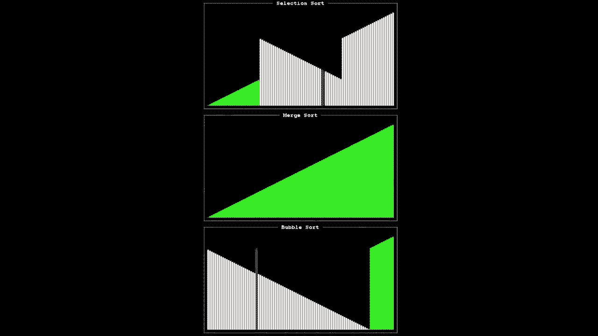

带我们到达终点线，尽管我们今天只看了两种搜索：线性和二进制，以及三种排序：选择、冒泡和归并排序，但还有很多其他的搜索，通常来说，在排序数据时，你并不会自己写代码，你可能会在课堂上或实验室中这样做。

但在现实世界中，你会发现其他人对常用功能的正确实现，以便你可以“站在他们的肩膀上”，真正关注你关心的问题，而不是这些已经被其他人解决的更常见的问题，只是给你一个瞥见。

我们将在这里中止冒泡排序，因为这会花费太多时间，这里有一个最终的可视化，这个更具声学性质的可视化也将声音与这些算法关联起来，所以如果你更能“听到”这些差异。

这是一种叫做插入排序的算法。

排序，再次在这种脉动中，你可以隐约听到冗余工作，冗余工作，冗余工作，这就是为什么 n² 在进行如此多的多余比较时会累加，这现在是选择排序，所以注意小元素最终位于左侧。

[音乐]。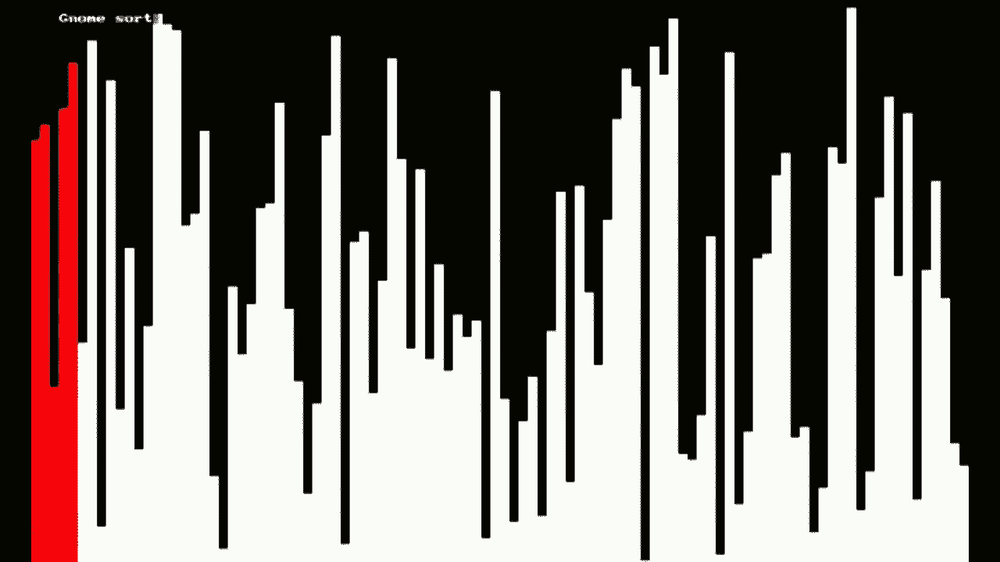

也许这就是最令人满意的部分。
