# 哈佛CS50-CS ｜ 计算机科学导论(2020·完整版) - P8：L4- IO、存储与内存管理 1 - ShowMeAI - BV1Hh411W7Up

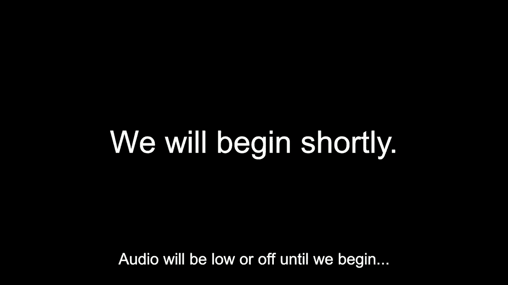

这是cs50。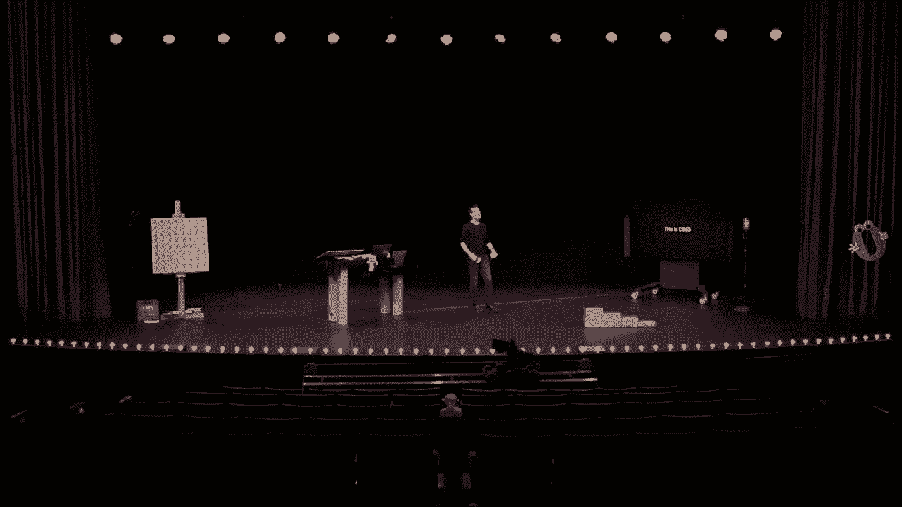

这是cs50，这是第四周，在过去的几周里，我们有了某种辅助轮，使用这种称为c的语言，而这些辅助轮的形式是cs50库，你当然通过选择和包含cs50.h在你的代码顶部来使用这个库，然后如果你考虑。

clang的工作原理你一直在链接，直到现在这已经为你自动化了。今天我们将从上周对机器的关注转移。我们现在使用的机器来更强有力地实现这些算法，随着我们开始去掉这些辅助轮，看看真正发生了什么。

在你的计算机的内部，尽管某些c语言的方面很复杂。编程可能对你来说是全新的，但你会意识到在内部并没有太多事情。我们需要理解，以便继续前进并开始解决更有趣、更复杂、也更有趣的问题，我们只需要几个，首先做这个。

通过重新学习如何计数，呃，比如说我们将称之为网格的东西。我们可以对你计算机内存中的所有字节进行编号，我们可以称之为字节编号0、1、2、3、4，一直到字节15，等等，但事实证明，在谈论计算机内存时，呃，计算机和计算机科学家以及十进制。

他们不会，他们绝对不倾向于，做一些叫做。十六进制的事情，十六进制是一个不同的基数系统，它不是使用10个数字或2个数字，而是使用16个，因此，当计算机科学家谈论计算机内存时，仍然会使用0、1、2、3、4、5、6、7、8、9，但在那之后，不是继续使用十进制到10。

通常，我们会开始使用字母表中的几个字母，以十六进制的方式计数。这个不同的基数系统基数16，你仍然从零开始计数。你计数到2和9，但当你到达10时，就转向a、b、c、d、e和f，这样的好处是。在十六进制中，hex表示16，总共有16个独立的数字0到9和。

现在是a到f，因此我们不需要引入第二个数字，只需计数到16。我们可以使用单个数字0到f，并且我们可以通过使用多个十六进制数字继续计数，但为了实现这一点，让我们引入这个词汇，所以在二进制中，当然我们使用零和一。呃，在十进制中，我们当然使用零，清楚地说我们将使用。

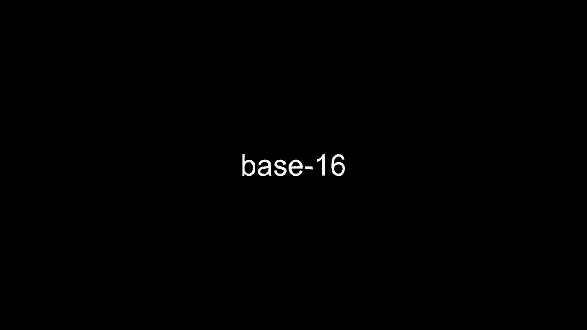

16，这只是我们使用的约定，通过f我们本可以使用任何其他六个符号，但这些是人类所选择的，因此十六进制的工作原理与我们熟悉的十进制系统非常相似，甚至对现在你所知道的二进制系统也相当熟悉，如下所示，让我们考虑一个使用的两位数值。

十六进制而不是十进制，也不是二进制。

就像在十进制世界中，我们使用了基数10，或者在二进制世界中我们使用了基数2，现在我们将使用基数16，因此十六进制就是16。这是16的第一，当然如果我们把它乘开。它只是个位列，现在是十六位列，因此如果你想以通常的方式数。

然后是零一零二零三零，四零五零六，*****，事情变得有趣了。现在你不去到一零，因为那是错误的，就像16一样，我们想要。在我们知道的数字9之后，我们现在再数到a，然而，就像在十进制系统中，当你数到99时，你必须开始进位，这里也是同样的情况，如果你想计数。

在f之后你进位，所以现在要表示一个大于f的值，不是10。在十六进制中是1 0。16乘1，给我们16，1乘0给我们0，当然那就是16。所以我们不再引入更多的基数系统，但让我声明。仅仅通过使用这些列，假设，你现在可以实现任何基数系统。

偶然的是在计算机的世界中，今天在内存的世界里，马上也会在文件中。能够识别和使用十六进制是非常常见的，实际上人类喜欢十六进制是有原因的。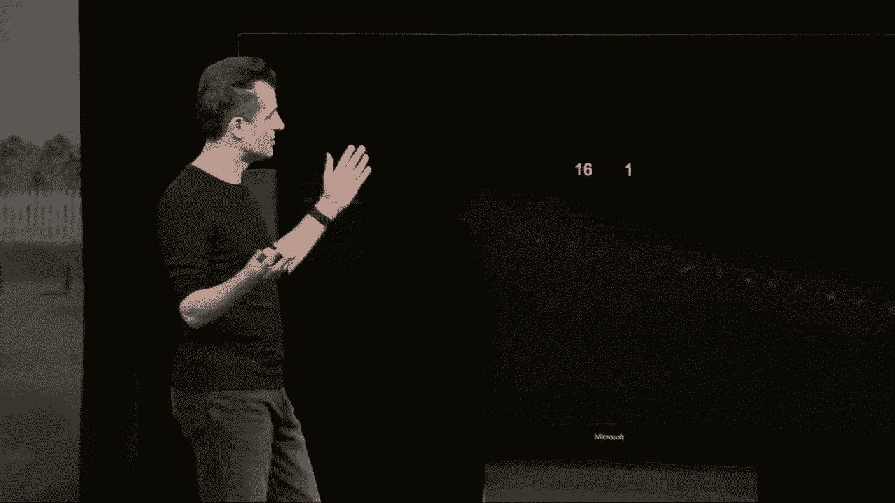

至少一些人类计算机科学家，如果我们数到这个情况下的ff，我们仍然会做同样的数学运算，即16乘15加上1乘15，当然。240加15或255，我做得很快，但这就是那种列。根据它里面的值，再次，每一个f都是数字，但回忆一下我们以前见过255。

当我们几周前讨论二进制时，255恰好是位。使用二进制，因此计算机科学家倾向于喜欢十六进制的原因是，你知道吗，在八位中实际上有两个对。如果我们稍微移动这些东西，结果是，表示。

16个可能的值，这是一个完美的系统，用来一次表示四个位。毕竟，如果你有四个位，每个位可以是零或一，那就是两次。两次两次两次两次可能的值，或者说16个总值。这就是说，在计算机的世界里，如果你想用四个位的单位来交流。

使用十六进制是非常方便的，因为一个十六进制数字恰好等于四个二进制零。一直到一一一一，这是人类的约定，因此由于这种便利性，现在一些人。实际上，回忆一下我们在零周的讨论，关于RGB，我们讨论了。

呃，使用一些红色、绿色和蓝色的组合来表示颜色。在我们使用这个例子的时候，我们把例子脱离了上下文。我们不是用hi作为一串文本，而是重新解读了72、73和33作为颜色序列，你想要多少红色，多少绿色，多少蓝色。

你想要的是完全可以的，十进制没问题，但计算机科学家们在颜色和内存的上下文中倾向于使用称为十六进制的东西，而这里的十六进制实际上只需将这些值从72、73、33转换为相应的十六进制表示，我们不会仅仅规定为484921。

在十六进制中，显然如果你瞥一眼这三个数字，很明显你并不能确定这些是十六进制数字还是十进制数字，因为它们使用相同的子集0到9。因此，计算机世界中的一个约定是，每当你表示十六进制数字时，使用0x，并且这没有数学意义。

这里的零或x只是一个前缀，用于让观众明确这些是十六进制数字，即使它们看起来像十进制数字。那么，我们要去哪里呢？那些曾经尝试制作自己网页并让其多彩的人。

对于那些艺术家们，如果你们使用过像photoshop这样的程序，那么你们很可能见过这些代码。事实上，这里有一些photoshop本身的截图。如果你在photoshop中点击一个颜色，弹出的窗口里，你可以将你在屏幕上绘制的颜色更改为任何颜色。

彩虹的颜色更加深奥，如果你看看下面，你可以看到这些十六进制代码，因为多年来，人类已经习惯使用十六进制来表示不同数量的红色、绿色和蓝色。所以如果你没有红色、没有绿色、没有蓝色，也就是表示为000000，那么这将给你我们所知道的颜色。

黑色可以说是任何波长光的缺失。如果你把所有的值改变一下，再说一遍，十六进制范围内是0到f，十进制范围是0到15，ff或fff就代表了大量的红色、绿色或蓝色，最终得到的颜色我们称之为白色。

现在你可以想象，结合不同数量的红色、绿色或蓝色。例如，在十六进制中，ff000是我们所知道的红色，绿色，最后00ff是我们所知道的蓝色，因为我们一直使用的系统确实是rgb系统。

在这里不是因为你必须以不同的方式思考，因为在第零周。但是你会开始在示例和程序中看到数字以十六进制出现，而不是被解释为十进制。因此，如果我们现在考虑我们电脑的内存，我们将开始这样思考。

完整的内存画布中，所有这些字节在我们电脑的内存中。作为可枚举的，比如零、一个、二，一直到f，如果我们继续计数，我们可以到`one zero`、`one one`、`one two`、`one three`、`one four`、`one nine`、`one a`、`one b`、`one c`、`one d`，依此类推，没关系，如果没有。

看这些东西时，十进制等值是什么并不明显。这没问题，这只是一种不同的思考方式，关于计算机内存中位置的表示，或者一种颜色的表示。好了，现在让我们用这个作为一个机会来考虑。

实际上，我们的电脑内存中存储的内容是什么？为了明确起见，我会给所有这些内存地址加上前缀0x，以表明我们现在正在讨论的内容。这里有一行简单的代码，脱离上下文，我们实际上需要把它放在`main`或者其他程序中才能做任何事情。

但我们之前见过很多次，例如，它的类型，然后甚至可能给它赋值。那么实际上存储在我们电脑内存中的是什么呢？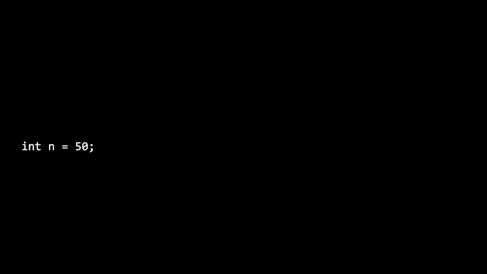

在我们的电脑中，好的，让我们继续把这个东西在一个实际程序中实现，让我创建一个叫做`address.c`的文件，因为我想开始实验。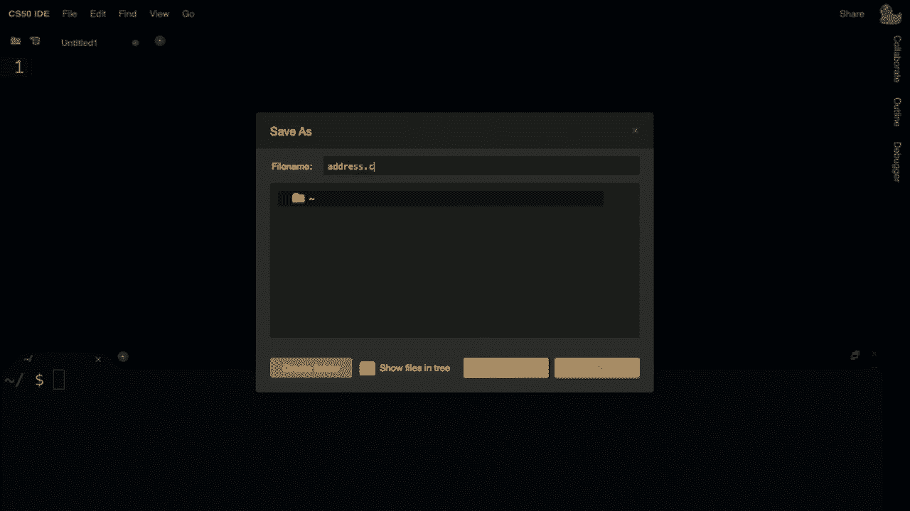

内存，我将继续包含`stdio.h`，我将给自己定义`int main void`，在这里我将定义一个变量，`int n equals 50`，然后我将打印出`n`的值，因此没什么有趣的内容，没什么太复杂的。我将继续创建地址，然后我将继续执行。

第一周，我们希望能看到数字50。但今天我们将为你提供一些更多的工具，以便你可以开始探查电脑的内存。不过首先，让我们考虑这一行代码在电脑硬件的背景下。因此，如果你正在写一个包含这一行代码的程序，`n`需要在你的。

将某个内容放在你电脑的内存中，因此如果我们再次考虑这是我们电脑内存的一部分，几个变量被故意画成四个字节，四个方块，因为记住一个整数通常在`cs50 ide`和现代系统上，往往是四个字节，所以我确保。

让它填充四个完整的方框，那么值可能是50，这实际上存储在那里。事实证明，在你的电脑内存中，还有这些隐含存在的地址。因此，即使是的，我们可以根据我在代码中给它的变量名来引用这个变量`n`，这变量肯定存在于一个。

内存中的特定位置我不知道它具体在哪里，但让我假设也许它在位置0x12345678。这只是一个任意地址，我实际上不知道它在哪里，但它确实有一个地址，因为这些方框代表逻辑和。

也许50最终位于内存地址，这个有趣的是，完全没有双关的意思。所以让我去ah**d并修改这个程序，引入一些新的语法，让我们能够开始探索计算机内存的内部，这样我们就可以真正看到下面发生了什么。因此，我将要这样做，取而代之的是，我将去ah**d并说，值n，当然是50。让我看看。

出于好奇，n的实际地址是什么？要做到这一点。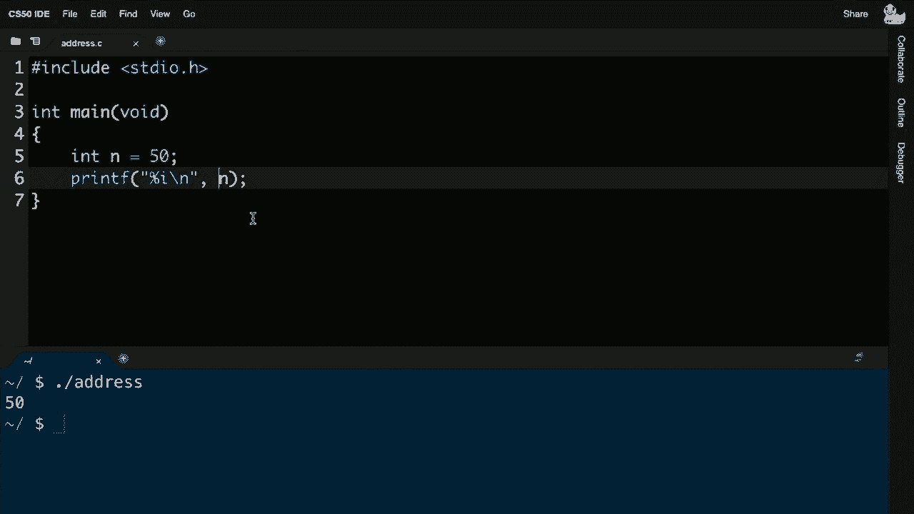

今天我们将介绍一条新的语法，它就是这里的这个。今天C语言中有两个新的运算符，第一个是&符号，它的作用是。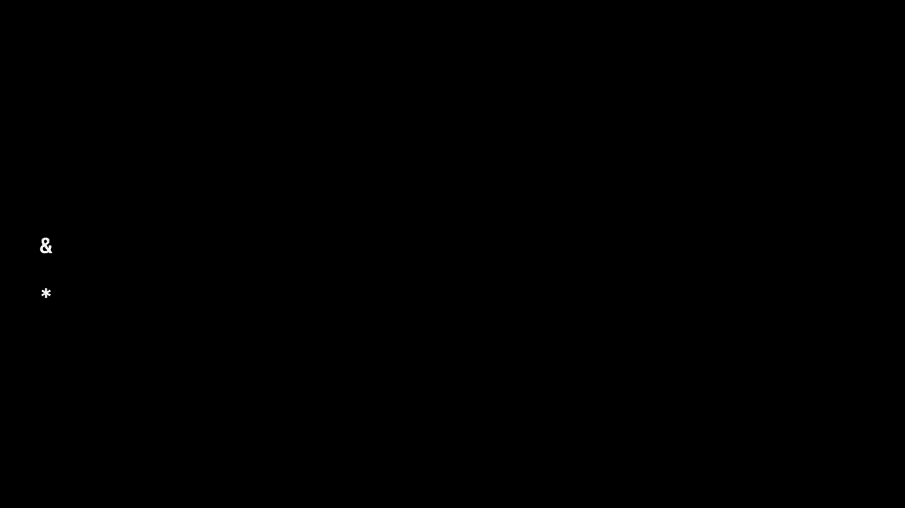

记得几周前我们看到了表达式。你使用两个&符号，不幸的是，单独的&符号今天会意味着不同的东西，具体来说这个&符号将成为我们的地址运算符，只需在任何变量名之前加上前缀。

使用&符号，我们可以告诉C，请告诉我这个变量存储在什么地址，以及这个星号在今天的上下文中还有另一层含义。当你使用这个星号时，你实际上可以告诉你的程序去查看特定内存地址的内容，因此&符号告诉你什么是地址。

变量是星号运算符，运算符意味着去到下一个地址。因此，它们是一种反向操作，一个是确定地址，这里是我的程序中的n，n的&符号是n的地址。那么我如何打印出地址呢？这只是一个数字，但实际上printf支持不同的格式。

地址的格式代码，你可以使用%p，出于我们将要看到的原因，这表示打印出这个变量的地址，因此我要去ah**d并创建地址。经过仅仅对这个文件做两处修改，一切似乎都能正常编译。现在我要去ah**d并运行地址程序，变量fd80792f7c。

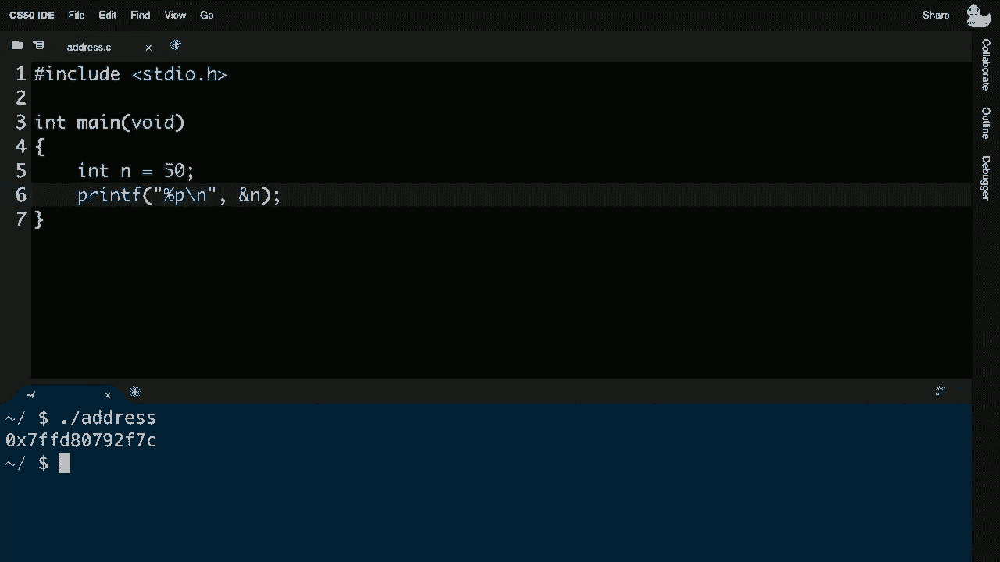

fd80792f7c，现在这有用吗？在实践中并不一定，我们将通过利用这些地址使其变得有用，但具体地址并不重要。我瞥了一眼这个数字，我不知道这个数字在十进制中是什么，我需要做一些数学运算，或者坦率地说，直接去谷歌找个转换器来帮我。

所以再次强调，这并不是有趣的部分，事实上这是十六进制，且再一次。我们并不一定想要这样做，但为了清楚起见，这些运算符之一&符号获取地址，而星号运算符。

访问一个地址，我们实际上可以撤销这些东西的影响，例如，如果我现在打印出，不是&n，而只是出于好奇的*星号&n*，我可以在某种程度上撤销这个&n的效果。它会告诉我n的地址，而*星号&n*会告诉我去那个地址。

这有点无意义的练习，因为如果我只想要*began*中的内容。但再说一次，作为一种智力练习，如果我用地址运算符给n加上前缀，然后使用星号，去那个地址，这和直接打印n本身是完全一样的。所以，整数，不是%p，让我去做**d**并现在获取地址。

编译似乎没问题并运行地址，瞧，我们回到了50。开始感受到。意识到这些运算符在一天结束时是相对简单的，如果你理解一个只是撤销构建的，你可以用它们构建一些相当有趣的程序，我们将通过利用一种特殊类型的变量来做到这一点。

被称为指针的变量，p在%p中，指针是一个变量，它包含某个其他值的地址。我们之前见过整数，见过浮点数、字符和字符串及其他类型，现在指针只是另一种变量。你可以有指向整数的指针，指向字符的指针。

指向布尔值或任何其他数据类型的指针，指针引用的是它实际所指向值的特定类型。因此，让我们更具体地看看，让我回到我的程序这里，并引入另一个变量，而不是立即打印出像n这样的东西，呃，让我去做**d**并引入第二个。

变量是类型为*int star*，我承认这可能是我们在C语言中见到的最混乱的语法。因为天哪，星号现在被用作乘法运算符。这个设计决定可以说不是最好的选择，但几十年前做出的决定就是这样。所以，这就是我们所拥有的，但是如果我现在做*n star p*等于&n，那么我可以在这里做些什么。

打印出n的地址，通过暂时将其存储在一个变量中，因此我现在还没有做任何新的事情。我在第5行仍然声明一个名为n的整数，第6行是我引入了一种新的变量类型，这种变量被称为指针。指针就是存储地址的变量。

声明一个指向整数的指针实际上是说，int，因为这是你要指向的类型，星号，然后是你想要创建的变量名，我可以称之为*succinct*。再次，在等号右侧是与n地址相同的运算符。它只是&n，因此我们可以将这个地址存储在某个地方，以便在较长的时间内使用。

现在我暂时在第六行存储，那个地址在一个新变量中。叫做p，其类型是技术上说，因此说int p = &n是不正确的，实际上我们的编译器clang不会接受，它很可能不会让你编译代码。因此我会用`*p`来明确我知道自己在做什么。

我正在存储一个整数的地址，不，保存这个重新编译的地址。注意我更改了一行代码，之前我返回到`%p`。打印一个指向地址的指针，我正在打印p的值，而不再是n的值。那是神秘的地址，这些地址，反映了发生了什么。

在你的程序或系统的其他地方，这些地址每次可能会不同。这是可以预期的，不是值得依赖的，但这显然是某个随机的神秘地址，类似于我任意的`0x12345678`。但是现在让我们撤销这个操作，以便我们可以完整地结束。

在这里圈出，让我现在提出如何打印n的值，让我请到，第7行。不再打印n的地址，而是使用p打印n本身。我将去改成`d`并更改，我的简写符号显然就是打印n。但是假设我不想在这个练习中打印n，我现在该如何打印这个值。

在n中通过p来引用它，我应该字面上输入什么作为printf的第二个参数，来以某种方式打印n的值。这里有什么想法，我该如何打印出来，布赖恩，勇敢的志愿者，嗯，让我们请乔舒亚。 我相信如果你在p之前使用&符号，我相信如果你在p之前使用&符号。

你可能会没问题地使用& p，让我去尝试一下，让我们尝试& p。打印这个值，所以& p，我将保存文件，但似乎并不是这样。注意我得到了一个错误，它有点晦涩。格式指定类型int，但参数类型是`int **`，关于这一点以后再说，所以要注意。

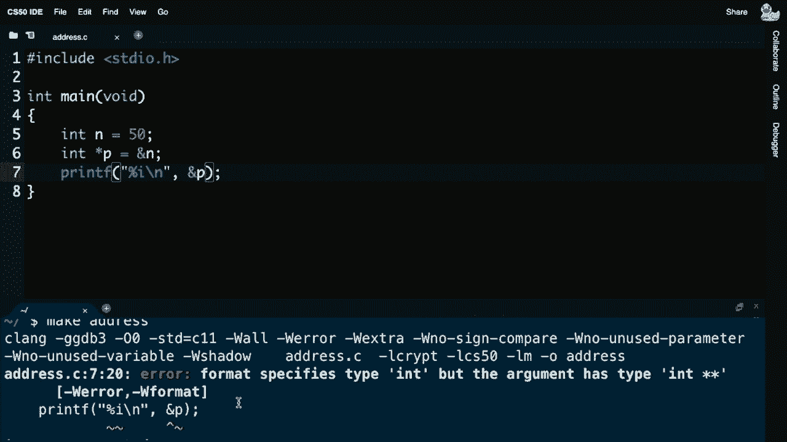

还有一个建议，因为，某些东西，但是p已经是一个地址了，所以乔舒亚。你技术上提议的是，给我地址的地址。那不是我们想走的方向，我们想去看那个地址里的内容。是的，所以我有一点困难听到， 是的，所以我有一点困难听到。

但是我认为如果我们使用不是&运算符而是*运算符，那确实会去获取p中的值。如果p中的值是一个地址，我想让我们尝试一下，编译地址，是的，让它编译通过。现在如果我执行`./address`，希望我能确实看到数字50。

所以再说一次，到头来我们似乎并没有取得任何根本性的进展，我仍然只是打印出 n 的值，但我们引入了这个新的原语。这块新的拼图，如果你愿意的话，允许你以编程方式找出计算机内存中某个东西的地址，并实际上到达那个地址。

我们很快也会看到它，但让我们回到一个图形表示，并考虑一下我们在这段代码的上下文中刚刚做了什么。所以在我的 main 中，真正有趣的两行代码就是这两行，首先在我们进行 Sophia 的编辑之前，实际上对 p 解引用并打印出来。

printf，但让我们暂时考虑一下，这些值在计算机内存中看起来是什么样的。语法有点神秘，因为我们现在有一个星号和一个和号，但这只是意味着现在我们可以访问计算机的内存。因此，例如，这里是我计算机内存的一个网格，也许。

例如，50 和 n 最终在下方，它们可以出现在任何地方，甚至在这里的屏幕上都没有显示，它们出现在计算机的内存中。到目前为止，为我们的目的而言，但它技术上确实存在于一个地址中。让我简化这个地址，以便更快地表达，现在这个 50 存储在变量 n 中。

也许它确实存在于地址 ox123，我不知道它在哪里，但我们已经明确看到它可以存在于，p。p 技术上是一个变量。它是一个存储其他东西地址的变量，但它仍然是一个变量，这意味着当你声明 p 时，占用了屏幕上的一些内存字节。

所以让我继续提议，现在 p 被故意画得更长。我这次消耗了总共八个字节，因为在现代计算机系统中，包括 CS50 IDE，指针往往占用八个字节，所以不是一个，也不是四个，而是八个字节，因此我只是将它画得更大。那么在变量 p 中实际存储了什么呢？

结果发现，它只是存储某个值的地址。所以如果整数 n 本身存储了 50，并且位于位置 ox123，而指针 p 被分配到那个地址，这就像是在说，存储在变量 p 中的实际上只是一个以十六进制表示的数字。

ox123，因此在计算机内存中就发生了这些事情，这两行代码没有什么根本性的变化，除了我们引入了一种新的语法来显式地引用这些地址。这里是 n，这里是 p，而 p 的值恰好是。

一个地址，我一直在说，这些地址有点神秘。它们有点任意，而且老实说，通常不会让人感到启发。作为一个人，知道这个整数 n 实际上处于哪个地址，谁在乎它是在 ox123 还是 ox456。通常我们并不关心，因此计算机内存往往不会在这么低的层面上进行交流。

具体数字的细节，相反，它们往往简化了画面，抽象掉了所有其他内存，这实际上与讨论无关。因此我就说，你知道的，我知道 p 存储着一个地址，而那个地址恰好是下面的 50，但我在日常生活中并不关心。

编程生活中，这些具体的地址是什么，所以你知道的。我们就把它抽象成一个箭头，再一次，抽象就是简化低层次的理解，但你不一定需要持续思考这个层面，所以我们不妨以图形方式绘制一个指针，指向某个值和。

不管实际地址是什么，所以在约定中确实如此。乍一看，我们可能会在日常生活中使用这些相同的机制，例如如果你在街上、家里，或哈佛科学楼的地下室有一个邮箱。

在校园中心，或者在校园内，它可能看起来像这样，至少更像是住宅。如果这个邮箱代表故事中的 p，它存储的是一个指针，也就是某个其他事物的地址。如果街上有很多其他的邮箱，我们可以随意放入任何东西。

这些邮箱里我们可以放明信片、信件、包裹，就像在现实世界中一样。我们能否在虚拟中做同样的事？我可以存储字符、整数或其他东西，包括地址。例如，布莱恩，我想你在别处有自己的邮箱，当然布莱恩也有一个邮箱，其本身有一个唯一的地址。

那么布莱恩，实际上你街上邮箱的唯一地址是什么？是的，这里是我的邮箱，上面标有 n，它的地址在这里。我的邮箱的地址似乎是 ox123，是的，所以我的邮箱 2 也有一个地址。坦白说，我并不在乎，所以我甚至没把它写上。

这里的邮箱，如果我的邮箱代表 p，一个指针，而布莱恩的邮箱代表整数 n。那么这应该意味着，如果我查看我的指针的内容，看到值是 ox123，那就是我的线索，一种面包屑，让我去查看布莱恩的邮箱，布莱恩，如果你不介意为我们做这件事。

那么在那个地址你有什么？如果我在地址 ox123 的邮箱里查看，我里面有数字 50。确实是这样，所以在这种情况下，它恰好存储的是，我们通常并不关心这些具体地址，一旦你理解了隐喻，我们可以将邮箱视为存储一个值，这就像是指向。

在布莱恩的邮箱那里，有某种间接性，以箭头图形化表示。这里有一个傻乎乎的泡沫手指，或者如果你愿意，可以是一个泡沫耶鲁手指，指向布莱恩的邮箱，就像是一种面包屑，引导我们去找屏幕上的某个其他值。因此，当我们今天以及今后谈论地址时。

这就是我们所谈论的内容，我们人类，地址已经存在了数百万年，以独特地识别我们的住所或商家，计算机在内存中做的事情是完全相同的。所以让我在这里暂停，看看是否有关于存储地址的指针变量的任何问题，或者关于新的操作符，比如&符号或星号。

从今天起，它有了新的意义，有关指针的任何问题或困惑吗？现在我将慢慢回到这里，没什么，好的，看到没有。好吧，让我们考虑一下这个相同的故事在数据类型中，但是考虑到我们花了很多时间在字符串上。

嗯，使用它们进行加密并解决实现选举算法，使用用户输入。所以让我们考虑一种根本不同的数据类型，它存储的不是单个整数，而是文本字符串。对于字符串，你可能有一行代码看起来像这样：`string s = "HI";`（全大写）。

带有感叹号的内容可能会让你看到目前为止，实际上发生在计算机内部的事情，它最终落在你的计算机的某个地方，上周是反斜杠零，或者两周前是反斜杠零，结束于那段字符串，但让我们仔细看看发生了什么。在这个引擎盖下，从技术上讲，我可以访问。

我们在第二周看到的那些个别字符，使用括号表示法，例如s[0]，s[1]，s[2]和s[3]。我们使用方括号表示法将字符串视为数组，实际上，它们也可以通过其地址进行操作。例如，也许这个完全相同的字符串“嗨”是。

存储在内存地址ox123处，然后是ox124、ox125和ox126。注意，它们是故意连续的地址，前后相连，并且相距仅一个字节，因为这些字符在C语言中当然每个只占一个字节。所以这些数字并不重要，但它们彼此之间相距一个字节。

这很重要，因为这就是字符串的定义，实际上是一个回溯。那么，s究竟是什么？s是我给它的变量名，我是s。等于量子引用“嗨”，那么s是什么呢？s是一个变量，它必须存储在计算机的内存中。假设s确实是“嗨”，它恰好存在于，想象一下s，字符串。

但在更低的层面上，它只是字符串的地址，更具体地说，让我们开始将字符串视为技术上仅仅是一个地址。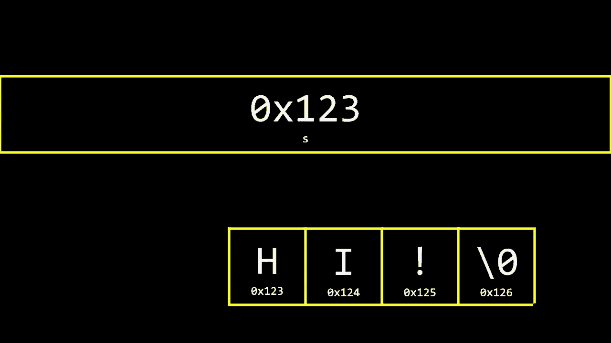

字符串中的第一个字符，你可能会想到这可能会给你提供第一个字符。你将如何记住这一点，等一下，这个字符串不仅在ox123处，还在ox124、ox125等处继续。但让我暂停并询问在场的各位计算机和程序员们，想想字符串的定义。

第一个字节的地址，为什么这就足够了，无论字符串多长，即使是整段文本，为什么把字符串视为等同于第一个字节的地址是非常聪明的？嗯，是的，我听得见你吗？是的，我们能听到你。

好吧，可能是因为每当我们定义任何字符串时，它都会是`g，i，n`和`i`的组合。因此，如果某个东西指向我名字的第一个字符，那就足够了。这样我就可以跟踪第一个字符，然后获取所有的内容。

在字符之后完美，所以所有这些基本定义我们都一起拥有。如果字符串只是字符数组，根据数组的定义，两个星期前每个字符串都以这个传统的反斜杠零或空字符结尾。当考虑字符串时，你需要做的就是开始，因为你可以使用`for`循环或一个。

使用`while`循环或其他启发式方法，带有条件和布尔表达式，以确定字符串的结束长度。也就是说，暂时让我们将字符串简单地视为在字符串中的内容。如果我们将其视为事实，那我们现在就可以**开始**进行实验了。

这个程序不使用整数，而是使用字符串。使用这个基本原语，让我去**删除**之前在`address.c`中写的代码。让我只需将其更改为字符串，等于“高”。分号，并注意我并没有手动输入任何反斜杠零。

当你关闭引号时，C会自动为我们处理这个，编译器会为你添加那个反斜杠零。现在我将继续下一个`s\n，s`，如果我想打印出那个字符串，现在这个程序根本不写成。好吧，是的，这很有趣，因为我**搞砸了**，所以有五个错误。

写了七行代码和五个错误，让我们看看发生了什么。像往常一样，总是回到顶部，因为很可能有一些混淆的级联效果。我看到的第一个错误是使用未声明的标识符`string`，我是否意味着`standard n`？我并不意味着标准的`n`，而是`string string string`，所以我可以让我的朋友在这里运行帮助50。

但老实说，我经常犯这个错误，我现在有点知道我忘了包含`cs50.h`。实际上，如果我现在这样做并重新编译`make address`，所有五个错误都只通过这个简单的更改消失了。如果我现在运行`address`，它会简单地说“嗨”，但现在让我们开始考虑一下。

在这个程序的底层运行着，假设我很好奇，想要打印出这个字符串实际所在的地址。那么，结果是，让我聪明一点，打印出不是格式代码的`%s`，而是`%p`，给我显示这个字符串作为地址。让我去**重新编译**并制作地址。

看起来编译得不错，让我运行，打印 s，尽管它是一个指针，有趣的是，这并不和之前相同，但这又是合理的，因为内存地址。并不总是会相同，但，这无所谓。虽然这有点有趣，所有这些时间，每当你在使用字符串。

如果你只是把你的 %s 改成一个，内存，那字符串实际上开始的地方，它在功能上对我们来说还没有用，但它一直在那里。让我继续，现在做以下操作，假设我变得有点好奇。再进一步，我做 printf，让我继续，打印出另一个地址。

后面跟着一个换行符，让我继续，打印出，第一个字符的地址。所以再次，这有点奇怪，我们通常不会这样做，这些操作符。给我们很简单的问题答案，比如这个东西的地址是什么，表示。零索引意味着，s[0] 是第一个，s[1] 是第二个。如果我玩弄一下。

今天的新操作符这个符号，第二个，字符，实际上让我继续，**前进**。并且更明确，括号零，并在这里放一个符号，让我继续。前进，现在让这个程序生成，地址，好吧，有点奇怪哦，我刚刚错过了一个；分号，所以在这里很容易修复，让我继续，**前进**并用 make 重新编译。

地址让我继续，**前进**并运行 ./address，嗯，有趣，哦，也许对我来说有趣。所以你现在看到两个地址，第一个是 0x4006。一个四，显然是 s 中第一个字符的地址。但是请注意下一个地址的奇怪之处，它几乎是相同的。

除非字节相距一个进一步，我敢打赌，如果我这样做，不仅是 h 和 i，还有感叹号，让我再做一行几乎，完全相同的代码。只是为了表明，所有这些，时间确实是这样。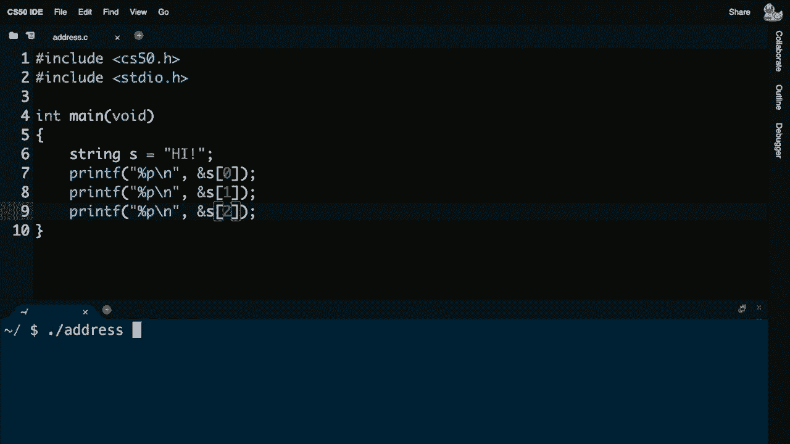

字符串中的所有字符都是紧挨着的，现在你可以在代码中看到。b4、b5、b6 之间仅相差一个字节，所以我们现在看到一些视觉确认，字符串确实在内存中就是这样布局的。再说一次，这不是一个非常有用的程序练习，像查看个别字符的地址，但。

再次强调，这只是为了强调，在底层，一些相对简单的操作正通过这个新的符号和反之，通过星号操作符来启用。所以让我们考虑一下这个内存，低层次的，是的 s 技术上是一个地址，是的，它技术上是第一个字节的地址，在实际计算机中看起来。

不同，但在我的幻灯片中，我只是，任意提出它在，0x123、0x124、0x125。但再次让我们不在乎那个，细节层面，让我们只是挥手，抽象掉这些地址，并且现在开始思考，s 作为一个字符串，技术上只是一个，指针。结果是。

尽管将字符串视为显然是字符序列非常有用且常见，而这从第一周就已经成立。你也可以将它们视为数组，紧挨着的字符序列。结果是，从今天开始，你也可以将它们视为指针。

字符在计算机内存中的某个地址，正如 guinea 指出。因为字符串中的所有字符根据定义是紧挨着的，并且所有字符串根据定义都以反斜杠零结束，这实际上是知道所有字符串的最小和唯一信息，只需记住。

第一个字符到结束的地址，记住这个反斜杠零实际上只是八个零位，其他形式表示为反斜杠零。因此，我们当然可以有一个条件，就像两周前的字符串一样。所以当我说我们正在去掉一些辅助工具时，它们就来了，所以到现在为止，我们已经……

我们一直在使用 cs50 库，它方便地为我们提供了像 forth 这样的函数。但这段时间 cs50 库，特别是文件 cs50.h，实际上有些教学上的简化。回想上周，你可以定义你自己的自定义数据类型。结果发现，这段时间我们一直声称字符串存在。

在你的程序中，你可以使用这些，字符串确实存在于 C 中，也存在于 Python、JavaScript、Java 和 C++ 等许多其他语言中，这不是 cs50 的术语。但字符串在 C 中技术上并不存在作为数据类型，它实际上更隐晦。

更低级的被称为 char star，char star 这是什么意思呢？好吧，char star 就像几分钟前的 int star，表示字符的地址。再次说，如果你同意我现在可以将字符串视为字符序列，或者更具体地说，是字符数组。

更具体地说，从今天开始，就是第一个字符的地址。因此，实际上我们现在可以将这种新的术语“指针”应用到我们熟悉的字符串上，你将为 char star 而感到高兴，而在 cs50 的代码中，简化或抽象掉 char star，实际上没有人想要这样。

想想或者在课程的第一周挣扎，别说前两三周了。课程中这是一个简化的自定义数据类型，我们称之为字符串，以便你不必思考这是什么星号地址，但今天我们可以去掉这些辅助工具，揭示出这些年来，你一直在操作字符。

在特定地址，我们之前使用过这种技术，抽象掉这些低级细节。例如，回想上周我们介绍了结构体这个概念，作为数据类型，你可以通过将名字和数字包裹在自定义数据类型中来定制它。

在我们称之为“person”的结构中，每个人都包含一个名字和一个数字，通过 C 的 typedef 特性，我们可以定义一个新的类型，而这个类型的名称上周刚好是“person”，所以我们已经在使用它。

C 类中的一行代码实际上看起来像这样。这确实是 cs50.h 中的一行代码。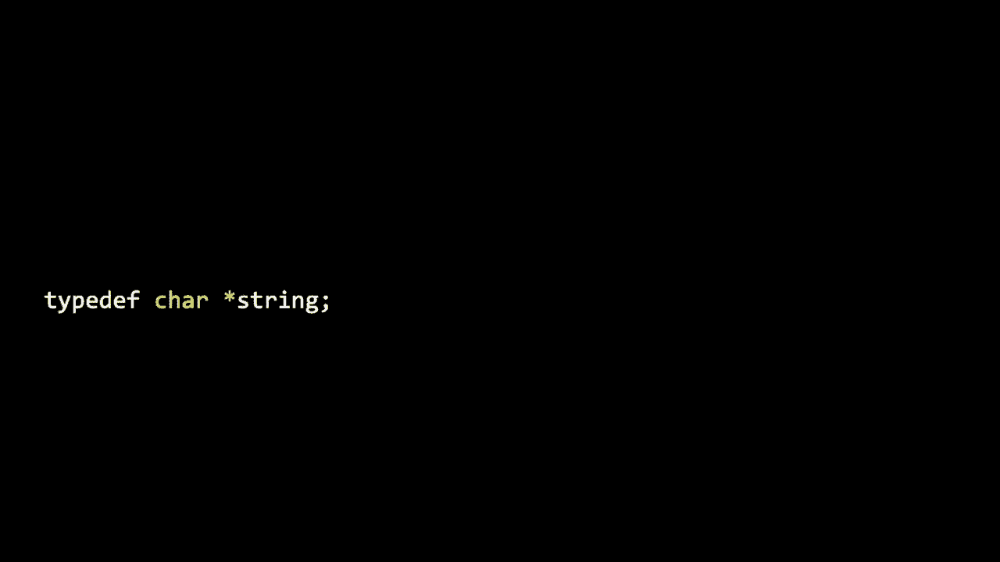

它显示 typedef，意味着给我一个自定义类型，并创建一个名为 string 的 char star 的同义词，这是一种隐藏 funky char star 的方式，特别是隐藏星号，这在最初的几天里玩起来并不有趣，但没有改变字符串的定义。

字符串在 C 中存在，通过这种定义使它存在。好了，让我暂停一下，看看字符串，或者说这些新的思维方式，有没有关于字符串或 char 的问题，我知道这很多，算是比较底层的，有没有问题？好吧，如果没有问题。

为什么我们不先休息五分钟，然后再回来，再看看我们现在能做什么。好了，我们回来了，现在我们有能力和代码获取某个变量的地址，也可以去到相应的位置，我们考虑字符串时并不需要。

只有连续的字符序列，但现在还有实际地址，第一个字符的地址，然后我们能否程序化地找到结尾，多亏了那个空字符，但事实证明我们可以用这些地址或指针做另一件事，那就是指针运算，因此任何事情都是*****。

数学不会复杂，但对我们来说会很强大，所以我将返回到我最新的 address.c 状态。现在让我再次重申，我们可以像第二周那样打印字符串中的单个字符，使用我们的方括号。

我正在清除所有那些地址的证据，暂时不需要。我将这个程序重新编译为 make address，然后我将运行 dot slash address。现在我看到 h 感叹号每行一个字符，但现在考虑一下，实际上不需要字符串数据类型，事实上我们可以去掉这个辅助工具。

尽管一开始可能会感到有点不舒服，如果我完全删除这一行，反正我有时会意外省略。其实我不需要不断地口头称呼这些东西，我可以把它们视为字符串，因为字符串在许多不同的编程语言中都是一个东西，但在 C 中默认情况下并不存在。

存在一种类型，名为 `char star`，但再说一遍，这意味着的是某物。`char` 意味着这是一个字符的地址，所以 `char star` 将指向一个字符，因此如果 `s` 是这个，我实际上可以以相同的方式对待它，没有理由我不能继续使用 `s` 像在第二周那样，使用我们的方括号表示法。

我可以继续打印出嗨，感叹号，但还有另一种方式可以做到这一点，如果我现在知道 `s` 其实只是一个地址。我可以去掉这个方括号表示法，实际上可以只做 `star s`，因为要记住 `star` 除了是新符号外。

我们在这里声明指针时使用，确实，我们用它来访问一个地址，所以如果 `s` 存储了一个地址，按照指针的定义，我之前的图像似乎是这样的。

`s` 很可能是一个地址，起始于类似 `0x123` 的地方，它并不会。

在我的实际 IDE 中，它将是计算机所拥有的，完全相同的想法，所以让我继续走到 `star s`，为了好玩，让我只保留这一行。让我继续并重新运行这个作为 `make address`，好的，现在点 `/address`，我希望能看到一个大写的，`s`，字符串在技术上只是一个地址。

我现在实际上可以在上面进行数学运算，我可以向前走，打印出另一个字符，后面跟着一个换行符，我可以去 `s` 加 `1`，所以我可以在那个指针上进行一些非常简单的算术。让我继续向前，重新编译这个，所以啊，地址，我应该能看到。

嗨，如果我再多写一行代码，比如这个 `printf`，百分号 `c`，反斜杠 `n`，星号 `s`。加上 `2`，我现在可以去到距离 `s` 两个字节的字符，这又是。重打印，带有感叹号的高位，这个花哨的。

方括号表示法在某种意义上只是一种花哨的说法。我实际上是在操控 `s` 的真实含义，它只是一个地址，而在此之前。这个方括号表示法并没有任何根本上与这些星号和地址不同的东西，它只是做得更用户友好。

我个人还是更喜欢第二周的方括号表示法，但这其实是一样的。你自己，所以 `c` 只是给我们提供了这个方便的特性，使用方括号，为你处理所有这些所谓的指针运算，但再说一遍。我们深入探讨这个低层次，仅仅是为了强调究竟发生了什么，终究在底层。

好的，让我在这里暂停，看看是否有任何问题。我看到有个问题问，如果你尝试打印 `star s` 加 `3` 会发生什么？好问题，如果我尝试打印 `star s` 加 `3`。我直观地认为这将是换行符，抱歉，空字符。

结束字符串，但让我们看看。

我们可以确认，让我继续并打印出星号，因为我知道重置，所以我很确定这会打印出空值，像这样，**%c\n**，星号，冒险点去查看一些我也许不该看的东西，因为那是底层实现的细节，但让我们看看会发生什么。

编译没问题，**./address**，看起来是空的，可能是空字符。老实说，它并不应该是一个可打印字符，而是表示字符串结束的特殊哨兵值，但我可以这么做。我知道从第二周开始，字符是整数，而整数也是字符，如果我。

我希望以那种方式思考它们，所以让我只改动最后的**i**，然后运行。地址，然后出现了“嗨！”的感叹号，所有的位都是零。多亏了百分比**i**，我现在可以变得非常疯狂，为什么我们不继续并打印出来呢？不仅仅是这个序列之后的字符“嗨！”的感叹号和空字符。

我们去看看，真的深入我的地址，好吧，那里没什么。距离**10,000字节**的地方让我继续，做地址，让我继续运行这个。你可能是少数几个见过这个错误的人之一。因为触碰了不该触碰的内存，我们将故意考虑。

今天出现了一个分段错误，代码某处出了问题，内存出现了不应有的情况，而我根本不该去看。距离我知道属于这个字符串的内存大约**10,000字节**，就像是在随意查看你电脑的内存，这显然不是一个好的做法。

这是个好主意，但稍后再谈，所以现在我们考虑一下这些底层实现的实现细节，并回顾一下上周我们为什么以这种方式做某些事情，实际上在过去的几周中。字符串只是一个**char***，让我们现在考虑一个例子，让我缩小视野。

在我的内存上，让我能一次性塞入更多内容，我们考虑一个例子。假设我想写一个程序来比较两个字符串，让我在一个新文件中写点新代码，暂且称之为**compare.c**。我这个程序的目标很简单，就是打印内容，或者说比较。

两个用户可能输入的字符串，我将继续并包含**cs50.h**。并不是因为我想要字符串本身，而是因为我想用**getstring**，只是为了方便，不过我们稍后会把这个辅助工具去掉。在这个程序中，我将先不使用**getstring**。

让我继续保持简单，先从**get int**开始，我会询问用户一个变量**i**。让我再做一个这样的，**get int**并询问用户一个值，简单地说如果**i**输出。否则让我继续并打印出不同，所以这有点像第一周的内容，我使用了一些分支，并使用**printf**进行打印。

打印出这两个变量i和j是否相同，运行比较，让我给它数字1和2，确实它们是不同的，让我再给它1和1，它们是相同的，所以我认为逻辑上，uh，通过例子证明，这个程序看起来是正确的，但让我迅速让它看起来似乎。

不正确，因为没有使用，取而代之，让我**给自己**一个字符串，不再是“wheel”。我们就写“char star s = get string of s”，但即使我称之为“char star”，它仍然是一个字符串，就像几周前一样，让我再给自己一个叫“t”的字符串，uh，t会得到那个值，让我很天真，但也算合理地说，如果s。

“equals equals t”，让我们**继续**打印出相同，其他情况则打印出不同，所以相同的代码，只是数据类型不同，使用“get string”而不是“get int”。让我继续，比较似乎编译正常，点，斜杠比较，让我继续，输入“uh hi”，哎呀，“hi”，让我继续再输入一次“hi”，瞧。

不同，嗯，我忘了我的反斜杠，出问题了，让我重新编译，进行比较，现在让我再运行一次，怎么样，我们来个快速测试，“david”和“brian”，这些肯定是可行的，怎么样，“david”也不同，嗯，让我再试一次，“brian”，“brian”也不同，但我很确定这些字符串是一样的。

为什么这个程序可能有缺陷，问题是什么，这里有什么问题，有什么想法？关于这里的问题，有什么想法？关于相机或者“brian”，如果你想把一些想法口头表达出来，任何关于为什么“david”和“david”是高和高不同的想法，聊天室里有几个人说我们实际上没有。

比较字符，我们在比较地址，是的，这就是今天关于字符串真正定义的逻辑结论，如果字符串仅仅是它第一个字符的地址，那么如果你真的在做“s equals”，地址，可能会是不同的，即使我输入的是一样的。

每次我们调用“get int”或“get string”时，用户的输入都会被放到我计算机的内存中，但我们现在确实有工具，可以回答这个问题，验证这个答案，让我继续，简化这个程序，快速检查一下，打印出s，让我们继续打印出t。

嗯，使用换行符让我们可以清楚地看到字符串，让我再**做一次**，让我们比较一下，好的，编译正常，点，斜杠比较，让我输入“hi”。“hi”，它们看起来是一样的，但请记住，现在我有了另一种格式代码，这样我就可以开始把字符串当作它们**技术上**是的地址来处理。

所以让我把“percent s”改为“percent p”，在两个地方都改，然后让我重新编译程序。现在用相同的高和高重新运行比较，但注意到。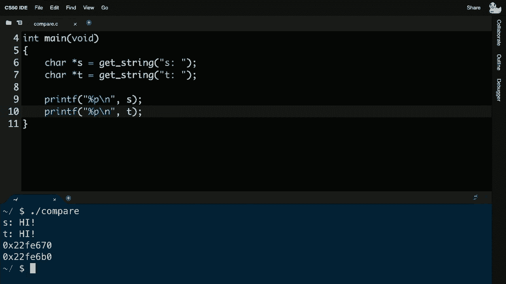

尽管我恰好输入了相同的内容，它们最终在稍微不同的内存位置，即 c 和我的计算机不会那么自以为是地为这两个字符串使用相同的字节，这样做对我来说并没有太大好处。简而言之，它将非常简单地把一个放在这块内存中。

在这块内存的其他地方，这些地址是各自的，但又是任意的。0x22 fe 670 和 0x22 fe 6b，哦，所以它们是分开的，计算机决定实际放置这些的地方。那么计算机内存中到底发生了什么呢？我们考虑一下，如果这是 s，我的指针或。

真的我的字符串，但它只是一个指针，现在是某个东西的地址。注意我画成占据了八个方块，因为在现代系统中，指针是八个字节，所以这就是为什么这个东西这么大。与此同时，当我输入像高这样的内容并加上感叹号。

然后它最终会在内存的某个地方，我们随便说，它恰好在我计算机的内存中出现。现在每一个字节当然都有一个地址。我不一定知道或关心它们是什么，但为了说明的方便，我们再编号一下，0x123 0x124 0x125 0x126。当我赋值时。

左边的 s 是来自 getstring 的值，右边的 getstring 将要做什么呢？你一直在使用它，确实是获取一个字符串并将其作为返回值交还给你。但这实际上意味着什么呢？如果字符串只是一个地址。那么像 getstring 这样的函数的返回值就是返回，而不是字符串本身的概念。

getstring 一直在为我们做的事情是返回字符串的地址，或更具体地说，是存储在 s 中的第一个字符的地址。为了清楚起见，那个地址是 0x123，它并没有返回整个字符串，h、i 和感叹号，而是仅仅返回给你一个值。

它仅仅返回给你该字符串第一个字符的地址，但再一次，这对于 s 来说都很好，t 的情况也是类似的，因为我再次调用 getstring，t 将被赋值为这个版本的高的第一个字符的地址，我们随便说，它在 0x456。

0x457 0x458 和 0x459，此时 t 将获取 0x456 的值。老实说，现在我们真的进入了细节，让我们开始将这一切抽象化，确实，当我们不再关注特定的地址时，s 只是一个指针，一个指向高的第一个字符的变量 t。

只是一个指向第一个的变量。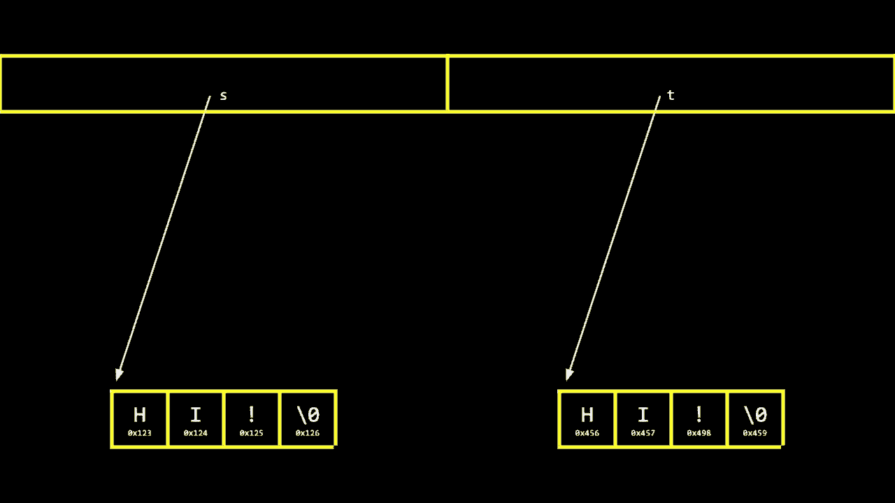

字符 hi，字符串，就像我之前在程序的早期版本中那样。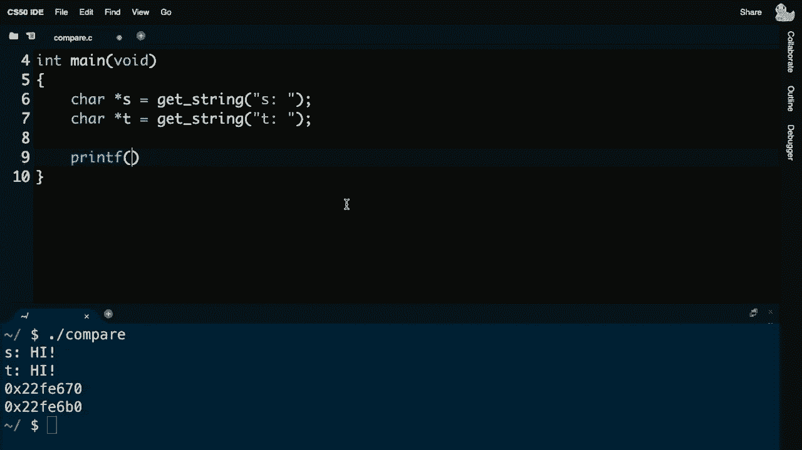

t。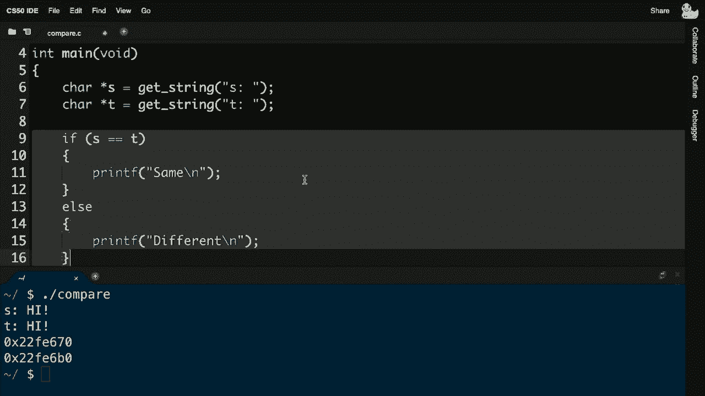

我确实是在比较`s`和`t`，但`s`和`t`分别是什么呢？`s`和`t`的实际值是`ox123`和`ox456`，或者其他什么，这些值不会相同，因为它们指向不同的内存块。 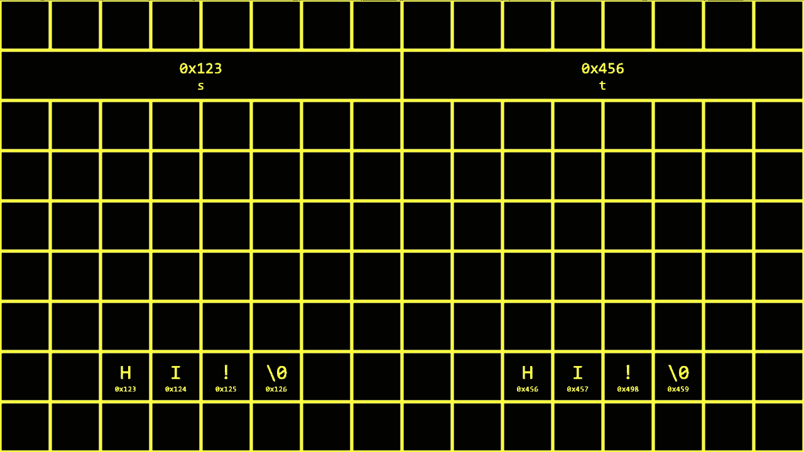

让我在这里暂停一下，看看布莱恩是否有任何问题或困惑。有没有问题或困惑？没有，好吧，谁在乎呢？就像这一切都有点无所谓。那么我们如何解决这个问题呢？让我们考虑一下我在之前演示中实际上做了什么。我有一个`string compare`函数，可以让你比较两个字符串，我保证。

我们最终会解释为什么使用`string compare`，而不是仅仅使用`==`。好吧，使用这个函数我需要在这里添加`string.h`，但如果使用`string compare`，让我继续重新编译这个`compare`。`./compare`，现在让我输入`hi`，而且`hi`是一样的，但它们看起来还是不同。

我真是太糟糕了，犯了和上次一样的愚蠢错误，有人知道我犯了什么错误吗？在比较两个字符串时，我不知怎么地犯了错。伊布拉欣建议你加上，没错。是的，如果它们相同则返回零，如果不同则返回负数或正数，正如字母顺序所示。因此，我应该在上次和这次都这样做。

检查与零的相等性，让我继续重新编译这个程序。好的，现在让我重新运行这个程序，输入`hi`两次，瞧，它们是一样的。为了确保这一点，让我再做一次检查，输入`david`和`brian`，它们应该确实不同。所以现在我再次没有真正做到，但我现在在考虑这些字符串。

从根本上讲，它们只是地址而已，所以现在让我们真正进入正题，让我继续创建一个全新的文件，合理地尝试复制一个字符串并对其进行修改。因此，我在这里继续，为了方便，我仍然会使用`cs50`库，而不是字符串数据。

只是针对`getstring`函数进行类型处理，我们将看到这比其他方法更方便。我要继续包含`stdio.h`，然后再包含`string.h`，让我在主函数中继续进行。让我在这个程序中继续并获取一个字符串，但我们不会称之为`star`。

所以再次开始处理这个字符串，叫做`s`，然后我将获取另一个字符串，但我不会称之为那个，我会称之为`char *t`，我想要复制`s`，所以你可能会想，基于第一周和第二周的变量，直接去做。我的意思是，我们已经使用赋值运算符从右到左复制一个变量。

整数用于字符和其他数据类型，或许也是，我现在要继续对原始字符串进行更改，所以让我继续这样做，让我继续说。让我们把 t 的第一个字符改为大写，回想一下有这个函数 `two upper`，它接受一个像 t 中第一个字符这样的字符作为输入。

并返回大写版本。现在要使用 `two upper`，我需要另一个头文件，我几周前记得我需要 `ctype.h`。所以让我提前回去把它放上，现在让我继续打印这两个字符串，让我继续打印出 s，作为这个 `percent s` 的值。

t 的 `percent s` 如下，所以我再次所做的是从用户那里获取一个字符串，而这里唯一的新内容是 `char star`，因为在第 10 行，我是从右向左复制字符串，然后我只对复制的第一个字母进行大写，也就是 t。

然后我只是把两个都打印出来，所以让我继续做复制，好的，编译也没问题，输入 h，回车，瞧！看起来我不知怎么地同时将 s 和 t 变成了大写，尽管我只对 t 调用了 `to upper`。布莱恩，有没有人对此组有什么想法，为什么我意外地并且错误地这样做了？有几个人说 t 是。

有几个人说 t 只是 s 的别名，s 只是 s 的别名，这是一种合理的思维方式。确实，更准确的说法是，有没有其他想法说明这在某种程度上是错误的？彼得现在建议它们具有相同的地址，是将 s 复制到 t，但再说一遍，s 到今天为止，它只是一个地址，所以是的，我复制了 s，但我复制了。

地址 `ox123` 或者其他的，然后在第 12 行注意到我通过将 t 转为大写来改变 t。但是 t 和 s 在同一个地址，所以实际上我在改变同一字符串。如果我们从计算机的内存角度考虑这一点，让我们考虑我刚做的事情，让 s 和之前一样放下，让我把高放下，但这次全部小写。

并且回想一下，它可能位于地址 `ox123`、`one two four one two five` 和 `one, two six`。现在，如果我们考虑到 s 技术上包含了第一个字符的地址，变量 t。并将 t 的值赋为 s，我得字面意思去理解这个语句。我确实是把 `ox123` 放在这里，如果我们现在抽象掉这些。

细节只是为了让它更清晰，从视觉上看发生了什么，这几乎就像在说，s 和 t 是的，在这个意义上，t 只是 s 的别名，实际上 t 是与 s 完全相同的。因此，当你使用方括号表示法访问 t 的第一个字符时，s 中的字符是一样的。所以当我调用 `to upper` 时。

我是在这个字符上调用它，当然这是故事中唯一的一个 h，当我打印 s 和 t 时，`printf` 跟随那些相同的线索，最终显示出同样的值。看起来我们确实需要从根本上重新思考我们如何复制字符串。

让我问一下，如果这是把一个字符串复制到另一个的错误方式，正确的方式是什么？即使你没有想到正确的函数或词汇，只是凭直觉，如果我们想要以人类的方式复制一个字符串，就像复制照片一样，我们想怎么做？你有什么想法，布赖恩？

是的，索非亚建议我们想要以某种方式遍历 s 中的元素并将其放入 t 中，是的，我喜欢这个，所以遍历 s 中的元素并将其放入 t 中。这听起来更繁琐，但如果我们想接受这些事实，我们将不得不这样做。

字符串 s 和 t 只是地址，我们现在需要去跟踪这些线索，所以让我们考虑这个程序的一个变体，让我继续这里，并更改它，以便我仍然得到一个字符串 s。但现在让我继续并提出，我们逐个复制。

字符，但我需要把它们复制到某个地方，所以我觉得这个复制字符串的过程还需要一步，就是给自己额外的内存。如果我有 h。i 感叹号和空字符，我现在需要控制我拥有的代码。字符，所以今天有一个新函数，如果我想创建一个字符串 t。

今天也称为 char star，我们可以使用一个新的函数，分配。这是一个相当复杂的函数，但幸运的是，它使用起来相当简单。它只需要一个输入，询问你想要多少字节的内存，所以我该怎么做呢？h i 感叹号，反斜杠 0。我可以直接说 4。

但这感觉并不是很动态，我想我可以更优雅地以编程方式实现这个，让我先说一下，s 中有一个加一的字符。加一，为什么我要这么做？好吧，h i，感叹号，空字符，这在技术上是存储在底层的，但你我认为高的长度是什么。

作为“好吧”，在现实世界中很可能是 h i 感叹号，谁在乎这个低级细节，这个空终止符，你不需要包含那个单词。你只需考虑你能看到的实际字符，因此高的长度是 h i 感叹号三，但我确实需要聪明地再加一个字节，字符。

因为我也需要把它复制过来，否则如果没有一个相同的空字符，t 将不会有明显的结尾。那么我现在该怎么把一个字符串复制到另一个呢？让我先取出一个，实际上，n 等于 s 的字符串长度，我们以前做过这个把戏，i 小于 n，简单地说。

`t[i]`得到`s[i]`，所以这将字面上从`s`复制到`t`。但我现在需要比`n`更聪明，我实际上会非常激进地说`i`小于或等于`n`，为什么我要比我们在字符串迭代时通常做的更进一步，以及迭代一个凯撒密码或足够的字符串。

在这个上下文中，布莱恩，你有什么想法，为什么我要从`i`小于或等于`n`开始？这里，塞琳娜第一次建议我们需要包含空字符。是的，如果我现在理解字符串的工作方式，仅仅复制“hi”这个感叹号是不够的，我需要进一步一步。

进一步比长度多一个，会小于或等于`n`，或者我可以在那加一个，或者我可以这样做，但我认为`i`小于或等于是合理的方法。现在让我们下到底部，实际上执行这个大写，让我们现在将`t`中的第一个字符改为。

调用`toupper`在`t`的第一个字符上的结果，打印出任何内容，打印出`t`是什么，并希望现在只有`t`被大写了，但我现在需要做一个更改。结果证明这个`malloc`函数在一个叫做`standard lib.h`的文件中，再次，这种事情总是可以谷歌，甚至我也会忘记很多。

这些函数有时在什么头文件中声明，但碰巧有一个新的，叫做标准库，它可以让你访问`malloc`，所以让我现在去比较一下。到目前为止，一切顺利，点斜杠比较，哦，不，这是比较，我的天，哦，我。看起来我忘了`i`和`n`的类型，所以让我进入我的循环中添加。

`int`是我的错误，让我再复制一次，好吧，所有七个错误幸运地消失了。再复制一下，让我们现在输入小写的`high`。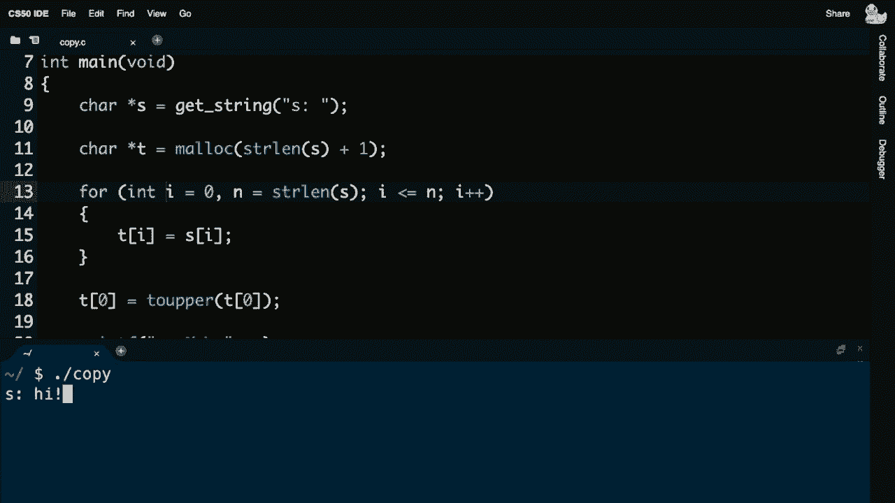

大写了。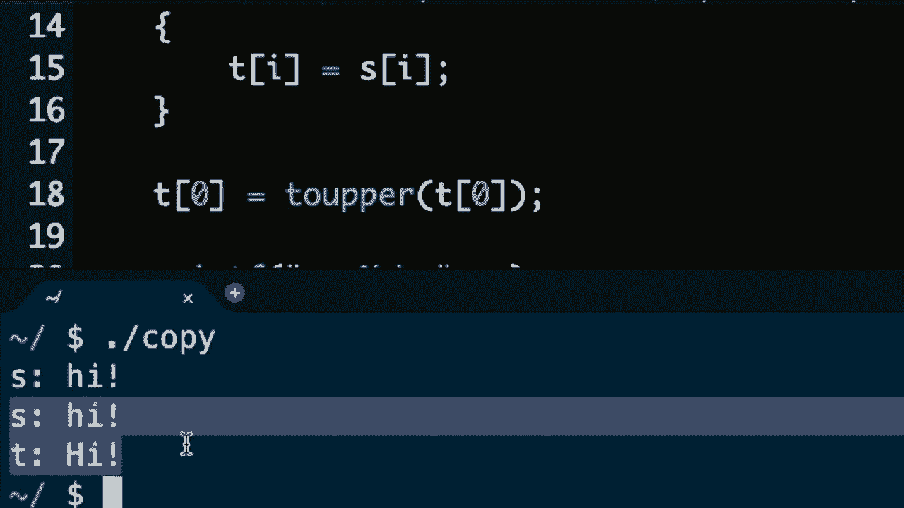

只是`S-A-K-A-T`的副本，明确说一下，我已经回到了我的方括号中。可以接受，这非常可读，但注意如果我真的想炫耀。我加上`i`的位置，然后这样做，这样的可读性。但再说一次，这里有等价性，方括号语法是一样的。

作为指针算术，如果你想到`t + i`的地址，以自己偏移一个或多个字节，你完全可以做到。如果我想要炫耀，我可以在这里说去`t`中的第一个字符并将其大写，但我认为尽管是这样，你还是非常。

聪明的是你理解指针和地址，如果你正在写这样的代码。老实说，这并不一定那么可读，所以坚持使用第二周的方括号语法是完全合理、正确且设计良好的。尽管我应该小心，这行代码有点风险。

对我来说，因为如果用户只是按回车而不输入hi。或者david或brian，如果他们什么都不输入，只按回车，那么字符串的长度。可能是零，那我可能不应该将字符串中的第一个字符大写。那可能有一些错误检查，比如如果t的字符串长度至少是这样做。

但这只是一个示例，关于程序，实际上我应该在一个完全正确的程序中做更多的错误检查，就像你在问题集中应该做的那样。有时事情会出错，如果你的程序如此庞大、如此华丽、如此占用内存，以至于你正在申请大量内存。

在程序中你不会这样做，但随着时间的推移，你可能会需要越来越多的内存。我们还应该确保t实际上有一个有效的地址，时间。会返回给你地址，就像getstring一样，它会返回找到的那块内存的第一个字节的地址。

然而，有时事情可能会出错，有时你的计算机可能会没有。内存，你可能见过你的mac或pc冻结、挂起或重启，这往往是内存错误的结果。因此，我们实际上应该检查类似这样的东西，如果t等于这个特殊值null，那么我会去啊**d并且退出并返回一个。

退出，让我们退出程序，这不会工作，这可能只会发生一百万次中的一次，但现在检查null更为正确。遗憾的是，c的设计者或更一般的程序员使用了这个n-u-l。也称为反斜杠零，遗憾的是这是一个不同的值。

n-u-l-l表示一个空指针，它是一个虚假的地址，即地址。零，它与反斜杠零不同，你在指针的上下文中使用空指针。通常口头上称为nul或null，在字符的上下文中，反斜杠零用于字符，而ull大写是用于指针的，它只是一个新符号。

我们今天介绍的，带有这个标准lib，dot h文件，好的，结果是，老实说，我不需要做一些工作，结果是，如果我想将一个字符串复制到另一个字符串，有一个函数，来完成这个，越来越多的时候你不需要像以前那样写那么多代码，因为如果你查阅手册。

页面，或者你听说过，或者在网上找到另一个，类似的函数，叫做stir copy。实际上你可以更简单地做，像这样，所以尽管我真的很喜欢这个主意，并且使用像for循环来将所有字符从s复制到t是正确的，但有一个函数为此，它叫做stir copy，它需要两个。

参数，第一个是目标，后面是源，它会为我们处理所有循环和复制，包括反斜杠零。这样我就可以专注于我想做的事情，在这种情况下，实际上是大写字母。所以如果我们现在考虑这个例子，结合我计算机的内存。

我们会看到它的布局稍有不同，但我首先想修复一个错误。这是我们尚未处理的事情，结果是，malloc。你请求计算机分配内存，责任在于你，程序员，最终要把它归还。我的意思是，如果你分配了四个。

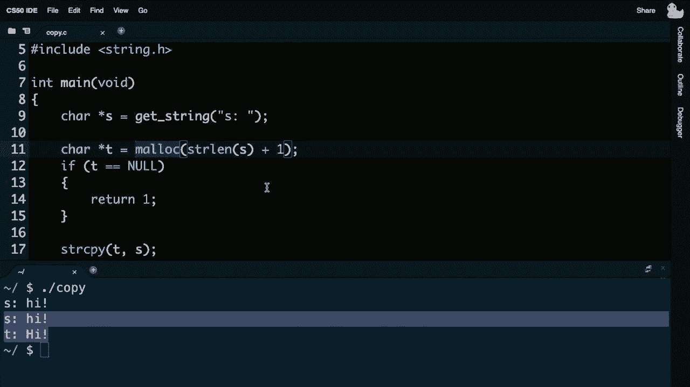

字节或四百万字节的内存用于一个更大的程序。你最好把它还给计算机，更具体地说，是操作系统，无论是Linux、Mac OS还是Windows，这样你的计算机最终就不会要求更多内存。要求更多内存显而易见，最终你的计算机将运行。

因为它只有有限的量。
