# 哈佛CS50-CS ｜ 计算机科学导论(2020·完整版) - P9：L4- IO、存储与内存管理 2 - ShowMeAI - BV1Hh411W7Up

硬件，记住，当你完成内存的使用时，最好的做法是，随后释放它，对应于malloc的相反操作是一个叫做free的函数。它的输入是malloc的输出，记住malloc就是分配给你的内存的第一个字节的地址。

如果你像我几行前用malloc请求四个字节，那么你会得到这些字节的第一个地址。你需要记住你请求了多少字节，在free的情况下，你只需告诉free，malloc给了你什么，因此如果你像我一样将那个地址存储在变量t中。

当你完成那段内存的使用时，只需调用free。

t和计算机会为你释放那段内存，你也许会在之后再得到它，但至少你的计算机不会那么快用完内存，因为它现在可以将那段空间重用于其他用途。好吧，让我继续并提议我们现在绘制一幅图，展示这个新的内存中的程序。

记得我们复制的内容是在这里，这是我们之前比较时的停留点。两个字符串如果这是，s，而s指向h i，小写的感叹号。这是我在复制中的新版本代码。

但malloc的返回值将是那段内存的第一个字节的地址，例如ox456或其他，后续的字节会一个接一个地递增。ox457 ox458 ox4，所以当我将malloc的返回值赋给t时，最终存储在t中的就是那个地址。

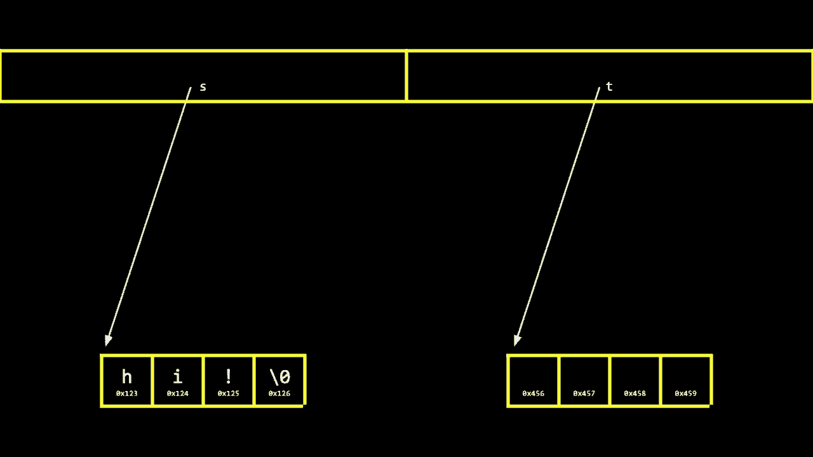

但我们再回过头来看，这已经是30分钟前的事了，现在我们关注的只是指针的抽象，指针就是一个指向变量的箭头，指向内存中的实际位置。所以现在，如果我开始在我的for循环中复制s，会发生什么呢？我将h从s复制到t，将i从s复制到t。

感叹号，从s复制到t，最后是终止的空字符。从s复制到t，所以现在的图在根本上是不同的，t不再指向相同的东西，它指向自己的那一块内存，现在通过一步一步的方式，复制了所有内容，而我，作为人类，会认为这显然是一个合适的程序副本，有什么问题吗？

关于我们刚刚做的事情，介绍了malloc和free，前者分配内存并给你可以使用的第一字节的地址，后者将其交还给操作系统并说我完成了它。现在可以被重用于其他变量，也许在我们的程序后续中。

更长的布莱恩，任何问题或困惑，有人问即使你在使用`strcpy`。有人问即使你在使用`strcpy`来复制字符串。代替自己逐个字符复制，是否仍然需要，释放内存。好问题，即使你在使用`strcpy`，你仍然需要使用`free`。

是的，每次使用`malloc`后，你必须使用`free`，每次使用`malloc`时，你必须使用。`free`来释放内存，`strcpy`是将一块。内存的内容复制到另一块，它并不为你分配或管理那。块内存，它只是基本上实现，那个循环，也许是时候。

我可以在另外的训练中卸下另一只辅助轮，口头上结果表明。`getstring`一直以来都是一种，有点神奇的东西，因为`getstring`来自`cs50`库，毕竟，当我们工作人员多年前编写`getstring`时。我们没有想到你将输入什么句子。

你打算分析什么文本，以便用于像`readability`这样的程序。因此，我们必须以这样的方式实现`getstring`，让你可以输入尽可能少的字符，或根据需要。我们将确保有足够的内存来存储那个字符串，因此，如果你。查看代码，我们的工作人员，调用`malloc`，我们调用`malloc`以获得。

确保有足够的内存来适应那个字符串，然后`cs50`库还在。暗中为你调用`free`，实际上有一种花哨的方式，你可以编写一个程序，一旦`main`即将退出。或返回到你的闪烁提示，一些我们写的特殊代码，处理不再使用的内存。

呃，耗尽了内存，呃，因为我们，但你们在使用`malloc`时都必须调用`free`。因为这个库不会做到，今天、下周及以后要停止。使用`cs50`库，最终，完全停止，以便你自己管理。还有其他问题吗？还有其他问题吗？没有，好吧，让我们。

我认为不公平，如果我们引入所有这些花哨的新技术却不。必要地提供任何工具来处理，花哨的代码。或者解决现在与内存相关的问题，值得庆幸的是，有程序可以。除了`printf`之外，帮助你完成函数和50，以及一般来说。

这个程序，它实际上是最后一个，你看到的，是叫做`valgrind`的程序。这个程序存在于`cs50 ide`中，但它也存在于，Mac和PC以及，Linux计算机上，任何地方你可以。运行你自己的代码来检测，是否在内存方面做错了什么。你可能会在内存方面做错什么？好吧，之前我记得我。

触发了那个分段错误，我触碰了不该触碰的内存。`valgrind`是一个可以帮助你，找出你触碰了不该触碰的内存的位置的工具。因此，专注于你自己的人，可能有漏洞，`valgrind`还可以检测你是否忘记。调用`free`，如果你调用了`malloc`一次或多次，但是，`valgrind`是一个可以察觉的程序。

这样告诉你你有什么，称为内存泄漏，实际上这与我们自己的mac和pc相关。如果你长时间使用你的mac或pc，或者有时候甚至你的手机，打开了很多浏览器标签，很多不同的程序同时打开，你的mac或pc可能确实已经。

开始慢得令人抓狂，可能使用起来很烦人，甚至不可能，因为一切都如此缓慢，可能是因为你正在使用的一个或多个程序在内存中有一些错误，从未调用释放。它们没有预料到你会打开这么多窗口，但valgrind可以检测到。

像这样的错误，老实说，如果你像我一样，可能你，可能会有10、20、50个不同的浏览器标签页同时打开，想着哦，我总有一天会回来查看，尽管我们从未这样做。每个标签页占用内存，实际上每当你打开一个浏览器标签时，想想它真的是。

不论你使用的是chrome、edge、firefox还是其他的，在后台，它们可能正在调用mac os或windows上的一个函数，比如malloc，给你更多内存来临时容纳那个网页的内容，如果你继续打开越来越多的浏览器标签，就像调用malloc，malloc，malloc，最终你会耗尽内存。

可以暂时从内存中移除一些东西到内存，但最终某些东西会崩溃，可能会影响你的用户体验，当事情变得如此缓慢，以至于你真的不得不退出程序，或者甚至重启你的电脑。那么我们如何使用valgrind呢？好吧，程序，什么也不做的有用的东西，但。

这展示了多个与内存相关的错误，我将这个文件命名为memory.c。我将去**d并打开文件memory.c，在顶部包含io.h，然后我还会提前包含标准库lib.h，记住malloc就在这里。int main void，我将保持这个简单，我会去**d，给自己。

一大堆整数，这其实有点酷，结果是，嗯，我们继续，好的，我可以这样做，让我们继续。char star s获取malloc，让我先给自己，好的，实际上，让我们去**d并说，s括号0等于72，s括号1，实际上我就这样做。

手动让我们做，h让我们做i，让我们做我们习惯的感叹号，然后为了保险起见加上s。括号三个引用，反斜杠零就像这样，实际上这是非常手动的方式。这实际上是非常手动的方式，构建一个字符串，但让我引入一个错误，字节。尽管我显然需要一个第四个来结束空字符。

注意没有释放，调用释放，现在我要去**d并编译。这个程序，嗯，内存，好吧它编译成功了，所以这很好，点，斜杠内存。好吧，什么也没发生，但这似乎是合理的，因为我没有告诉它去做任何事情。为了好玩，让我们打印出那个字符串，重新编译。

内存仍然可以编译，让我运行 `dot slash memory`，好吧，似乎可以工作，所以乍一看。你可能会非常自豪，你又写了一个正确的程序。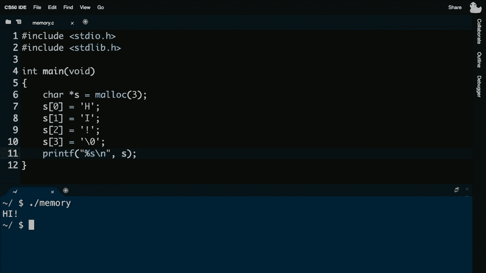

似乎通过了检查 50，你提交了，然后继续你的日子，但几天后你非常失望。因为你意识到该死，我在这上没有得到满分，因为实际上你的代码中有一个潜在的问题，你不一定能在视觉上看到，也不一定在运行时体验到，但最终在足够多次运行时可能会出现错误。

最终，计算机可能会注意到你做错了什么。幸运的是，像 valgrind 这样的工具可以让你检测到这一点，所以让我继续，**增加我的终端窗口大小**。让我继续并在 `dot slash memory` 上运行 valgrind，就像 debug 50 一样。

而不是运行 debug 50 然后 `dot slash` 无论程序是什么。你运行 valgrind `dot slash memory`，不幸的是这个只有命令行界面，没有像 debug 50 那样的图形用户界面，老实说，这是一串可怕的输出，乍一看可能会让你感到不知所措。

这不是最好的设计程序，真的只是为了最舒适的人。虽然如此，我们仍然可以从中提取一些有用的东西，像往常一样让我滚动到输出的最顶部，指引你注意几个开始跳出来的事情。

如果你对 valgrind 的输出感到困惑，**帮助 50** 可以帮助你。重新运行它，但在开头放上帮助 50，就像我现在要做的那样，口头上可以帮助你。帮助你注意到这个混乱输出中的重要内容，这一行，这里是第 10 行内存。我们稍后会看一下，如果我继续向下滚动，发现大小为 1 的无效读取。

而且这似乎也在这里，看起来在内存的第 11 行。如果我继续滚动，继续滚动，继续滚动，块，无论那是什么，但。在一个块中有三字节，显然有一个块是丢失的，然后在这里泄漏总结。显然丢失了一个块中的三字节。

正确的语法，这就是当你的程序没有一个检查条件的 if 时发生的。如果数字是 1、正数或 0，你可以用一个简单的 if 条件修复这个问题。老实说，他们在几年前编写这个程序时并没有这样做，所以这里有两三个错误，一个是某种无效的读取或写入。

另一个是这个泄漏，好吧，值是什么，读取只是指读取或使用。

第10行。如果我向下滚动回我的代码，查看第10行，这个是无效的右边无效。好吧，为什么它无效呢？根据今天的定义，如果你分配了三个字节，第二个字节和第三个字节，但你没有理由去接触第四个字节，如果你只要求三个，这就像一个小规模的版本。

非常冒险和不当，像是10,000字节远，即使是看起来一字节远也是潜在的bug，并且可能导致程序崩溃。同时，第11行也是有问题的，这是一个无效的读取，因为现在你说去打印这个字符串，但那个字符串包含了你不应该有的内存地址。

首先触碰的，以及内存泄漏，第三个问题源于我没有释放那块内存。因此，它需要一些练习和经验，以及你自己的错误来修正。让我先给自己四个字节，让我修复第二个或第三个问题。

通过在最后释放s，因为再次，每当你使用malloc时，你必须使用free，让我去重新编译memory。

似乎可以编译，让我重新运行，它在视觉上仍然是相同的。但现在让我们在它上面重新运行valgrind，valgrind，点斜杠memory，输出仍然看起来非常神秘，但注意所有堆块都被释放。无论那意味着什么，没有泄漏是可能的，它确实没有更。

明确一点，这是好事，如果我向上滚动，我没有看到任何无效读取或写入的提及。所以从本周的问题集开始，以及下周的C语言问题集，你不仅希望使用50并检查50，即使你认为你的代码是正确的，输出看起来正确，你可能还有一个潜在的错误。

当你的程序很小的时候，它们可能不会崩溃计算机，它们可能不会导致那种分段故障，最终它们会，而你确实希望使用这样的工具来追查可能发生的事情。让我去揭示一个示例，这里有一些代码是有点危险的。

例如，这里是一个示例，我在函数顶部声明，uh int star x和int star y。那么这仅仅意味着，给我一个指向名为x的整数的指针。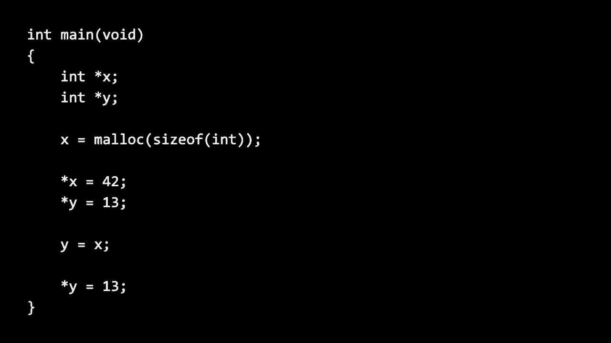

换句话说，给我一个名为x的变量，我可以存储一个int的地址；给我一个名为y的变量，我可以存储另一个int的地址。但注意，在前两行我实际上并没有给它们赋值，直到第三行，尽管这很奇怪，这并不是之前的方式。

没有理由你不能使用**malloc**、**sizeof**，**sizeof**是新的，它只是C语言中的一个运算符，告诉你数据类型的大小，比如**int**的大小。所以也许你忘了**int**是**四个字节**，而实际上**int**通常是**四个字节**，但并不总是每个系统都是四个字节，所以**sizeof int**只是确保它。

不论你是在使用现代计算机，还是旧计算机，它总会给你正确的答案。因此，这只是意味着在现代系统上为我分配**四个字节**，并存储**x**中第一个字节的地址。有人能翻译成普通话吗，**star x = 42**是在做什么，**star**是解除引用操作符。

这意味着去到地址，一个口头评论**star x = 42**在做什么，布赖恩你介意吗？你会如何描述那一行在做什么？是的，索非亚建议在那个地址我们将放置**42**。完美，在那个地址放**42**，同样去那个地址**x**。

把**42**放在那里就像去布赖恩的邮箱，把**42**放进他的邮箱，而不是我们之前放的数字**50**。接下来的第五行**star y = 13**，布赖恩，你能为我们口头解释一下吗？**star y = 13**对我们有什么作用，**13**不是一个意外。

彼得说倾向于不幸，将**13**放在地址**y**，在地址**y**放**13**，或者换句话说，去地址**y**并把**13**放在那里。但是这里有一个逻辑问题，如果我倒回去，**y**里是什么，如果我最初不这样做。即便我没有给**x**赋值，我最终还是没有赋值。

当在这里声明它作为一个变量时，我最终开始存储实际的地址。现在只是为了确保程序在检查**null**以防有什么问题。更严重的问题是我甚至没有给**y**赋值，这里我们可以揭示关于计算机的一个其他细节，到目前为止我们一直在理所当然地认为。

你和我几乎总是初始化一个**char**、一个**int**和一个**string**，我们字面上在程序中输入它，以便在需要时它就在那儿。但是如果我们考虑这里的这个图像，它现在只是你计算机内存某些内容的物理体现，幽默地贴上了很多**奥斯卡·怪兽**的标签，这是因为你永远不应该信任。

计算机内存中的内容，有一个编程术语叫做**垃圾值**，如果你自己没有放入一个值，内存中的某个地方你应该安全地假设它是一个所谓的**垃圾值**，**a**、**b**和**c**你根本不知道它是什么。因为如果你的程序在运行，随着时间的推移，你在调用函数，调用其他。

函数和函数返回的值在计算机内存中不断变化，当你释放内存时，内存会被重用，这并不会清除它，也不会将其全部重置为零或将其全部重置为一。它只是保持不变，以便你可以重用，这意味着随着时间的推移，你的计算机包含。

你程序中所有变量的残余。在这里，在那里，所以在这样的程序中，如果你没有明确地初始化 `y`，你应该假设“奥斯卡”大概在那个位置，那是一个看似地址但并不是真正地址的垃圾值。

有效地址，因此当你说 `*y = 13` 时，这意味着去那个地址，但实际上是去那个虚假的地址并在那里放置一些东西，结果你的程序很可能会崩溃，你会遇到段错误，因为访问了某个任意的垃圾值地址，就像拿起一张随机的纸，上面写着一个数字一样。

然后去那个邮箱，像是为什么它不属于你，如果你尝试解除引用一个未初始化的变量，你的程序很可能会崩溃，而这可能在我们的朋友中表现得最好，尼克·帕兰特是斯坦福大学的教授，他赋予了一个粘土动画角色“宾基”生命，我们有一段两分钟的剪辑。

这确实描绘了当你接触不该接触的内存时会发生的坏事情，所以希望这是一个有用的提醒，告诉你该做什么和不该做什么。嘿，宾基，醒醒，时间到了，进行指针的乐趣！

指针学习是什么，哦，好吧，开始吧，我想我们需要几个指针，好的，这段代码分配了两个指针，它们可以指向整数。好的，我看到了这两个指针，但一开始，它们确实不指向任何东西，它们指向的东西叫做被指对象，设置它们是一个单独的步骤。

哦，对对，我知道被指对象是分开的，那么如何分配一个被指对象呢？好的，这段代码分配了一个新的整数被指对象，这部分将 `x` 设置为指向它。嘿，这看起来好一些，那就让它做点什么吧，好的，我会解除引用指针 `x` 将数字 42 存储到它的被指对象中，为这个技巧我需要解除引用的魔杖。

你的解除引用魔杖看起来像，我会先设置这个数字。嘿，看看它开始工作了，所以对 `x` 进行解除引用会跟随箭头访问它的被指对象。在这种情况下，存储 42 到那里，嘿，试着用另一个指针存储数字 13。为什么？好的，我就去 `y` 那里设置数字 13，然后。

拿起解除引用的魔杖，哦，嘿，这不行，说呃，宾基，我不知道，因为，呃，设置被指对象是一个单独的步骤，而我认为我们从未做到过。好点子，是的，我们分配了指针 `y`，但从未将其设置为指向一个被指对象。嗯，很有观察力，嘿，宾基，你看起来不错，能不能修复一下，让 `y` 指向那个。

和 x 一样尖锐，当然我会用我的指针魔法棒和赋值。这样会有问题吗，比如，指向的对象，它只是将一个指针改变为指向。和另一个相同的东西，哦我现在明白了，y 指向与 x 相同的地方。所以等等，现在 y 是固定的，它有一个点，e，所以你可以试试 d 的魔法棒。

再次引用，发送 13，呃，好吧，来了，嘿看看这个，现在解除引用有效。共享那一个点，无论如何，所以我们现在要交换位置吗，哦，看，我们没时间了。

好吧，所以我们还没有完全超出时间，但让我们继续 ah**d，进行我们的第二个五分钟休息，当奥斯卡，好的，我声称你计算机的内存中有所有这些垃圾值，但你怎么能。看见它们呢，呃，Binky 做的当然是尝试解除引用，一个垃圾值，当坏事发生时。

但我们实际上可以用自己的代码看到这一点，所以让我快速去 ah**d，编写一个小程序，就像我们在第一周做的。或第二周，但没有做得很好，让我去 ah**d，像往常一样包含 standardio.h。int main void，然后让我去 ah**d，给自己一个 scores 数组，如何。

一个三项的 scores 数组，我们之前做过，我们从用户那里收集了分数。可是这次我会故意犯错，不实际。初始化那些分数，甚至不询问人类这些分数。我只是盲目地从 i 等于零开始迭代。

迭代到三，每次迭代我只是冒昧地。打印出位于 scores[i] 的位置上的任何东西，所以逻辑上我的代码在 scores 中是正确的。但注意我故意没有初始化那个数组中的一、二、三的任何 scores，所以谁知道那里会有什么，确实应该是这样。

某种垃圾值，我们无法提前预测，所以让我去 ah**d 制造垃圾，呃，因为这个程序在一个名为 garbage.c 的文件中。编译没问题，但当我现在运行 garbage 时，我们应该看到，三个 cryptically。负值 - 八三三零六零八，*****，七百六十五和。

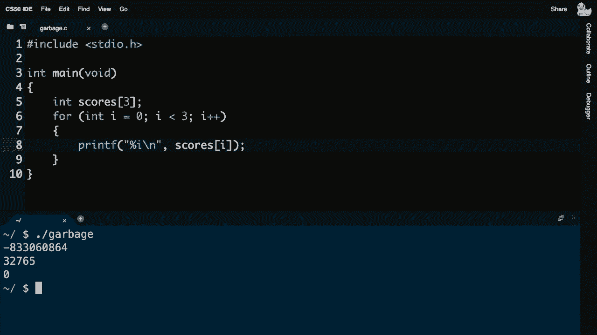

第三个恰好是零，所以有这些垃圾值。因为计算机不会为你初始化。那些值，现在有例外，我们偶尔使用像全局变量这样的常量，它在 main 的上下文之外，和我其他的所有函数，如果你不设置它们。

通常初始化为零或 null，但你应该。一般来说不要依赖这种行为，你的本能应该是。总是在考虑接触或读取它们之前，先初始化值，比如通过。printf 或其他机制，好吧，让我们看看这对内存的理解。

这可以引导我们解决问题，但也可能遇到新的问题，但这些问题我们现在希望能够理解。我要继续**做**并创建一个新程序，并回忆起上周的内容。 

我们常常希望交换值。当布莱恩为我们排序时，无论是选择排序还是冒泡排序，都有很多交换发生。然而，我们并没有为这些算法写任何代码，这没关系，但让我们考虑一下这个非常简单的基本操作：交换两个值。

比如交换两个整数，让我继续**做**，在 swap.c 中开始一个程序，int main void。在 main 中，我将给自己两个整数，让我给自己一个叫 x 的变量并赋值为 1，然后给一个叫 y 的变量赋值为 2。接着让我继续**做**并打印出这些值。

我只想说，字面上 x 是百分之一，y 也是百分之一。然后我将继续**做**并分别打印出 x 和 y。这个函数叫做 swap，用于交换 x 和 y，但让我们先不这样做，因为我接下来想做的事情是，x 现在是百分之一，y 也是百分之一，x 和 y 将被交换，那么我该如何交换呢？

这两个值，好吧，让我继续**做**，并实现我自己的函数，我认为它不需要返回类型。我会叫它 swap，它将接收两个参数作为输入，我们称之为 a 和 b，似乎合理，现在我想继续交换这两个值。布莱恩上周用他的双手做了这个，没问题，但我们应该考虑一下。

更仔细地看看，事实上，布莱恩用数字的方式不如用现实世界中的东西。我想你面前有几杯饮料。是的，我这里有一个红色玻璃杯和一个蓝色玻璃杯，我想我们可以用来代表两个变量。是的，我让我们假设我希望我说。

提前告诉你，我其实更希望红色液体在蓝色玻璃杯中，蓝色液体在红色玻璃杯中。你介意交换这两个值吗，就像你上周交换数字那样？当然可以，我可以把两个杯子拿过来，交换一下。等一下，但这没问题，这并不完全对。

如果你对我太过字面理解，我认为这里，如果我们现在把眼镜看作记忆中的特定位置，你不能像物理上移动电脑里的内存芯片那样，实际上需要把蓝色液体移到红色玻璃杯中。这样更像是电脑的内存，好的，我可以试试，不过我有点紧张。

但我有点紧张，因为我觉得我不能把蓝色液体倒入已经在里面的那杯。是的，所以这可能不会有好结果，如果他必须在两个杯子之间做某种交换，你有什么想法吗？就像布莱恩上周在交换两个内存位置的内容一样，内容有点奇怪。

嗯，布莱恩，如果你在关注聊天的话，是否有人有什么想法，关于我们如何交换这两种液体？是的，几杯。好吧，布莱恩，你那边是否恰好有第三个玻璃杯在后台？事实上，我想我有。所以我这儿有一个第三个玻璃杯，恰好是空的，好的，那你现在该怎么做呢？

关于交换这两种液体，我想我需要做的第一件事就是清空红色玻璃杯，以便为蓝色液体腾出空间。所以我会把红色液体倒入这个额外的玻璃杯中，暂时这样做。

只是为了暂时存储它，现在我想我可以将蓝色液体倒入原来的红色玻璃杯中，因为现在我可以这么做了。我认为我需要做的最后一件事是，这个原本装有蓝色液体的杯子现在是空的，所以红色的。

我可以把这个临时杯子里的液体，红色液体倒入这个杯子里。现在我并没有交换杯子的位子，但液体实际上已经交换了位置，现在蓝色液体在左边，红色液体在右边，太棒了，我想这就是一个更好的结果。

这是你上周所做的事情的逐字实现，所以看起来相当简单。我只需要一些空间，就像我需要一个临时变量一样，似乎我需要三步。我需要倒出一种液体，再倒出另一种液体，最后将另一种液体倒回去。

我想我可以将这个翻译成代码，给自己一个临时变量，就像**布莱恩**那样，我会称它为`temp`。这个名字在交换两个变量时是相当传统的。我将暂时将它赋值为`a`。

将`a`的内容改为`b`的内容，然后将`b`的内容改为`temp`的内容。这听起来相当合理，也很正确，因为这实际上就是对布莱恩在现实世界中所做的事情的逐字翻译，我觉得可以。

之前隐式声明的错误，哦天哪，错误太多了，我的天，函数`swap`的隐式声明。等一下，我以前见过这个，我也犯过这个错误。任何时候你看到这个，记住这只是因为你缺少原型。记住编译器会字面理解你所写的，如果没有。

它将无法成功编译，所以我们需要在文件顶部包含我的原型。让我现在去运行`swap`，回想一下在主函数中，我初始化了`x`为1，`y`为2，然后打印出`x`和`y`的值，接着调用`swap`，然后再次打印出`x`和`y`，我应该能看到1和2，然后是2和1，所以让我们看看。

进入，嗯，似乎不是这样的，给我加一些，printf是我的朋友，让我去啊**d说a是。百分之一b是百分之一换行，a b所以我们打印出来，让我们。打印两次，这将是一个合理的调试技术，如果你，底下。添加一些print f的，让我去啊**d，执行swap，编译了点斜杠swap，让我们看看。

a是1 b是2 a是2，我觉得，逻辑是对的，它在交换a和b。但它实际上并没有交换，x和y，我可以确认，调试这个。将是运行调试50设置一个断点，例如在第17行，逐步执行我的代码。

步入swap函数，工作是的，但main并没有真正看到那些结果，考虑这个。我的内存的现实世界体现，所以我可以实际移动东西。所有这一切都要感谢我们的，朋友们在剧院的道具店，如果我们把这看作是我的。计算机的内存，最初它都是，垃圾值，但我可以把它作为一个画布开始。

在内存中布局东西，但调用函数是我们迄今为止视为理所当然的，而事实证明，当你调用函数时。计算机默认以一种标准的方式使用这块内存。实际上，让我去啊**d画一个更，形象化的图，让我画一个更字面的图。

在这里，如果你愿意的话，计算机的内存，再次如此，如果这是计算机的内存，我们放大其中一个芯片，想象这个芯片。拥有很多字节，就像这样，让我们抽象出实际的硬件。把它看作我们一直在看的，它只是这个大矩形区域的，堆积。

刚才提到的，但按照惯例，你的计算机并不会随意地在内存中放置东西。它遵循某些经验法则，特别是它以不同的方式处理计算机内存的不同部分。随机使用它。例如，当你通过在cs50 IDE上执行点斜杠某个程序时。

或者在Linux上更一般地，或者在macOS上双击图标，计算机的硬盘被加载到这里，我们称之为，和零一，所以如果你再比喻一下。你的内存是这个矩形区域，那么机器码的零和一，程序。被加载到内存的顶部，再次顶部底部左右都有。

没有基本的技术含义，只是一个艺术家的表现。但它确实进入了一个标准位置，变量，或者你放在外面的常量。你的函数那些将在你计算机内存的顶部结束，下面是。所谓的堆，这是一个技术术语，指的是一大块内存。

返回，某个内存块的地址，在机器码下方的这个区域。位于你的全局变量下方，这算是一个大区域，但关键是。内存的其他部分被不同地使用，实际上，嗯，而堆被认为是。这里往下，有些令人担忧的是栈，被认为在这里。

这就是说，当你调用 malloc 并请求内存时，内存会在这里分配。当你调用一个函数时，那些函数，堆空间，swap，或者 stirling 或 string compare，或者你到目前为止使用的任何函数，你的计算机会自动将参数从这些函数传递到这里，这并不一定是最好的设计。

因为你可以看到两条箭头互相指向，就像两列火车在轨道上相向而行，坏事最终可能会发生。幸运的是，我们通常有足够的防止碰撞，但稍后再谈，所以再次，当你调用函数时，下面的内存被使用，当你使用 malloc 时，上面的内存被使用。现在对于我的 swap 函数，我不使用 malloc，所以我认为我不必担心堆。

而且我没有任何全局变量，我也不在乎我的机器代码，我只需要知道它存储在某个地方，但我们来考虑一下栈，这是一种动态的地方，内存不断被使用，main 在运行。

main 在这张图片的底部使用了一小块内存，如果你愿意的话，main 中的局部变量像 x 和 y 最终位于这块底部内存，当你调用 swap 时，swap 使用了一块内存，正好在 main 上方，b，swap 返回并完成执行后，这块内存基本上就消失了，现在它并不会明显地消失。

仍然有物理内存在那里，但这时我们又进入了垃圾值的讨论，它们像 oscar the grouches 一样到处都是，你只是不知道，确实存在一些值，这就是为什么我刚刚打印出的未初始化的分数数组，我看到了。

一些虚假的值因为仍然会有之前留下的零和一，问题是让我去看看这个。我们内存的物理体现，并且在增长，实际上如果我想有两个局部变量，就像我做的，x 和 y，让我们去想一想。

这里的内存行被视作 main 例如在这里，我将继续并替换掉所有这些垃圾值，用我在乎的实际值，和我在乎的实际变量，我们将称之为 x 和 y，恰好是一个字节，但一个 int 是四个字节，所以幸运的是我们在 prop blocks 的帮助下，我将继续滑动这个。

在这里，我们将把这个视作 x，实际上我将继续并给这个标记，然后我将继续再给自己一个大小为 4 的整数，并把它放在这里，我们将把它视作 y，并回想一下，我将这些值初始化为多少呢，初始值为一和二，但随后我。

调用swap函数，而swap，函数有两个参数a，和b，设计上这两个变成了。x和y，我定义swap为接受a和b，所以我认为我需要做的。物理上是现在把这，第二行内存视为现在属于swap函数。不是main，而在这第二行内存内，我将把它视为属于。

在swap的行中，我会再有一个大小为4的整数，我们叫这个为，a，哎呀，a。然后我会再有一个uh，b，和之前一样，因为那些只是参数x，y，1，和2，但swap有第三个变量，brian提出的一个。

临时变量，所以我会继续给自己，四个字节，从而去掉。无论那里是什么垃圾值，实际上把它设置为一个叫做temp的整数，所以我会叫这个东西，temp tmp，我首先做了什么，我把temp设为1。temp是1，然后我做了什么，我把a也设为2，然后，a也设为2，然后。

最后我做了什么，我把b设为temp，所以我必须继续，改变这个，使它成为temp的值，可以看到，swap是正确的，只要它在。交换a和b的值，但一旦swap返回，这些就回到被视为。垃圾值，main仍在运行中，swap不再运行，但这些。

值保持在那里，所以那些是垃圾，值我们恰好知道它们是什么，但它们不再有效，因为当时，x和y是什么，它们仍然是一样的，写代码。接受参数，你把参数从一个函数传递到另一个函数。这些参数是从一个函数复制到另一个函数的，确实。

x和y被复制到a和b，所以你的，代码可能看起来非常，正确，因为它在正确地交换。确实交换，但它仅在swap的上下文中交换，而不触及原始值。所以我认为我们需要，从根本上重新实现，swap，以这样的方式真正。改变x和y的一个值，但我们该怎么做，brian如果我们，可以叫一个人来这里。

swap的实现，这样它可以让我，改变x和y，而不是改变。x和y的副本，我可以传递什么，igor建议我们使用指针。igor建议我们使用指针，是的，所以或许是一个解决方案。如果指针本质上就像一张指向内存的藏宝图。

我真正应该做的是，从main传递到swap的不是。x和y字面上，但为什么我不传递，x和y的地址，地址。并实际上进行brian亲自实施的那种交换，所以给函数一种映射，指向那些值，然后去那些值。那么我们该怎么做。

我这样做时，代码必须稍微不同。当我调用 swap 时，这次我真正需要做的是传入这两个变量的地址，所以我不一定知道这些地址是什么，但为了叙述的需要，我们可以假设这个地址例如是 ox123，然后四个字节远。

从那里可能是 ox127，例如，但再次强调，这并不真的重要。但它们确实有地址，x 和 y，因此一个指针的大小通常比较大，所以我们需要得到一块更大的内存，八个字节，表示一个指针，实际上我需要使用更多的内存，而 swap 现在，如果我声明 a 不再是一个整数，而是一个指向整数的指针。

现在，我可以在其中存储 x 的地址，像 ox123，这是一个整型。那是另一个 inch star，恰好是八个字节，我将为这个东西使用稍多一点的内存，但没关系，它的名字将是 b，现在它将包含 ox127。我仍然需要一个临时变量，我仍然需要一个临时变量，但。

没问题，我只需要四个字节，因为变量本身只需要存储一个整型。就像布莱恩临时存储在杯子里一样，所以我只需要额外的四个字节，就像之前一样。这里是 main，swap 现在使用这三个变量，两个就可以了。它向上增长，正如我所提议的，x 在地址 ox123，y 在地址 ox127，因此，提议。

存储 x 和 y 的地址，分别，现在我的代码我认为需要说，这个去。并将变量 temp 中的内容存储在地址 a 所指向的地方，所以你可以把这看作是一个箭头，指向这里，好的，那地址 temp 是什么？就像之前一样，那我们该怎么做呢，现在我将去 ah**d 并进行更改。

不是 a 的值，但我将改变 a 所在位置的内容，让它变成 b 所在位置的内容，这里。现在，回想一下 b 指向的位置，恰好是 y，并将其改为 temp 的值，当然这在这里，并且在这个故事的这一点上，它仍然只是三行代码，情况是不同的。

这三行代码，但当 swap 执行完毕时，注意我们所做的，我们成功地交换了 x 和 y，让 swap 去访问那些地址，而不是简单地获取它们的值的副本。尽管这段代码看起来有点神秘，实际上它只是。

我们迄今为止看到的逻辑，我将进行版本更改，并将 swap 的定义改为不接受两个整数 a 和 b，而是两个指向整数的指针 a 和 b。声明指针的方式是指向的变量类型，后面跟着一个星号，然后是它的名称，坦率地说，我们在代码中还没有看到。

函数的上下文，接收参数但实际上很简单，我加了星号。这里我需要说存储在临时变量temp中，去那里，我该如何说去b并存储。无论temp中的内容，我都会加一个星号，所以temp只是一个简单的整数。它就像布莱恩的空玻璃，没有什么花哨的东西，所以我们不需要。

需要在temp周围加星号，但我现在需要更改使用a和b的方式。因为现在它们是我实际想要去的地址，在这个上下文中没有必要使用地址运算符，但在这里我需要进行更改。我确实需要更改原型以匹配，所以这只是复制粘贴，但我敢打赌你能想象得到。

最后在调用时需要更改的是，swap我不想简单地传递x。我想传递x和y的地址，这样swap就可以特殊访问这些内存位置的内容，从而实际上可以对其进行一些更改。如果我现在重新编译这个程序，生成swap。

我确实进行了交换，交叉手指，瞧。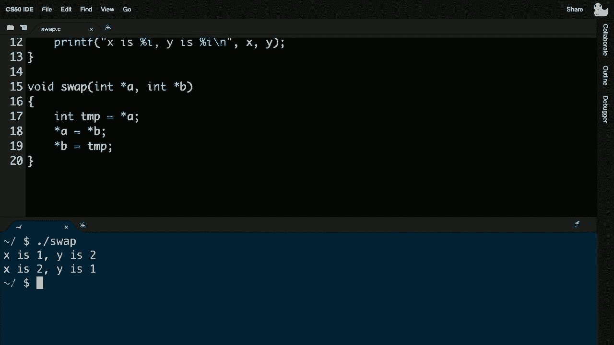

代码，上周如果你在想，要进行交换，我们本可以，而不需要一个特殊的函数，你不一定需要，main，但我想引入一个抽象，这个函数进行交换，就像布莱恩为我们交换那些玻璃一样。要从一个函数传值到另一个函数，你需要理解。

在你计算机的内存中发生的事情，所以你实际上可以传入小的“面包屑”作为指向那些内存位置的藏宝图，再次感谢这些称为指针的东西。有什么问题吗？这无疑会涉及一些星号和符号，但现在肯定有问题。

概念或能力布莱恩那边有什么，要强调的是，这个堆的设计在顶部，malloc使用内存，而栈在底部，这是一个显然等待发生的问题，那些之前编程过的人可能知道这些术语中的一些，比如堆。

溢出或栈溢出，事实上，很多人可能知道stackoverflow.com，那个只是一个网站。

虽然有一个起源故事，关于调用函数如此多次以至于溢出。每次你像我在这里那样调用函数的时候，都会消耗内存。如果你一次又一次地调用如此多的函数，最终可能会崩溃，此时你的程序将崩溃，根本没有解决方案。

对于那个问题，除了不这样做，比如不要使用太多内存，但这可能很难做到，实际上这是今天编程的一大危险。我们实际上可以故意诱导这一点，实际上我认为我们可以回顾一下上次我们和马里奥讨论到的地方，就是这张图片。

这当然是一个比你可能在问题集零中玩过的简单得多的金字塔，但这是一个递归金字塔，因为你可以将高度为四的金字塔定义为高度为三的金字塔，继而是高度为二的金字塔和高度为一的金字塔，确实我上周使用这些非常的块构建了这个，你可以实现。

像这样使用几种样式迭代马里奥的金字塔，事实上让我去，啊**继续**快速做出一个确切的解决方案，让我去，啊**继续**称之为马里奥。c，我要去，啊**继续**包含，函数，我将使用标准io。h，我要做int main void，所有我想做的就是打印出这个。

这个金字塔，但我想问用户，height等于get int，我们会询问用户高度，就像你在问题集一中做的那样，然后我要去，啊**继续**画出这个高度的金字塔，现在绘制不存在，绘制这个现在。自己实现绘制，它不需要返回值，因为我只是打印。

屏幕上的内容，函数称为绘制，它将接受一个名为h的输入。例如，h表示高度，但我可以随意命名它的参数。然后我只是要做这个4 int，i等于1，i小于或等于h，i加一。然后在这个里面，这是你可能从某些问题中回忆起来的地方。

发现嵌套循环很有用，让我做一个j等于1，嗯j小于或等于i，j加一。这将类似但不完全相同于过去的马里奥的舒适或不舒适版本，因为这个金字塔。是朝不同方向形状的，让我在这里打印一个哈希。

然后让我继续，啊**继续**在这里打印一行新内容，所以我快速做了这个。但从逻辑上讲，我正在遍历每一行，从一到h。所以第一行、第二行、第三行、第四行，例如，然后在每一行我故意从一开始遍历，所以我打印一，接着是二、三、四，当然我可以设置为零上下文。

更用户友好，更容易理解，从一开始索引我觉得是完全合理的，如果你认为有一个令人信服的设计论点，所以让我去，啊**继续**做马里奥。啊，真糟糕，我错过了我的原型，所以请注意，它不理解绘制。所以解决方法是要么移动整个函数，要么如我们所宣传的那样。

只需将你的原型放在顶部，让我重新编译马里奥，好的，现在成功的马里奥，我们设置高度为四，瞧，现在我有一个相对简单的，尽管我确实进行了实践的马里奥金字塔实现，但事情变得相当酷。如果让我规定这是一种正确的迭代解决方案，即使它。

可能需要你一些步骤或者，基于迭代循环的代码，正确，让我把这现在改为递归，回想一下，递归函数是一个调用自身的函数，如何打印高度为h的金字塔，高度为h，减去1，然后你继续打印。多一行块，所以让我字面理解，int i，等于0，i小于h，i加1。

让我去**继续**并打印那额外的一行砖块，就这样。后面跟着一个换行，所以现在我做得有点快，但我在这里做什么，嗯，如果高度。一次，如果高度等于二，我希望它迭代两次，三次等等。所以我想使用我的零索引，技术，这也会有效。

但如果你愿意，我当然可以把这个改为一个，把这个改为。可是我想去**继续**，实际上，在这种情况下我想保持为。像我们通常做的那样，从零开始。好吧，让我去**继续**编译，这样让马里奥。好的，哎呀，有趣的是，所有路径通过，这个函数将自我调用。

所以clang在这里表现得相当聪明，因为它注意到。在我的绘制函数中，我在调用我的绘制，实际上让我看看我是否可以覆盖。让我手动使用clang，编译一个名为maro的程序，使用mario.c。让我去**继续**并链接cs50，所以，我使用的是我们第二周的老式语法。

好吧，编译成功了，为什么那能编译好呢？make，又是一个使用你的。编译器clang的程序，我们已经配置make，让它对你稍微保护。通过开启特殊功能，我们检测到像那样的问题，直接使用clang时，我现在禁用那些特殊检查，看看我现在运行马里奥时发生了什么，崩溃了。

它甚至什么都没打印就崩溃了，迅速崩溃，再次出现了段错误，应该不会。所以发生了什么呢？如果你把这块内存看作表示。主程序，但接着是绘制，绘制，绘制，绘制，绘制，如果你的每一个。绘制调用只是再次调用绘制，为什么它会停止呢？这里似乎不会停止。

所以看起来我在递归版本中缺少一个关键细节。你知道吗，如果没有什么可以绘制的，如果高度等于零。让我去**继续**然后立即返回，否则我将去**继续**绘制金字塔的一部分，然后添加新行，所以你需要这个所谓的基础情况，你。

字面意思上选择等于某个简单的值，比如高度为零，高度为一。任何硬编码的值，这样最终，绘制不会自我调用，所以让我去。继续使用clang重新编译，或者使用make让我重新运行，高度为四。瞧，它仍然像迭代版本一样工作，但现在使用的是。

递归，所以这是一个设计问题，迭代是否优于递归，这取决于。使用迭代版本时，迭代总是会工作，我不会溢出。堆栈并触及堆，为什么，因为我不在一次又一次地调用函数，只有主程序和一个绘制调用，但使用递归版本时，事情会像哎。

我可以画一个高度为h的金字塔，让我让你画一个行的金字塔。这是一个巧妙的循环论证，它确实工作得很优雅，但存在危险。事实上，尽管这个基本情况，可以持续那么长时间，也许让我们尝试一万次调用。所以那样可以，好的，它有点慢，控制C是你的朋友，让我再试一次。

让我继续做一些像2这样的事情。

亿，看看这是否有效，砰，所以即使那也不起作用，因此递归有这种固有的危险，尽管上周它使我们能够更有效地解决一个问题，通过归并排序。我们算是走运，因为我们没有尝试在布莱恩的架子上对超大数据进行排序。

因为如果你使用递归并多次调用自己，似乎是不应该的。那么这里的解决方案是什么，不幸的是，就是不要这样做，设计你的算法，选择你的输入，使其没有这样的风险，我们将在更复杂的数据结构中使用递归，但再次强调，总是有这种权衡。

因为你可以设计一些更优雅的东西，并不一定意味着它总是对你有用，但更常见的是你可能会遇到一种叫做的。缓冲区溢出，而这种情况你肯定会溢出，是当你分配一个数组并超出其末尾时，或者你使用malloc，但你仍然超出。

比你分配的内存块的末尾更远，缓冲区。可以说只是你可以根据需要使用的一块内存。缓冲区溢出意味着超出该数组的边界，你可能正在使用，现在视频，你可能知道缓冲这个短语。

视频像是在Netflix上缓冲，令人烦恼，因为有一个旋转的图标或其他什么。这意味着在YouTube或Zoom或Netflix的上下文中，缓冲区确实是一些通过malloc或其他类似工具检索到的，内存块，填充了包含你视频的字节，并且它是有限的，这就是为什么你可以。

视频，最终如果你离线，你会用完可以观看的视频内容，然后那个愚蠢的图标会出现，你将无法观看更多，因为一个缓冲区。只是内存的一块，一个内存数组，如果Netflix或谷歌或其他公司不安全地实施他们的代码，他们很可能会越过那个边界。

所以说到这里，让我们考虑一下，除了我们从中得到的，主要是为你去掉的，cs50库不仅提供了这个，字符串类型的抽象。再次强调，它并没有给你任何，新的功能，C语言中的字符串确实存在，只是它们的名称更为恰当，称为char。

星星，但这些功能在cs50库中，都可以用其他实际的C实现。使用一个，叫做scanf，但你会看到。

立即就能看到使用像 `scanf` 这样的旧式函数的危险，它并不是设计得像 cs50 的库那样具有自我防护能力。因此，很容易出错。让我继续创建一个文件，叫做 `scanf.c`，仅仅是为了演示这个库，标准输入输出头文件 `stdio.h`，我将会给。

我要继续给自己一个变量 x，然后我会打印出 “x:” 就像 cs50 的 `getint` 函数那样，然后我要调用 `scanf`，告诉它从用户的键盘输入一个整数，并存储在 x 的位置。接着我会再次打印出 x 和一个冒号，后面跟一个换行符。

`%i\n`，然后我要打印 x，那么这里发生了什么呢？在第五行，我声明了一个变量 x，就像第一周一样。第六行像第一周那样使用 `printf`，有趣的事情似乎在第七行，`scanf` 是一个从用户获取输入的函数。

就像 `get`、`getstring`、`getfloat` 等一样，但这仅仅是你需要理解。举个例子，如果你想让一个函数改变一个变量的内容，正如我们处理 a、b、x 和 y 时那样，你必须传入你想要改变值的变量的地址，你不能仅仅传入 x 本身。

如果你在第一周没有使用 cs50 库，你会写这样的代码来获取用户输入的整数，你必须理解指针，还得理解符号和星号等等。在我们第一周所关心的只是循环时，这实在太复杂了。

还有变量和条件等基础知识，但现在我们可以调用 `scanf`，告诉它从用户的键盘输入一个整数，或者用 `%f` 来获取一个浮点数，或者其他类似的代码，并传入 x 的地址，这样 `scanf` 就可以去那个地址，将用户键盘输入的整数放在那里。

第八行是第一周的内容，我只是打印出值。这是相当安全的，我要继续使用 `scanf`，它能编译通过。我要运行它，输入 50，瞧，奇怪的事情发生了，因为如果你运行这个程序并输入猫，x 就是零，并且没有错误，来看看这个。

cs50 库的一个特点是，我们会不断地提示用户。如果他们不合作，没给你一个整数，这就是你从库中得到的一个特性。但是，实际上 `getstring` 更加强大，因为如果我去改变这个程序，不再获取一个整数，而是获取一些更复杂的东西，比如字符串，等等。

我们现在称其为 `char*`，我要继续做一些非常相似的事情，我会提示用户输入一个字符串 s，并使用 `scanf`，用 `%s`，就像 `printf` 使用 `%s` 一样，我会做这个。s 从根本上是一个地址，因此只需传入你已经拥有的地址。

现在我要继续打印，`s`冒号`%s`换行符并打印`s`。但是当我用`make`编译这个`scanf`时，它不喜欢这个。当使用时，变量`s`未初始化，有点冒险，我可以覆盖`make`的保护，我可以自己手动编译，这样是可行的。

点斜杠`scanf`让我继续输入，比如说，嗨，你会看到奇怪的空值。幸运的是，创建一个内部`clang`，在某种程度上帮助我们帮助自己，它指出你声明了一个指针，但那里没有东西，那是一个垃圾值。因此没有地方可以放置这个，聪明的是不盲目地去那里。

将`h`、`i`、感叹号和空字符随意放置，他们只是将其留空，这个特性。如果你看到空值，你就搞砸了，表现得很慷慨，不会崩溃。如果我真的想要这个，我需要自己分配四个字节，正如我们今天早些时候所做的，或者我可以回到第二周的内容。

说点什么，比如给我四个字节，不过这在堆栈的某个地方给我四个字节，姑且称之为`main`的框架，这些行被称为框架。如果我使用`malloc`，它来自所谓的堆，虽然没有画出，但大致在上方。唯一的区别是，如果我使用`malloc`，我必须使用`free`，如果我使用堆栈。

就像我在第二周所做的那样，我不必使用，坦率地说，今天有太多新内容，我喜欢坚持使用老式数组。但现在如果我继续使用`scanf`，它在`make`时编译。如果我然后运行`scanf`并输入`hi`，哇，它似乎工作了，但那是因为我聪明，预见到了那四个字节。大卫，你明显超出了四个字节。

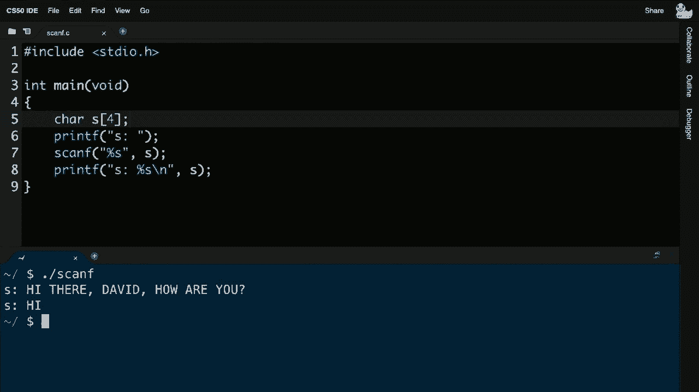

字节和我按下回车键，现在发生了一些奇怪的事情，其他的就完全丢失了。如果你试图获取类，这会非常令人恼火和沮丧。`getstring`可以为你避免这个问题，`getstring`会为你调用`malloc`，并为你分配一块尽可能大的内存。我们有点在关注他们的输入。

一个字符接一个字符，我们确保分配或重新分配足够的内存。`scanf`本质上就是一个像`cs50`库这样的函数在底层工作的方式。但它为你完成了所有这些事情，一旦你去掉像这样的训练轮，或者坦率地说，这样的库，这确实是，归根结底，它不仅仅是。

教学工具，这是一个有用的库，你必须开始自己实现更多的低级内容。所以，再次说，如果你不想这样，那没关系。现在的责任在于你避免所有这些可能的错误条件。好了，话虽如此，我们还有一个最后的特性，要为你提供，以激励本周的问题。

你将实际探索和操作并编写代码以更改文件，为此我们需要文件输入输出的最后一个主题，文件I/O是描述从文件中获取输入和输出的术语。到目前为止，我们编写的每个程序几乎只使用内存。

像这样，你可以放东西，结束，内容就消失了，内存的内容就没了。当然，文件是你我在计算机世界中保存我们的论文、文档、简历等所有东西的地方，永久保存于你的计算机上。在C中，你当然有能力自己编写代码来长期保存文件，所以例如让我继续编写我的。

在这里编写一个电话簿程序，将号码存储在文件中，我将继续包含**cs50**库，因为我不想处理`scanf`。我将把这个文件保存为phonebook.c。

也包含string.h，我将在我的主函数中继续使用一些新函数，虽然我们在这里只会简要看到，但在接下来的问题中，你将更详细地探索这些。我将给自己一个文件指针，结果奇怪的是，用大写的F-I-L-E，这是C语言中的一种新数据类型。

这个文件的表示方法是，我将为一个文件给自己一个指针。我可以将其命名为file，也可以叫f，或者叫x，我决定称之为小写的file，以便明确。我将使用`file open`，它需要两个参数，第一个参数是。

你想打开的文件名，我将打开一个名为phonebook.csv的文件，然后我将以不同的方式打开它，具体来说是以附加模式来读取它们，即查看其内容；写入则是完全更改其内容，逐行添加，以便不断增加。

为了向他们提供更多信息，我将继续并安全起见，我将说如果file等于null，因为回想一下，null表示出现了问题。我们就返回，可能我输入错误了文件名，可能它不存在，潜在地发生了什么问题，我将通过说如果来检查。

如果file等于null，就退出程序。我们可以称之为字符指针，现在叫name，我将询问用户的名字。我们之前做过，我将继续询问他们的电话号码，我们之前也做过，唯一的区别是我将调用字符串字符指针。

现在这很酷，如果我想将这个名称保存为 `csv`。如果不熟悉的话，这在咨询界和分析界很流行，它只是一个电子表格，一个用逗号分隔的表格。在 Excel、Numbers 或 Google 电子表格中，我要去**做**，而不是打印 `f`，而是将字符串名称和数字 `fprintf` 到那个文件中，然后在这里我要关闭。

这个文件是新的，`fprintf` 不是 `printf`，后者是输出到你的屏幕。`fprintf` 是输出到一个文件，所以你需要一个指向你想要的文件的指针。然后你将这些新的字符串发送给它，你仍然需要提供一个格式字符串。这个字符串告诉 `fprintf`，这是我想要输出到文件的数据类型，然后你就可以插入。

使用 `printf`，最后我们关闭文件，所以简而言之，这个程序似乎会提示人类输入姓名和号码，然后它将去**做**，文件。因此让我去**做**，制作电话簿，好吧到目前为止没有错误，点斜杠电话簿大卫 949。468-2750，好吧让我再运行一次，尽管看起来没有发生任何事情。

布莱恩，怎么样 617 495 1000，按回车让我检查一下我的文件浏览器。

请注意我们今天创建的所有文件，包括如果我放大。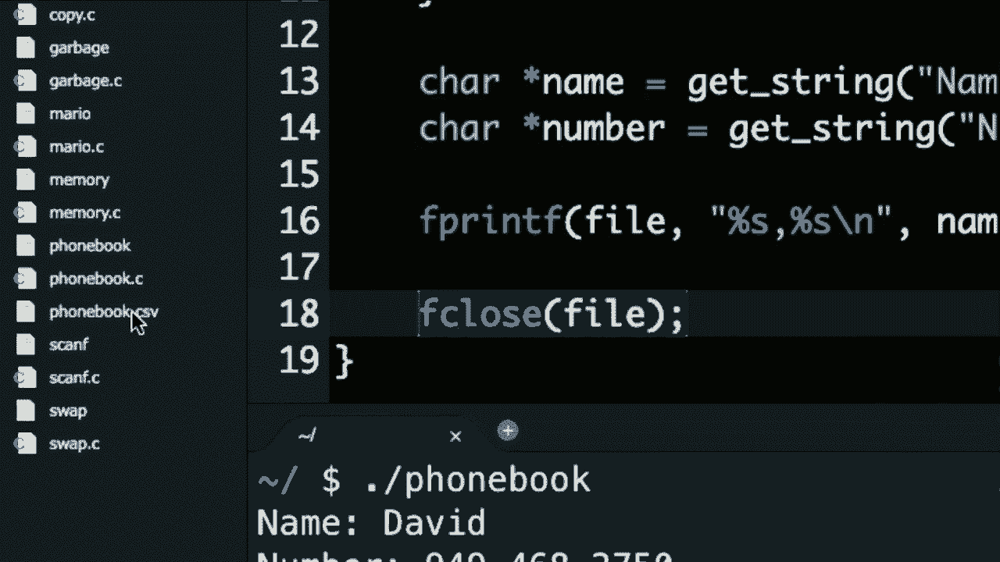

不仅仅是 `phonebook.c`，还有 `phonebook.csv`，如果我双击那个，注意里面有什么。我们的数字，甚至比这更酷，让我去**做**，关闭这个，让我去**做**，下载这个文件。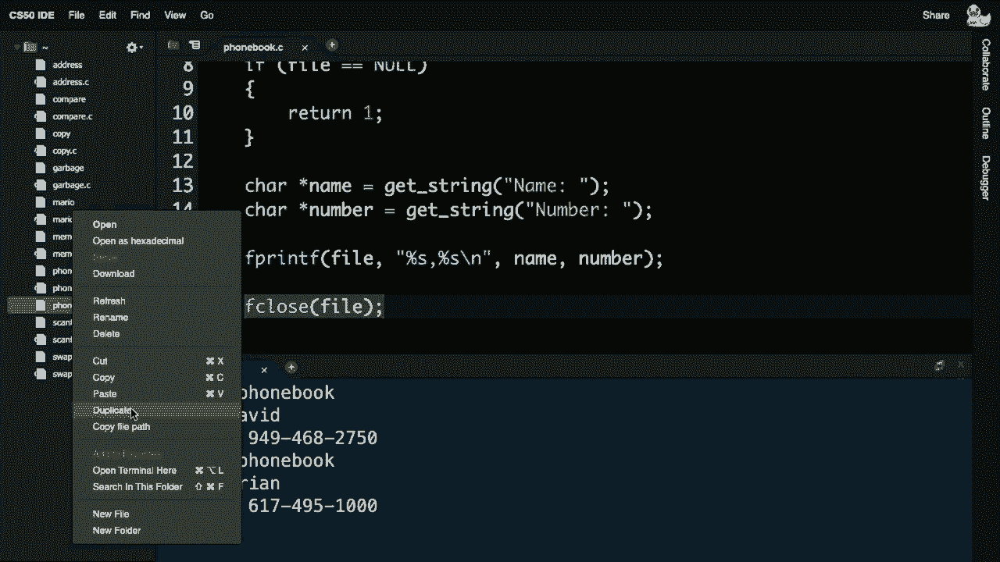

使用这个 IDE，它会将文件放入我的下载文件夹，让我去**做**，点击它，它会打开。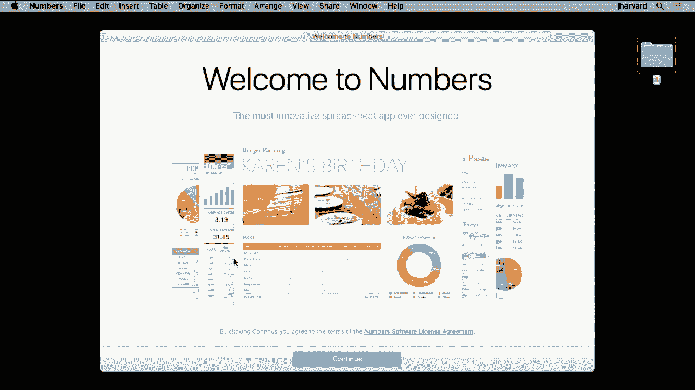

Excel、Numbers 或你在 Mac 或 PC 上拥有的任何其他软件。

我要去**做**，继续在这里格式化，但我打开了一个电子表格，是我自己使用 `f open`、`fprintf` 和 `f close` 生成的。因此，现在我们有指针可以操作文件，这非常酷，但我们要记住，这种思维方式，如果你稍微瞥一眼。

这可能看起来很神秘，它看起来像机器代码，但并不是。这或许是文件中微笑表情最简单的表示形式。如果你有位图文件，一张比特图，多个比特的网格，这些比特很简单，可以是零和一。如果你将黑色分配给零，白色分配给一，你可以。

实际上想想这个相同的网格。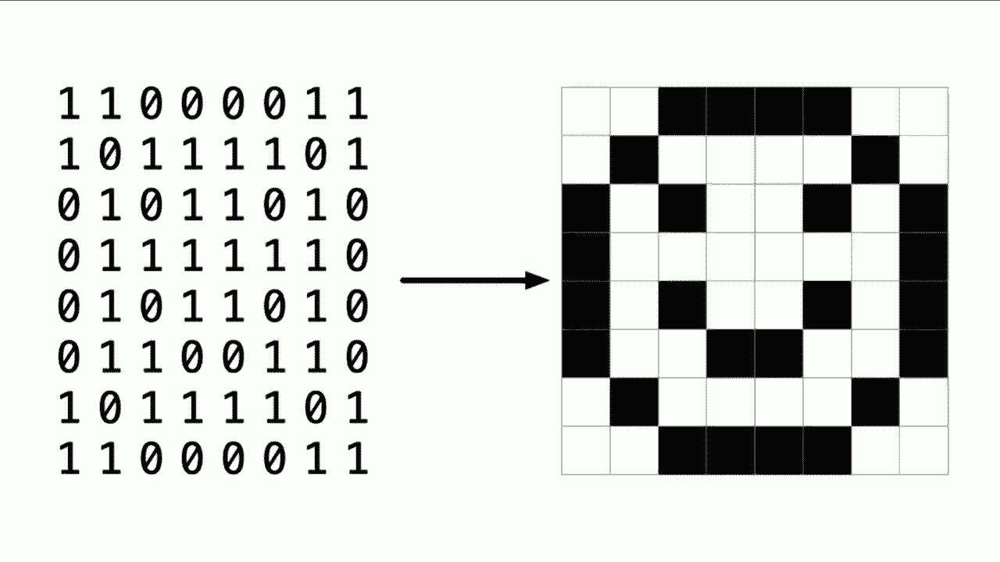

零和一确实代表了一个微笑的表情。换句话说，这里有一些像素，我们在零周讨论过像素。像素就是组成计算机上图形文件的点，而像素无处不在。现在所有人都通过 Zoom 或 YouTube 等平台实时收看，我们正在观看多幅图像的流。

每秒20到30帧，当然这些图像的清晰度是有限的，通常在电视和电影中都是如此。如果有一个坏人被监控视频拍到，通常人们会，增强视频并放大，看看那揭示了什么。 

谁犯了一些罪，嗯，那都是些胡说八道，这源于，第一周。实际上只是为了嘲弄这个，让我来，**继续播放**这部美国的电视节目，叫做《CSI》，只是为了让你感受一下这种。 

逻辑是我们知道的。

在9 15，雷·圣托亚在ATM前，所以问题是他在那儿做什么。

9 16，使用九毫米手枪射击。

也许他看到的是狙击手，或者在和它一起工作等等。

将他的脸放大到全屏，他的眼镜上有一个反射。

那是棒球队，那是他们的标志。

那是棒球队，那是他们的标志，他在和穿着夹克的人交谈。我们可能有目击者，目击了两起枪击事件。

所以不幸的是，今天将会毁掉你对很多电视和电影的期待，因为你不能无限放大，看到更多的信息，如果那信息根本不存在，最终只存在有限数量的位和，布莱恩。你可能会看到，哦，他眼中有一丝光芒，让我们看看。 

他眼中反射的是什么，如果我们在这张布莱恩的图片上放大，或许我们再放大一点，实际上就只有这些。你不能只点击增强按钮看到更多，因为归根结底，这些只是像素，而像素在第一周就是，只有零和一，并且是有限的。 

所以你所看到的就是你所得到的，现在，这里让我播放另外一个短片，来自《未来兄弟》，它也很好地强调了这一点。

但是更加调皮地放大那个死亡球体。

为什么仍然模糊，那就是我们所拥有的所有分辨率，放大并不会让它更清晰。

它在《CSI：迈阿密》中也有，所以我们有两个片段在互相谈论，但我必须为2020年更新一些内容，对吧？你如今在互联网上或杂志上，根本无法找到任何一篇不提到机器学习和人工智能，以及那些你能做以前无法做到的事情的复杂算法的内容。 

是不太可能的，这实际上是你可能还记得的情况，从零周开始。我们在哈佛档案馆发现了一幅美丽的水彩画，总共大约只有11英寸高，而现在却在我身后达到了13英尺的高度。通常，如果你只是增强这幅水彩画。

如果不加限制地进行，它看起来会很快变得非常愚蠢，伴随着许多许多的相机。就像档案馆所做的那样，捕捉原始图像，但我们想把它放大到13英尺高，这样它会一直存在，在某种意义上，所以长话短说，使用更高级的人工智能机器学习，来实际分析数据。

并寻找那些并不一定在原始图像中可见的模式。开始放大，这个分辨率看起来相当不错，但实际上这是。涂在真实画布上的，这只是使用Photoshop放大，但当通过复杂的基于机器学习的软件时，改进它，实际上不仅仅是看到这个窗口。

从其中一栋建筑物的顶部，Photoshop，你可以开始看到更多细节，所以在Photoshop中。这是在实际应用了复杂的人工智能算法后，这些算法注意到，等一下，那儿有一点变色，等一下，那儿有一点变色。而如今，增强功能正变得越来越普遍，它仍在推断，并不是。

复原信息实际上是通过算法来重构的，进一步说，你可能会看到这真的开始模糊了，如果你只是使用。Photoshop并不断放大，但如果你通过足够复杂的算法处理它，并开始注意到人眼看起来微小的差异，我们甚至可以进一步增强。

这并不是无限的，所以在某种意义上，我们在创造并不一定存在的信息。因此，这些东西是否在法庭上能够成立是另一个问题，但它可以提高我们的忠实度。从11英寸放大到13英尺，因此在操纵图像时，最终。

我们确实有一些程序能力，包括这个文件指针，就像我们刚刚看到的。还有一些其他功能，我们在这里的最终示例将在接下来的一周中展示。也就是用新获得的指针和地址理解，操作你自己的图形文件，实例，我要去啊**d打开一个程序。

叫做等我一下，我要打开一个程序，叫做jpeg.c。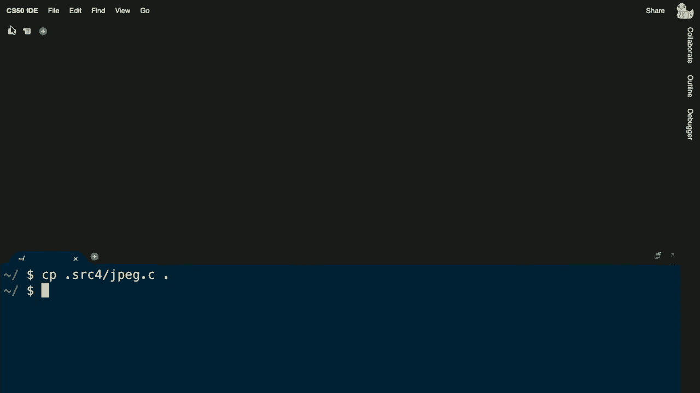

这个程序jpeg.c是我提前写好的，已在课程网站上发布，类型。叫做字节，事实证明在C语言中，没有对字节的共同定义。我们所知道的字节是八位，而创建字节的最简单方法就是自己定义，就像我们定义字符串一样。

就像我们定义其他类型一样，像学生，为了或一个人，实际上是为了。代码只是声明一个称为字节的数据类型，使用另一种更晦涩的数据类型，称为u。和一个下划线t，但在问题集中会更详细，这只是做了一个称为字节的事件。注意在这个程序中，我复活了第二周命令行中的概念，用户。

注意我在检查用户，立即返回1以表示第17行中的错误。我在使用我的新技术，打开一个文件，使用人类在命令行中输入的文件名，这次我打开它以读取，带引号的“r”，所以如果，bang文件，即如果感叹号，文件或如果文件等于不，那些意味着同样的事情。

我可以去ah**d并返回1，表示一个错误，在这里我做一些小聪明，结果是，以非常高的概率你可以，仅通过查看文件的前三个字节，确定任何文件是否为jpeg。许多文件格式在其文件开头有称为魔法数字的东西，而这些是行业标准。

一或二或三或更多的数字，通常被期望在文件的开头，以便程序可以快速检查这是否是jpeg。这是gif，是否是word文档，是否是excel文件，它们在开头往往有这些数字，而jpeg有一个字节序列，我们。

关于看到这行代码24，在接下来的问题集中，你将看到这如何给自己提供一个字节的缓冲区，特别是一个三字节的数组。接下来的这行代码，你将在本周看到，称为f read，f read顾名思义是读取一个文件，使用起来有点复杂，但。

随着时间的推移，你会对此感到更舒适，它读取到这个缓冲区的第一个。参数是这个数据类型的大小，即字节的大小，并且它从这个文件中读取这么多。这是四个参数，从我们看到的来看，这有点多，但它从这个文件中读取三个。

字节进入这个数组，也就是缓冲区，称为字节，所以这就是你，文件的方式。但从中读取它，然后注意这里，圆圈，如果字节的括号0等于oxf，且字节的括号1等于ox d8，且字节的括号2等于ox。ff 这对你来说确实显得神秘，但这只是因为我在手册中查找了jpeg。

结果几乎任何jpeg，必须以oxf oxd8 oxf开头。这是你在Mac、PC或互联网上的任何jpeg的前三个字节。总是有这三个字节，结果第四个字节进一步决定一个文件是否，实际上是jpeg，但算法很简单。

如果文件的前三个字节是这些，或许你有一个jpeg。但如果你没有完全是这些jpeg，我可以在今天的代码中这样做。让我去ah**d并抓取两个我带来的其他文件，其中一个恰好是一张照片，呃给我一秒，我带来了。

一些文件，其中一个叫做brian.jpg。

这是brian的同一张照片，然后我有一个gif，当然不是jpeg。

这里是一只猫在打字，而我面前实际上有一个程序，如果我生成jpeg，因为这个配置文件是jpeg.c，我运行`./jpeg`，可以在命令行输入类似cat.gif的内容作为参数，按下回车，我应该看到没有，作为参数的命令行，我也许会再看到一次。

也许只有因为实际上判定某事的算法，而不是那样。但确实我现在可以访问，单独的字节，因此，像素似乎是的fo的。这，让我去啊**d并给你展示一个我们故意提前写的，程序，只是为了让你尝试一下，接下来问题集的内容。

这个程序是你可能使用过一次或多次的程序cp的重新实现。回想一下cp是一个程序，在ide和更一般的linux中，允许你复制文件，你执行`cp filename`，这怎么工作，我现在拥有所有的构建块来复制，字节在这里，我将`main`定义为接受命令行参数。

这里的参数，注意一个变化，我没有使用cs50库，因此即使是之前的字符串在第二周，现在也是`char *`，即使在这里对于argv，我确保人类输入三句话，程序的名称，源文件和目标文件。我再次使用`fopen`，打开源文件，这里来自`argv[1]`，我确保它是。

不是空的，然后我如果是空的就退出，接着这里有些新的东西，打开目标文件，这里也是使用`fopen`，但我使用的是“w”，我打开一个文件为“r”，一个文件为“w”，因为我想从一个读取并写入到另一个，然后在这里这个循环，另一个，我给自己一个一字节的缓冲区，所以只是一个临时变量，就像。

brian的临时或空玻璃，我使用这个函数`fread`，我正在通过它的地址将一个字节的大小读入那个缓冲区，具体来说是一个字节，使用相同的循环。我正在将这个缓冲区的字节大小，具体来说是一个字节，写入目标，所以字面上讲，你可能看到我使用的cp程序。

你自己已经用来复制文件，实际上是在做这个，它打开一个文件，遍历它的所有字节，然后最后，关闭文件，这最后两个例子故意快速，因为这一整周将花费时间深入文件输入输出和图像。呃，但我们所做的就是使用这个，`fread`、`fopen`和`fwrite`。

和`fclose`来操作那些文件，所以例如如果我现在这样做。让我做`make cp`，好像编译通过了，`./cp`。

brian.jpg，如何关于brian2.jpg，按下回车似乎没有发生什么，但如果我进去这里，我们有第二个。

brian的实际文件副本，因此，这有多种图像文件格式，第一个是jpegs，我们将给你一个所谓的法医图像，来自数码记忆卡的一堆照片，事实上，今天这非常普遍，尤其是在执法中，获取硬盘、媒体棒、手机和其他设备的法医副本。

然后分析它们，以找回丢失、损坏或删除的数据。我们将确切地这样做，你将编写一个程序来恢复意外删除的jpegs，就像从数码记忆卡中删除的，并将给你那张记忆卡的所有副本，通过制作一个法医图像，也就是相机。

并将它们放在一个文件中，你可以读取，然后从中进行操作，我们还会介绍位图文件bmps，它们在Windows操作系统中被普及，用于墙纸等，但我们将利用它们来实现你自己的类似Instagram的滤镜，所以我们将以本周的步行桥这张图片为例。

在麻省剑桥的哈佛大学，我们将让你实现多个滤镜，举例来说，从这个原始图像开始，并通过自上而下、自左而右迭代所有像素，将其去饱和，使其变成黑白，识别任何颜色，如红色、绿色或蓝色，或介于两者之间的颜色。

并将它们更改为某种灰色阴影，做一个棕褐色滤镜，使事情看起来。老派，就像这张照片是多年前拍摄的一样，通过类似应用的启发式方法，改变这张图片中所有像素的颜色，我们会让你翻转它。因此你必须把这个像素放在这里，把那个像素放在那儿。

你会确切地理解文件是如何实现的，实际上。这并不是意外，使得这里的情况更难以看清，因为你开始在平均值之间来，变得更难以看清，所以即使你选择实现边缘检测，你会感觉更舒适。

这些图片中所有物理对象的边缘。为了在代码中实际检测它们，并创造出这样的视觉艺术，现在这确实是很多内容，我知道指针通常被认为是C语言中更具挑战性的特性，当然在编程中也是如此，因此如果你感觉。

已经过去了一段时间，但你现在有能力。无论是今天还是在不久的将来，甚至可以理解像这样的xkcd漫画，所以我们今天的最后一幕是关于这个笑话，你，时刻，一个非常。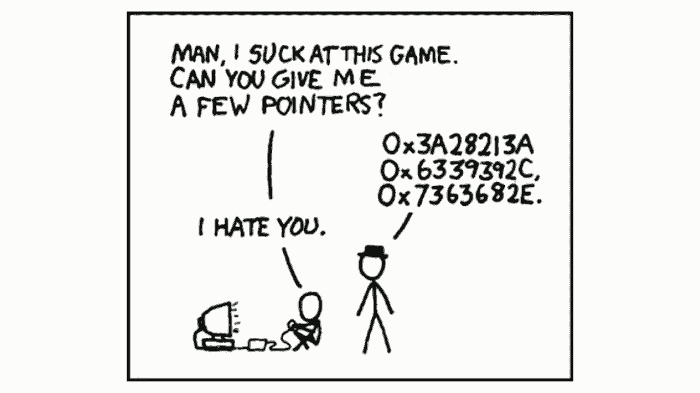

狂 geeky 的笑声，我看到至少有一些微笑，这让人感到安慰。这就是cs50，我们下次见！
