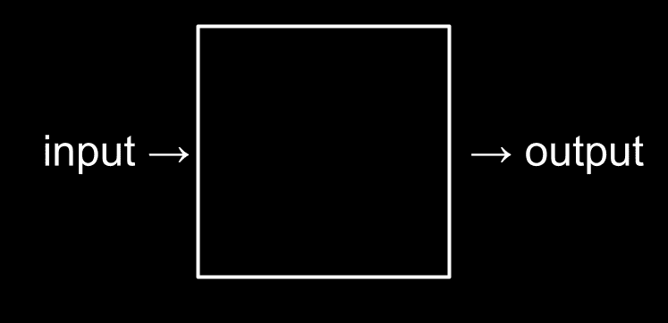
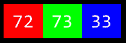
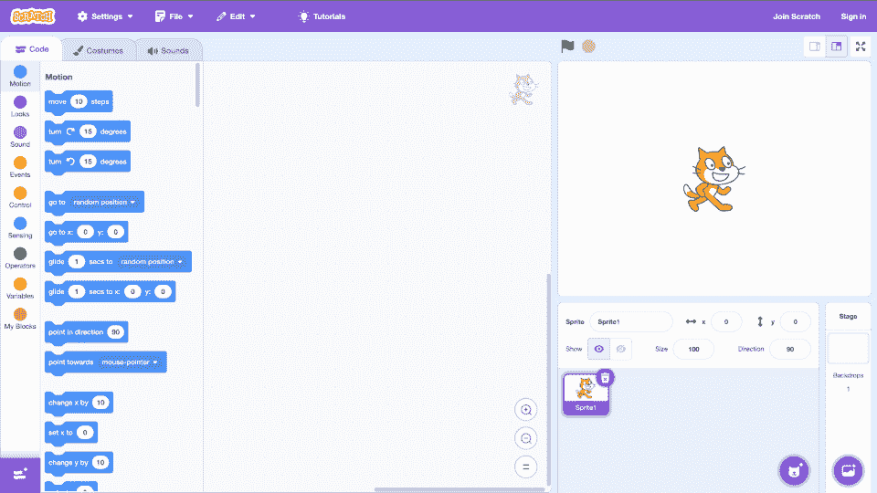
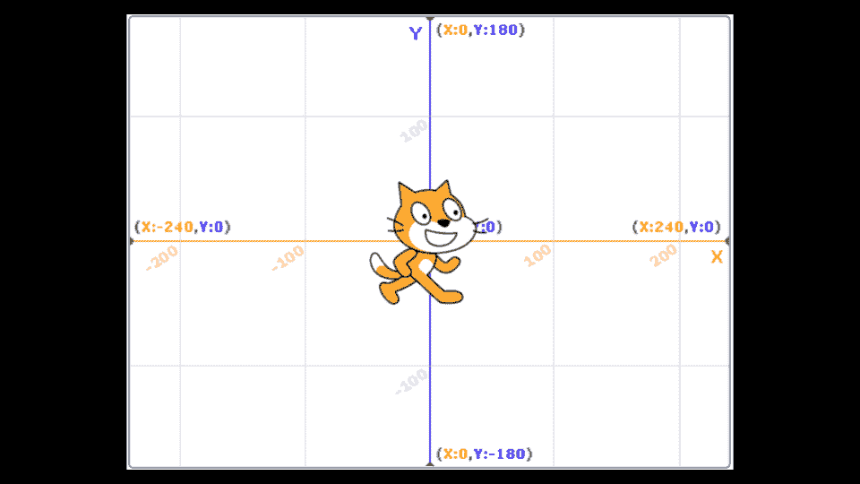
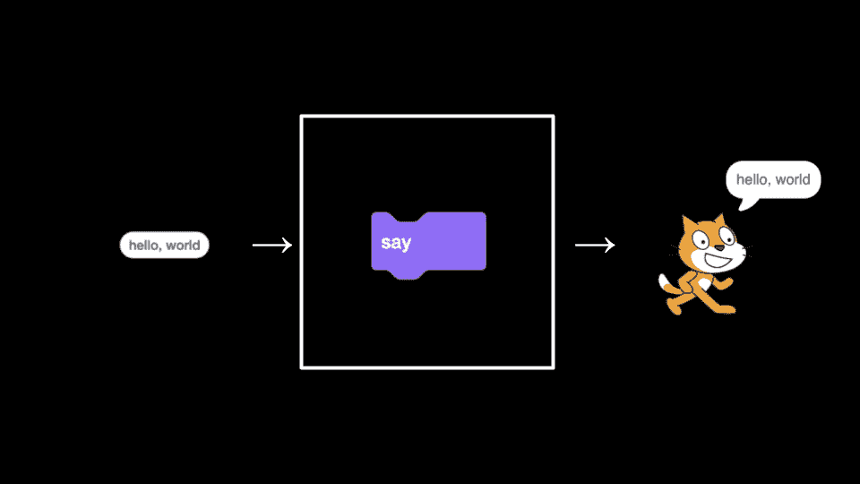
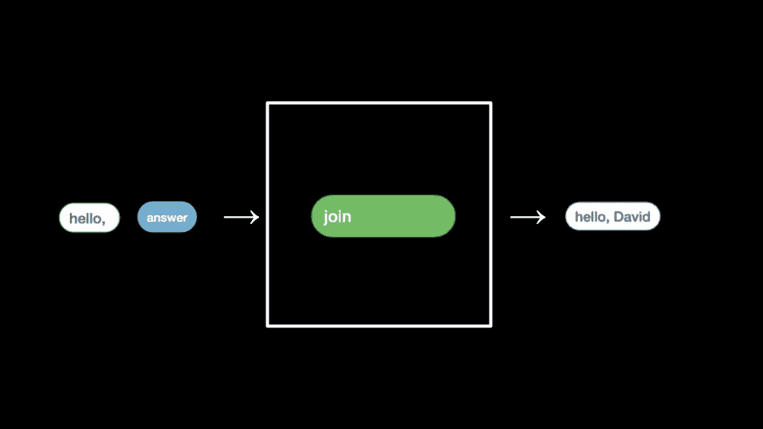
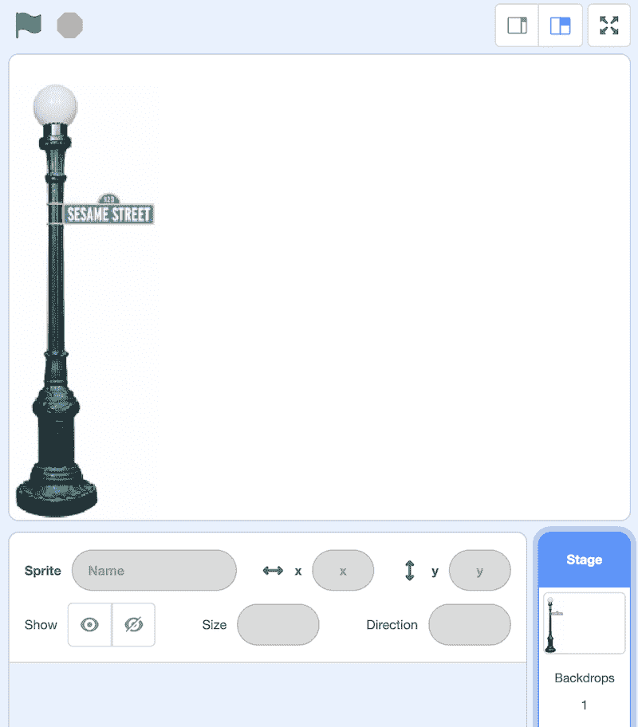

# 讲座 0

> 原文：[`cs50.harvard.edu/x/notes/0/`](https://cs50.harvard.edu/x/notes/0/)

+   欢迎！

+   社区！

+   计算机科学和问题解决

+   ASCII

+   Unicode

+   RGB

+   算法

+   伪代码

+   人工智能

+   未来展望

+   Scratch

+   Hello World

+   你好，你

+   喵喵和抽象

+   条件语句

+   Oscartime

+   Ivy 的最难游戏

+   总结

## 欢迎！

+   这门课程不仅仅是关于计算机编程！您在这门课程中学到的实用技能可能会对您的生活和超越计算机科学的学习产生影响。

+   事实上，这门课程是关于以极其赋权的方式解决问题的！您可能会在这里学习到解决问题的方法，这些方法可能会立即应用到您课程之外的工作，甚至您的整个职业生涯中！

+   然而，这不会容易！在本课程中，您将“从火炉中喝水”般地吸收知识。您将在接下来的几周内对您将能够完成的事情感到惊讶。

+   本课程更多地是关于您从“今天的位置”提升“您自己”，而不是达到某个想象中的标准。

+   本课程最重要的开场考虑因素：给出您通过本课程学习所需的时间。每个人的学习方式都不同。如果一开始某件事没有做好，请记住，随着时间的推移，您的技能会不断增长。

+   如果这是您第一次上计算机科学课程，请不要害怕！对于大多数同学来说，这也是他们的第一次计算机科学课程！此外，助教、课程助理和您的同伴社区都在这里帮助您！

## 社区！

+   您是哈佛学院、哈佛大学扩展学院以及通过 edX.org 参加此课程的学习者社区的一部分。

+   我们希望您能加入我们（无论是在现场还是虚拟地）参加[CS50 解谜日](https://cs50.harvard.edu/college/2024/fall/puzzles/)和[CS50 展览](https://www.youtube.com/watch?v=JJPbXou4-0o&list=PLhQjrBD2T381cvtjW82tGZBjIdanUUnk9)。

+   如果您是哈佛校园的学生，您可以参加 CS50 午餐和[CS50 黑客马拉松](https://youtu.be/wTT5ahmaUAc?si=C1h4vW3OYM6NVwKu)。

## 计算机科学和问题解决

+   从本质上讲，计算机编程是关于接收一些输入并创建一些输出——从而解决问题。输入和输出之间发生的事情，我们称之为“黑盒”，是本课程的重点。

    

+   例如，我们可能需要为课程点名。我们可以使用名为*一进制*（也称为*基-1*）的系统逐个计数手指。

+   今天的计算机使用称为*二进制*的系统进行计数。我们从这个术语*二进制位*得到了一个熟悉的术语，称为*比特*。一个*比特*是一个零或一：开启或关闭。

+   计算机只使用零和一进行交流。零代表*关闭*。一代表*开启*。计算机由数百万甚至数十亿的晶体管组成，这些晶体管被打开和关闭。

+   如果你想象使用一个灯泡，单个灯泡只能从零计数到一。

+   然而，如果你有三个灯泡，你就有更多的选择！

+   在你的 iPhone 中，有数百万被称为*晶体管*的小灯泡，它们使这个设备能够进行每天可能被视为理所当然的活动。

+   作为一种启发式方法，我们可以想象以下值代表我们*二进制位*中的每个可能位置：

    [PRE0]

+   使用三个灯泡，以下可以表示零：

    [PRE1]

+   同样，以下表示一个：

    [PRE2]

+   按照这个逻辑，我们可以提出以下等于二：

    [PRE3]

+   进一步扩展这个逻辑，以下表示三个：

    [PRE4]

+   四将表示为：

    [PRE5]

+   实际上，我们只使用三个灯泡就可以计数到七！

    [PRE6]

+   计算机使用二进制计数。这可以表示如下：

    [PRE7]

+   因此，可以说要表示高达七的数字，需要三个比特（四位、二位和一位）。

+   同样，为了计数高达八的数字，值将表示如下：

    [PRE8]

+   计算机通常使用八个比特（也称为一个*字节*）来表示一个数字。例如，`00000101`是二进制中的数字 5。`11111111`代表数字 255。你可以想象零如下：

    | 128 | 64 | 32 | 16 | 8 | 4 | 2 | 1 |
    | --- | --- | --- | --- | --- | --- | --- | --- |
    | 0 | 0 | 0 | 0 | 0 | 0 | 0 | 0 |

## ASCII

+   正如数字是零和一的二进制模式一样，字母也是用零和一表示的！

+   由于表示数字和字母的零和一之间存在重叠，因此创建了*ASCII*标准来将特定的字母映射到特定的数字。

+   例如，字母`A`被决定映射到数字 65。`01000001`在二进制中表示数字 65。你可以这样想象：

    | 128 | 64 | 32 | 16 | 8 | 4 | 2 | 1 |
    | --- | --- | --- | --- | --- | --- | --- | --- |
    | 0 | 1 | 0 | 0 | 0 | 0 | 0 | 1 |

+   如果你收到一条短信，那条短信下的二进制可能代表数字 72、73 和 33。将这些映射到 ASCII，你的信息如下所示：

    [PRE9]

+   感谢像 ASCII 这样的标准，它使我们能够就这些值达成一致！

+   这里是 ASCII 值的扩展映射：

    | 0 | NUL | 16 | DLE | 32 | SP | 48 | 0 | 64 | @ | 80 | P | 96 | ` | 112 | p |   |
    | --- | --- | --- | --- | --- | --- | --- | --- | --- | --- | --- | --- | --- | --- | --- | --- | --- |
    | 1 | SOH | 17 | DC1 | 33 | ! | 49 | 1 | 65 | A | 81 | Q | 97 | a | 113 | q |   |
    | 2 | STX | 18 | DC2 | 34 | ” | 50 | 2 | 66 | B | 82 | R | 98 | b | 114 | r |   |
    | 3 | ETX | 19 | DC3 | 35 | # | 51 | 3 | 67 | C | 83 | S | 99 | c | 115 | s |   |
    | 4 | EOT | 20 | DC4 | 36 | $ | 52 | 4 | 68 | D | 84 | T | 100 | d | 116 | t |   |
    | 5 | ENQ | 21 | NAK | 37 | % | 53 | 5 | 69 | E | 85 | U | 101 | e | 117 | u |   |
    | 6 | ACK | 22 | SYN | 38 | & | 54 | 6 | 70 | F | 86 | V | 102 | f | 118 | v |   |
    | 7 | BEL | 23 | ETB | 39 | ’ | 55 | 7 | 71 | G | 87 | W | 103 | g | 119 | w |   |
    | 8 | BS | 24 | CAN | 40 | ( | 56 | 8 | 72 | H | 88 | X | 104 | h | 120 | x |   |
    | 9 | HT | 25 | EM | 41 | ) | 57 | 9 | 73 | I | 89 | Y | 105 | i | 121 | y |   |
    | 10 | LF | 26 | SUB | 42 | * | 58 | : | 74 | J | 90 | Z | 106 | j | 122 | z |   |
    | 11 | VT | 27 | ESC | 43 | + | 59 | ; | 75 | K | 91 | [ | 107 | k | 123 | { |   |
    | 12 | FF | 28 | FS | 44 | , | 60 | < | 76 | L | 92 | \ | 108 | l | 124 |   |   |
    | 13 | CR | 29 | GS | 45 | - | 61 | = | 77 | M | 93 | ] | 109 | m | 125 | } |   |
    | 14 | SO | 30 | RS | 46 | . | 62 | > | 78 | N | 94 | ^ | 110 | n | 126 | ~ |   |
    | 15 | SI | 31 | US | 47 | / | 63 | ? | 79 | O | 95 | _ | 111 | o | 127 | DEL |   |

+   如果您愿意，您可以了解更多关于[ASCII](https://en.wikipedia.org/wiki/ASCII)的信息。

+   由于二进制只能计数到*255*，我们受限于 ASCII 表示的字符数量。

## Unicode

+   随着时间的推移，通过文本进行交流的方式越来越多。

+   由于二进制中没有足够的数字来表示人类可以表示的所有各种字符，*Unicode*标准扩展了计算机可以传输和理解的位数。Unicode 不仅包括特殊字符，还包括 emoji。

+   有一些 emoji 您可能每天都在使用。以下可能对您来说很熟悉：

    😀 😃 😄 😁 😆 😅 😂 🙂 🙃 😉 😊 😇 😍 😘 😗 😙 😚 😋 😛 😜 😝 🤑 🤓 😎 🤗 😏 😶 😐 😑 😒 🙄 😬 😕 ☹️ 😟 😮 😯 😲 😳 😦 😧 😨

+   尽管在 Unicode 中零和一的模式是标准化的，但每个设备制造商可能比另一个制造商稍微不同地显示每个 emoji。

+   Unicode 标准正在添加越来越多的功能来表示更多的字符和 emoji。

+   如果您愿意，您可以了解更多关于[Unicode](https://en.wikipedia.org/wiki/Unicode)的信息。

+   如果您愿意，您可以了解更多关于[emoji](https://en.wikipedia.org/wiki/Emoji)的信息。

## RGB

+   零和一可以用来表示颜色。

+   红色、绿色和蓝色（称为`RGB`）是三个数字的组合。

    

+   使用我们之前使用的 72、73 和 33，通过文本表示`HI!`，会被图像阅读器解释为浅黄色。红色值是 72，绿色值是 73，蓝色值是 33。

    

+   代表红色、蓝色和绿色（或*RGB*）各种颜色的三个字节构成了任何数字图像中每个*像素*（或点）的颜色。图像仅仅是 RGB 值的集合。

+   零和一可以用来表示图像、视频和音乐！

+   视频是由许多存储在一起的图像组成的序列，就像一本翻页书一样。

+   音乐可以使用各种字节的组合以类似的方式表示。

## 算法

+   问题解决是计算机科学和计算机编程的核心。*算法*是一系列逐步指令，用于解决问题。

+   想象一下在电话簿中尝试找到单个名字的基本问题。

+   如何进行这种操作呢？

+   一种方法可能是简单地从第一页读到下一页，再读到下一页，直到到达最后一页。

+   另一种方法可能是每次搜索两页。

+   最后一种可能更好一点的方法可能是去电话簿的中间，问：“我要找的名字是在左边还是右边？”然后，重复这个过程，将问题分成一半，再分成一半，再分成一半。

+   每种方法都可以称为算法。这些算法的速度可以用所谓的*大 O 表示法*来表示如下：

    

    注意，第一个算法，用红色突出显示的，其大 O 为`n`，因为如果电话簿中有 100 个名字，可能需要尝试多达 100 次才能找到正确的名字。第二个算法，每次搜索两页，其大 O 为`n/2`，因为我们通过页面的速度是两倍。最后一个算法的大 O 为 log[2]n，因为问题加倍只会导致解决问题的关键步骤增加一个。

+   程序员将基于文本的人类指令翻译成代码。

## 伪代码

+   将指令转换为代码的过程称为*伪代码*。

+   能够创建*伪代码*对于在这个课程和计算机编程中的成功至关重要。

+   伪代码是你代码的人类可读版本。例如，考虑上面的第三个算法，我们可以编写如下伪代码：

    [PRE10]

+   伪代码是一种非常重要的技能，至少有两个原因。首先，在你创建正式代码之前进行伪代码，这让你能够提前思考问题的逻辑。其次，当你进行伪代码时，你可以后来向寻求理解你的编码决策和代码工作方式的人提供这些信息。

+   注意，我们伪代码中的语言有一些独特的特点。首先，其中一些行以动词开头，如*拿起*、*打开*、*查看*。稍后，我们将这些称为*函数*。

+   第二，注意一些行包括像`if`或`else if`这样的语句。这些被称为*条件语句*。

+   第三，注意有些表达式可以表述为*真*或*假*，例如“人在书的更早位置。”我们称之为*布尔表达式*。

+   最后，注意其中有一些语句，如“回到第 3 行。”我们称之为*循环*。

+   这些构建块是编程的基础。

+   在以下讨论的*Scratch*环境中，我们将使用上述每个编程的基本构建块。

## 人工智能

+   考虑如何利用上述构建块来开始创建我们自己的人工智能。看看以下伪代码：

    [PRE11]

    注意，仅仅为了编程少量交互，就需要许多行代码。要编程成千上万或数万种可能的交互，需要多少行代码？

+   与上述编程对话式 AI 不同，AI 程序员在大型数据集上训练*大型语言模型*（LLMs）。

+   LLMs 会观察大量语言中的模式。这些语言模型试图猜测单词之间或旁边的最佳猜测。

+   虽然基于 AI 的软件在生活和工作的许多领域都非常有用，但我们规定，除了 CS50 自家的软件外，使用其他基于 AI 的软件是*不合理的*。

+   CS50 自家的 AI 软件工具[CS50.ai](https://cs50.ai)是一个 AI 助手，您可以在本课程中使用它。它将帮助您，但不会给出课程问题的全部答案。

+   在本课程中，您不得使用任何 AI，除了[CS50.ai](https://cs50.ai)。

## 前方展望

+   本周您将学习 Scratch，一种可视化编程语言。

+   然后，在未来的几周里，您将学习 C 语言。它看起来可能如下：

    [PRE12]

+   通过学习 C 语言，您将为未来在其他编程语言（如*Python*）中的学习做好准备。

+   此外，随着课程的进行，您将学习算法。

+   C 语言之所以具有挑战性，是因为标点符号。今天我们将暂时放下这些标点符号和语法，我们将只使用一种名为 Scratch 的编程语言中的思想。

## Scratch

+   *Scratch*是由麻省理工学院开发的一种可视化编程语言。

+   Scratch 使用了我们在本讲座中早期介绍过的相同的基本编码构建块。

+   Scratch 是一个很好的入门计算机编程的方式，因为它允许您以可视化的方式玩这些构建块，而不必担心大括号、分号、括号等语法。

+   Scratch `IDE`（集成开发环境）看起来如下：

    

    注意，在左侧有一个您可以在编程中使用的小组件调色板。在组件调色板的正右方，是您可以拖动组件来构建程序的区域。再往右，您可以看到猫站立的*舞台*。舞台是您的编程变得生动的地方。

+   Scratch 在以下坐标系统上运行：

    

    注意，舞台的中心位于坐标(0,0)。目前，猫的位置就在那个位置。

## Hello World

+   首先，将“当绿色旗帜点击”积木拖动到编程区域。然后，将`say`积木拖动到编程区域，并将其连接到前面的积木。

    [PRE13]

    注意，现在当你点击舞台上的绿色旗帜时，猫会说，“你好，世界。”

+   这很好地说明了我们之前讨论的编程内容：

    

    注意，输入`hello, world`被传递给函数`say`，而这个函数运行的*副作用*是猫说`hello, world`。

## 你好，您

+   我们可以通过让猫对特定的人说“你好”来使你的程序更具交互性。按如下方式修改你的程序：

    [PRE14]

    注意，当点击绿色旗帜时，会运行函数`ask`。程序会提示你，用户，`你叫什么名字？`然后程序将这个名字存储在名为`answer`的*变量*中。然后程序将`answer`传递给一个特殊函数`join`，该函数将两个文本字符串`hello`和提供的任何名字结合起来。实际上，`answer`返回一个值给`join`。这些共同传递给`say`函数。猫说`Hello,`和一个名字。你的程序现在具有交互性。

+   在整个课程中，你将向算法提供输入并获取输出（或副作用）。这可以用上述程序如下表示：

    

    注意，输入`hello,`和`answer`被提供给`join`，导致副作用为`hello, David`。

+   类似地，我们可以按如下方式修改我们的程序：

    [PRE15]

    注意，当点击绿色旗帜时，这个程序将相同的变量，与`hello`连接，传递给一个名为`speak`的函数。

## 喵喵和抽象

+   除了伪代码，*抽象*是计算机编程中的一个基本技能和概念。

+   抽象是将问题简化为越来越小的问题的行为。

+   例如，如果你要为你的朋友们举办一场盛大的晚宴，必须亲自烹饪整个晚宴的*问题*可能会相当令人压倒！然而，如果你将烹饪晚宴的任务分解成越来越小的任务（或问题），那么制作这道美味佳肴的大任务可能会感觉不那么具有挑战性。

+   在编程中，甚至在 Scratch 中，我们都可以看到抽象的作用。在你的编程区域中，编写如下程序：

    [PRE16]

    注意到你在反复做同样的事情。确实，如果你发现自己反复编写相同的语句，那么你很可能能够更巧妙地编程——通过抽象移除重复的代码。

+   你可以按如下方式修改你的代码：

    [PRE17]

    注意，循环确实与上一个程序做了同样的事情。然而，问题通过将重复抽象到一个为我们重复代码的块中而简化了。

+   我们甚至可以通过使用 `define` 积木来进一步改进，在那里您可以创建自己的积木（自己的函数）！按照以下方式编写代码：

    [PRE18]

    注意，我们正在定义一个名为 `meow` 的自定义积木。该函数播放声音 `meow`，然后等待一秒钟。下面，您可以看到当点击绿色标志时，我们的 `meow` 函数会重复三次。

+   我们甚至可以提供一个方法，使函数可以接受输入 `n` 并重复多次：

    [PRE19]

    注意 `n` 是从 “meow n times” 中获取的。`n` 通过 `define` 积木传递给 `meow` 函数。

+   总体来说，注意这个改进过程如何导致代码质量不断提高。此外，注意我们如何创建自己的算法来解决一个问题。您将在整个课程中练习这两项技能。

## 条件语句

+   *条件语句* 是编程的必要构建块，其中程序会检查是否满足特定条件。如果满足条件，程序就会执行某些操作。

+   为了说明条件语句，编写以下代码：

    [PRE20]

    注意，`forever` 积木被用来触发 `if` 积木，使其可以不断地检查猫是否触摸到鼠标指针。

+   我们可以按照以下方式修改我们的程序，以集成视频感应：

    [PRE21]

+   记住，编程通常是一个试错的过程。如果你感到沮丧，花时间通过谈话来解决问题。你现在正在解决的具体问题是什么？什么在起作用？什么不起作用？

## Oscartime

+   *Oscartime* 是大卫自己的 Scratch 程序之一——尽管音乐可能因为他在创建此程序时听了很长时间而让他感到困扰。花几分钟时间亲自玩一下这个游戏。

+   我们自己构建 Oscartime，首先添加路灯。

    

+   然后，编写以下代码：

    [PRE22]

    注意，将鼠标移到奥斯卡身上会改变他的服装。您可以通过[探索这些代码积木](https://scratch.mit.edu/projects/565100517)了解更多信息。

+   然后，按照以下方式修改您的代码，以创建一个下落的垃圾块：

    [PRE23]

    注意，垃圾在 y 轴上的位置始终从 180° 开始。x 位置是随机的。当垃圾在地板上方时，它会每次下落 3 像素。您可以通过[探索这些代码积木](https://scratch.mit.edu/projects/565117390)了解更多信息。

+   接下来，按照以下方式修改您的代码，以便允许拖动垃圾。

    [PRE24]

    您可以通过[探索这些代码积木](https://scratch.mit.edu/projects/565119737)了解更多信息。

+   接下来，我们可以按照以下方式实现得分变量：

    [PRE25]

    您可以通过[探索这些代码积木](https://scratch.mit.edu/projects/565472267)了解更多信息。

+   尝试完整的游戏 [Oscartime](https://scratch.mit.edu/projects/277537196)。

## Ivy 的最难游戏

+   从 Oscartime 转移到 Ivy 的最难游戏，我们现在可以想象如何在程序中实现移动。

+   我们程序有三个主要组件。

+   首先，编写如下代码：

    [PRE26]

    注意到当点击绿色标志时，我们的精灵会移动到舞台中心坐标（0,0），然后监听键盘并检查墙壁，永远如此。

+   其次，添加这组代码块：

    [PRE27]

    注意到我们创建了一个自定义的`监听键盘`脚本。对于键盘上的每个箭头键，它都会将精灵在屏幕上移动。

+   最后，添加这组代码块：

    [PRE28]

    注意到我们还有一个自定义的`感觉墙壁`脚本。当精灵碰到墙壁时，它会将其移回安全位置——防止它走出屏幕。

+   你可以通过[探索这些代码块](https://scratch.mit.edu/projects/326129433)了解更多信息。

+   Scratch 允许同时屏幕上有许多精灵。

+   添加另一个精灵，将以下代码块添加到你的程序中：

    [PRE29]

    注意到耶鲁精灵似乎通过来回移动阻碍了哈佛精灵。当它碰到墙壁时，它会转身直到再次碰到墙壁。你可以通过[探索这些代码块](https://scratch.mit.edu/projects/565127193)了解更多信息。

+   你甚至可以让一个精灵跟随另一个精灵。添加另一个精灵，将以下代码块添加到你的程序中：

    [PRE30]

    注意到麻省理工学院的标志现在似乎围绕着哈佛学院的标志。你可以通过[探索这些代码块](https://scratch.mit.edu/projects/565479840)了解更多信息。

+   尝试完整的游戏[Ivy’s Hardest Game](https://scratch.mit.edu/projects/565742837)。

## 总结

在本节课中，你学习了这门课程如何位于计算机科学和编程的广阔世界中。你学习了……

+   很少有学生在来这门课之前有编程经验！

+   你并不孤单！你是这个社区的一部分。

+   计算机科学家工作中解决问题的本质。

+   这门课程不仅仅是关于编程——这门课程将向你介绍一种新的学习方法，你几乎可以将其应用到生活的各个领域。

+   数字、文本、图像、音乐和视频是如何被计算机理解和表示的。

+   假设编程的基本编程技能。

+   在本课程中利用 AI 的合理和不合理方式。

+   抽象如何在你的未来课程工作中发挥作用。

+   编程的基本构建块，包括函数、条件、循环和变量。

+   如何在 Scratch 中构建项目。

这就是 CS50！欢迎加入我们！下次再见！
