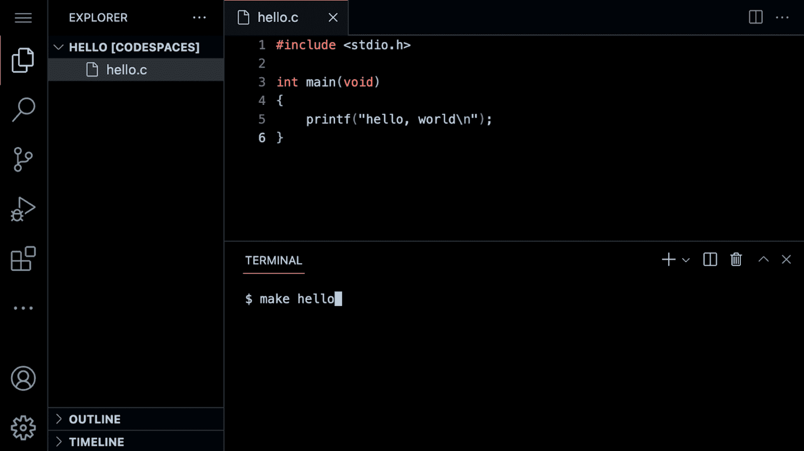
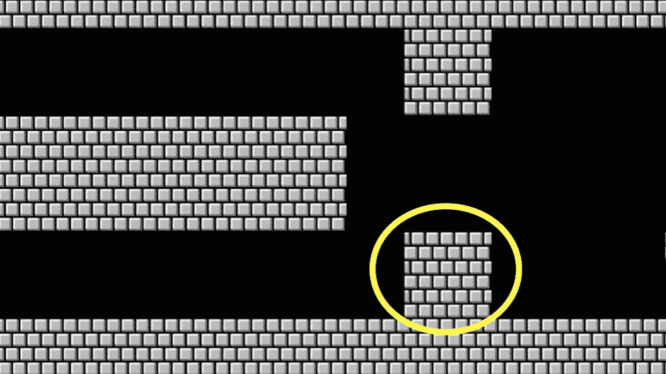

# 讲座 1

> 原文：[`cs50.harvard.edu/x/notes/1/`](https://cs50.harvard.edu/x/notes/1/)

+   欢迎！

+   CS50 的 Visual Studio Code

+   Hello World

+   从零开始学 C

+   头文件和 CS50 手册页

+   你好，你

+   类型

+   条件语句

+   运算符

+   变量

+   compare.c

+   agree.c

+   循环和 meow.c

+   函数

+   正确性、设计、风格

+   马里奥

+   注释

+   更多关于运算符

+   截断

+   总结

## 欢迎！

+   在我们之前的课程中，我们学习了 Scratch，一种可视化编程语言。

+   的确，Scratch 中展示的所有基本编程概念，在你学习如何编写任何编程语言时都会用到。Scratch 中的函数、条件、循环和变量是任何编程语言中的基本构建块。

+   回想一下，机器只理解二进制。人类编写*源代码*，即一系列供人类阅读的计算机指令列表，而机器只理解我们现在可以称之为*机器代码*的内容。这种机器代码是一串一和零的模式，产生预期的效果。

+   结果表明，我们可以使用一个非常特别的软件工具，称为*编译器*，将*源代码*转换为机器代码。今天，我们将向您介绍一个编译器，它将允许您将编程语言*C*的源代码转换为机器代码。

+   今天，除了学习如何编程之外，你还将学习如何编写优秀的代码。

## CS50 的 Visual Studio Code

+   本课程所使用的文本编辑器是*Visual Studio Code*，也称为*VS Code*，亲切地被称为[cs50.dev](https://cs50.dev)，可以通过相同的 URL 访问。

+   我们使用 VS Code 的一个重要原因是因为它已经预装了课程所需的全部软件。本课程和其中的指导都是针对 VS Code 设计的。

+   在自己的计算机上手动安装课程所需的必要软件是一件繁琐头疼的事情。最好始终使用 VS Code 来完成本课程的作业。

+   你可以在[cs50.dev](https://cs50.dev/)打开 VS Code。

+   编译器可以被分为几个区域：

     注意左侧有一个*文件资源管理器*，你可以在这里找到你的文件。此外，注意中间有一个称为*文本编辑器*的区域，你可以在这里编辑你的程序。最后，还有一个称为*命令行界面*、*CLI*、*命令行*或*终端窗口*的区域，我们可以在这里向云端的计算机发送命令。

+   在终端窗口中，我们可能会使用的一些常见命令行参数包括：

    +   `cd`，用于更改我们的当前目录（文件夹）

    +   `cp`，用于复制文件和目录

    +   `ls`，用于列出目录中的文件

    +   `mkdir`，用于创建目录

    +   `mv`，用于移动（重命名）文件和目录

    +   `rm`，用于删除（删除）文件

    +   `rmdir`，用于删除（删除）目录

+   最常用的命令是`ls`，它会列出当前目录中的所有文件。请在终端窗口中输入`ls`并按`enter`键。你会看到当前文件夹中的所有文件。

+   由于这个 IDE 预先配置了所有必要的软件，你应该用它来完成这门课程的所有作业。

## Hello World

+   我们将使用三个命令来编写、编译和运行我们的第一个程序：

    [PRE0]

    第一个命令`code hello.c`创建了一个文件，并允许我们为这个程序输入指令。第二个命令`make hello`将我们的 C 语言指令*编译*成名为`hello`的可执行文件。最后一个命令`./hello`运行名为`hello`的程序。

+   我们可以通过在终端窗口中输入`code hello.c`来构建你的第一个 C 程序。注意我们故意将整个文件名转换为小写，并包含了`.c`扩展名。然后，在出现的文本编辑器中，编写如下代码：

    [PRE1]

    注意，上面的每一个字符都有其作用。如果你输入错误，程序将无法运行。`printf`是一个可以输出文本行的函数。注意引号和分号的位置。此外，注意`\n`在`hello, world`之后创建了一个新行。

+   点击回到终端窗口，你可以通过执行`make hello`来编译你的代码。注意我们省略了`.c`。`make`是一个编译器，它会查找我们的`hello.c`文件并将其转换成名为`hello`的程序。如果执行此命令没有错误，你可以继续。如果有错误，请仔细检查你的代码，确保它与上面的一致。

+   现在，输入`./hello`，你的程序将执行并显示`hello, world`。

+   现在，打开左侧的文件资源管理器。你会注意到现在有两个文件，一个叫做`hello.c`，另一个叫做`hello`。`hello.c`可以被编译器读取：这是你的代码存储的地方。`hello`是一个可执行文件，你可以运行它，但不能被编译器读取。

## 从零开始到 C 语言

+   在 Scratch 中，我们使用了`say`模块来在屏幕上显示任何文本。实际上，在 C 语言中，我们有一个名为`printf`的函数，它正好做这件事。

+   注意我们的代码已经调用了这个函数：

    [PRE2]

    注意到调用了`printf`函数。传递给`printf`的参数是`hello, world\n`。代码的语句以一个`;`结束。

+   代码中的错误很常见。按照以下方式修改你的代码：

    [PRE3]

    注意到`\n`现在消失了。

+   在你的终端窗口中，运行`make hello`。在终端窗口中输入`./hello`，你的程序是如何改变的？这个`\`字符被称为*转义字符*，它告诉编译器`\n`是一个创建换行的特殊指令。

+   你还可以使用其他转义字符：

    [PRE4]

+   将你的程序恢复到以下内容：

    [PRE5]

    注意分号和 `\n` 已经恢复。

## 头文件和 CS50 手册页

+   代码开头的语句 `#include <stdio.h>` 是一个非常特殊的命令，它告诉编译器你想使用一个名为 `stdio.h` 的 *库* 的功能，这是一个 *头文件*。这允许你，在许多其他事情中，使用 `printf` 函数。

+   *库* 是由某人创建的代码集合。库是包含其他人过去编写的预写代码和函数的集合，我们可以在我们的代码中利用它们。

+   你可以在 [手册页](https://manual.cs50.io) 中了解这个库的所有功能。手册页提供了一种更好地理解各种命令做什么以及它们如何工作的方式。

+   结果表明，CS50 有自己的库，名为 `cs50.h`。其中包含了许多函数，这些函数在你开始学习 C 时提供了 *辅助轮*：

    [PRE6]

+   让我们在你的程序中使用这个库。

## 你好，用户

+   记得在 Scratch 中，我们有能力询问用户，“你的名字是什么？”然后用这个名字附加到“hello”上。

+   在 C 中，我们可以做同样的事情。按照以下方式修改你的代码：

    [PRE7]

    `get_string` 函数用于从用户那里获取一个字符串。然后，将变量 `answer` 传递给 `printf` 函数。

+   在终端窗口中再次运行 `make hello`，注意出现了许多错误。

+   通过查看错误，我们发现 `string` 和 `get_string` 没有被编译器识别。我们必须通过添加一个名为 `cs50.h` 的库来教编译器这些特性。同时，我们注意到 `answer` 没有按照预期提供。按照以下方式修改你的代码：

    [PRE8]

    `get_string` 函数用于从用户那里获取一个字符串。然后，变量 `answer` 被传递给 `printf` 函数。`%s` 告诉 `printf` 函数准备接收一个 `string`。

+   现在，在终端窗口中再次运行 `make hello`，你可以通过输入 `./hello` 来运行你的程序。程序现在会询问你的名字，然后按照预期用你的名字打招呼。

+   `answer` 是我们称为 *变量* 的特殊存储位置。`answer` 是 `string` 类型，可以存储任何字符串。有许多 *数据类型*，例如 `int`、`bool`、`char` 以及许多其他类型。

+   `%s` 是一个称为 *格式代码* 的占位符，它告诉 `printf` 函数准备接收一个 `string`。`answer` 是传递给 `%s` 的 `string`。

## 类型

+   `printf` 允许使用许多格式代码。以下是一个不全面的列表，你可以在本课程中使用：

    [PRE9]

    `%s` 用于 `string` 变量。`%i` 用于 `int` 或整数变量。你可以在 [手册页](https://manual.cs50.io) 中了解更多信息。

+   这些格式代码对应于 C 中可用的许多数据类型：

    [PRE10]

+   在本课程中，我们将使用许多 C 的可用数据类型。

## 条件语句

+   在 Scratch 中，你使用的另一个构建块是*条件语句*。例如，你可能想在 x 大于 y 的情况下做一件事。进一步，如果条件不满足，你可能想做另一件事。

+   我们来看几个 Scratch 中的例子。

+   在 C 语言中，你可以这样比较两个值：

    [PRE11]

    注意如果`x < y`，会发生一个结果。如果`x`不小于`y`，则发生另一个结果。

+   类似地，我们可以为三种可能的结果进行规划：

    [PRE12]

    注意，并非所有这些代码行都是必需的。我们如何消除上述不必要的计算呢？

+   你可能已经猜到我们可以这样改进这段代码：

    [PRE13]

    注意最后一条语句被替换为`else`。

## 运算符

+   *运算符*指的是你的编译器支持的数学运算。在 C 语言中，这些数学运算符包括：

    +   `+`表示加法

    +   `-`表示减法

    +   `*`表示乘法

    +   `/`表示除法

    +   `%`表示余数

+   我们将在本课程中使用所有这些运算符。

## 变量

+   在 C 语言中，你可以按照以下方式为一个`int`或整数赋值：

    [PRE14]

    注意一个名为`counter`的`int`类型变量被赋值为`0`。

+   C 语言也可以按照以下方式将`1`加到`counter`上：

    [PRE15]

    注意`1`是如何加到`counter`的值上的。

+   这也可以表示为：

    [PRE16]

+   这可以进一步简化为：

    [PRE17]

    注意`++`是如何用来加 1 的。

+   你也可以按照以下方式从`counter`中减去一个值：

    [PRE18]

    注意`1`是如何从`counter`的值中减去的。

## compare.c

+   使用关于如何为变量赋值的新知识，你可以编写你的第一个条件语句。

+   在终端窗口中，输入`code compare.c`并编写以下代码：

    [PRE19]

    注意我们创建了两个变量，一个名为`x`的`int`或整数，另一个名为`y`。这些值是通过`get_int`函数填充的。

+   你可以通过在终端窗口中执行`make compare`然后`./compare`来运行你的代码。如果你收到任何错误消息，请检查你的代码是否有误。

+   *流程图*是检查计算机程序功能的一种方式。此类图表可以用来检查我们代码的效率。

+   通过查看上述代码的流程图，我们可以注意到许多不足之处。

+   我们可以通过以下方式改进你的程序：

    [PRE20]

    注意现在已经考虑了所有潜在的结果。

+   你可以重新制作并运行你的程序，进行测试。

+   通过流程图检查这个程序，你可以看到我们代码设计决策的效率。

## agree.c

+   考虑另一种数据类型，即`char`，我们可以通过在终端窗口中输入`code agree.c`来启动一个新的程序。

+   在这里，一个`string`是一系列字符，而`char`是一个单个字符。

+   在文本编辑器中，编写以下代码：

    [PRE21]

    注意单引号用于单个字符。此外，注意`==`确保某物*等于*另一物，而在 C 语言中，单个等号会有非常不同的功能。

+   您可以通过在终端窗口中键入`make agree`来测试您的代码，然后键入`./agree`。

+   我们还可以允许输入大写和小写字符：

    [PRE22]

    注意到提供了额外的选项。然而，这不是高效的代码。

+   我们可以按如下方式改进此代码：

    [PRE23]

    注意到`||`实际上意味着*或*。

## 循环和 meow.c

+   我们还可以在我们的 C 程序中使用 Scratch 中的循环构建块。

+   在您的终端窗口中，键入`code meow.c`并编写如下代码：

    [PRE24]

    注意这确实按预期工作，但有一个更好的设计机会。代码被一次又一次地重复。

+   我们可以通过修改您的代码来改进我们的程序如下：

    [PRE25]

    注意到我们创建了一个名为`i`的`int`并将其赋值为`3`。然后，我们创建了一个`while`循环，只要`i > 0`就会运行。然后，循环运行。每次使用`i--`语句从`i`中减去`1`。

+   同样，我们可以通过修改我们的代码来实现一种计数增加：

    [PRE26]

    注意到我们的计数器`i`从`1`开始。每次循环运行时，它将计数器增加`1`。一旦计数器大于`3`，循环将停止。

+   通常，在计算机科学中，我们从零开始计数。最好将您的代码修改如下：

    [PRE27]

    注意我们现在从零开始计数。

+   我们工具箱中的另一个循环工具是`for`循环。

+   您还可以使用`for`循环进一步改进我们的`meow.c`程序的设计。修改您的代码如下：

    [PRE28]

    注意到`for`循环包含三个参数。第一个参数`int i = 0`将计数器从零开始。第二个参数`i < 3`是正在检查的条件。最后，参数`i++`告诉循环每次循环运行时增加一。

+   我们甚至可以使用以下代码无限循环：

    [PRE29]

    注意到`true`始终为真。因此，代码将始终运行。运行此代码将导致您失去对终端窗口的控制。您可以通过按键盘上的`control-C`来从无限循环中退出。

## 函数

+   虽然我们将在稍后提供更多指导，但您可以在 C 中创建自己的函数如下：

    [PRE30]

    初始的`void`表示该函数不返回任何值。`(void)`表示没有值被提供给函数。

+   此函数可以在主函数中使用如下：

    [PRE31]

    注意到`meow`函数是如何通过`meow()`指令被调用的。这是因为`meow`函数定义在代码底部，而函数的*原型*在代码顶部提供，作为`void meow(void)`。

+   您的`meow`函数可以进一步修改以接受输入：

    [PRE32]

    注意到原型已更改为`void meow(int n)`，以显示`meow`接受一个`int`作为其输入。

+   此外，我们还可以获取用户输入：

    [PRE33]

    注意到`get_int`用于从用户那里获取一个数字。`n`被传递给`meow`。

+   我们甚至可以测试以确保我们获取的用户提供的输入是正确的：

    [PRE34]

    注意有一个名为`get_positive_int`的新函数在`n < 1`时要求用户输入一个整数。在获取一个正整数后，此函数将`return n`回`main`函数。

## 正确性、设计、风格

+   代码可以从三个轴上进行评估。

+   首先，*正确性*指的是“代码是否按预期运行？”你可以使用`check50`来检查你的代码的正确性。

+   其次，*设计*指的是“代码设计得有多好？”你可以使用`design50`来评估你的代码设计。

+   最后，*风格*指的是“代码在美学上有多吸引人，是否一致？”你可以使用`style50`来评估你的代码风格。

## Mario

+   我们今天讨论的所有内容都集中在作为新兴计算机科学家的工作的各种构建块上。

+   以下将帮助你定位本课程的问题集：如何处理与计算机科学相关的问题？

+   假设我们想要模拟超级马里奥兄弟游戏的视觉效果。考虑到图中显示的四个问号块，我们如何创建代表这四个水平块的代码？

    

+   在终端窗口中，键入`code mario.c`并按照以下方式编写代码：

    [PRE35]

    注意这里是如何使用循环打印四个问号的。

+   同样，我们可以应用相同的逻辑来创建三个垂直块。

    

+   为了实现这一点，按照以下方式修改你的代码：

    [PRE36]

    注意使用循环打印了三个垂直砖块。

+   如果我们想要将这些想法结合起来创建一个三乘三的块组？

    

+   我们可以遵循上述逻辑，结合相同的思想。按照以下方式修改你的代码：

    [PRE37]

    注意一个循环嵌套在另一个循环中。第一个循环定义了正在打印的垂直行。对于每一行，打印三列。每打印完一行后，打印一个新行。

+   如果我们想要确保块的数量是*恒定的*，也就是说，不可改变的，请按照以下方式修改你的代码：

    [PRE38]

    注意现在`n`是一个常量。它永远不能改变。

+   如本讲座中前面所展示的，我们可以将功能*抽象化*到函数中。考虑以下代码：

    [PRE39]

    注意打印一行是通过一个新函数完成的。

## 注释

+   注释是计算机程序的基本组成部分，你在这里留下解释性的备注，供自己和其他可能与你合作的人理解你的代码。

+   为这门课程创建的所有代码都必须包含健壮的注释。

+   通常，每个注释都是几个词或更多，为读者提供了理解特定代码块中发生的事情的机会。此外，这样的注释在你需要修改代码时可以作为提醒。

+   注释涉及在代码中插入`//`，然后跟上一个注释。按照以下方式修改你的代码以集成注释：

    [PRE40]

    注意每个注释都是以 `//` 开头的。

## 更多关于运算符的内容

+   你可以用 C 语言实现一个计算器。在你的终端中，输入 `code calculator.c` 并编写如下代码：

    [PRE41]

    注意 `get_int` 函数是如何被用来从用户那里获取两个整数的。一个整数存储在名为 `x` 的 `int` 变量中。另一个存储在名为 `y` 的 `int` 变量中。总和存储在 `z` 中。然后，`printf` 函数通过 `%i` 符号打印 `z` 的值。

+   我们还可以将一个数字加倍：

    [PRE42]

    运行这个程序，`dollars` 中出现了一些看似错误的信息。为什么会出现这种情况？

+   C 语言的一个缺点是它管理内存的容易性。虽然 C 提供了对你如何利用内存的巨大控制，但程序员必须非常注意内存管理的潜在陷阱。

+   类型指的是可以存储在变量中的可能数据。例如，`char` 是为了适应单个字符，如 `a` 或 `2` 而设计的。

+   类型非常重要，因为每种类型都有特定的限制。例如，由于内存的限制，`int` 的最大值可以是 `4294967295`。如果你尝试计数超过 `int` 的值，将会发生 *整数溢出*，导致这个变量存储了错误值。

+   比特数限制了我们可以计数的最高和最低值。

+   这可能对现实世界产生灾难性的影响。

+   我们可以通过使用名为 `long` 的数据类型来纠正这一点。

    [PRE43]

    注意运行这段代码将允许出现非常高的金额。

+   在本课程中你可能会遇到的数据类型包括：

    +   `bool`，一个表示真或假的布尔表达式

    +   `char`，单个字符，如 a 或 2

    +   `double`，一个比 `float` 有更多数字的浮点值

    +   `float`，一个浮点值，或带有小数点的实数

    +   `int`，一定大小或比特数的整数

    +   `long`，具有更多比特的整数，因此它们可以比 `int` 计数更高

    +   `string`，字符序列

## 截断

+   使用数据类型时可能出现的另一个问题是截断。

    [PRE44]

    在 C 语言中，整数除以整数总是得到整数。因此，上面的代码通常会丢弃小数点后的任何数字。

+   这可以通过使用 `float` 来解决：

    [PRE45]

    注意这解决了我们的一些问题。然而，我们可能会注意到程序提供的答案中的不精确性。

+   *浮点数不精确*说明了计算机计算数字的精确度是有限的。

+   在编码过程中，请注意你使用的变量类型，以避免代码中的问题。

+   我们检查了一些由于类型错误可能发生的灾难性例子。

## 总结

在本课中，你学习了如何将你在 Scratch 中学到的构建块应用到 C 编程语言中。你学习了……

+   如何创建你的第一个 C 程序。

+   如何使用命令行。

+   关于 C 语言自带的一些预定义函数。

+   如何使用变量、条件和循环。

+   如何创建你自己的函数以简化并改进你的代码。

+   如何从三个维度评估你的代码：正确性、设计和风格。

+   如何将注释整合到你的代码中。

+   如何利用类型和运算符以及你选择的影响。

次次见！
