# 讲座 2

> 原文：[`cs50.harvard.edu/x/notes/2/`](https://cs50.harvard.edu/x/notes/2/)

+   欢迎光临！

+   阅读级别

+   编译

+   调试

+   数组

+   字符串

+   字符串长度

+   命令行参数

+   退出状态

+   密码学

+   总结

## 欢迎光临！

+   在我们之前的会话中，我们学习了 C，一种基于文本的编程语言。

+   这周，我们将更深入地研究额外的构建块，这将支持我们从底层学习更多关于编程的目标。

+   基本上，除了编程的基本要素外，本课程还关于问题解决。因此，我们还将进一步关注如何解决计算机科学问题。

+   到课程结束时，您将学习如何使用上述构建块来解决一系列计算机科学问题。

## 阅读级别

+   我们在本课程中将解决的现实世界问题之一是理解阅读级别。

+   在一些同伴的帮助下，我们以不同的阅读级别进行了阅读。

+   这周，我们将量化阅读级别，作为您众多编程挑战之一。

## 编译

+   *加密* 是将明文隐藏起来不被窥视的行为。因此，*解密* 就是将加密的文本片段转换回人类可读形式的行为。

+   加密的文本片段可能看起来像以下这样：

    ```
    U  I  J  T   J  T   D  T  5  0 
    ```

+   回想一下，上周您学习了 *编译器*，这是一种专门计算机程序，它将 *源代码* 转换为计算机可以理解的 *机器代码*。

+   例如，您可能有一个看起来像这样的计算机程序：

    ```
    #include <stdio.h>  
    int main(void)
    {
        printf("hello, world\n");
    } 
    ```

+   编译器将上述代码转换为以下机器代码：

    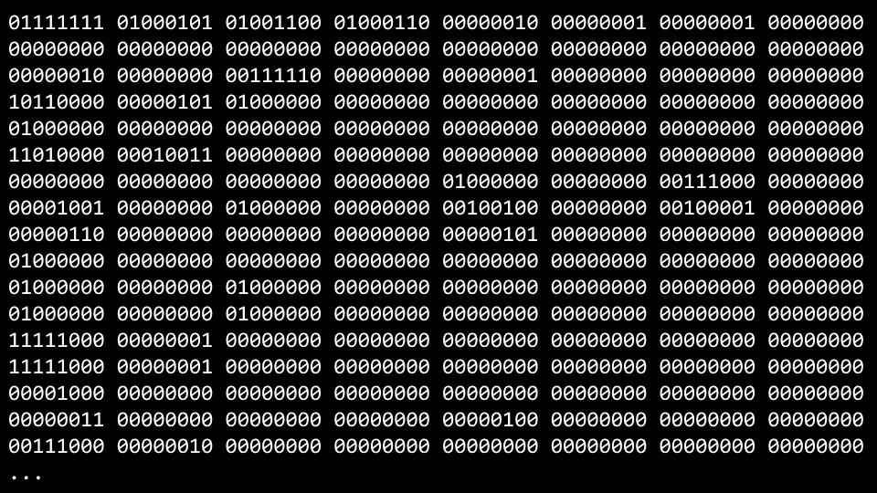

+   *VS Code*，作为 CS50 学生提供的编程环境，使用了一个名为 `clang` 或 *C 语言* 的编译器。

+   您可以将以下内容输入到终端窗口以编译您的代码：`clang -o hello hello.c`。

+   *命令行参数* 以 `-o hello hello.c` 的形式在命令行中提供给 `clang`。

+   在终端窗口中运行 `./hello`，您的程序将按预期运行。

+   考虑以下上周的代码：

    ```
    #include <cs50.h> #include <stdio.h>  
    int main(void)
    {
        string name = get_string("What's your name? ");
        printf("hello, %s\n", name);
    } 
    ```

+   要编译此代码，您可以输入 `clang -o hello hello.c -lcs50`。

+   如果您输入 `make hello`，它将运行一个命令，执行 clang 创建一个您可以运行的输出文件。

+   VS Code 已经预先编程，以便 `make` 可以运行多个命令行参数，并配合 clang 为您作为用户带来便利。

+   虽然上述内容提供了一种说明，以便您更深入地理解编译代码的过程和概念，但在 CS50 中使用 `make` 是完全正常且符合预期的！

+   编译涉及以下四个主要步骤：

+   首先，*预处理*是将你的代码中的头文件（由`#`指定，例如`#include <cs50.h>`）有效地复制并粘贴到你的文件中。在这一步中，`cs50.h`中的代码被复制到你的程序中。同样，就像你的代码包含`#include <stdio.h>`一样，计算机上某个地方的`stdio.h`中的代码也被复制到你的程序中。这一步可以可视化如下：

    ```
     string get_string(string prompt);
      int printf(string format, ...);

      int main(void)
      {
          string name = get_string("What's your name? ");
          printf("hello, %s\n", name);
      } 
    ```

+   第二，*编译*是将你的程序转换为汇编代码。这一步可以可视化如下：

    ```
    ...
    main:
        .cfi_startproc
    # BB#0:
        pushq    %rbp
    .Ltmp0:
        .cfi_def_cfa_offset 16
    .Ltmp1:
        .cfi_offset %rbp, -16
        movq    %rsp, %rbp
    .Ltmp2:
        .cfi_def_cfa_register %rbp
        subq    $16, %rsp
        xorl    %eax, %eax
        movl    %eax, %edi
        movabsq    $.L.str, %rsi
        movb    $0, %al
        callq    get_string
        movabsq    $.L.str.1, %rdi
        movq    %rax, -8(%rbp)
        movq    -8(%rbp), %rsi
        movb    $0, %al
        callq    printf
        ... 
    ```

+   第三，*汇编*涉及编译器将你的汇编代码转换为机器代码。这一步可以可视化如下：

    ```
    01111111010001010100110001000110
    00000010000000010000000100000000
    00000000000000000000000000000000
    00000000000000000000000000000000
    00000001000000000011111000000000
    00000001000000000000000000000000
    00000000000000000000000000000000
    00000000000000000000000000000000
    00000000000000000000000000000000
    00000000000000000000000000000000
    10100000000000100000000000000000
    00000000000000000000000000000000
    00000000000000000000000000000000
    01000000000000000000000000000000
    00000000000000000100000000000000
    00001010000000000000000100000000
    01010101010010001000100111100101
    01001000100000111110110000010000
    00110001110000001000100111000111
    01001000101111100000000000000000
    00000000000000000000000000000000
    00000000000000001011000000000000
    11101000000000000000000000000000
    00000000010010001011111100000000
    00000000000000000000000000000000
    00000000000000000000000001001000
    ... 
    ```

+   最后，在*链接*步骤中，你的包含库中的代码也被转换为机器代码，并与你的代码结合。然后输出最终的可执行文件。

    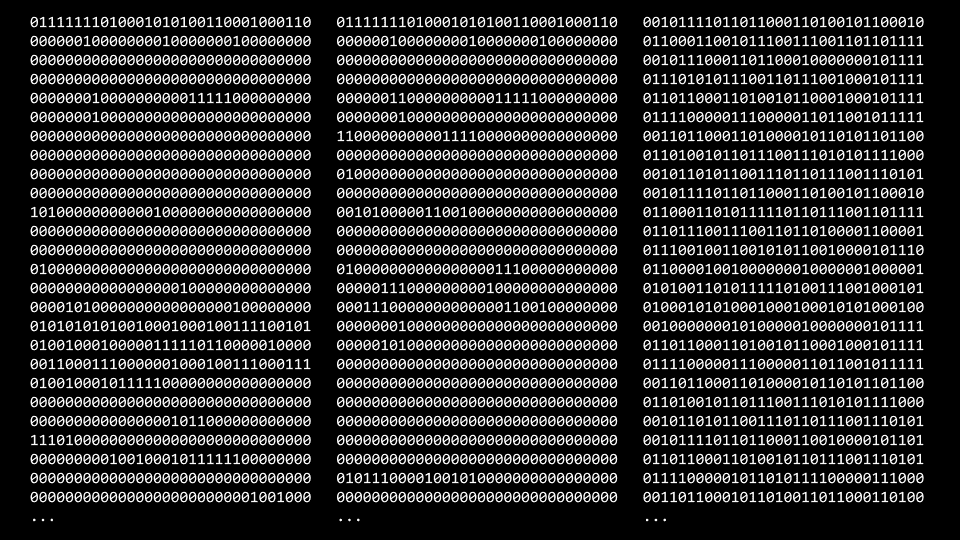

## 调试

+   每个人在编码时都会犯错误。

+   *调试*是定位和移除代码中错误的过程。

+   在本课程中，你将使用的一种调试代码的技术被称为*橡皮鸭调试*，其中你可以与一个非生命物体（或你自己）交谈，以帮助你思考代码以及为什么它没有按预期工作。当你遇到代码挑战时，考虑一下大声地向一个橡皮鸭说出代码问题。如果你不想和一个塑料小鸭说话，你也可以和附近的人交谈！

+   我们创建了 CS50 Duck 和[CS50.ai](https://cs50.ai)作为可以帮助你调试代码的工具。

+   考虑上周的以下图片：

    

+   考虑以下故意在其内部插入错误的代码：

    ```
    // Buggy example for printf

    #include <stdio.h>  
    int main(void)
    {
        for (int i = 0; i <= 3; i++)
        {
            printf("#\n");
        }
    } 
    ```

    注意，这段代码打印了四个方块而不是三个。

+   在终端窗口中输入`code buggy0.c`并写下上述代码。

+   运行这段代码，会出现四个砖块而不是预期的三个。

+   `printf`是一种非常有用的调试代码的方法。你可以按照以下方式修改你的代码：

    ```
    // Buggy example for printf

    #include <stdio.h>  
    int main(void)
    {
        for (int i = 0; i <= 3; i++)
        {
            printf("i is %i\n", i);
            printf("#\n");
        }
    } 
    ```

    注意，这段代码在循环的每次迭代中都输出了`i`的值，这样我们就可以调试我们的代码。

+   运行这段代码，你会看到许多语句，包括`i is 0`、`i is 1`、`i is 2`和`i is 3`。看到这些，你可能会意识到需要进一步修正以下代码：

    ```
    #include <stdio.h>  
    int main(void)
    {
        for (int i = 0; i < 3; i++)
        {
            printf("#\n");
        }
    } 
    ```

    注意`<=`已被替换为`<`。

+   这段代码可以进一步改进如下：

    ```
    // Buggy example for debug50

    #include <cs50.h> #include <stdio.h>  
    void print_column(int height);

    int main(void)
    {
        int h = get_int("Height: ");
        print_column(h);
    }

    void print_column(int height)
    {
        for (int i = 0; i <= height; i++)
        {
            printf("#\n");
        }
    } 
    ```

    注意，编译和运行这段代码仍然会导致错误。

+   为了解决这个问题，我们将使用一个新的工具。

+   调试的第二个工具被称为*调试器*，这是一种由程序员创建的软件工具，用于帮助追踪代码中的错误。

+   在 VS Code 中，已经为你提供了一个预配置的调试器。

+   要使用这个调试器，首先通过点击代码左侧，位于行号左侧的行来设置一个*断点*。当你点击那里时，你会看到一个红色的小点出现。想象一下这是一个停车标志，要求编译器暂停，这样你就可以考虑这段代码中发生的事情。

    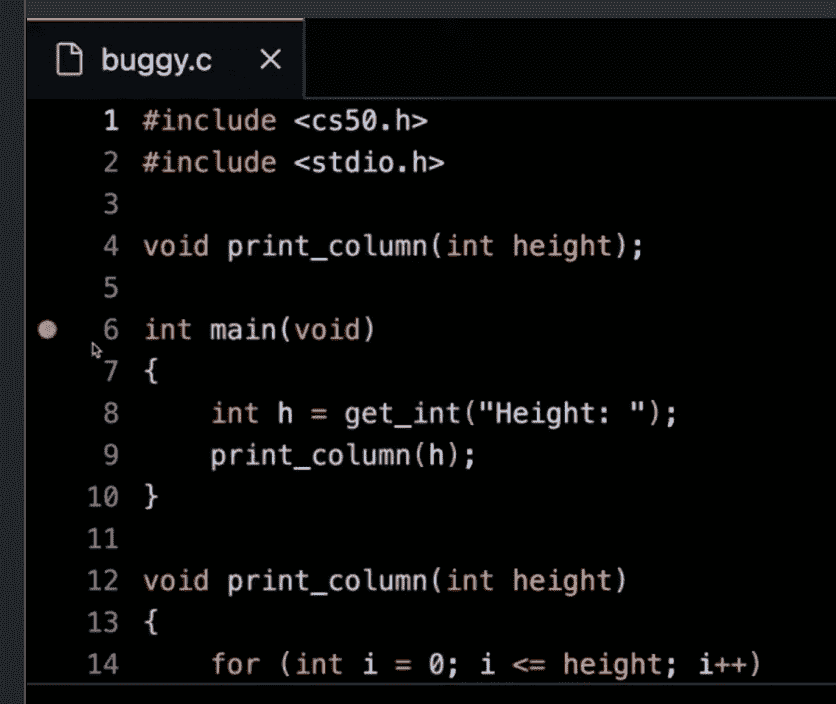

+   第二，运行`debug50 ./buggy0`。你会注意到，当调试器启动后，你的一行代码将以金色般的颜色点亮。字面上说，代码就在这一行代码处*暂停*了。注意左上角显示了所有局部变量，包括当前没有值的`h`。在你的窗口顶部，你可以点击`step over`按钮，它会继续移动通过你的代码。注意`h`的值是如何增加的。

+   虽然这个工具不会显示你的错误在哪里，但它会帮助你放慢速度，逐步查看你的代码是如何运行的。你可以使用`step into`来进一步查看有问题的代码的细节。

## 数组

+   在第 0 周，我们讨论了诸如`bool`、`int`、`char`、`string`等的数据类型。

+   每种数据类型都需要一定数量的系统资源：

    +   `bool` 1 字节

    +   `int` 4 字节

    +   `long` 8 字节

    +   `float` 4 字节

    +   `double` 8 字节

    +   `char` 1 字节

    +   `string` ? 字节

+   在你的计算机内部，你有有限的内存可用。

    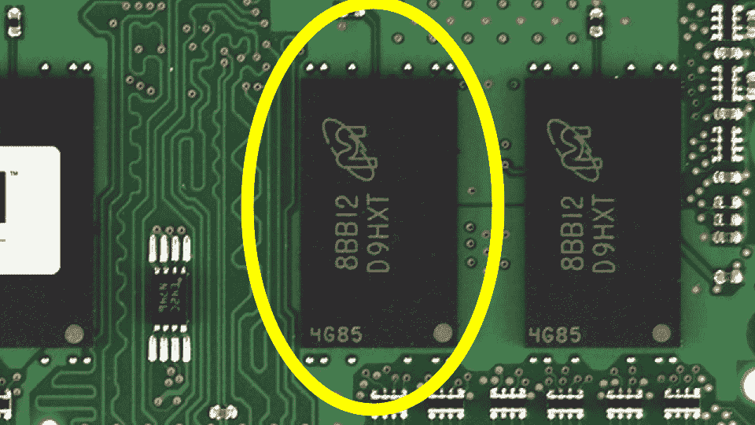

+   在物理上，在你的计算机内存中，你可以想象特定类型的数据是如何存储在你的计算机上的。你可能想象一个`char`，它只需要 1 个字节的内存，可能看起来如下所示：

    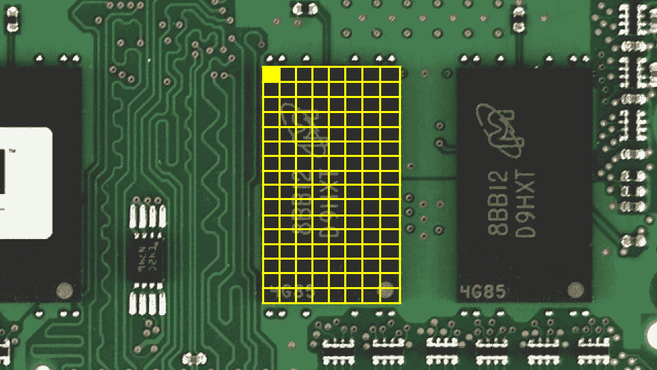

+   同样，一个需要 4 个字节的`int`可能看起来如下所示：

    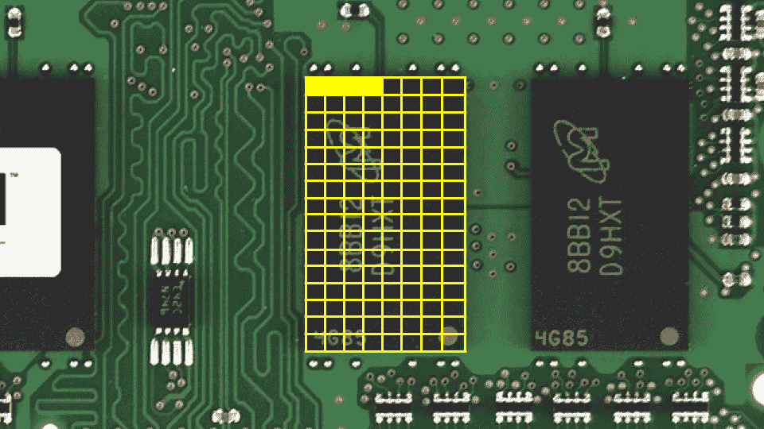

+   我们可以创建一个探索这些概念的程序。在你的终端中，输入`code scores.c`并编写以下代码：

    ```
    // Averages three (hardcoded) numbers

    #include <stdio.h>  
    int main(void)
    {
        // Scores
        int score1 = 72;
        int score2 = 73;
        int score3 = 33;

        // Print average
        printf("Average: %f\n", (score1 + score2 + score3) / 3.0);
    } 
    ```

    注意右边的数字是一个`3.0`的浮点值，所以计算最终呈现为浮点值。

+   运行`make scores`，程序运行。

+   你可以想象这些变量是如何存储在内存中的：

    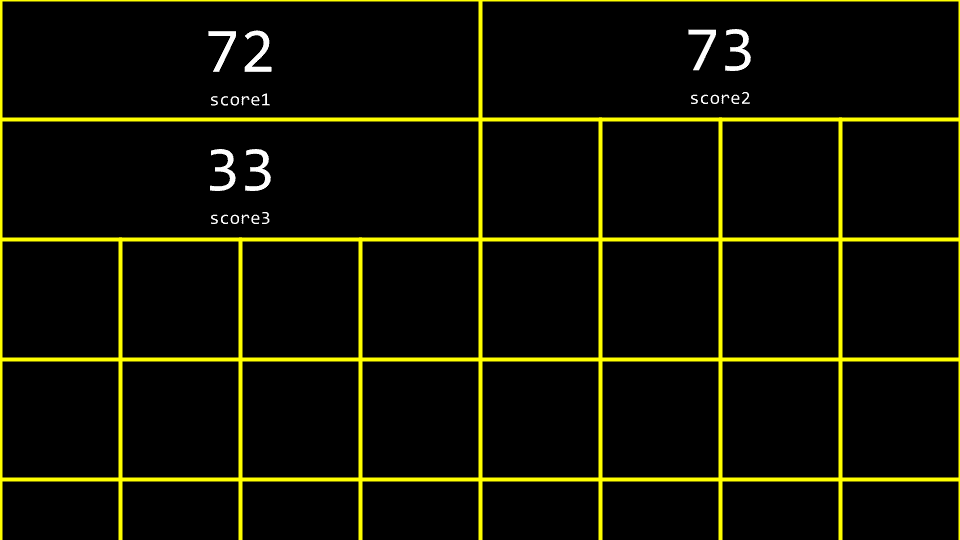

+   *数组* 是在内存中连续存储的值序列。

+   `int scores[3]`是告诉编译器为你提供三个连续的内存位置，大小为`int`，以存储三个`scores`。考虑到我们的程序，你可以按照以下方式修改你的代码：

    ```
    // Averages three (hardcoded) numbers using an array

    #include <cs50.h> #include <stdio.h>  
    int main(void)
    {
        // Scores
        int scores[3];
        scores[0] = 72;
        scores[1] = 73;
        scores[2] = 33;

        // Print average
        printf("Average: %f\n", (scores[0] + scores[1] + scores[2]) / 3.0);
    } 
    ```

    注意`score[0]`通过`indexing into`名为`scores`的数组在位置`0`的内存位置来检查这个位置的值，以查看存储了什么值。

+   你可以看到，虽然上面的代码可以工作，但仍然有机会改进我们的代码。按照以下方式修改你的代码：

    ```
    // Averages three numbers using an array and a loop

    #include <cs50.h> #include <stdio.h>  
    int main(void)
    {
        // Get scores
        int scores[3];
        for (int i = 0; i < 3; i++)
        {
            scores[i] = get_int("Score: ");
        }

        // Print average
        printf("Average: %f\n", (scores[0] + scores[1] + scores[2]) / 3.0);
    } 
    ```

    注意我们如何通过使用 `scores[i]` 来索引 `scores`，其中 `i` 由 `for` 循环提供。

+   我们可以简化或抽象出平均值的计算。按照以下方式修改你的代码：

    ```
    // Averages three numbers using an array, a constant, and a helper function

    #include <cs50.h> #include <stdio.h>  
    // Constant
    const int N = 3;

    // Prototype
    float average(int length, int array[]);

    int main(void)
    {
        // Get scores
        int scores[N];
        for (int i = 0; i < N; i++)
        {
            scores[i] = get_int("Score: ");
        }

        // Print average
        printf("Average: %f\n", average(N, scores));
    }

    float average(int length, int array[])
    {
        // Calculate average
        int sum = 0;
        for (int i = 0; i < length; i++)
        {
            sum += array[i];
        }
        return sum / (float) length;
    } 
    ```

    注意声明了一个新函数 `average`。此外，注意声明了一个 `const` 或常量值 `N`。最重要的是，注意 `average` 函数接受 `int array[]`，这意味着编译器将数组传递给这个函数。

+   不仅数组可以作为容器：它们可以在函数之间传递。

## 字符串

+   一个 `string` 简单地是一个类型为 `char` 的变量数组：一个字符数组。

+   要探索 `char` 和 `string`，在终端窗口中输入 `code hi.c` 并按照以下方式编写代码：

    ```
    // Prints chars

    #include <stdio.h>  
    int main(void)
    {
        char c1 = 'H';
        char c2 = 'I';
        char c3 = '!';

        printf("%c%c%c\n", c1, c2, c3);
    } 
    ```

    注意这将输出一个字符字符串。

+   同样，对你的代码进行以下修改：

    ```
    #include <stdio.h>  
    int main(void)
    {
        char c1 = 'H';
        char c2 = 'I';
        char c3 = '!';

        printf("%i %i %i\n", c1, c2, c3);
    } 
    ```

    注意通过将 `%c` 替换为 `%i` 来打印 ASCII 码。

+   考虑以下图像，你可以看到字符串是一个以第一个字符开始并以一个称为 `NUL 字符` 的特殊字符结束的字符数组：

    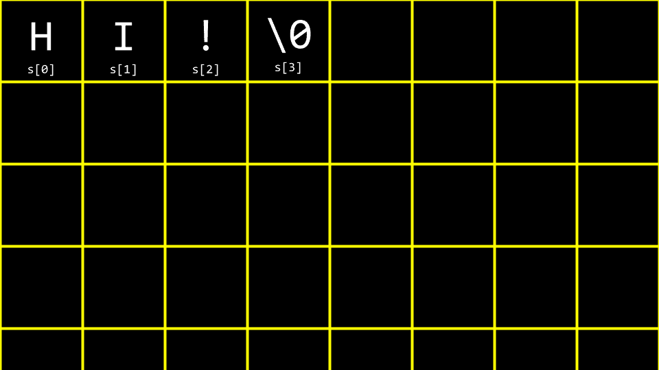

+   想象一下以十进制表示，你的数组看起来如下所示：

    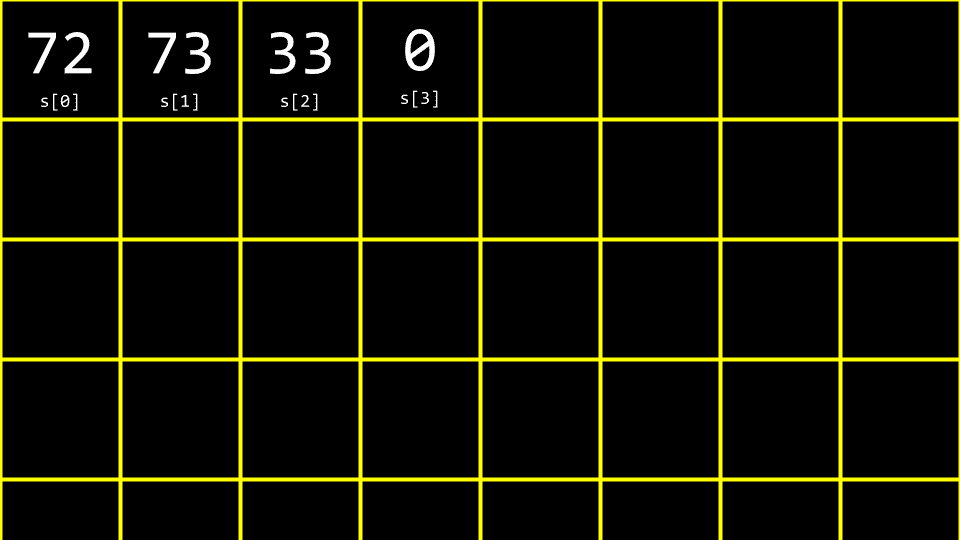

+   为了进一步理解 `string` 的工作方式，按照以下方式修改你的代码：

    ```
    // Treats string as array

    #include <cs50.h> #include <stdio.h>  
    int main(void)
    {
        string s = "HI!";
        printf("%c%c%c\n", s[0], s[1], s[2]);
    } 
    ```

    注意 `printf` 语句如何从我们的数组 `s` 中呈现三个值。

+   如前所述，我们可以将 `%c` 替换为 `%i`，如下所示：

    ```
    // Prints string's ASCII codes, including NUL

    #include <cs50.h> #include <stdio.h>  
    int main(void)
    {
        string s = "HI!";
        printf("%i %i %i %i\n", s[0], s[1], s[2], s[3]);
    } 
    ```

    注意这会打印出字符串的 ASCII 码，包括 NUL。

+   让我们想象我们想要说 `HI!` 和 `BYE!`。按照以下方式修改你的代码：

    ```
    // Multiple strings

    #include <cs50.h> #include <stdio.h>  
    int main(void)
    {
        string s = "HI!";
        string t = "BYE!";

        printf("%s\n", s);
        printf("%s\n", t);
    } 
    ```

    注意在这个例子中声明并使用了两个字符串。

+   你可以这样可视化：

    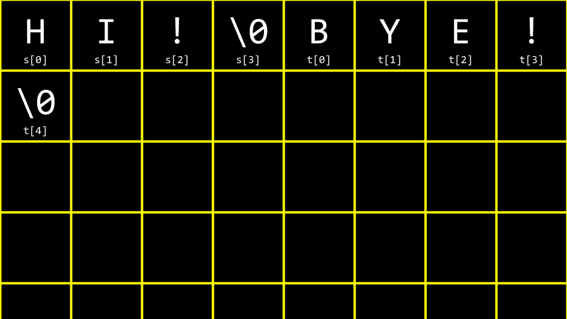

+   我们可以进一步改进这段代码。按照以下方式修改你的代码：

    ```
    // Array of strings

    #include <cs50.h> #include <stdio.h>  
    int main(void)
    {
        string words[2];

        words[0] = "HI!";
        words[1] = "BYE!";

        printf("%s\n", words[0]);
        printf("%s\n", words[1]);
    } 
    ```

    注意到这两个字符串都存储在单个类型为 `string` 的数组中。

+   我们可以将两个字符串合并到一个字符串数组中。

    ```
    #include <cs50.h> #include <stdio.h>  
    int main(void)
    {
        string words[2];

        words[0] = "HI!";
        words[1] = "BYE!";

        printf("%c%c%c\n", words[0][0], words[0][1], words[0][2]);
        printf("%c%c%c%c\n", words[1][0], words[1][1], words[1][2], words[1][3]);
    } 
    ```

    注意创建了一个 `words` 的数组。它是一个字符串数组。每个单词都存储在 `words` 中。

## 字符串长度

+   编程中一个常见的问题，也许在 C 语言中更为具体，是发现数组的长度。我们如何在代码中实现这一点？在终端窗口中输入 `code length.c` 并按照以下方式编写代码：

    ```
    // Determines the length of a string

    #include <cs50.h> #include <stdio.h>  
    int main(void)
    {
        // Prompt for user's name
        string name = get_string("Name: ");

        // Count number of characters up until '\0' (aka NUL)
        int n = 0;
        while (name[n] != '\0')
        {
            n++;
        }
        printf("%i\n", n);
    } 
    ```

    注意到这段代码会一直循环，直到找到 NUL 字符。

+   我们可以通过将计数抽象到函数中来改进这段代码，如下所示：

    ```
    // Determines the length of a string using a function

    #include <cs50.h> #include <stdio.h>  
    int string_length(string s);

    int main(void)
    {
        // Prompt for user's name
        string name = get_string("Name: ");
        int length = string_length(name);
        printf("%i\n", length);
    }

    int string_length(string s)
    {
        // Count number of characters up until '\0' (aka NUL)
        int n = 0;
        while (s[n] != '\0')
        {
            n++;
        }
        return n;
    } 
    ```

    注意到有一个新函数 `string_length` 被调用，它计算字符直到找到 NUL。

+   由于这是编程中一个如此常见的问题，其他程序员已经在 `string.h` 库中创建了代码来查找字符串的长度。你可以通过修改以下方式来查找字符串的长度：

    ```
    // Determines the length of a string using a function

    #include <cs50.h> #include <stdio.h> #include <string.h>  
    int main(void)
    {
        // Prompt for user's name
        string name = get_string("Name: ");
        int length = strlen(name);
        printf("%i\n", length);
    } 
    ```

    注意，这段代码使用了在文件顶部声明的`string.h`库。此外，它使用该库中的一个函数`strlen`，该函数计算传递给它的字符串的长度。

+   我们的代码可以站在前人的肩膀上，并使用他们创建的库。

+   `ctype.h`是另一个非常有用的库。想象一下，如果我们想要创建一个将所有小写字母转换为大写字母的程序。在终端窗口中，输入`code uppercase.c`并编写以下代码：

    ```
    // Uppercases a string

    #include <cs50.h> #include <stdio.h> #include <string.h>  
    int main(void)
    {
        string s = get_string("Before: ");
        printf("After:  ");
        for (int i = 0, n = strlen(s); i < n; i++)
        {
            if (s[i] >= 'a' && s[i] <= 'z')
            {
                printf("%c", s[i] - 32);
            }
            else
            {
                printf("%c", s[i]);
            }
        }
        printf("\n");
    } 
    ```

    注意，这段代码会*遍历*字符串中的每个值。程序会查看每个字符。如果字符是小写的，它会从该字符中减去`32`的值以将其转换为大写。

+   回顾上周我们之前的工作，你可能还记得这个 ASCII 值表：

    | 0 | NUL | 16 | DLE | 32 | SP | 48 | 0 | 64 | @ | 80 | P | 96 | ` | 112 | p |   |
    | --- | --- | --- | --- | --- | --- | --- | --- | --- | --- | --- | --- | --- | --- | --- | --- | --- |
    | 1 | SOH | 17 | DC1 | 33 | ! | 49 | 1 | 65 | A | 81 | Q | 97 | a | 113 | q |   |
    | 2 | STX | 18 | DC2 | 34 | ” | 50 | 2 | 66 | B | 82 | R | 98 | b | 114 | r |   |
    | 3 | ETX | 19 | DC3 | 35 | # | 51 | 3 | 67 | C | 83 | S | 99 | c | 115 | s |   |
    | 4 | EOT | 20 | DC4 | 36 | $ | 52 | 4 | 68 | D | 84 | T | 100 | d | 116 | t |   |
    | 5 | ENQ | 21 | NAK | 37 | % | 53 | 5 | 69 | E | 85 | U | 101 | e | 117 | u |   |
    | 6 | ACK | 22 | SYN | 38 | & | 54 | 6 | 70 | F | 86 | V | 102 | f | 118 | v |   |
    | 7 | BEL | 23 | ETB | 39 | ’ | 55 | 7 | 71 | G | 87 | W | 103 | g | 119 | w |   |
    | 8 | BS | 24 | CAN | 40 | ( | 56 | 8 | 72 | H | 88 | X | 104 | h | 120 | x |   |
    | 9 | HT | 25 | EM | 41 | ) | 57 | 9 | 73 | I | 89 | Y | 105 | i | 121 | y |   |
    | 10 | LF | 26 | SUB | 42 | * | 58 | : | 74 | J | 90 | Z | 106 | j | 122 | z |   |
    | 11 | VT | 27 | ESC | 43 | + | 59 | ; | 75 | K | 91 | [ | 107 | k | 123 | { |   |
    | 12 | FF | 28 | FS | 44 | , | 60 | < | 76 | L | 92 | \ | 108 | l | 124 |   |   |
    | 13 | CR | 29 | GS | 45 | - | 61 | = | 77 | M | 93 | ] | 109 | m | 125 | } |   |
    | 14 | SO | 30 | RS | 46 | . | 62 | > | 78 | N | 94 | ^ | 110 | n | 126 | ~ |   |
    | 15 | SI | 31 | US | 47 | / | 63 | ? | 79 | O | 95 | _ | 111 | o | 127 | DEL |   |

+   当从一个小写字母中减去`32`时，它将得到该字符的大写版本。

+   虽然程序完成了我们想要的功能，但使用`ctype.h`库有一个更简单的方法。按照以下方式修改你的程序：

    ```
    // Uppercases string using ctype library (and an unnecessary condition)

    #include <cs50.h> #include <ctype.h> #include <stdio.h> #include <string.h>  
    int main(void)
    {
        string s = get_string("Before: ");
        printf("After:  ");
        for (int i = 0, n = strlen(s); i < n; i++)
        {
            if (islower(s[i]))
            {
                printf("%c", toupper(s[i]));
            }
            else
            {
                printf("%c", s[i]);
            }
        }
        printf("\n");
    } 
    ```

    注意，程序会遍历字符串中的每个字符。`toupper`函数传递了`s[i]`。每个字符（如果为小写）都会被转换为大写。

+   值得注意的是，`toupper`函数会自动识别并只将小写字母转换为大写。因此，你可以将代码简化如下：

    ```
    // Uppercases string using ctype library

    #include <cs50.h> #include <ctype.h> #include <stdio.h> #include <string.h>  
    int main(void)
    {
        string s = get_string("Before: ");
        printf("After:  ");
        for (int i = 0, n = strlen(s); i < n; i++)
        {
            printf("%c", toupper(s[i]));
        }
        printf("\n");
    } 
    ```

    注意，这段代码使用`ctype`库将字符串转换为大写。

+   你可以在[手册页面](https://manual.cs50.io/#ctype.h)上阅读有关`ctype`库所有功能的说明。

## 命令行参数

+   `命令行参数` 是那些在命令行传递给程序的参数。例如，所有你在 `clang` 后面输入的语句都被认为是命令行参数。你可以在自己的程序中使用这些参数！

+   在你的终端窗口中，输入 `code greet.c` 并编写如下代码：

    ```
    // Uses get_string

    #include <cs50.h> #include <stdio.h>  
    int main(void)
    {
        string answer = get_string("What's your name? ");
        printf("hello, %s\n", answer);
    } 
    ```

    注意，这个程序对用户说`hello`。

+   尽管如此，如果在程序运行之前就能接受参数不是很好吗？按照以下方式修改你的代码：

    ```
    // Prints a command-line argument

    #include <cs50.h> #include <stdio.h>  
    int main(int argc, string argv[])
    {
        if (argc == 2)
        {
            printf("hello, %s\n", argv[1]);
        }
        else
        {
            printf("hello, world\n");
        }
    } 
    ```

    注意，这个程序知道 `argc`，即命令行参数的数量，以及 `argv`，它是一个包含在命令行中传递的字符的数组。

+   因此，使用本程序的语法，执行 `./greet David` 将导致程序输出 `hello, David`。

+   你可以使用以下方式打印每个命令行参数：

    ```
    // Prints command-line arguments

    #include <cs50.h> #include <stdio.h>  
    int main(int argc, string argv[])
    {
        for (int i = 0; i < argc; i++)
        {
            printf("%s\n", argv[i]);
        }
    } 
    ```

## 退出状态

+   当程序结束时，提供给计算机一个特殊的退出码。

+   当程序无错误退出时，提供给计算机的状态码为 `0`。通常，当发生导致程序结束的错误时，计算机提供的状态为 `1`。

+   你可以编写一个程序如下，通过输入 `code status.c` 并编写如下代码来展示这一点：

    ```
    // Returns explicit value from main

    #include <cs50.h> #include <stdio.h>  
    int main(int argc, string argv[])
    {
        if (argc != 2)
        {
            printf("Missing command-line argument\n");
            return 1;
        }
        printf("hello, %s\n", argv[1]);
        return 0;
    } 
    ```

    注意，如果你没有提供 `./status David`，你将得到退出状态 `1`。然而，如果你确实提供了 `./status David`，你将得到退出状态 `0`。

+   你可以在终端中输入 `echo $?` 来查看上一个运行命令的退出状态。

+   你可以想象如何使用上述程序的部分来检查用户是否提供了正确的命令行参数数量。

## 密码学

+   密码学是加密和解密消息的艺术。

+   现在，有了数组、字符和字符串的构建块，你可以加密和解密一条消息。

+   `plaintext` 和一个 `key` 被提供给一个 `cipher`，从而生成加密文本。

    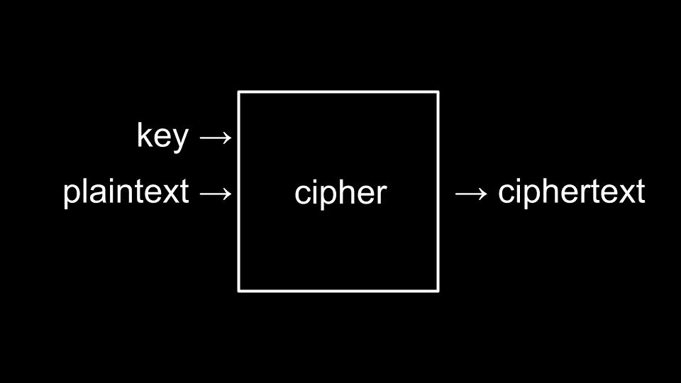

+   密钥是一个特殊的参数，与明文一起传递给加密器。加密器使用密钥来做出关于如何实现其加密算法的决定。

+   这周，你将进行与上述类似的编程挑战。

## 总结

在本课中，你学习了更多关于编译和计算机内部数据存储的细节。具体来说，你学习了…

+   通常，编译器是如何工作的。

+   如何使用四种方法调试你的代码。

+   如何在你的代码中利用数组。

+   数组如何在内存的连续部分存储数据。

+   字符串是如何简单地成为字符数组。

+   如何在你的代码中与数组交互。

+   如何将命令行参数传递给你的程序。

+   密码学的基本构建块。

欢迎下次再来！
