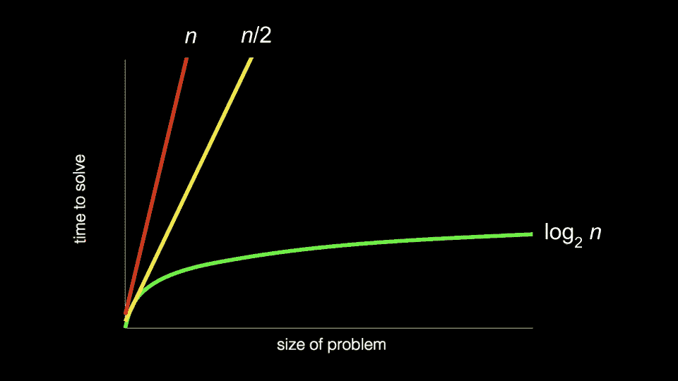
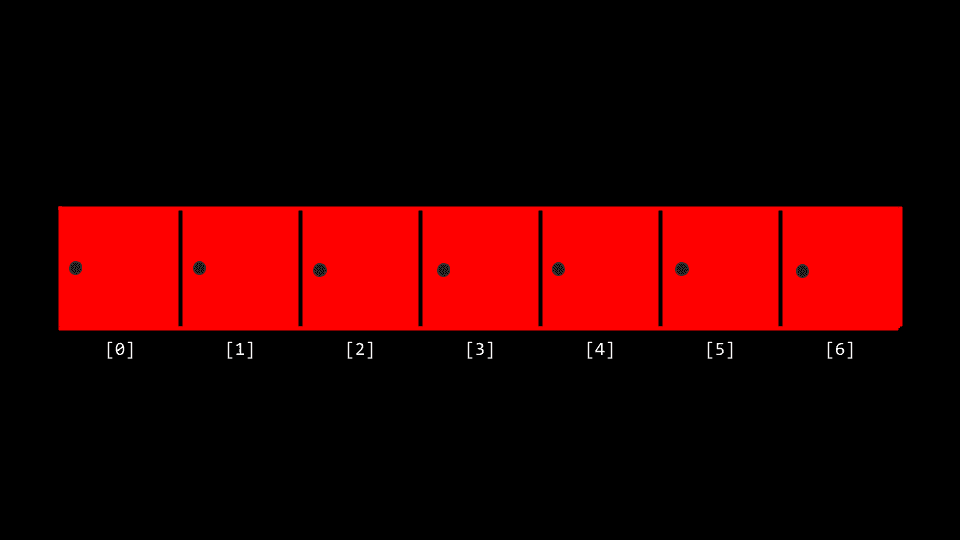
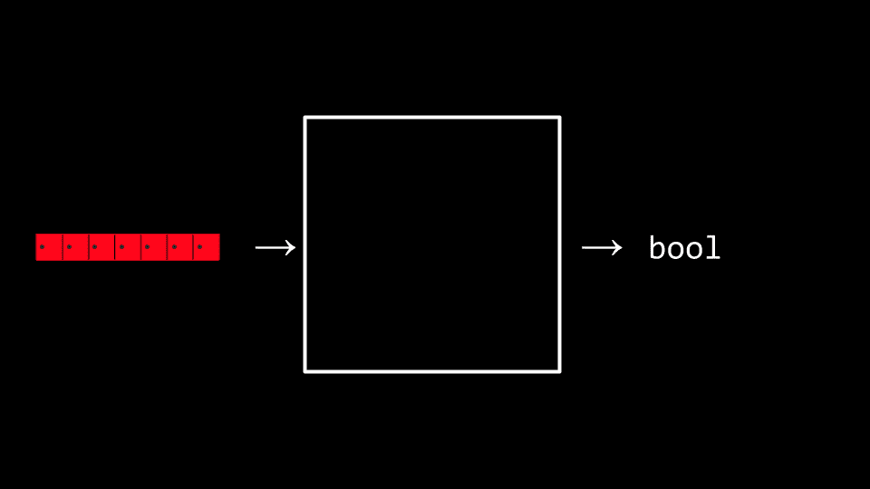
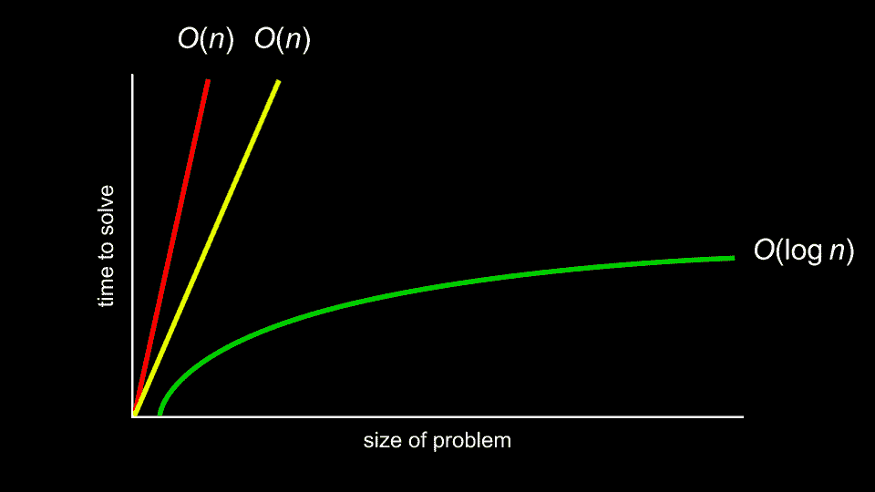
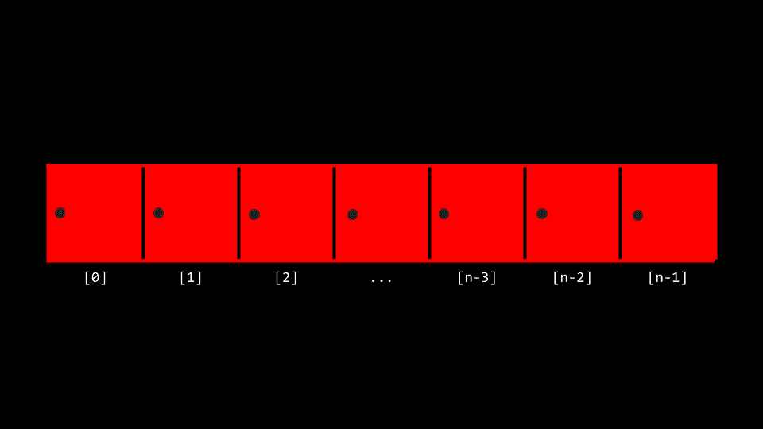

# 讲座 3

> 原文：[`cs50.harvard.edu/x/notes/3/`](https://cs50.harvard.edu/x/notes/3/)

+   欢迎光临！

+   线性查找

+   二分查找

+   运行时间

+   search.c

+   phonebook.c

+   结构体

+   排序

+   冒泡排序

+   递归

+   归并排序

+   总结

## 欢迎光临！

+   在第零周，我们介绍了算法的概念：一个可能接受输入并产生输出的黑盒。

+   本周，我们将通过伪代码和实际代码来扩展我们对算法的理解。

+   此外，我们还将考虑这些算法的效率。实际上，我们将基于我们对如何使用上周讨论的一些概念来构建算法的理解。

+   回想一下课程早期我们介绍过的以下图表：

    

+   随着我们步入本周，你应该考虑一个算法如何与问题协同工作可能会决定解决问题所需的时间！算法可以被设计得越来越高效，直至极限。

+   今天，我们将关注算法的设计以及如何衡量它们的效率。

## 线性查找

+   回想一下，上周你被介绍到数组的概念，即连续的内存块：彼此并排。

+   你可以比喻性地想象一个数组就像一系列七个红锁，如下所示：

    

+   最左侧的位置称为*位置 0*或*数组的开始*。最右侧的位置是*位置 6*或*数组的结束*。

+   我们可以想象，我们有一个基本问题，即想知道，“数字 50 是否在数组中？”计算机必须查看每个锁，以便能够看到数字 50 是否在里面。我们将寻找此类数字、字符、字符串或其他项的过程称为*搜索*。

+   我们可以将我们的数组交给一个算法，然后我们的算法将搜索我们的锁，看看数字 50 是否在某个门后面，返回值`true`或`false`。

    

+   我们可以想象我们可能提供给算法的各种指令以执行此任务，如下所示：

    ```
    For each door from left to right
        If 50 is behind door
            Return true
    Return false 
    ```

    注意，上述指令被称为*伪代码*：我们可以提供给计算机的指令的人类可读版本。

+   计算机科学家可以将伪代码翻译如下：

    ```
    For i from 0 to n-1
        If 50 is behind doors[i]
            Return true
    Return false 
    ```

    注意，上面的内容仍然不是代码，但它是对最终代码可能的样子一个非常接近的近似。

## 二分搜索

+   *二分搜索*是另一种可以用于我们寻找 50 的任务中的*搜索算法*。

+   假设锁内的值已经从小到大排列，二分搜索的伪代码如下所示：

    ```
    If no doors left
        Return false
    If 50 is behind middle door
        Return true
    Else if 50 < middle door
        Search left half
    Else if 50 > middle door
        Search right half 
    ```

+   使用代码的命名法，我们可以进一步修改我们的算法如下：

    ```
    If no doors left
        Return false
    If 50 is behind doors[middle]
        Return true
    Else if 50 < doors[middle]
        Search doors[0] through doors[middle - 1]
    Else if 50 > doors[middle]
        Search doors[middle + 1] through doors[n - 1] 
    ```

    注意，通过查看这个代码的近似，你几乎可以想象出这在实际代码中可能的样子。

## 运行时间

+   你可以考虑算法解决问题所需的时间。

+   *运行时间*涉及到使用*大 O*符号的分析。看看下面的图表：

    

+   计算机科学家在讨论算法的效率时，不是对算法的数学效率进行超具体分析，而是用各种运行时间的*顺序*来讨论效率。

+   在上面的图表中，第一个算法是 \(O(n)\) 或 *n 的阶数*。第二个也是 \(O(n)\)。第三个是 \(O(\log n)\)。

+   它是曲线的形状，显示了算法的效率。我们可能会看到一些常见的运行时间：

    +   \(O(n²)\)

    +   \(O(n \log n)\)

    +   \(O(n)\)

    +   \(O(\log n)\)

    +   \(O(1)\)

+   在上述运行时间中，\(O(n²)\)被认为是运行时间最慢的。\(O(1)\)是最快的。

+   线性搜索的阶数为 \(O(n)\)，因为它在最坏情况下可能需要 *n* 步才能运行。

+   二分搜索的阶数为 \(O(\log n)\)，因为它在运行时将越来越少，即使在最坏情况下也是如此。

+   程序员对最坏情况，或*上界*，和最佳情况，或*下界*都感兴趣。

+   \(\Omega\) 符号用来表示算法的最佳情况，例如 \(\Omega(\log n)\)。

+   \(\Theta\) 符号用来表示上界和下界相同的地方：最佳情况和最坏情况的运行时间相同的地方。

+   *渐近符号*是用来衡量算法在输入越来越大时表现如何的度量。

+   随着你继续在计算机科学领域发展你的知识，你将在未来的课程中更详细地探索这些主题。

## search.c

+   你可以通过在终端窗口中输入`code search.c`并编写如下代码来实现线性搜索：

    ```
    // Implements linear search for integers

    #include <cs50.h> #include <stdio.h>  
    int main(void)
    {
        // An array of integers
        int numbers[] = {20, 500, 10, 5, 100, 1, 50};

        // Search for number
        int n = get_int("Number: ");
        for (int i = 0; i < 7; i++)
        {
            if (numbers[i] == n)
            {
                printf("Found\n");
                return 0;
            }
        }
        printf("Not found\n");
        return 1;
    } 
    ```

    注意，以`int numbers[]`开头的行允许我们在创建数组时定义每个元素的值。然后，在`for`循环中，我们有线性搜索的实现。`return 0`用于指示成功并退出程序。`return 1`用于带错误（失败）退出程序。

+   我们现在已经在 C 中自己实现了线性搜索！

+   如果我们想在数组中搜索一个字符串呢？修改你的代码如下：

    ```
    // Implements linear search for strings

    #include <cs50.h> #include <stdio.h> #include <string.h>  
    int main(void)
    {
        // An array of strings
        string strings[] = {"battleship", "boot", "cannon", "iron", "thimble", "top hat"};

        // Search for string
        string s = get_string("String: ");
        for (int i = 0; i < 6; i++)
        {
            if (strcmp(strings[i], s) == 0)
            {
                printf("Found\n");
                return 0;
            }
        }
        printf("Not found\n");
        return 1;
    } 
    ```

    注意，我们无法像之前这个程序的迭代版本中那样使用`==`。相反，我们使用`strcmp`，它来自`string.h`库。如果字符串相同，`strcmp`将返回`0`。另外，请注意，字符串长度`6`是硬编码的，这不是好的编程实践。

+   事实上，运行这段代码允许我们遍历这个字符串数组，查看是否包含某个特定的字符串。然而，如果你看到*段错误*，即程序访问了它不应访问的内存部分，请确保你有`i < 6`而不是`i < 7`。

+   你可以在[CS50 手册页面](https://manual.cs50.io/3/strcmp)上了解更多关于`strcmp`的信息。

## phonebook.c

+   我们可以将数字和字符串的这些想法结合到一个程序中。在终端窗口中输入`code phonebook.c`并编写如下代码：

    ```
    // Implements a phone book without structs

    #include <cs50.h> #include <stdio.h> #include <string.h>  
    int main(void)
    {
        // Arrays of strings
        string names[] = {"Yuliia", "David", "John"};
        string numbers[] = {"+1-617-495-1000", "+1-617-495-1000", "+1-949-468-2750"};

        // Search for name
        string name = get_string("Name: ");
        for (int i = 0; i < 3; i++)
        {
            if (strcmp(names[i], name) == 0)
            {
                printf("Found %s\n", numbers[i]);
                return 0;
            }
        }
        printf("Not found\n");
        return 1;
    } 
    ```

    注意，Yuliia 的电话号码以`+1-617`开头，David 的电话号码以`+1-617`开头，John 的电话号码以`+1-949`开头。因此，`names[0]`是 Yuliia，`numbers[0]`是 Yuliia 的电话号码。这段代码将允许我们在电话簿中搜索特定号码的人。

+   虽然这段代码能工作，但存在许多低效之处。实际上，存在一种可能性，即姓名和电话号码可能不匹配。如果我们可以创建自己的数据类型，将一个人与电话号码关联起来，那岂不是很好？

## 结构体

+   结果表明，C 语言允许我们通过`struct`创建自己的数据类型。

+   创建一个包含`name`和`number`的名为`person`的自定义数据类型不是很有用吗？考虑以下内容：

    ```
    typedef struct
    {
        string name;
        string number;
    } person; 
    ```

    注意，这代表了我们自己的数据类型`person`，它有一个名为`name`的字符串和一个名为`number`的字符串。

+   我们可以通过修改我们的电话簿程序来改进我们之前的代码：

    ```
    // Implements a phone book with structs

    #include <cs50.h> #include <stdio.h> #include <string.h>  
    typedef struct
    {
        string name;
        string number;
    } person;

    int main(void)
    {
        person people[3];

        people[0].name = "Yuliia";
        people[0].number = "+1-617-495-1000";

        people[1].name = "David";
        people[1].number = "+1-617-495-1000";

        people[2].name = "John";
        people[2].number = "+1-949-468-2750";

        // Search for name
        string name = get_string("Name: ");
        for (int i = 0; i < 3; i++)
        {
            if (strcmp(people[i].name, name) == 0)
            {
                printf("Found %s\n", people[i].number);
                return 0;
            }
        }
        printf("Not found\n");
        return 1;
    } 
    ```

    注意，代码以`typedef struct`开始，其中定义了一个新的数据类型`person`。在`person`内部有一个名为`name`的字符串和一个名为`number`的字符串。在`main`函数中，首先创建一个名为`people`的数组，其类型为`person`，大小为 3。然后，我们更新`people`数组中两个人的姓名和电话号码。最重要的是，注意如何使用*点表示法*，例如`people[0].name`，允许我们访问第 0 个位置的`person`并为其分配一个姓名。

## 排序

+   *排序*是将未排序的值列表转换为排序列表的行为。

+   当一个列表排序后，在该列表中搜索要远比在未排序的列表中搜索要耗费计算机更少的资源。回想一下，我们可以在有序列表上使用二分搜索，但不能在未排序的列表上使用。

+   结果表明，有许多不同的排序算法。

+   *选择排序* 是这样的排序算法之一。

+   我们可以这样表示一个数组：

    

+   选择排序的伪代码如下：

    ```
    For i from 0 to n–1
        Find smallest number between numbers[i] and numbers[n-1]
        Swap smallest number with numbers[i] 
    ```

+   总结这些步骤，第一次遍历列表需要 `n - 1` 步。第二次，它需要 `n - 2` 步。继续这个逻辑，所需的步骤可以表示如下：

    ```
    (n - 1) + (n - 2) + (n - 3) + ... + 1 
    ```

+   这可以简化为 n(n-1)/2 或更简单地说，\(O(n²)\)。在最坏情况或上界，选择排序的顺序为 \(O(n²)\)。在最好情况或下界，选择排序的顺序为 \(\Omega(n²)\)。

## 冒泡排序

+   *冒泡排序* 是另一种排序算法，它通过重复交换元素来“冒泡”较大的元素到末尾。

+   冒泡排序的伪代码如下：

    ```
    Repeat n-1 times
        For i from 0 to n–2
            If numbers[i] and numbers[i+1] out of order
                Swap them
        If no swaps
            Quit 
    ```

+   随着我们进一步排序数组，我们知道越来越多的部分变得有序，所以我们只需要查看尚未排序的数字对。

+   冒泡排序可以分析如下：

    ```
     (n – 1) × (n – 1)
      n2 – 1n – 1n + 1
      n2 – 2n + 1 
    ```

    或者，更简单地说 \(O(n²)\)。

+   在最坏情况下，或上界，冒泡排序的顺序为 \(O(n²)\)。在最好情况下，或下界，冒泡排序的顺序为 \(\Omega(n)\)。

+   您可以 [可视化](https://www.cs.usfca.edu/~galles/visualization/ComparisonSort.html) 这些算法的比较。

## 递归

+   我们如何提高我们的排序效率？

+   *递归* 是编程中的一个概念，其中函数调用自身。我们之前在看到……时看到了这一点。

    ```
    If no doors left
        Return false
    If number behind middle door
        Return true
    Else if number < middle door
        Search left half
    Else if number > middle door
        Search right half 
    ```

    注意，我们正在对这个问题越来越小的迭代调用 `search`。

+   类似地，在我们的第 0 周伪代码中，您可以看到递归是如何实现的：

    ```
    1  Pick up phone book
    2  Open to middle of phone book
    3  Look at page
    4  If person is on page
    5      Call person
    6  Else if person is earlier in book
    7      Open to middle of left half of book
    8      Go back to line 3
    9  Else if person is later in book
    10     Open to middle of right half of book
    11     Go back to line 3
    12 Else
    13     Quit 
    ```

+   此代码可以简化以突出其递归特性，如下所示：

    ```
    1  Pick up phone book
    2  Open to middle of phone book
    3  Look at page
    4  If person is on page
    5      Call person
    6  Else if person is earlier in book
    7      Search left half of book
    9  Else if person is later in book
    10     Search right half of book
    12 Else
    13     Quit 
    ```

+   考虑一下在第一周我们想要创建以下这样的金字塔结构：

    ```
     #
      ##
      ###
      #### 
    ```

+   在您的终端窗口中输入 `code iteration.c` 并编写如下代码：

    ```
    // Draws a pyramid using iteration

    #include <cs50.h> #include <stdio.h>  
    void draw(int n);

    int main(void)
    {
        // Get height of pyramid
        int height = get_int("Height: ");

        // Draw pyramid
        draw(height);
    }

    void draw(int n)
    {
        // Draw pyramid of height n
        for (int i = 0; i < n; i++)
        {
            for (int j = 0; j < i + 1; j++)
            {
                printf("#");
            }
            printf("\n");
        }
    } 
    ```

    注意，此代码通过循环构建金字塔。

+   要使用递归实现此功能，请在您的终端窗口中输入 `code iteration.c` 并编写如下代码：

    ```
    // Draws a pyramid using recursion

    #include <cs50.h> #include <stdio.h>  
    void draw(int n);

    int main(void)
    {
        // Get height of pyramid
        int height = get_int("Height: ");

        // Draw pyramid
        draw(height);
    }

    void draw(int n)
    {
        // If nothing to draw
        if (n <= 0)
        {
            return;
        }

        // Draw pyramid of height n - 1
        draw(n - 1);

        // Draw one more row of width n
        for (int i = 0; i < n; i++)
        {
            printf("#");
        }
        printf("\n");
    } 
    ```

    注意到 *基准情况* 将确保代码不会无限运行。当 `if (n <= 0)` 时终止递归，因为问题已经解决。每次 `draw` 函数调用自身时，它都会通过 `n-1` 来调用自身。在某一点上，`n-1` 将等于 `0`，导致 `draw` 函数返回，程序结束。

## 归并排序

+   我们现在可以利用递归来寻求更有效的排序算法，并实现所谓的 *归并排序*，这是一种非常有效的排序算法。

+   归并排序的伪代码相当简短：

    ```
    If only one number
        Quit
    Else
        Sort left half of number
        Sort right half of number
        Merge sorted halves 
    ```

+   考虑以下数字列表：

    ```
     6341 
    ```

+   首先，归并排序会问，“这是一个数字吗？”答案是“不是”，所以算法继续。

    ```
     6341 
    ```

+   第二，归并排序现在将数字从中间分开（或者尽可能接近中间）并排序数字的左半部分。

    ```
     63|41 
    ```

+   第三，归并排序将查看左边的这些数字并询问，“这是一个数字吗？”由于答案是“不是”，然后它会将左边的数字从中间分开。

    ```
     6|3 
    ```

+   第四，归并排序将再次询问，“这是一个数字吗？”这次答案是肯定的！因此，它将退出这个任务，并返回到此时正在运行的最后任务：

    ```
     63|41 
    ```

+   第五，归并排序将排序左边的数字。

    ```
     36|41 
    ```

+   现在，我们回到伪代码中我们之前中断的地方，因为左边的数字已经排序了。步骤 3-5 的类似过程将发生在右边的数字上。这将导致：

    ```
     36|14 
    ```

+   两个半部分现在都已排序。最后，算法将合并两边。它会查看左边的第一个数字和右边的第一个数字。它会将较小的数字放在前面，然后是第二小的数字。算法将对所有数字重复此操作，结果如下：

    ```
     1346 
    ```

+   归并排序已完成，程序退出。

+   归并排序是一个非常高效的排序算法，最坏情况下的时间复杂度为 \(O(n \log n)\)。最佳情况仍然是 \(\Omega(n \log n)\)，因为算法仍然必须访问列表中的每个位置。因此，归并排序的时间复杂度也是 \(\Theta(n \log n)\)，因为最佳情况和最坏情况是相同的。

+   最后，[可视化](https://www.youtube.com/watch?v=ZZuD6iUe3Pc)被分享。

## 总结

在本课中，你学习了算法思维和构建自己的数据类型。具体来说，你学习了…

+   算法。

+   大 O 表示法。

+   二分查找和线性查找。

+   各种排序算法，包括冒泡排序、选择排序和归并排序。

+   递归。

欢迎下次再来！
