# 第四讲

> 原文：[`cs50.harvard.edu/x/notes/4/`](https://cs50.harvard.edu/x/notes/4/)

+   欢迎！

+   像素艺术

+   十六进制

+   内存

+   指针

+   字符串

+   指针算术

+   字符串比较

+   复制和 malloc

+   Valgrind

+   垃圾值

+   与 Binky 一起玩指针

+   交换

+   溢出

+   `scanf`

+   文件输入输出

+   总结

## 欢迎！

+   在前几周，我们讨论了图像是由称为像素的更小的构建块组成的。

+   今天，我们将更深入地探讨构成这些图像的零和一。特别是，我们将深入研究构成文件（包括图像）的基本构建块。

+   此外，我们还将讨论如何访问存储在计算机内存中的底层数据。

+   在今天开始之前，要知道本讲座中涵盖的概念可能需要一些时间才能完全 *理解*。

## 像素艺术

+   像素是方格，单个的点，颜色排列在上下的左右网格中。

+   你可以想象一个图像是一个位图，其中零代表黑色，一代表白色。

    

## 十六进制

+   *RGB*，或 *红色、绿色、蓝色*，是代表每种颜色数量的数字。在 Adobe Photoshop 中，你可以看到这些设置如下：

    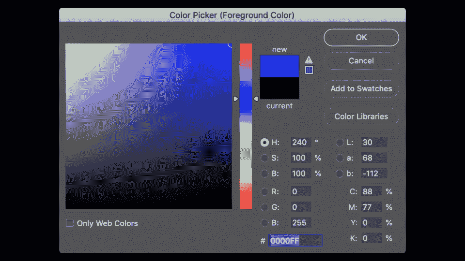

    注意红色、蓝色和绿色数量的变化如何改变所选颜色。

+   从上面的图片中你可以看到，颜色不仅仅由三个值来表示。在窗口底部，有一个由数字和字符组成的特殊值。`255` 表示为 `FF`。这可能是为什么？

+   *十六进制* 是一个有 16 个计数值的计数系统。它们如下：

    ```
     0 1 2 3 4 5 6 7 8 9 A B C D E F 
    ```

    注意 `F` 代表 `15`。

+   十六进制也被称为 *十六进制*。

+   在十六进制计数时，每一列都是 16 的幂。

+   数字 `0` 表示为 `00`。

+   数字 `1` 表示为 `01`。

+   数字 `9` 表示为 `09`。

+   数字 `10` 表示为 `0A`。

+   数字 `15` 表示为 `0F`。

+   数字 `16` 表示为 `10`。

+   数字 `255` 表示为 `FF`，因为 16 x 15（或 `F`）等于 240。再加上 15 得到 255。这是使用两位十六进制系统可以计数的最大数字。

+   十六进制之所以有用，是因为它可以用更少的数字来表示。十六进制允许我们更简洁地表示信息。

## 内存

+   在过去的几周里，你可能还记得我们关于并发内存块的艺术家渲染。将这些内存块应用十六进制编号，你可以这样可视化：

    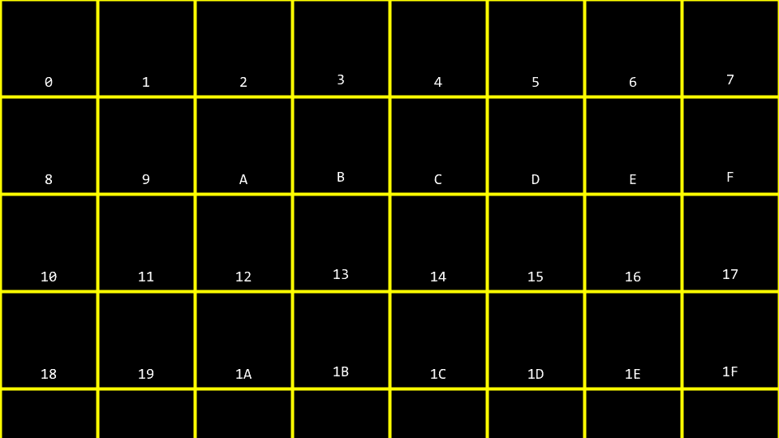

+   你可以想象，关于上面的 `10` 块是否表示内存中的位置或值 `10` 可能会有混淆。因此，按照惯例，所有十六进制数通常都带有 `0x` 前缀，如下所示：

    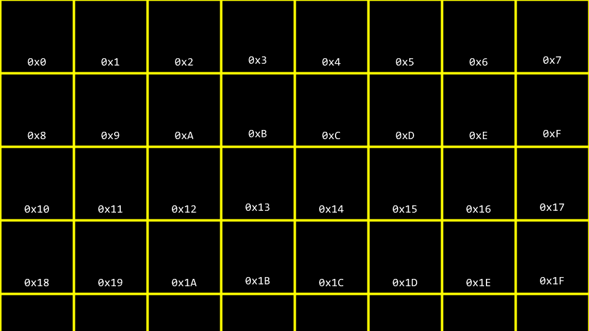

+   在你的终端窗口中，键入 `code addresses.c` 并按照以下方式编写你的代码：

    ```
    // Prints an integer

    #include <stdio.h>  
    int main(void)
    {
        int n = 50;
        printf("%i\n", n);
    } 
    ```

    注意到 `n` 在内存中以值 `50` 存储的方式。

+   你可以这样可视化程序存储这个值的方式：

    

## 指针

+   C 语言有两个与内存相关的强大运算符：

    ```
     & Provides the address of something stored in memory.
      * Instructs the compiler to go to a location in memory. 
    ```

+   我们可以通过以下方式修改我们的代码来利用这一知识：

    ```
    // Prints an integer's address

    #include <stdio.h>  
    int main(void)
    {
        int n = 50;
        printf("%p\n", &n);
    } 
    ```

    注意到 `%p`，它允许我们查看内存位置的地址。`&n` 可以直译为“`n` 的地址。”执行此代码将返回以 `0x` 开头的内存地址。

+   *指针* 是一个存储某个地址的变量。最简洁地说，指针是计算机内存中的一个地址。

+   考虑以下代码：

    ```
    int n = 50;
    int *p = &n; 
    ```

    注意到 `p` 是一个指针，它包含一个整数 `n` 的地址。

+   按照以下方式修改你的代码：

    ```
    // Stores and prints an integer's address

    #include <stdio.h>  
    int main(void)
    {
        int n = 50;
        int *p = &n;
        printf("%p\n", p);
    } 
    ```

    注意到这段代码与我们的前一段代码具有相同的效果。我们只是利用了我们对 `&` 和 `*` 运算符的新知识。

+   为了说明 `*` 运算符的使用，考虑以下：

    ```
    // Stores and prints an integer via its address

    #include <stdio.h>  
    int main(void)
    {
        int n = 50;
        int *p = &n;
        printf("%i\n", *p);
    } 
    ```

    注意到 `printf` 行打印了 `p` 位置的整数。`int *p` 创建了一个指针，其任务是存储一个整数的内存地址。

+   你可以这样可视化我们的代码：

    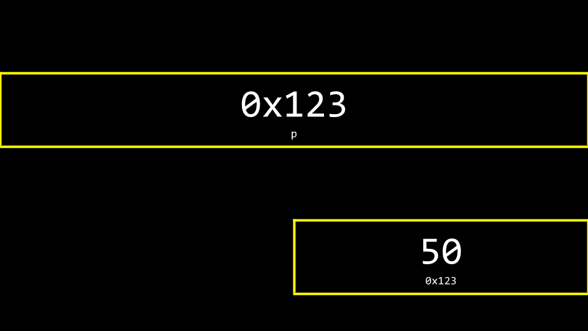

    注意到指针似乎相当大。事实上，指针通常存储为 8 字节值。`p` 存储的是 `50` 的地址。

+   你可以更准确地将指针想象为一个指向另一个地址的地址：

    

## 字符串

+   现在我们已经对指针有了心理模型，我们可以剥去之前在这门课程中提供的简化层次。

+   按照以下方式修改你的代码：

    ```
    // Prints a string

    #include <cs50.h> #include <stdio.h>  
    int main(void)
    {
        string s = "HI!";
        printf("%s\n", s);
    } 
    ```

    注意到打印了一个字符串 `s`。

+   回想一下，字符串只是一个字符数组。例如，`string s = "HI!"` 可以表示如下：

    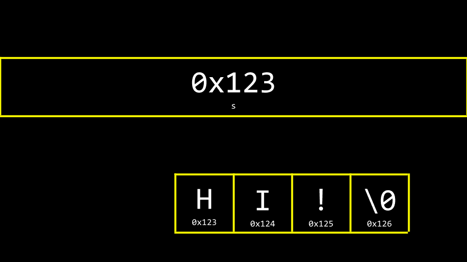

+   然而，`s` 究竟是什么？`s` 在内存中的位置在哪里？正如你可以想象的那样，`s` 需要存储在某个地方。你可以这样可视化 `s` 与字符串的关系：

    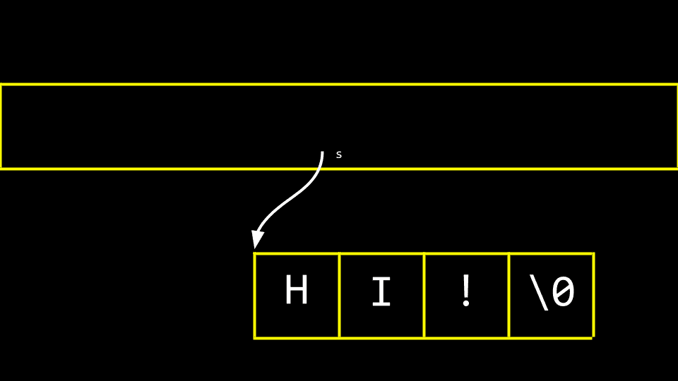

    注意到名为`s`的指针告诉编译器字符串的第一个字节在内存中的位置。

+   按如下方式修改你的代码：

    ```
    // Prints a string's address as well the addresses of its chars

    #include <cs50.h> #include <stdio.h>  
    int main(void)
    {
        string s = "HI!";
        printf("%p\n", s);
        printf("%p\n", &s[0]);
        printf("%p\n", &s[1]);
        printf("%p\n", &s[2]);
        printf("%p\n", &s[3]);
    } 
    ```

    注意到上面的代码打印了字符串`s`中每个字符的内存位置。`&`符号用于显示字符串中每个元素的地址。当运行此代码时，注意元素`0`、`1`、`2`和`3`在内存中是相邻的。

+   同样，你可以按如下方式修改你的代码：

    ```
    // Declares a string with CS50 Library

    #include <cs50.h> #include <stdio.h>  
    int main(void)
    {
        string s = "HI!";
        printf("%s\n", s);
    } 
    ```

    注意到这段代码将展示从`s`位置开始的字符串。这段代码实际上移除了`cs50.h`提供的`string`数据类型的训练轮。这是原始的 C 代码，没有 cs50 库的框架。

+   取下训练轮，你可以再次修改你的代码：

    ```
    // Declares a string without CS50 Library

    #include <stdio.h>  
    int main(void)
    {
        char *s = "HI!";
        printf("%s\n", s);
    } 
    ```

    注意到`cs50.h`已被移除。字符串被实现为`char *`。

+   你可以想象字符串作为数据类型是如何创建的。

+   上周，我们学习了如何创建自己的数据类型作为结构体。

+   cs50 库包括以下结构体：`typedef char *string`

+   当使用 cs50 库时，这个结构体允许使用一个自定义的数据类型，称为`string`。

## 指针算术

+   指针算术是进行内存位置数学运算的能力。

+   你可以修改你的代码以打印字符串中的每个内存位置，如下所示：

    ```
    // Prints a string's chars

    #include <stdio.h>  
    int main(void)
    {
        char *s = "HI!";
        printf("%c\n", s[0]);
        printf("%c\n", s[1]);
        printf("%c\n", s[2]);
    } 
    ```

    注意到我们正在打印`s`位置处的每个字符。

+   此外，你可以按如下方式修改你的代码：

    ```
    // Prints a string's chars via pointer arithmetic

    #include <stdio.h>  
    int main(void)
    {
        char *s = "HI!";
        printf("%c\n", *s);
        printf("%c\n", *(s + 1));
        printf("%c\n", *(s + 2));
    } 
    ```

    注意到`s`位置处的第一个字符被打印出来。然后，打印`s + 1`位置处的字符，以此类推。

+   同样，考虑以下内容：

    ```
    // Prints substrings via pointer arithmetic

    #include <stdio.h>  
    int main(void)
    {
        char *s = "HI!";
        printf("%s\n", s);
        printf("%s\n", s + 1);
        printf("%s\n", s + 2);
    } 
    ```

    注意到这段代码从`s`开始打印存储在各个内存位置上的值。

## 字符串比较

+   字符串本质上是一个字符数组，通过其第一个字节的位置来标识。

+   在课程早期，我们考虑了整数的比较。我们可以在终端窗口中通过输入`code compare.c`来在代码中表示这一点，如下所示：

    ```
    // Compares two integers

    #include <cs50.h> #include <stdio.h>  
    int main(void)
    {
        // Get two integers
        int i = get_int("i: ");
        int j = get_int("j: ");

        // Compare integers
        if (i == j)
        {
            printf("Same\n");
        }
        else
        {
            printf("Different\n");
        }
    } 
    ```

    注意到这段代码从用户那里获取两个整数并比较它们。

+   然而，在字符串的情况下，不能使用`==`运算符来比较两个字符串。

+   利用`==`运算符尝试比较字符串将尝试比较字符串的内存位置，而不是其中的字符。因此，我们建议使用`strcmp`。

+   为了说明这一点，按如下方式修改你的代码：

    ```
    // Compares two strings' addresses

    #include <cs50.h> #include <stdio.h>  
    int main(void)
    {
        // Get two strings
        char *s = get_string("s: ");
        char *t = get_string("t: ");

        // Compare strings' addresses
        if (s == t)
        {
            printf("Same\n");
        }
        else
        {
            printf("Different\n");
        }
    } 
    ```

    注意到，对于两个字符串都输入`HI!`，仍然会输出`Different`。

+   为什么这些字符串看起来是不同的？你可以使用以下内容来可视化原因：

    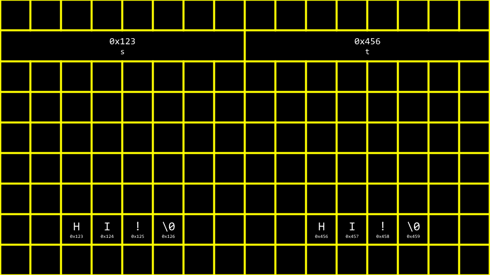

+   因此，上面`compare.c`的代码实际上是在尝试查看内存地址是否不同，而不是字符串本身。

+   使用`strcmp`，我们可以修正我们的代码：

    ```
    // Compares two strings using strcmp

    #include <cs50.h> #include <stdio.h> #include <string.h>  
    int main(void)
    {
        // Get two strings
        char *s = get_string("s: ");
        char *t = get_string("t: ");

        // Compare strings
        if (strcmp(s, t) == 0)
        {
            printf("Same\n");
        }
        else
        {
            printf("Different\n");
        }
    } 
    ```

    注意到`strcmp`可以在字符串相同的情况下返回`0`。

+   为了进一步说明这两个字符串是如何生活在两个位置上的，按如下方式修改你的代码：

    ```
    // Prints two strings

    #include <cs50.h> #include <stdio.h>  
    int main(void)
    {
        // Get two strings
        char *s = get_string("s: ");
        char *t = get_string("t: ");

        // Print strings
        printf("%s\n", s);
        printf("%s\n", t);
    } 
    ```

    注意我们现在有两个独立的字符串被存储，可能位于两个不同的位置。

+   你可以通过以下小修改看到这两个存储的字符串的位置：

    ```
    // Prints two strings' addresses

    #include <cs50.h> #include <stdio.h>  
    int main(void)
    {
        // Get two strings
        char *s = get_string("s: ");
        char *t = get_string("t: ");

        // Print strings' addresses
        printf("%p\n", s);
        printf("%p\n", t);
    } 
    ```

    注意在打印语句中 `%s` 已经被改为 `%p`。

## 复制和 malloc

+   编程中一个常见的需求是将一个字符串复制到另一个字符串。

+   在你的终端窗口中，键入 `code copy.c` 并编写以下代码：

    ```
    // Capitalizes a string

    #include <cs50.h> #include <ctype.h> #include <stdio.h> #include <string.h>  
    int main(void)
    {
        // Get a string
        string s = get_string("s: ");

        // Copy string's address
        string t = s;

        // Capitalize first letter in string
        t[0] = toupper(t[0]);

        // Print string twice
        printf("s: %s\n", s);
        printf("t: %s\n", t);
    } 
    ```

    注意，`string t = s` 将 `s` 的地址复制到 `t` 中。这并没有完成我们想要做的事情。字符串没有被复制——只有地址被复制了。此外，请注意 `ctype.h` 的包含。

+   你可以将上述代码可视化如下：

    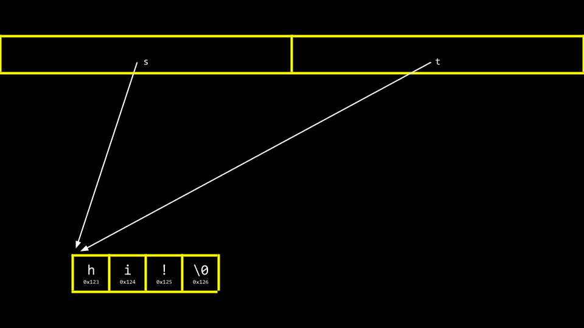

    注意 `s` 和 `t` 仍然指向相同的内存块。这不是字符串的真正副本。相反，这两个指针指向同一个字符串。

+   在我们解决这个挑战之前，确保我们的代码不会因为尝试将 `string s` 复制到不存在的 `string t` 而导致 *段错误* 是很重要的。我们可以使用 `strlen` 函数如下来帮助实现这一点：

    ```
    // Capitalizes a string, checking length first

    #include <cs50.h> #include <ctype.h> #include <stdio.h> #include <string.h>  
    int main(void)
    {
        // Get a string
        string s = get_string("s: ");

        // Copy string's address
        string t = s;

        // Capitalize first letter in string
        if (strlen(t) > 0)
        {
            t[0] = toupper(t[0]);
        }

        // Print string twice
        printf("s: %s\n", s);
        printf("t: %s\n", t);
    } 
    ```

    注意 `strlen` 用于确保 `string t` 存在。如果它不存在，则不会复制任何内容。

+   为了能够创建字符串的真正副本，我们需要引入两个新的构建块。首先，`malloc` 允许你，程序员，分配一块特定大小的内存。其次，`free` 允许你告诉编译器释放你之前分配的那块内存。

+   我们可以修改我们的代码来创建我们字符串的真正副本如下：

    ```
    // Capitalizes a copy of a string

    #include <cs50.h> #include <ctype.h> #include <stdio.h> #include <stdlib.h> #include <string.h>  
    int main(void)
    {
        // Get a string
        char *s = get_string("s: ");

        // Allocate memory for another string
        char *t = malloc(strlen(s) + 1);

        // Copy string into memory, including '\0'
        for (int i = 0; i <= strlen(s); i++)
        {
            t[i] = s[i];
        }

        // Capitalize copy
        t[0] = toupper(t[0]);

        // Print strings
        printf("s: %s\n", s);
        printf("t: %s\n", t);
    } 
    ```

    注意 `malloc(strlen(s) + 1)` 创建了一个长度为字符串 `s` 加一的内存块。这允许在最终的复制字符串中包含 *空* `\0` 字符。然后，`for` 循环遍历字符串 `s` 并将每个值赋给字符串 `t` 的相同位置。

+   结果表明，我们的代码效率不高。按照以下方式修改你的代码：

    ```
    // Capitalizes a copy of a string, defining n in loop too

    #include <cs50.h> #include <ctype.h> #include <stdio.h> #include <stdlib.h> #include <string.h>  
    int main(void)
    {
        // Get a string
        char *s = get_string("s: ");

        // Allocate memory for another string
        char *t = malloc(strlen(s) + 1);

        // Copy string into memory, including '\0'
        for (int i = 0, n = strlen(s); i <= n; i++)
        {
            t[i] = s[i];
        }

        // Capitalize copy
        t[0] = toupper(t[0]);

        // Print strings
        printf("s: %s\n", s);
        printf("t: %s\n", t);
    } 
    ```

    注意现在 `n = strlen(s)` 在 `for` 循环的左侧被定义。在 `for` 循环的中间条件中最好不调用不必要的函数，因为它会反复运行。当将 `n = strlen(s)` 移到左侧时，函数 `strlen` 只运行一次。

+   `C` 语言有一个内置的函数用于复制字符串，称为 `strcpy`。它可以如下实现：

    ```
    // Capitalizes a copy of a string using strcpy

    #include <cs50.h> #include <ctype.h> #include <stdio.h> #include <stdlib.h> #include <string.h>  
    int main(void)
    {
        // Get a string
        char *s = get_string("s: ");

        // Allocate memory for another string
        char *t = malloc(strlen(s) + 1);

        // Copy string into memory
        strcpy(t, s);

        // Capitalize copy
        t[0] = toupper(t[0]);

        // Print strings
        printf("s: %s\n", s);
        printf("t: %s\n", t);
    } 
    ```

    注意 `strcpy` 做了之前我们的 `for` 循环所做的工作。

+   在出现错误的情况下，`get_string` 和 `malloc` 都会返回 `NULL`，这是内存中的一个特殊值。你可以编写代码来检查这个 `NULL` 条件，如下所示：

    ```
    // Capitalizes a copy of a string without memory errors

    #include <cs50.h> #include <ctype.h> #include <stdio.h> #include <stdlib.h> #include <string.h>  
    int main(void)
    {
        // Get a string
        char *s = get_string("s: ");
        if (s == NULL)
        {
            return 1;
        }

        // Allocate memory for another string
        char *t = malloc(strlen(s) + 1);
        if (t == NULL)
        {
            return 1;
        }

        // Copy string into memory
        strcpy(t, s);

        // Capitalize copy
        if (strlen(t) > 0)
        {
            t[0] = toupper(t[0]);
        }

        // Print strings
        printf("s: %s\n", s);
        printf("t: %s\n", t);

        // Free memory
        free(t);
        return 0;
    } 
    ```

    注意如果获取的字符串长度为 `0` 或 `malloc` 失败，则返回 `NULL`。此外，注意 `free` 让计算机知道你已完成通过 `malloc` 创建的这块内存。

## Valgrind

+   *Valgrind* 是一个工具，可以检查你的程序中是否有与 `malloc` 相关的内存问题。具体来说，它检查你是否释放了所有分配的内存。

+   考虑以下 `memory.c` 代码：

    ```
    // Demonstrates memory errors via valgrind

    #include <stdio.h> #include <stdlib.h>  
    int main(void)
    {
        int *x = malloc(3 * sizeof(int));
        x[1] = 72;
        x[2] = 73;
        x[3] = 33;
    } 
    ```

    注意，运行此程序不会导致任何错误。虽然 `malloc` 用于分配足够内存的数组，但代码未能释放分配的内存。

+   如果你输入 `make memory` 然后跟 `valgrind ./memory`，你将得到一个 valgrind 报告，该报告将报告由于你的程序导致丢失的内存位置。valgrind 揭示的一个错误是我们试图将 `33` 的值赋给数组的第 4 个位置，而我们只分配了一个大小为 `3` 的数组。另一个错误是我们从未释放 `x`。

+   你可以修改你的代码来释放 `x` 的内存，如下所示：

    ```
    // Demonstrates memory errors via valgrind

    #include <stdio.h> #include <stdlib.h>  
    int main(void)
    {
        int *x = malloc(3 * sizeof(int));
        x[1] = 72;
        x[2] = 73;
        x[3] = 33;
        free(x);
    } 
    ```

    注意，现在再次运行 valgrind 不会出现内存泄漏。

## 垃圾值

+   当你向编译器请求一块内存时，没有保证这块内存是空的。

+   很可能你分配的内存之前已被计算机使用。因此，你可能会看到 *垃圾* 或 *垃圾值*。这是由于你获得了一块内存但没有初始化它。例如，考虑以下 `garbage.c` 代码：

    ```
    #include <stdio.h> #include <stdlib.h>  
    int main(void)
    {
        int scores[1024];
        for (int i = 0; i < 1024; i++)
        {
            printf("%i\n", scores[i]);
        }
    } 
    ```

    注意，运行此代码将在内存中为你的数组分配 `1024` 个位置，但 `for` 循环可能会显示其中并非所有值都是 `0`。始终注意，当你没有将内存块初始化为零或其他值时，垃圾值的可能性。

## Pointer Fun with Binky

+   我们观看了一个来自斯坦福大学的 [视频](https://www.youtube.com/watch?v=5VnDaHBi8dM)，该视频帮助我们可视化和理解指针。

## 交换

+   在现实世界中，编程中一个常见的需要是交换两个值。自然地，没有临时存储空间交换两个变量是困难的。在实践中，你可以输入 `code swap.c` 并编写如下代码来观察这一行为：

    ```
    // Fails to swap two integers

    #include <stdio.h>  
    void swap(int a, int b);

    int main(void)
    {
        int x = 1;
        int y = 2;

        printf("x is %i, y is %i\n", x, y);
        swap(x, y);
        printf("x is %i, y is %i\n", x, y);
    }

    void swap(int a, int b)
    {
        int tmp = a;
        a = b;
        b = tmp;
    } 
    ```

    注意，尽管这段代码正在运行，但它不起作用。值，甚至在发送到 `swap` 函数之后，都没有交换。为什么？

+   当你向函数传递值时，你只提供了副本。`x` 和 `y` 的 *作用域* 限制在当前代码编写的主函数中。也就是说，在 `main` 函数的花括号 `{}` 中创建的 `x` 和 `y` 的值只有 `main` 函数的作用域。在我们的上述代码中，`x` 和 `y` 是通过 *值* 传递的。

+   考虑以下图像：

    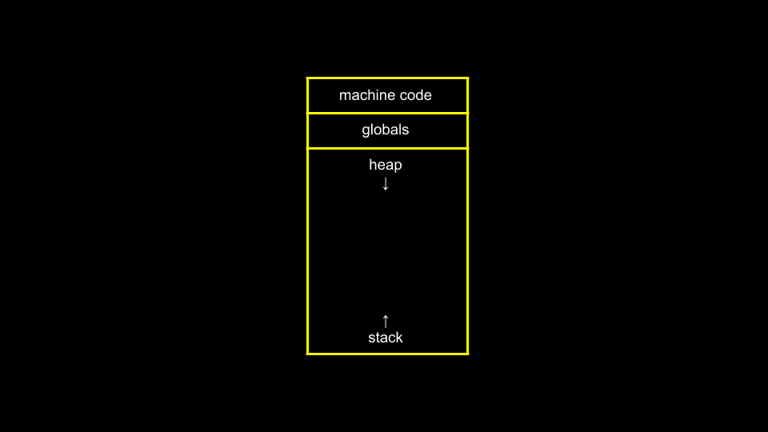

    注意，*全局* 变量，我们在这个课程中没有使用，在内存中只有一个位置。各种函数存储在内存的另一个区域 `stack` 中。

+   现在，考虑以下图像：

    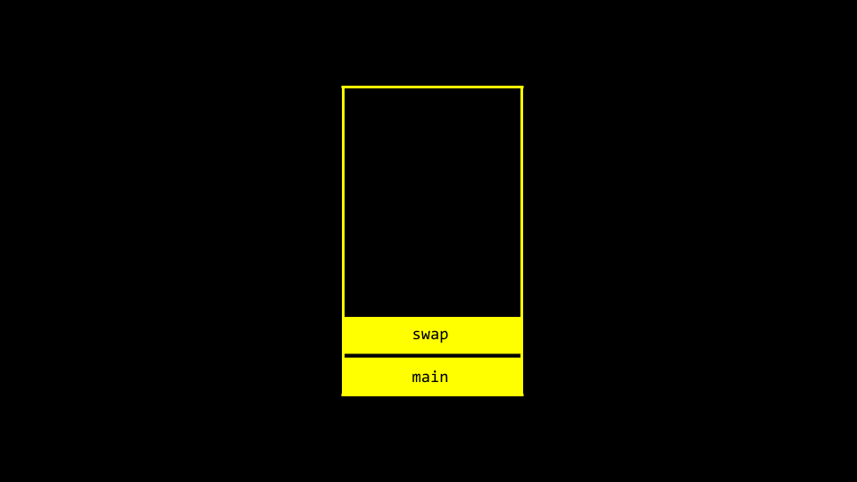

    注意，`main` 和 `swap` 有两个独立的*帧*或内存区域。因此，我们不能简单地从一个函数传递值到另一个函数来改变它们。

+   按如下修改你的代码：

    ```
    // Swaps two integers using pointers

    #include <stdio.h>  
    void swap(int *a, int *b);

    int main(void)
    {
        int x = 1;
        int y = 2;

        printf("x is %i, y is %i\n", x, y);
        swap(&x, &y);
        printf("x is %i, y is %i\n", x, y);
    }

    void swap(int *a, int *b)
    {
        int tmp = *a;
        *a = *b;
        *b = tmp;
    } 
    ```

    注意，变量不是通过*值*传递，而是通过*引用*传递。也就是说，`a` 和 `b` 的地址被提供给函数。因此，`swap` 函数可以知道从主函数中如何对实际的 `a` 和 `b` 进行更改。

+   你可以这样可视化：

    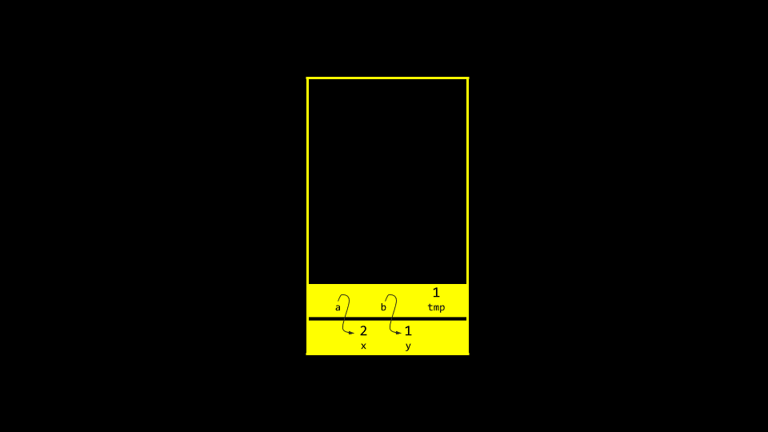

## 溢出

+   *堆溢出* 是当你溢出堆，触及你不应该触及的内存区域时。

+   *栈溢出* 是当调用太多函数时，超出可用内存量。

+   这两种情况都被认为是*缓冲区溢出*。

## `scanf`

+   在 CS50 中，我们创建了像 `get_int` 这样的函数来简化从用户获取输入的行为。

+   `scanf` 是一个内置函数，可以获取用户输入。

+   我们可以使用 `scanf` 很容易地重新实现 `get_int`，如下所示：

    ```
    // Gets an int from user using scanf

    #include <stdio.h>  
    int main(void)
    {
        int n;
        printf("n: ");
        scanf("%i", &n);
        printf("n: %i\n", n);
    } 
    ```

    注意，`n` 的值存储在 `scanf("%i", &n)` 这一行中 `n` 的位置。

+   然而，尝试重新实现 `get_string` 并不容易。考虑以下：

    ```
    // Dangerously gets a string from user using scanf with array

    #include <stdio.h>  
    int main(void)
    {
        char s[4];
        printf("s: ");
        scanf("%s", s);
        printf("s: %s\n", s);
    } 
    ```

    注意，由于字符串是特殊的，不需要使用 `&`。然而，这个程序并不总是在每次运行时都能正确运行。在这个程序中，我们没有为我们的字符串分配所需的内存量。实际上，我们不知道用户可能输入多长的字符串！进一步地，我们也不知道内存位置可能存在的垃圾值。

+   此外，你的代码可以修改如下。但是，我们必须为字符串预分配一定量的内存：

    ```
    // Using malloc

    #include <stdio.h> #include <stdlib.h>  
    int main(void)
    {
        char *s = malloc(4);
        if (s == NULL)
        {
            return 1;
        }
        printf("s: ");
        scanf("%s", s);
        printf("s: %s\n", s);
        free(s);
        return 0;
    } 
    ```

    注意，如果提供了一个四字节的字符串，你*可能*会得到一个错误。

+   如下简化我们的代码，我们可以进一步理解这个预分配的基本问题：

    ```
    #include <stdio.h>  
    int main(void)
    {
        char s[4];
        printf("s: ");
        scanf("%s", s);
        printf("s: %s\n", s);
    } 
    ```

    注意，如果我们预先分配一个大小为 `4` 的数组，我们可以输入 `cat` 并使程序运行。然而，大于这个大小的字符串*可能*会创建一个错误。

+   有时，编译器或运行它的系统可能会分配比我们指示的更多内存。然而，从根本上说，上面的代码是不安全的。我们不能相信用户会输入一个适合我们预分配内存的字符串。

## 文件输入/输出

+   你可以读取和操作文件。虽然这个主题将在未来的某个星期进一步讨论，但考虑以下 `phonebook.c` 的代码：

    ```
    // Saves names and numbers to a CSV file

    #include <cs50.h> #include <stdio.h> #include <string.h>  
    int main(void)
    {
        // Open CSV file
        FILE *file = fopen("phonebook.csv", "a");

        // Get name and number
        char *name = get_string("Name: ");
        char *number = get_string("Number: ");

        // Print to file
        fprintf(file, "%s,%s\n", name, number);

        // Close file
        fclose(file);
    } 
    ```

    注意，这段代码使用指针来访问文件。

+   你可以在运行上述代码之前创建一个名为`phonebook.csv`的文件，或者下载[phonebook.csv](https://cdn.cs50.net/2024/fall/lectures/4/src4/phonebook.csv?download)。运行上述程序并输入姓名和电话号码后，你会发现这些数据在你的 CSV 文件中持久保存。

+   如果我们想在运行程序之前确保`phonebook.csv`文件存在，我们可以按照以下方式修改我们的代码：

    ```
    // Saves names and numbers to a CSV file

    #include <cs50.h> #include <stdio.h> #include <string.h>  
    int main(void)
    {
        // Open CSV file
        FILE *file = fopen("phonebook.csv", "a");
        if (!file)
        {
            return 1;
        }

        // Get name and number
        char *name = get_string("Name: ");
        char *number = get_string("Number: ");

        // Print to file
        fprintf(file, "%s,%s\n", name, number);

        // Close file
        fclose(file);
    } 
    ```

    注意，这个程序通过调用`return 1`来防止`NULL`指针。

+   我们可以通过输入`code cp.c`并编写如下代码来实现自己的复制程序：

    ```
    // Copies a file

    #include <stdio.h> #include <stdint.h>  
    typedef uint8_t BYTE;

    int main(int argc, char *argv[])
    {
        FILE *src = fopen(argv[1], "rb");
        FILE *dst = fopen(argv[2], "wb");

        BYTE b;

        while (fread(&b, sizeof(b), 1, src) != 0)
        {
            fwrite(&b, sizeof(b), 1, dst);
        }

        fclose(dst);
        fclose(src);
    } 
    ```

    注意，这个文件创建了我们自己的数据类型，称为 BYTE，它的大小与 uint8_t 相同。然后，文件读取一个`BYTE`并将其写入文件。

+   BMPs 也是我们可以检查和操作的数据集合。这周，你将在你的问题集中做这件事！

## 总结

在本课中，你学习了指针，它使你能够访问和操作特定内存位置的数据。具体来说，我们深入探讨了……

+   像素艺术

+   十六进制

+   内存

+   指针

+   字符串

+   指针算术

+   字符串比较

+   复制

+   malloc 和 Valgrind

+   垃圾值

+   交换

+   溢出

+   `scanf`

+   文件输入/输出

欢迎下次再来！
