# 第五讲

> 原文：[`cs50.harvard.edu/x/notes/5/`](https://cs50.harvard.edu/x/notes/5/)

+   欢迎！

+   数据结构

+   队列

+   栈

+   杰克学习事实

+   调整数组大小

+   数组

+   链表

+   树

+   字典

+   哈希和哈希表

+   字典树

+   总结

## 欢迎光临！

+   前几周已经向你介绍了编程的基本构建块。

+   你在 C 语言中学到的所有知识都将使你能够在 Python 等高级编程语言中实现这些构建块。

+   每周，概念变得越来越具有挑战性，就像一座山变得越来越陡峭。本周，随着我们探索数据结构，挑战变得平缓。

+   迄今为止，你已经学习了如何使用数组在内存中组织数据。

+   今天，我们将讨论如何在内存中组织数据以及从你不断增长的知识中出现的可能性。

## 数据结构

+   *数据结构* 实质上是内存中的组织形式。

+   在内存中组织数据有许多方法。

+   *抽象数据类型* 是我们可以概念上想象的数据类型。在了解计算机科学时，通常从这些概念数据结构开始学习是有用的。学习这些将使以后理解如何实现更具体的数据结构变得更加容易。

## 队列

+   *队列* 是一种抽象数据结构的形式。

+   队列具有特定的属性。具体来说，它们是 *FIFO* 或“先进先出”。你可以想象自己在游乐园排队等待游乐设施。第一个排队的会先玩，最后一个排队的会后玩。

+   队列与特定的动作相关联。例如，一个项目可以被 *enqueued*；也就是说，项目可以加入队伍或队列。此外，一个项目可以被 *dequeued* 或者在到达队伍前端时离开队列。

+   在代码中，你可以这样想象一个队列：

    [PRE0]

    注意，名为 `people` 的数组是 `person` 类型。`CAPACITY` 表示栈可能达到的高度。整数 `size` 表示队列实际填充的程度，无论它可以容纳多少。

## 栈

+   队列与栈相对。从根本上讲，栈的性质与队列的性质不同。具体来说，它是 *LIFO* 或“后进先出”。就像在餐厅里堆叠盘子一样，最后放入堆叠中的盘子可能是第一个被取走的。

+   栈与特定的动作相关联。例如，*push* 将某物放置在栈顶。*Pop* 是从栈顶移除某物。

+   在代码中，你可能可以这样想象一个栈：

    [PRE1]

    注意，名为 `people` 的数组是 `person` 类型。`CAPACITY` 表示栈可能达到的高度。整数 `size` 表示栈实际填充的程度，无论它可以容纳多少。注意，这段代码与队列中的代码相同。

+   您可能会想象，上面的代码有一个限制。因为在这个代码中，数组的容量总是预先确定的。因此，栈可能总是过大。您可能会想象只使用栈中的 5000 个位置中的一个。

+   如果我们的栈是动态的——能够随着添加到其中的项目而增长，那就太好了。

## Jack Learns the Facts

+   我们观看了由 Elon 大学的 Shannon Duvall 教授制作的名为[Jack Learns the Facts](https://www.youtube.com/watch?v=ItAG3s6KIEI)的视频。

## 调整数组大小

+   回顾到第 2 周，我们向您介绍了您的第一个数据结构。

+   数组是一块连续的内存。

+   您可能会想象数组如下所示：

    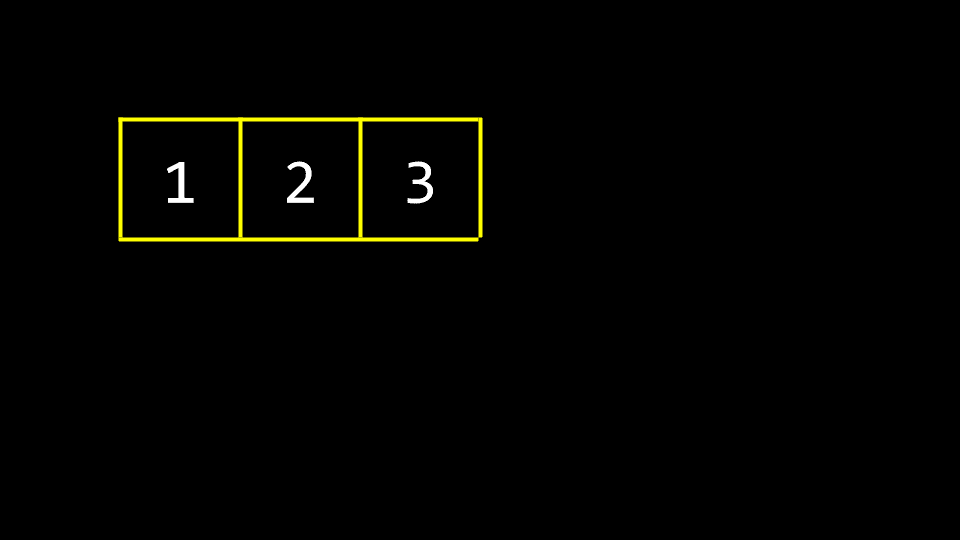

+   在内存中，还有其他程序、函数和变量存储的值。其中许多可能是曾经被使用但现在可供使用的未使用垃圾值。

    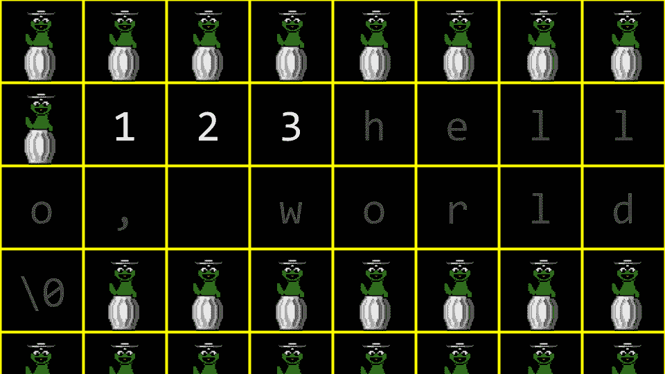

+   假设您想在我们的数组中存储第四个值`4`。需要做的是分配一个新的内存区域并将旧数组移动到新区域？最初，这个新的内存区域将填充垃圾值。

    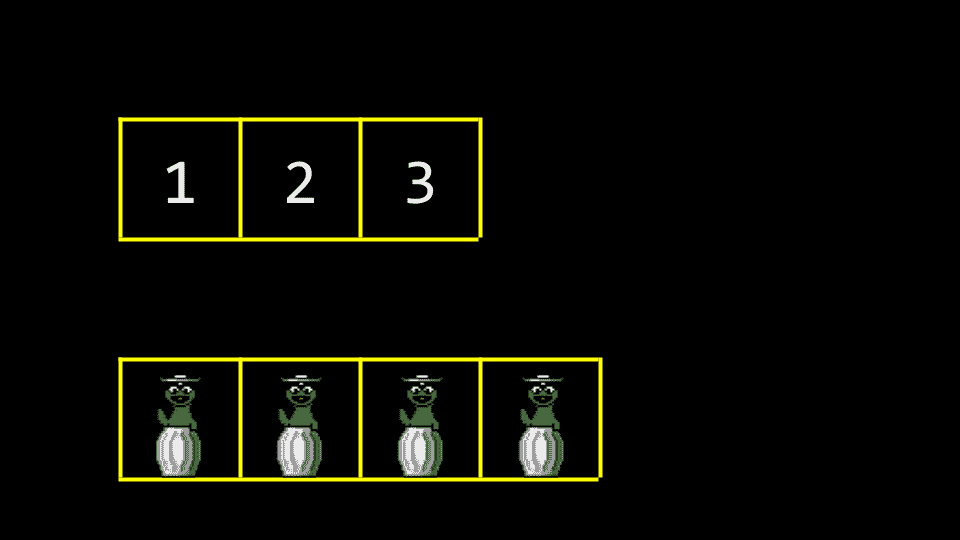

+   当向这个新的内存区域添加值时，旧的垃圾值会被覆盖。

    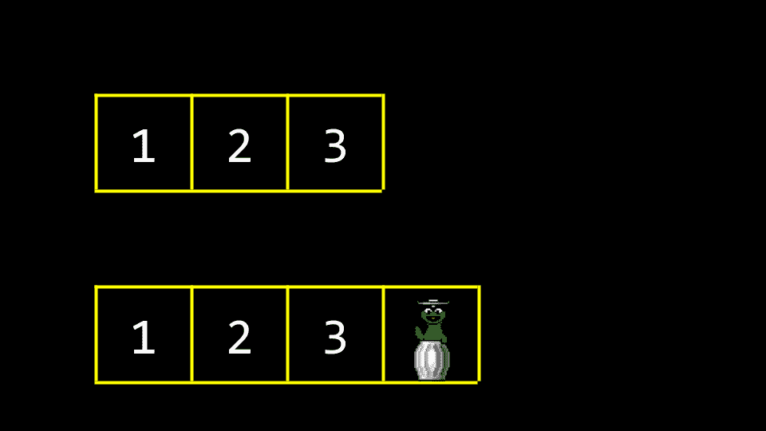

+   最终，所有旧的垃圾值都会被新的数据覆盖。

    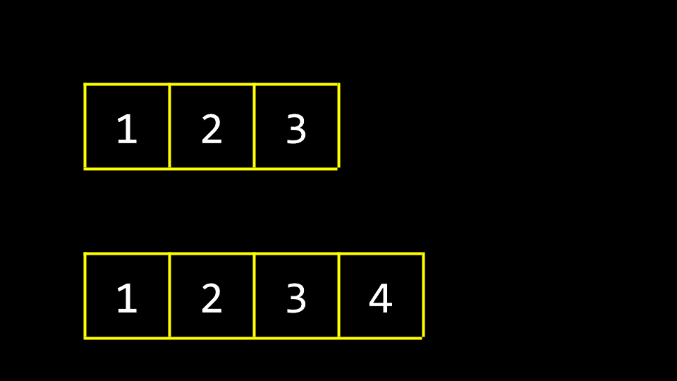

+   这种方法的缺点之一是设计不佳：每次我们添加一个数字，我们都必须逐个复制数组项。

## 数组

+   如果我们能够将`4`存储在内存的另一个地方会怎么样？根据定义，这将不再是一个数组，因为`4`将不再在连续的内存中。我们如何连接内存中的不同位置？

+   在您的终端中，键入`code list.c`并编写以下代码：

    [PRE2]

    注意，上面的代码与我们在本课程中早期学到的非常相似。内存为三个项目预先分配。

+   建立在最近获得的知识基础上，我们可以利用我们对指针的理解来改进这段代码的设计。按照以下方式修改您的代码：

    [PRE3]

    注意，创建了一个包含三个整数的列表。然后，可以将三个内存地址分配给值 `1`、`2` 和 `3`。接着，创建了一个大小为四的列表。接下来，列表从第一个复制到第二个。将值 `4` 添加到 `tmp` 列表中。由于 `list` 指向的内存块不再使用，使用命令 `free(list)` 释放它。最后，编译器被指示将 `list` 指针现在指向 `tmp` 指向的内存块。打印 `list` 的内容，然后释放。此外，请注意包含了 `stdlib.h`。

+   有用的是将 `list` 和 `tmp` 都视为指向一块内存的指针。正如上面的例子所示，`list` 在某个时刻 *指向* 一个大小为 3 的数组。到结束时，`list` 被指示指向一个大小为 4 的内存块。技术上讲，在上述代码结束时，`tmp` 和 `list` 都指向了同一块内存。

+   一种不使用 for 循环复制数组的方法是使用 `realloc`：

    [PRE4]

    注意，列表通过 `realloc` 调整大小到新的数组。

+   可能会有人想为列表分配比所需更多的内存，比如 30 项而不是所需的 3 或 4 项。然而，这并不是一个好的设计，因为它在不需要时也会消耗系统资源。此外，几乎没有保证最终需要超过 30 项内存。

## 链表

+   在最近几周，你学习了三个有用的原语。`struct` 是你可以自己定义的数据类型。点号（`.`）在点表示法中允许你访问该结构体内部的变量。`*` 操作符用于声明指针或取消引用变量。

+   今天，你将介绍 `->` 操作符。它是一个箭头。此操作符指向一个地址并在结构体内部查找。

+   链表是 C 中最强大的数据结构之一。链表允许你包含位于不同内存区域的值。此外，它们允许你根据需要动态地扩展和缩小列表。

+   你可能会想象三个值存储在三个不同的内存区域，如下所示：

    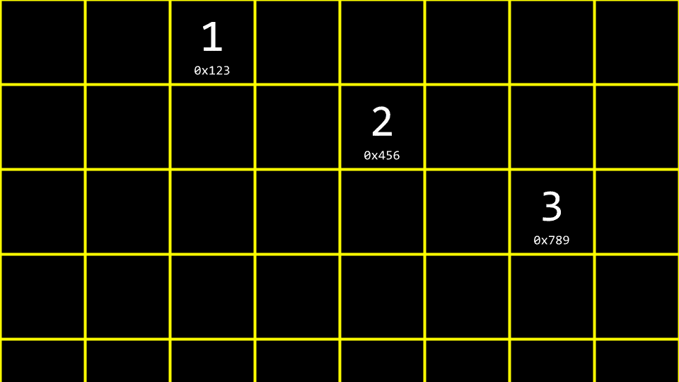

+   如何将这些值在列表中拼接起来？

+   我们可以想象上面的数据如下所示：

    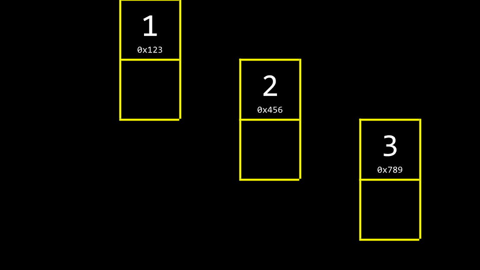

+   我们可以利用更多的内存来跟踪下一个项目使用指针的位置。

    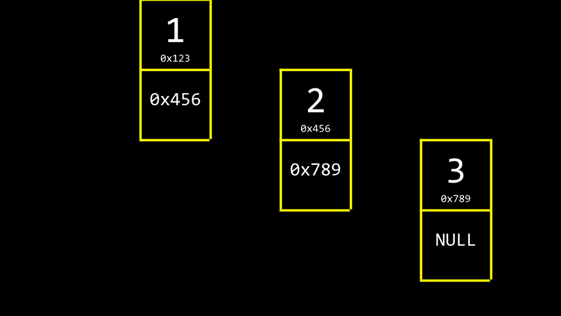

    注意，NULL 被用来表示列表中没有其他内容。

+   按照惯例，我们会在内存中保留一个额外的元素，一个指针，它跟踪列表中的第一个项目，称为列表的*头*。

    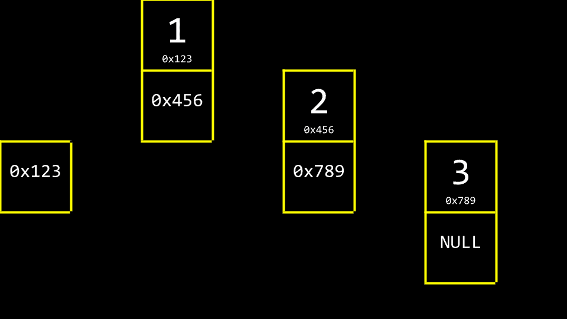

+   抽象掉内存地址，列表将如下所示：

    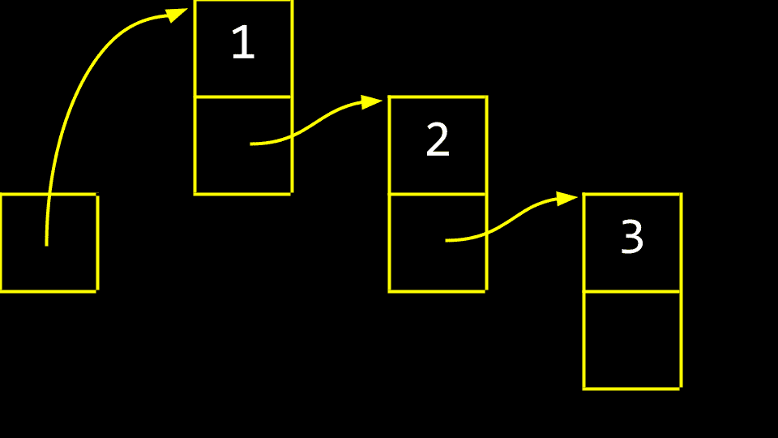

+   这些盒子被称为*节点*。一个*节点*包含一个*项*和一个称为*next*的指针。在代码中，你可以想象一个节点如下：

    [PRE5]

    注意，这个节点包含的项是一个名为`number`的整数。其次，包含一个指向节点`next`的指针，它将指向内存中的另一个节点。

+   我们可以重新创建`list.c`以利用链表：

    [PRE6]

    首先，将`node`定义为`struct`。对于列表的每个元素，通过`malloc`为节点分配内存，大小为一个节点的大小。将`n->number`（或`n`的数字字段）赋值为一个整数。将`n->next`（或`n`的`next`字段）赋值为`null`。然后，将节点放置在列表的起始位置，内存位置为`list`。

+   从概念上讲，我们可以想象创建链表的过程。首先，声明`node *list`，但它的值是垃圾值。

    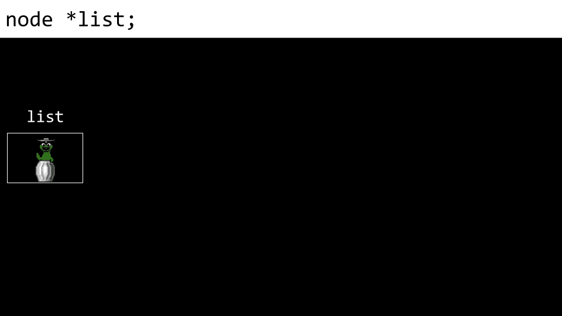

+   接下来，在内存中分配一个名为`n`的节点。

    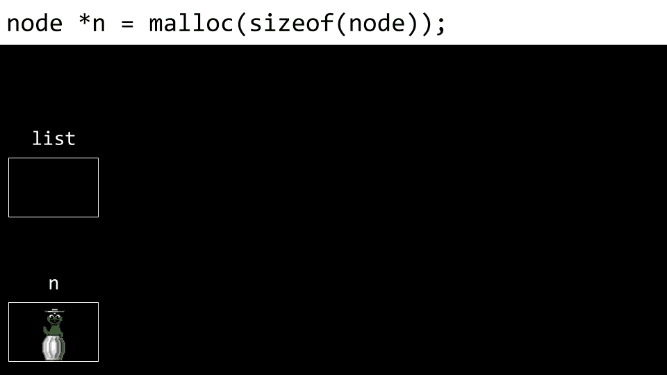

+   接下来，将节点的`number`赋值为`1`。

    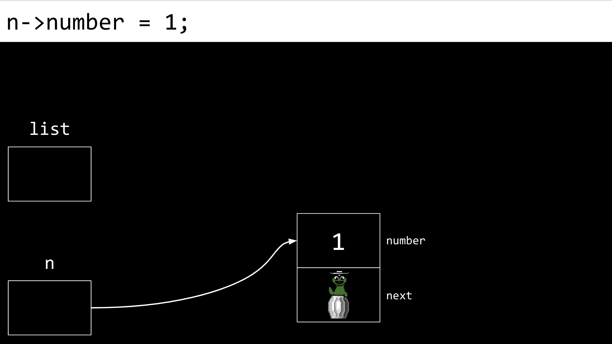

+   接下来，将节点的`next`字段赋值为`NULL`。

    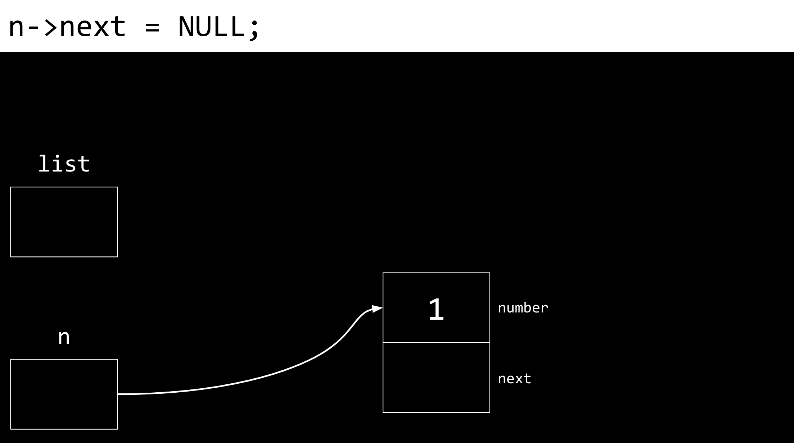

+   接下来，将`list`指向`n`指向的内存位置。现在`n`和`list`指向同一个地方。

    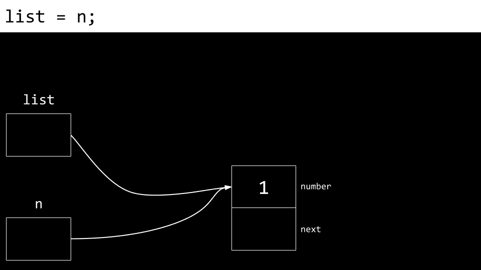

+   然后创建一个新的节点。`number`和`next`字段都填充了垃圾值。

    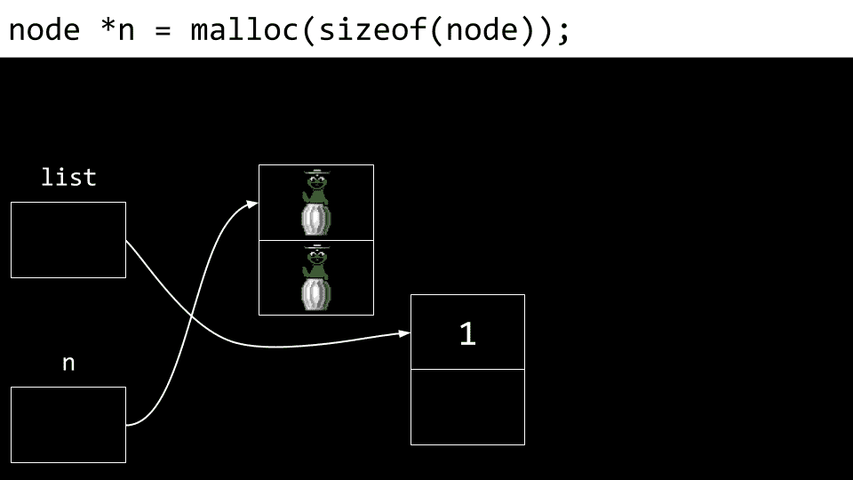

+   `n`的节点（新节点）的`number`值更新为`2`。

    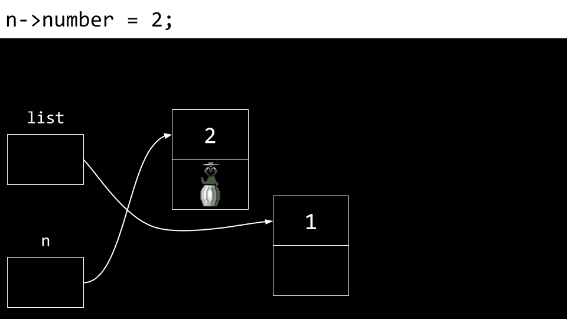

+   此外，`next`字段也被更新了。

    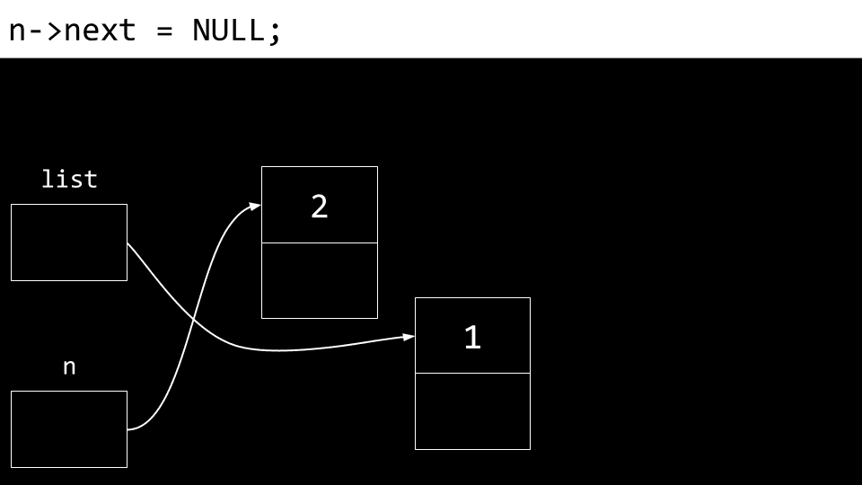

+   最重要的是，我们不想失去与这些节点的任何连接，以免它们永远丢失。因此，`n`的`next`字段指向与`list`相同的内存位置。

    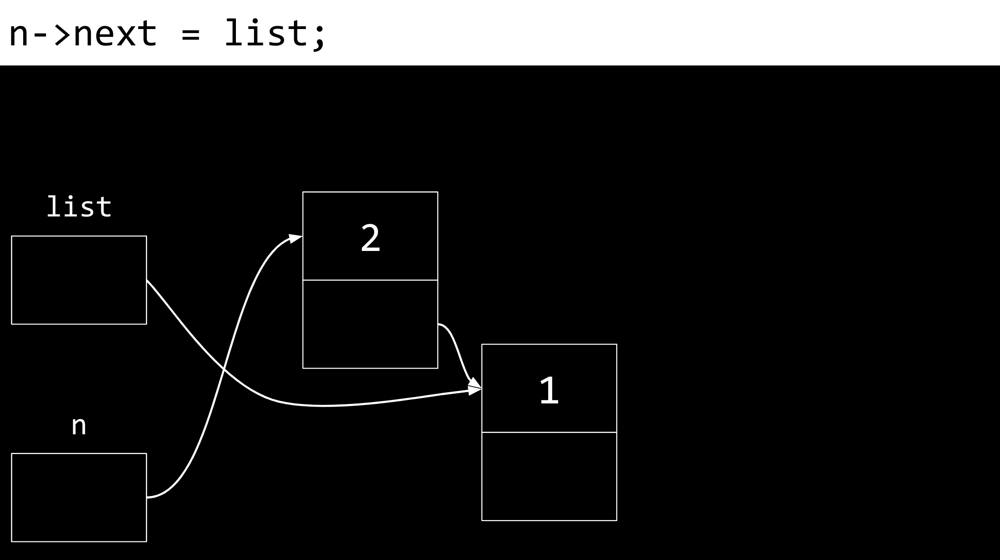

+   最后，`list`被更新为指向`n`。我们现在有一个包含两个项目的链表。

    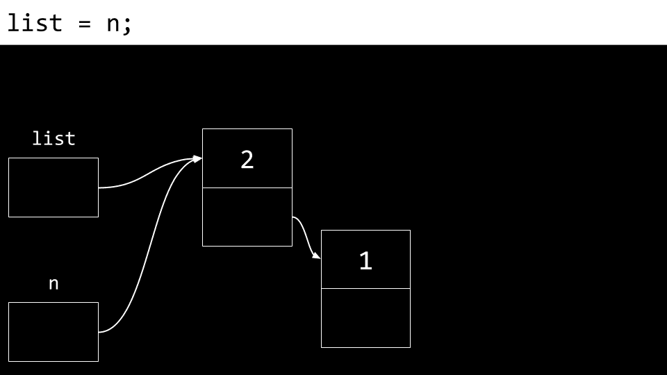

+   观察我们的列表图，我们可以看到最后添加的数字是列表中第一个出现的数字。因此，如果我们按顺序打印列表，从第一个节点开始，列表将看起来是乱序的。

+   我们可以按正确顺序打印列表如下：

    [PRE7]

    注意，`node *ptr = list`创建了一个临时变量，它指向与`list`指向的相同位置。`while`循环打印`ptr`指向的节点内容，然后更新`ptr`以指向列表中的下一个节点。

+   在这个例子中，向列表中插入总是按\(O(1)\)的顺序进行，因为只需非常少的步骤就可以在列表的前端插入。

+   考虑到搜索这个列表所需的时间，它按\(O(n)\)的顺序，因为在最坏的情况下，必须搜索整个列表以找到项目。向列表添加新元素的时间复杂度将取决于该元素添加的位置。这在下述示例中得到了说明。

+   链表不是存储在连续的内存块中。只要系统资源足够，它们可以增长到你想要的任何大小。然而，缺点是，与数组相比，需要更多的内存来跟踪列表。对于每个元素，你必须存储不仅元素的值，还要存储指向下一个节点的指针。此外，链表不能像数组那样索引，因为我们需要通过前\(n - 1\)个元素来找到第\(n\)个元素的位置。因此，上图所示的列表必须进行线性搜索。因此，在上述构建的列表中不可能进行二分搜索。

+   此外，你可以在列表的末尾放置数字，如图中所示代码：

    [PRE8]

    注意代码是如何 *遍历* 这个列表来找到末尾的。当追加一个元素（添加到列表的末尾）时，我们的代码将以 \(O(n)\) 的时间复杂度运行，因为我们必须遍历整个列表才能添加最后一个元素。此外，注意使用了一个名为 `next` 的临时变量来跟踪 `ptr->next`。

+   此外，你可以在添加项目时对列表进行排序：

    [PRE9]

    注意这个列表是如何在构建过程中排序的。为了以这种特定顺序插入元素，我们的代码在每次插入时仍将以 \(O(n)\) 的时间复杂度运行，因为在最坏的情况下，我们可能需要查看所有当前元素。

+   这段代码可能看起来很复杂。然而，请注意，使用指针和上面的语法，我们可以在内存的不同位置拼接数据。

## 树

+   数组提供连续的内存，可以快速搜索。数组还提供了进行二分搜索的机会。

+   我们能否结合数组和链表的最佳之处？

+   *二叉搜索树* 是另一种数据结构，可以更有效地存储数据，以便进行搜索和检索。

+   你可以想象一个有序的数字序列。

    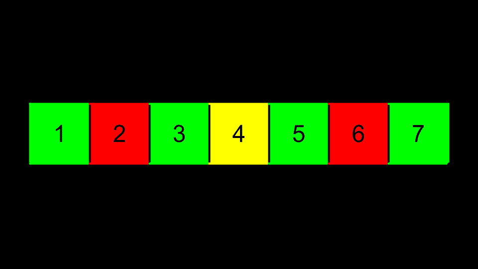

+   想象一下，中心值成为树的顶部。那些小于这个值的放在左边。那些大于这个值的放在右边。

    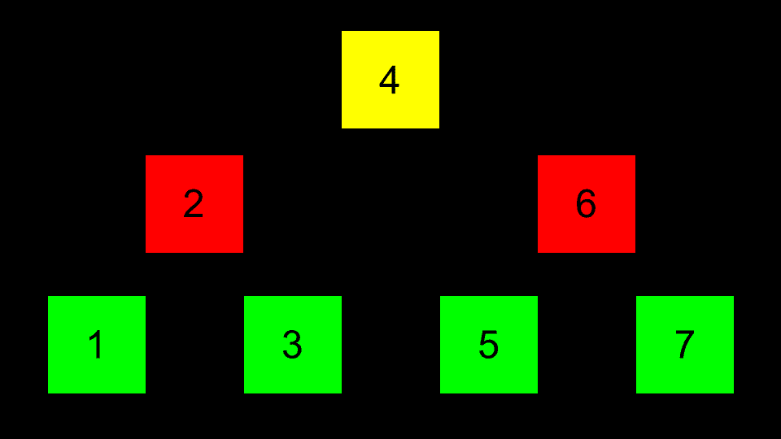

+   然后可以使用指针指向每个内存区域的正确位置，这样每个节点都可以连接起来。

    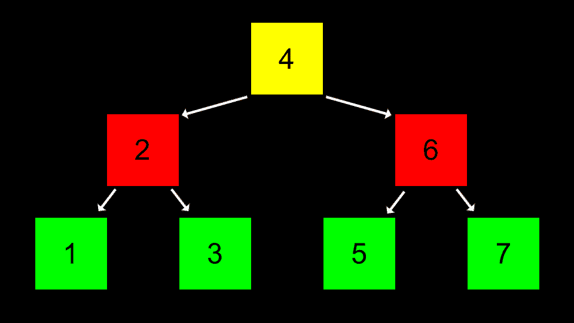

+   在代码中，可以这样实现。

    [PRE10]

    注意这个搜索功能首先会去 `tree` 的位置。然后，它使用递归来搜索 `number`。`free_tree` 函数递归地释放树。`print_tree` 函数递归地打印树。

+   如上所示的树提供了一种数组不具备的动态性。它可以按我们的意愿增长和缩小。

+   此外，当树平衡时，这个结构提供 \(O(log n)\) 的搜索时间。

## 词典

+   *词典* 是另一种数据结构。

+   词典，就像实际的书本形式的词典，有单词和定义，有 *键* 和 *值*。

+   算法时间复杂度的 *圣杯* 是 \(O(1)\) 或 *常数时间*。也就是说，最终目标是访问能够瞬间完成。

    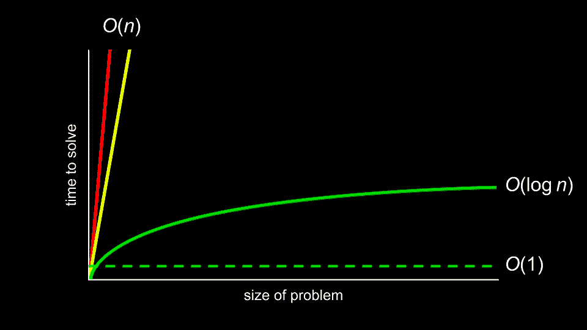

+   词典可以通过散列提供这种访问速度。

## 散列和散列表

+   *散列*的想法是取一个值并能够输出一个值，这个值可以成为以后访问它的快捷方式。

+   例如，散列*苹果*可能散列为一个值为`1`，而*浆果*可能散列为`2`。因此，找到*苹果*就像询问*哈希*算法*苹果*存储在哪里一样简单。虽然在设计上不是理想的，但最终，将所有*a*放在一个桶中，将*b*放在另一个桶中，这种*桶化*散列值的理念说明了你可以如何使用这个概念：散列值可以用来简化查找这样的值。

+   *散列函数*是一种将较大值减少到较小且可预测的值的算法。通常，这个函数接收一个你希望添加到你的哈希表中的项目，并返回一个表示该项目应放置的数组索引的整数。

+   *哈希表*是数组和链表的绝佳组合。在代码实现中，哈希表是一个指向*节点*的*指针*数组。

+   可以这样想象哈希表：

    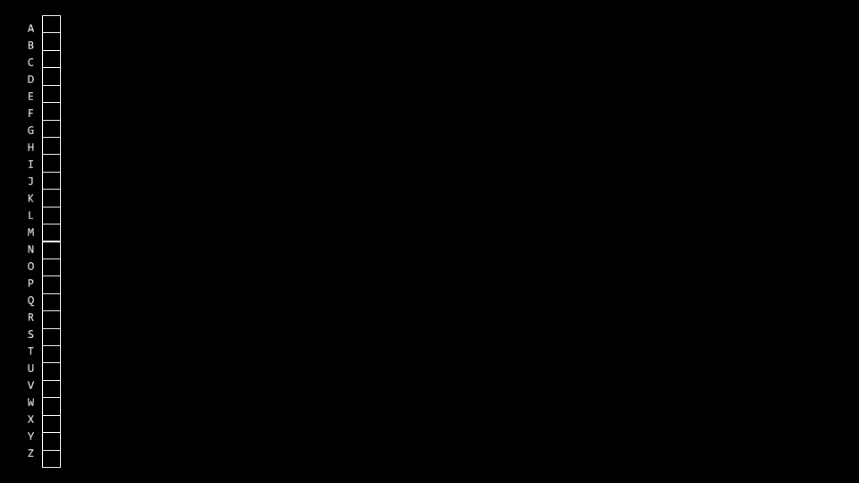

    注意这是一个分配给字母表每个值的数组。

+   然后，在数组的每个位置，使用链表来跟踪存储在该位置的每个值：

    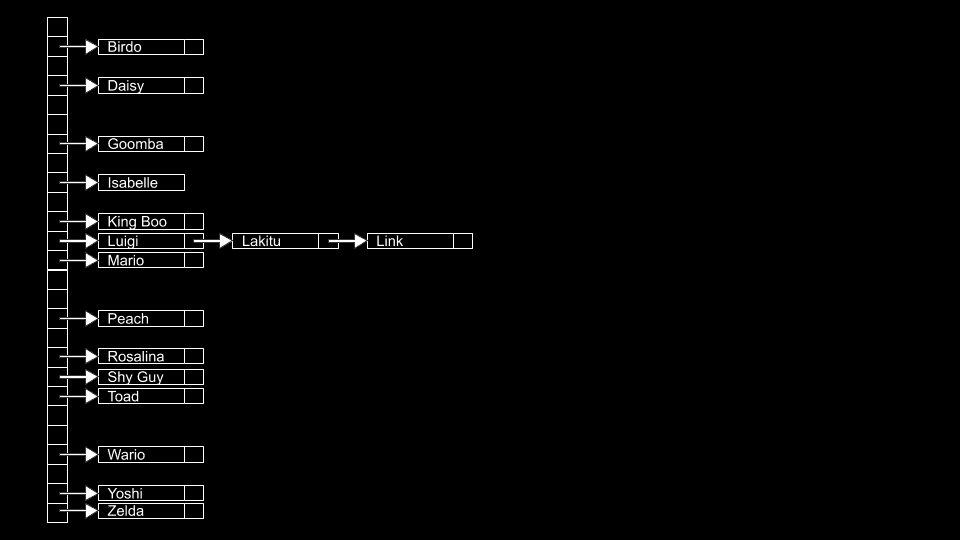

+   *冲突*是在你向哈希表中添加值时，已经存在散列位置上的值。在上面的例子中，冲突只是简单地附加到列表的末尾。

+   通过更好地编程你的哈希表和哈希算法可以减少冲突。你可以想象对上面的改进如下：

    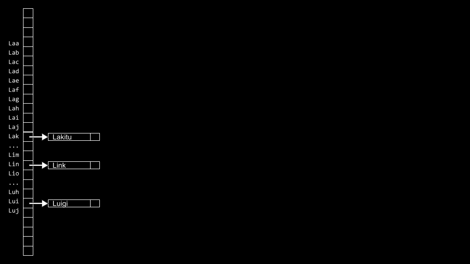

+   考虑以下哈希算法的示例：

    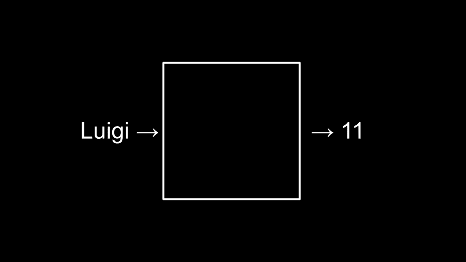

+   这可以在代码中如下实现：

    [PRE11]

    注意哈希函数返回`toupper(word[0]) - 'A'`的值。

+   作为程序员，你必须决定使用更多内存以拥有大哈希表并可能减少搜索时间，还是使用更少的内存并可能增加搜索时间的好处。

+   这种结构提供了 \(O(n)\) 的搜索时间。

## Trie

+   *Trie*是另一种数据结构。Trie 是数组的树。

+   *Trie*总是可以在常数时间内进行搜索。

+   *Trie*的一个缺点是它们往往需要占用大量的内存。注意，我们只需要 \(26 \times 4 = 104\) 个`节点`来存储*青蛙*！

+   *青蛙*将如下存储：

    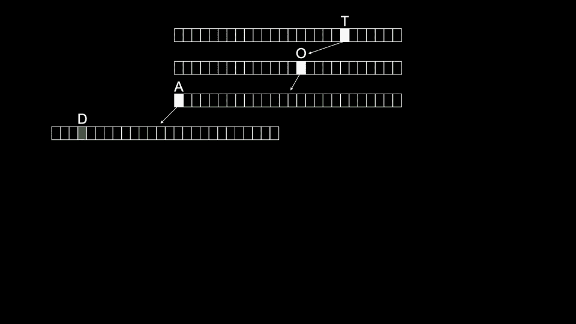

+   *汤姆* 将按以下方式存储：

    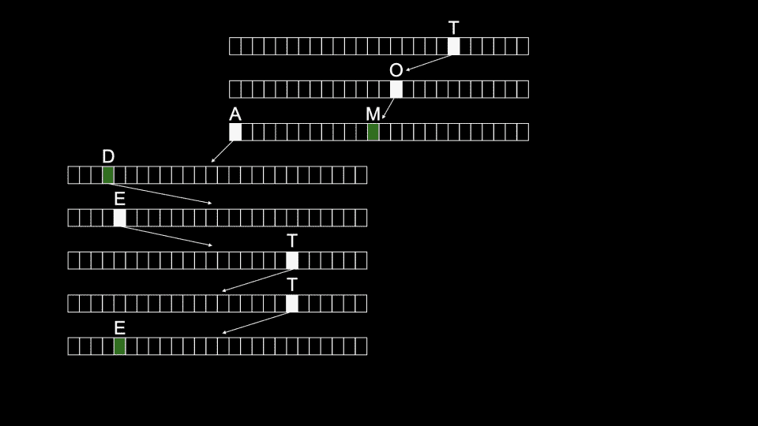

+   这种结构提供了 \(O(1)\) 的搜索时间。

+   这种结构的缺点在于使用它需要多少资源。

## 总结

在本课中，你学习了如何使用指针构建新的数据结构。具体来说，我们深入探讨了...

+   数据结构

+   栈和队列

+   调整数组大小

+   链表

+   字典

+   Tries

次次见！
