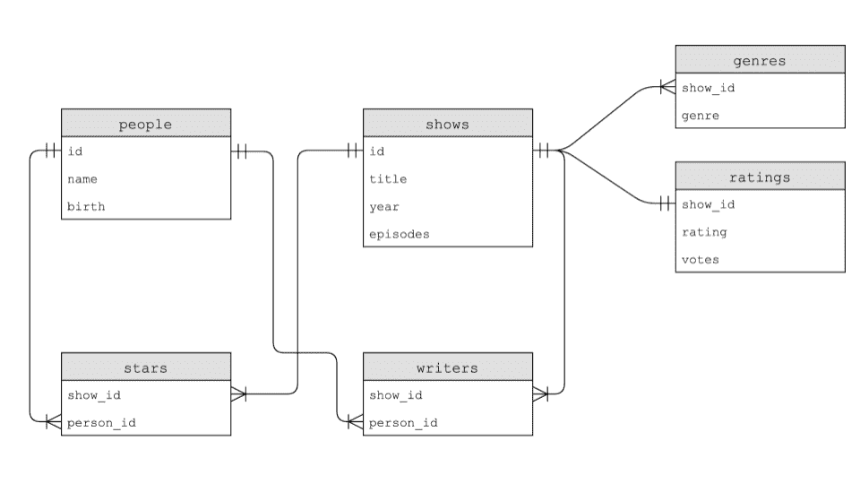
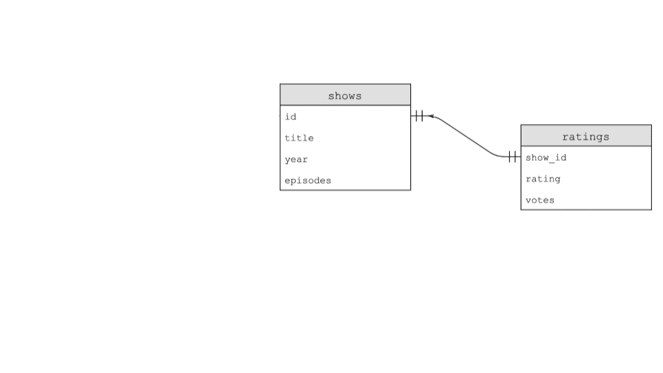

# 第七讲

> 原文：[`cs50.harvard.edu/x/notes/7/`](https://cs50.harvard.edu/x/notes/7/)

+   欢迎！

+   平面文件数据库

+   关系数据库

+   SELECT

+   INSERT

+   DELETE

+   UPDATE

+   IMDb

+   JOIN

+   索引

+   在 Python 中使用 SQL

+   竞争条件

+   SQL 注入攻击

+   总结

## 欢迎！

+   在前几周，我们向您介绍了 Python，这是一种高级编程语言，它使用了我们在 C 语言中学到的相同构建块。然而，我们引入这种新语言不是为了学习“另一种语言”。相反，我们这样做是因为某些工具更适合某些工作，而不太适合其他工作！

+   这周，我们将继续学习更多与 Python 相关的语法。

+   此外，我们将把这种知识与我们所学的内容结合起来。

+   最后，我们将讨论*SQL*或*结构化查询语言*，这是一种特定领域的方法，我们可以通过它来交互和修改数据。

+   总体而言，本课程的一个目标就是学习编程的一般知识——而不仅仅是学习本课程中描述的语言的编程。

## 平面文件数据库

+   如你所见，数据通常可以用列和行的模式来描述。

+   类似于在 Microsoft Excel 和 Google Sheets 中创建的电子表格可以输出为`csv`或*逗号分隔值*文件。

+   如果你查看一个`csv`文件，你会注意到文件是平的，因为我们的所有数据都存储在一个由文本文件表示的单个表中。我们称这种形式的数据为*平面文件数据库*。

+   所有数据都是按行存储的。每个列由逗号或其他值分隔。

+   Python 自带对`csv`文件的原生支持。

+   首先，下载[favorites.csv](https://cdn.cs50.net/2023/fall/lectures/7/src7/favorites/favorites.csv)并将其上传到[cs50.dev](https://cs50.dev)中的文件资源管理器内。其次，检查这些数据，注意第一行是特殊的，因为它定义了每一列。然后，每条记录按行存储。

+   在你的终端窗口中，输入`code favorites.py`并编写以下代码：

    ```
    # Prints all favorites in CSV using csv.reader 
    import csv

    # Open CSV file with open("favorites.csv", "r") as file:

        # Create reader
        reader = csv.reader(file)

        # Skip header row
        next(reader)

        # Iterate over CSV file, printing each favorite
        for row in reader:
            print(row[1]) 
    ```

    注意到已经导入了`csv`库。此外，我们创建了一个`reader`，它将保存`csv.reader(file)`的结果。`csv.reader`函数从文件中读取每一行，在我们的代码中，我们将结果存储在`reader`中。因此，`print(row[1])`将打印出`favorites.csv`文件中的语言。

+   你可以按照以下方式改进你的代码：

    ```
    # Stores favorite in a variable 
    import csv

    # Open CSV file with open("favorites.csv", "r") as file:

        # Create reader
        reader = csv.reader(file)

        # Skip header row
        next(reader)

        # Iterate over CSV file, printing each favorite
        for row in reader:
            favorite = row[1]
            print(favorite) 
    ```

    注意`favorite`被存储并打印出来。此外，注意我们使用`next`函数跳到读者下一行。

+   上述方法的一个缺点是我们信任`row[1]`始终是首选。然而，如果列被移动了，会发生什么呢？

+   我们可以修复这个潜在的问题。Python 还允许你通过列表的键进行索引。按照以下方式修改你的代码：

    ```
    # Prints all favorites in CSV using csv.DictReader 
    import csv

    # Open CSV file with open("favorites.csv", "r") as file:

        # Create DictReader
        reader = csv.DictReader(file)

        # Iterate over CSV file, printing each favorite
        for row in reader:
            favorite = row["language"]
            print(favorite) 
    ```

    注意到这个例子直接在打印语句中使用了`language`键。`favorite`索引到`row["language"]`的`reader`字典。

+   这可以进一步简化为：

    ```
    # Prints all favorites in CSV using csv.DictReader 
    import csv

    # Open CSV file with open("favorites.csv", "r") as file:

        # Create DictReader
        reader = csv.DictReader(file)

        # Iterate over CSV file, printing each favorite
        for row in reader:
            print(row["language"]) 
    ```

+   要统计在`csv`文件中表达的首选语言的数目，我们可以这样做：

    ```
    # Counts favorites using variables 
    import csv

    # Open CSV file with open("favorites.csv", "r") as file:

        # Create DictReader
        reader = csv.DictReader(file)

        # Counts
        scratch, c, python = 0, 0, 0

        # Iterate over CSV file, counting favorites
        for row in reader:
            favorite = row["language"]
            if favorite == "Scratch":
                scratch += 1
            elif favorite == "C":
                c += 1
            elif favorite == "Python":
                python += 1

    # Print counts print(f"Scratch: {scratch}")
    print(f"C: {c}")
    print(f"Python: {python}") 
    ```

    注意到每种语言都是通过`if`语句进行统计的。此外，注意那些`if`语句中的双等号`==`。

+   Python 允许我们使用字典来统计每种语言的`counts`。考虑以下对我们代码的改进：

    ```
    # Counts favorites using dictionary 
    import csv

    # Open CSV file with open("favorites.csv", "r") as file:

        # Create DictReader
        reader = csv.DictReader(file)

        # Counts
        counts = {}

        # Iterate over CSV file, counting favorites
        for row in reader:
            favorite = row["language"]
            if favorite in counts:
                counts[favorite] += 1
            else:
                counts[favorite] = 1

    # Print counts for favorite in counts:
        print(f"{favorite}: {counts[favorite]}") 
    ```

    注意到当`counts`中存在`favorite`键时，其值会增加。如果它不存在，我们定义`counts[favorite]`并将其设置为 1。此外，格式化字符串已经得到改进，以展示`counts[favorite]`。

+   Python 也允许对`counts`进行排序。按照以下方式改进你的代码：

    ```
    # Sorts favorites by key 
    import csv

    # Open CSV file with open("favorites.csv", "r") as file:

        # Create DictReader
        reader = csv.DictReader(file)

        # Counts
        counts = {}

        # Iterate over CSV file, counting favorites
        for row in reader:
            favorite = row["language"]
            if favorite in counts:
                counts[favorite] += 1
            else:
                counts[favorite] = 1

    # Print counts for favorite in sorted(counts):
        print(f"{favorite}: {counts[favorite]}") 
    ```

    注意代码底部的`sorted(counts)`。

+   如果你查看 Python 文档中`sorted`函数的参数，你会发现它有许多内置参数。你可以利用一些这些内置参数，如下所示：

    ```
    # Sorts favorites by value using .get 
    import csv

    # Open CSV file with open("favorites.csv", "r") as file:

        # Create DictReader
        reader = csv.DictReader(file)

        # Counts
        counts = {}

        # Iterate over CSV file, counting favorites
        for row in reader:
            favorite = row["language"]
            if favorite in counts:
                counts[favorite] += 1
            else:
                counts[favorite] = 1

    # Print counts for favorite in sorted(counts, key=counts.get, reverse=True):
        print(f"{favorite}: {counts[favorite]}") 
    ```

    注意传递给`sorted`的参数。`key`参数允许你告诉 Python 你希望用于排序项的方法。在这种情况下，使用`counts.get`按值排序。`reverse=True`告诉`sorted`从大到小排序。

+   Python 有许多库，我们可以在代码中利用这些库。其中之一是`collections`，我们可以从中导入`Counter`。`Counter`将允许你访问每种语言的计数，而无需像我们之前的代码中看到的那样处理所有`if`语句。你可以按照以下方式实现：

    ```
    # Sorts favorites by value using .get 
    import csv

    from collections import Counter

    # Open CSV file with open("favorites.csv", "r") as file:

        # Create DictReader
        reader = csv.DictReader(file)

        # Counts
        counts = Counter()

        # Iterate over CSV file, counting favorites
        for row in reader:
            favorite = row["language"]
            counts[favorite] += 1

    # Print counts for favorite, count in counts.most_common():
        print(f"{favorite}: {count}") 
    ```

    注意到`counts = Counter()`如何启用从`collections`导入的`Counter`类。

+   你可以在[Python 文档](https://docs.python.org/3/howto/sorting.html)中了解更多关于[sorted](https://docs.python.org/3/howto/sorting.html)的信息。

## 关系型数据库

+   Google、X 和 Meta 都使用关系型数据库来大规模存储他们的信息。

+   关系型数据库在称为 *表格* 的结构中以行和列的形式存储数据。

+   SQL 允许四种类型的命令：

    ```
     Create
      Read
      Update
      Delete 
    ```

+   这四个操作被亲切地称为 *CRUD*。

+   我们可以使用 SQL 语法`CREATE TABLE table (column type, ...);`创建一个数据库。但这个命令在哪里运行呢？

+   `sqlite3`是一种具有本课程所需核心功能的关系型数据库。

+   我们可以在终端通过输入`sqlite3 favorites.db`创建一个 SQL 数据库。在被提示时，我们将通过按`y`键同意创建`favorites.db`。

+   你会注意到提示符发生了变化，因为我们现在正在使用一个名为`sqlite`的程序。

+   我们可以通过输入`.mode csv`将`sqlite`置于`csv`模式。然后，我们可以通过输入`.import favorites.csv favorites`从我们的`csv`文件导入数据。看起来好像什么都没发生！

+   我们可以输入`.schema`来查看数据库的结构。

+   你可以使用`SELECT columns FROM table`语法从表中读取项目。

+   例如，您可以输入`SELECT * FROM favorites;`，这将打印`favorites`中的每一行。

+   您可以使用命令`SELECT language FROM favorites;`来获取数据子集。

+   SQL 支持许多用于访问数据的命令，包括：

    ```
     AVG
      COUNT
      DISTINCT
      LOWER
      MAX
      MIN
      UPPER 
    ```

+   例如，您可以输入`SELECT COUNT(*) FROM favorites;`。此外，您可以输入`SELECT DISTINCT language FROM favorites;`以获取数据库中个别语言的列表。您甚至可以输入`SELECT COUNT(DISTINCT language) FROM favorites;`以获取这些语言的计数。

+   SQL 还提供了我们可以在查询中使用的附加命令：

    ```
     WHERE       -- adding a Boolean expression to filter our data
      LIKE        -- filtering responses more loosely
      ORDER BY    -- ordering responses
      LIMIT       -- limiting the number of responses
      GROUP BY    -- grouping responses together 
    ```

    注意我们在 SQL 中使用`--`来写注释。

## SELECT

+   例如，我们可以执行`SELECT COUNT(*) FROM favorites WHERE language = 'C';`。将显示计数。

+   此外，我们可以输入`SELECT COUNT(*) FROM favorites WHERE language = 'C' AND problem = 'Hello, World';`。注意`AND`是如何用于缩小我们的结果的。

+   同样，我们可以执行`SELECT language, COUNT(*) FROM favorites GROUP BY language;`。这将提供一个临时表，显示语言和计数。

+   我们可以通过输入以下命令来改进这一点：`SELECT language, COUNT(*) FROM favorites GROUP BY language ORDER BY COUNT(*);`。这将按`count`对结果表进行排序。

+   同样，我们可以执行`SELECT COUNT(*) FROM favorites WHERE language = 'C' AND (problem = 'Hello, World' OR problem = 'Hello, It''s Me');`。请注意，有两个`''`标记，以便以不混淆 SQL 的方式使用单引号。

+   此外，我们可以执行`SELECT COUNT(*) FROM favorites WHERE language = 'C' AND problem LIKE 'Hello, %';`以找到以`Hello,`开头的任何问题（包括空格）。

+   我们还可以通过执行`SELECT language, COUNT(*) FROM favorites GROUP BY language;`来按每种语言的值进行分组。

+   我们可以按以下方式排序输出：`SELECT language, COUNT(*) FROM favorites GROUP BY language ORDER BY COUNT(*) DESC;`。

+   我们甚至可以在查询中创建别名，就像变量一样：`SELECT language, COUNT(*) AS n FROM favorites GROUP BY language ORDER BY n DESC;`。

+   最后，我们可以限制输出为 1 个或多个值：`SELECT language, COUNT(*) AS n FROM favorites GROUP BY language ORDER BY n DESC LIMIT 1;`。

## INSERT

+   我们还可以使用`INSERT INTO table (column...) VALUES(value, ...);`的形式将数据`INSERT`到 SQL 数据库中。

+   我们可以执行`INSERT INTO favorites (language, problem) VALUES ('SQL', 'Fiftyville');`。

+   您可以通过执行`SELECT * FROM favorites;`来验证此收藏夹的增加。

## DELETE

+   `DELETE`允许您删除数据的一部分。例如，您可以`DELETE FROM favorites WHERE Timestamp IS NULL;`。这将删除任何`Timestamp`为`NULL`的记录。

## UPDATE

+   我们还可以使用`UPDATE`命令来更新数据。

+   例如，您可以执行`UPDATE favorites SET language = 'SQL', problem = 'Fiftyville';`。这将覆盖所有之前将 C 和 Scratch 作为首选编程语言的语句。

+   注意，这些查询具有巨大的威力。因此，在实际环境中，您应该考虑谁有权限执行某些命令，以及您是否有可用的备份！

## IMDb

+   我们可以想象一个我们可能想要创建的数据库，用于分类各种电视节目。我们可以创建一个包含诸如`title`、`star`、`star`、`star`、`star`以及更多星星的电子表格。这种方法的缺点是它有很多浪费的空间。有些节目可能只有一个明星。而有些节目可能有几十个。

+   我们可以将数据库分成多个工作表。我们可以有一个`shows`工作表、一个`stars`工作表和一个`people`工作表。在`people`工作表中，每个人可以有一个唯一的`id`。在`shows`工作表中，每个节目也可以有一个唯一的`id`。在名为`stars`的第三个工作表中，我们可以通过拥有`show_id`和`person_id`来关联每个节目对应的人员。虽然这是一个改进，但这并不是一个理想的数据库。

+   IMDb 提供了人员、节目、编剧、明星、类型和评分的数据库。这些表彼此之间如下相关：

    

+   下载完[`shows.db`](https://cdn.cs50.net/2024/fall/lectures/7/src7/imdb/shows.db)后，你可以在终端窗口中执行`sqlite3 shows.db`。

+   让我们聚焦于数据库中名为`shows`和`ratings`的两个表之间的关系。这两个表之间的关系可以如下表示：

    

+   为了说明这些表之间的关系，我们可以执行以下命令：`SELECT * FROM ratings LIMIT 10;`。检查输出后，我们可以执行`SELECT * FROM shows LIMIT 10;`。

+   检查`shows`和`rating`，我们可以看到它们之间存在一对一的关系：一个节目有一个评分。

+   要了解数据库，在执行`.schema`后，您不仅会发现每个表，还会发现每个字段中的各个字段。

+   更具体地说，您可以通过执行`.schema shows`来了解`shows`内部的字段。您也可以执行`.schema ratings`来查看`ratings`内部的字段。

+   如您所见，`show_id`存在于所有表中。在`shows`表中，它简单地被称为`id`。这个在所有字段之间都存在的公共字段被称为*键*。主键用于在表中标识唯一记录。*外键*用于通过指向另一个表中的主键来建立表之间的关系。您可以在`ratings`模式的方案中看到`show_id`是一个外键，它引用了`shows`中的`id`。

+   通过将数据存储在上述关系型数据库中，数据可以更有效地存储。

+   在 *sqlite* 中，我们有五种数据类型，包括：

    ```
     BLOB       -- binary large objects that are groups of ones and zeros
      INTEGER    -- an integer
      NUMERIC    -- for numbers that are formatted specially like dates
      REAL       -- like a float
      TEXT       -- for strings and the like 
    ```

+   此外，可以将列设置为添加特殊约束：

    ```
     NOT NULL
      UNIQUE 
    ```

+   我们可以进一步利用这些数据来理解这些关系。执行`SELECT * FROM ratings;`。这里有很多评分！

+   我们可以通过执行`SELECT show_id FROM ratings WHERE rating >= 6.0 LIMIT 10;`进一步限制这些数据。从这个查询中，你可以看到有 10 个节目被展示。然而，我们不知道每个`show_id`代表什么节目。

+   你可以通过执行`SELECT * FROM shows WHERE id = 626124;`来发现这些节目是什么。

+   通过执行以下命令，我们可以使查询更高效：

    ```
    SELECT title
    FROM shows
    WHERE id IN (
        SELECT show_id
        FROM ratings
        WHERE rating >= 6.0
        LIMIT 10
    ) 
    ```

    注意，这个查询嵌套了两个查询。内部查询被外部查询使用。

## `JOIN`s

+   我们正在从`shows`和`ratings`表中获取数据。注意`shows`和`ratings`都有一个共同的`id`。

+   我们如何临时合并表？可以使用`JOIN`命令将表连接在一起。

+   执行以下命令：

    ```
    SELECT * FROM shows
      JOIN ratings on shows.id = ratings.show_id
      WHERE rating >= 6.0
      LIMIT 10; 
    ```

    注意，这会产生一个比我们之前看到的更宽的表。

+   在之前的查询中已经展示了这些键之间的*一对一*关系，让我们来检查一些*一对多*关系。关注`genres`表，执行以下命令：

    ```
    SELECT * FROM genres
    LIMIT 10; 
    ```

    注意，这为我们提供了对原始数据的感觉。你可能注意到一个节目有三个值。这是一个一对多关系。

+   通过输入`.schema genres`，我们可以了解更多关于`genres`表的信息。

+   执行以下命令来了解更多关于数据库中各种喜剧的信息：

    ```
    SELECT title FROM shows
    WHERE id IN (
      SELECT show_id FROM genres
      WHERE genre = 'Comedy'
      LIMIT 10
    ); 
    ```

    注意，这产生了一个包括*猫怪*在内的喜剧列表。

+   要了解更多关于 Catweazle 的信息，可以通过连接各种表来实现：

    ```
    SELECT * FROM shows
    JOIN genres
    ON shows.id = genres.show_id
    WHERE id = 63881; 
    ```

    注意，这会产生一个临时表。拥有一个重复的表是可以的。

+   与一对一和一对多关系相比，可能存在*多对多*关系。

+   通过执行以下命令，我们可以了解更多关于节目*办公室*及其演员的信息：

    ```
    SELECT name FROM people WHERE id IN 
        (SELECT person_id FROM stars WHERE show_id = 
            (SELECT id FROM shows WHERE title = 'The Office' AND year = 2005)); 
    ```

    注意，这会产生一个包含通过嵌套查询的各种明星名字的表。

+   我们找到史蒂夫·卡瑞尔主演的所有节目：

    ```
    SELECT title FROM shows WHERE id IN 
        (SELECT show_id FROM stars WHERE person_id = 
            (SELECT id FROM people WHERE name = 'Steve Carell')); 
    ```

    这会产生一个史蒂夫·卡瑞尔主演的节目标题列表。

+   这也可以用这种方式表达：

    ```
    SELECT title FROM shows, stars, people 
    WHERE shows.id = stars.show_id
    AND people.id = stars.person_id
    AND name = 'Steve Carell'; 
    ```

+   可以使用通配符`%`运算符来查找所有名字以`Steve C`开头的人，可以使用以下语法：`SELECT * FROM people WHERE name LIKE 'Steve C%';`。

## 索引

+   虽然关系数据库比使用`CSV`文件具有更快和更健壮的能力，但可以使用*索引*在表中优化数据。

+   索引可以被用来加速我们的查询。

+   我们可以通过在`sqlite3`中执行`.timer on`来跟踪查询的速度。

+   要了解索引如何加速查询，运行以下命令：`SELECT * FROM shows WHERE title = 'The Office';`注意查询执行后显示的时间。

+   然后，我们可以使用以下语法创建索引：`CREATE INDEX title_index ON shows (title);`。这告诉`sqlite3`创建一个索引并对此列`title`进行一些特殊的底层优化。

+   这将创建一个名为*B 树*的数据结构，其外观类似于二叉树。然而，与二叉树不同，可以有超过两个子节点。

    

+   此外，我们可以创建索引如下：

    ```
    CREATE INDEX name_index ON people (name);
    CREATE INDEX person_index ON stars (person_id); 
    ```

+   运行查询后，你会注意到查询运行得更快！

    ```
    SELECT title FROM shows WHERE id IN 
        (SELECT show_id FROM stars WHERE person_id = 
            (SELECT id FROM people WHERE name = 'Steve Carell')); 
    ```

+   不幸的是，索引所有列将导致使用更多的存储空间。因此，在提高速度和存储空间之间有一个权衡。

## 在 Python 中使用 SQL

+   为了帮助在这个课程中处理 SQL，可以在你的代码中使用 CS50 库如下：

    ```
    from cs50 import SQL 
    ```

+   与之前对 CS50 库的使用类似，这个库将帮助你在 Python 代码中利用 SQL 的复杂步骤。

+   你可以在[文档](https://cs50.readthedocs.io/libraries/cs50/python/#cs50.SQL)中了解更多关于 CS50 库的 SQL 功能。

+   使用我们对 SQL 的新知识，我们现在可以利用 Python。

+   按照以下方式修改你的`favorites.py`代码：

    ```
    # Searches database popularity of a problem 
    from cs50 import SQL

    # Open database db = SQL("sqlite:///favorites.db")

    # Prompt user for favorite favorite = input("Favorite: ")

    # Search for title rows = db.execute("SELECT COUNT(*) AS n FROM favorites WHERE language = ?", favorite)

    # Get first (and only) row row = rows[0]

    # Print popularity print(row["n"]) 
    ```

    注意，`db = SQL("sqlite:///favorites.db")`为 Python 提供了数据库文件的位置。然后，以`rows`开头的行执行使用`db.execute`的 SQL 命令。确实，这个命令将引号内的语法传递给`db.execute`函数。我们可以使用这种语法发出任何 SQL 命令。此外，注意`rows`作为字典列表返回。在这种情况下，只有一个结果，一行，作为字典返回到`rows`列表中。

## 竞争条件

+   有时使用 SQL 可能会导致一些问题。

+   你可以想象一个场景，多个用户可能同时访问同一个数据库并执行命令。

+   这可能导致代码被其他人的行为中断，从而造成数据丢失。

+   内置的 SQL 功能如`BEGIN TRANSACTION`、`COMMIT`和`ROLLBACK`有助于避免一些这些竞争条件问题。

## SQL 注入攻击

+   现在，仍然考虑上面的代码，你可能想知道上面的`?`问号的作用。在 SQL 的现实中应用中可能出现的一个问题是所谓的*注入攻击*。注入攻击是指恶意行为者可以输入恶意的 SQL 代码。

+   例如，考虑以下登录界面：

    

+   如果在我们的代码中没有适当的安全措施，恶意行为者可以运行恶意代码。考虑以下：

    ```
    rows = db.execute("SELECT COUNT(*) FROM users WHERE username = ? AND password = ?", username, password) 
    ```

    注意，因为`?`符号的位置，在查询盲目接受之前，可以在`favorite`上运行验证。

+   你永远不希望在查询中使用上述格式化的字符串或盲目信任用户的输入。

+   利用 CS50 库，该库将*净化*并移除任何潜在的恶意字符。

## 总结

在本节课中，你学习了更多与 Python 相关的语法。此外，你学习了如何将这一知识整合到以平面文件和关系数据库形式存在的数据中。最后，你了解了*SQL*。具体来说，我们讨论了…

+   平面文件数据库

+   关系数据库

+   如 `SELECT`、`CREATE`、`INSERT`、`DELETE` 和 `UPDATE` 等 SQL 命令。

+   主键和外键

+   `JOIN`s

+   索引

+   在 Python 中使用 SQL

+   竞态条件

+   SQL 注入攻击

次次见！
