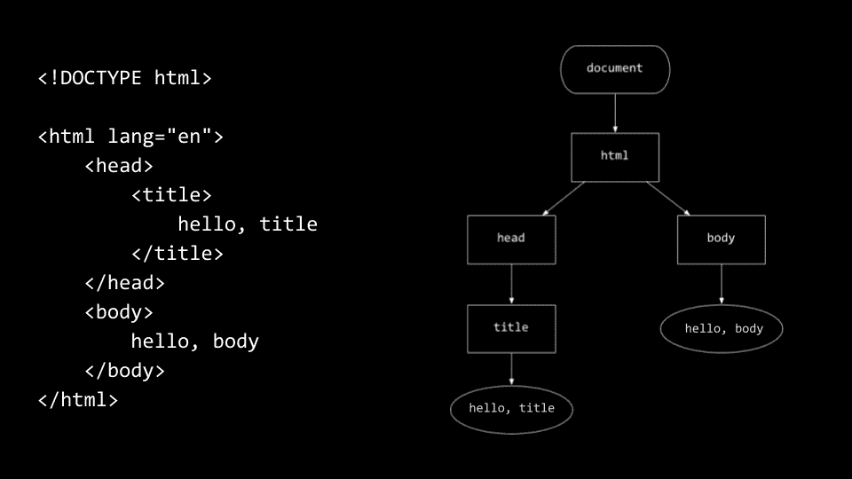

# 第 8 讲

> 原文：[`cs50.harvard.edu/x/notes/8/`](https://cs50.harvard.edu/x/notes/8/)

+   欢迎光临！

+   互联网

+   路由器

+   DNS

+   DHCP

+   HTTPS

+   HTML

+   正则表达式

+   CSS

+   框架

+   JavaScript

+   总结

## 欢迎光临！

+   在前几周，我们向您介绍了 Python，这是一种高级编程语言，它使用了我们在 C 语言中学到的相同构建块。今天，我们将进一步扩展这些构建块，在 HTML、CSS 和 JavaScript 中。

## 互联网

+   互联网是我们所有人都使用的技术。

+   使用我们前几周学到的技能，我们可以构建自己的网页和应用。

+   *ARPANET* 将互联网上的第一个节点连接在一起。

+   两点之间的点可以被认为是 *路由器*。

## 路由器

+   为了将数据从一个地方路由到另一个地方，我们需要做出 *路由决策*。也就是说，有人需要编程数据如何从 A 点传输到 B 点。

+   你可以想象数据可以从 A 点到 B 点有多个路径，当路由器拥堵时，数据可以通过另一条路径流动。数据 *数据包* 从一个路由器传输到另一个路由器，从一个计算机传输到另一个计算机。

+   *TCP/IP* 是两种协议，允许计算机在互联网上相互传输数据。

+   *IP* 或 *互联网协议* 是一种计算机可以在互联网上相互识别的方式。每台计算机在世界上都有一个唯一的地址。地址的形式如下：

    [PRE0]

+   数字范围从 `0` 到 `255`。IP 地址是 32 位，这意味着这些地址可以容纳超过 40 亿个地址。较新的 IP 地址版本，采用 128 位，可以容纳更多的计算机！

+   在现实世界中，服务器为我们做了很多工作。

+   数据包的结构如下：

    [PRE1]

+   数据包是标准化的。源地址和目标地址包含在每个数据包中。

+   *TCP*，或传输控制协议，有助于跟踪发送的数据包顺序。

+   此外，TCP 用于区分不同的网络服务。例如，`80` 用于表示 HTTP，`443` 用于表示 HTTPS。这些数字是 *端口号*。

+   当信息从一个位置发送到另一个位置时，会发送源 IP 地址、目标 IP 地址和 TCP 端口号。

+   这些协议也被用来将大文件分成多个部分或数据包。例如，一张大猫的照片可以分成多个数据包发送。当一个数据包丢失时，TCP/IP 可以从原始服务器再次请求丢失的数据包。

+   TCP 将在所有数据都已传输和接收后进行确认。

## DNS

+   如果你需要记住一个 IP 地址来访问一个网站，那将会非常麻烦。

+   *DNS*，或 *域名系统*，是互联网上一组服务器，用于将像 *harvard.edu* 这样的网站地址路由到特定的 IP 地址。

+   DNS 简单来说是一个将特定的、完全限定的域名与特定的 IP 地址链接起来的表或数据库。

## DHCP

+   *DHCP* 是一个确定你的设备 IP 地址的协议。

+   此外，此协议定义了你的设备使用的默认网关和名称服务器。

## HTTPS

+   *HTTP* 或 *超文本传输协议* 是开发者用来通过数据从一个地方传输到另一个地方来构建强大和有用事物的应用层协议。*HTTPS* 是此协议的安全版本。

+   当你看到一个地址如 `https://www.example.com` 时，你实际上是在隐式地访问该地址，并在其末尾有一个 `/`。

+   *路径* 是在斜杠之后存在的部分。例如，`https://www.example.com/folder/file.html` 访问 `example.com` 并浏览到 `folder` 目录，然后访问名为 `file.html` 的文件。

+   `.com` 被称为 *顶级域名*，用于表示与该地址关联的位置或组织类型。

+   在此地址中的 `https` 是用来连接该网页地址的协议。通过协议，我们指的是 HTTP 使用 `GET` 或 `POST` *请求* 从服务器获取信息。例如，你可以启动 Google Chrome，右键点击，并点击 `inspect`。当你打开 `开发者工具` 并访问 `Network`，选择 `Preserve log`，你会看到 `Request Headers`。你会看到 `GET` 的提及。这在其他浏览器中也是可能的，使用稍微不同的方法。

+   例如，在发出 GET 请求时，你的电脑可能向服务器发送以下内容：

    [PRE2]

    注意，这是通过 HTTP 请求在 www.harvard.edu 上提供的内容。

+   通常，在向服务器发出请求后，你将在 `Response Headers` 中收到以下内容：

    [PRE3]

+   检查这些日志的方法可能比必要的要复杂一些。你可以在 [cs50.dev](https://cs50.dev) 上分析 HTTP 协议的工作。例如，在你的终端窗口中输入以下内容：

    [PRE4]

    注意，此命令的输出返回了服务器响应的所有头部值。

+   通过你的网页浏览器的开发者工具，你可以看到浏览上述网站时所有的 HTTP 请求。

+   此外，在你的终端窗口中执行以下命令：

    [PRE5]

    注意，你会看到一个 `301` 响应，为浏览器提供了一个指向正确网站的提示。

+   类似地，在你的终端窗口中执行以下命令：

    [PRE6]

    注意，`https` 中的 `s` 已被移除。服务器响应将显示响应为 `301`，这意味着网站已永久迁移。

+   与 `301` 类似，`404` 状态码意味着指定的 URL 未找到。还有许多其他的响应代码，例如：

    [PRE7]

+   值得注意的是，当 `500` 错误涉及到你创建的产品或应用程序时，这总是作为开发者的你的责任。这将在下周的问题集中尤为重要，也许对你的最终项目也是如此！

## HTML

+   *HTML* 或 *超文本标记语言* 由 *标签* 组成，每个标签可能有一些 *属性* 来描述它。

+   在你的终端中，输入 `code hello.html` 并编写如下代码：

    [PRE8]

    注意到 `html` 标签既打开了又关闭了这个文件。此外，注意 `lang` 属性，它修改了 `html` 标签的行为。还要注意，既有 `head` 标签也有 `body` 标签。缩进不是必需的，但确实暗示了一个层次结构。

+   你可以通过输入 `http-server` 来提供你的代码。现在，提供的内容可以通过一个非常长的 URL 访问。如果你点击它，你可以访问由你自己的代码生成的网站。

+   当你访问这个 URL 时，注意文件名 `hello.html` 出现在这个 URL 的末尾。此外，根据 URL，注意服务器是通过端口 8080 提供服务的。

+   标签的层次结构可以表示如下：

    

+   了解这个层次结构将在我们学习 JavaScript 时非常有用。

+   浏览器将自上而下、从左到右读取你的 HTML 文件。

+   由于在 HTML 中空白和缩进实际上被忽略，你需要使用 `
` 段落标签来打开和关闭一个段落。考虑以下：

    [PRE9]

    注意到段落从 `
` 标签开始，并以 `
` 标签结束。

+   HTML 允许表示标题：

    [PRE10]

    注意到 `<h1>`、`<h2>` 和 `<h3>` 表示不同的标题级别。

+   我们也可以在 HTML 中创建无序列表：

    [PRE11]

    注意到 `<ul>` 标签创建了一个包含三个项目的无序列表。

+   我们也可以在 HTML 中创建有序列表：

    [PRE12]

    注意到 `<ol>` 标签创建了一个包含三个项目的有序列表。

+   我们也可以在 HTML 中创建一个表格：

    [PRE13]

    表格也有打开和关闭每个元素的标签。此外，注意 HTML 中注释的语法。

+   图像也可以在 HTML 中使用：

    [PRE14]

    注意到 `src="bridge.png"` 指示了图像文件可以找到的路径。

+   视频也可以包含在 HTML 中：

    [PRE15]

    注意到 `type` 属性指定这是一个 `mp4` 类型的视频。此外，注意 `controls` 和 `muted` 是如何传递给 `video` 的。

+   你也可以在各个网页之间建立链接：

    [PRE16]

    注意到 `<a>` 或 *锚点* 标签用于使 `Harvard` 成为可链接的文本。

+   你也可以创建类似于 Google 搜索的表单：

    [PRE17]

    注意到 `form` 标签打开并提供它将采取的 `action` 属性。`input` 字段被包含在内，传递名称 `q` 和类型为 `search`。

+   我们可以如下改进这个搜索：

    [PRE18]

    注意到 `autocomplete` 被设置为 `off`。`autofocus` 被启用。

+   我们已经看到了许多你可以添加到网站上的 HTML 元素中的一部分。如果你有关于要添加到网站上的想法（我们还没有看到，比如按钮、音频文件等），尝试在 Google 上搜索“X in HTML”以找到正确的语法！同样，你可以使用 [cs50.ai](https://cs50.ai) 来帮助你发现更多的 HTML 功能！

## 正则表达式

+   *正则表达式* 或 *regexes* 是一种确保用户提供的数据符合特定格式的手段。

+   我们可以自己实现一个利用正则表达式的注册页面，如下所示：

    [PRE19]

    注意，`input` 标签包含属性指定这是 `email` 类型的。浏览器知道要双重检查输入是否为电子邮件地址。

+   虽然浏览器使用这些内置属性来检查电子邮件地址，但我们可以添加一个 `pattern` 属性来确保只有特定的数据出现在电子邮件地址中：

    [PRE20]

    注意，`pattern` 属性被传递了一个正则表达式，表示电子邮件地址必须包含一个 `@` 符号和一个 `.edu`。

+   您可以从 [Mozilla 的文档](https://developer.mozilla.org/en-US/docs/Web/JavaScript/Guide/Regular_expressions) 中了解更多关于正则表达式的信息。此外，您可以访问 [cs50.ai](https://cs50.ai) 获取提示。

## CSS

+   `CSS`，或 *层叠样式表*，是一种标记语言，允许您微调 HTML 文件的审美。

+   CSS 中充满了 *属性*，它们包括键值对。

+   在您的终端中，键入 `code home.html` 并编写如下代码：

    [PRE21]

    注意，一些 `style` 属性被提供给 `
` 标签。`font-size` 被设置为 `large`、`medium` 或 `small`。然后 `text-align` 被设置为居中。

+   虽然正确，但上述设计并不理想。我们可以通过修改代码来去除冗余，如下所示：

    [PRE22]

    注意，`
` 标签被用来将这个 HTML 文件划分为特定的区域。`text-align: center` 被应用于整个 HTML 的主体部分。因为 `body` 内部的所有内容都是 `body` 的子元素，所以 `center` 属性会级联到这些子元素。

+   结果表明，HTML 中包含了一些新的语义标签。我们可以如下修改我们的代码：

    [PRE23]

    注意，`header` 和 `footer` 都被分配了不同的样式。

+   将样式和信息都放在同一个位置的做法并不好。我们可以将样式元素移动到文件顶部，如下所示：

    [PRE24]

    注意，所有的样式标签都被放置在 `head` 部分的 `style` 标签包装器中。此外，注意我们已经为我们的元素分配了名为 `centered`、`large`、`medium` 和 `small` 的 *类*，并且我们通过在名称前放置一个点来选择这些类，例如 `.centered`。

+   结果表明，我们可以将所有的样式代码移动到一个特殊的文件中，称为 *CSS* 文件。我们可以创建一个名为 `style.css` 的文件，并将我们的类粘贴在那里：

    [PRE25]

    注意，这正是出现在我们的 HTML 文件中的内容。

+   然后，我们可以告诉浏览器在哪里找到这个 HTML 文件的 CSS：

    [PRE26]

    注意，`style.css` 被链接到这个 HTML 文件作为样式表，告诉浏览器在哪里找到我们创建的样式。

## 框架

+   与我们可以在 Python 中利用的第三方库类似，还有称为 *框架* 的第三方库，我们可以利用这些框架与我们的 HTML 文件一起使用。

+   *Bootstrap*是我们可以使用来美化我们的 HTML 并轻松完善设计元素的框架之一，这样我们的页面就更容易阅读。

+   通过在 HTML 文件的`head`部分添加以下`link`标签，可以使用 Bootstrap：

    [PRE27]

+   考虑以下 HTML 代码：

    [PRE28]

    注意，当查看这个页面的服务版本时，它相当简单。

+   现在考虑以下实现 Bootstrap 使用的 HTML 代码：

    [PRE29]

    注意，现在这个网站看起来多么漂亮。

+   类似地，考虑以下我们之前创建的搜索页面的扩展：

    [PRE30]

    这个版本的页面非常风格化，多亏了 Bootstrap。

+   你可以在[Bootstrap 文档](https://getbootstrap.com/docs/)中了解更多相关信息。

## JavaScript

+   JavaScript 是另一种允许在网页中进行交互的编程语言。

+   考虑以下`hello.html`的实现，它包含了 JavaScript 和 HTML：

    [PRE31]

    注意，这个表单使用了一个`onsubmit`属性来触发文件顶部的`script`。该脚本使用`alert`创建一个弹出警告。`#name.value`指向页面上的文本框，并获取用户输入的值。

+   通常，将`onsubmit`和 JavaScript 混合使用被认为是不良的设计。我们可以将我们的代码改进如下：

    [PRE32]

    注意，这个版本的代码创建了一个`addEventListener`来监听表单`submit`事件的触发。注意`DOMContentLoaded`确保在执行 JavaScript 之前整个页面已经加载完成。

+   我们可以将此代码改进如下：

    [PRE33]

    注意，当用户输入一个名字时，内存中的 DOM 会动态更新。如果`input`中有值，在键盘的`keyup`事件发生时，DOM 会更新。否则，会显示默认文本。

+   JavaScript 允许你动态地读取和修改加载到内存中的 HTML 文档，这样用户就不需要重新加载来查看更改。

+   考虑以下 HTML 代码：

    [PRE34]

    注意，JavaScript 监听特定按钮的点击事件。在点击时，页面上的某些样式属性会发生变化。`body`被定义为页面的主体。然后，一个事件监听器等待按钮之一被点击。然后，`body.style.backgroundColor`被改变。

+   类似地，考虑以下：

    [PRE35]

    这个例子在设定的时间间隔闪烁文本。注意，`window.setInterval`接受两个参数：一个要调用的函数和函数调用之间的等待期（以毫秒为单位）。

+   考虑以下实现自动完成文本的 JavaScript 代码：

    [PRE36]

    这是一个自动完成的 JavaScript 实现。它从一个名为`large.js`的文件中获取数据（此处未展示），该文件是一个单词列表。

+   JavaScript 的功能很多，可以在[JavaScript 文档](https://developer.mozilla.org/en-US/docs/Web/JavaScript)中找到。

## 总结

在本课中，你学习了如何创建自己的 HTML 文件，为其添加样式，利用第三方框架，以及使用 JavaScript。具体来说，我们讨论了…

+   TCP/IP

+   DNS

+   HTML

+   正则表达式

+   CSS

+   框架

+   JavaScript

下次再见！
