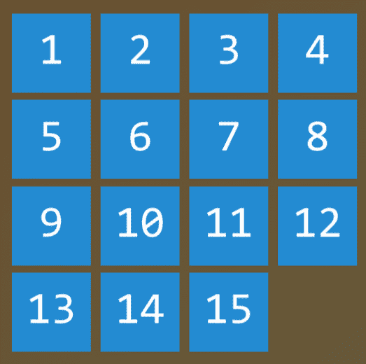
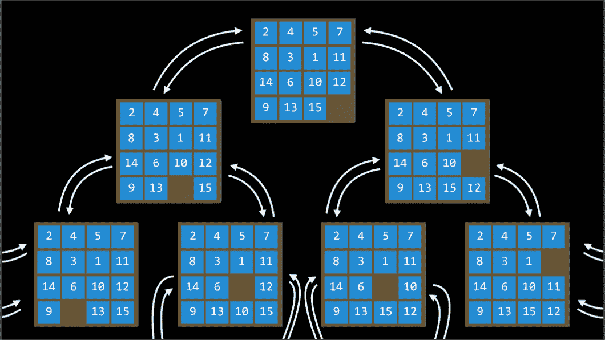
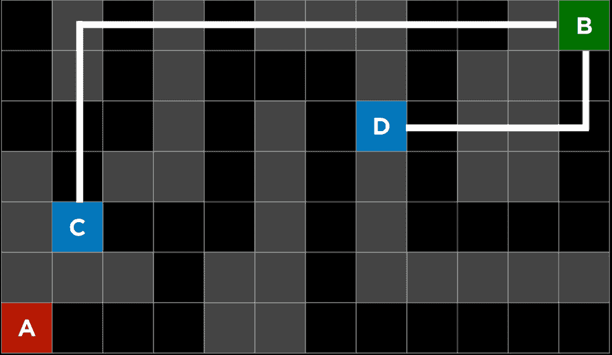
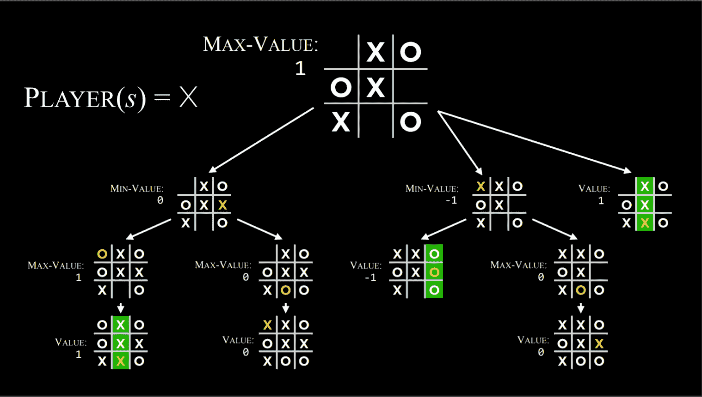
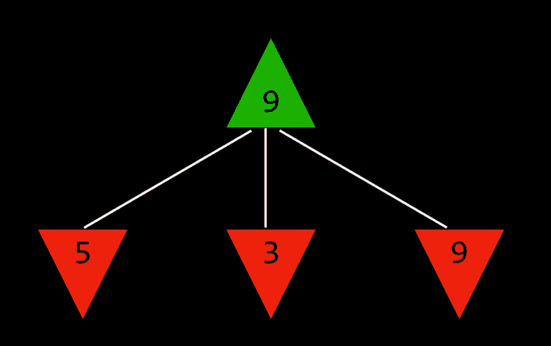
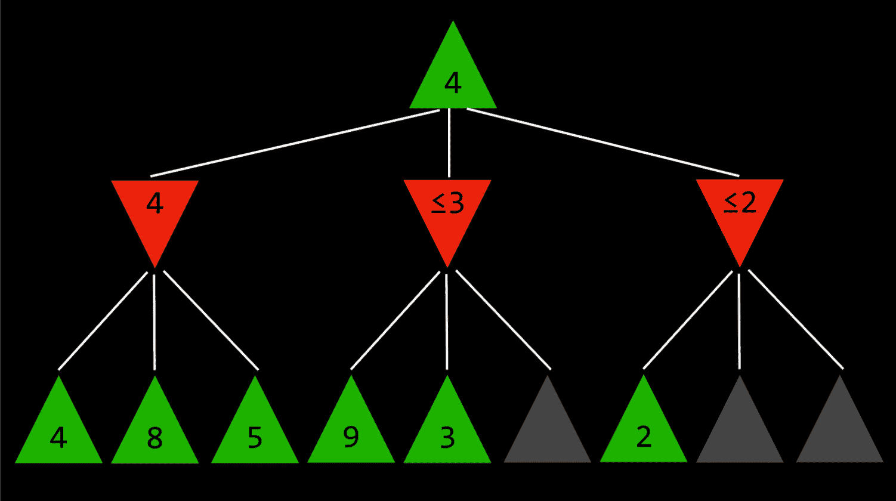

# 讲座 0

> 原文：[`cs50.harvard.edu/ai/notes/0/`](https://cs50.harvard.edu/ai/notes/0/)

## 人工智能

人工智能（AI）涵盖了一系列技术，这些技术使计算机表现出有感知的行为。例如，AI 用于识别社交媒体上的照片中的面孔，击败世界象棋冠军，以及处理你用手机上的 Siri 或 Alexa 说话时的语音。

在本课程中，我们将探讨使人工智能成为可能的一些想法：

1.  **搜索**

找到一个问题的解决方案，比如一个导航应用找到从起点到目的地的最佳路线，或者像玩游戏并找出下一步棋。

1.  **知识**

从信息中提取信息并得出推论。

1.  **不确定性**

使用概率处理不确定事件。

1.  **优化**

找到一个正确解决问题的方法，但也是一个更好或最好的方法。

1.  **学习**

根据数据访问和经验改进性能。例如，你的电子邮件能够根据以往的经验区分垃圾邮件和非垃圾邮件。

1.  **神经网络**

一种受人类大脑启发的程序结构，能够有效地执行任务。

1.  **语言**

处理自然语言，这是人类产生和理解的。

## 搜索

搜索问题涉及一个给定初始状态和目标状态的代理，并返回从前者到后者的解决方案。导航应用使用典型的搜索过程，其中代理（程序的思考部分）接收你的当前位置和你的目标位置作为输入，并根据搜索算法返回建议的路径。然而，还有许多其他形式的搜索问题，如谜题或迷宫。

解决 15 拼图问题需要使用搜索算法。

+   **代理**

    一个感知其环境并对该环境采取行动的实体。例如，在一个导航应用中，代理将是一个需要决定采取哪些行动才能到达目的地的汽车的表示。

+   **状态**

    代理在其环境中的配置。例如，在 [15 拼图](https://en.wikipedia.org/wiki/15_puzzle) 中，任何一种所有数字在棋盘上排列的方式都是一个状态。

    +   **初始状态**

        搜索算法开始的状态。在导航应用中，那将是当前位置。

+   **动作**

    在一个状态下可以做出的选择。更精确地说，动作可以被定义为函数。当接收到状态 `s` 作为输入时，`Actions(s)` 返回在状态 `s` 中可以执行的动作集合。例如，在 *15 拼图* 中，给定状态的动作是你可以在当前配置中滑动方块的方式（如果空白方块在中间，有 4 种方式，如果靠近边缘，有 3 种方式，如果位于角落，有 2 种方式）。

+   **转换模型**

    对任何状态执行任何适用动作的结果的描述。更精确地说，转换模型可以定义为函数。当接收到状态`s`和动作`a`作为输入时，`Results(s, a)`返回在状态`s`中执行动作`a`后的状态。例如，给定某个*15 个拼图*的配置（状态`s`），将一个方块向任何方向移动（动作`a`）将导致拼图的新配置（新状态）。

+   **状态空间**

    通过任何动作序列从初始状态可达的所有状态的集合。例如，在 15 个拼图游戏中，状态空间由所有 16!/2 个可以在任何初始状态下到达的棋盘配置组成。状态空间可以可视化为一个有向图，其中状态由节点表示，动作由节点之间的箭头表示。

+   **目标测试**

    确定给定状态是否为目标状态的条件。例如，在导航应用中，目标测试将是代理的当前位置（汽车的表示）是否在目的地。如果是——问题解决。如果不是——我们继续搜索。

+   **路径成本**

    与给定路径相关的数值成本。例如，导航应用不仅将您带到目的地；它这样做的同时最小化路径成本，找到您到达目标状态的最快方式。

## 解决搜索问题

+   **解**

    从初始状态到目标状态的一系列动作。

    +   **最优解**

        在所有解中具有最低路径成本的解。

在搜索过程中，数据通常存储在**节点**中，这是一种包含以下数据的数据结构：

+   一个*状态*

+   它的*父节点*，通过它生成了当前节点

+   应用到父节点状态以到达当前节点的*动作*

+   从初始状态到该节点的*路径成本*

*节点*包含使它们在搜索算法目的上非常有用的信息。它们包含一个*状态*，可以使用*目标测试*来检查它是否是最终状态。如果是，节点 的*路径成本*可以与其他节点的*路径成本*进行比较，从而选择*最优解*。一旦选择了节点，由于存储了*父节点*和从*父节点*到当前节点所采取的*动作*，就可以从*初始状态*追踪到这个节点的每一步，而这个动作序列就是*解*。

然而，*节点*只是一个数据结构——它们不搜索，它们只保存信息。为了实际搜索，我们使用**边界**，这是“管理”*节点*的机制。*边界*最初包含一个初始状态和一个空的已探索项集合，然后重复以下操作，直到找到解决方案：

重复：

1.  如果边界为空，

    +   *停止*。该问题没有解。

1.  从前沿移除一个节点。这是将要考虑的节点。

1.  如果节点包含目标状态，

    +   返回解决方案。*停止*。

    否则，

    [PRE0]

#### 深度优先搜索

在上述对*前沿*的描述中，有一件事没有被提及。在上述伪代码的第 2 阶段，应该移除哪个节点？这个选择对解决方案的质量和实现速度有影响。有几种方法可以处理哪个节点应该首先考虑的问题，其中两种可以通过*栈*（在*深度优先搜索*中）和*队列*（在*广度优先搜索*中）的数据结构来表示；[这里有一个可爱的卡通演示](https://www.youtube.com/watch?v=2wM6_PuBIxY)说明了这两种方法之间的区别）。

我们从*深度优先搜索*（*DFS*）方法开始。

*深度优先搜索*算法在尝试另一个方向之前会先耗尽每一个方向。在这些情况下，前沿被管理为一个*栈*数据结构。你需要记住的口号是“*后进先出*。”在节点被添加到前沿后，首先移除并考虑的是最后添加的节点。这导致了一个搜索算法，它在遇到障碍的第一个方向上尽可能深入，同时将所有其他方向留待以后。

（来自课堂外的例子：假设你在找你的钥匙。在*深度优先搜索*方法中，如果你选择从你的裤子开始搜索，你将首先检查每一个口袋，清空每一个口袋并仔细检查里面的东西。你只有在完全检查完裤子的每一个口袋后，才会停止在裤子中搜索并开始在其他地方搜索。）

+   优点：

    +   最好的情况是，这个算法是最快的。如果它“运气好”并且总是选择正确的路径到达解决方案（偶然），那么*深度优先搜索*将花费最短的时间到达解决方案。

+   缺点：

    +   可能找到的解决方案并非最优。

    +   最坏的情况是，这个算法在找到解决方案之前将探索所有可能的路径，因此到达解决方案之前将花费可能的最长时间。

代码示例：

[PRE1]

#### 广度优先搜索

*深度优先搜索*的对立面是*广度优先搜索*（*BFS*）。

一个*广度优先搜索*算法将同时遵循多个方向，在每个可能的方向上先迈出一小步，然后再在每个方向上迈出第二步。在这种情况下，前沿被管理为一个*队列*数据结构。你需要记住的口号是“*先进先出*。”在这种情况下，所有新的节点都按顺序添加，节点是根据哪个先添加的来考虑的（先来先服务！）。这导致了一个搜索算法，它在每个可能的方向上迈出一小步，然后再在任何方向上迈出第二步。

（来自课堂外的例子：假设你处于寻找钥匙的情况。在这种情况下，如果你从裤子开始，你会检查右边的口袋。之后，你不会检查左边的口袋，而是会查看一个抽屉。然后是桌子。等等，在每个你能想到的地方。只有在你用尽所有地方之后，你才会回到裤子并检查下一个口袋。）

+   优点：

    +   这个算法保证能找到最优解。

+   缺点：

    +   这个算法几乎可以保证运行时间会比最短运行时间更长。

    +   最坏的情况下，这个算法的运行时间是最长的。

代码示例：

[PRE2]

#### 贪婪最佳优先搜索

广度优先和深度优先都是**无信息**搜索算法。也就是说，这些算法没有利用它们通过自己的探索获得的问题知识。然而，大多数情况下，确实存在一些关于问题的知识。例如，当人类迷宫解决者在进入一个交汇点时，人类可以看到哪个方向通向解决方案的一般方向，哪个方向则不行。人工智能也可以做到这一点。一种考虑额外知识以尝试提高其性能的算法称为**有信息**搜索算法。

**贪婪最佳优先**搜索扩展的是离目标最近的节点，这是通过**启发式函数** *h(n)* 确定的。正如其名所示，该函数估计下一个节点离目标有多近，但它可能会出错。贪婪最佳优先算法的效率取决于启发式函数的好坏。例如，在一个迷宫中，算法可以使用一个依赖于可能节点和迷宫终点之间**曼哈顿距离**的启发式函数。曼哈顿距离忽略了墙壁，并计算从当前位置到目标位置需要向上、向下或向侧面走多少步。这是一个基于当前位置和目标位置的 (x, y) 坐标可以推导出的简单估计。

曼哈顿距离

然而，重要的是要强调，就像任何启发式方法一样，它可能会出错，并导致算法走上一条比其他情况下更慢的路径。有可能一个**无信息**搜索算法会更快地提供一个更好的解决方案，但这种情况发生的可能性比**有信息**算法要小。

#### A* 搜索

*贪婪最佳优先搜索*算法的发展，*A*搜索*不仅考虑 *h(n)*，从当前位置到目标的估计成本，还考虑 *g(n)*，到达当前位置的成本。通过结合这两个值，算法有更准确的方式来确定解决方案的成本并优化其选择。算法跟踪（*到目前为止的路径成本* + *到目标的估计成本*），一旦它超过某些先前选项的估计成本，算法将放弃当前路径并回到先前选项，从而防止自己沿着一个长而低效的路径走下去，而 *h(n)* 错误地将它标记为最佳。

再次强调，由于这个算法也依赖于启发式方法，因此它的效果取决于所采用的启发式方法。在某些情况下，它可能不如*贪婪最佳优先搜索*甚至*无信息*算法高效。为了使*A*搜索*成为最优的，启发式函数 *h(n)* 应该是：

1.  *可接受*，或者从不*高估*真实成本，

1.  *一致*，这意味着新节点到目标路径成本的估计，加上从先前节点转换到它的成本，大于或等于先前节点到目标路径成本的估计。用方程式表示，如果对于每个节点 *n* 和具有步长成本 *c* 的后续节点 *n’*，*h(n)* ≤ *h(n’)* + *c*，则 *h(n)* 是一致的。

### 对抗搜索

而之前，我们讨论了需要找到问题答案的算法，在**对抗搜索**中，算法面对一个试图实现相反目标的对手。通常，使用对抗搜索的 AI 在游戏中遇到，例如井字棋。

#### Minimax

对抗搜索算法中的一种类型，**Minimax** 将胜利条件表示为一方的（-1）和另一方的（+1）。后续动作将由这些条件驱动，最小化方试图获得最低分数，而最大化方试图获得最高分数。

**表示井字棋 AI**：

+   *S₀*：初始状态（在我们的例子中，一个空的 3X3 棋盘）

+   *玩家(s)*：一个函数，给定一个状态 *s*，返回当前轮到哪个玩家（X 或 O）。

+   *动作(s)*：一个函数，给定一个状态 *s*，返回在这个状态下所有合法的移动（棋盘上哪些位置是空的）。

+   *结果(s, a)*：一个函数，给定一个状态 *s* 和动作 *a*，返回一个新的状态。这是在状态 *s* 上执行动作 *a* 后得到的棋盘（在游戏中进行一步移动）。

+   *终端(s)*：一个函数，给定一个状态 *s*，检查这是否是游戏的最后一步，即是否有人获胜或有平局。如果游戏结束，则返回 *True*，否则返回 *False*。

+   *效用(s)*：一个函数，给定一个终端状态 *s*，返回该状态的有效值：-1，0 或 1。

**算法的工作原理**：

递归地，算法模拟从当前状态开始的所有可能的游戏，直到达到终端状态。每个终端状态的价值被评估为 (-1)、0 或 (+1)。

Minimax 算法在井字棋中的应用

根据当前轮到哪个状态，算法可以知道当前玩家在最优策略下，会选择导致状态值更低或更高的动作。这样，通过交替进行最小化和最大化，算法为每个可能动作的结果状态创建值。为了更具体地说明，我们可以想象最大化玩家在每一轮都会问：“如果我采取这个动作，将产生一个新的状态。如果最小化玩家采取最优策略，该玩家可以采取什么动作将值降到最低？”然而，为了回答这个问题，最大化玩家必须问：“为了知道最小化玩家会做什么，我需要在最小化玩家的思维中模拟相同的过程：最小化玩家会试图问：‘如果我采取这个动作，最大化玩家可以采取什么动作将值提高到最高？’”这是一个递归过程，可能很难理解；查看下面的伪代码可能会有所帮助。最终，通过这个递归推理过程，最大化玩家为当前状态下所有可能的动作结果状态生成值。在得到这些值之后，最大化玩家选择其中最高的一个。

最大化玩家考虑未来状态的潜在值。

用伪代码来说，Minimax 算法的工作方式如下：

+   给定一个状态 *s*

    +   最大化玩家在 *Actions(s)* 中选择动作 *a*，该动作产生 *Min-Value(Result(s, a))* 的最高值。

    +   最小化玩家在 *Actions(s)* 中选择动作 *a*，该动作产生 *Max-Value(Result(s, a))* 的最低值。

+   函数 *Max-Value(state)*

    +   *v = -∞*

    +   if *Terminal(state)*:

        返回 *Utility(state)*

    +   for *action* in *Actions(state)*:

        *v = Max(v, Min-Value(Result(state, action)))*

        返回 *v*

+   函数 *Min-Value(state)*:

    +   *v = ∞*

    +   if *Terminal(state)*:

        返回 *Utility(state)*

    +   for *action* in *Actions(state)*:

        *v = Min(v, Max-Value(Result(state, action)))*

        return *v*

#### Alpha-Beta Pruning

一种优化 Minimax 的方法是 **Alpha-Beta 剪枝**，它跳过了一些明显不利的递归计算。在确定一个动作的价值后，如果最初有证据表明接下来的动作可以使对手得到比已确定的动作更好的分数，就没有必要进一步调查这个动作，因为它将明显不如之前确定的动作有利。

这一点最容易被一个例子所说明：一个最大化玩家知道，在下一步，最小化玩家将试图获得最低的分数。假设最大化玩家有三个可能的行为，第一个行为的价值是 4。然后玩家开始为下一步生成价值。为了做到这一点，玩家在当前玩家采取这个行为的情况下，生成最小化玩家行为的值，知道最小化玩家将选择最低的一个。然而，在完成所有可能的最小化玩家行为的计算之前，玩家看到其中一个选项的价值是三。这意味着没有必要继续探索其他可能的最小化玩家行为。尚未评估的行为的价值并不重要，无论是 10 还是(-10)。如果价值是 10，最小化玩家将选择最低的选项，3，这已经比预先设定的 4 更差。如果尚未评估的行为最终是(-10)，最小化玩家将选择这个选项，(-10)，这对最大化玩家来说更加不利。因此，在这一点上计算最小化玩家的额外可能行为对最大化玩家来说是不相关的，因为最大化玩家已经有一个明确更好的选择，其价值是 4。

#### 深度限制最小-最大

总共有 255,168 种可能的井字棋游戏，以及 10²⁹⁰⁰⁰种可能的国际象棋游戏。到目前为止所展示的最小-最大算法需要从某个点生成所有假设游戏到终端状态。虽然计算所有井字棋游戏对现代计算机来说并不构成挑战，但用国际象棋来做这一点目前是不可能的。

**深度限制最小-最大**只考虑在停止之前预先定义的移动数，而不会达到终端状态。然而，这并不允许为每个行为获得精确的价值，因为假设游戏并没有达到终端。为了解决这个问题，*深度限制最小-最大*依赖于一个**评估函数**，该函数估计从给定状态的游戏预期效用，换句话说，为状态分配值。例如，在国际象棋游戏中，效用函数将当前棋盘配置作为输入，尝试评估其预期效用（基于每个玩家拥有的棋子和它们在棋盘上的位置），然后返回一个正或负值，表示棋盘对一方玩家相对于另一方的有利程度。这些值可以用来决定正确的行动，评估函数越好，依赖它的最小-最大算法就越好。
