# 第一讲

> 原文：[`cs50.harvard.edu/ai/notes/1/`](https://cs50.harvard.edu/ai/notes/1/)

## 知识

人类基于现有知识进行推理并得出结论。从知识中表示和推理出结论的概念也用于人工智能，在本讲座中，我们将探讨我们如何实现这种行为。

**基于知识的智能体**

这些是通过操作知识内部表示来进行推理的智能体。

“基于知识进行推理得出结论”是什么意思？

让我们从哈利·波特的例子开始回答这个问题。考虑以下句子：

1.  如果今天没有下雨，哈利今天拜访了海格。

1.  哈利今天拜访了海格或邓布利多，但不是两者都拜访了。

1.  哈利今天拜访了邓布利多。

基于这三句话，我们可以回答“今天是否下雨？”这个问题，尽管没有任何一个单独的句子告诉我们今天是否下雨。我们可以这样进行推理：查看第三句话，我们知道哈利拜访了邓布利多。查看第二句话，我们知道哈利拜访了邓布利多或海格，因此我们可以得出结论

1.  哈利没有拜访海格。

现在，查看第一句话，我们理解如果没有下雨，哈利会拜访海格。然而，知道第四句话，我们知道情况并非如此。因此，我们可以得出结论

1.  今天下雨了。

为了得出这个结论，我们使用了逻辑，今天的讲座探讨了人工智能如何使用逻辑根据现有信息得出新的结论。

**句子**

句子是在知识表示语言中对世界的断言。句子是人工智能存储知识并使用它来推断新信息的方式。

## 质理逻辑

质量逻辑基于命题，即关于世界的陈述，可以是真或假，如上面第 1-5 句所示。

**命题符号**

质量符号通常是用字母（P, Q, R）表示的命题。

**逻辑连接词**

逻辑连接词是连接命题符号的逻辑符号，以便以更复杂的方式对世界进行推理。

+   **非 (¬)** 反转命题的真值。例如，如果 P: “正在下雨”，那么 ¬P: “没有下雨”。

    真值表用于比较命题的所有可能的真值分配。这个工具将帮助我们更好地理解命题与不同的逻辑连接词连接时的真值。例如，下面是我们的第一个真值表：

    | P | ¬P |
    | --- | --- |
    | false | true |
    | true | false |

+   **与 (∧)** 连接两个不同的命题。当这两个命题 P 和 Q 通过 ∧ 连接时，结果命题 P ∧ Q 仅在 P 和 Q 都为真时才为真。

    | P | Q | P ∧ Q |
    | --- | --- | --- |
    | false | false | false |
    | false | true | false |
    | true | false | false |
    | true | true | true |

+   **或（∨）**只要其论点中的任何一个为真就为真。这意味着，为了 P ∨ Q 为真，P 或 Q 中的至少一个必须为真。

    | P | Q | P ∨ Q |
    | --- | --- | --- |
    | false | false | false |
    | false | true | true |
    | true | false | true |
    | true | true | true |

    值得注意的是，有两种类型的“或”：包含“或”和排除“或”。在排除“或”中，如果 P ∧ Q 为真，则 P ∨ Q 为假。也就是说，排除“或”只需要其论点中的一个为真，而不是两个都为真。包含“或”在 P、Q 或 P ∧ Q 中的任何一个为真时为真。在“或”（∨）的情况下，意图是包含“或”。

> **一些在讲座中没有提到的旁注**：
> 
> +   有时举一个例子有助于理解包含“或”与排除“或”。包含“或”：为了吃甜点，你必须打扫房间或修剪草坪。在这种情况下，如果你做了这两项家务，你仍然会得到饼干。排除“或”：为了甜点，你可以选择饼干或冰淇淋。在这种情况下，你不能两者都要。
> +   
> +   如果你好奇，排除“或”通常简称为 XOR，其常见符号是⊕）。

+   **蕴含（→）**代表“如果 P 那么 Q”的结构。例如，如果 P：“下雨”和 Q：“我待在室内”，那么 P → Q 意味着“如果下雨，那么我待在室内”。在 P 蕴含 Q（P → Q）的情况下，P 被称为**前件**，Q 被称为**后件**。

    当**前件**为真时，如果**后件**也为真，整个蕴含式就为真（这很有道理：如果下雨而我待在室内，那么句子“如果下雨，那么我待在室内”就是真的）。当**前件**为真时，如果**后件**为假，蕴含式就是假的（如果我下雨时在室外，那么句子“如果下雨，那么我待在室内”就是假的）。然而，当**前件**为假时，无论**后件**如何，蕴含式总是真的。这有时可能是一个令人困惑的概念。从逻辑上讲，如果**前件**（P）为假，我们就无法从蕴含式（P → Q）中得出任何东西。看看我们的例子，如果不下雨，蕴含式并没有说明我是否在室内。我可能是一个室内型的人，即使不下雨也从不外出，或者我可能是一个室外型的人，不下雨时总是外出。当前件为假时，我们说蕴含式是**显然**真的。

    | P | Q | P → Q |
    | --- | --- | --- |
    | false | false | true |
    | false | true | true |
    | true | false | false |
    | true | true | true |

+   **双条件 (↔)** 是一个双向的蕴涵。你可以将其读作“如果且仅如果”。P ↔ Q 与 P → Q 和 Q → P 同时成立。例如，如果 P: “正在下雨。” 和 Q: “我在室内，”那么 P ↔ Q 意味着“如果下雨，那么我在室内，”以及“如果我在室内，那么下雨。”这意味着我们可以比简单蕴涵推断出更多内容。如果 P 是假的，那么 Q 也是假的；如果不下雨，我们知道我也不在室内。

    | P | Q | P ↔ Q |
    | --- | --- | --- |
    | 假 | 假 | 真 |
    | 假 | 真 | 假 |
    | 真 | 假 | 假 |
    | 真 | 真 | 真 |

**模型**

模型是对每个命题的真值分配。再次强调，命题是关于世界的陈述，可以是真或假。然而，关于世界的知识是通过这些命题的真值来表示的。模型是提供关于世界信息的真值分配。

例如，如果 P: “正在下雨。” 和 Q: “今天是星期二。”，一个模型可以是以下真值分配：{P = 真, Q = 假}。这个模型意味着在下雨，但不是星期二。然而，在这种情况下还有更多可能的模型（例如，{P = 真, Q = 真}，即下雨且是星期二）。实际上，可能模型的数量是命题数量的 2 的幂。在这种情况下，我们有两个命题，所以 2²=4 个可能的模型。

**知识库 (KB)**

知识库是一组知识库代理所知道句子。这是 AI 以命题逻辑句子的形式提供关于世界的知识，可以用来对世界进行额外的推断。

**蕴涵 (⊨)**

如果 α ⊨ β (α 蕴涵 β)，那么在任何 α 为真的世界中，β 也是真的。

例如，如果 α: “一月份是星期二” 和 β: “是月份，”那么我们知道 α ⊨ β。如果一月份是星期二是真的，我们也知道是月份。蕴涵与蕴涵不同。蕴涵是两个命题之间的逻辑连接词。另一方面，蕴涵是一个关系，意味着如果 α 中的所有信息都是真的，那么 β 中的所有信息也是真的。

## 推理

推理是从旧句子推导出新句子的过程。

例如，在之前的哈利·波特例子中，句子 4 和 5 是从句子 1、2 和 3 推导出来的。

基于现有知识推断新知识有多种方式。首先，我们将考虑 **模型检查** 算法。

+   要确定 KB ⊨ α（换句话说，回答“基于我们的知识库，我们能否得出 α 是真的”）

    +   列举所有可能的模型。

    +   如果在 KB 为真的每个模型中 α 也是真的，那么 KB 蕴涵 α (KB ⊨ α)。

考虑以下例子：

P: 今天是星期二。Q: 正在下雨。R: 哈里会去跑步。KB: (P ∧ ¬Q) → R （换句话说，P 和非 Q 蕴含 R）P (P 是真的) ¬Q (Q 是假的) 查询：R （我们想知道 R 是真还是假；KB ⊨ R？）

要使用模型检查算法回答查询，我们需要枚举所有可能的模型。

| P | Q | R | KB |
| --- | --- | --- | --- |
| false | false | false |   |
| false | false | true |   |
| false | true | false |   |
| false | true | true |   |
| true | false | false |   |
| true | false | true |   |
| true | true | false |   |
| true | true | true |   |

然后，我们逐一检查每个模型，看它是否在给定的知识库中为真。

首先，在我们的知识库（KB）中，我们知道 P 是真的。因此，我们可以断言，在 P 不为真的所有模型中，KB 是假的。

| P | Q | R | KB |
| --- | --- | --- | --- |
| false | false | false | false |
| false | false | true | false |
| false | true | false | false |
| false | true | true | false |
| true | false | false |   |
| true | false | true |   |
| true | true | false |   |
| true | true | true |   |

接下来，同样地，在我们的 KB 中，我们知道 Q 是假的。因此，我们可以断言，在 Q 为真的所有模型中，KB 是假的。

| P | Q | R | KB |
| --- | --- | --- | --- |
| false | false | false | false |
| false | false | true | false |
| false | true | false | false |
| false | true | true | false |
| true | false | false |   |
| true | false | true |   |
| true | true | false | false |
| true | true | true | false |

最后，我们只剩下两个模型。在这两个模型中，P 是真的，Q 是假的。在一个模型中 R 是真的，在另一个模型中 R 是假的。由于 (P ∧ ¬Q) → R 在我们的 KB 中，我们知道在 P 为真且 Q 为假的情况下，R 必须是真的。因此，我们说对于 R 为假的模型，我们的 KB 是假的，对于 R 为真的模型，我们的 KB 是真的。

| P | Q | R | KB |
| --- | --- | --- | --- |
| false | false | false | false |
| false | false | true | false |
| false | true | false | false |
| false | true | true | false |
| true | false | false | false |
| true | false | true | true |
| true | true | false | false |
| true | true | true | false |

观察这个表格，只有一个模型中我们的知识库是真的。在这个模型中，我们看到 R 也是真的。根据蕴涵的定义，如果 R 在 KB 为真的所有模型中都是真的，那么 KB ⊨ R。

接下来，让我们看看知识和逻辑如何被表示为代码。

```
from logic import *

# Create new classes, each having a name, or a symbol, representing each proposition. rain = Symbol("rain")  # It is raining. hagrid = Symbol("hagrid")  # Harry visited Hagrid dumbledore = Symbol("dumbledore")  # Harry visited Dumbledore 
# Save sentences into the KB knowledge = And(  # Starting from the "And" logical connective, becasue each proposition represents knowledge that we know to be true. 
    Implication(Not(rain), hagrid),  # ¬(It is raining) → (Harry visited Hagrid) 
    Or(hagrid, dumbledore),  # (Harry visited Hagrid) ∨ (Harry visited Dumbledore). 
    Not(And(hagrid, dumbledore)),  # ¬(Harry visited Hagrid ∧ Harry visited Dumbledore) i.e. Harry did not visit both Hagrid and Dumbledore. 
    dumbledore  # Harry visited Dumbledore. Note that while previous propositions contained multiple symbols with connectors, this is a proposition consisting of one symbol. This means that we take as a fact that, in this KB, Harry visited Dumbledore.
    ) 
```

运行模型检查算法需要以下信息：

+   知识库，将用于得出推论

+   查询，或我们感兴趣的是否被 KB 蕴含的命题

+   符号，所有使用的符号（或原子命题）的列表（在我们的例子中，这些是 `rain`，`hagrid` 和 `dumbledore`）

+   模型，对符号的真假值分配

模型检查算法如下所示：

```
def check_all(knowledge, query, symbols, model):

    # If model has an assignment for each symbol
    # (The logic below might be a little confusing: we start with a list of symbols. The function is recursive, and every time it calls itself it pops one symbol from the symbols list and generates models from it. Thus, when the symbols list is empty, we know that we finished generating models with every possible truth assignment of symbols.)
    if not symbols:

        # If knowledge base is true in model, then query must also be true
        if knowledge.evaluate(model):
            return query.evaluate(model)
        return True
    else:

        # Choose one of the remaining unused symbols
        remaining = symbols.copy()
        p = remaining.pop()

        # Create a model where the symbol is true
        model_true = model.copy()
        model_true[p] = True

        # Create a model where the symbol is false
        model_false = model.copy()
        model_false[p] = False

        # Ensure entailment holds in both models
        return(check_all(knowledge, query, remaining, model_true) and check_all(knowledge, query, remaining, model_false)) 
```

注意，我们只对 KB 为真的模型感兴趣。如果 KB 为假，那么我们知道为真的条件在这些模型中不会发生，使它们对我们案例无关紧要。

> **来自课堂外的一个例子**：设 P：哈利玩寻找者，Q：奥利弗玩守门员，R：格兰芬多获胜。我们的知识库（KB）指定 P Q (P ∧ Q) → R。换句话说，我们知道 P 为真，即哈利玩寻找者，Q 为真，即奥利弗玩守门员，并且如果 P 和 Q 都为真，那么 R 也为真，这意味着格兰芬多赢得了比赛。现在想象一个模型，哈利扮演的是打击手而不是寻找者（因此，哈利没有玩寻找者，¬P）。在这种情况下，我们不在乎格兰芬多是否获胜（R 是否为真），因为我们知道哈利扮演的是寻找者而不是打击手。我们只对 P 和 Q 都为真的模型感兴趣。）

此外，`check_all`函数的工作方式是递归的。也就是说，它选择一个符号，创建两个模型，其中一个模型中该符号为真，另一个模型中该符号为假，然后再次调用自身，现在有两个模型，它们的区别在于该符号的真值分配。函数将持续这样做，直到所有符号在模型中都被分配了真值，使`symbols`列表为空。一旦它为空（如`if not symbols`行所示），在函数的每个实例中（其中每个实例持有不同的模型），函数将检查给定模型的知识库（KB）是否为真。如果在这个模型中 KB 为真，则函数将检查查询是否为真，如前所述。

## 知识工程

知识工程是确定如何在人工智能中表示命题和逻辑的过程。

让我们通过游戏《神秘线索》来练习知识工程。

在游戏中，谋杀是由一个*人*在*地点*使用*工具*犯下的。人物、工具和地点由卡片表示。随机抽取每个类别的卡片放入信封中，参与者需要揭开信封，找出凶手。参与者通过揭开卡片并从这些线索中推断出信封中必须有什么来做到这一点。我们将使用之前的模型检查算法来揭开这个谜团。在我们的模型中，我们将与谋杀相关的事项标记为`True`，否则标记为`False`。

为了我们的目的，假设我们有三个人：芥末、梅子和猩红，三个工具：刀、手枪和扳手，以及三个地点：舞厅、厨房和图书馆。

我们可以通过添加游戏的规则来开始创建我们的知识库。我们确定一个人是凶手，一个工具被使用，谋杀发生在某个地点。这可以用命题逻辑以下方式表示：

(芥末 ∨ 梅子 ∨ 猩红)

(刀 ∨ 手枪 ∨ 扳手)

(舞厅 ∨ 厨房 ∨ 图书馆)

游戏开始时，每个玩家看到一个人、一个工具和一个地点，因此知道他们与谋杀无关。玩家不会分享他们在这些卡片上看到的信息。假设我们的玩家得到了 Mustard、厨房和手枪的卡片。因此，我们知道这些与谋杀无关，我们可以添加到我们的 KB 中

¬(Mustard)

¬(kitchen)

¬(revolver)

在游戏的其他情况下，一个人可以做出猜测，提出一个人、工具和地点的组合。假设猜测是 Scarlet 在图书馆使用扳手犯罪。如果这个猜测是错误的，那么以下可以推导出来并添加到 KB 中：

(¬Scarlet ∨ ¬library ∨ ¬wrench)

现在，假设有人向我们展示了 Plum 的牌。因此，我们可以添加

¬(Plum)

到我们的 KB 中。

在这一点上，我们可以得出结论，凶手是 Scarlet，因为凶手只能是 Mustard、Plum 和 Scarlet 中的一个，而我们已经有证据表明前两个人不是凶手。

添加一点额外的知识，例如，比如它不是舞厅，就能给我们更多信息。首先，我们更新我们的知识库（KB）

¬(ballroom)

现在，使用多个先前数据，我们可以推导出 Scarlet 在图书馆用刀犯罪。我们可以推导出是图书馆，因为地点只能是舞厅、厨房或图书馆，前两个已经被证明不是地点。然而，当有人猜测 Scarlet、图书馆、扳手时，这个猜测是错误的。因此，这个陈述中的至少一个元素必须是错误的。因为我们知道 Scarlet 和图书馆是正确的，所以我们知道扳手是错误的。因为三个工具中必须有一个是正确的，而且不是扳手也不是手枪，我们可以得出结论，是刀。

这里是如何将信息添加到 Python 中的知识库中的：

```
# Add the clues to the KB knowledge = And(

    # Start with the game conditions: one item in each of the three categories has to be true.
    Or(mustard, plum, scarlet),
    Or(ballroom, kitchen, library),
    Or(knife, revolver, wrench),

    # Add the information from the three initial cards we saw
    Not(mustard),
    Not(kitchen),
    Not(revolver),

    # Add the guess someone made that it is Scarlet, who used a wrench in the library
    Or(Not(scarlet), Not(library), Not(wrench)),

    # Add the cards that we were exposed to
    Not(plum),
    Not(ballroom)
) 
```

我们还可以看看其他的逻辑谜题。考虑以下例子：有四个不同的人，Gilderoy、Pomona、Minerva 和 Horace，被分配到四个不同的学院，Gryffindor、Hufflepuff、Ravenclaw 和 Slytherin。每个学院恰好有一个人。用命题逻辑表示这个谜题的条件相当繁琐。首先，每个可能的分配都将本身成为一个命题：MinervaGryffindor、MinervaHufflepuff、MinervaRavenclaw、MinervaSlytherin、PomonaGryffindor……其次，为了表示每个人属于一个学院，需要一个表示所有可能学院分配的 Or 语句

(MinervaGryffindor ∨ MinervaHufflepuff ∨ MinervaRavenclaw ∨ MinervaSlytherin)，对每个人重复。

然后，为了编码如果一个人被分配到一个学院，他们就不会被分配到其他学院，我们将写

(MinervaGryffindor → ¬MinervaHufflepuff) ∧ (MinervaGryffindor → ¬MinervaRavenclaw) ∧ (MinervaGryffindor → ¬MinervaSlytherin) ∧ (MinervaHufflepuff → ¬MinervaGryffindor)……

以此类推，对于所有房屋和所有人。在一阶逻辑部分中提供了解决这种低效的方法。然而，只要有足够的线索，这种类型的谜题仍然可以用任何一种逻辑来解决。

另一种可以使用命题逻辑解决的谜题类型是 Mastermind 游戏。在这个游戏中，第一玩家以某种顺序排列颜色，然后第二玩家必须猜测这个顺序。在每一轮中，第二玩家做出一个猜测，第一玩家给出一个数字，表示第二玩家猜对了多少颜色。让我们模拟一个有四种颜色的游戏。假设第二玩家建议以下顺序：

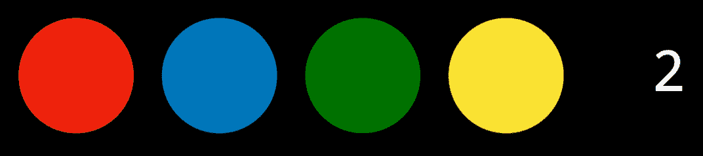

第一玩家回答“两个”。因此我们知道有两个颜色在正确的位置，另外两个在错误的位置。基于这个信息，第二玩家尝试交换两个颜色的位置。

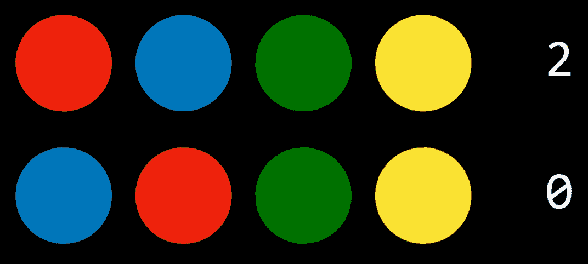

现在，第一玩家回答“零”。因此，第二玩家知道最初交换的颜色在正确的位置，这意味着未被触及的两个颜色在错误的位置。第二玩家将它们交换。

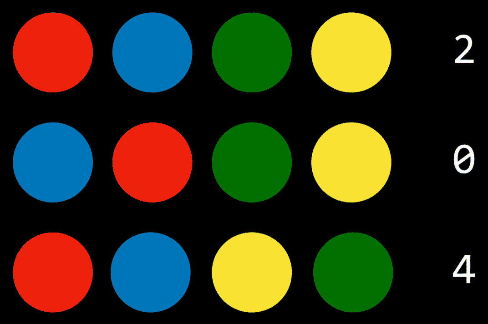

第一玩家说“四个”，游戏结束。

在命题逻辑中表达这一点需要我们拥有（颜色数量）²个原子命题。所以，在四种颜色的情况下，我们会拥有代表颜色和位置的命题，如 red0、red1、red2、red3、blue0 等。下一步是将游戏的规则在命题逻辑中表示（每个位置只有一个颜色且颜色不重复），并将它们添加到知识库中。最后一步是将我们拥有的所有线索添加到知识库中。在我们的情况下，我们会添加在第一次猜测中，有两个位置是错误的，有两个位置是正确的，在第二次猜测中，没有一个是正确的。使用这些知识，模型检查算法可以给我们提供谜题的解决方案。

## 推理规则

模型检查不是一个高效的算法，因为它必须在给出答案之前考虑所有可能模型（提醒：如果查询 R 在所有模型（真值赋值）中都是真的，那么 R 是真的）。推理规则允许我们基于现有知识生成新信息，而无需考虑所有可能的模型。

推理规则通常使用一条水平线来表示，该线将上半部分（前提）与下半部分（结论）分开。前提是我们拥有的任何知识，而结论是基于前提可以生成的知识。

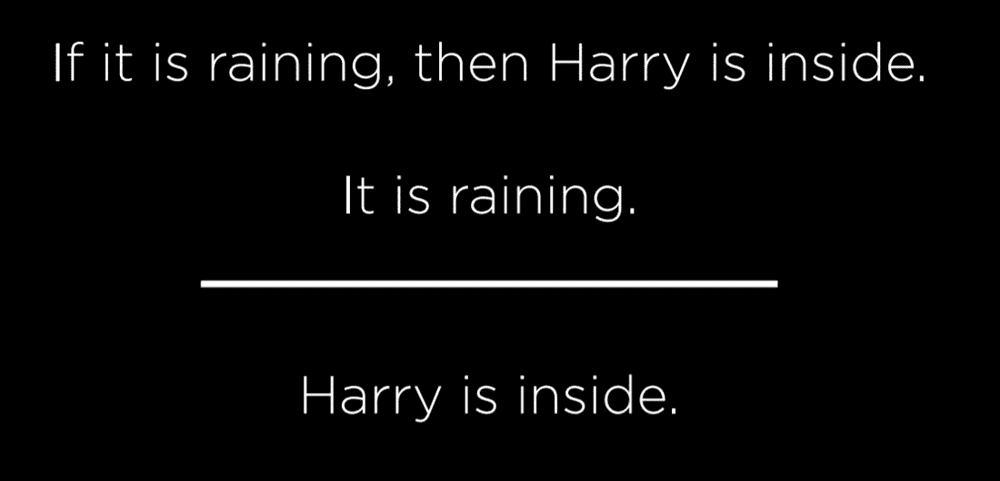

在这个例子中，我们的前提由以下命题组成：

+   如果下雨，那么哈利就在室内。

+   正在下雨。

基于此，大多数合理的人类可以得出结论：

+   哈利在室内。

**肯定前件**

在这个例子中，我们使用的推理规则是肯定前件式，这是一种比较复杂的方式来表达，即如果我们知道一个蕴涵及其前件是真的，那么后件也是真的。

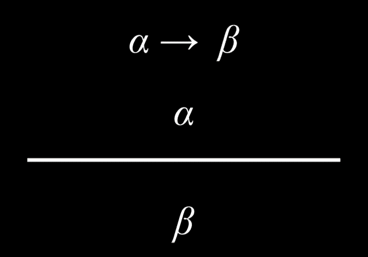

**合取消除**

如果一个合取命题是真的，那么其中任何一个原子命题也是真的。例如，如果我们知道哈利和罗恩以及赫敏是朋友，我们可以得出哈利和赫敏是朋友的结论。

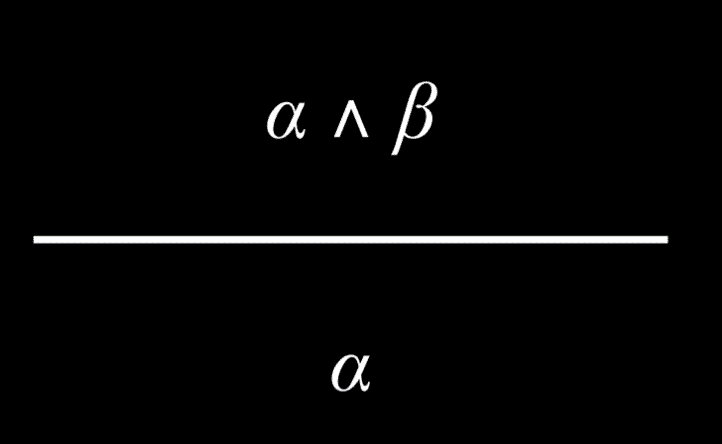

**双重否定消除**

被否定两次的命题是真的。例如，考虑命题“哈利没有通过考试的说法并不正确”。我们可以这样解析它：“哈利没有通过考试的说法并不正确”，或者“¬(哈利没有通过考试)”，最后“¬(¬(哈利通过了考试))”。两次否定相互抵消，将命题“哈利通过了考试”标记为真。

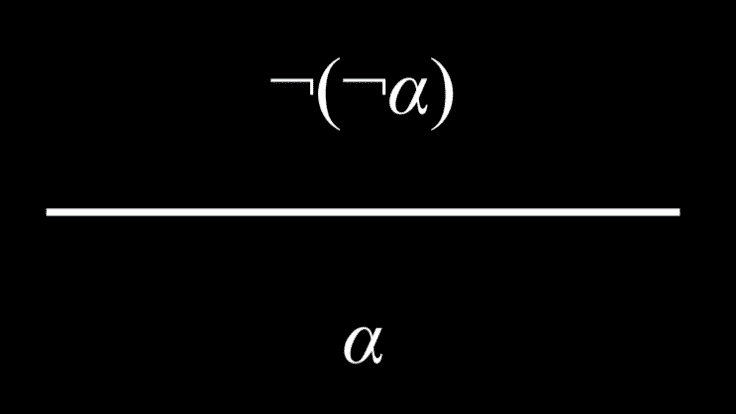

**蕴涵消除**

蕴涵等价于否定前件和后件之间的或关系。例如，命题“如果下雨，哈利在室内”等价于命题“（不下雨）或（哈利在室内）。”

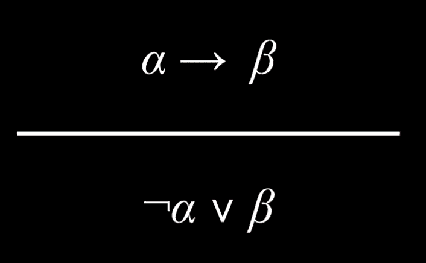

这一点可能会有些令人困惑。然而，考虑以下真值表：

| P | Q | P → Q | ¬P ∨ Q |
| --- | --- | --- | --- |
| 假 | 假 | 真 | 真 |
| 假 | 真 | 真 | 真 |
| 真 | 假 | 假 | 假 |
| 真 | 真 | 真 | 真 |

由于 P → Q 和 ¬P ∨ Q 具有相同的真值赋值，我们知道它们在逻辑上是等价的。另一种思考方式是，如果一个蕴涵在两种可能条件下成立：首先，如果前件是假的，蕴涵就显然是真的（如前所述，在蕴涵部分讨论过）。这由 ¬P ∨ Q 中的否定前件 P 表示，意味着如果 P 是假的，那么命题总是真的。其次，当且仅当后件也是真的时，蕴涵才是真的。也就是说，如果 P 和 Q 都是真的，那么 ¬P ∨ Q 是真的。然而，如果 P 是真的而 Q 不是，那么 ¬P ∨ Q 就是假的。

**双条件消除**

一个双条件命题等价于一个蕴涵及其逆命题，并且使用合取连接符。例如，“如果下雨，那么哈利在室内”等价于“如果下雨，哈利在室内”和“如果哈利在室内，那么下雨”。

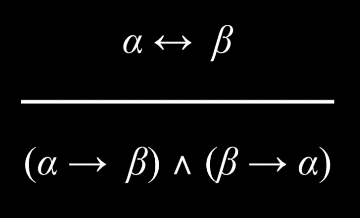

**德摩根定律**

将“与”连接词转换为“或”连接词是可能的。考虑以下命题：“哈利和罗恩都没有通过考试。”从这个命题中，我们可以得出结论：“哈利没有通过考试”或“罗恩没有通过考试。”也就是说，要使前面的“与”命题为真，至少有一个“或”命题中的命题必须为真。

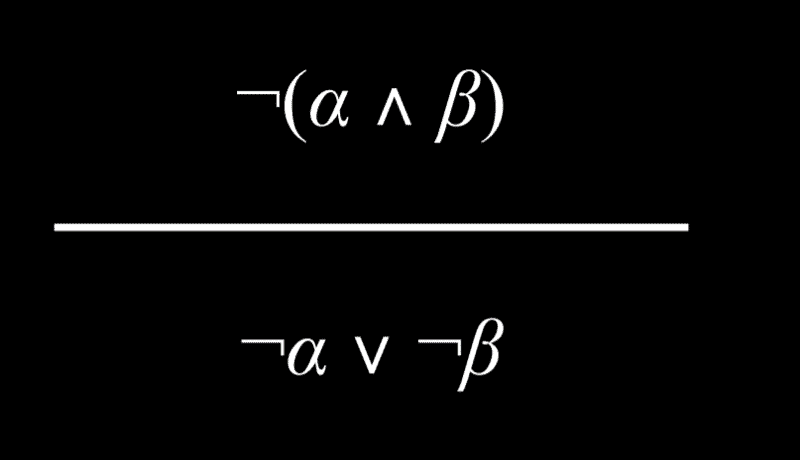

同样，也可以得出相反的结论。考虑命题“哈利或罗恩没有通过考试。”这可以重新表述为“哈利没有通过考试”和“罗恩没有通过考试。”

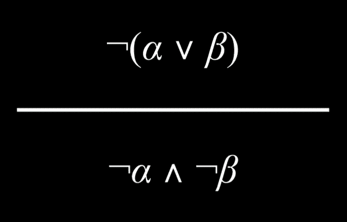

**分配律**

一个由“与”或“或”连接词组合的两个元素的命题可以被分配，或分解成由“与”和“或”组成的小单元。

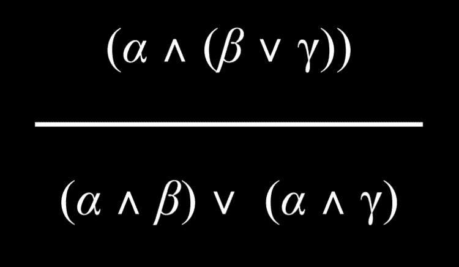

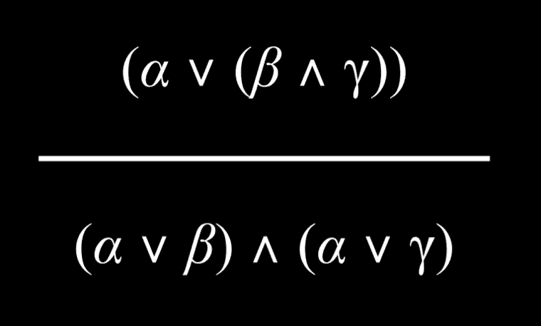

**知识和搜索问题**

推理可以被视为一个具有以下特性的搜索问题：

+   初始状态：起始知识库

+   行动：推理规则

+   转换模型：推理后的新知识库

+   目标测试：检查我们试图证明的陈述是否在知识库（KB）中

+   路径成本函数：证明中的步骤数

这展示了搜索算法是多么的灵活，它允许我们使用推理规则根据现有知识推导出新的信息。

## 归结

归结是一个强大的推理规则，它指出在一个“或”命题中的两个原子命题中，如果一个是假的，那么另一个必须是真的。例如，给定命题“罗恩在大厅”或“赫敏在图书馆”，除了命题“罗恩不在大厅”，我们还可以得出结论“赫敏在图书馆。”更正式地，我们可以这样定义归结：

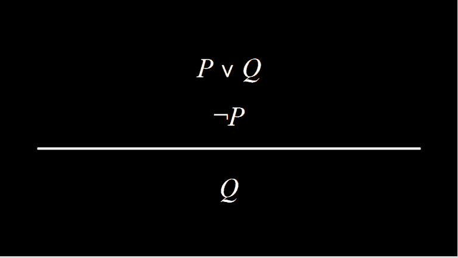

归结依赖于**互补文字**，即两个相同的原子命题，其中一个被否定，另一个没有被否定，例如 P 和 ¬P。

归结可以进一步推广。假设除了命题“罗恩在大厅”或“赫敏在图书馆”，我们还知道“罗恩不在大厅”或“哈利在睡觉。”我们可以通过归结从这个命题中推断出“赫敏在图书馆”或“哈利在睡觉。”用正式的话来说：

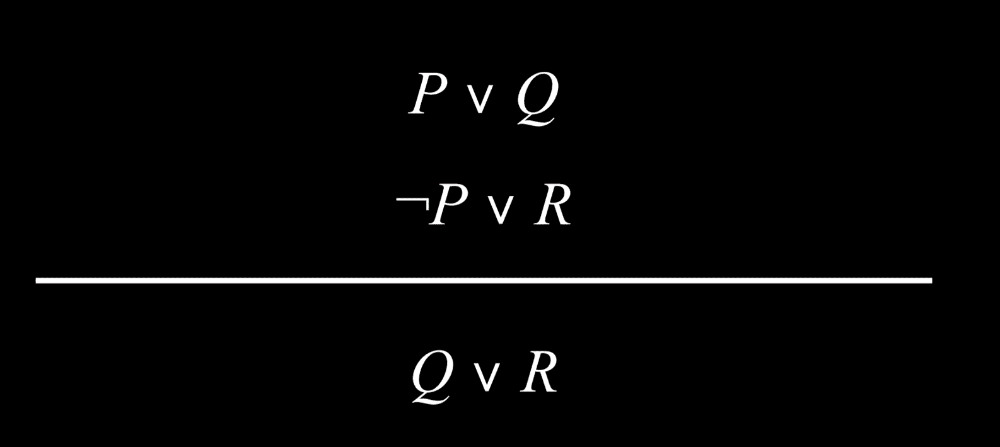

互补文字允许我们通过归结推理生成新的句子，从而生成新的知识。因此，推理算法定位互补文字以生成新的知识。

**子句** 是文字的析取（一个命题符号或命题符号的否定，如 P，¬P）。**析取** 由命题通过或逻辑连接词连接（P ∨ Q ∨ R）。另一方面，**合取** 由命题通过与逻辑连接词连接（P ∧ Q ∧ R）。子句允许我们将任何逻辑语句转换为 **合取范式** (CNF)，例如：(A ∨ B ∨ C) ∧ (D ∨ ¬E) ∧ (F ∨ G)。

**将命题转换为合取范式步骤**

+   消去双条件

    +   将 (α ↔ β) 转换为 (α → β) ∧ (β → α)。

+   消去蕴涵

    +   将 (α → β) 转换为 ¬α ∨ β。

+   使用德摩根定律将否定内移，直到只有文字被否定（而不是子句）。

    +   将 ¬(α ∧ β) 转换为 ¬α ∨ ¬β

这里有一个将 (P ∨ Q) → R 转换为合取范式的例子：

+   (P ∨ Q) → R

+   ¬(P ∨ Q) ∨ R / 消去蕴涵

+   (¬P ∧ ¬Q) ∨ R / 德摩根定律

+   (¬P ∨ R) ∧ (¬Q ∨ R) / 分配律

在这一点上，我们可以在合取范式中运行推理算法。偶尔，通过解析推理的过程，我们可能会遇到一个子句包含相同的文字两次的情况。在这些情况下，使用称为 **因式分解** 的过程，其中移除重复的文字。例如，(P ∨ Q ∨ S) ∧ (¬P ∨ R ∨ S) 允许我们通过解析推理得出 (Q ∨ S ∨ R ∨ S)。重复的 S 可以被移除，得到 (Q ∨ R ∨ S)。

解析一个文字及其否定，即 ¬P 和 P，会得到 **空子句** (()). 空子句总是假的，这很有道理，因为 P 和 ¬P 同时为真是不可能的。这个事实被解析算法所使用。

+   要确定 KB ⊨ α：

    +   检查：是否 (KB ∧ ¬α) 是一个矛盾？

        +   如果是这样，那么 KB ⊨ α。

        +   否则，没有蕴涵。

反证法是计算机科学中常用的一种工具。如果我们的知识库是真的，并且它与 ¬α 相矛盾，这意味着 ¬α 是假的，因此 α 必须是真的。更技术地说，算法会执行以下操作：

+   要确定 KB ⊨ α：

    +   将 (KB ∧ ¬α) 转换为合取范式。

    +   继续检查我们是否可以使用解析产生一个新的子句。

    +   如果我们产生了空子句（相当于 False），恭喜！我们已经达到了矛盾，从而证明了 KB ⊨ α。

    +   然而，如果没有达到矛盾并且无法再推导出更多子句，则不存在蕴涵。

这里有一个例子说明这个算法可能如何工作：

+   (A ∨ B) ∧ (¬B ∨ C) ∧ (¬C) 是否蕴涵 A？

+   首先，为了进行反证法，我们假设 A 是假的。因此，我们到达 (A ∨ B) ∧ (¬B ∨ C) ∧ (¬C) ∧ (¬A)。

+   现在，我们可以开始生成新的信息。由于我们知道 C 是假的 (¬C)，(¬B ∨ C) 可以成立的唯一方式是 B 也是假的。因此，我们可以将 (¬B) 添加到我们的 KB 中。

+   接下来，由于我们知道 (¬B)，(A ∨ B) 可以成立的唯一方式是 A 为真。因此，我们可以将 (A) 添加到我们的 KB 中。

+   现在我们的知识库有两个互补的命题，(A) 和 (¬A)。我们解决了它们，得到了空集，( )。空集根据定义是假的，所以我们已经得到了一个矛盾。

## **一阶逻辑**

一阶逻辑是另一种逻辑类型，它允许我们比命题逻辑更简洁地表达更复杂的思想。一阶逻辑使用两种类型的符号：*常量符号*和*谓词符号*。常量符号代表对象，而谓词符号类似于接受参数并返回真或假值的关联或函数。

例如，我们回到霍格沃茨的逻辑谜题，不同的人和房子分配。常量符号是人或房子，如米涅瓦、波莫娜、格兰芬多、赫奇帕奇等。谓词符号是某些常量符号为真或假的属性。例如，我们可以用句子 Person(Minerva) 表达米涅瓦是人这个想法。同样，我们可以用句子 House(Gryffindor) 表达格兰芬多是一个房子。所有的逻辑连接词在一阶逻辑中与之前一样工作。例如，¬House(Minerva) 表达了米涅瓦不是一个房子的想法。谓词符号也可以接受两个或更多参数，并表达它们之间的关系。例如，BelongsTo 表达了两个人和房子之间的关系。因此，米涅瓦属于格兰芬多的想法可以表达为 BelongsTo(Minerva, Gryffindor)。一阶逻辑允许为每个人和每个房子有一个符号。这比命题逻辑更简洁，在命题逻辑中，每个人—房子的分配都需要一个不同的符号。

**全称量化**

量化是一种可以在一阶逻辑中使用的工具，用于表示不使用特定常量符号的句子。全称量化使用符号 ∀ 来表达“对所有”。因此，例如，句子 ∀x. BelongsTo(x, Gryffindor) → ¬BelongsTo(x, Hufflepuff) 表达了对于每个符号，如果这个符号属于格兰芬多，它就不属于赫奇帕奇的想法。

**存在量化**

存在量化是一个与全称量化平行的概念。然而，全称量化被用来创建对所有 x 都为真的句子，而存在量化被用来创建至少对一个 x 为真的句子。它使用符号 ∃ 来表示。例如，句子 ∃x. House(x) ∧ BelongsTo(Minerva, x) 表示至少有一个符号既是房子，又属于米涅瓦。换句话说，这表达了米涅瓦属于一个房子的想法。

存在量词和全称量词可以在同一个句子中使用。例如，句子 ∀x. Person(x) → (∃y. House(y) ∧ BelongsTo(x, y)) 表达了这样的想法：如果 x 是一个人，那么至少有一个房子 y，这个人属于它。换句话说，这个句子的意思是每个人都属于一个房子。

除此之外，还有其他类型的逻辑，它们的共同点在于它们都存在于追求表示信息的过程中。这些是我们用来在我们的 AI 中表示知识的系统。
