# 第二次讲座

> 原文：[`cs50.harvard.edu/ai/notes/2/`](https://cs50.harvard.edu/ai/notes/2/)

## 不确定性

上次讲座，我们讨论了 AI 如何表示和推导新的知识。然而，在现实中，AI 通常只有对世界的部分了解，这留下了不确定性的空间。尽管如此，我们希望我们的 AI 在这些情况下做出最佳可能的决策。例如，在预测天气时，AI 有关于今天天气的信息，但无法 100%准确地预测明天的天气。尽管如此，我们可以比随机性做得更好，今天的讲座是关于我们如何创建在有限信息和不确定性下做出最优决策的 AI。

## 概率

不确定性可以用一系列事件及其发生的可能性或概率来表示。

**可能的世界**

每个可能的情况都可以被视为一个世界，用小写希腊字母 omega ω表示。例如，掷骰子可以产生六个可能的世界：一个世界是骰子显示 1，一个世界是骰子显示 2，以此类推。为了表示某个世界的概率，我们写 P(*ω*)。

**概率公理**

+   0 < P(*ω*) < 1：每个代表概率的值必须在 0 和 1 之间。

    +   零是一个不可能发生的事件，比如掷一个标准骰子得到 7。

    +   一个是一定会发生的事件，比如掷一个标准骰子得到小于 10 的数值。

    +   通常情况下，数值越高，事件发生的可能性就越大。

+   所有可能事件的概率之和等于 1。

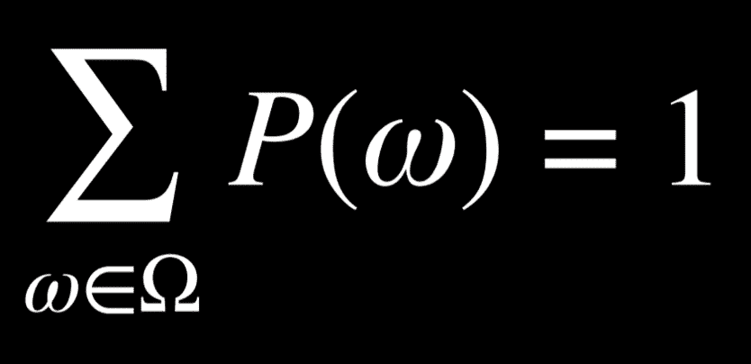

抛掷一个标准骰子得到数字 *R* 的概率可以表示为 P(*R*)。在我们的例子中，P(*R*) = 1/6，因为有六个可能的世界（从 1 到 6 的任意数字），每个世界发生的可能性是相等的。现在，考虑抛掷两个骰子的事件。现在，有 36 个可能的事件，它们再次是同等可能发生的。

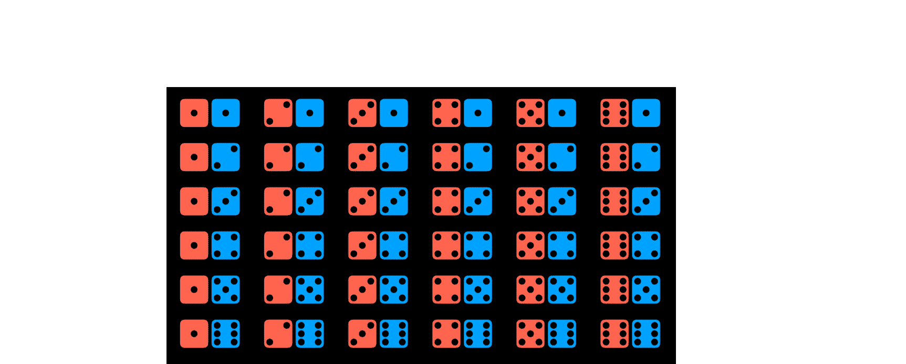

然而，如果我们尝试预测两个骰子的和会发生什么？在这种情况下，我们只有 11 个可能值（和必须从 2 到 12），它们并不以相同的频率发生。

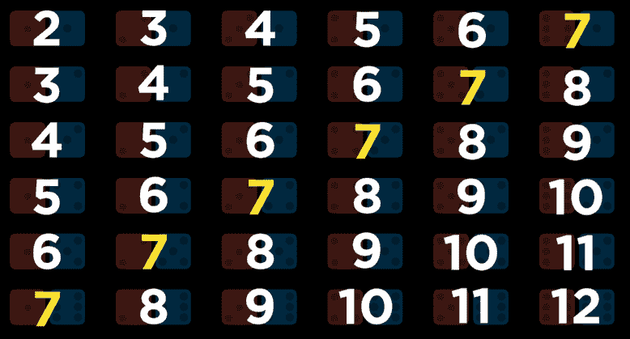

要得到一个事件的概率，我们将其发生的世界数除以所有可能世界数。例如，当抛掷两个骰子时，有 36 个可能的世界。只有在这 36 个世界中，当两个骰子都显示 6 时，我们才能得到和为 12。因此，P(*12*) = 1/36，或者说，用文字表达，抛掷两个骰子得到两个数之和为 12 的概率是 1/36。P(*7*)是多少？我们数一下，发现和为 7 的情况发生在 6 个世界中。因此，P(*7*) = 6/36 = 1/6。

**无条件概率**

无条件概率是在没有任何其他证据的情况下对命题的信念程度。我们之前提出的所有问题都是无条件概率问题，因为掷骰子的结果不依赖于先前的事件。

## 条件概率

条件概率是在已有某些证据被揭示的情况下，对命题的信念程度。正如引言中讨论的，人工智能可以使用部分信息对未来做出有根据的猜测。为了使用这些信息，这些信息会影响未来事件发生的概率，我们依赖于条件概率。

条件概率使用以下符号表示：P(*a | b*)，意味着“在已知事件 *b* 已经发生的情况下，事件 *a* 发生的概率，”或者更简洁地说，“给定 *b* 的 *a* 的概率。”现在我们可以提出像今天下雨的概率是多少，给定昨天已经下雨 P(*rain today | rain yesterday*)，或者患者有疾病的概率是多少，给定他们的检测结果 P(*disease | test results*)。

从数学上讲，为了计算给定 *b* 的 *a* 的条件概率，我们使用以下公式：

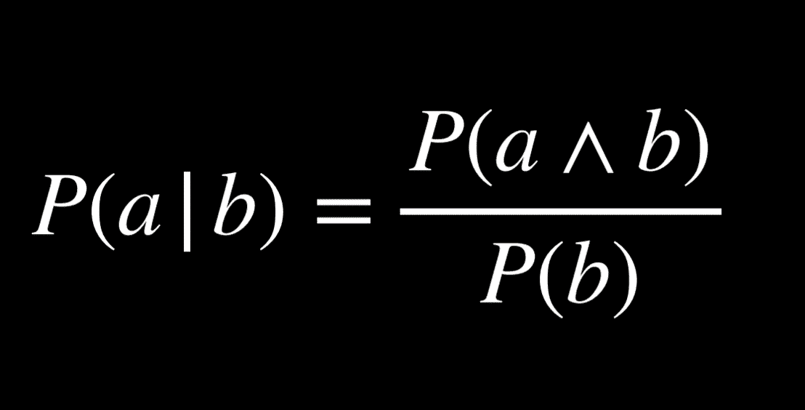

用语言来说，给定 *b* 的 *a* 的概率是真实的，等于 *a* 和 *b* 同时为真的概率，除以 *b* 的概率。对此进行直观推理的一种方式是“我们感兴趣的只是 *a* 和 *b* 同时为真的事件（分子），但只从我们知道 *b* 为真的世界中（分母）。”除以 *b* 限制了可能的世界，使其只包含 *b* 为真的世界。以下是与上述公式代数上等价的形式：

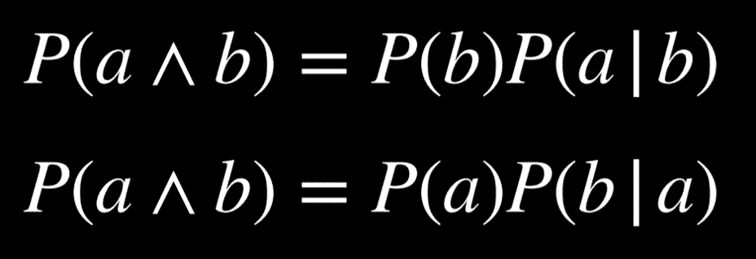

例如，考虑 P(*sum 12 | roll six on one die*)，或者在我们已经掷出一个六的情况下，掷两个骰子得到总和为十二的概率。为了计算这个概率，我们首先将我们的世界限制在第一个骰子的值为六的情况：

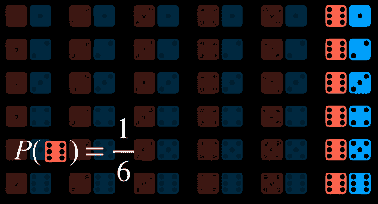

现在我们询问事件 *a*（总和为 12）在我们限制问题的世界中发生的次数是多少（除以 P(*b*)，即第一个骰子掷出 6 的概率）。

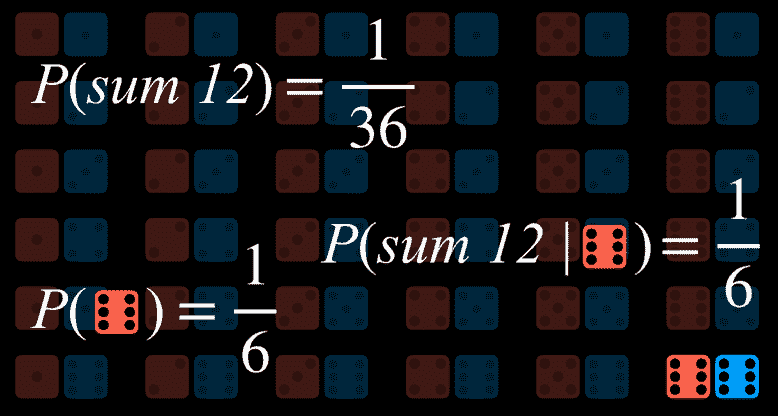

## 随机变量

随机变量是概率论中的一个变量，它有一个可能的值域。例如，为了表示掷骰子的可能结果，我们可以定义一个随机变量 *Roll*，它可以取值 {*1, 2, 3, 4, 5, 6*}。为了表示航班的状况，我们可以定义一个变量 *Flight*，它可以取值 {*on time, delayed, canceled*}。

通常，我们感兴趣的是每个值出现的概率。我们使用概率分布来表示这一点。例如，

+   P(*Flight = on time*) = 0.6

+   P(*Flight = delayed*) = 0.3

+   P(*Flight = canceled*) = 0.1

用文字来解释概率分布，这意味着有 60%的几率航班准点，30%的几率延误，10%的几率取消。注意，如前所述，所有可能结果的概率之和为 1。

概率分布可以用向量更简洁地表示。例如，**P**(*Flight*) = <*0.6, 0.3, 0.1*>. 为了使这种表示法可解释，值必须有一个固定的顺序（在我们的例子中，*准点，延误，取消*）。

**独立性**

独立性是知道一个事件的发生不会影响另一个事件发生的概率。例如，当掷两个骰子时，每个骰子的结果是相互独立的。掷出第一个骰子的 4 点不会影响我们掷出的第二个骰子的值。这与像早晨有云和下午下雨这样的相关事件相反。如果早晨有云，下午下雨的可能性更大，所以这些事件是相关的。

独立性可以用数学定义：事件*a*和*b*是独立的，当且仅当*a*和*b*的概率等于*a*的概率乘以*b*的概率：P(*a ∧ b*) = P(*a*)P(*b*).

## 贝叶斯定理

贝叶斯定理在概率论中常用以计算条件概率。用文字来说，贝叶斯定理表明，给定*a*的*b*的概率等于给定*b*的*a*的概率，乘以*b*的概率，除以*a*的概率。

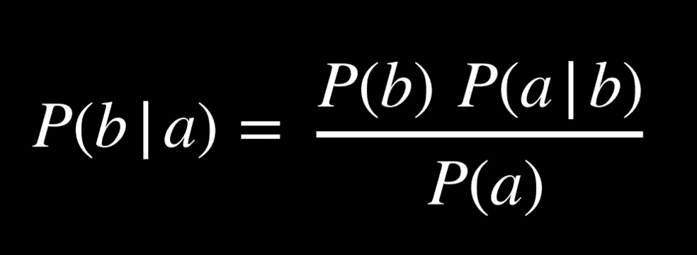

例如，我们想要计算如果早晨有云，下午下雨的概率，或 P(*雨 | 云*). 我们从以下信息开始：

+   80%的雨天下午始于多云的早晨，或 P(*云 | 雨*).

+   40%的天数早晨有云，或 P(*云*).

+   10%的天数下午有雨，或 P(*雨*).

应用贝叶斯定理，我们计算(0.1)(0.8)/(0.4) = 0.2\. 这意味着，如果早晨有云，下午下雨的概率是 20%。

知道 P(*a | b*)，除了 P(*a*)和 P(*b*)，我们可以计算 P(*b | a*)。这很有帮助，因为知道在未知原因给定的情况下可见效果的条件下概率，P(*visible effect | unknown cause*)，允许我们计算给定可见效果的未知原因的概率，P(*unknown cause | visible effect*)。例如，我们可以通过医学试验学习 P(*medical test results | disease*)，在试验中测试患有疾病的人，看看测试有多频繁地检测到这一点。了解这一点后，我们可以计算 P(*disease | medical test results*)，这是有价值的诊断信息。

## 联合概率

联合概率是多个事件同时发生的可能性。

让我们考虑以下例子，关于早晨有云和下午下雨的概率。

| C = *云* | C = *¬云* |
| --- | --- |
| 0.4 | 0.6 |
| R = *雨* | R = *¬雨* |
| --- | --- |
| 0.1 | 0.9 |

观察这些数据，我们无法说早晨的云与下午下雨的可能性有关。要能够做到这一点，我们需要查看两个变量所有可能结果的联合概率。我们可以用以下表格表示：

|   | R = *雨* | R = *¬雨* |
| --- | --- | --- |
| C = *云* | 0.08 | 0.32 |
| C = *¬云* | 0.02 | 0.58 |

现在我们能够了解事件共现的信息。例如，我们知道某一天早晨有云和下午下雨的概率是 0.08。早晨无云和下午无雨的概率是 0.58。

使用联合概率，我们可以推导出条件概率。例如，如果我们对下午下雨时早晨有云的概率分布感兴趣。P(*C | 雨*) = P(*C, 雨*)/P(*雨*)（顺便提一下：在概率论中，逗号和 ∧ 可以互换使用）。因此，P(*C, 雨*) = P(*C ∧ 雨*)。换句话说，我们将雨和云的联合概率除以雨的概率。

在最后一个方程中，我们可以将 P(*雨*) 视为一个常数，它乘以 P(*C, 雨*)。因此，我们可以重写 P(*C, 雨*)/P(*雨*) = αP(*C, 雨*)，或 α<0.08, 0.02>。提取 α 后，我们得到在下午下雨的条件下 C 的可能值的概率比例。也就是说，如果下午下雨，早晨有云和早晨无云的概率比例是 0.08:0.02。请注意，0.08 和 0.02 的和并不等于 1；然而，由于这是随机变量 C 的概率分布，我们知道它们的和应该等于 1。因此，我们需要通过计算 α 来归一化这些值，使得 α0.08 + α0.02 = 1。最后，我们可以说 P(*C | 雨*) = <0.8, 0.2>。

## 概率规则

+   **否定**: P(*¬a*) = 1 - P(*a*). 这源于所有可能世界的概率之和为 1，互补命题 *a* 和 *¬a* 包括所有可能世界。

+   **包含-排除**: P(*a ∨ b*) = P(*a*) + P(*b*) - P(*a ∧ b*). 这可以这样解释：*a* 或 *b* 为真的世界等于所有 *a* 为真的世界，加上所有 *b* 为真的世界。然而，在这种情况下，一些世界被计算了两次（即 *a* 和 *b* 都为真的世界）。为了消除这种重叠，我们减去一次 *a* 和 *b* 都为真的世界（因为它们被计算了两次）。

    > 这里有一个来自课堂外部的例子可以阐明这一点。假设我 80%的日子里吃冰淇淋，70%的日子里吃饼干。如果我们计算今天我吃冰淇淋或饼干的概率 P(*ice cream ∨ cookies*) 而不减去 P(*ice cream ∧ cookies*)，我们会错误地得到 0.7 + 0.8 = 1.5。这与概率范围在 0 到 1 之间的公理相矛盾。为了纠正重复计算我同时吃冰淇淋和饼干的日子，我们需要减去一次 P(*ice cream ∧ cookies*)。

+   **边缘化**: P(*a*) = P(*a, b*) + P(*a, ¬b*). 这里面的想法是 *b* 和 *¬b* 是互斥的概率。也就是说，*b* 和 *¬b* 同时发生的概率是 0。我们还知道 *b* 和 *¬b* 的总和为 1。因此，当 *a* 发生时，*b* 要么发生，要么不发生。当我们考虑 *a* 和 *b* 同时发生的概率，以及 *a* 和 *¬b* 同时发生的概率，我们最终得到的就是 *a* 的概率。

边缘化可以用以下方式表示随机变量：

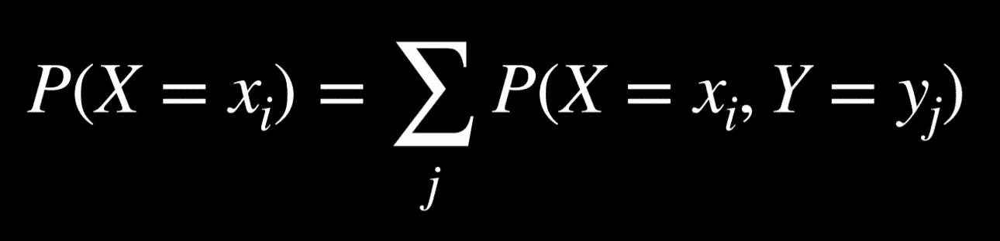

方程式的左边表示“随机变量 X 取值 xᵢ 的概率。”例如，对于前面提到的变量 C，可能的两个值是“早上有云”和“早上无云”。方程式的右边是边缘化的概念。P(*X = xᵢ*) 等于 xᵢ 和随机变量 Y 的每个值的联合概率之和。例如，P(*C = cloud*) = P(*C = cloud, R = rain*) + P(*C = cloud, R = ¬rain*) = 0.08 + 0.32 = 0.4。

+   **条件化**: P(*a*) = P(*a | b*)P(*b*) + P(*a | ¬b*)P(*¬b*). 这与边缘化有类似的想法。事件 *a* 发生的概率等于 *a* 在 *b* 条件下的概率乘以 *b* 的概率，加上 *a* 在 *¬b* 条件下的概率乘以 *¬b* 的概率。

在这个公式中，随机变量 X 以 xᵢ 的值出现，其概率等于 xᵢ 在每个随机变量 Y 的值下的概率之和乘以变量 Y 取该值的概率。如果我们记住 P(*a | b*) = P(*a, b*)/P(*b*)，这个公式是有意义的。如果我们乘以 P(*b*)，我们最终得到 P(*a, b*)，然后我们就可以像边缘化一样做了。

## 贝叶斯网络

贝叶斯网络是一种表示随机变量之间依赖关系的数据结构。贝叶斯网络具有以下特性：

+   它们是有向图。

+   图表上的每个节点代表一个随机变量。

+   从 X 到 Y 的箭头表示 X 是 Y 的父节点。也就是说，Y 的概率分布取决于 X 的值。

+   每个节点 X 都有概率分布 P(*X | Parents(X)*)。

让我们考虑一个涉及影响我们是否准时到达约会的时间的贝叶斯网络的例子。

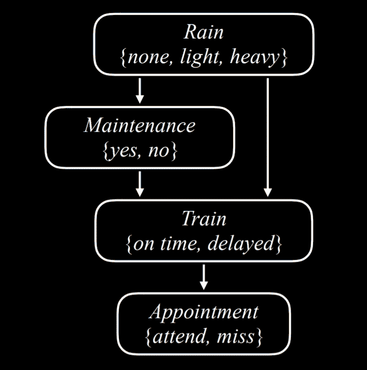

让我们从上到下描述这个贝叶斯网络：

+   雨是网络中的根节点。这意味着它的概率分布不依赖于任何先前事件。在我们的例子中，Rain 是一个可以取值 {*none, light, heavy*} 的随机变量，其概率分布如下：

    | *none* | *light* | *heavy* |
    | --- | --- | --- |
    | 0.7 | 0.2 | 0.1 |

+   在我们的例子中，Maintenance 编码是否存在火车轨道维护，取值有 {*yes, no*}。Rain 是 Maintenance 的父节点，这意味着 Maintenance 的概率分布受 Rain 影响。

    | R | *yes* | *no* |
    | --- | --- | --- |
    | *none* | 0.4 | 0.6 |
    | *light* | 0.2 | 0.8 |
    | *heavy* | 0.1 | 0.9 |

+   Train 是一个变量，表示火车是否准时或延误，取值有 {*on time, delayed*}。请注意，Train 从 Maintenance 和 Rain 两处都有箭头指向它。这意味着它们都是 Train 的父节点，它们的值会影响 Train 的概率分布。

    | R | M | *on time* | *delayed* |
    | --- | --- | --- | --- |
    | *none* | yes | 0.8 | 0.2 |
    | *none* | no | 0.9 | 0.1 |
    | *light* | yes | 0.6 | 0.4 |
    | *light* | no | 0.7 | 0.3 |
    | *heavy* | yes | 0.4 | 0.6 |
    | *heavy* | no | 0.5 | 0.5 |

+   约会是一个随机变量，表示我们是否参加约会，取值有 {*attend, miss*}。请注意，它的唯一父节点是 Train。关于贝叶斯网络的一个值得注意的点：父节点只包括直接关系。确实，维护会影响火车是否准时，火车是否准时会影响我们是否参加约会。然而，最终直接影响我们参加约会机会的是火车是否准时到达，这正是贝叶斯网络所表示的。例如，如果火车准时到达，可能是大雨和轨道维护，但这对我们是否到达约会没有影响。

    | T | *attend* | *miss* |
    | --- | --- | --- |
    | *on time* | 0.9 | 0.1 |
    | *delayed* | 0.6 | 0.4 |

例如，如果我们想找到在无维护和轻雨天气下火车延误时错过会议的概率，或者 P(*light, no, delayed, miss*)，我们将计算以下内容：P(*light*)P(*no | light*)P(*delayed | light, no*)P(*miss | delayed*)。每个单独概率的值可以在上面的概率分布中找到，然后这些值相乘以产生 P(*no, light, delayed, miss*)。

**推理**

在上一堂课中，我们探讨了通过蕴涵进行推理。这意味着我们可以根据我们已有的信息确定性地得出新的信息。我们也可以根据概率推断新的信息。虽然这并不允许我们确定地知道新的信息，但它允许我们找出某些值的概率分布。推理具有多个属性。

+   查询**X**：我们想要计算概率分布的变量。

+   证据变量**E**：对于事件**e**已经观察到的变量。例如，我们可能观察到有轻微降雨，这个观察结果有助于我们计算火车延误的概率。

+   隐藏变量**Y**：不是查询且尚未观察到的变量。例如，站在火车站，我们可以观察到是否有雨，但我们无法知道道路上是否有轨道维护。因此，在这种情况下，Maintenance 将是一个隐藏变量。

+   目标：计算**P**(X | e)。例如，根据我们知道有轻微降雨的证据**e**，计算 Train 变量（查询）的概率分布。

让我们举一个例子。我们想要计算在已知有轻微降雨且没有轨道维护的证据下，预约变量（Appointment）的概率分布。也就是说，我们知道有轻微降雨且没有轨道维护，我们想要找出我们参加预约和错过预约的概率，即**P**(Appointment | light, no)。从联合概率部分，我们知道我们可以将预约随机变量的可能值表示为比例，将**P**(Appointment | light, no)重写为 α**P**(Appointment, light, no*)。如果其父变量只有 Train 变量，而不是 Rain 或 Maintenance，我们该如何计算预约变量的概率分布？在这里，我们将使用边缘化。**P**(Appointment, light, no)的值等于 α[**P**(Appointment, light, no, delayed*) + **P**(Appointment, light, no, on time*)]。

**枚举推理**

枚举推理是一个在给定观察到的证据 e 和一些隐藏变量 Y 的情况下寻找变量 X 的概率分布的过程。

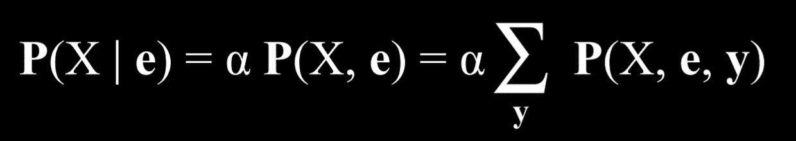

在这个方程中，X 代表查询变量，e 代表观察到的证据，y 代表所有隐藏变量的值，α将结果归一化，使得我们最终得到的概率加起来等于 1。用文字解释这个方程，它表示的是，给定 e 的 X 的概率分布等于 X 和 e 的归一化概率分布。为了得到这个分布，我们求和 X、e 和 y 的归一化概率，其中 y 每次取隐藏变量 Y 的不同值。

Python 中存在多个库来简化概率推理的过程。我们将查看*pomegranate*库，看看如何用代码表示上述数据。

首先，我们创建节点并为每个节点提供一个概率分布。

[PRE0]

其次，我们通过添加节点并描述它们之间通过添加边连接的节点（回想一下，贝叶斯网络是一个有向图，由带有箭头的节点组成）来创建模型。

[PRE1]

现在，要询问某个事件的概率，我们使用感兴趣的值运行模型。在这个例子中，我们想知道没有雨、没有轨道维护、火车准时到达，并且我们参加会议的概率。

[PRE2]

否则，我们可以使用程序为所有变量提供给定一些观察证据的概率分布。在以下情况下，我们知道火车延误了。根据这个信息，我们计算并打印变量 Rain、Maintenance 和 Appointment 的概率分布。

[PRE3]

上面的代码使用了枚举推理。然而，这种计算概率的方法效率低下，尤其是在模型中有许多变量时。另一种方法可能是放弃**精确推理**而采用**近似推理**。这样做，我们在生成的概率中会失去一些精度，但通常这种不精确是可以忽略不计的。相反，我们获得了一种可扩展的概率计算方法。

## 抽样

抽样是近似推理的一种技术。在抽样中，每个变量根据其概率分布抽取一个值。我们将从一个课外例子开始，然后介绍课内的例子。

> 要使用骰子进行抽样生成分布，我们可以多次掷骰子并记录每次得到的结果。假设我们掷了 600 次骰子。我们计算得到 1 的次数，预计大约是 100 次，然后对其他值 2-6 重复此操作。然后，我们将每个计数除以总掷骰子次数。这将生成掷骰子值的近似分布：一方面，我们不太可能得到每个值都有 1/6 的概率出现的结果（这是精确概率），但我们会得到一个接近这个值的结果。

这里有一个来自讲座的例子：如果我们从采样 Rain 变量开始，将生成概率为 0.7 的 *无* 值，概率为 0.2 的 *轻微* 值，以及概率为 0.1 的 *严重* 值。假设我们得到的采样值是 *无*。当我们到达 Maintenance 变量时，我们也对其进行采样，但只从 Rain 等于 *无* 的概率分布中进行采样，因为这是一个已经采样的结果。我们将继续这样做，直到所有节点。现在我们有一个样本，重复这个过程多次生成一个分布。现在，如果我们想回答一个问题，比如 P(*Train = on time*) 是什么，我们可以计算变量 Train 有 *准时* 值的样本数量，然后将结果除以样本总数。这样，我们就为 P(*Train = on time*) 生成了一个近似概率。

我们还可以回答涉及条件概率的问题，例如 P(*Rain = light | Train = on time*)。在这种情况下，我们忽略所有 Train 值不是 *准时* 的样本，然后像以前一样进行。我们计算在 Train = *准时* 的样本中，变量 Rain = *轻微* 的样本数量，然后除以 Train = *准时* 的样本总数。

在代码中，一个采样函数可以看起来像 `generate_sample`：

[PRE4]

现在，为了计算 P(*Appointment | Train = delayed*)，即火车延误时 Appointment 变量的概率分布，我们做以下操作：

[PRE5]

**似然加权**

在上面的采样例子中，我们丢弃了不符合我们已有证据的样本。这是低效的。一种绕过这个问题的方法是通过似然加权，使用以下步骤：

+   首先固定证据变量的值。

+   使用贝叶斯网络中的条件概率采样非证据变量。

+   将每个样本按其 **似然** 加权：所有证据发生的概率。

例如，如果我们观察到火车准时到达，我们就会像以前一样开始采样。我们根据其概率分布采样 Rain 的值，然后是 Maintenance，但当到达 Train 时，我们总是给出观察到的值，在我们的例子中，是 *准时*。然后我们继续根据 Train = *准时* 给定的概率分布采样 Appointment。现在这个样本存在了，我们根据观察变量给定的条件概率来加权。也就是说，如果我们采样了 Rain 并得到 *轻微*，然后采样 Maintenance 并得到 *是*，那么我们将对这个样本进行加权，权重为 P(*Train = on time | light, yes*)。

## 马尔可夫模型

到目前为止，我们考虑了一些基于我们观察到的某些信息的概率问题。在这种范式下，时间维度没有以任何方式表示。然而，许多任务确实依赖于时间维度，例如预测。为了表示时间变量，我们将创建一个新的变量 X，并根据感兴趣的事件对其进行更改，使得 Xₜ是当前事件，Xₜ₊₁是下一个事件，依此类推。为了能够预测未来的事件，我们将使用马尔可夫模型。

**马尔可夫假设**

马尔可夫假设是一个假设，即当前状态只依赖于有限数量的先前状态。这对我们来说很重要。想想预测天气的任务。在理论上，我们可以使用过去一年的所有数据来预测明天的天气。然而，这是不可行的，因为这需要巨大的计算能力，而且可能没有关于基于 365 天前的天气明天天气的条件概率的信息。使用马尔可夫假设，我们限制我们的先前状态（例如，在预测明天的天气时考虑多少天前的天气），从而使任务变得可管理。这意味着我们可能得到对感兴趣概率的更粗糙的近似，但这通常足以满足我们的需求。此外，我们可以使用基于最后一个事件的信息的马尔可夫模型（例如，根据今天的天气预测明天的天气）。

**马尔可夫链**

马尔可夫链是一系列随机变量，其中每个变量的分布遵循马尔可夫假设。也就是说，链中的每个事件都是基于之前事件发生的概率。

要开始构建马尔可夫链，我们需要一个**转移模型**，该模型将指定基于当前事件可能值的下一个事件的概率分布。

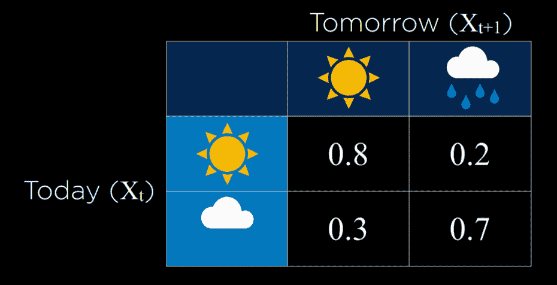

在这个例子中，如果今天是晴天，那么明天也是晴天的概率是 0.8。这是合理的，因为晴天之后接着是晴天的可能性更大。然而，如果今天是雨天，那么明天下雨的概率是 0.7，因为雨天更有可能连续出现。使用这个转移模型，可以采样一个马尔可夫链。从一个雨天或晴天开始，然后根据今天天气是晴天还是雨天来采样下一天。然后，根据明天的情况来调整后天概率，依此类推，从而形成一个马尔可夫链：

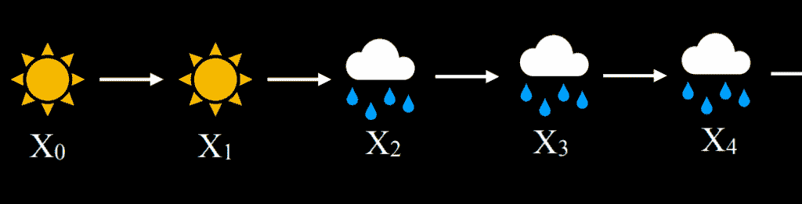

给定这个马尔可夫链，我们现在可以回答诸如“连续四天降雨的概率是多少？”等问题。以下是一个如何在代码中实现马尔可夫链的示例：

[PRE6]

## 隐藏马尔可夫模型

隐藏马尔可夫模型是一种针对具有隐藏状态的系统的马尔可夫模型，这些状态生成某些观测事件。这意味着有时，AI 对世界有一些测量，但没有访问世界精确状态的途径。在这些情况下，世界的状态被称为**隐藏状态**，而 AI 可以访问的任何数据都是**观测**。以下是一些例子：

+   对于探索未知领域的机器人，隐藏状态是它的位置，而观测是机器人传感器记录的数据。

+   在语音识别中，隐藏状态是所说的单词，而观测是音频波形。

+   在测量网站上的用户参与度时，隐藏状态是用户的参与程度，而观测是网站或应用的统计分析。

对于我们的讨论，我们将使用以下例子。我们的 AI 想要推断天气（隐藏状态），但它只能访问一个室内摄像头，该摄像头记录了有多少人带着伞。以下是我们的**传感器模型**（也称为**发射模型**），它表示这些概率：

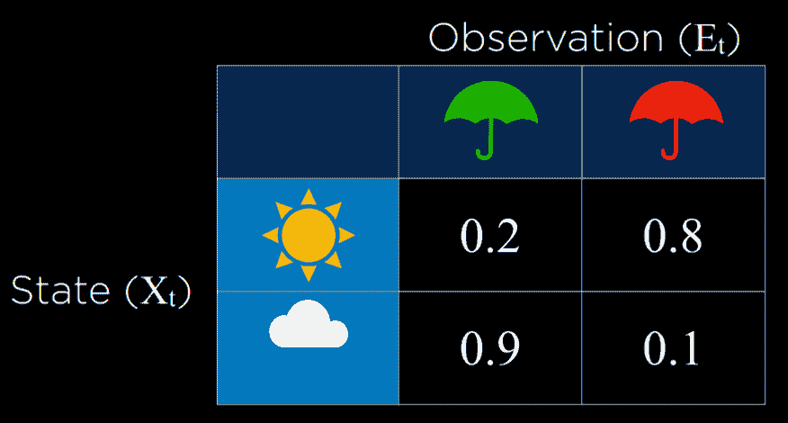

在这个模型中，如果天气晴朗，人们最不可能带伞进建筑物。如果下雨，那么人们很可能带伞进建筑物。通过观察人们是否带伞，我们可以以合理的可能性预测外面的天气。

**传感器马尔可夫假设**

假设证据变量只依赖于对应的状态。例如，对于我们的模型，我们假设人们是否带伞去办公室只取决于天气。这并不一定反映完整的真相，因为例如，更负责任、怕雨的人即使在晴天也可能随身携带伞，如果我们知道每个人的性格，这将向模型添加更多数据。然而，传感器马尔可夫假设忽略了这些数据，假设只有隐藏状态影响观测。

隐藏马尔可夫模型可以用具有两层马尔可夫链来表示。顶层变量 X 代表隐藏状态。底层变量 E 代表证据，即我们拥有的观测。

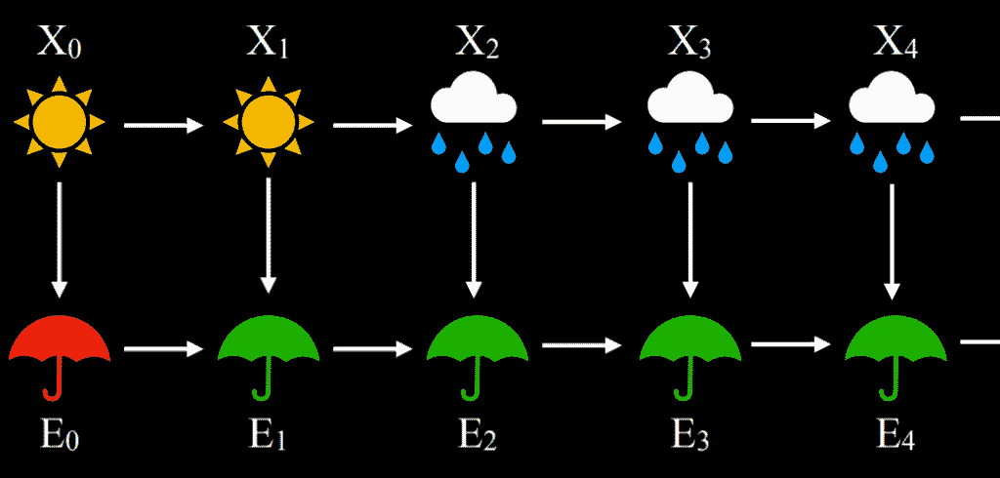

基于隐藏马尔可夫模型，可以实现多个任务：

+   过滤：给定从开始到现在的观测，计算当前状态的概率分布。例如，给定从时间开始到今天人们带伞的信息，我们生成今天是否下雨的概率分布。

+   预测：给定从开始到现在的观测，计算未来状态的概率分布。

+   平滑化：给定从开始到现在的观察结果，计算过去状态的概率分布。例如，计算给定今天人们带伞的情况下，昨天下雨的概率。

+   最可能的解释：给定从开始到现在的观察结果，计算最可能的事件序列。

最可能的解释任务可以用于语音识别等过程，其中，基于多个波形，AI 推断出最可能导致这些波形的单词或音节的序列。下面是一个用于最可能解释任务的隐马尔可夫模型的 Python 实现：

[PRE7]

注意，我们的模型既有传感器模型也有转换模型。对于隐马尔可夫模型，我们需要这两个模型。在下面的代码片段中，我们看到一系列观察结果，即人们是否带伞进入大楼，基于这个序列，我们将运行模型，该模型将生成并打印最可能的解释（即最可能导致这种观察模式的天气序列）：

[PRE8]

在这种情况下，程序的输出将是雨，雨，晴，雨，雨，雨，雨，晴，晴。这个输出代表了根据我们对人们是否带伞进入大楼的观察，最可能的天气模式。
