# 第三讲

> 原文：[`cs50.harvard.edu/ai/notes/3/`](https://cs50.harvard.edu/ai/notes/3/)

## 优化

优化是从一组可能选项中选择最佳选项。我们已经在寻找最佳可能选项的问题中遇到过，例如在最小-最大算法中，今天我们将学习我们可以用来解决更广泛范围问题的工具。

## 局部搜索

局部搜索是一种搜索算法，它保持单个节点并通过移动到相邻节点来搜索。这种算法与我们之前看到的搜索类型不同。例如，在迷宫解决中，我们想要找到到达目标的最快路径，而局部搜索则关注于找到问题的最佳答案。通常，局部搜索会得到一个非最优但“足够好”的答案，从而节省计算能力。考虑以下局部搜索问题的例子：我们有四个位于特定位置的房屋。我们想要建造两家医院，使得每个房屋到医院的距离最小化。这个问题可以如下可视化：

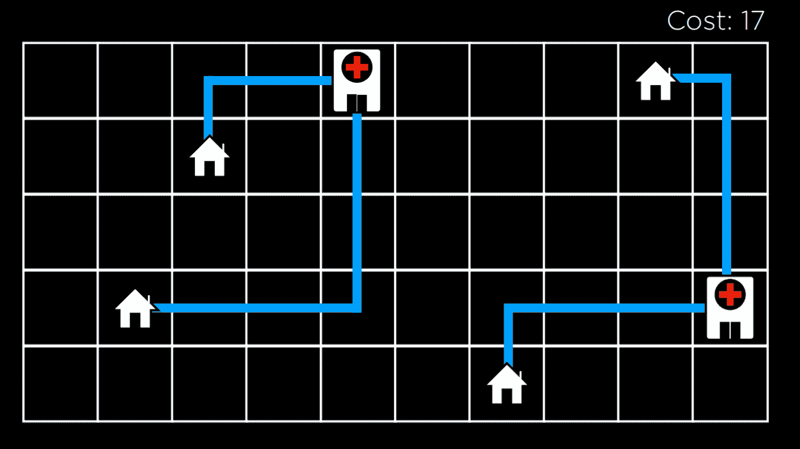

在这个插图上，我们看到的是房屋和医院的一种可能配置。它们之间的距离使用曼哈顿距离（向上、向下和向侧的移动次数；在第六讲 中详细讨论）来衡量，每个房屋到最近医院的距离之和是 17。我们称之为**成本**，因为我们试图最小化这个距离。在这种情况下，状态可以是房屋和医院的任何一种配置。

抽象这个概念，我们可以将房屋和医院的每种配置表示为下面的状态空间景观。图片中的每根条形代表一个状态的值，在我们的例子中，这将是房屋和医院某种配置的成本。

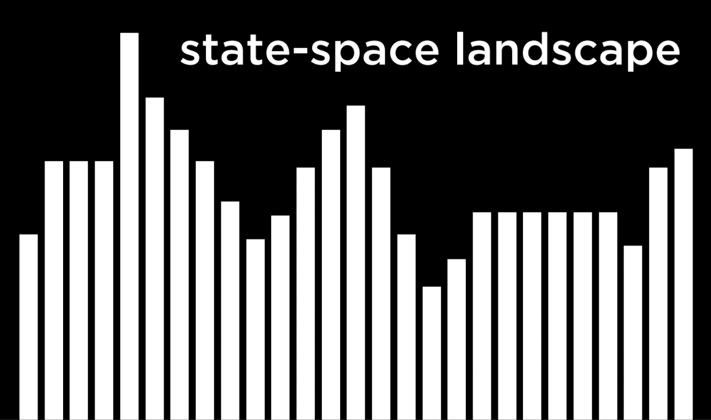

基于这个可视化，我们可以为接下来的讨论定义几个重要术语：

+   **目标函数**是我们用来最大化解决方案价值的函数。

+   **成本函数**是我们用来最小化解决方案成本（这是我们将在房屋和医院例子中使用的函数。我们希望最小化房屋到医院的距离）的函数。

+   **当前状态**是函数目前正在考虑的状态。

+   **相邻状态**是当前状态可以转换到的状态。在上面的单维状态空间景观中，相邻状态是当前状态两侧的状态。在我们的例子中，相邻状态可能是将其中一家医院向任何方向移动一步所得到的状态。相邻状态通常与当前状态相似，因此它们的值接近当前状态的值。

注意，局部搜索算法的工作方式是考虑当前状态中的一个节点，然后将节点移动到当前状态的一个相邻状态。这与例如最小-最大算法不同，在最小-最大算法中，状态空间中的每个状态都被递归地考虑。

## 爬山

爬山是局部搜索算法的一种类型。在这个算法中，将相邻状态与当前状态进行比较，如果其中任何一个更好，我们就将当前节点从当前状态切换到那个相邻状态。什么被认为是更好的，取决于我们是否使用目标函数，偏好更高的值，还是递减函数，偏好更低的值。

爬山算法在伪代码中的表现形式如下：

函数 Hill-Climb(*问题*)：

+   *当前状态* = *问题*的初始状态

+   repeat:

    +   *相邻状态* = *当前状态*的最佳值相邻状态

    +   如果*相邻状态*不如*当前状态*好：

        +   返回 *当前状态*

    +   *当前状态* = *相邻状态*

在这个算法中，我们从当前状态开始。在某些问题中，我们将知道当前状态是什么，而在其他情况下，我们必须随机选择一个状态作为起点。然后，我们重复以下操作：评估相邻状态，选择具有最佳值的那个。然后，我们将这个相邻状态的值与当前状态的值进行比较。如果相邻状态更好，我们将当前状态切换到相邻状态，并重复这个过程。当我们将最佳相邻状态与当前状态进行比较，且当前状态更好时，过程结束。然后，我们返回当前状态。

使用爬山算法，我们可以开始改进我们示例中分配给医院的地点。经过几次转换后，我们达到以下状态：

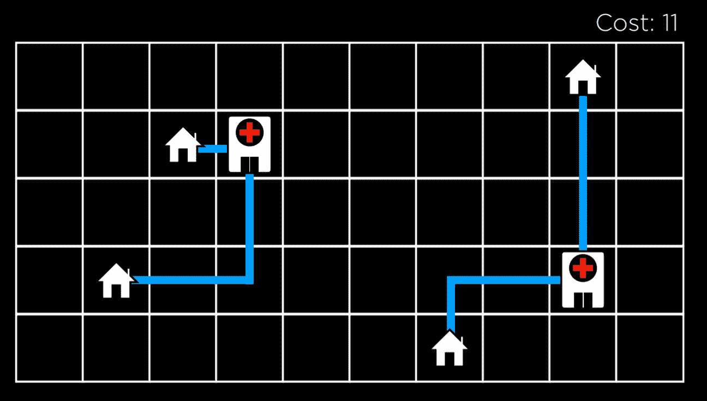

在这个状态下，成本是 11，这比初始状态的 17 有所改善。然而，这还不是最佳状态。例如，将医院移动到左上角房屋下方，可以将成本降低到 9，这比 11 更好。然而，这个版本的爬山算法无法达到那里，因为所有相邻状态的成本至少与当前状态一样高。从这个意义上说，爬山算法是短视的，通常满足于比其他一些解决方案更好的解决方案，但不一定是所有可能解决方案中的最佳。

**局部和全局极小值与极大值**

如上所述，爬山算法可能会陷入局部极大值或极小值。一个**局部极大值**（复数：maxima）是一个比其**相邻状态**具有更高值的态。与之相反，一个**全局极大值**是一个在状态空间中所有状态中具有最高值的态。


相反，一个**局部最小值**（复数：minima）是一个比其**相邻状态**具有更低值的态。与这相反，一个**全局最小值**是一个在状态空间中所有态中具有最低值的态。


爬山算法的问题在于它们可能最终陷入局部最小值和最大值。一旦算法达到一个点，其邻居的值对于函数的目的来说比当前状态更差，算法就会停止。特殊类型的局部最大值和最小值包括**平坦的局部最大值/最小值**，其中多个具有相等值的相邻状态形成一个高原，其邻居的值更差，以及**肩部**，其中多个具有相等值的相邻状态，高原的邻居可以是更好的也可以是更差的。从高原的中间开始，算法将无法向任何方向前进。

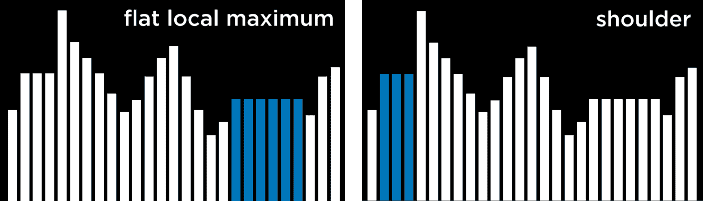

**爬山法变体**

由于爬山法的局限性，人们已经想到了多种变体来克服陷入局部最小值和最大值的问题。所有算法的变体都有一个共同点，即无论策略如何，每个变体仍然有可能最终陷入局部最小值和最大值，并且没有继续优化的手段。下面的算法表述中，较高的值被视为较好，但它们也适用于成本函数，其目标是最小化成本。

+   **最速上升**：选择最高值的邻居。这是我们上面讨论的标准变体。

+   **随机性**：从更高值的邻居中随机选择。这样做，我们选择走向任何可以提高我们值的方向。例如，如果最高值的邻居导致局部最大值，而另一个邻居导致全局最大值，这样做是有意义的。

+   **首选**：选择第一个更高值的邻居。

+   **随机重启**：多次进行爬山。每次，从一个随机状态开始。比较每次试验的最大值，并选择其中最高的一个。

+   **局部束搜索**：选择*k*个最高值的邻居。这与大多数局部搜索算法不同，因为它使用多个节点进行搜索，而不仅仅是单个节点。

虽然局部搜索算法并不总是给出最佳可能的解决方案，但在考虑所有可能状态在计算上不可行的情况下，它们通常可以给出足够好的解决方案。

## 模拟退火

尽管我们已经看到了可以改进爬山法的变体，但它们都存在相同的缺陷：一旦算法达到局部最大值，它就会停止运行。模拟退火允许算法在陷入局部最大值时“摆脱”自己。

热处理是将金属加热并允许其缓慢冷却的过程，这有助于使金属变硬。这个过程被用作模拟退火算法的隐喻，该算法从高温开始，更有可能做出随机决策，随着温度的降低，它做出随机决策的可能性降低，变得更加“坚定”。这种机制允许算法将其状态改变为比当前状态更差的邻居状态，这就是它如何逃离局部最大值的原因。以下是对模拟退火算法的伪代码：

函数 Simulated-Annealing(*problem*, *max*):

+   *当前* = *问题*的初始状态

+   for *t* = 1 to *max*:

    +   *T* = Temperature(*t*)

    +   *邻居* = *当前*的随机邻居

    +   *ΔE* = 相较于*当前*，*邻居*有多好

    +   if *ΔE* > 0:

        +   *current* = *neighbor*

    +   以概率 e^(*ΔE/T*) 将*当前*设置为*邻居*

+   返回*当前*

该算法将问题和一个*max*（算法应重复的次数）作为输入。对于每一次迭代，使用温度函数设置*T*。这个函数在早期迭代（当*t*较低时）返回较高的值，而在后期迭代（当*t*较高时）返回较低的值。然后，选择一个随机邻居，并计算*ΔE*，以量化邻居状态相较于当前状态有多好。如果邻居状态比当前状态好（*ΔE* > 0），就像之前一样，我们将当前状态设置为邻居状态。然而，当邻居状态更差（*ΔE* < 0）时，我们仍然可能将当前状态设置为那个邻居状态，并且我们以概率 e^(*ΔE/T*) 来这样做。这里的想法是，更负的*ΔE*将导致邻居状态被选择的概率更低，而温度*T*越高，邻居状态被选择的概率就越高。这意味着邻居状态越差，被选择的概率就越低，并且算法在处理过程中越早，将更差的邻居状态设置为当前状态的概率就越高。背后的数学原理如下：e 是一个常数（大约为 2.72），而*ΔE*是负的（因为邻居状态比当前状态差）。*ΔE*越负，得到的结果值越接近 0。温度*T*越高，*ΔE/T*越接近 0，使得概率越接近 1。

**旅行商问题**

在旅行商问题中，任务是连接所有点，同时选择最短的可能距离。例如，这就是配送公司需要做的事情：找到从商店到所有客户家并返回的最短路线。

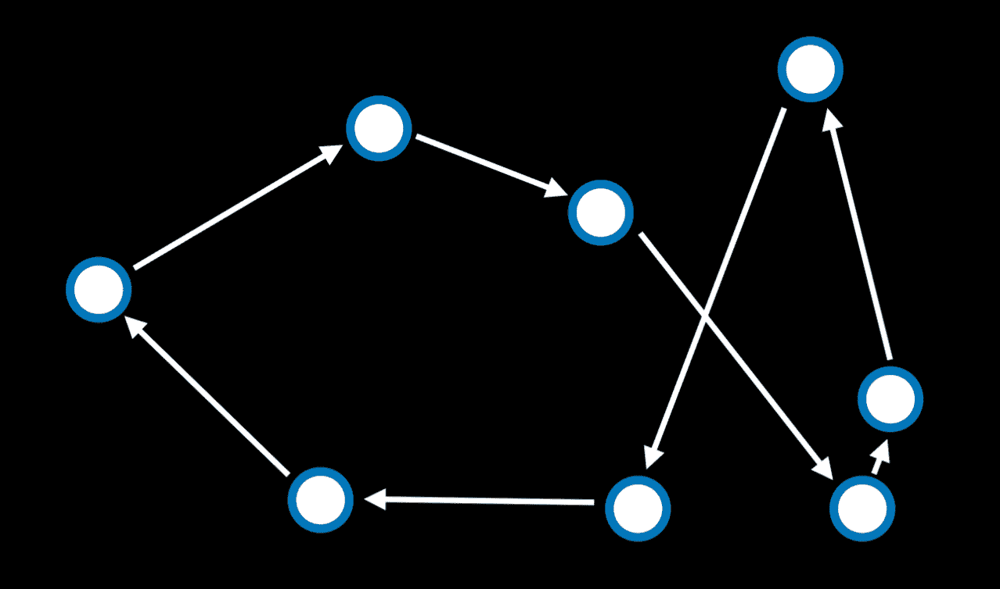

在这种情况下，一个相邻状态可能被视为两个箭头交换位置的状态。计算所有可能的组合使得这个问题计算量很大（仅有 10 个点就给出了 10!，即 3,628,800 条可能的路径）。通过使用模拟退火算法，可以在较低的计算成本下找到良好的解决方案。

## 线性规划

线性规划是一类优化线性方程（形式为 y = ax₁ + bx₂ + …的方程）的问题。

线性规划将包含以下组件：

+   我们想要最小化的成本函数：c₁x₁ + c₂x₂ + … + cₙxₙ。在这里，每个 x₋ 是一个变量，它与一些成本 c₋相关联。

+   一个表示为变量之和的约束，该和要么小于或等于某个值（a₁x₁ + a₂x₂ + … + aₙxₙ ≤ b），要么精确等于这个值（a₁x₁ + a₂x₂ + … + aₙxₙ = b）。在这种情况下，x₋ 是一个变量，a₋ 是与之相关的某种资源，b 是我们可以为这个问题投入的资源量。

+   变量的个体界限（例如，一个变量不能为负）的形式为 lᵢ ≤ xᵢ ≤ uᵢ。

考虑以下示例：

+   两台机器，X₁和 X₂。X₁每小时运行成本为 50 美元，X₂每小时运行成本为 80 美元。目标是最小化成本。这可以形式化为一个成本函数：50x₁ + 80x₂。

+   X₁每小时需要 5 个单位的劳动力。X₂每小时需要 2 个单位的劳动力。总共需要投入 20 个单位的劳动力。这可以形式化为一个约束：5x₁ + 2x₂ ≤ 20。

+   X₁每小时产生 10 个单位的产出。X₂每小时产生 12 个单位的产出。公司需要 90 个单位的产出。这是另一个约束。实际上，它可以重写为 10x₁ + 12x₂ ≥ 90。然而，约束需要是形式（a₁x₁ + a₂x₂ + … + aₙxₙ ≤ b）或（a₁x₁ + a₂x₂ + … + aₙxₙ = b）。因此，我们乘以(-1)以得到一个等效方程，其形式是我们想要的：(-10x₁) + (-12x₂) ≤ -90。

线性规划的优化算法需要我们在几何学和线性代数方面的背景知识，我们不希望假设。相反，我们可以使用已经存在的算法，例如单纯形法和内点法。

以下是一个使用 Python 中的 scipy 库的线性规划示例：

```
import scipy.optimize

# Objective Function: 50x_1 + 80x_2
# Constraint 1: 5x_1 + 2x_2 <= 20
# Constraint 2: -10x_1 + -12x_2 <= -90 
result = scipy.optimize.linprog(
    [50, 80],  # Cost function: 50x_1 + 80x_2
    A_ub=[[5, 2], [-10, -12]],  # Coefficients for inequalities
    b_ub=[20, -90],  # Constraints for inequalities: 20 and -90 )

if result.success:
    print(f"X1: {round(result.x[0], 2)} hours")
    print(f"X2: {round(result.x[1], 2)} hours")
else:
    print("No solution") 
```

## 满足约束

满足约束问题是需要分配变量值以满足某些条件的问题类别。

满足约束问题具有以下属性：

+   变量的集合（x₁, x₂, …, xₙ）

+   每个变量的域集合 {D₁, D₂, …, Dₙ}

+   约束集合 C

数独可以表示为一个满足约束问题，其中每个空格都是一个变量，域是数字 1-9，约束是不能相等的方格。

考虑另一个例子。学生 1-4 每人从 A、B、…、G 中选择三门课程。每门课程都需要进行考试，可能的考试日期是星期一、星期二和星期三。然而，同一位学生不能在同一天参加两次考试。在这种情况下，变量是课程，域是日期，约束是哪些课程不能安排在同一天进行考试，因为同一位学生正在学习它们。这可以表示如下：

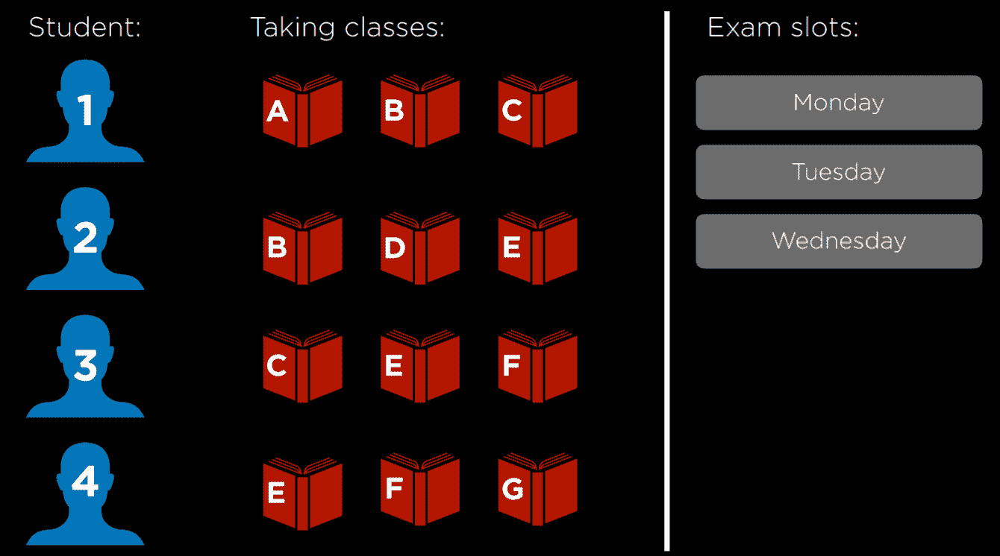

这个问题可以通过表示为图的约束来解决。图上的每个节点代表一门课程，如果两门课程不能在同一天安排，则在这两门课程之间画一条边。在这种情况下，图将看起来像这样：

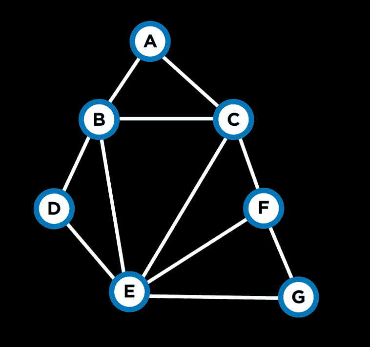

关于约束满足问题，还有一些术语值得了解：

+   **硬约束**是必须在正确解中满足的约束。

+   **软约束**是表达相对于其他解决方案更受偏好的约束。

+   **一元约束**是只涉及一个变量的约束。在我们的例子中，一元约束可能是说课程 A 不能在星期一进行考试（*A ≠ 星期一*）。

+   **二元约束**是涉及两个变量的约束。这是我们上面例子中使用的那种约束，表示某些两门课程不能有相同的值（*A ≠ B*）。

## 节点一致性

节点一致性是指一个变量的域中的所有值都满足该变量的单元约束。

例如，让我们考虑两门课程，A 和 B。每门课程的域是{星期一，星期二，星期三}，约束是{A ≠ Mon，B ≠ Tue，B ≠ Mon，A ≠ B}。现在，A 和 B 都不一致，因为现有的约束阻止它们能够取它们域中的每一个值。然而，如果我们从 A 的域中删除星期一，那么它将具有节点一致性。为了在 B 中实现节点一致性，我们必须从它的域中删除星期一和星期二。

## 弧一致性

弧一致性是指一个变量的域中的所有值都满足该变量的二元约束（注意我们现在使用“弧”来指代我们之前所说的“边”）。换句话说，为了使 X 相对于 Y 弧一致，从 X 的域中删除元素，直到 X 的每个选择都有一个可能的 Y 的选择。

考虑我们之前的例子，其中领域已进行了修改：A:{*周二, 周三*} 和 B:{*周三*}。为了使 A 与 B 弧一致，无论 A 的考试（从其领域）安排在什么日子，B 仍然能够安排考试。A 是否与 B 弧一致？如果 A 取值为周二，那么 B 可以取值为周三。然而，如果 A 取值为周三，那么 B 就没有可以取的值（记住，约束条件之一是 A ≠ B）。因此，A 与 B 不弧一致。为了改变这种情况，我们可以从 A 的领域中删除周三。然后，A 取任何值（周二作为唯一选项）都会为 B 留下一个可以取的值（周三）。现在，A 与 B 弧一致。让我们看看一个伪代码算法，该算法使一个变量相对于另一个变量弧一致（注意，csp 代表“约束满足问题”）。

function Revise(*csp, X, Y*):

+   *revised* = *false*

+   for *x* in *X.domain*:

    +   if no *y* in *Y.domain* satisfies constraint for (*X,Y*):

        +   delete *x* from *X.domain*

        +   *revised* = true

+   return *revised*

此算法从跟踪 X 的领域是否发生了任何更改开始，使用变量 *revised*。这将在我们检查的下一个算法中很有用。然后，代码对 X 的领域中的每个值重复执行，并查看 Y 是否有满足约束的值。如果有，则什么都不做，如果没有，则从 X 的领域中删除此值。

通常，我们感兴趣的是使整个问题弧一致，而不仅仅是相对于另一个变量的一个变量。在这种情况下，我们将使用一个名为 AC-3 的算法，该算法使用 Revise：

function AC-3(*csp*):

+   *queue* = all arcs in *csp*

+   while *queue* non-empty:

    +   (*X, Y*) = Dequeue(*queue*)

    +   if Revise(*csp, X, Y*):

        +   if size of *X*.domain == 0:

            +   return *false*

        +   for each *Z* in *X*.neighbors - {*Y*}:

            +   Enqueue(queue, (*Z,X*))

+   return true

此算法将问题中的所有弧添加到队列中。每次考虑一个弧时，它都会将其从队列中删除。然后，它运行 Revise 算法以查看此弧是否一致。如果进行了更改以使其一致，则需要进一步的操作。如果 X 的领域为空，这意味着此约束满足问题是不可解的（因为 X 没有任何可以取的值，这将允许 Y 在给定约束的情况下取任何值）。如果在之前的步骤中认为问题不可解，那么由于 X 的领域已更改，我们需要查看与 X 相关的所有弧是否仍然一致。也就是说，我们取 X 的所有邻居（除了 Y），并将它们之间的弧添加到队列中。然而，如果 Revise 算法返回 false，意味着领域没有更改，我们只需继续考虑其他弧。

虽然弧一致性算法可以简化问题，但它不一定能解决问题，因为它只考虑二元约束，而不是多个节点可能如何相互连接。我们之前的例子，即每个学生选修 3 门课程，在运行 AC-3 后保持不变。

我们在第一节课中遇到了搜索问题。约束满足问题可以看作是一种搜索问题：

+   初始状态：空赋值（所有变量都没有分配任何值）。

+   操作：将一个 {*variable = value*} 添加到赋值中；即给某个变量赋值。

+   转换模型：显示添加赋值如何改变赋值。这里没有太多深度：转换模型返回最新操作后的包含赋值的状态。

+   目标测试：检查所有变量是否分配了值，以及所有约束是否得到满足。

+   路径成本函数：所有路径都有相同的成本。正如我们之前提到的，与典型的搜索问题不同，优化问题关心的是解决方案，而不是通往解决方案的路线。

然而，将约束满足问题天真地当作常规搜索问题来处理，效率非常低。相反，我们可以利用约束满足问题的结构来更有效地解决问题。

## 回溯搜索

回溯搜索是一种考虑约束满足搜索问题结构的搜索算法。一般来说，它是一个递归函数，尝试在满足约束的情况下继续分配值。如果违反了约束，它将尝试不同的赋值。让我们看看它的伪代码：

函数 Backtrack(*assignment, csp*):

+   如果 *assignment* 完成：

    +   返回 *assignment*

+   *var* = Select-Unassigned-Var(*assignment, csp*)

+   对于 *value* 在 Domain-Values(*var, assignment, csp*) 中：

    +   如果 *value* 与 *assignment* 一致：

        +   将 {*var = value*} 添加到 *assignment*

        +   *result* = Backtrack(*assignment, csp*)

        +   如果 *result* ≠ *failure*：

            +   返回 *result*

        +   从 *assignment* 中 *remove* {*var = value*}

+   返回失败

用话来说，这个算法首先检查当前赋值是否完整。这意味着如果算法完成了，它将不会执行任何额外的操作。相反，它将直接返回完成的赋值。如果赋值不完整，算法将选择任何一个尚未赋值的变量。然后，算法尝试给这个变量赋一个值，并在得到的赋值上再次运行回溯算法（递归）。然后，它检查得到的结果。如果结果不是 *失败*，这意味着赋值成功，应该返回这个赋值。如果结果是 *失败*，那么将移除最新的赋值，并尝试新的可能值，重复相同的过程。如果域中所有可能的值都返回 *失败*，这意味着我们需要回溯。也就是说，问题出在某个前一个赋值上。如果这种情况发生在我们开始的变量上，那么这意味着没有解决方案满足约束。

考虑以下行动方案：

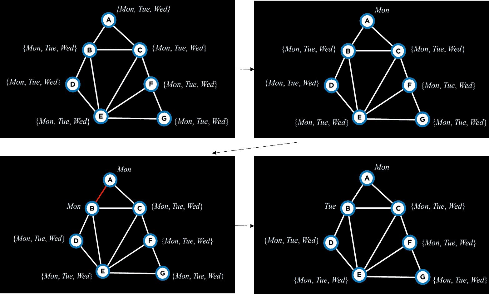

我们从空赋值（左上角）开始。然后，我们选择变量 A，并给它赋一个值，比如周一（右上角）。接着，使用这个赋值，我们再次运行算法。现在 A 已经有了赋值，算法将考虑 B，并将周一赋给它（左下角）。这个赋值返回 false，所以算法不会在给定的前一个赋值的基础上给 C 赋值，而是尝试给 B 赋一个新的值，周二（右下角）。这个新的赋值满足约束条件，因此将根据这个赋值考虑下一个变量。例如，如果给 B 赋周二或周三也会导致失败，那么算法将回溯并回到考虑 A，给它赋另一个值，周二。如果周二和周三都返回 *失败*，那么这意味着我们已经尝试了所有可能的赋值，问题是无解的。

在源代码部分，你可以找到一个从头开始实现的回溯算法。然而，这个算法被广泛使用，因此多个库已经包含了它的实现。

**推理**

`Although backtracking search is more efficient than simple search, it still takes a lot of computational power. Enforcing arc consistency, on the other hand, is less resource intensive. By interleaving backtracking search with inference (enforcing arc consistency), we can get at a more efficient algorithm. This algorithm is called the **Maintaining Arc-Consistency** algorithm. This algorithm will enforce arc-consistency after every new assignment of the backtracking search. Specifically, after we make a new assignment to X, we will call the AC-3 algorithm and start it with a queue of all arcs (*Y,X*) where Y is a neighbor of X (and not a queue of all arcs in the problem). Following is a revised Backtrack algorithm that maintains arc-consistency, with the new additions in **bold**.` 

`function Backtrack(*assignment, csp*):`

+   `if *assignment* complete:` 

    +   `return *assignment*`

+   `*var* = Select-Unassigned-Var(*assignment, csp*)`

+   `for *value* in Domain-Values(*var, assignment, csp*):`

    +   `if *value* consistent with *assignment*:` 

        +   **将** `{*var = value*}` **添加到** `*assignment***`

        +   `***inferences* = Inference(*assignment, csp*)**`

        +   `if *inferences* ≠ *failure*:` 

            +   `add *inferences* to *assignment*`

        +   `*result* = Backtrack(*assignment, csp*)`

        +   `if *result* ≠ *failure*:`

            +   `return *result*`

        +   `*remove* `{*var = value*}` **and *inferences*** from *assignment*`

+   `return failure`

`The Inference function runs the AC-3 algorithm as described. Its output is all the inferences that can be made through enforcing arc-consistency. Literally, these are the new assignments that can be deduced from the previous assignments and the structure of the constrain satisfaction problem.` 

`There are additional ways to make the algorithm more efficient. So far, we selected an unassigned variable randomly. However, some choices are more likely to bring to a solution faster than others. This requires the use of heuristics. A heuristic is a rule of thumb, meaning that, more often than not, it will bring to a better result than following a naive approach, but it is not guaranteed to do so.` 

**最小剩余值 (MRV)** **是** **一种** **这样的启发式方法**。 **这里的想法是**，如果变量的域被推理所限制，并且现在只剩下一个值（或者甚至两个值），那么通过做出这个赋值，我们将减少以后可能需要回溯的次数。 **也就是说**，由于它是由强制弧一致性推断出来的，我们迟早需要做出这个赋值。 **如果这个赋值导致失败**，那么最好尽快发现它，而不是稍后回溯。

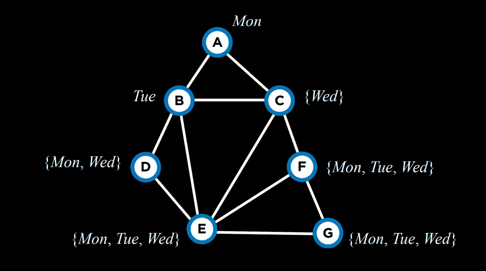

`For example, after having narrowed down the domains of variables given the current assignment, using the MRV heuristic, we will choose variable C next and assign the value Wednesday to it.` 

**度启发式**依赖于变量的度数，其中度数是一个变量与其他变量连接的弧的数量。通过选择具有最高度的变量，通过一次分配，我们可以约束多个其他变量，从而加快算法的进程。

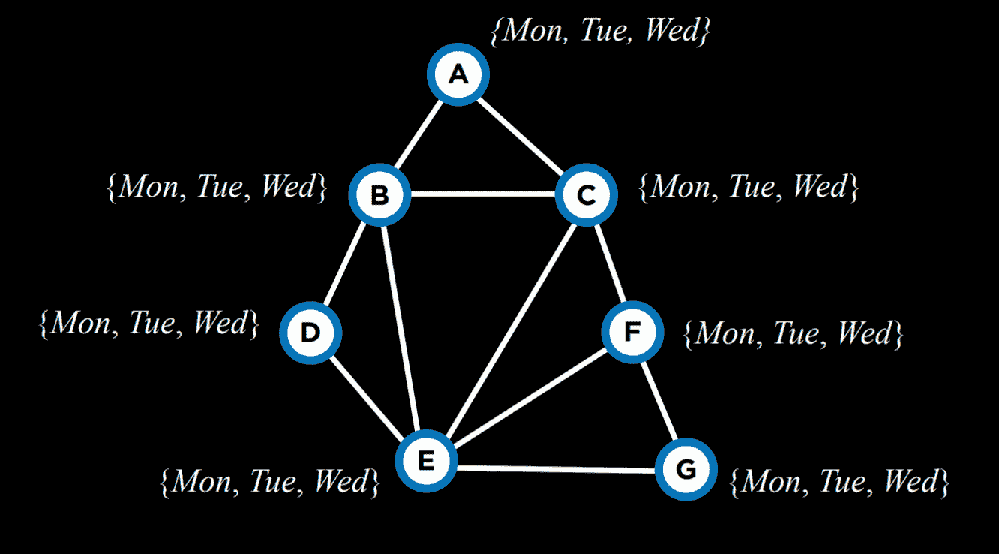

例如，上述所有变量的定义域大小相同。因此，我们应该选择具有最高度的定义域，这将变量 E。

这两种启发式方法并不总是适用。例如，当多个变量的定义域中具有相同的最小值数时，或者当多个变量的度数相同时。

另一种提高算法效率的方法是在从变量的定义域中选择一个值时采用另一种启发式方法。在这里，我们希望使用**最小约束值**启发式，即选择将最少约束其他变量的值。这里的想法是，虽然在我们使用度启发式时，我们希望使用更有可能约束其他变量的变量，但在这里我们希望这个变量对其他变量的约束最少。也就是说，我们希望找到可能成为最大潜在问题来源（度最高的变量），然后将其变得尽可能不麻烦（给它分配最小约束值）。

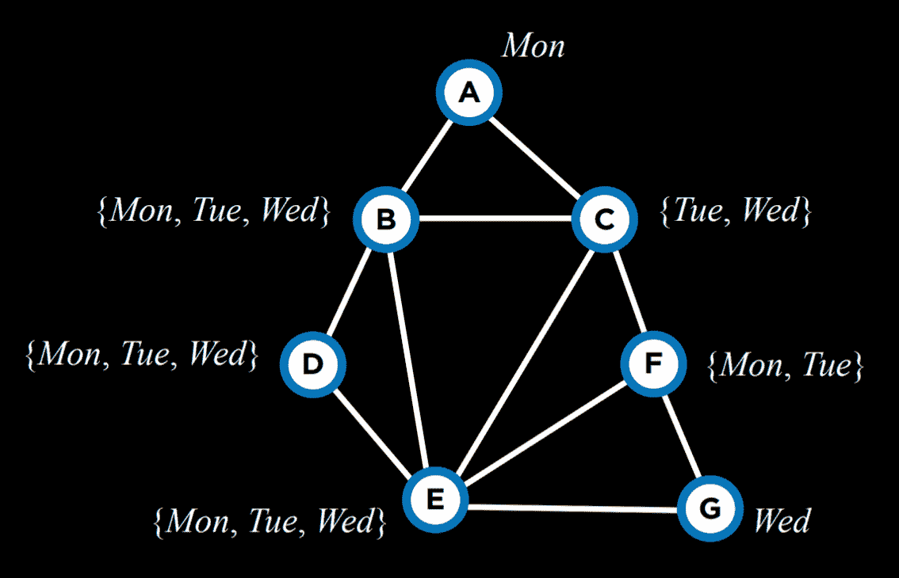

例如，让我们考虑变量 C。如果我们将其分配给星期二，我们将对 B、E 和 F 的所有变量施加约束。然而，如果我们选择星期三，我们只会在 B 和 E 上施加约束。因此，选择星期三可能更好。

总结来说，优化问题可以用多种方式来表述。今天我们考虑了局部搜索、线性规划和约束满足。
