# 第四讲

> 原文：[`cs50.harvard.edu/ai/notes/4/`](https://cs50.harvard.edu/ai/notes/4/)

## 机器学习

机器学习为计算机提供数据，而不是明确的指令。利用这些数据，计算机学会识别模式，并能够自主执行任务。

## 监督学习

监督学习是一个任务，其中计算机根据输入-输出对的训练集学习一个将输入映射到输出的函数。

监督学习下有多个任务，其中之一是**分类**。这是一个将输入映射到离散输出的函数的任务。例如，给定某一天湿度和大气的压力信息（输入），计算机决定那天是否会下雨（输出）。计算机在训练集上完成训练后，该训练集包含多天的湿度和大气的压力信息，并已映射到是否下雨。

这个任务可以形式化为以下内容。我们观察自然界，其中函数 *f(湿度, 压力)* 将输入映射到离散值，要么是雨，要么是无雨。这个函数对我们来说是隐藏的，它可能受到许多其他变量的影响，而我们无法获取这些变量。我们的目标是创建函数 *h(湿度, 压力)*，它可以近似函数 *f* 的行为。这样的任务可以通过在湿度、降雨（输入）维度上绘制天数来可视化，如果那天下雨，则将每个数据点着色为蓝色，如果没有下雨，则着色为红色（输出）。白色数据点只有输入，计算机需要确定输出。

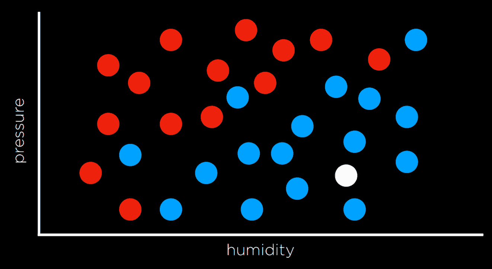

## 最近邻分类

解决上述任务的一种方法是将相关变量分配给最近的观察点的值。例如，图上方的白色点应该着色为蓝色，因为最近的观察点也是蓝色。这可能在某些时候工作得很好，但考虑下面的图。

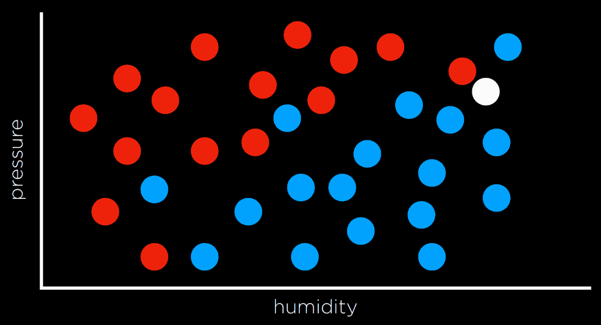

按照同样的策略，白色点应该着色为红色，因为最近的观察点也是红色。然而，从更大的角度来看，它看起来周围的大多数其他观察点都是蓝色，这可能会给我们这样的直觉：在这种情况下，蓝色是一个更好的预测，尽管最近的观察点是红色。

一种克服最近邻分类局限性的方法是通过使用**k-最近邻分类**，其中点根据最近的 *k* 个邻居中最频繁的颜色着色。程序员需要决定 *k* 的值。例如，使用 3-最近邻分类，上面的白色点将被着色为蓝色，这直观上看起来是一个更好的决定。

k 最近邻分类的一个缺点是，使用原始方法，算法将不得不测量每个单独的点与问题点的距离，这在计算上很昂贵。这可以通过使用能够更快找到邻居的数据结构或通过剪枝无关观察结果来加速。

## 感知器学习

与最近邻策略相比，另一种处理分类问题的方式是将数据视为整体，并尝试创建一个决策边界。在二维数据中，我们可以在两种观察结果之间画一条线。每个额外的数据点都将根据其绘制在直线哪一侧进行分类。

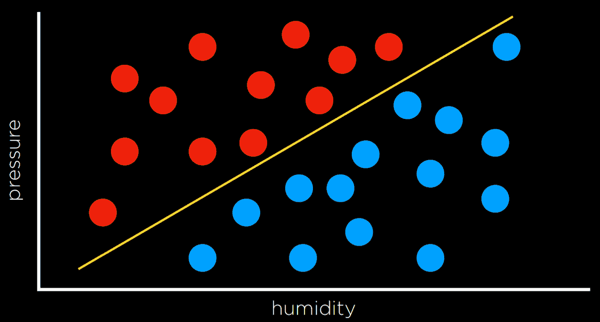

这种方法的缺点是数据很杂乱，很少能画一条线，将类别干净利落地分成两个观察结果而没有错误。通常，我们会妥协，画出的边界大多数情况下能正确地分隔观察结果，但偶尔还是会错误分类。

在这种情况下，输入为

+   *x₁* = 湿度

+   *x₂* = 压力

将被提供给一个假设函数 *h(x₁, x₂)*，该函数将输出它对当天是否会下雨的预测。它将通过检查观察结果落在决策边界的哪一侧来完成。形式上，该函数将每个输入乘以一个常数的和，最终得到以下形式的线性方程：

+   Rain w₀ + w₁x₁ + w₂x₂ ≥ 0

+   无雨否则

通常，输出变量将被编码为 1 和 0，其中如果方程结果大于 0，输出为 1（雨），否则为 0（无雨）。

权重和值由向量表示，这些是数字序列（在 Python 中可以存储在列表或元组中）。我们产生一个权重向量 **w**： (w₀, w₁, w₂)，得到最佳权重向量是机器学习算法的目标。我们还产生一个输入向量 **x**： (1, x₁, x₂)。

我们计算两个向量的点积。也就是说，我们将一个向量中的每个值乘以第二个向量中相应的值，得到上面的表达式：w₀ + w₁x₁ + w₂x₂。输入向量中的第一个值是 1，因为当我们将其与权重向量 w₀ 相乘时，我们希望将其保持为常数。

因此，我们可以用以下方式表示我们的假设函数：

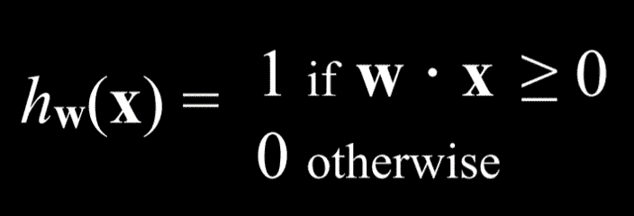

由于算法的目标是找到最佳权重向量，当算法遇到新数据时，它会更新当前权重。它是通过使用 **感知器学习规则** 来做到这一点的：

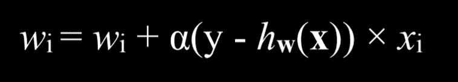

从这条规则中重要的收获是，对于每个数据点，我们调整权重以使我们的函数更准确。细节，虽然对我们论点不是那么关键，是每个权重都被设置为等于它自己加上括号中的某个值。在这里，y 代表观察到的值，而假设函数代表估计。如果它们相同，这个整个项就等于零，因此权重不会改变。如果我们低估了（在观察到雨时称之为“无雨”），那么括号中的值将是 1，权重将增加由 xᵢ缩放的学习系数α的值。如果我们高估了（在观察到无雨时称之为“雨”），那么括号中的值将是-1，权重将减少由 x 缩放的学习系数α的值。α越高，每个新事件对权重的影响就越强。

这个过程的成果是一个阈值函数，一旦估计值超过某个阈值，就会从 0 切换到 1。

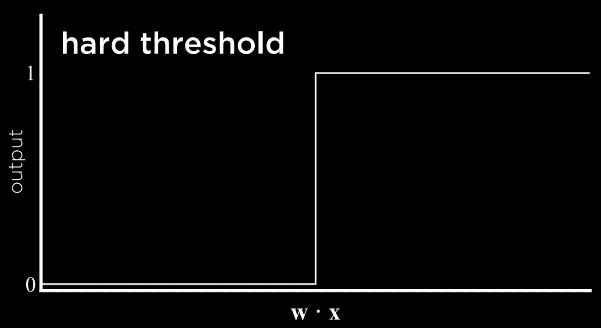

这种类型函数的问题在于它无法表达不确定性，因为它只能等于 0 或 1。它采用**硬阈值**。一种绕过这个问题的方法是使用对数函数，它采用**软阈值**。对数函数可以产生一个介于 0 和 1 之间的实数，这将表达对估计的信心。值越接近 1，下雨的可能性就越大。

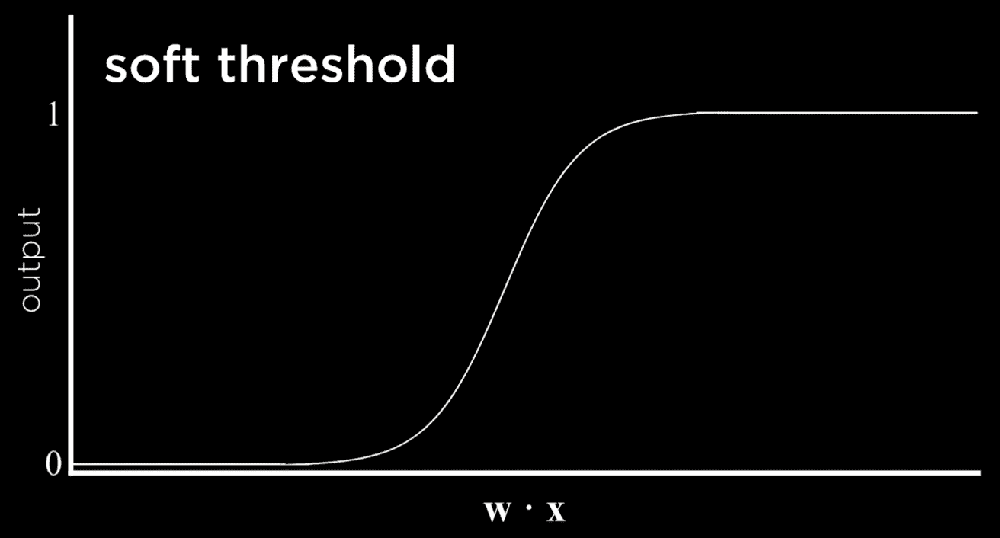

## 支持向量机

除了最近邻和线性回归之外，分类的另一种方法是支持向量机。这种方法使用决策边界附近的一个附加向量（支持向量）来在分离数据时做出最佳决策。考虑下面的例子。

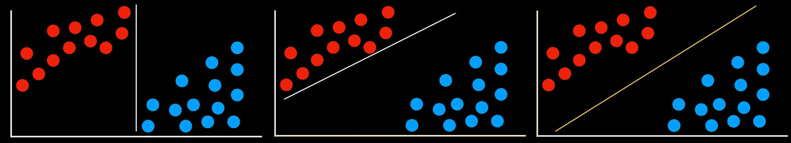

所有的决策边界都在于它们在没有任何错误的情况下分离数据。然而，它们是否同样好？最左边的两个决策边界与一些观察值非常接近。这意味着一个只与一个组略有不同的新数据点可能会被错误地分类为另一组。相反，最右边的决策边界与每个组保持最大的距离，从而为它内部的变异提供了最大的灵活性。这种尽可能远离它所分离的两个组的边界，被称为**最大间隔分离器**。

支持向量机的另一个好处是，它们可以表示超过两个维度的决策边界，以及非线性决策边界，如下所示。

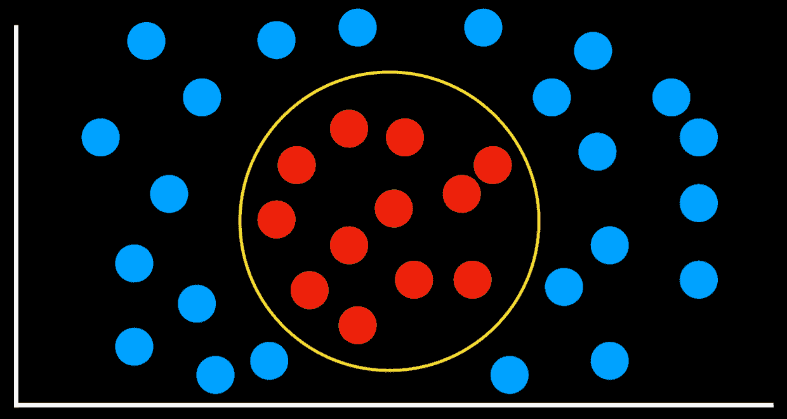

总结来说，处理分类问题有多种方法，没有哪一种方法总是比其他方法更好。每种方法都有其缺点，可能在某些特定情况下比其他方法更有用。

## 回归

回归是一个监督学习任务，它将一个输入点映射到一个连续值，即某个实数。这与分类不同，因为分类问题将输入映射到离散值（例如，雨天或无雨）。

例如，一家公司可能会使用回归来回答广告支出如何预测销售收入的疑问。在这种情况下，一个观测函数 *f(广告)* 代表在广告上花费一些钱之后的观测收入（注意该函数可以接受多个输入变量）。这些是我们开始时的数据。有了这些数据，我们希望提出一个假设函数 *h(广告)*，该函数将尝试近似函数 *f* 的行为。*h* 将生成一条线，其目标不是区分观察类型，而是根据输入预测输出值。

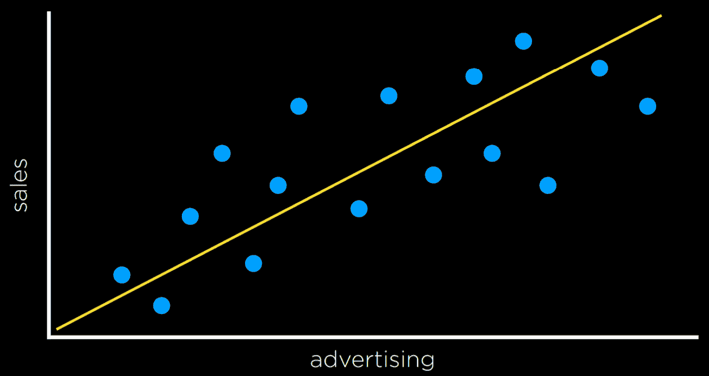

## 损失函数

损失函数是量化上述任何决策规则所损失效用的一种方法。预测越不准确，损失就越大。

对于分类问题，我们可以使用 **0-1 损失函数**。

+   *L*(实际，预测)：

    +   0 如果实际值等于预测值

    +   1 否则

用话来说，这个函数在预测不正确时增加价值，而在预测正确时不增加价值（即当观测值和预测值匹配时）。

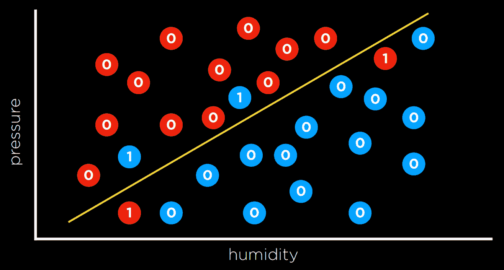

在上面的例子中，值为 0 的天数是我们正确预测天气的日子（雨天在线下方，非雨天在上方线）。然而，线下方没有下雨而上方线下雨的日子是我们未能预测到的。我们给每个这样的日子赋予值为 1，并将它们加起来以得到一个经验估计，即我们的决策边界有多大的损失。

L₁ 和 L₂ 损失函数可以用于预测连续值。在这种情况下，我们感兴趣的是量化每个预测与观测值差异的程度。我们通过取观测值减去预测值的绝对值或平方值（即预测值与观测值之间的距离）来实现这一点。

+   L₁: *L*(实际，预测) = |实际 - 预测|

+   L₂: *L*(实际，预测) = (实际 - 预测)²

可以选择最适合自己目标的损失函数。L₂ 比起 L₁ 更严厉地惩罚异常值，因为它平方了差异。L₁ 可以通过将每个观测点到回归线上的预测点的距离求和来可视化：

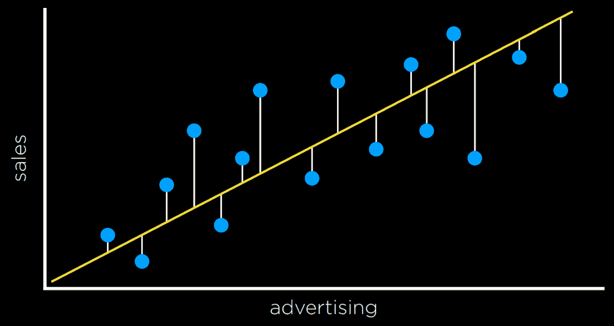

## 过拟合

过拟合是指模型对训练数据拟合得如此之好，以至于它无法泛化到其他数据集。从这个意义上说，损失函数是一把双刃剑。在下面的两个例子中，损失函数被最小化，使得损失等于 0。然而，它不太可能很好地拟合新数据。

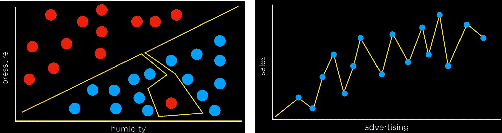

例如，在左边的图中，屏幕底部红色点旁边的点很可能是雨（蓝色）。然而，在过拟合的模型中，它将被分类为无雨（红色）。

## 正则化

正则化是惩罚更复杂假设的过程，以有利于更简单、更一般的假设。我们使用正则化来避免过拟合。

在正则化中，我们通过将假设函数 h 的损失和其复杂度的度量相加来估计 h 的成本。

*成本*(h) = *损失*(h) + λ*复杂度*(h)

Lambda (λ) 是一个常数，我们可以用它来调节我们在成本函数中对复杂性的惩罚强度。λ越高，复杂性的成本就越高。

测试我们是否过拟合了模型的一种方法是用**保留交叉验证**。在这个技术中，我们将所有数据分成两部分：一个**训练集**和一个**测试集**。我们在训练集上运行学习算法，然后看看它预测测试集中数据的准确性。这里的想法是通过在未用于训练的数据上测试，我们可以衡量学习泛化的程度。

保留交叉验证的缺点是我们无法在半数数据上训练模型，因为它被用于评估目的。解决这个问题的方法是用**k-折交叉验证**。在这个过程中，我们将数据分成 k 个集合。我们运行训练 k 次，每次留出一个数据集作为测试集。我们最终得到 k 个不同的模型评估，我们可以对这些评估进行平均，从而得到模型泛化的估计，而不会丢失任何数据。

## scikit-learn

与 Python 一样，有许多库允许我们方便地使用机器学习算法。其中之一是 scikit-learn。

作为例子，我们将使用一个[CSV](https://en.wikipedia.org/wiki/Comma-separated_values)数据集的假币。

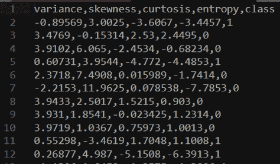

四个左侧列是我们可以用来预测纸币是真还是假的数据，这是由人类提供的外部数据，编码为 0 和 1。现在我们可以在这个数据集上训练我们的模型，看看我们能否预测新纸币是否为真。

```
import csv
import random

from sklearn import svm
from sklearn.linear_model import Perceptron
from sklearn.naive_bayes import GaussianNB
from sklearn.neighbors import KNeighborsClassifier

# model = KNeighborsClassifier(n_neighbors=1)
# model = svm.SVC() model = Perceptron() 
```

注意，在导入库之后，我们可以选择使用哪个模型。其余的代码将保持不变。SVC 代表支持向量分类器（我们称之为支持向量机）。KNeighborsClassifier 使用 k-邻居策略，并需要输入它应该考虑的邻居数量。

```
# Read data in from file with open("banknotes.csv") as f:
    reader = csv.reader(f)
    next(reader)

    data = []
    for row in reader:
        data.append({
            "evidence": [float(cell) for cell in row[:4]],
            "label": "Authentic" if row[4] == "0" else "Counterfeit"
        })

# Separate data into training and testing groups holdout = int(0.40 * len(data))
random.shuffle(data)
testing = data[:holdout]
training = data[holdout:]

# Train model on training set X_training = [row["evidence"] for row in training]
y_training = [row["label"] for row in training]
model.fit(X_training, y_training)

# Make predictions on the testing set X_testing = [row["evidence"] for row in testing]
y_testing = [row["label"] for row in testing]
predictions = model.predict(X_testing)

# Compute how well we performed correct = 0
incorrect = 0
total = 0
for actual, predicted in zip(y_testing, predictions):
    total += 1
    if actual == predicted:
        correct += 1
    else:
        incorrect += 1

# Print results print(f"Results for model {type(model).__name__}")
print(f"Correct: {correct}")
print(f"Incorrect: {incorrect}")
print(f"Accuracy: {100 * correct / total:.2f}%") 
```

此算法的手动版本可以在本讲座的源代码中的 banknotes0.py 文件中找到。由于算法经常以类似的方式使用，scikit-learn 包含了额外的函数，使代码更加简洁且易于使用，这个版本可以在 banknotes1.py 文件中找到。

## 状态集合 ***S***

Q 学习

强化学习

强化学习可以被视为一个马尔可夫决策过程，具有以下特性：

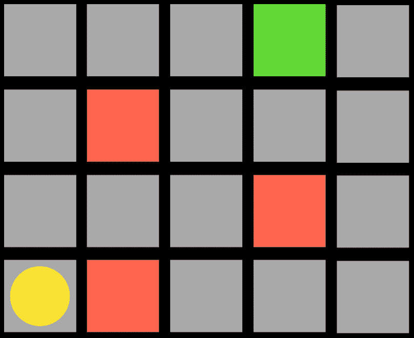

## 动作集合 ***Actions(S)*** 

马尔可夫决策过程

+   这种类型的算法可以用来训练行走机器人，例如，每一步都会返回一个正数（奖励）和每次跌倒都会返回一个负数（惩罚）。

+   奖励函数 ***R(s, a, s’)***

+   转移模型 ***P(s’ | s, a)*** 

+   Q 学习是强化学习的一种模型，其中函数 ***Q(s, a)*** 输出在状态 *s* 采取动作 *a* 的价值估计。

例如，考虑以下任务：

强化学习是机器学习的另一种方法，在每次动作之后，代理都会以奖励或惩罚（正或负的数值）的形式获得反馈。

代理是黄色圆圈，它需要到达绿色方块，同时避开红色方块。任务中的每一个方块都是一个状态。向上、向下或向侧面移动是一个动作。转移模型给出了执行动作后的新状态，奖励函数是代理获得的反馈类型。例如，如果代理选择向右移动，它将踩到红色方块并得到负面反馈。这意味着代理将学会，当处于左下角方块的状态时，应该避免向右移动。这样，代理将开始探索空间，学习哪些状态-动作对应该避免。该算法可以是概率性的，根据奖励的增加或减少，在不同状态下选择不同的动作。当代理到达绿色方块时，它将获得正面奖励，学习到在之前的状态采取的动作是有利的。

## 学习过程从环境向代理提供一个状态开始。然后，代理在状态上执行一个动作。基于这个动作，环境将返回一个状态和一个奖励给代理，其中奖励可以是正的，使行为在未来更有可能发生，或者负的（即惩罚），使行为在未来不太可能发生。

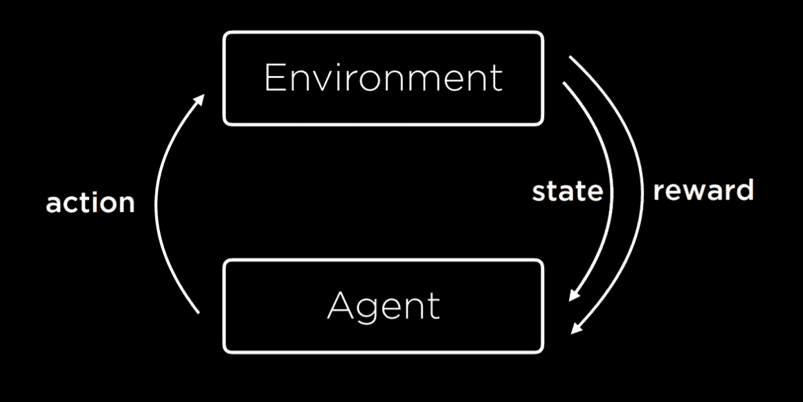

模型开始时所有估计的值都等于 0（对于所有 *s, a*，***Q(s, a)* = 0**）。当采取一个动作并收到奖励时，函数做两件事：1）根据当前奖励和预期未来奖励估计 ***Q(s, a)*** 的值，2）更新 ***Q(s, a)*** 以考虑旧估计和新估计。这给我们提供了一个算法，它能够在不从头开始的情况下改进其过去的知识。

***Q(s, a) ⟵ Q(s, a) + α(新值估计 - Q(s, a))***

更新后的 ***Q(s, a)*** 的值等于 ***Q(s, a)*** 的先前值加上一些更新值。这个值被确定为新值与旧值之间的差异，乘以学习系数 α。当 α = 1 时，新估计简单地覆盖旧值。当 α = 0 时，估计值永远不会更新。通过提高和降低 α，我们可以确定旧知识通过新估计更新的速度。

新的价值估计可以表示为奖励（r）和未来奖励估计的总和。为了得到未来奖励估计，我们考虑在执行最后一个动作后得到的新状态，并加上在这个新状态下执行的动作的估计，该动作将带来最高的奖励。这样，我们不仅通过接收到的奖励来估计在状态 *s* 中执行动作 *a* 的效用，还通过下一步的预期效用来估计。未来奖励估计的值有时会与一个系数伽马（gamma）相关，该系数控制未来奖励的价值。最终我们得到以下方程：

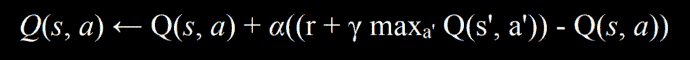

**贪婪决策算法**完全忽略了未来估计的奖励，总是选择当前状态 *s* 中具有最高 ***Q(s, a)*** 的动作 ***a***。

这引出了**探索与利用**的权衡。贪婪算法总是利用，采取已经确立的行动以带来好的结果。然而，它总是遵循相同的路径到解决方案，永远不会找到更好的路径。另一方面，探索意味着算法可能在通往目标的过程中使用之前未探索的路线，从而允许它沿途发现更有效的解决方案。例如，如果你每次都听相同的歌曲，你知道你会喜欢它们，但你永远不会了解你可能更喜欢的新歌曲！

为了实现探索和利用的概念，我们可以使用**ε（epsilon）贪婪算法**。在这种类型的算法中，我们将 ε 设置为我们想要随机移动的频率。以 1-ε 的概率，算法选择最佳移动（利用）。以 ε 的概率，算法选择一个随机移动（探索）。

训练强化学习模型的另一种方法是，不是对每个移动给出反馈，而是在整个过程的结束时给出反馈。例如，考虑一个 Nim 游戏的例子。在这个游戏中，不同数量的物体分布在不同的堆中。每个玩家可以从任何单个堆中取走任意数量的物体，取走最后一个物体的玩家输。在这样的游戏中，未经训练的 AI 会随机地玩，很容易战胜它。为了训练 AI，它将从随机玩游戏开始，并在最后获得 1 分的奖励（胜利）和-1 分的奖励（失败）。例如，当它在 10,000 场比赛中训练后，它已经足够聪明，难以战胜。

当一个游戏有多个状态和可能的行为，例如象棋时，这种方法在计算上变得更加复杂。在所有可能的状态中为每个可能的移动生成一个估计值是不切实际的。在这种情况下，我们可以使用**函数逼近**，这允许我们使用各种其他特征来逼近***Q(s, a)***，而不是为每个状态-动作对存储一个值。因此，算法能够识别出哪些移动足够相似，以至于它们的估计值也应该相似，并在其决策中使用这种启发式方法。

## 无监督学习

在我们之前看到的所有情况下，就像在监督学习中一样，我们都有算法可以从中学习的带标签的数据。例如，当我们训练一个算法来识别假币时，每张纸币都有四个不同值的变量（输入数据）以及它是否是假币（标签）。在无监督学习中，只有输入数据存在，AI 从这些数据中学习模式。

**聚类**

聚类是一种无监督学习任务，它将输入数据组织成组，使得相似的对象最终落在同一个组中。例如，在遗传学研究，当试图找到相似基因时，或者在图像分割中，根据像素之间的相似性定义图像的不同部分时，都可以使用这种方法。

## k-means 聚类

k-means 聚类是一种执行聚类任务的算法。它将空间中的所有数据点映射出来，然后在空间中随机放置 k 个聚类中心（由程序员决定数量；这是我们在左侧看到的起始状态）。每个聚类中心只是空间中的一个点。然后，每个聚类被分配所有比其他中心更接近其中心的点（这是中间的图片）。然后，在迭代过程中，聚类中心移动到所有这些点的中间（右侧的状态），然后点再次重新分配到中心现在最近的聚类。当重复这个过程后，每个点仍然保持在它之前所在的同一个聚类中，我们就达到了平衡，算法结束，我们得到了在聚类之间划分的点。

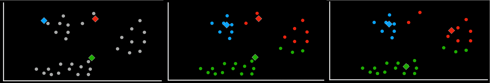
