# 讲座 5

> 原文：[`cs50.harvard.edu/ai/notes/5/`](https://cs50.harvard.edu/ai/notes/5/)

## 神经网络

人工智能神经网络受到神经科学的启发。在大脑中，神经元是相互连接的细胞，形成网络。每个神经元都能够接收和发送电信号。一旦一个神经元接收到的电输入超过某个阈值，该神经元就会被激活，从而发送其电信号。

**人工神经网络**是一种受生物神经网络启发的学习数学模型。人工神经网络通过网络的结构和参数来模拟将输入映射到输出的数学函数。在人工神经网络中，网络的结构是通过在数据上训练来塑造的。

当在人工智能中实现时，每个神经元的并行单元是连接到其他单元的**单元**。例如，就像在上一次讲座中提到的，人工智能可能会将两个输入 x₁ 和 x₂ 映射到今天是否会下雨。在上一次讲座中，我们提出了以下假设函数的形式：*h(x₁, x₂)* = *w₀ + w₁x₁ + w₂x₂*，其中 *w₁* 和 *w₂* 是修改输入的权重，*w₀* 是一个常数，也称为**偏差**，用于修改整个表达式的值。

## 激活函数

要使用假设函数来决定是否下雨，我们需要根据其产生的值创建某种类型的阈值。

实现这一点的其中一种方式是使用阶跃函数，它在达到某个阈值之前输出 0，在达到阈值之后输出 1。

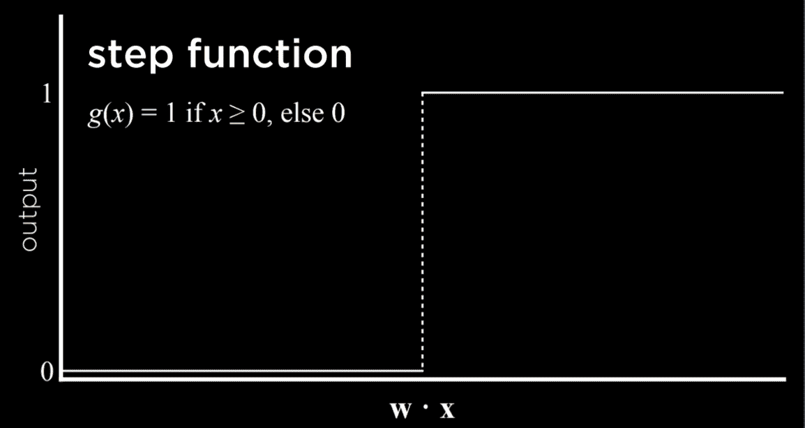

另一种方法是使用对数函数，它输出从 0 到 1 的任何实数，从而表达其判断的分级信心。

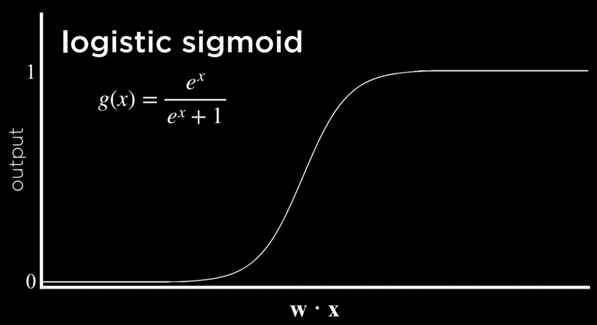

另一种可能的函数是修正线性单元（ReLU），它允许输出为任何正数值。如果值为负，ReLU 将其设置为 0。

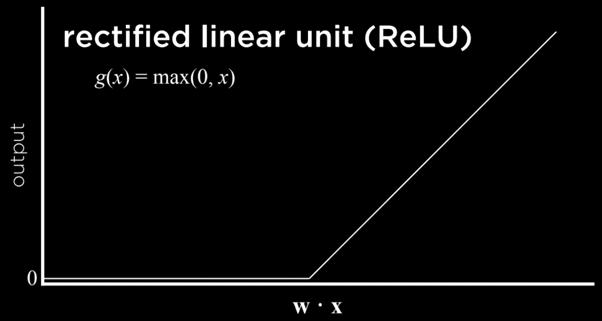

无论我们选择使用哪个函数，我们在上一次讲座中学到的是，输入除了偏差外还会通过权重进行修改，这些修改的总和传递给激活函数。这对于简单的神经网络来说也是成立的。

## 神经网络结构

可以将神经网络视为上述想法的一种表示，其中函数将输入求和以产生输出。

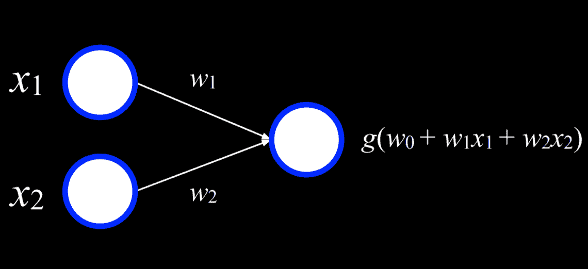

左侧的两个白色单元是输入单元，右侧的单元是输出单元。输入单元通过加权边连接到输出单元。为了做出决定，输出单元将输入乘以其权重（除了偏差 *w₀*）并使用函数 *g* 来确定输出。

例如，一个或逻辑连接可以表示为一个具有以下真值表的函数 *f*：

| *x* | *y* | *f(x, y)* |
| --- | --- | --- |
| 0 | 0 | 0 |
| 0 | 1 | 1 |
| 1 | 0 | 1 |
| 1 | 1 | 1 |

我们可以将这个函数可视化为一个神经网络。*x₁* 是一个输入单元，*x₂* 是另一个输入单元。它们通过一个权重为 1 的边连接到输出单元。输出单元然后使用函数 *g(-1 + 1x₁ + 2x₂)* 并以 0 为阈值来输出 0 或 1（假或真）。

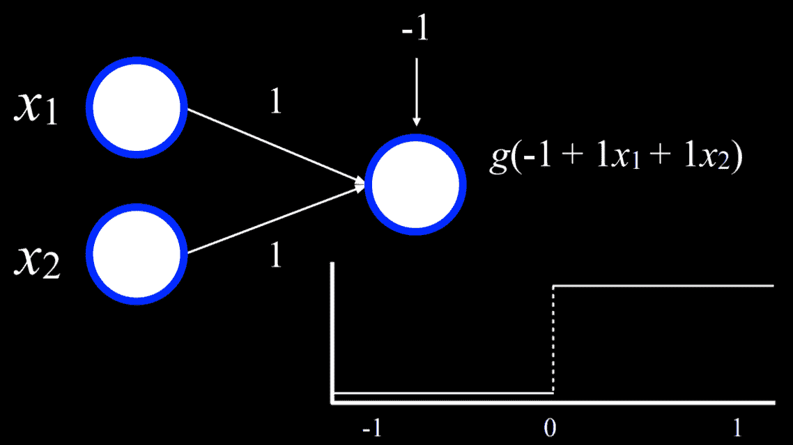

例如，在 *x₁* = *x₂* = 0 的情况下，总和是 (-1)。这低于阈值，所以函数 *g* 将输出 0。然而，如果 *x₁* 或 *x₂* 中的任何一个或两个等于 1，那么所有输入的总和将是 0 或 1。两者都在或高于阈值，所以函数将输出 1。

可以用类似的过程重复使用与函数（其中偏差将是(-2)）。此外，输入和输出不必是不同的。可以使用类似的过程将湿度和气压作为输入，并输出降雨的概率。或者，在另一个例子中，输入可以是广告支出和支出的月份，以获得销售预期收入的输出。这可以通过将每个输入 *x₁ … xₙ* 乘以权重 *w₁ … wₙ*，求和得到的值，并添加偏差 *w₀* 来扩展到任意数量的输入。

## 梯度下降

梯度下降是一种在训练神经网络时最小化损失的计算算法。正如之前提到的，神经网络能够从数据中推断出关于自身结构的知识。而到目前为止，我们定义了不同的权重，神经网络允许我们根据训练数据来计算这些权重。为此，我们使用梯度下降算法，其工作原理如下：

+   从一个随机的权重选择开始。这是我们天真的起点，我们不知道应该给每个输入多少权重。

+   重复：

    +   根据所有会导致损失减少的数据点计算梯度。最终，梯度是一个向量（一系列数字）。

    +   根据梯度更新权重。

这种算法的问题在于它需要根据 *所有数据点* 计算梯度，这在计算上代价高昂。有多种方法可以最小化这种成本。例如，在 **随机梯度下降** 中，梯度是基于随机选择的一个点计算的。这种梯度可能相当不准确，导致 **小批量梯度下降** 算法，它基于随机选择的几个点计算梯度，从而在计算成本和准确性之间找到一个折衷。正如通常情况下，没有哪种解决方案是完美的，不同的解决方案可能在不同的情境中被采用。

使用梯度下降，可以找到许多问题的答案。例如，我们可能想知道的不仅仅是“今天会下雨吗？”我们可以使用一些输入来生成不同天气类型的概率，然后只需选择最可能的天气。

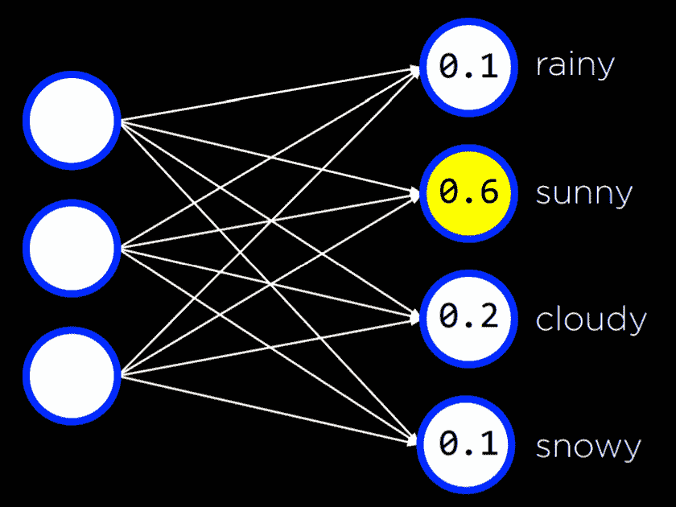

这可以用于任意数量的输入和输出，其中每个输入都连接到每个输出，并且输出代表我们可以做出的决策。请注意，在这种类型的神经网络中，输出之间没有连接。这意味着每个输出及其从所有输入关联的权重可以被视为一个独立的神经网络，因此可以单独从其他输出中训练。

到目前为止，我们的神经网络依赖于**感知器**输出单元。这些单元只能学习线性决策边界，使用直线来分离数据。也就是说，基于线性方程，感知器可以将输入分类为一种类型或另一种类型（例如，左图）。然而，数据往往不是线性可分的（例如，右图）。在这种情况下，我们转向多层神经网络来非线性地建模数据。

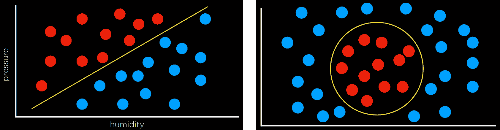

## 多层神经网络

多层神经网络是一种具有输入层、输出层和至少一个**隐藏**层的人工神经网络。虽然我们提供输入和输出以训练模型，但我们人类不向隐藏层中的单元提供任何值。第一隐藏层中的每个单元从输入层中的每个单元接收加权值，对其进行一些操作并输出一个值。这些值被加权并进一步传播到下一层，重复此过程直到达到输出层。通过隐藏层，可以建模非线性数据。

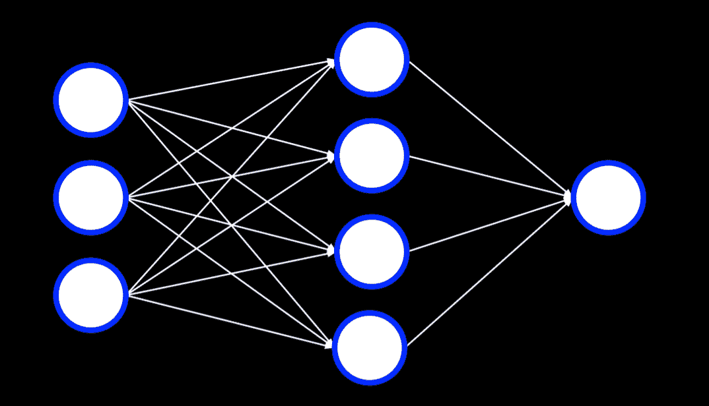

## 反向传播

反向传播是用于训练具有隐藏层的神经网络的主要算法。它通过从输出单元的误差开始，计算前一层权重的梯度下降，并重复此过程直到达到输入层来实现。在伪代码中，我们可以将算法描述如下：

+   计算输出层的误差

+   对于每一层，从输出层开始，向内移动到最早的隐藏层：

    +   将误差反向传播一层。换句话说，当前正在考虑的层将误差发送到前一层。

    +   更新权重。

这可以扩展到任意数量的隐藏层，创建**深度神经网络**，这些神经网络具有多个隐藏层。

## 过度拟合

过拟合是指对训练数据建模过于紧密，因此无法推广到新数据的风险。对抗过拟合的一种方法是通过**dropout**。在这种技术中，我们在学习阶段随机选择并暂时移除一些单元。这样，我们试图防止网络对任何单个单元过度依赖。在整个训练过程中，神经网络将采取不同的形式，每次丢弃一些单元然后再使用它们：

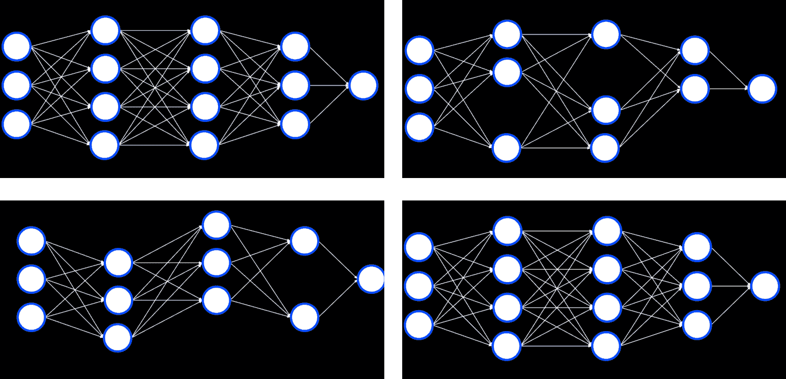

注意，训练完成后，整个神经网络将再次使用。

## TensorFlow

就像在 Python 中经常发生的那样，多个库已经实现了使用反向传播算法的神经网络，TensorFlow 就是这样的库之一。您可以在这个 [web 应用程序](http://playground.tensorflow.org/) 中尝试 TensorFlow 神经网络，它允许您定义网络的不同属性并运行它，可视化输出。现在，我们将转向一个例子，说明我们如何使用 TensorFlow 来执行上次讲座中讨论的任务：区分假币和真币。

[PRE0]

我们导入 TensorFlow 并将其命名为 tf（以缩短代码）。

[PRE1]

我们将 CSV 数据提供给模型。我们的工作通常需要使数据符合库所需的格式。实际上编码模型的困难部分已经为我们实现了。

[PRE2]

Keras 是一个 API，不同的机器学习算法可以通过它访问。一个顺序模型是指层依次排列（就像我们之前看到的那样）。

[PRE3]

密集层是指当前层中的每个节点都连接到前一层的所有节点。在生成我们的隐藏层时，我们创建了 8 个密集层，每个层有 4 个输入神经元，使用上面提到的 ReLU 激活函数。

[PRE4]

在我们的输出层，我们希望创建一个使用 sigmoid 激活函数的密集层，这种激活函数的输出值介于 0 和 1 之间。

[PRE5]

最后，我们编译模型，指定哪个算法应该优化它，我们使用哪种类型的损失函数，以及我们如何衡量其成功（在我们的情况下，我们关注输出的准确性）。最后，我们使用 20 次重复（周期）将模型拟合到训练数据，然后在测试数据上评估它。

## 计算机视觉

计算机视觉包括分析和理解数字图像的不同计算方法，通常使用神经网络实现。例如，当社交媒体使用面部识别自动标记图片中的人时，就会用到计算机视觉。其他例子包括手写识别和自动驾驶汽车。

图像由像素组成，像素由三个范围从 0 到 255 的值表示，一个用于红色，一个用于绿色，一个用于蓝色。这些值通常用缩写 RGB 来表示。我们可以使用这一点来创建一个神经网络，其中每个像素中的颜色值都是一个输入，我们有一些隐藏层，输出是一些单位数，告诉我们图像中展示了什么。然而，这种方法有几个缺点。首先，通过将图像分解成像素及其颜色值，我们无法使用图像的结构作为辅助。也就是说，作为人类，如果我们看到脸部的一部分，我们知道应该期待看到脸的其余部分，这可以加快计算。我们希望能够在我们的神经网络中利用类似的优势。其次，输入的数量非常大，这意味着我们不得不计算很多权重。

## 图像卷积

图像卷积是将一个滤波器应用于图像的每个像素值，将其与邻居的像素值相加，并根据内核矩阵进行加权。这样做会改变图像，并有助于神经网络处理它。

让我们考虑以下示例：

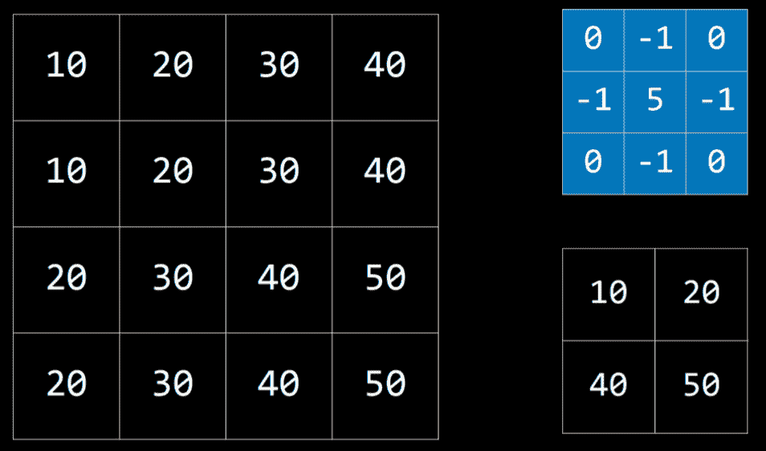

内核是蓝色的矩阵，图像是左侧的大矩阵。生成的过滤图像是右下角的小矩阵。要使用内核过滤图像，我们从图像左上角的值为 20 的像素（坐标 1,1）开始。然后，我们将它周围的所有值乘以内核中的相应值并将它们相加（10*0 + 20*(-1) + 30*0 + 10*(-1) + 20*5 + 30*(-1) + 20*0 + 30*(-1) + 40*0），得到值 10。然后我们将对右侧的像素（30）、第一个像素下面的像素（30）以及这个像素右侧的像素（40）做同样的处理。这产生了一个具有我们在右下角看到的值的过滤图像。

不同的内核可以完成不同的任务。对于边缘检测，以下内核经常被使用：

这里的想法是，当像素与其所有邻居相似时，它们应该相互抵消，得到值为 0。因此，像素越相似，图像的部分就越暗，它们越不同，就越亮。将此内核应用于图像（左侧）会产生具有明显边缘的图像（右侧）：

让我们考虑图像卷积的一个实现。我们使用的是 PIL 库（代表 Python Imaging Library），它可以为我们完成大部分繁重的工作。

[PRE6]

尽管如此，由于作为神经网络输入的像素数量众多，处理图像在神经网络中是计算密集型的。另一种方法是**池化**，通过从输入区域中采样来减少输入的尺寸。相邻的像素属于图像中的同一区域，这意味着它们很可能是相似的。因此，我们可以用一个像素来代表整个区域。一种实现方式是**最大池化**，其中选定的像素是该区域内所有其他像素中值最高的一个。例如，如果我们把下面的左方形（下方）分成四个 2X2 的小方形，通过从这个输入进行最大池化，我们得到右边的那个小方形。

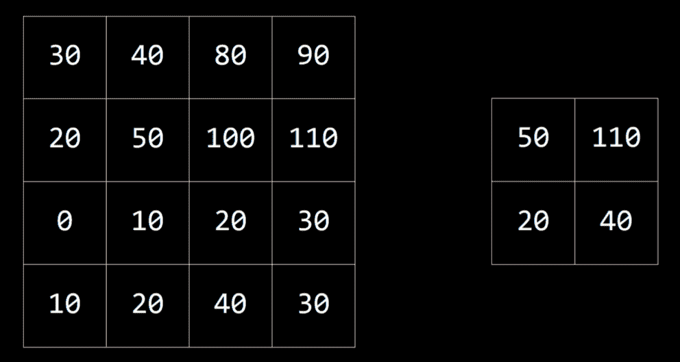

## 卷积神经网络

卷积神经网络是一种使用卷积的神经网络，通常用于分析图像。它首先应用过滤器，使用不同的核来帮助提取图像的一些特征。这些过滤器可以通过调整它们的核来改进，就像神经网络中的其他权重一样，基于输出的错误进行调整。然后，得到的图像被池化，之后像素被作为输入（称为**展平**）馈送到传统的神经网络。

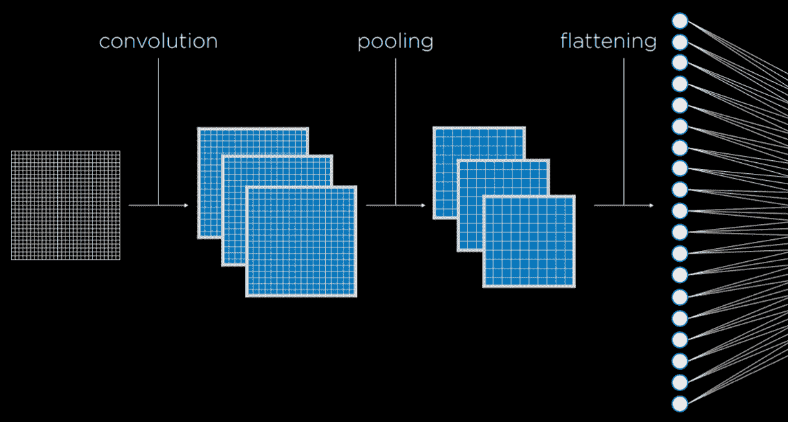

卷积和池化步骤可以重复多次，以提取额外的特征并减少输入到神经网络的尺寸。这些过程的一个好处是，通过卷积和池化，神经网络对变化的敏感性降低。也就是说，如果从略微不同的角度拍摄相同的图片，卷积神经网络的输入将相似，而如果没有卷积和池化，每张图片的输入将大相径庭。

在代码中，卷积神经网络与传统神经网络差别不大。TensorFlow 提供了测试我们模型的数据库。我们将使用 MNIST，它包含黑白手写数字的图片。我们将训练我们的卷积神经网络来识别数字。

[PRE7]

由于模型需要时间来训练，我们可以保存已经训练好的模型以供以后使用。

[PRE8]

现在，如果我们运行一个接收手绘数字作为输入的程序，它将能够使用该模型对数字进行分类并输出结果。有关此类程序的实现，请参阅本讲座源代码中的 recognition.py。

## 循环神经网络

**前馈神经网络**是我们迄今为止讨论过的神经网络类型，其中输入数据被提供给网络，最终产生一些输出。下面可以看到前馈神经网络的工作原理图。

与此相反，**循环神经网络**由一个非线性结构组成，其中网络使用其自身的输出作为输入。例如，微软的[captionbot](https://www.captionbot.ai)能够用句子中的词语描述图像的内容。这与分类不同，因为输出可以根据图像的特性具有不同的长度。虽然前馈神经网络无法改变输出的数量，但循环神经网络由于其结构，能够做到这一点。在字幕任务中，网络会处理输入以产生输出，然后从这个点继续处理，产生另一个输出，并重复必要的次数。

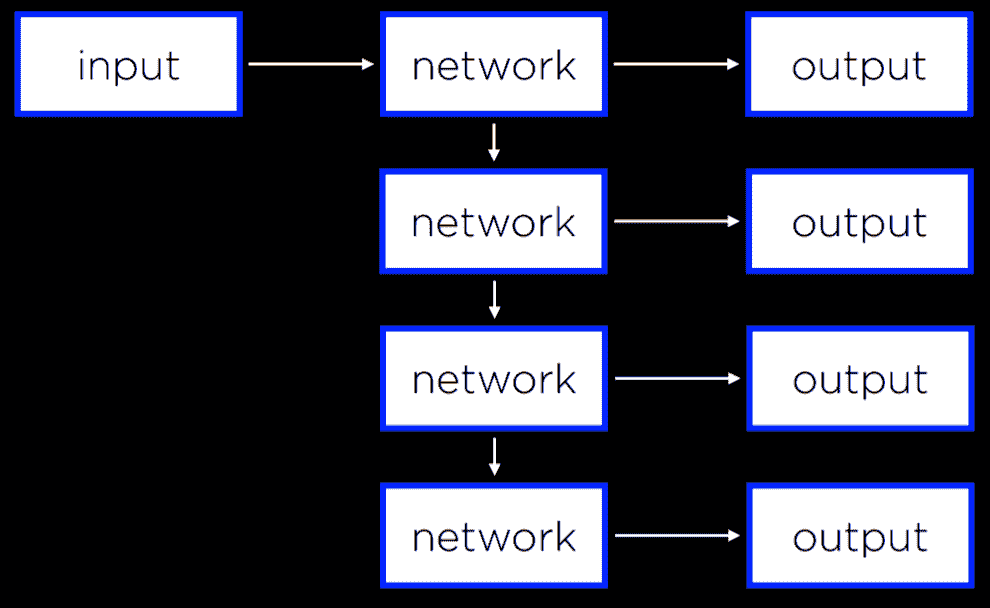

循环神经网络在处理序列而不是单个对象的情况下非常有用。上面提到的神经网络需要生成一系列词语。然而，同样的原理也可以应用于分析视频文件，这些文件由一系列图像组成，或者在翻译任务中，处理一系列输入（源语言中的词语）以产生一系列输出（目标语言中的词语）。
