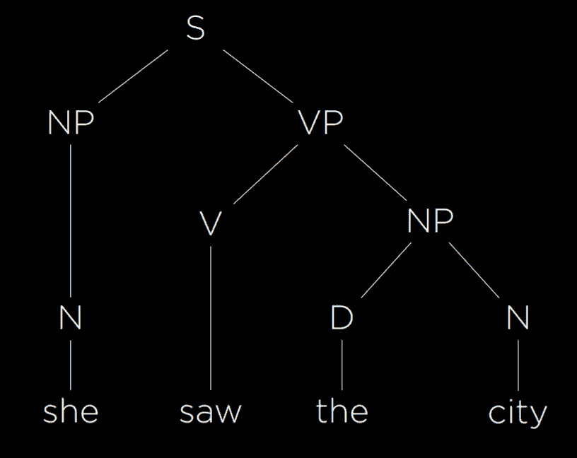
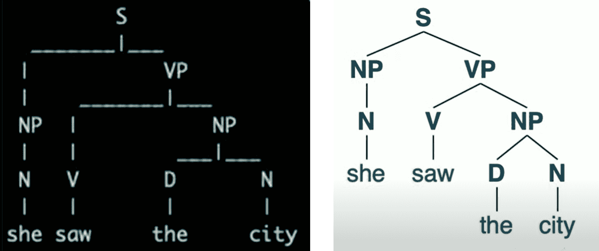
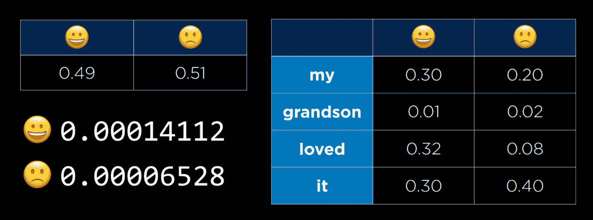
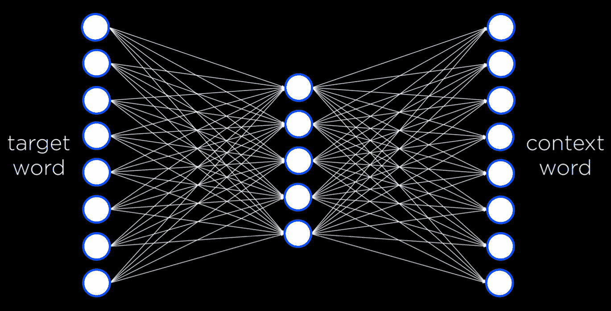

# 第 6 讲

> 原文：[`cs50.harvard.edu/ai/notes/6/`](https://cs50.harvard.edu/ai/notes/6/)

这些笔记反映了 2023 年 8 月 14 日发布的第 6 讲的新版本。如果您观看了之前的版本，并希望查看其笔记，请点击此处。

## 语言

到目前为止，在课程中，我们需要塑造任务和数据，以便 AI 能够处理它们。今天，我们将探讨如何构建 AI 以处理人类语言。

**自然语言处理**涵盖了所有 AI 获取人类语言作为输入的任务。以下是一些此类任务的例子：

+   自动摘要，其中 AI 被给出文本作为输入，并产生文本的摘要作为输出。

+   信息提取，其中 AI 被给出文本语料库，并从中提取数据作为输出。

+   语言识别，其中 AI 被给出文本并返回文本的语言作为输出。

+   机器翻译，其中 AI 被给出原始语言的文本，并输出目标语言的翻译。

+   命名实体识别，其中 AI 被给出文本，并从中提取文本中的实体名称（例如，公司名称）。

+   语音识别，其中 AI 被给出语音，并产生相同的文本。

+   文本分类，其中 AI 被给出文本，并需要将其分类为某种类型的文本。

+   词义消歧，其中 AI 需要选择具有多个意义的单词的正确含义（例如，银行既指金融机构也指河流的河岸）。

## 语法和语义

**语法**是句子结构。作为某些人类语言的母语者，我们不会在产生语法正确的句子和标记非语法正确的句子为错误时感到困难。例如，句子“在九点之前，福尔摩斯敏捷地走进了房间”是语法正确的，而句子“在福尔摩斯九点之前敏捷地走进了房间”则是非语法正确的。语法可以同时是语法正确的和模糊的，例如，“我看到了拿着望远镜的男人。”我是看到了（拿着望远镜的男人）还是我看到了（男人），通过望远镜看到了？为了能够解析人类语言并产生它，AI 需要掌握语法。

**语义**是单词或句子的意义。虽然句子“在九点之前，福尔摩斯敏捷地走进了房间”在语法上与“福尔摩斯敏捷地走进了房间，就在九点之前”不同，但它们的内容实际上是相同的。同样，尽管句子“A few minutes before nine, Sherlock Holmes walked quickly into the room”使用了与前句不同的单词，但它仍然传达了非常相似的意义。此外，一个句子可以完全语法正确，但完全无意义，如乔姆斯基的例子，“无色的绿色想法疯狂地睡觉。”为了能够解析人类语言并产生它，AI 需要掌握语义。

## 上下文无关语法

**形式语法**是一种用于生成语言中句子的规则系统。在**上下文无关语法**中，文本从其意义中抽象出来，使用形式语法来表示句子的结构。让我们考虑以下示例句子：

+   她看到了这个城市。

这是一个简单的语法句子，我们希望生成一个表示其结构的语法树。

我们首先为每个单词分配其词性。*她*和*城市*是名词，我们将它们标记为 N。*看到*是动词，我们将它标记为 V。*这个*是限定词，标记后面的名词是确定的还是不确定的，我们将它标记为 D。现在，上述句子可以重写为

+   N V D N

到目前为止，我们已经将每个单词从其语义意义抽象到其词性。然而，句子中的单词相互连接，要理解句子，我们必须了解它们是如何连接的。名词短语（NP）是一组与名词连接的单词。例如，单词*她*是这个句子中的名词短语。此外，单词*这个城市*也形成一个名词短语，由一个限定词和一个名词组成。动词短语（VP）是一组与动词连接的单词。单词*看到*本身就是一个动词短语。然而，单词*看到这个城市*也构成一个动词短语。在这种情况下，它是一个由动词和名词短语组成的动词短语，而名词短语又由一个限定词和一个名词组成。最后，整个句子（S）可以表示如下：

使用形式语法，人工智能能够表示句子的结构。在我们描述的语法中，有足够的规则来表示上述简单句子。要表示更复杂的句子，我们不得不向我们的形式语法中添加更多规则。

## nltk

在 Python 中，通常会有多个库被编写来实现上述想法。nltk（自然语言工具包）就是这样一个库。为了分析上述句子，我们将为语法提供算法规则：

[PRE0]

与我们上面所做的一样，我们定义了可能包含在其他中的可能组件。一个句子可以包含一个名词短语和一个动词短语，而短语本身可以由其他短语、名词、动词等组成，最终，每个词性在语言中跨越一些单词。

[PRE1]

在向算法提供一个输入句子并将其拆分为单词列表后，函数将打印出结果语法树（pretty_print）并生成图形表示（draw）。

## *n*-grams

*n*-元组是从文本样本中提取的*n*个项目的序列。在**字符*n*-元组**中，项目是字符，而在**单词*n*-元组**中，项目是单词。*单元组*、*二元组*和*三元组*分别是一、两个和三个项目的序列。在以下句子中，前三个*n*-元组是“how often have”、“often have I”和“have I said”。

“我曾经说过多少次，当你排除了不可能的，无论多么不可能，剩下的就一定是真相？”

*n*-元组在文本处理中很有用。尽管 AI 之前不一定看到过整个句子，但它肯定看到过句子的一部分，比如“我曾经说过。”由于一些词比其他词更经常一起出现，因此也有可能用一定的概率预测下一个词。例如，你的智能手机根据你输入的最后几个词的概率分布来为你建议单词。因此，自然语言处理中的一个有用步骤是将句子分解成 n 元组。

## 分词

分词是将字符序列分割成片段（标记）的任务。标记可以是单词，也可以是句子，在这种情况下，该任务被称为**单词分词**或**句子分词**。我们需要分词来查看*n*-元组，因为它们依赖于标记的序列。我们首先根据空格字符将文本分割成单词。虽然这是一个好的开始，但这种方法并不完美，因为我们最终会得到带有标点的单词，例如“remains”。因此，例如，我们可以移除标点。然而，然后我们会面临额外的挑战，例如带有撇号的单词（例如“o'clock”）和带有连字符的单词（例如“pearl-grey”）。此外，一些标点对于句子结构很重要，比如句号。然而，我们需要能够区分单词“Mr.”结尾的句号和句子结尾的句号。处理这些问题是分词的过程。最后，一旦我们有了标记，我们就可以开始查看*n*-元组。

## 马尔可夫模型

如前几节课所讨论的，马尔可夫模型由节点组成，每个节点的值基于有限数量的前一个节点具有概率分布。马尔可夫模型可以用来生成文本。为此，我们在文本上训练模型，然后根据前 n 个词为每个 n-gram 的每个*n*-th 标记建立概率。例如，使用三元组，在马尔可夫模型有两个词之后，它可以从基于前两个词的概率分布中选择第三个词。然后，它可以从基于第二个和第三个词的概率分布中选择第四个词。要查看使用 nltk 实现此类模型的示例，请参阅源代码中的 generator.py，其中我们的模型学习生成莎士比亚风格的句子。最终，使用马尔可夫模型，我们能够生成通常语法正确且表面上听起来与人类语言输出相似的文本。然而，这些句子缺乏实际的意义和目的。

## 词袋模型

词袋模型是一种将文本表示为无序单词集合的模型。该模型忽略了语法，只考虑句子中单词的意义。这种方法在某些分类任务中很有帮助，例如情感分析（另一个分类任务可能是区分常规电子邮件和垃圾邮件）。情感分析可以用于产品评论，将评论分类为正面或负面。考虑以下句子：

1.  “我的孙子很喜欢它！太有趣了！”

1.  “产品几天后就坏了。”

1.  “这是我很久以来玩过的最好的游戏之一。”

1.  “有点便宜且脆弱，不值得。”

仅基于每个句子中的单词，忽略语法，我们可以看到句子 1 和 3 是积极的（“loved”，“fun”，“best”），而句子 2 和 4 是消极的（“broke”，“cheap”，“flimsy”）。

## 简单贝叶斯

简单贝叶斯是一种可以与词袋模型一起用于情感分析的技术。在情感分析中，我们问“给定句子中的单词，句子是积极的/消极的概率是多少。”回答这个问题需要计算条件概率，回忆第二部分课中的贝叶斯定理会有所帮助：

现在，我们想使用这个公式来找到 P(sentiment | text)，例如，P(positive | “my grandson loved it”)。我们首先对输入进行标记化，这样我们最终得到 P(positive | “my”, “grandson”, “loved”, “it”)。直接应用贝叶斯定理，我们得到以下表达式：P(“my”, “grandson”, “loved”, “it” | positive)*P(positive)/P(“my”, “grandson”, “loved”, “it”)。这个复杂表达式将给我们 P(positive | “my”, “grandson”, “loved”, “it”)的精确答案。

然而，如果我们愿意得到一个不等于 P(positive | “my”, “grandson”, “loved”, “it”)，但与其成比例的答案，我们就可以简化这个表达式。稍后，我们知道概率分布需要加起来等于 1，我们可以将得到的结果值归一化成一个确切的概率。这意味着我们可以将上面的表达式简化为仅包含分子：P(“my”, “grandson”, “loved”, “it” | positive)*P(positive)。再次，我们可以根据已知条件概率*a*给定*b*与*a*和*b*的联合概率成比例的知识来简化这个表达式。因此，我们得到以下概率表达式：P(positive, “my”, “grandson”, “loved”, “it”)*P(positive)。然而，计算这个联合概率是复杂的，因为每个词的概率都是基于它前面词的概率。这需要我们计算 P(positive)*P(“my” | positive)*P(“grandson” | positive, “my”)*P(loved | positive, “my”, “grandson”)*P(“it” | positive, “my”, “grandson”, “loved”)。

正是在这里，我们天真地使用了贝叶斯定理：我们假设每个词的概率与其他词是独立的。这并不正确，但尽管这种不精确，朴素贝叶斯仍然能产生一个好的情感估计。使用这个假设，我们最终得到以下概率：P(positive)*P(“my” | positive)*P(“grandson” | positive)*P(“loved” | positive)*P(“it” | positive)，这并不难计算。P(positive) = 所有正样本的数量除以总样本的数量。P(“loved” | positive)等于包含单词“loved”的正样本数量除以正样本的数量。让我们考虑以下例子，其中微笑和皱眉表情符号代替了单词“positive”和“negative”：

在右侧，我们看到一个表格，其中包含左侧每个词在句子中出现的条件概率，前提是句子是积极的或消极的。在左侧的小表格中，我们看到积极或消极句子的概率。在左下角，我们看到计算后的结果概率。在这个阶段，它们之间是成比例的，但它们在概率方面并没有告诉我们太多。为了得到概率，我们需要归一化这些值，得到 P(positive) = 0.6837 和 P(negative) = 0.3163。朴素贝叶斯的优势在于它对在一个类型的句子中比另一个类型句子中出现频率更高的词很敏感。在我们的例子中，单词“loved”在积极句子中出现的频率更高，这使得整个句子更有可能被判定为积极而不是消极。要查看使用 nltk 库实现的朴素贝叶斯情感评估的示例，请参考 sentiment.py。

我们可能会遇到的一个问题是，某些词可能永远不会出现在某种类型的句子中。假设我们样本中的所有积极句子都没有“孙子”这个词。那么，P(“孙子” | 积极) = 0，在计算句子为积极的概率时，我们会得到 0。然而，在现实中并非如此（提到孙子的句子并不都是消极的）。解决这个问题的方法之一是**加性平滑**，即在我们分布的每个值上添加一个值α来平滑数据。这样，即使某个值是 0，通过向其添加α，我们也不会将正句或负句的整个概率乘以 0。一种特定的加性平滑方法，**拉普拉斯平滑**，将 1 加到我们分布的每个值上，假装所有值都至少被观察过一次。

## 词表示

我们想在我们的 AI 中表示词义。正如我们之前看到的，以数字形式向 AI 提供输入是方便的。解决这个问题的方法之一是使用**独热表示**，其中每个词用一个向量表示，该向量包含与我们有相同数量的值。除了向量中的一个值等于 1 之外，所有其他值都等于 0。我们可以通过哪个值是 1 来区分单词，最终为每个单词得到一个唯一的向量。例如，句子“他写了一本书”可以表示为四个向量：

+   [1, 0, 0, 0] (他)

+   [0, 1, 0, 0] (已写)

+   [0, 0, 1, 0] (a)

+   [0, 0, 0, 1] (书)

然而，虽然这种表示在只有四个词的世界中是有效的，但如果我们想表示词典中的词，当我们有 50,000 个词时，我们最终会得到 50,000 个长度为 50,000 的向量。这是极其低效的。这种表示方式中的另一个问题是，我们无法表示像“wrote”和“authored”这样的词之间的相似性。因此，我们转向**分布式表示**的想法，其中意义分布在向量中的多个值上。在分布式表示中，每个向量有有限数量的值（远少于 50,000），其形式如下：

+   [-0.34, -0.08, 0.02, -0.18, …] (他)

+   [-0.27, 0.40, 0.00, -0.65, …] (写了)

+   [-0.12, -0.25, 0.29, -0.09, …] (a)

+   [-0.23, -0.16, -0.05, -0.57, …] (书中)

这使我们能够为每个词生成独特的值，同时使用较小的向量。此外，现在我们能够通过它们向量中值的差异来表示词之间的相似性。

“你将通过与你相伴的词来认识一个词”是 J. R. Firth，一位英国语言学家的一个想法。遵循这个想法，我们可以通过定义词的相邻词来定义词。例如，我们可以用有限的词来完成句子“for ___ he ate.” 这些词可能是像“breakfast”、“lunch”和“dinner”这样的词。这使我们得出结论，通过考虑某个词倾向于出现的环境，我们可以推断出该词的意义。

## word2vec

word2vec 是一种生成单词分布式表示的算法。它通过 **Skip-Gram 架构** 来实现，这是一种针对给定目标词预测上下文的神经网络架构。在这个架构中，神经网络为每个目标词都有一个输入单元。一个较小的、单一的隐藏层（例如，50 或 100 个单元，尽管这个数字是灵活的）将生成代表单词分布式表示的值。隐藏层中的每个单元都与输入层中的每个单元相连。输出层将生成与目标词在相似上下文中可能出现的单词。类似于我们在上一节课中看到的，这个网络需要使用训练数据集并通过反向传播算法进行训练。

这个神经网络证明非常强大。在处理过程的最后，每个单词最终都变成一个向量，或者一系列数字。例如，

书籍：[-0.226776 -0.155999 -0.048995 -0.569774 0.053220 0.124401 -0.091108 -0.606255 -0.114630 0.473384 0.061061 0.551323 -0.245151 -0.014248 -0.210003 0.316162 0.340426 0.232053 0.386477 -0.025104 -0.024492 0.342590 0.205586 -0.554390 -0.037832 -0.212766 -0.048781 -0.088652 0.042722 0.000270 0.356324 0.212374 -0.188433 0.196112 -0.223294 -0.014591 0.067874 -0.448922 -0.290960 -0.036474 -0.148416 0.448422 0.016454 0.071613 -0.078306 0.035400 0.330418 0.293890 0.202701 0.555509 0.447660 -0.361554 -0.266283 -0.134947 0.105315 0.131263 0.548085 -0.195238 0.062958 -0.011117 -0.226676 0.050336 -0.295650 -0.201271 0.014450 0.026845 0.403077 -0.221277 -0.236224 0.213415 -0.163396 -0.218948 -0.242459 -0.346984 0.282615 0.014165 -0.342011 0.370489 -0.372362 0.102479 0.547047 0.020831 -0.202521 -0.180814 0.035923 -0.296322 -0.062603 0.232734 0.191323 0.251916 0.150993 -0.024009 0.129037 -0.033097 0.029713 0.125488 -0.018356 -0.226277 0.437586 0.004913]

这些数字本身并没有什么意义。但是，通过找到语料库中与这些数字最相似的词汇，我们可以运行一个函数，生成与单词 *book* 最相似的词汇。在这个网络中，这些词汇将是：book, books, essay, memoir, essays, novella, anthology, blurb, autobiography, audiobook。这对于计算机来说已经很不错了！通过一些本身没有特定意义的数字，人工智能能够生成与 *book* 在意义而非字母或声音上非常相似的词汇！我们还可以根据词汇向量之间的差异来计算词汇之间的差异。例如，*king* 和 *man* 之间的差异类似于 *queen* 和 *woman* 之间的差异。也就是说，如果我们把 *king* 和 *man* 之间的差异加到 *woman* 的向量上，与结果向量最接近的词汇是 *queen*！同样地，如果我们把 *ramen* 和 *japan* 之间的差异加到 *america* 上，我们得到 *burritos*。通过使用神经网络和词汇的分布式表示，我们使我们的 AI 能够理解语言中词汇之间的语义相似性，使我们更接近能够理解和生成人类语言的 AI。

## 神经网络

回想一下，**神经网络**接受一些输入，将其传递到网络中，并创建一些输出。通过向网络提供训练数据，它可以越来越准确地翻译输入为输出。通常，机器翻译使用神经网络。在实践中，当我们翻译词汇时，我们希望翻译一个句子或段落。由于句子是固定大小的，我们遇到了将一个序列翻译为另一个序列的问题，其中大小不是固定的。如果你曾经与一个 AI 聊天机器人交谈过，它需要理解一个词汇序列并生成一个适当的输出序列。

**循环神经网络**可以多次运行神经网络，同时跟踪一个包含所有相关信息的状态。输入被输入到网络中，创建一个隐藏状态。将第二个输入传递到编码器，同时带有第一个隐藏状态，产生一个新的隐藏状态。这个过程会重复进行，直到传递一个结束标记。然后，开始解码状态，创建一个隐藏状态接着一个隐藏状态，直到我们得到最终的词汇和另一个结束标记。然而，一些问题也随之而来。编码阶段的一个问题是，所有来自输入阶段的信息必须存储在一个最终状态中。对于长序列，将所有这些信息存储到一个单一的状态值中是非常具有挑战性的。如果能以某种方式组合所有隐藏状态将是有用的。另一个问题是，输入序列中的某些隐藏状态比其他状态更重要。是否有可能知道哪些状态（或词汇）比其他状态更重要？

## 注意

**注意力**指的是神经网络决定哪些值比其他值更重要。在句子“马萨诸塞州的首府是什么？”中，注意力使神经网络能够决定在生成输出句子的每个阶段它将关注哪些值。进行这样的计算，神经网络将显示，在生成答案的最后一个词“capital”和“Massachusetts”是最需要关注的。通过取注意力分数，将它们乘以网络生成的隐藏状态值，并将它们相加，神经网络将创建一个解码器可以用来计算最后一个词的最终上下文向量。在这些计算中出现的挑战是，循环神经网络需要逐词顺序训练。这需要花费大量时间。随着大型语言模型的增长，它们的训练时间越来越长。随着需要训练的更大数据集的出现，对并行化的需求稳步增长。因此，引入了一种新的架构。

## 转换器

**Transformers**是一种新的训练架构，其中每个输入词同时通过神经网络。一个输入词进入神经网络，并被捕获为一个编码表示。由于所有单词同时输入神经网络，单词顺序很容易丢失。因此，**位置编码**被添加到输入中。因此，神经网络将使用单词及其在编码表示中的位置。此外，添加了一个**自注意力**步骤来帮助定义输入单词的上下文。实际上，神经网络通常会使用多个自注意力步骤，以便它们可以进一步理解上下文。这个过程对序列中的每个单词重复多次。结果是编码表示，在解码信息时将非常有用。

在解码步骤中，前一个输出词及其位置编码被提供给多个自注意力步骤和神经网络。此外，多个注意力步骤被输入编码过程中的编码表示，并提供给神经网络。因此，单词能够相互关注。进一步来说，并行处理成为可能，计算既快又准确。

## 总结

我们在多种情境下探讨了人工智能。我们研究了人工智能如何寻找解决方案的搜索问题。我们探讨了人工智能如何表示知识和创造知识。我们研究了当它不确定某些事情时的情况。我们研究了优化、最大化函数和最小化函数。我们研究了通过观察训练数据来寻找模式的机器学习。我们学习了神经网络以及它们如何使用权重从输入到输出。今天，我们探讨了语言本身以及我们如何让计算机理解我们的语言。我们只是刚刚触及了这个过程的表面。我们真心希望您喜欢与我们一同经历的这段旅程。这是《使用 Python 的人工智能入门》。
