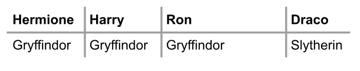
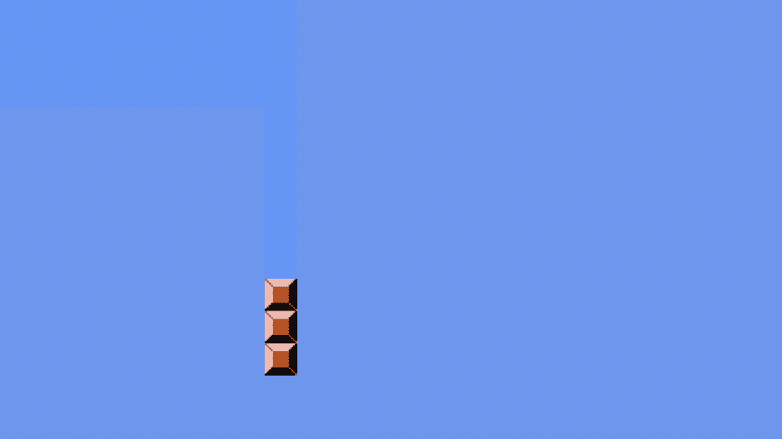
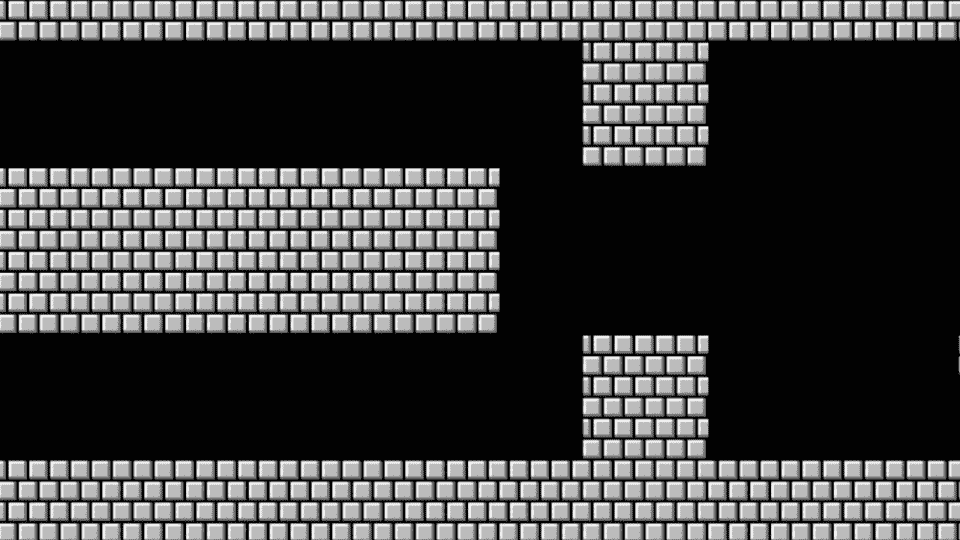

# 讲座 2

> 原文：[`cs50.harvard.edu/python/notes/2/`](https://cs50.harvard.edu/python/notes/2/)

+   循环

+   while 循环

+   for 循环

+   通过用户输入改进

+   更多关于列表的信息

+   长度

+   字典

+   马里奥

+   总结

## 循环

+   实际上，循环是一种重复做某事的方式。

+   在终端窗口中键入 `code cat.py` 开始。

+   在文本编辑器中，从以下代码开始：

    ```
    print("meow")
    print("meow")
    print("meow") 
    ```

    通过在终端窗口中键入 `python cat.py` 来运行此代码，你会注意到程序喵了三次。

+   在成为一名程序员的过程中，你想要考虑如何改进那些你反复输入相同内容的代码区域。想象一下，你可能在某个地方想要“喵”500 次。反复输入相同的表达式 `print("meow")` 是否合理？

+   循环使你能够创建一个反复执行的代码块。

## while 循环

+   `while` 循环在所有编程语言中几乎是通用的。

+   这样的循环会反复执行代码块。

+   在文本编辑器窗口中，按照以下方式编辑你的代码：

    ```
    i = 3
    while i != 0:
        print("meow") 
    ```

    注意，尽管这段代码会多次执行 `print("meow")`，但它永远不会停止！它会无限循环。`while` 循环通过反复询问循环的条件是否得到满足来工作。在这种情况下，解释器会问，“`i` 是否不等于零？”当你陷入一个永远执行的循环时，你可以按键盘上的 `Ctrl+C` 来退出循环。

+   为了修复这个永远持续下去的循环，我们可以按照以下方式编辑我们的代码：

    ```
    i = 3
    while i != 0:
      print("meow")
      i = i - 1 
    ```

    注意，现在我们的代码执行得很好，每次“迭代”循环时都会将 `i` 减少 1。术语迭代在编码中具有特殊意义。通过迭代，我们指的是通过循环的一个周期。第一次迭代是通过循环的“0 次”迭代。第二次是“1 次”迭代。在编程中，我们从 0 开始计数，然后是 1，然后是 2。

+   我们可以进一步改进我们的代码如下：

    ```
     i = 1
      while i <= 3:
          print("meow")
          i = i + 1 
    ```

    注意，当我们编写 `i = i + 1` 时，我们是从右向左赋值 `i` 的值。上面，我们像大多数人类一样从 1 开始计数（1，2，3）。如果你执行上面的代码，你会看到它喵了三次。在编程中，最好的做法是从 0 开始计数。

+   我们可以将我们的代码改进为从 0 开始计数：

    ```
    i = 0
    while i < 3:
        print("meow")
        i += 1 
    ```

    注意，将运算符更改为 `i < 3` 允许我们的代码按预期工作。我们首先从 0 开始计数，然后它通过我们的循环迭代三次，产生三次喵声。同时，注意 `i += 1` 与 `i = i + 1` 是相同的。

+   到目前为止，我们的代码如下所示：

    ```
    flowchart TD
      A([start]) --> B[i = 0]
      B --> C{i < 3}
      C -- True --> D["#quot;meow#quot;"]
      D --> E[i += 1]
      E --> C
      C -- False --> F([stop]) 
    ```

    注意，我们的循环将 i 计数到 3，但不包括 3。

## For 循环

+   `for` 循环是另一种类型的循环。

+   要最好地理解 `for` 循环，最好先从 Python 中一种新的变量类型 `list`（列表）开始讲起。就像我们生活中的其他领域一样，我们可以有一个购物清单，一个待办事项清单等。

+   `for` 循环遍历一个 `list` 中的项目。例如，在文本编辑器窗口中，将你的 `cat.py` 代码修改如下：

    ```
    for i in [0, 1, 2]:
        print("meow") 
    ```

    注意到与之前的 `while` 循环代码相比，这段代码多么简洁。在这段代码中，`i` 从 `0` 开始，喵喵叫，然后 `i` 被赋值为 `1`，喵喵叫，最后 `i` 被赋值为 `2`，喵喵叫，然后结束。

+   虽然这段代码实现了我们的目标，但还有一些改进代码以应对极端情况的可能性。乍一看，我们的代码看起来很棒。但是，如果你想要迭代到一百万呢？最好创建能够处理这种极端情况的代码。相应地，我们可以这样改进我们的代码：

    ```
    for i in range(3):
        print("meow") 
    ```

    注意到 `range(3)` 自动返回三个值（`0`、`1` 和 `2`）。这段代码将执行并产生预期的效果，喵喵叫三次。

+   我们的代码可以进一步改进。注意到我们在代码中从未显式地使用 `i`。也就是说，虽然 Python 需要使用 `i` 作为存储循环迭代次数的位置，但我们从未用它做任何其他用途。在 Python 中，如果这样的变量在我们的代码中没有其他意义，我们只需简单地用单个下划线 `_` 来表示这个变量。因此，你可以这样修改你的代码：

    ```
    for _ in range(3):
        print("meow") 
    ```

    注意到将 `i` 改为 `_` 对我们程序的运行没有影响。

+   我们的代码可以进一步改进。为了拓展你的思维，考虑以下代码：

    ```
    print("meow" * 3) 
    ```

    注意到它将喵喵叫三次，但程序将输出 `meowmeowmeow` 作为结果。考虑一下：你如何在每次喵喵叫的末尾创建一个换行符？

+   的确，你可以这样编辑你的代码：

    ```
    print("meow\n" * 3, end="") 
    ```

    注意到这段代码在每行产生三个喵喵叫，通过添加 `end=""` 和 `\n`，我们告诉解释器在每次喵喵叫的末尾添加一个换行符。

## 通过用户输入改进

+   也许我们想要从用户那里获取输入。我们可以使用循环作为验证用户输入的一种方式。

+   在 Python 中，使用 `while` 循环来验证用户输入是一种常见的范式。

+   例如，让我们尝试提示用户输入一个大于或等于 0 的数字：

    ```
    while True:
        n = int(input("What's n? "))
        if n < 0:
            continue
        else:
            break 
    ```

+   注意到我们在 Python 中引入了两个新的关键字，`continue` 和 `break`。`continue` 明确告诉 Python 跳到循环的下一个迭代。另一方面，`break` 告诉 Python 在完成所有迭代之前“提前退出”循环。在这种情况下，当 `n` 小于 0 时，我们将 `continue` 到循环的下一个迭代——最终用“请输入 n 的值？”重新提示用户。如果 `n` 大于或等于 0，我们将 `break` 出循环，允许程序的其余部分继续运行。

+   结果表明，在这种情况下 `continue` 关键字是多余的。我们可以这样改进我们的代码：

    ```
    while True:
        n = int(input("What's n? "))
        if n > 0:
            break

    for _ in range(n):
        print("meow") 
    ```

    注意到这个 `while` 循环将一直运行（永远）直到 `n` 大于 `0`。当 `n` 大于 `0` 时，循环会中断。

+   结合我们之前的学习，我们可以使用函数进一步改进我们的代码：

    ```
    def main():
        meow(get_number())

    def get_number():
        while True:
            n = int(input("What's n? "))
            if n > 0:
                return n

    def meow(n):
        for _ in range(n):
            print("meow")

    main() 
    ```

    注意，我们不仅将你的代码修改为在多个函数中操作，而且还使用了 `return` 语句将 `n` 的值返回到 `main` 函数。

## 更多关于列表的信息

+   考虑著名的哈利·波特宇宙中的霍格沃茨世界。

+   在终端中，输入 `code hogwarts.py`。

+   在文本编辑器中，编写如下代码：

    ```
    students = ["Hermione", "Harry", "Ron"]

    print(students[0])
    print(students[1])
    print(students[2]) 
    ```

    注意我们如何有一个包含学生姓名的 `list`，如上所示。然后我们打印位于第 0 位置的学生，“赫敏”。其他每个学生也会被打印出来。

+   正如我们之前所展示的，我们可以使用循环来遍历列表。你可以改进你的代码如下：

    ```
    students = ["Hermione", "Harry", "Ron"]

    for student in students:
        print(student) 
    ```

    注意，对于 `students` 列表中的每个 `student`，它将按预期打印学生。你可能想知道为什么我们没有使用之前讨论的 `_` 标识符。我们选择不这样做是因为 `student` 在我们的代码中被明确使用。

+   你可以在 Python 的[列表](https://docs.python.org/3/tutorial/datastructures.html#more-on-lists)文档中了解更多信息。

## 长度

+   我们可以利用 `len` 来检查名为 `students` 的 `list` 的长度。

+   假设你不仅想打印学生的名字，还想打印他们在列表中的位置。为了实现这一点，你可以修改你的代码如下：

    ```
    students = ["Hermione", "Harry", "Ron"]

    for i in range(len(students)):
        print(i + 1, students[i]) 
    ```

    注意，执行此代码不仅会得到每个学生的位置加一（使用 `i + 1`），还会打印出每个学生的名字。`len` 允许你动态地看到学生列表的长度，无论它增长多少。

+   你可以在 Python 的[内置函数 len](https://docs.python.org/3/library/functions.html?highlight=len#len)文档中了解更多信息。

## 字典

+   `dict`s 或字典**是**一种数据结构，允许你将键与值关联。

+   其中，`list` 是多个值的列表，而 `dict` 将键与值关联起来。

+   考虑到霍格沃茨的学院，我们可能将特定的学生分配到特定的学院。

    

+   我们可以使用 `list`s 单独完成这项任务：

    ```
    students = ["Hermione", "Harry", "Ron", "Draco"]
    houses = ["Gryffindor", "Gryffindor", "Griffindor", "Slytherin"] 
    ```

    注意，我们可以保证我们始终将这些列表保持有序。`students` 列表中的第一个位置与 `houses` 列表中的第一个位置对应的学院相关联，依此类推。然而，当我们的列表增长时，这可能会变得相当繁琐！

+   我们可以使用 `dict` 来改进我们的代码如下：

    ```
    students = {
        "Hermione": "Gryffindor",
        "Harry": "Gryffindor",
        "Ron": "Gryffindor",
        "Draco": "Slytherin",
    }
    print(students["Hermione"])
    print(students["Harry"])
    print(students["Ron"])
    print(students["Draco"]) 
    ```

    注意我们如何使用 `{}` 花括号来创建字典。`list`s 使用数字来遍历列表，而 `dict`s 允许我们使用单词。

+   运行你的代码并确保你的输出如下：

    ```
    $ python hogwarts.py
    Gryffindor
    Gryffindor
    Gryffindor
    Slytherin 
    ```

+   我们可以改进我们的代码如下：

    ```
    students = {
        "Hermione": "Gryffindor",
        "Harry": "Gryffindor",
        "Ron": "Gryffindor",
        "Draco": "Slytherin",
    }
    for student in students:
        print(student) 
    ```

    注意，执行此代码时，for 循环将只遍历所有键，结果是一个包含学生名字的列表。我们如何打印出键和值？

+   修改你的代码如下：

    ```
    students = {
        "Hermione": "Gryffindor",
        "Harry": "Gryffindor",
        "Ron": "Gryffindor",
        "Draco": "Slytherin",
    }
    for student in students:
        print(student, students[student]) 
    ```

    注意 `students[student]` 将遍历每个学生的键并找到他们学院的值。执行你的代码，你会注意到输出有点混乱。

+   我们可以通过改进我们的代码来清理`print`函数：

    ```
    students = {
        "Hermione": "Gryffindor",
        "Harry": "Gryffindor",
        "Ron": "Gryffindor",
        "Draco": "Slytherin",
    }
    for student in students:
        print(student, students[student], sep=", ") 
    ```

    注意这如何在打印的每个项目之间创建一个干净的逗号分隔。

+   如果你执行`python hogwarts.py`，你应该看到以下内容：

    ```
    $ python hogwarts.py
    Hermione, Gryffindor
    Harry, Gryffindor
    Ron, Gryffindor
    Draco, Slytherin 
    ```

+   如果我们关于学生的信息更多，我们如何将更多数据与每个学生关联起来？

    

+   你可以想象想要与多个键关联大量数据。增强你的代码如下：

    ```
    students = [
        {"name": "Hermione", "house": "Gryffindor", "patronus": "Otter"},
        {"name": "Harry", "house": "Gryffindor", "patronus": "Stag"},
        {"name": "Ron", "house": "Gryffindor", "patronus": "Jack Russell terrier"},
        {"name": "Draco", "house": "Slytherin", "patronus": None},
    ] 
    ```

    注意这段代码创建了一个`dict`的`list`。名为`students`的列表中有四个`dict`：每个学生一个。注意，Python 有一个特殊的`None`标识符，表示与键没有关联的值。

+   现在，你可以访问关于这些学生的大量有趣数据。现在，进一步修改你的代码如下：

    ```
    students = [
        {"name": "Hermione", "house": "Gryffindor", "patronus": "Otter"},
        {"name": "Harry", "house": "Gryffindor", "patronus": "Stag"},
        {"name": "Ron", "house": "Gryffindor", "patronus": "Jack Russell terrier"},
        {"name": "Draco", "house": "Slytherin", "patronus": None},
    ]

    for student in students:
        print(student["name"], student["house"], student["patronus"], sep=", ") 
    ```

    注意`for`循环将遍历`students`列表中每个`dict`。

+   你可以在 Python 的`dict`文档中了解更多信息[链接](https://docs.python.org/3/tutorial/datastructures.html#dictionaries)。

## 马里奥

+   记住经典游戏马里奥有一个英雄跳过砖块。让我们创建这个游戏的文本表示。

    

+   开始编码如下：

    ```
    print("#")
    print("#")
    print("#") 
    ```

    注意我们是如何一次又一次地复制和粘贴相同的代码。

+   考虑以下方式改进代码：

    ```
    for _ in range(3):
        print("#") 
    ```

    注意这基本上实现了我们想要创建的效果。

+   考虑：我们能否进一步抽象化，以便以后用这段代码解决更复杂的问题？修改你的代码如下：

    ```
    def main():
        print_column(3)

    def print_column(height):
        for _ in range(height):
            print("#")

    main() 
    ```

    注意我们的列可以增长到我们想要的任何程度，而不需要任何硬编码。

+   现在，让我们尝试水平打印一行。修改你的代码如下：

    ```
    def main():
        print_row(4)

    def print_row(width):
        print("?" * width)

    main() 
    ```

    注意我们现在有了可以创建从左到右的方块的代码。

+   查看下面的幻灯片，注意马里奥既有行也有列的方块。

    

+   考虑：我们如何在代码中实现行和列？修改你的代码如下：

    ```
    def main():
        print_square(3)

    def print_square(size):

        # For each row in square
        for i in range(size):

            # For each brick in row
            for j in range(size):

                #  Print brick
                print("#", end="")

            # Print blank line
            print()

    main() 
    ```

    注意我们有一个外层循环，它处理正方形中的每一行。然后，我们有一个内层循环，在每一行打印一个砖块。最后，我们有一个`print`语句打印一个空行。

+   我们可以进一步抽象我们的代码：

    ```
    def main():
        print_square(3)

    def print_square(size):
        for i in range(size):
            print_row(size)

    def print_row(width):
        print("#" * width)

    main() 
    ```

## 总结

你现在在你的 Python 能力增长列表中又获得了一种新能力。在本讲中，我们讨论了...

+   循环

+   `while`

+   `for`

+   `len`

+   `list`

+   `dict`
