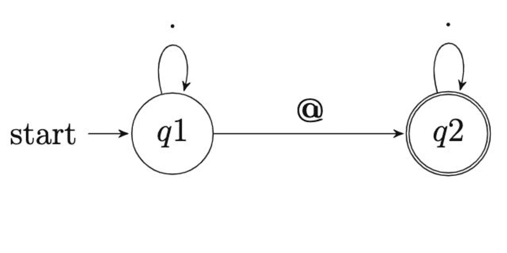
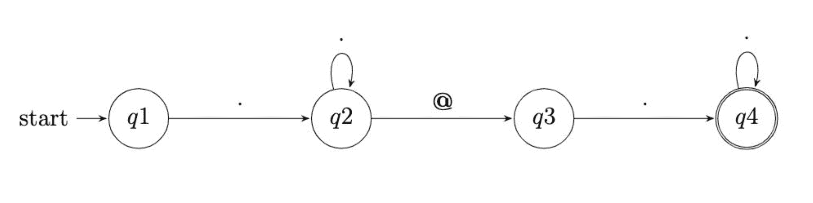

# 第七讲

> 原文：[`cs50.harvard.edu/python/notes/7/`](https://cs50.harvard.edu/python/notes/7/)

+   正则表达式

+   大小写敏感

+   清理用户输入

+   提取用户输入

+   总结

## 正则表达式

+   正则表达式或“regexes”将使我们能够检查代码中的模式。例如，我们可能想要验证电子邮件地址的格式是否正确。正则表达式将使我们能够以这种方式检查表达式。

+   首先，在终端窗口中输入 `code validate.py`。然后，在文本编辑器中按照以下方式编写代码：

    ```
    email = input("What's your email? ").strip()

    if "@" in email:
        print("Valid")
    else:
        print("Invalid") 
    ```

    注意，`strip` 方法将移除输入字符串开头或结尾的空白字符。运行此程序，您将看到只要输入了 `@` 符号，程序就会将其视为有效。

+   您可以想象，然而，有人可能会输入 `@@` 独自存在，并且输入可能会被视为有效。我们可以认为电子邮件地址至少包含一个 `@` 和一个 `.`。修改您的代码如下：

    ```
    email = input("What's your email? ").strip()

    if "@" in email and "." in email:
        print("Valid")
    else:
        print("Invalid") 
    ```

    注意，虽然这符合预期，但我们的用户可能是敌意的，简单地输入 `@.` 就会导致程序返回 `valid`。

+   我们可以改进程序的逻辑如下：

    ```
    email = input("What's your email? ").strip()

    username, domain = email.split("@")

    if username and "." in domain:
        print("Valid")
    else:
        print("Invalid") 
    ```

    注意 `strip` 方法是如何用来判断 `username` 是否存在以及 `.` 是否在 `domain` 变量中的。运行此程序，您输入的标准电子邮件地址可能会被认为是 `valid`。单独输入 `malan@harvard`，您会发现程序将此输入视为 `invalid`。

+   我们可以更加精确，修改我们的代码如下：

    ```
    email = input("What's your email? ").strip()

    username, domain = email.split("@")

    if username and domain.endswith(".edu"):
        print("Valid")
    else:
        print("Invalid") 
    ```

    注意 `endswith` 方法将检查 `domain` 是否包含 `.edu`。然而，恶意用户仍然可以破坏我们的代码。例如，一个用户可以输入 `malan@.edu`，它将被认为是有效的。

+   事实上，我们可以自己不断迭代此代码。然而，结果证明，Python 有一个名为 `re` 的现有库，它包含许多内置函数，可以验证用户输入与模式是否匹配。

+   库 `re` 中最通用的函数之一是 `search`。

+   `search` 函数遵循以下签名 `re.search(pattern, string, flags=0)`。根据此签名，我们可以修改我们的代码如下：

    ```
    import re

    email = input("What's your email? ").strip()

    if re.search("@", email):
        print("Valid")
    else:
        print("Invalid") 
    ```

    注意，这并没有增加程序的功能。事实上，这有点像是退步。

+   我们可以进一步扩展程序的功能。然而，我们需要在 `validation` 方面扩展我们的词汇。结果证明，在正则表达式的世界中，有一些符号允许我们识别模式。到目前为止，我们只检查了特定的文本片段，如 `@`。事实上，许多特殊符号可以传递给解释器，用于进行验证。以下是一些模式的非详尽列表：

    ```
    .   any character except a new line
    *   0 or more repetitions
    +   1 or more repetitions
    ?   0 or 1 repetition
    {m} m repetitions
    {m,n} m-n repetitions 
    ```

+   在我们的代码中实现此功能，修改如下：

    ```
    import re

    email = input("What's your email? ").strip()

    if re.search(".+@.+", email):
        print("Valid")
    else:
        print("Invalid") 
    ```

    注意，我们不在乎用户名或域名是什么。我们关心的是模式。`.+` 用于确定电子邮件地址左侧是否有任何内容，以及电子邮件地址右侧是否有任何内容。运行你的代码，输入 `malan@`，你会发现输入被认为是 `无效` 的，正如我们所希望的。

+   如果我们在上面的代码中使用了正则表达式 `.*@.*`，你可以这样可视化它：

    注意正则表达式的 `状态机` 描述。在左侧，解释器从左到右开始评估语句。一旦我们到达 `q1` 或第一个问题，解释器就会根据提供的表达式反复读取。然后，状态改变，现在正在查看 `q2` 或正在验证的第二个问题。再次，箭头指示表达式将根据我们的编程反复评估。然后，如双圆圈所示，达到状态机的最终状态。

+   考虑到我们在代码中使用的正则表达式 `.+@.+`，你可以这样可视化它：

    注意 `q1` 是用户提供的任何字符，包括作为 1 或多个字符重复的 `'q2'`。然后是 `@` 符号。接着，`q3` 寻找用户提供的任何字符，包括作为 1 或多个字符重复的 `q4`。

+   `re` 和 `re.search` 函数以及类似的函数寻找模式。

+   继续改进我们的代码，我们可以这样改进我们的代码：

    ```
    import re

    email = input("What's your email? ").strip()

    if re.search(".+@.+.edu", email):
        print("Valid")
    else:
        print("Invalid") 
    ```

    注意，然而，你可以输入 `malan@harvard?edu` 并被认为是有效的。这是为什么？你可能会意识到，在验证的语言中，`.` 表示任何字符！

+   我们可以修改我们的代码如下：

    ```
    import re

    email = input("What's your email? ").strip()

    if re.search(r".+@.+\.edu", email):
        print("Valid")
    else:
        print("Invalid") 
    ```

    注意我们如何利用“转义字符”或 `\` 将 `.` 视为字符串的一部分，而不是验证表达式的一部分。测试你的代码，你会发现 `malan@harvard.edu` 被认为是有效的，而 `malan@harvard?edu` 是无效的。

+   现在我们正在使用转义字符，是时候介绍“原始字符串”了。在 Python 中，原始字符串是不格式化特殊字符的字符串——相反，每个字符都被当作字面值。例如，想象一下 `\n`。我们在之前的讲座中看到，在一个普通字符串中，这两个字符变成一个：一个特殊的换行符。然而，在原始字符串中，`\n` 被视为不是 `\n` 这个特殊字符，而是单个 `\` 和单个 `n`。在字符串前放置一个 `r` 告诉 Python 解释器将字符串视为原始字符串，类似于在字符串前放置一个 `f` 告诉 Python 解释器将字符串视为格式化字符串：

    ```
    import re

    email = input("What's your email? ").strip()

    if re.search(r"^.+@.+\.edu$", email):
        print("Valid")
    else:
        print("Invalid") 
    ```

    现在我们已经确保 Python 解释器不会将 `\.` 视为特殊字符。相反，它只是一个 `\` 后跟一个 `.`——在正则表达式中，这意味着匹配一个字面量的 `.`。

+   你可以想象我们的用户仍然可能给我们制造麻烦！例如，你可以输入一个句子，如 `My email address is malan@harvard.edu.`，整个句子都会被视为有效。我们可以使我们的编码更加精确。

+   恰好我们还有更多特殊符号可供使用：

    ```
    ^   matches the start of the string
    $   matches the end of the string or just before the newline at the end of the string 
    ```

+   我们可以使用我们添加的词汇表按如下方式修改我们的代码：

    ```
    import re

    email = input("What's your email? ").strip()

    if re.search(r"^.+@.+\.edu$", email):
        print("Valid")
    else:
        print("Invalid") 
    ```

    注意这会使得验证表达式在开始和结束处寻找这个精确的模式匹配。输入一个句子，如 `My email address is malan@harvard.edu.`，现在被视为无效。

+   我们提议我们可以做得更好！尽管我们现在正在寻找字符串开头的用户名、`@` 符号和结尾的域名，但我们可以输入任意多的 `@` 符号！`malan@@@harvard.edu` 被视为有效！

+   我们可以按如下方式扩展我们的词汇表：

    ```
    []    set of characters
    [^]   complementing the set 
    ```

+   使用这些新获得的能力，我们可以按如下方式修改我们的表达式：

    ```
    import re

    email = input("What's your email? ").strip()

    if re.search(r"^[^@]+@[^@]+\.edu$", email):
        print("Valid")
    else:
        print("Invalid") 
    ```

    注意到 `^` 表示匹配字符串的开始。在我们的表达式的末尾，`$` 表示匹配字符串的末尾。`[^@]+` 表示除了 `@` 之外的任何字符。然后，我们有一个字面量 `@`。`[^@]+\.edu` 表示除了 `@` 之外的任何字符，后面跟着以 `.edu` 结尾的表达式。输入 `malan@@@harvard.edu` 现在被视为无效。

+   我们还可以进一步改进这个正则表达式。结果证明，电子邮件地址有一些特定的要求！目前，我们的验证表达式过于宽容。我们可能只想允许在句子中通常使用的字符。我们可以按如下方式修改我们的代码：

    ```
    import re

    email = input("What's your email? ").strip()

    if re.search(r"^[a-zA-Z0-9_]+@[a-zA-Z0-9_]+\.edu$", email):
        print("Valid")
    else:
        print("Invalid") 
    ```

    注意 `[a-zA-Z0-9_]` 告诉验证，字符必须在 `a` 到 `z`、`A` 到 `Z`、`0` 到 `9` 之间，并且可能包括一个 `_` 符号。测试输入，你会发现许多潜在的用户错误可以被指示出来。

+   幸运的是，程序员们已经将常见的模式内置到正则表达式中。在这种情况下，你可以按如下方式修改你的代码：

    ```
    import re

    email = input("What's your email? ").strip()

    if re.search(r"^\w+@\w+\.edu$", email):
        print("Valid")
    else:
        print("Invalid") 
    ```

    注意 `\w` 与 `[a-zA-Z0-9_]` 相同。感谢辛勤工作的程序员们！

+   这里有一些额外的模式我们可以添加到我们的词汇表中：

    ```
    \d    decimal digit
    \D    not a decimal digit
    \s    whitespace characters
    \S    not a whitespace character
    \w    word character, as well as numbers and the underscore
    \W    not a word character 
    ```

+   现在，我们知道不仅仅是 `.edu` 电子邮件地址。我们可以按如下方式修改我们的代码：

    ```
    import re

    email = input("What's your email? ").strip()

    if re.search(r"^\w+@\w.+\.(com|edu|gov|net|org)$", email):
        print("Valid")
    else:
        print("Invalid") 
    ```

    注意 `|` 在我们的表达式中具有 `or` 的影响。

+   在我们的词汇表中添加更多符号，以下是一些需要考虑的：

    ```
    A|B     either A or B
    (...)   a group
    (?:...) non-capturing version 
    ```

## 大小写敏感性

+   为了说明如何处理关于大小写敏感性的问题，其中 `EDU` 和 `edu` 以及类似的情况之间存在差异，让我们将我们的代码回滚到以下状态：

    ```
    import re

    email = input("What's your email? ").strip()

    if re.search(r"^\w+@\w+\.edu$", email):
        print("Valid")
    else:
        print("Invalid") 
    ```

    注意我们已经移除了之前提供的 `|` 语句。

+   回想一下，在 `re.search` 函数中，有一个名为 `flags` 的参数。

+   一些内置的标志变量是：

    ```
    re.IGNORECASE
    re.MULTILINE
    re.DOTALL 
    ```

    考虑你如何在你的代码中使用这些。

+   因此，我们可以按照以下方式更改我们的代码。

    ```
    import re

    email = input("What's your email? ").strip()

    if re.search(r"^\w+@\w+\.edu$", email, re.IGNORECASE):
        print("Valid")
    else:
        print("Invalid") 
    ```

    注意我们添加了第三个参数`re.IGNORECASE`。运行这个程序，输入`MALAN@HARVARD.EDU`，现在输入被认为是有效的。

+   考虑以下电子邮件地址`malan@cs50.harvard.edu`。使用我们上面的代码，这将被认为是无效的。为什么可能是这样？

+   由于多了一个额外的`.`，程序认为这是无效的。

+   结果表明，我们可以从之前的学习词汇中，将一些想法分组在一起。

    ```
    A|B     either A or B
    (...)   a group
    (?:...) non-capturing version 
    ```

+   我们可以按照以下方式修改我们的代码：

    ```
    import re

    email = input("What's your email? ").strip()

    if re.search(r"^\w+@(\w+\.)?\w+\.edu$", email, re.IGNORECASE):
        print("Valid")
    else:
        print("Invalid") 
    ```

    注意到`(\w+\.)?`告诉解释器这个新表达式可以出现一次或根本不出现。因此，`malan@cs50.harvard.edu`和`malan@harvard.edu`都被认为是有效的。

+   趣味的是，我们到目前为止对代码所做的编辑并没有完全涵盖所有可以做的检查以确保有效的电子邮件地址。确实，以下是确保输入有效电子邮件地址时必须输入的完整表达式：

    ```
    ^[a-zA-Z0-9.!#$%&'*+\/=?^_`{|}~-]+@[a-zA-Z0-9](?:[a-zA-Z0-9-]{0,61}[a-zA-Z0-9])?(?:\.[a-zA-Z0-9](?:[a-zA-Z0-9-]{0,61}[a-zA-Z0-9])?)*$ 
    ```

+   `re`库中还有其他你可能觉得有用的函数。`re.match`和`re.fullmatch`是你可能会发现极其有用的。

+   你可以在 Python 的[re](https://docs.python.org/3/library/re.html)文档中了解更多信息。

## 清理用户输入

+   你永远不应该期望你的用户总是遵循你对干净输入的期望。实际上，用户经常会违反程序员的本意。

+   有方法可以清理你的数据。

+   在终端窗口中，输入`code format.py`。然后，在文本编辑器中，按照以下方式编写代码：

    ```
    name = input("What's your name? ").strip()
    print(f"hello, {name}") 
    ```

    注意我们实际上创建了一个“hello world”程序。运行这个程序并输入`David`，它运行得很好！然而，输入`Malan, David`时，你会注意到程序并没有按预期工作。我们如何修改我们的程序来清理这个输入？

+   按照以下方式修改你的代码。

    ```
    name = input("What's your name? ").strip()
    if "," in name:
        last, first = name.split(", ")
        name = f"{first}  {last}"
    print(f"hello, {name}") 
    ```

    注意到`last, first = name.split(", ")`在名字中有`,`时执行。然后，名字被标准化为 first 和 last。运行我们的代码，输入`Malan, David`，你可以看到这个程序至少清理了一个用户输入意外内容的情况。

+   你可能会注意到，在`Malan,David`中不输入空格会导致解释器抛出错误。既然我们现在知道了某些正则表达式语法，让我们将其应用到我们的代码中：

    ```
    import re

    name = input("What's your name? ").strip()
    matches = re.search(r"^(.+), (.+)$", name)
    if matches:
        last, first = matches.groups()
        name = first + "  " + last
    print(f"hello, {name}") 
    ```

    注意到`re.search`可以返回一组从用户输入中提取的匹配项。如果`re.search`返回匹配项，运行这个程序，输入`David Malan`，注意`if`条件没有执行，并且返回了名字。如果你通过输入`Malan, David`运行程序，名字也会正确返回。

+   恰好我们可以使用`matches.group`请求特定的组。我们可以按照以下方式修改我们的代码：

    ```
    import re

    name = input("What's your name? ").strip()
    matches = re.search(r"^(.+), (.+)$", name)
    if matches:
        name = matches.group(2) + "  " + matches.group(1)
    print(f"hello, {name}") 
    ```

    注意在这个实现中，`group`不是复数（没有`s`）。

+   我们可以将代码进一步优化如下：

    ```
    import re

    name = input("What's your name? ").strip()
    matches = re.search(r"^(.+), (.+)$", name)
    if matches:
        name = matches.group(2) + "  " + matches.group(1)
    print(f"hello, {name}") 
    ```

    注意`group(2)`和`group(1)`是如何用空格连接在一起的。第一个组是逗号左边的部分。第二个组是逗号右边的部分。

+   仍然要注意，如果输入`Malan,David`时没有空格，这仍然会破坏我们的代码。因此，我们可以进行以下修改：

    ```
    import re

    name = input("What's your name? ").strip()
    matches = re.search(r"^(.+), *(.+)$", name)
    if matches:
        name = matches.group(2) + "  " + matches.group(1)
    print(f"hello, {name}") 
    ```

    注意我们在验证语句中添加了`*`。现在这段代码将接受并正确处理`Malan,David`。此外，它还将正确处理前面有多个空格的` David,Malan `。

+   在之前的例子中，我们非常常见地使用`re.search`，其中`matches`是在代码行之后的。然而，我们可以组合这些语句：

    ```
    import re

    name = input("What's your name? ").strip()
    if matches := re.search(r"^(.+), *(.+)$", name):
        name = matches.group(2) + "  " + matches.group(1)
    print(f"hello, {name}") 
    ```

    注意我们如何合并两行代码。walrus `:=` 操作符从右向左赋值，同时允许我们提出一个布尔问题。侧过头来看，你就会明白为什么这被称为 walrus 操作符。

+   你可以在 Python 的[re](https://docs.python.org/3/library/re.html)文档中了解更多信息。

## 提取用户输入

+   到目前为止，我们已经验证了用户的输入并清理了用户的输入。

+   现在，让我们从用户输入中提取一些具体信息。在终端窗口中，输入`code twitter.py`，然后在文本编辑器窗口中按如下方式编写代码：

    ```
    url = input("URL: ").strip()
    print(url) 
    ```

    注意，如果我们输入`https://twitter.com/davidjmalan`，它将显示用户输入的确切内容。然而，我们如何能够只提取用户名并忽略 URL 的其余部分？

+   你可以想象我们如何简单地去除标准 Twitter URL 的开头部分。我们可以尝试如下操作：

    ```
    url = input("URL: ").strip()

    username = url.replace("https://twitter.com/", "")
    print(f"Username: {username}") 
    ```

    注意`replace`方法如何允许我们找到一项并将其替换为另一项。在这种情况下，我们正在找到 URL 的一部分并将其替换为空。输入完整的 URL `https://twitter.com/davidjmalan`，程序实际上输出了用户名。然而，这个当前程序有哪些不足之处？

+   如果用户只是简单地输入`twitter.com`而没有包括`https://`等，会怎样？你可以想象出许多场景，用户可能会输入或遗漏输入 URL 的部分，这会导致程序输出奇怪的结果。为了改进这个程序，我们可以按如下方式编写代码：

    ```
    url = input("URL: ").strip()

    username = url.removeprefix("https://twitter.com/")
    print(f"Username: {username}") 
    ```

    注意我们如何利用`removeprefix`方法。这个方法将移除字符串的开头部分。

+   正则表达式仅仅允许我们简洁地表达模式和目标。

+   在`re`库中，有一个名为`sub`的方法。这个方法允许我们用其他内容替换模式。

+   `sub`方法的签名如下

    ```
    re.sub(pattern, repl, string, count=0, flags=0) 
    ```

    注意`pattern`指的是我们正在寻找的正则表达式。然后是一个`repl`字符串，我们可以用它来替换模式。最后是我们要进行替换的`string`。

+   在我们的代码中实现此方法后，我们可以按如下方式修改我们的程序：

    ```
    import re

    url = input("URL: ").strip()

    username = re.sub(r"https://twitter.com/", "", url)
    print(f"Username: {username}") 
    ```

    注意执行此程序并输入 `https://twitter.com/davidjmalan` 会产生正确的结果。然而，我们的代码中仍然存在一些问题。

+   协议、子域以及用户可能在用户名之后输入 URL 任何部分的可能性，这些都是此代码仍然不是最佳方案的原因。我们可以进一步解决这些缺点，如下所示：

    ```
    import re

    url = input("URL: ").strip()

    username = re.sub(r"^(https?://)?(www\.)?twitter\.com/", "", url)
    print(f"Username: {username}") 
    ```

    注意在 url 中添加了 `^` 上标。注意 `.` 也可能被解释器错误地解释。因此，我们使用 `\` 来转义它，使其变为 `\.`。为了容忍 `http` 和 `https`，我们在 `https?` 的末尾添加一个 `?`，使 `s` 可选。此外，为了适应 `www`，我们在代码中添加 `(www\.)?`。最后，以防用户决定完全省略协议，我们将 `http://` 或 `https://` 设置为可选，使用 `(https?://)`。

+   尽管如此，我们仍然盲目地期望用户输入的 URL 确实包含用户名。

+   利用我们对 `re.search` 的了解，我们可以进一步改进我们的代码。

    ```
    import re

    url = input("URL: ").strip()

    matches = re.search(r"^https?://(www\.)?twitter\.com/(.+)$", url, re.IGNORECASE)
    if matches:
        print(f"Username:", matches.group(2)) 
    ```

    注意我们是如何在用户提供的字符串中搜索上述正则表达式的。特别是，我们使用 `(.+)$` 正则表达式捕获 URL 末尾出现的内容。因此，如果用户没有输入不带用户名的 URL，则不会显示任何输入。

+   进一步收紧我们的程序，我们可以利用我们的 `:=` 操作符如下：

    ```
    import re

    url = input("URL: ").strip()

    if matches := re.search(r"^https?://(?:www\.)?twitter\.com/(.+)$", url, re.IGNORECASE):
        print(f"Username:", matches.group(1)) 
    ```

    注意到 `?:` 告诉解释器它不需要捕获正则表达式中的那个位置的内容。

+   尽管如此，我们可以更加明确地确保输入的用户名是正确的。使用 Twitter 的文档，我们可以在我们的正则表达式中添加以下内容：

    ```
    import re

    url = input("URL: ").strip()

    if matches := re.search(r"^https?://(?:www\.)?twitter\.com/([a-z0-9_]+)", url, re.IGNORECASE):
        print(f"Username:", matches.group(1)) 
    ```

    注意 `[a-z0-9_]+` 告诉解释器只期望 `a-z`、`0-9` 和 `_` 作为正则表达式的一部分。`+` 表示我们期望一个或多个字符。

+   你可以在 Python 的[re](https://docs.python.org/3/library/re.html)文档中了解更多信息。

## 总结

现在，你已经学会了一种全新的正则表达式语言，可以用来验证、清理和提取用户输入。

+   正则表达式

+   区分大小写

+   清理用户输入

+   提取用户输入
