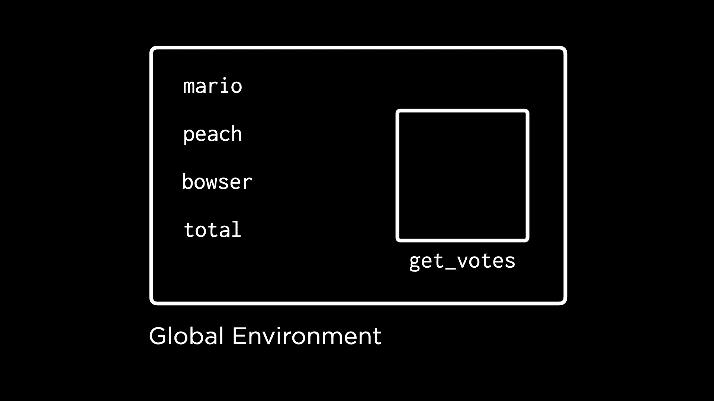
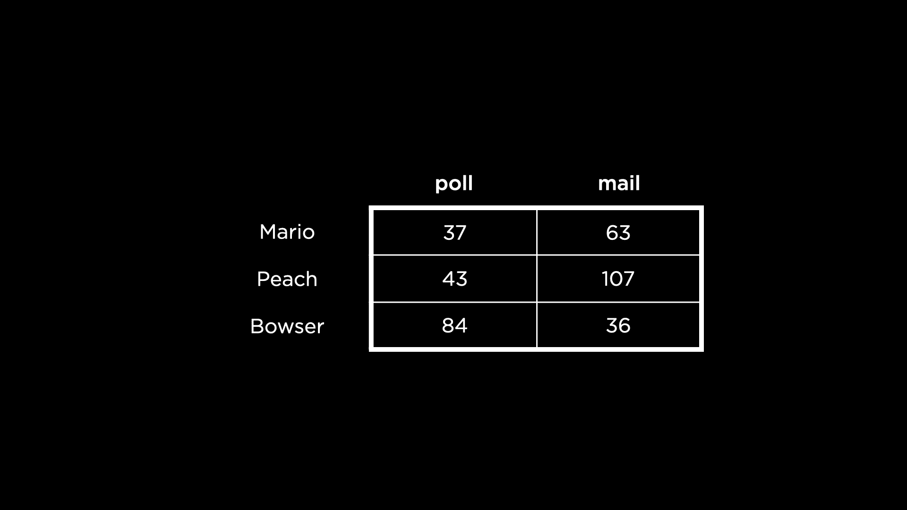

# 第 3 讲

> 原文：[`cs50.harvard.edu/r/notes/3/`](https://cs50.harvard.edu/r/notes/3/)

+   欢迎！

+   定义函数

+   作用域

+   检查输入

+   循环

+   使用循环

+   使用函数和循环

+   应用函数

+   总结

## 欢迎！

+   欢迎回到 CS50 的 R 编程入门课程！

+   今天，我们将学习如何应用函数。我们还将学习如何编写自己的函数并应用循环。

+   回想一下我们在上次讲座中创建的名为 `count.R` 的程序。

    [PRE0]

    注意到如何重复行以从用户那里获取输入。

+   传统上，在编程中每次重复使用代码都是改进的机会。函数是我们通过定义可以在整个程序中重用的代码块来减少这些冗余的一种方式。

## 定义函数

+   在 R 中，函数通过语法 `function()` 定义。

+   考虑以下我们程序的改进版本：

    [PRE1]

    注意到创建了一个名为 `get_votes` 的新函数。函数的 *主体* 由开闭花括号 (`{` 和 `}`) 表示。注意，在主体内部有 2 行代码，每次调用此函数时都会执行。首先，从用户那里收集 `votes`。其次，返回 `votes`。在调用 `get_votes` 之后，`mario`、`peach` 和 `bowser` 分别接收返回值。最后，提供值的总和并显示给用户。

+   恭喜你，这是你在 R 中的第一个函数！

+   然而，运行这个函数，我们发现该函数丢失了一些我们之前的功能。我们能否以某种方式向函数提供一个 *参数*，以便我们可以更准确地提示用户？确实可以！考虑以下：

    [PRE2]

    注意到向 `get_votes` 函数提供了一个 `prompt`。因此，用户会被提示他们要投票的人的名字。此外，注意已经移除了 `return(votes)` 语句。在 R 中，函数会自动返回最后计算出的值。

+   具有参数的函数可能已分配了默认值。考虑以下我们程序的以下更新：

    [PRE3]

    注意到在代码的第一行提供了一个默认值。

+   我们仍然可以像这样覆盖默认提示：

    [PRE4]

    注意到对于每次函数调用，给定的参数会覆盖默认参数。

## 作用域

+   查看我们的 RStudio 环境面板，注意到为 `bowser` 和其他人提供了值。然而，没有为 `votes` 提供值。为什么可能会这样？

+   结果表明，所有对象都是在某些“环境”中定义的。其中一种环境是“全局”环境。全局环境是您在 R 控制台或函数体外部定义的对象的家园——例如 `mario`、`bowser` 和 `peach`。默认情况下，RStudio 的环境面板显示您在全局环境中定义的对象。

    

+   `get_votes`函数也是定义在全局环境中的对象。然而，独特的是，`get_votes`本身也是一种环境！正如你所看到的，在`get_votes`的定义中，你可以定义其他对象，如`votes`和`prompt`。

    

+   `get_votes`的环境**不是**全局环境。当编写在全局环境中运行的代码时，此环境中的对象不可访问。

+   一个对象可用的环境被称为其“作用域”。

## 检查输入

+   程序员一直面临的一个挑战是用户的糟糕行为。也就是说，作为程序员，我们应该预期用户不会总是做我们想要的事情。例如，如果用户为`votes`提供了文本字符串而不是数字怎么办？

+   我们可以将程序改进以捕获输入的错误值：

    [PRE5]

    注意到如果`votes`的值是`NA`，`get_votes`将返回`0`。否则，`get_votes`将返回用户提供的值。

+   虽然这个程序可以工作，但它仍然会提供警告，我们可能不希望用户看到。我们可以如下抑制警告：

    [PRE6]

    注意到当运行此代码时，警告现在被抑制了。

+   通过使用`ifelse`，我们可以进一步改进这个程序。考虑以下：

    [PRE7]

    注意到`ifelse`的第一个值是一个要测试的逻辑表达式。第二个值`0`是当第一个值`is.na(votes)`评估为`TRUE`时将返回的值。最后，第三个值`votes`是在第一个值评估为`FALSE`时提供的。

+   我们现在已经发现了检查用户输入的第一种基本方法。

+   如同之前，我们可以抑制警告：

    [PRE8]

    注意到警告被抑制了。

## 循环

+   我们可能希望对程序进行的一个显著改进是能够在用户出错时反复提示用户。

+   要了解更多关于循环的信息，让我们请 CS50 Duck Debugger 来帮忙！Quack！

+   考虑以下代码：

    [PRE9]

    注意到这段代码将输出“quack”三次。然而，它相当低效！我们重复了相同的代码行三次。

+   我们可以尝试使用以下形式的**重复循环**来改进此代码：

    [PRE10]

    注意到我们的鸭子“quack”多次，但永远如此。鸭子会非常累的！

+   我们实现循环的一种方法是通过利用`break`和`next`。这样的循环将通过计数器重复一定次数。

    [PRE11]

    注意到`i`的值被设置为`3`。然后每次发生`quack!`时，`i`的值减少 1。当达到`0`时，循环将`break`。否则（或`else`），这个循环将使用`next`继续。

+   最后，`next`是不必要的。循环将自动继续，无需`next`语句。我们可以如下移除此语句：

    [PRE12]

    注意当`i`等于`0`时，循环将中断。然而，已经移除了`next`。循环仍然可以工作。

+   我们可用的另一种循环类型称为*while 循环*。这种循环将在满足特定条件之前继续。考虑以下代码：

    [PRE13]

    注意这个循环将一直运行，直到`i != 0`的值为真。

+   另一种类型的循环称为*for 循环*，它允许我们根据列表或值向量重复操作：

    [PRE14]

    注意`for`循环从`i`的值为`1`开始，运行其内部的代码。然后，它将`i`的值设置为`2`并运行。最后，它将`i`设置为`3`并运行。因此，循环内的代码运行了三次。

+   我们可以通过使用范围`1:3`（一至三）来简化我们的代码，以计算`1`、`2`和`3`。

    [PRE15]

    注意代码`i in 1:3`如何完成与先前示例中相同的任务。

## 使用循环

+   我们可以在对马里奥和他的朋友们计票时使用我们新学的循环能力。考虑以下使用重复循环的代码：

    [PRE16]

    注意用户将一直被提示，直到提供的值不是`NA`。

+   我们可以进一步改进我们的代码如下：

    [PRE17]

    注意`return(votes)`子句是如何替换`break`的。这个函数的功能保持不变，但代码更简洁。

+   现在，利用我们对`for`循环的知识，我们可以改进对马里奥和他的朋友们重复的代码：

    [PRE18]

    注意，与为每个候选人分别提示选票的三条单独的行不同，`for`循环将运行“马里奥”、“桃子”和“霸王龙”的范围以获取选票。`paste0`语句将冒号字符添加到每个提示中。

+   作为最后的点缀，我们可以使用循环来边走边计票：

    [PRE19]

    注意在`for`循环的每次迭代中，`total`选票数是如何更新的。

+   反思上述内容，你可以看到循环为你作为程序员提供的根本编程力量。

## 使用函数和循环

+   让我们回到之前讨论的一个案例，像下面这样在表中汇总候选人的选票。

    

+   现在，让我们使用我们在循环和函数中学习的新能力来创建一个更好的程序。

+   也许我们的第一个目标应该是统计选票。考虑以下代码：

    [PRE20]

    注意这个`for`循环将遍历`votes`数据框中呈现的每个`candidate`。然后，`candidate`的`votes`总和将被存储在`total_votes`向量中。`total_votes <- c()`代表一个空向量，稍后将被数据填充。`total_votes[candidate]`在向量`total_votes`中创建一个新的元素，每次循环迭代中每个候选人都有一个。

+   第二个目标可能是按每个候选人收到的选票方式汇总。

    [PRE21]

    注意这个`for`循环如何遍历`colnames`（或列名）中的每个`method`。

## 应用函数

+   上面的程序可以使用一组称为`apply`函数的函数进一步优化。

+   `apply`函数允许你将函数应用于数据结构中的元素（即运行）。例如，`apply`函数可以在数据表的所有行或列上应用函数。

+   在投票表的例子中，我们可以使用`apply`函数如下来获取所有行的`sum`：

    [PRE22]

    注意`sum`函数是如何使用`MARGIN = 1`应用于所有行的。如果我们把`MARGIN`设置为`2`，`sum`函数就会应用于所有列。

+   我们可以这样对每一列求和：

    [PRE23]

    注意`MARGIN = 2`。

## 总结

在本课中，你学习了如何在 R 中应用函数。具体来说，你学习了……

+   定义函数

+   范围

+   检查输入

+   循环

+   使用循环

+   使用函数和循环

+   应用函数

次次再见，当我们讨论如何清理我们的数据时。
