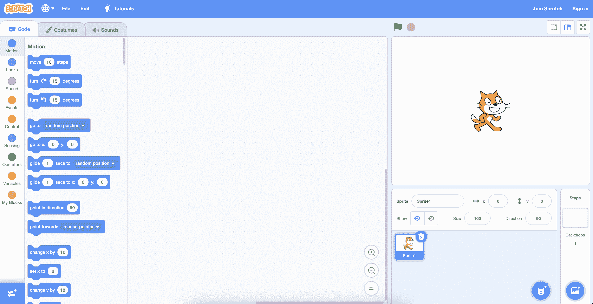
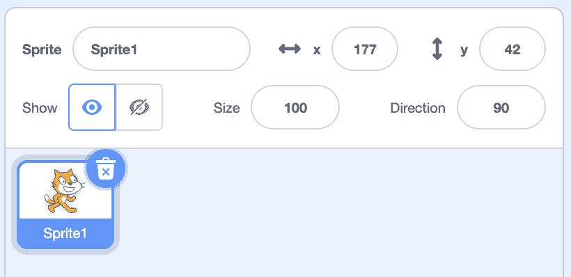
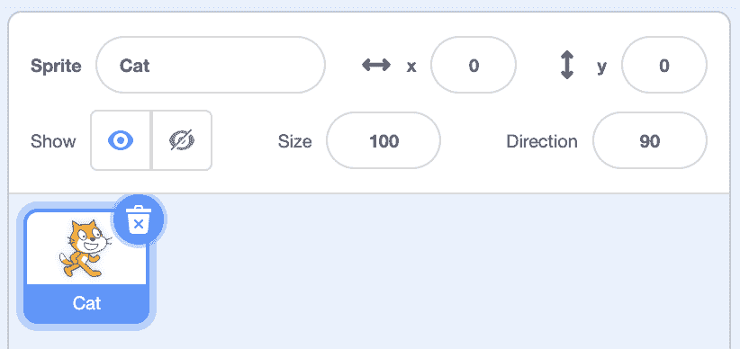
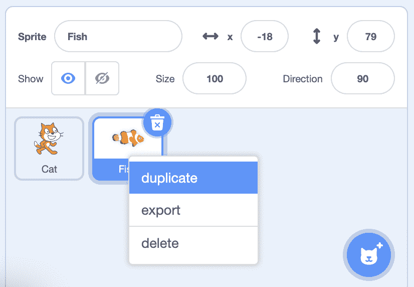
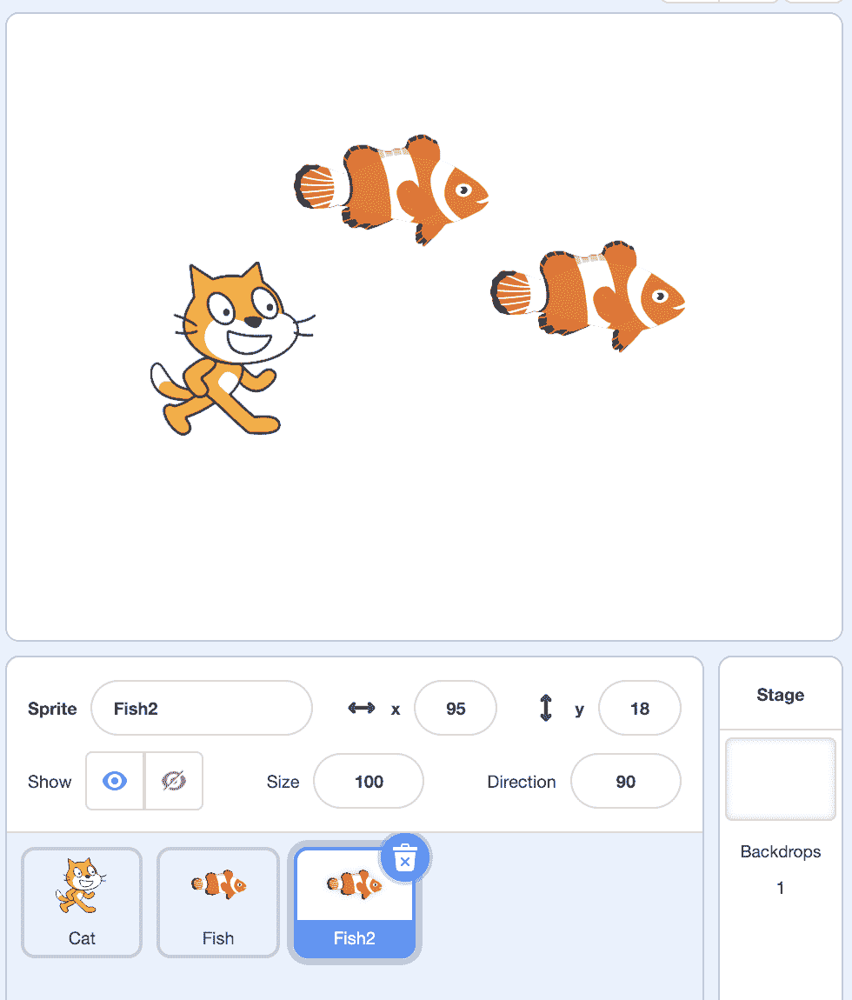
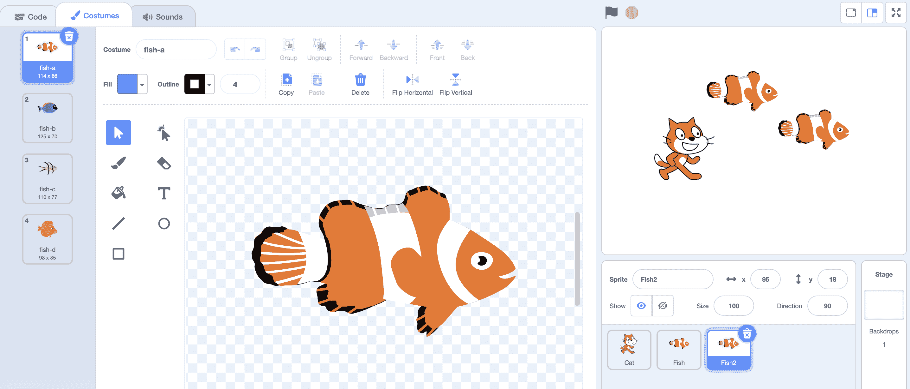
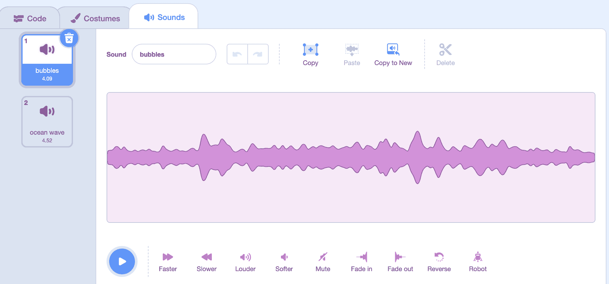
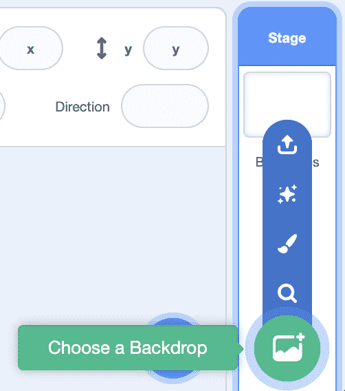
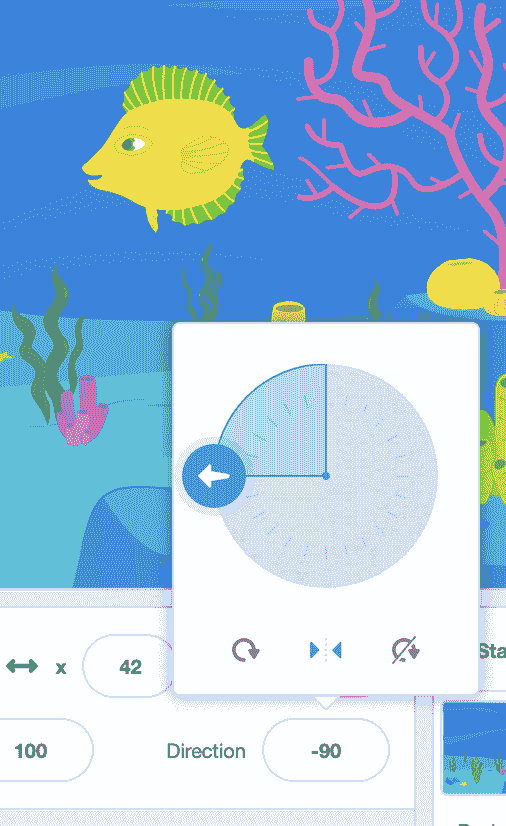
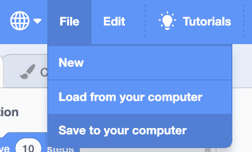

# 精灵

> 原文：[`cs50.harvard.edu/scratch/notes/1/`](https://cs50.harvard.edu/scratch/notes/1/)

## 简介

+   Scratch 是一种由 [麻省理工学院媒体实验室](https://www.media.mit.edu/about/overview/) 的团队最初开发，现在由其自己的 [Scratch 基金会](https://scratch.mit.edu/credits) 维护的基于视觉块状编程语言。

+   通过在 Scratch 中组合“拼图块”，我们可以创建视觉故事、动画、游戏和其他程序。

+   我们将学习和使用编程概念和思想，如函数、循环、条件和变量。

+   尽管 Scratch 使用的是视觉块而不是文本代码，但其程序基于相同的基本思想，并使用相同的计算思维原则。

## 界面基础

+   我们可以访问 [Scratch 的网站](https://scratch.mit.edu)，点击“开始创作”，在那里我们将看到一个类似这样的界面：

    

    +   在左侧，我们有一个块库，我们可以将任何组合的块拖放到中间部分，称为块编辑器，我们将在这里构建我们的项目。

    +   在右上角，我们有舞台，我们的项目将在其中运行并展示给观看或使用它的人。

## 精灵

### 命名和定位

+   当我们创建一个新的项目时，我们会看到 Scratch 猫角色，称为**精灵**，它只是一个可以出现在舞台上的对象。

+   在舞台下方，我们看到我们项目中的所有精灵，目前我们只有一只猫，称为“Sprite1”。

+   我们可以通过点击并拖动猫来在舞台上移动它。注意，当我们移动精灵时，精灵的位置值会发生变化。例如，当精灵移动到右上角时，x 值为 177，y 值为 42：

    

+   结果表明，精灵位于舞台上的 x 和 y 坐标网格上，其中 x 值表示精灵向左或向右的距离，y 值表示精灵在舞台上的上下距离。

+   舞台的完美中心是（0，0），正 x 值将精灵向右移动，负 x 值将精灵向左移动。同样，正 y 值将精灵向上移动，负 y 值将精灵向下移动。

+   我们可以看到精灵的当前位置作为 x 和 y 值，但我们可以通过一小部分中的块来控制它们。

+   我们也可以直接通过点击值并输入我们想要的值来更改精灵的 x 和 y 值。我们还可以点击精灵的名称，并将其更改为其他名称。这将帮助我们在我们开始向项目中添加更多精灵时跟踪我们的精灵。

+   我们可以通过带有“显示”标签的切换来显示或隐藏每个精灵，并更改大小（以百分比表示），或方向，这将使猫旋转以面对一定数量的度数：

    

    +   当我们点击“方向”的值时，我们会看到一个可以旋转的小旋钮，这也会使舞台上的精灵旋转。

### 添加精灵

+   让我们添加一个新的精灵。我们可以在精灵区域底部点击带有小加号的按钮，然后看到一些添加新精灵的选项：

    

+   现在，我们将使用主要的“选择一个精灵”按钮，我们将看到 Scratch 附带的大列表精灵，我们可以使用。我们可以点击类别或使用搜索框查找特定内容。

+   我们将点击鱼，我们会看到两个精灵现在都在我们的舞台上。我们可以移动它们，使它们不重叠。

+   我们还在底部区域有精灵，其中蓝色高亮的是选中的精灵，也是我们正在处理的精灵。我们可以点击它们中的每一个来更改它们的位置或大小，例如。

+   我们可以右键点击（或按住控制键并点击）我们的鱼，然后看到一个带有一些选项的菜单。我们可以点击“复制”，现在我们将在舞台上有两条鱼：

    

    +   然后，我们可以移动它们，使它们不重叠：

        

+   我们可以在[Sprites](https://scratch.mit.edu/projects/507419806/)中看到这个示例。

### 服装

+   每个精灵都有一个**服装**，这仅仅是精灵的外观图像。

+   在左上角，我们可以使用“服装”选项卡：

    

    +   我们会看到我们的鱼有四个服装，“fish-a”、“fish-b”、“fish-c”和“fish-d”，我们可以通过点击它们来选择不同的服装。

+   对于猫，我们有两种不同的服装，它的腿处于不同的位置。通过在它们之间切换，我们可以让它看起来像是在走路。

+   在服装编辑器中，我们甚至可以使用左下角的按钮添加新的服装，带有加号。我们可以从 Scratch 添加服装，或者使用中心工具绘制自己的服装。

+   我们还可以通过选择它们并使用工具来更改它们的外观来编辑内置的服装。

+   我们可以在[Costumes](https://scratch.mit.edu/projects/507420136/)中看到这个示例。

+   最后，我们可以从我们的电脑上传自己的照片或图像作为服装使用。

### 声音

+   我们可以使用顶部的“声音”选项卡为精灵添加声音：

    

+   我们看到我们的鱼有一个“bubbles”声音和一个“ocean wave”声音，如果我们选择精灵面板中的猫，我们会看到它只有一个声音，一个“meow”声音。

+   我们可以更改内置的声音，或者录制或上传自己的声音。

## 背景

+   我们的舞台有一个纯白色背景，因此我们可以点击右下角的按钮来选择一个新的背景：

    

+   现在我们将看到许多不同的背景，我们将使用水下背景来制作我们的鱼。

+   但我们的猫现在位置不正确，因此我们可以在精灵面板中点击它，并使用垃圾桶图标来移除它。

+   我们可以通过将旋转更改为负 90 度来翻转我们的黄色和绿色鱼，但这会使我们的鱼颠倒过来。结果是，我们可以将旋转样式从全方位（左边的圆圈）更改为左右（中心的三角形）：

    

    +   现在我们的精灵只会面向左边或右边。

+   在右上角，我们可以点击全屏图标来全屏查看我们的舞台和精灵。

+   我们可以在[背景](https://scratch.mit.edu/projects/507420944/)中看到这个例子。

## 保存

+   要保存我们的项目以便我们以后可以保留和使用它，我们可以使用左上角的文件菜单来保存：

    

    +   保存我们的项目后，我们可以通过使用同一菜单中的“从您的电脑加载”选项来稍后加载它。

+   我们还可以通过右上角的“加入 Scratch”按钮在 Scratch 上创建一个账户，这将把我们的项目保存到 Scratch 网站上。这也会让我们轻松与他人分享我们的项目。

## 下次

+   下次，我们将开始使用这些代码块来编程我们的精灵执行不同的动作，甚至根据人的输入创建交互式故事和游戏。
