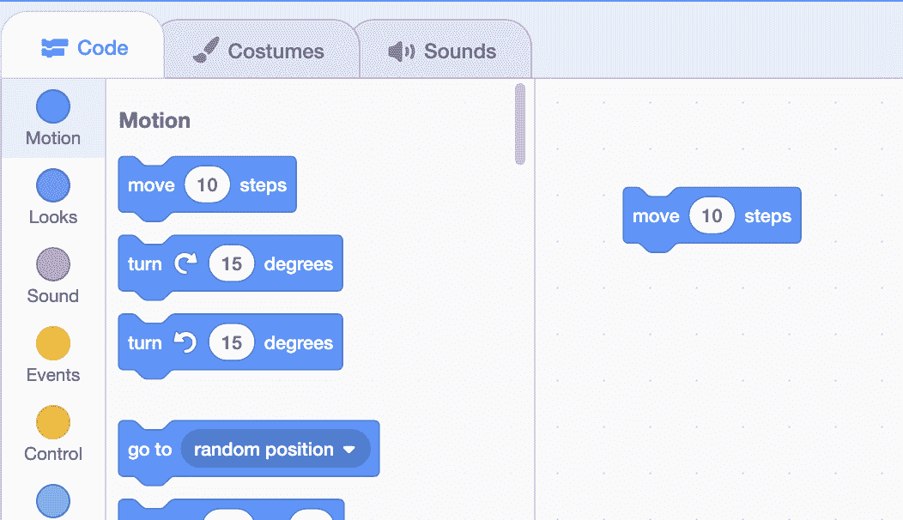
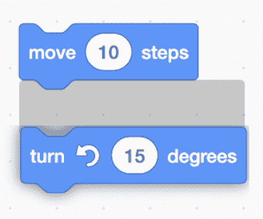

# 函数

> 原文：[`cs50.harvard.edu/scratch/notes/2/`](https://cs50.harvard.edu/scratch/notes/2/)

## 上次

+   上次，我们介绍了舞台和精灵，包括服装、声音和背景。但我们通过点击和拖动等方式手动进行了所有更改。

+   我们将打开一个新的 Scratch 项目，并回忆起我们可以通过点击和拖动，或者更改其 x 和 y 坐标的值来在舞台上移动我们的猫。

## 函数

+   在 Scratch 界面的左侧，我们将看到积木块。

+   在 Scratch 的上下文中，**函数**是指执行某些任务的积木块。

+   例如，第一个积木块说“移动 10 步”，我们可以通过将其从积木块库拖到左侧，拖到项目中心的编辑部分来使用它。

    

+   现在，我们已经添加了我们的第一个函数，如果我们点击这个积木块，我们会看到我们的猫会稍微向右移动，并且它的位置 x 值也更新了。

+   我们可以在[移动](https://scratch.mit.edu/projects/507421820/)中看到这个例子。

### 输入

+   注意，在积木块中有一个值为 10 的区域，我们可以更改它。这个值被称为函数的**输入**，或者函数可以用来改变其行为的信息。

+   对于移动积木块，输入是一个表示移动步数的数字。我们可以将其更改为移动我们的猫 30 步，例如：

    [PRE0]

+   我们还可以添加其他积木块，例如：

    [PRE1]

+   我们可以在[移动和转向](https://scratch.mit.edu/projects/507422307/)中看到这个例子。

## 脚本

+   我们可能希望我们的积木块可以组合，以便可以按照多个指令的顺序执行。

+   我们可以通过将其中一个积木块拖向另一个积木块来将我们的两个积木块拼接在一起，当它们靠近时，我们会看到一个高亮显示的区域：

    

    +   释放鼠标后，我们会看到它们拼接在一起。

+   现在，我们的积木块堆叠可以被称为**脚本**，当我们点击其中一个积木块时，所有的积木块将按顺序从上到下运行：

    [PRE2]

    +   我们可以连续点击这个积木块堆叠，它们会使我们的猫沿圆形移动。

+   我们可以使用许多不同类别的积木块来编写我们的脚本。我们也可以尝试这个积木块：

    [PRE3]

+   如果我们想要删除一个积木块，我们可以按住控制键并点击，或者右键点击，并选择“删除积木块”选项。我们还可以将积木块拖回积木块库，如果我们在该区域内释放它，它就会消失。

### 四处走动

+   我们将删除我们的猫，并为我们的下一个程序选择一个新的精灵，[滑行](https://scratch.mit.edu/projects/507422729/)，其中我们的精灵将在舞台上移动。

+   让我们使用刺猬，我们首先使用“转到”积木块确保我们从左上角开始：

    [PRE4]

+   在之后，我们将使用另一个积木块将我们的刺猬移动到右上角：

    [PRE5]

+   然后我们想要移动到右下角：

    [PRE6]

+   最后，左下角，两个值都是负数：

    [PRE7]

+   当我们点击这个积木堆时，我们的刺猬似乎立即跳到了左下角。实际上，我们的计算机运行程序非常快，所以刺猬移动得如此之快，我们只看到了最终的位置。

+   我们可以使用一个不同的积木，称为“滑动”，在一段时间内移动。我们将把底部的三个“转到”积木从我们的脚本中拖出来，因为我们仍然想在顶部左边立即开始，并像之前一样为其他三个位置添加“滑动”积木：

    [PRE8]

+   现在，当我们再次通过点击积木堆来运行我们的脚本时，我们看到我们的刺猬像我们预期的那样移动。我们可以再添加一个滑动，这样它就会回到原始位置：

    [PRE9]

## 注释

+   我们的项目变得有些复杂，所以我们可以使用**注释**，或者对我们试图做什么的简短描述，作为我们自己的提醒或他人理解我们项目的指南。

+   我们可以通过控制点击或右键点击我们的积木堆，并使用“添加注释”来写注释，就像给我们自己的笔记，这不会影响我们程序的运行：

    [PRE10]

+   我们可以使用其他动作积木来改变我们精灵的方向，并以其他方式移动。

## 外观

+   现在，我们将点击左下角的“外观”类别积木，我们将拖走我们的其他积木，并拖入一个“说 Hello！”积木，用于[Say](https://scratch.mit.edu/projects/507423170/)：

    [PRE11]

+   现在，当我们点击这个积木时，一个话泡出现在我们的精灵旁边。

+   让我们再添加一个积木来告别：

    [PRE12]

+   但是当我们点击这个积木堆时，我们遇到了一个类似的错误，或者程序的问题：Scratch 运行这些积木如此之快，以至于我们没有时间看到“Hello!”，因为它立即变成了“Goodbye!”。

+   我们将用另一种类型的积木替换我们的积木：

    [PRE13]

    +   现在，我们有时间查看我们刺猬发送的每条消息。

### 服装

+   “外观”积木也可以改变我们精灵的服装，所以我们将删除我们的刺猬精灵并创建一个新的：这次是一个熊，在[Bear 1](https://scratch.mit.edu/projects/507423557/)。

+   结果表明，熊已经有了两种服装可供选择，“bear-a”和“bear-b”。

+   我们可以从使用积木选择我们熊的第一个服装开始，并将其放置在舞台的左边：

    [PRE14]

+   我们将添加积木使我们的熊在舞台上移动，并在之后站立起来：

    [PRE15]

+   我们可以尝试点击我们的四个积木堆，看看这个动作会发生。

+   现在，让我们通过点击底部右边的舞台面板中的“选择背景”按钮，选择“森林”和“树林和长椅”作为新的背景。

+   我们可以使用一个积木来确保我们的故事总是以“森林”背景开始：

    [PRE16]

    +   我们还会告诉我们的熊从左边开始，并切换其服装，使其不站立。

    +   这三个积木都会运行得非常快，所以它们看起来好像同时发生，但实际上它们仍然一个接一个地运行。在这种情况下，由于它们都运行得如此之快，它们的顺序并不重要。

+   现在，我们将用“滑动”方块告诉我们的熊像之前一样“走过”舞台：

    [PRE17]

    +   使用较大的 x 值，我们的熊将走出舞台的右侧。

    +   一旦它这样做，我们的背景将改变为另一个，就像我们的熊到达了一个新的区域。

+   然后，我们将让我们的熊“走进”舞台，从舞台左侧开始，停在中间：

    [PRE18]

+   现在，我们有一堆七个方块，当点击时，用我们的熊讲述一个故事。如果某些事情没有按预期工作，我们可能想尝试为熊的位置或滑过舞台所需的时间尝试不同的值。

+   还有两个可能有用的方块，“显示”和“隐藏”，可以使我们的精灵出现或消失：

    [PRE19]

## 声音，控制

+   “声音”类别的方块可以播放声音：

    [PRE20]

+   另一个有用的方块位于“控制”类别中，称为“等待”：

    [PRE21]

    +   这将告诉我们的精灵暂停并什么都不做，这样我们就可以控制项目的节奏。

+   我们将删除我们的熊，并将背景改回默认的白色背景。

+   我们将添加一个新的精灵，[鸭子](https://scratch.mit.edu/projects/507424907/)，并使用我们看到的方块来玩捉迷藏：

    [PRE22]

    +   现在，我们的鸭子将消失，然后再次出现并播放声音。

+   结果表明，我们可以录制自己的声音，从我们的电脑上传声音，甚至播放音符。

## 扩展

+   我们将删除我们的鸭子精灵，再次选择猫。在 Scratch 界面的左下角，我们有一个带有方块和加号的蓝色图标，用于添加**扩展**，或更多类别的方块：

    

### 音乐

+   我们将开始尝试[音乐](https://scratch.mit.edu/projects/507425280/)，通过尝试用这个方块播放音符：

    [PRE23]

    +   数字 60 对应某个音符或声音，0.25 拍表示它将播放多长时间。

    +   我们可以点击数字 60，这将显示一个钢琴键盘，当我们点击每个键时，我们可以看到音符编号的变化并听到它将听起来像什么。

+   我们将使用这些方块中的八个，并按顺序播放键盘上的所有白键：

    [PRE24]

    +   现在，当我们点击这个方块堆时，我们将听到一个音阶被演奏。

+   我们还可以更改乐器，使音符听起来不同：

    [PRE25]

    +   我们将这个方块拖到堆栈的顶部，以便它在音符播放之前运行。

+   我们还可以通过改变节奏来更快或更慢地播放我们的音符：

    [PRE26]

    +   一个更大的数字，如 80，将使音符播放得更快，而一个较小的数字，如 40，将使音符播放得更慢。

### 笔

+   我们将尝试另一个扩展，笔扩展。有了这个，我们可以在舞台上移动我们的精灵，并在舞台上“绘制”时虚拟放下笔。让我们看看[笔](https://scratch.mit.edu/projects/507425660/)的例子。

+   我们将首先放下笔，移动 30 步，然后拾起笔：

    [PRE27]

    +   我们可以点击这个方块堆，我们的猫将继续移动 30 步并在移动时绘制线条。

+   当我们“拿起”笔时，我们的精灵在移动时将不再绘制。我们可以让我们的猫画一个圆圈：

    [PRE28]

    +   现在我们点击这个积木堆时，我们的猫会移动一点，旋转，并画一个圆圈。

## 下次

+   通过使用运动、外观、声音和控制类别中的积木，以及其他来自扩展的类型，我们可以用 Scratch 创建各种故事和程序。

+   下次，我们将看到如何使用更多类型的积木，结合我们所学的内容，将我们的项目推进得更远。
