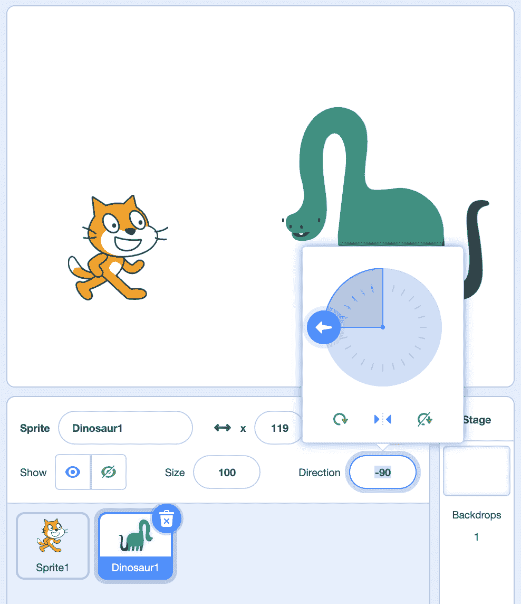
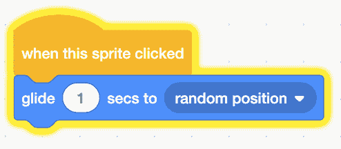
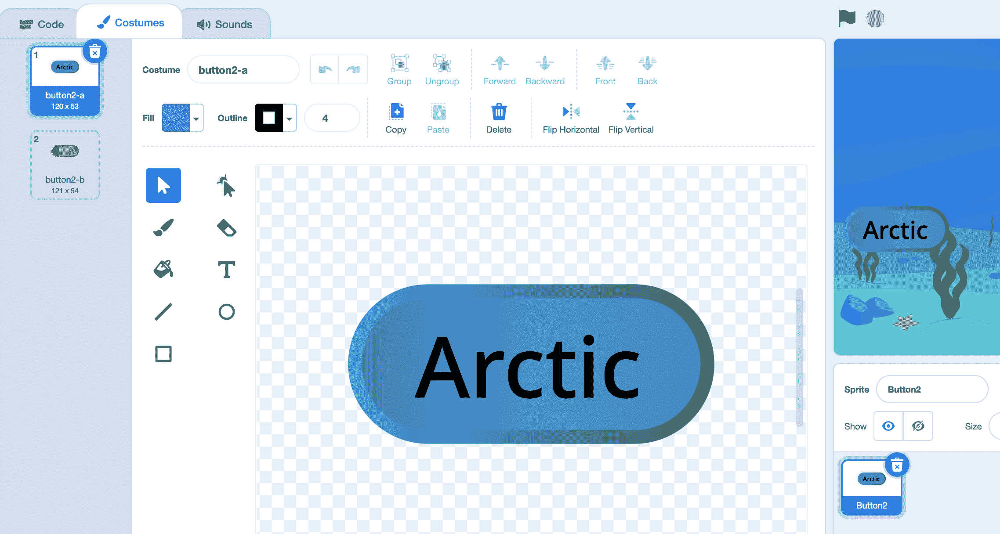
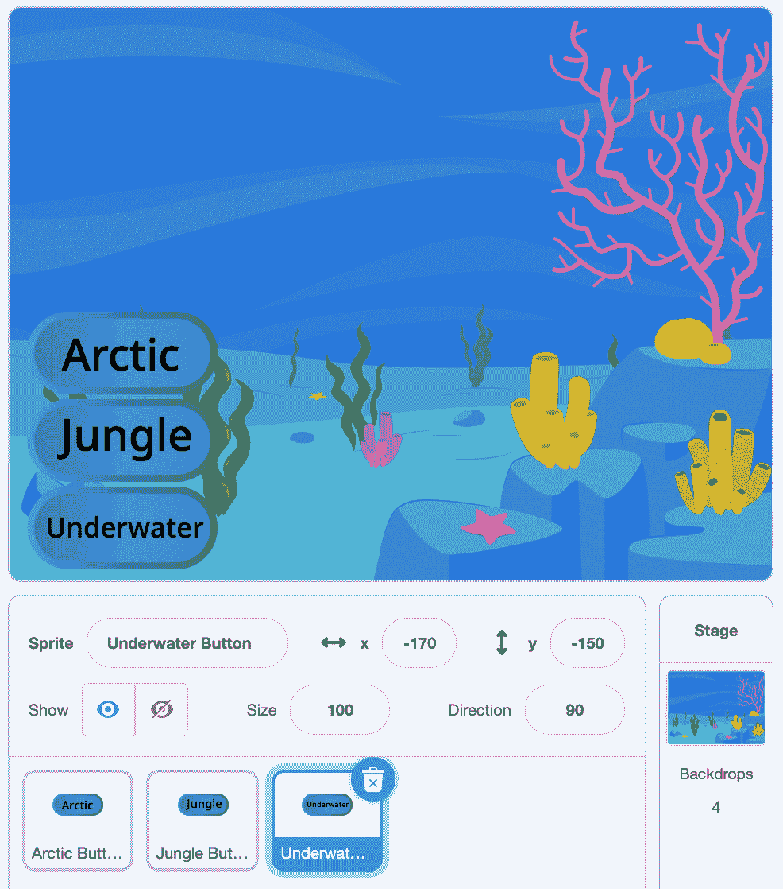

# 事件

> 原文：[`cs50.harvard.edu/scratch/notes/3/`](https://cs50.harvard.edu/scratch/notes/3/)

## 上次

+   上次，我们通过组装堆叠的块来组合指令序列或函数。

+   我们使用函数在舞台上移动我们的角色或精灵，绘制，播放声音等。

## 事件

+   我们将从一个带有猫的新程序开始，并从一个我们之前见过的块开始：

    ```
     say [Hello!] for (2) seconds 
    ```

    +   现在，我们可以让我们的猫每次点击块时都这样做。

+   但我们可能想让我们的猫对我们或另一个精灵做出反应。

+   我们将添加一个恐龙精灵，并让它面对我们的两个精灵：

    

+   我们还将为恐龙添加相同的块，但现在如果我们想让我们的猫和恐龙都说你好，我们必须非常快速地分别点击它们的这些块。

+   使用多个脚本和精灵，我们可能无法快速完成。如果能通过点击一个按钮来启动我们的项目，并自动运行所有脚本会更好。

+   事实证明，Scratch 在舞台的左上角有一个看起来像绿色标志的按钮，可以启动我们的项目。但现在点击它没有任何反应。

+   我们需要在事件类别下添加一个新的块类别。在编程中，**事件**只是在我们程序中发生的事情，我们的代码可以对其做出响应。

+   因此，我们将拖出一个名为“当标志被点击时”的事件块，并将我们的“说你好”块附加到它上面：

    ```
     when green flag clicked
      say [Hello!] for (2) seconds 
    ```

    +   现在，我们的代码已附加到标志被点击的事件。当我们点击绿色标志时，我们的恐龙说你好。

    +   由于事件是触发我们代码其余部分运行的原因，因此无法将任何内容附加到此脚本的开始处。

+   我们可以选择猫精灵，并通过在其脚本开头添加一个“当标志被点击”块来执行相同操作。现在，当我们点击绿色标志时，我们的两个精灵都说你好。

+   事实上，现在别人可以通过点击绿色标志来运行我们的项目[当标志被点击](https://scratch.mit.edu/projects/507426433/)，而不必知道块的外观以及要点击哪个。

### 当精灵被点击

+   我们将移除我们的猫和恐龙，并为我们的下一个示例添加一只鸭子[当精灵被点击](https://scratch.mit.edu/projects/507426938/)。

+   现在，我们将使用一个名为“当这个精灵被点击时”的块，当我们的精灵被点击时，下面的代码将运行：

    ```
     when this sprite clicked
      go to (random position v) 
    ```

    +   现在，当我们点击舞台上的鸭子时，它会移动到随机位置。我们也可以用“滑动”块替换“前往”块，使它移动得更平滑。

+   注意，当我们点击舞台上的精灵时，脚本也会在运行时亮起：

    

## 背景选择器

+   现在，我们可以构建一个像计算机程序中的按钮一样工作的东西，当按下按钮时会发生某些事情，在[背景选择器](https://scratch.mit.edu/projects/507427209/)。

+   我们将添加一些背景到我们的项目中，并添加一个名为 Button2 的精灵。我们将按钮拖到屏幕的左侧，并在其服装中添加一些文本：

    

+   现在，我们将回到代码选项卡，并将事件和外观类别中的积木组合起来：

    ```
     when this sprite clicked
      switch backdrop to (Arctic v) 
    ```

    +   然后，当我们点击这个按钮时，背景将会改变。

+   我们可以右键点击，或者控制点击精灵，并选择“复制”项来复制它。我们将其中一个重命名为“北极按钮”，另一个重命名为“丛林按钮”。然后，我们可以将“丛林按钮”的服装中的文本改为“丛林”。

+   注意，代码编辑器的右上角将有一个当前精灵的略透明版本，这样我们就可以知道我们在更改哪个脚本。我们将更改代码以将此按钮的背景切换到“丛林”：

    ```
     when this sprite clicked
      switch backdrop to (Jungle v) 
    ```

+   我们将“丛林按钮”拖到左侧，在“北极按钮”下方，并为名为“水下按钮”的按钮重复此过程。该按钮的积木将是：

    ```
     when this sprite clicked
      switch backdrop to (Underwater 1 v) 
    ```

+   我们将按钮像这样堆叠在舞台上：

    

+   现在，任何使用我们项目的人都可以与之互动，将舞台改变成他们喜欢的样子。

## 鼓组

+   我们将我们的背景改回普通的白色背景，并添加一些新的精灵。

+   我们将选择几个乐器，“鼓-军鼓”，“康加鼓”和“钹”，并将它们排列在我们的舞台上的[鼓组](https://scratch.mit.edu/projects/507447260/)。

+   对于它们中的每一个，我们将在事件类别中添加“当这个精灵被点击”积木，并在声音类别中添加一个“播放声音”积木：

    ```
     when this sprite clicked
      play sound (tap snare v) until done 
    ```

    +   我们将对每个乐器都这样做，每个乐器都有与之匹配的不同声音。

+   现在，我们有一个“鼓组”，我们可以通过点击这些精灵中的任何一个来演奏。

+   回想一下，点击是一个事件，我们的代码正在对这些事件做出响应。

## 游泳的鱼

+   我们将移除鼓，并添加一条鱼。我们将使用“当按键按下”积木为它在[游泳的鱼](https://scratch.mit.edu/projects/507447918/)中启动一个新的脚本：

    ```
     when [space v] key pressed
      play sound (bubbles v) until done 
    ```

    +   现在，当我们按下键盘上的空格键时，我们的鱼将会播放声音。

+   我们可以点击下拉菜单来自定义“当按键按下”积木以响应其他按键。

+   我们将其改为：

    ```
     when [right arrow v] key pressed
      change x by (10) 
    ```

    +   我们将使用“移动”积木，当按下右箭头键时，将我们的精灵位置的 x 值移动 10 步。

+   我们将右键点击，或者控制点击这个脚本，并选择“复制”选项来复制这两个积木。我们将点击将其放置在鱼精灵的代码编辑器中，并将新的脚本改为响应左箭头：

    ```
     when [left arrow v] key pressed
      change x by (-10) 
    ```

+   但是我们的鱼是向后移动的，所以我们将首先添加积木来确保当按下右箭头键时它面向右边：

    ```
     when [right arrow v] key pressed
      point in direction (90)
      change x by (10) 
    ```

    +   回想一下，我们可以使用精灵面板中的旋钮来检查用于方向值的数字是多少。

+   接下来，我们确保当按下左箭头键时它面向左边：

    ```
     when [left arrow v] key pressed
      point in direction (-90)
      change x by (-10) 
    ```

    +   我们一开始的鱼是倒置的，所以我们需要在精灵面板中将旋转样式设置为“左右”。我们也可以使用一个“设置旋转样式”的积木来帮我们完成这个操作。

+   我们将重复这个操作，以便我们的鱼可以向上移动……

    ```
     when [up arrow v] key pressed
      change y by (10) 
    ```

+   …以及向下：

    ```
     when [down arrow v] key pressed
      change y by (-10) 
    ```

+   现在，我们有了编程精灵在舞台上移动的能力，以响应按键。

## 改变大小

+   我们将添加几个额外的脚本，当按下数字时改变鱼的大小：

    ```
     when [1 v] key pressed
      set size to (50) %

      when [2 v] key pressed
      set size to (100) %

      when [3 v] key pressed
      set size to (200) % 
    ```

    +   使用这些积木，我们可以像之前一样移动我们的鱼在舞台周围，通过按 1、2 或 3 键来改变它的大小或小。

## 响度

+   我们将删除我们的鱼，并将背景改回纯白色背景，并为[Balloon](https://scratch.mit.edu/projects/507448632/)添加一个新的气球精灵。

+   让我们尝试使用事件类别中的另一个积木，“当响度大于”。我们的浏览器可能会要求我们允许使用麦克风，因为 Scratch 将会监听我们的麦克风。

+   我们将拖出这个积木，并添加一个积木来改变气球的大小，当 Scratch 听到的响度大于 30 时：

    ```
     when [loudness v] > (30)
      change size by (10) 
    ```

    +   响度值为 0 就像静音一样，100 将会非常非常响，所以我们可以尝试不同的数字来设置 Scratch 要监听的响度级别。

    +   然后，下面的代码将会响应。现在，当我们为麦克风制造噪音以便它能够听到时，我们的气球会越来越大。

## 计时器

+   我们也可以更改积木下拉菜单中的值，从“响度”改为“计时器”：

    ```
     when [timer v] > (30) 
    ```

    +   结果表明，当我们通过点击标志开始我们的项目时，有一个计时器在跟踪已经过去的时间。

    +   因此，这个积木会在计时器达到特定数字时执行一些代码。

+   我们将把我们的猫和恐龙放回[Timer](https://scratch.mit.edu/projects/507449066/)，并且对于我们的猫，我们将使用之前的相同脚本：

    ```
     when green flag clicked
      say [Hello!] for (2) seconds 
    ```

+   至于我们的恐龙，我们将让它点击标志后等待两秒钟：

    ```
     when [timer v] > (2)
      say [Hello!] for (2) seconds 
    ```

+   现在，当我们点击绿色标志时，我们的猫会先说你好，然后我们的恐龙会等待后再说你好。

+   每次我们通过点击绿色标志开始我们的项目时，计时器都会重置为 0，并计算项目开始或停止再次之前的秒数。

## 当背景切换时

+   还有其他的事件，比如这个积木：

    ```
     when backdrop switches to ( v) 
    ```

    +   现在，如果背景切换，我们可以让一个精灵执行一些动作。

+   通过使用这些事件积木，我们可以使我们的 Scratch 项目交互式，并响应各种事件，如点击或按键。
